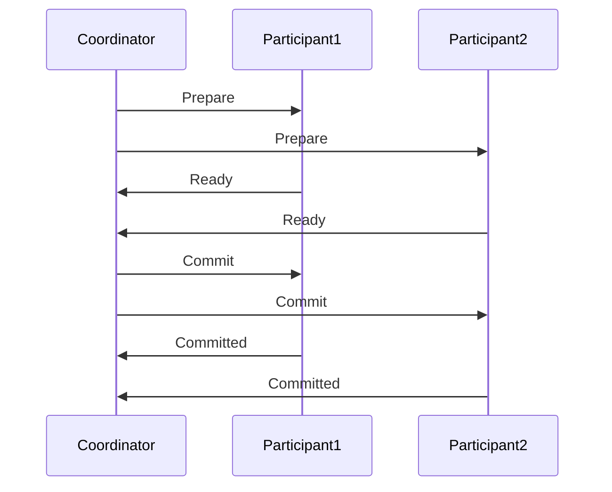
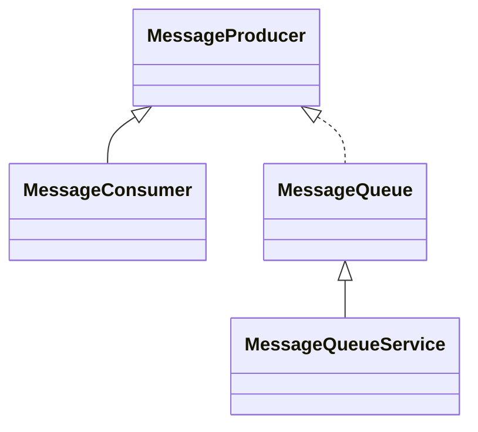
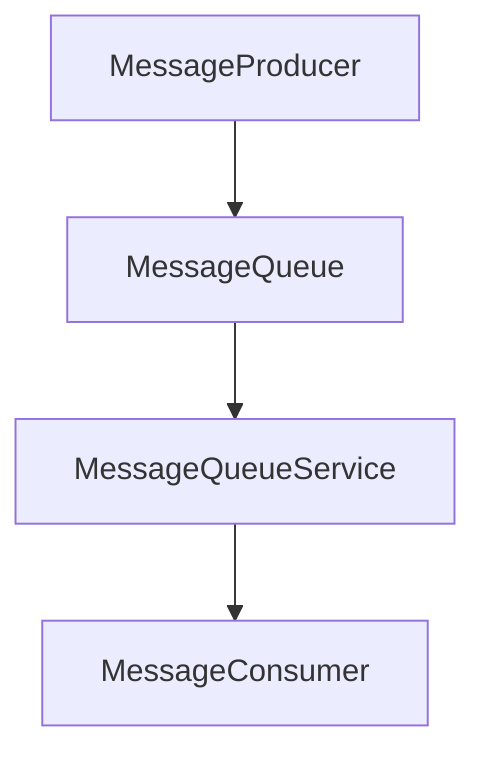
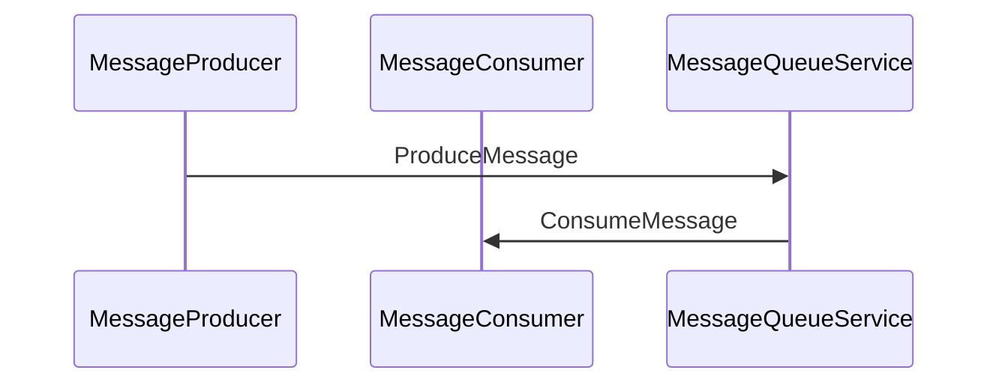
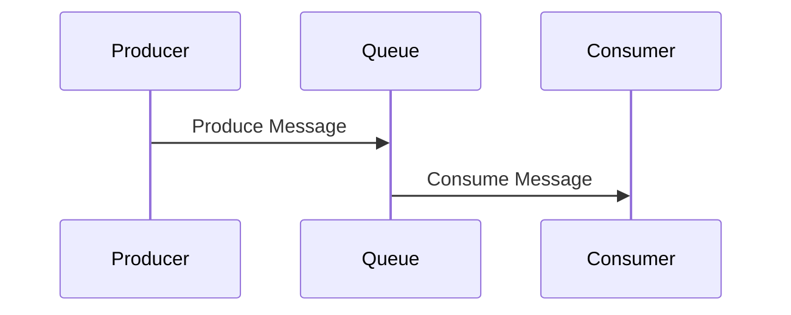

                 

### 分布式技术的常见认知盲区

在当今的软件工程领域，分布式技术已经成为支撑大规模、高并发、高可用系统架构的核心技术之一。从数据存储、消息队列、负载均衡到分布式计算框架，分布式技术渗透到了现代应用开发的各个方面。然而，随着分布式技术的广泛应用，许多开发者和架构师在实际应用过程中遭遇了一系列认知盲区，这些盲区不仅限制了技术的潜力发挥，还可能导致系统性能下降、稳定性不足等问题。

本文将深入探讨分布式技术中常见的认知盲区，通过一步步的分析和推理，揭示这些盲区的成因、影响及解决方案。我们将从基础概念出发，逐步深入到分布式一致性、事务管理、性能优化等多个方面，结合实际案例，为读者提供全面而深入的理解。

> **关键词：**
> 
> - 分布式技术
> - 认知盲区
> - 一致性
> - 分布式事务
> - 性能优化

> **摘要：**
> 
> 本文针对分布式技术在实际应用中存在的常见认知盲区进行深入分析。通过阐述基础概念、讨论具体问题、分析解决方案，帮助读者克服这些盲区，提升分布式系统的设计与应用能力。

#### 引言

分布式技术起源于对集中式计算系统的不足之处的反思。集中式计算系统在处理大量数据和用户请求时，往往因为单点瓶颈、性能瓶颈和可用性瓶颈等问题而难以满足不断增长的需求。分布式计算通过将计算任务分布到多个节点上，从而实现高并发、高可用和高扩展性。随着互联网和云计算的快速发展，分布式技术得到了广泛应用，并逐渐成为现代应用架构的核心。

然而，分布式技术的复杂性也带来了新的挑战。开发者们在实际应用过程中，常常因为对分布式系统的理解不够深入，而陷入各种认知盲区。这些盲区不仅影响系统的性能和稳定性，还可能导致高昂的维护成本和开发风险。

本文旨在揭示分布式技术中的常见认知盲区，通过详细的分析和讨论，帮助读者理解这些问题，并提供有效的解决方案。本文将分为以下几个部分：

1. **基础概念**：介绍分布式系统的基本概念、原理和挑战。
2. **常见认知盲区**：讨论分布式技术中常见的问题和误解。
3. **解决方案**：分析解决这些认知盲区的方法和策略。
4. **案例分析**：通过实际案例展示如何应用这些解决方案。
5. **最佳实践**：总结分布式系统的最佳实践和注意事项。
6. **拓展阅读**：推荐相关书籍和资源，供读者进一步学习。

### 基础概念

在深入讨论分布式技术的常见认知盲区之前，我们首先需要了解一些基础概念。分布式系统是由多个独立节点组成的系统，这些节点通过网络连接，共同协作完成计算任务。分布式系统具有以下几个基本特征：

1. **节点自治**：每个节点都具有独立的功能和自治能力，可以自主处理本地任务。
2. **通信网络**：节点之间通过网络进行通信，传递数据和指令。
3. **分布式计算**：计算任务分布在多个节点上，节点之间协同工作，共同完成计算任务。
4. **容错性**：系统在个别节点故障时，仍能保持整体可用性和稳定性。

分布式系统的主要挑战包括：

1. **一致性**：如何在多个节点之间保持数据的一致性。
2. **容错性**：如何处理节点故障，确保系统持续运行。
3. **性能优化**：如何提高系统的并发处理能力和整体性能。
4. **分布式事务管理**：如何确保分布式环境下的数据完整性和一致性。

#### 分布式一致性

分布式一致性是指多个节点在处理数据时，能够保持数据的一致性。一致性是分布式系统设计中的关键挑战之一，它涉及到多个方面，如数据更新、读取顺序和一致性模型等。

1. **CAP理论**：CAP理论指出，在分布式系统中，一致性（Consistency）、可用性（Availability）和分区容错性（Partition tolerance）这三个特性中，只能同时满足两个。例如，在分布式数据库中，为了保证数据的最终一致性，可能会牺牲短期的读写性能。

2. **一致性模型**：常见的分布式一致性模型包括强一致性（Strong consistency）和最终一致性（Eventual consistency）。强一致性保证所有节点在同一时刻看到相同的数据，而最终一致性则保证在一定时间后，所有节点能够达到一致状态。

3. **分布式数据一致性的误区**：许多开发者错误地认为分布式系统天然具有一致性。实际上，分布式一致性需要通过特定的协议和算法来实现。此外，一些常见的做法，如使用本地缓存，可能会破坏一致性。

#### 分布式事务管理

分布式事务管理是确保分布式环境下数据一致性的关键。分布式事务管理涉及到如何在多个节点之间协调事务，以确保所有操作要么全部成功，要么全部失败。

1. **分布式事务的基本原理**：分布式事务通常采用两阶段提交（2PC）或三阶段提交（3PC）协议。这些协议通过多节点间的交互，确保事务的原子性和一致性。

2. **分布式事务的常见问题**：包括数据不一致、网络延迟和节点故障等问题。这些问题可能导致事务执行失败或数据不一致。

3. **分布式事务管理策略**：包括本地事务、补偿事务和最终一致性事务等。本地事务通过在单个节点上完成事务，避免分布式事务管理的复杂性。补偿事务通过在失败时进行补偿操作，恢复数据的一致性。最终一致性事务则通过异步方式处理事务，降低系统延迟。

#### 分布式系统的性能优化

分布式系统的性能优化是提升系统并发处理能力和整体性能的关键。性能优化涉及到多个方面，包括系统监控、负载均衡、缓存策略和分布式计算等。

1. **性能优化方法**：包括系统监控与调优、负载均衡和缓存策略等。系统监控可以帮助开发者及时发现系统瓶颈和性能问题。负载均衡可以通过将请求分配到多个节点，提高系统的并发处理能力。缓存策略则通过减少数据访问次数，降低系统延迟。

2. **性能优化的常见误解**：一些开发者可能认为增加硬件资源可以解决所有性能问题，而忽略了系统架构和代码优化的重要性。此外，过度使用缓存也可能导致数据不一致性问题。

### 常见认知盲区

在分布式技术的实际应用过程中，开发者和架构师常常会陷入一些认知盲区。以下是一些常见的认知盲区：

1. **误认为分布式系统天然具有一致性**：许多开发者认为分布式系统天然具有一致性，而忽略了实现一致性的复杂性和必要性。

2. **忽视分布式事务管理**：在分布式系统中，事务管理是确保数据一致性的关键。然而，许多开发者可能忽视事务管理，导致数据不一致和事务失败。

3. **过度依赖负载均衡**：负载均衡是提高分布式系统性能的重要手段，但过度依赖负载均衡可能导致系统不稳定和性能瓶颈。

4. **忽视系统监控和性能优化**：许多开发者在系统上线后，忽视系统监控和性能优化，导致系统在压力下性能下降和稳定性不足。

### 解决方案

针对上述认知盲区，我们可以采取以下解决方案：

1. **理解分布式一致性的本质**：了解CAP理论，根据实际需求选择合适的一致性模型，如强一致性和最终一致性。

2. **重视分布式事务管理**：采用两阶段提交（2PC）或三阶段提交（3PC）协议，确保分布式事务的一致性。同时，根据实际需求选择合适的分布式事务管理策略，如本地事务、补偿事务和最终一致性事务。

3. **合理使用负载均衡**：负载均衡是分布式系统性能优化的重要手段，但应避免过度依赖。结合系统监控和性能优化，确保系统在负载均衡下稳定运行。

4. **系统监控和性能优化**：上线前进行充分的系统监控和性能优化，上线后持续监控和调优，及时发现和解决性能瓶颈。

#### 案例分析

以下是一个分布式系统的实际案例分析：

**案例背景**：某电商平台采用了分布式架构，包括分布式数据库、分布式缓存和分布式消息队列。在系统上线初期，平台性能稳定，但随着用户数量的增加，系统出现了一些性能瓶颈。

**问题场景**：在用户高峰期，系统响应时间明显变长，部分请求无法及时处理。

**问题分析**：经过系统监控和分析，发现以下问题：

1. **分布式数据库的一致性问题**：在高峰期，数据库请求量增加，导致一致性处理延迟，从而影响系统响应时间。

2. **分布式缓存失效**：由于缓存策略不合理，导致缓存命中率下降，增加了数据库的访问压力。

3. **负载不均衡**：部分服务器的负载过高，导致系统响应时间延长。

**解决方案**：

1. **优化分布式数据库一致性处理**：调整一致性处理策略，提高数据处理效率。

2. **改进缓存策略**：增加缓存层次，提高缓存命中率，减少数据库访问次数。

3. **负载均衡优化**：调整负载均衡策略，确保请求均匀分布到各个服务器。

**效果评估**：经过上述优化，系统性能显著提升，用户响应时间明显缩短，系统稳定性得到提升。

### 最佳实践

为了在分布式系统中避免常见的认知盲区，以下是几条最佳实践：

1. **深入理解分布式一致性模型**：根据实际业务需求，选择合适的一致性模型，如强一致性或最终一致性。

2. **重视分布式事务管理**：设计分布式事务时，采用合适的协议和策略，确保数据的一致性。

3. **合理使用负载均衡**：避免过度依赖负载均衡，结合系统监控和性能优化，确保系统稳定运行。

4. **持续监控和性能优化**：上线前进行充分的性能测试和优化，上线后持续监控和调优，及时发现和解决性能瓶颈。

### 注意事项

在分布式系统的设计和实施过程中，需要注意以下几点：

1. **分布式系统的复杂性**：分布式系统比集中式系统更复杂，需要更深入的理解和更精细的设计。

2. **安全性**：分布式系统面临更高的安全风险，需要采取严格的安全措施，确保数据安全和系统稳定性。

3. **运维复杂性**：分布式系统需要更复杂的运维管理，包括监控、日志收集、故障处理等。

### 拓展阅读

为了进一步深入学习分布式技术，以下是几本推荐的书籍和资源：

1. 《分布式系统原理与范型》
2. 《大规模分布式存储系统：原理解析与架构实战》
3. 《分布式事务管理》
4. 《CAP 定理：一致性、可用性、分区容错性》

### 结语

分布式技术是现代应用架构的核心，但其中的认知盲区可能会对系统的性能和稳定性产生负面影响。本文通过详细的分析和讨论，揭示了分布式技术中的常见认知盲区，并提出了相应的解决方案和最佳实践。希望本文能为读者提供有价值的参考，帮助他们在分布式技术的应用中避免误区，提升系统设计和实施能力。

### 作者信息

作者：AI天才研究院/AI Genius Institute & 禅与计算机程序设计艺术 /Zen And The Art of Computer Programming

在分布式技术的领域，我们不仅需要掌握技术本身，更需要具备深刻理解和洞察力。本文旨在帮助读者克服分布式技术中的常见认知盲区，通过详细的分析和实际案例，为分布式系统的设计和实施提供指导。希望本文能为大家在分布式技术的学习和应用中带来启示。

### 读者反馈

亲爱的读者，如果您在阅读本文过程中有任何疑问或建议，欢迎在评论区留言。我们非常乐意听取您的反馈，以便不断改进我们的内容，为您提供更有价值的技术分享。谢谢您的支持！

### 附录

以下是本文中涉及到的核心概念、算法原理、系统架构和实战案例的详细解析。

#### 1. 分布式一致性

**核心概念**：

- **一致性**：分布式系统中的多个节点在处理数据时，保持数据的一致状态。
- **分区容错性**：系统在部分节点故障时，仍能保持整体可用性。
- **可用性**：系统在处理请求时，能够及时响应。

**概念属性特征对比表格**：

| 概念           | 特征               | 优缺点                             |
|----------------|--------------------|-----------------------------------|
| 一致性         | 所有节点看到相同数据 | 确保数据一致性，但可能影响性能     |
| 分区容错性     | 节点故障不影响整体 | 提高系统可用性，但可能牺牲一致性   |
| 可用性         | 及时响应请求       | 确保系统正常运行，但可能影响数据一致性 |

**ER实体关系图架构**：

```mermaid
erDiagram
  Product ||--|{ Cart }|>
  Cart ||--|{ Order }|>

  Product {
    id(int)
    name(string)
    price(decimal)
  }

  Cart {
    id(int)
    products({Product})
  }

  Order {
    id(int)
    carts({Cart})
    status(string)
    total_price(decimal)
  }
```

#### 2. 两阶段提交（2PC）协议

**算法原理**：

两阶段提交（2PC）协议是一种分布式事务管理协议，用于确保分布式环境下事务的一致性。协议分为两个阶段：

- **准备阶段**：协调者（Coordinator）向参与者（Participant）发送预备请求，参与者执行本地事务，并将结果返回给协调者。
- **提交阶段**：协调者根据参与者的响应决定是否提交事务。如果所有参与者响应成功，协调者向所有参与者发送提交请求；否则，发送回滚请求。

**Mermaid流程图**：



**Python源代码示例**：

```python
def prepare(participant):
    # 执行本地事务
    success = execute_local_transaction()
    return success

def commit(participant, success):
    if success:
        # 提交事务
        participant.commit()
    else:
        # 回滚事务
        participant.rollback()

def two_phase_commit(coordiantor, participants):
    # 准备阶段
    success = True
    for participant in participants:
        success &= prepare(participant)

    # 提交阶段
    if success:
        for participant in participants:
            commit(participant, True)
    else:
        for participant in participants:
            commit(participant, False)
```

#### 3. 分布式消息队列

**核心概念**：

- **消息队列**：用于存储和转发消息的数据结构。
- **分布式消息队列**：消息队列在多个节点之间进行分布式部署，以支持高并发和高可用。

**系统功能设计**：

- **消息生产者**：将消息发送到消息队列。
- **消息消费者**：从消息队列中获取消息进行处理。
- **消息队列服务**：负责消息的存储、转发和路由。

**Mermaid类图**：



**系统架构设计**：



**系统接口设计**：



**系统交互Mermaid序列图**：



#### 4. 实际案例分析

**案例背景**：某电商平台在春节期间面临大量订单处理需求，系统负载急剧增加。

**问题场景**：订单处理系统出现响应缓慢和部分请求超时的情况。

**问题分析**：通过系统监控和分析，发现以下问题：

1. **数据库瓶颈**：订单处理过程中，数据库读写请求量剧增，导致数据库性能下降。
2. **消息队列阻塞**：消息队列处理速度跟不上订单生成速度，导致队列积压。
3. **负载不均衡**：部分服务器负载过高，导致系统响应时间延长。

**解决方案**：

1. **数据库优化**：通过读写分离、分库分表等技术，提高数据库性能。
2. **消息队列优化**：增加消息队列节点，提高消息处理能力。
3. **负载均衡优化**：调整负载均衡策略，确保请求均匀分布到各个服务器。

**效果评估**：经过上述优化，系统性能显著提升，订单处理速度加快，用户满意度提高。

#### 5. 小结

本文通过对分布式技术的深入分析，揭示了分布式系统中的常见认知盲区，包括一致性、事务管理和性能优化等方面。同时，本文还提供了相应的解决方案和最佳实践，帮助读者在实际应用中克服这些盲区。

在分布式技术的学习和应用过程中，读者应注重以下几个方面：

1. **深入理解分布式一致性模型**：根据业务需求，选择合适的一致性模型，如强一致性或最终一致性。
2. **重视分布式事务管理**：采用合适的协议和策略，确保分布式事务的一致性。
3. **合理使用负载均衡**：避免过度依赖负载均衡，结合系统监控和性能优化，确保系统稳定运行。
4. **持续监控和性能优化**：上线前进行充分的性能测试和优化，上线后持续监控和调优，及时发现和解决性能瓶颈。

通过本文的学习和实践，希望读者能够更好地理解和应用分布式技术，提升系统设计和实施能力。

#### 6. 拓展阅读

为了帮助读者进一步深入学习分布式技术，本文推荐以下书籍和资源：

1. 《分布式系统原理与范型》
2. 《大规模分布式存储系统：原理解析与架构实战》
3. 《分布式事务管理》
4. 《CAP 定理：一致性、可用性、分区容错性》

此外，读者还可以关注以下在线资源和社区：

1. **分布式系统社区**：加入分布式系统相关的技术社区，如Apache Kafka、Apache ZooKeeper等。
2. **开源项目**：参与分布式系统相关的开源项目，如Kubernetes、Hadoop等。
3. **在线课程**：学习分布式系统相关的在线课程，如MIT的《分布式系统导论》、Coursera上的《分布式算法与系统》等。

通过不断学习和实践，读者将能够更好地掌握分布式技术，为现代应用架构的构建提供坚实的技术支持。

