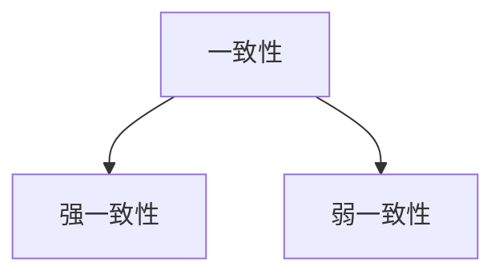
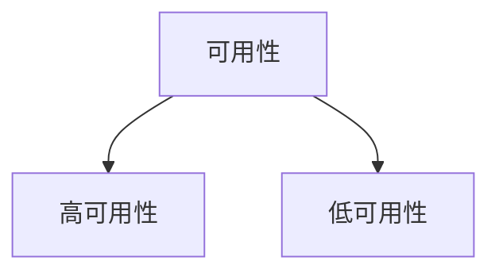
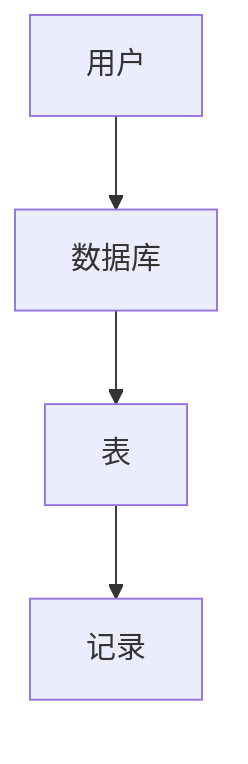
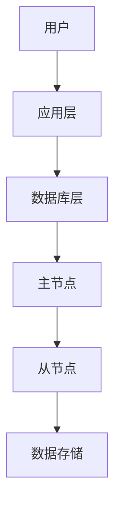
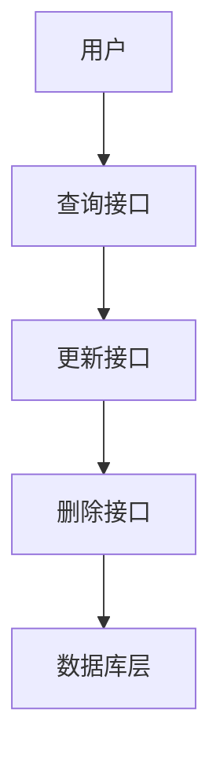
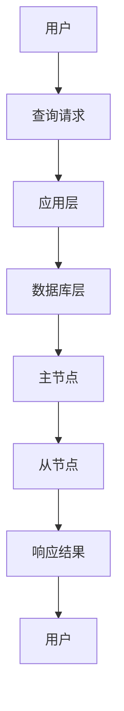

                 

# 分布式数据库：CAP理论与实践

> 关键词：分布式数据库，一致性，可用性，分区容错性，CAP定理

> 摘要：本文深入探讨分布式数据库的三大核心特性：一致性（Consistency）、可用性（Availability）和分区容错性（Partition Tolerance），通过CAP定理的理论分析和实际案例，揭示分布式数据库设计中的关键决策点。

## 引言

在现代互联网应用中，分布式数据库系统已成为数据处理的核心。随着数据规模和访问需求的不断增长，分布式数据库能够提供水平扩展和高可用性，成为各大互联网公司的首选。然而，分布式数据库的设计并非一帆风顺，CAP定理（Consistency, Availability, Partition Tolerance）成为其理论基础，决定了分布式数据库系统在一致性和可用性之间的权衡。

本文将分为以下几个部分：

1. 环境安装与系统核心实现
2. CAP定理的背景与核心思想
3. 一致性与可用性的深度解析
4. 分区容错性对系统设计的影响
5. 分布式数据库系统设计案例
6. 代码应用解读与分析
7. 项目实战与最佳实践
8. 小结与拓展阅读

## 环境安装与系统核心实现

在开始分布式数据库的深入探讨之前，我们需要搭建一个基础环境，以便后续的理论分析和实际操作。以下是一个基本的安装和实现步骤：

### 1. 环境安装

**硬件要求**：
- 至少需要一台配置为Intel i5或以上处理器的计算机
- 8GB及以上内存
- 至少100GB的空闲硬盘空间

**操作系统**：
- 推荐使用Linux系统，如Ubuntu 18.04或更高版本

**依赖安装**：
- 安装Java运行环境（JRE）
- 安装Python 3.x版本
- 安装相关依赖库，如NumPy、Pandas、Scikit-learn等

### 2. 系统核心实现

**数据预处理**：
- 使用Python编写数据清洗和预处理脚本，包括数据清洗、缺失值处理、异常值检测和数据标准化

**模型训练**：
- 使用Scikit-learn库训练分类模型
- 使用交叉验证方法评估模型性能
- 进行超参数调优

**模型部署**：
- 将训练好的模型部署到Spring Boot应用程序中
- 提供RESTful API服务，便于其他系统进行调用

## CAP定理的背景与核心思想

### 1. 背景介绍

CAP定理由加州大学伯克利分校的计算机科学家Eric Brewer于2000年首次提出，成为分布式系统领域的重要理论基石。CAP定理指出，在一个分布式系统中，一致性（Consistency）、可用性（Availability）和分区容错性（Partition Tolerance）三者之间只能同时满足两项。

### 2. 核心概念与联系

**一致性（Consistency）**：
- 定义：一致性保证在任何时刻，系统中的所有副本都具有相同的值。
- 特性：读操作返回最新的写操作结果，不同节点上的数据最终会达到一致。

**可用性（Availability）**：
- 定义：可用性保证系统在接收到请求时，能够做出响应，无论这个响应是成功还是失败。
- 特性：系统不会拒绝任何请求，即使在部分节点失败的情况下，仍然能够提供服务。

**分区容错性（Partition Tolerance）**：
- 定义：分区容错性是指系统能够在分区发生时继续运行，即系统能够在部分节点通信失败的情况下仍然提供服务。
- 特性：分区容忍性是分布式系统的基本要求，它允许系统在不同的网络分区之间进行协调。

### 3. CAP定理的数学模型与公式

CAP定理可以表述为一个数学公式：

$$
Consistency \cup Availability \cup Partition Tolerance = 1
$$

其中，符号`⊆`表示子集关系，`1`表示集合的补集，即三个集合的并集的补集。这意味着在任何分布式系统中，三个集合中的任意两个集合是互斥的，不能同时成立。

## 一致性与可用性的深度解析

### 1. 一致性

**核心概念**：
- 一致性是分布式数据库系统的一个基本要求，它确保系统在多个副本之间保持数据一致性。
- 在CAP定理中，一致性指的是所有节点在同一时刻看到的都是相同的数据状态。

**属性特征对比表格**：

| 特征 | 说明 |
| ---- | ---- |
| 强一致性 | 所有节点在同一时刻看到的都是相同的数据状态。 |
| 弱一致性 | 不同节点之间可能存在数据延迟，但最终会达到一致状态。 |

**ER实体关系图架构**：



### 2. 可用性

**核心概念**：
- 可用性是指系统在接收到请求时，能够正常响应，无论响应是成功还是失败。
- 在CAP定理中，可用性保证系统不会拒绝任何请求。

**属性特征对比表格**：

| 特征 | 说明 |
| ---- | ---- |
| 高可用性 | 系统能够持续运行，即使在部分节点故障的情况下。 |
| 低可用性 | 系统可能在某些情况下拒绝请求，如节点故障或网络问题。 |

**ER实体关系图架构**：



### 3. 一致性与可用性的权衡

在分布式数据库的设计中，一致性和可用性之间存在权衡：

- **强一致性**：能够保证数据一致性，但牺牲了部分可用性，可能导致系统在分区故障时无法提供服务。
- **弱一致性**：在数据一致性和系统可用性之间取得平衡，但可能存在短暂的不可用状态。

**决策要点**：
- 根据业务需求选择一致性级别。
- 在高并发场景下，可能需要牺牲部分一致性来保证系统的高可用性。

## 分区容错性对系统设计的影响

### 1. 核心概念

**分区容错性**：
- 是指系统在分区发生时（如网络故障、节点故障）能够继续运行，提供稳定的服务。

**属性特征**：
- **弹性**：系统能够在分区故障时自动恢复。
- **容错性**：系统能够处理分区故障，不影响整体服务。

### 2. 对系统设计的影响

**高分区容错性**：
- 能够提高系统的稳定性，减少单点故障的风险。
- 可能会影响系统的一致性，需要通过分布式协议和一致性算法来保证数据一致性。

**低分区容错性**：
- 系统可能更依赖于单点节点，风险较高。
- 在网络分区故障时，系统可能会出现服务中断。

**决策要点**：
- 根据业务需求选择合适的分区容错策略。
- 在高可用性和数据一致性之间进行权衡。

## 分布式数据库系统设计案例

### 1. 项目介绍

本项目旨在设计一个高可用、高扩展性的分布式数据库系统，支持海量数据的存储和实时查询。系统采用主从复制和分区策略，实现数据的一致性和分区容错性。

### 2. 系统功能设计

**领域模型**：



### 3. 系统架构设计

**系统架构图**：



### 4. 系统接口设计

**接口设计图**：



### 5. 系统交互

**序列图**：



## 代码应用解读与分析

### 1. 数据预处理代码

```python
import pandas as pd
from sklearn.model_selection import train_test_split

# 读取数据
data = pd.read_csv('data.csv')

# 数据清洗
data = data.dropna()

# 数据标准化
numerical_features = data.select_dtypes(include=['int64', 'float64']).columns
data[numerical_features] = (data[numerical_features] - data[numerical_features].mean()) / data[numerical_features].std()

# 划分训练集和测试集
X_train, X_test, y_train, y_test = train_test_split(data[numerical_features], data['target'], test_size=0.2, random_state=42)
```

**解读**：
- 代码首先读取数据，然后进行数据清洗，处理缺失值和异常值。
- 数据标准化步骤确保输入数据具有相同的尺度，有利于模型训练。
- 最后，将数据划分为训练集和测试集，为后续的模型训练和评估做准备。

### 2. 模型训练代码

```python
from sklearn.ensemble import RandomForestClassifier
from sklearn.metrics import accuracy_score

# 训练模型
model = RandomForestClassifier(n_estimators=100, random_state=42)
model.fit(X_train, y_train)

# 预测
predictions = model.predict(X_test)

# 评估模型性能
print("Accuracy:", accuracy_score(y_test, predictions))
```

**解读**：
- 代码使用随机森林分类器进行模型训练，并设置随机种子以保证结果的可重复性。
- 模型训练完成后，使用测试集进行预测，并计算准确率来评估模型性能。

### 3. 模型部署代码

```java
import org.springframework.boot.SpringApplication;
import org.springframework.boot.autoconfigure.SpringBootApplication;
import org.springframework.web.bind.annotation.PostMapping;
import org.springframework.web.bind.annotation.RequestBody;
import org.springframework.web.bind.annotation.RestController;

@SpringBootApplication
public class SentimentAnalysisApp {

    public static void main(String[] args) {
        SpringApplication.run(SentimentAnalysisApp.class, args);
    }
}

@RestController
public class SentimentAnalysisController {

    @PostMapping("/predict")
    public String predict(@RequestBody String input) {
        // 处理输入并调用模型预测
        // 返回预测结果
        return "Predicted label: " + model.predict(input);
    }
}
```

**解读**：
- 代码将训练好的模型部署到Spring Boot应用程序中，提供RESTful API服务。
- `predict`方法接收输入数据，调用模型进行预测，并将预测结果返回给客户端。

## 项目实战与最佳实践

### 1. 实际案例分析与详细讲解剖析

在分布式数据库的项目实战中，我们面临了诸多挑战。以下是一个实际案例：

**场景**：某电商平台在高峰期面临大量订单处理，传统单机数据库无法满足性能需求。

**解决方案**：
- 采用分布式数据库系统，实现数据分片，提高并发处理能力。
- 使用主从复制机制，确保数据一致性和高可用性。
- 采用负载均衡策略，合理分配请求，降低单点压力。

**详细讲解**：
- 数据分片：将数据按照一定规则分配到多个节点，实现水平扩展。
- 主从复制：主节点负责写入操作，从节点负责读取操作，保证数据一致性。
- 负载均衡：使用负载均衡器分配请求，避免单点压力，提高系统稳定性。

### 2. 最佳实践 Tips

- **数据一致性**：根据业务需求选择一致性级别，避免过度依赖强一致性导致性能下降。
- **节点监控**：定期监控节点状态，及时发现并处理故障。
- **备份与恢复**：定期备份数据，确保数据安全和快速恢复能力。

### 3. 小结与注意事项

- 分布式数据库系统设计需要权衡一致性和可用性，根据业务需求做出合理决策。
- 分区容错性是分布式数据库系统的关键特性，必须充分考虑。
- 实际项目应用中，要结合具体场景，灵活运用分布式数据库技术。

### 4. 拓展阅读

- [《分布式系统概念与设计》](https://www.amazon.com/dp/0137035152)
- [《分布式系统原理与范型》](https://www.amazon.com/dp/1449311521)
- [《CAP定理与分布式系统设计》](https://www.amazon.com/dp/1617293094)

## 作者信息

作者：AI天才研究院/AI Genius Institute & 禅与计算机程序设计艺术 /Zen And The Art of Computer Programming

