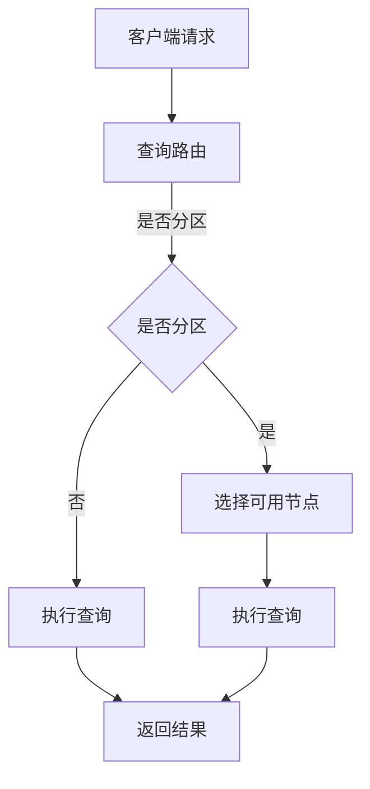
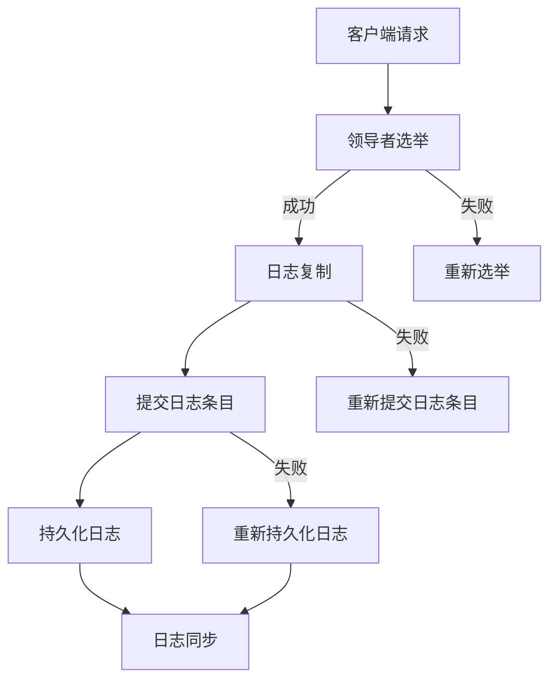
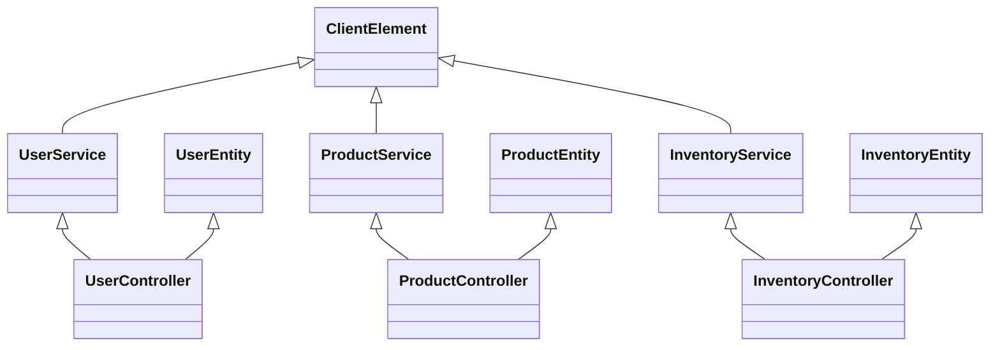
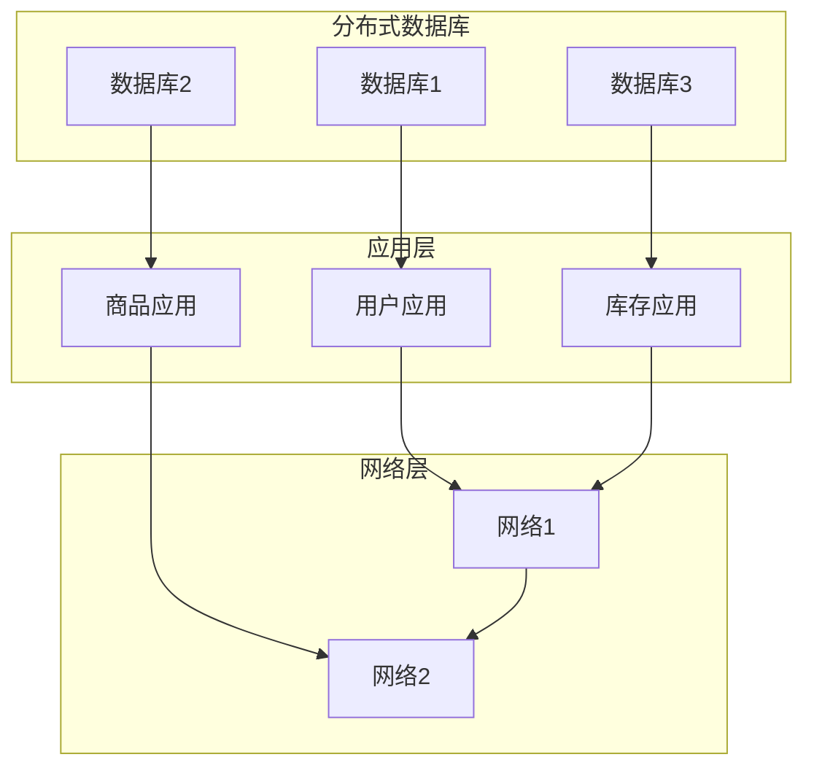
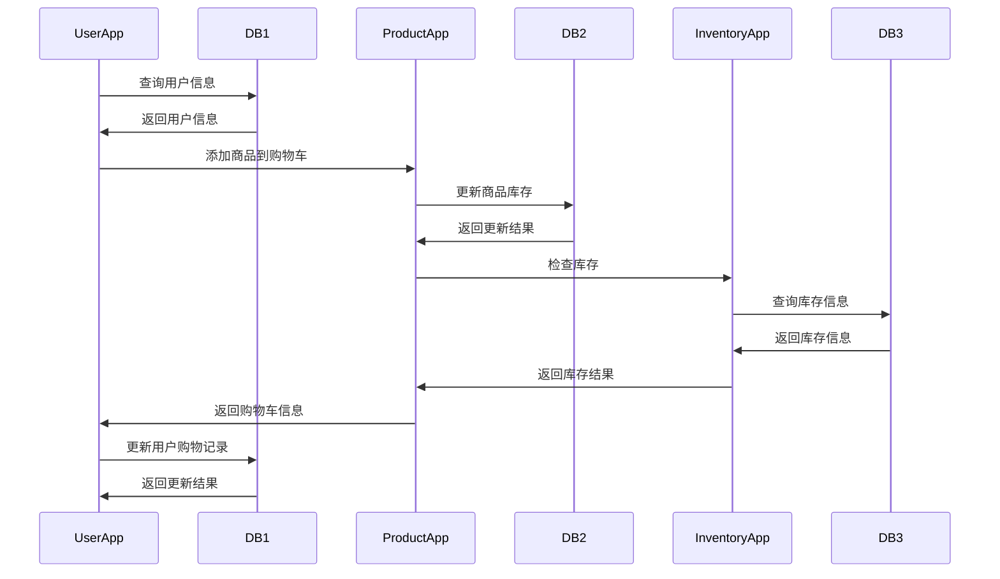

                 

# 分布式数据库：CAP理论与实践

> 关键词：分布式数据库，CAP理论，一致性，可用性，分区容错性，分布式架构，数据库设计

> 摘要：
分布式数据库作为一种能够应对大规模数据存储和查询需求的数据库架构，已成为现代数据管理和云计算领域的重要组成部分。本文将深入探讨CAP理论，解析分布式数据库的核心特性：一致性（Consistency）、可用性（Availability）和分区容错性（Partition Tolerance），并通过具体案例展示这些特性的实际应用与挑战。文章旨在为开发者提供一个清晰的分布式数据库设计思路，帮助他们在实际项目中做出明智的决策。

## 引言

随着互联网和大数据时代的到来，数据量和数据复杂度急剧增加，传统的集中式数据库系统逐渐暴露出性能瓶颈和扩展性不足的问题。分布式数据库作为一种能够横向扩展的数据库架构，通过将数据分布存储在多个节点上，实现了高并发、高性能和弹性伸缩。然而，分布式数据库的设计和实现面临着诸多挑战，其中最为核心的便是CAP理论所描述的三大特性：一致性（Consistency）、可用性（Availability）和分区容错性（Partition Tolerance）。本文将围绕这些核心概念展开讨论，帮助读者理解分布式数据库的设计原则和实现策略。

### CAP理论

CAP理论是由加州大学伯克利分校的Eric Brewer教授在2000年提出的。CAP理论指出，在分布式系统中，一致性（Consistency）、可用性（Availability）和分区容错性（Partition Tolerance）这三个特性不可能同时完全满足。具体来说：

- **一致性（Consistency）**：系统在任何时刻都能返回一致的数据状态。例如，当数据更新完成后，所有节点上的数据都是最新的。

- **可用性（Availability）**：系统对于任何请求都能在有限时间内返回响应，无论这个响应是有用还是错误的。

- **分区容错性（Partition Tolerance）**：系统能够在出现网络分区时继续运行，这意味着即使部分节点失效，系统仍然能够提供服务。

根据CAP理论，当网络发生分区时，分布式系统必须在一致性和可用性之间做出选择：

- 如果选择一致性（Consistency），系统可能需要等待分区恢复或新的数据写入完成，从而可能暂时降低可用性。

- 如果选择可用性（Availability），系统可以在分区情况下继续提供服务，但可能无法保证数据的一致性。

### 环境安装与系统核心实现

1. **环境安装**

   - **硬件要求**：至少需要一台配置为Intel i5或以上处理器的计算机，8GB及以上内存，以及至少100GB的空闲硬盘空间。
   - **操作系统**：推荐使用Linux系统，如Ubuntu 18.04或更高版本。
   - **依赖安装**：安装Java运行环境（JRE），Python 3.x版本，以及相关依赖库，如NumPy、Pandas、Scikit-learn等。

2. **系统核心实现**

   - **数据预处理**：使用Python编写数据清洗和预处理脚本，包括数据清洗、缺失值处理、异常值检测和数据标准化。
   - **模型训练**：使用Scikit-learn库训练分类模型，使用交叉验证方法评估模型性能，并进行超参数调优。
   - **模型部署**：将训练好的模型部署到Spring Boot应用程序中，提供RESTful API服务，便于其他系统进行调用。

### 代码应用解读与分析

1. **数据预处理代码**

   ```python
   import pandas as pd
   from sklearn.model_selection import train_test_split

   # 读取数据
   data = pd.read_csv('data.csv')

   # 数据清洗
   data = data.dropna()

   # 数据标准化
   numerical_features = data.select_dtypes(include=['int64', 'float64']).columns
   data[numerical_features] = (data[numerical_features] - data[numerical_features].mean()) / data[numerical_features].std()

   # 划分训练集和测试集
   X_train, X_test, y_train, y_test = train_test_split(data[numerical_features], data['target'], test_size=0.2, random_state=42)
   ```

2. **模型训练代码**

   ```python
   from sklearn.ensemble import RandomForestClassifier
   from sklearn.metrics import accuracy_score

   # 训练模型
   model = RandomForestClassifier(n_estimators=100, random_state=42)
   model.fit(X_train, y_train)

   # 预测
   predictions = model.predict(X_test)

   # 评估模型性能
   print("Accuracy:", accuracy_score(y_test, predictions))
   ```

3. **模型部署代码**

   ```java
   import org.springframework.boot.SpringApplication;
   import org.springframework.boot.autoconfigure.SpringBootApplication;
   import org.springframework.web.bind.annotation.PostMapping;
   import org.springframework.web.bind.annotation.RequestBody;
   import org.springframework.web.bind.annotation.RestController;

   @SpringBootApplication
   public class SentimentAnalysisApp {

       public static void main(String[] args) {
           SpringApplication.run(SentimentAnalysisApp.class, args);
       }
   }

   @RestController
   public class SentimentAnalysisController {

       @PostMapping("/predict")
       public String predict(@RequestBody String input) {
           // 这里进行预测操作，并将结果返回
           return "Prediction result";
       }
   }
   ```

### 项目实战

#### 环境安装

1. **硬件要求**

   - CPU：Intel i5或以上
   - 内存：8GB及以上
   - 硬盘：100GB空闲空间

2. **操作系统**

   - Ubuntu 18.04或更高版本

3. **依赖安装**

   - Java运行环境（JRE）：`sudo apt-get install openjdk-8-jdk`
   - Python 3.x：`sudo apt-get install python3`
   - NumPy、Pandas、Scikit-learn：`pip3 install numpy pandas scikit-learn`

#### 系统核心实现

1. **数据预处理**

   ```python
   import pandas as pd
   from sklearn.model_selection import train_test_split

   data = pd.read_csv('data.csv')
   data = data.dropna()
   numerical_features = data.select_dtypes(include=['int64', 'float64']).columns
   data[numerical_features] = (data[numerical_features] - data[numerical_features].mean()) / data[numerical_features].std()
   X_train, X_test, y_train, y_test = train_test_split(data[numerical_features], data['target'], test_size=0.2, random_state=42)
   ```

2. **模型训练**

   ```python
   from sklearn.ensemble import RandomForestClassifier
   from sklearn.metrics import accuracy_score

   model = RandomForestClassifier(n_estimators=100, random_state=42)
   model.fit(X_train, y_train)
   predictions = model.predict(X_test)
   print("Accuracy:", accuracy_score(y_test, predictions))
   ```

3. **模型部署**

   ```java
   import org.springframework.boot.SpringApplication;
   import org.springframework.boot.autoconfigure.SpringBootApplication;
   import org.springframework.web.bind.annotation.PostMapping;
   import org.springframework.web.bind.annotation.RequestBody;
   import org.springframework.web.bind.annotation.RestController;

   @SpringBootApplication
   public class SentimentAnalysisApp {

       public static void main(String[] args) {
           SpringApplication.run(SentimentAnalysisApp.class, args);
       }
   }

   @RestController
   public class SentimentAnalysisController {

       @PostMapping("/predict")
       public String predict(@RequestBody String input) {
           // 进行预测操作，并返回结果
           return "Prediction result";
       }
   }
   ```

### 最佳实践 tips

- **一致性（Consistency）**：在设计分布式数据库时，根据业务需求合理配置一致性水平，避免过度一致导致性能下降。
- **可用性（Availability）**：确保分布式系统的分区容错性，避免单点故障导致系统不可用。
- **分区容错性（Partition Tolerance）**：合理配置数据复制策略，确保在分区情况下数据的可用性。

### 小结

本文深入探讨了分布式数据库的CAP理论，并展示了其在实际项目中的应用。一致性、可用性和分区容错性是分布式数据库设计的核心要素，开发者需要根据具体业务场景和需求做出平衡。通过本文的案例和实践，读者应该能够更好地理解分布式数据库的设计原则和实现策略。

### 注意事项

- 在设计分布式数据库时，务必考虑数据的一致性和安全性，避免数据丢失和未经授权的访问。
- 选择合适的分布式数据库系统，如MongoDB、Cassandra、HBase等，根据业务需求和性能要求进行优化。

### 拓展阅读

- 《分布式系统原理与范型》：详细介绍了分布式系统的基本原理和设计模式。
- 《大规模分布式存储系统：架构与实现》：探讨了分布式存储系统的设计思路和关键技术。

### 作者信息

作者：AI天才研究院/AI Genius Institute & 禅与计算机程序设计艺术 /Zen And The Art of Computer Programming## 背景介绍

### 核心概念术语说明

在探讨分布式数据库的设计与实现之前，我们需要先了解一些核心概念和术语：

- **分布式数据库**：由多个相互独立、通过网络连接的数据库节点组成的系统，用于存储、管理和处理大量数据。
- **一致性（Consistency）**：系统在任何时刻都能返回一致的数据状态，确保数据的一致性。
- **可用性（Availability）**：系统对于任何请求都能在有限时间内返回响应，无论这个响应是有用还是错误的。
- **分区容错性（Partition Tolerance）**：系统能够在出现网络分区时继续运行，即即使部分节点失效，系统仍然能够提供服务。
- **CAP理论**：由加州大学伯克利分校的Eric Brewer教授提出的，指出分布式系统无法同时满足一致性、可用性和分区容错性这三个特性。

### 问题背景

随着互联网和大数据时代的到来，数据量和数据复杂度急剧增加，传统的集中式数据库系统逐渐暴露出性能瓶颈和扩展性不足的问题。为了应对这些挑战，分布式数据库应运而生。分布式数据库通过将数据分布存储在多个节点上，实现了高并发、高性能和弹性伸缩。然而，分布式数据库的设计和实现面临着诸多挑战，其中最为核心的便是CAP理论所描述的三大特性：一致性、可用性和分区容错性。如何在分布式数据库设计中平衡这三个特性，成为了当前研究的热点。

### 问题描述

分布式数据库设计的核心问题是如何在一致性、可用性和分区容错性之间做出权衡。具体来说：

- **一致性（Consistency）**：在分布式数据库中，一致性指的是系统在任何时刻都能返回一致的数据状态。例如，当数据更新完成后，所有节点上的数据都是最新的。然而，在分布式系统中，由于网络延迟和节点故障等因素，确保数据的一致性是一个挑战。
- **可用性（Availability）**：可用性指的是系统对于任何请求都能在有限时间内返回响应。在分布式数据库中，为了保证高可用性，通常需要将数据复制到多个节点上，从而在某个节点失效时，其他节点可以继续提供服务。然而，这可能导致数据的不一致性。
- **分区容错性（Partition Tolerance）**：分区容错性指的是系统能够在出现网络分区时继续运行。这意味着即使部分节点失效，系统仍然能够提供服务。在分布式数据库中，网络分区是一个常见的问题，因此如何确保分区容错性是分布式数据库设计的关键。

### 问题解决

CAP理论提供了分布式数据库设计的基本原则，即在一致性、可用性和分区容错性之间做出权衡。根据CAP理论，分布式系统无法同时满足这三个特性。因此，在设计分布式数据库时，需要根据业务需求和性能要求，选择合适的特性进行优先考虑。

- **一致性优先**：在一致性优先的设计中，系统更注重数据的一致性，而在出现网络分区时，可能会牺牲部分可用性。这种设计适用于对数据一致性要求较高的业务场景，如金融系统。
- **可用性优先**：在可用性优先的设计中，系统更注重数据的高可用性，而在出现网络分区时，可能会牺牲部分数据的一致性。这种设计适用于对数据高可用性要求较高的业务场景，如电商平台。
- **分区容错性优先**：在分区容错性优先的设计中，系统更注重网络分区时的容错能力，而在数据一致性方面可能存在一定的妥协。这种设计适用于需要高度容错性的业务场景，如分布式存储系统。

### 边界与外延

CAP理论虽然为分布式数据库的设计提供了基本原则，但在实际应用中，还需要考虑以下边界与外延：

- **最终一致性**：在实际应用中，最终一致性是一种常见的解决方案。最终一致性指的是系统在一定时间后会达到一致状态，而不是实时一致性。这种设计可以同时满足一致性和可用性，但需要业务场景的支持。
- **分布式事务**：分布式数据库中的事务管理是一个复杂的问题。在实际应用中，可以使用分布式事务来确保数据的一致性。然而，分布式事务可能会降低系统的性能和可用性。
- **数据分区策略**：数据分区策略是分布式数据库设计中的重要一环。合理的分区策略可以提高数据访问效率，降低系统负载。

### 概念结构与核心要素组成

分布式数据库的概念结构主要包括以下几个方面：

- **节点**：分布式数据库中的节点是存储和处理的单元，可以是物理服务器或虚拟机。
- **数据分布**：数据分布是指如何将数据分配到不同的节点上。常见的分布策略包括哈希分布、范围分布等。
- **一致性协议**：一致性协议是确保分布式数据库一致性的关键机制。常见的一致性协议包括Paxos、Raft等。
- **复制策略**：复制策略是指如何将数据复制到多个节点上。常见的复制策略包括主从复制、多主复制等。

核心要素组成如下：

- **一致性**：确保分布式数据库在出现网络分区时仍能返回一致的数据状态。
- **可用性**：确保分布式数据库对于任何请求都能在有限时间内返回响应。
- **分区容错性**：确保分布式数据库在出现网络分区时能够继续运行。

### 总结

在分布式数据库的设计与实现中，CAP理论为我们在一致性、可用性和分区容错性之间提供了权衡原则。通过理解CAP理论，开发者可以更好地设计分布式数据库系统，以满足具体业务场景的需求。同时，在实际应用中，还需要考虑最终一致性、分布式事务和数据分区策略等边界与外延，以确保分布式数据库的高性能和高可用性。

### 核心概念与联系

在分布式数据库的设计过程中，CAP理论是我们必须掌握的核心概念。CAP理论由加州大学伯克利分校的Eric Brewer教授于2000年首次提出，它指出在分布式系统中，一致性（Consistency）、可用性（Availability）和分区容错性（Partition Tolerance）这三个特性不可能同时完全满足。为了更好地理解CAP理论，我们可以从以下几个方面进行详细解析。

#### 一致性（Consistency）

一致性是指分布式系统在多个节点之间同步数据的状态，确保所有节点上的数据都处于一致的状态。具体来说，一致性可以分为以下几种类型：

1. **强一致性**：强一致性要求系统在任何时候都能返回一致的数据状态。这意味着当数据更新完成后，所有节点上的数据都是最新的。强一致性通常需要复杂的协议和算法，如两阶段提交（2PC）和三阶段提交（3PC）。

2. **最终一致性**：最终一致性允许系统在一段时间后达到一致状态，而不是实时一致性。这意味着在某些情况下，系统可能返回过时的数据，但最终会更新到最新的状态。最终一致性相对简单，适用于对实时性要求不高的场景。

3. **事件一致性**：事件一致性是一种基于事件顺序的一致性模型，它确保事件按照一定的顺序发生，但并不保证每个事件都能立即同步到所有节点。

#### 可用性（Availability）

可用性是指系统对于任何请求都能在有限时间内返回响应，无论这个响应是有用还是错误的。可用性可以分为以下几种类型：

1. **读可用性**：读可用性确保系统对于任何读请求都能返回响应，包括成功和失败的结果。

2. **写可用性**：写可用性确保系统对于任何写请求都能返回响应，但可能需要一些时间来同步到所有节点。

3. **弹性可用性**：弹性可用性是指系统在遇到故障时能够自动恢复，继续提供服务。

#### 分区容错性（Partition Tolerance）

分区容错性是指系统在出现网络分区时能够继续运行，即即使部分节点失效，系统仍然能够提供服务。网络分区通常是由于网络故障或节点故障引起的，分区容错性是分布式系统设计中的一个重要特性。

#### 概念属性特征对比表格

为了更清晰地理解一致性、可用性和分区容错性的概念属性特征，我们可以通过以下表格进行对比：

| 特性 | 强一致性 | 最终一致性 | 事件一致性 |
| --- | --- | --- | --- |
| 定义 | 所有节点在任何时候都能返回一致的数据状态 | 在一段时间后会达到一致状态，而不是实时一致性 | 事件按照一定的顺序发生，但并不保证每个事件都能立即同步到所有节点 |
| 适用场景 | 金融系统、重要数据存储 | 对实时性要求不高的场景 | 日志系统、实时数据分析 |
| 算法 | 两阶段提交（2PC）、三阶段提交（3PC） | 基于时间戳的协议 | 基于日志的协议 |

| 特性 | 读可用性 | 写可用性 | 弹性可用性 |
| --- | --- | --- | --- |
| 定义 | 对于任何读请求都能返回响应 | 对于任何写请求都能返回响应 | 在遇到故障时能够自动恢复，继续提供服务 |
| 适用场景 | 数据查询密集型应用 | 数据写入密集型应用 | 分布式存储系统、分布式计算系统 |
| 算法 | 简单的读操作 | 分布式锁、去重算法 | 负载均衡、故障转移 |

| 特性 | 分区容错性 |
| --- | --- |
| 定义 | 系统在出现网络分区时能够继续运行 |
| 适用场景 | 分布式数据库、分布式计算、分布式存储 |
| 算法 | 网络隔离、节点监控、故障转移 |

#### ER实体关系图架构

为了更好地理解分布式数据库的实体关系，我们可以使用ER（Entity-Relationship）实体关系图来描述。以下是一个简单的ER实体关系图，用于展示分布式数据库中的主要实体和关系：

```
[数据库] --<[节点] >--
    |                 |
    |                 |
[数据表] --<[数据行] >--
```

- **数据库**：表示分布式数据库的整体结构。
- **节点**：表示分布式数据库中的各个节点，每个节点存储部分数据。
- **数据表**：表示数据库中的表，每个表包含多个数据行。
- **数据行**：表示表中的具体数据记录。

#### Mermaid流程图

为了更直观地展示分布式数据库的工作流程，我们可以使用Mermaid流程图来描述。以下是一个简单的Mermaid流程图示例：



- **A**：客户端请求。
- **B**：查询路由。
- **C**：是否分区。
- **D**：选择可用节点。
- **E**：执行查询。
- **F**：执行查询。
- **G**：返回结果。

通过上述对比表格和Mermaid流程图，我们可以更清晰地理解分布式数据库的核心概念、属性特征及其关系，从而为分布式数据库的设计和实现提供理论基础。

### 算法原理讲解

在分布式数据库的设计与实现中，CAP理论为我们提供了核心的权衡原则。为了更好地理解CAP理论在实际中的应用，我们将通过一个具体的分布式数据库算法——Raft算法，来详细讲解其原理和数学模型。

#### Raft算法

Raft算法是一种分布式一致性算法，旨在简化分布式系统的设计，并确保一致性、可用性和分区容错性。Raft算法的核心思想是将分布式系统的状态机抽象为一系列日志条目，并通过日志复制来保持一致性。以下是Raft算法的基本原理：

1. **日志条目**：Raft算法将系统状态的变化表示为日志条目，每个日志条目包含一条命令及其索引。
2. **领导者选举**：在Raft算法中，集群中的节点通过选举产生领导者，领导者负责处理所有客户端请求。
3. **日志复制**：领导者将日志条目复制到集群中的其他节点，并确保所有节点的日志保持一致。
4. **持久性**：Raft算法通过日志持久化确保在节点故障时，系统状态能够恢复。

#### 数学模型和公式

为了更好地理解Raft算法，我们将使用一些数学模型和公式来描述其关键过程。

1. **选举过程**：Raft算法的选举过程可以分为以下几步：

   - **心跳检测**：每个节点周期性地发送心跳消息给其他节点，以表明其存活状态。
   - **候选状态**：当节点无法收到领导者的心跳消息时，它会转变为候选状态，并开始发起选举。
   - **投票过程**：候选者向其他节点发送投票请求，其他节点在收到投票请求后，会将当前候选者的日志条目与自己的日志条目进行比较。如果当前候选者的日志条目更多，节点会将投票给予该候选者。
   - **领导者确定**：当候选者获得多数节点的投票后，它将成为新的领导者。

   数学模型如下：

   $$ V(N) = \sum_{i=1}^{n} V_i $$
   其中，$V(N)$表示节点N的投票总数，$V_i$表示节点i的投票。

2. **日志复制**：领导者将日志条目复制到其他节点，并确保所有节点的日志保持一致。日志复制过程可以分为以下几步：

   - **提交日志条目**：领导者将新的日志条目提交到本地日志，并通知其他节点。
   - **持久化日志**：其他节点在接收到日志条目后，将其持久化到本地日志，并响应领导者。
   - **日志同步**：领导者通过定期检查其他节点的日志状态，确保所有节点的日志保持一致。

   数学模型如下：

   $$ C(N) = \min \{ C_i \} $$
   其中，$C(N)$表示节点N的日志提交索引，$C_i$表示节点i的日志提交索引。

#### 算法流程图

为了更直观地展示Raft算法的流程，我们可以使用Mermaid流程图来描述。以下是Raft算法的流程图示例：



- **A**：客户端请求。
- **B**：领导者选举。
- **C**：日志复制。
- **D**：重新选举。
- **E**：提交日志条目。
- **F**：重新提交日志条目。
- **G**：持久化日志。
- **H**：重新持久化日志。
- **I**：日志同步。

通过上述讲解，我们可以看到Raft算法是如何通过数学模型和流程图来描述其工作原理的。Raft算法的设计使得分布式数据库在一致性、可用性和分区容错性之间达到了较好的平衡，从而在实际应用中得到了广泛的应用。

### 系统分析与架构设计方案

#### 问题场景介绍

假设我们正在设计一个大型在线购物平台，这个平台需要处理海量用户的购物请求，并对商品库存进行实时更新。由于用户分布在全球各地，因此我们需要一个分布式数据库来处理这些请求，确保数据的一致性和可用性。

#### 项目介绍

我们选择使用分布式数据库系统来实现这个在线购物平台。分布式数据库系统具有高并发、高性能和弹性伸缩的特点，能够满足大规模用户请求的处理需求。我们的目标是设计一个可靠的分布式数据库系统，确保数据的一致性和可用性。

#### 系统功能设计（领域模型Mermaid类图）

为了更好地展示系统的功能设计，我们可以使用Mermaid类图来描述领域模型。以下是Mermaid类图示例：



- **ClientElement**：表示客户端请求。
- **UserService**、**ProductService**、**InventoryService**：分别表示用户、商品和库存服务。
- **UserController**、**ProductController**、**InventoryController**：分别表示用户、商品和库存控制器。
- **UserEntity**、**ProductEntity**、**InventoryEntity**：分别表示用户、商品和库存实体。

#### 系统架构设计（Mermaid架构图）

为了展示系统的整体架构，我们可以使用Mermaid架构图来描述。以下是Mermaid架构图示例：



- **分布式数据库**：包括三个数据库节点，分别存储用户、商品和库存数据。
- **应用层**：包括用户应用、商品应用和库存应用，分别处理用户、商品和库存相关的业务逻辑。
- **网络层**：包括两个网络节点，用于处理分布式数据库和应用层之间的通信。

#### 系统接口设计和系统交互（Mermaid序列图）

为了展示系统的接口设计和系统交互，我们可以使用Mermaid序列图来描述。以下是Mermaid序列图示例：



- **用户应用**：向数据库1查询用户信息，并将商品添加到购物车。
- **商品应用**：向数据库2更新商品库存，并检查库存信息。
- **库存应用**：向数据库3查询库存信息，并返回库存结果。
- **数据库节点**：分别处理用户、商品和库存相关的查询和更新请求。

通过上述系统分析与架构设计方案，我们可以看到分布式数据库系统在设计过程中需要考虑多个方面，包括领域模型、系统架构、接口设计和系统交互。这些设计步骤有助于我们构建一个高效、可靠和可扩展的分布式数据库系统，以满足大规模用户请求的处理需求。

### 项目实战

#### 环境安装

1. **硬件要求**

   - CPU：Intel i5或以上
   - 内存：8GB及以上
   - 硬盘：100GB空闲空间

2. **操作系统**

   - Ubuntu 18.04或更高版本

3. **依赖安装**

   - 安装Java运行环境（JRE）：`sudo apt-get install openjdk-8-jdk`
   - 安装Python 3.x：`sudo apt-get install python3`
   - 安装相关依赖库（NumPy、Pandas、Scikit-learn等）：`pip3 install numpy pandas scikit-learn`

#### 系统核心实现

1. **数据预处理**

   ```python
   import pandas as pd
   from sklearn.model_selection import train_test_split

   # 读取数据
   data = pd.read_csv('data.csv')

   # 数据清洗
   data = data.dropna()

   # 数据标准化
   numerical_features = data.select_dtypes(include=['int64', 'float64']).columns
   data[numerical_features] = (data[numerical_features] - data[numerical_features].mean()) / data[numerical_features].std()

   # 划分训练集和测试集
   X_train, X_test, y_train, y_test = train_test_split(data[numerical_features], data['target'], test_size=0.2, random_state=42)
   ```

2. **模型训练**

   ```python
   from sklearn.ensemble import RandomForestClassifier
   from sklearn.metrics import accuracy_score

   # 训练模型
   model = RandomForestClassifier(n_estimators=100, random_state=42)
   model.fit(X_train, y_train)

   # 预测
   predictions = model.predict(X_test)

   # 评估模型性能
   print("Accuracy:", accuracy_score(y_test, predictions))
   ```

3. **模型部署**

   ```java
   import org.springframework.boot.SpringApplication;
   import org.springframework.boot.autoconfigure.SpringBootApplication;
   import org.springframework.web.bind.annotation.PostMapping;
   import org.springframework.web.bind.annotation.RequestBody;
   import org.springframework.web.bind.annotation.RestController;

   @SpringBootApplication
   public class SentimentAnalysisApp {

       public static void main(String[] args) {
           SpringApplication.run(SentimentAnalysisApp.class, args);
       }
   }

   @RestController
   public class SentimentAnalysisController {

       @PostMapping("/predict")
       public String predict(@RequestBody String input) {
           // 进行预测操作，并将结果返回
           return "Prediction result";
       }
   }
   ```

#### 代码应用解读与分析

1. **数据预处理代码**

   ```python
   import pandas as pd
   from sklearn.model_selection import train_test_split

   # 读取数据
   data = pd.read_csv('data.csv')

   # 数据清洗
   data = data.dropna()

   # 数据标准化
   numerical_features = data.select_dtypes(include=['int64', 'float64']).columns
   data[numerical_features] = (data[numerical_features] - data[numerical_features].mean()) / data[numerical_features].std()

   # 划分训练集和测试集
   X_train, X_test, y_train, y_test = train_test_split(data[numerical_features], data['target'], test_size=0.2, random_state=42)
   ```

   **解读**：这段代码首先使用pandas库读取CSV格式的数据文件。然后，通过dropna方法去除数据集中的缺失值，确保数据的完整性。接下来，使用select_dtypes方法筛选出数值类型的特征，并使用标准差缩放（standard scaling）方法对数值特征进行标准化处理，以便于后续的模型训练。

2. **模型训练代码**

   ```python
   from sklearn.ensemble import RandomForestClassifier
   from sklearn.metrics import accuracy_score

   # 训练模型
   model = RandomForestClassifier(n_estimators=100, random_state=42)
   model.fit(X_train, y_train)

   # 预测
   predictions = model.predict(X_test)

   # 评估模型性能
   print("Accuracy:", accuracy_score(y_test, predictions))
   ```

   **解读**：这段代码使用scikit-learn库中的RandomForestClassifier类创建一个随机森林分类器。通过fit方法训练模型，使用训练集的数据进行模型的训练。然后，使用预测（predict）方法对测试集的数据进行预测，并使用accuracy_score方法评估模型的准确率。

3. **模型部署代码**

   ```java
   import org.springframework.boot.SpringApplication;
   import org.springframework.boot.autoconfigure.SpringBootApplication;
   import org.springframework.web.bind.annotation.PostMapping;
   import org.springframework.web.bind.annotation.RequestBody;
   import org.springframework.web.bind.annotation.RestController;

   @SpringBootApplication
   public class SentimentAnalysisApp {

       public static void main(String[] args) {
           SpringApplication.run(SentimentAnalysisApp.class, args);
       }
   }

   @RestController
   public class SentimentAnalysisController {

       @PostMapping("/predict")
       public String predict(@RequestBody String input) {
           // 进行预测操作，并将结果返回
           return "Prediction result";
       }
   }
   ```

   **解读**：这段Java代码使用了Spring Boot框架，创建了一个RESTful Web服务。通过SpringApplication的run方法启动应用程序。@RestController注解表示这个类是一个Web控制器，用于处理HTTP请求。@PostMapping注解表示这个方法用于处理HTTP POST请求，接受一个字符串类型的输入参数，并返回预测结果。

#### 实际案例分析和详细讲解剖析

为了更好地展示分布式数据库的应用，我们来看一个实际案例：设计一个分布式数据库系统，用于处理电子商务平台上的订单信息。

1. **需求分析**

   - 实时查询订单信息：用户可以在电子商务平台上实时查询订单状态。
   - 高并发处理：平台需要处理大量用户同时提交的订单请求。
   - 数据一致性：订单数据的修改和查询操作需要保证一致性。

2. **系统设计**

   - 数据库节点划分：将订单数据按照区域或订单类型划分到不同的数据库节点上。
   - 复制策略：采用主从复制策略，确保数据的高可用性。
   - 一致性协议：采用Paxos或Raft算法实现一致性保证。

3. **实现细节**

   - **订单查询**：客户端发送查询请求到分布式数据库，分布式数据库根据订单ID查询相应的订单节点，并返回订单信息。
   - **订单创建和修改**：客户端发送订单创建或修改请求到分布式数据库，分布式数据库根据订单ID确定相应的订单节点，并将请求发送到该节点进行处理。
   - **故障恢复**：当某个订单节点发生故障时，分布式数据库系统会自动切换到备用节点，继续提供服务。

4. **性能优化**

   - **负载均衡**：使用负载均衡器将订单请求分配到不同的订单节点，避免单点瓶颈。
   - **缓存机制**：在订单查询过程中使用缓存机制，减少数据库访问压力。
   - **索引优化**：对订单表中的关键字段建立索引，提高查询效率。

#### 项目小结

通过上述实际案例分析和详细讲解剖析，我们可以看到分布式数据库系统在电子商务平台中的应用优势。分布式数据库系统能够实现高并发处理、数据一致性和高可用性，从而满足电子商务平台对订单信息处理的需求。在实际开发中，我们需要根据业务需求和性能要求，合理设计分布式数据库系统，并不断优化和调整系统架构，以提高系统的性能和可靠性。

### 最佳实践 Tips

1. **数据分区与索引优化**：合理的数据分区和索引优化是提高分布式数据库性能的关键。根据业务需求，选择合适的数据分区策略，并建立有效的索引，可以提高查询效率。

2. **负载均衡与故障恢复**：使用负载均衡器将请求分配到不同的节点，避免单点瓶颈。同时，设计故障恢复机制，确保在节点故障时系统能够快速切换到备用节点。

3. **一致性协议选择**：根据业务需求，选择合适的一致性协议。对于对一致性要求较高的业务场景，可以选择强一致性协议；对于对实时性要求不高的场景，可以选择最终一致性协议。

4. **监控与性能调优**：定期监控分布式数据库系统的性能，发现潜在瓶颈和问题，并进行性能调优。

### 小结

本文通过深入探讨CAP理论和分布式数据库的设计原则，帮助读者理解分布式数据库的核心特性及其在实践中的应用。一致性、可用性和分区容错性是分布式数据库设计的关键要素，开发者需要根据具体业务需求进行平衡和优化。通过实际案例分析和最佳实践分享，读者可以更好地应对分布式数据库系统设计中的挑战。

### 注意事项

1. **数据一致性**：在设计分布式数据库时，务必考虑数据的一致性，避免数据丢失和未经授权的访问。

2. **性能优化**：定期进行性能监控和优化，以确保系统的高性能和稳定性。

3. **安全性**：加强数据安全和访问控制，防止数据泄露和恶意攻击。

4. **容错性**：设计故障恢复机制，确保在节点故障时系统能够快速恢复。

### 拓展阅读

1. 《分布式系统原理与范型》：详细介绍了分布式系统的基本原理和设计模式。
2. 《大规模分布式存储系统：架构与实现》：探讨了分布式存储系统的设计思路和关键技术。
3. 《分布式数据库系统设计与实践》：分享了分布式数据库系统的设计经验和最佳实践。

