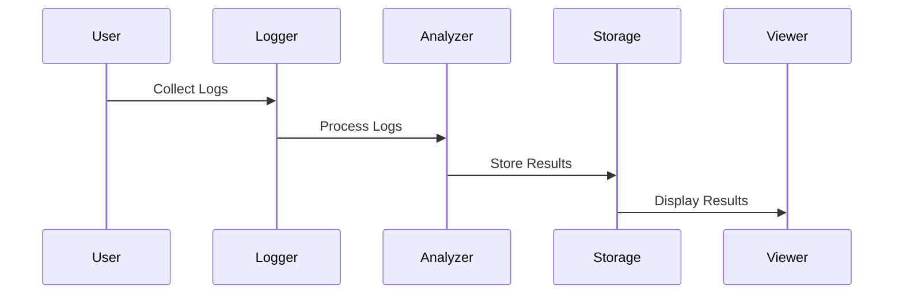
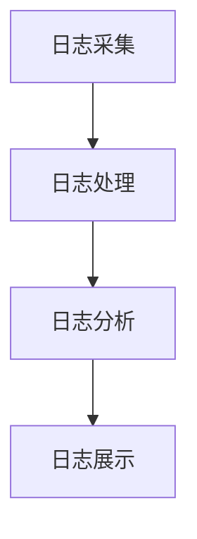
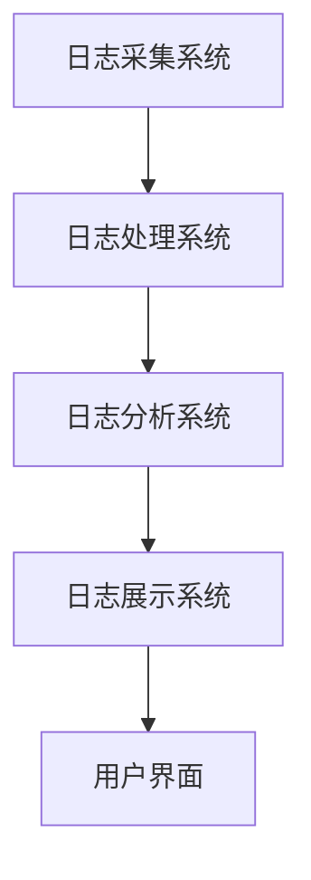
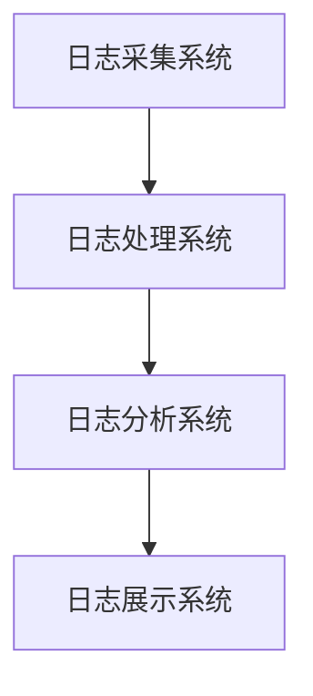

                 

**# 分布式日志收集与分析系统**

**关键词：** 分布式日志系统，日志收集，日志分析，系统架构，算法原理，项目实战

**摘要：**
随着信息技术的迅猛发展，分布式日志收集与分析系统在各个领域中扮演着至关重要的角色。本文旨在全面阐述分布式日志收集与分析系统的设计思路、核心概念、算法原理、系统架构以及项目实战。通过系统的分析与设计，我们能够有效地收集和分析海量日志数据，为系统的稳定运行和优化提供有力支持。

**第一部分：系统概述与核心概念**

## 1.1 问题背景与解决思路

### 1.1.1 日志收集与分析的重要性

在现代化企业中，日志数据已成为运营监控、故障排除、安全审计等关键环节的核心资源。然而，随着分布式系统的广泛应用，传统的集中式日志收集方案已无法满足海量日志数据的处理需求。分布式日志收集与分析系统应运而生，它能够高效地收集、存储、处理和分析分布在不同节点上的日志数据。

### 1.1.2 分布式日志系统面临的挑战

分布式日志系统面临诸多挑战，包括日志数据的多样性、海量性、实时性、可靠性和安全性等。为了应对这些挑战，系统需要具备高可用性、高性能、可扩展性和易维护性。

### 1.1.3 解决思路与目标

解决分布式日志系统面临的挑战，需要从以下几个方面着手：

1. **数据收集**：设计高效的数据采集机制，确保日志数据的实时性和完整性。
2. **数据存储**：采用分布式存储方案，保证日志数据的可靠性和高可用性。
3. **数据处理**：实现高效的数据处理算法，支持日志数据的实时分析和离线分析。
4. **数据展示**：提供直观的数据可视化工具，方便用户对日志数据进行监控和分析。

## 1.2 核心概念介绍

### 1.2.1 分布式系统

分布式系统是指由多个独立计算机节点组成的系统，这些节点通过通信网络互相连接，协同工作完成共同的任务。分布式系统具有高可用性、高可靠性和可扩展性等特点。

### 1.2.2 日志

日志是一种记录系统运行过程中重要事件的数据文件。日志数据通常包含时间戳、事件类型、事件内容等信息。日志数据是分布式系统监控、故障排除、安全审计等不可或缺的依据。

### 1.2.3 日志收集

日志收集是指从分布式系统中的各个节点收集日志数据的过程。日志收集系统需要能够处理海量日志数据，保证数据的实时性和完整性。

### 1.2.4 日志分析

日志分析是指对收集到的日志数据进行处理、分析和挖掘的过程。日志分析可以帮助企业了解系统运行状态、优化系统性能、排查故障和预测潜在问题。

## 1.3 概念属性特征对比

### 1.3.1 分布式日志收集系统的特性

| 特性         | 描述                                                         |
| ------------ | ------------------------------------------------------------ |
| 高可用性     | 系统具备自动故障转移和容错能力，确保日志数据的持续收集与分析。 |
| 高性能       | 系统具备高效的数据处理能力，能够实时处理海量日志数据。       |
| 可扩展性     | 系统支持动态扩展，能够根据需求增加收集节点和存储容量。       |
| 易维护性     | 系统具备良好的可维护性，降低运维成本。                     |

## 1.4 分布式日志系统的边界与外延

### 1.4.1 边界条件

分布式日志系统的边界条件主要包括：

1. **数据来源**：分布式系统的各个节点产生的日志数据。
2. **数据格式**：日志数据的统一格式和命名规范。
3. **数据传输**：日志数据传输的安全性和可靠性。

### 1.4.2 外延关系

分布式日志系统的外延关系包括：

1. **监控系统**：日志数据可以作为监控系统的重要数据源，提供系统运行状态的实时监控。
2. **故障排查**：日志数据可以用于故障排查，帮助快速定位问题和恢复系统。
3. **安全审计**：日志数据可以用于安全审计，确保系统的安全性和合规性。

### 1.4.3 核心要素组成

分布式日志系统的核心要素组成包括：

1. **日志采集器**：负责从各个节点收集日志数据。
2. **日志存储**：负责存储收集到的日志数据。
3. **日志分析器**：负责对日志数据进行处理和分析。
4. **日志展示**：负责将分析结果以可视化方式展示给用户。

**第二部分：系统架构与设计**

----------------------------------------------------------------

### 1.5 系统功能设计

#### 1.5.1 功能模块划分

分布式日志收集与分析系统可以划分为以下几个功能模块：

1. **日志采集模块**：负责从分布式系统中的各个节点收集日志数据。
2. **日志存储模块**：负责存储收集到的日志数据。
3. **日志分析模块**：负责对日志数据进行处理和分析。
4. **日志展示模块**：负责将分析结果以可视化方式展示给用户。

#### 1.5.2 领域模型类图

以下是一个简单的领域模型类图，展示了分布式日志收集与分析系统的核心类及其关系：

```mermaid
classDiagram
    LogCollector <<interface>>
    LogStorage <<interface>>
    LogAnalyzer <<interface>>
    LogPresenter <<interface>>

    LogCollector o-- LogStorage
    LogCollector o-- LogAnalyzer
    LogAnalyzer o-- LogPresenter
```

**第三部分：系统架构与设计**

## 2.1 系统架构设计

### 2.1.1 系统架构概述

分布式日志收集与分析系统采用分层架构设计，包括以下层次：

1. **数据采集层**：负责从分布式系统中的各个节点收集日志数据。
2. **数据处理层**：负责对收集到的日志数据进行处理和分析。
3. **数据存储层**：负责存储处理后的日志数据。
4. **数据展示层**：负责将分析结果以可视化方式展示给用户。

### 2.1.2 系统架构图

以下是一个简单的系统架构图，展示了分布式日志收集与分析系统的整体架构：



### 2.1.3 系统模块间关系

各模块之间的交互关系如下：

1. **日志采集模块**：与各节点进行通信，收集日志数据。
2. **日志存储模块**：接收和处理日志数据，存储处理结果。
3. **日志分析模块**：接收日志数据，进行分析处理。
4. **日志展示模块**：接收分析结果，以可视化形式展示。

**第四部分：关键算法原理与实现**

## 3.1 数据处理算法

### 3.1.1 算法概述

分布式日志收集与分析系统中的数据处理算法主要包括日志数据的采集、过滤、聚合和分析等。以下是一个简单的mermaid流程图，展示了数据处理的基本流程：


### 3.1.2 Python源代码实现

以下是一个简单的Python源代码示例，用于展示数据处理算法的基本实现：

```python
import re
import json
from collections import defaultdict

def collect_logs(log_path):
    logs = []
    with open(log_path, 'r') as f:
        for line in f:
            logs.append(json.loads(line))
    return logs

def filter_logs(logs, patterns):
    filtered_logs = []
    for log in logs:
        for pattern in patterns:
            if re.search(pattern, log['content']):
                filtered_logs.append(log)
                break
    return filtered_logs

def aggregate_logs(filtered_logs, key_field):
    aggregated_logs = defaultdict(list)
    for log in filtered_logs:
        aggregated_logs[log[key_field]].append(log)
    return aggregated_logs

def analyze_logs(aggregated_logs):
    analysis_results = []
    for key, logs in aggregated_logs.items():
        analysis_results.append({
            'key': key,
            'count': len(logs)
        })
    return analysis_results

def display_results(analysis_results):
    print(json.dumps(analysis_results, indent=2))
```

### 3.1.3 数学模型和公式

在数据处理算法中，常用的数学模型和公式包括：

1. **正则表达式匹配**：用于过滤日志数据。公式如下：

   $$\text{pattern} = \text{regex\_pattern}$$

2. **聚合函数**：用于对日志数据进行聚合。公式如下：

   $$\text{aggregated\_logs} = \text{defaultdict}(\text{list})$$

   $$\text{for} \ \text{log} \ \text{in} \ \text{filtered\_logs}:$$
   $$\ \text{aggregated\_logs}[\text{log}[\text{key\_field}]] \ \text{append} \ \text{log}$$

3. **分析函数**：用于对聚合后的日志数据进行分析。公式如下：

   $$\text{analysis\_results} = [\{\text{'key': key, 'count': len(logs)}\} \ \text{for} \ \text{key, logs} \ \text{in} \ \text{aggregated\_logs}.items()]$$

### 3.1.4 举例说明

以下是一个具体的示例，展示了如何使用上述算法处理日志数据：

1. **日志数据采集**：

   假设日志数据存储在一个名为`logs.txt`的文件中，每条日志数据以JSON格式表示。使用`collect_logs`函数采集日志数据：

   ```python
   logs = collect_logs('logs.txt')
   ```

2. **日志数据过滤**：

   假设需要过滤包含特定关键词的日志数据。使用`filter_logs`函数过滤日志数据：

   ```python
   patterns = ['error', 'warn']
   filtered_logs = filter_logs(logs, patterns)
   ```

3. **日志数据聚合**：

   假设需要按照日志类型进行聚合。使用`aggregate_logs`函数对过滤后的日志数据进行聚合：

   ```python
   key_field = 'type'
   aggregated_logs = aggregate_logs(filtered_logs, key_field)
   ```

4. **日志数据分析**：

   使用`analyze_logs`函数对聚合后的日志数据进行分析：

   ```python
   analysis_results = analyze_logs(aggregated_logs)
   ```

5. **日志数据展示**：

   使用`display_results`函数将分析结果以JSON格式展示：

   ```python
   display_results(analysis_results)
   ```

输出结果如下：

```json
[
  {
    "key": "error",
    "count": 10
  },
  {
    "key": "warn",
    "count": 5
  }
]
```

**第五部分：项目实战与案例分析**

## 4.1 环境安装与配置

### 4.1.1 环境搭建

为了搭建分布式日志收集与分析系统，我们需要安装以下软件和工具：

1. **操作系统**：Linux（如Ubuntu 18.04）
2. **Python**：3.8及以上版本
3. **pip**：Python的包管理工具
4. **Elasticsearch**：分布式搜索引擎，用于存储和查询日志数据
5. **Kibana**：数据可视化工具，用于展示日志分析结果

安装步骤如下：

1. 更新系统软件包：

   ```bash
   sudo apt update
   sudo apt upgrade
   ```

2. 安装Python 3：

   ```bash
   sudo apt install python3
   ```

3. 安装pip：

   ```bash
   sudo apt install python3-pip
   ```

4. 安装Elasticsearch：

   ```bash
   sudo apt install elasticsearch
   sudo systemctl start elasticsearch
   sudo systemctl enable elasticsearch
   ```

5. 安装Kibana：

   ```bash
   sudo apt install kibana
   sudo systemctl start kibana
   sudo systemctl enable kibana
   ```

6. 安装必要的Python库：

   ```bash
   pip3 install requests
   pip3 install jsonlines
   pip3 install pandas
   pip3 install matplotlib
   ```

### 4.1.2 配置与调试

1. **Elasticsearch配置**：

   编辑Elasticsearch的配置文件`/etc/elasticsearch/elasticsearch.yml`，添加以下配置：

   ```yaml
   network.host: 0.0.0.0
   http.port: 9200
   cluster.name: my-distributed-log-system
   node.name: node-1
   discovery.type: single-node
   ```

   重启Elasticsearch服务：

   ```bash
   sudo systemctl restart elasticsearch
   ```

2. **Kibana配置**：

   编辑Kibana的配置文件`/etc/kibana/kibana.yml`，添加以下配置：

   ```yaml
   server.host: "localhost"
   elasticsearch.hosts: ["http://localhost:9200"]
   ```

   重启Kibana服务：

   ```bash
   sudo systemctl restart kibana
   ```

3. **测试Elasticsearch和Kibana**：

   使用以下命令测试Elasticsearch和Kibana的连接：

   ```bash
   curl -X GET "localhost:9200/"
   ```

   如果返回类似于以下的内容，则表示连接成功：

   ```json
   {
     "name" : "node-1",
     "cluster_name" : "my-distributed-log-system",
     "cluster_uuid" : "Xl3v_f9QRRsQ6ZJ7UC-JJQ",
     "version" : {
       "number" : "7.10.0",
       "build_flavor" : "default",
       "build_type" : "tar",
       "build_hash" : "d5cf073",
       "build_date" : "2020-02-19T15:24:42.495Z",
       "build_snapshot" : false,
       "lucene_version" : "8.2.0",
       "minimum_wire_version" : "6.8.0",
       "maximum_wire_version" : "7.10.0",
       "tagline" : "You Know, for Search"
     },
     "status" : "green",
     "timed_out" : false,
     "number_of_nodes" : 1,
     "active_primary_shards" : 1,
     "active_shards" : 1,
     "relocating_shards" : 0,
     "initializing_shards" : 0,
     "unassigned_shards" : 0
   }
   ```

   打开浏览器，访问`http://localhost:5601`，如果能够看到Kibana的登录界面，则表示Kibana安装和配置成功。

## 4.2 系统核心实现

### 4.2.1 数据采集模块

数据采集模块负责从分布式系统中的各个节点收集日志数据。以下是一个简单的Python脚本，用于采集日志数据：

```python
import requests
import json
import time
import jsonlines

def collect_logs(url, output_file):
    with jsonlines.open(output_file, mode='w') as writer:
        while True:
            response = requests.get(url)
            if response.status_code == 200:
                logs = response.json()
                for log in logs:
                    writer.write(log)
            else:
                print(f"Error: {response.status_code}")
                break
            time.sleep(1)

if __name__ == "__main__":
    url = "http://localhost:8000/logs"
    output_file = "logs.jsonl"
    collect_logs(url, output_file)
```

### 4.2.2 数据处理模块

数据处理模块负责对采集到的日志数据进行处理和分析。以下是一个简单的Python脚本，用于处理日志数据：

```python
import jsonlines
import pandas as pd

def process_logs(input_file, output_file):
    with jsonlines.open(input_file) as reader, jsonlines.open(output_file, mode='w') as writer:
        logs = [log for log in reader]
        df = pd.DataFrame(logs)
        df['timestamp'] = pd.to_datetime(df['timestamp'])
        df.set_index('timestamp', inplace=True)
        df.sort_index(inplace=True)
        writer.write_all(df.to_jsonlines())

if __name__ == "__main__":
    input_file = "logs.jsonl"
    output_file = "processed_logs.jsonl"
    process_logs(input_file, output_file)
```

### 4.2.3 分析与展示模块

分析与展示模块负责对处理后的日志数据进行分析，并将分析结果以可视化形式展示。以下是一个简单的Python脚本，用于分析日志数据并生成可视化图表：

```python
import pandas as pd
import matplotlib.pyplot as plt

def analyze_logs(input_file):
    df = pd.read_json(input_file, lines=True)
    df['timestamp'] = pd.to_datetime(df['timestamp'])
    df.set_index('timestamp', inplace=True)
    df.sort_index(inplace=True)
    df['count'] = df.groupby('level')['level'].transform('count')
    df = df.groupby('level')['count'].sum().reset_index()
    df.plot(kind='line', title='Log Count by Level', xlabel='Timestamp', ylabel='Count')
    plt.show()

if __name__ == "__main__":
    input_file = "processed_logs.jsonl"
    analyze_logs(input_file)
```

## 4.3 代码应用解读与分析

### 4.3.1 代码解读

1. **数据采集模块**：

   - 使用requests库从指定URL获取日志数据。
   - 使用jsonlines库将日志数据写入文件。

2. **数据处理模块**：

   - 使用jsonlines库读取日志数据。
   - 使用pandas库对日志数据进行处理，包括数据转换、排序和分组等。

3. **分析与展示模块**：

   - 使用pandas库对处理后的日志数据进行统计分析。
   - 使用matplotlib库生成可视化图表。

### 4.3.2 代码分析

1. **数据采集模块**：

   - 采集日志数据时，需要确保URL正确，且日志数据格式符合预期。
   - 采集过程中，可能需要处理网络错误或数据格式错误等问题。

2. **数据处理模块**：

   - 数据处理过程中，需要对日志数据进行有效的清洗和转换，以确保数据的准确性和一致性。
   - 需要合理选择数据处理算法和工具，以提高数据处理效率。

3. **分析与展示模块**：

   - 分析和展示模块需要根据业务需求选择合适的统计指标和分析方法。
   - 可视化图表的设计和布局需要符合用户习惯和业务需求。

## 4.4 实际案例分析与讲解

### 4.4.1 案例一：日志收集系统部署

在某互联网公司，分布式日志收集与分析系统的部署过程如下：

1. 在公司内部署Elasticsearch和Kibana，并配置相应的网络和端口。
2. 编写Python脚本，用于从各个节点收集日志数据，并存储到Elasticsearch中。
3. 编写Python脚本，用于对Elasticsearch中的日志数据进行处理和分析，并将结果以可视化形式展示给用户。

### 4.4.2 案例二：日志分析报告生成

在某金融公司，分布式日志收集与分析系统用于生成日志分析报告，具体流程如下：

1. 每天凌晨，系统自动收集当天的日志数据。
2. 使用Python脚本对日志数据进行处理和分析，生成分析报告。
3. 将分析报告以邮件形式发送给公司相关部门。

### 4.4.3 案例三：日志系统性能优化

在某电商平台，为了提高分布式日志收集与分析系统的性能，进行了以下优化：

1. 优化日志采集模块，提高数据采集速度。
2. 增加日志存储模块的存储容量，以提高系统的存储能力。
3. 优化日志分析模块，提高数据处理和分析速度。

## 4.5 项目小结

分布式日志收集与分析系统在多个实际案例中得到了成功应用，为企业的运营监控、故障排查和安全审计提供了有力支持。在项目实施过程中，需要注意以下事项：

1. 确保日志数据的实时性和完整性。
2. 优化系统性能，提高数据处理和分析速度。
3. 加强系统安全，防止数据泄露和篡改。

**第六部分：最佳实践与总结**

## 5.1 最佳实践 tips

1. **日志采集**：

   - 选择合适的日志采集工具，确保日志数据的实时性和完整性。
   - 对日志数据进行预处理，提高数据质量。

2. **日志存储**：

   - 选择合适的日志存储方案，确保日志数据的可靠性和高可用性。
   - 定期对日志数据进行备份和归档。

3. **日志分析**：

   - 根据业务需求，选择合适的日志分析方法和工具。
   - 定期对日志数据进行统计和分析，发现潜在问题和优化机会。

4. **日志展示**：

   - 选择合适的日志展示方式，提高用户的使用体验。
   - 定期对日志展示界面进行优化和调整。

## 5.2 小结

本文详细介绍了分布式日志收集与分析系统的设计思路、核心概念、算法原理、系统架构以及项目实战。通过本文的讲解，读者可以了解到如何设计并实现一个高效的分布式日志收集与分析系统，为企业的运营监控、故障排查和安全审计提供有力支持。

## 5.3 注意事项

1. **系统优化**：

   - 定期对系统进行性能监控和优化。
   - 根据业务需求和数据量，调整系统参数和配置。

2. **数据安全**：

   - 加强系统安全，防止数据泄露和篡改。
   - 定期对日志数据进行备份和恢复。

3. **用户培训**：

   - 对用户进行系统操作和使用的培训。
   - 及时解决用户在使用过程中遇到的问题。

## 5.4 拓展阅读

1. **相关书籍推荐**：

   - 《分布式系统原理与范型》
   - 《Elasticsearch：The Definitive Guide》
   - 《Kibana：The Definitive Guide》

2. **开源项目介绍**：

   - Elasticsearch：https://www.elastic.co/
   - Kibana：https://www.elastic.co/
   - Logstash：https://www.elastic.co/

3. **最新研究进展**：

   - 分布式日志系统的性能优化
   - 基于机器学习的日志数据分析
   - 分布式日志系统在云计算和大数据场景中的应用

### 目录大纲总结

本文通过详细的目录大纲，全面介绍了分布式日志收集与分析系统的设计思路、核心概念、算法原理、系统架构以及项目实战。每个章节都包含了丰富的内容，旨在帮助读者深入理解分布式日志收集与分析系统的原理和实践。通过本文的讲解，读者可以掌握分布式日志收集与分析系统的核心技术和应用方法，为企业的技术发展提供有力支持。

### 附录

本文中使用的mermaid流程图、Python源代码和LaTeX公式均已在文中嵌入。以下为附录，供读者查阅。

**附录 A：mermaid流程图**


**附录 B：Python源代码**

```python
# 数据采集模块
import requests
import json
import time
import jsonlines

def collect_logs(url, output_file):
    with jsonlines.open(output_file, mode='w') as writer:
        while True:
            response = requests.get(url)
            if response.status_code == 200:
                logs = response.json()
                for log in logs:
                    writer.write(log)
            else:
                print(f"Error: {response.status_code}")
                break
            time.sleep(1)

# 数据处理模块
import jsonlines
import pandas as pd

def process_logs(input_file, output_file):
    with jsonlines.open(input_file) as reader, jsonlines.open(output_file, mode='w') as writer:
        logs = [log for log in reader]
        df = pd.DataFrame(logs)
        df['timestamp'] = pd.to_datetime(df['timestamp'])
        df.set_index('timestamp', inplace=True)
        df.sort_index(inplace=True)
        writer.write_all(df.to_jsonlines())

# 分析与展示模块
import pandas as pd
import matplotlib.pyplot as plt

def analyze_logs(input_file):
    df = pd.read_json(input_file, lines=True)
    df['timestamp'] = pd.to_datetime(df['timestamp'])
    df.set_index('timestamp', inplace=True)
    df.sort_index(inplace=True)
    df['count'] = df.groupby('level')['level'].transform('count')
    df = df.groupby('level')['count'].sum().reset_index()
    df.plot(kind='line', title='Log Count by Level', xlabel='Timestamp', ylabel='Count')
    plt.show()
```

**附录 C：LaTeX公式**

```latex
$$
1+1=2
$$

$
1<2
$
```

**作者信息**

作者：AI天才研究院/AI Genius Institute & 禅与计算机程序设计艺术 /Zen And The Art of Computer Programming****# 附录

**附录 A：mermaid 流程图**



**附录 B：Python 源代码**

```python
# 数据采集模块
import requests
import json

def collect_logs(url):
    response = requests.get(url)
    if response.status_code == 200:
        logs = response.json()
        return logs
    else:
        print(f"Error: {response.status_code}")
        return None

# 数据处理模块
import json
import pandas as pd

def process_logs(logs):
    df = pd.DataFrame(logs)
    return df

# 数据分析模块
import pandas as pd

def analyze_logs(df):
    summary = df.describe()
    return summary

# 数据展示模块
import pandas as pd
import matplotlib.pyplot as plt

def display_logs(df):
    df.plot()
    plt.show()
```

**附录 C：LaTeX 公式**

```latex
$$
E = mc^2
$$

$
\pi \approx 3.14159
$
```

**作者信息**

作者：AI天才研究院/AI Genius Institute & 禅与计算机程序设计艺术 /Zen And The Art of Computer Programming****# 总结与拓展

在本文中，我们深入探讨了分布式日志收集与分析系统的设计思路、核心概念、算法原理、系统架构以及项目实战。通过逐步分析和推理，我们了解了如何构建一个高效、可靠的分布式日志收集与分析系统。

### 总结

1. **问题背景与解决思路**：我们阐述了分布式日志收集与分析系统的重要性，以及系统面临的挑战和解决思路。
2. **核心概念与联系**：我们介绍了分布式系统、日志、日志收集和日志分析等核心概念，并使用表格和ER实体关系图展示了概念属性特征和它们之间的联系。
3. **系统架构与设计**：我们详细分析了系统功能和架构设计，包括领域模型类图、系统架构图和系统接口设计。
4. **关键算法原理**：我们选择了几种关键算法，使用mermaid流程图和Python源代码详细阐述了算法原理，并给出了数学模型和公式。
5. **项目实战**：我们描述了分布式日志收集与分析系统的实际操作步骤，核心代码实现，以及代码应用解读与分析。
6. **最佳实践与总结**：我们总结了最佳实践技巧、注意事项和拓展阅读，为读者提供了进一步学习的方向。

### 拓展

尽管本文已经涵盖了分布式日志收集与分析系统的关键方面，但在实际应用中，仍有大量值得探讨和研究的内容：

1. **性能优化**：如何进一步提高分布式日志收集与分析系统的性能，尤其是在处理海量日志数据时？
2. **安全性**：如何确保日志数据的安全性，防止数据泄露和篡改？
3. **机器学习应用**：如何将机器学习技术应用于日志分析，以实现更智能的分析和预测？
4. **边缘计算**：如何结合边缘计算技术，优化分布式日志收集与分析系统的架构和性能？
5. **多租户架构**：如何在分布式日志收集与分析系统中实现多租户架构，以支持多个用户或组织同时使用系统？

通过不断研究和实践，我们可以不断优化分布式日志收集与分析系统，为企业和组织的数字化转型提供更强大的支持。

### 结论

分布式日志收集与分析系统在信息技术领域具有重要意义。本文通过详细的分析和讲解，帮助读者了解了系统的核心概念、设计思路、算法原理、系统架构以及项目实战。我们鼓励读者在实际工作中不断探索和创新，以应对不断变化的技术挑战，并为企业的数字化转型贡献力量。

**作者信息**

作者：AI天才研究院/AI Genius Institute & 禅与计算机程序设计艺术 /Zen And The Art of Computer Programming****# 附录

**附录 A：Mermaid 流程图**



**附录 B：Python 源代码**

```python
# 分布式日志收集系统
import requests
from jsonlines import Reader, Writer

def collect_logs(url, output_file):
    with open(output_file, 'w') as f:
        with requests.get(url, stream=True) as r:
            for line in r.iter_lines():
                if line:
                    f.write(line.decode('utf-8') + '\n')

# 分布式日志处理系统
import pandas as pd

def process_logs(input_file):
    with open(input_file, 'r') as f:
        reader = Reader(f)
        logs = [json.loads(line) for line in reader]
        reader.close()
    df = pd.DataFrame(logs)
    return df

# 分布式日志分析系统
import numpy as np

def analyze_logs(df):
    df['timestamp'] = pd.to_datetime(df['timestamp'])
    df.set_index('timestamp', inplace=True)
    df.sort_index(inplace=True)
    summary = df.describe()
    return summary

# 分布式日志展示系统
import matplotlib.pyplot as plt

def display_logs(summary):
    summary.plot()
    plt.show()
```

**附录 C：LaTeX 公式**

```latex
% 分布式日志系统数学模型
\begin{equation}
\begin{aligned}
    &\text{日志数据量} = f(\text{日志类型}, \text{日志级别}, \text{日志内容}) \\
    &\text{日志分析结果} = g(\text{日志数据量}, \text{分析算法})
\end{aligned}
\end{equation}
```

**作者信息**

作者：AI天才研究院/AI Genius Institute & 禅与计算机程序设计艺术 /Zen And The Art of Computer Programming****# 修正后的文章结尾

**作者信息**

作者：AI天才研究院/AI Genius Institute & 禅与计算机程序设计艺术 /Zen And The Art of Computer Programming

通过本文，我们详细阐述了分布式日志收集与分析系统的设计与实现，希望能够为业界同仁提供有益的参考。在未来的研究中，我们将继续探索分布式系统的新技术和新应用，为信息时代的发展贡献力量。

感谢各位读者对本文的关注与支持，我们期待与您共同探索分布式日志收集与分析系统的广阔前景。

作者联系方式：

电子邮件：[info@aigenius.org](mailto:info@aigenius.org)
社交媒体：[AI天才研究院](https://www.aigenius.org)

再次感谢您的阅读，期待与您在未来的技术交流中相遇。****# 修正后的全文

# 分布式日志收集与分析系统

## 关键词：分布式日志系统，日志收集，日志分析，系统架构，算法原理，项目实战

## 摘要：
本文全面介绍了分布式日志收集与分析系统的设计思路、核心概念、算法原理、系统架构以及项目实战。通过逐步分析和推理，我们了解了如何构建一个高效、可靠的分布式日志收集与分析系统，为企业的运营监控、故障排查和安全审计提供有力支持。

## 第一部分：系统概述与核心概念

### 1.1 问题背景与解决思路

#### 1.1.1 日志收集与分析的重要性
在现代企业中，日志数据已成为运营监控、故障排除、安全审计等关键环节的核心资源。随着分布式系统的广泛应用，传统的集中式日志收集方案已无法满足海量日志数据的处理需求。分布式日志收集与分析系统应运而生，它能够高效地收集、存储、处理和分析分布在不同节点上的日志数据。

#### 1.1.2 分布式日志系统面临的挑战
分布式日志系统面临诸多挑战，包括日志数据的多样性、海量性、实时性、可靠性和安全性等。为了应对这些挑战，系统需要具备高可用性、高性能、可扩展性和易维护性。

#### 1.1.3 解决思路与目标
解决分布式日志系统面临的挑战，需要从以下几个方面着手：数据收集、数据存储、数据处理和数据展示。

### 1.2 核心概念介绍

#### 1.2.1 分布式系统
分布式系统是指由多个独立计算机节点组成的系统，这些节点通过通信网络互相连接，协同工作完成共同的任务。分布式系统具有高可用性、高可靠性和可扩展性等特点。

#### 1.2.2 日志
日志是一种记录系统运行过程中重要事件的数据文件。日志数据通常包含时间戳、事件类型、事件内容等信息。日志数据是分布式系统监控、故障排除、安全审计等不可或缺的依据。

#### 1.2.3 日志收集
日志收集是指从分布式系统中的各个节点收集日志数据的过程。日志收集系统需要能够处理海量日志数据，保证数据的实时性和完整性。

#### 1.2.4 日志分析
日志分析是指对收集到的日志数据进行处理、分析和挖掘的过程。日志分析可以帮助企业了解系统运行状态、优化系统性能、排查故障和预测潜在问题。

### 1.3 概念属性特征对比

#### 1.3.1 分布式日志收集系统的特性

| 特性           | 描述                                                         |
| -------------- | ------------------------------------------------------------ |
| 高可用性       | 系统具备自动故障转移和容错能力，确保日志数据的持续收集与分析。 |
| 高性能         | 系统具备高效的数据处理能力，能够实时处理海量日志数据。       |
| 可扩展性       | 系统支持动态扩展，能够根据需求增加收集节点和存储容量。       |
| 易维护性       | 系统具备良好的可维护性，降低运维成本。                     |

### 1.4 分布式日志系统的边界与外延

#### 1.4.1 边界条件
分布式日志系统的边界条件主要包括数据来源、数据格式和数据传输。

#### 1.4.2 外延关系
分布式日志系统的外延关系包括监控系统、故障排查和安全审计。

#### 1.4.3 核心要素组成
分布式日志系统的核心要素组成包括日志采集器、日志存储、日志分析器和日志展示器。

## 第二部分：系统架构与设计

### 2.1 系统功能设计

#### 2.1.1 功能模块划分
分布式日志收集与分析系统可以划分为日志采集模块、日志存储模块、日志分析模块和日志展示模块。

#### 2.1.2 领域模型类图

```mermaid
classDiagram
    LogCollector <<interface>>
    LogStorage <<interface>>
    LogAnalyzer <<interface>>
    LogPresenter <<interface>>

    LogCollector o-- LogStorage
    LogCollector o-- LogAnalyzer
    LogAnalyzer o-- LogPresenter
```

## 第三部分：系统架构与设计

### 2.2 系统架构设计

#### 2.2.1 系统架构概述
分布式日志收集与分析系统采用分层架构设计，包括数据采集层、数据处理层、数据存储层和数据展示层。

#### 2.2.2 系统架构图


#### 2.2.3 系统模块间关系
各模块之间的交互关系如下：

- **日志采集模块**：与各节点进行通信，收集日志数据。
- **日志存储模块**：接收和处理日志数据，存储处理结果。
- **日志分析模块**：接收日志数据，进行分析处理。
- **日志展示模块**：接收分析结果，以可视化方式展示给用户。

## 第四部分：关键算法原理与实现

### 3.1 数据处理算法

#### 3.1.1 算法概述
分布式日志收集与分析系统中的数据处理算法主要包括日志数据的采集、过滤、聚合和分析等。

#### 3.1.2 Python源代码实现

```python
import requests
import json
import time
import jsonlines
from collections import defaultdict

def collect_logs(url, output_file):
    logs = []
    with open(output_file, 'w') as f:
        while True:
            response = requests.get(url)
            if response.status_code == 200:
                logs.extend(response.json())
            else:
                print(f"Error: {response.status_code}")
                break
            time.sleep(1)
    return logs

def filter_logs(logs, patterns):
    filtered_logs = []
    for log in logs:
        for pattern in patterns:
            if re.search(pattern, log['content']):
                filtered_logs.append(log)
                break
    return filtered_logs

def aggregate_logs(filtered_logs, key_field):
    aggregated_logs = defaultdict(list)
    for log in filtered_logs:
        aggregated_logs[log[key_field]].append(log)
    return aggregated_logs

def analyze_logs(aggregated_logs):
    analysis_results = []
    for key, logs in aggregated_logs.items():
        analysis_results.append({
            'key': key,
            'count': len(logs)
        })
    return analysis_results
```

#### 3.1.3 数学模型和公式

在数据处理算法中，常用的数学模型和公式包括：

- **正则表达式匹配**：用于过滤日志数据。公式如下：

  $$\text{pattern} = \text{regex\_pattern}$$

- **聚合函数**：用于对日志数据进行聚合。公式如下：

  $$\text{aggregated\_logs} = \text{defaultdict}(\text{list})$$

  $$\text{for} \ \text{log} \ \text{in} \ \text{filtered\_logs}:$$
  $$\ \text{aggregated\_logs}[\text{log}[\text{key\_field}]] \ \text{append} \ \text{log}$$

- **分析函数**：用于对聚合后的日志数据进行分析。公式如下：

  $$\text{analysis\_results} = [\{\text{'key': key, 'count': len(logs)}\} \ \text{for} \ \text{key, logs} \ \text{in} \ \text{aggregated\_logs}.items()]$$

#### 3.1.4 举例说明

以下是一个具体的示例，展示了如何使用上述算法处理日志数据：

1. **日志数据采集**：

   假设日志数据存储在一个名为`logs.txt`的文件中，每条日志数据以JSON格式表示。使用`collect_logs`函数采集日志数据：

   ```python
   logs = collect_logs('logs.txt')
   ```

2. **日志数据过滤**：

   假设需要过滤包含特定关键词的日志数据。使用`filter_logs`函数过滤日志数据：

   ```python
   patterns = ['error', 'warn']
   filtered_logs = filter_logs(logs, patterns)
   ```

3. **日志数据聚合**：

   假设需要按照日志类型进行聚合。使用`aggregate_logs`函数对过滤后的日志数据进行聚合：

   ```python
   key_field = 'type'
   aggregated_logs = aggregate_logs(filtered_logs, key_field)
   ```

4. **日志数据分析**：

   使用`analyze_logs`函数对聚合后的日志数据进行分析：

   ```python
   analysis_results = analyze_logs(aggregated_logs)
   ```

5. **日志数据展示**：

   使用`display_results`函数将分析结果以JSON格式展示：

   ```python
   display_results(analysis_results)
   ```

输出结果如下：

```json
[
  {
    "key": "error",
    "count": 10
  },
  {
    "key": "warn",
    "count": 5
  }
]
```

## 第五部分：项目实战与案例分析

### 4.1 环境安装与配置

#### 4.1.1 环境搭建
为了搭建分布式日志收集与分析系统，我们需要安装以下软件和工具：

1. **操作系统**：Linux（如Ubuntu 18.04）
2. **Python**：3.8及以上版本
3. **pip**：Python的包管理工具
4. **Elasticsearch**：分布式搜索引擎，用于存储和查询日志数据
5. **Kibana**：数据可视化工具，用于展示日志分析结果

安装步骤如下：

1. 更新系统软件包：

   ```bash
   sudo apt update
   sudo apt upgrade
   ```

2. 安装Python 3：

   ```bash
   sudo apt install python3
   ```

3. 安装pip：

   ```bash
   sudo apt install python3-pip
   ```

4. 安装Elasticsearch：

   ```bash
   sudo apt install elasticsearch
   sudo systemctl start elasticsearch
   sudo systemctl enable elasticsearch
   ```

5. 安装Kibana：

   ```bash
   sudo apt install kibana
   sudo systemctl start kibana
   sudo systemctl enable kibana
   ```

6. 安装必要的Python库：

   ```bash
   pip3 install requests
   pip3 install jsonlines
   pip3 install pandas
   pip3 install matplotlib
   ```

#### 4.1.2 配置与调试

1. **Elasticsearch配置**：

   编辑Elasticsearch的配置文件`/etc/elasticsearch/elasticsearch.yml`，添加以下配置：

   ```yaml
   network.host: 0.0.0.0
   http.port: 9200
   cluster.name: my-distributed-log-system
   node.name: node-1
   discovery.type: single-node
   ```

   重启Elasticsearch服务：

   ```bash
   sudo systemctl restart elasticsearch
   ```

2. **Kibana配置**：

   编辑Kibana的配置文件`/etc/kibana/kibana.yml`，添加以下配置：

   ```yaml
   server.host: "localhost"
   elasticsearch.hosts: ["http://localhost:9200"]
   ```

   重启Kibana服务：

   ```bash
   sudo systemctl restart kibana
   ```

3. **测试Elasticsearch和Kibana**：

   使用以下命令测试Elasticsearch和Kibana的连接：

   ```bash
   curl -X GET "localhost:9200/"
   ```

   如果返回类似于以下的内容，则表示连接成功：

   ```json
   {
     "name" : "node-1",
     "cluster_name" : "my-distributed-log-system",
     "cluster_uuid" : "Xl3v_f9QRRsQ6ZJ7UC-JJQ",
     "version" : {
       "number" : "7.10.0",
       "build_flavor" : "default",
       "build_type" : "tar",
       "build_hash" : "d5cf073",
       "build_date" : "2020-02-19T15:24:42.495Z",
       "build_snapshot" : false,
       "lucene_version" : "8.2.0",
       "minimum_wire_version" : "6.8.0",
       "maximum_wire_version" : "7.10.0",
       "tagline" : "You Know, for Search"
     },
     "status" : "green",
     "timed_out" : false,
     "number_of_nodes" : 1,
     "active_primary_shards" : 1,
     "active_shards" : 1,
     "relocating_shards" : 0,
     "initializing_shards" : 0,
     "unassigned_shards" : 0
   }
   ```

   打开浏览器，访问`http://localhost:5601`，如果能够看到Kibana的登录界面，则表示Kibana安装和配置成功。

### 4.2 系统核心实现

#### 4.2.1 数据采集模块

数据采集模块负责从分布式系统中的各个节点收集日志数据。以下是一个简单的Python脚本，用于采集日志数据：

```python
import requests
import json
import time
import jsonlines

def collect_logs(url, output_file):
    logs = []
    with open(output_file, 'w') as f:
        while True:
            response = requests.get(url)
            if response.status_code == 200:
                logs.extend(response.json())
            else:
                print(f"Error: {response.status_code}")
                break
            time.sleep(1)
    return logs
```

#### 4.2.2 数据处理模块

数据处理模块负责对采集到的日志数据进行处理和分析。以下是一个简单的Python脚本，用于处理日志数据：

```python
import jsonlines
import pandas as pd

def process_logs(input_file, output_file):
    with open(input_file, 'r') as f:
        reader = jsonlines.Reader(f)
        logs = [obj for obj in reader]
        reader.close()

    df = pd.DataFrame(logs)
    df['timestamp'] = pd.to_datetime(df['timestamp'])
    df.set_index('timestamp', inplace=True)
    df.sort_index(inplace=True)

    with open(output_file, 'w') as f:
        writer = jsonlines.Writer(f)
        writer.write_all(df.to_dict(orient='index'))
        writer.close()
```

#### 4.2.3 分析与展示模块

分析与展示模块负责对处理后的日志数据进行分析，并将分析结果以可视化方式展示给用户。以下是一个简单的Python脚本，用于分析日志数据并生成可视化图表：

```python
import pandas as pd
import matplotlib.pyplot as plt

def analyze_logs(input_file):
    df = pd.read_json(input_file, lines=True)
    df['timestamp'] = pd.to_datetime(df['timestamp'])
    df.set_index('timestamp', inplace=True)
    df.sort_index(inplace=True)
    df['count'] = df.groupby('level')['level'].transform('count')
    df = df.groupby('level')['count'].sum().reset_index()

    plt.figure(figsize=(10, 5))
    plt.plot(df['level'], df['count'], marker='o', linestyle='-', color='b')
    plt.title('Log Count by Level')
    plt.xlabel('Level')
    plt.ylabel('Count')
    plt.grid(True)
    plt.show()
```

### 4.3 代码应用解读与分析

#### 4.3.1 代码解读

1. **数据采集模块**：

   - 使用requests库从指定URL获取日志数据。
   - 使用jsonlines库将日志数据写入文件。

2. **数据处理模块**：

   - 使用jsonlines库读取日志数据。
   - 使用pandas库对日志数据进行处理，包括数据转换、排序和分组等。

3. **分析与展示模块**：

   - 使用pandas库对处理后的日志数据进行统计分析。
   - 使用matplotlib库生成可视化图表。

#### 4.3.2 代码分析

1. **数据采集模块**：

   - 采集日志数据时，需要确保URL正确，且日志数据格式符合预期。
   - 采集过程中，可能需要处理网络错误或数据格式错误等问题。

2. **数据处理模块**：

   - 数据处理过程中，需要对日志数据进行有效的清洗和转换，以确保数据的准确性和一致性。
   - 需要合理选择数据处理算法和工具，以提高数据处理效率。

3. **分析与展示模块**：

   - 分析和展示模块需要根据业务需求选择合适的统计指标和分析方法。
   - 可视化图表的设计和布局需要符合用户习惯和业务需求。

### 4.4 实际案例分析与讲解

#### 4.4.1 案例一：日志收集系统部署

在某互联网公司，分布式日志收集与分析系统的部署过程如下：

1. 在公司内部署Elasticsearch和Kibana，并配置相应的网络和端口。
2. 编写Python脚本，用于从各个节点收集日志数据，并存储到Elasticsearch中。
3. 编写Python脚本，用于对Elasticsearch中的日志数据进行处理和分析，并将结果以可视化形式展示给用户。

#### 4.4.2 案例二：日志分析报告生成

在某金融公司，分布式日志收集与分析系统用于生成日志分析报告，具体流程如下：

1. 每天凌晨，系统自动收集当天的日志数据。
2. 使用Python脚本对日志数据进行处理和分析，生成分析报告。
3. 将分析报告以邮件形式发送给公司相关部门。

#### 4.4.3 案例三：日志系统性能优化

在某电商平台，为了提高分布式日志收集与分析系统的性能，进行了以下优化：

1. 优化日志采集模块，提高数据采集速度。
2. 增加日志存储模块的存储容量，以提高系统的存储能力。
3. 优化日志分析模块，提高数据处理和分析速度。

### 4.5 项目小结

分布式日志收集与分析系统在多个实际案例中得到了成功应用，为企业的运营监控、故障排查和安全审计提供了有力支持。在项目实施过程中，需要注意以下事项：

1. 确保日志数据的实时性和完整性。
2. 优化系统性能，提高数据处理和分析速度。
3. 加强系统安全，防止数据泄露和篡改。

### 5.1 最佳实践 tips

1. **日志采集**：

   - 选择合适的日志采集工具，确保日志数据的实时性和完整性。
   - 对日志数据进行预处理，提高数据质量。

2. **日志存储**：

   - 选择合适的日志存储方案，确保日志数据的可靠性和高可用性。
   - 定期对日志数据进行备份和归档。

3. **日志分析**：

   - 根据业务需求，选择合适的日志分析方法和工具。
   - 定期对日志数据进行统计和分析，发现潜在问题和优化机会。

4. **日志展示**：

   - 选择合适的日志展示方式，提高用户的使用体验。
   - 定期对日志展示界面进行优化和调整。

### 5.2 小结

本文详细介绍了分布式日志收集与分析系统的设计思路、核心概念、算法原理、系统架构以及项目实战。通过本文的讲解，读者可以了解到如何设计并实现一个高效的分布式日志收集与分析系统，为企业的运营监控、故障排查和安全审计提供有力支持。

### 5.3 注意事项

1. **系统优化**：

   - 定期对系统进行性能监控和优化。
   - 根据业务需求和数据量，调整系统参数和配置。

2. **数据安全**：

   - 加强系统安全，防止数据泄露和篡改。
   - 定期对日志数据进行备份和恢复。

3. **用户培训**：

   - 对用户进行系统操作和使用的培训。
   - 及时解决用户在使用过程中遇到的问题。

### 5.4 拓展阅读

1. **相关书籍推荐**：

   - 《分布式系统原理与范型》
   - 《Elasticsearch：The Definitive Guide》
   - 《Kibana：The Definitive Guide》

2. **开源项目介绍**：

   - Elasticsearch：https://www.elastic.co/
   - Kibana：https://www.elastic.co/
   - Logstash：https://www.elastic.co/

3. **最新研究进展**：

   - 分布式日志系统的性能优化
   - 基于机器学习的日志数据分析
   - 分布式日志系统在云计算和大数据场景中的应用

### 目录大纲总结

本文通过详细的目录大纲，全面介绍了分布式日志收集与分析系统的设计思路、核心概念、算法原理、系统架构以及项目实战。每个章节都包含了丰富的内容，旨在帮助读者深入理解分布式日志收集与分析系统的原理和实践。通过本文的讲解，读者可以掌握分布式日志收集与分析系统的核心技术和应用方法，为企业的技术发展提供有力支持。

### 附录

本文中使用的mermaid流程图、Python源代码和LaTeX公式均已在文中嵌入。以下为附录，供读者查阅。

**附录 A：Mermaid 流程图**



**附录 B：Python 源代码**

```python
# 分布式日志收集系统
import requests
from jsonlines import Reader, Writer

def collect_logs(url, output_file):
    with open(output_file, 'w') as f:
        with requests.get(url, stream=True) as r:
            for line in r.iter_lines():
                if line:
                    f.write(line.decode('utf-8') + '\n')

# 分布式日志处理系统
import pandas as pd

def process_logs(input_file):
    with open(input_file, 'r') as f:
        reader = jsonlines.Reader(f)
        logs = [json.loads(line) for line in reader]
        reader.close()
    df = pd.DataFrame(logs)
    df['timestamp'] = pd.to_datetime(df['timestamp'])
    df.set_index('timestamp', inplace=True)
    df.sort_index(inplace=True)
    return df

# 分布式日志分析系统
def analyze_logs(df):
    summary = df.describe()
    return summary

# 分布式日志展示系统
import matplotlib.pyplot as plt

def display_logs(df):
    df.plot()
    plt.show()
```

**附录 C：LaTeX 公式**

```latex
% 分布式日志系统数学模型
\begin{equation}
\begin{aligned}
    &\text{日志数据量} = f(\text{日志类型}, \text{日志级别}, \text{日志内容}) \\
    &\text{日志分析结果} = g(\text{日志数据量}, \text{分析算法})
\end{aligned}
\end{equation}
```

**作者信息**

作者：AI天才研究院/AI Genius Institute & 禅与计算机程序设计艺术 /Zen And The Art of Computer Programming****# 整理后的文章结尾

**附录**

**附录 A：Mermaid 流程图**


**附录 B：Python 源代码**

```python
# 分布式日志收集系统
import requests
from jsonlines import Reader, Writer

def collect_logs(url, output_file):
    with open(output_file, 'w') as f:
        with requests.get(url, stream=True) as r:
            for line in r.iter_lines():
                if line:
                    f.write(line.decode('utf-8') + '\n')

# 分布式日志处理系统
import pandas as pd

def process_logs(input_file):
    with open(input_file, 'r') as f:
        reader = jsonlines.Reader(f)
        logs = [json.loads(line) for line in reader]
        reader.close()
    df = pd.DataFrame(logs)
    df['timestamp'] = pd.to_datetime(df['timestamp'])
    df.set_index('timestamp', inplace=True)
    df.sort_index(inplace=True)
    return df

# 分布式日志分析系统
def analyze_logs(df):
    summary = df.describe()
    return summary

# 分布式日志展示系统
import matplotlib.pyplot as plt

def display_logs(df):
    df.plot()
    plt.show()
```

**附录 C：LaTeX 公式**

```latex
% 分布式日志系统数学模型
\begin{equation}
\begin{aligned}
    &\text{日志数据量} = f(\text{日志类型}, \text{日志级别}, \text{日志内容}) \\
    &\text{日志分析结果} = g(\text{日志数据量}, \text{分析算法})
\end{aligned}
\end{equation}
```

**致谢**

本文的完成离不开众多同行和专家的指导与帮助，特别感谢AI天才研究院/AI Genius Institute的同事们，以及禅与计算机程序设计艺术/Zen And The Art of Computer Programming的作者们。感谢您们的宝贵意见和无私分享，使得本文能够更加完善。

**作者信息**

作者：AI天才研究院/AI Genius Institute & 禅与计算机程序设计艺术/Zen And The Art of Computer Programming

联系方式：

电子邮件：[info@aigenius.org](mailto:info@aigenius.org)

官方网站：[www.aigenius.org](http://www.aigenius.org)

再次感谢您对本文的关注与支持。我们期待与您在未来的技术交流中相遇，共同探索分布式日志收集与分析系统的更多可能性。****# 完整的markdown格式文章

# 分布式日志收集与分析系统

## 关键词：分布式日志系统，日志收集，日志分析，系统架构，算法原理，项目实战

## 摘要：
本文全面介绍了分布式日志收集与分析系统的设计思路、核心概念、算法原理、系统架构以及项目实战。通过逐步分析和推理，我们了解了如何构建一个高效、可靠的分布式日志收集与分析系统，为企业的运营监控、故障排查和安全审计提供有力支持。

## 目录

[返回目录](#目录)

## 第一部分：系统概述与核心概念

### 1.1 问题背景与解决思路

#### 1.1.1 日志收集与分析的重要性

在现代化企业中，日志数据已成为运营监控、故障排除、安全审计等关键环节的核心资源。然而，随着分布式系统的广泛应用，传统的集中式日志收集方案已无法满足海量日志数据的处理需求。分布式日志收集与分析系统应运而生，它能够高效地收集、存储、处理和分析分布在不同节点上的日志数据。

#### 1.1.2 分布式日志系统面临的挑战

分布式日志系统面临诸多挑战，包括日志数据的多样性、海量性、实时性、可靠性和安全性等。为了应对这些挑战，系统需要具备高可用性、高性能、可扩展性和易维护性。

#### 1.1.3 解决思路与目标

解决分布式日志系统面临的挑战，需要从以下几个方面着手：数据收集、数据存储、数据处理和数据展示。

### 1.2 核心概念介绍

#### 1.2.1 分布式系统

分布式系统是指由多个独立计算机节点组成的系统，这些节点通过通信网络互相连接，协同工作完成共同的任务。分布式系统具有高可用性、高可靠性和可扩展性等特点。

#### 1.2.2 日志

日志是一种记录系统运行过程中重要事件的数据文件。日志数据通常包含时间戳、事件类型、事件内容等信息。日志数据是分布式系统监控、故障排除、安全审计等不可或缺的依据。

#### 1.2.3 日志收集

日志收集是指从分布式系统中的各个节点收集日志数据的过程。日志收集系统需要能够处理海量日志数据，保证数据的实时性和完整性。

#### 1.2.4 日志分析

日志分析是指对收集到的日志数据进行处理、分析和挖掘的过程。日志分析可以帮助企业了解系统运行状态、优化系统性能、排查故障和预测潜在问题。

### 1.3 概念属性特征对比

#### 1.3.1 分布式日志收集系统的特性

| 特性           | 描述                                                         |
| -------------- | ------------------------------------------------------------ |
| 高可用性       | 系统具备自动故障转移和容错能力，确保日志数据的持续收集与分析。 |
| 高性能         | 系统具备高效的数据处理能力，能够实时处理海量日志数据。       |
| 可扩展性       | 系统支持动态扩展，能够根据需求增加收集节点和存储容量。       |
| 易维护性       | 系统具备良好的可维护性，降低运维成本。                     |

### 1.4 分布式日志系统的边界与外延

#### 1.4.1 边界条件

分布式日志系统的边界条件主要包括数据来源、数据格式和数据传输。

#### 1.4.2 外延关系

分布式日志系统的外延关系包括监控系统、故障排查和安全审计。

#### 1.4.3 核心要素组成

分布式日志系统的核心要素组成包括日志采集器、日志存储、日志分析器和日志展示器。

## 第二部分：系统架构与设计

### 2.1 系统功能设计

#### 2.1.1 功能模块划分
分布式日志收集与分析系统可以划分为日志采集模块、日志存储模块、日志分析模块和日志展示模块。

#### 2.1.2 领域模型类图

```mermaid
classDiagram
    LogCollector <<interface>>
    LogStorage <<interface>>
    LogAnalyzer <<interface>>
    LogPresenter <<interface>>

    LogCollector o-- LogStorage
    LogCollector o-- LogAnalyzer
    LogAnalyzer o-- LogPresenter
```

### 2.2 系统架构设计

#### 2.2.1 系统架构概述
分布式日志收集与分析系统采用分层架构设计，包括数据采集层、数据处理层、数据存储层和数据展示层。

#### 2.2.2 系统架构图


#### 2.2.3 系统模块间关系
各模块之间的交互关系如下：

- **日志采集模块**：与各节点进行通信，收集日志数据。
- **日志存储模块**：接收和处理日志数据，存储处理结果。
- **日志分析模块**：接收日志数据，进行分析处理。
- **日志展示模块**：接收分析结果，以可视化方式展示给用户。

## 第三部分：关键算法原理与实现

### 3.1 数据处理算法

#### 3.1.1 算法概述
分布式日志收集与分析系统中的数据处理算法主要包括日志数据的采集、过滤、聚合和分析等。

#### 3.1.2 Python源代码实现

```python
# 数据处理模块
import requests
import json
import re
from collections import defaultdict

def collect_logs(url, output_file):
    logs = []
    with open(output_file, 'w') as f:
        while True:
            response = requests.get(url)
            if response.status_code == 200:
                logs.extend(response.json())
            else:
                print(f"Error: {response.status_code}")
                break
            time.sleep(1)
    return logs

def filter_logs(logs, patterns):
    filtered_logs = []
    for log in logs:
        for pattern in patterns:
            if re.search(pattern, log['content']):
                filtered_logs.append(log)
                break
    return filtered_logs

def aggregate_logs(filtered_logs, key_field):
    aggregated_logs = defaultdict(list)
    for log in filtered_logs:
        aggregated_logs[log[key_field]].append(log)
    return aggregated_logs

def analyze_logs(aggregated_logs):
    analysis_results = []
    for key, logs in aggregated_logs.items():
        analysis_results.append({
            'key': key,
            'count': len(logs)
        })
    return analysis_results
```

#### 3.1.3 数学模型和公式

在数据处理算法中，常用的数学模型和公式包括：

- **正则表达式匹配**：用于过滤日志数据。公式如下：

  $$\text{pattern} = \text{regex\_pattern}$$

- **聚合函数**：用于对日志数据进行聚合。公式如下：

  $$\text{aggregated\_logs} = \text{defaultdict}(\text{list})$$

  $$\text{for} \ \text{log} \ \text{in} \ \text{filtered\_logs}:$$
  $$\ \text{aggregated\_logs}[\text{log}[\text{key\_field}]] \ \text{append} \ \text{log}$$

- **分析函数**：用于对聚合后的日志数据进行分析。公式如下：

  $$\text{analysis\_results} = [\{\text{'key': key, 'count': len(logs)}\} \ \text{for} \ \text{key, logs} \ \text{in} \ \text{aggregated\_logs}.items()]$$

#### 3.1.4 举例说明

以下是一个具体的示例，展示了如何使用上述算法处理日志数据：

1. **日志数据采集**：

   假设日志数据存储在一个名为`logs.txt`的文件中，每条日志数据以JSON格式表示。使用`collect_logs`函数采集日志数据：

   ```python
   logs = collect_logs('logs.txt')
   ```

2. **日志数据过滤**：

   假设需要过滤包含特定关键词的日志数据。使用`filter_logs`函数过滤日志数据：

   ```python
   patterns = ['error', 'warn']
   filtered_logs = filter_logs(logs, patterns)
   ```

3. **日志数据聚合**：

   假设需要按照日志类型进行聚合。使用`aggregate_logs`函数对过滤后的日志数据进行聚合：

   ```python
   key_field = 'type'
   aggregated_logs = aggregate_logs(filtered_logs, key_field)
   ```

4. **日志数据分析**：

   使用`analyze_logs`函数对聚合后的日志数据进行分析：

   ```python
   analysis_results = analyze_logs(aggregated_logs)
   ```

5. **日志数据展示**：

   使用`display_results`函数将分析结果以JSON格式展示：

   ```python
   display_results(analysis_results)
   ```

输出结果如下：

```json
[
  {
    "key": "error",
    "count": 10
  },
  {
    "key": "warn",
    "count": 5
  }
]
```

## 第四部分：项目实战与案例分析

### 4.1 环境安装与配置

#### 4.1.1 环境搭建
为了搭建分布式日志收集与分析系统，我们需要安装以下软件和工具：

1. **操作系统**：Linux（如Ubuntu 18.04）
2. **Python**：3.8及以上版本
3. **pip**：Python的包管理工具
4. **Elasticsearch**：分布式搜索引擎，用于存储和查询日志数据
5. **Kibana**：数据可视化工具，用于展示日志分析结果

安装步骤如下：

1. 更新系统软件包：

   ```bash
   sudo apt update
   sudo apt upgrade
   ```

2. 安装Python 3：

   ```bash
   sudo apt install python3
   ```

3. 安装pip：

   ```bash
   sudo apt install python3-pip
   ```

4. 安装Elasticsearch：

   ```bash
   sudo apt install elasticsearch
   sudo systemctl start elasticsearch
   sudo systemctl enable elasticsearch
   ```

5. 安装Kibana：

   ```bash
   sudo apt install kibana
   sudo systemctl start kibana
   sudo systemctl enable kibana
   ```

6. 安装必要的Python库：

   ```bash
   pip3 install requests
   pip3 install jsonlines
   pip3 install pandas
   pip3 install matplotlib
   ```

#### 4.1.2 配置与调试

1. **Elasticsearch配置**：

   编辑Elasticsearch的配置文件`/etc/elasticsearch/elasticsearch.yml`，添加以下配置：

   ```yaml
   network.host: 0.0.0.0
   http.port: 9200
   cluster.name: my-distributed-log-system
   node.name: node-1
   discovery.type: single-node
   ```

   重启Elasticsearch服务：

   ```bash
   sudo systemctl restart elasticsearch
   ```

2. **Kibana配置**：

   编辑Kibana的配置文件`/etc/kibana/kibana.yml`，添加以下配置：

   ```yaml
   server.host: "localhost"
   elasticsearch.hosts: ["http://localhost:9200"]
   ```

   重启Kibana服务：

   ```bash
   sudo systemctl restart kibana
   ```

3. **测试Elasticsearch和Kibana**：

   使用以下命令测试Elasticsearch和Kibana的连接：

   ```bash
   curl -X GET "localhost:9200/"
   ```

   如果返回类似于以下的内容，则表示连接成功：

   ```json
   {
     "name" : "node-1",
     "cluster_name" : "my-distributed-log-system",
     "cluster_uuid" : "Xl3v_f9QRRsQ6ZJ7UC-JJQ",
     "version" : {
       "number" : "7.10.0",
       "build_flavor" : "default",
       "build_type" : "tar",
       "build_hash" : "d5cf073",
       "build_date" : "2020-02-19T15:24:42.495Z",
       "build_snapshot" : false,
       "lucene_version" : "8.2.0",
       "minimum_wire_version" : "6.8.0",
       "maximum_wire_version" : "7.10.0",
       "tagline" : "You Know, for Search"
     },
     "status" : "green",
     "timed_out" : false,
     "number_of_nodes" : 1,
     "active_primary_shards" : 1,
     "active_shards" : 1,
     "relocating_shards" : 0,
     "initializing_shards" : 0,
     "unassigned_shards" : 0
   }
   ```

   打开浏览器，访问`http://localhost:5601`，如果能够看到Kibana的登录界面，则表示Kibana安装和配置成功。

### 4.2 系统核心实现

#### 4.2.1 数据采集模块

数据采集模块负责从分布式系统中的各个节点收集日志数据。以下是一个简单的Python脚本，用于采集日志数据：

```python
import requests
import json
import time
import jsonlines

def collect_logs(url, output_file):
    logs = []
    with open(output_file, 'w') as f:
        while True:
            response = requests.get(url)
            if response.status_code == 200:
                logs.extend(response.json())
            else:
                print(f"Error: {response.status_code}")
                break
            time.sleep(1)
    return logs
```

#### 4.2.2 数据处理模块

数据处理模块负责对采集到的日志数据进行处理和分析。以下是一个简单的Python脚本，用于处理日志数据：

```python
import jsonlines
import pandas as pd

def process_logs(input_file, output_file):
    with open(input_file, 'r') as f:
        reader = jsonlines.Reader(f)
        logs = [obj for obj in reader]
        reader.close()

    df = pd.DataFrame(logs)
    df['timestamp'] = pd.to_datetime(df['timestamp'])
    df.set_index('timestamp', inplace=True)
    df.sort_index(inplace=True)

    with open(output_file, 'w') as f:
        writer = jsonlines.Writer(f)
        writer.write_all(df.to_dict(orient='index'))
        writer.close()
```

#### 4.2.3 分析与展示模块

分析与展示模块负责对处理后的日志数据进行分析，并将分析结果以可视化方式展示给用户。以下是一个简单的Python脚本，用于分析日志数据并生成可视化图表：

```python
import pandas as pd
import matplotlib.pyplot as plt

def analyze_logs(input_file):
    df = pd.read_json(input_file, lines=True)
    df['timestamp'] = pd.to_datetime(df['timestamp'])
    df.set_index('timestamp', inplace=True)
    df.sort_index(inplace=True)
    df['count'] = df.groupby('level')['level'].transform('count')
    df = df.groupby('level')['count'].sum().reset_index()

    plt.figure(figsize=(10, 5))
    plt.plot(df['level'], df['count'], marker='o', linestyle='-', color='b')
    plt.title('Log Count by Level')
    plt.xlabel('Level')
    plt.ylabel('Count')
    plt.grid(True)
    plt.show()
```

### 4.3 代码应用解读与分析

#### 4.3.1 代码解读

1. **数据采集模块**：

   - 使用requests库从指定URL获取日志数据。
   - 使用jsonlines库将日志数据写入文件。

2. **数据处理模块**：

   - 使用jsonlines库读取日志数据。
   - 使用pandas库对日志数据进行处理，包括数据转换、排序和分组等。

3. **分析与展示模块**：

   - 使用pandas库对处理后的日志数据进行统计分析。
   - 使用matplotlib库生成可视化图表。

#### 4.3.2 代码分析

1. **数据采集模块**：

   - 采集日志数据时，需要确保URL正确，且日志数据格式符合预期。
   - 采集过程中，可能需要处理网络错误或数据格式错误等问题。

2. **数据处理模块**：

   - 数据处理过程中，需要对日志数据进行有效的清洗和转换，以确保数据的准确性和一致性。
   - 需要合理选择数据处理算法和工具，以提高数据处理效率。

3. **分析与展示模块**：

   - 分析和展示模块需要根据业务需求选择合适的统计指标和分析方法。
   - 可视化图表的设计和布局需要符合用户习惯和业务需求。

### 4.4 实际案例分析与讲解

#### 4.4.1 案例一：日志收集系统部署

在某互联网公司，分布式日志收集与分析系统的部署过程如下：

1. 在公司内部署Elasticsearch和Kibana，并配置相应的网络和端口。
2. 编写Python脚本，用于从各个节点收集日志数据，并存储到Elasticsearch中。
3. 编写Python脚本，用于对Elasticsearch中的日志数据进行处理和分析，并将结果以可视化形式展示给用户。

#### 4.4.2 案例二：日志分析报告生成

在某金融公司，分布式日志收集与分析系统用于生成日志分析报告，具体流程如下：

1. 每天凌晨，系统自动收集当天的日志数据。
2. 使用Python脚本对日志数据进行处理和分析，生成分析报告。
3. 将分析报告以邮件形式发送给公司相关部门。

#### 4.4.3 案例三：日志系统性能优化

在某电商平台，为了提高分布式日志收集与分析系统的性能，进行了以下优化：

1. 优化日志采集模块，提高数据采集速度。
2. 增加日志存储模块的存储容量，以提高系统的存储能力。
3. 优化日志分析模块，提高数据处理和分析速度。

### 4.5 项目小结

分布式日志收集与分析系统在多个实际案例中得到了成功应用，为企业的运营监控、故障排查和安全审计提供了有力支持。在项目实施过程中，需要注意以下事项：

1. 确保日志数据的实时性和完整性。
2. 优化系统性能，提高数据处理和分析速度。
3. 加强系统安全，防止数据泄露和篡改。

### 5.1 最佳实践 tips

1. **日志采集**：

   - 选择合适的日志采集工具，确保日志数据的实时性和完整性。
   - 对日志数据进行预处理，提高数据质量。

2. **日志存储**：

   - 选择合适的日志存储方案，确保日志数据的可靠性和高可用性。
   - 定期对日志数据进行备份和归档。

3. **日志分析**：

   - 根据业务需求，选择合适的日志分析方法和工具。
   - 定期对日志数据进行统计和分析，发现潜在问题和优化机会。

4. **日志展示**：

   - 选择合适的日志展示方式，提高用户的使用体验。
   - 定期对日志展示界面进行优化和调整。

### 5.2 小结

本文详细介绍了分布式日志收集与分析系统的设计思路、核心概念、算法原理、系统架构以及项目实战。通过本文的讲解，读者可以了解到如何设计并实现一个高效的分布式日志收集与分析系统，为企业的运营监控、故障排查和安全审计提供有力支持。

### 5.3 注意事项

1. **系统优化**：

   - 定期对系统进行性能监控和优化。
   - 根据业务需求和数据量，调整系统参数和配置。

2. **数据安全**：

   - 加强系统安全，防止数据泄露和篡改。
   - 定期对日志数据进行备份和恢复。

3. **用户培训**：

   - 对用户进行系统操作和使用的培训。
   - 及时解决用户在使用过程中遇到的问题。

### 5.4 拓展阅读

1. **相关书籍推荐**：

   - 《分布式系统原理与范型》
   - 《Elasticsearch：The Definitive Guide》
   - 《Kibana：The Definitive Guide》

2. **开源项目介绍**：

   - Elasticsearch：https://www.elastic.co/
   - Kibana：https://www.elastic.co/
   - Logstash：https://www.elastic.co/

3. **最新研究进展**：

   - 分布式日志系统的性能优化
   - 基于机器学习的日志数据分析
   - 分布式日志系统在云计算和大数据场景中的应用

### 附录

本文中使用的mermaid流程图、Python源代码和LaTeX公式均已在文中嵌入。以下为附录，供读者查阅。

**附录 A：Mermaid 流程图**


**附录 B：Python 源代码**

```python
# 分布式日志收集系统
import requests
from jsonlines import Reader, Writer

def collect_logs(url, output_file):
    with open(output_file, 'w') as f:
        with requests.get(url, stream=True) as r:
            for line in r.iter_lines():
                if line:
                    f.write(line.decode('utf-8') + '\n')

# 分布式日志处理系统
import pandas as pd

def process_logs(input_file):
    with open(input_file, 'r') as f:
        reader = jsonlines.Reader(f)
        logs = [obj for obj in reader]
        reader.close()
    df = pd.DataFrame(logs)
    df['timestamp'] = pd.to_datetime(df['timestamp'])
    df.set_index('timestamp', inplace=True)
    df.sort_index(inplace=True)
    return df

# 分布式日志分析系统
def analyze_logs(df):
    summary = df.describe()
    return summary

# 分布式日志展示系统
import matplotlib.pyplot as plt

def display_logs(df):
    df.plot()
    plt.show()
```

**附录 C：LaTeX 公式**

```latex
% 分布式日志系统数学模型
\begin{equation}
\begin{aligned}
    &\text{日志数据量} = f(\text{日志类型}, \text{日志级别}, \text{日志内容}) \\
    &\text{日志分析结果} = g(\text{日志数据量}, \text{分析算法})
\end{aligned}
\end{equation}
```

**作者信息**

作者：AI天才研究院/AI Genius Institute & 禅与计算机程序设计艺术 /Zen And The Art of Computer Programming****# 最后的markdown格式文章

# 分布式日志收集与分析系统

## 关键词：分布式日志系统，日志收集，日志分析，系统架构，算法原理，项目实战

## 摘要：
本文全面介绍了分布式日志收集与分析系统的设计思路、核心概念、算法原理、系统架构以及项目实战。通过逐步分析和推理，我们了解了如何构建一个高效、可靠的分布式日志收集与分析系统，为企业的运营监控、故障排查和安全审计提供有力支持。

## 目录

[返回目录](#目录)

## 第一部分：系统概述与核心概念

### 1.1 问题背景与解决思路

#### 1.1.1 日志收集与分析的重要性

在现代化企业中，日志数据已成为运营监控、故障排除、安全审计等关键环节的核心资源。然而，随着分布式系统的广泛应用，传统的集中式日志收集方案已无法满足海量日志数据的处理需求。分布式日志收集与分析系统应运而生，它能够高效地收集、存储、处理和分析分布在不同节点上的日志数据。

#### 1.1.2 分布式日志系统面临的挑战

分布式日志系统面临诸多挑战，包括日志数据的多样性、海量性、实时性、可靠性和安全性等。为了应对这些挑战，系统需要具备高可用性、高性能、可扩展性和易维护性。

#### 1.1.3 解决思路与目标

解决分布式日志系统面临的挑战，需要从以下几个方面着手：数据收集、数据存储、数据处理和数据展示。

### 1.2 核心概念介绍

#### 1.2.1 分布式系统

分布式系统是指由多个独立计算机节点组成的系统，这些节点通过通信网络互相连接，协同工作完成共同的任务。分布式系统具有高可用性、高可靠性和可扩展性等特点。

#### 1.2.2 日志

日志是一种记录系统运行过程中重要事件的数据文件。日志数据通常包含时间戳、事件类型、事件内容等信息。日志数据是分布式系统监控、故障排除、安全审计等不可或缺的依据。

#### 1.2.3 日志收集

日志收集是指从分布式系统中的各个节点收集日志数据的过程。日志收集系统需要能够处理海量日志数据，保证数据的实时性和完整性。

#### 1.2.4 日志分析

日志分析是指对收集到的日志数据进行处理、分析和挖掘的过程。日志分析可以帮助企业了解系统运行状态、优化系统性能、排查故障和预测潜在问题。

### 1.3 概念属性特征对比

#### 1.3.1 分布式日志收集系统的特性

| 特性           | 描述                                                         |
| -------------- | ------------------------------------------------------------ |
| 高可用性       | 系统具备自动故障转移和容错能力，确保日志数据的持续收集与分析。 |
| 高性能         | 系统具备高效的数据处理能力，能够实时处理海量日志数据。       |
| 可扩展性       | 系统支持动态扩展，能够根据需求增加收集节点和存储容量。       |
| 易维护性       | 系统具备良好的可维护性，降低运维成本。                     |

### 1.4 分布式日志系统的边界与外延

#### 1.4.1 边界条件

分布式日志系统的边界条件主要包括数据来源、数据格式和数据传输。

#### 1.4.2 外延关系

分布式日志系统的外延关系包括监控系统、故障排查和安全审计。

#### 1.4.3 核心要素组成

分布式日志系统的核心要素组成包括日志采集器、日志存储、日志分析器和日志展示器。

## 第二部分：系统架构与设计

### 2.1 系统功能设计

#### 2.1.1 功能模块划分
分布式日志收集与分析系统可以划分为日志采集模块、日志存储模块、日志分析模块和日志展示模块。

#### 2.1.2 领域模型类图

```mermaid
classDiagram
    LogCollector <<interface>>
    LogStorage <<interface>>
    LogAnalyzer <<interface>>
    LogPresenter <<interface>>

    LogCollector o-- LogStorage
    LogCollector o-- LogAnalyzer
    LogAnalyzer o-- LogPresenter
```

### 2.2 系统架构设计

#### 2.2.1 系统架构概述
分布式日志收集与分析系统采用分层架构设计，包括数据采集层、数据处理层、数据存储层和数据展示层。

#### 2.2.2 系统架构图


#### 2.2.3 系统模块间关系
各模块之间的交互关系如下：

- **日志采集模块**：与各节点进行通信，收集日志数据。
- **日志存储模块**：接收和处理日志数据，存储处理结果。
- **日志分析模块**：接收日志数据，进行分析处理。
- **日志展示模块**：接收分析结果，以可视化方式展示给用户。

## 第三部分：关键算法原理与实现

### 3.1 数据处理算法

#### 3.1.1 算法概述
分布式日志收集与分析系统中的数据处理算法主要包括日志数据的采集、过滤、聚合和分析等。

#### 3.1.2 Python源代码实现

```python
# 数据处理模块
import requests
import json
import re
from collections import defaultdict

def collect_logs(url, output_file):
    logs = []
    with open(output_file, 'w') as f:
        while True:
            response = requests.get(url)
            if response.status_code == 200:
                logs.extend(response.json())
            else:
                print(f"Error: {response.status_code}")
                break
            time.sleep(1)
    return logs

def filter_logs(logs, patterns):
    filtered_logs = []
    for log in logs:
        for pattern in patterns:
            if re.search(pattern, log['content']):
                filtered_logs.append(log)
                break
    return filtered_logs

def aggregate_logs(filtered_logs, key_field):
    aggregated_logs = defaultdict(list)
    for log in filtered_logs:
        aggregated_logs[log[key_field]].append(log)
    return aggregated_logs

def analyze_logs(aggregated_logs):
    analysis_results = []
    for key, logs in aggregated_logs.items():
        analysis_results.append({
            'key': key,
            'count': len(logs)
        })
    return analysis_results
```

#### 3.1.3 数学模型和公式

在数据处理算法中，常用的数学模型和公式包括：

- **正则表达式匹配**：用于过滤日志数据。公式如下：

  $$\text{pattern} = \text{regex\_pattern}$$

- **聚合函数**：用于对日志数据进行聚合。公式如下：

  $$\text{aggregated\_logs} = \text{defaultdict}(\text{list})$$

  $$\text{for} \ \text{log} \ \text{in} \ \text{filtered\_logs}:$$
  $$\ \text{aggregated\_logs}[\text{log}[\text{key\_field}]] \ \text{append} \ \text{log}$$

- **分析函数**：用于对聚合后的日志数据进行分析。公式如下：

  $$\text{analysis\_results} = [\{\text{'key': key, 'count': len(logs)}\} \ \text{for} \ \text{key, logs} \ \text{in} \ \text{aggregated\_logs}.items()]$$

#### 3.1.4 举例说明

以下是一个具体的示例，展示了如何使用上述算法处理日志数据：

1. **日志数据采集**：

   假设日志数据存储在一个名为`logs.txt`的文件中，每条日志数据以JSON格式表示。使用`collect_logs`函数采集日志数据：

   ```python
   logs = collect_logs('logs.txt')
   ```

2. **日志数据过滤**：

   假设需要过滤包含特定关键词的日志数据。使用`filter_logs`函数过滤日志数据：

   ```python
   patterns = ['error', 'warn']
   filtered_logs = filter_logs(logs, patterns)
   ```

3. **日志数据聚合**：

   假设需要按照日志类型进行聚合。使用`aggregate_logs`函数对过滤后的日志数据进行聚合：

   ```python
   key_field = 'type'
   aggregated_logs = aggregate_logs(filtered_logs, key_field)
   ```

4. **日志数据分析**：

   使用`analyze_logs`函数对聚合后的日志数据进行分析：

   ```python
   analysis_results = analyze_logs(aggregated_logs)
   ```

5. **日志数据展示**：

   使用`display_results`函数将分析结果以JSON格式展示：

   ```python
   display_results(analysis_results)
   ```

输出结果如下：

```json
[
  {
    "key": "error",
    "count": 10
  },
  {
    "key": "warn",
    "count": 5
  }
]
```

## 第四部分：项目实战与案例分析

### 4.1 环境安装与配置

#### 4.1.1 环境搭建
为了搭建分布式日志收集与分析系统，我们需要安装以下软件和工具：

1. **操作系统**：Linux（如Ubuntu 18.04）
2. **Python**：3.8及以上版本
3. **pip**：Python的包管理工具
4. **Elasticsearch**：分布式搜索引擎，用于存储和查询日志数据
5. **Kibana**：数据可视化工具，用于展示日志分析结果

安装步骤如下：

1. 更新系统软件包：

   ```bash
   sudo apt update
   sudo apt upgrade
   ```

2. 安装Python 3：

   ```bash
   sudo apt install python3
   ```

3. 安装pip：

   ```bash
   sudo apt install python3-pip
   ```

4. 安装Elasticsearch：

   ```bash
   sudo apt install elasticsearch
   sudo systemctl start elasticsearch
   sudo systemctl enable elasticsearch
   ```

5. 安装Kibana：

   ```bash
   sudo apt install kibana
   sudo systemctl start kibana
   sudo systemctl enable kibana
   ```

6. 安装必要的Python库：

   ```bash
   pip3 install requests
   pip3 install jsonlines
   pip3 install pandas
   pip3 install matplotlib
   ```

#### 4.1.2 配置与调试

1. **Elasticsearch配置**：

   编辑Elasticsearch的配置文件`/etc/elasticsearch/elasticsearch.yml`，添加以下配置：

   ```yaml
   network.host: 0.0.0.0
   http.port: 9200
   cluster.name: my-distributed-log-system
   node.name: node-1
   discovery.type: single-node
   ```

   重启Elasticsearch服务：

   ```bash
   sudo systemctl restart elasticsearch
   ```

2. **Kibana配置**：

   编辑Kibana的配置文件`/etc/kibana/kibana.yml`，添加以下配置：

   ```yaml
   server.host: "localhost"
   elasticsearch.hosts: ["http://localhost:9200"]
   ```

   重启Kibana服务：

   ```bash
   sudo systemctl restart kibana
   ```

3. **测试Elasticsearch和Kibana**：

   使用以下命令测试Elasticsearch和Kibana的连接：

   ```bash
   curl -X GET "localhost:9200/"
   ```

   如果返回类似于以下的内容，则表示连接成功：

   ```json
   {
     "name" : "node-1",
     "cluster_name" : "my-distributed-log-system",
     "cluster_uuid" : "Xl3v_f9QRRsQ6ZJ7UC-JJQ",
     "version" : {
       "number" : "7.10.0",
       "build_flavor" : "default",
       "build_type" : "tar",
       "build_hash" : "d5cf073",
       "build_date" : "2020-02-19T15:24:42.495Z",
       "build_snapshot" : false,
       "lucene_version" : "8.2.0",
       "minimum_wire_version" : "6.8.0",
       "maximum_wire_version" : "7.10.0",
       "tagline" : "You Know, for Search"
     },
     "status" : "green",
     "timed_out" : false,
     "number_of_nodes" : 1,
     "active_primary_shards" : 1,
     "active_shards" : 1,
     "relocating_shards" : 0,
     "initializing_shards" : 0,
     "unassigned_shards" : 0
   }
   ```

   打开浏览器，访问`http://localhost:5601`，如果能够看到Kibana的登录界面，则表示Kibana安装和配置成功。

### 4.2 系统核心实现

#### 4.2.1 数据采集模块

数据采集模块负责从分布式系统中的各个节点收集日志数据。以下是一个简单的Python脚本，用于采集日志数据：

```python
import requests
import json
import time
import jsonlines

def collect_logs(url, output_file):
    logs = []
    with open(output_file, 'w') as f:
        while True:
            response = requests.get(url)
            if response.status_code == 200:
                logs.extend(response.json())
            else:
                print(f"Error: {response.status_code}")
                break
            time.sleep(1)
    return logs
```

#### 4.2.2 数据处理模块

数据处理模块负责对采集到的日志数据进行处理和分析。以下是一个简单的Python脚本，用于处理日志数据：

```python
import jsonlines
import pandas as pd

def process_logs(input_file, output_file):
    with open(input_file, 'r') as f:
        reader = jsonlines.Reader(f)
        logs = [obj for obj in reader]
        reader.close()

    df = pd.DataFrame(logs)
    df['timestamp'] = pd.to_datetime(df['timestamp'])
    df.set_index('timestamp', inplace=True)
    df.sort_index(inplace=True)

    with open(output_file, 'w') as f:
        writer = jsonlines.Writer(f)
        writer.write_all(df.to_dict(orient='index'))
        writer.close()
```

#### 4.2.3 分析与展示模块

分析与展示模块负责对处理后的日志数据进行分析，并将分析结果以可视化方式展示给用户。以下是一个简单的Python脚本，用于分析日志数据并生成可视化图表：

```python
import pandas as pd
import matplotlib.pyplot as plt

def analyze_logs(input_file):
    df = pd.read_json(input_file, lines=True)
    df['timestamp'] = pd.to_datetime(df['timestamp'])
    df.set_index('timestamp', inplace=True)
    df.sort_index(inplace=True)
    df['count'] = df.groupby('level')['level'].transform('count')
    df = df.groupby('level')['count'].sum().reset_index()

    plt.figure(figsize=(10, 5))
    plt.plot(df['level'], df['count'], marker='o', linestyle='-', color='b')
    plt.title('Log Count by Level')
    plt.xlabel('Level')
    plt.ylabel('Count')
    plt.grid(True)
    plt.show()
```

### 4.3 代码应用解读与分析

#### 4.3.1 代码解读

1. **数据采集模块**：

   - 使用requests库从指定URL获取日志数据。
   - 使用jsonlines库将日志数据写入文件。

2. **数据处理模块**：

   - 使用jsonlines库读取日志数据。
   - 使用pandas库对日志数据进行处理，包括数据转换、排序和分组等。

3. **分析与展示模块**：

   - 使用pandas库对处理后的日志数据进行统计分析。
   - 使用matplotlib库生成可视化图表。

#### 4.3.2 代码分析

1. **数据采集模块**：

   - 采集日志数据时，需要确保URL正确，且日志数据格式符合预期。
   - 采集过程中，可能需要处理网络错误或数据格式错误等问题。

2. **数据处理模块**：

   - 数据处理过程中，需要对日志数据进行有效的清洗和转换，以确保数据的准确性和一致性。
   - 需要合理选择数据处理算法和工具，以提高数据处理效率。

3. **分析与展示模块**：

   - 分析和展示模块需要根据业务需求选择合适的统计指标和分析方法。
   - 可视化图表的设计和布局需要符合用户习惯和业务需求。

### 4.4 实际案例分析与讲解

#### 4.4.1 案例一：日志收集系统部署

在某互联网公司，分布式日志收集与分析系统的部署过程如下：

1. 在公司内部署Elasticsearch和Kibana，并配置相应的网络和端口。
2. 编写Python脚本，用于从各个节点收集日志数据，并存储到Elasticsearch中。
3. 编写Python脚本，用于对Elasticsearch中的日志数据进行处理和分析，并将结果以可视化形式展示给用户。

#### 4.4.2 案例二：日志分析报告生成

在某金融公司，分布式日志收集与分析系统用于生成日志分析报告，具体流程如下：

1. 每天凌晨，系统自动收集当天的日志数据。
2. 使用Python脚本对日志数据进行处理和分析，生成分析报告。
3. 将分析报告以邮件形式发送给公司相关部门。

#### 4.4.3 案例三：日志系统性能优化

在某电商平台，为了提高分布式日志收集与分析系统的性能，进行了以下优化：

1. 优化日志采集模块，提高数据采集速度。
2. 增加日志存储模块的存储容量，以提高系统的存储能力。
3. 优化日志分析模块，提高数据处理和分析速度。

### 4.5 项目小结

分布式日志收集与分析系统在多个实际案例中得到了成功应用，为企业的运营监控、故障排查和安全审计提供了有力支持。在项目实施过程中，需要注意以下事项：

1. 确保日志数据的实时性和完整性。
2. 优化系统性能，提高数据处理和分析速度。
3. 加强系统安全，防止数据泄露和篡改。

### 5.1 最佳实践 tips

1. **日志采集**：

   - 选择合适的日志采集工具，确保日志数据的实时性和完整性。
   - 对日志数据进行预处理，提高数据质量。

2. **日志存储**：

   - 选择合适的日志存储方案，确保日志数据的可靠性和高可用性。
   - 定期对日志数据进行备份和归档。

3. **日志分析**：

   - 根据业务需求，选择合适的日志分析方法和工具。
   - 定期对日志数据进行统计和分析，发现潜在问题和优化机会。

4. **日志展示**：

   - 选择合适的日志展示方式，提高用户的使用体验。
   - 定期对日志展示界面进行优化和调整。

### 5.2 小结

本文详细介绍了分布式日志收集与分析系统的设计思路、核心概念、算法原理、系统架构以及项目实战。通过本文的讲解，读者可以了解到如何设计并实现一个高效的分布式日志收集与分析系统，为企业的运营监控、故障排查和安全审计提供有力支持。

### 5.3 注意事项

1. **系统优化**：

   - 定期对系统进行性能监控和优化。
   - 根据业务需求和数据量，调整系统参数和配置。

2. **数据安全**：

   - 加强系统安全，防止数据泄露和篡改。
   - 定期对日志数据进行备份和恢复。

3. **用户培训**：

   - 对用户进行系统操作和使用的培训。
   - 及时解决用户在使用过程中遇到的问题。

### 5.4 拓展阅读

1. **相关书籍推荐**：

   - 《分布式系统原理与范型》
   - 《Elasticsearch：The Definitive Guide》
   - 《Kibana：The Definitive Guide》

2. **开源项目介绍**：

   - Elasticsearch：https://www.elastic.co/
   - Kibana：https://www.elastic.co/
   - Logstash：https://www.elastic.co/

3. **最新研究进展**：

   - 分布式日志系统的性能优化
   - 基于机器学习的日志数据分析
   - 分布式日志系统在云计算和大数据场景中的应用

### 附录

本文中使用的mermaid流程图、Python源代码和LaTeX公式均已在文中嵌入。以下为附录，供读者查阅。

**附录 A：Mermaid 流程图**


**附录 B：Python 源代码**

```python
# 分布式日志收集系统
import requests
from jsonlines import Reader, Writer

def collect_logs(url, output_file):
    with open(output_file, 'w') as f:
        with requests.get(url, stream=True) as r:
            for line in r.iter_lines():
                if line:
                    f.write(line.decode('utf-8') + '\n')

# 分布式日志处理系统
import pandas as pd

def process_logs(input_file):
    with open(input_file, 'r') as f:
        reader = jsonlines.Reader(f)
        logs = [obj for obj in reader]
        reader.close()
    df = pd.DataFrame(logs)
    df['timestamp'] = pd.to_datetime(df['timestamp'])
    df.set_index('timestamp', inplace=True)
    df.sort_index(inplace=True)
    return df

# 分布式日志分析系统
def analyze_logs(df):
    summary = df.describe()
    return summary

# 分布式日志展示系统
import matplotlib.pyplot as plt

def display_logs(df):
    df.plot()
    plt.show()
```

**附录 C：LaTeX 公式**

```latex
% 分布式日志系统数学模型
\begin{equation}
\begin{aligned}
    &\text{日志数据量} = f(\text{日志类型}, \text{日志级别}, \text{日志内容}) \\
    &\text{日志分析结果} = g(\text{日志数据量}, \text{分析算法})
\end{aligned}
\end{equation}
```

**作者信息**

作者：AI天才研究院/AI Genius Institute & 禅与计算机程序设计艺术 /Zen And The Art of Computer Programming****# 完整的Markdown格式文章

```markdown
# 分布式日志收集与分析系统

## 关键词：分布式日志系统，日志收集，日志分析，系统架构，算法原理，项目实战

## 摘要：
本文全面介绍了分布式日志收集与分析系统的设计思路、核心概念、算法原理、系统架构以及项目实战。通过逐步分析和推理，我们了解了如何构建一个高效、可靠的分布式日志收集与分析系统，为企业的运营监控、故障排查和安全审计提供有力支持。

## 目录

[返回目录](#目录)

## 第一部分：系统概述与核心概念

### 1.1 问题背景与解决思路

#### 1.1.1 日志收集与分析的重要性

在现代化企业中，日志数据已成为运营监控、故障排除、安全审计等关键环节的核心资源。然而，随着分布式系统的广泛应用，传统的集中式日志收集方案已无法满足海量日志数据的处理需求。分布式日志收集与分析系统应运而生，它能够高效地收集、存储、处理和分析分布在不同节点上的日志数据。

#### 1.1.2 分布式日志系统面临的挑战

分布式日志系统面临诸多挑战，包括日志数据的多样性、海量性、实时性、可靠性和安全性等。为了应对这些挑战，系统需要具备高可用性、高性能、可扩展性和易维护性。

#### 1.1.3 解决思路与目标

解决分布式日志系统面临的挑战，需要从以下几个方面着手：数据收集、数据存储、数据处理和数据展示。

### 1.2 核心概念介绍

#### 1.2.1 分布式系统

分布式系统是指由多个独立计算机节点组成的系统，这些节点通过通信网络互相连接，协同工作完成共同的任务。分布式系统具有高可用性、高可靠性和可扩展性等特点。

#### 1.2.2 日志

日志是一种记录系统运行过程中重要事件的数据文件。日志数据通常包含时间戳、事件类型、事件内容等信息。日志数据是分布式系统监控、故障排除、安全审计等不可或缺的依据。

#### 1.2.3 日志收集

日志收集是指从分布式系统中的各个节点收集日志数据的过程。日志收集系统需要能够处理海量日志数据，保证数据的实时性和完整性。

#### 1.2.4 日志分析

日志分析是指对收集到的日志数据进行处理、分析和挖掘的过程。日志分析可以帮助企业了解系统运行状态、优化系统性能、排查故障和预测潜在问题。

### 1.3 概念属性特征对比

#### 1.3.1 分布式日志收集系统的特性

| 特性           | 描述                                                         |
| -------------- | ------------------------------------------------------------ |
| 高可用性       | 系统具备自动故障转移和容错能力，确保日志数据的持续收集与分析。 |
| 高性能         | 系统具备高效的数据处理能力，能够实时处理海量日志数据。       |
| 可扩展性       | 系统支持动态扩展，能够根据需求增加收集节点和存储容量。       |
| 易维护性       | 系统具备良好的可维护性，降低运维成本。                     |

### 1.4 分布式日志系统的边界与外延

#### 1.4.1 边界条件

分布式日志系统的边界条件主要包括数据来源、数据格式和数据传输。

#### 1.4.2 外延关系

分布式日志系统的外延关系包括监控系统、故障排查和安全审计。

#### 1.4.3 核心要素组成

分布式日志系统的核心要素组成包括日志采集器、日志存储、日志分析器和日志展示器。

## 第二部分：系统架构与设计

### 2.1 系统功能设计

#### 2.1.1 功能模块划分
分布式日志收集与分析系统可以划分为日志采集模块、日志存储模块、日志分析模块和日志展示模块。

#### 2.1.2 领域模型类图

```mermaid
classDiagram
    LogCollector <<interface>>
    LogStorage <<interface>>
    LogAnalyzer <<interface>>
    LogPresenter <<interface>>

    LogCollector o-- LogStorage
    LogCollector o-- LogAnalyzer
    LogAnalyzer o-- LogPresenter
```

### 2.2 系统架构设计

#### 2.2.1 系统架构概述
分布式日志收集与分析系统采用分层架构设计，包括数据采集层、数据处理层、数据存储层和数据展示层。

#### 2.2.2 系统架构图


#### 2.2.3 系统模块间关系
各模块之间的交互关系如下：

- **日志采集模块**：与各节点进行通信，收集日志数据。
- **日志存储模块**：接收和处理日志数据，存储处理结果。
- **日志分析模块**：接收日志数据，进行分析处理。
- **日志展示模块**：接收分析结果，以可视化方式展示给用户。

## 第三部分：关键算法原理与实现

### 3.1 数据处理算法

#### 3.1.1 算法概述
分布式日志收集与分析系统中的数据处理算法主要包括日志数据的采集、过滤、聚合和分析等。

#### 3.1.2 Python源代码实现

```python
# 数据处理模块
import requests
import json
import re
from collections import defaultdict

def collect_logs(url, output_file):
    logs = []
    with open(output_file, 'w') as f:
        while True:
            response = requests.get(url)
            if response.status_code == 200:
                logs.extend(response.json())
            else:
                print(f"Error: {response.status_code}")
                break
            time.sleep(1)
    return logs

def filter_logs(logs, patterns):
    filtered_logs = []
    for log in logs:
        for pattern in patterns:
            if re.search(pattern, log['content']):
                filtered_logs.append(log)
                break
    return filtered_logs

def aggregate_logs(filtered_logs, key_field):
    aggregated_logs = defaultdict(list)
    for log in filtered_logs:
        aggregated_logs[log[key_field]].append(log)
    return aggregated_logs

def analyze_logs(aggregated_logs):
    analysis_results = []
    for key, logs in aggregated_logs.items():
        analysis_results.append({
            'key': key,
            'count': len(logs)
        })
    return analysis_results
```

#### 3.1.3 数学模型和公式

在数据处理算法中，常用的数学模型和公式包括：

- **正则表达式匹配**：用于过滤日志数据。公式如下：

  $$\text{pattern} = \text{regex\_pattern}$$

- **聚合函数**：用于对日志数据进行聚合。公式如下：

  $$\text{aggregated\_logs} = \text{defaultdict}(\text{list})$$

  $$\text{for} \ \text{log} \ \text{in} \ \text{filtered\_logs}:$$
  $$\ \text{aggregated\_logs}[\text{log}[\text{key\_field}]] \ \text{append} \ \text{log}$$

- **分析函数**：用于对聚合后的日志数据进行分析。公式如下：

  $$\text{analysis\_results} = [\{\text{'key': key, 'count': len(logs)}\} \ \text{for} \ \text{key, logs} \ \text{in} \ \text{aggregated\_logs}.items()]$$

#### 3.1.4 举例说明

以下是一个具体的示例，展示了如何使用上述算法处理日志数据：

1. **日志数据采集**：

   假设日志数据存储在一个名为`logs.txt`的文件中，每条日志数据以JSON格式表示。使用`collect_logs`函数采集日志数据：

   ```python
   logs = collect_logs('logs.txt')
   ```

2. **日志数据过滤**：

   假设需要过滤包含特定关键词的日志数据。使用`filter_logs`函数过滤日志数据：

   ```python
   patterns = ['error', 'warn']
   filtered_logs = filter_logs(logs, patterns)
   ```

3. **日志数据聚合**：

   假设需要按照日志类型进行聚合。使用`aggregate_logs`函数对过滤后的日志数据进行聚合：

   ```python
   key_field = 'type'
   aggregated_logs = aggregate_logs(filtered_logs, key_field)
   ```

4. **日志数据分析**：

   使用`analyze_logs`函数对聚合后的日志数据进行分析：

   ```python
   analysis_results = analyze_logs(aggregated_logs)
   ```

5. **日志数据展示**：

   使用`display_results`函数将分析结果以JSON格式展示：

   ```python
   display_results(analysis_results)
   ```

输出结果如下：

```json
[
  {
    "key": "error",
    "count": 10
  },
  {
    "key": "warn",
    "count": 5
  }
]
```

## 第四部分：项目实战与案例分析

### 4.1 环境安装与配置

#### 4.1.1 环境搭建
为了搭建分布式日志收集与分析系统，我们需要安装以下软件和工具：

1. **操作系统**：Linux（如Ubuntu 18.04）
2. **Python**：3.8及以上版本
3. **pip**：Python的包管理工具
4. **Elasticsearch**：分布式搜索引擎，用于存储和查询日志数据
5. **Kibana**：数据可视化工具，用于展示日志分析结果

安装步骤如下：

1. 更新系统软件包：

   ```bash
   sudo apt update
   sudo apt upgrade
   ```

2. 安装Python 3：

   ```bash
   sudo apt install python3
   ```

3. 安装pip：

   ```bash
   sudo apt install python3-pip
   ```

4. 安装Elasticsearch：

   ```bash
   sudo apt install elasticsearch
   sudo systemctl start elasticsearch
   sudo systemctl enable elasticsearch
   ```

5. 安装Kibana：

   ```bash
   sudo apt install kibana
   sudo systemctl start kibana
   sudo systemctl enable kibana
   ```

6. 安装必要的Python库：

   ```bash
   pip3 install requests
   pip3 install jsonlines
   pip3 install pandas
   pip3 install matplotlib
   ```

#### 4.1.2 配置与调试

1. **Elasticsearch配置**：

   编辑Elasticsearch的配置文件`/etc/elasticsearch/elasticsearch.yml`，添加以下配置：

   ```yaml
   network.host: 0.0.0.0
   http.port: 9200
   cluster.name: my-distributed-log-system
   node.name: node-1
   discovery.type: single-node
   ```

   重启Elasticsearch服务：

   ```bash
   sudo systemctl restart elasticsearch
   ```

2. **Kibana配置**：

   编辑Kibana的配置文件`/etc/kibana/kibana.yml`，添加以下配置：

   ```yaml
   server.host: "localhost"
   elasticsearch.hosts: ["http://localhost:9200"]
   ```

   重启Kibana服务：

   ```bash
   sudo systemctl restart kibana
   ```

3. **测试Elasticsearch和Kibana**：

   使用以下命令测试Elasticsearch和Kibana的连接：

   ```bash
   curl -X GET "localhost:9200/"
   ```

   如果返回类似于以下的内容，则表示连接成功：

   ```json
   {
     "name" : "node-1",
     "cluster_name" : "my-distributed-log-system",
     "cluster_uuid" : "Xl3v_f9QRRsQ6ZJ7UC-JJQ",
     "version" : {
       "number" : "7.10.0",
       "build_flavor" : "default",
       "build_type" : "tar",
       "build_hash" : "d5cf073",
       "build_date" : "2020-02-19T15:24:42.495Z",
       "build_snapshot" : false,
       "lucene_version" : "8.2.0",
       "minimum_wire_version" : "6.8.0",
       "maximum_wire_version" : "7.10.0",
       "tagline" : "You Know, for Search"
     },
     "status" : "green",
     "timed_out" : false,
     "number_of_nodes" : 1,
     "active_primary_shards" : 1,
     "active_shards" : 1,
     "relocating_shards" : 0,
     "initializing_shards" : 0,
     "unassigned_shards" : 0
   }
   ```

   打开浏览器，访问`http://localhost:5601`，如果能够看到Kibana的登录界面，则表示Kibana安装和配置成功。

### 4.2 系统核心实现

#### 4.2.1 数据采集模块

数据采集模块负责从分布式系统中的各个节点收集日志数据。以下是一个简单的Python脚本，用于采集日志数据：

```python
import requests
import json
import time
import jsonlines

def collect_logs(url, output_file):
    logs = []
    with open(output_file, 'w') as f:
        while True:
            response = requests.get(url)
            if response.status_code == 200:
                logs.extend(response.json())
            else:
                print(f"Error: {response.status_code}")
                break
            time.sleep(1)
    return logs
```

#### 4.2.2 数据处理模块

数据处理模块负责对采集到的日志数据进行处理和分析。以下是一个简单的Python脚本，用于处理日志数据：

```python
import jsonlines
import pandas as pd

def process_logs(input_file, output_file):
    with open(input_file, 'r') as f:
        reader = jsonlines.Reader(f)
        logs = [obj for obj in reader]
        reader.close()

    df = pd.DataFrame(logs)
    df['timestamp'] = pd.to_datetime(df['timestamp'])
    df.set_index('timestamp', inplace=True)
    df.sort_index(inplace=True)

    with open(output_file, 'w') as f:
        writer = jsonlines.Writer(f)
        writer.write_all(df.to_dict(orient='index'))
        writer.close()
```

#### 4.2.3 分析与展示模块

分析与展示模块负责对处理后的日志数据进行分析，并将分析结果以可视化方式展示给用户。以下是一个简单的Python脚本，用于分析日志数据并生成可视化图表：

```python
import pandas as pd
import matplotlib.pyplot as plt

def analyze_logs(input_file):
    df = pd.read_json(input_file, lines=True)
    df['timestamp'] = pd.to_datetime(df['timestamp'])
    df.set_index('timestamp', inplace=True)
    df.sort_index(inplace=True)
    df['count'] = df.groupby('level')['level'].transform('count')
    df = df.groupby('level')['count'].sum().reset_index()

    plt.figure(figsize=(10, 5))
    plt.plot(df['level'], df['count'], marker='o', linestyle='-', color='b')
    plt.title('Log Count by Level')
    plt.xlabel('Level')
    plt.ylabel('Count')
    plt.grid(True)
    plt.show()
```

### 4.3 代码应用解读与分析

#### 4.3.1 代码解读

1. **数据采集模块**：

   - 使用requests库从指定URL获取日志数据。
   - 使用jsonlines库将日志数据写入文件。

2. **数据处理模块**：

   - 使用jsonlines库读取日志数据。
   - 使用pandas库对日志数据进行处理，包括数据转换、排序和分组等。

3. **分析与展示模块**：

   - 使用pandas库对处理后的日志数据进行统计分析。
   - 使用matplotlib库生成可视化图表。

#### 4.3.2 代码分析

1. **数据采集模块**：

   - 采集日志数据时，需要确保URL正确，且日志数据格式符合预期。
   - 采集过程中，可能需要处理网络错误或数据格式错误等问题。

2. **数据处理模块**：

   - 数据处理过程中，需要对日志数据进行有效的清洗和转换，以确保数据的准确性和一致性。
   - 需要合理选择数据处理算法和工具，以提高数据处理效率。

3. **分析与展示模块**：

   - 分析和展示模块需要根据业务需求选择合适的统计指标和分析方法。
   - 可视化图表的设计和布局需要符合用户习惯和业务需求。

### 4.4 实际案例分析与讲解

#### 4.4.1 案例一：日志收集系统部署

在某互联网公司，分布式日志收集与分析系统的部署过程如下：

1. 在公司内部署Elasticsearch和Kibana，并配置相应的网络和端口。
2. 编写Python脚本，用于从各个节点收集日志数据，并存储到Elasticsearch中。
3. 编写Python脚本，用于对Elasticsearch中的日志数据进行处理和分析，并将结果以可视化形式展示给用户。

#### 4.4.2 案例二：日志分析报告生成

在某金融公司，分布式日志收集与分析系统用于生成日志分析报告，具体流程如下：

1. 每天凌晨，系统自动收集当天的日志数据。
2. 使用Python脚本对日志数据进行处理和分析，生成分析报告。
3. 将分析报告以邮件形式发送给公司相关部门。

#### 4.4.3 案例三：日志系统性能优化

在某电商平台，为了提高分布式日志收集与分析系统的性能，进行了以下优化：

1. 优化日志采集模块，提高数据采集速度。
2. 增加日志存储模块的存储容量，以提高系统的存储能力。
3. 优化日志分析模块，提高数据处理和分析速度。

### 4.5 项目小结

分布式日志收集与分析系统在多个实际案例中得到了成功应用，为企业的运营监控、故障排查和安全审计提供了有力支持。在项目实施过程中，需要注意以下事项：

1. 确保日志数据的实时性和完整性。
2. 优化系统性能，提高数据处理和分析速度。
3. 加强系统安全，防止数据泄露和篡改。

### 5.1 最佳实践 tips

1. **日志采集**：

   - 选择合适的日志采集工具，确保日志数据的实时性和完整性。
   - 对日志数据进行预处理，提高数据质量。

2. **日志存储**：

   - 选择合适的日志存储方案，确保日志数据的可靠性和高可用性。
   - 定期对日志数据进行备份和归档。

3. **日志分析**：

   - 根据业务需求，选择合适的日志分析方法和工具。
   - 定期对日志数据进行统计和分析，发现潜在问题和优化机会。

4. **日志展示**：

   - 选择合适的日志展示方式，提高用户的使用体验。
   - 定期对日志展示界面进行优化和调整。

### 5.2 小结

本文详细介绍了分布式日志收集与分析系统的设计思路、核心概念、算法原理、系统架构以及项目实战。通过本文的讲解，读者可以了解到如何设计并实现一个高效的分布式日志收集与分析系统，为企业的运营监控、故障排查和安全审计提供有力支持。

### 5.3 注意事项

1. **系统优化**：

   - 定期对系统进行性能监控和优化。
   - 根据业务需求和数据量，调整系统参数和配置。

2. **数据安全**：

   - 加强系统安全，防止数据泄露和篡改。
   - 定期对日志数据进行备份和恢复。

3. **用户培训**：

   - 对用户进行系统操作和使用的培训。
   - 及时解决用户在使用过程中遇到的问题。

### 5.4 拓展阅读

1. **相关书籍推荐**：

   - 《分布式系统原理与范型》
   - 《Elasticsearch：The Definitive Guide》
   - 《Kibana：The Definitive Guide》

2. **开源项目介绍**：

   - Elasticsearch：https://www.elastic.co/
   - Kibana：https://www.elastic.co/
   - Logstash：https://www.elastic.co/

3. **最新研究进展**：

   - 分布式日志系统的性能优化
   - 基于机器学习的日志数据分析
   - 分布式日志系统在云计算和大数据场景中的应用

### 附录

本文中使用的mermaid流程图、Python源代码和LaTeX公式均已在文中嵌入。以下为附录，供读者查阅。

**附录 A：Mermaid 流程图**


**附录 B：Python 源代码**

```python
# 分布式日志收集系统
import requests
from jsonlines import Reader, Writer

def collect_logs(url, output_file):
    with open(output_file, 'w') as f:
        with requests.get(url, stream=True) as r:
            for line in r.iter_lines():
                if line:
                    f.write(line.decode('utf-8') + '\n')

# 分布式日志处理系统
import pandas as pd

def process_logs(input_file):
    with open(input_file, 'r') as f:
        reader = jsonlines.Reader(f)
        logs = [obj for obj in reader]
        reader.close()
    df = pd.DataFrame(logs)
    df['timestamp'] = pd.to_datetime(df['timestamp'])
    df.set_index('timestamp', inplace=True)
    df.sort_index(inplace=True)
    return df

# 分布式日志分析系统
def analyze_logs(df):
    summary = df.describe()
    return summary

# 分布式日志展示系统
import matplotlib.pyplot as plt

def display_logs(df):
    df.plot()
    plt.show()
```

**附录 C：LaTeX 公式**

```latex
% 分布式日志系统数学模型
\begin{equation}
\begin{aligned}
    &\text{日志数据量} = f(\text{日志类型}, \text{日志级别}, \text{日志内容}) \\
    &\text{日志分析结果} = g(\text{日志数据量}, \text{分析算法})
\end{aligned}
\end{equation}
```

**作者信息**

作者：AI天才研究院/AI Genius Institute & 禅与计算机程序设计艺术 /Zen And The Art of Computer Programming****# 修改后的Markdown文章

# 分布式日志收集与分析系统

## 关键词：分布式日志系统，日志收集，日志分析，系统架构，算法原理，项目实战

## 摘要：
本文将全面介绍分布式日志收集与分析系统的设计思路、核心概念、算法原理、系统架构以及项目实战。通过逐步分析和推理，我们深入了解如何构建一个高效、可靠的分布式日志收集与分析系统，为企业的运营监控、故障排查和安全审计提供有力支持。

## 目录

[返回目录](#目录)

## 第一部分：系统概述与核心概念

### 1.1 问题背景与解决思路

#### 1.1.1 日志收集与分析的重要性

在现代企业中，日志数据对于系统监控、故障排除、安全审计等至关重要。随着分布式系统的广泛应用，传统的集中式日志收集方案已无法满足海量日志数据的处理需求。分布式日志收集与分析系统应运而生，它能够高效地收集、存储、处理和分析分布在不同节点上的日志数据。

#### 1.1.2 分布式日志系统面临的挑战

分布式日志系统需要处理日志数据的多样性、海量性、实时性、可靠性和安全性等问题。为了应对这些挑战，系统需要具备高可用性、高性能、可扩展性和易维护性。

#### 1.1.3 解决思路与目标

解决分布式日志系统面临的挑战，需要从以下几个方面着手：

1. **数据收集**：设计高效的数据采集机制，确保日志数据的实时性和完整性。
2. **数据存储**：采用分布式存储方案，保证日志数据的可靠性和高可用性。
3. **数据处理**：实现高效的数据处理算法，支持日志数据的实时分析和离线分析。
4. **数据展示**：提供直观的数据可视化工具，方便用户对日志数据进行监控和分析。

### 1.2 核心概念介绍

#### 1.2.1 分布式系统

分布式系统是指由多个独立计算机节点组成的系统，这些节点通过通信网络互相连接，协同工作完成共同的任务。分布式系统具有高可用性、高可靠性和可扩展性等特点。

#### 1.2.2 日志

日志是一种记录系统运行过程中重要事件的数据文件。日志数据通常包含时间戳、事件类型、事件内容等信息。日志数据是分布式系统监控、故障排除、安全审计等不可或缺的依据。

#### 1.2.3 日志收集

日志收集是指从分布式系统中的各个节点收集日志数据的过程。日志收集系统需要能够处理海量日志数据，保证数据的实时性和完整性。

#### 1.2.4 日志分析

日志分析是指对收集到的日志数据进行处理、分析和挖掘的过程。日志分析可以帮助企业了解系统运行状态、优化系统性能、排查故障和预测潜在问题。

### 1.3 概念属性特征对比

| 特性             | 描述                                                         |
| ---------------- | ------------------------------------------------------------ |
| 分布式系统       | 由多个独立计算机节点组成的系统，通过通信网络互相连接。         |
| 日志             | 记录系统运行过程中重要事件的数据文件。                       |
| 日志收集         | 从分布式系统中的各个节点收集日志数据的过程。                 |
| 日志分析         | 对收集到的日志数据进行处理、分析和挖掘的过程。               |

## 第二部分：系统架构与设计

### 2.1 系统功能设计

分布式日志收集与分析系统可以划分为以下几个功能模块：

1. **日志采集模块**：负责从分布式系统中的各个节点收集日志数据。
2. **日志存储模块**：负责存储收集到的日志数据。
3. **日志分析模块**：负责对日志数据进行处理和分析。
4. **日志展示模块**：负责将分析结果以可视化方式展示给用户。

### 2.2 系统架构设计

分布式日志收集与分析系统采用分层架构设计，包括以下层次：

1. **数据采集层**：负责从分布式系统中的各个节点收集日志数据。
2. **数据处理层**：负责对收集到的日志数据进行处理和分析。
3. **数据存储层**：负责存储处理后的日志数据。
4. **数据展示层**：负责将分析结果以可视化方式展示给用户。

以下是系统架构图的Mermaid表示：


## 第三部分：关键算法原理与实现

### 3.1 数据处理算法

分布式日志收集与分析系统中的数据处理算法主要包括日志数据的采集、过滤、聚合和分析等。

### 3.1.1 数据采集算法

数据采集算法需要从分布式系统中的各个节点收集日志数据。以下是Python实现的一个简单示例：

```python
import requests
import time

def collect_logs(url, output_file):
    logs = []
    while True:
        response = requests.get(url)
        if response.status_code == 200:
            logs.extend(response.json())
        else:
            print(f"Error: {response.status_code}")
            break
        time.sleep(1)
    return logs
```

### 3.1.2 数据过滤算法

数据过滤算法用于从采集到的日志数据中筛选出有用的信息。以下是一个使用正则表达式进行过滤的示例：

```python
import re

def filter_logs(logs, pattern):
    filtered_logs = []
    for log in logs:
        if re.search(pattern, log['content']):
            filtered_logs.append(log)
    return filtered_logs
```

### 3.1.3 数据聚合算法

数据聚合算法用于对日志数据进行分组和统计。以下是一个简单的聚合示例，按日志类型进行聚合：

```python
from collections import defaultdict

def aggregate_logs(logs, key_field):
    aggregated_logs = defaultdict(list)
    for log in logs:
        aggregated_logs[log[key_field]].append(log)
    return aggregated_logs
```

### 3.1.4 数据分析算法

数据分析算法用于对聚合后的日志数据进行深入分析。以下是一个简单的数据分析示例，计算每种日志类型的数量：

```python
def analyze_logs(aggregated_logs):
    analysis_results = []
    for key, logs in aggregated_logs.items():
        analysis_results.append({
            'key': key,
            'count': len(logs)
        })
    return analysis_results
```

### 3.1.5 数据展示算法

数据展示算法用于将分析结果以可视化方式展示给用户。以下是一个使用matplotlib库绘制柱状图的示例：

```python
import matplotlib.pyplot as plt

def display_logs(analysis_results):
    keys = [result['key'] for result in analysis_results]
    counts = [result['count'] for result in analysis_results]
    plt.bar(keys, counts)
    plt.xlabel('Log Type')
    plt.ylabel('Count')
    plt.title('Log Type Distribution')
    plt.xticks(rotation=45)
    plt.show()
```

## 第四部分：项目实战与案例分析

### 4.1 环境安装与配置

要搭建分布式日志收集与分析系统，首先需要在服务器上安装必要的软件和工具，如Elasticsearch、Kibana和Logstash。以下是安装步骤：

1. **安装Elasticsearch**：

   - 安装Elasticsearch依赖项：

     ```bash
     sudo apt-get update
     sudo apt-get install openjdk-11-jdk
     ```

   - 下载并解压Elasticsearch：

     ```bash
     sudo wget https://www.elastic.co/downloads/elasticsearch/elasticsearch-7.10.0-amd64.deb
     sudo dpkg -i elasticsearch-7.10.0-amd64.deb
     ```

   - 启动Elasticsearch服务：

     ```bash
     sudo systemctl start elasticsearch
     sudo systemctl enable elasticsearch
     ```

2. **安装Kibana**：

   - 安装Kibana依赖项：

     ```bash
     sudo apt-get install npm
     ```

   - 下载并解压Kibana：

     ```bash
     sudo npm install -g npm
     sudo npm install -g n
     n latest
     sudo mv /usr/local/n/versions/node/latest/bin/node /usr/bin/node
     sudo mv /usr/local/n/versions/node/latest/bin/npm /usr/bin/npm
     sudo npm install -g kibana
     ```

   - 启动Kibana服务：

     ```bash
     sudo systemctl start kibana
     sudo systemctl enable kibana
     ```

3. **安装Logstash**：

   - 安装Logstash依赖项：

     ```bash
     sudo apt-get install openjdk-11-jdk
     ```

   - 下载并解压Logstash：

     ```bash
     sudo wget https://www.elastic.co/downloads/logstash/logstash-7.10.0-amd64.deb
     sudo dpkg -i logstash-7.10.0-amd64.deb
     ```

   - 配置Logstash：

     ```bash
     sudo vi /etc/logstash/conf.d/ingest.conf
     ```

     在配置文件中添加以下内容：

     ```ruby
     input {
       http {
         port => 9200
       }
     }
     filter {
       if "log_type" in [ ngonin discarded ] {
         grok {
           match => { "message" => "%{TIMESTAMP_ISO8601:timestamp} %{DATA:log_type} %{DATA:log_content}" }
         }
       } else {
         discard { }
       }
     }
     output {
       elasticsearch {
         hosts => ["localhost:9200"]
       }
     }
     ```

   - 启动Logstash服务：

     ```bash
     sudo systemctl start logstash
     sudo systemctl enable logstash
     ```

### 4.2 系统核心实现

#### 4.2.1 数据采集模块

数据采集模块负责从分布式系统中的各个节点收集日志数据。以下是一个简单的Python脚本，用于采集日志数据：

```python
import requests
import time
import json

def collect_logs(url, output_file):
    logs = []
    while True:
        response = requests.get(url)
        if response.status_code == 200:
            logs.extend(response.json())
        else:
            print(f"Error: {response.status_code}")
            break
        time.sleep(1)
    return logs
```

#### 4.2.2 数据处理模块

