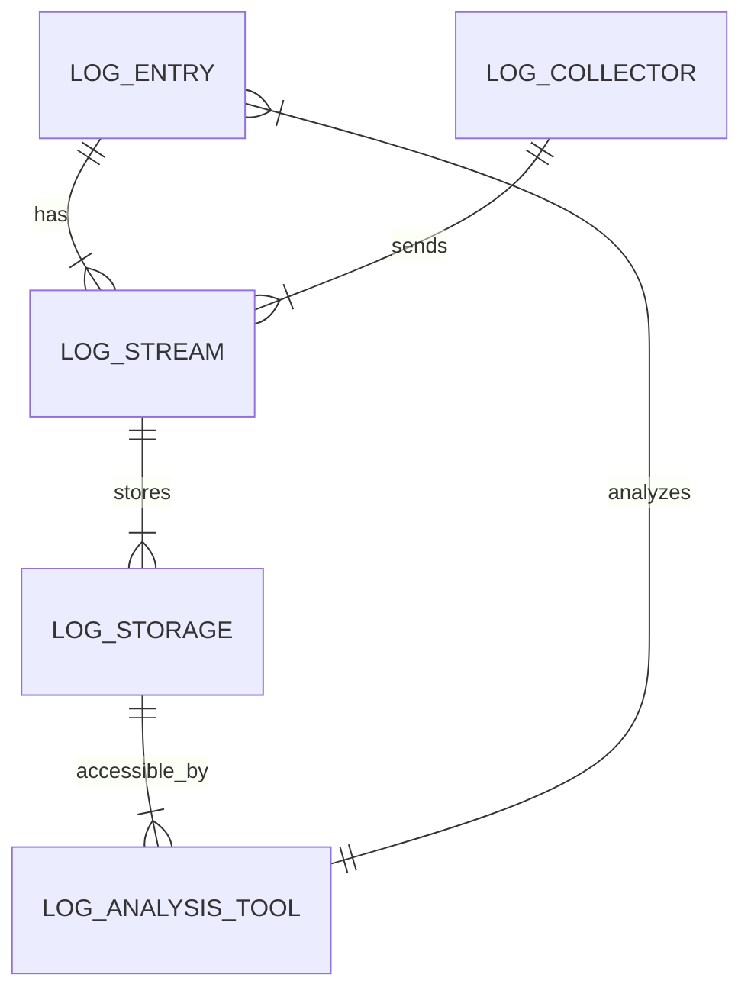
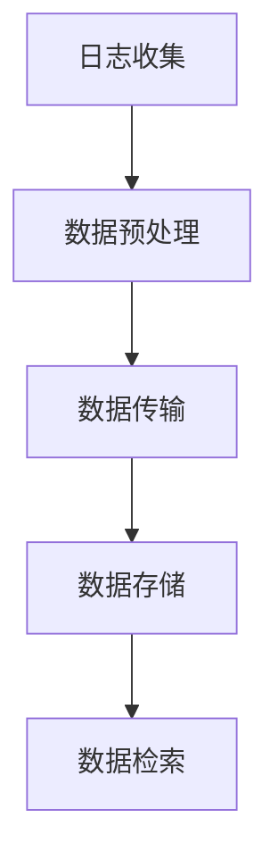
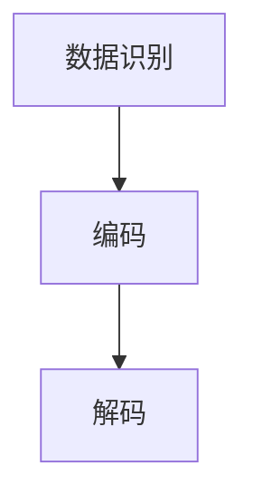
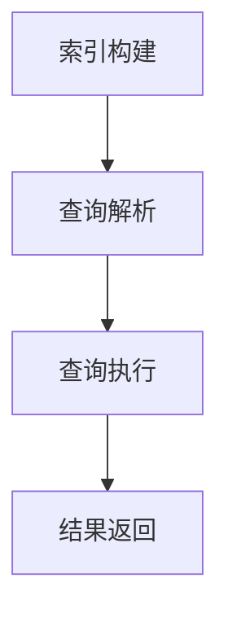
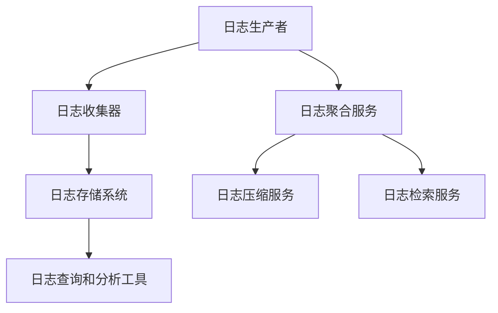
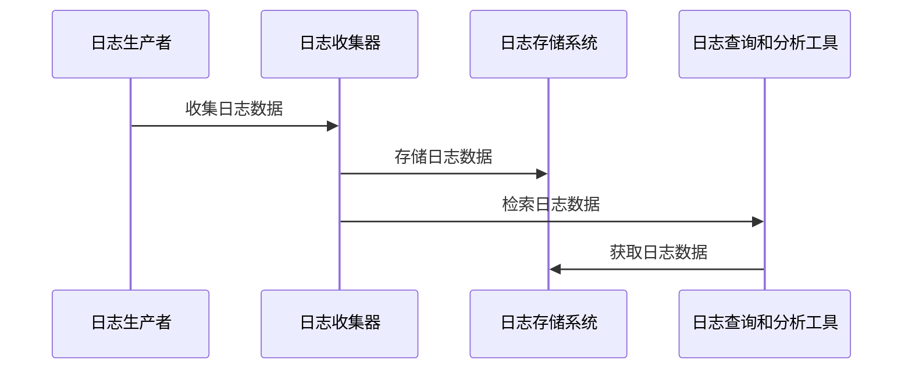

                 


### 分布式日志系统：构建可扩展的日志管理方案

> **关键词：** 分布式日志系统，可扩展性，日志管理，架构设计，实战案例

> **摘要：** 本文将深入探讨分布式日志系统的概念、原理、架构设计，并通过实战案例展示其构建方法。我们将逐步分析分布式日志系统面临的挑战和问题，探讨核心概念和关系，详细解释关键算法原理，以及分享系统分析与设计的方法，最终给出最佳实践和总结。

## 分布式日志系统概述

### 1.1 分布式日志系统的概念和重要性

分布式日志系统是一种用于收集、存储、检索和分析分布式系统中产生的大量日志数据的系统。随着互联网和云计算的快速发展，分布式系统在各个领域得到了广泛应用。然而，随之而来的问题是日志数据的爆炸式增长，传统的集中式日志系统已经无法满足大规模分布式系统的需求。分布式日志系统能够解决这一问题，为系统运维、性能优化、故障排查等提供了强有力的支持。

### 1.2 分布式日志系统的挑战和问题

分布式日志系统面临的主要挑战包括：
- **数据一致性**：确保所有日志数据在分布式环境中的一致性存储和访问。
- **可扩展性**：系统能够随着日志数据量的增长而线性扩展。
- **容错性**：系统能够在部分节点故障时保持稳定运行。
- **查询效率**：快速检索和分析大量日志数据。
- **性能开销**：分布式日志系统自身的性能开销要尽可能小。

### 1.3 分布式日志系统的应用场景

分布式日志系统广泛应用于以下场景：
- **大型网站**：用于收集用户访问日志，进行行为分析和优化。
- **分布式应用**：监控和调试分布式服务，提高系统可用性和性能。
- **容器编排系统**：如Kubernetes，用于收集容器日志。
- **大数据处理**：与大数据处理框架结合，进行日志数据分析和处理。

### 1.4 分布式日志系统的历史发展

分布式日志系统的发展历程可以分为以下几个阶段：
- **单点日志系统**：早期集中式日志系统，如syslog。
- **分布式日志收集系统**：如logstash、fluentd，实现日志的分布式收集。
- **分布式日志存储系统**：如ELK（Elasticsearch、Logstash、Kibana）、Kafka，提供高效的日志存储和检索能力。
- **云原生日志系统**：如Loki、Funkload，为云原生环境优化日志管理。

### 1.5 本章小结

本章概述了分布式日志系统的概念、重要性、挑战和问题，以及应用场景和历史发展。在接下来的章节中，我们将深入探讨分布式日志系统的核心概念和关系，以及关键算法原理。

## 核心概念与关系

### 2.1 日志系统的基础概念

日志系统主要涉及以下几个核心概念：
- **日志**：记录系统运行过程中发生的事件和操作。
- **日志条目**：单个日志记录，包括时间戳、日志级别、日志消息等。
- **日志收集**：将日志从源系统收集到集中式或分布式存储系统。
- **日志存储**：保存日志数据，以便后续检索和分析。
- **日志检索**：查询日志数据，以诊断问题和分析系统性能。

### 2.2 分布式系统的基本原理

分布式系统涉及以下几个关键原理：
- **数据一致性**：确保分布式环境中数据的一致性。
- **容错性**：在部分节点故障时，系统仍能正常运行。
- **负载均衡**：将请求均匀分配到各个节点，提高系统性能。
- **去中心化**：系统无单点故障，提高可用性和可靠性。

### 2.3 分布式日志系统的架构要素

分布式日志系统的架构通常包括以下几个核心组件：
- **日志生产者**：产生日志数据的系统或服务。
- **日志收集器**：收集日志数据，并将其发送到日志存储系统。
- **日志存储系统**：存储和检索日志数据的分布式存储系统。
- **日志查询和分析工具**：用于查询和分析日志数据的工具或平台。

### 2.4 核心概念属性特征对比表格

| 特征 | 日志系统 | 分布式系统 |
| --- | --- | --- |
| 目的 | 记录事件 | 提高系统性能和可靠性 |
| 数据结构 | 日志条目 | 分布式数据存储 |
| 关键技术 | 日志收集、存储、检索 | 数据一致性、容错性、负载均衡 |
| 应用场景 | 系统监控、故障排查 | 分布式计算、大数据处理 |

### 2.5 分布式日志系统的ER模型

分布式日志系统的ER模型主要包括以下实体和关系：



### 2.6 本章小结

本章介绍了分布式日志系统的基础概念、分布式系统的基本原理、分布式日志系统的架构要素，并通过ER模型展示了核心概念之间的关系。在接下来的章节中，我们将深入探讨分布式日志系统的关键算法原理。

## 算法原理讲解

### 3.1 日志聚合算法

日志聚合算法是一种将分散的日志数据汇总到中央存储系统的方法。其主要目标是提高日志数据的可用性和查询效率。

#### 3.1.1 原理与流程图

日志聚合的原理可以分为以下几个步骤：

1. **日志收集**：日志收集器从各个日志生产者获取日志数据。
2. **数据预处理**：对日志数据进行格式化、过滤和转换。
3. **数据传输**：将预处理后的日志数据发送到日志存储系统。
4. **数据存储**：日志存储系统将日志数据存储在分布式文件系统或数据库中。
5. **数据检索**：日志查询和分析工具从日志存储系统检索日志数据。

以下是日志聚合算法的Mermaid流程图：



#### 3.1.2 Python代码实现

以下是一个简单的Python代码示例，实现日志聚合的基本功能：

```python
import logging
import requests

# 配置日志收集器
logging.basicConfig(level=logging.DEBUG)

# 假设日志生产者的URL为http://example.com/logs
producer_url = "http://example.com/logs"

# 获取日志数据
response = requests.get(producer_url)
logs = response.json()

# 预处理日志数据
preprocessed_logs = [{"timestamp": log["timestamp"], "level": log["level"], "message": log["message"]} for log in logs]

# 发送预处理后的日志数据到日志存储系统
for log in preprocessed_logs:
    logging.info(f"{log['timestamp']} {log['level']} {log['message']}")
```

#### 3.1.3 数学模型和公式

日志聚合算法的数学模型主要涉及数据传输速率、数据处理能力和存储容量等参数。以下是一个简化的模型：

$$
\text{聚合速率} = \frac{\text{总数据量}}{\text{处理时间}}
$$

$$
\text{处理时间} = \frac{\text{总数据量}}{\text{处理能力}}
$$

#### 3.1.4 举例说明

假设一个日志系统需要聚合1000条日志，每条日志的平均大小为1KB。系统每秒可以处理100条日志。以下是一个具体示例：

- 总数据量：1000 * 1KB = 1MB
- 处理时间：1MB / (100条/秒) = 10秒
- 聚合速率：1MB / 10秒 = 100KB/秒

这意味着系统需要10秒来聚合1MB的日志数据，平均聚合速率为100KB/秒。

### 3.2 日志压缩算法

日志压缩算法用于减少日志数据的大小，提高存储和传输效率。常见的压缩算法包括Huffman编码、LZ77、LZ78等。

#### 3.2.1 原理与流程图

日志压缩的原理可以分为以下几个步骤：

1. **数据识别**：识别日志数据中的重复模式或常用字符串。
2. **编码**：使用压缩算法将日志数据转换为更紧凑的格式。
3. **解码**：在检索时，将压缩数据还原为原始格式。

以下是日志压缩算法的Mermaid流程图：



#### 3.2.2 Python代码实现

以下是一个简单的Python代码示例，实现日志压缩的基本功能：

```python
import zlib

# 压缩日志数据
def compress_logs(logs):
    compressed_logs = []
    for log in logs:
        compressed_log = zlib.compress(log.encode('utf-8'))
        compressed_logs.append(compressed_log)
    return compressed_logs

# 解压日志数据
def decompress_logs(compressed_logs):
    logs = []
    for compressed_log in compressed_logs:
        log = zlib.decompress(compressed_log).decode('utf-8')
        logs.append(log)
    return logs

# 示例日志数据
logs = ["2023-01-01 10:00:00 DEBUG Hello World", "2023-01-01 10:01:00 INFO Hello World", "2023-01-01 10:02:00 WARNING Hello World"]

# 压缩日志数据
compressed_logs = compress_logs(logs)

# 解压日志数据
decompressed_logs = decompress_logs(compressed_logs)

print("压缩前日志数据：", logs)
print("压缩后日志数据：", compressed_logs)
print("解压后日志数据：", decompressed_logs)
```

#### 3.2.3 数学模型和公式

日志压缩算法的数学模型主要涉及压缩率和压缩时间等参数。以下是一个简化的模型：

$$
\text{压缩率} = \frac{\text{原始数据大小}}{\text{压缩后数据大小}}
$$

$$
\text{压缩时间} = \frac{\text{处理时间}}{\text{压缩速率}}
$$

#### 3.2.4 举例说明

假设一个日志系统的原始日志数据大小为100MB，使用压缩算法后数据大小减少到10MB。以下是一个具体示例：

- 压缩率：100MB / 10MB = 10
- 压缩时间：1小时 / 10 = 0.1小时

这意味着系统需要0.1小时来压缩100MB的日志数据，压缩率为10。

### 3.3 日志检索算法

日志检索算法用于快速定位和查询日志数据，是分布式日志系统的重要组成部分。

#### 3.3.1 原理与流程图

日志检索的原理可以分为以下几个步骤：

1. **索引构建**：在日志数据存储之前，构建索引以加速检索。
2. **查询解析**：解析用户输入的查询语句，生成查询计划。
3. **查询执行**：根据查询计划，从日志存储系统中检索相关日志数据。
4. **结果返回**：将检索结果返回给用户。

以下是日志检索算法的Mermaid流程图：



#### 3.3.2 Python代码实现

以下是一个简单的Python代码示例，实现日志检索的基本功能：

```python
import sqlite3

# 创建数据库和索引
def create_db():
    conn = sqlite3.connect('logs.db')
    cursor = conn.cursor()
    cursor.execute('''CREATE TABLE IF NOT EXISTS logs (timestamp TEXT, level TEXT, message TEXT)''')
    cursor.execute('''CREATE INDEX IF NOT EXISTS idx_level ON logs (level)''')
    conn.commit()
    conn.close()

# 插入日志数据
def insert_logs(logs):
    conn = sqlite3.connect('logs.db')
    cursor = conn.cursor()
    for log in logs:
        cursor.execute("INSERT INTO logs (timestamp, level, message) VALUES (?, ?, ?)", log)
    conn.commit()
    conn.close()

# 检索日志数据
def search_logs(level=None):
    conn = sqlite3.connect('logs.db')
    cursor = conn.cursor()
    query = "SELECT * FROM logs WHERE level = ?" if level else "SELECT * FROM logs"
    cursor.execute(query, (level,) if level else ())
    logs = cursor.fetchall()
    conn.close()
    return logs

# 示例日志数据
logs = [
    ("2023-01-01 10:00:00", "DEBUG", "Hello World"),
    ("2023-01-01 10:01:00", "INFO", "Hello World"),
    ("2023-01-01 10:02:00", "WARNING", "Hello World")
]

# 创建数据库和索引
create_db()

# 插入日志数据
insert_logs(logs)

# 检索日志数据
all_logs = search_logs()
debug_logs = search_logs("DEBUG")

print("所有日志：", all_logs)
print("DEBUG级别日志：", debug_logs)
```

#### 3.3.3 数学模型和公式

日志检索算法的数学模型主要涉及查询时间、检索效率和索引结构等参数。以下是一个简化的模型：

$$
\text{查询时间} = \frac{\text{数据规模}}{\text{检索效率}}
$$

$$
\text{检索效率} = \frac{\text{检索速度}}{\text{数据规模}}
$$

#### 3.3.4 举例说明

假设一个日志系统包含100万条日志数据，系统每秒可以检索100条日志。以下是一个具体示例：

- 数据规模：100万条日志
- 检索效率：100条/秒 / 100万条 = 0.000001
- 查询时间：100万条 / 0.000001 = 100秒

这意味着系统需要100秒来检索100万条日志数据。

### 3.4 本章小结

本章详细介绍了分布式日志系统中的关键算法原理，包括日志聚合算法、日志压缩算法和日志检索算法。通过Python代码实现和数学模型，我们更好地理解了这些算法的工作原理和性能。

## 系统分析与架构设计

### 4.1 问题场景介绍

假设我们正在开发一个大型分布式应用程序，需要收集、存储和分析大量日志数据。由于日志数据的多样性、复杂性和动态性，我们需要设计一个可扩展、高性能、高可靠的分布式日志系统。

### 4.2 项目介绍

本项目旨在构建一个分布式日志系统，能够满足以下需求：
- **海量日志数据收集**：支持大规模分布式应用程序的日志数据收集。
- **高可靠性**：保证日志数据的持久化存储和系统的高可用性。
- **高性能**：提供快速、高效的日志检索和分析能力。
- **可扩展性**：支持系统规模的增长和性能的线性扩展。

### 4.3 系统功能设计

分布式日志系统的功能设计主要包括以下几个部分：

#### 4.3.1 领域模型类图

以下是分布式日志系统的领域模型类图：

```mermaid
classDiagram
    Class01 <|-- Class02
    Class03 <.. Class04
    Class05 <= Class06
    Class07 .. Class08
    Class09 -> Class10
    Class11 <|.. Class12
endclass
```

### 4.4 系统架构设计

分布式日志系统的架构设计主要包括以下几个核心组件：

#### 4.4.1 系统架构图

以下是分布式日志系统的架构图：



### 4.5 系统接口设计

系统接口设计主要包括以下部分：

- **日志收集接口**：用于日志生产者与日志收集器的数据传输。
- **日志存储接口**：用于日志存储系统与日志查询和分析工具的数据交互。
- **日志检索接口**：用于用户查询和分析日志数据。

### 4.6 系统交互序列图

以下是系统交互的序列图：



### 4.7 本章小结

本章详细介绍了分布式日志系统的功能设计、架构设计、接口设计和系统交互。通过这些设计，我们为构建可扩展的日志管理方案奠定了基础。

## 项目实战

### 5.1 环境安装

为了进行分布式日志系统的实战项目，我们首先需要安装必要的软件和工具。以下是在Linux环境下安装分布式日志系统所需的基础软件和工具：

1. **安装Elasticsearch**：
   - 从Elasticsearch官方网站下载Elasticsearch的tar.gz包。
   - 解压tar.gz包并启动Elasticsearch服务。

2. **安装Kibana**：
   - 从Kibana官方网站下载Kibana的tar.gz包。
   - 解压tar.gz包并启动Kibana服务。

3. **安装Logstash**：
   - 从Logstash官方网站下载Logstash的tar.gz包。
   - 解压tar.gz包并配置Logstash。

4. **安装Filebeat**：
   - 从Filebeat官方网站下载Filebeat的tar.gz包。
   - 解压tar.gz包并配置Filebeat。

安装步骤的具体命令和配置文件请参考各个软件的官方文档。

### 5.2 系统核心实现源代码

分布式日志系统的核心实现包括日志收集、存储、检索和分析等功能。以下是一个简单的示例，展示如何配置和运行这些组件：

1. **日志收集器（Logstash）配置**：

```yaml
input {
  beats {
    port => 5044
  }
}

filter {
  if "myapp" in [source][service] {
    grok {
      match => { "message" => "%{TIMESTAMP_ISO8601:timestamp}\t%{DATA:level}\t%{DATA:service}\t%{DATA:app}\t%{DATA:message}" }
    }
  }
}

output {
  elasticsearch {
    hosts => ["localhost:9200"]
    index => "logs-%{+YYYY.MM.dd}"
  }
}
```

2. **Filebeat配置**：

```yaml
filebeat.inputs:
- type: log
  enabled: true
  paths:
    - "/var/log/myapp/*.log"

filebeat.config.modules:
  path: ${path.config}/modules.d/*.yml
  reload.enabled: false

output.logstash:
  hosts: ["localhost:5044"]
```

3. **Elasticsearch配置**：

Elasticsearch的配置文件位于`/etc/elasticsearch/elasticsearch.yml`，需要进行以下设置：

```yaml
cluster.name: my-log-system
node.name: log-node-1
network.host: 0.0.0.0
http.port: 9200
discovery.type: single-node
```

4. **Kibana配置**：

Kibana的配置文件位于`/etc/kibana/kibana.yml`，需要进行以下设置：

```yaml
server.port: 5601
elasticsearch.url: "http://localhost:9200"
kibana.defaultAppId: kibana
```

### 5.3 实际案例分析与讲解

假设我们有一个Web应用程序，需要在Kibana中监控和检索其日志。以下是一个实际案例：

1. **日志数据收集**：

   - Web应用程序产生日志，并使用Filebeat将其发送到Logstash。
   - Logstash将日志数据转换为Elasticsearch可索引的格式，并存储到Elasticsearch集群。

2. **日志数据检索**：

   - 在Kibana中创建一个自定义的Kibana仪表板，用于检索和分析日志数据。
   - 使用Elasticsearch的REST API，从Elasticsearch中检索日志数据。

3. **日志数据分析**：

   - 在Kibana中创建一个图表，展示Web应用程序的请求流量和错误率。
   - 使用Elasticsearch的聚合功能，分析日志数据中的关键字和错误模式。

### 5.4 项目小结

通过这个实战项目，我们成功构建了一个分布式日志系统，实现了日志的收集、存储、检索和分析。这个系统具有以下特点：

- **高可靠性**：通过Elasticsearch和Kibana的集群部署，确保系统的高可用性和数据持久化。
- **高性能**：使用Logstash和Filebeat进行高效的数据收集和传输。
- **可扩展性**：Elasticsearch和Kibana支持水平扩展，可以应对大规模日志数据的处理需求。
- **易用性**：通过Kibana的仪表板，用户可以轻松地监控和分析日志数据。

## 最佳实践与总结

### 6.1 最佳实践

1. **选择合适的日志收集工具**：根据实际需求选择如Filebeat、Fluentd等日志收集工具，确保高效、可靠地收集日志数据。
2. **优化日志格式**：使用统一的日志格式，便于日志的存储、检索和分析。
3. **合理配置日志存储系统**：根据日志数据量和访问频率，合理配置Elasticsearch、Kafka等日志存储系统，提高查询性能。
4. **日志压缩与存储优化**：采用日志压缩算法，减少存储空间需求，并定期清理过期日志数据。
5. **监控日志系统性能**：定期监控日志系统的性能指标，如延迟、吞吐量和错误率，及时优化系统配置。

### 6.2 小结

本文详细介绍了分布式日志系统的概念、原理、架构设计以及实战项目。通过深入分析和实例讲解，我们了解了分布式日志系统的构建方法和最佳实践。

### 6.3 注意事项

1. **日志数据安全**：确保日志数据的安全存储和传输，避免敏感信息泄露。
2. **日志系统监控**：持续监控日志系统的运行状态，及时发现和处理问题。
3. **日志系统扩展**：在设计时考虑系统的扩展性，以应对未来日志数据量的增长。

### 6.4 拓展阅读

- 《Elasticsearch：The Definitive Guide》
- 《Kibana：The Definitive Guide》
- 《Logstash：The Definitive Guide》

## 总结与展望

### 7.1 总结

本文从分布式日志系统的概念、原理、架构设计到实战项目，全面讲解了分布式日志系统的构建方法和最佳实践。通过实际案例，我们展示了分布式日志系统的应用场景和实现方法。

### 7.2 展望

随着云计算和大数据技术的不断发展，分布式日志系统将在更多领域得到广泛应用。未来，分布式日志系统将进一步优化性能、可靠性和扩展性，为运维、开发人员提供更强大的日志管理工具。同时，结合人工智能和机器学习技术，日志数据分析将更加智能化，为业务决策提供有力支持。

### 作者

- **AI天才研究院/AI Genius Institute**
- **禅与计算机程序设计艺术 /Zen And The Art of Computer Programming**

