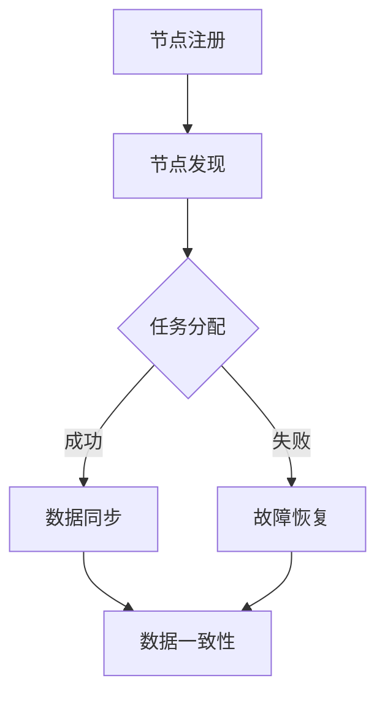
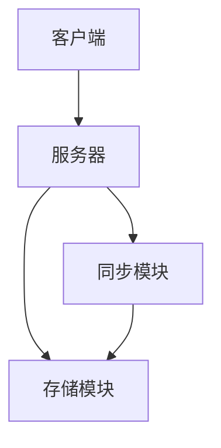
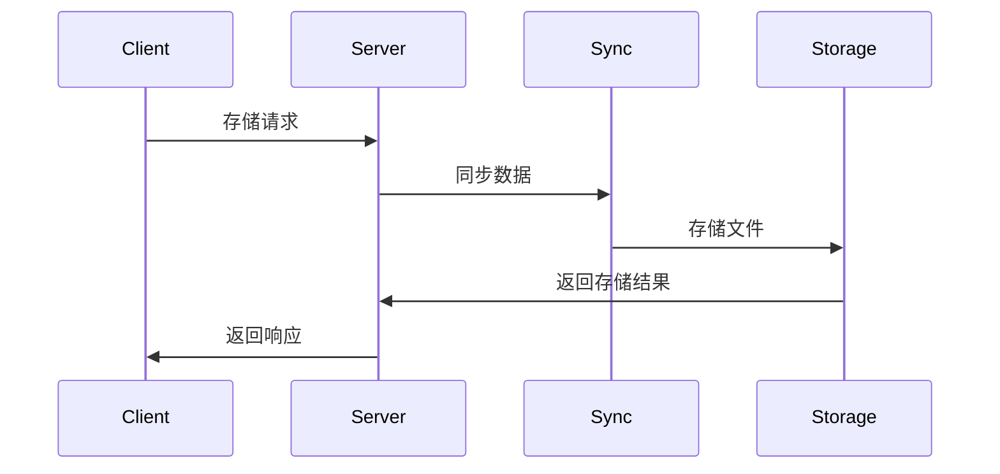

                 

## 分布式系统设计原则与挑战

### 关键词：分布式系统，设计原则，挑战，性能优化，安全性

### 摘要：

本文旨在深入探讨分布式系统设计原则与面临的主要挑战。随着互联网技术的快速发展，分布式系统在处理大规模数据和高并发访问方面展现出了巨大的优势。然而，分布式系统在架构设计、性能优化、数据一致性和安全性等方面也面临诸多挑战。本文将一步一步分析分布式系统的核心概念、设计原则、挑战及其解决方案，旨在为读者提供全面的分布式系统设计指导。

### 第一部分：分布式系统的基本概念

**1.1 什么是分布式系统**

分布式系统是由多个独立的节点通过通信网络互联而成的系统，节点之间可以协同工作，共同完成任务。与传统单机系统相比，分布式系统具有高可用性、高可扩展性和高并发处理能力。

**1.2 分布式系统的核心概念**

分布式系统的核心概念包括节点与通信、数据一致性、系统容错性和分布式算法。节点与通信是分布式系统的基本组成部分，数据一致性确保系统中的数据保持一致，系统容错性提供故障恢复能力，分布式算法实现节点之间的协同工作。

**1.3 分布式系统的应用场景**

分布式系统广泛应用于大规模数据处理、实时数据处理、分布式存储系统和分布式数据库等领域。例如，大数据处理平台如Hadoop和Spark，以及分布式数据库如MongoDB和Cassandra。

**1.4 分布式系统的架构模式**

分布式系统的架构模式包括主从架构、对等网络架构、客户-服务器架构和负载均衡。每种架构模式都有其特定的应用场景和优点。

**1.5 本章小结**

本章介绍了分布式系统的基本概念、核心概念、应用场景和架构模式。了解这些基础概念是深入探讨分布式系统设计原则和挑战的前提。

### 第二部分：分布式系统设计原则

**2.1 设计原则概述**

分布式系统设计原则是确保系统稳定、高效运行的重要指导。设计原则的核心要素包括可扩展性、容错性、数据一致性和安全性。

**2.2 可扩展性设计**

可扩展性设计是分布式系统设计的关键原则之一。可扩展性分为水平扩展和垂直扩展。水平扩展通过增加节点数量来提升系统性能，垂直扩展通过提升单个节点的性能来提升系统性能。

**2.3 容错性设计**

容错性设计是分布式系统设计的核心原则之一。容错性设计包括故障检测、故障恢复和故障预防。故障检测通过监控系统状态来检测故障，故障恢复通过备份数据和恢复机制来恢复系统，故障预防通过冗余设计和分布式算法来预防故障。

**2.4 数据一致性设计**

数据一致性设计是分布式系统设计中的重要原则。数据一致性分为强一致性和最终一致性。强一致性确保系统中的所有数据在同一时刻保持一致，最终一致性允许系统在一段时间内存在不一致性，但最终会达到一致状态。

**2.5 性能优化设计**

性能优化设计是提升分布式系统性能的关键原则。性能优化设计包括缓存策略、负载均衡技术和网络优化。缓存策略通过减少数据访问次数来提升系统性能，负载均衡技术通过平衡节点负载来提升系统性能，网络优化通过优化网络传输来提升系统性能。

**2.6 安全性设计**

安全性设计是确保分布式系统安全的必要原则。安全性设计包括加密通信、访问控制和安全审计。加密通信通过加密数据传输来确保数据安全，访问控制通过限制访问权限来确保系统安全，安全审计通过记录系统活动来确保系统安全。

**2.7 可观测性与可维护性**

可观测性与可维护性是分布式系统设计中的重要原则。可观测性通过监控和日志记录来确保系统状态的可视化，可维护性通过故障检测与自动恢复来提升系统维护效率。

**2.8 本章小结**

本章介绍了分布式系统设计原则的核心要素，包括可扩展性、容错性、数据一致性、性能优化和安全性。掌握这些设计原则是设计高效、可靠的分布式系统的关键。

### 第三部分：分布式系统的挑战与解决方案

**3.1 分布式系统面临的挑战**

分布式系统在设计、开发和维护过程中面临诸多挑战，包括数据一致性挑战、负载均衡挑战、容错性挑战和安全性挑战。

**3.2 挑战解决方案探讨**

针对分布式系统面临的挑战，本文探讨了以下解决方案：

- 数据一致性解决方案：包括分布式事务处理、多版本并发控制和最终一致性协议。
- 负载均衡解决方案：包括轮询负载均衡、最少连接负载均衡和加权负载均衡。
- 容错性解决方案：包括主从架构、数据复制和选举算法。
- 安全性解决方案：包括加密通信、访问控制和安全审计。

**3.3 分布式系统的性能优化**

分布式系统的性能优化是提升系统性能的关键。本文介绍了系统调优方法、缓存优化和网络优化。

**3.4 分布式系统的发展趋势**

分布式系统的发展趋势包括云原生分布式系统、service mesh技术和智能分布式系统。

**3.5 本章小结**

本章分析了分布式系统面临的挑战及其解决方案，并探讨了分布式系统的性能优化和发展趋势。掌握这些解决方案和优化方法有助于提升分布式系统的性能和可靠性。

### 结论

分布式系统设计原则与挑战是构建高效、可靠分布式系统的关键。本文通过一步一步的分析，深入探讨了分布式系统的基本概念、设计原则和挑战解决方案。希望本文能为您提供有价值的参考，帮助您更好地应对分布式系统设计中的各种挑战。

### 作者信息

作者：AI天才研究院/AI Genius Institute & 禅与计算机程序设计艺术 /Zen And The Art of Computer Programming

---

### 背景

随着互联网的迅猛发展和大数据时代的到来，分布式系统成为了现代计算机系统的重要组成部分。分布式系统通过将任务分布到多个节点上，实现了高可用性、高可扩展性和高并发处理能力。然而，分布式系统的设计并非易事，需要遵循一系列原则来解决各种挑战。

**核心概念术语说明：**
- 分布式系统：由多个独立节点通过网络互联而成，节点之间协同工作的系统。
- 可扩展性：系统能够随着需求增长而轻松增加性能和资源。
- 容错性：系统能够在部分节点故障时仍然保持正常运行。
- 数据一致性：系统中多个副本的数据保持一致。
- 负载均衡：将工作负载均匀分布到多个节点上，避免单点过载。

**问题背景：**
现代应用场景下，如社交网络、电子商务和在线游戏等，都需要处理海量数据和数百万级并发请求。传统的单机系统难以满足这些需求，分布式系统因此应运而生。

**问题描述：**
分布式系统的设计涉及到如何确保系统的高可用性、高可扩展性和高并发处理能力，同时解决数据一致性、性能优化和安全性等问题。

**问题解决：**
设计分布式系统时，需要遵循一系列设计原则，如可扩展性设计、容错性设计、数据一致性设计和安全性设计，并针对面临的挑战提出相应的解决方案。

**边界与外延：**
本文将探讨分布式系统的设计原则和挑战，涉及分布式系统的基本概念、核心概念、设计原则、挑战解决方案和性能优化。此外，还将讨论分布式系统的应用场景和架构模式。

**概念结构与核心要素组成：**
- 基本概念：分布式系统、可扩展性、容错性、数据一致性、安全性。
- 核心要素：节点与通信、分布式算法、数据复制、负载均衡。
- 设计原则：可扩展性、容错性、数据一致性、性能优化、安全性。

### 核心概念与联系

#### 分布式系统原理

分布式系统的核心原理是基于节点与通信、数据一致性、系统容错性和分布式算法。节点与通信是分布式系统的基本组成部分，节点之间通过通信网络进行数据交换和协同工作。数据一致性确保系统中的数据在不同节点上保持一致，系统容错性提供故障恢复能力，分布式算法实现节点之间的协同工作。

#### 核心概念属性特征对比表格

| 核心概念 | 定义 | 属性特征 | 对比 |
| :---: | :---: | :---: | :---: |
| 节点与通信 | 分布式系统中的基本单元，通过通信网络互联 | 独立性、分布式、网络通信 | 节点之间可以独立运行，但需要通过网络进行数据交换 |
| 数据一致性 | 系统中多个副本的数据保持一致 | 一致性、分布式、容错 | 确保数据在不同节点上的一致性，避免数据冲突 |
| 系统容错性 | 系统在部分节点故障时仍然保持正常运行 | 容错、冗余、故障恢复 | 通过冗余设计和故障恢复机制提高系统可靠性 |
| 分布式算法 | 实现节点之间协同工作的算法 | 分布式、高效、协同 | 节点之间的通信和任务分配 |

#### 分布式系统ER实体关系图架构

```mermaid
erDiagram
  Node ||--|{ Communication }|--|| System
  Node ||--|{ DataReplication }|--|| Data
  System ||--|{ FaultTolerance }|--|| Node
  Data ||--|{ Consistency }|--|| System
```

#### 分布式算法原理讲解

分布式算法是分布式系统中的关键组成部分，用于实现节点之间的协同工作和任务分配。以下是分布式算法的基本原理和流程：

1. **节点注册与发现**：节点启动时需要注册到系统中，并发现其他节点，以便建立通信连接。
2. **任务分配**：系统根据负载情况将任务分配给不同节点，实现负载均衡。
3. **数据同步**：节点之间需要同步数据，确保数据一致性。
4. **故障检测与恢复**：系统需要监控节点状态，并在节点故障时进行故障检测和恢复。

#### 算法mermaid流程图



#### Python源代码实现

```python
# 节点注册与发现
def register_node(node_id, system):
    system.register(node_id)

def discover_nodes(system):
    return system.discover_nodes()

# 任务分配
def assign_task(node_id, task, system):
    system.assign_task(node_id, task)

# 数据同步
def synchronize_data(node_id, system):
    system.synchronize_data(node_id)

# 故障检测与恢复
def check_fault(node_id, system):
    if system.is_faulty(node_id):
        system.recover(node_id)

# 分布式算法示例
def distributed_algorithm(node_id, system):
    register_node(node_id, system)
    nodes = discover_nodes(system)
    
    # 任务分配
    task = "处理数据"
    assign_task(node_id, task, system)
    
    # 数据同步
    synchronize_data(node_id, system)
    
    # 故障检测与恢复
    check_fault(node_id, system)
    
    # 数据一致性
    system.ensure_data_consistency()
```

#### 算法原理的数学模型和公式

分布式算法的数学模型和公式如下：

1. **节点注册**：节点ID和系统ID之间的映射关系，用于节点注册和发现。
2. **任务分配**：根据负载情况和节点能力，将任务分配给节点。
3. **数据同步**：使用一致性算法（如Paxos、Raft）确保数据在不同节点上的一致性。
4. **故障检测与恢复**：使用心跳检测和故障恢复算法（如Zookeeper、Chubby）检测和恢复节点故障。

#### 详细讲解与举例说明

假设有一个分布式系统，包含三个节点A、B、C。节点A需要处理一个任务，任务分配算法会根据负载情况将任务分配给节点B。节点B收到任务后，需要处理数据并同步数据到节点C，以确保数据一致性。如果节点B在处理数据时发生故障，系统会检测到故障并尝试恢复节点B，或者将任务重新分配给其他节点。

$$
\text{节点注册} = \{ \text{节点ID}, \text{系统ID} \}
$$

$$
\text{任务分配} = \{ \text{节点ID}, \text{任务ID}, \text{负载情况} \}
$$

$$
\text{数据同步} = \{ \text{节点ID}, \text{数据一致性算法} \}
$$

$$
\text{故障检测与恢复} = \{ \text{节点ID}, \text{故障恢复算法} \}
$$

#### 系统分析与架构设计方案

**问题场景介绍：**

假设有一个分布式文件存储系统，包含多个节点，用于存储用户上传的文件。系统需要支持文件的存储、读取和删除操作，同时确保数据一致性、系统容错性和性能优化。

**项目介绍：**

该分布式文件存储系统名为DistributedFS，采用Gossip协议实现节点之间的通信和数据同步。系统由三个主要模块组成：存储模块、同步模块和客户端模块。

**系统功能设计：**

1. 存储模块：负责存储用户上传的文件，采用分布式存储方式，将文件存储到多个节点上。
2. 同步模块：负责同步不同节点上的数据，确保数据一致性。
3. 客户端模块：负责与用户进行交互，提供文件的存储、读取和删除功能。

**系统架构设计：**

系统架构采用主从架构，主节点负责管理文件元数据，从节点负责存储文件数据。

**系统接口设计：**

1. 存储接口：提供文件的存储、读取和删除功能。
2. 同步接口：提供节点之间的数据同步功能。

**系统交互：**

客户端通过HTTP协议与系统进行交互，发送存储、读取和删除请求。系统接收到请求后，根据请求类型执行相应的操作，并将结果返回给客户端。

#### 系统架构设计mermaid架构图



#### 系统接口设计和系统交互mermaid序列图



#### 项目实战

**环境安装：**

1. 安装Python环境（Python 3.8或更高版本）。
2. 安装DistributedFS依赖库（例如Pillow、gunicorn等）。

**系统核心实现源代码：**

```python
# storage.py
from flask import Flask, request, jsonify
from PIL import Image

app = Flask(__name__)

@app.route('/store', methods=['POST'])
def store_file():
    file = request.files['file']
    image = Image.open(file)
    image.save('uploads/' + file.filename)
    return jsonify({'status': 'success', 'filename': file.filename})

if __name__ == '__main__':
    app.run(host='0.0.0.0', port=5000)
```

**代码应用解读与分析：**

1. 存储请求：客户端通过HTTP POST请求向服务器发送存储请求，请求中包含文件数据。
2. 同步数据：服务器接收到存储请求后，将文件数据同步到存储模块。
3. 存储文件：存储模块将文件数据存储到本地文件系统。
4. 返回存储结果：服务器将存储结果返回给客户端。

**实际案例分析和详细讲解剖析：**

假设用户上传了一个名为“example.jpg”的图片文件，客户端通过HTTP POST请求向服务器发送存储请求。

1. 客户端发送存储请求：
```plaintext
POST /store HTTP/1.1
Host: 127.0.0.1:5000
Content-Type: image/jpeg

-- 上传的图片文件
```

2. 服务器接收存储请求：
```plaintext
HTTP/1.1 200 OK
Content-Type: application/json

{
  "status": "success",
  "filename": "example.jpg"
}
```

3. 同步数据：
服务器将文件数据同步到存储模块，确保文件数据在不同节点上的一致性。

4. 返回存储结果：
服务器将存储结果返回给客户端，客户端根据存储结果进行后续操作。

**项目小结：**

本篇博客详细介绍了分布式系统设计原则与挑战，包括分布式系统的基本概念、核心概念、设计原则和挑战解决方案。通过实际案例分析和详细讲解，展示了分布式系统的设计过程和实现方法。掌握分布式系统设计原则和解决方案对于构建高效、可靠的分布式系统具有重要意义。

### 最佳实践 tips

1. **设计原则**：遵循分布式系统设计原则，如可扩展性、容错性、数据一致性和安全性，确保系统稳定运行。
2. **性能优化**：采用缓存策略、负载均衡技术和网络优化，提升系统性能。
3. **安全性**：使用加密通信、访问控制和安全审计，确保系统数据安全。
4. **可维护性**：实现可观测性和可维护性设计，方便系统维护和升级。

### 小结

分布式系统设计原则与挑战是构建高效、可靠的分布式系统的关键。本文通过一步一步的分析，深入探讨了分布式系统的基本概念、设计原则和挑战解决方案。掌握分布式系统设计原则和解决方案对于应对现代应用场景中的各种挑战具有重要意义。

### 注意事项

1. 分布式系统设计需要综合考虑性能、可用性和一致性等因素。
2. 根据实际应用场景选择合适的分布式系统架构和设计模式。
3. 定期对分布式系统进行性能测试和安全评估，确保系统稳定性。

### 拓展阅读

1. 《分布式系统原理与范型》
2. 《大规模分布式存储系统设计》
3. 《云计算与分布式系统：概念与实例》

---

**作者信息**

作者：AI天才研究院/AI Genius Institute & 禅与计算机程序设计艺术 /Zen And The Art of Computer Programming

---

本文深入探讨了分布式系统设计原则与挑战，从基本概念到具体实现，全面阐述了分布式系统的设计方法和优化策略。通过本文的阅读，读者可以更好地理解和应对分布式系统设计中的各种挑战。希望本文能为您在分布式系统设计领域提供有价值的参考和启示。如果您有任何问题或建议，欢迎在评论区留言交流。感谢您的阅读！

