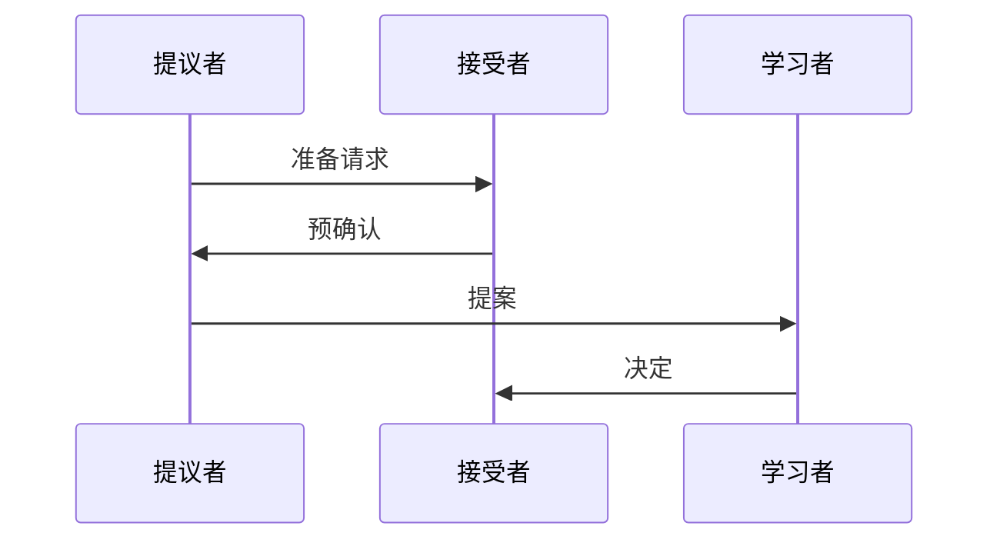
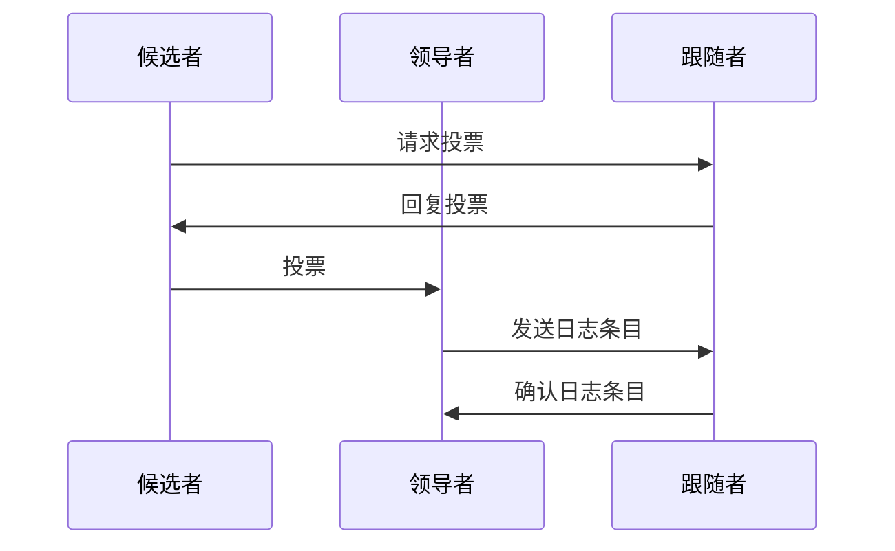
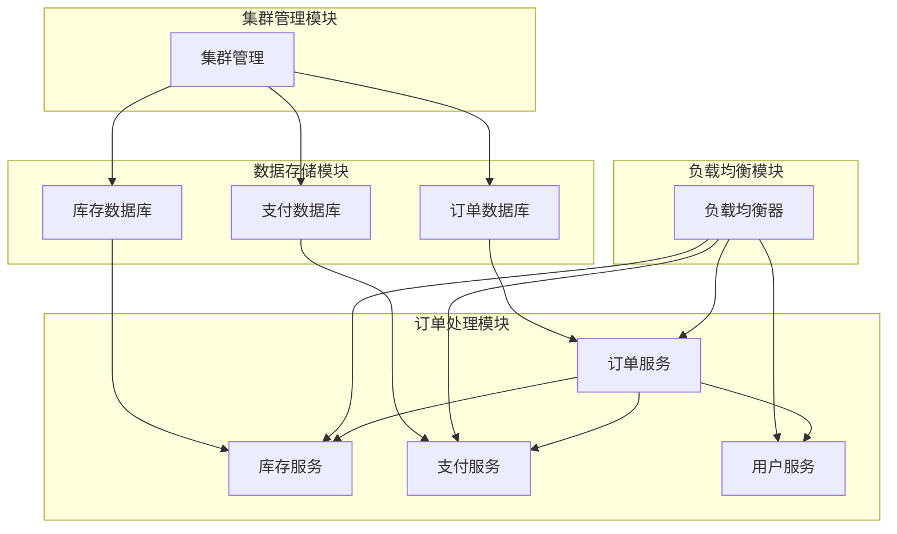

                 

### 分布式系统设计原则：构建可靠的分布式应用

#### 关键词：
- 分布式系统设计
- 可靠性
- 数据一致性
- 容错性
- 高可用性

#### 摘要：
本文深入探讨了分布式系统设计的核心原则，包括数据一致性、容错性、高可用性等关键问题。通过详细阐述这些原则的理论基础和实践方法，本文旨在帮助读者理解并掌握如何构建可靠的分布式应用。文章将结合实际案例，提供最佳实践，为分布式系统开发提供指导。

## 背景介绍

### 分布式系统定义与特点

分布式系统是由多个独立节点组成的计算系统，这些节点通过网络进行通信和协作，共同完成计算任务。与集中式系统不同，分布式系统具有以下几个显著特点：

1. **无全局时钟**：分布式系统中的节点没有统一的时钟，这意味着系统中的时间戳可能不一致，导致数据同步和处理时出现延迟。
2. **数据传输延迟**：由于网络的不确定性，节点之间的数据传输可能存在延迟，这对系统的实时性和一致性提出了挑战。
3. **节点故障**：分布式系统中，节点可能因为硬件故障、网络中断等原因导致不可用，如何保证系统的容错性和高可用性是设计中的关键问题。

### 分布式系统应用场景

分布式系统在许多领域都有广泛的应用，以下是几个典型的应用场景：

1. **云计算**：分布式系统为云计算提供了弹性的计算资源，用户可以根据需求动态分配和释放计算资源。
2. **大数据处理**：分布式系统使得大规模数据处理成为可能，例如Hadoop、Spark等分布式计算框架。
3. **物联网**：分布式系统在物联网中的应用非常广泛，通过分布式节点收集和处理数据，实现智能化和自动化。
4. **金融交易**：分布式系统在金融交易中扮演着重要角色，通过多节点协作，实现高频交易和实时数据处理。

### 分布式系统面临的挑战

分布式系统的设计和实现面临着诸多挑战，主要包括以下几个方面：

1. **数据一致性**：如何在分布式环境下保证数据的一致性，是分布式系统设计中的核心问题。
2. **容错性**：如何处理节点故障，保证系统的高可用性。
3. **高可用性**：如何在分布式环境中保证系统的持续运行。
4. **性能优化**：如何设计高效的分布式算法和架构，提升系统性能。

## 分布式系统设计原则

为了应对上述挑战，分布式系统设计需要遵循一系列核心原则。以下是几个关键原则：

### 最终一致性

分布式系统中的数据一致性目标应该设定为“最终一致性”，而非“实时一致性”。这意味着，虽然数据可能在一段时间内出现不一致，但最终会达到一致状态。通过使用异步复制和最终一致性协议，如CAP理论中的AP模式，可以在保证可用性的同时，实现最终一致性。

### 去中心化

去中心化是分布式系统设计的重要原则之一。通过避免系统中的单点故障，可以提高系统的容错性和可用性。去中心化的设计包括分布式存储、去中心化通信和去中心化决策等。

### 冗余设计

冗余设计是通过在系统中引入冗余节点和数据副本，提高系统的容错性和可用性。冗余设计可以包括节点冗余、数据冗余和功能冗余等。

### 延迟容忍

在分布式系统中，延迟是不可避免的。设计延迟容忍的算法和架构，可以提高系统的性能和可靠性。例如，通过优化网络传输协议和引入延迟容忍算法，可以在一定程度上减少延迟对系统性能的影响。

### 分而治之

分而治之是将复杂的问题分解为多个子问题，分别解决，然后合并结果。这种方法可以提高系统的可维护性和可扩展性，同时降低单个节点处理压力。

## 核心概念与联系

### 核心概念

分布式系统设计中的核心概念包括：

1. **分布式系统**：由多个独立节点组成，通过网络进行通信和协作的计算系统。
2. **一致性**：系统中的所有节点访问到的数据都是一致的。
3. **容错性**：系统能够处理节点故障，保持正常运行。
4. **高可用性**：系统能够持续提供服务，即使部分节点出现故障。

### 概念属性特征对比表格

| 概念       | 定义                                           | 特点                                             | 应用场景                   |
|------------|------------------------------------------------|--------------------------------------------------|----------------------------|
| 分布式系统 | 由多个独立节点组成，通过网络进行通信和协作的系统 | 无全局时钟、数据传输可能存在延迟、节点可能发生故障 | 云计算、大数据处理、物联网等 |
| 数据一致性 | 系统中的所有节点访问到的数据都是一致的         | 确保系统稳定性和用户数据完整性                     | 数据库、缓存、消息队列等     |
| 容错性     | 系统能够处理节点故障，保持正常运行             | 提高系统的可靠性和可用性                         | 分布式存储、负载均衡等       |
| 高可用性   | 系统能够持续提供服务，即使部分节点出现故障     | 以可用性百分比衡量系统的稳定运行                   | 金融交易、关键业务系统等     |

### 概念结构与核心要素组成

分布式系统的核心概念结构与核心要素组成如下：

1. **分布式系统架构**：包括计算节点、数据存储、网络通信等。
2. **一致性算法**：如Paxos、Raft等，用于实现数据一致性。
3. **分布式存储**：如分布式数据库、分布式文件系统等，用于数据存储和访问。
4. **负载均衡**：通过算法将请求均匀分配到多个节点上，提高系统性能。
5. **服务发现**：动态发现和注册系统中的服务，实现服务之间的自动通信。

## 总结

分布式系统设计原则是构建可靠分布式应用的基础。通过理解和遵循这些原则，可以有效地解决分布式系统中的各种挑战，实现高性能、高可用性的系统。本文介绍了分布式系统的定义、特点和应用场景，探讨了分布式系统设计中的关键原则，并给出了核心概念和联系的详细分析。希望本文能为读者在分布式系统设计和开发中提供有价值的参考。

### 分布式一致性算法原理与实现

#### 1. Paxos算法

Paxos算法是一种分布式一致性算法，用于在分布式系统中实现多个副本的数据一致性。Paxos算法的核心思想是通过多个角色的协同工作，达成一致意见。以下是Paxos算法的主要角色和步骤：

**主要角色：**
- **提议者（Proposer）**：提出提议，并发送提议到其他副本。
- **接受者（Acceptor）**：接收提议，并决定是否接受提议。
- **学习者（Learner）**：学习已达成一致的决定。

**Paxos算法步骤：**
1. **准备阶段**：提议者向接受者发送准备请求，接受者收到请求后，如果接受的提案编号高于当前已接受的提案编号，则返回预确认给提议者。
2. **提案阶段**：提议者收到至少2/3的预确认后，可以发送承诺消息给所有接受者，承诺不再提出编号更小的提案。
3. **决定阶段**：接受者收到承诺后，接受提议者提出的提案，并通知学习者。

**Paxos算法的Mermaid流程图：**


#### 2. Raft算法

Raft算法是一种更加易于理解和实现的分布式一致性算法。Raft算法通过定义明确的角色和状态转换，确保系统的一致性。以下是Raft算法的主要角色和步骤：

**主要角色：**
- **领导者（Leader）**：负责处理客户端请求和日志复制。
- **跟随者（Follower）**：接收领导者发送的日志条目，并投票支持领导者。
- **候选者（Candidate）**：在领导者失效时，参与领导者选举。

**Raft算法步骤：**
1. **选举阶段**：候选者发起选举，向其他节点发送请求投票消息。
2. **领导阶段**：当选为领导者后，领导者开始处理客户端请求，并复制日志条目到其他节点。
3. **日志复制阶段**：领导者向跟随者发送日志条目，跟随者确认后，领导者更新状态机。

**Raft算法的Mermaid流程图：**


#### 3. 算法原理与数学模型

Paxos算法和Raft算法的本质都是通过一致性协议确保分布式系统中的多个副本数据一致。以下是这两个算法的数学模型和公式：

**Paxos算法数学模型：**
- **N >= 2f**：N为节点总数，f为故障节点数。
- **一致性条件**：至少2/3的节点达成一致。

**Raft算法数学模型：**
- **领导者选举**：每个节点周期性地发起选举，直到选出领导者。
- **日志复制**：领导者接收客户端请求，将请求转换为日志条目，并发送给跟随者。

#### 4. 算法举例说明

以Paxos算法为例，假设系统中有3个副本（A、B、C），当提议者P0想要将值“X”写入系统时，会执行以下步骤：

1. **准备阶段**：P0发送准备请求到A、B、C。
2. **提案阶段**：A、B收到请求后，如果当前提案编号大于已接受提案编号，则返回预确认消息。
3. **决定阶段**：P0收到至少2个预确认消息后，发送承诺消息给A、B、C。
4. **日志条目阶段**：A、B、C收到承诺消息后，将“X”写入日志，并通知P0。

通过这种方式，系统中的3个副本最终达成一致，确保了数据的一致性和可靠性。

### 分布式一致性算法实现

以下是一个简化的Paxos算法实现，使用Python编写：

```python
# Paxos算法实现（简化版）

import random
import time

class PaxosNode:
    def __init__(self, id):
        self.id = id
        self.pre_vote = -1
        self.pre_accept = -1
        self.accepted_value = None

    def prepare(self, proposal_number):
        if proposal_number > self.pre_vote:
            self.pre_vote = proposal_number
            return True, proposal_number
        return False, self.pre_vote

    def propose(self, proposal_number, value):
        for _ in range(3):  # 向多数派节点发送提案
            random_node = random.randint(0, 2)
            if self.prepare(proposal_number)[0]:
                self.accept(proposal_number, value)

    def accept(self, proposal_number, value):
        if proposal_number > self.pre_accept:
            self.pre_accept = proposal_number
            self.accepted_value = value
            return True
        return False

# 创建节点
nodes = [PaxosNode(i) for i in range(3)]

# 提议者发起提案
proposer = random.randint(0, 2)
nodes[proposer].propose(0, "X")

# 检查一致性
print(f"Node {proposer}: Accepted value: {nodes[proposer].accepted_value}")
```

在这个简化实现中，我们创建了一个包含3个节点的Paxos系统，其中1个节点作为提议者发起提案。通过调用`propose`和`accept`方法，我们可以模拟Paxos算法的核心过程。在实际应用中，节点数量和交互方式会更加复杂，但核心思想保持一致。

通过上述算法原理和实现，我们可以看到分布式一致性算法在理论和实践中都具有重要作用。在分布式系统中，数据一致性是确保系统可靠性和稳定性的关键，Paxos和Raft算法为我们提供了有效的解决方案。

### 分布式系统中的数据一致性

在分布式系统中，数据一致性是一个至关重要的概念，它确保了系统中的所有节点访问到的数据都是一致的。数据一致性涉及到多个方面，包括最终一致性、强一致性、部分一致性等。本文将详细探讨这些概念，并通过实例分析分布式系统中的数据一致性问题。

#### 最终一致性

最终一致性是一种分布式系统中的数据一致性模型，它允许系统中的数据在不同节点上存在短暂的不一致，但最终会在一定时间范围内达到一致状态。这种模型的核心思想是允许一定程度的延迟，使得系统在整体上保持一致性，同时提高系统的可用性和性能。

**特点：**
- **延迟容忍**：允许数据在不同节点之间传输和同步时存在延迟。
- **高可用性**：在发生网络延迟或节点故障时，系统仍能保持可用。

**应用场景：**
- **社交媒体**：用户更新状态，不同地区服务器可能存在延迟，但最终状态会一致。
- **电商系统**：订单状态更新，不同库存节点可能存在短暂不一致，但最终会同步。

**实例分析：**
假设在一个分布式电商系统中，用户A在节点A1下单购买一件商品，同时用户B在节点B1下单购买同一件商品。由于网络延迟，节点A1和节点B1之间的数据同步可能存在延迟。如果系统设计为最终一致性模型，那么订单状态可能会在短时间内不一致，但最终会在后台处理完成后同步一致。

#### 强一致性

强一致性是一种严格的分布式数据一致性模型，要求系统中的所有节点在任何时刻访问到的数据都是一致的。实现强一致性通常需要牺牲部分可用性或性能。

**特点：**
- **严格一致性**：所有节点在任何时刻访问到的数据都是相同的。
- **低延迟**：数据同步通常在操作完成后立即完成。

**应用场景：**
- **金融系统**：交易数据处理，要求严格一致性以保证资金安全。
- **数据库系统**：分布式数据库，要求严格一致性以保证数据完整性。

**实例分析：**
假设在一个分布式金融系统中，用户A在节点A2进行转账操作，将100元转账给用户B。由于系统设计为强一致性模型，节点A2和节点B2之间的数据同步会立即完成，用户A和用户B在任何时刻访问账户余额时，都会看到最新的余额信息。

#### 部分一致性

部分一致性是一种较为宽松的分布式数据一致性模型，允许系统中的不同节点访问到不同的数据版本，但最终会达到一致状态。部分一致性通常与最终一致性结合使用，以在保证一致性的同时，提高系统的性能和可用性。

**特点：**
- **数据版本控制**：不同节点可能访问到不同版本的数据。
- **低延迟**：允许在数据同步过程中访问旧版本数据。

**应用场景：**
- **缓存系统**：分布式缓存，允许缓存节点访问旧版本数据以提高性能。
- **微服务架构**：不同微服务可能访问不同版本的数据，最终在系统中同步。

**实例分析：**
假设在一个分布式缓存系统中，用户A访问节点A3查看商品信息，但由于缓存节点之间的同步延迟，节点A3显示的是旧版本的商品信息。此时，用户B在节点B3查看同一商品信息，由于数据同步，B3显示的是最新版本的商品信息。最终，系统会在一定时间内同步数据，使所有缓存节点显示一致的最新商品信息。

#### 数据一致性问题

在实际分布式系统中，数据一致性问题常常由以下原因导致：

1. **网络延迟**：节点之间的数据传输可能存在延迟，导致不同节点上的数据不一致。
2. **节点故障**：节点故障可能导致部分数据丢失或无法访问。
3. **并发操作**：多个节点同时对同一数据进行操作，可能导致数据冲突。

为了解决这些一致性问题，分布式系统设计通常采用以下策略：

1. **一致性协议**：如Paxos、Raft等，通过一致性算法确保数据一致性。
2. **冗余设计**：通过数据冗余和副本机制，提高系统的容错性和可用性。
3. **最终一致性模型**：允许一定程度的延迟，通过异步同步机制提高系统的性能和可用性。

通过理解不同数据一致性模型的特点和应用场景，并采用合适的一致性协议和设计策略，我们可以有效解决分布式系统中的数据一致性问题，确保系统的可靠性和稳定性。

### 分布式系统的容错性设计

在分布式系统中，容错性是确保系统在面临节点故障时能够继续正常运行的关键特性。良好的容错性设计可以极大地提高系统的可用性和稳定性，减少因单点故障导致的全局系统瘫痪。以下将详细探讨分布式系统的容错性设计原则、冗余设计策略以及故障恢复机制。

#### 容错性设计原则

**1. 分而治之（Decomposition）**

分而治之是将复杂的任务分解为多个子任务，并在不同的节点上并行处理。这样，即使某个节点发生故障，也不会影响整个系统的运行。例如，在分布式数据库系统中，可以将数据分为多个分片（Shard），每个分片存储不同的数据，分布在不同的节点上。

**2. 去中心化（Decentralization）**

去中心化设计通过消除单点故障，实现更高的容错性。在去中心化系统中，没有固定的领导者或中心节点，所有节点都具备独立处理能力和对等地位。例如，分布式网络中的每个节点都可以作为路由器，独立处理网络请求和数据传输。

**3. 冗余设计（Redundancy）**

冗余设计通过在系统中引入冗余节点和数据副本，提高系统的容错性。冗余可以分为以下几种类型：

- **硬件冗余**：通过冗余硬件（如冗余电源、硬盘等）来防止单点硬件故障。
- **软件冗余**：通过冗余软件（如备份进程、热备份等）来防止软件故障。
- **数据冗余**：通过数据备份和副本来防止数据丢失。

**4. 故障检测与恢复（Fault Detection and Recovery）**

故障检测与恢复是容错性的核心机制，通过及时发现和处理故障，确保系统持续运行。故障检测可以通过心跳检测、故障检测算法等方式实现。故障恢复包括故障节点的自动替换、数据同步等机制。

#### 冗余设计策略

**1. 数据冗余**

数据冗余是最常见的容错性设计策略之一。通过在多个节点上存储数据副本，可以防止数据丢失和单点故障。数据冗余可以分为以下几种：

- **镜像（Mirroring）**：在两个节点上存储相同的数据副本，实现数据的实时同步。
- **复制（Replication）**：在多个节点上存储相同的数据副本，但不要求实时同步，降低同步延迟。
- **分片（Sharding）**：将数据分成多个分片，每个分片存储在不同的节点上，实现数据的水平扩展。

**2. 负载均衡**

负载均衡是通过将请求分配到多个节点上来提高系统的性能和容错性。负载均衡策略可以分为以下几种：

- **轮询（Round Robin）**：按照顺序将请求分配到各个节点。
- **哈希（Hash）**：根据请求的哈希值将请求分配到节点，确保相同请求总是分配到相同的节点。
- **最小连接数（Least Connections）**：将请求分配到当前连接数最少的节点。

**3. 自动故障转移**

自动故障转移是通过检测故障节点并自动将其替换为备用节点，确保系统的高可用性。自动故障转移可以与负载均衡相结合，实现故障节点的无缝切换。

#### 故障恢复机制

**1. 备份与恢复**

备份与恢复机制通过定期备份系统数据，并在故障发生时恢复系统状态。备份可以分为以下几种类型：

- **全备份**：备份整个系统或数据。
- **增量备份**：仅备份自上次备份以来发生变化的数据。
- **差异备份**：备份自上次全备份以来发生变化的数据。

恢复过程通常包括以下步骤：

- **故障检测**：检测到故障后，触发恢复流程。
- **数据同步**：从备份节点同步数据到故障节点。
- **系统重启**：完成数据同步后，重启系统。

**2. 故障转移**

故障转移是通过将请求从故障节点转移到备用节点，确保系统的可用性。故障转移可以分为以下几种类型：

- **冷故障转移**：在故障发生前，提前将请求转移到备用节点。
- **热故障转移**：在故障发生时，自动将请求转移到备用节点。

**3. 故障恢复策略**

故障恢复策略包括以下几种：

- **快速恢复**：尽可能快地恢复系统，降低故障影响。
- **冗余恢复**：通过冗余节点和数据副本快速恢复系统。
- **弹性恢复**：在故障发生时，自动调整系统资源分配，确保系统的持续运行。

通过上述容错性设计原则、冗余设计策略和故障恢复机制，分布式系统可以在面对节点故障时，实现高可用性和可靠性。良好的容错性设计不仅能够减少系统停机时间，提高用户体验，还能够降低维护成本和运营风险。

### 分布式系统的性能优化

在分布式系统中，性能优化是一个关键问题，它直接影响到系统的响应速度和用户体验。为了提升分布式系统的性能，需要从多个方面进行设计和优化，以下将详细探讨性能优化的主要策略和方法。

#### 负载均衡

负载均衡是分布式系统性能优化的重要手段之一，其目的是将请求均匀地分配到多个节点上，避免单点过载和性能瓶颈。负载均衡的策略包括：

1. **轮询**：按照顺序将请求分配到各个节点，简单易实现，但可能存在节点间负载不均的问题。
2. **哈希**：根据请求的哈希值将请求分配到节点，确保相同请求总是分配到相同的节点，提高系统的可预测性。
3. **最小连接数**：将请求分配到当前连接数最少的节点，降低节点间的负载差异。

#### 缓存机制

缓存是提升系统性能的有效手段，通过缓存常用数据，可以减少对后端系统的访问压力，提高系统的响应速度。常见的缓存机制包括：

1. **本地缓存**：在节点本地缓存常用数据，减少访问后端系统的频率。
2. **分布式缓存**：如Redis、Memcached等，通过将缓存数据分布在不同节点上，提高缓存的访问速度和容量。
3. **缓存一致性**：确保缓存和后端数据的一致性，避免数据不一致导致的错误。

#### 数据分片

数据分片是将大量数据划分到多个节点上存储和处理，以提高系统的可扩展性和性能。数据分片的策略包括：

1. **水平分片**：将数据按照一定规则（如用户ID、地理位置等）划分到不同的节点上，实现数据的水平扩展。
2. **垂直分片**：将数据按照不同属性划分到不同的数据库中，实现数据的垂直拆分。
3. **分片键选择**：选择合适的分片键，可以减少跨分片的查询，提高系统的性能。

#### 网络优化

网络优化是提升分布式系统性能的关键环节，以下是一些常用的网络优化方法：

1. **减少网络延迟**：通过优化网络拓扑、使用CDN（内容分发网络）等手段，减少网络延迟。
2. **流量控制**：通过流量控制机制，避免网络拥塞和节点过载。
3. **数据压缩**：对传输数据进行压缩，减少网络带宽的使用。

#### 系统监控与调优

系统监控与调优是确保分布式系统稳定运行和性能提升的重要手段，以下是一些常用的监控和调优方法：

1. **监控指标**：监控系统的关键性能指标（如CPU使用率、内存使用率、网络延迟等），及时发现性能瓶颈。
2. **日志分析**：通过日志分析，识别系统的错误和异常，优化系统配置。
3. **性能测试**：通过性能测试，评估系统的性能和瓶颈，制定优化方案。
4. **自动化调优**：通过自动化工具，根据监控数据和性能测试结果，自动调整系统配置。

通过上述性能优化策略和方法，可以显著提升分布式系统的性能，确保系统在高负载和复杂环境下仍能稳定运行。有效的性能优化不仅能够提高用户体验，还能够降低维护成本和运营风险。

### 分布式系统的实际案例与应用

为了更好地理解分布式系统设计原则在实际应用中的效果，我们将通过一个实际案例来展示分布式系统的设计和实现过程。本案例将聚焦于一个电商平台的分布式订单处理系统，详细阐述其架构设计、核心功能、性能优化以及故障处理机制。

#### 案例背景

随着电商平台的业务规模不断扩大，订单处理系统需要能够应对海量订单的高并发访问和数据处理需求。为了确保系统的可靠性和高性能，我们采用分布式系统设计，将订单处理系统拆分为多个模块，实现水平扩展和负载均衡。以下是该分布式订单处理系统的架构设计。

#### 系统架构设计

**1. 系统架构图**



**2. 系统架构说明**

- **订单服务（A）**：负责处理订单创建、更新、查询等操作，与库存服务、支付服务和用户服务进行交互。
- **库存服务（B）**：负责管理商品库存信息，确保订单创建时库存充足。
- **支付服务（C）**：负责处理订单支付操作，与支付数据库进行交互。
- **用户服务（D）**：提供用户认证、用户信息查询等功能。
- **订单数据库（E）**：存储订单数据，采用分布式数据库实现数据的水平扩展。
- **库存数据库（F）**：存储库存信息，同样采用分布式数据库。
- **支付数据库（G）**：存储支付相关信息，采用分布式数据库。
- **负载均衡器（H）**：负责将订单请求均匀分配到不同的订单服务实例上，提高系统的处理能力和容错性。
- **集群管理（I）**：负责监控和管理集群中的各个服务实例，实现故障转移和负载均衡。

#### 核心功能实现

**1. 订单创建**

当用户下单时，订单服务（A）会首先检查库存服务（B）的库存状态，确保库存充足。然后，订单服务创建订单记录，并将订单信息存储到订单数据库（E）。同时，支付服务（C）会被通知进行支付处理。

**2. 库存管理**

库存服务（B）负责管理商品库存信息，包括库存的更新、查询等操作。当订单创建时，库存服务会根据订单商品信息更新库存状态，确保库存的准确性。

**3. 支付处理**

支付服务（C）负责处理订单支付操作。当订单服务（A）创建订单后，支付服务会进行支付处理，并将支付结果存储到支付数据库（G）。支付服务还与银行或第三方支付平台进行交互，确保支付过程的顺利进行。

**4. 用户服务**

用户服务（D）提供用户认证、用户信息查询等功能，确保用户可以在系统中正常进行操作。

#### 性能优化

**1. 负载均衡**

通过使用负载均衡器（H），我们可以将订单请求均匀分配到不同的订单服务实例上，提高系统的处理能力和响应速度。负载均衡器可以采用轮询、哈希等策略，确保请求的均匀分布。

**2. 缓存机制**

为了减少对订单数据库（E）的访问压力，我们引入了缓存机制。订单服务（A）在创建订单时，会首先查询本地缓存，如果缓存中存在订单信息，则直接返回结果，否则查询订单数据库。同时，库存服务（B）和支付服务（C）也会使用缓存来减少对数据库的访问。

**3. 数据分片**

订单数据库（E）采用数据分片技术，将订单数据按订单ID的范围划分到不同的数据库实例中，实现数据的水平扩展。这样，每个数据库实例只负责一部分订单数据的存储和查询，降低了单个数据库实例的负载。

#### 故障处理机制

**1. 自动故障转移**

在集群管理（I）的监控下，当某个订单服务实例发生故障时，负载均衡器（H）会自动将其从负载列表中移除，并将请求转移到其他正常的实例上。同时，集群管理（I）会启动故障转移流程，将故障实例替换为备用实例，确保系统的可用性。

**2. 数据备份与恢复**

为了防止数据丢失，订单数据库（E）、库存数据库（F）和支付数据库（G）都定期进行数据备份。当发生数据损坏或丢失时，可以通过备份恢复数据，确保数据的完整性和一致性。

**3. 故障检测与报警**

集群管理（I）通过心跳检测和故障检测算法，定期检测各个服务实例的状态。当检测到故障时，会立即发送报警通知，并触发故障恢复流程。

#### 项目小结

通过上述实际案例，我们可以看到分布式系统设计在电商平台订单处理系统中的应用效果。良好的分布式系统设计不仅提高了系统的性能和可靠性，还实现了水平扩展和负载均衡，确保了系统在高并发访问下的稳定运行。未来，随着业务规模的进一步扩大，我们可以继续优化系统架构，引入更多先进的技术和策略，提升系统的整体性能和用户体验。

### 最佳实践 Tips

1. **一致性优先级**：在设计分布式系统时，根据业务需求确定一致性优先级。对于金融交易等对数据一致性要求较高的业务，优先考虑强一致性模型；而对于社交媒体等对延迟容忍度较高的业务，可以选择最终一致性模型。

2. **冗余设计**：合理设计冗余机制，包括数据冗余、节点冗余和功能冗余，以提高系统的容错性和可用性。同时，注意避免过度冗余，以免增加系统的复杂性和维护成本。

3. **性能测试**：在系统上线前，进行充分的性能测试，包括并发测试、负载测试和压力测试，以识别性能瓶颈和潜在问题。

4. **监控与报警**：建立完善的监控系统，实时监控系统的运行状态，包括CPU、内存、网络流量等关键指标。配置报警机制，及时发现和处理故障。

5. **弹性扩展**：设计系统时考虑弹性扩展性，通过水平扩展和垂直扩展，实现系统在业务规模增长时的平滑过渡。

### 小结

本文详细探讨了分布式系统设计原则，包括数据一致性、容错性、高可用性等核心概念。通过实际案例，展示了分布式系统在电商订单处理系统中的应用和实现过程。同时，本文还提供了最佳实践Tips，为分布式系统的设计和维护提供了指导。在分布式系统设计中，遵循这些原则和最佳实践，可以有效地构建可靠、高性能的分布式应用。

### 注意事项

1. **系统复杂性**：分布式系统设计复杂，涉及多个组件和节点，需要严格规划和管理。
2. **数据一致性**：分布式系统中的数据一致性是关键，设计时需根据业务需求选择合适的一致性模型。
3. **容错性设计**：容错性设计是确保系统高可用性的关键，应充分考虑冗余和故障恢复机制。

### 拓展阅读

- 《分布式系统原理与范型》：详细介绍分布式系统的基本原理和常见范型。
- 《大规模分布式存储系统设计》：深入探讨分布式存储系统设计和实现。
- 《微服务架构设计与实践》：介绍微服务架构的设计原则和实践方法。

### 作者信息

**作者：AI天才研究院/AI Genius Institute & 禅与计算机程序设计艺术 /Zen And The Art of Computer Programming**

