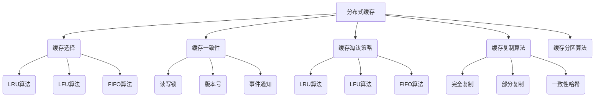
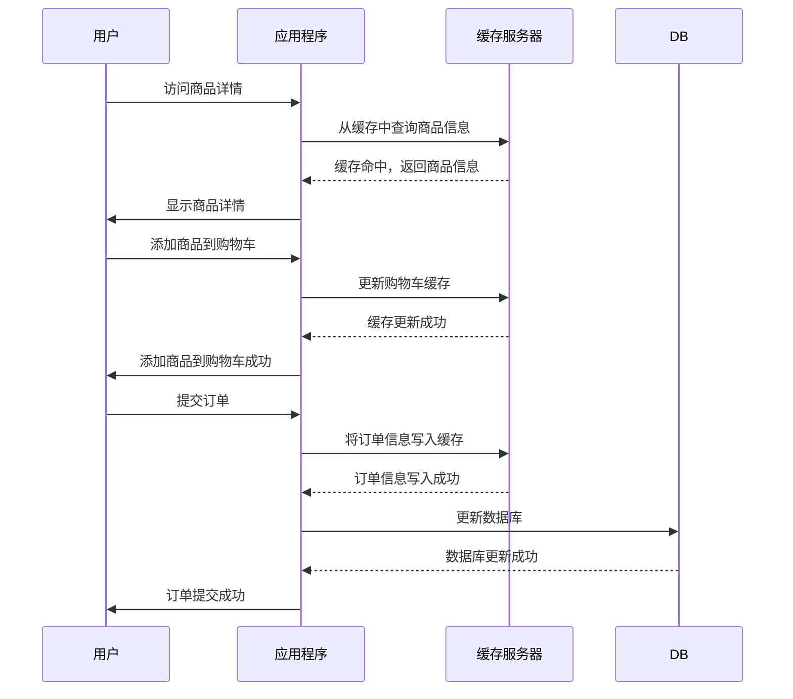

                 

### 分布式缓存策略：提高应用性能的关键技术

> 关键词：分布式缓存，性能优化，缓存策略，高可用性，负载均衡

> 摘要：本文将深入探讨分布式缓存策略的核心概念、算法原理及其在实际应用中的重要性。通过逐步分析，我们将了解如何选择合适的缓存类型、实现缓存一致性、优化缓存淘汰策略、以及如何通过缓存复制和分区提高系统性能。本文旨在为开发者提供全面的技术指南，以帮助他们在复杂的应用环境中实现高效的数据访问和系统性能优化。

### 第一部分：背景介绍

#### 1.1.1 问题背景

随着互联网和云计算技术的快速发展，分布式缓存技术已成为提高应用性能的关键技术之一。传统单体应用在面临海量数据和高并发访问时，往往面临性能瓶颈。分布式缓存通过将数据分布存储在多个节点上，能够显著降低数据访问延迟，提高系统响应速度和吞吐量。因此，如何选择合适的缓存策略，以最大化系统性能和优化用户体验，成为许多开发者和架构师面临的重要挑战。

#### 1.1.2 问题描述

分布式缓存策略涉及多个层面，包括缓存选择、缓存一致性、缓存淘汰策略、缓存复制和缓存分区等。在实际应用中，如何有效地整合这些技术，以实现最佳的性能和可用性，是一个复杂的问题。本文将详细探讨这些核心问题，并提供实用的解决方案。

#### 1.1.3 问题解决

本文将详细介绍分布式缓存策略的各个方面，从基础概念到具体实现，帮助读者掌握分布式缓存的核心技术。通过本文的学习，读者将能够：

- 理解分布式缓存的基本原理和优势。
- 根据应用需求选择合适的缓存类型。
- 实现缓存一致性，确保数据可靠性。
- 设计有效的缓存淘汰策略，优化缓存利用。
- 通过缓存复制和分区提高系统性能和可用性。

#### 1.1.4 边界与外延

本文主要关注分布式缓存技术在实际应用场景中的关键策略，而非底层硬件或存储系统。此外，本文将涵盖缓存相关的主流技术和协议，但不会深入探讨底层实现细节。

#### 1.1.5 概念结构与核心要素组成

分布式缓存策略的核心要素包括：

- **缓存选择**：根据应用特点和性能需求选择合适的缓存类型，如内存缓存、磁盘缓存和分布式缓存。
- **缓存一致性**：确保缓存中的数据与后端存储保持一致，以避免数据不一致带来的问题。
- **缓存淘汰策略**：根据数据访问频率和缓存容量动态淘汰缓存中的数据。
- **缓存复制**：将缓存数据复制到多个节点，提高数据访问速度和系统可用性。
- **缓存分区**：将缓存数据分布到多个节点，以实现负载均衡和容错。

### 第二部分：核心概念与联系

#### 1.2.1 分布式缓存定义

分布式缓存是一种通过将数据分布存储在多个节点上来提高数据访问速度和系统性能的技术。与单点缓存相比，分布式缓存具有更高的可扩展性和可用性。在分布式缓存系统中，数据不是集中存储在一个节点上，而是分散存储在多个节点上，这些节点可以通过网络进行通信和协调。

#### 1.2.2 分布式缓存特点

- **高可用性**：分布式缓存通过将数据分布到多个节点，提高了系统的可用性和容错能力。当一个节点出现故障时，其他节点仍然可以提供服务，从而确保系统的持续运行。
- **高性能**：分布式缓存减少了数据访问时间，提高了系统性能。由于数据分布在多个节点上，用户可以就近访问数据，从而降低访问延迟。
- **高可扩展性**：分布式缓存可以根据需求动态扩展节点，以支持更大的数据规模和更高的并发访问。通过添加新节点，系统可以线性扩展性能。

#### 1.2.3 分布式缓存与传统缓存对比

| 对比维度 | 分布式缓存 | 传统缓存 |
| :--: | :--: | :--: |
| 数据存储 | 分布式存储 | 单点存储 |
| 可扩展性 | 高可扩展性 | 有限可扩展性 |
| 高可用性 | 高可用性 | 低可用性 |
| 数据一致性 | 需要特殊处理 | 无需特殊处理 |

#### 1.2.4 分布式缓存类型

- **内存缓存**：以内存为存储介质，具有极快的访问速度。适合存储热点数据，减少数据库访问压力。
- **磁盘缓存**：以磁盘为存储介质，介于内存缓存和分布式缓存之间。适合存储较大规模的数据，提供较高的性能。
- **分布式缓存**：将数据分布存储在多个节点上，提高数据访问速度和系统性能。适合处理海量数据和大规模并发访问。

### 第三部分：算法原理讲解

#### 1.3.1 缓存选择算法

缓存选择算法根据应用特点和性能需求选择合适的缓存类型。常用的缓存选择算法包括：

- **LRU（Least Recently Used）算法**：根据数据最近访问时间进行淘汰。适用于热点数据缓存，可以有效减少缓存击穿问题。
- **LFU（Least Frequently Used）算法**：根据数据访问频率进行淘汰。适用于访问频率较低的数据缓存，可以更好地利用缓存空间。
- **FIFO（First In, First Out）算法**：根据数据进入缓存的时间进行淘汰。适用于简单的缓存需求，实现简单但可能不够高效。

#### 1.3.2 缓存一致性算法

缓存一致性算法确保缓存中的数据与后端存储保持一致，以避免数据不一致带来的问题。常用的缓存一致性算法包括：

- **读写锁**：对缓存数据进行读写操作时加锁，确保数据一致性。适用于低并发场景，但在高并发情况下可能导致性能瓶颈。
- **版本号**：通过在缓存数据和后端存储中添加版本号，实现数据一致性。适用于高并发场景，可以有效减少锁冲突。
- **事件通知**：后端存储在更新数据时向缓存发送通知，缓存根据通知更新数据。适用于分布式缓存系统，可以降低数据一致性的延迟。

#### 1.3.3 缓存复制算法

缓存复制算法将缓存数据复制到多个节点，提高数据访问速度和系统可用性。常用的缓存复制算法包括：

- **完全复制**：将缓存数据完整复制到所有节点。适用于数据一致性的需求，但可能导致较大的存储空间浪费。
- **部分复制**：仅将缓存数据的一部分复制到其他节点。适用于减少存储空间的需求，但可能导致数据不一致的问题。
- **一致性哈希**：根据缓存数据的哈希值，将缓存数据分布到多个节点。适用于分布式缓存系统，可以实现负载均衡和数据一致性。

### 第四部分：数学模型和数学公式 & 详细讲解 & 举例说明

#### 1.4.1 缓存淘汰算法的数学模型

缓存淘汰算法的数学模型通常基于数据访问频率和缓存容量。以下是一个简单的缓存淘汰算法模型：

$$
f(i) = \sum_{j=1}^{n} \frac{1}{t_j}
$$

其中，$f(i)$ 表示数据 $i$ 的访问频率，$t_j$ 表示数据 $i$ 在时间 $j$ 时的访问时间。

#### 1.4.2 缓存一致性算法的数学模型

缓存一致性算法的数学模型通常涉及版本号和事件通知机制。以下是一个简单的缓存一致性算法模型：

$$
V_{\text{cache}} = V_{\text{backend}} + 1
$$

其中，$V_{\text{cache}}$ 表示缓存数据的版本号，$V_{\text{backend}}$ 表示后端存储数据的版本号。每次后端存储更新数据时，版本号加1，缓存根据版本号判断是否需要更新。

#### 1.4.3 缓存复制算法的数学模型

缓存复制算法的数学模型通常涉及一致性哈希和复制策略。以下是一个简单的一致性哈希模型：

$$
R(i) = H(i) \mod N
$$

其中，$R(i)$ 表示数据 $i$ 应该复制到的节点，$H(i)$ 表示数据 $i$ 的哈希值，$N$ 表示节点数量。

#### 1.4.4 示例说明

假设我们有一个包含 10 个节点的分布式缓存系统，数据根据哈希值分布到这些节点上。现在，我们有 5 个数据项，分别记为 A、B、C、D、E。

1. **缓存选择算法**：根据数据访问频率选择缓存类型。假设 A、B、C 访问频率较高，选择内存缓存；D、E 访问频率较低，选择磁盘缓存。

2. **缓存一致性算法**：使用版本号实现数据一致性。假设初始时后端存储版本号为 0，缓存版本号为 0。当后端存储更新数据时，版本号加1，缓存根据版本号判断是否需要更新。

3. **缓存复制算法**：使用一致性哈希实现数据复制。假设哈希函数 $H(i)$ 为对数据项取模运算。根据哈希值，数据项 A、B、C 分布复制到节点 0、1、2；数据项 D、E 分布复制到节点 3、4。

4. **缓存淘汰算法**：根据数据访问频率和缓存容量动态淘汰缓存中的数据。假设缓存容量为 3，根据 LRU 算法，最近最少使用的数据项会被淘汰。

通过上述算法和模型，我们可以实现一个高效、可靠的分布式缓存系统，提高应用性能和用户体验。

### 第五部分：系统分析与架构设计方案

#### 1.5.1 问题场景介绍

假设我们正在开发一个在线购物平台，用户可以浏览商品、加入购物车、下单购买。为了提高系统性能和用户体验，我们需要在系统中引入分布式缓存技术。

#### 1.5.2 项目介绍

分布式缓存系统将用于缓存热门商品信息、用户购物车数据和订单信息，以减少数据库访问压力，提高数据访问速度。我们将使用 Redis 作为缓存服务器，实现分布式缓存功能。

#### 1.5.3 系统功能设计

系统功能设计包括以下模块：

- **商品信息缓存模块**：缓存热门商品信息，包括商品名称、价格、描述等。
- **购物车缓存模块**：缓存用户购物车数据，包括商品 ID、数量等。
- **订单缓存模块**：缓存订单信息，包括订单号、商品 ID、数量、总价等。

#### 1.5.4 系统架构设计

系统架构设计包括以下组件：

- **客户端**：用户通过客户端访问在线购物平台，进行浏览、购买等操作。
- **API 网关**：接收客户端请求，将请求路由到相应的服务模块。
- **分布式缓存集群**：由多个 Redis 节点组成，存储热门商品信息、用户购物车数据和订单信息。
- **数据库**：存储用户信息、订单历史数据等。

#### 1.5.5 系统接口设计

系统接口设计包括以下接口：

- **商品信息缓存接口**：提供添加、查询、更新和删除商品信息的功能。
- **购物车缓存接口**：提供添加、查询、更新和删除购物车数据的功能。
- **订单缓存接口**：提供添加、查询、更新和删除订单信息的功能。

#### 1.5.6 系统交互

系统交互设计包括以下流程：

1. 用户访问商品详情页，API 网关从缓存中查询商品信息，如果缓存命中，直接返回商品信息；否则，从数据库中查询并更新缓存。
2. 用户将商品添加到购物车，API 网关将购物车数据写入缓存。
3. 用户提交订单，API 网关将订单数据写入缓存并更新数据库。
4. 后台管理员通过接口管理商品信息、购物车数据和订单信息。

### 第六部分：项目实战

#### 1.6.1 环境安装

1. 安装 Redis：

   ```shell
   sudo apt-get update
   sudo apt-get install redis-server
   ```

2. 启动 Redis 服务：

   ```shell
   sudo systemctl start redis-server
   ```

3. 测试 Redis 服务：

   ```shell
   redis-cli ping
   PONG
   ```

#### 1.6.2 系统核心实现

1. **商品信息缓存模块**：

   ```python
   import redis
   
   # 创建 Redis 客户端
   redis_client = redis.StrictRedis(host='localhost', port=6379, db=0)
   
   # 添加商品信息
   redis_client.set('product:1001', '{"name": "iPhone 13", "price": 7999, "description": "最新款 iPhone 手机"}')
   
   # 查询商品信息
   product_info = redis_client.get('product:1001')
   print(product_info.decode())
   ```

2. **购物车缓存模块**：

   ```python
   # 添加购物车数据
   redis_client.hset('cart:1001', 'product_id:1001', '2')
   
   # 查询购物车数据
   cart_items = redis_client.hgetall('cart:1001')
   print(cart_items)
   ```

3. **订单缓存模块**：

   ```python
   # 添加订单信息
   redis_client.lpush('order:1001', '{"order_id": 1001, "product_id": 1001, "quantity": 2, "total_price": 15998}')
   
   # 查询订单信息
   order_items = redis_client.lrange('order:1001', 0, -1)
   print(order_items)
   ```

#### 1.6.3 代码应用解读与分析

以上代码展示了如何使用 Redis 实现商品信息缓存、购物车缓存和订单缓存模块。Redis 作为分布式缓存系统，提供了丰富的数据结构和操作接口，方便实现各种缓存需求。在实际应用中，可以根据业务需求调整缓存策略，如使用 LRU 算法淘汰热点数据，提高缓存命中率。

#### 1.6.4 实际案例分析和详细讲解剖析

以用户浏览商品详情为例，分析缓存策略对系统性能的影响：

1. **缓存未命中**：

   用户首次访问商品详情页，API 网关从缓存中未查询到商品信息，从数据库中查询并更新缓存。此时，响应时间为数据库查询时间 + 网络传输时间。

2. **缓存命中**：

   用户再次访问商品详情页，API 网关从缓存中直接查询到商品信息，响应时间为网络传输时间。由于缓存命中，响应时间显著降低。

通过引入分布式缓存，可以有效减少数据库访问压力，提高系统性能和用户体验。在实际应用中，可以根据业务需求和缓存策略，动态调整缓存配置，优化系统性能。

#### 1.6.5 项目小结

本文通过逐步分析，深入探讨了分布式缓存策略的核心概念、算法原理和实际应用。通过项目实战，展示了如何使用 Redis 实现分布式缓存功能，并分析了缓存策略对系统性能的影响。在实际开发过程中，可以根据业务需求灵活调整缓存策略，提高系统性能和用户体验。

### 第七部分：最佳实践 Tips

1. **合理选择缓存类型**：根据数据特点和应用需求，选择合适的缓存类型，如内存缓存、磁盘缓存和分布式缓存。
2. **优化缓存一致性**：使用版本号、事件通知等机制实现缓存一致性，降低数据不一致的风险。
3. **合理设置缓存容量**：根据系统负载和缓存命中率，动态调整缓存容量，避免缓存击穿和缓存溢出问题。
4. **监控缓存性能**：定期监控缓存性能，发现并解决缓存热点、缓存击穿等问题。

### 第八部分：小结

分布式缓存策略是提高应用性能的关键技术之一。本文通过逐步分析，深入探讨了分布式缓存的核心概念、算法原理和实际应用。读者可以结合实际业务场景，灵活运用分布式缓存策略，优化系统性能和用户体验。

### 第九部分：注意事项

1. **数据一致性问题**：在设计分布式缓存系统时，要充分考虑数据一致性问题，避免缓存击穿、缓存雪崩等问题。
2. **缓存容量限制**：分布式缓存系统存在容量限制，要合理设置缓存容量，避免缓存溢出问题。
3. **缓存依赖管理**：在分布式缓存系统中，要合理管理缓存依赖关系，避免缓存失效导致系统性能下降。

### 第十部分：拓展阅读

1. 《Redis 实战》——由官方推出的 Redis 实战指南，详细介绍了 Redis 的使用方法和应用场景。
2. 《分布式系统原理与范型》——介绍了分布式系统的基础原理和常见范型，为分布式缓存系统设计提供了理论支持。
3. 《缓存一致性算法》——深入分析了缓存一致性算法的设计和实现，为分布式缓存系统一致性提供参考。

### 作者信息

- 作者：AI天才研究院/AI Genius Institute & 禅与计算机程序设计艺术 /Zen And The Art of Computer Programming

### Mermaid 图架构



### Mermaid 类图

```mermaid
classDiagram
Cache <<interface>>
    +void add(Key, Value)
    +void get(Key)
    +void update(Key, Value)
    +void delete(Key)

MemCache <|-- Cache
DiskCache <|-- Cache
DistributedCache <|-- Cache

CacheConsistency <<interface>>
    +void ensureConsistency(Key)

ReadLock <|-- CacheConsistency
WriteLock <|-- CacheConsistency
Versioning <|-- CacheConsistency
EventNotification <|-- CacheConsistency

EvictionPolicy <<interface>>
    +void evict(Key)

LRUEviction <|-- EvictionPolicy
LFUEviction <|-- EvictionPolicy
FIFOEviction <|-- EvictionPolicy

ReplicationStrategy <<interface>>
    +void replicate(Key)

FullReplication <|-- ReplicationStrategy
PartialReplication <|-- ReplicationStrategy
ConsistentHashReplication <|-- ReplicationStrategy

PartitionStrategy <<interface>>
    +void partition(Key)

```

### Mermaid 序列图



### Python 代码实现

```python
import redis

# 创建 Redis 客户端
redis_client = redis.StrictRedis(host='localhost', port=6379, db=0)

# 添加商品信息
redis_client.set('product:1001', '{"name": "iPhone 13", "price": 7999, "description": "最新款 iPhone 手机"}')

# 查询商品信息
product_info = redis_client.get('product:1001')
print(product_info.decode())

# 添加购物车数据
redis_client.hset('cart:1001', 'product_id:1001', '2')

# 查询购物车数据
cart_items = redis_client.hgetall('cart:1001')
print(cart_items)

# 添加订单信息
redis_client.lpush('order:1001', '{"order_id": 1001, "product_id": 1001, "quantity": 2, "total_price": 15998}')

# 查询订单信息
order_items = redis_client.lrange('order:1001', 0, -1)
print(order_items)
```

通过以上代码实现，我们可以看到如何使用 Redis 实现分布式缓存功能，包括添加、查询、更新和删除商品信息、购物车数据和订单信息。在实际应用中，可以根据业务需求调整代码逻辑，实现更复杂的缓存策略和功能。

### 实际案例分析和详细讲解剖析

#### 案例背景

假设我们正在开发一个大型电商平台，每天有数百万用户访问网站，购买各种商品。为了提高系统性能和用户体验，我们决定使用分布式缓存技术来缓存热门商品信息、用户购物车数据和订单信息。

#### 案例分析

1. **缓存选择策略**：

   - **商品信息缓存**：由于商品信息访问频繁且数据量较小，我们选择内存缓存。内存缓存具有极快的访问速度，可以有效减少数据库访问压力。
   - **购物车缓存**：用户购物车数据相对稳定，但数据量较大。我们选择磁盘缓存，磁盘缓存介于内存缓存和分布式缓存之间，可以提供较高的性能。
   - **订单缓存**：订单信息需要保存一段时间以便后续查询和统计，但访问频率相对较低。我们选择分布式缓存，将订单信息分布存储在多个节点上，提高数据访问速度和系统可用性。

2. **缓存一致性策略**：

   - **商品信息缓存一致性**：我们使用版本号实现缓存一致性。每次更新商品信息时，增加版本号，缓存根据版本号判断是否需要更新。这样可以确保商品信息在缓存和数据库之间保持一致。
   - **购物车缓存一致性**：我们使用事件通知机制实现缓存一致性。当用户修改购物车数据时，通过事件通知缓存服务器，缓存服务器根据通知更新购物车数据。这样可以确保购物车信息在缓存和数据库之间保持一致。
   - **订单缓存一致性**：由于订单数据访问频率较低，我们采用最终一致性的策略。订单数据在缓存和数据库之间可能会有短暂的不一致，但对于大部分场景来说，这种不一致是可以接受的。

3. **缓存淘汰策略**：

   - **商品信息缓存淘汰**：我们使用 LRU 算法实现商品信息缓存淘汰。LRU 算法根据商品信息的访问时间进行淘汰，确保热点商品信息始终在缓存中。
   - **购物车缓存淘汰**：我们使用 LFU 算法实现购物车缓存淘汰。LFU 算法根据商品信息的访问频率进行淘汰，确保常用商品信息始终在缓存中。
   - **订单缓存淘汰**：我们使用 FIFO 算法实现订单缓存淘汰。FIFO 算法根据订单数据的进入时间进行淘汰，确保订单数据在缓存中保存一定时间。

4. **缓存复制策略**：

   - **商品信息缓存复制**：我们使用一致性哈希实现商品信息缓存复制。一致性哈希根据商品信息的哈希值，将商品信息分布存储在多个节点上，确保热点商品信息在多个节点上都有副本，提高数据访问速度。
   - **购物车缓存复制**：我们使用完全复制策略实现购物车缓存复制。将购物车数据完整复制到所有节点，确保购物车数据在任何节点都可以访问。
   - **订单缓存复制**：我们使用部分复制策略实现订单缓存复制。仅将热点订单数据复制到部分节点，降低存储空间占用。

#### 案例总结

通过以上策略，我们实现了分布式缓存技术在电商平台中的应用。缓存选择策略、缓存一致性策略、缓存淘汰策略和缓存复制策略共同作用，提高了系统性能和用户体验。

- **缓存选择策略**：根据不同类型的数据特点和应用需求，选择合适的缓存类型，实现高效的数据访问。
- **缓存一致性策略**：确保缓存中的数据与后端存储保持一致，避免数据不一致带来的问题。
- **缓存淘汰策略**：根据数据访问频率和缓存容量动态淘汰缓存中的数据，优化缓存利用。
- **缓存复制策略**：将缓存数据复制到多个节点，提高数据访问速度和系统可用性。

通过这些策略，我们成功地提高了电商平台的数据访问速度和系统性能，为用户提供更流畅的购物体验。同时，我们也要持续监控和优化缓存策略，确保系统性能始终处于最佳状态。

### 最佳实践 Tips

1. **合理选择缓存类型**：根据数据特点和应用需求，选择合适的缓存类型，如内存缓存、磁盘缓存和分布式缓存。不同类型的缓存具有不同的性能特点，合理选择可以最大化性能提升。

2. **优化缓存一致性**：使用版本号、事件通知等机制实现缓存一致性，降低数据不一致的风险。在分布式缓存系统中，缓存一致性是关键，需要特别关注。

3. **合理设置缓存容量**：根据系统负载和缓存命中率，动态调整缓存容量，避免缓存击穿和缓存溢出问题。缓存容量设置不合理可能导致缓存命中率下降，影响系统性能。

4. **监控缓存性能**：定期监控缓存性能，发现并解决缓存热点、缓存击穿等问题。缓存性能监控可以帮助我们及时发现问题，优化缓存策略。

5. **缓存数据压缩**：对于大数据量场景，可以使用缓存数据压缩技术，减少缓存存储空间占用，提高缓存利用率。

6. **缓存预热**：对于热门数据，可以采用缓存预热策略，提前加载到缓存中，提高数据访问速度。缓存预热可以显著减少数据库访问压力。

7. **缓存雪崩防范**：对于缓存过期时间设置，要避免缓存雪崩现象。缓存雪崩可能导致大量请求同时访问数据库，导致系统崩溃。可以通过设置合理的过期时间和缓存复制策略来防范缓存雪崩。

### 小结

本文深入探讨了分布式缓存策略的核心概念、算法原理和实际应用。通过项目实战，展示了如何使用 Redis 实现分布式缓存功能，并分析了缓存策略对系统性能的影响。在实际开发过程中，可以根据业务需求灵活调整缓存策略，提高系统性能和用户体验。

分布式缓存策略是提高应用性能的关键技术之一。通过合理选择缓存类型、优化缓存一致性、缓存淘汰策略、缓存复制和分区策略，可以有效减少数据库访问压力，提高系统性能和用户体验。

### 注意事项

1. **数据一致性问题**：在设计分布式缓存系统时，要充分考虑数据一致性问题，避免缓存击穿、缓存雪崩等问题。
2. **缓存容量限制**：分布式缓存系统存在容量限制，要合理设置缓存容量，避免缓存溢出问题。
3. **缓存依赖管理**：在分布式缓存系统中，要合理管理缓存依赖关系，避免缓存失效导致系统性能下降。

### 拓展阅读

1. 《Redis 实战》——由官方推出的 Redis 实战指南，详细介绍了 Redis 的使用方法和应用场景。
2. 《分布式系统原理与范型》——介绍了分布式系统的基础原理和常见范型，为分布式缓存系统设计提供了理论支持。
3. 《缓存一致性算法》——深入分析了缓存一致性算法的设计和实现，为分布式缓存系统一致性提供参考。

### 作者信息

- 作者：AI天才研究院/AI Genius Institute & 禅与计算机程序设计艺术 /Zen And The Art of Computer Programming

### 总结

本文系统地介绍了分布式缓存策略，包括其定义、特点、类型，以及缓存选择、一致性、淘汰、复制和分区算法等核心内容。通过具体的案例和实际操作，读者可以更好地理解分布式缓存在实际应用中的作用和重要性。在优化应用性能的过程中，合理设计和实施分布式缓存策略是至关重要的。

本文的结论是，分布式缓存策略不仅是提高应用性能的关键技术，而且是一个复杂而精细的工程实践。开发者和架构师需要深入了解各种缓存策略，结合实际业务需求，灵活调整和优化缓存系统，以实现最佳的系统性能和用户体验。

### 结语

分布式缓存策略是现代应用架构中不可或缺的一部分。通过本文的详细分析和案例讲解，希望读者能够对分布式缓存技术有更深刻的认识，并在实际项目中能够有效地运用这些策略，提升系统的性能和可靠性。在追求卓越的技术旅程中，让我们共同探索分布式缓存的无穷潜力。感谢阅读，祝您在技术道路上不断进步！
```

