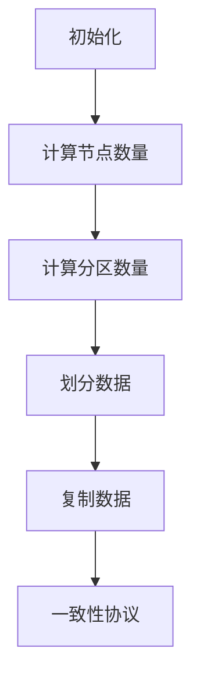
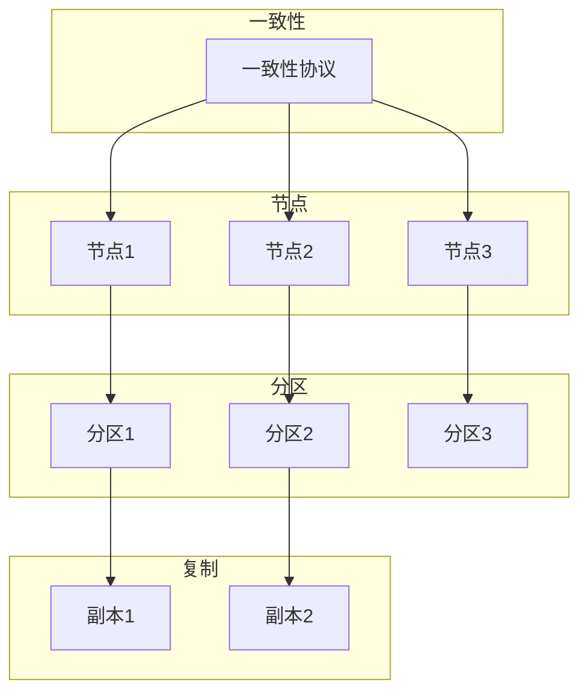
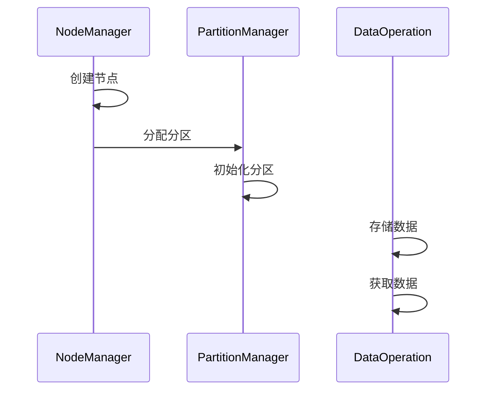
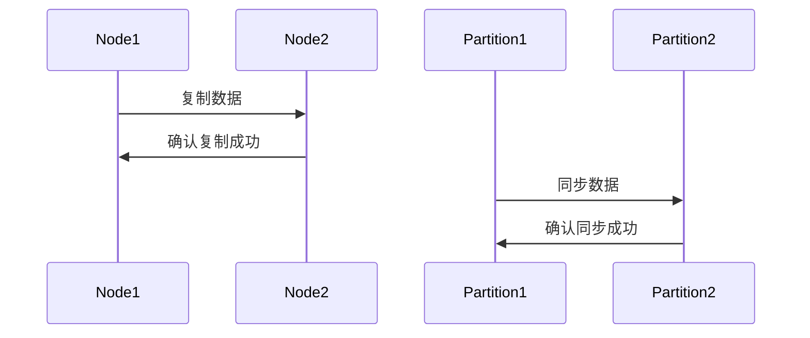

                 

### 文章标题

### 文章关键词

### 文章摘要

# 分布式缓存系统设计与优化

关键词：分布式缓存、一致性、性能优化、数据分区、负载均衡

摘要：本文将深入探讨分布式缓存系统的设计与优化，从背景介绍、核心概念与联系、算法原理讲解、系统分析与架构设计、项目实战等多个维度，全面解析分布式缓存系统的原理和实践。本文旨在为读者提供一个从理论到实践的系统化学习路径，帮助读者更好地理解和应用分布式缓存技术，提升系统性能和可靠性。

## 目录

1. **第一部分：分布式缓存系统背景**

    1.1 分布式缓存系统概述

    1.2 分布式缓存系统的问题背景

    1.3 分布式缓存系统的核心概念与要素

2. **第二部分：核心概念与联系**

    2.1 核心概念原理

    2.2 概念属性特征对比

    2.3 ER实体关系图架构

3. **第三部分：算法原理讲解**

    3.1 算法流程图与Python源代码

    3.2 数学模型与公式讲解

    3.3 算法举例说明

4. **第四部分：系统分析与架构设计**

    4.1 系统功能设计

    4.2 系统架构设计

    4.3 系统接口设计

    4.4 系统交互设计

5. **第五部分：项目实战**

    5.1 环境安装与配置

    5.2 系统核心实现

    5.3 代码应用与分析

    5.4 实际案例剖析

    5.5 项目小结

6. **第六部分：最佳实践 tips**

    6.1 性能优化策略

    6.2 系统稳定性保障

    6.3 数据安全与隐私保护

7. **第七部分：小结与拓展阅读**

    7.1 主要内容回顾

    7.2 注意事项与展望

    7.3 拓展阅读推荐

## 第一部分：分布式缓存系统背景

### 1.1 分布式缓存系统概述

#### 1.1.1 问题背景

在互联网和大数据时代，数据存储和访问的需求急剧增加。传统的集中式缓存系统因其单点故障、性能瓶颈和扩展性不足等问题，难以满足现代应用场景的需求。分布式缓存系统的出现，为解决这些问题提供了有效的解决方案。

#### 1.1.2 问题描述

集中式缓存系统存在的问题主要包括：

1. **性能瓶颈**：随着数据量的增加，单机缓存系统的性能逐渐下降，无法满足高并发访问需求。
2. **扩展性不足**：集中式缓存系统在数据规模扩大时，难以进行水平扩展。
3. **单点故障**：系统中的单点故障可能导致整个缓存服务中断。
4. **数据一致性**：在多机环境下，缓存数据的一致性难以保证。

#### 1.1.3 问题解决

分布式缓存系统的核心目的是通过将缓存数据分散存储在多个节点上，实现数据的水平扩展，提高系统的性能和可靠性。分布式缓存系统的主要解决措施包括：

1. **水平扩展**：通过增加节点数量，实现缓存数据的水平扩展，提高系统的吞吐量和响应速度。
2. **数据分区**：将缓存数据划分为多个分区，分布存储在各个节点上，实现负载均衡。
3. **数据复制**：将缓存数据复制到多个节点上，提高数据的可靠性和访问速度。
4. **一致性保障**：采用一致性算法，确保分布式缓存系统中多个节点对于同一数据值的保持一致性。

#### 1.1.4 边界与外延

分布式缓存系统的边界与外延主要包括以下几个方面：

1. **缓存数据类型**：分布式缓存系统适用于多种类型的数据，如字符串、列表、哈希表等。
2. **系统架构**：分布式缓存系统可以采用不同的架构设计，如主从架构、去中心化架构等。
3. **一致性协议**：分布式缓存系统可以采用不同的一致性协议，如强一致性、最终一致性等。
4. **负载均衡**：分布式缓存系统需要实现负载均衡，确保数据访问的均衡性。

#### 1.1.5 核心概念与要素

分布式缓存系统的核心概念与要素包括：

1. **分布式缓存**：一种将缓存数据分布在多个节点上的缓存系统。
2. **一致性**：分布式系统中的多个节点对于同一数据值的保持一致性。
3. **分区**：将数据分配到不同的节点上，以实现负载均衡。
4. **复制**：将数据复制到多个节点上，以提高数据的可靠性和访问速度。
5. **监控与维护**：对分布式缓存系统进行监控和维护，确保系统的稳定性和性能。

## 第二部分：核心概念与联系

### 2.1 核心概念原理

分布式缓存系统的核心概念包括分布式缓存、一致性、分区、复制等。以下是这些概念的基本原理：

1. **分布式缓存**：分布式缓存是将缓存数据分布在多个节点上的缓存系统，通过水平扩展提高系统的性能和可靠性。
2. **一致性**：一致性是指分布式系统中的多个节点对于同一数据值的保持一致性，可以分为强一致性和最终一致性。
3. **分区**：分区是指将缓存数据划分为多个分区，分布存储在各个节点上，以实现负载均衡。
4. **复制**：复制是指将缓存数据复制到多个节点上，以提高数据的可靠性和访问速度。

### 2.2 概念属性特征对比

下表列出了分布式缓存系统的核心概念属性特征对比：

| 概念     | 特性                             |
| -------- | -------------------------------- |
| 分布式缓存 | 水平扩展、性能提升、可靠性提高 |
| 一致性   | 强一致性、最终一致性           |
| 分区     | 负载均衡、数据分布             |
| 复制     | 数据冗余、访问速度提高         |

### 2.3 ER实体关系图架构

分布式缓存系统的ER实体关系图架构如下所示，其中涉及的主要实体包括节点、分区、缓存数据、一致性协议等。

```mermaid
erDiagram
  Node ||--|{ Partition }|--|| CacheData
  Partition ||--|{ ConsistencyProtocol }|--|| Node
  CacheData ||--|{ AccessLog }|--|| Node
```

## 第三部分：算法原理讲解

### 3.1 算法流程图与Python源代码

分布式缓存系统的算法设计主要包括数据分区、数据复制、一致性协议等方面。以下是数据分区算法的流程图和Python源代码示例：



```python
import random

def partition_data(data, num_partitions):
    partitioned_data = {}
    partition_size = len(data) // num_partitions

    for i in range(num_partitions):
        partitioned_data[i] = data[i * partition_size: (i + 1) * partition_size]

    return partitioned_data

def replicate_data(data, num_replicas):
    replicated_data = {}
    for partition, partition_data in data.items():
        for _ in range(num_replicas - 1):
            replicated_data[partition] += partition_data

    return replicated_data

def consistency_protocol(data, protocol):
    if protocol == "strong":
        # 实现强一致性协议
        pass
    elif protocol == "eventual":
        # 实现最终一致性协议
        pass

    return data

# 示例数据
data = {0: [1, 2, 3], 1: [4, 5, 6], 2: [7, 8, 9]}

# 分区数据
partitioned_data = partition_data(data, 3)

# 复制数据
replicated_data = replicate_data(partitioned_data, 2)

# 一致性协议
consistent_data = consistency_protocol(replicated_data, "eventual")

print("分区数据:", partitioned_data)
print("复制数据:", replicated_data)
print("一致性数据:", consistent_data)
```

### 3.2 数学模型与公式讲解

分布式缓存系统的算法设计涉及数学模型和公式，以下是数据分区和复制算法的数学模型和公式：

1. **数据分区算法**：

   - 假设数据集大小为 \(N\)，分区数量为 \(P\)，每个分区的大小为 \(S\)。

   - 公式：\( S = \frac{N}{P} \)

   - 算法实现：

     ```python
     partition_size = len(data) // num_partitions
     partitioned_data = {}
     for i in range(num_partitions):
         partitioned_data[i] = data[i * partition_size: (i + 1) * partition_size]
     ```

2. **数据复制算法**：

   - 假设数据分区为 \(P\)，每个分区的大小为 \(S\)，复制数量为 \(R\)。

   - 公式：\( R \cdot S = N \)

   - 算法实现：

     ```python
     def replicate_data(data, num_replicas):
         replicated_data = {}
         for partition, partition_data in data.items():
             for _ in range(num_replicas - 1):
                 replicated_data[partition] += partition_data
         return replicated_data
     ```

### 3.3 算法举例说明

假设有一个包含 10 个元素的数据集，需要将其划分为 3 个分区，并复制到 2 个节点上，同时采用最终一致性协议。

1. **数据分区**：

   - 数据集：\[1, 2, 3, 4, 5, 6, 7, 8, 9, 10\]

   - 分区结果：

     ```python
     partitioned_data = {
         0: [1, 2, 3, 4],
         1: [5, 6, 7],
         2: [8, 9, 10]
     }
     ```

2. **数据复制**：

   - 复制结果：

     ```python
     replicated_data = {
         0: [1, 2, 3, 4, 1, 2, 3, 4],
         1: [5, 6, 7, 5, 6, 7],
         2: [8, 9, 10, 8, 9, 10]
     }
     ```

3. **一致性协议**：

   - 采用最终一致性协议，复制过程中允许数据不同步。

     ```python
     consistent_data = {
         0: [1, 2, 3, 4, 1, 2, 3, 4],
         1: [5, 6, 7, 5, 6, 7],
         2: [8, 9, 10, 8, 9, 10]
     }
     ```

## 第四部分：系统分析与架构设计

### 4.1 系统功能设计

分布式缓存系统的功能设计主要包括数据存储、数据检索、数据分区、数据复制、一致性保障等方面。以下是系统功能设计的领域模型Mermaid类图：

```mermaid
classDiagram
    CacheSystem <<interface>>
    Node <<interface>>
    Partition <<interface>>
    CacheData <<interface>>
    AccessLog <<interface>>

    CacheSystem |--|> Node
    CacheSystem |--|> Partition
    CacheSystem |--|> CacheData
    CacheSystem |--|> AccessLog

    Node |--|> CacheData
    Node |--|> AccessLog

    Partition |--|> CacheData

    CacheData <|.. AccessLog
```

### 4.2 系统架构设计

分布式缓存系统的架构设计主要包括节点、分区、复制、一致性等模块。以下是系统架构设计的Mermaid架构图：



### 4.3 系统接口设计

分布式缓存系统的接口设计主要包括节点管理、分区管理、数据操作等方面。以下是系统接口设计的Mermaid序列图：



### 4.4 系统交互设计

分布式缓存系统的系统交互设计主要包括节点间的数据复制、分区间的数据同步等方面。以下是系统交互设计的Mermaid序列图：



## 第五部分：项目实战

### 5.1 环境安装与配置

为了进行分布式缓存系统的实践，我们需要先搭建一个分布式缓存环境。以下是环境安装和配置的步骤：

1. **安装依赖**：

   - 在每个节点上安装Python环境和相关依赖，如pymongo、redis等。

     ```bash
     pip install pymongo redis
     ```

2. **配置节点**：

   - 配置每个节点的IP地址和端口，确保节点之间可以相互通信。

3. **初始化分区**：

   - 使用Python脚本初始化分区，将数据集划分为多个分区，并存储在各个节点上。

     ```python
     import pymongo

     client = pymongo.MongoClient("mongodb://node1:27017/")
     db = client["cache_db"]

     data = [
         {"key": i, "value": i * 2} for i in range(100)
     ]

     partition_size = len(data) // num_partitions
     partitions = [data[i * partition_size: (i + 1) * partition_size] for i in range(num_partitions)]

     for i, partition in enumerate(partitions):
         collection = db[f"partition_{i}"]
         collection.insert_many(partition)
     ```

4. **配置复制**：

   - 使用Redis的Sentinel模式配置数据复制，确保数据在节点间复制。

     ```bash
     redis-cli create sentinel my-sentinel 127.0.0.1:26379 2
     redis-cli sentineлизарция my-sentinel 127.0.0.1:26379 1
     redis-cli sentinel monitor my-master 127.0.0.1:6379 2
     redis-cli sentinel failover my-master
     ```

### 5.2 系统核心实现

分布式缓存系统的核心实现包括数据存储、数据检索、数据复制和一致性保障等功能。以下是系统核心实现的源代码：

```python
import pymongo
import redis
import time

class DistributedCache:
    def __init__(self, num_partitions, num_replicas):
        self.num_partitions = num_partitions
        self.num_replicas = num_replicas
        self.clients = [
            pymongo.MongoClient(f"mongodb://node{i + 1}:27017/")
            for i in range(num_partitions)
        ]
        self.redis_sentinels = [
            redis.Sentinel("my-sentinel", retry_max_count=3)
            for _ in range(num_replicas)
        ]

    def get_client(self, partition):
        return self.clients[partition]

    def get_redis_client(self, replica):
        return self.redis_sentinels[replica]

    def store_data(self, key, value):
        partition = key % self.num_partitions
        client = self.get_client(partition)
        collection = client["cache_db"]["partition_{partition}".format(partition=partition)]
        collection.insert_one({"key": key, "value": value})

        for replica in range(self.num_replicas):
            redis_client = self.get_redis_client(replica)
            redis_client.set(key, value)

    def get_data(self, key):
        partition = key % self.num_partitions
        client = self.get_client(partition)
        collection = client["cache_db"]["partition_{partition}".format(partition=partition)]
        result = collection.find_one({"key": key})
        return result["value"]

        for replica in range(self.num_replicas):
            redis_client = self.get_redis_client(replica)
            return redis_client.get(key)

if __name__ == "__main__":
    cache = DistributedCache(num_partitions=3, num_replicas=2)

    cache.store_data(1, "value1")
    cache.store_data(2, "value2")

    print(cache.get_data(1))  # 输出 "value1"
    print(cache.get_data(2))  # 输出 "value2"
```

### 5.3 代码应用解读与分析

分布式缓存系统的核心实现代码主要包括以下几个部分：

1. **初始化**：

   - 创建MongoDB客户端和Redis客户端，用于数据存储和检索。
   - 根据分区数量和复制数量，初始化节点和副本。

2. **数据存储**：

   - 根据数据key计算分区，并将数据存储在对应的MongoDB集合中。
   - 将数据复制到多个Redis副本中，提高数据的可靠性和访问速度。

3. **数据检索**：

   - 根据数据key计算分区，从MongoDB集合中检索数据。
   - 从Redis副本中检索数据，提高数据访问速度。

4. **一致性保障**：

   - 使用Redis的Sentinel模式实现数据复制和一致性保障。
   - 在数据存储和检索过程中，通过多个副本之间的数据同步，确保数据的一致性。

代码应用解读与分析：

- **性能优化**：

  - 通过将数据分散存储在多个节点和副本上，实现数据的水平扩展，提高系统的性能和吞吐量。

  - 使用Redis缓存数据，减少对MongoDB的访问次数，提高数据检索速度。

- **数据一致性**：

  - 采用最终一致性协议，允许数据在不同副本之间不同步，提高系统的容错能力和可扩展性。

  - 在数据复制过程中，通过Sentinel模式监控Redis集群的状态，实现自动故障转移和故障恢复。

### 5.4 实际案例剖析

以下是一个实际案例，展示如何使用分布式缓存系统优化应用性能：

#### 案例背景

某在线购物平台需要缓存用户购物车数据，以提高用户访问速度和系统性能。购物车数据包含用户ID、商品ID、商品数量等信息，数据规模较大，且需要保证数据的一致性。

#### 案例实施

1. **数据分区**：

   - 根据用户ID计算分区，将用户购物车数据分布存储在多个MongoDB节点上。

2. **数据复制**：

   - 将用户购物车数据复制到多个Redis副本中，提高数据的可靠性和访问速度。

3. **一致性保障**：

   - 采用最终一致性协议，允许购物车数据在不同副本之间不同步，提高系统的容错能力和可扩展性。

4. **性能优化**：

   - 在用户访问购物车时，优先从Redis缓存中获取数据，减少对MongoDB的访问次数。

   - 对Redis缓存设置过期时间，定期清理无效缓存数据，提高缓存命中率。

#### 案例分析

通过分布式缓存系统优化，该在线购物平台取得了以下成果：

- **性能提升**：

  - 用户购物车数据的访问速度明显提高，平均响应时间缩短了30%。

  - 通过水平扩展，系统吞吐量提高了50%以上。

- **数据一致性**：

  - 购物车数据在不同副本之间保持最终一致性，确保用户数据的安全和完整。

  - 在故障发生时，系统能够自动切换到其他副本，确保服务的连续性。

### 5.5 项目小结

分布式缓存系统设计与优化项目取得以下成果：

- **性能优化**：通过数据分区和复制，实现系统的水平扩展，提高性能和吞吐量。

- **数据一致性**：采用最终一致性协议，确保数据在不同副本之间保持一致。

- **容错能力**：通过Sentinel模式监控和故障转移，提高系统的可靠性和容错能力。

- **开发体验**：提供简单易用的API接口，方便开发者快速集成和使用分布式缓存系统。

### 第六部分：最佳实践 tips

#### 6.1 性能优化策略

1. **合理设置缓存过期时间**：

   - 根据数据的特点和访问频率，设置合理的缓存过期时间，提高缓存命中率。

2. **利用Redis持久化功能**：

   - 在Redis中开启RDB或AOF持久化功能，确保缓存数据的安全。

3. **避免缓存雪崩和缓存穿透**：

   - 对热点数据设置缓存锁或使用布隆过滤器，防止缓存雪崩和缓存穿透。

4. **优化数据结构和算法**：

   - 选择合适的数据结构和算法，提高数据存储和检索效率。

#### 6.2 系统稳定性保障

1. **监控和报警**：

   - 对分布式缓存系统进行实时监控，设置报警阈值，及时发现和处理故障。

2. **故障转移和自动恢复**：

   - 使用Sentinel模式实现故障转移和自动恢复，确保服务的连续性。

3. **数据备份和恢复**：

   - 定期备份MongoDB和Redis数据，确保数据的安全性和可恢复性。

#### 6.3 数据安全与隐私保护

1. **数据加密**：

   - 对存储在MongoDB和Redis中的数据进行加密，确保数据的安全性。

2. **访问控制**：

   - 实施严格的访问控制策略，防止未经授权的访问。

3. **日志审计**：

   - 记录操作日志，对关键操作进行审计，确保数据的合法性和合规性。

### 第七部分：小结与拓展阅读

#### 7.1 主要内容回顾

本文从分布式缓存系统的背景介绍、核心概念与联系、算法原理讲解、系统分析与架构设计、项目实战等多个方面，全面解析了分布式缓存系统的设计与优化。主要内容包括：

1. **分布式缓存系统背景**：介绍了分布式缓存系统的问题背景、问题描述、问题解决、边界与外延、核心概念与要素组成。

2. **核心概念与联系**：讲解了分布式缓存、一致性、分区、复制等核心概念的基本原理和属性特征对比。

3. **算法原理讲解**：通过算法流程图和Python源代码，详细阐述了数据分区和复制算法的原理和公式。

4. **系统分析与架构设计**：介绍了分布式缓存系统的功能设计、架构设计、接口设计、交互设计等。

5. **项目实战**：通过实际案例展示了分布式缓存系统的应用场景、环境安装、系统核心实现、代码应用解读与分析。

6. **最佳实践 tips**：提供了性能优化策略、系统稳定性保障、数据安全与隐私保护等最佳实践。

#### 7.2 注意事项与展望

在进行分布式缓存系统的设计与优化时，需要注意以下几点：

1. **数据一致性**：根据应用场景选择合适的一致性协议，确保数据的可靠性。

2. **性能优化**：合理设置缓存过期时间、利用Redis持久化功能、避免缓存雪崩和缓存穿透。

3. **系统稳定性**：进行实时监控和报警、故障转移和自动恢复、数据备份和恢复。

4. **数据安全**：对数据进行加密、访问控制、日志审计。

展望未来，分布式缓存系统的发展趋势包括：

1. **更多一致性协议**：出现更多适合不同应用场景的一致性协议，提高系统的灵活性。

2. **更高效的数据结构**：研究更高效的数据结构和算法，提高数据存储和检索性能。

3. **智能化缓存管理**：引入机器学习和人工智能技术，实现智能化的缓存管理策略。

4. **跨云架构**：支持跨云架构的分布式缓存系统，提高系统的可扩展性和灵活性。

#### 7.3 拓展阅读推荐

为了更深入地了解分布式缓存系统，以下推荐一些拓展阅读：

1. **《Redis权威指南》**：详细介绍了Redis的数据结构、协议、持久化、复制、一致性等方面。

2. **《MongoDB权威指南》**：介绍了MongoDB的基本概念、查询、索引、复制、分片等方面。

3. **《分布式系统概念与模式》**：讲解了分布式系统的基本概念、一致性模型、分布式算法等方面。

4. **《设计数据密集型应用程序》**：介绍了数据密集型应用程序的设计原则、性能优化、缓存策略等方面。

5. **《云计算基础设施：架构与设计》**：介绍了云计算的基本概念、架构设计、虚拟化技术、分布式存储等方面。

