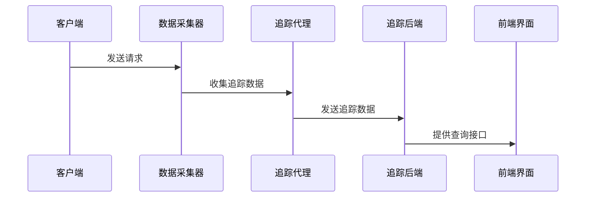
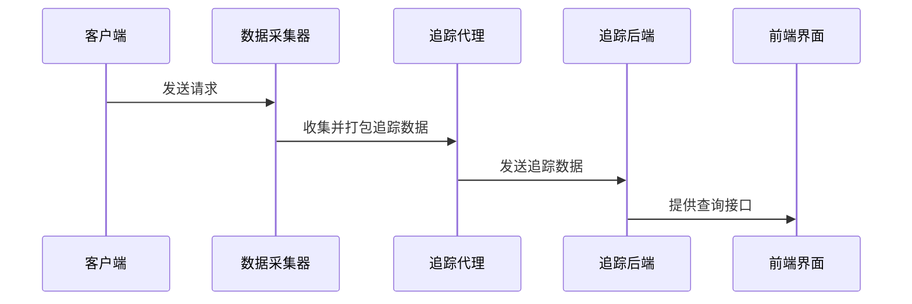
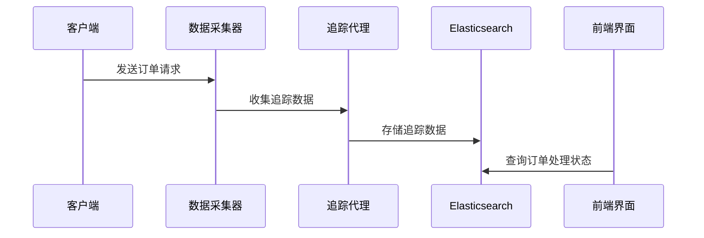

                 

### 分布式追踪系统实现

#### 关键词：分布式追踪系统，实现细节，架构设计，性能优化，最佳实践

> 摘要：本文将深入探讨分布式追踪系统的实现，涵盖从核心概念到系统架构，再到实现细节，以及优化策略的全面解析。通过具体案例，我们将展示如何设计和实现一个高效的分布式追踪系统，并提供最佳实践和注意事项，以帮助读者在实际项目中取得成功。

#### 引言

分布式系统在现代软件开发中扮演着越来越重要的角色。随着应用程序规模的扩大和复杂性的增加，确保系统的稳定性和性能变得越来越困难。分布式追踪系统作为一种重要的监控工具，能够帮助开发人员了解系统中各个组件的运行状态，快速定位和解决问题。本文将引导读者一步步了解分布式追踪系统的实现，从核心概念到实际应用，提供详细的指导。

#### 一、核心概念

分布式追踪系统主要涉及以下几个核心概念：

1. **追踪数据**：追踪系统记录的数据，包括请求ID、操作名称、耗时、异常信息等。
2. **追踪上下文**：用于关联追踪数据的元数据，如用户ID、服务名称、实例ID等。
3. **追踪链**：一系列追踪数据的集合，代表了一个请求在分布式系统中的执行路径。

下面是一个概念属性特征对比表格：

| 概念        | 描述                  | 特征对比                                  |
| ----------- | --------------------- | ---------------------------------------- |
| 追踪数据    | 跟踪请求的详细信息    | 类型：文本，格式：JSON                   |
| 追踪上下文  | 关联追踪数据的元数据  | 类型：键值对，格式：Map                  |
| 追踪链      | 请求的执行路径        | 结构：列表，元素：追踪数据               |

此外，可以使用ER实体关系图来展示这些概念之间的关联：

```mermaid
erDiagram
  追踪数据 ||--|{ 追踪上下文 }|| 追踪链
  追踪上下文 ||--|{ 服务实例 }|| 请求
```

#### 二、系统设计与架构

分布式追踪系统的设计需要考虑系统的高可用性、可扩展性和性能。以下是系统设计与架构的详细讲解：

##### 1. 系统架构设计

分布式追踪系统的架构通常包括以下模块：

1. **数据采集器**：从各个服务中收集追踪数据。
2. **追踪代理**：将采集到的数据发送到追踪后端。
3. **追踪后端**：存储和查询追踪数据。
4. **前端界面**：展示追踪数据。

系统架构图如下：



##### 2. 接口设计与数据交互

系统中的数据交互需要遵循一定的接口规范。以下是一个简单的接口设计：

1. **数据采集器API**：提供发送追踪数据的接口。
2. **追踪后端API**：提供查询追踪数据的接口。

接口规范示例：

```yaml
# 数据采集器API
POST /api/traces
Content-Type: application/json

# 追踪后端API
GET /api/traces/{traceId}
Content-Type: application/json
```

数据交互流程图如下：



#### 三、实现细节

分布式追踪系统的实现细节包括数据采集、存储和查询。以下是每个环节的详细讲解：

##### 1. 数据采集

数据采集器通常通过日志、API钩子或SDK等方式从各个服务中收集追踪数据。以下是一个简单的数据采集器实现：

```python
import requests
import json

class DataCollector:
    def __init__(self, endpoint):
        self.endpoint = endpoint

    def collect_trace(self, trace_data):
        response = requests.post(self.endpoint, json=trace_data)
        return response.json()
```

##### 2. 数据存储

追踪后端需要存储大量的追踪数据。常用的存储方案包括关系型数据库、NoSQL数据库和分布式日志系统。以下是使用Elasticsearch作为追踪后端存储的一个示例：

```python
from elasticsearch import Elasticsearch

class TraceBackend:
    def __init__(self, es_endpoint):
        self.es = Elasticsearch(es_endpoint)

    def store_trace(self, trace_data):
        self.es.index(index="traces", id=trace_data['traceId'], document=trace_data)
```

##### 3. 数据查询

数据查询是分布式追踪系统的关键功能之一。以下是一个简单的查询接口实现：

```python
from elasticsearch import Elasticsearch

class TraceSearch:
    def __init__(self, es_endpoint):
        self.es = Elasticsearch(es_endpoint)

    def search_traces(self, trace_id):
        response = self.es.search(index="traces", body={"query": {"match": {"traceId": trace_id}}})
        return response['hits']['hits']
```

#### 四、案例研究

为了更好地理解分布式追踪系统的实现，我们可以通过一个具体案例来展示。

##### 1. 案例背景

某电商平台需要监控其订单处理流程，包括订单创建、支付、发货等环节。系统要求能够实时追踪订单的处理状态，并能够快速定位和解决问题。

##### 2. 系统实现

系统架构设计：

- 数据采集器：从订单服务、支付服务和物流服务中收集追踪数据。
- 追踪代理：将采集到的数据发送到Elasticsearch。
- 前端界面：提供查询接口，展示订单处理流程。

系统功能设计（领域模型类图）：

```mermaid
classDiagram
  OrderService <<Interface>>
  PaymentService <<Interface>>
  LogisticsService <<Interface>>

  Order <<Entity>>
  Payment <<Entity>>
  Logistics <<Entity>>

  OrderService|--|> Order
  PaymentService|--|> Payment
  LogisticsService|--|> Logistics
```

系统架构设计（Mermaid架构图）：

```mermaid
graph TB
  subgraph 分布式追踪系统
    数据采集器[数据采集器]
    追踪代理[追踪代理]
    Elasticsearch[追踪后端]
    前端界面[前端界面]

    数据采集器->追踪代理
    追踪代理->Elasticsearch
    前端界面->Elasticsearch
  end
```

系统接口设计（Mermaid序列图）：



#### 五、最佳实践与优化

分布式追踪系统在实际应用中需要考虑性能、可靠性和可扩展性。以下是一些最佳实践和优化策略：

- **性能优化**：使用高效的数据采集器和追踪代理，减少数据传输延迟。优化Elasticsearch索引和查询性能。
- **可靠性优化**：确保数据采集器和追踪代理的高可用性，使用分布式存储和备份机制。
- **可扩展性优化**：设计可水平扩展的系统架构，根据需求动态调整资源。

#### 总结

分布式追踪系统是实现分布式系统监控和管理的重要工具。本文通过详细讲解分布式追踪系统的核心概念、系统设计与架构、实现细节以及优化策略，帮助读者理解并设计高效的分布式追踪系统。在实际应用中，结合最佳实践，可以构建出稳定、高效、可扩展的分布式追踪系统。

#### 作者

作者：AI天才研究院/AI Genius Institute & 禅与计算机程序设计艺术 /Zen And The Art of Computer Programming

---

本文全面解析了分布式追踪系统的实现，从核心概念到系统架构，再到实现细节，以及优化策略，旨在为读者提供深入的理解和实践指导。通过具体的案例研究和最佳实践，本文旨在帮助开发者在实际项目中取得成功。希望本文能对您在分布式追踪系统的设计和实现中有所帮助。如果您对分布式追踪系统有任何疑问或建议，欢迎在评论区留言讨论。感谢您的阅读！

