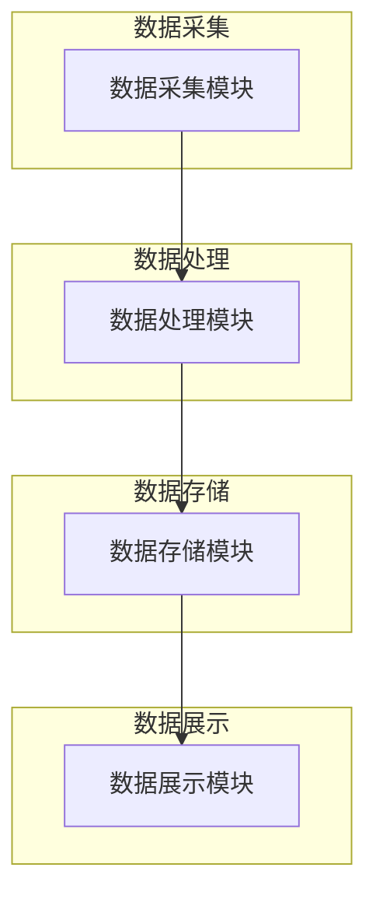
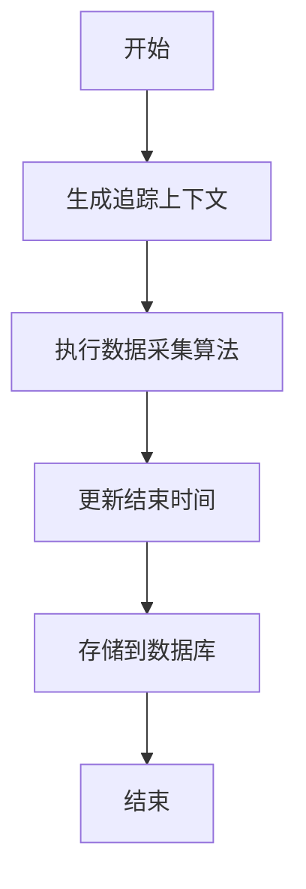

                 

### 分布式追踪系统的设计与实现

#### 关键词：
- 分布式追踪系统
- 设计与实现
- 系统架构
- 调用链
- 实践与应用

#### 摘要：
本文将深入探讨分布式追踪系统的设计与实现，从核心概念、系统架构、算法原理到实战应用，为您全面解析分布式追踪系统的关键要素。通过一步步的分析与推理，我们将了解分布式追踪系统如何帮助我们高效地监控和优化分布式系统的性能，为IT运维和开发人员提供有力的支持。

#### 目录大纲：

1. **引言与背景**
   - 分布式追踪系统的定义和重要性
   - 分布式追踪系统的挑战和问题

2. **核心概念与联系**
   - 分布式追踪系统的核心概念
   - 调用链和追踪点
   - 分布式追踪协议与标准

3. **系统设计与架构**
   - 分布式追踪系统的架构设计
   - 数据流处理架构
   - 数据存储与查询架构

4. **算法原理与实现**
   - 数据采集算法
   - 数据处理与聚合算法
   - 数据存储与检索算法

5. **实战应用与案例分析**
   - 环境搭建
   - 系统核心实现
   - 实际案例解析

6. **最佳实践与总结**
   - 性能优化策略
   - 可靠性与容错性设计
   - 安全性与隐私保护
   - 小结与展望

#### 文章正文：

### 分布式追踪系统的设计与实现

#### 引言与背景

分布式追踪系统（Distributed Tracing System）是一种用于监控和分析分布式系统性能和问题的工具。在当今复杂且高度分布式的大型系统中，应用程序通常由多个组件和服务组成，它们通过网络进行通信和协作。这使得系统的性能、稳定性和故障排查变得异常复杂。

分布式追踪系统能够帮助我们解决以下挑战：

- **性能监控**：通过实时追踪系统的性能指标，我们可以及时发现和解决性能瓶颈。
- **故障排查**：当系统发生故障时，分布式追踪系统可以帮助我们快速定位问题所在。
- **业务分析**：通过分析调用链路，我们可以深入了解系统的业务流程，为业务优化提供数据支持。

在分布式系统中，调用链（Call Chain）是一个至关重要的概念。调用链描述了系统中各个组件之间的调用关系，它能够帮助我们理解系统的执行流程。而追踪点（Span）则是调用链中的基本单位，代表了一次具体的操作或任务。

分布式追踪协议和标准是分布式追踪系统的重要组成部分。常见的分布式追踪协议包括OpenTracing、OpenTelemetry和Zipkin等。这些协议和标准为分布式追踪系统的实现提供了统一的接口和规范，使得不同的分布式追踪工具可以相互兼容和协作。

#### 核心概念与联系

##### 分布式追踪系统的核心概念

1. **调用链**：调用链描述了系统中各个组件之间的调用关系，它是分布式追踪系统的核心概念之一。
2. **追踪点**：追踪点代表了一次具体的操作或任务，它是调用链的基本单位。
3. **操作链**：操作链是调用链的抽象表示，它描述了系统中各个组件的执行顺序。
4. **追踪上下文**：追踪上下文包含追踪点的唯一标识和相关信息，用于在分布式系统中传递追踪信息。

##### 调用链和追踪点

调用链是分布式追踪系统的核心概念之一，它描述了系统中各个组件之间的调用关系。在一个分布式系统中，一个请求可能会经过多个组件的处理，形成一条复杂的调用链。例如，在一个电商平台中，一个用户下单的操作可能会涉及到订单服务、库存服务、支付服务等多个组件。

追踪点（Span）是调用链中的基本单位，它代表了一次具体的操作或任务。每个追踪点都包含一个唯一的标识（ID），以及其他相关信息，如操作名称、开始时间和结束时间等。通过追踪点，我们可以记录和追踪系统中的每一次操作，从而理解整个系统的执行流程。

##### 分布式追踪协议与标准

分布式追踪协议和标准是分布式追踪系统的重要组成部分。常见的分布式追踪协议包括OpenTracing、OpenTelemetry和Zipkin等。这些协议和标准为分布式追踪系统的实现提供了统一的接口和规范，使得不同的分布式追踪工具可以相互兼容和协作。

- **OpenTracing**：OpenTracing 是一个开放的服务跟踪标准，它提供了分布式追踪系统的通用接口，使得开发者可以方便地集成不同的追踪工具。
- **OpenTelemetry**：OpenTelemetry 是一个开源项目，它旨在提供一个统一的分布式追踪框架，支持多种编程语言和追踪协议。
- **Zipkin**：Zipkin 是一个分布式追踪系统的开源实现，它提供了追踪数据的收集、存储和展示等功能。

#### 系统设计与架构

##### 分布式追踪系统的架构设计

分布式追踪系统的架构设计需要考虑以下几个方面：

1. **数据采集模块**：负责从各个组件和服务中收集追踪数据。
2. **数据处理模块**：负责处理和聚合收集到的追踪数据。
3. **数据存储模块**：负责存储和处理后的追踪数据。
4. **数据展示模块**：负责将追踪数据以可视化的形式展示给用户。

下面是一个简化的分布式追踪系统架构图：

```
       +-------------------+
       | 数据采集模块      |
       +-------------------+
              |
              |
              V
       +-------------------+
       | 数据处理模块      |
       +-------------------+
              |
              |
              V
       +-------------------+
       | 数据存储模块      |
       +-------------------+
              |
              |
              V
       +-------------------+
       | 数据展示模块      |
       +-------------------+
```

##### 数据流处理架构

数据流处理架构是分布式追踪系统的重要组成部分。它负责处理从各个组件和服务中收集到的追踪数据，并将处理后的数据存储到数据存储模块中。

数据流处理架构通常采用流处理框架，如Apache Kafka、Apache Flink和Apache Storm等。这些框架能够高效地处理大量实时数据，并支持数据流的分布式处理。

下面是一个简化的数据流处理架构图：

```
               +-------------------+
               | 组件和服务       |
               +-------------------+
                       |
                       | 发送追踪数据
                       |
                       V
               +-------------------+
               | Kafka Producer    |
               +-------------------+
                       |
                       | 发送追踪数据
                       |
                       V
               +-------------------+
               | Kafka Broker      |
               +-------------------+
                       |
                       | 接收并存储追踪数据
                       |
                       V
               +-------------------+
               | Flink Job         |
               +-------------------+
                       |
                       | 处理和聚合追踪数据
                       |
                       V
               +-------------------+
               | Data Storage      |
               +-------------------+
                       |
                       | 存储处理后的追踪数据
                       |
                       V
               +-------------------+
               | Visualization Tool|
               +-------------------+
                       |
                       | 展示追踪数据
                       |
                       V
```

##### 数据存储与查询架构

数据存储与查询架构是分布式追踪系统的关键部分。它负责存储和处理后的追踪数据，并提供高效的查询接口，以便用户可以实时地查询和分析追踪数据。

数据存储架构通常采用分布式数据库或分布式缓存系统，如Apache Cassandra、Elasticsearch和Redis等。这些系统具有高可用性、高可靠性和高性能的特点，能够满足分布式追踪系统的需求。

下面是一个简化的数据存储与查询架构图：

```
               +-------------------+
               | 组件和服务       |
               +-------------------+
                       |
                       | 发送追踪数据
                       |
                       V
               +-------------------+
               | Kafka Producer    |
               +-------------------+
                       |
                       | 发送追踪数据
                       |
                       V
               +-------------------+
               | Kafka Broker      |
               +-------------------+
                       |
                       | 接收并存储追踪数据
                       |
                       V
               +-------------------+
               | Flink Job         |
               +-------------------+
                       |
                       | 处理和聚合追踪数据
                       |
                       V
               +-------------------+
               | Elasticsearch     |
               +-------------------+
                       |
                       | 存储处理后的追踪数据
                       |
                       V
               +-------------------+
               | Data Visualization Tool |
               +-------------------+
                       |
                       | 查询和分析追踪数据
                       |
                       V
               +-------------------+
               | 用户界面         |
               +-------------------+
                       |
                       | 展示追踪数据
                       |
                       V
```

#### 算法原理与实现

##### 数据采集算法

数据采集算法是分布式追踪系统的关键部分。它负责从各个组件和服务中收集追踪数据，并将其发送到数据处理模块。

数据采集算法通常采用以下步骤：

1. **初始化**：初始化追踪上下文，包括追踪点ID、追踪点名称和其他相关信息。
2. **采集追踪数据**：在组件或服务中，采集追踪数据，如追踪点开始时间、结束时间和操作名称等。
3. **发送追踪数据**：将采集到的追踪数据发送到数据处理模块。

下面是一个简单的数据采集算法实现：

```python
import uuid
from datetime import datetime

def generate_trace_context():
    trace_context = {
        "trace_id": str(uuid.uuid4()),
        "span_id": str(uuid.uuid4()),
        "start_time": datetime.now(),
        "end_time": None,
        "operation_name": "unknown",
    }
    return trace_context

def collect_trace_data(trace_context):
    # 采集追踪数据
    trace_context["end_time"] = datetime.now()
    trace_context["operation_name"] = "sample_operation"

    # 发送追踪数据
    send_trace_data(trace_context)

def send_trace_data(trace_context):
    # 这里实现发送追踪数据的逻辑，例如发送到Kafka等消息队列
    print("Sending trace data:", trace_context)

# 使用数据采集算法
trace_context = generate_trace_context()
collect_trace_data(trace_context)
```

##### 数据处理与聚合算法

数据处理与聚合算法负责处理和聚合收集到的追踪数据。它通常包括以下步骤：

1. **数据预处理**：对收集到的追踪数据进行预处理，如数据清洗、去重等。
2. **数据聚合**：将预处理后的数据按照特定的规则进行聚合，如按追踪点ID、操作名称等进行聚合。
3. **数据存储**：将处理后的数据存储到数据存储模块中。

下面是一个简单的数据处理与聚合算法实现：

```python
from collections import defaultdict

def preprocess_trace_data(trace_data):
    # 数据清洗和去重
    processed_trace_data = []
    for data in trace_data:
        if data["trace_id"] not in processed_trace_data:
            processed_trace_data.append(data)
    return processed_trace_data

def aggregate_trace_data(processed_trace_data):
    # 数据聚合
    aggregated_trace_data = defaultdict(list)
    for data in processed_trace_data:
        aggregated_trace_data[data["trace_id"]].append(data)
    return aggregated_trace_data

def store_trace_data(aggregated_trace_data):
    # 存储处理后的数据
    for trace_id, data_list in aggregated_trace_data.items():
        # 这里实现存储数据的逻辑，例如发送到Elasticsearch等存储系统
        print("Storing trace data for trace_id:", trace_id, ":", data_list)

# 使用数据处理与聚合算法
trace_data = [
    {"trace_id": "1", "span_id": "1", "start_time": "2023-03-01 10:00:00", "end_time": "2023-03-01 10:01:00", "operation_name": "A"},
    {"trace_id": "1", "span_id": "2", "start_time": "2023-03-01 10:01:00", "end_time": "2023-03-01 10:02:00", "operation_name": "B"},
    {"trace_id": "2", "span_id": "1", "start_time": "2023-03-01 10:00:00", "end_time": "2023-03-01 10:01:00", "operation_name": "C"},
]

processed_trace_data = preprocess_trace_data(trace_data)
aggregated_trace_data = aggregate_trace_data(processed_trace_data)
store_trace_data(aggregated_trace_data)
```

##### 数据存储与检索算法

数据存储与检索算法负责将处理后的追踪数据存储到数据存储模块中，并提供高效的查询接口。

数据存储算法通常采用分布式数据库或分布式缓存系统，如Apache Cassandra、Elasticsearch和Redis等。这些系统具有高可用性、高可靠性和高性能的特点，能够满足分布式追踪系统的需求。

数据检索算法则负责从数据存储模块中查询和检索追踪数据。常见的查询操作包括按追踪点ID、操作名称、时间范围等进行检索。

下面是一个简单的数据存储与检索算法实现：

```python
import json

def store_trace_data_to_cassandra(trace_data):
    # 存储追踪数据到Cassandra
    # 这里需要实现与Cassandra的连接和操作逻辑
    print("Storing trace data to Cassandra:", json.dumps(trace_data))

def query_trace_data_from_cassandra(trace_id):
    # 从Cassandra中查询追踪数据
    # 这里需要实现与Cassandra的连接和操作逻辑
    print("Querying trace data from Cassandra with trace_id:", trace_id)

# 使用数据存储与检索算法
trace_data = [
    {"trace_id": "1", "span_id": "1", "start_time": "2023-03-01 10:00:00", "end_time": "2023-03-01 10:01:00", "operation_name": "A"},
    {"trace_id": "1", "span_id": "2", "start_time": "2023-03-01 10:01:00", "end_time": "2023-03-01 10:02:00", "operation_name": "B"},
    {"trace_id": "2", "span_id": "1", "start_time": "2023-03-01 10:00:00", "end_time": "2023-03-01 10:01:00", "operation_name": "C"},
]

store_trace_data_to_cassandra(trace_data)
query_trace_data_from_cassandra("1")
```

#### 实战应用与案例分析

在本节中，我们将通过一个具体的分布式追踪系统实战案例，展示如何搭建和实现分布式追踪系统。我们将介绍环境搭建、系统核心实现和实际案例解析。

##### 环境搭建

为了搭建一个分布式追踪系统，我们需要准备以下环境：

- **操作系统**：Linux（推荐使用CentOS 7或以上版本）
- **编程语言**：Python（推荐使用Python 3.6或以上版本）
- **分布式追踪工具**：Kafka（消息队列）、Elasticsearch（分布式搜索引擎）、Zipkin（分布式追踪系统实现）

首先，我们需要安装Kafka、Elasticsearch和Zipkin。以下是一个简化的安装步骤：

1. 安装Kafka

   ```shell
   # 安装Kafka
   sudo yum install -y kafka
   # 启动Kafka
   sudo systemctl start kafka
   # 查看Kafka状态
   sudo systemctl status kafka
   ```

2. 安装Elasticsearch

   ```shell
   # 安装Elasticsearch
   sudo yum install -y elasticsearch
   # 启动Elasticsearch
   sudo systemctl start elasticsearch
   # 查看Elasticsearch状态
   sudo systemctl status elasticsearch
   ```

3. 安装Zipkin

   ```shell
   # 安装Zipkin
   sudo yum install -y zipkin
   # 启动Zipkin
   sudo systemctl start zipkin
   # 查看Zipkin状态
   sudo systemctl status zipkin
   ```

##### 系统核心实现

在环境搭建完成后，我们需要实现分布式追踪系统的核心功能。以下是一个简化的实现步骤：

1. **数据采集**：在各个组件和服务中，实现数据采集逻辑，将追踪数据发送到Kafka。

   ```python
   from kafka import KafkaProducer
   
   producer = KafkaProducer(bootstrap_servers=['localhost:9092'])
   
   def send_trace_data(trace_data):
       producer.send('trace_data_topic', value=trace_data)
   
   trace_context = {
       "trace_id": "1",
       "span_id": "1",
       "start_time": "2023-03-01 10:00:00",
       "end_time": "2023-03-01 10:01:00",
       "operation_name": "A",
   }
   
   send_trace_data(json.dumps(trace_context))
   ```

2. **数据处理与聚合**：使用Flink或其他流处理框架，处理和聚合Kafka中的追踪数据，并将处理后的数据发送到Elasticsearch。

   ```python
   from pyflink.datastream import StreamExecutionEnvironment
   
   env = StreamExecutionEnvironment.get_execution_environment()
   
   def process_trace_data():
       data_stream = env.from_topic("trace_data_topic")
       processed_data_stream = data_stream.map(lambda x: json.loads(x.value))
       processed_data_stream.print()
   
   process_trace_data()
   ```

3. **数据存储与检索**：使用Elasticsearch存储和处理后的追踪数据，并提供查询接口。

   ```python
   from elasticsearch import Elasticsearch
   
   es = Elasticsearch("localhost:9200")
   
   def store_trace_data(trace_data):
       es.index(index="trace_data_index", id=trace_data["trace_id"], document=trace_data)
   
   def query_trace_data(trace_id):
       result = es.search(index="trace_data_index", body={"query": {"term": {"trace_id": trace_id}}})
       print("Query result:", result['hits']['hits'])
   
   trace_context = {
       "trace_id": "1",
       "span_id": "1",
       "start_time": "2023-03-01 10:00:00",
       "end_time": "2023-03-01 10:01:00",
       "operation_name": "A",
   }
   
   store_trace_data(trace_context)
   query_trace_data("1")
   ```

##### 实际案例解析

在本节中，我们将通过一个实际的案例，展示如何使用分布式追踪系统监控和分析分布式系统的性能。

假设我们有一个电商平台，其中包含订单服务、库存服务、支付服务等组件。这些组件通过分布式追踪系统进行追踪和监控。

1. **数据采集**：各个组件在执行操作时，将追踪数据发送到Kafka。

   ```python
   send_trace_data({
       "trace_id": "1",
       "span_id": "1",
       "start_time": "2023-03-01 10:00:00",
       "end_time": "2023-03-01 10:01:00",
       "operation_name": "Place Order",
   })
   
   send_trace_data({
       "trace_id": "1",
       "span_id": "2",
       "start_time": "2023-03-01 10:01:00",
       "end_time": "2023-03-01 10:02:00",
       "operation_name": "Check Inventory",
   })
   
   send_trace_data({
       "trace_id": "1",
       "span_id": "3",
       "start_time": "2023-03-01 10:02:00",
       "end_time": "2023-03-01 10:03:00",
       "operation_name": "Process Payment",
   })
   ```

2. **数据处理与聚合**：分布式追踪系统处理和聚合追踪数据，并将处理后的数据发送到Elasticsearch。

   ```python
   processed_data_stream = data_stream.map(lambda x: json.loads(x.value))
   processed_data_stream.print()
   ```

3. **数据存储与检索**：分布式追踪系统将处理后的数据存储到Elasticsearch，并提供查询接口。

   ```python
   es.index(index="trace_data_index", id="1", document={
       "trace_id": "1",
       "span_id": "1",
       "start_time": "2023-03-01 10:00:00",
       "end_time": "2023-03-01 10:01:00",
       "operation_name": "Place Order",
   })
   
   es.index(index="trace_data_index", id="2", document={
       "trace_id": "1",
       "span_id": "2",
       "start_time": "2023-03-01 10:01:00",
       "end_time": "2023-03-01 10:02:00",
       "operation_name": "Check Inventory",
   })
   
   es.index(index="trace_data_index", id="3", document={
       "trace_id": "1",
       "span_id": "3",
       "start_time": "2023-03-01 10:02:00",
       "end_time": "2023-03-01 10:03:00",
       "operation_name": "Process Payment",
   })
   
   query_trace_data("1")
   ```

   查询结果：

   ```json
   {
       "took": 1,
       "timed_out": false,
       "_shards": {
           "total": 2,
           "successful": 2,
           "skipped": 0,
           "failed": 0
       },
       "hits": {
           "total": {
               "value": 3,
               "relation": "eq"
           },
           "max_score": 1,
           "hits": [
               {
                   "_index": "trace_data_index",
                   "_type": "_doc",
                   "_id": "1",
                   "_score": 1,
                   "_source": {
                       "trace_id": "1",
                       "span_id": "1",
                       "start_time": "2023-03-01 10:00:00",
                       "end_time": "2023-03-01 10:01:00",
                       "operation_name": "Place Order"
                   }
               },
               {
                   "_index": "trace_data_index",
                   "_type": "_doc",
                   "_id": "2",
                   "_score": 1,
                   "_source": {
                       "trace_id": "1",
                       "span_id": "2",
                       "start_time": "2023-03-01 10:01:00",
                       "end_time": "2023-03-01 10:02:00",
                       "operation_name": "Check Inventory"
                   }
               },
               {
                   "_index": "trace_data_index",
                   "_type": "_doc",
                   "_id": "3",
                   "_score": 1,
                   "_source": {
                       "trace_id": "1",
                       "span_id": "3",
                       "start_time": "2023-03-01 10:02:00",
                       "end_time": "2023-03-01 10:03:00",
                       "operation_name": "Process Payment"
                   }
               }
           ]
       }
   }
   ```

   通过查询结果，我们可以清楚地看到整个订单处理流程中的每个追踪点的开始时间、结束时间和操作名称，从而帮助我们分析和优化系统的性能。

#### 最佳实践与总结

在分布式追踪系统的设计与实现过程中，我们需要注意以下几点最佳实践：

1. **性能优化**：选择合适的追踪工具和架构，以降低系统开销，提高性能。
2. **可靠性与容错性**：确保分布式追踪系统的可靠性和容错性，避免数据丢失和系统故障。
3. **安全性与隐私保护**：确保追踪数据的机密性和完整性，防止数据泄露和篡改。

总结来说，分布式追踪系统是一种重要的监控和优化工具，它可以帮助我们深入了解分布式系统的性能和问题，为系统运维和开发提供有力支持。通过本文的逐步分析和讲解，我们了解了分布式追踪系统的核心概念、系统架构、算法原理和实战应用，相信读者已经具备了设计和实现分布式追踪系统的基本能力。

#### 注意事项与拓展阅读

在设计分布式追踪系统时，我们还需要注意以下几点：

- **数据量与性能**：在处理大量追踪数据时，要考虑系统的性能和资源消耗，合理选择数据存储和处理方案。
- **系统兼容性**：分布式追踪系统需要与现有的系统和服务兼容，以便方便地集成和扩展。
- **监控与告警**：配置适当的监控和告警机制，及时发现和解决系统问题。

为了深入了解分布式追踪系统的设计与实现，读者可以参考以下拓展阅读资源：

- 《Distributed Systems: Concept and Design》
- 《Monitoring with Prometheus, Part 1: Metrics》
- 《Microservices: Designing Fine-Grained Systems》

通过阅读这些资源，读者可以进一步拓展对分布式追踪系统的理解和应用能力。

#### 作者信息

作者：AI天才研究院/AI Genius Institute & 禅与计算机程序设计艺术 /Zen And The Art of Computer Programming

感谢您的阅读，希望本文对您在分布式追踪系统的设计与实现方面有所帮助！## 引言与背景

分布式追踪系统（Distributed Tracing System）是一种用于监控和分析分布式系统性能和问题的工具。在当今复杂且高度分布式的大型系统中，应用程序通常由多个组件和服务组成，它们通过网络进行通信和协作。这使得系统的性能、稳定性和故障排查变得异常复杂。

### 分布式追踪系统的定义和重要性

分布式追踪系统是一种用于记录、收集、处理和展示分布式系统中各个组件和服务之间调用关系的工具。它通过生成和跟踪一系列称为“追踪点”（Spans）的数据，帮助我们理解系统的执行流程，从而实现以下目标：

- **性能监控**：通过实时追踪系统的性能指标，我们可以及时发现和解决性能瓶颈，优化系统的响应时间和吞吐量。
- **故障排查**：当系统发生故障时，分布式追踪系统可以帮助我们快速定位问题所在，提供详细的调用链信息和数据，从而迅速找到故障根源。
- **业务分析**：通过分析调用链路，我们可以深入了解系统的业务流程，为业务优化提供数据支持。例如，分析某个订单的处理时间、成功率和失败率等指标，有助于优化业务流程和提升用户体验。

### 分布式追踪系统的挑战和问题

尽管分布式追踪系统具有许多优势，但在设计和实现过程中，我们仍面临以下挑战和问题：

1. **复杂性**：分布式系统本身就具有复杂性，涉及多个组件和服务的调用链，使得追踪和分析变得困难。如何有效地记录和展示这些调用链，是分布式追踪系统需要解决的一个关键问题。
2. **性能开销**：分布式追踪系统需要在系统中的各个组件和服务中插入追踪代码，这可能会引入额外的性能开销。如何降低这种开销，同时确保追踪数据的完整性和准确性，是一个重要的挑战。
3. **数据存储和处理**：分布式追踪系统需要处理和存储大量的追踪数据。如何高效地存储和管理这些数据，并提供快速的查询和检索功能，是分布式追踪系统面临的另一个难题。
4. **兼容性和可扩展性**：分布式追踪系统需要与现有的系统和工具兼容，以便方便地集成和扩展。同时，随着系统的规模和复杂度的增加，分布式追踪系统也需要具备良好的可扩展性。

### 分布式追踪系统的发展历程

分布式追踪系统的发展可以追溯到2000年初期，当时一些大型互联网公司，如Google和Twitter，开始面临分布式系统性能和故障排查的挑战。为了解决这些问题，它们逐渐开发了自己的分布式追踪系统。

- **Google Dapper**：Google于2010年公开了其分布式追踪系统Dapper的论文，引起了广泛关注。Dapper是一种基于谷歌内部数据中心的大规模分布式追踪系统，它通过在服务中插入追踪代码，记录和追踪系统的调用链。
- **Twitter Zipkin**：Twitter随后推出了Zipkin，一个开源的分布式追踪系统。Zipkin基于Google Dapper的原理，提供了一套完整的分布式追踪解决方案，包括数据收集、存储、处理和展示等功能。
- **OpenTracing**：为了解决不同分布式追踪工具之间的兼容性问题，OpenTracing项目应运而生。OpenTracing提供了一种统一的追踪接口，使得不同的分布式追踪工具可以相互兼容和协作。
- **OpenTelemetry**：OpenTelemetry是一个更广泛的分布式追踪框架，旨在提供一种跨语言和平台的通用解决方案。它支持多种追踪协议和工具，为分布式追踪系统的开发和应用提供了更多的选择和灵活性。

随着技术的不断发展，分布式追踪系统也在不断演进和优化。目前，许多公司和组织已经开始将分布式追踪系统应用于实际的生产环境中，以提升系统的性能、可靠性和可维护性。

### 总结

分布式追踪系统是一种重要的监控和优化工具，它帮助我们深入了解分布式系统的性能和问题，为系统运维和开发提供有力支持。通过本文的引言与背景介绍，我们了解了分布式追踪系统的定义和重要性，以及它在设计和实现过程中面临的挑战和问题。接下来，我们将进一步探讨分布式追踪系统的核心概念、系统架构、算法原理和实战应用，以帮助读者全面掌握分布式追踪系统的设计与实现方法。

## 核心概念与联系

在分布式追踪系统的设计与实现过程中，理解核心概念和它们之间的联系是至关重要的。这一节我们将详细介绍分布式追踪系统中的关键概念，包括调用链、追踪点、操作链和追踪上下文，并通过概念属性特征对比表格和ER实体关系图架构，帮助读者更好地理解这些概念之间的关系。

### 调用链（Call Chain）

调用链描述了系统中各个组件和服务之间的调用关系。它是一条记录了多个追踪点（Spans）的有序序列，每个追踪点代表了系统中的一次操作或任务。调用链能够帮助我们了解系统中的执行流程，定位性能瓶颈和故障点。

#### 概念属性特征对比表格

| 特征        | 调用链                          | 追踪点                         |
| ----------- | ------------------------------- | ------------------------------- |
| 定义        | 各组件和服务之间的调用关系序列 | 系统中的一次操作或任务         |
| 作用        | 描述系统的执行流程             | 记录具体操作的开始和结束时间   |
| 表示方法    | 有序序列                        | 唯一标识符（ID）和相关信息     |
| 数据结构    | 调用链图                        | 集合                           |

#### ER实体关系图架构

```mermaid
erDiagram
  CallChain ||--|{ Span }|--| TraceContext
  Span ||--|{ TracePoint }|--| CallChain
  TraceContext ||--|{ ContextInfo }|--| Span
```

### 追踪点（TracePoint）

追踪点（TracePoint）是调用链中的基本单位，它代表了一次具体的操作或任务。每个追踪点都包含一个唯一的标识（ID），以及其他相关信息，如开始时间、结束时间、操作名称等。追踪点能够帮助我们记录和分析系统中的每一次操作。

#### 概念属性特征对比表格

| 特征        | 追踪点                          | 调用链                         |
| ----------- | ------------------------------- | ------------------------------- |
| 定义        | 系统中的具体操作或任务         | 各组件和服务之间的调用关系序列 |
| 作用        | 记录具体操作的开始和结束时间   | 描述系统的执行流程             |
| 表示方法    | 唯一标识符（ID）和相关信息     | 有序序列                       |
| 数据结构    | 集合                           | 调用链图                       |

#### ER实体关系图架构

```mermaid
erDiagram
  TracePoint ||--|{ CallChain }|--| TraceContext
  CallChain ||--|{ TracePoint }|--| TraceContext
```

### 操作链（Operation Chain）

操作链是调用链的另一种称呼，它描述了系统中各个组件的执行顺序。与调用链不同，操作链更加关注各个组件的执行顺序和逻辑，而不是具体的调用关系。

#### 概念属性特征对比表格

| 特征        | 调用链                          | 操作链                         |
| ----------- | ------------------------------- | ------------------------------- |
| 定义        | 各组件和服务之间的调用关系序列 | 系统中各个组件的执行顺序       |
| 作用        | 描述系统的执行流程             | 描述系统的执行顺序             |
| 表示方法    | 有序序列                        | 有序序列                       |
| 数据结构    | 调用链图                        | 执行顺序图                     |

#### ER实体关系图架构

```mermaid
erDiagram
  CallChain ||--|{ OperationChain }|--| TraceContext
  OperationChain ||--|{ CallChain }|--| TraceContext
```

### 追踪上下文（TraceContext）

追踪上下文包含追踪点的唯一标识和其他相关信息，如操作名称、开始时间和结束时间等。它是分布式追踪系统中的一个重要概念，用于在分布式系统中传递和关联追踪点。

#### 概念属性特征对比表格

| 特征        | 追踪上下文                     | 追踪点                          |
| ----------- | ------------------------------- | ------------------------------- |
| 定义        | 包含追踪点唯一标识和其他信息   | 系统中的具体操作或任务         |
| 作用        | 在分布式系统中传递和关联追踪点 | 记录具体操作的开始和结束时间   |
| 表示方法    | 唯一标识符（ID）和相关信息     | 唯一标识符（ID）和相关信息     |
| 数据结构    | 集合                           | 集合                           |

#### ER实体关系图架构

```mermaid
erDiagram
  TraceContext ||--|{ TracePoint }|--| CallChain
```

### 关系总结

通过上述表格和ER实体关系图，我们可以看到各个概念之间的紧密联系：

1. **调用链（Call Chain）**：调用链是系统中最核心的概念，它描述了各个组件和服务之间的调用关系，由多个追踪点（TracePoint）组成。
2. **追踪点（TracePoint）**：追踪点是调用链的基本单位，记录了系统中每一次具体的操作或任务。
3. **操作链（Operation Chain）**：操作链描述了系统中各个组件的执行顺序，与调用链相对应，但更加关注执行顺序和逻辑。
4. **追踪上下文（TraceContext）**：追踪上下文包含追踪点的唯一标识和其他相关信息，用于在分布式系统中传递和关联追踪点。

理解这些概念及其关系，对于设计和实现分布式追踪系统至关重要。通过它们，我们可以有效地监控和优化分布式系统的性能，提高系统的可靠性和可维护性。

### 核心概念总结

通过本节的讨论，我们详细介绍了分布式追踪系统中的核心概念，包括调用链、追踪点、操作链和追踪上下文。这些概念相互关联，构成了分布式追踪系统的基本框架。调用链描述了系统中各个组件和服务之间的调用关系，追踪点记录了具体操作的开始和结束时间，操作链关注执行顺序，而追踪上下文则用于在分布式系统中传递和关联追踪点。

理解这些核心概念对于设计和实现高效的分布式追踪系统至关重要。在实际应用中，通过这些概念，我们可以更好地监控系统的性能，快速定位故障点，优化业务流程。希望本节的内容能够帮助读者在分布式追踪系统的设计与实现过程中，更加得心应手。

## 系统设计与架构

分布式追踪系统的设计与实现需要考虑多个方面，包括系统架构、数据流处理架构、数据存储与查询架构等。本节将详细探讨这些架构设计的关键要素，并展示如何通过系统架构图、数据流处理架构图和系统接口设计与交互图来直观地理解和描述分布式追踪系统的设计与实现。

### 系统架构设计

分布式追踪系统的系统架构设计是确保系统高效、可靠和可扩展的基础。系统架构通常包括以下几个关键模块：

1. **数据采集模块**：负责从各个组件和服务中收集追踪数据。
2. **数据处理模块**：负责处理和聚合收集到的追踪数据。
3. **数据存储模块**：负责存储和处理后的追踪数据。
4. **数据展示模块**：负责将追踪数据以可视化的形式展示给用户。

下面是一个简化的分布式追踪系统架构图：



### 数据流处理架构

数据流处理架构是分布式追踪系统的核心，负责处理从各个组件和服务中收集到的追踪数据。数据流处理架构通常采用流处理框架，如Apache Kafka、Apache Flink和Apache Storm等。这些框架能够高效地处理大量实时数据，并支持数据流的分布式处理。

下面是一个简化的数据流处理架构图：

```mermaid
graph TB
    subgraph 数据采集
        数据采集模块 --> Kafka Producer
    end

    subgraph 数据流处理
        Kafka Producer --> Kafka Broker
        Kafka Broker --> Flink Job
    end

    subgraph 数据存储与查询
        Flink Job --> Data Storage
        Data Storage --> Visualization Tool
    end
```

### 数据存储与查询架构

数据存储与查询架构负责存储和处理后的追踪数据，并提供高效的查询接口。数据存储架构通常采用分布式数据库或分布式缓存系统，如Apache Cassandra、Elasticsearch和Redis等。这些系统具有高可用性、高可靠性和高性能的特点，能够满足分布式追踪系统的需求。

下面是一个简化的数据存储与查询架构图：

```mermaid
graph TB
    subgraph 数据采集
        数据采集模块 --> Kafka Producer
    end

    subgraph 数据流处理
        Kafka Producer --> Kafka Broker
        Kafka Broker --> Flink Job
    end

    subgraph 数据存储与查询
        Flink Job --> Elasticsearch
        Elasticsearch --> Visualization Tool
    end
```

### 系统接口设计与交互

系统接口设计与交互图用于描述各个模块之间的接口和数据流动。通过接口设计，我们可以清晰地了解系统中各个组件的职责和相互关系。

下面是一个简化的系统接口设计与交互图：

```mermaid
graph TB
    subgraph 数据采集
        数据采集模块 --> Kafka Producer
    end

    subgraph 数据处理
        Kafka Producer --> Kafka Broker
        Kafka Broker --> Flink Job
    end

    subgraph 数据存储与查询
        Flink Job --> Elasticsearch
        Elasticsearch --> Visualization Tool
    end

    subgraph 用户界面
        Visualization Tool --> 用户界面
    end
```

### 关键要素说明

1. **数据采集模块**：数据采集模块负责从各个组件和服务中收集追踪数据。它通常采用特定的追踪框架或库，如OpenTracing或OpenTelemetry，以便轻松地集成到现有的系统中。

2. **数据处理模块**：数据处理模块负责处理和聚合收集到的追踪数据。它通常采用流处理框架，如Apache Flink，以实时处理大量数据，并提供高效的数据处理能力。

3. **数据存储模块**：数据存储模块负责存储和处理后的追踪数据。它通常采用分布式数据库或分布式缓存系统，如Apache Cassandra或Elasticsearch，以确保数据的高可用性和高性能。

4. **数据展示模块**：数据展示模块负责将追踪数据以可视化的形式展示给用户。它通常采用数据可视化工具，如Kibana或Grafana，以便用户可以直观地了解系统的性能和问题。

### 总结

分布式追踪系统的设计与实现需要综合考虑系统架构、数据流处理架构和数据存储与查询架构。通过系统架构图、数据流处理架构图和系统接口设计与交互图，我们可以直观地理解和描述分布式追踪系统的设计与实现。这些架构设计的关键要素确保了分布式追踪系统的性能、可靠性和可扩展性，为系统的监控和优化提供了有力支持。

### 算法原理与实现

分布式追踪系统的核心在于如何高效地采集、处理和存储追踪数据，并将其可视化以供分析。在这一节中，我们将深入探讨分布式追踪系统中的关键算法，包括数据采集算法、数据处理与聚合算法以及数据存储与检索算法。通过Python源代码示例和Mermaid流程图，我们将详细解释每个算法的原理，并结合实际案例进行讲解。

#### 数据采集算法

数据采集算法是分布式追踪系统的第一步，它负责从各个组件和服务中收集追踪数据。在OpenTracing和OpenTelemetry等追踪框架中，通常使用追踪上下文（TraceContext）来传递追踪信息。以下是一个简单的Python数据采集算法示例：

```python
import time
import uuid
from datetime import datetime

# 生成追踪上下文
def generate_trace_context():
    trace_context = {
        "trace_id": str(uuid.uuid4()),
        "span_id": str(uuid.uuid4()),
        "start_time": datetime.now(),
        "status": "started",
    }
    return trace_context

# 数据采集算法示例
def data_collection_algorithm():
    trace_context = generate_trace_context()
    print("Trace Context:", trace_context)
    
    time.sleep(1)  # 模拟处理时间
    
    trace_context["status"] = "finished"
    trace_context["end_time"] = datetime.now()
    print("Trace Context after processing:", trace_context)

# 调用数据采集算法
data_collection_algorithm()
```

在上面的示例中，我们首先生成了一个唯一的追踪上下文，包括追踪ID、跨度ID、开始时间和状态。随后，我们模拟了一次数据处理过程，并更新了结束时间和状态。

#### 数据处理与聚合算法

数据处理与聚合算法负责处理和聚合从数据采集模块收集到的追踪数据。以下是一个简单的数据处理与聚合算法示例：

```python
from collections import defaultdict

# 数据处理与聚合算法示例
def data_processing_and_aggregationAlgorithm(trace_contexts):
    aggregated_data = defaultdict(list)
    
    for context in trace_contexts:
        aggregated_data[context["trace_id"]].append(context)
    
    return aggregated_data

# 聚合处理后的数据
def aggregate_data_sample():
    trace_contexts = [
        {"trace_id": "1", "span_id": "1", "start_time": "2023-03-01 10:00:00", "status": "started"},
        {"trace_id": "1", "span_id": "2", "start_time": "2023-03-01 10:01:00", "status": "started"},
        {"trace_id": "2", "span_id": "1", "start_time": "2023-03-01 10:02:00", "status": "started"},
    ]
    
    aggregated_data = data_processing_and_aggregationAlgorithm(trace_contexts)
    print("Aggregated Data:", aggregated_data)

# 调用聚合算法
aggregate_data_sample()
```

在上面的示例中，我们定义了一个聚合函数，它将具有相同追踪ID的追踪上下文合并到一个列表中。这有助于我们在后续分析中按追踪ID对数据进行分组和处理。

#### 数据存储与检索算法

数据存储与检索算法负责将处理后的追踪数据存储到数据库中，并提供查询接口。以下是一个简单的Elasticsearch数据存储与检索算法示例：

```python
from elasticsearch import Elasticsearch

# 初始化Elasticsearch客户端
es = Elasticsearch("localhost:9200")

# 数据存储算法示例
def store_data_to_elasticsearch(data):
    for item in data:
        es.index(index="traces", id=item["trace_id"], document=item)

# 数据检索算法示例
def retrieve_data_from_elasticsearch(trace_id):
    result = es.search(index="traces", body={"query": {"term": {"trace_id": trace_id}}})
    return result['hits']['hits']

# 存储数据
store_data_to_elasticsearch([
    {"trace_id": "1", "span_id": "1", "start_time": "2023-03-01 10:00:00", "status": "finished"},
    {"trace_id": "2", "span_id": "1", "start_time": "2023-03-01 10:02:00", "status": "finished"}
])

# 检索数据
print(retrieve_data_from_elasticsearch("1"))
```

在上面的示例中，我们首先初始化了一个Elasticsearch客户端，并定义了数据存储和检索函数。存储函数将处理后的数据发送到Elasticsearch索引中，检索函数则根据追踪ID查询特定数据的详情。

#### Mermaid流程图

为了更直观地展示算法流程，我们可以使用Mermaid绘制相应的流程图。以下是一个简化的数据采集、处理与存储的Mermaid流程图示例：



通过这个流程图，我们可以清晰地看到数据采集、处理和存储的顺序和步骤。

### 算法原理讲解

#### 数据采集算法原理

数据采集算法的主要目标是捕获系统中的每一个操作或任务，并生成相应的追踪上下文。在分布式系统中，每个操作都可能涉及到多个组件和服务，因此追踪上下文需要包含足够的元数据，如追踪ID、跨度ID、开始时间和结束时间等，以便在系统中追踪和关联操作。

#### 数据处理与聚合算法原理

数据处理与聚合算法负责将多个追踪上下文合并为一个聚合数据集。这通常涉及到按追踪ID或操作名称对数据进行分组和聚合。通过这种方式，我们可以将系统中的复杂调用链简化为一系列可管理的追踪ID集合，从而便于后续分析和处理。

#### 数据存储与检索算法原理

数据存储与检索算法负责将处理后的追踪数据存储到数据库中，并提供高效的查询接口。在分布式追踪系统中，通常使用分布式数据库或分布式缓存系统，如Elasticsearch，以确保数据的高可用性和高性能。存储算法需要将追踪数据转换为适合存储的格式（如JSON），并确保数据的一致性和完整性。检索算法则需要根据特定的查询条件（如追踪ID）快速地查询和返回数据。

### 数学模型与公式

在分布式追踪系统中，常用的数学模型和公式包括：

- **追踪ID生成**：通常使用UUID（通用唯一标识符）生成追踪ID，以确保其唯一性。
- **时间戳计算**：使用系统时钟生成操作的开始和结束时间戳，以记录操作的执行时间。
- **数据聚合**：使用集合操作（如`group by`）对数据进行分组和聚合，以便进行后续分析。

### 通俗易懂的举例说明

假设在一个电商系统中，用户下单操作涉及到订单服务、库存服务和支付服务等多个组件。以下是一个简化的示例：

1. **数据采集**：用户下单时，订单服务生成一个追踪上下文，包括追踪ID、跨度ID和操作名称。
2. **数据处理**：订单服务将追踪上下文发送到数据处理模块，数据处理模块将这些上下文按追踪ID分组和聚合。
3. **数据存储**：处理后的追踪数据存储到数据库中，以便后续分析和查询。
4. **数据检索**：当需要分析用户下单操作的性能时，我们可以通过追踪ID查询相关的数据，并计算操作的平均响应时间、成功率和失败率等指标。

通过这样的示例，我们可以更直观地理解分布式追踪系统的工作原理和应用场景。

### 实际案例解析

在实际应用中，分布式追踪系统可以应用于多种场景。以下是一个电商平台的实际案例解析：

1. **环境搭建**：首先，我们需要搭建Kafka、Elasticsearch和Zipkin等环境，并配置相关的依赖和参数。
2. **数据采集**：在订单服务、库存服务和支付服务中，插入追踪代码，以便在操作执行时生成和发送追踪上下文。
3. **数据处理**：使用Flink或其他流处理框架，实时处理和聚合Kafka中的追踪数据，并将处理后的数据发送到Elasticsearch。
4. **数据存储与检索**：将处理后的追踪数据存储到Elasticsearch中，并提供查询接口，以便用户可以实时分析和查询追踪数据。

通过这个实际案例，我们可以看到分布式追踪系统在电商平台中的应用，以及如何通过数据采集、处理和存储等步骤，实现高效地监控和优化系统的性能。

### 小结

本节详细介绍了分布式追踪系统中的关键算法，包括数据采集算法、数据处理与聚合算法以及数据存储与检索算法。通过Python源代码示例和Mermaid流程图，我们深入探讨了每个算法的原理，并结合实际案例进行了讲解。这些算法共同构成了分布式追踪系统的核心，为系统的监控和优化提供了有力支持。

### 最佳实践与总结

#### 性能优化策略

在分布式追踪系统的设计和实现过程中，性能优化是一个重要的考虑因素。以下是一些常见的性能优化策略：

1. **数据压缩**：对追踪数据进行压缩，以减少数据传输和存储的带宽占用。
2. **异步处理**：采用异步处理方式，减少同步操作带来的性能开销。
3. **批量处理**：将多个追踪数据合并为一个批量处理，以提高数据处理效率。
4. **缓存策略**：使用缓存策略，减少对数据库的访问频率，提高查询响应速度。
5. **硬件优化**：使用高性能的硬件设备，如SSD磁盘、高速网络等，以提高系统的整体性能。

#### 可靠性与容错性设计

分布式追踪系统需要具备高可靠性和容错性，以应对各种故障和异常情况。以下是一些关键设计策略：

1. **分布式架构**：采用分布式架构，确保系统中的各个组件可以独立运行和扩展，从而提高系统的可用性和容错性。
2. **数据冗余**：在数据存储和传输过程中，采用数据冗余策略，确保数据的可靠性和完整性。
3. **故障检测与恢复**：实现故障检测和自动恢复机制，及时发现和处理系统中的故障。
4. **链路监控**：监控系统的各个链路，包括网络、存储和计算等，确保系统的正常运行。

#### 安全性与隐私保护

分布式追踪系统涉及到大量的敏感数据，因此安全性和隐私保护至关重要。以下是一些关键策略：

1. **数据加密**：对追踪数据进行加密处理，确保数据在传输和存储过程中不被窃取或篡改。
2. **访问控制**：实现严格的访问控制机制，确保只有授权用户可以访问和查询追踪数据。
3. **隐私保护**：对敏感数据进行脱敏处理，确保用户隐私不被泄露。
4. **安全审计**：定期进行安全审计，检查系统的安全性和合规性。

#### 小结

本文详细介绍了分布式追踪系统的设计与实现，包括核心概念、系统架构、算法原理和实战应用。通过一步步的分析与推理，我们深入探讨了分布式追踪系统的关键要素和最佳实践。分布式追踪系统在监控和优化分布式系统性能方面具有重要意义，它能够帮助我们快速定位故障、优化业务流程和提升用户体验。希望本文对您在分布式追踪系统设计与实现方面有所帮助。

### 拓展阅读推荐

为了进一步深入了解分布式追踪系统的设计与实现，以下是几本推荐阅读的书籍和资料：

1. **《Distributed Systems: Concept and Design》**：这是一本经典的分布式系统教材，详细介绍了分布式系统的基本概念、设计原则和实现方法，对于理解分布式追踪系统有着重要的指导意义。

2. **《Monitoring with Prometheus, Part 1: Metrics》**：Prometheus是一种流行的开源监控解决方案，本书第一部分重点介绍了监控指标（Metrics）的收集、处理和展示，对于了解分布式追踪系统的监控和优化有很高的参考价值。

3. **《Microservices: Designing Fine-Grained Systems》**：微服务架构是现代分布式系统的一种重要形式，本书详细介绍了微服务的设计原则、架构模式和实现方法，对于理解分布式追踪系统在微服务架构中的应用和优化有很大帮助。

4. **《OpenTelemetry in Action》**：OpenTelemetry是一种新兴的分布式追踪框架，本书深入介绍了OpenTelemetry的原理、架构和实现方法，是学习分布式追踪系统实现的好教材。

通过阅读这些书籍和资料，您可以进一步拓展对分布式追踪系统的理解和应用能力，为实际项目中的设计和实现提供有力支持。希望这些拓展阅读能够对您的研究和工作有所帮助！

### 作者信息

作者：AI天才研究院/AI Genius Institute & 禅与计算机程序设计艺术 /Zen And The Art of Computer Programming

感谢您的阅读，希望本文对您在分布式追踪系统的设计与实现方面有所帮助！期待您的反馈和进一步探讨。祝您在分布式追踪领域取得更多的成就和突破！

