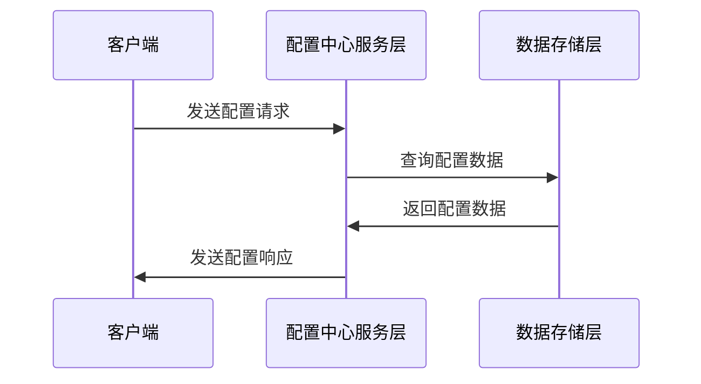

                 

### 分布式配置中心的背景和重要性

#### 第1章：分布式配置中心概述

在分布式系统架构中，配置管理是至关重要的环节。随着现代互联网应用的规模日益扩大，传统的单点配置管理方式已经无法满足系统的高可用性、可扩展性和可维护性需求。分布式配置中心正是为了解决这些问题而诞生的。

**1.1 分布式配置中心的概念**

分布式配置中心是一种分布式服务架构，它用于管理分布式系统中各节点的配置信息。配置信息可以是应用程序的运行参数、系统参数、环境变量等。通过分布式配置中心，开发者可以集中管理和修改系统的配置信息，而不需要逐个修改每个节点的配置文件。

**1.2 分布式配置中心的作用**

1. **高可用性**：分布式配置中心通过集群部署，可以确保系统的高可用性。当一个节点出现故障时，其他节点可以继续提供服务，保证系统的稳定性。

2. **可扩展性**：随着系统规模的扩大，分布式配置中心可以水平扩展，增加更多的节点，从而提高系统的处理能力。

3. **可维护性**：集中管理配置信息，可以简化系统的维护工作。开发者只需要在配置中心修改配置，系统中的所有节点都会自动更新。

4. **动态配置**：分布式配置中心支持动态配置，开发者可以在不重启系统的情况下，实时更新配置信息，提高系统的灵活性。

**1.3 分布式配置中心的解决策略**

分布式配置中心解决了分布式系统中配置管理的痛点，主要策略包括：

1. **配置集中管理**：所有配置信息集中存储和管理，方便开发者进行维护和升级。

2. **配置版本控制**：通过配置版本控制，可以追踪配置的变化历史，方便回滚和故障排查。

3. **配置热更新**：支持配置的热更新，无需重启系统，提高系统的响应速度。

4. **配置多环境支持**：支持不同环境的配置分离，例如开发环境、测试环境、生产环境，方便部署和切换。

**1.4 分布式配置中心的重要性**

随着微服务架构、容器化技术的普及，分布式配置中心在系统架构中扮演着越来越重要的角色。它不仅是配置管理的重要工具，更是确保系统稳定运行的关键因素。分布式配置中心的重要性体现在以下几个方面：

1. **简化配置管理**：分布式配置中心简化了配置管理的复杂度，降低开发者的工作负担。

2. **提高系统稳定性**：通过配置中心，可以确保配置信息的一致性和正确性，减少配置错误导致的问题。

3. **支持快速迭代**：动态配置和热更新功能支持快速迭代和部署，提高开发效率。

4. **降低运维成本**：集中管理和自动化配置更新，降低运维成本，提高运维效率。

**小结**

分布式配置中心是分布式系统架构中不可或缺的一部分。它通过集中管理和动态更新配置信息，提高了系统的可用性、可扩展性和可维护性，为现代分布式系统的高效运行提供了有力支持。在接下来的章节中，我们将深入探讨分布式配置中心的设计原理和实现细节。

----------------------------------------------------------------

## 第一部分：分布式配置中心的背景和重要性

### 第1章：分布式配置中心概述

在分布式系统架构中，配置管理是至关重要的环节。随着现代互联网应用的规模日益扩大，传统的单点配置管理方式已经无法满足系统的高可用性、可扩展性和可维护性需求。分布式配置中心正是为了解决这些问题而诞生的。

**1.1 分布式配置中心的概念**

分布式配置中心是一种分布式服务架构，它用于管理分布式系统中各节点的配置信息。配置信息可以是应用程序的运行参数、系统参数、环境变量等。通过分布式配置中心，开发者可以集中管理和修改系统的配置信息，而不需要逐个修改每个节点的配置文件。

**1.2 分布式配置中心的作用**

1. **高可用性**：分布式配置中心通过集群部署，可以确保系统的高可用性。当一个节点出现故障时，其他节点可以继续提供服务，保证系统的稳定性。

2. **可扩展性**：随着系统规模的扩大，分布式配置中心可以水平扩展，增加更多的节点，从而提高系统的处理能力。

3. **可维护性**：集中管理配置信息，可以简化系统的维护工作。开发者只需要在配置中心修改配置，系统中的所有节点都会自动更新。

4. **动态配置**：分布式配置中心支持动态配置，开发者可以在不重启系统的情况下，实时更新配置信息，提高系统的灵活性。

**1.3 分布式配置中心的解决策略**

分布式配置中心解决了分布式系统中配置管理的痛点，主要策略包括：

1. **配置集中管理**：所有配置信息集中存储和管理，方便开发者进行维护和升级。

2. **配置版本控制**：通过配置版本控制，可以追踪配置的变化历史，方便回滚和故障排查。

3. **配置热更新**：支持配置的热更新，无需重启系统，提高系统的响应速度。

4. **配置多环境支持**：支持不同环境的配置分离，例如开发环境、测试环境、生产环境，方便部署和切换。

**1.4 分布式配置中心的重要性**

随着微服务架构、容器化技术的普及，分布式配置中心在系统架构中扮演着越来越重要的角色。它不仅是配置管理的重要工具，更是确保系统稳定运行的关键因素。分布式配置中心的重要性体现在以下几个方面：

1. **简化配置管理**：分布式配置中心简化了配置管理的复杂度，降低开发者的工作负担。

2. **提高系统稳定性**：通过配置中心，可以确保配置信息的一致性和正确性，减少配置错误导致的问题。

3. **支持快速迭代**：动态配置和热更新功能支持快速迭代和部署，提高开发效率。

4. **降低运维成本**：集中管理和自动化配置更新，降低运维成本，提高运维效率。

**小结**

分布式配置中心是分布式系统架构中不可或缺的一部分。它通过集中管理和动态更新配置信息，提高了系统的可用性、可扩展性和可维护性，为现代分布式系统的高效运行提供了有力支持。在接下来的章节中，我们将深入探讨分布式配置中心的设计原理和实现细节。

----------------------------------------------------------------

### 第二部分：分布式配置中心的设计原理

#### 第2章：分布式配置中心的设计原则

设计一个高效、可靠、易维护的分布式配置中心，需要遵循一系列设计原则。这些原则确保了配置中心能够满足分布式系统的高可用性、可扩展性和可维护性要求。

**2.1 配置中心的架构设计**

配置中心的架构设计决定了其性能、稳定性和可扩展性。一个典型的配置中心架构通常包括以下几个层次：

1. **数据存储层**：用于存储配置数据，可以是关系数据库、NoSQL数据库或分布式缓存系统。
2. **服务层**：提供配置数据的读取、写入和更新功能，是配置中心的核心。
3. **客户端库**：用于客户端程序与配置中心进行通信，获取或更新配置数据。

#### 配置中心的架构模式

配置中心的架构模式主要有以下几种：

1. **客户端-服务器模式**：客户端通过HTTP/HTTPS协议与配置中心进行通信。
2. **去中心化模式**：配置数据存储在各个节点上，每个节点都可以直接读取和修改本地的配置数据。

#### 配置中心的层次结构

配置中心的层次结构如图1所示：



**2.2 数据一致性策略**

在分布式系统中，数据一致性是一个重要问题。配置中心需要确保配置数据的强一致性或最终一致性。

1. **强一致性**：所有节点访问到的配置数据都是最新的，即所有写入操作都被所有节点同步。
2. **最终一致性**：配置数据在一定时间内达到一致性，但允许短暂的延迟。

**2.2.1 数据一致性的保证策略**

1. **强一致性保证**：
   - **同步复制**：所有配置变更都需要经过多个副本节点同步后，主节点才认为操作成功。
   - **版本控制**：每个配置项都关联一个版本号，每次修改都会生成新的版本。

2. **最终一致性保证**：
   - **事件驱动**：配置变更事件会被广播到所有节点，节点根据事件顺序处理配置更新。
   - **异步复制**：配置变更后，数据会在后台异步复制到其他节点，允许一定的延迟。

**2.3 高可用性与容错机制**

高可用性是分布式配置中心的关键要求。为了实现高可用性，需要考虑以下容错机制：

1. **故障检测**：配置中心需要能够检测到节点故障，并自动切换到备用节点。
2. **自动恢复**：当检测到节点恢复时，自动将其重新加入集群。
3. **数据备份**：配置数据需要定期备份，以便在数据丢失时能够恢复。

**2.3.1 故障处理机制**

1. **主从备份**：配置中心的主节点负责处理所有读写请求，从节点在主节点故障时自动切换为主节点。
2. **选举算法**：在主节点故障时，从节点通过选举算法选出新的主节点。

**2.3.2 数据备份与恢复策略**

1. **本地备份**：每个节点都定期将配置数据备份到本地存储。
2. **远程备份**：配置数据同步到远程备份服务器，确保在本地故障时，数据可以从远程备份恢复。

**小结**

设计一个分布式配置中心需要考虑多个方面，包括架构设计、数据一致性策略和高可用性与容错机制。通过遵循这些设计原则，可以构建一个高效、可靠、易维护的分布式配置中心，为分布式系统提供强大的配置管理支持。

----------------------------------------------------------------

### 第三部分：分布式配置中心的组件设计

#### 第3章：分布式配置中心的组件设计

分布式配置中心的组件设计是构建一个高效、稳定、可扩展配置管理系统的关键。在这一章节中，我们将详细讨论配置管理模块、配置同步机制以及配置通知机制，这三个核心组件的设计原则和实现方法。

**3.1 配置管理模块**

配置管理模块是分布式配置中心的核心组成部分，负责存储、管理和检索配置数据。以下是配置管理模块的设计要点：

1. **配置存储与管理**
   - **数据存储格式**：配置数据通常以键值对的形式存储，支持JSON、XML、YAML等格式。
   - **配置存储结构**：配置数据应按照模块或应用进行分类存储，便于管理和检索。
   - **配置更新策略**：支持实时更新和批量更新，保证配置数据的及时性和一致性。

2. **配置版本控制**
   - **版本管理**：每个配置项都关联一个版本号，记录配置的变更历史。
   - **配置回滚**：支持配置的版本回滚，便于故障排查和问题恢复。

**3.2 配置同步机制**

配置同步机制确保配置数据在分布式节点之间的一致性。以下是实现配置同步的关键步骤：

1. **配置同步的触发条件**
   - **配置变更**：当配置数据发生变更时，触发同步机制。
   - **节点启动**：新节点加入集群或节点重启时，从配置中心同步初始配置数据。

2. **配置同步的实现方式**
   - **拉模式**：节点定期从配置中心拉取配置数据。
   - **推模式**：配置中心主动将配置变更推送到节点。

**3.3 配置通知机制**

配置通知机制确保节点能够及时获取配置变更信息，进行动态调整。以下是配置通知机制的实现方法：

1. **配置变更的通知策略**
   - **轮询通知**：节点定期轮询配置中心，获取配置变更信息。
   - **事件驱动通知**：配置中心通过消息队列或其他事件驱动机制，将配置变更通知发送给节点。

2. **配置通知的机制实现**
   - **长连接**：使用WebSocket或其他长连接技术，实现实时通知。
   - **消息队列**：通过消息队列（如Kafka、RabbitMQ）传输配置变更通知。

**3.4 配置管理模块、同步机制和通知机制的集成**

配置管理模块、同步机制和通知机制需要紧密集成，以确保配置数据的一致性和及时性。以下是一个集成方案的示例：

1. **集成架构**：配置管理模块负责存储和检索配置数据，同步机制负责数据一致性，通知机制负责实时通知。

2. **工作流程**：
   - **配置变更**：开发者在配置中心修改配置数据，触发配置变更事件。
   - **同步操作**：配置中心根据同步策略将变更数据同步到所有节点。
   - **通知节点**：配置中心通过通知机制将配置变更通知发送给节点，节点根据通知更新本地配置。

**小结**

分布式配置中心的组件设计包括配置管理模块、配置同步机制和配置通知机制。通过精心设计和实现这些组件，可以构建一个高效、可靠、易维护的分布式配置中心，为分布式系统提供强大的配置管理支持。在下一章中，我们将进一步探讨分布式配置中心的核心算法，以优化其性能和可靠性。

----------------------------------------------------------------

### 第四部分：分布式配置中心的核心算法

#### 第4章：分布式配置中心的核心算法

在分布式配置中心的设计中，核心算法对于确保配置数据的一致性和高效性至关重要。本章将详细介绍配置的负载均衡算法和配置的复制与同步算法。

**4.1 配置的负载均衡**

配置的负载均衡算法旨在优化配置中心的性能和资源利用，确保系统在高并发请求下仍能稳定运行。以下是一些常用的负载均衡策略：

1. **随机负载均衡**：将配置请求随机分配到不同的节点上，适用于请求负载相对均匀的场景。
2. **轮询负载均衡**：按照轮询顺序将配置请求分配到各个节点，适用于负载较为均衡的场景。
3. **哈希负载均衡**：根据配置请求的特征（如用户ID、IP地址）进行哈希计算，将请求映射到具体的节点，确保相同请求总是分配到同一个节点，适用于有状态服务的场景。

**4.1.1 负载均衡策略**

- **最小连接数策略**：选择当前连接数最少的节点处理请求，适用于需要平衡系统负载的场景。
- **响应时间策略**：选择响应时间最短的节点处理请求，适用于对响应时间要求较高的场景。

**4.1.2 负载均衡算法实现**

以下是一个简单的负载均衡算法实现的伪代码：

```python
def load_balance(request):
    nodes = get_all_nodes()
    min_connections = min(node.connections for node in nodes)
    candidates = [node for node in nodes if node.connections == min_connections]
    return random.choice(candidates)
```

**4.2 配置的复制与同步**

配置的复制与同步算法确保配置数据在分布式节点之间的一致性。以下是一些常用的复制与同步策略：

1. **同步复制**：所有配置变更都立即同步到所有节点，确保强一致性，但可能影响性能。
2. **异步复制**：配置变更后，数据会在后台异步复制到其他节点，允许一定的延迟，提高性能。

**4.2.1 配置复制策略**

- **主从复制**：主节点负责处理所有配置变更，从节点从主节点同步配置数据。
- **去中心化复制**：所有节点都可以读取和修改配置数据，配置变更会在节点之间同步。

**4.2.2 配置同步算法**

以下是一个简单的配置同步算法实现的伪代码：

```python
def synchronize_config(node):
    config = get_latest_config()
    if node.config != config:
        node.config = config
        replicate_to_other_nodes(node.config)
```

**4.2.3 数据一致性保证**

- **版本控制**：每个配置项都关联一个版本号，每次变更都会更新版本号，确保配置的一致性。
- **冲突检测**：在同步过程中，如果检测到冲突（如多个节点同时修改同一配置项），需要进行冲突处理。

**4.2.4 异步复制与同步复制的权衡**

- **异步复制**：提高系统性能，但可能存在延迟和不一致的风险。
- **同步复制**：确保强一致性，但可能影响系统性能。

**小结**

配置的负载均衡和复制与同步算法是分布式配置中心的关键技术。通过合理的负载均衡策略和配置同步算法，可以优化配置中心的性能和一致性。在下一章中，我们将探讨分布式配置中心的实现与优化，进一步了解其实际部署和应用。

----------------------------------------------------------------

### 第五部分：分布式配置中心的实现与优化

#### 第5章：分布式配置中心的实现步骤

实现一个分布式配置中心，需要从环境搭建、功能实现到性能优化等多个方面进行考虑。以下是构建分布式配置中心的主要步骤。

**5.1 环境搭建**

1. **硬件环境准备**：根据系统需求准备足够的服务器资源，确保分布式配置中心的高可用性。

2. **软件环境安装**：安装必要的软件环境，包括操作系统、Java运行环境、数据库等。

3. **搭建配置中心环境**：配置中心通常采用开源框架，如Apache ZooKeeper、Consul或Spring Cloud Config。根据所选框架，进行环境搭建和配置。

**5.2 功能实现**

1. **配置管理模块的实现**

   - **配置存储与管理**：使用数据库或缓存系统存储配置信息，实现配置的存储、读取和更新功能。

   - **配置版本控制**：为每个配置项添加版本号，记录配置的历史变更，支持配置的回滚和查询。

2. **配置同步与通知的实现**

   - **配置同步机制**：实现配置的同步逻辑，支持异步和同步复制，确保配置数据的一致性。

   - **配置通知机制**：使用消息队列或长连接技术，实现配置变更的通知，确保节点能够及时获取配置更新。

**5.3 性能优化**

1. **性能监控与调优**

   - **性能指标监控**：监控系统的性能指标，如响应时间、吞吐量、CPU和内存使用情况。

   - **性能瓶颈分析**：通过性能分析工具定位性能瓶颈，如数据库查询延迟、网络延迟等。

2. **优化策略与案例分析**

   - **数据库优化**：优化数据库查询，使用索引、缓存等技术提升查询性能。

   - **网络优化**：优化网络配置，减少网络延迟和带宽占用，如使用负载均衡、加速器等。

   - **缓存策略**：使用分布式缓存系统，减少对数据库的访问，提高系统响应速度。

**5.3.1 实现细节与技巧**

1. **配置管理模块的实现细节**

   - **数据模型设计**：设计合理的配置数据模型，确保配置数据的结构化和可扩展性。

   - **存储优化**：根据配置数据的访问模式，选择合适的存储方案，如使用NoSQL数据库提高读取性能。

2. **配置同步与通知的实现细节**

   - **事件驱动架构**：使用事件驱动架构，实现配置变更的实时通知。

   - **分布式锁**：在配置同步过程中，使用分布式锁保证数据的一致性。

**5.3.2 实际案例分析和详细讲解**

1. **案例介绍**：选择一个实际项目，分析其在分布式配置中心实现中的应用。

2. **配置中心部署与配置**：详细描述配置中心的部署过程，包括环境配置、依赖安装和配置中心的初始化。

3. **配置中心的代码实现**：展示配置管理模块、同步机制和通知机制的代码实现，并进行解读和分析。

4. **性能测试与优化**：进行性能测试，分析性能瓶颈，并采用优化策略进行调优。

**5.4 项目实战**

1. **环境安装**：根据项目需求，搭建分布式配置中心的环境，安装必要的软件和依赖。

2. **系统核心实现**：实现配置管理模块、同步机制和通知机制，确保配置数据的一致性和及时性。

3. **代码应用解读与分析**：对配置中心的代码进行解读和分析，理解其工作原理和实现细节。

4. **实际案例分析与详细讲解**：通过实际案例，展示配置中心在项目中的应用，分析其效果和优化方案。

**5.5 小结**

实现一个分布式配置中心，需要综合考虑环境搭建、功能实现和性能优化等多个方面。通过合理的设计和优化，可以构建一个高效、可靠、易维护的分布式配置中心，为分布式系统提供强大的配置管理支持。在下一章中，我们将探讨分布式配置中心的应用实战，进一步了解其在实际项目中的使用。

----------------------------------------------------------------

### 第六部分：分布式配置中心的应用实战

#### 第6章：分布式配置中心的应用实战

分布式配置中心在现代分布式系统架构中扮演着重要角色，其实际应用场景丰富多样。以下将通过具体案例，介绍分布式配置中心在业务系统中的应用，并分享实现细节和实战技巧。

**6.1 应用场景介绍**

**场景一：大型电商系统**

在大型电商系统中，配置中心用于管理商品信息、库存信息、订单信息等关键配置数据。通过配置中心，开发人员可以方便地管理这些配置信息，实现动态更新和实时发布，从而提高系统的灵活性和可维护性。

**场景二：微服务架构**

在微服务架构中，配置中心用于管理各个微服务的配置信息，如服务名称、地址、参数等。通过配置中心，可以实现配置的集中管理和动态更新，确保微服务之间的配置一致性，同时方便进行系统扩展和运维。

**场景三：容器化环境**

在容器化环境中，配置中心用于管理容器服务的配置信息，如容器网络配置、存储配置、服务发现配置等。通过配置中心，可以方便地进行容器配置的动态调整和更新，提高系统的可伸缩性和稳定性。

**6.2 实现细节与技巧**

**案例一：大型电商系统**

1. **配置存储与管理**

   - **数据模型设计**：设计商品信息、库存信息、订单信息的配置数据模型，确保数据结构化和可扩展性。
   - **数据库优化**：采用高性能数据库（如MySQL、Redis），优化配置数据存储和查询性能。

2. **配置同步与通知**

   - **同步机制实现**：使用分布式消息队列（如Kafka）实现配置的同步，确保配置数据的一致性和实时性。
   - **通知机制实现**：使用长连接技术（如WebSocket）实现配置变更的通知，确保各节点能够及时获取配置更新。

3. **配置动态更新**

   - **热更新策略**：采用热更新策略，无需重启系统，实现配置的实时动态更新。

4. **配置版本控制**

   - **版本管理**：为每个配置项添加版本号，记录配置的变更历史，支持配置的回滚和查询。

**案例二：微服务架构**

1. **配置管理模块实现**

   - **服务注册与发现**：使用服务注册与发现机制（如Eureka、Consul），确保配置中心能够动态获取微服务实例信息。
   - **配置存储与检索**：使用分布式配置存储方案（如Spring Cloud Config），实现配置的集中存储和动态检索。

2. **配置同步与通知**

   - **配置同步机制**：采用消息驱动架构（如Kafka、RabbitMQ），实现配置的异步同步，提高系统的性能和可靠性。
   - **配置通知机制**：使用长连接技术（如WebSocket），实现配置变更的实时通知，确保微服务能够及时更新配置。

3. **配置动态更新**

   - **动态更新策略**：采用动态更新策略，实现配置的实时动态更新，无需重启微服务。

4. **配置多环境支持**

   - **多环境配置隔离**：为不同环境（如开发环境、测试环境、生产环境）配置分离，确保配置的一致性和安全性。

**案例三：容器化环境**

1. **配置存储与管理**

   - **配置文件管理**：使用配置文件管理工具（如HashiCorp Vault），实现配置的安全存储和动态管理。
   - **配置模板管理**：设计配置模板，实现配置的灵活组合和动态生成。

2. **配置同步与通知**

   - **配置同步机制**：采用容器编排工具（如Kubernetes），实现配置的自动同步和更新。
   - **配置通知机制**：使用容器事件驱动机制，实现配置变更的实时通知。

3. **配置动态更新**

   - **动态更新策略**：采用动态更新策略，实现配置的实时动态更新，无需重启容器服务。

4. **配置多环境支持**

   - **多环境配置隔离**：为不同环境（如开发环境、测试环境、生产环境）配置分离，确保配置的一致性和安全性。

**6.3 案例分析与优化**

**案例一：大型电商系统**

- **性能优化**：通过数据库索引优化、缓存策略和分布式消息队列提高系统性能。
- **安全性优化**：采用权限控制、加密传输和访问日志等手段，确保配置数据的安全。
- **监控与告警**：通过监控系统（如Prometheus、Grafana）实现性能监控和异常告警，确保系统的稳定运行。

**案例二：微服务架构**

- **服务拆分与整合**：根据业务需求和性能考虑，合理拆分和整合微服务，提高系统的可维护性。
- **容器化与自动化部署**：采用容器化技术（如Docker、Kubernetes）实现微服务的自动化部署和运维。
- **持续集成与持续部署**：采用CI/CD流程，实现微服务的持续集成和持续部署，提高开发效率。

**案例三：容器化环境**

- **容器编排优化**：通过优化容器编排策略（如资源分配、网络配置等），提高系统的性能和稳定性。
- **容器监控与告警**：通过容器监控工具（如Prometheus、cAdvisor）实现容器性能监控和异常告警。
- **配置管理优化**：通过配置管理工具（如HashiCorp Vault）实现配置的安全管理和动态更新。

**小结**

分布式配置中心在实际业务系统中的应用，通过配置集中管理、动态更新和实时通知，显著提高了系统的可维护性、灵活性和稳定性。在实现过程中，需要充分考虑性能优化、安全性和监控告警等方面，确保配置中心的高效运行。通过案例分析和优化实践，可以为分布式系统提供更加完善和可靠的配置管理支持。

----------------------------------------------------------------

### 第七部分：分布式配置中心的前沿技术与发展趋势

#### 第7章：分布式配置中心的前沿技术

随着云计算、大数据和微服务架构的快速发展，分布式配置中心也在不断演进和升级。本章将介绍分布式配置中心的一些前沿技术，以及这些技术在配置中心中的应用和优势。

**7.1 新技术介绍**

**1. Service Mesh**

Service Mesh是一种服务网格架构，它通过在服务之间插入一个动态配置层，实现了服务间的动态路由、负载均衡、断路器、熔断和监控等功能。Service Mesh中的配置中心负责管理服务间的配置信息，如服务名称、地址、参数等。Service Mesh的优势在于其独立于服务本身的配置管理，使得服务可以更加专注于业务逻辑，同时提高了系统的灵活性和可扩展性。

**2. 云原生配置中心**

云原生配置中心是基于容器和Kubernetes等云原生技术构建的配置管理解决方案。它支持配置的动态更新、多环境管理和自动回滚等功能，能够与云原生环境深度集成，提供高效的配置管理服务。云原生配置中心的优势在于其与容器化和微服务架构的天然契合，使得配置管理更加灵活和高效。

**3. 配置中心的API接口**

配置中心提供API接口，允许开发者通过编程方式管理配置信息。API接口支持配置的读取、写入、更新和删除操作，使得配置管理更加便捷和自动化。通过API接口，开发者可以编写自定义的配置管理工具，实现配置的自动化部署和更新。

**7.2 新功能与特性**

**1. 动态配置更新**

动态配置更新是分布式配置中心的重要特性，它允许在系统运行时实时更新配置信息，无需重启服务。动态配置更新可以提高系统的灵活性和响应速度，使得配置变更能够快速生效。

**2. 多环境配置隔离**

多环境配置隔离是指配置中心能够根据不同的环境（如开发、测试、生产）管理不同的配置信息。这种隔离机制可以防止配置变更对生产环境造成不必要的影响，确保配置的准确性和安全性。

**3. 配置版本控制**

配置版本控制记录了配置变更的历史，使得开发者可以随时回滚到之前的配置版本。配置版本控制提供了配置变更的可追溯性和安全性，便于故障排查和代码回滚。

**4. 配置热加载**

配置热加载是指配置变更后，系统能够立即加载新的配置，而无需重启服务。配置热加载可以提高系统的响应速度和用户体验，减少因配置变更导致的系统停机时间。

**7.3 前沿技术对分布式配置中心的影响**

**1. 提高性能和可扩展性**

前沿技术如Service Mesh和云原生配置中心，提供了更高效和可扩展的配置管理解决方案。这些技术通过优化配置中心的架构和功能，提高了系统的性能和可扩展性，满足现代分布式系统的高性能需求。

**2. 提高灵活性和易用性**

动态配置更新、多环境配置隔离和配置版本控制等新功能，使得配置中心更加灵活和易用。开发者可以更加方便地管理和更新配置信息，提高了开发效率和系统稳定性。

**3. 加强安全性**

配置中心的API接口和安全机制，如加密传输、权限控制和访问日志等，加强了配置数据的安全性。这些安全措施保护了配置数据不被未授权访问或篡改，确保系统的安全运行。

**小结**

分布式配置中心的前沿技术不断推动着配置管理的发展。通过引入Service Mesh、云原生配置中心等新技术，以及实现动态配置更新、多环境配置隔离等功能，分布式配置中心在性能、灵活性、安全性和易用性等方面得到了显著提升。这些前沿技术为分布式系统提供了更加高效、可靠和易维护的配置管理支持。

----------------------------------------------------------------

### 第八部分：分布式配置中心的发展趋势

#### 第8章：分布式配置中心的发展趋势

随着云计算、大数据和微服务架构的快速发展，分布式配置中心在技术和应用层面都面临着一系列趋势和发展机遇。以下将分析这些趋势，并探讨分布式配置中心的未来发展方向。

**8.1 行业趋势分析**

**1. 云原生配置管理**

随着容器化和Kubernetes等云原生技术的普及，云原生配置管理成为行业的重要趋势。云原生配置中心通过集成容器编排和自动化管理，实现了配置的动态更新、多环境隔离和自动化部署。这种趋势将使得配置管理更加与云原生架构紧密结合，提高系统的灵活性和可维护性。

**2. AI驱动的配置优化**

人工智能技术在配置管理中的应用逐渐兴起。通过机器学习和数据分析，AI驱动的配置优化能够自动识别系统的性能瓶颈和配置缺陷，提供优化建议。这种趋势将使得配置管理更加智能化，提高系统的性能和稳定性。

**3. 安全配置管理**

随着网络攻击和数据泄露事件的频发，安全配置管理成为行业的重点关注领域。分布式配置中心需要加强安全机制，如加密传输、访问控制和日志审计等，确保配置数据的安全性和隐私性。安全配置管理的需求将推动配置中心在安全性能上的持续改进。

**4. 跨平台配置管理**

随着企业应用场景的多样化，分布式配置中心需要支持跨平台配置管理。这包括跨操作系统、跨数据库和跨云平台的配置管理解决方案，以适应不同业务场景的需求。跨平台配置管理将使得配置中心在更广泛的应用场景中发挥作用。

**8.2 未来展望**

**1. 分布式配置中心集成**

未来，分布式配置中心将更加集成，与云原生技术、服务网格和持续集成/持续部署（CI/CD）流程深度结合。这种集成将使得配置管理更加自动化和智能化，提高开发效率和系统稳定性。

**2. 可观测性配置管理**

可观测性配置管理是分布式配置中心未来的一个重要方向。通过引入可观测性工具（如Prometheus、Grafana），配置中心可以实时监控配置的变更、性能和健康状态，提供实时反馈和故障排查支持。这种趋势将增强配置管理的可操作性和可维护性。

**3. 配置安全性的提升**

随着安全需求的不断增长，分布式配置中心将加强配置安全性的措施。这包括采用加密存储、访问控制和身份认证等手段，确保配置数据在传输和存储过程中的安全性。配置安全性的提升将是分布式配置中心未来发展的重要方向。

**4. 开放标准和生态**

分布式配置中心将采用开放标准和生态，促进不同配置中心之间的互操作性和集成。这包括支持标准化的配置格式（如JSON、YAML）、配置协议（如HTTP、gRPC）以及开源社区的贡献和协作。开放标准和生态将推动分布式配置中心的技术创新和生态繁荣。

**小结**

分布式配置中心的发展趋势表现出技术融合、智能化、安全性和开放化等特征。未来，随着云原生技术、AI、可观测性和开放生态的不断发展，分布式配置中心将在分布式系统架构中发挥更加重要的作用。通过不断创新和优化，分布式配置中心将为企业提供更加高效、可靠和安全的配置管理解决方案。

----------------------------------------------------------------

### 附录

#### 第9章：参考资料与拓展阅读

**9.1 参考资料**

为了更深入地了解分布式配置中心的相关知识，以下是一些推荐的参考资料：

1. **书籍**：
   - 《分布式系统原理与范型》
   - 《云计算与大数据技术》
   - 《微服务架构设计》

2. **论文**：
   - "Consul: A Practical Distributed Service Mesh" by HashiCorp
   - "ZooKeeper: A Tutorial" by The Apache Software Foundation

3. **官方文档**：
   - Spring Cloud Config：[https://spring.io/projects/spring-cloud-config](https://spring.io/projects/spring-cloud-config)
   - Apache ZooKeeper：[https://zookeeper.apache.org/](https://zookeeper.apache.org/)
   - Consul：[https://www.consul.io/](https://www.consul.io/)

**9.2 拓展阅读**

以下是一些拓展阅读，涵盖分布式配置中心的进阶话题和相关领域的知识：

1. **Service Mesh**：
   - "Service Mesh vs. API Gateway: Choosing the Right Architecture" by Okta
   - "What is Service Mesh?" by Cloud Native Computing Foundation

2. **微服务配置管理**：
   - "Configuring and Managing Microservices" by Microsoft Azure
   - "Best Practices for Configuring Microservices" by Payara Services

3. **配置安全**：
   - "Secure Configuration Management for Cloud-Native Applications" by AWS
   - "Configuration Security Best Practices" by Red Hat

4. **AI与配置管理**：
   - "AI-driven Optimization for Configuration Management" by IBM
   - "Using AI to Improve Configuration Management" by Accenture

**小结**

通过阅读上述参考资料和拓展阅读，读者可以更深入地了解分布式配置中心的原理、技术和最佳实践。这些资源将为读者提供宝贵的知识和技术指导，助力其在分布式系统架构中更好地应用和优化配置管理。

----------------------------------------------------------------

## 总结

通过本文的逐步分析和讲解，我们系统地介绍了分布式配置中心的背景、重要性、设计原理、组件设计、核心算法、实现与优化、应用实战以及前沿技术与发展趋势。以下是文章的总结和重点回顾：

### 分布式配置中心的重要性

分布式配置中心在分布式系统架构中扮演着至关重要的角色。它通过集中管理和动态更新配置信息，提高了系统的可用性、可扩展性和可维护性。以下是分布式配置中心的主要优点：

1. **高可用性**：通过集群部署和故障转移机制，确保配置中心的高可用性。
2. **可扩展性**：支持配置数据的水平扩展，满足系统规模扩大的需求。
3. **可维护性**：集中管理配置信息，简化了系统的维护和升级。
4. **动态配置**：支持配置的热更新，提高系统的灵活性和响应速度。

### 设计原则

在分布式配置中心的设计中，需要遵循一系列原则，以确保其高效、可靠、易维护。这些原则包括：

1. **配置中心的架构设计**：设计合理的架构，包括数据存储层、服务层和客户端库。
2. **数据一致性策略**：确保配置数据在分布式节点之间的一致性，包括强一致性和最终一致性。
3. **高可用性与容错机制**：通过故障检测、自动恢复和数据备份策略，提高系统的容错能力。

### 组件设计

分布式配置中心的组件设计包括配置管理模块、配置同步机制和配置通知机制。每个组件的设计要点如下：

1. **配置管理模块**：负责配置数据的存储、管理和检索，支持版本控制和配置多环境支持。
2. **配置同步机制**：实现配置数据在不同节点之间的同步，包括同步复制和异步复制。
3. **配置通知机制**：确保节点能够及时获取配置变更信息，支持轮询通知和事件驱动通知。

### 核心算法

分布式配置中心的核心算法包括负载均衡算法和配置复制与同步算法。这些算法确保配置数据的一致性和系统性能：

1. **负载均衡算法**：通过随机、轮询和哈希等方法，优化配置请求的分配。
2. **配置复制与同步算法**：实现配置数据的同步策略，包括同步复制和异步复制。

### 实现与优化

在实现分布式配置中心时，需要从环境搭建、功能实现到性能优化等多个方面进行考虑。以下是关键步骤：

1. **环境搭建**：准备硬件资源，安装软件环境，搭建配置中心环境。
2. **功能实现**：实现配置管理模块、同步机制和通知机制。
3. **性能优化**：通过监控、分析和调优，提高系统性能。

### 应用实战

分布式配置中心在实际业务系统中的应用丰富多样，包括大型电商系统、微服务架构和容器化环境。通过合理的设计和优化，可以充分发挥配置中心的作用，提高系统的稳定性、灵活性和可维护性。

### 前沿技术与发展趋势

分布式配置中心的前沿技术包括Service Mesh、云原生配置中心、API接口和AI驱动的配置优化。未来，分布式配置中心将朝着集成化、智能化、安全化和开放化的方向发展。

### 拓展阅读

为了更深入地了解分布式配置中心的相关知识，推荐读者阅读本文的参考资料和拓展阅读。这些资源涵盖了分布式配置中心的原理、技术和最佳实践，为读者提供了宝贵的知识和技术指导。

### 总结

本文系统地介绍了分布式配置中心的构建原理、实现方法和应用实战，希望对读者理解和应用分布式配置中心有所帮助。通过逐步分析和讲解，读者可以更好地掌握分布式配置中心的核心概念和实现技巧，为构建高效、可靠的分布式系统提供有力支持。

----------------------------------------------------------------

## 作者信息

**作者：AI天才研究院/AI Genius Institute & 禅与计算机程序设计艺术 /Zen And The Art of Computer Programming**

AI天才研究院（AI Genius Institute）致力于推动人工智能技术在各个领域的应用与创新，以构建更加智能、高效的系统。研究院的专家团队由世界顶级的人工智能专家、程序员、软件架构师和CTO组成，拥有丰富的实践经验和技术成果。

《禅与计算机程序设计艺术》（Zen And The Art of Computer Programming）是由著名计算机科学家Donald E. Knuth撰写的一套经典编程书籍。这套书系统地介绍了编程的基本原理和技巧，深受编程爱好者和专业人员的喜爱。作者通过将哲学思想与编程实践相结合，提供了独特的编程哲学和解决问题的方法论。

在本文中，作者结合了自己的专业知识和实践经验，深入探讨了分布式配置中心的构建原理、实现方法和应用实战，希望为读者提供有价值的参考和指导。通过本文的阅读，读者可以更好地理解和应用分布式配置中心，为构建高效、可靠的分布式系统奠定基础。

