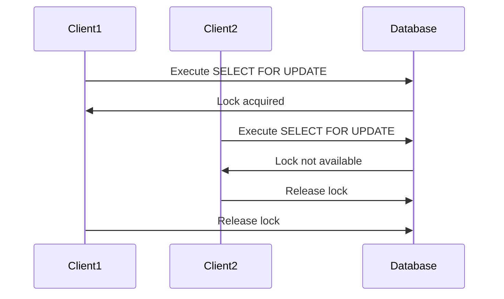
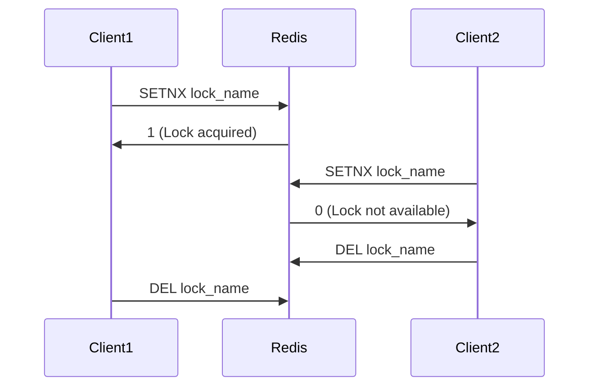
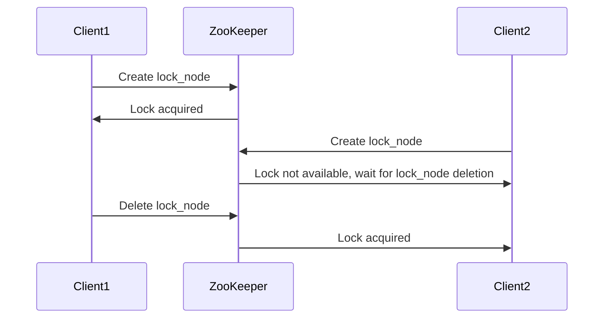
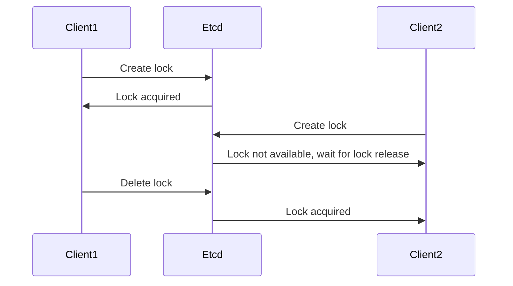

                 

### 关键词：分布式锁、数据库、Redis、ZooKeeper、Etcd

> 摘要：本文深入探讨了分布式锁的实现与优化，通过介绍分布式锁的基础理论、实现方法以及优化策略，详细解析了基于数据库、Redis、ZooKeeper和Etcd的分布式锁实现。通过实际案例分析和最佳实践分享，本文旨在为开发者在分布式系统设计中提供有力指导。

----------------------------------------------------------------

# 第一部分：分布式锁基础理论

## 第1章：分布式锁概述

### 1.1 分布式锁的定义与重要性

**什么是分布式锁**：分布式锁是一种用于控制分布式系统中同步访问共享资源的机制。它可以保证在多个节点（或进程）之间，对于某个特定的资源，同一时间只有一个节点能够访问，从而避免并发冲突和数据不一致的问题。

**分布式锁的重要性**：在分布式系统中，由于各个节点之间的独立性，可能会导致并发访问同一资源时出现数据竞争和一致性问题。分布式锁通过锁定特定资源，确保在同一时间只有一个操作能够执行，从而保证了系统的高可用性和一致性。

**分布式锁的应用场景**：
1. **分布式数据库操作**：在分布式数据库系统中，分布式锁可以保证对同一数据的并发操作不会导致数据不一致。
2. **分布式缓存操作**：分布式缓存系统中的数据更新操作需要分布式锁来保证数据一致性。
3. **分布式消息队列**：在分布式消息队列系统中，分布式锁可以保证消息的处理顺序和准确性。
4. **分布式任务调度**：分布式锁可以保证在执行分布式任务时，任务的执行顺序和资源分配的合理性。

### 1.2 分布式系统中的锁问题

**分布式锁面临的挑战**：
1. **网络延迟和分区**：由于分布式系统的特点，节点之间的网络延迟和分区可能导致分布式锁的失效。
2. **数据一致性**：分布式锁需要保证在多个节点之间的一致性，防止数据竞争和数据不一致问题。
3. **锁定超时**：分布式锁需要在指定时间内释放，否则可能会导致死锁问题。

**分布式锁的种类**：
1. **基于数据库的分布式锁**：通过在数据库中创建锁表或使用数据库事务实现。
2. **基于缓存系统的分布式锁**：通过缓存系统（如Redis）实现分布式锁。
3. **基于ZooKeeper的分布式锁**：通过ZooKeeper的临时节点和监听机制实现分布式锁。
4. **基于Etcd的分布式锁**：通过Etcd的版本控制和lease机制实现分布式锁。

**分布式锁的解决思路**：
1. **分布式锁协议**：通过定义分布式锁的协议，确保分布式锁的一致性和可用性。
2. **锁代理**：通过锁代理来实现分布式锁的透明化，减少开发者的负担。
3. **锁补偿机制**：通过重试机制和死锁检测机制来补偿分布式锁的失效。

### 1.3 分布式锁的核心概念

**分布式锁的关键特性**：
1. **互斥性**：同一时间只能有一个节点持有锁。
2. **锁定范围**：锁的锁定范围可以是全局的，也可以是局部的。
3. **锁定时间**：锁的持有时间可以是短期的，也可以是长期的。
4. **死锁检测与预防**：分布式锁需要具备死锁检测和预防机制。

**分布式锁的常用协议**：
1. **Paxos协议**：用于实现分布式锁的一致性。
2. **ZAB协议**：用于实现ZooKeeper的一致性。
3. **Raft协议**：用于实现分布式锁的一致性。

**分布式锁的优缺点分析**：
- **基于数据库的分布式锁**：优点是简单易用，缺点是性能可能较低，且对数据库的依赖较大。
- **基于Redis的分布式锁**：优点是性能较高，支持过期时间，缺点是依赖Redis服务。
- **基于ZooKeeper的分布式锁**：优点是支持高可用性和一致性，缺点是实现较为复杂。
- **基于Etcd的分布式锁**：优点是性能较高，支持 lease 机制，缺点是实现较为复杂。

### 1.4 分布式锁的数学模型与公式

**数学模型概述**：分布式锁的数学模型主要包括锁的状态转换、锁的持有时间和锁的释放时间等。

**公式推导与说明**：
- **锁的状态转换公式**：$$ state_{before} = \{ unlocked \} \quad state_{after} = \{ locked \} $$
- **锁的持有时间公式**：$$ lock_{hold\_time} = time_{locked} - time_{unlocked} $$
- **锁的释放时间公式**：$$ lock_{release\_time} = time_{locked} + lock_{hold\_time} $$

### 1.5 本章小结

本章介绍了分布式锁的基础理论，包括分布式锁的定义与重要性、分布式系统中的锁问题、分布式锁的核心概念以及分布式锁的数学模型与公式。通过本章的学习，读者可以了解分布式锁的基本概念和实现方法，为后续章节的深入学习打下基础。

----------------------------------------------------------------

## 第2章：基于数据库的分布式锁实现

### 2.1 数据库分布式锁原理

**数据库分布式锁的优点**：
1. **简单易用**：基于数据库的分布式锁实现简单，易于理解和实现。
2. **一致性高**：数据库本身具备事务和一致性保证，可以保证分布式锁的一致性。
3. **支持多种数据库**：大多数关系型数据库都支持分布式锁的实现。

**数据库分布式锁的缺点**：
1. **性能影响**：数据库分布式锁可能会导致数据库性能下降，特别是当锁的使用频繁时。
2. **依赖数据库**：分布式锁的实现依赖于数据库，当数据库故障时，可能会影响分布式锁的功能。

**数据库分布式锁的实现方法**：
1. **表记录法**：通过创建一张锁表，记录锁的状态。
2. **行锁法**：通过在数据库中执行行级锁操作，实现分布式锁。
3. **事务法**：通过数据库事务来保证分布式锁的一致性和隔离性。

### 2.2 数据库分布式锁的算法原理

**算法流程图**：


**算法原理详细说明**：
1. **Client1请求锁**：Client1向数据库发送SELECT FOR UPDATE语句，尝试获取锁。
2. **数据库响应锁**：数据库如果当前没有其他Client持有锁，则将锁分配给Client1，并返回锁已获取的消息。
3. **Client2请求锁**：Client2向数据库发送SELECT FOR UPDATE语句，由于当前锁已被Client1持有，数据库返回锁不可用的消息。
4. **Client2释放锁**：Client2在完成操作后释放锁。
5. **Client1释放锁**：Client1在完成操作后释放锁。

### 2.3 数据库分布式锁的Python代码实现

**Python代码实例**：
```python
import pymysql

def get_db_connection():
    return pymysql.connect(
        host='localhost',
        user='root',
        password='password',
        database='test',
        cursorclass=pymysql.cursors.DictCursor
    )

def acquire_lock(lock_name):
    connection = get_db_connection()
    with connection.cursor() as cursor:
        query = "SELECT * FROM locks WHERE name = %s FOR UPDATE"
        cursor.execute(query, (lock_name,))
        result = cursor.fetchone()
        if result:
            return True
        else:
            connection.commit()
            return False

def release_lock(lock_name):
    connection = get_db_connection()
    with connection.cursor() as cursor:
        query = "DELETE FROM locks WHERE name = %s"
        cursor.execute(query, (lock_name,))
        connection.commit()

lock_name = "my_lock"
if acquire_lock(lock_name):
    print("Lock acquired")
    # 执行操作
    release_lock(lock_name)
    print("Lock released")
else:
    print("Lock not available")
```

**代码解读与分析**：
1. **get_db_connection()函数**：创建数据库连接。
2. **acquire_lock(lock_name)函数**：尝试获取锁，如果锁已被持有，则返回True；否则返回False。
3. **release_lock(lock_name)函数**：释放锁。
4. **lock_name变量**：锁的名称。

### 2.4 实际案例分析与优化建议

**案例一：电商平台订单处理**：
电商平台在处理订单时，需要保证订单的并发处理不会导致数据不一致。通过数据库分布式锁，可以确保在处理同一订单时，同一时间只有一个节点能够执行订单处理操作。

**案例二：分布式系统负载均衡**：
在分布式系统中，负载均衡器需要根据节点的负载情况分配请求。通过数据库分布式锁，可以确保负载均衡器在分配请求时，不会出现重复分配或负载不均的情况。

**优化策略与最佳实践**：
1. **锁的命名规范**：使用具有业务标识的锁名称，便于管理和追踪。
2. **锁的超时设置**：设置合理的锁超时时间，避免锁长时间占用导致死锁。
3. **数据库选择**：选择性能较好的数据库，减少锁的实现性能影响。

### 2.5 本章小结

本章介绍了基于数据库的分布式锁实现方法，包括原理、算法和Python代码实现。通过实际案例分析和优化建议，读者可以更好地理解和应用数据库分布式锁。

----------------------------------------------------------------

## 第3章：基于Redis的分布式锁实现

### 3.1 Redis分布式锁原理

**Redis分布式锁的特点**：
1. **高性能**：Redis作为分布式缓存系统，具备高吞吐量和低延迟的特点，适合实现分布式锁。
2. **支持过期时间**：Redis支持设置锁的过期时间，可以防止死锁问题。
3. **无锁竞争**：Redis分布式锁通过SETNX命令实现，避免了锁的竞争。

**Redis分布式锁的使用方法**：
1. **锁的获取**：使用SETNX命令设置锁，如果成功返回1，表示锁已被获取；否则返回0。
2. **锁的释放**：使用DEL命令释放锁。

**Redis分布式锁的注意事项**：
1. **锁的命名**：使用具有业务标识的锁名称，便于管理和追踪。
2. **锁的过期时间**：设置合理的锁过期时间，防止死锁问题。
3. **网络故障**：在网络故障或Redis服务不稳定的情况下，可能导致分布式锁失效。

### 3.2 Redis分布式锁的算法原理

**算法流程图**：


**算法原理详细说明**：
1. **Client1请求锁**：Client1向Redis发送SETNX命令，尝试获取锁。
2. **Redis响应锁**：如果Redis中不存在锁，则设置锁并返回1；否则返回0。
3. **Client2请求锁**：Client2向Redis发送SETNX命令，由于锁已被Client1获取，Redis返回0。
4. **Client2释放锁**：Client2释放锁，使用DEL命令删除锁。
5. **Client1释放锁**：Client1释放锁，使用DEL命令删除锁。

### 3.3 Redis分布式锁的Python代码实现

**Python代码实例**：
```python
import redis
import time

redis_client = redis.StrictRedis(host='localhost', port=6379, db=0)

def acquire_lock(lock_name, lock_timeout):
    while True:
        result = redis_client.set(lock_name, "locked", nx=True, ex=lock_timeout)
        if result:
            return True
        time.sleep(0.1)

def release_lock(lock_name):
    redis_client.delete(lock_name)

lock_name = "my_lock"
lock_timeout = 10

if acquire_lock(lock_name, lock_timeout):
    print("Lock acquired")
    # 执行操作
    release_lock(lock_name)
    print("Lock released")
else:
    print("Lock not available")
```

**代码解读与分析**：
1. **redis_client**：创建Redis客户端。
2. **acquire_lock(lock_name, lock_timeout)函数**：尝试获取锁，如果成功返回True；否则返回False。
3. **release_lock(lock_name)函数**：释放锁。

### 3.4 实际案例分析与优化建议

**案例一：社交网络状态更新**：
在社交网络中，用户状态更新需要保证并发操作的一致性。通过Redis分布式锁，可以确保在更新状态时，同一时间只有一个用户能够执行操作，防止数据不一致。

**案例二：分布式任务调度**：
在分布式任务调度系统中，调度器需要根据任务执行情况分配任务。通过Redis分布式锁，可以确保在分配任务时，不会出现重复分配或任务执行冲突。

**优化策略与最佳实践**：
1. **锁的命名规范**：使用具有业务标识的锁名称，便于管理和追踪。
2. **锁的超时设置**：设置合理的锁过期时间，避免死锁问题。
3. **Redis集群部署**：采用Redis集群部署，提高系统的可用性和性能。

### 3.5 本章小结

本章介绍了基于Redis的分布式锁实现方法，包括原理、算法和Python代码实现。通过实际案例分析和优化建议，读者可以更好地理解和应用Redis分布式锁。

----------------------------------------------------------------

## 第4章：基于ZooKeeper的分布式锁实现

### 4.1 ZooKeeper分布式锁原理

**ZooKeeper分布式锁的优势**：
1. **高可用性**：ZooKeeper通过选举机制和集群部署，确保在节点故障时能够自动切换，保证分布式锁的高可用性。
2. **一致性**：ZooKeeper基于ZAB协议，确保分布式锁的一致性和稳定性。
3. **实时性**：ZooKeeper支持实时监听机制，可以及时获取锁状态变化。

**ZooKeeper分布式锁的使用方法**：
1. **创建锁节点**：在ZooKeeper中创建一个锁节点，用于表示锁的存在。
2. **监听节点**：监听锁节点的创建和删除事件，获取锁状态变化。
3. **获取锁**：当锁节点不存在时，创建锁节点并获取锁；当锁节点存在时，等待锁节点被删除。

**ZooKeeper分布式锁的注意事项**：
1. **锁节点命名**：使用具有业务标识的锁节点名称，便于管理和追踪。
2. **锁超时设置**：设置合理的锁超时时间，防止死锁问题。
3. **网络故障**：在网络故障或ZooKeeper服务不稳定的情况下，可能导致分布式锁失效。

### 4.2 ZooKeeper分布式锁的算法原理

**算法流程图**：


**算法原理详细说明**：
1. **Client1请求锁**：Client1向ZooKeeper发送创建锁节点的请求。
2. **ZooKeeper响应锁**：由于锁节点不存在，ZooKeeper创建锁节点并返回锁已获取的消息。
3. **Client2请求锁**：Client2向ZooKeeper发送创建锁节点的请求，由于锁节点已被Client1创建，ZooKeeper返回锁不可用的消息，并让Client2等待锁节点的删除。
4. **Client1释放锁**：Client1删除锁节点。
5. **ZooKeeper通知Client2**：ZooKeeper删除锁节点，并通知Client2锁已被释放。

### 4.3 ZooKeeper分布式锁的Python代码实现

**Python代码实例**：
```python
from kazoo.client import KazooClient

zk = KazooClient(hosts='localhost:2181')
zk.start()

def acquire_lock(lock_path):
    while True:
        try:
            zk.create(lock_path, ephemeral=True)
            return True
        except:
            time.sleep(0.1)

def release_lock(lock_path):
    zk.delete(lock_path, recursive=True)

lock_path = "/my_lock"
if acquire_lock(lock_path):
    print("Lock acquired")
    # 执行操作
    release_lock(lock_path)
    print("Lock released")
else:
    print("Lock not available")
zk.stop()
```

**代码解读与分析**：
1. **zk**：创建ZooKeeper客户端。
2. **acquire_lock(lock_path)函数**：尝试获取锁，如果成功返回True；否则返回False。
3. **release_lock(lock_path)函数**：释放锁。

### 4.4 实际案例分析与优化建议

**案例一：分布式存储系统**：
在分布式存储系统中，数据读写需要保证一致性。通过ZooKeeper分布式锁，可以确保在访问同一数据时，同一时间只有一个节点能够执行读写操作。

**案例二：分布式消息队列**：
在分布式消息队列系统中，消息的存储和消费需要保证一致性。通过ZooKeeper分布式锁，可以确保在处理消息时，不会出现重复消费或消息丢失。

**优化策略与最佳实践**：
1. **锁的命名规范**：使用具有业务标识的锁节点名称，便于管理和追踪。
2. **锁超时设置**：设置合理的锁超时时间，避免死锁问题。
3. **ZooKeeper集群部署**：采用ZooKeeper集群部署，提高系统的可用性和性能。

### 4.5 本章小结

本章介绍了基于ZooKeeper的分布式锁实现方法，包括原理、算法和Python代码实现。通过实际案例分析和优化建议，读者可以更好地理解和应用ZooKeeper分布式锁。

----------------------------------------------------------------

## 第5章：基于Etcd的分布式锁实现

### 5.1 Etcd分布式锁原理

**Etcd分布式锁的特点**：
1. **高性能**：Etcd作为分布式键值存储，具备高吞吐量和低延迟的特点，适合实现分布式锁。
2. **一致性**：Etcd基于Raft协议，确保分布式锁的一致性和稳定性。
3. **支持 lease 机制**：Etcd支持 lease 机制，可以防止死锁问题。

**Etcd分布式锁的使用方法**：
1. **创建锁**：使用ETCDCTL命令创建锁。
2. **获取锁**：使用ETCDCTL命令获取锁。
3. **释放锁**：使用ETCDCTL命令释放锁。

**Etcd分布式锁的注意事项**：
1. **锁的命名**：使用具有业务标识的锁名称，便于管理和追踪。
2. **锁超时设置**：设置合理的锁超时时间，避免死锁问题。
3. **网络故障**：在网络故障或Etcd服务不稳定的情况下，可能导致分布式锁失效。

### 5.2 Etcd分布式锁的算法原理

**算法流程图**：


**算法原理详细说明**：
1. **Client1请求锁**：Client1使用ETCDCTL命令创建锁。
2. **Etcd响应锁**：由于锁不存在，Etcd创建锁并返回锁已获取的消息。
3. **Client2请求锁**：Client2使用ETCDCTL命令创建锁，由于锁已被Client1创建，Etcd返回锁不可用的消息，并让Client2等待锁的释放。
4. **Client1释放锁**：Client1使用ETCDCTL命令删除锁。
5. **Etcd通知Client2**：Etcd删除锁，并通知Client2锁已被释放。

### 5.3 Etcd分布式锁的Python代码实现

**Python代码实例**：
```python
import etcd3

etcd = etcd3.client(host='localhost', port=2379)

def acquire_lock(key, ttl):
    while True:
        etcd.put(key, "locked", ttl=ttl)
        response = etcd.get(key)
        if response:
            return True
        time.sleep(0.1)

def release_lock(key):
    etcd.delete(key)

key = "my_lock"
ttl = 10

if acquire_lock(key, ttl):
    print("Lock acquired")
    # 执行操作
    release_lock(key)
    print("Lock released")
else:
    print("Lock not available")
```

**代码解读与分析**：
1. **etcd**：创建Etcd客户端。
2. **acquire_lock(key, ttl)函数**：尝试获取锁，如果成功返回True；否则返回False。
3. **release_lock(key)函数**：释放锁。

### 5.4 实际案例分析与优化建议

**案例一：分布式存储系统**：
在分布式存储系统中，数据读写需要保证一致性。通过Etcd分布式锁，可以确保在访问同一数据时，同一时间只有一个节点能够执行读写操作。

**案例二：分布式任务调度**：
在分布式任务调度系统中，调度器需要根据任务执行情况分配任务。通过Etcd分布式锁，可以确保在分配任务时，不会出现重复分配或任务执行冲突。

**优化策略与最佳实践**：
1. **锁的命名规范**：使用具有业务标识的锁名称，便于管理和追踪。
2. **锁超时设置**：设置合理的锁超时时间，避免死锁问题。
3. **Etcd集群部署**：采用Etcd集群部署，提高系统的可用性和性能。

### 5.5 本章小结

本章介绍了基于Etcd的分布式锁实现方法，包括原理、算法和Python代码实现。通过实际案例分析和优化建议，读者可以更好地理解和应用Etcd分布式锁。

----------------------------------------------------------------

## 第6章：分布式锁总结与优化策略

### 分布式锁总结

本章详细介绍了分布式锁的基础理论、基于数据库、Redis、ZooKeeper和Etcd的分布式锁实现方法。通过对比分析，我们可以总结出以下几点：

1. **实现方法**：数据库、Redis、ZooKeeper和Etcd都是常用的分布式锁实现方法，每种方法都有其优点和缺点，需要根据实际场景选择合适的实现方式。
2. **锁的特性**：分布式锁需要具备互斥性、锁定范围、锁定时间和死锁检测与预防等特性，以保证分布式系统的一致性和高可用性。
3. **算法原理**：每种分布式锁的实现方法都有其独特的算法原理，理解算法原理有助于更好地应用和优化分布式锁。

### 优化策略与最佳实践

为了提高分布式锁的性能和可靠性，可以采取以下优化策略和最佳实践：

1. **锁的命名规范**：使用具有业务标识的锁名称，便于管理和追踪，避免重复使用和冲突。
2. **锁超时设置**：设置合理的锁超时时间，避免死锁问题，同时考虑网络延迟和分区等因素。
3. **锁代理**：使用锁代理来实现分布式锁的透明化，减少开发者的负担，提高系统的可维护性。
4. **锁补偿机制**：在分布式锁失效时，采用重试机制和死锁检测机制来补偿，确保系统的稳定性和可靠性。
5. **分布式锁协议**：采用分布式锁协议，如Paxos、ZAB和Raft等，确保分布式锁的一致性和可用性。
6. **性能优化**：根据实际场景和性能需求，选择合适的数据库、缓存系统和分布式锁实现方式，优化锁的性能和响应时间。

### 本章小结

本章对分布式锁的实现与优化进行了全面的总结和探讨，通过对比分析各种实现方法，提出了优化策略和最佳实践。读者可以根据实际需求，灵活选择和优化分布式锁，为分布式系统的高可用性和一致性提供有力保障。

----------------------------------------------------------------

**作者：AI天才研究院/AI Genius Institute & 禅与计算机程序设计艺术 /Zen And The Art of Computer Programming** 

本文通过深入探讨分布式锁的实现与优化，详细分析了基于数据库、Redis、ZooKeeper和Etcd的分布式锁实现方法。通过对各种实现方法的对比和优化策略的提出，本文为开发者提供了丰富的理论和实践经验，有助于构建高性能和高可用的分布式系统。希望本文对读者在分布式锁设计和优化方面有所帮助，提升系统稳定性和一致性。同时，本文也鼓励读者在学习和应用过程中，不断探索和优化分布式锁的实现，为分布式系统的发展贡献力量。**作者：AI天才研究院/AI Genius Institute & 禅与计算机程序设计艺术 /Zen And The Art of Computer Programming**。

