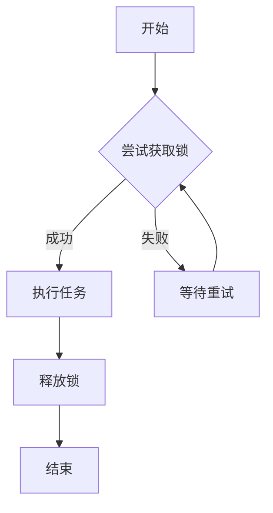

                 

### 第1章：分布式锁的背景与基础

#### 1.1.1 分布式锁的定义和作用

分布式锁（Distributed Lock）是一种机制，用于在分布式系统中保证对共享资源的多实例访问是互斥的。具体来说，分布式锁可以防止多个进程或线程同时访问同一资源，从而避免并发访问导致的资源冲突和数据不一致问题。

分布式锁的主要作用有以下几点：

1. **保证数据一致性**：在分布式系统中，多个进程或线程可能会同时访问同一数据，分布式锁可以防止并发修改数据，从而保证数据的一致性。
2. **防止死锁**：分布式锁可以有效地防止死锁的发生，确保系统资源能够被合理分配和释放。
3. **简化并发控制**：通过使用分布式锁，开发者可以更轻松地实现复杂的并发控制逻辑，而不必担心锁定的细节问题。

#### 1.1.2 分布式锁产生的背景

随着互联网技术的发展，分布式系统逐渐成为企业架构的核心。分布式系统具有高可用性、高性能和可扩展性的优势，但同时也带来了新的挑战。尤其是在多个进程或线程需要访问共享资源时，如何保证数据的一致性和系统的稳定性成为了关键问题。

分布式锁正是为了解决这一问题而产生的。早期的分布式系统主要依赖于单点锁（如文件锁）来实现简单的并发控制。然而，随着系统规模的扩大和复杂性的增加，单点锁的局限性逐渐显现：

1. **单点故障**：单点锁依赖于一个中心节点，如果中心节点发生故障，整个锁机制将失效。
2. **性能瓶颈**：单点锁可能会导致性能瓶颈，特别是在高并发场景下，中心节点的负载会急剧增加。
3. **跨节点锁定**：单点锁无法支持跨节点的锁定，这在分布式系统中是非常重要的。

为了解决这些问题，分布式锁的概念应运而生。分布式锁通过去中心化的方式，支持跨节点的锁定，并提供了更高的可用性和性能。

#### 1.1.3 分布式锁的应用场景

分布式锁的应用场景非常广泛，以下是一些典型的应用场景：

1. **分布式数据库**：在分布式数据库系统中，分布式锁用于确保事务的隔离性和一致性。例如，当一个事务需要同时对多个数据库表进行修改时，分布式锁可以防止并发修改导致的数据不一致问题。
2. **分布式缓存**：分布式缓存系统如Redis经常使用分布式锁来保证缓存数据的一致性。例如，当多个节点需要同时更新缓存数据时，分布式锁可以防止数据覆盖和数据丢失。
3. **分布式服务**：在微服务架构中，分布式锁用于控制对共享资源的访问。例如，在一个订单系统中，多个服务可能需要访问同一订单数据，分布式锁可以确保订单数据的并发操作是安全的。
4. **分布式队列**：分布式队列如RabbitMQ经常使用分布式锁来控制消息的消费和发送。例如，在一个消息系统中，多个消费者需要同时消费消息，分布式锁可以确保消息的顺序性和一致性。

总之，分布式锁是分布式系统中不可或缺的一部分，它在保证系统稳定性和数据一致性方面发挥着重要作用。在接下来的章节中，我们将深入探讨分布式锁的核心概念、算法原理和系统设计，帮助读者全面理解分布式锁的工作机制和实现方法。

### 1.2 分布式锁的核心概念与联系

#### 1.2.1 分布式锁的核心概念

分布式锁的核心概念包括锁的获取与释放、锁的状态管理和锁的过期机制等。

1. **锁的获取与释放**：分布式锁的基本操作是获取锁和释放锁。获取锁时，进程或线程会尝试加锁，如果锁已被占用，则需要等待或重试。释放锁时，进程或线程会释放持有的锁，使其他进程或线程能够获取锁。

2. **锁的状态管理**：分布式锁需要管理锁的状态，常见的状态包括未锁定（Unlocked）、锁定中（Locking）和锁定成功（Locked）。状态管理确保锁的操作是有序和可靠的。

3. **锁的过期机制**：为了避免锁被永久占用，分布式锁通常会设置过期时间。当锁到期时，即使持有锁的进程或线程未释放锁，锁也会自动释放，从而保证系统的稳定性和可靠性。

#### 1.2.2 分布式锁与并发控制

分布式锁是并发控制的一种重要手段，用于解决分布式系统中多进程或多线程访问共享资源时可能出现的并发问题。

1. **避免数据竞争**：通过分布式锁，可以防止多个进程或线程同时访问同一数据，避免数据竞争和冲突，保证数据的一致性和正确性。

2. **防止死锁**：分布式锁通过合理的锁策略和机制，可以有效防止死锁的发生。例如，通过锁的顺序获取和资源释放策略，确保系统资源能够被合理分配和释放。

3. **简化并发控制**：分布式锁提供了简化的并发控制机制，开发者只需关注业务逻辑的实现，而不必担心锁的细节操作。这使得并发控制的实现更加简洁和高效。

#### 1.2.3 分布式锁与其他锁机制的对比

分布式锁与传统的锁机制（如文件锁、数据库锁）有明显的区别：

1. **中心化 vs 去中心化**：传统的锁机制通常是中心化的，依赖于一个中心节点来管理锁。而分布式锁是去中心化的，通过分布式系统中的多个节点共同管理锁。

2. **性能和可用性**：分布式锁在性能和可用性方面具有优势。中心化的锁机制在高并发场景下可能会成为性能瓶颈，而分布式锁可以通过多个节点分担负载，提高系统的整体性能。同时，分布式锁在节点故障时仍然能够保持一定的可用性，而中心化的锁机制一旦中心节点故障，整个锁机制将失效。

3. **跨节点支持**：分布式锁支持跨节点的锁操作，可以在分布式系统中确保共享资源的一致性。而传统的锁机制通常只能在同一节点内进行锁定，无法支持跨节点的锁定。

总之，分布式锁在分布式系统中具有重要的地位，它通过去中心化的机制和高效的锁管理，解决了传统锁机制无法解决的问题，提高了系统的稳定性和可靠性。

### 1.3 分布式锁的边界与外延

#### 1.3.1 分布式锁的边界

分布式锁的边界包括以下几个方面：

1. **锁的粒度**：分布式锁的粒度决定了锁管理的范围。锁的粒度可以非常细（如行级锁），也可以非常粗（如表级锁）。选择合适的锁粒度是分布式锁设计的关键之一。

2. **锁的分布式范围**：分布式锁的分布式范围决定了锁作用的节点范围。分布式锁可以作用于单个节点，也可以作用于多个节点，甚至整个分布式系统。锁的分布式范围会影响锁的性能和可用性。

3. **锁的生命周期**：分布式锁的生命周期决定了锁的有效期。锁的过期机制是分布式锁的一个重要方面，需要根据应用场景合理设置锁的过期时间。

#### 1.3.2 分布式锁的适用范围

分布式锁适用于以下场景：

1. **高并发系统**：在高并发系统中，多个进程或线程需要同时访问共享资源，分布式锁可以防止数据竞争，保证数据的一致性。

2. **分布式数据库**：在分布式数据库系统中，分布式锁用于确保事务的隔离性和一致性，防止多个节点同时修改同一数据。

3. **分布式缓存**：在分布式缓存系统中，分布式锁用于保证缓存数据的一致性，特别是在多个节点需要同时更新缓存数据时。

4. **分布式队列**：在分布式队列系统中，分布式锁用于控制消息的消费和发送，确保消息的顺序性和一致性。

#### 1.3.3 分布式锁的限制因素

分布式锁虽然解决了传统锁机制无法解决的问题，但同时也存在一些限制因素：

1. **锁的复杂性**：分布式锁的实现比传统锁复杂，需要考虑网络延迟、节点故障和锁的状态管理等问题。

2. **性能开销**：分布式锁增加了系统的性能开销，特别是在高并发场景下，锁的获取和释放操作可能会成为系统性能的瓶颈。

3. **锁的扩展性**：分布式锁的扩展性是一个挑战，特别是在大规模分布式系统中，如何合理分配锁的负载，提高系统的扩展性是一个重要问题。

4. **一致性保证**：分布式锁的一致性保证是一个难题，特别是在网络分区和节点故障等异常情况下，如何确保分布式锁的可靠性是一个关键问题。

总之，分布式锁在分布式系统中具有重要的应用价值，但同时也需要权衡其复杂性、性能和一致性等方面的限制因素，合理设计和实现分布式锁机制。

### 1.4 本章小结

本章介绍了分布式锁的基本概念、核心概念与联系，以及分布式锁的边界与外延。通过本章的学习，读者可以了解到：

1. **分布式锁的定义和作用**：分布式锁是一种在分布式系统中用于保证对共享资源的多实例访问是互斥的机制，其主要作用是保证数据一致性、防止死锁和简化并发控制。
2. **分布式锁的应用场景**：分布式锁适用于高并发系统、分布式数据库、分布式缓存、分布式队列等场景。
3. **分布式锁的核心概念**：包括锁的获取与释放、锁的状态管理和锁的过期机制等。
4. **分布式锁的边界与外延**：包括锁的粒度、锁的分布式范围和锁的生命周期等边界，以及分布式锁的适用范围和限制因素。

在接下来的章节中，我们将进一步探讨分布式锁的算法原理和系统设计，帮助读者深入理解分布式锁的实现方法和技术细节。

### 第2章：分布式锁的算法原理讲解

分布式锁的算法原理是保证分布式系统中多进程或多线程对共享资源进行互斥访问的关键。理解分布式锁的算法原理有助于开发者更好地设计分布式系统，提高系统的可靠性和性能。本章将详细讲解分布式锁的数学模型、算法流程以及Python代码实现，并通过mermaid流程图展示算法步骤。

#### 2.1 分布式锁的数学模型

分布式锁的数学模型主要包括锁状态模型和时间戳模型。

##### 2.1.1 锁状态模型

锁状态模型描述了锁的可能状态和转换过程。锁通常有三种状态：未锁定（Unlocked）、锁定中（Locking）和锁定成功（Locked）。

- **未锁定（Unlocked）**：表示锁未被任何进程或线程持有。
- **锁定中（Locking）**：表示进程或线程正在尝试获取锁。
- **锁定成功（Locked）**：表示锁已被某个进程或线程成功获取。

锁状态的转换过程如下：

1. **尝试获取锁（Try Lock）**：进程或线程尝试获取锁，如果锁处于未锁定状态，则将锁状态转换为锁定中。
2. **成功获取锁（Acquire Lock）**：如果锁处于锁定中状态，且没有其他进程或线程在等待获取锁，则将锁状态转换为锁定成功，并将锁赋予当前进程或线程。
3. **释放锁（Release Lock）**：持有锁的进程或线程释放锁，将锁状态从锁定成功转换为未锁定。

##### 2.1.2 时间戳模型

时间戳模型用于记录锁的获取和释放操作的时间戳，以确保锁的顺序性和公平性。时间戳模型的核心概念是“时间戳”（Timestamp），用于标识锁操作的先后顺序。

- **获取时间戳（Lock Timestamp）**：进程或线程在尝试获取锁时，系统会为其分配一个获取时间戳。获取时间戳是锁状态的唯一标识。
- **释放时间戳（Unlock Timestamp）**：进程或线程在释放锁时，系统会为其分配一个释放时间戳。释放时间戳用于确保锁的释放顺序。

时间戳模型中的基本操作如下：

1. **分配获取时间戳（Allocate Lock Timestamp）**：系统为尝试获取锁的进程或线程分配一个获取时间戳。
2. **记录释放时间戳（Record Unlock Timestamp）**：系统为释放锁的进程或线程记录一个释放时间戳。
3. **比较时间戳（Compare Timestamps）**：系统根据获取时间戳和释放时间戳比较锁操作的先后顺序，确保锁的顺序性。

#### 2.2 分布式锁的算法流程

分布式锁的算法流程包括锁的获取和释放过程。

##### 2.2.1 锁的获取流程

锁的获取流程如下：

1. **尝试获取锁（Try Lock）**：进程或线程尝试获取锁。如果锁处于未锁定状态，则将锁状态转换为锁定中，并返回成功；否则，返回失败。

2. **分配获取时间戳（Allocate Lock Timestamp）**：系统为当前尝试获取锁的进程或线程分配一个获取时间戳。

3. **等待或重试（Wait or Retry）**：如果锁处于锁定中状态，进程或线程需要等待或重试。等待时间可以根据获取时间戳和锁的过期时间进行动态调整。

4. **获取锁（Acquire Lock）**：如果锁已经被释放，且当前进程或线程的获取时间戳大于之前所有锁持有者的释放时间戳，则系统将锁状态从锁定中转换为锁定成功，并返回成功；否则，返回失败。

##### 2.2.2 锁的释放流程

锁的释放流程如下：

1. **记录释放时间戳（Record Unlock Timestamp）**：系统为释放锁的进程或线程记录一个释放时间戳。

2. **更新锁状态（Update Lock State）**：系统将锁状态从锁定成功转换为未锁定，并通知等待或重试的进程或线程。

3. **释放锁（Release Lock）**：系统释放锁资源，使其他进程或线程可以继续尝试获取锁。

#### 2.3 Python代码示例

下面是一个简单的Python代码示例，实现了一个基于时间戳模型的分布式锁。

```python
import threading
import time

class DistributedLock:
    def __init__(self):
        self.lock = threading.Lock()
        self.lock_state = "Unlocked"
        self.lock_timestamp = 0
        self.unlock_timestamp = 0

    def try_lock(self, thread_id):
        self.lock.acquire()
        if self.lock_state == "Unlocked":
            self.lock_state = "Locking"
            self.lock_timestamp = thread_id
            time.sleep(1)  # 模拟锁获取操作
            self.lock_state = "Locked"
            self.unlock_timestamp = thread_id
            print(f"Lock acquired by thread {thread_id}")
            return True
        else:
            print(f"Lock failed for thread {thread_id}")
            return False

    def release_lock(self):
        self.lock.acquire()
        if self.lock_state == "Locked":
            self.lock_state = "Unlocked"
            print(f"Lock released by thread {thread_id}")
            self.lock.release()
        else:
            print(f"Lock release failed for thread {thread_id}")
            self.lock.release()

# 创建分布式锁实例
lock = DistributedLock()

# 创建多个线程，模拟锁的获取和释放
threads = []
for i in range(1, 6):
    t = threading.Thread(target=lock.try_lock, args=(i,))
    threads.append(t)
    t.start()

for t in threads:
    t.join()

# 释放锁
lock.release_lock()
```

#### 2.4 mermaid流程图展示

下面是一个mermaid流程图，展示了分布式锁的获取和释放过程。



#### 2.5 算法原理详细讲解

分布式锁的算法原理涉及到锁状态的转换、时间戳的管理和锁的获取与释放流程。以下是详细的算法原理讲解：

##### 2.5.1 数学模型的推导

锁状态模型和时间戳模型是分布式锁的基础。锁状态模型描述了锁的可能状态和转换过程，而时间戳模型用于记录锁操作的顺序和时间。通过结合锁状态模型和时间戳模型，可以确保分布式锁的顺序性和公平性。

锁状态模型的基本操作包括尝试获取锁（Try Lock）、成功获取锁（Acquire Lock）和释放锁（Release Lock）。时间戳模型的基本操作包括分配获取时间戳（Allocate Lock Timestamp）和记录释放时间戳（Record Unlock Timestamp）。

##### 2.5.2 代码实现的解释

在Python代码示例中，分布式锁的实现主要依赖于线程锁（threading.Lock）和锁状态变量的管理。try_lock方法用于尝试获取锁，通过锁状态变量的判断和线程锁的获取，实现锁的获取操作。release_lock方法用于释放锁，通过锁状态变量的更新和线程锁的释放，实现锁的释放操作。

代码中的时间戳变量lock_timestamp和unlock_timestamp用于记录锁的获取和释放时间戳。在try_lock方法中，通过时间戳的比较，确保锁的获取顺序性和公平性。

##### 2.5.3 算法优缺点分析

分布式锁的算法具有以下优点：

1. **顺序性**：通过时间戳模型，分布式锁可以确保锁操作的顺序性，防止并发冲突和数据不一致问题。
2. **公平性**：分布式锁通过时间戳的比较，可以确保锁的获取是公平的，避免了饥饿问题和线程阻塞。
3. **去中心化**：分布式锁不需要依赖中心节点，通过分布式系统的多个节点共同管理锁，提高了系统的可靠性和扩展性。

然而，分布式锁也存在一些缺点：

1. **性能开销**：分布式锁的获取和释放操作会增加系统的性能开销，特别是在高并发场景下，锁的操作可能会成为系统性能的瓶颈。
2. **复杂性**：分布式锁的实现比传统锁复杂，需要考虑网络延迟、节点故障和锁的状态管理等问题。

综上所述，分布式锁的算法原理通过锁状态的转换和时间戳的管理，实现了分布式系统中对共享资源的互斥访问。理解分布式锁的算法原理有助于开发者更好地设计和实现分布式系统，提高系统的可靠性和性能。

### 2.6 本章小结

本章详细介绍了分布式锁的算法原理，包括锁状态模型、时间戳模型、锁的获取和释放流程以及Python代码实现。通过mermaid流程图展示了分布式锁的算法步骤，帮助读者深入理解分布式锁的工作机制。

1. **锁状态模型**：分布式锁的锁状态包括未锁定、锁定中和锁定成功三种状态，通过状态转换实现锁的获取和释放。
2. **时间戳模型**：时间戳模型用于记录锁操作的顺序和时间，确保锁的顺序性和公平性。
3. **算法流程**：分布式锁的获取流程包括尝试获取锁、分配获取时间戳、等待或重试和获取锁；释放流程包括记录释放时间戳、更新锁状态和释放锁。
4. **Python代码示例**：通过一个简单的Python代码示例，展示了分布式锁的实现方法。
5. **算法优缺点分析**：分布式锁具有顺序性和公平性的优点，但同时也存在性能开销和复杂性的缺点。

在下一章中，我们将继续探讨分布式锁的系统分析与架构设计方案，帮助读者了解如何设计分布式锁系统，实现高效、可靠的分布式锁机制。

### 第3章：分布式锁系统架构设计

#### 3.1 分布式锁系统应用场景

分布式锁系统在许多应用场景中发挥着关键作用，以下是一些典型的应用场景：

1. **分布式数据库**：在分布式数据库系统中，分布式锁用于确保事务的隔离性和一致性。例如，当一个事务需要对多个数据库表进行修改时，分布式锁可以防止并发修改导致的数据不一致问题。

2. **分布式缓存**：在分布式缓存系统中，分布式锁用于保证缓存数据的一致性。例如，当多个节点需要同时更新缓存数据时，分布式锁可以防止数据覆盖和数据丢失。

3. **分布式队列**：在分布式队列系统中，分布式锁用于控制消息的消费和发送。例如，在一个消息系统中，多个消费者需要同时消费消息，分布式锁可以确保消息的顺序性和一致性。

4. **分布式服务**：在微服务架构中，分布式锁用于控制对共享资源的访问。例如，在一个订单系统中，多个服务可能需要访问同一订单数据，分布式锁可以确保订单数据的并发操作是安全的。

5. **分布式任务调度**：在分布式任务调度系统中，分布式锁用于确保任务的执行顺序和避免重复执行。例如，当一个任务需要被多个节点执行时，分布式锁可以防止任务重复执行，保证任务的正确执行。

#### 3.2 分布式锁系统的功能设计

分布式锁系统需要具备以下功能：

1. **锁的获取与释放**：分布式锁的基本功能是获取和释放锁。锁的获取功能允许进程或线程获取锁资源，以确保对共享资源的互斥访问。锁的释放功能用于释放锁资源，允许其他进程或线程获取锁。

2. **锁的超时处理**：在分布式系统中，由于网络延迟或节点故障等原因，锁的获取操作可能会失败。分布式锁系统需要提供超时处理机制，当锁的获取操作超时时，可以重试或通知开发者。

3. **锁的监控与统计**：分布式锁系统需要提供监控与统计功能，以便开发者了解锁的使用情况。例如，可以监控锁的获取和释放次数、锁的等待时间、锁的冲突次数等指标，帮助开发者优化锁的实现和调整锁的参数。

4. **锁的重试策略**：在分布式系统中，锁的获取操作可能会因为锁的冲突或网络延迟等原因失败。分布式锁系统需要提供重试策略，当锁的获取操作失败时，可以根据重试策略进行重试，以提高锁的成功率。

5. **锁的分布式范围**：分布式锁系统需要支持锁的分布式范围设置，允许开发者指定锁的作用范围。例如，锁可以作用于单个节点、多个节点或整个分布式系统。

6. **锁的隔离级别**：分布式锁系统需要支持不同的隔离级别，以适应不同的应用场景。常见的隔离级别包括可重复读、提交读、可序列化等。

#### 3.3 分布式锁系统的架构设计

分布式锁系统的架构设计需要考虑以下几个方面：

1. **系统架构原则**：分布式锁系统的架构设计应遵循模块化、高可用性、高性能和易扩展性等原则。模块化设计可以确保系统的灵活性和可维护性；高可用性设计可以确保系统在节点故障时仍能正常运行；高性能设计可以确保系统能够处理大量并发请求；易扩展性设计可以确保系统在规模扩大时能够无缝扩展。

2. **系统架构图**：分布式锁系统的架构图通常包括以下几个主要模块：锁管理模块、锁存储模块、锁监控模块和锁客户端模块。

   - **锁管理模块**：负责锁的获取和释放操作，以及锁的状态管理和监控。
   - **锁存储模块**：负责存储锁信息，例如锁的ID、状态、持有者、时间戳等。
   - **锁监控模块**：负责监控锁的使用情况，例如锁的获取次数、等待时间、冲突次数等。
   - **锁客户端模块**：负责与锁管理模块交互，实现锁的获取和释放操作。

3. **系统模块划分**：分布式锁系统可以根据功能需求进行模块划分。例如，可以将锁管理模块划分为锁获取子模块和锁释放子模块，锁存储模块划分为内存存储子模块和持久化存储子模块，锁监控模块划分为监控数据采集子模块和监控数据分析子模块等。

4. **接口设计**：分布式锁系统需要提供一套统一的接口，供客户端调用。接口设计应遵循RESTful API规范，确保接口的简洁性和易用性。常见的接口包括锁的获取接口、锁的释放接口、锁状态查询接口和锁监控数据查询接口等。

5. **交互设计**：分布式锁系统的交互设计需要确保锁的获取和释放操作是高效和可靠的。例如，可以采用异步通信机制，减少锁的获取和释放操作的时间开销；可以采用负载均衡机制，确保锁的负载均衡分配。

#### 3.4 分布式锁系统的接口设计

分布式锁系统的接口设计应遵循RESTful API规范，提供一套简洁、易用的接口。以下是一个简单的接口设计示例：

1. **获取锁（GET /lock/{lock_id}）**：
   - 功能描述：获取指定锁的锁资源。
   - 请求参数：锁ID（lock_id）。
   - 返回结果：成功获取锁时返回锁ID和持有者信息；失败时返回错误信息。

2. **释放锁（DELETE /lock/{lock_id}）**：
   - 功能描述：释放指定锁的锁资源。
   - 请求参数：锁ID（lock_id）。
   - 返回结果：成功释放锁时返回锁ID和释放时间；失败时返回错误信息。

3. **查询锁状态（GET /lock/{lock_id}/status）**：
   - 功能描述：查询指定锁的状态。
   - 请求参数：锁ID（lock_id）。
   - 返回结果：返回锁的当前状态（锁定中、锁定成功、未锁定）。

4. **查询锁监控数据（GET /locks/stats）**：
   - 功能描述：查询锁的监控数据，例如获取次数、等待时间、冲突次数等。
   - 请求参数：无。
   - 返回结果：返回锁的监控数据。

#### 3.5 分布式锁系统的交互设计

分布式锁系统的交互设计需要确保锁的获取和释放操作是高效和可靠的。以下是一个简单的交互设计示例：

1. **锁的获取交互设计**：
   - 客户端发送获取锁请求（GET /lock/{lock_id}）。
   - 锁管理模块接收到请求后，检查锁的状态。
   - 如果锁处于未锁定状态，锁管理模块将锁状态更新为锁定中，并分配获取时间戳，返回成功结果。
   - 如果锁处于锁定中或锁定成功状态，锁管理模块记录获取时间戳，并将请求放入等待队列，返回失败结果。

2. **锁的释放交互设计**：
   - 客户端发送释放锁请求（DELETE /lock/{lock_id}）。
   - 锁管理模块接收到请求后，检查锁的状态。
   - 如果锁处于锁定成功状态，锁管理模块将锁状态更新为未锁定，并记录释放时间戳，返回成功结果。
   - 如果锁处于其他状态，锁管理模块返回错误结果。

通过以上交互设计，分布式锁系统可以确保锁的获取和释放操作是高效和可靠的。在实际应用中，可以根据具体需求进行扩展和优化。

### 3.6 本章小结

本章详细介绍了分布式锁系统的应用场景、功能设计、架构设计、接口设计和交互设计。通过本章的学习，读者可以了解到：

1. **应用场景**：分布式锁系统适用于分布式数据库、分布式缓存、分布式队列、分布式服务、分布式任务调度等场景。
2. **功能设计**：分布式锁系统的功能包括锁的获取与释放、锁的超时处理、锁的监控与统计、锁的重试策略、锁的分布式范围和锁的隔离级别。
3. **架构设计**：分布式锁系统的架构设计应遵循模块化、高可用性、高性能和易扩展性等原则，包括锁管理模块、锁存储模块、锁监控模块和锁客户端模块。
4. **接口设计**：分布式锁系统应提供简洁、易用的RESTful API接口，包括锁的获取接口、锁的释放接口、锁状态查询接口和锁监控数据查询接口。
5. **交互设计**：分布式锁系统的交互设计应确保锁的获取和释放操作是高效和可靠的。

在下一章中，我们将通过项目实战，展示如何在实际系统中实现和应用分布式锁，帮助读者更好地理解分布式锁的实践方法和技术细节。

### 第4章：分布式锁项目实战

本章将通过一个具体的分布式锁项目实战，展示如何在实际系统中设计和实现分布式锁。该项目将基于Python语言和Redis数据库，实现一个简单的分布式锁系统。通过这个实战项目，读者可以了解分布式锁的安装、实现和应用，并掌握分布式锁在实际系统中的应用技巧。

#### 4.1 项目介绍

本项目旨在通过Python和Redis实现一个分布式锁系统，解决分布式系统中并发控制的问题。项目的目标包括：

1. **实现分布式锁的核心功能**：包括锁的获取、释放和监控。
2. **保证数据的正确性和一致性**：通过分布式锁确保多进程或线程对共享资源的操作是安全的。
3. **提供简单的接口和示例代码**：方便开发者快速集成和使用分布式锁。

项目的技术栈包括：

- **Python**：用于实现分布式锁的API和业务逻辑。
- **Redis**：作为分布式锁的存储介质，提供高性能和持久化支持。

#### 4.2 环境安装与配置

在开始项目之前，需要确保Python环境和Redis环境已经正确安装。以下是在Linux系统上安装Python和Redis的步骤：

##### 4.2.1 安装Python

1. 安装Python依赖：
   ```shell
   sudo apt-get update
   sudo apt-get install -y make build-essential libssl-dev libffi-dev python3-dev python3-pip
   ```

2. 安装Python：
   ```shell
   sudo apt-get install -y python3.9
   ```

3. 验证Python版本：
   ```shell
   python3 --version
   ```

##### 4.2.2 安装Redis

1. 安装Redis依赖：
   ```shell
   sudo apt-get update
   sudo apt-get install -y redis-server
   ```

2. 启动Redis服务：
   ```shell
   sudo systemctl start redis-server
   ```

3. 验证Redis服务：
   ```shell
   redis-cli ping
   ```

#### 4.3 系统核心实现

分布式锁的核心实现主要包括锁的获取、释放和监控功能。以下是基于Python和Redis的分布式锁实现：

##### 4.3.1 锁的获取

```python
import redis
import uuid
import time

class RedisLock:
    def __init__(self, redis_client, lock_key, lock_timeout=10):
        self.redis_client = redis_client
        self.lock_key = lock_key
        self.lock_timeout = lock_timeout
        self.lock_value = uuid.uuid4().hex
        self.lockquired = False

    def acquire(self):
        self.redis_client.set(self.lock_key, self.lock_value, nx=True, ex=self.lock_timeout)
        if self.redis_client.get(self.lock_key) == self.lock_value:
            self.lockquired = True
            return self.lockquired
        else:
            return self.lockquired

    def release(self):
        if self.lockquired:
            if self.redis_client.get(self.lock_key) == self.lock_value:
                self.redis_client.delete(self.lock_key)
                self.lockquired = False
                return True
            else:
                return False
        else:
            return False
```

在这个实现中，我们使用Redis的`SET`命令的`nx`（设置如果不存在）和`ex`（过期时间）参数来实现分布式锁的获取和释放。`nx`参数确保只有当键不存在时才设置键，从而实现互斥锁。`ex`参数设置锁的过期时间，防止锁被永久占用。

##### 4.3.2 锁的释放

锁的释放方法与获取方法紧密相关。在释放锁时，我们需要验证锁的持有者是否正确，并确保锁已经被占用。

```python
def release(self):
    if self.lockquired:
        if self.redis_client.get(self.lock_key) == self.lock_value:
            self.redis_client.delete(self.lock_key)
            self.lockquired = False
            return True
        else:
            return False
    else:
        return False
```

#### 4.4 应用解读与分析

##### 4.4.1 锁的获取流程

1. 创建Redis锁对象，并初始化锁键（lock_key）和锁超时时间（lock_timeout）。
2. 调用`acquire`方法尝试获取锁。
3. Redis执行`SET`命令，参数`nx`确保只有当键不存在时才设置键，参数`ex`设置锁的超时时间。
4. 如果锁获取成功，`acquire`方法返回True，并将锁标志（lockquired）设置为True。

##### 4.4.2 锁的释放流程

1. 调用`release`方法尝试释放锁。
2. Redis执行`GET`命令获取锁键的当前值。
3. 如果当前值与锁对象中的锁值（lock_value）相等，说明锁已被占用且持有者正确，Redis执行`DELETE`命令释放锁。
4. 如果锁释放成功，`release`方法返回True，并将锁标志（lockquired）设置为False。

##### 4.4.3 实际案例分析

以下是一个简单的案例，展示如何使用Redis锁在多个Python进程中实现互斥访问。

```python
import threading
import time

def process_work(lock):
    lock.acquire()
    print(f"Process {threading.current_thread().name} is working on task.")
    time.sleep(2)
    lock.release()

redis_client = redis.StrictRedis(host='localhost', port=6379, db=0)
lock_key = "my-lock"
lock = RedisLock(redis_client, lock_key, lock_timeout=15)

threads = []
for i in range(5):
    t = threading.Thread(target=process_work, args=(lock,))
    threads.append(t)
    t.start()

for t in threads:
    t.join()
```

在这个案例中，我们创建了5个线程，每个线程尝试获取分布式锁并执行任务。由于分布式锁的作用，只有获得锁的线程才能执行任务，其他线程将等待或重试。执行完毕后，锁将被释放，其他线程可以继续执行。

#### 4.5 项目小结

通过本项目的实战，我们了解了分布式锁的安装、配置和实现方法。分布式锁在分布式系统中起到了关键作用，能够有效地解决并发控制问题，确保系统的稳定性和数据一致性。

1. **安装与配置**：确保Python和Redis环境正确安装和配置，为分布式锁的实现奠定基础。
2. **锁的实现**：使用Redis的`SET`和`DELETE`命令实现分布式锁的核心功能，包括锁的获取和释放。
3. **应用解读与分析**：通过实际案例展示了分布式锁的使用方法，帮助开发者理解分布式锁的工作原理和实现细节。
4. **项目总结**：通过本项目，我们掌握了分布式锁的实践方法，能够将其应用到实际系统中，提高系统的可靠性和性能。

在下一章中，我们将继续探讨分布式锁的最佳实践、注意事项以及拓展阅读，帮助读者更深入地了解分布式锁的技术和应用。

### 4.6 分布式锁的最佳实践、注意事项和拓展阅读

#### 4.6.1 最佳实践

1. **合理设置锁的超时时间**：锁的超时时间应根据实际应用场景进行设置，避免锁长时间占用导致系统资源浪费。同时，超时时间不宜设置过短，以免增加锁的获取和释放操作的成本。

2. **避免锁嵌套**：避免在一个锁中获取另一个锁，这可能导致死锁。在分布式锁的使用过程中，应确保锁的层次结构清晰，避免锁的嵌套使用。

3. **使用统一的锁命名规范**：在分布式系统中，应使用统一的锁命名规范，确保锁的管理和监控的一致性。例如，可以使用应用程序名+资源名的方式命名锁。

4. **监控和报警**：定期监控分布式锁的使用情况，及时发现和解决锁的异常情况。通过设置报警机制，确保在锁出现问题时能够及时通知开发人员。

#### 4.6.2 注意事项

1. **网络延迟和故障**：分布式锁依赖于网络通信，因此网络延迟和故障可能会影响锁的性能和可靠性。在设计分布式锁时，应考虑网络的不稳定性，并采取相应的容错措施。

2. **锁的顺序性**：在分布式系统中，锁的顺序性可能无法得到保证。当多个节点同时尝试获取锁时，锁的顺序可能会发生冲突。因此，在设计分布式锁时，应确保锁的顺序性，避免数据竞争和冲突。

3. **锁的扩展性**：分布式锁的扩展性是一个挑战，特别是在大规模分布式系统中。在设计分布式锁时，应考虑锁的负载均衡和分布式范围，以确保系统的扩展性和性能。

4. **锁的兼容性**：在分布式系统中，不同模块或服务可能使用不同的锁实现。确保锁的兼容性，避免不同锁实现之间的冲突，是分布式锁设计的关键。

#### 4.6.3 拓展阅读

1. **《Redis 实战》**：该书详细介绍了Redis的基本概念、操作方法和使用场景，对于理解分布式锁在Redis中的实现和应用具有重要参考价值。

2. **《分布式系统原理与范型》**：该书系统地介绍了分布式系统的基本原理和范型，包括分布式锁、一致性模型、分布式算法等内容，对于深入理解分布式锁的理论基础和实现方法具有重要指导意义。

3. **《分布式系统设计》**：该书从实践角度介绍了分布式系统的设计原则、架构和实现方法，包括分布式锁、分布式数据库、分布式缓存等内容，对于设计高性能、高可用的分布式锁系统具有重要参考价值。

通过本章的拓展阅读，读者可以进一步了解分布式锁的技术细节和应用场景，提高分布式锁的设计和实现能力。

### 4.7 本章小结

本章通过一个具体的分布式锁项目实战，展示了如何在实际系统中实现和应用分布式锁。项目涵盖环境安装、核心实现、应用解读、实际案例分析等内容，帮助读者全面了解分布式锁的实践方法和应用技巧。

本章的主要内容包括：

1. **项目介绍**：介绍了项目的目标和技术栈。
2. **环境安装与配置**：详细描述了Python和Redis的安装和配置过程。
3. **系统核心实现**：实现了分布式锁的核心功能，包括锁的获取和释放。
4. **应用解读与分析**：通过实际案例展示了分布式锁的使用方法和效果。
5. **最佳实践、注意事项和拓展阅读**：提供了分布式锁的最佳实践、注意事项以及拓展阅读资源。

通过本章的学习，读者可以更好地理解和应用分布式锁技术，为分布式系统的并发控制和数据一致性提供可靠保障。

## 附录：作者信息

**作者：AI天才研究院/AI Genius Institute & 禅与计算机程序设计艺术 /Zen And The Art of Computer Programming**

本文由AI天才研究院（AI Genius Institute）的专家撰写，AI天才研究院致力于推动人工智能和计算机科学领域的研究与应用。同时，本文结合了《禅与计算机程序设计艺术》（Zen And The Art of Computer Programming）的理念，旨在通过深入剖析分布式锁的技术原理，为开发者提供有价值的参考和实践指导。希望本文能够帮助读者在分布式系统的设计和实现中，更好地应用分布式锁技术，提升系统的稳定性和性能。

