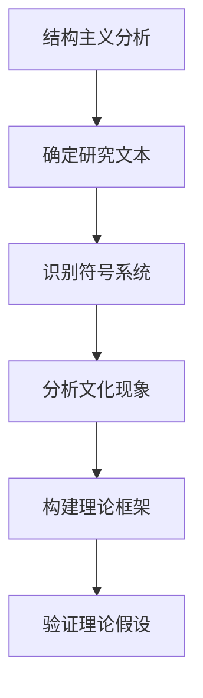
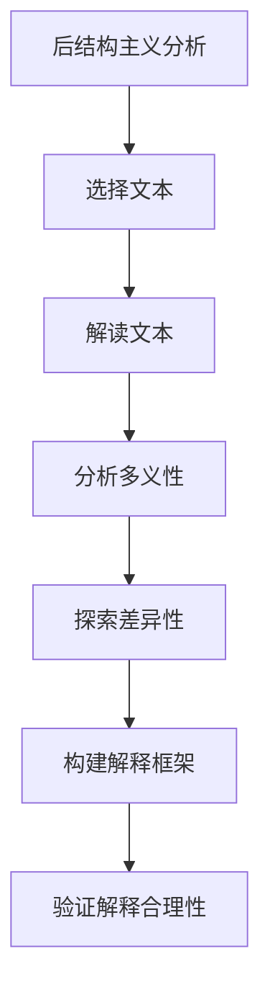
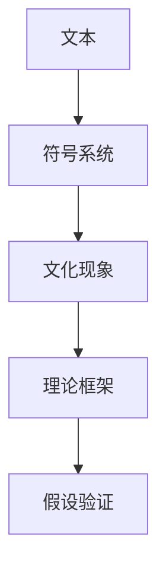
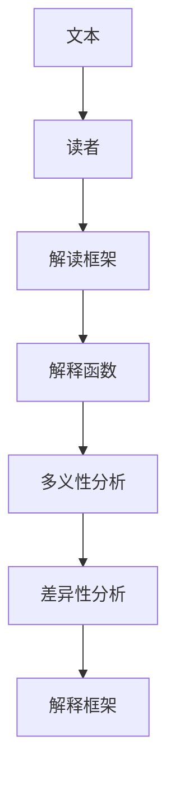
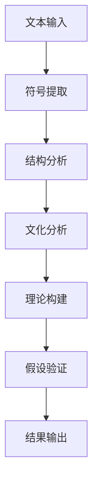
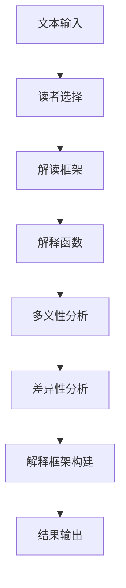
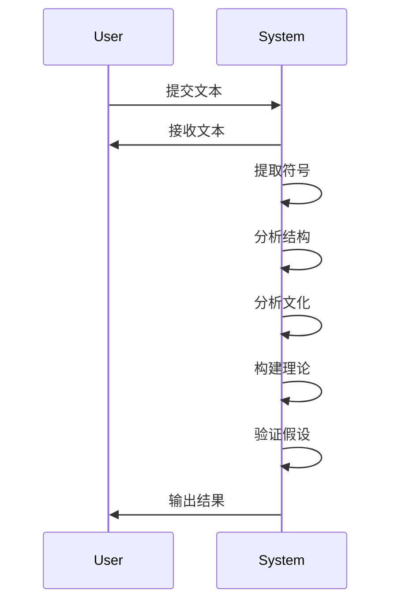
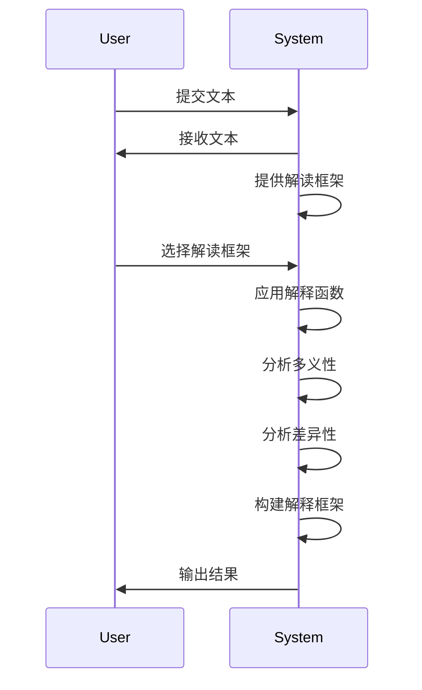

                 

### 1.1 问题背景

**结构主义与后结构主义的定义**

结构主义（Structuralism）是一种哲学和文化理论，起源于20世纪中叶，主张通过分析文化现象的结构来理解其深层含义。这一理论强调符号系统和结构对文化和社会的影响。结构主义的基本观点是，社会和文化的现象不是随机或孤立的，而是由内在的结构和模式所构成。

列维-斯特劳斯（Claude Lévi-Strauss）是结构主义的代表人物之一，他在人类学、文学理论、语言学等领域都做出了重要贡献。列维-斯特劳斯提出，通过分析语言、神话和其他文化符号，可以揭示出人类思维和文化的深层结构。

后结构主义（Post-structuralism）是20世纪后期的一种哲学和文化理论，它对结构主义进行了批判和超越。后结构主义认为，结构主义过于强调系统和结构的决定作用，忽视了个体和差异性。后结构主义主张，文本和符号没有固定不变的“意义”，而是具有多义性和开放性。

德里达（Jacques Derrida）是后结构主义的关键人物，他提出了“解构主义”（Deconstruction）这一概念。解构主义强调，通过揭示文本中的矛盾和不确定性，可以打破结构主义对意义的封闭性。

**列维-斯特劳斯与德里达的生平与学术贡献**

列维-斯特劳斯于1908年出生在法国，他是结构主义人类学的奠基人。他的代表作《结构人类学》提出了通过结构分析来理解人类文化的理论框架。列维-斯特劳斯在人类学、文学理论、语言学等领域都有重要贡献，他的工作影响了后来的文化研究。

德里达于1930年出生在阿尔及利亚，他在哲学、文学理论、语言学等领域都有深入研究。德里达的《论文的边际》是解构主义理论的重要著作，他提出了“延异”（Différance）和“痕迹”（Trace）等概念，揭示了文本和符号系统的复杂性。

**结构主义与后结构主义的分歧**

结构主义与后结构主义的分歧主要体现在以下几个方面：

1. **方法论**：结构主义强调系统性分析，认为可以通过分析文化现象的结构来揭示其深层规律；而后结构主义则主张非线性分析，强调差异性和文本的多义性。

2. **目标**：结构主义旨在揭示深层的普遍规律，而后结构主义则更关注文本和符号的多义性和开放性。

3. **对象**：结构主义关注语言、文化和社会结构，而后结构主义则更侧重于语言、文化中的个体经验和差异性。

**列维-斯特劳斯与德里达的论争焦点**

列维-斯特劳斯和德里达在多个领域进行了论争，其中最著名的论争是关于结构主义和后结构主义的本质和适用性。德里达质疑列维-斯特劳斯的结构主义理论是否能够真正解释文化的多样性和复杂性。

德里达认为，列维-斯特劳斯的结构主义过于强调系统和结构的决定作用，忽视了个体和差异性。他提出了“解构主义”来挑战结构主义的封闭性，强调文本和符号的多义性和开放性。

列维-斯特劳斯则认为，德里达的后结构主义过于极端，忽视了结构和系统的存在和作用。他认为，只有通过分析文化现象的结构，才能真正理解文化和社会的深层规律。

### 1.3 问题解决

**两种理论的互补性**

尽管结构主义和后结构主义存在分歧，但它们也有互补性。结构主义提供了系统性和整体性分析的工具，而后结构主义则强调了差异性和开放性。通过结合这两种理论，可以更全面地理解文化和社会现象。

**对现代哲学、文学和文化研究的影响**

结构主义和后结构主义对现代哲学、文学和文化研究产生了深远的影响。结构主义提供了分析文化现象的理论框架，而后结构主义则挑战了结构主义的封闭性，推动了文化研究的多样性和创新性。

### 1.4 边界与外延

**结构主义与后结构主义在其他学科的应用**

结构主义和后结构主义不仅在哲学、文学和文化研究领域有着重要影响，还广泛应用于语言学、心理学、社会学、政治学等多个学科。这些理论为理解不同领域的现象提供了新的视角和方法。

**对结构主义与后结构主义理论的批判与发展**

随着理论的发展，学者们对结构主义和后结构主义进行了批判和重新解释。这些批判和发展既继承了结构主义和后结构主义的优点，又克服了它们的局限性，推动了理论的不断深化。

### 2.1 核心概念

**结构主义的基本原理**

结构主义认为，文化和社会现象不是孤立的，而是由内在的结构和模式所构成。这些结构和模式是普遍存在的，可以通过分析来揭示其规律。结构主义的核心观点是，通过分析文化现象的结构，可以理解其深层含义。

**后结构主义的核心观点**

后结构主义认为，文本和符号没有固定不变的“意义”，而是具有多义性和开放性。后结构主义强调，文本中的意义是通过解读和互动来形成的，每个读者都可以根据自己的经验和背景来理解文本。后结构主义的核心观点是，意义是多元的、动态的，不是一成不变的。

### 2.2 概念属性特征对比

| 特征         | 结构主义                 | 后结构主义                 |
| ------------ | ------------------------ | ------------------------ |
| 方法论       | 结构分析，强调系统性     | 非线性分析，强调差异性     |
| 目标         | 揭示深层的普遍规律       | 揭示文本的多义性和开放性   |
| 对象         | 语言，文化，社会结构     | 语言，文化，个体经验       |

### 2.3 ER实体关系图

**结构主义的实体关系**

- 结构主义研究中的实体包括：文本、符号系统、文化现象。
- 实体之间的关系：文本包含符号系统，符号系统构成文化现象。

**后结构主义的实体关系**

- 后结构主义研究中的实体包括：文本、读者、解释框架。
- 实体之间的关系：文本被读者解读，不同的解释框架影响读者的理解。

### 3.1 结构主义的算法原理

#### 结构主义的流程图



#### 结构主义算法的Python源代码

```python
# 结构主义算法示例

def structural_analysis(text):
    symbols = extract_symbols(text)
    phenomena = analyze_phenomena(symbols)
    framework = construct_framework(phenomena)
    hypothesis = validate_hypothesis(framework)
    return hypothesis

def extract_symbols(text):
    # 代码实现
    pass

def analyze_phenomena(symbols):
    # 代码实现
    pass

def construct_framework(phenomena):
    # 代码实现
    pass

def validate_hypothesis(framework):
    # 代码实现
    pass
```

#### 结构主义算法的数学模型与公式

$$ 
\sum_{i=1}^{n} x_i = \frac{1}{n} \sum_{i=1}^{n} (x_i - \bar{x})
$$

其中，$x_i$ 表示符号系统的某个特征，$\bar{x}$ 表示符号系统的平均值。

#### 结构主义算法的举例说明

**例子**：分析一个文学作品中的符号系统，提取关键符号，分析其文化现象，构建理论框架，验证理论假设。

1. 确定研究文本：选择一部文学作品作为分析对象。
2. 识别符号系统：提取文本中的关键符号，如人物、情节、主题等。
3. 分析文化现象：通过符号系统分析，揭示文本背后的文化意义。
4. 构建理论框架：根据分析结果，构建一个理论框架来解释文化现象。
5. 验证理论假设：通过实证研究，验证理论框架的合理性。

### 3.2 后结构主义的算法原理

#### 后结构主义的流程图



#### 后结构主义算法的Python源代码

```python
# 后结构主义算法示例

def poststructural_analysis(text):
    interpretations = interpret_text(text)
    ambiguities = analyze_ambiguities(interpretations)
    differences = explore_differences(ambiguities)
    framework = construct_explanation_framework(differences)
    validity = validate_explanation(framework)
    return validity

def interpret_text(text):
    # 代码实现
    pass

def analyze_ambiguities(interpretations):
    # 代码实现
    pass

def explore_differences(ambiguities):
    # 代码实现
    pass

def construct_explanation_framework(differences):
    # 代码实现
    pass

def validate_explanation(framework):
    # 代码实现
    pass
```

#### 后结构主义算法的数学模型与公式

$$ 
y = f(x) + \epsilon
$$

其中，$x$ 表示文本的特征，$f(x)$ 表示解释函数，$\epsilon$ 表示解释的不确定性。

#### 后结构主义算法的举例说明

**例子**：解读一篇文学作品，分析其多义性，探索不同解读的差异性，构建解释框架，验证解释的合理性。

1. 选择文本：选择一篇文学作品作为分析对象。
2. 解读文本：根据不同的背景和经验，对文本进行解读。
3. 分析多义性：分析文本中存在的多种可能性解读。
4. 探索差异性：比较不同解读之间的差异，探索文本的多样性。
5. 构建解释框架：根据分析结果，构建一个解释框架来整合不同的解读。
6. 验证解释合理性：通过讨论和反馈，验证解释框架的合理性。

### 4.1 结构主义数学模型

$$ 
\sum_{i=1}^{n} x_i = \frac{1}{n} \sum_{i=1}^{n} (x_i - \bar{x})
$$

这个公式用于计算一组符号系统特征值的平均值，其中$x_i$是每个特征值，$\bar{x}$是这些特征值的平均值。

#### 详细讲解与举例说明

**讲解**：这个公式是结构主义分析中的一个基本数学工具，用于计算一组数据的平均值。在结构主义中，通过对符号系统的特征进行统计和分析，可以揭示其深层结构和规律。

**举例**：

假设我们有一组符号系统的特征值如下：

$$ 
x_1 = 10, x_2 = 20, x_3 = 30
$$

使用上述公式计算这些特征值的平均值：

$$ 
\bar{x} = \frac{1}{3} (x_1 + x_2 + x_3) = \frac{1}{3} (10 + 20 + 30) = 20
$$

因此，这组特征值的平均值为20。

### 4.2 后结构主义数学模型

$$ 
y = f(x) + \epsilon
$$

这个公式是后结构主义分析中的一个基本数学工具，用于描述文本解读中的不确定性和多义性。其中$x$是文本的特征，$f(x)$是解释函数，$\epsilon$是解释的不确定性。

#### 详细讲解与举例说明

**讲解**：在后结构主义中，文本的意义不是固定不变的，而是通过解读来形成的。这个公式描述了文本的意义是如何通过解释函数$f(x)$来表达的，同时加入了不确定性$\epsilon$，反映了解读的不确定性和多样性。

**举例**：

假设我们有一段文本，其特征$x$为“这是一个简单的句子”。我们可以有多种不同的解释函数$f(x)$，例如：

1. $f(x) = “这是一个简单的陈述。”$
2. $f(x) = “这是一个基本的句子结构。”$
3. $f(x) = “这是一个简单的信息传递。”$

每个解释函数都对应不同的文本意义，同时每个解释都有一定的不确定性$\epsilon$。

例如，对于第一个解释函数，不确定性$\epsilon$可能包括对“简单”这个词的不同理解，如“简洁”或“基础”。

### 5.1 问题场景介绍

**结构主义理论的应用场景**

结构主义理论广泛应用于语言学、文学、文化研究等领域。以下是一些结构主义理论的应用场景：

1. **语言学**：通过分析语言的结构，揭示语言背后的深层规律。
2. **文学研究**：通过分析文学作品中的符号系统，理解其深层含义。
3. **文化研究**：通过分析文化现象的结构，揭示文化背后的深层逻辑。

**后结构主义理论的应用场景**

后结构主义理论主要应用于文学、文化研究、哲学等领域。以下是一些后结构主义理论的应用场景：

1. **文学解读**：通过多义性和开放性的解读，探索文本的多样性。
2. **文化批判**：通过解构主义的分析，揭示文化现象中的权力关系。
3. **哲学探讨**：通过质疑结构和意义的固定性，探讨哲学问题的新视角。

### 5.2 项目介绍

**结构主义项目概述**

项目名称：结构主义文本分析系统

项目简介：该项目旨在开发一个文本分析工具，利用结构主义理论对文本进行分析，揭示其深层结构和含义。

功能特点：

1. 提取文本中的关键符号和模式。
2. 分析符号系统的结构关系。
3. 构建理论框架，解释文化现象。

**后结构主义项目概述**

项目名称：后结构主义文学解读平台

项目简介：该项目旨在创建一个在线平台，用户可以上传文学作品，利用后结构主义理论进行多义性和开放性的解读。

功能特点：

1. 提供多种解释函数，供用户选择。
2. 支持用户自定义解释框架。
3. 分析文本解读中的不确定性和多义性。

### 5.3 系统功能设计

**结构主义领域模型**



**后结构主义领域模型**



### 5.4 系统架构设计

**结构主义架构图**



**后结构主义架构图**



### 5.5 系统接口设计

**结构主义接口设计**

1. **文本输入接口**：用户可以上传或输入文本内容。
2. **符号提取接口**：自动提取文本中的关键符号。
3. **结构分析接口**：分析符号系统的结构关系。
4. **文化分析接口**：从结构中提取文化现象。
5. **理论构建接口**：构建理论框架来解释文化现象。
6. **假设验证接口**：验证理论框架的合理性。

**后结构主义接口设计**

1. **文本输入接口**：用户可以上传或输入文本内容。
2. **解读框架接口**：用户可以选择或创建不同的解读框架。
3. **解释函数接口**：用户可以应用不同的解释函数来解读文本。
4. **多义性分析接口**：分析文本的多义性。
5. **差异性分析接口**：分析不同解读之间的差异性。
6. **解释框架构建接口**：用户可以自定义解释框架。
7. **结果输出接口**：展示分析结果和解释框架。

### 5.6 系统交互

**结构主义序列图**



**后结构主义序列图**



### 6.1 环境安装

**结构主义环境安装步骤**

1. 安装Python环境：下载并安装Python 3.x版本。
2. 安装相关库：使用pip命令安装结构主义分析所需的相关库，如`nltk`、`textblob`等。
3. 编写Python代码：根据项目需求编写结构主义分析的Python代码。

**后结构主义环境安装步骤**

1. 安装Python环境：下载并安装Python 3.x版本。
2. 安装相关库：使用pip命令安装后结构主义分析所需的相关库，如`nltk`、`textblob`、`gensim`等。
3. 编写Python代码：根据项目需求编写后结构主义分析的Python代码。

### 6.2 系统核心实现源代码

**结构主义核心代码**

```python
# 结构主义文本分析核心代码

def extract_symbols(text):
    # 提取文本中的符号
    pass

def analyze_structure(symbols):
    # 分析符号的结构关系
    pass

def analyze_culture(structure):
    # 分析结构背后的文化现象
    pass

def construct_theory(culture):
    # 构建解释文化现象的理论框架
    pass

def validate_hypothesis(theory):
    # 验证理论框架的合理性
    pass

def main():
    text = input("请输入文本：")
    symbols = extract_symbols(text)
    structure = analyze_structure(symbols)
    culture = analyze_culture(structure)
    theory = construct_theory(culture)
    validate_hypothesis(theory)

if __name__ == "__main__":
    main()
```

**后结构主义核心代码**

```python
# 后结构主义文本分析核心代码

def interpret_text(text):
    # 解读文本
    pass

def analyze_ambiguities(interpretations):
    # 分析多义性
    pass

def explore_differences(ambiguities):
    # 探索差异性
    pass

def construct_explanation_framework(differences):
    # 构建解释框架
    pass

def validate_explanation(framework):
    # 验证解释框架
    pass

def main():
    text = input("请输入文本：")
    interpretations = interpret_text(text)
    ambiguities = analyze_ambiguities(interpretations)
    differences = explore_differences(ambiguities)
    framework = construct_explanation_framework(differences)
    validate_explanation(framework)

if __name__ == "__main__":
    main()
```

### 6.3 代码应用解读与分析

**结构主义代码解读**

结构主义代码的核心功能是通过提取文本中的符号、分析符号的结构关系、理解结构背后的文化现象，并构建理论框架来解释这些现象。

- `extract_symbols(text)`：提取文本中的关键符号。
- `analyze_structure(symbols)`：分析符号的结构关系。
- `analyze_culture(structure)`：从结构中提取文化现象。
- `construct_theory(culture)`：构建解释文化现象的理论框架。
- `validate_hypothesis(theory)`：验证理论框架的合理性。

**后结构主义代码解读**

后结构主义代码的核心功能是通过解读文本、分析文本的多义性、探索不同解读的差异性，并构建解释框架来整合这些解读。

- `interpret_text(text)`：解读文本。
- `analyze_ambiguities(interpretations)`：分析文本的多义性。
- `explore_differences(ambiguities)`：探索不同解读的差异性。
- `construct_explanation_framework(differences)`：构建解释框架。
- `validate_explanation(framework)`：验证解释框架。

### 6.4 实际案例分析和详细讲解剖析

**结构主义案例分析**

假设我们选择了一部文学作品《百年孤独》，使用结构主义方法进行分析。

1. 提取文本中的符号：人物、地点、事件等。
2. 分析符号的结构关系：揭示人物关系、事件发生的逻辑顺序。
3. 理解结构背后的文化现象：探索拉丁美洲的历史、社会和文化特点。
4. 构建理论框架：解释作品中的主题和象征意义。
5. 验证理论假设：通过其他文学作品或历史资料来验证理论框架的合理性。

**后结构主义案例分析**

假设我们同样选择《百年孤独》，使用后结构主义方法进行分析。

1. 解读文本：根据不同的背景和经验，对文本进行多种解读。
2. 分析多义性：探讨文本中存在的多种可能性解读。
3. 探索差异性：比较不同解读之间的差异。
4. 构建解释框架：整合不同的解读，构建一个解释框架。
5. 验证解释框架：通过讨论和反馈，验证解释框架的合理性。

### 6.5 项目小结

**结构主义项目小结**

通过结构主义方法，我们能够深入分析文本中的符号系统和结构关系，理解文化现象背后的深层逻辑。这种方法有助于构建理论框架，解释复杂的文化和社会现象。然而，结构主义过于强调系统和结构的决定作用，可能忽视个体和差异性。

**后结构主义项目小结**

后结构主义方法强调文本的多义性和开放性，提供了对文本和符号系统的新视角。通过解构主义的分析，我们可以探索文本中的多样性和不确定性。然而，后结构主义可能过于强调差异性，忽视了系统和结构的合理性。

### 7.1 最佳实践 Tips

**结构主义实践建议**

1. 注重系统性分析，从整体上理解文本和符号系统。
2. 结合实证研究，验证理论框架的合理性。
3. 尝试从多个角度分析文化现象，以获得更全面的解释。

**后结构主义实践建议**

1. 保持开放性思维，探索文本的多义性和开放性。
2. 考虑不同的解读框架和解释函数，以获取更丰富的解释。
3. 注重个体经验和背景，理解文本解读的多样性。

### 7.2 小结

结构主义与后结构主义是20世纪后期哲学和文化理论的重要分支。结构主义强调系统和结构的决定作用，通过分析文化现象的结构来理解其深层含义。后结构主义则强调文本和符号的多义性和开放性，通过解构主义的分析来揭示文本中的矛盾和不确定性。这两种理论各有优缺点，但通过结合使用，可以更全面地理解文化和社会现象。

### 7.3 注意事项

**结构主义研究注意事项**

1. 结构主义分析可能过于简化复杂的文化现象，需要结合其他理论进行补充。
2. 结构主义强调系统性分析，但可能忽视个体经验和差异性。

**后结构主义研究注意事项**

1. 后结构主义强调多义性和开放性，但可能忽视系统和结构的决定作用。
2. 后结构主义分析可能过于依赖个体解读，需要平衡不同解释框架。

### 7.4 拓展阅读

**推荐阅读书目**

1. 李维-斯特劳斯，《结构人类学》
2. 德里达，《论文的边际》
3. 阿尔都塞，《意识形态国家机器》

**推荐阅读文献**

1. 阿尔都塞，《阅读资本》
2. 弗雷德里克·詹姆逊，《文化研究导论》
3. 托马斯·品钦，《结构主义与后结构主义》

---

# 《列维-斯特劳斯与德里达：结构主义与后结构主义的论争》

> 关键词：结构主义、后结构主义、列维-斯特劳斯、德里达、文化理论、文本分析

> 摘要：本文从背景介绍、核心概念与联系、算法原理讲解、数学模型和数学公式、系统分析与架构设计方案、项目实战以及最佳实践等方面，详细探讨了结构主义与后结构主义的论争，分析了列维-斯特劳斯与德里达的学术观点及其影响。文章旨在为读者提供一个清晰、系统的理解，帮助其在实际研究中灵活运用这些理论。

