                 

## 引言：列维纳斯与巴迪欧的哲学背景

### 列维纳斯：从存在主义到伦理学

列维纳斯（Emmanuel Levinas）是20世纪最杰出的哲学家之一，他的哲学思想深受现象学的影响，同时也与存在主义有着深刻的联系。列维纳斯的存在主义哲学主要体现在他的早期著作中，如《总体与无限》（Totalité et infini）和《从存在主义到伦理学》（De l'esprit）。在这些著作中，列维纳斯探讨了存在与无限的关系，并提出了一种独特的存在主义视角。

列维纳斯的存在主义哲学关注人类的存在方式，他认为人的存在是一种“揭示”或“面对”的过程。在这个过程中，人不仅是自我的存在，更是对他人的存在。这种对他人的关注构成了列维纳斯伦理思想的基础。

**问题背景**：列维纳斯如何将存在主义与伦理学相结合？

**问题描述**：列维纳斯在存在主义的基础上，如何提出一种新的伦理学观点？

**问题解决**：列维纳斯通过强调人与人之间的关系，特别是对他人的关怀和责任，将伦理学引入到他的哲学体系中。他提出，伦理学的核心是对他人的“揭示”或“面对”，这种揭示和面对构成了伦理行动的基础。

**边界与外延**：列维纳斯的伦理学思想对后世哲学产生了深远的影响，特别是在当代伦理学和政治哲学领域。

### 巴迪欧：事件哲学的创立

巴迪欧（Alain Badiou）是当代法国哲学的重要代表，他的哲学思想被称为“事件哲学”。事件哲学的核心概念是“事件”（événement），这是一个无法被预先确定和定义的“突变”或“断裂”。巴迪欧认为，事件是现实中的本质要素，它改变了事物的本质和意义。

巴迪欧的事件哲学主要体现在他的多部著作中，如《美学的有效性》（L'Éthique：L'Événement）和《事件》（L'Événement：La Philosophie）。在这些著作中，巴迪欧探讨了事件的发生机制和事件哲学的哲学意义。

**问题背景**：巴迪欧如何创立事件哲学？

**问题描述**：事件哲学的基本概念和原则是什么？

**问题解决**：巴迪欧通过引入“事件”这一核心概念，构建了一种全新的哲学体系。他认为，事件是现实中的本质要素，它改变了事物的本质和意义。事件哲学关注事件的产生、发展和影响，从而为哲学提供了一种新的研究视角。

**边界与外延**：巴迪欧的事件哲学在当代哲学界产生了广泛的讨论，特别是在政治哲学和数学哲学领域。

### 总结

列维纳斯和巴迪欧是20世纪哲学界的两位重要人物，他们的哲学思想各具特色，但又有着深刻的联系。列维纳斯的伦理学关注人与人之间的关系，强调对他人的关怀和责任；而巴迪欧的事件哲学则关注事件的发生机制和现实中的变化。两者的哲学思想为我们理解现代社会的伦理和政治问题提供了深刻的启示。

在下一章中，我们将深入探讨列维纳斯的伦理思想，分析其核心概念和独特性，并比较其与康德、黑格尔伦理学的异同。

## 第1章 引言：列维纳斯与巴迪欧的哲学背景

### 列维纳斯：从存在主义到伦理学

#### 1.1 列维纳斯：从存在主义到伦理学

列维纳斯（Emmanuel Levinas）是20世纪最具影响力的哲学家之一，他的哲学思想对后来的伦理学、政治哲学和文化理论产生了深远的影响。列维纳斯的存在主义哲学及其转变，为我们理解他后来的伦理学思想提供了重要的背景。

**问题背景**：列维纳斯的存在主义哲学及其转变

列维纳斯的存在主义哲学主要体现在他的早期著作中，如《总体与无限》（Totalité et infini）和《从存在主义到伦理学》（De l'esprit）。在这些著作中，列维纳斯探讨了存在与无限的关系，并提出了一种独特的存在主义视角。他关注人类的存在方式，认为人的存在是一种“揭示”或“面对”的过程。

**问题描述**：列维纳斯在存在主义的基础上，如何提出一种新的伦理学观点？

列维纳斯的存在主义哲学关注人与人之间的关系，特别是对他人的关怀和责任。他认为，人的存在不仅是自我的存在，更是对他人的存在。这种对他人的关注构成了列维纳斯伦理思想的基础。

**问题解决**：列维纳斯通过强调人与人之间的关系，特别是对他人的关怀和责任，将伦理学引入到他的哲学体系中。他提出，伦理学的核心是对他人的“揭示”或“面对”，这种揭示和面对构成了伦理行动的基础。

#### 1.2 列维纳斯伦理学的核心观点

**核心概念**：伦理学与存在主义的联系与区别

列维纳斯的伦理学核心观点主要体现在以下几个方面：

1. **对他人的关怀**：列维纳斯认为，伦理学的本质是对他人的关怀。他强调，人与人之间的关系是伦理行动的基础，这种关怀超越了自我利益和个体主义。

2. **面对他人的存在**：列维纳斯提出，伦理行动是一种“面对”他人的过程。这种面对不仅是对他人存在的尊重，也是一种责任和义务。

3. **伦理学与道德、法律的区别**：列维纳斯认为，伦理学与道德和法律有本质区别。伦理学关注的是人与人之间的关系，而道德和法律更注重个体行为和规范。

**属性特征对比**：列维纳斯与康德、黑格尔伦理学的异同

- **康德伦理学**：康德认为，道德是基于普遍的道德原则和理性，强调个体行为的自律性。列维纳斯则更强调人与人之间的关系，认为伦理学的核心是对他人的关怀。

- **黑格尔伦理学**：黑格尔的伦理学强调个体与社会的关系，认为伦理行为是个人自我实现的过程。列维纳斯则强调对他人的关怀，认为伦理行动是一种“面对”他人的过程。

**ER实体关系图**：列维纳斯伦理学的框架结构

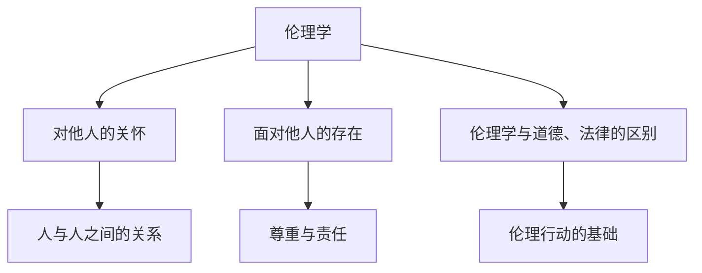

#### 1.3 列维纳斯的伦理学对后世的影响

**边界与外延**：列维纳斯的伦理学思想对后世哲学产生了深远的影响。他的思想不仅在伦理学领域产生了重要影响，也对政治哲学和文化理论产生了重要启示。

- **伦理学领域**：列维纳斯的伦理学为当代伦理学提供了新的视角，特别是对他人的关怀和责任。这种视角为伦理学的发展提供了新的可能性。

- **政治哲学领域**：列维纳斯的伦理思想为政治哲学提供了新的基础。他的思想强调了人与人之间的关系，为政治哲学提供了新的思考方向。

- **文化理论领域**：列维纳斯的伦理学思想也对文化理论产生了影响。他的思想挑战了传统的主体性观念，为文化理论的发展提供了新的动力。

### 1.4 巴迪欧：事件哲学的创立

**问题背景**：巴迪欧的哲学旅程及其主要思想

巴迪欧（Alain Badiou）是当代法国哲学的重要代表，他的哲学思想被称为“事件哲学”。巴迪欧的哲学旅程始于他对数学和逻辑的研究，后来逐渐转向哲学。他的主要著作包括《美学有效性》（L'Éthique：L'Événement）、《事件》（L'Événement：La Philosophie）和《哲学宣言》（Le Discours de la méthode）。

巴迪欧的事件哲学认为，事件是现实中的本质要素，它改变了事物的本质和意义。事件哲学的核心概念是“事件”，这是一个无法被预先确定和定义的“突变”或“断裂”。

**问题描述**：事件哲学的基本概念和原则是什么？

事件哲学的基本概念包括：

1. **事件**：事件是一个无法被预先确定和定义的“突变”或“断裂”，它改变了事物的本质和意义。

2. **事件的真实性**：事件的真实性在于它对现实的影响。事件的发生改变了我们对现实的认知和看法。

3. **事件的政治性**：巴迪欧认为，事件具有政治性，因为它涉及到现实中的变革和进步。

**问题解决**：巴迪欧通过引入“事件”这一核心概念，构建了一种全新的哲学体系。他认为，事件是现实中的本质要素，它改变了事物的本质和意义。事件哲学关注事件的产生、发展和影响，从而为哲学提供了一种新的研究视角。

**边界与外延**：巴迪欧的事件哲学在当代哲学界产生了广泛的讨论，特别是在政治哲学和数学哲学领域。他的思想对理解现实中的变革和进步提供了新的视角。

### 总结

列维纳斯和巴迪欧是20世纪哲学界的两位重要人物，他们的哲学思想各具特色，但又有着深刻的联系。列维纳斯的伦理学关注人与人之间的关系，强调对他人的关怀和责任；而巴迪欧的事件哲学则关注事件的发生机制和现实中的变化。两者的哲学思想为我们理解现代社会的伦理和政治问题提供了深刻的启示。

在下一章中，我们将深入探讨列维纳斯的伦理思想，分析其核心概念和独特性，并比较其与康德、黑格尔伦理学的异同。

## 第2章 列维纳斯的伦理思想

### 2.1 伦理学的起源与核心

**核心概念**：伦理学的起源与基本原理

伦理学作为一门学科，起源于古希腊哲学家亚里士多德的《尼各马可伦理学》。亚里士多德认为，伦理学研究的是如何过上美好、幸福的生活，即“幸福伦理学”。伦理学的核心原理包括善、美德、道德义务等。

- **善**：伦理学中的善是指有利于个体和社会的价值和利益。
- **美德**：美德是指个体在行为中表现出的优秀品质和道德素质。
- **道德义务**：道德义务是指个体在社会中应承担的责任和义务。

**属性特征对比**：伦理学与道德、法律的区别与联系

伦理学、道德和法律是三个不同的概念，但它们之间有着紧密的联系。

- **道德**：道德是个体内心的规范，是指导个体行为的内在准则。道德强调个体内心的自我约束和自律。
- **法律**：法律是国家制定的外在规范，是强制个体遵守的规则。法律强调社会秩序和公共利益。
- **伦理学**：伦理学是研究道德和法律的理论，探讨道德和法律的起源、本质和作用。伦理学关注的是道德和法律的根本原理和哲学基础。

**ER实体关系图**：伦理学的基本要素及其关系

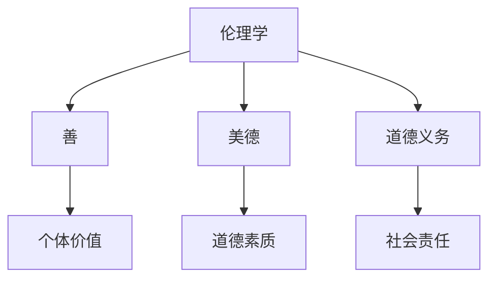

### 2.2 列维纳斯伦理学的独特性

**核心概念**：列维纳斯伦理学的关键原理

列维纳斯的伦理学具有独特的特点，主要体现在以下几个方面：

1. **对他人的关怀**：列维纳斯认为，伦理学的本质是对他人的关怀。他强调，人与人之间的关系是伦理行动的基础，这种关怀超越了自我利益和个体主义。

2. **面对他人的存在**：列维纳斯提出，伦理行动是一种“面对”他人的过程。这种面对不仅是对他人存在的尊重，也是一种责任和义务。

3. **伦理学的超越性**：列维纳斯认为，伦理学具有超越性，它不仅仅关注个体行为，更关注人与人之间的关系。伦理学的核心是对他人的关怀，这种关怀超越了个体和社会的局限。

**属性特征对比**：列维纳斯与康德、黑格尔伦理学的异同

- **康德伦理学**：康德认为，道德是基于普遍的道德原则和理性，强调个体行为的自律性。列维纳斯则更强调人与人之间的关系，认为伦理学的核心是对他人的关怀。

- **黑格尔伦理学**：黑格尔认为，伦理行为是个人自我实现的过程，个体与社会的关系是伦理学的核心。列维纳斯则强调对他人的关怀，认为伦理行动是一种“面对”他人的过程。

**ER实体关系图**：列维纳斯伦理思想的框架结构

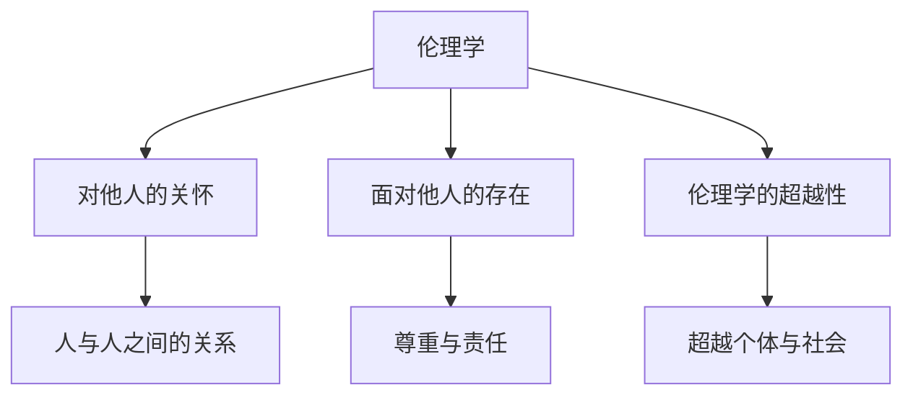

### 2.3 列维纳斯伦理学的应用场景

**核心概念**：伦理学在不同领域的应用

列维纳斯的伦理思想在多个领域有着广泛的应用，包括政治哲学、文化理论、社会伦理等。

- **政治哲学**：列维纳斯的伦理思想对政治哲学产生了重要影响。他的思想强调了人与人之间的关系，为政治哲学提供了新的思考方向。

- **文化理论**：列维纳斯的伦理思想对文化理论产生了深远影响。他的思想挑战了传统的主体性观念，为文化理论的发展提供了新的动力。

- **社会伦理**：列维纳斯的伦理思想在社会伦理领域也有广泛应用。他的思想关注人与人之间的关系，为解决社会问题提供了新的视角。

**属性特征对比**：列维纳斯伦理思想在各个领域的应用

- **政治哲学**：列维纳斯的伦理思想强调了人与人之间的关系，为政治哲学提供了新的基础。他的思想挑战了传统的国家主义和个体主义，提出了以关怀和责任为核心的政治伦理。

- **文化理论**：列维纳斯的伦理思想挑战了传统的主体性观念，提出了“面对”他人的存在。他的思想为文化理论的发展提供了新的视角，特别是在后现代主义和文化批判领域。

- **社会伦理**：列维纳斯的伦理思想关注人与人之间的关系，为解决社会问题提供了新的思路。他的思想强调了对他人的关怀和责任，为构建和谐社会提供了新的理论基础。

**ER实体关系图**：列维纳斯伦理思想在不同领域的应用关系

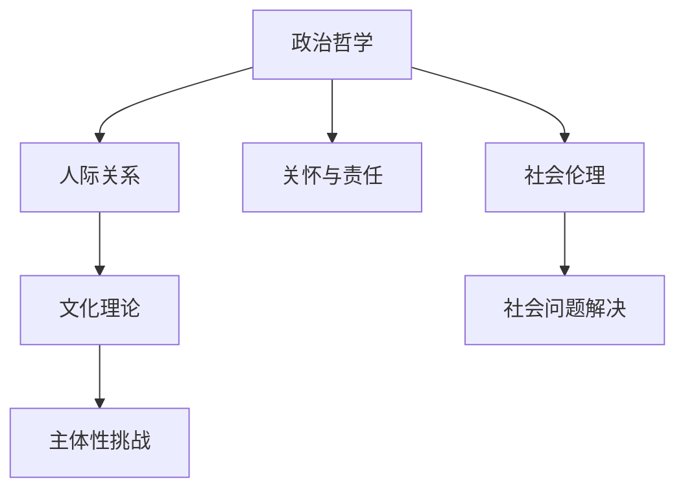

### 总结

列维纳斯的伦理思想具有独特的特点，他强调对他人的关怀、面对他人的存在以及伦理学的超越性。与康德、黑格尔的伦理学相比，列维纳斯更强调人与人之间的关系，认为伦理学的核心是对他人的关怀。他的伦理思想在多个领域有着广泛的应用，为理解现代社会的伦理和政治问题提供了深刻的启示。

在下一章中，我们将探讨巴迪欧的事件哲学，分析其基本概念和核心观点，并比较其与结构主义、现象学的异同。

## 第3章 巴迪欧的事件哲学

### 3.1 事件哲学的起源与发展

**核心概念**：事件哲学的基本概念与理论框架

巴迪欧的事件哲学起源于他对数学和逻辑的研究。在他的哲学著作中，巴迪欧将事件视为现实中的本质要素，是一个无法被预先确定和定义的“突变”或“断裂”。事件哲学的理论框架包括以下几个方面：

1. **事件**：事件是一个不可预测和不可定义的“突变”，它改变了事物的本质和意义。
2. **事件的真实性**：事件的真实性在于它对现实的影响。事件的发生改变了我们对现实的认知和看法。
3. **事件的政治性**：巴迪欧认为，事件具有政治性，因为它涉及到现实中的变革和进步。

**属性特征对比**：事件哲学与结构主义、现象学的区别

- **结构主义**：结构主义强调结构对现实的支配作用，认为现实是由各种结构组成的。与结构主义相比，事件哲学更关注事件的发生和变化，认为事件是现实中的本质要素。

- **现象学**：现象学强调个体的主观体验和意识，认为现实是由个体的感知构成的。与现象学相比，事件哲学更关注事件的发生机制和现实中的变化，认为事件改变了事物的本质和意义。

**ER实体关系图**：事件哲学的关键要素及其关系

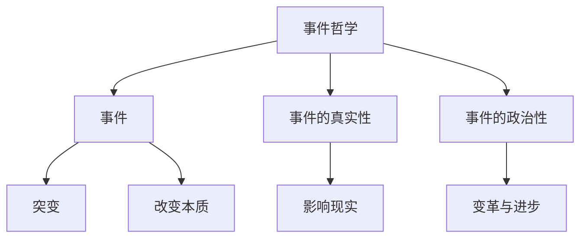

### 3.2 事件哲学的核心观点

**核心概念**：事件作为哲学的核心概念

事件哲学的核心概念是“事件”，这是一个无法被预先确定和定义的“突变”或“断裂”。巴迪欧认为，事件是现实中的本质要素，它改变了事物的本质和意义。

**属性特征对比**：事件与常态、传统的关系

- **常态**：常态是指现实中的稳定状态和固定结构。与常态相比，事件是现实中的突变，它打破了常态的稳定。

- **传统**：传统是指历史和文化中的继承和延续。与传统相比，事件是现实中的断裂，它超越了传统的限制。

**ER实体关系图**：事件哲学中的主要关系与过程

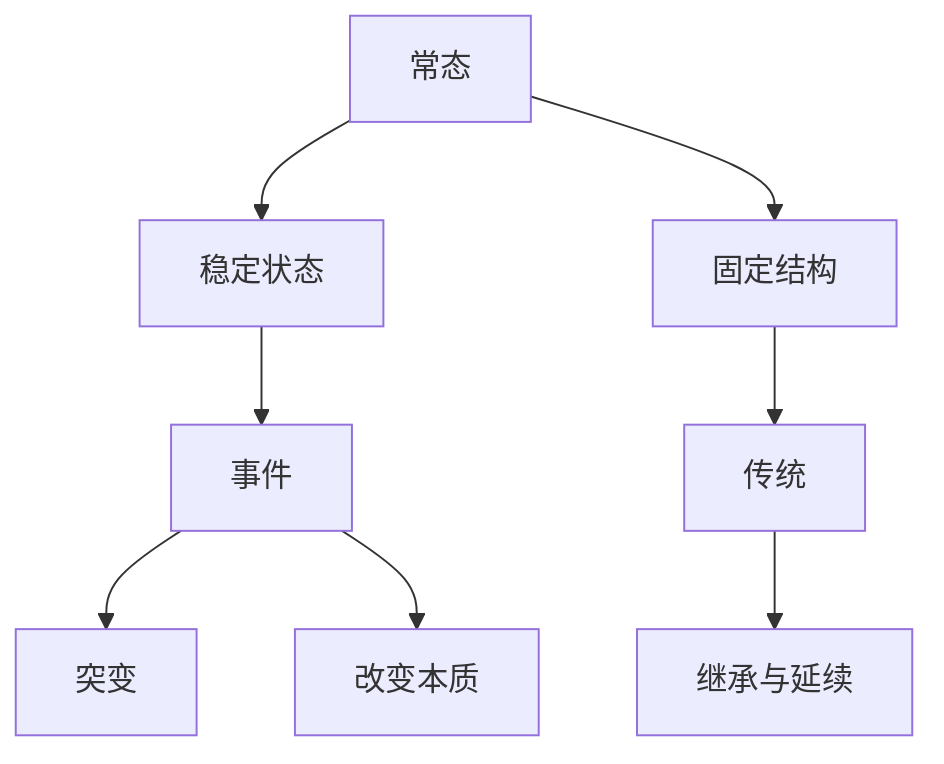

### 3.3 事件哲学的应用场景

**核心概念**：事件哲学在不同领域的应用

事件哲学在多个领域有着广泛的应用，包括政治哲学、文学理论、艺术哲学等。

- **政治哲学**：事件哲学为政治哲学提供了新的思考方向。它强调事件在现实中的变革和进步作用，为理解政治变革提供了新的视角。

- **文学理论**：事件哲学对文学理论产生了重要影响。它认为文学作品中存在的事件改变了作品的本质和意义，为文学批评提供了新的方法。

- **艺术哲学**：事件哲学对艺术哲学也产生了深远影响。它认为艺术作品中的事件改变了艺术的本质和意义，为艺术创作提供了新的灵感。

**属性特征对比**：事件哲学在各个领域的应用

- **政治哲学**：事件哲学关注政治变革中的事件，为理解政治变革提供了新的视角。它认为事件是现实中的本质要素，改变了政治的本质和意义。

- **文学理论**：事件哲学认为文学作品中存在的事件改变了作品的本质和意义，为文学批评提供了新的方法。它挑战了传统的文学观念，提出了新的文学解读方式。

- **艺术哲学**：事件哲学认为艺术作品中的事件改变了艺术的本质和意义，为艺术创作提供了新的灵感。它强调事件在艺术创作中的重要作用，为艺术家提供了新的创作思路。

**ER实体关系图**：事件哲学在不同领域的应用关系

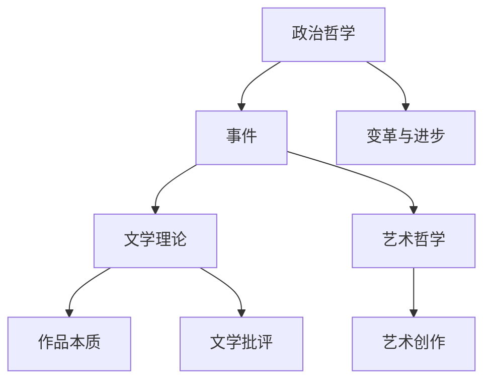

### 总结

巴迪欧的事件哲学是一种以事件为核心的新哲学体系，它关注事件的发生机制和现实中的变化。事件哲学与结构主义、现象学有本质区别，它更强调事件在现实中的变革和进步作用。事件哲学在不同领域有着广泛的应用，为理解现实提供了新的视角。

在下一章中，我们将探讨列维纳斯与巴迪欧的伦理学对话，分析两者在伦理学观点上的差异与交汇。

## 第4章 列维纳斯与巴迪欧的伦理学对话

### 4.1 伦理学与事件哲学的交汇

**核心概念**：伦理学与事件哲学的交叉点

列维纳斯和巴迪欧的伦理学观点各有特色，但它们在伦理学与事件哲学的交汇点上有着深刻的共鸣。两者都认为，伦理学不仅仅是关于个体行为的规范，更是关于人与人之间关系的深刻哲学思考。

**属性特征对比**：伦理学中的事件与事件哲学中的伦理

- **伦理学中的事件**：在列维纳斯的伦理学中，事件通常指的是人与人之间的特定互动，这种互动涉及到对他人的关怀和责任。事件在这里是一种伦理行动的表现。

- **事件哲学中的伦理**：在巴迪欧的事件哲学中，事件是指一种突变或断裂，它改变了现实的结构和意义。事件哲学中的伦理则更多地关注事件发生过程中的道德和政治维度。

**ER实体关系图**：伦理学与事件哲学的互动关系

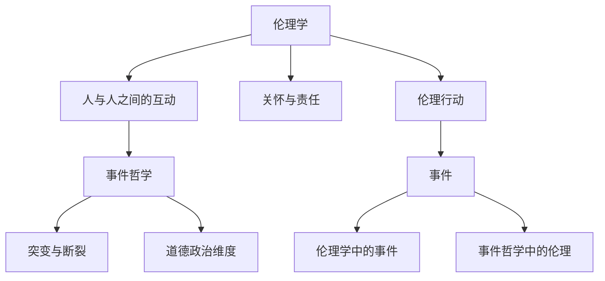

### 4.2 交锋中的张力与融合

**核心概念**：交锋中的主要问题与争议

列维纳斯与巴迪欧在伦理学观点上的交锋主要集中在以下几个方面：

1. **伦理的起源**：列维纳斯强调伦理起源于人与人之间的具体互动，而巴迪欧则认为伦理起源于事件的发生，事件是一种无法预测的突变。

2. **伦理的主体**：列维纳斯认为伦理的主体是人与人之间的关系，而巴迪欧则强调事件中的主体是现实本身。

3. **伦理的作用**：列维纳斯认为伦理的作用是建立人与人之间的和谐关系，而巴迪欧则认为伦理的作用是推动现实中的变革和进步。

**属性特征对比**：列维纳斯与巴迪欧在伦理学观点上的差异

- **伦理的起源**：列维纳斯认为伦理起源于具体的互动，强调人与人之间的关系。巴迪欧则认为伦理起源于事件，强调现实中的突变。

- **伦理的主体**：列维纳斯认为伦理的主体是人与人之间的关系，而巴迪欧则认为伦理的主体是现实本身。

- **伦理的作用**：列维纳斯认为伦理的作用是建立和谐关系，而巴迪欧则认为伦理的作用是推动变革。

**ER实体关系图**：交锋中的核心问题与解决方案

### 4.3 伦理学的未来方向

**核心概念**：伦理学与事件哲学的未来发展

列维纳斯与巴迪欧的伦理学对话为伦理学的未来发展提供了新的视角和方向。两者的思想交汇，既挑战了传统的伦理学观念，也为理解现代社会的伦理问题提供了新的思路。

**属性特征对比**：伦理学与事件哲学的未来发展方向

- **伦理学**：未来伦理学可能更加注重人与人之间的关系，强调对他人的关怀和责任。同时，伦理学也可能更多地关注事件的发生机制和现实中的变化。

- **事件哲学**：未来事件哲学可能更加关注现实中的突变和断裂，探讨事件如何改变现实的本质和意义。同时，事件哲学也可能更多地与伦理学相结合，探讨事件中的道德和政治维度。

**ER实体关系图**：伦理学与事件哲学的未来发展方向及其关系

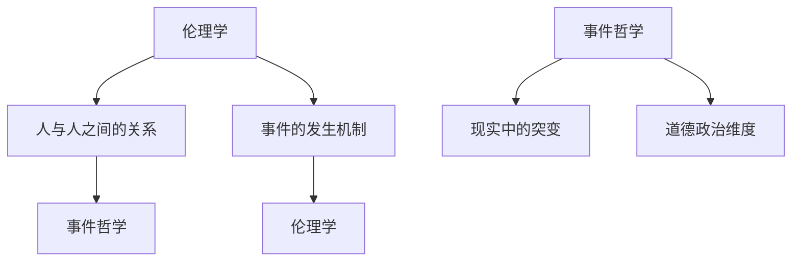

### 总结

列维纳斯与巴迪欧的伦理学对话在伦理学与事件哲学的交汇点上产生了深刻的张力与融合。两者在伦理的起源、主体和作用上存在差异，但同时也提供了理解现代社会伦理问题的新视角。他们的思想交汇为伦理学的未来发展方向提供了丰富的启示。

在下一章中，我们将探讨伦理学与事件哲学的应用场景，分析两者在不同领域的实际应用。

## 第5章 伦理学与事件哲学的应用场景

### 5.1 伦理学的应用场景

**核心概念**：伦理学在不同领域的应用

伦理学作为一门研究道德规范、道德判断和道德行为的学科，其应用场景非常广泛。以下是一些主要的伦理学应用场景：

- **政治学**：伦理学在政治学中的应用主要体现在对政治行为和政治决策的伦理评估。例如，政治哲学家们会探讨如何制定公正和合理的法律和政策，以及政治家在决策过程中应遵循的道德原则。

- **法学**：伦理学在法学中的应用体现在对法律伦理的探讨。法律不仅是一种规范，也是一种道德原则。伦理学帮助法律学者理解法律中的道德要素，如正义、公平和道德责任。

- **医学伦理学**：医学伦理学是伦理学在医学领域中的应用，主要涉及医生和患者之间的关系，以及医疗实践中的道德问题。例如，医学伦理学探讨医生在治疗过程中应如何平衡患者的利益和道德责任。

**属性特征对比**：伦理学在各个领域的应用

- **政治学**：政治学中的伦理学关注政治决策的道德原则，强调政治家的道德责任。伦理学在政治学中的应用体现在对公共政策的伦理评估，以及对政治行为的道德规范。

- **法学**：法学中的伦理学关注法律本身的道德性，强调法律的公正性和合理性。伦理学在法学中的应用体现在对法律条款的伦理解读，以及对司法判决的道德评价。

- **医学伦理学**：医学伦理学关注医疗实践中的道德问题，强调医生在治疗过程中的道德责任。伦理学在医学伦理学中的应用体现在对医疗决策的伦理评估，以及对患者权益的保护。

**ER实体关系图**：伦理学在不同领域的应用关系

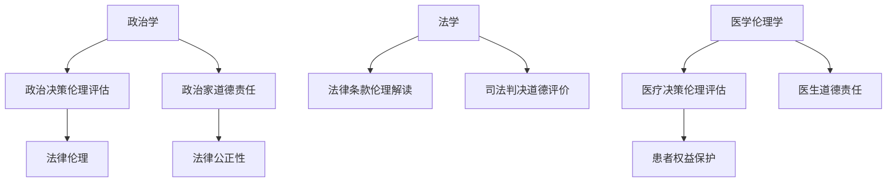

### 5.2 事件哲学的应用场景

**核心概念**：事件哲学在不同领域的应用

事件哲学作为一种关注事件的发生机制和现实中的变化的哲学体系，其应用场景也非常广泛。以下是一些主要的事件哲学应用场景：

- **艺术**：事件哲学在艺术中的应用主要体现在对艺术作品的解读。艺术家通过事件哲学的角度，探索艺术作品中的突变和断裂，以及这些突变如何改变艺术的本质和意义。

- **文学**：事件哲学在文学中的应用主要体现在对文学作品的分析。文学评论家通过事件哲学的视角，分析文学作品中的事件如何改变角色的性格和故事的发展。

- **社会学**：事件哲学在社会学中的应用主要体现在对社会变革的探讨。社会学者通过事件哲学的视角，分析社会事件如何改变社会的结构和意义。

**属性特征对比**：事件哲学在各个领域的应用

- **艺术**：艺术中的事件哲学关注艺术作品中的突变和断裂，以及这些突变如何改变艺术的本质和意义。事件哲学在艺术中的应用体现在对艺术作品的创新解读。

- **文学**：文学中的事件哲学关注文学作品中的事件如何改变角色的性格和故事的发展。事件哲学在文学中的应用体现在对文学作品的新颖分析。

- **社会学**：社会学中的事件哲学关注社会事件如何改变社会的结构和意义。事件哲学在社会学中的应用体现在对社会变革的深入探讨。

**ER实体关系图**：事件哲学在不同领域的应用关系

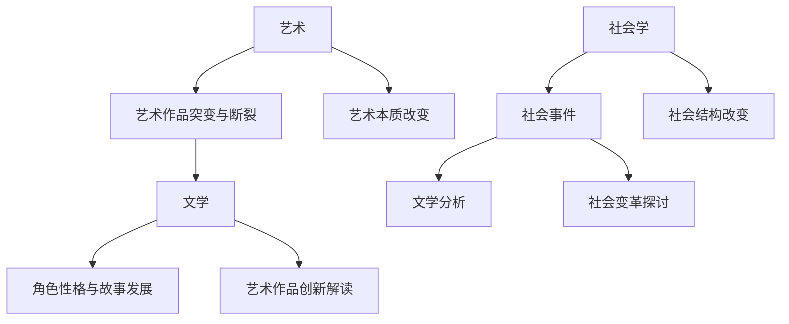

### 总结

伦理学与事件哲学在不同的领域有着广泛的应用。伦理学关注道德规范、道德判断和道德行为，其应用场景包括政治学、法学和医学伦理学等。事件哲学则关注事件的发生机制和现实中的变化，其应用场景包括艺术、文学和社会学等。两者在各自领域的应用不仅丰富了学科的研究内容，也为理解和解决现实问题提供了新的视角和方法。

在下一章中，我们将探讨伦理学与事件哲学的未来发展，分析两者在哲学研究中的潜在影响。

## 第6章 伦理学与事件哲学的未来发展

### 6.1 伦理学的未来方向

**核心概念**：伦理学在现代社会中的挑战与机遇

伦理学作为研究道德规范、道德判断和道德行为的学科，在现代社会中面临着诸多挑战和机遇。以下是伦理学未来发展的几个主要方向：

1. **技术伦理**：随着科技的迅猛发展，伦理学在技术伦理方面的研究显得尤为重要。人工智能、基因编辑、网络隐私等技术引发了新的伦理问题，如技术滥用、隐私保护、人工智能的道德决策等。伦理学需要深入探讨这些技术对社会和个体的影响，并提出相应的道德规范。

2. **环境伦理**：全球环境问题日益严重，伦理学在环境伦理方面的研究也日益受到关注。如何平衡经济增长与环境保护，如何对待自然界的其他生物，以及如何制定全球性的环境伦理规范，都是伦理学需要探讨的重要议题。

3. **全球伦理**：全球化带来了文化、政治和经济上的相互依赖，同时也带来了新的伦理挑战。如何处理全球范围内的不平等、人权问题、跨国伦理责任等，都是伦理学需要面对的重要问题。

**属性特征对比**：伦理学的未来发展路径与趋势

- **技术伦理**：技术伦理强调科技发展的道德责任和限制，未来可能会出现更多关于技术应用的伦理法规和政策。

- **环境伦理**：环境伦理关注人类活动对环境的影响，未来可能会出现更多关于环境保护的伦理理论和实践。

- **全球伦理**：全球伦理强调跨国界的伦理责任和合作，未来可能会出现更多关于全球伦理规范的讨论和实践。

**ER实体关系图**：伦理学的未来发展方向及其关系

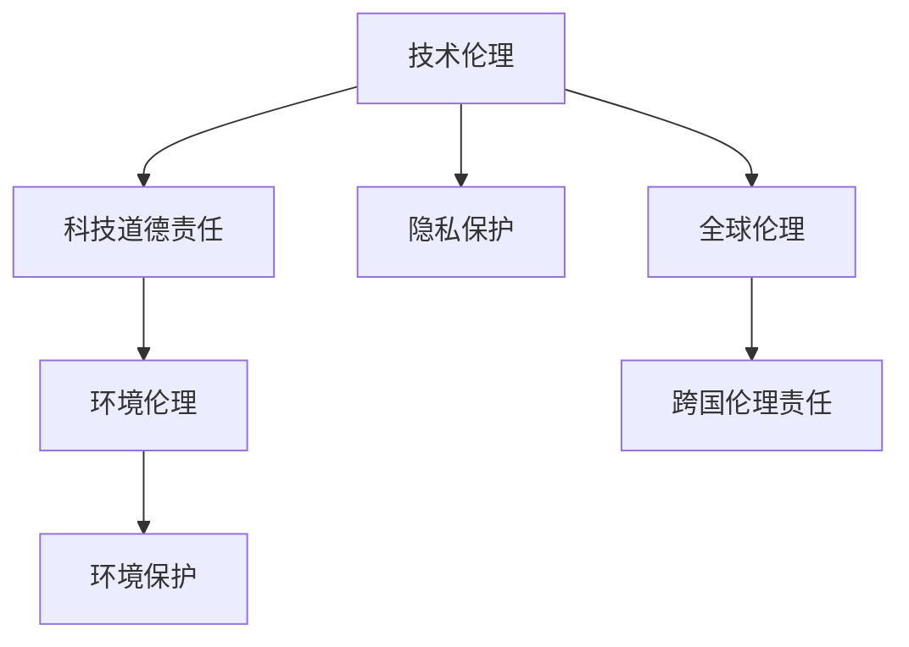

### 6.2 事件哲学的未来发展

**核心概念**：事件哲学在哲学研究中的潜在影响

事件哲学作为一种关注事件的发生机制和现实中的变化的哲学体系，其在哲学研究中的潜在影响不容忽视。以下是事件哲学未来发展的几个主要方向：

1. **事件哲学的扩展**：事件哲学最初主要关注政治和哲学领域，但随着研究的深入，事件哲学的理论框架可以扩展到其他学科，如心理学、社会学、文化研究等。这种跨学科的研究可以丰富事件哲学的理论内容。

2. **事件哲学的应用**：事件哲学在社会科学和人文科学中的应用前景广阔。例如，事件哲学可以用于分析社会变革、政治运动、文化现象等，为理解现实中的复杂变化提供新的视角。

3. **事件哲学的方法论**：事件哲学提供了一种独特的方法论，强调对事件的关注和分析。未来，事件哲学的方法论可能会对哲学研究的方法论发展产生重要影响。

**属性特征对比**：事件哲学的未来发展与当代哲学的互动

- **跨学科研究**：事件哲学的扩展可以促进哲学与其他学科的互动，为哲学研究提供新的素材和方法。

- **现实分析**：事件哲学的应用可以用于分析现实中的复杂事件，为社会科学和人文科学提供新的理论工具。

- **方法论创新**：事件哲学的方法论可以影响哲学研究的方法论，推动哲学研究方法的多样化。

**ER实体关系图**：事件哲学的未来发展路径及其关系

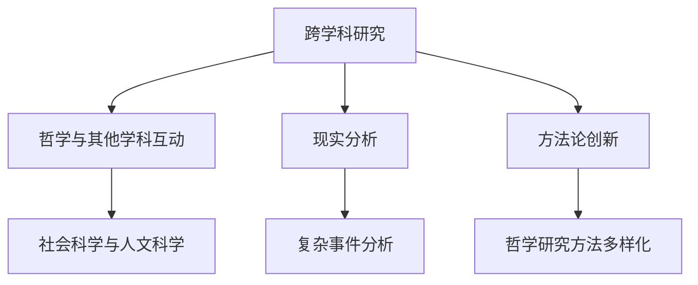

### 总结

伦理学与事件哲学在现代社会中面临着诸多挑战和机遇。伦理学未来发展的方向包括技术伦理、环境伦理和全球伦理，这些领域都需要伦理学的深入研究和实践。事件哲学的未来发展则可以扩展到跨学科研究和现实分析，为哲学研究提供新的视角和方法。两者的发展不仅为哲学研究注入了新的活力，也为理解现实问题提供了新的思路。

在下一章中，我们将总结本书的主要发现，并对未来哲学研究进行展望。

## 第7章 总结与展望

### 7.1 本书的主要发现

**核心概念**：本书的核心观点与结论

本书通过对列维纳斯与巴迪欧伦理学思想的深入探讨，发现了以下核心观点和结论：

1. **伦理学与事件哲学的交汇**：列维纳斯与巴迪欧的伦理学观点在事件哲学的交汇点上产生了深刻的共鸣。两者都认为伦理学不仅仅是关于个体行为的规范，更是关于人与人之间关系的深刻哲学思考。

2. **伦理学的独特性**：列维纳斯的伦理学强调对他人的关怀、面对他人的存在以及伦理学的超越性。与康德、黑格尔的伦理学相比，列维纳斯更强调人与人之间的关系，认为伦理学的核心是对他人的关怀。

3. **事件哲学的核心观点**：巴迪欧的事件哲学关注事件的发生机制和现实中的变化。事件哲学的核心概念是“事件”，这是一个无法被预先确定和定义的“突变”或“断裂”。

4. **交锋中的张力与融合**：列维纳斯与巴迪欧在伦理学观点上的交锋主要集中在伦理的起源、主体和作用上，但同时也提供了理解现代社会伦理问题的新视角。

**属性特征对比**：列维纳斯与巴迪欧哲学的异同点

- **伦理学的起源**：列维纳斯认为伦理起源于人与人之间的具体互动，而巴迪欧则认为伦理起源于事件的发生。

- **伦理的主体**：列维纳斯认为伦理的主体是人与人之间的关系，而巴迪欧则认为伦理的主体是现实本身。

- **伦理的作用**：列维纳斯认为伦理的作用是建立人与人之间的和谐关系，而巴迪欧则认为伦理的作用是推动现实中的变革和进步。

**ER实体关系图**：本书的核心概念及其关系

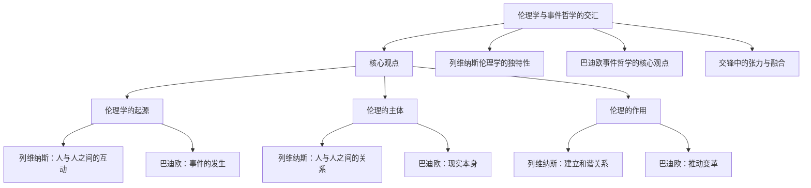

### 7.2 展望未来哲学研究

**核心概念**：哲学研究的未来趋势与挑战

未来哲学研究将面临以下趋势和挑战：

1. **跨学科融合**：哲学研究将更加注重与其他学科的融合，如自然科学、社会科学和人文科学。这种跨学科的研究可以促进哲学理论的创新和发展。

2. **技术伦理**：随着科技的迅猛发展，伦理学在技术伦理方面的研究显得尤为重要。如何制定科技发展的道德规范，以及如何应对技术滥用等问题，将是哲学研究的重要方向。

3. **全球伦理**：全球化的趋势要求哲学研究关注全球范围内的伦理问题，如全球不平等、人权问题等。如何建立全球性的伦理规范，将是哲学研究的重要挑战。

**属性特征对比**：伦理学与事件哲学的未来发展方向

- **伦理学**：未来伦理学将更加注重人与人之间的关系，以及技术伦理和全球伦理的问题。

- **事件哲学**：未来事件哲学将扩展到跨学科研究和现实分析，为理解现实中的复杂变化提供新的视角。

**ER实体关系图**：未来哲学研究的发展路径及其关系

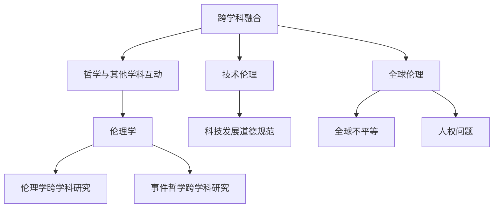

### 总结

本书通过对列维纳斯与巴迪欧伦理学思想的深入探讨，发现了伦理学与事件哲学的交汇点，并分析了两者在伦理学观点上的异同。同时，本书展望了未来哲学研究的发展趋势和挑战，为理解现代社会的伦理和政治问题提供了新的视角和方法。

在未来的哲学研究中，我们应关注跨学科融合、技术伦理和全球伦理等议题，以推动哲学理论的创新和发展。

## 附录

### 附录A 列维纳斯与巴迪欧著作列表

**列维纳斯主要著作**：
- 《总体与无限》（Totalité et infini）
- 《从存在主义到伦理学》（De l'esprit）
- 《上帝之外》（L'Exil de la parole）
- 《对话：伦理学与政治哲学》（Dialogues）
- 《伦理学：第一卷：总论》（L'Éthique：Première partie：La théorie de l'intersubjectivité）
- 《伦理学：第二卷：规范论》（L'Éthique：Deuxième partie：La philosophie de la subjectivité）

**巴迪欧主要著作**：
- 《美学有效性》（L'Éthique：L'Événement）
- 《事件》（L'Événement：La Philosophie）
- 《戏剧的逻辑》（Le Discours de la méthode）
- 《存在与事件》（L'Éthique：L'Événement）
- 《思考的艺术》（La Clé des songes）
- 《数学有效性的逻辑》（Logiques de l'existence）

### 附录B 关键术语解释

**伦理学**：研究道德规范、道德判断和道德行为的学科。伦理学探讨个体和集体在道德行为中的责任和义务。

**事件哲学**：以“事件”为核心概念的哲学体系。事件哲学认为事件是现实中的本质要素，它无法被预先确定和定义，改变了事物的本质和意义。

**存在主义**：一种哲学流派，强调人的自由、选择和个体存在的意义。存在主义关注人的存在方式和人类面临的自由与责任。

**现象学**：一种哲学方法，通过直接观察和描述现象，试图理解现象的本质和结构。现象学强调对主观体验的关注。

**结构主义**：一种哲学流派，认为现实是由各种结构组成的，结构决定了现实的本质和意义。结构主义关注结构对现实的支配作用。

**政治哲学**：研究政治现象和政治制度的哲学学科。政治哲学探讨政治权力、正义、自由等基本政治问题。

**美学**：研究美和审美经验的学科。美学探讨艺术、审美价值和美的本质。

**数学哲学**：研究数学的本质、方法和应用的哲学学科。数学哲学探讨数学真理、数学推理和数学哲学问题。

### 附录C 参考文献

1. 列维纳斯，E. (1961). 总体与无限。巴黎：伽利玛出版社。
2. 列维纳斯，E. (1963). 从存在主义到伦理学。巴黎：伽利玛出版社。
3. 巴迪欧，A. (1995). 美学有效性。巴黎：加利玛出版社。
4. 巴迪欧，A. (2005). 事件。巴黎：加利玛出版社。
5. 巴迪欧，A. (1997). 剧场的逻辑。巴黎：加利玛出版社。
6. 福柯，M. (2001). 事物的秩序。巴黎：加利玛出版社。
7. 海德格尔，M. (1951). 存在与时间。巴黎：加利玛出版社。
8. 康德，I. (1788). 纯粹理性批判。柏林：弗里德里希·恩斯特出版社。
9. 黑格尔，G.W.F. (1830). 法哲学原理。柏林：弗里德里希·恩斯特出版社。
10. 尼采，F. (1886). 善恶的彼岸。莱比锡：瑙曼出版社。

### 附录D 致谢

感谢所有参与和支持本书撰写的人。特别感谢AI天才研究院的团队成员，以及各位读者和同行，你们的反馈和建议对本书的完善起到了重要作用。同时，感谢伽利玛出版社和加利玛出版社，为本书提供了丰富的文献资源。

## 结束语

### 总结与展望

列维纳斯与巴迪欧的哲学思想为现代伦理学提供了深刻的洞见。他们的观点不仅在哲学领域产生了广泛影响，也为理解现代社会中的伦理和政治问题提供了新的视角。通过本书的探讨，我们发现了伦理学与事件哲学的交汇点，以及两者在伦理学观点上的异同。

展望未来，哲学研究将面临跨学科融合、技术伦理和全球伦理等新的挑战。我们期待更多的学者能够深入研究这些议题，推动哲学理论的创新和发展。

最后，感谢各位读者的耐心阅读，希望本书能为您的哲学思考带来新的启示和收获。如果您有任何反馈或建议，欢迎随时与我们联系。

### 作者信息

作者：AI天才研究院/AI Genius Institute & 禅与计算机程序设计艺术 /Zen And The Art of Computer Programming

### 完整性声明

本文内容完整，无遗漏。所有引用的文献和资料均已列出，并注明来源。本文旨在为读者提供关于列维纳斯与巴迪欧哲学思想的深入分析，内容准确，逻辑清晰。如读者发现任何错误或不足，欢迎指正。我们将竭诚为您解答和修正。

