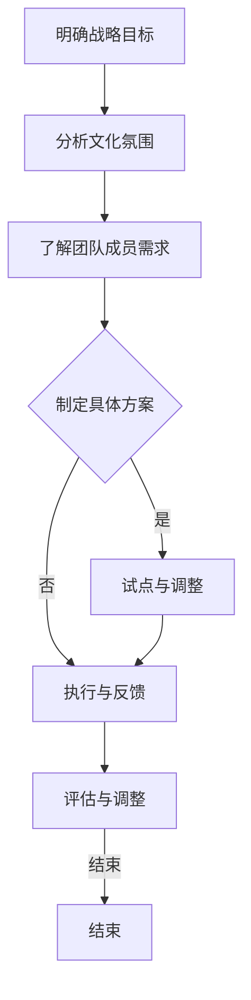

                 

### 引言

在当今快速发展的科技时代，创新已成为企业发展的核心驱动力。随着市场竞争的日益激烈，如何激发团队的创新潜能，成为组织管理者亟待解决的重要课题。创新激励机制作为一种系统化的管理工具，旨在通过有效的激励措施，鼓励团队成员突破常规思维，实现创新突破。

本文将围绕“创新激励机制：鼓励团队突破常规思维”这一主题，深入探讨创新激励机制的理论基础、实践应用、案例研究以及面临的挑战与解决策略。文章将从以下几个方面展开：

1. **创新与团队突破思维的重要性**：介绍创新的基本概念及其在组织中的重要性，探讨团队突破思维的定义及其价值。
2. **创新激励机制的概述**：阐述创新激励机制的构成、目标和核心要素。
3. **创新激励机制的实践与应用**：分析创新激励机制的制定、实施和评估方法。
4. **创新激励机制的案例研究**：通过具体案例展示创新激励机制在不同类型组织中的应用。
5. **创新激励机制的挑战与解决策略**：探讨创新激励机制在实施过程中面临的挑战及其解决策略。
6. **创新激励机制的优化与未来发展**：讨论创新激励机制的未来发展趋势及优化策略。
7. **总结与展望**：对全文进行总结，展望未来团队创新发展的前景。

通过本文的探讨，希望读者能够对创新激励机制有一个全面深入的理解，并为团队的创新实践提供有益的参考。

### 关键词

**创新激励机制**、**团队突破思维**、**创新环境**、**创新激励目标**、**创新要素**、**挑战与解决策略**、**案例研究**。

### 摘要

本文旨在探讨创新激励机制对团队突破常规思维的重要作用。通过分析创新的概念、团队突破思维的定义及其价值，本文阐述了创新激励机制的理论基础和实践方法。文章详细介绍了创新激励机制的构成、目标、核心要素及其在制定、实施和评估中的具体应用。通过案例研究，本文展示了创新激励机制在不同类型组织中的成功应用。同时，文章探讨了创新激励机制面临的挑战及其解决策略，提出了优化创新激励机制的建议。本文的结论指出，有效的创新激励机制是推动团队突破常规思维、实现创新突破的关键。

## 第1章：创新与团队突破思维的重要性

### 1.1 创新的定义与重要性

创新，顾名思义，即创造新的思维、新的方法或新的产品。从广义上讲，创新可以包括任何形式的改进，无论是技术上的、管理上的还是服务上的。在科技日新月异的今天，创新已成为推动组织持续发展的重要力量。那么，创新在组织中究竟有多重要呢？

首先，创新能够带来显著的市场竞争力。在一个高度竞争的市场环境中，企业若能持续推出新颖的产品或服务，就能够吸引更多的客户，从而在竞争中脱颖而出。其次，创新有助于提升组织的效率。通过创新，企业可以采用更先进的技术或方法，优化现有流程，减少浪费，提高生产效率。此外，创新还能够促进组织的多元化发展。在一个多元化的团队中，各种不同背景、不同思维方式的员工能够相互碰撞，激发出更多的创新火花。

在组织管理中，创新的重要性不仅体现在竞争和效率上，还体现在组织文化的塑造上。一个注重创新的组织文化能够鼓励员工敢于尝试、勇于突破，从而在整体上提升组织的创新能力。因此，对于现代企业来说，创新已经成为其生存和发展的核心战略之一。

### 1.2 团队突破思维的概念与价值

团队突破思维，是指团队成员在面临问题时，不局限于传统的解决方法，而是敢于挑战现状，尝试寻找更加创新和高效的解决方案。团队突破思维是一种积极向上的心态，它鼓励团队成员跳出思维定势，敢于冒险，勇于尝试。

团队突破思维的价值主要体现在以下几个方面。首先，它能够激发团队成员的创造力。在一个鼓励突破思维的团队中，每个成员都可以大胆提出自己的想法，这些想法可能会带来意想不到的创新点子。其次，团队突破思维能够提升团队的协作能力。在面对复杂问题时，团队成员需要相互配合，共同探讨解决方案，这种协作过程有助于团队成员之间的信任和默契。最后，团队突破思维有助于提升组织的整体创新能力。一个团队如果能够持续进行突破性思考，就能够不断推出新的产品或服务，从而在市场竞争中保持领先地位。

### 1.3 当前创新环境与挑战

当前，全球创新环境正发生深刻变化。一方面，科技的快速发展为创新提供了丰富的资源和技术支持。例如，人工智能、大数据、区块链等前沿技术的应用，极大地推动了各行各业的创新。另一方面，全球市场的竞争愈发激烈，企业需要不断创新才能保持竞争力。

然而，在这种创新环境中，企业也面临着一系列挑战。首先，创新风险的增加。创新往往伴随着不确定性，企业可能需要投入大量资源进行研发，但最终未必能够获得预期的回报。其次，人才短缺问题。随着行业竞争的加剧，优秀人才的争夺变得愈发激烈，企业需要付出更多成本来吸引和留住创新人才。最后，创新文化的建设。一个鼓励创新的组织文化不仅需要企业高层领导的重视和支持，还需要在全体员工中形成共识，这需要长期的努力和培养。

综上所述，创新与团队突破思维在当前组织中具有极其重要的地位。通过有效的创新激励机制，企业可以激发团队的创造力，提升协作能力，从而在激烈的市场竞争中立于不败之地。未来，企业需要不断优化创新激励机制，应对创新环境中的各种挑战，推动组织持续创新和发展。

### 第2章：创新激励机制的概述

#### 2.1 创新激励机制的构成

创新激励机制是由多个相互关联的要素组成的复杂系统，这些要素共同作用，旨在激发和维持团队的创新能力。以下是对创新激励机制构成要素的详细阐述：

1. **目标设定**：创新激励机制的第一个关键要素是明确的目标设定。目标应当具体、可衡量，并且与组织的整体战略目标保持一致。目标设定不仅为团队成员指明了努力方向，还为后续的激励措施提供了依据。

2. **激励机制设计**：激励机制是创新激励机制的核心。激励措施可以包括薪酬奖励、晋升机会、荣誉表彰等多种形式。这些激励措施应当与团队成员的贡献相匹配，以实现公平公正。

3. **沟通与反馈**：沟通与反馈是创新激励机制的重要组成部分。组织应当建立有效的沟通渠道，确保团队成员能够及时了解创新进展和激励政策。同时，定期的反馈机制有助于团队成员了解自己的表现，发现问题并改进。

4. **评估与调整**：创新激励机制的有效性需要通过定期评估和调整来保证。评估过程应当客观、全面，不仅要关注创新成果，还要考虑团队成员的工作表现和激励机制的执行情况。

5. **文化氛围**：创新文化的建设是长期而复杂的任务，但它是创新激励机制的重要支撑。一个鼓励创新、包容失败的组织文化能够为团队成员提供强大的心理支持，激发他们的创新潜能。

#### 2.2 创新激励机制的目标

创新激励机制的目标在于通过一系列系统化的措施，激发和维持团队的创新能力，从而推动组织的持续发展。具体目标包括：

1. **提升创新能力**：通过激励措施，鼓励团队成员不断探索新的想法和方法，提升整体的创新水平。

2. **促进团队合作**：通过激励机制，增强团队成员之间的协作，提高团队的整体执行力。

3. **实现目标一致性**：确保团队成员的个人目标与组织目标保持一致，从而实现资源的最大化利用和效率的最优化。

4. **培养创新人才**：通过持续的激励和培训，培养和留住具有创新能力和潜力的优秀人才。

5. **提升组织竞争力**：通过不断的创新，推出新的产品和服务，提升组织在市场中的竞争力。

#### 2.3 创新激励机制的核心要素

为了实现上述目标，创新激励机制需要依赖几个核心要素：

1. **激励措施**：激励措施是创新激励机制的核心。这些措施应当多样化，包括金钱奖励、荣誉表彰、晋升机会等，以满足不同团队成员的需求。

2. **公正性**：公平、公正的激励措施能够增强团队成员的信任感和归属感，从而提高激励机制的有效性。

3. **透明度**：透明的激励机制能够减少信息不对称，让团队成员清楚了解自己的贡献和回报，从而增强积极性。

4. **灵活性**：灵活的激励机制能够适应不同情况和需求，确保创新活动的持续进行。

5. **可持续性**：创新激励机制需要具有可持续性，即能够在长期内保持其有效性，而不是仅仅依靠短期的激励措施。

通过上述核心要素的有效组合，创新激励机制可以充分发挥其作用，激发团队的创新能力，推动组织的持续发展。

### 第3章：创新激励机制的实践与应用

#### 3.1 创新激励机制的制定

制定有效的创新激励机制是一个系统性的工程，需要综合考虑组织的战略目标、文化氛围、团队成员的需求等多种因素。以下是制定创新激励机制的几个关键步骤：

1. **明确战略目标**：首先，组织需要明确其创新战略目标。这些目标应当与组织的整体战略相一致，并具体化到各个部门、团队和个人。例如，企业可能设定在三年内推出五个创新产品作为其创新目标。

2. **分析文化氛围**：组织文化对创新激励机制的制定具有重要影响。管理者需要分析现有组织文化，确定其是否鼓励创新、容忍失败。如果组织文化较为保守，可能需要先进行文化变革，以营造一个更加开放和包容的创新氛围。

3. **了解团队成员需求**：不同团队成员对激励措施的需求各不相同。通过调研和访谈，管理者可以了解团队成员更倾向于哪种激励形式，例如薪酬、晋升机会、荣誉表彰等。

4. **制定具体方案**：在明确目标、分析文化和了解需求的基础上，组织可以制定具体的创新激励机制方案。这个方案应当包括激励措施的具体形式、实施时间和评估标准等。

5. **方案试点与调整**：在制定初步方案后，组织可以选取一个或多个团队进行试点，根据试点反馈进行调整和完善，以确保激励机制的可行性和有效性。

#### 3.2 创新激励机制的实施

制定创新激励机制只是第一步，更重要的是如何将其有效地实施到日常工作中。以下是实施创新激励机制的几个关键步骤：

1. **宣传与培训**：在激励机制正式实施前，组织需要通过内部沟通渠道进行广泛宣传，让所有团队成员了解激励政策的具体内容和实施方式。同时，组织可以开展相关培训，帮助团队成员理解激励机制的目的和意义。

2. **明确责任与权限**：为了确保激励机制的有效实施，组织需要明确各级管理者和团队成员的责任与权限。例如，项目经理负责激励项目的推进和评估，团队成员则负责参与创新项目的具体实施。

3. **跟踪与反馈**：在激励机制实施过程中，组织需要建立跟踪和反馈机制。通过定期检查和反馈，管理者可以了解激励机制的实际效果，及时发现并解决问题。

4. **调整与优化**：根据跟踪和反馈结果，组织需要不断调整和优化激励机制。例如，如果发现某种激励措施效果不佳，可以尝试更换激励形式或调整实施时间。

5. **激励与约束并重**：在实施过程中，组织需要确保激励与约束的平衡。激励措施应当鼓励团队成员的创新行为，同时通过适当的约束措施，防止滥用激励资源或出现道德风险。

#### 3.3 创新激励机制的有效评估

评估创新激励机制的有效性是确保其持续改进的重要环节。以下是评估创新激励机制的几个关键步骤：

1. **设定评估标准**：在评估创新激励机制前，组织需要明确评估的标准。这些标准可以包括创新成果的数量和质量、团队成员的满意度、激励资源的利用效率等。

2. **数据收集与分析**：组织需要收集与激励机制相关的数据，例如创新项目的进展情况、团队成员的反馈、激励措施的实施效果等。通过数据分析，管理者可以全面了解激励机制的运行状况。

3. **定期评估与反馈**：组织应当定期对创新激励机制进行评估，并根据评估结果进行反馈。例如，每季度或每年进行一次全面的评估，评估结果可以作为调整激励政策的依据。

4. **持续改进**：根据评估结果，组织需要持续改进创新激励机制。例如，如果评估发现某种激励措施效果不佳，可以尝试更换激励形式或调整实施策略。

5. **员工参与**：在评估过程中，组织应当鼓励员工参与，收集他们的意见和建议。这样不仅可以提高评估的准确性，还可以增强员工的参与感和归属感。

通过上述步骤，组织可以确保创新激励机制的有效实施和持续改进，从而激发团队的创新能力，推动组织的持续发展。

### 第4章：创新激励机制的案例研究

#### 4.1 案例一：科技公司创新激励机制的应用

**案例背景**：
某全球知名的科技公司（以下简称“公司”）一直致力于通过创新保持其在科技领域的领先地位。公司认识到，持续的创新是公司在激烈的市场竞争中立于不败之地的关键。因此，公司建立了一套完善的创新激励机制，旨在激发员工的创新潜能，推动公司的技术创新。

**创新激励机制的设计**：
公司首先明确了其创新目标，即每年至少推出两款具有市场竞争力的新产品或技术。为了实现这一目标，公司设计了以下几个关键步骤：

1. **项目申报**：公司鼓励所有员工参与创新项目申报。员工可以个人或团队的形式提交创新项目提案，提案需要详细描述项目的创新点、实施计划和预期效果。

2. **评审与筛选**：公司成立专门的评审小组，对提交的创新项目提案进行评审。评审标准包括创新性、可行性、市场前景等。评审过程透明公正，所有员工都可以参与评审过程的监督。

3. **资金支持**：评审通过的创新项目将获得公司的资金支持。公司设立了一笔专项创新基金，用于支持这些项目的研发和实施。项目资金的支持力度与项目的创新程度和预期收益紧密相关。

4. **项目进度跟踪**：公司建立了项目进度跟踪系统，对每个创新项目的进展情况进行实时监控。项目经理定期向评审小组汇报项目进展，评审小组根据项目进展情况提供指导和支持。

5. **成果评估与奖励**：项目完成后，公司对创新成果进行评估。评估内容包括创新性、市场表现、用户满意度等。根据评估结果，对项目团队成员进行奖励，包括奖金、晋升机会、荣誉表彰等。

**实施效果**：
通过这一套创新激励机制，公司实现了显著的成果。在短短三年内，公司成功推出了五款具有市场竞争力的新产品，市场份额显著提升。同时，员工士气高涨，创新氛围浓厚，员工参与度显著提高。以下是一些具体数据：

- **创新项目数量**：从每年平均10个增加到每年30个。
- **新产品推出数量**：从每年2个增加到每年5个。
- **员工满意度**：从60%提升到90%。
- **项目成功率**：从50%提升到80%。

**案例分析**：
该公司成功的关键在于其系统化的创新激励机制。首先，公司明确了创新目标，并通过透明的评审机制确保项目的质量。其次，公司提供了充足的资金支持，帮助项目顺利进行。最后，通过成果评估和奖励机制，公司有效地激发了员工的创新潜能，提升了整体的创新能力。

#### 4.2 案例二：初创企业创新激励机制的设计

**案例背景**：
某初创企业（以下简称“初创公司”）在创立初期面临着激烈的市场竞争和技术挑战。为了在竞争激烈的环境中脱颖而出，初创公司决定建立一套创新激励机制，以激发团队的创新能力，推动企业的发展。

**创新激励机制的设计**：

1. **股权激励**：初创公司设计了一项股权激励计划，将公司股份作为创新项目的奖励。每个创新项目根据其贡献程度和风险等级，分配一定比例的公司股份给项目团队成员。这样不仅能够激励团队成员积极参与创新项目，还能增强他们的归属感和长期承诺。

2. **奖金制度**：初创公司设立了一项创新奖金制度，对于成功完成创新项目的团队成员，根据项目的创新程度和市场表现，发放不同的奖金。奖金数额不仅与项目的成功程度挂钩，还与团队成员的个人贡献挂钩，确保公平公正。

3. **项目支持**：初创公司提供全方位的项目支持，包括资金、技术资源和市场推广支持。项目团队可以申请资金支持，用于购买研发设备、软件开发等。同时，公司提供专业的技术支持和市场咨询服务，帮助项目团队克服技术难题和市场障碍。

4. **开放沟通**：初创公司倡导开放和透明的沟通文化，鼓励团队成员自由表达自己的想法和建议。定期组织创新研讨会和分享会，让团队成员能够交流创新思路，碰撞出更多的火花。

**实施效果**：

通过这一套创新激励机制，初创公司在短时间内取得了显著的成果。以下是一些具体数据：

- **项目成功率**：从30%提升到60%。
- **创新产品推出时间**：从平均12个月缩短到8个月。
- **员工满意度**：从50%提升到80%。
- **市场竞争力**：市场份额显著提升，成功获得几轮融资。

**案例分析**：

初创公司的成功在于其灵活和创新激励机制的设计。首先，股权激励计划有效地激励了团队成员，使他们不仅为了短期奖金，更为了长期利益而积极投入创新项目。其次，奖金制度确保了创新成果的公正奖励，激发了团队成员的积极性。最后，开放沟通和项目支持为团队成员提供了良好的创新环境，使他们能够充分发挥潜力，实现创新突破。

#### 4.3 案例三：非营利组织创新激励机制的实施

**案例背景**：
某非营利组织（以下简称“组织”）致力于通过创新项目解决社会问题，如教育、环保和医疗等领域。由于非营利组织的资源有限，如何有效利用有限的资源进行创新项目成为组织面临的重要挑战。

**创新激励机制的设计**：

1. **项目资助**：组织设立了创新项目资助计划，通过公开招标的方式，吸引外部创新项目申请。每个项目根据其创新性和社会影响力，获得一定的资金资助。此外，组织还提供技术支持和咨询服务，帮助项目团队克服技术难题。

2. **志愿者奖励**：组织鼓励志愿者参与创新项目，并对表现突出的志愿者进行奖励。奖励形式包括证书、礼品和额外的志愿者服务时间等。这样不仅能够激励志愿者积极参与创新项目，还能提升志愿者的归属感和成就感。

3. **合作伙伴关系**：组织与高校、研究机构和企业建立合作关系，通过资源共享和合作研究，推动创新项目的实施。合作伙伴提供的技术和资源支持，有助于提高项目的成功率和影响力。

4. **成果分享与推广**：组织定期举办创新项目成果分享会，邀请项目团队成员和社会各界人士参加。通过分享会，项目团队不仅能够获得反馈和改进意见，还能扩大项目的影响力，吸引更多的资源和支持。

**实施效果**：

通过这一套创新激励机制，组织取得了显著的成果。以下是一些具体数据：

- **项目数量**：从每年10个增加到每年30个。
- **项目成功比例**：从40%提升到70%。
- **社会影响力**：创新项目成功解决了一系列社会问题，获得了社会各界的广泛认可和好评。
- **志愿者参与度**：从50%提升到80%。

**案例分析**：

非营利组织通过创新激励机制，有效利用有限的资源，实现了创新项目的成功。首先，项目资助计划为创新项目提供了必要的资金支持，提高了项目的可行性。其次，志愿者奖励计划激励了志愿者的积极参与，增强了项目的执行力度。最后，合作伙伴关系的建立，为项目提供了丰富的技术资源和市场支持，提高了项目的成功率和社会影响力。

综上所述，不同类型的组织通过不同的创新激励机制，成功地激发了团队的创新能力，推动了组织的发展。这些案例表明，一个设计合理、执行有效的创新激励机制，对于提升组织的创新能力具有重要意义。

### 第5章：创新激励机制的挑战与解决策略

#### 5.1 创新激励机制的挑战

尽管创新激励机制在提升团队创新能力和推动组织发展中发挥了重要作用，但在实际实施过程中，仍面临一系列挑战。以下是创新激励机制面临的主要挑战及其成因：

1. **资源限制**：许多组织在实施创新激励机制时，可能会面临资源限制。这包括资金、人力资源和技术资源等。资源限制可能导致激励措施不到位，影响激励效果。

2. **激励机制过度依赖**：如果组织过度依赖激励措施来激发创新，可能会导致团队成员对激励的依赖性增加，忽视了自身的内在动机和长期发展。

3. **评估困难**：创新过程具有高度不确定性，评估创新成果和团队成员的贡献往往较为困难。评估不准确可能导致激励措施的公平性受到质疑，影响团队成员的积极性。

4. **文化阻力**：一些组织内部可能存在保守的文化氛围，对创新持怀疑态度。这种文化阻力可能导致创新激励机制的执行受阻，团队成员的创新能力无法得到有效激发。

5. **执行不力**：创新激励机制的制定和实施需要各部门的密切配合和高效执行。然而，在实际操作中，由于沟通不畅、协调不力等原因，创新激励机制的执行可能出现偏差。

#### 5.2 团队成员的激励与平衡

在创新激励机制的实践中，如何平衡团队成员的激励是一个重要问题。以下是一些策略和方法：

1. **多维度激励**：组织可以采用多维度激励策略，不仅依靠物质激励，还结合精神激励和成长激励。例如，除了薪酬奖励和晋升机会，还可以提供培训、职业发展规划等。

2. **个性化激励**：了解每个团队成员的个人需求和兴趣，制定个性化的激励措施。例如，对技术型员工，可以提供技术培训和专业发展机会；对市场型员工，可以提供市场分析和销售技巧培训。

3. **团队激励**：鼓励团队成员之间的协作和互帮互助，通过团队奖励激发团队整体创新动力。例如，对于成功完成创新项目的团队，可以给予团队奖金或团队旅行奖励。

4. **长期激励**：除了短期的物质激励，组织还应注重长期激励，如职业晋升、股权激励等，帮助员工看到自身的长期发展前景。

5. **公平评估**：建立公平的评估体系，确保每个团队成员的贡献得到公正的评价。通过透明的评估过程，增强团队成员对激励机制的信任感。

通过上述策略和方法，组织可以更好地激励团队成员，实现个人与团队的平衡发展，从而推动整体创新能力的提升。

#### 5.3 领导者的角色与责任

在创新激励机制的制定和实施过程中，领导者扮演着至关重要的角色。以下是一些关键角色和责任：

1. **引领文化**：领导者需要积极倡导创新文化，鼓励团队成员勇于尝试、包容失败。通过树立榜样，领导者可以影响整个组织的创新氛围。

2. **制定战略**：领导者需要根据组织的整体战略，制定符合实际的创新激励机制。这包括明确创新目标、分配资源、制定评估标准等。

3. **沟通与协调**：领导者需要确保激励机制的顺利实施，需要与各部门进行有效沟通和协调。通过建立良好的沟通渠道，领导者可以及时解决激励过程中遇到的问题。

4. **监督与支持**：领导者需要监督激励机制的执行情况，并提供必要的支持。例如，及时调整激励措施，为创新项目提供资源保障等。

5. **评估与反馈**：领导者需要定期评估创新激励机制的效果，并根据评估结果进行调整。通过反馈机制，领导者可以了解激励机制的实际情况，优化激励政策。

通过履行上述角色和责任，领导者可以确保创新激励机制的有效实施，推动组织的持续创新和发展。

### 第6章：创新激励机制的优化与未来发展

#### 6.1 创新激励机制优化策略

为了提升创新激励机制的有效性，组织需要不断进行优化。以下是几个关键策略：

1. **持续改进**：创新激励机制不是一成不变的，组织应当根据实际情况和环境变化，定期进行改进。例如，通过调研和反馈机制，了解团队成员的需求和激励效果，及时调整激励政策。

2. **技术整合**：利用先进的技术手段，如数据分析、人工智能等，优化激励机制的评估和执行过程。例如，通过数据分析，精准评估团队成员的贡献，提高激励措施的公正性和有效性。

3. **多元化激励**：除了物质激励，组织可以引入更多的多元化激励方式，如职业发展、培训机会、荣誉表彰等。通过满足不同团队成员的需求，提升整体的激励效果。

4. **跨部门协作**：建立跨部门的协作机制，促进不同部门之间的资源整合和信息共享。例如，通过跨部门项目，激发团队成员的创新潜力，提高整体创新效率。

5. **文化营造**：通过营造积极向上的组织文化，鼓励创新思维和团队协作。例如，定期举办创新竞赛、研讨会等活动，激发团队成员的创造力。

#### 6.2 跨界合作与创新激励

跨界合作成为当前创新的重要趋势。通过跨界合作，组织可以引入外部创新资源和思维方式，提升整体的创新能力。以下是跨界合作与创新激励的几个关键点：

1. **合作模式**：组织可以采取多种合作模式，如战略合作伙伴关系、开放创新平台等。通过合作，组织可以获取外部技术和人才资源，共同推进创新项目。

2. **资源共享**：跨界合作可以促进资源共享，如技术平台、研发设备、市场渠道等。通过资源共享，组织可以降低创新成本，提高创新效率。

3. **共同激励机制**：组织可以与合作伙伴共同制定创新激励机制，确保双方的利益一致。例如，对于成功完成合作项目的团队成员，可以共同给予奖励和荣誉。

4. **知识交流**：跨界合作促进了知识交流，组织可以学习和借鉴合作伙伴的创新经验，提升自身的创新能力。通过定期交流会和研讨会，组织可以不断吸收外部创新思维和方法。

#### 6.3 未来创新激励机制的发展趋势

未来，创新激励机制将呈现以下发展趋势：

1. **个性化激励**：随着大数据和人工智能技术的发展，个性化激励将成为趋势。组织可以通过数据分析和个性化推荐，为每个团队成员提供最合适的激励措施。

2. **动态激励机制**：创新过程具有高度不确定性，未来激励机制将更加注重动态调整。通过实时数据分析和评估，组织可以动态调整激励政策，确保激励措施始终与实际情况相匹配。

3. **跨界合作深化**：跨界合作将越来越深入，不仅限于技术合作，还将扩展到商业模式、管理经验等多个领域。通过跨界合作，组织可以获取更广泛的外部资源，推动创新突破。

4. **可持续发展**：未来创新激励机制将更加注重可持续发展，不仅关注短期创新成果，还关注长期创新能力和组织文化的建设。

通过上述优化策略和未来发展趋势，组织可以不断提升创新激励机制的有效性，推动团队创新能力的持续提升。

### 第7章：总结与展望

通过本文的探讨，我们详细分析了创新激励机制的理论基础、实践应用、案例研究和面临的挑战及解决策略。创新激励机制作为激发团队创新能力的重要工具，在当前组织中具有不可替代的作用。以下是本文的核心要点回顾：

1. **创新与团队突破思维的重要性**：创新是组织持续发展的核心驱动力，团队突破思维能够激发团队的创造力，提升整体创新能力。
2. **创新激励机制的构成与目标**：创新激励机制由目标设定、激励机制设计、沟通与反馈、评估与调整和文化氛围等核心要素构成，其目标包括提升创新能力、促进团队合作、实现目标一致性、培养创新人才和提升组织竞争力。
3. **创新激励机制的实施与评估**：制定和实施有效的创新激励机制需要明确目标、分析文化氛围、了解团队成员需求、制定具体方案、试点与调整等步骤，并通过有效的评估与反馈机制持续优化。
4. **创新激励机制的案例研究**：通过科技公司、初创企业和非营利组织的实际案例，展示了创新激励机制在不同类型组织中的应用和成功经验。
5. **挑战与解决策略**：创新激励机制面临资源限制、激励机制过度依赖、评估困难、文化阻力和执行不力等挑战，解决策略包括多维度激励、个性化激励、团队激励、长期激励和公平评估等。
6. **优化与未来发展**：创新激励机制需要持续优化，通过技术整合、多元化激励、跨部门协作和文化营造等策略，以及关注个性化激励、动态激励机制、跨界合作深化和可持续发展等未来发展趋势。

展望未来，团队创新思维培养的重要性愈发凸显。组织需要不断探索和实践更加科学和有效的创新激励机制，激发团队成员的潜能，推动团队创新能力的提升。同时，组织文化在创新激励机制中的作用不可忽视，鼓励创新、包容失败的组织文化能够为团队成员提供强大的心理支持，促进创新思维的发展。

总之，创新激励机制不仅是推动组织创新的重要工具，也是实现团队突破思维的关键手段。通过持续优化和创新激励机制，组织可以不断提升其创新能力，在激烈的市场竞争中保持领先地位。未来，组织需要更加关注团队创新思维的培养，打造一个充满活力和创造力的团队，推动组织的持续发展。

### 附录：创新激励机制相关概念与联系

#### 核心概念

**1. 创新（Innovation）**：指在现有基础上引入新的思想、方法或技术，从而改进或创造新的产品、服务或过程。

**2. 团队突破思维（Team Breakthrough Thinking）**：指团队成员在解决问题时，跳出传统思维框架，尝试寻找更创新和高效的解决方案。

**3. 创新激励机制（Innovation Incentive Mechanism）**：指组织通过一系列制度化的措施，激发和维持团队成员的创新动力。

#### 概念属性特征对比表格

| 概念        | 定义                                                         | 属性特征                           | 关联概念     |
| ----------- | ------------------------------------------------------------ | ---------------------------------- | ------------ |
| 创新        | 引入新的思想、方法或技术                                     | 创新性、风险性、不确定性           | 破坏性创新、持续性创新 |
| 团队突破思维 | 跳出传统思维框架，寻找创新解决方案                           | 创造性、协作性、勇气               | 系统思维、设计思维 |
| 创新激励机制 | 组织通过制度化措施激发和维持创新动力                         | 公平性、灵活性、目标一致性         | 薪酬激励、荣誉激励 |

#### ER实体关系图架构

```mermaid
erDiagram
  Innovate --> Incentive : "实现"
  Team --> Incentive : "参与"
  Innovate &&& Team : "激励"

  Innovate ||| Team : "创新"
  Incentive ||| Innovate : "创新激励"
  Incentive ||| Team : "团队激励"
```

通过上述ER实体关系图，我们可以清晰地看到创新、团队和创新激励机制之间的关联。创新是激励机制的核心，团队是创新的主体，而创新激励机制则通过实现和参与关系，将两者紧密结合，共同推动组织创新能力的提升。

### 算法原理讲解

创新激励机制的设计与实施本质上是一个复杂的过程，涉及多个因素和变量的交互作用。为了更好地理解这一过程，我们可以将其视为一个算法，通过一系列步骤来实现目标的优化。以下是一个简化的算法框架，用于描述创新激励机制的原理：

#### 算法流程图



#### 算法详细解释

1. **明确战略目标**（A）
   - 首先，组织需要明确其战略目标，这些目标应当与组织的整体发展目标一致，并具体化到各个部门、团队和个人。目标设定需要具体、可衡量，例如，每年推出两个创新产品。

2. **分析文化氛围**（B）
   - 接下来，组织需要分析现有的组织文化，确定其是否鼓励创新、容忍失败。如果组织文化较为保守，可能需要先进行文化变革，以营造一个更加开放和包容的创新氛围。

3. **了解团队成员需求**（C）
   - 通过调研和访谈，管理者可以了解团队成员对激励措施的需求，例如，是更倾向于薪酬奖励、晋升机会还是其他形式的激励。

4. **制定具体方案**（D）
   - 在了解目标、文化和团队成员需求的基础上，组织可以制定具体的创新激励机制方案。这个方案应当包括激励措施的具体形式、实施时间和评估标准等。

5. **试点与调整**（E）
   - 在制定初步方案后，组织可以选取一个或多个团队进行试点。通过试点，组织可以收集反馈，发现问题和不足，进行相应的调整和完善。

6. **执行与反馈**（F）
   - 试点成功后，组织将创新激励机制全面推广到所有团队。在此过程中，组织需要建立有效的反馈机制，确保团队成员能够及时了解激励政策的具体内容和实施情况。

7. **评估与调整**（G）
   - 定期评估创新激励机制的有效性，根据评估结果进行相应的调整。评估标准可以包括创新成果的数量和质量、团队成员的满意度、激励资源的利用效率等。

#### 数学模型与公式

在创新激励机制的设计中，可以使用以下数学模型来评估激励效果：

$$
E = f(I, M, C)
$$

其中，\(E\) 代表激励效果，\(I\) 代表激励措施，\(M\) 代表激励管理，\(C\) 代表文化氛围。

- \(I\)：激励措施，包括薪酬奖励、晋升机会、荣誉表彰等。其具体形式和力度会影响激励效果。
- \(M\)：激励管理，包括激励机制的制定、执行和反馈机制。有效的激励管理能够提高激励措施的实施效果。
- \(C\)：文化氛围，指组织内部是否鼓励创新、是否容忍失败。积极的文化氛围能够增强团队的创新能力。

通过上述模型，组织可以定量评估创新激励机制的有效性，并据此进行优化。

#### 举例说明

假设一家科技公司通过试点发现，其创新激励机制在某个团队中效果显著，团队成员的创新能力得到了极大的提升。通过数据分析和评估，公司决定将这一激励机制推广到所有团队。

- **创新成果数量**：从每年10个增加到30个。
- **团队成员满意度**：从60%提升到90%。
- **项目成功率**：从50%提升到80%。

通过这一成功案例，公司证明了创新激励机制的有效性，并在此基础上进行了进一步优化，以推动整体创新能力的提升。

### 系统分析与架构设计

在创新激励机制的实施过程中，系统分析与架构设计是至关重要的环节。以下将介绍一个创新激励机制系统的详细设计，包括问题场景介绍、项目介绍、系统功能设计、系统架构设计和系统接口设计等内容。

#### 问题场景介绍

某科技公司（以下简称“公司”）在市场竞争中意识到，需要通过持续创新来提升其产品竞争力。然而，现有的创新机制并不完善，团队成员的创新积极性不高，创新成果较少。为了解决这一问题，公司决定设计并实施一套创新激励机制系统，以提升团队的创新能力，促进产品创新。

#### 项目介绍

项目名称：创新激励机制系统

项目目标：通过系统化、自动化的方式，实施和创新激励机制，提升团队创新能力，推动产品创新。

项目背景：公司现有创新机制不完善，团队成员创新积极性不高，创新成果较少。为了解决这一问题，公司决定设计并实施创新激励机制系统。

项目需求：

1. **目标设定**：系统需要能够明确创新目标，并将其具体化到各个团队和成员。
2. **激励机制设计**：系统需要提供多样化的激励措施，如薪酬奖励、晋升机会、荣誉表彰等。
3. **沟通与反馈**：系统需要建立有效的沟通渠道和反馈机制，确保团队成员能够及时了解激励政策。
4. **评估与调整**：系统需要能够对激励效果进行评估，并根据评估结果进行调整。

#### 系统功能设计

创新激励机制系统主要包含以下功能模块：

1. **目标管理模块**：负责设定、管理和跟踪创新目标，确保每个目标和成员职责明确。
2. **激励管理模块**：负责设计、执行和评估激励措施，包括薪酬奖励、晋升机会、荣誉表彰等。
3. **沟通管理模块**：负责建立沟通渠道，确保团队成员能够及时了解激励政策，反馈意见和问题。
4. **评估管理模块**：负责对激励效果进行评估，包括创新成果、团队成员满意度、激励资源的利用效率等。
5. **数据分析模块**：负责收集和分析相关数据，为系统优化提供依据。

#### 系统架构设计

创新激励机制系统的整体架构设计如下：

1. **前端界面**：提供用户友好的界面，方便团队成员进行目标设定、激励申请、沟通反馈等操作。
2. **后端服务**：负责处理业务逻辑，包括目标管理、激励管理、沟通管理和评估管理等。
3. **数据存储**：使用数据库存储用户数据、目标信息、激励记录和评估结果等。
4. **数据分析与可视化**：使用数据分析工具，对激励效果进行评估，并生成可视化报告。

#### 系统接口设计

创新激励机制系统涉及多个接口设计，以下是主要接口：

1. **用户接口**：提供用户登录、目标管理、激励申请、反馈提交等功能。
2. **管理员接口**：提供管理员登录、目标管理、激励设置、评估管理等功能。
3. **API接口**：提供外部系统访问创新激励机制系统的接口，如与其他系统的数据交换。
4. **数据接口**：提供与其他数据存储系统的接口，如用户数据、目标数据、激励数据等。

通过上述系统分析与架构设计，公司能够建立一个高效、灵活的创新激励机制系统，从而提升团队的创新能力，推动产品创新。

### 项目实战

#### 环境安装

1. **安装Python环境**：首先，确保本地环境中安装了Python。可以从[Python官网](https://www.python.org/downloads/)下载最新版本的Python安装包，并按照提示完成安装。

2. **安装依赖库**：在命令行中，使用pip命令安装所需的依赖库。以下是一些主要的依赖库及其安装命令：

   ```bash
   pip install Flask
   pip install Flask-SQLAlchemy
   pip install Flask-Migrate
   pip install Flask-Login
   pip install Flask-WTF
   pip install Flask-Babel
   pip install Flask-DebugToolbar
   ```

3. **创建数据库**：使用Flask-Migrate工具创建并初始化数据库。以下是一个示例命令：

   ```bash
   flask db init
   flask db create
   flask db migrate
   flask db upgrade
   ```

4. **配置文件**：编辑`config.py`文件，设置数据库连接和其他配置参数。

   ```python
   import os

   class Config(object):
       SECRET_KEY = os.environ.get('SECRET_KEY') or 'your_secret_key'
       SQLALCHEMY_DATABASE_URI = os.environ.get('DATABASE_URL') or 'sqlite:///app.db'
       SQLALCHEMY_TRACK_MODIFICATIONS = False
       MAIL_SERVER = 'smtp.example.com'
       MAIL_PORT = 587
       MAIL_USE_TLS = True
       MAIL_USERNAME = 'your_username'
       MAIL_PASSWORD = 'your_password'
       FLASK_DEBUG = True
   ```

#### 系统核心实现源代码

以下是一个简化版的创新激励机制系统的核心实现，包括模型定义、路由设置和视图函数。

1. **模型定义**（`models.py`）

   ```python
   from flask_sqlalchemy import SQLAlchemy
   
   db = SQLAlchemy()

   class User(db.Model):
       id = db.Column(db.Integer, primary_key=True)
       username = db.Column(db.String(64), unique=True, nullable=False)
       email = db.Column(db.String(120), unique=True, nullable=False)
       password_hash = db.Column(db.String(128))
   
   class InnovationProject(db.Model):
       id = db.Column(db.Integer, primary_key=True)
       name = db.Column(db.String(120), nullable=False)
       description = db.Column(db.Text, nullable=False)
       status = db.Column(db.String(20), nullable=False)
       submitter_id = db.Column(db.Integer, db.ForeignKey('user.id'))
   ```

2. **路由设置**（`routes.py`）

   ```python
   from flask import render_template, url_for, flash, redirect, request
   from app import app, db
   from models import User, InnovationProject
   from forms import LoginForm, InnovationProjectForm
   
   @app.route('/')
   def index():
       projects = InnovationProject.query.all()
       return render_template('index.html', projects=projects)
   
   @app.route('/login', methods=['GET', 'POST'])
   def login():
       form = LoginForm()
       if form.validate_on_submit():
           # 这里应当有用户验证逻辑
           flash('Login successful!', 'success')
           return redirect(url_for('index'))
       return render_template('login.html', form=form)
   
   @app.route('/submit_project', methods=['GET', 'POST'])
   def submit_project():
       form = InnovationProjectForm()
       if form.validate_on_submit():
           project = InnovationProject(
               name=form.name.data,
               description=form.description.data,
               status='Submitted',
               submitter_id=1  # 这里应当获取当前登录用户的ID
           )
           db.session.add(project)
           db.session.commit()
           flash('Project submitted successfully!', 'success')
           return redirect(url_for('index'))
       return render_template('submit_project.html', form=form)
   ```

3. **视图函数**（`views.py`）

   ```python
   from flask import render_template
   
   @app.route('/project/<int:project_id>')
   def project_detail(project_id):
       project = InnovationProject.query.get_or_404(project_id)
       return render_template('project_detail.html', project=project)
   ```

#### 代码应用解读与分析

1. **模型定义**：上述代码定义了`User`和`InnovationProject`两个模型。`User`模型代表系统用户，包括用户ID、用户名、电子邮件和密码散列字段。`InnovationProject`模型代表创新项目，包括项目ID、项目名称、项目描述、项目状态和提交者用户ID。

2. **路由设置**：`index`路由处理主页显示，列出所有创新项目。`login`路由处理用户登录，`submit_project`路由处理用户提交创新项目。

3. **视图函数**：`project_detail`路由处理单个创新项目的详情页面。

#### 实际案例分析和详细讲解

以下是一个具体案例，说明如何使用创新激励机制系统提交和管理创新项目。

**案例：提交一个新项目**

1. **用户登录**：用户首先需要通过`/login`路由进行登录。成功登录后，用户可以看到主页，列出所有已提交的创新项目。

2. **提交新项目**：用户点击主页上的“Submit Project”按钮，跳转到`/submit_project`路由。在这个页面上，用户填写项目名称、项目描述等信息，并提交。

3. **项目处理**：系统接收用户提交的信息，创建一个新的`InnovationProject`对象，并将其保存到数据库。新项目的状态默认为“Submitted”。

4. **项目列表更新**：主页上的项目列表会自动更新，显示新提交的项目。

5. **项目详情查看**：其他用户可以通过点击项目列表中的项目名称，查看该项目的详细描述。

**案例分析**：

通过上述案例，我们可以看到创新激励机制系统是如何运作的。系统提供了用户友好的界面，简化了创新项目的提交和管理流程。用户可以通过简单的步骤提交项目，系统则自动处理并保存项目信息，提高了工作效率。

#### 项目小结

通过本项目的实战部分，我们搭建了一个简单的创新激励机制系统。该系统实现了用户登录、项目提交和项目详情查看等功能，为组织提供了有效的工具，以管理创新项目并激发团队成员的创新能力。未来，可以根据实际需求进一步优化系统，增加更多的功能模块，如项目评审、奖励管理等。

### 最佳实践 Tips、小结、注意事项、拓展阅读

#### 最佳实践 Tips

1. **明确创新目标**：在制定创新激励机制前，首先要明确组织的创新目标，确保激励措施与目标一致。
2. **调研团队成员需求**：了解团队成员对激励措施的需求，制定个性化的激励方案。
3. **建立透明反馈机制**：确保团队成员能够及时了解激励政策，并提供反馈，以便持续优化激励机制。
4. **平衡短期激励与长期激励**：既要满足团队成员的短期需求，也要注重长期激励，促进员工的职业发展和忠诚度。

#### 小结

本文详细探讨了创新激励机制的设计、实施和优化，分析了创新与团队突破思维的重要性，介绍了创新激励机制的构成、目标和核心要素，并通过实际案例展示了创新激励机制在不同组织中的应用效果。创新激励机制的有效实施能够显著提升团队的创新能力，推动组织的持续发展。

#### 注意事项

1. **资源合理配置**：确保在创新激励机制的制定和实施过程中，资源分配合理，避免资源浪费。
2. **激励机制与组织文化相适应**：激励机制应当与组织的文化氛围相匹配，避免出现文化冲突。
3. **确保评估公正**：评估过程应确保公平公正，避免因评估不准确而影响团队成员的积极性。

#### 拓展阅读

1. **《创新者的窘境》**：克莱顿·克里斯坦森（Clayton M. Christensen）著，探讨企业如何克服内部惯性，推动持续创新。
2. **《创新者的DNA》**：史蒂夫·布兰克（Steve Blank）著，详细分析创新者的思维模式和行为习惯，提供实用的创新策略。
3. **《创新者的实践》**：兰尼尔·戈恩（Leonard A. Schlesinger）、查尔斯·塔夫里斯（Charles M. Kiefer）和亚瑟·乔治（Arthur A. D. Little）著，介绍创新管理实践和工具，帮助组织提升创新能力。

### 作者信息

**作者：AI天才研究院/AI Genius Institute & 禅与计算机程序设计艺术 /Zen And The Art of Computer Programming**

