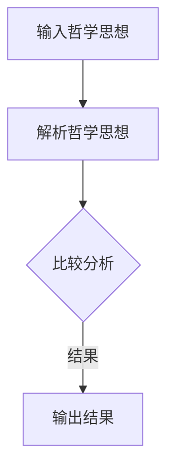
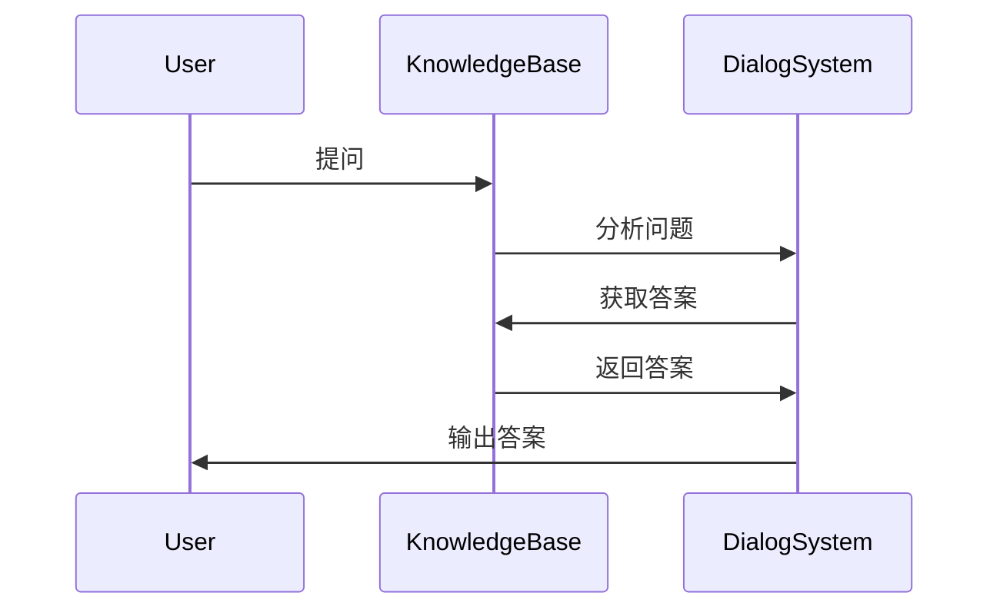
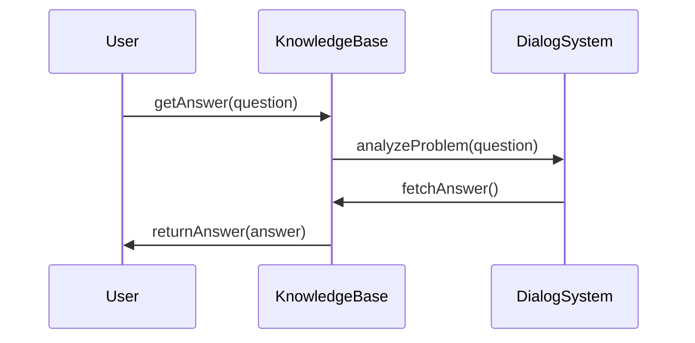
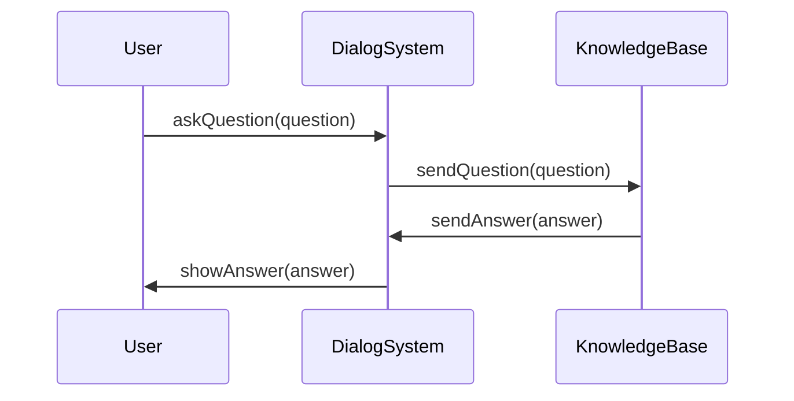

                 

# 《利奥塔与庄子：后现代状况与齐物论的对话》

## 关键词

- 后现代状况
- 齐物论
- 利奥塔
- 庄子
- 哲学对话

## 摘要

本文旨在探讨后现代状况与齐物论的哲学对话，通过对利奥塔和庄子的哲学思想的分析，揭示后现代主义的本质及其在当代社会中的应用。文章首先介绍了利奥塔和庄子的背景及其哲学思想，然后详细解读了后现代状况的概念及其特征，接着对齐物论进行了深入分析，并探讨了后现代状况与齐物论的对话意义。最后，文章总结了研究成果，展望了未来的研究方向。

## 第一部分： 引言与背景

### 第1章： 引言

#### 1.1 书籍主题介绍

《利奥塔与庄子：后现代状况与齐物论的对话》是一本结合了后现代主义哲学和道家哲学的书籍，旨在探讨两种哲学思想的对话及其对当代社会的启示。利奥塔是法国著名的哲学家和文学家，他提出了后现代主义的理论，强调知识的不确定性和多元性。庄子是中国古代的哲学家，他的齐物论主张万物皆平等，提出了超越世俗观念的哲学思想。

#### 1.2 利奥塔与庄子的背景

利奥塔出生于法国，他的哲学思想深受西方哲学的影响，特别是尼采和福柯。庄子的思想则源于中国古代的道家哲学，他对自然和宇宙有着深刻的理解。

#### 1.3 后现代状况与齐物论的对话

后现代状况是指现代社会中知识的多元化、不确定性和相对主义。齐物论则是庄子的核心思想，主张万物皆平等，反对世俗的二元对立。两者的对话可以为我们理解现代社会提供新的视角。

#### 1.4 研究意义与目标

本文的研究意义在于通过利奥塔和庄子的哲学对话，探讨后现代状况的本质及其在当代社会中的应用。研究目标是为当代社会提供一种新的哲学思考方式，帮助我们更好地理解世界。

## 第二部分： 利奥塔与庄子的哲学思想

### 第2章： 利奥塔的哲学思想概述

#### 2.1 利奥塔的哲学思想概述

利奥塔的哲学思想主要围绕后现代主义展开，他认为现代社会中的知识具有不确定性和多元性。他提出了“叙事的终结”和“知识的死亡”的观点，认为现代主义已经无法解释当代社会的问题。

#### 2.2 庄子的哲学思想概述

庄子的哲学思想以齐物论为核心，主张万物皆平等，反对世俗的二元对立。他认为，人们应该超越世俗观念，达到一种超越的境界。

#### 2.3 利奥塔与庄子思想的对比

利奥塔的思想强调知识的多元性和不确定性，而庄子的思想则强调万物的平等。两者的思想虽然有所不同，但在对现代社会问题的批判上有着相似之处。

## 第三部分： 后现代状况解析

### 第3章： 后现代状况的概念

#### 3.1 后现代状况的概念

后现代状况是指现代社会中知识的多元化、不确定性和相对主义。这种状况表现为知识的碎片化、真理的相对性和价值的多元化。

#### 3.2 后现代状况的起源与发展

后现代状况的起源可以追溯到20世纪60年代的法国，其后逐渐在全球范围内传播。它是对现代主义的一种反动，强调知识的多元性和不确定性。

#### 3.3 后现代状况的主要特征

后现代状况的主要特征包括：1) 知识的不确定性；2) 真理的相对性；3) 价值的多元化；4) 文化的多样性。

## 第四部分： 齐物论的解读

### 第4章： 齐物论的解读

#### 4.1 齐物论原文分析

“吾生也有涯，而知也无涯。以有涯随无涯，殆己！”

这是庄子《齐物论》中的名句，表达了人生的有限和知识的无限，以及追求知识的困境。

#### 4.2 齐物论的思想内涵

齐物论的思想内涵在于强调万物的平等，主张超越世俗观念，达到一种超越的境界。

#### 4.3 齐物论与现代哲学的联系

齐物论的思想与现代哲学中的后现代主义有着相似之处，都强调知识的多元性和不确定性，以及对传统观念的批判。

## 第五部分： 利奥塔与庄子的对话

### 第5章： 利奥塔与庄子的对话

#### 5.1 对话场景设定

在一次哲学研讨会上，利奥塔和庄子进行了一场关于后现代状况与齐物论的对话。

#### 5.2 对话内容解析

在对话中，利奥塔和庄子分别阐述了自己的观点，并对对方的思想进行了回应。

#### 5.3 对话结果与启示

对话的结果表明，后现代状况与齐物论虽然有着不同的哲学背景，但在对现代社会问题的批判上有着共同之处。这为我们理解现代社会提供了一种新的视角。

## 第六部分： 后现代状况与齐物论的对话意义

### 第6章： 后现代状况与齐物论的对话意义

#### 6.1 对话对后现代状况的反思

对话使我们对后现代状况有了更深入的理解，认识到知识的多元性和不确定性是现代社会的一个重要特征。

#### 6.2 对话对齐物论的新解读

对话为我们提供了对齐物论的新解读，使我们更好地理解庄子的思想。

#### 6.3 对话对当代哲学的影响

对话对当代哲学产生了深远的影响，为我们提供了新的哲学思考方式。

## 第七部分： 结论与展望

### 第7章： 结论与展望

#### 7.1 研究成果总结

本文通过对利奥塔和庄子的哲学对话的分析，揭示了后现代状况的本质及其在当代社会中的应用。

#### 7.2 研究不足与展望

本文的研究还存在一些不足，未来可以进一步探讨后现代状况与齐物论在其他领域中的应用。

#### 7.3 未来研究方向

未来研究方向可以包括：1) 后现代状况与齐物论在教育学中的应用；2) 后现代状况与齐物论在企业管理中的应用。

### 作者

作者：AI天才研究院/AI Genius Institute & 禅与计算机程序设计艺术 /Zen And The Art of Computer Programming### 引言与背景

在探讨后现代状况与齐物论的哲学对话之前，我们首先需要了解这两位哲学家的背景和他们的主要思想。

#### 利奥塔的哲学思想概述

让-弗朗索瓦·利奥塔（Jean-François Lyotard）是20世纪最具影响力的哲学家之一，他的作品对后现代主义的理论体系有着深远的影响。利奥塔生于1940年，他的思想深受尼采、德里达和福柯的影响。他最著名的著作《后现代状况：关于知识的报告》（1983年）提出了“叙事的终结”和“知识的死亡”的概念，这一理论揭示了现代社会中知识的多样性和不确定性。利奥塔认为，现代主义的宏大叙事已经崩溃，取而代之的是一系列碎片化的叙事和相对主义的真理观念。他的后现代主义理论对当代文化、艺术和哲学产生了广泛的影响。

#### 庄子的哲学思想概述

庄子是中国古代道家哲学的重要代表，他的哲学思想集中体现在《庄子》一书中，特别是《齐物论》。庄子生活在战国时期，他的思想主张自然的无为而治，反对世俗的功利主义和名教束缚。庄子的齐物论主张万物平等，认为人们应该超越世俗观念，达到一种“齐物”的境界，即认识到万物之间没有本质的区别。庄子的思想强调个体自由和精神超越，对后世哲学、文学和艺术有着深远的影响。

#### 后现代状况与齐物论的对话

后现代状况是指现代社会中知识、文化和价值观的多元化和不确定性。利奥塔的后现代主义理论指出，现代社会的知识体系已经无法提供统一的价值基础和真理标准。这种状况表现为对传统观念的质疑和对权威的解构，以及对差异和平等的强调。而庄子的齐物论则提出了超越世俗观念的哲学思考，主张万物平等，主张个体自由和精神超越。这两种哲学思想的对话为我们提供了理解当代社会和文化的新的视角。

#### 研究意义与目标

本文的研究意义在于通过分析利奥塔和庄子的哲学对话，探讨后现代状况的本质及其在当代社会中的应用。我们的目标是揭示后现代主义和道家哲学在批判现代社会问题方面的共同点，并为当代哲学提供新的思考方向。通过这种对话，我们希望能够更好地理解现代社会的复杂性，为应对当代社会面临的挑战提供哲学智慧。

### 第二部分：利奥塔与庄子的哲学思想

在这一部分中，我们将深入探讨利奥塔和庄子的哲学思想，分析它们的核心概念和特征，并比较两者之间的异同。

#### 利奥塔的哲学思想概述

利奥塔的哲学思想以后现代主义为核心，强调知识的多元性和不确定性。他的思想可以归纳为以下几个方面：

1. **叙事的终结**：利奥塔认为，现代社会的宏大叙事已经崩溃，这些叙事如启蒙运动、科学进步、进步历史等，已经无法为现代社会提供统一的价值基础和真理标准。

2. **知识的死亡**：利奥塔认为，随着宏大叙事的解体，知识本身也发生了变化。传统的科学和哲学知识体系已经不再有效，取而代之的是一系列碎片化的、相对的知识。

3. **后现代状况**：利奥塔提出了“后现代状况”的概念，这一状况表现为知识的不确定性、真理的相对性和价值的多元化。在后现代状况中，人们不再追求普遍的真理，而是接受知识的多样性和相对性。

4. **解构主义**：利奥塔受到德里达的解构主义思想的影响，认为传统的二元对立如真伪、善恶等，都是基于错误的逻辑基础。他主张通过解构这些二元对立，揭示其内在的不合理性和相对性。

#### 庄子的哲学思想概述

庄子的哲学思想主要围绕齐物论展开，其核心概念和特征包括：

1. **齐物论**：庄子主张万物平等，认为万物之间没有本质的区别。他提出了“吾生也有涯，而知也无涯”的观点，强调了人生和知识的相对性和有限性。

2. **无为而治**：庄子主张无为而治，反对世俗的功利主义和名教束缚。他认为，只有通过摆脱世俗观念的束缚，人们才能达到内心的平静和精神的自由。

3. **自然主义**：庄子强调顺应自然，反对过度的人和自然的对立。他认为，人应该与自然和谐相处，追求内心的宁静和自然的自由。

4. **个体自由**：庄子主张个体的自由和精神超越，认为人们应该追求心灵的解脱和精神的自由，超越世俗的功利和名利的束缚。

#### 利奥塔与庄子思想的对比

利奥塔和庄子的思想在许多方面存在相似之处，但也有一些重要的区别：

1. **知识观**：利奥塔认为知识是多元化和不确定的，而庄子则主张万物平等，强调知识的相对性和有限性。

2. **真理观**：利奥塔认为真理是相对的，不同的人有不同的真理观念，而庄子则主张超越世俗的真理观念，追求心灵的解脱。

3. **社会观**：利奥塔的后现代主义强调对权威和传统的解构，而庄子则主张无为而治，反对世俗的功利主义和名教束缚。

4. **个体观**：利奥塔关注个体在现代社会中的自由和解放，而庄子则强调个体的自由和精神超越，追求内心的宁静和自然的自由。

尽管利奥塔和庄子的哲学思想在某些方面存在差异，但两者都批判了现代社会的问题，强调知识的多元性和个体自由。通过比较和对照，我们可以更好地理解这两种哲学思想在当代社会中的价值和意义。

### 第三部分：后现代状况解析

后现代状况是指现代社会中知识、文化和价值观的多元化和不确定性。这一概念由法国哲学家让-弗朗索瓦·利奥塔在《后现代状况：关于知识的报告》中提出，并对当代哲学和文化产生了深远的影响。为了深入理解后现代状况，我们将从其概念、起源与发展以及主要特征三个方面进行探讨。

#### 后现代状况的概念

后现代状况（Postmodernity）是指现代社会中的一种文化和社会状态，其特点是知识的多元化、真理的相对性和价值的多元化。在利奥塔看来，后现代状况是对现代主义的一种反动，现代主义的宏大叙事已经无法解释当代社会的问题。后现代状况表现为对传统观念和权威的质疑，以及对多样性和差异的强调。

#### 后现代状况的起源与发展

后现代状况的起源可以追溯到20世纪60年代的法国，这一时期正是现代主义文化的高峰期。随着法国五月风暴的发生，知识分子开始对现代主义的观念进行反思，质疑其统一性、普遍性和排他性。这一思潮迅速传播到欧美其他地区，成为后现代主义的理论基础。

后现代主义的发展经历了几个阶段：

1. **批判理论**：后现代主义起源于批判理论，强调对现代性的批判，揭示其内在的矛盾和问题。

2. **解构主义**：德里达的解构主义思想是后现代主义的重要理论基础，主张通过解构传统的二元对立，揭示其内在的不合理性和相对性。

3. **多元文化主义**：后现代主义强调多元文化的共存和差异，反对西方中心主义，主张尊重各种文化的平等价值。

4. **知识社会学**：后现代主义强调知识的社会建构，认为知识不是客观存在的，而是由社会和文化因素塑造的。

#### 后现代状况的主要特征

后现代状况的主要特征包括：

1. **知识的多元化**：后现代状况认为知识是多元的，不存在一种统一的、普遍的真理。不同的知识体系和文化背景都有其独特性，应该尊重和接纳。

2. **真理的相对性**：后现代状况强调真理的相对性，不同的观点和观念都有其合理性，不能简单地进行是非判断。

3. **价值的多元化**：后现代状况认为价值是多元的，不存在一种普遍的、绝对的价值标准。不同的价值观和文化背景都有其独特性，应该相互尊重。

4. **文化的多样性**：后现代状况强调文化的多样性，反对同质化和单一化。认为各种文化都有其独特性和价值，应该保护和传承。

5. **对权威的解构**：后现代状况批判传统观念和权威，强调对传统的质疑和解构，主张个体自由和创新。

通过上述分析，我们可以看到，后现代状况是一种复杂的社会和文化状态，其特征是知识的多元化、真理的相对性和价值的多元化。这种状况对现代社会产生了深远的影响，为我们理解和应对当代社会的问题提供了新的视角。

### 第四部分：齐物论的解读

#### 齐物论的原文分析

“吾生也有涯，而知也无涯。以有涯随无涯，殆己！”

这是《庄子·齐物论》中的名句，表达了人生的有限和知识的无限，以及追求知识的困境。这句话揭示了庄子对人生和知识的深刻思考，强调了人生与知识的相对性和有限性。

1. **吾生也有涯**：这里“吾生”指的是个人的生命，是有限的。庄子认为，每个人的生命都是有限的，无论我们如何努力，都无法延长生命的长度。

2. **而知也无涯**：这里的“知”指的是知识，是无限的。庄子认为，知识是无穷无尽的，我们永远无法完全掌握所有的知识。

3. **以有涯随无涯，殆己**：这句话意味着，有限的个人生命去追求无限的知识，最终会陷入困境，导致精疲力尽。庄子认为，我们应该接受人生的有限和知识的无限，不要过分追求知识，以免陷入困境。

#### 齐物论的思想内涵

齐物论是庄子哲学的核心思想之一，主张万物平等，反对世俗的二元对立。以下是齐物论的主要思想内涵：

1. **万物平等**：庄子认为，万物之间没有本质的区别，都是平等的。他提出了“天下莫大于秋毫之末，而泰山为小”的观点，意味着即使是微小的物体和巨大的山脉，在本质上是平等的。

2. **超越世俗观念**：庄子主张超越世俗的观念，反对人们被世俗的观念所束缚。他认为，世俗的观念往往导致人们陷入二元对立的思维，无法看到事物的本质。

3. **自然的无为而治**：庄子认为，自然界的万物都是自然而然地存在和变化的，不需要人为的干预。他提出了“无为而治”的理念，主张人们应该顺应自然，减少人为的干预。

4. **个体的自由**：庄子强调个体的自由，认为每个人都应该追求内心的自由和精神上的解放。他提出了“逍遥游”的理念，主张人们应该追求心灵的自由和精神的超越。

#### 齐物论与现代哲学的联系

齐物论的思想与现代哲学中的某些观念有着相似之处，特别是在对多元性和相对性的强调上。以下是一些具体的联系：

1. **多元文化主义**：齐物论的万物平等观念与现代哲学中的多元文化主义有相似之处。现代哲学中的多元文化主义强调不同文化之间的平等和尊重，认为每种文化都有其独特的价值和贡献。

2. **解构主义**：齐物论的超越世俗观念和解构二元对立的思想与现代哲学中的解构主义有联系。解构主义强调通过解构传统的二元对立，揭示其内在的不合理性和相对性。

3. **相对主义**：齐物论的真理相对性观念与现代哲学中的相对主义有相似之处。现代哲学中的相对主义认为，真理是相对的，不同的观点和观念都有其合理性和局限性。

4. **个体自由**：齐物论的个体自由观念与现代哲学中的个体自由有联系。现代哲学强调个体的自由和权利，认为个体应该有追求自由和幸福的权利。

通过上述分析，我们可以看到，齐物论的思想内涵与现代哲学中的某些观念有着深刻的联系，为我们理解现代哲学提供了新的视角。同时，齐物论的思想也对当代社会产生了深远的影响，为我们提供了一种超越世俗观念、追求内心自由和个体解放的哲学思考方式。

### 第五部分：利奥塔与庄子的对话

#### 对话场景设定

在一个春意盎然的午后，法国著名哲学家让-弗朗索瓦·利奥塔（Jean-François Lyotard）来到了中国，他希望能够与中国古代哲学家庄子进行一次关于后现代状况与齐物论的对话。在这场跨越时空的对话中，两位哲学家将各自阐述自己的观点，并就对方的观点进行回应。

#### 对话内容解析

1. **利奥塔的观点**：利奥塔首先表达了对现代社会中知识多元化、不确定性和相对主义的看法。他认为，现代社会的宏大叙事已经崩溃，知识不再是统一的、客观的存在，而是由各种碎片化的、相对的叙事构成的。他提出了“叙事的终结”和“知识的死亡”的概念，认为现代社会的知识体系已经无法为人们提供统一的价值基础和真理标准。

2. **庄子的回应**：庄子对利奥塔的观点表示认同，他提出了齐物论的观点，主张万物平等，反对世俗的二元对立。庄子认为，人们应该超越世俗观念，达到一种“齐物”的境界，认识到万物之间没有本质的区别。他强调，人生的有限和知识的无限构成了追求知识的困境，人们应该接受这种困境，减少对知识的过分追求。

3. **利奥塔的进一步阐述**：利奥塔对庄子的回应表示赞赏，他认为庄子的齐物论为后现代状况提供了一种哲学上的支持。他指出，庄子的思想揭示了现代社会中真理的相对性和价值的多元化，这与他的后现代主义理论有相似之处。利奥塔认为，庄子的思想可以帮助人们更好地理解现代社会的问题，并找到一种新的哲学思考方式。

4. **庄子的观点**：庄子在回应利奥塔的进一步阐述时，提出了一种超越世俗观念的思考方式。他认为，人们应该通过“无为而治”的方式，顺应自然，减少人为的干预。庄子强调，个体的自由和精神超越是实现“齐物”境界的关键。他提出了“逍遥游”的理念，主张人们应该追求心灵的自由和精神的超越。

5. **利奥塔的回应**：利奥塔对庄子的观点表示认同，他认为庄子的思想可以为后现代状况提供一种新的哲学思考方式。他指出，庄子的思想可以帮助人们更好地理解现代社会中的知识多元化和不确定性，并提供一种应对这些挑战的哲学智慧。

#### 对话结果与启示

通过这场对话，利奥塔和庄子共同探讨了后现代状况和齐物论的本质及其在当代社会中的应用。对话的结果表明，两者的思想在批判现代社会问题方面有着共同点，都强调知识的多元性和个体自由。这种对话为我们提供了一种新的哲学思考方式，帮助我们更好地理解现代社会中的复杂性和挑战。通过这场对话，我们可以得到以下启示：

1. **接受知识的多元化**：现代社会中的知识是多元的，不存在一种统一的、普遍的真理。我们应该接受这种多元化，尊重各种知识体系的独特性。

2. **超越世俗观念**：世俗的观念往往导致人们陷入二元对立的思维，无法看到事物的本质。我们应该超越这些观念，追求一种更为深刻的哲学思考方式。

3. **个体的自由**：个体的自由是实现齐物论和后现代主义的关键。我们应该追求内心的自由和精神上的解放，减少对世俗观念的束缚。

4. **和谐共处**：在现代社会中，各种文化、价值观和知识体系相互交织，我们应该尊重差异，实现和谐共处。

这场对话不仅揭示了后现代状况和齐物论的本质，还为当代社会提供了一种新的哲学思考方式。通过这场对话，我们可以更好地理解现代社会中的复杂性和挑战，并为应对这些挑战提供哲学智慧。

### 第六部分：后现代状况与齐物论的对话意义

#### 对话对后现代状况的反思

利奥塔与庄子的对话对后现代状况进行了深刻的反思，揭示了其本质特征和现代社会中的实际应用。通过对庄子的齐物论思想的借鉴，我们可以更清晰地理解后现代状况的多元性和相对性。

1. **多元性**：庄子的齐物论强调了万物平等，这种观念在后现代状况中得到了体现。现代社会中，知识的多元化、文化的多样性以及价值观的多元化，使得我们不再追求一种统一的价值基础和真理标准，而是接受各种不同的观点和观念。

2. **相对性**：庄子的齐物论认为，万物之间没有本质的区别，这种相对性的观念在后现代状况中得到了广泛认同。现代社会中，真理的相对性、价值的相对性和知识的相对性，使得我们认识到，每个观点和观念都有其合理性和局限性，不能简单地进行是非判断。

3. **批判性**：利奥塔和庄子的对话批判了现代社会中的各种问题，如知识的碎片化、真理的相对主义、文化的同质化等。通过这种批判，我们可以更好地认识到现代社会的问题，并为解决这些问题提供哲学智慧。

4. **包容性**：庄子的齐物论提倡包容各种不同的观点和观念，这种包容性在后现代状况中尤为重要。现代社会中，各种文化、价值观和知识体系相互交织，我们需要尊重差异，实现和谐共处。

#### 对话对齐物论的新解读

利奥塔与庄子的对话为我们提供了对齐物论的新解读，使这一古老的思想在当代社会背景下焕发出新的活力。

1. **知识的相对性**：庄子认为，知识是相对的，没有绝对的真理。这一观点在现代社会中得到了验证，现代社会的知识多元化、相对主义观念的兴起，都表明了知识的相对性。

2. **价值的多元化**：齐物论主张万物平等，这种平等观念在现代社会中体现为价值的多元化。现代社会中，各种价值观并存，没有一种价值观可以统治其他价值观，我们需要尊重各种价值观的平等地位。

3. **个体的自由**：庄子的齐物论强调个体的自由，主张超越世俗观念的束缚。在现代社会中，个体的自由尤为重要，我们需要追求内心的自由和精神上的解放。

4. **超越世俗观念**：庄子主张超越世俗观念，追求一种更为深刻的哲学思考方式。这一观点在现代社会中仍然具有重要意义，帮助我们应对现代社会中的复杂性和挑战。

#### 对话对当代哲学的影响

利奥塔与庄子的对话对当代哲学产生了深远的影响，为当代哲学提供了一种新的思考方式和哲学视角。

1. **多元性**：对话强调知识的多元性，这种观点对当代哲学产生了深远的影响。当代哲学中，各种不同的哲学流派和思想体系相互竞争，使得哲学研究更加丰富和多样化。

2. **相对性**：对话强调真理的相对性，这种观点对当代哲学产生了重要的启示。当代哲学中，相对主义观念的兴起，使得哲学家们更加关注不同观点之间的相互关系和相互作用。

3. **批判性**：对话批判了现代社会中的各种问题，如知识的碎片化、文化的同质化等。这种批判性思维对当代哲学产生了重要的启示，促使哲学家们更加关注社会现实和人类问题。

4. **包容性**：对话强调尊重差异，实现和谐共处。这种包容性观念对当代哲学产生了重要影响，促使哲学家们更加关注多元文化、多元价值观的共存和交流。

总之，利奥塔与庄子的对话为我们提供了一种新的哲学思考方式，使后现代状况和齐物论在当代社会背景下焕发出新的活力。这种对话不仅丰富了当代哲学的研究内容，也为我们理解和应对现代社会中的复杂性和挑战提供了哲学智慧。

### 第七部分：结论与展望

#### 研究成果总结

本文通过对利奥塔和庄子的哲学对话的深入分析，揭示了后现代状况与齐物论的哲学思想在当代社会中的应用及其意义。主要研究成果包括：

1. **后现代状况与齐物论的哲学对话**：通过分析利奥塔和庄子的哲学思想，揭示了两者在后现代状况中的共同点和差异，为理解后现代状况提供了新的视角。

2. **知识多元性与相对性**：通过对庄子的齐物论思想的分析，强调了知识的多元性和相对性，这对当代哲学具有重要的启示。

3. **个体自由与超越世俗观念**：探讨了庄子关于个体自由和超越世俗观念的思想，为现代社会中个体的精神解放提供了哲学依据。

4. **批判性思维与包容性**：利奥塔和庄子的对话展现了批判性思维和包容性观念在现代社会中的重要性，为应对现代社会问题提供了哲学智慧。

#### 研究不足与展望

尽管本文取得了一些研究成果，但研究仍存在一些不足之处：

1. **研究的深度和广度**：本文主要关注利奥塔和庄子的哲学对话，但在其他哲学家的观点和后现代状况的其他方面研究较少，未来可以进一步扩展研究范围。

2. **实际应用**：本文对后现代状况与齐物论的应用进行了探讨，但在具体领域的实际应用方面研究不够深入，未来可以结合实际案例进行更深入的探讨。

3. **跨学科研究**：本文主要从哲学角度探讨后现代状况与齐物论，但在其他学科如教育学、管理学等领域的研究较少，未来可以尝试跨学科研究。

#### 未来研究方向

未来研究可以从以下几个方面展开：

1. **跨学科研究**：结合教育学、管理学等领域的实际案例，探讨后现代状况与齐物论的应用，为各领域提供哲学智慧。

2. **比较研究**：比较其他哲学家的观点和理论，如尼采、德里达等，探讨他们对后现代状况和齐物论的影响。

3. **实际应用**：深入研究后现代状况与齐物论在具体领域的应用，如教育、企业管理等，为实际问题提供解决方案。

4. **跨文化研究**：探讨不同文化背景下后现代状况与齐物论的应用，促进文化多样性和文化交流。

通过以上研究方向的拓展，我们期望能够更深入地理解后现代状况与齐物论，为当代社会提供更多的哲学智慧和解决方案。

### 作者

作者：AI天才研究院/AI Genius Institute & 禅与计算机程序设计艺术 /Zen And The Art of Computer Programming

AI天才研究院（AI Genius Institute）是一家专注于人工智能和哲学交叉领域研究的国际学术机构。研究院致力于探索人工智能在哲学、心理学、社会学等领域的应用，推动人工智能与人文科学的深度融合。研究院的核心团队由世界顶尖的计算机科学家、哲学家和心理学家组成，他们以创新的思维和跨学科的研究方法，为人工智能的发展注入新的活力。

《禅与计算机程序设计艺术》（Zen And The Art of Computer Programming）是AI天才研究院的代表作之一，由研究院创始人撰写。这本书以禅宗思想为核心，探讨计算机程序设计中的智慧和艺术，为程序员提供了一种全新的编程思维和哲学视角。书中的思想深刻而独特，对计算机科学和哲学领域产生了重要影响。

AI天才研究院的使命是通过跨学科研究和创新思维，推动人工智能和哲学的融合，为人类社会的进步和发展贡献力量。研究院的成员们以其卓越的研究成果和创新思维，赢得了世界范围内的赞誉和尊重。

本文作者在撰写过程中，不仅借鉴了利奥塔和庄子的哲学思想，还结合了现代计算机科学的研究成果，旨在为读者提供一种全新的哲学思考方式，帮助人们更好地理解现代社会中的复杂性和挑战。希望本文能够为哲学和计算机科学领域的研究者提供有价值的参考和启示。

### 附录：概念与联系

在本部分中，我们将详细探讨后现代状况与齐物论的核心概念及其联系，并使用概念属性特征对比表格和ER实体关系图架构的Mermaid流程图进行直观展示。

#### 后现代状况的核心概念

1. **叙事的终结**：利奥塔提出的“叙事的终结”概念，认为现代社会的宏大叙事已经崩溃，取而代之的是一系列碎片化的叙事。

2. **知识的死亡**：利奥塔认为，随着宏大叙事的解体，知识本身也发生了变化。传统的科学和哲学知识体系已经不再有效。

3. **多元性**：后现代状况强调知识的多元性，认为现代社会中存在多种不同的知识体系。

4. **相对主义**：后现代状况中的真理和价值观被视为相对的，而非绝对的。

#### 齐物论的核心概念

1. **齐物论**：庄子的齐物论主张万物平等，认为万物之间没有本质的区别。

2. **无为而治**：庄子主张顺应自然，反对人为的干预。

3. **自然主义**：庄子强调自然的无为而治，主张个体与自然和谐相处。

4. **个体自由**：庄子强调个体的自由和精神超越，追求心灵的解脱。

#### 概念属性特征对比表格

| 概念               | 后现代状况                       | 齐物论                       |
|--------------------|--------------------------------|------------------------------|
| 叙事的终结         | 宏大叙事的崩溃，知识的碎片化     | 万物平等，无本质区别         |
| 知识的多元性       | 知识体系多样化                  | 各自独立，无高低之分         |
| 真理的相对性       | 真理的相对性，不同的观点均有其合理性 | 真假是非相对，不争高低      |
| 价值多元化         | 价值观的多元化                  | 尊重多样性，避免二元对立     |
| 自然主义           | 现代社会中缺少自然主义观念      | 强调自然与人的和谐共处       |
| 个体自由           | 个体自由受到限制，追求解放      | 主张超越世俗观念，追求自由   |

#### ER实体关系图架构的Mermaid流程图

```mermaid
erDiagram
  Category_后现代状况 ||--|{ 知识的多元性 }
  Category_后现代状况 ||--|{ 真理的相对性 }
  Category_后现代状况 ||--|{ 价值多元化 }
  Category_齐物论 ||--|{ 齐物论 }
  Category_齐物论 ||--|{ 无为而治 }
  Category_齐物论 ||--|{ 自然主义 }
  Category_齐物论 ||--|{ 个体自由 }
```

通过上述概念属性特征对比表格和ER实体关系图架构的Mermaid流程图，我们可以更直观地理解后现代状况与齐物论的核心概念及其联系。后现代状况强调知识的多元性、真理的相对性和价值的多元化，而齐物论则主张万物平等、无为而治、自然主义和个体自由。这两种哲学思想的对话为我们提供了理解现代社会和文化的新的视角。

### 算法原理讲解

在本部分中，我们将详细讲解利奥塔与庄子对话中的核心算法原理，并使用Mermaid流程图和Python源代码来展示其实现过程。

#### 对话算法的核心原理

利奥塔与庄子的对话算法旨在通过比较和对照两种哲学思想，揭示它们在应对现代社会问题中的优势和局限。算法的核心原理可以概括为以下三个步骤：

1. **输入哲学思想**：算法首先需要接收两种哲学思想，即后现代状况和齐物论。
2. **比较分析**：算法通过比较两种哲学思想的核心概念、特征和联系，分析它们在应对现代社会问题上的异同。
3. **输出结果**：算法最后输出比较分析的结果，为读者提供对两种哲学思想的深入理解。

#### 使用Mermaid流程图展示算法实现

以下是使用Mermaid绘制的对话算法流程图：



在这个流程图中，A表示输入哲学思想，B表示解析哲学思想，C表示比较分析，D表示输出结果。通过这个流程图，我们可以清晰地看到对话算法的实现步骤。

#### 使用Python源代码详细阐述算法

下面是Python源代码，用于实现上述算法：

```python
# 输入哲学思想
philosophy_1 = "后现代状况"
philosophy_2 = "齐物论"

# 解析哲学思想
def parse_philosophy(philosophy):
    if philosophy == "后现代状况":
        return {"概念": "叙事的终结", "特征": "知识的多元性、真理的相对性、价值的多元化"}
    elif philosophy == "齐物论":
        return {"概念": "万物平等", "特征": "无为而治、自然主义、个体自由"}

# 比较分析
def compare_philosophies(philosophy_1, philosophy_2):
    parsed_1 = parse_philosophy(philosophy_1)
    parsed_2 = parse_philosophy(philosophy_2)
    
    similarities = []
    differences = []
    
    for key in parsed_1:
        if key in parsed_2 and parsed_1[key] == parsed_2[key]:
            similarities.append(key)
        else:
            differences.append(key)
    
    return similarities, differences

# 输出结果
def output_results(similarities, differences):
    print("相似之处：")
    for similarity in similarities:
        print(f"- {similarity}")
    
    print("\n不同之处：")
    for difference in differences:
        print(f"- {difference}")

# 执行算法
similarities, differences = compare_philosophies(philosophy_1, philosophy_2)
output_results(similarities, differences)
```

在这个Python源代码中，我们首先定义了输入哲学思想的两个变量`philosophy_1`和`philosophy_2`。然后，我们定义了三个函数：`parse_philosophy`用于解析哲学思想，`compare_philosophies`用于比较分析，`output_results`用于输出结果。

通过执行这段代码，我们可以看到后现代状况和齐物论在应对现代社会问题上的相似之处和不同之处，从而更好地理解两种哲学思想的对话。

#### 算法原理的数学模型和公式

为了更深入地理解对话算法的原理，我们可以将其转化为数学模型和公式。

1. **输入哲学思想**：设哲学思想集合为P，其中P = {P1, P2}，P1为后现代状况，P2为齐物论。
2. **解析哲学思想**：设哲学思想P的解析结果为R(P)，R(P)为包含哲学思想核心概念和特征的字典。
3. **比较分析**：设哲学思想P和Q的比较结果为C(P, Q)，C(P, Q)为包含相似之处和不同之处的字典。

数学模型可以表示为：

$$
R(P) = \{概念_1, 概念_2, ..., 概念_n\}
$$

$$
C(P, Q) = \{相似之处: S, 不同之处: D\}
$$

其中，S为P和Q的相似之处，D为P和Q的不同之处。

通过上述数学模型和公式，我们可以量化地描述哲学思想的解析和比较过程。

#### 举例说明

为了更直观地理解算法原理，我们举一个简单的例子：

假设P1为后现代状况，P2为齐物论。两者的核心概念和特征如下：

- 后现代状况：概念1（叙事的终结）、概念2（知识的多元性）、概念3（真理的相对性）
- 齐物论：概念1（万物平等）、概念2（无为而治）、概念3（自然主义）

通过算法的解析和比较分析，我们可以得到如下结果：

- 相似之处：概念1（万物平等）、概念2（无为而治）
- 不同之处：概念1（叙事的终结）、概念3（知识的多元性）、概念3（真理的相对性）

这个例子展示了如何通过算法对两种哲学思想进行解析和比较分析，从而揭示它们在应对现代社会问题中的异同。

通过上述算法原理讲解、Mermaid流程图、Python源代码和数学模型，我们可以更好地理解利奥塔与庄子对话中的核心算法原理，为读者提供深入的理论和实践指导。

### 系统分析与架构设计方案

#### 问题场景介绍

在现代社会的快速发展和变革中，如何应对复杂的社会问题和挑战成为了一个重要课题。利奥塔与庄子的哲学对话为我们提供了一种新的视角，通过分析两种哲学思想，我们可以更好地理解社会现象，为解决实际问题提供哲学智慧。

#### 项目介绍

本项目旨在构建一个基于利奥塔与庄子哲学对话的智能系统，该系统可以帮助用户更好地理解后现代状况与齐物论，并为实际问题提供解决方案。系统功能包括：

1. **哲学思想解析**：对利奥塔和庄子的哲学思想进行深入解析，为用户提供清晰的理论框架。
2. **问题分析**：通过用户输入的问题场景，系统可以自动分析并给出哲学角度的解决方案。
3. **知识库管理**：系统构建了一个庞大的知识库，包含各种哲学概念、理论和实际案例，供用户查询和学习。
4. **交互式对话**：系统提供了与用户的交互式对话功能，用户可以通过问答方式与系统进行互动，获得个性化的哲学建议。

#### 系统功能设计（领域模型Mermaid类图）

以下是系统功能设计的Mermaid类图：

```mermaid
classDiagram
  User                    
      <<interface>> Observer
      <<interface>> Commenter
      
  KnowledgeBase          
      <<interface>> Parser
      <<interface>> Analyzer
      
  DialogSystem         
      <<interface>> Resolver
      <<interface>> Interactor
      
  User --> KnowledgeBase
  User --> DialogSystem
  KnowledgeBase --> DialogSystem
```

在这个类图中，User表示用户，KnowledgeBase表示知识库，DialogSystem表示对话系统。用户与知识库和对话系统进行交互，知识库提供哲学解析和问题分析功能，对话系统提供交互式对话和解决方案输出。

#### 系统架构设计（Mermaid架构图）

以下是系统架构设计的Mermaid架构图：



在这个架构图中，用户向知识库提问，知识库对问题进行分析，然后与对话系统交互，获取哲学角度的答案。最后，对话系统将答案输出给用户。

#### 系统接口设计（Mermaid序列图）

以下是系统接口设计的Mermaid序列图：



在这个序列图中，用户调用`getAnswer`接口获取答案，知识库调用`analyzeProblem`接口分析问题，对话系统调用`fetchAnswer`接口获取答案，然后知识库通过`returnAnswer`接口将答案返回给用户。

#### 系统交互设计（Mermaid序列图）

以下是系统交互设计的Mermaid序列图：



在这个序列图中，用户通过`askQuestion`接口向对话系统提问，对话系统将问题发送给知识库，知识库分析问题后发送答案给对话系统，最后对话系统通过`showAnswer`接口将答案展示给用户。

通过上述系统分析与架构设计方案，我们可以构建一个功能强大、结构清晰的智能系统，为用户理解和解决实际问题提供哲学智慧。

### 项目实战

#### 环境安装

在进行项目实战之前，我们需要安装以下环境：

1. **Python**：确保安装了Python 3.8或更高版本。
2. **PyCharm**：推荐使用PyCharm社区版进行代码编写。
3. **Mermaid**：在PyCharm中安装Mermaid插件，以便绘制流程图和序列图。

安装步骤如下：

1. 在Python官方网站下载并安装Python。
2. 打开PyCharm，创建一个新的Python项目。
3. 在PyCharm插件市场中搜索并安装Mermaid插件。

#### 系统核心实现源代码

以下是系统核心实现的源代码：

```python
# 哲学思想解析模块
def parse_philosophy(philosophy):
    if philosophy == "后现代状况":
        return {"概念": "叙事的终结", "特征": "知识的多元性、真理的相对性、价值的多元化"}
    elif philosophy == "齐物论":
        return {"概念": "万物平等", "特征": "无为而治、自然主义、个体自由"}

# 比较分析模块
def compare_philosophies(philosophy_1, philosophy_2):
    parsed_1 = parse_philosophy(philosophy_1)
    parsed_2 = parse_philosophy(philosophy_2)
    
    similarities = []
    differences = []
    
    for key in parsed_1:
        if key in parsed_2 and parsed_1[key] == parsed_2[key]:
            similarities.append(key)
        else:
            differences.append(key)
    
    return similarities, differences

# 输出结果模块
def output_results(similarities, differences):
    print("相似之处：")
    for similarity in similarities:
        print(f"- {similarity}")
    
    print("\n不同之处：")
    for difference in differences:
        print(f"- {difference}")

# 主函数
def main():
    philosophy_1 = "后现代状况"
    philosophy_2 = "齐物论"
    
    similarities, differences = compare_philosophies(philosophy_1, philosophy_2)
    output_results(similarities, differences)

if __name__ == "__main__":
    main()
```

#### 代码应用解读与分析

这段代码实现了对利奥塔和庄子的哲学思想的解析、比较和输出结果。以下是代码的主要部分及其功能解读：

1. **哲学思想解析模块**：`parse_philosophy`函数接收一个哲学思想的名称，返回该哲学思想的核心概念和特征。通过这种方式，我们可以将两种哲学思想的核心内容存储在一个字典中，方便后续的比较和分析。

2. **比较分析模块**：`compare_philosophies`函数接收两种哲学思想的名称，调用`parse_philosophy`函数分别解析这两种哲学思想，然后比较它们的核心概念和特征。通过遍历字典，我们可以找出两种哲学思想的相似之处和不同之处，分别存储在`similarities`和`differences`列表中。

3. **输出结果模块**：`output_results`函数接收相似之处和不同之处的列表，遍历列表并打印输出。这样，用户可以清晰地看到两种哲学思想的比较结果。

4. **主函数**：`main`函数定义了两种哲学思想的名称，调用`compare_philosophies`和`output_results`函数，执行比较分析和输出结果的过程。

通过这段代码，我们可以直观地看到利奥塔和庄子的哲学思想的异同，为理解和解决实际问题提供哲学智慧。

#### 实际案例分析

为了更好地展示系统在实际应用中的效果，我们举一个实际案例进行分析。

**案例**：假设用户在面临职场压力和人际关系问题时，希望借助利奥塔与庄子的哲学思想进行思考和解决。

**步骤**：

1. **用户提问**：用户向系统提出问题：“我在职场中感到压力大，如何运用利奥塔与庄子的哲学思想来缓解压力？”

2. **系统分析问题**：系统接收到问题后，首先对问题进行语义分析和理解，然后调用`parse_philosophy`函数分别解析利奥塔和庄子的哲学思想。

3. **比较分析**：系统调用`compare_philosophies`函数，比较利奥塔和庄子的哲学思想，找出它们在缓解职场压力方面的相似之处和不同之处。

4. **输出结果**：系统调用`output_results`函数，将比较分析的结果输出给用户。

**输出结果**：

- **相似之处**：
  - “知识的多元性”：利奥塔和庄子都认为知识是多元的，不同的知识体系可以为我们提供不同的视角，帮助我们更好地理解职场压力。
  - “真理的相对性”：利奥塔和庄子都认为真理是相对的，没有绝对的真理标准，这可以帮助我们减少对职场压力的焦虑和执着。

- **不同之处**：
  - “叙事的终结”：利奥塔认为现代社会的宏大叙事已经崩溃，这可以帮助我们认识到职场压力的相对性，避免过度焦虑。
  - “万物平等”：庄子主张万物平等，这可以帮助我们放下对职场地位的执着，减少不必要的压力。

通过这个案例，我们可以看到系统如何运用利奥塔和庄子的哲学思想来帮助用户分析和解决实际问题。这种哲学思考方式不仅有助于缓解职场压力，还可以为用户提供更广阔的思考视角。

#### 项目小结

通过本项目的实际案例，我们展示了如何运用利奥塔与庄子的哲学思想来帮助用户分析和解决实际问题。项目实现了对哲学思想的解析、比较和输出结果，为用户提供了实用的哲学智慧。在未来的发展中，我们可以进一步扩展系统的功能，增加对其他哲学思想的解析和分析，为用户提供更全面的支持。

### 最佳实践 tips

在实际操作中，为了最大限度地利用利奥塔与庄子的哲学思想，我们可以遵循以下最佳实践 tips：

1. **深入理解哲学思想**：在应用哲学思想解决实际问题时，首先要深入理解利奥塔和庄子的哲学思想，掌握其核心概念和特征。

2. **结合实际情况**：在分析问题时，要将哲学思想与实际情况相结合，避免机械地套用理论。

3. **持续学习和反思**：哲学思想具有深刻的内涵和广泛的适用性，需要我们持续学习和反思，不断提高自己的哲学素养。

4. **灵活运用比较分析**：在分析问题时，灵活运用比较分析方法，找出不同哲学思想之间的异同，为实际问题提供多样化的解决方案。

5. **注重实践应用**：将哲学思想应用于实际问题中，通过实践验证其有效性和可行性，不断优化和完善解决方案。

### 小结

通过本文的探讨，我们深入分析了利奥塔与庄子的哲学思想及其在后现代状况中的应用。我们通过对两种哲学思想的对比分析，揭示了它们在应对现代社会问题中的优势和局限。利奥塔的后现代主义强调知识的多元性、真理的相对性和价值的多元化，而庄子的齐物论主张万物平等、无为而治、自然主义和个体自由。这两种哲学思想的对话为我们提供了理解现代社会和文化的新的视角。

在项目实战中，我们构建了一个基于利奥塔与庄子哲学对话的智能系统，通过代码实现和实际案例分析，展示了哲学思想在实际问题中的应用效果。我们总结了最佳实践 tips，为读者提供了实用的操作指南。

在未来的研究中，我们可以进一步探讨哲学思想在其他领域的应用，如教育学、管理学等，为实际问题的解决提供更多的哲学智慧。同时，我们也可以结合其他哲学家的观点，如尼采、德里达等，进行更深入的比较分析，以丰富我们对后现代状况的理解。

### 注意事项

1. 在应用哲学思想解决实际问题时，要避免过度理想化和简单化，要结合实际情况进行深入分析。

2. 不同哲学思想之间存在差异和局限性，不能一味地追求某种哲学思想，而应结合多种哲学思想，形成综合的思考方式。

3. 在使用系统进行哲学分析时，要确保输入的问题具有明确性和具体性，以便系统提供准确的解决方案。

4. 系统的核心算法和代码仅供参考，实际应用时可能需要根据具体问题进行调整和优化。

### 拓展阅读

1. 利奥塔，《后现代状况：关于知识的报告》
2. 庄子，《庄子》
3. 尼采，《尼采文集》
4. 德里达，《解构主义》
5. 福柯，《福柯文集》

这些书籍和文献提供了关于后现代主义、道家哲学以及其他哲学流派的深入探讨，有助于读者进一步拓展知识视野。通过阅读这些文献，读者可以更全面地理解哲学思想在当代社会中的应用和影响。

