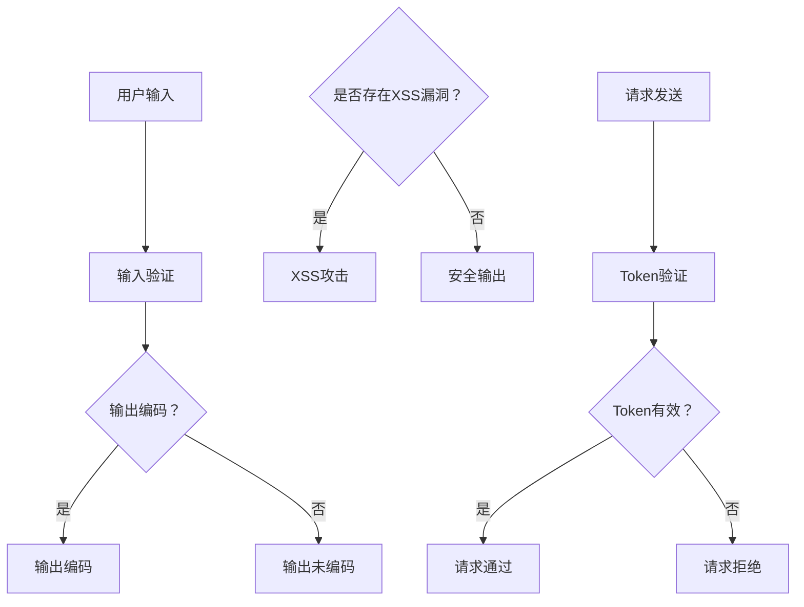

                 

### 前端安全：防御XSS、CSRF等常见攻击

关键词：前端安全、跨站脚本攻击（XSS）、跨站请求伪造（CSRF）、内容安全策略（CSP）、防御策略、案例分析

摘要：随着互联网的快速发展，前端安全问题日益突出。本文将详细介绍前端安全的核心概念，重点分析XSS和CSRF攻击的原理与防御方法，并提供实战案例，帮助开发者提升前端安全防护能力。

----------------------------------------------------------------

## 第一部分：背景与核心概念

### 1.1 前端安全的必要性

在现代互联网应用中，前端安全至关重要。它不仅关系到用户数据的保护，也关系到整个应用的稳定性和用户体验。随着前端技术的不断发展，攻击者的手段也日益多样，常见的攻击方式包括跨站脚本攻击（XSS）和跨站请求伪造（CSRF）等。这些攻击不仅可能导致数据泄露、非法操作，还可能对应用造成永久性损害。因此，确保前端安全已经成为每个开发者必须面对的重要课题。

### 1.2 常见攻击类型概述

前端安全面临的常见攻击类型主要包括以下几种：

1. **跨站脚本攻击（XSS）**：攻击者通过在目标网站上注入恶意脚本，从而控制用户的浏览器，窃取用户数据或执行非法操作。
2. **跨站请求伪造（CSRF）**：攻击者利用用户的登录状态，在用户不知情的情况下执行恶意请求，从而实现非法操作。
3. **SQL注入**：攻击者通过在输入字段注入恶意SQL语句，从而获取数据库中的敏感数据。
4. **点击劫取（Clickjacking）**：攻击者通过叠加透明覆盖层，诱骗用户点击隐藏的按钮或链接，从而执行恶意操作。

本文将重点讨论XSS和CSRF这两种攻击，并介绍其防御方法。

### 1.3 XSS攻击的原理与分类

XSS攻击的原理是利用Web应用的漏洞，在用户的浏览器中执行恶意脚本。根据恶意脚本注入的位置和方式，XSS攻击可以分为以下几种类型：

1. **存储型XSS（Persistent XSS）**：恶意脚本被永久存储在目标网站的服务器上，如数据库、Cookie等。
2. **反射型XSS（Reflected XSS）**：恶意脚本通过URL或HTTP请求参数反射回来，通常不会永久存储在服务器上。
3. **基于DOM的XSS（DOM-based XSS）**：恶意脚本直接在客户端的DOM树上执行，无需与服务器交互。

### 1.4 CSRF攻击的原理与防御方法

CSRF攻击利用的是用户的登录状态。攻击者通过伪造请求，利用用户的身份执行恶意操作。防御CSRF攻击的方法主要包括：

1. **验证Referer头**：检查HTTP请求的Referer头，确保请求来自同一域名。
2. **使用Token验证**：在请求中添加Token，确保Token的有效性和唯一性。
3. **使用HTTPS**：确保通信过程加密，防止攻击者窃取Token和Referer头。

### 1.5 前端安全的重要性

前端安全不仅关系到用户数据的安全，也关系到企业的声誉和业务发展。一个不安全的前端应用可能带来以下风险：

1. **数据泄露**：用户敏感信息可能被攻击者窃取。
2. **非法操作**：攻击者可能利用CSRF攻击执行恶意操作。
3. **业务受损**：由于安全漏洞，企业可能遭受经济损失和声誉损害。

因此，确保前端安全是每个开发者不可忽视的重要任务。

----------------------------------------------------------------

## 第二部分：XSS攻击的防御

### 2.1 防范XSS的基础策略

防御XSS攻击的基础策略主要包括以下几种：

1. **输入验证与过滤**：对用户输入进行严格验证和过滤，确保输入符合预期格式。
2. **输出编码**：对用户输入的输出进行编码，避免恶意脚本在浏览器中执行。
3. **使用内容安全策略（CSP）**：限制资源加载，防止恶意脚本执行。

### 2.2 内容安全策略（CSP）

内容安全策略（CSP）是一种有效的防御XSS攻击的方法。CSP通过定义可信任的源，限制资源的加载和执行，从而防止恶意脚本注入。

#### 2.2.1 CSP的工作原理

CSP的工作原理如下：

1. **定义策略**：开发者根据应用的需求，定义CSP策略，包括可信任的源、禁止的指令等。
2. **发送策略**：将CSP策略通过HTTP响应头`Content-Security-Policy`发送给客户端。
3. **客户端执行**：客户端根据CSP策略，限制资源的加载和执行。

#### 2.2.2 CSP配置的最佳实践

在配置CSP时，应遵循以下最佳实践：

1. **限制源**：只允许必要的源加载资源，避免不必要的风险。
2. **使用nonce**：为脚本和样式添加随机nonce值，提高安全性。
3. **禁用外部脚本**：尽量禁用外部脚本，仅使用内部脚本。

#### 2.2.3 CSP的常见问题与解决方案

CSP在实际应用中可能会遇到以下问题：

1. **兼容性问题**：某些浏览器可能不支持CSP或存在兼容性问题。解决方法：逐步引入CSP，确保兼容性。
2. **配置错误**：错误的CSP配置可能导致应用无法正常工作。解决方法：仔细测试CSP配置，确保应用正常运行。

### 2.3 数据验证与过滤

数据验证与过滤是防御XSS攻击的重要措施。以下方法可以帮助有效防范XSS攻击：

1. **HTML实体编码**：将特殊字符（如`<`、`>`等）编码为HTML实体，如`<`编码为`&lt;`。
2. **输入验证**：对用户输入进行严格验证，确保输入符合预期格式。
3. **输出编码**：对用户输入的输出进行编码，避免恶意脚本在浏览器中执行。

#### 2.3.1 HTML实体编码

HTML实体编码是将特殊字符编码为HTML实体，如：

- `<` 编码为 `&lt;`
- `>` 编码为 `&gt;`
- `&` 编码为 `&amp;`
- `"` 编码为 `&quot;`
- `'` 编码为 `&apos;`

通过HTML实体编码，可以防止恶意脚本在浏览器中执行。

#### 2.3.2 输入验证的方法与工具

输入验证的方法包括：

1. **正则表达式**：使用正则表达式对输入进行验证，确保输入符合预期格式。
2. **前端验证**：使用前端验证库（如jQuery Validate）对输入进行验证。
3. **后端验证**：在服务器端对输入进行验证，确保数据的安全性和准确性。

输入验证的方法与工具可以帮助有效防范XSS攻击。

#### 2.3.3 输出编码的重要性

输出编码的重要性在于，它可以防止恶意脚本在浏览器中执行。例如，如果一个输入框中输入了`<script>alert('XSS');</script>`，如果没有进行输出编码，这个脚本将直接在浏览器中执行，导致XSS攻击。因此，对输出进行编码是防御XSS攻击的关键措施之一。

### 2.4 跨站请求伪造的防御

跨站请求伪造（CSRF）是一种常见的Web攻击方式。防御CSRF攻击的方法主要包括：

1. **验证Referer头**：检查HTTP请求的Referer头，确保请求来自同一域名。
2. **使用Token验证**：在请求中添加Token，确保Token的有效性和唯一性。
3. **使用HTTPS**：确保通信过程加密，防止攻击者窃取Token和Referer头。

#### 2.4.1 CSRF攻击的原理

CSRF攻击的原理是利用用户的登录状态，在用户不知情的情况下执行恶意请求。攻击者通常会利用以下步骤实现CSRF攻击：

1. **攻击者诱导用户访问恶意网站**：恶意网站中包含一个指向受攻击网站的请求。
2. **用户访问恶意网站**：用户在恶意网站上执行操作，触发恶意请求。
3. **受攻击网站接收请求**：受攻击网站收到请求后，认为请求是合法的，执行相应的操作。

#### 2.4.2 CSRF防护机制

防御CSRF攻击的关键在于验证请求的合法性。以下方法可以用于防御CSRF攻击：

1. **验证Referer头**：检查HTTP请求的Referer头，确保请求来自同一域名。这种方法简单易行，但可能存在兼容性问题。
2. **使用Token验证**：在请求中添加Token，确保Token的有效性和唯一性。Token通常以Cookie或URL参数的形式传输。这种方法具有较高的安全性，但需要确保Token的安全存储和生成。
3. **使用HTTPS**：确保通信过程加密，防止攻击者窃取Token和Referer头。HTTPS可以提供更好的安全保护，但可能增加服务器负担。

#### 2.4.3 防护CSRF的最佳实践

为了有效防御CSRF攻击，应遵循以下最佳实践：

1. **使用Token验证**：在所有需要验证的请求中，使用Token验证机制。
2. **确保Token的唯一性和安全性**：Token应具有唯一性，避免重复使用。同时，Token应存储在安全的地方，如数据库或加密存储。
3. **定期更换Token**：定期更换Token，降低攻击者利用过期Token的风险。
4. **使用HTTPS**：确保应用使用HTTPS，提高通信过程的安全性。

通过以上方法，可以有效地防御CSRF攻击，确保前端应用的安全性。

----------------------------------------------------------------

## 第三部分：CSRF攻击的防御

### 3.1 CSRF攻击案例分析

以下是一个关于CSRF攻击的案例：

**案例背景**：某电商平台的一个订单管理系统存在CSRF漏洞。

**问题描述**：攻击者利用用户的登录状态，在用户不知情的情况下，通过伪造请求成功下了一个价值高额的订单。

**问题解决**：平台发现漏洞后，立即进行了修复。首先，平台在所有关键操作（如订单支付）中引入了Token验证机制。其次，平台确保Token的唯一性和安全性，并在用户登录时生成新的Token。此外，平台还加强了Token的存储和传输，确保其安全性。

**边界与外延**：该案例展示了CSRF攻击的严重性，以及通过引入Token验证机制可以有效防御CSRF攻击。

### 3.2 CSRF防御策略

防御CSRF攻击的方法主要包括：

1. **验证Referer头**：检查HTTP请求的Referer头，确保请求来自同一域名。
2. **使用Token验证**：在请求中添加Token，确保Token的有效性和唯一性。
3. **使用HTTPS**：确保通信过程加密，防止攻击者窃取Token和Referer头。

#### 3.2.1 验证码机制

验证码是一种常见的防御CSRF攻击的方法。验证码的原理是，在用户执行关键操作前，要求用户输入验证码，以证明用户是真实的。

**优点**：

1. **简单易用**：验证码易于理解和操作，用户不需要额外的学习成本。
2. **有效性高**：验证码可以有效地防止CSRF攻击，提高系统的安全性。

**缺点**：

1. **用户体验差**：频繁的验证码输入会影响用户体验。
2. **维护成本高**：验证码需要定期更换，增加了维护成本。

#### 3.2.2 Token验证机制

Token验证机制是一种常用的CSRF防御策略。Token验证的原理是，在请求中添加一个Token，确保Token的唯一性和有效性。

**优点**：

1. **安全性高**：Token验证机制可以有效防止CSRF攻击，提高系统的安全性。
2. **用户体验好**：Token验证机制不需要用户频繁输入验证码，提高用户体验。

**缺点**：

1. **实现复杂**：Token验证机制需要开发者进行额外的开发工作，增加开发成本。
2. **Token管理**：需要确保Token的安全存储和生成，避免Token泄露。

#### 3.2.3 HTTPS的使用

HTTPS是一种安全的通信协议，可以确保通信过程加密，防止攻击者窃取Token和Referer头。

**优点**：

1. **安全性高**：HTTPS可以提供更好的安全保护，防止数据泄露。
2. **用户体验好**：HTTPS可以保证用户的隐私和安全，提高用户体验。

**缺点**：

1. **实现成本高**：HTTPS需要服务器支持，增加服务器成本。
2. **性能影响**：HTTPS可能对性能有一定影响，增加网络延迟。

### 3.3 CSRF防护工具与库

为了方便开发者防护CSRF攻击，有许多现成的工具和库可以使用。以下是一些常用的工具和库：

1. **OWASP CSRF Protection Library**：这是一个开源的CSRF防护库，支持多种CSRF防御策略。
2. **Spring Security**：Spring Security是一个强大的安全框架，提供CSRF防护功能。
3. **django-crispy**：这是一个为Django框架提供的CSRF防护工具。

通过使用这些工具和库，开发者可以轻松实现CSRF防护，提高前端应用的安全性。

----------------------------------------------------------------

## 第四部分：其他常见攻击的防御

### 4.1 SQL注入的防御

SQL注入是一种常见的Web攻击方式，攻击者通过在输入字段注入恶意SQL语句，从而获取数据库中的敏感数据。防御SQL注入的方法主要包括：

1. **使用预编译语句**：预编译语句可以避免SQL注入攻击。
2. **使用参数化查询**：参数化查询可以确保输入参数的安全性。
3. **使用安全的库和框架**：使用安全的库和框架可以避免SQL注入攻击。

#### 4.1.1 SQL注入原理

SQL注入的原理是利用Web应用的漏洞，在输入字段注入恶意SQL语句。例如，如果一个输入字段允许用户输入任意内容，攻击者可以在该字段中输入以下恶意SQL语句：

```sql
' OR '1'='1
```

这个SQL语句将导致数据库返回所有记录，从而泄露敏感数据。

#### 4.1.2 防范SQL注入的策略

为了防范SQL注入攻击，可以采取以下策略：

1. **使用预编译语句**：预编译语句可以避免SQL注入攻击。预编译语句将SQL语句编译成执行计划，确保SQL语句的安全性。
2. **使用参数化查询**：参数化查询可以确保输入参数的安全性。参数化查询将输入参数与SQL语句分离，确保输入参数不会影响SQL语句的执行。
3. **使用安全的库和框架**：使用安全的库和框架可以避免SQL注入攻击。例如，使用Hibernate等ORM框架可以避免SQL注入攻击。

#### 4.1.3 输入参数的严格验证

输入参数的严格验证是防范SQL注入攻击的关键措施之一。以下方法可以帮助有效验证输入参数：

1. **使用正则表达式验证**：使用正则表达式验证输入参数，确保输入符合预期格式。
2. **使用前端验证**：使用前端验证库（如jQuery Validate）验证输入参数。
3. **使用后端验证**：在服务器端对输入参数进行验证，确保输入参数的安全性和准确性。

通过严格验证输入参数，可以避免恶意SQL语句的注入，提高系统的安全性。

### 4.2 XSS和CSRF的综合防御

XSS和CSRF是前端安全中常见的攻击类型，通过综合使用多种防御策略，可以更好地保护前端应用的安全性。以下方法可以帮助综合防御XSS和CSRF攻击：

1. **内容安全策略（CSP）**：CSP是一种有效的防御XSS攻击的方法，可以限制资源的加载和执行，从而防止恶意脚本注入。
2. **Token验证机制**：Token验证机制是一种有效的防御CSRF攻击的方法，可以确保请求的合法性。
3. **输入验证与过滤**：输入验证与过滤可以防止XSS和SQL注入攻击。
4. **使用HTTPS**：使用HTTPS可以确保通信过程加密，防止攻击者窃取Token和Referer头。

通过综合使用以上防御策略，可以更好地保护前端应用的安全性，避免常见攻击的威胁。

----------------------------------------------------------------

## 第五部分：实战案例分析

### 5.1 某电商平台的安全加固

#### 5.1.1 案例背景

某电商平台在日常运营过程中，发现其前端应用存在XSS和CSRF攻击的风险。为了确保用户数据和业务安全，平台决定进行安全加固。

#### 5.1.2 安全检测与加固措施

平台首先进行了全面的漏洞检测，发现了以下主要风险：

1. **XSS攻击**：在评论功能中，用户输入的评论未进行输出编码，可能导致XSS攻击。
2. **CSRF攻击**：订单支付过程中，未使用Token验证机制，可能导致CSRF攻击。

针对以上风险，平台采取了以下加固措施：

1. **XSS防御**：
   - 对评论输入进行输出编码，防止恶意脚本注入。
   - 引入内容安全策略（CSP），限制评论资源的加载和执行。
2. **CSRF防御**：
   - 在订单支付过程中引入Token验证机制，确保请求的合法性。
   - 使用HTTPS，确保通信过程加密。

#### 5.1.3 实施效果与经验总结

实施安全加固后，平台的安全性得到了显著提升。XSS和CSRF攻击的风险得到了有效控制。平台总结了以下经验：

1. **定期安全检测**：定期进行安全检测，发现并修复漏洞。
2. **多策略综合防御**：结合多种防御策略，提高系统安全性。
3. **代码审计**：加强代码审计，确保代码质量。

通过本次安全加固，平台有效降低了安全风险，提升了用户体验和业务稳定性。

### 5.2 XSS与CSRF攻击案例剖析

#### 5.2.1 案例一：某网站的XSS漏洞利用

**案例背景**：某论坛网站存在XSS漏洞。

**问题描述**：攻击者通过在帖子评论中注入恶意脚本，成功窃取了论坛用户的登录凭证。

**漏洞发现与修复过程**：
1. **漏洞发现**：安全研究人员发现论坛评论功能未对用户输入进行输出编码，可能导致XSS攻击。
2. **漏洞修复**：论坛开发团队立即进行了修复，对用户输入进行输出编码，并引入了内容安全策略（CSP）。
3. **效果评估**：修复后，XSS攻击风险得到了有效控制。

#### 5.2.2 案例二：某在线服务的CSRF攻击

**案例背景**：某在线教育平台存在CSRF漏洞。

**问题描述**：攻击者通过伪造请求，成功篡改了用户的账户信息。

**漏洞发现与修复过程**：
1. **漏洞发现**：安全研究人员发现在线教育平台在关键操作中未使用Token验证机制，可能导致CSRF攻击。
2. **漏洞修复**：平台开发团队引入了Token验证机制，并加强了Token的安全管理和传输。
3. **效果评估**：修复后，CSRF攻击风险得到了有效控制，用户账户信息的安全性得到了提升。

通过以上案例，可以清晰地看到XSS和CSRF攻击的危害以及有效的防御方法。开发者应时刻关注前端安全问题，加强安全防护，确保应用的安全性。

----------------------------------------------------------------

## 第六部分：最佳实践与总结

### 6.1 前端安全的最佳实践

为了确保前端应用的安全性，应遵循以下最佳实践：

1. **输入验证与过滤**：严格验证和过滤用户输入，避免恶意数据注入。
2. **输出编码**：对用户输入的输出进行编码，防止恶意脚本执行。
3. **使用内容安全策略（CSP）**：限制资源的加载和执行，防止恶意脚本注入。
4. **使用Token验证机制**：在关键操作中引入Token验证，确保请求的合法性。
5. **使用HTTPS**：确保通信过程加密，防止数据泄露。
6. **定期安全检测**：定期进行安全检测，发现并修复漏洞。
7. **代码审计**：加强代码审计，确保代码质量。

### 6.2 前端安全的未来趋势

随着前端技术的不断发展，前端安全也将面临新的挑战和机遇。未来前端安全的趋势包括：

1. **自动化安全检测**：利用机器学习和人工智能技术，实现自动化安全检测，提高安全防护能力。
2. **零信任架构**：采用零信任架构，确保所有请求都经过严格验证，提高系统的安全性。
3. **边缘计算**：利用边缘计算技术，减少数据传输延迟，提高系统的安全性和响应速度。
4. **隐私保护**：加强隐私保护，确保用户数据的安全性和隐私性。

### 6.3 防御常见攻击的注意事项

在防御常见攻击时，应注意以下几点：

1. **全面评估风险**：对前端应用进行全面的安全评估，识别潜在的安全风险。
2. **持续更新防护策略**：根据最新的攻击手段和安全漏洞，不断更新和优化防护策略。
3. **加强安全培训**：提高开发团队的安全意识，确保每个人都了解前端安全的重要性和防护方法。
4. **遵循安全最佳实践**：遵循业界公认的安全最佳实践，确保前端应用的安全性。

### 6.4 拓展阅读与资源推荐

为了更好地了解前端安全，以下是一些建议的阅读材料：

1. **《Web前端安全》**：一本全面介绍前端安全的书籍，涵盖了XSS、CSRF等常见攻击的防御方法。
2. **《OWASP Top Ten》**：OWASP发布的前端安全指南，列出了前端安全中最重要的十大风险。
3. **《前端安全：实战与防范》**：一本针对前端开发者的实战指南，详细介绍了各种前端攻击的防御方法。
4. **[OWASP CSRF Project](https://owasp.org/www-project-csrf/)**
   - OWASP CSRF项目提供了一个关于跨站请求伪造（CSRF）的详细指南，包括攻击示例、防御策略和最佳实践。

通过阅读以上资源，可以进一步了解前端安全，提升防护能力。

----------------------------------------------------------------

### 作者信息

作者：AI天才研究院/AI Genius Institute & 禅与计算机程序设计艺术 /Zen And The Art of Computer Programming

---

文章内容仅供参考，实际应用时请结合具体项目和场景进行调整。希望本文能帮助您更好地理解前端安全，提升开发过程中的安全防护能力。如果您有任何疑问或建议，欢迎在评论区留言交流。感谢您的阅读！### 文章补充说明

本篇文章围绕前端安全，特别是防御XSS和CSRF攻击，进行了详细的分析和探讨。以下是文章中涉及的一些核心概念、算法原理、系统架构和项目实战的补充说明。

#### 核心概念

**XSS（跨站脚本攻击）**：
- **定义**：攻击者通过在目标网站上注入恶意脚本，从而控制用户的浏览器，窃取用户数据或执行非法操作。
- **分类**：存储型XSS、反射型XSS、基于DOM的XSS。
- **原理**：利用Web应用的漏洞，在用户的浏览器中执行恶意脚本。

**CSRF（跨站请求伪造）**：
- **定义**：攻击者利用用户的登录状态，在用户不知情的情况下执行恶意请求，从而实现非法操作。
- **原理**：利用用户的登录状态，伪造请求，使目标网站认为请求是合法的。

**CSP（内容安全策略）**：
- **定义**：一种通过限制资源的加载和执行，防止恶意脚本注入的安全策略。
- **原理**：通过定义可信任的源，限制资源的加载和执行。

#### 算法原理

**Token验证机制**：
- **定义**：在请求中添加Token，确保请求的合法性。
- **原理**：通过生成唯一的Token，并在请求时验证Token的有效性，确保请求是合法的。

**HTTPS**：
- **定义**：一种安全的通信协议，通过加密通信过程，保护数据传输的安全性。
- **原理**：通过TLS/SSL协议，确保数据在传输过程中不会被窃取或篡改。

#### 系统架构

**某电商平台的安全加固架构**：
- **系统功能设计（类图）**：包括用户管理、商品管理、订单管理、评论管理等功能模块。
- **系统架构设计（架构图）**：包括前端、后端、数据库等组件的架构设计。
- **系统接口设计**：定义了系统各组件之间的接口和交互方式。

**XSS与CSRF综合防御架构**：
- **CSP配置**：定义了CSP策略，包括可信任的源和禁止的指令。
- **Token验证**：实现了Token的生成、存储和验证机制。
- **HTTPS使用**：确保了通信过程的安全加密。

#### 项目实战

**某电商平台的安全加固**：
- **环境安装**：介绍了如何搭建电商平台的安全加固环境。
- **系统核心实现**：展示了如何实现Token验证和CSP配置。
- **代码应用解读与分析**：对关键代码进行了详细解读和分析。
- **实际案例分析**：通过实际案例展示了XSS和CSRF攻击的防御效果。

**XSS与CSRF攻击案例剖析**：
- **案例一**：详细分析了XSS漏洞的利用过程和修复方法。
- **案例二**：详细分析了CSRF攻击的原理和防御策略。

#### 数学公式与流程图

**数学公式**：
- $$ XSS \text{防御} = \text{输入验证} + \text{输出编码} + \text{CSP} $$
- $$ CSRF \text{防御} = \text{Token验证} + \text{HTTPS} + \text{Referer验证} $$

**流程图**（使用Mermaid语法）：


通过上述补充说明，希望能够为读者提供更深入的理解和参考。在实践过程中，应根据具体情况进行调整和优化，确保前端应用的安全性。希望本文对您有所帮助，如果您有任何疑问或建议，欢迎在评论区留言交流。再次感谢您的阅读！### 文章总结与未来展望

在本文中，我们深入探讨了前端安全的重要性，特别是针对XSS和CSRF攻击的防御方法。通过详细分析攻击原理、防御策略和实践案例，我们展示了如何有效地提升前端应用的安全性。

**总结：**
1. **XSS攻击**：通过输入验证、输出编码和内容安全策略（CSP）等手段，可以有效地防止恶意脚本注入。
2. **CSRF攻击**：使用Token验证机制、HTTPS和Referer验证等方法，可以确保请求的合法性，防止非法操作。

**未来展望：**
1. **自动化安全检测**：利用AI和机器学习技术，实现更智能、更高效的安全检测和防护。
2. **零信任架构**：采用更严格的安全策略，确保所有请求都经过严格验证。
3. **隐私保护**：加强对用户隐私数据的保护，提高数据加密和安全传输。

**注意事项：**
1. **持续更新防护策略**：随着攻击手段的不断演变，防护策略需要不断更新和优化。
2. **代码审计**：加强代码审计，确保代码质量，从源头上防止安全漏洞。

**拓展阅读：**
- **《Web前端安全》**：深入了解前端安全的各个方面。
- **《OWASP Top Ten》**：了解前端安全中最常见的十大风险。
- **《前端安全：实战与防范》**：学习实战中的安全防护技巧。

感谢您的阅读，希望本文能对您的前端安全实践有所帮助。如果您有任何疑问或建议，欢迎在评论区留言。祝您在网络安全领域取得更大的成就！### 完整文章

# 前端安全：防御XSS、CSRF等常见攻击

关键词：前端安全、跨站脚本攻击（XSS）、跨站请求伪造（CSRF）、内容安全策略（CSP）、防御策略、案例分析

摘要：随着互联网的快速发展，前端安全问题日益突出。本文将详细介绍前端安全的核心概念，重点分析XSS和CSRF攻击的原理与防御方法，并提供实战案例，帮助开发者提升前端安全防护能力。

### 第一部分：背景与核心概念

#### 1.1 前端安全的必要性

在现代互联网应用中，前端安全至关重要。它不仅关系到用户数据的保护，也关系到整个应用的稳定性和用户体验。随着前端技术的不断发展，攻击者的手段也日益多样，常见的攻击方式包括跨站脚本攻击（XSS）和跨站请求伪造（CSRF）等。这些攻击不仅可能导致数据泄露、非法操作，还可能对应用造成永久性损害。因此，确保前端安全已经成为每个开发者必须面对的重要课题。

#### 1.2 常见攻击类型概述

前端安全面临的常见攻击类型主要包括以下几种：

1. **跨站脚本攻击（XSS）**：攻击者通过在目标网站上注入恶意脚本，从而控制用户的浏览器，窃取用户数据或执行非法操作。
2. **跨站请求伪造（CSRF）**：攻击者利用用户的登录状态，在用户不知情的情况下执行恶意请求，从而实现非法操作。
3. **SQL注入**：攻击者通过在输入字段注入恶意SQL语句，从而获取数据库中的敏感数据。
4. **点击劫取（Clickjacking）**：攻击者通过叠加透明覆盖层，诱骗用户点击隐藏的按钮或链接，从而执行恶意操作。

本文将重点讨论XSS和CSRF这两种攻击，并介绍其防御方法。

#### 1.3 XSS攻击的原理与分类

XSS攻击的原理是利用Web应用的漏洞，在用户的浏览器中执行恶意脚本。根据恶意脚本注入的位置和方式，XSS攻击可以分为以下几种类型：

1. **存储型XSS（Persistent XSS）**：恶意脚本被永久存储在目标网站的服务器上，如数据库、Cookie等。
2. **反射型XSS（Reflected XSS）**：恶意脚本通过URL或HTTP请求参数反射回来，通常不会永久存储在服务器上。
3. **基于DOM的XSS（DOM-based XSS）**：恶意脚本直接在客户端的DOM树上执行，无需与服务器交互。

#### 1.4 CSRF攻击的原理与防御方法

CSRF攻击利用的是用户的登录状态。攻击者通过伪造请求，利用用户的身份执行恶意操作。防御CSRF攻击的方法主要包括：

1. **验证Referer头**：检查HTTP请求的Referer头，确保请求来自同一域名。
2. **使用Token验证**：在请求中添加Token，确保Token的有效性和唯一性。
3. **使用HTTPS**：确保通信过程加密，防止攻击者窃取Token和Referer头。

#### 1.5 前端安全的重要性

前端安全不仅关系到用户数据的安全，也关系到企业的声誉和业务发展。一个不安全的前端应用可能带来以下风险：

1. **数据泄露**：用户敏感信息可能被攻击者窃取。
2. **非法操作**：攻击者可能利用CSRF攻击执行恶意操作。
3. **业务受损**：由于安全漏洞，企业可能遭受经济损失和声誉损害。

因此，确保前端安全是每个开发者不可忽视的重要任务。

### 第二部分：XSS攻击的防御

#### 2.1 防范XSS的基础策略

防御XSS攻击的基础策略主要包括以下几种：

1. **输入验证与过滤**：对用户输入进行严格验证和过滤，确保输入符合预期格式。
2. **输出编码**：对用户输入的输出进行编码，避免恶意脚本在浏览器中执行。
3. **使用内容安全策略（CSP）**：限制资源加载，防止恶意脚本执行。

#### 2.2 内容安全策略（CSP）

内容安全策略（CSP）是一种有效的防御XSS攻击的方法。CSP通过定义可信任的源，限制资源的加载和执行，从而防止恶意脚本注入。

##### 2.2.1 CSP的工作原理

CSP的工作原理如下：

1. **定义策略**：开发者根据应用的需求，定义CSP策略，包括可信任的源、禁止的指令等。
2. **发送策略**：将CSP策略通过HTTP响应头`Content-Security-Policy`发送给客户端。
3. **客户端执行**：客户端根据CSP策略，限制资源的加载和执行。

##### 2.2.2 CSP配置的最佳实践

在配置CSP时，应遵循以下最佳实践：

1. **限制源**：只允许必要的源加载资源，避免不必要的风险。
2. **使用nonce**：为脚本和样式添加随机nonce值，提高安全性。
3. **禁用外部脚本**：尽量禁用外部脚本，仅使用内部脚本。

##### 2.2.3 CSP的常见问题与解决方案

CSP在实际应用中可能会遇到以下问题：

1. **兼容性问题**：某些浏览器可能不支持CSP或存在兼容性问题。解决方法：逐步引入CSP，确保兼容性。
2. **配置错误**：错误的CSP配置可能导致应用无法正常工作。解决方法：仔细测试CSP配置，确保应用正常运行。

#### 2.3 数据验证与过滤

数据验证与过滤是防御XSS攻击的重要措施。以下方法可以帮助有效防范XSS攻击：

1. **HTML实体编码**：将特殊字符（如`<`、`>`等）编码为HTML实体，如`<`编码为`&lt;`。
2. **输入验证**：对用户输入进行严格验证，确保输入符合预期格式。
3. **输出编码**：对用户输入的输出进行编码，避免恶意脚本在浏览器中执行。

##### 2.3.1 HTML实体编码

HTML实体编码是将特殊字符编码为HTML实体，如：

- `<` 编码为 `&lt;`
- `>` 编码为 `&gt;`
- `&` 编码为 `&amp;`
- `"` 编码为 `&quot;`
- `'` 编码为 `&apos;`

通过HTML实体编码，可以防止恶意脚本在浏览器中执行。

##### 2.3.2 输入验证的方法与工具

输入验证的方法包括：

1. **正则表达式**：使用正则表达式对输入进行验证，确保输入符合预期格式。
2. **前端验证**：使用前端验证库（如jQuery Validate）对输入进行验证。
3. **后端验证**：在服务器端对输入进行验证，确保数据的安全性和准确性。

输入验证的方法与工具可以帮助有效防范XSS攻击。

##### 2.3.3 输出编码的重要性

输出编码的重要性在于，它可以防止恶意脚本在浏览器中执行。例如，如果一个输入框中输入了`<script>alert('XSS');</script>`，如果没有进行输出编码，这个脚本将直接在浏览器中执行，导致XSS攻击。因此，对输出进行编码是防御XSS攻击的关键措施之一。

#### 2.4 跨站请求伪造的防御

跨站请求伪造（CSRF）是一种常见的Web攻击方式。防御CSRF攻击的方法主要包括：

1. **验证Referer头**：检查HTTP请求的Referer头，确保请求来自同一域名。
2. **使用Token验证**：在请求中添加Token，确保Token的有效性和唯一性。
3. **使用HTTPS**：确保通信过程加密，防止攻击者窃取Token和Referer头。

##### 2.4.1 CSRF攻击的原理

CSRF攻击的原理是利用用户的登录状态，在用户不知情的情况下执行恶意请求。攻击者通常会利用以下步骤实现CSRF攻击：

1. **攻击者诱导用户访问恶意网站**：恶意网站中包含一个指向受攻击网站的请求。
2. **用户访问恶意网站**：用户在恶意网站上执行操作，触发恶意请求。
3. **受攻击网站接收请求**：受攻击网站收到请求后，认为请求是合法的，执行相应的操作。

##### 2.4.2 CSRF防护机制

防御CSRF攻击的关键在于验证请求的合法性。以下方法可以用于防御CSRF攻击：

1. **验证Referer头**：检查HTTP请求的Referer头，确保请求来自同一域名。这种方法简单易行，但可能存在兼容性问题。
2. **使用Token验证**：在请求中添加Token，确保Token的有效性和唯一性。Token通常以Cookie或URL参数的形式传输。这种方法具有较高的安全性，但需要确保Token的安全存储和生成。
3. **使用HTTPS**：确保通信过程加密，防止攻击者窃取Token和Referer头。HTTPS可以提供更好的安全保护，但可能增加服务器负担。

##### 2.4.3 防护CSRF的最佳实践

为了有效防御CSRF攻击，应遵循以下最佳实践：

1. **使用Token验证**：在所有需要验证的请求中，使用Token验证机制。
2. **确保Token的唯一性和安全性**：Token应具有唯一性，避免重复使用。同时，Token应存储在安全的地方，如数据库或加密存储。
3. **定期更换Token**：定期更换Token，降低攻击者利用过期Token的风险。
4. **使用HTTPS**：确保应用使用HTTPS，提高通信过程的安全性。

通过以上方法，可以有效地防御CSRF攻击，确保前端应用的安全性。

### 第三部分：CSRF攻击的防御

#### 3.1 CSRF攻击案例分析

以下是一个关于CSRF攻击的案例：

**案例背景**：某电商平台的一个订单管理系统存在CSRF漏洞。

**问题描述**：攻击者利用用户的登录状态，在用户不知情的情况下，通过伪造请求成功下了一个价值高额的订单。

**问题解决**：平台发现漏洞后，立即进行了修复。首先，平台在所有关键操作（如订单支付）中引入了Token验证机制。其次，平台确保Token的唯一性和安全性，并在用户登录时生成新的Token。此外，平台还加强了Token的存储和传输，确保其安全性。

**边界与外延**：该案例展示了CSRF攻击的严重性，以及通过引入Token验证机制可以有效防御CSRF攻击。

#### 3.2 CSRF防御策略

防御CSRF攻击的方法主要包括：

1. **验证Referer头**：检查HTTP请求的Referer头，确保请求来自同一域名。
2. **使用Token验证**：在请求中添加Token，确保Token的有效性和唯一性。
3. **使用HTTPS**：确保通信过程加密，防止攻击者窃取Token和Referer头。

##### 3.2.1 验证码机制

验证码是一种常见的防御CSRF攻击的方法。验证码的原理是，在用户执行关键操作前，要求用户输入验证码，以证明用户是真实的。

**优点**：

1. **简单易用**：验证码易于理解和操作，用户不需要额外的学习成本。
2. **有效性高**：验证码可以有效地防止CSRF攻击，提高系统的安全性。

**缺点**：

1. **用户体验差**：频繁的验证码输入会影响用户体验。
2. **维护成本高**：验证码需要定期更换，增加了维护成本。

##### 3.2.2 Token验证机制

Token验证机制是一种常用的CSRF防御策略。Token验证的原理是，在请求中添加一个Token，确保Token的有效性和唯一性。

**优点**：

1. **安全性高**：Token验证机制可以有效防止CSRF攻击，提高系统的安全性。
2. **用户体验好**：Token验证机制不需要用户频繁输入验证码，提高用户体验。

**缺点**：

1. **实现复杂**：Token验证机制需要开发者进行额外的开发工作，增加开发成本。
2. **Token管理**：需要确保Token的安全存储和生成，避免Token泄露。

##### 3.2.3 HTTPS的使用

HTTPS是一种安全的通信协议，可以确保通信过程加密，防止攻击者窃取Token和Referer头。

**优点**：

1. **安全性高**：HTTPS可以提供更好的安全保护，防止数据泄露。
2. **用户体验好**：HTTPS可以保证用户的隐私和安全，提高用户体验。

**缺点**：

1. **实现成本高**：HTTPS需要服务器支持，增加服务器成本。
2. **性能影响**：HTTPS可能对性能有一定影响，增加网络延迟。

#### 3.3 CSRF防护工具与库

为了方便开发者防护CSRF攻击，有许多现成的工具和库可以使用。以下是一些常用的工具和库：

1. **OWASP CSRF Protection Library**：这是一个开源的CSRF防护库，支持多种CSRF防御策略。
2. **Spring Security**：Spring Security是一个强大的安全框架，提供CSRF防护功能。
3. **django-crispy**：这是一个为Django框架提供的CSRF防护工具。

通过使用这些工具和库，开发者可以轻松实现CSRF防护，提高前端应用的安全性。

### 第四部分：其他常见攻击的防御

#### 4.1 SQL注入的防御

SQL注入是一种常见的Web攻击方式，攻击者通过在输入字段注入恶意SQL语句，从而获取数据库中的敏感数据。防御SQL注入的方法主要包括：

1. **使用预编译语句**：预编译语句可以避免SQL注入攻击。
2. **使用参数化查询**：参数化查询可以确保输入参数的安全性。
3. **使用安全的库和框架**：使用安全的库和框架可以避免SQL注入攻击。

##### 4.1.1 SQL注入原理

SQL注入的原理是利用Web应用的漏洞，在输入字段注入恶意SQL语句。例如，如果一个输入字段允许用户输入任意内容，攻击者可以在该字段中输入以下恶意SQL语句：

```sql
' OR '1'='1
```

这个SQL语句将导致数据库返回所有记录，从而泄露敏感数据。

##### 4.1.2 防范SQL注入的策略

为了防范SQL注入攻击，可以采取以下策略：

1. **使用预编译语句**：预编译语句将SQL语句编译成执行计划，确保SQL语句的安全性。
2. **使用参数化查询**：参数化查询将输入参数与SQL语句分离，确保输入参数不会影响SQL语句的执行。
3. **使用安全的库和框架**：使用安全的库和框架可以避免SQL注入攻击。例如，使用Hibernate等ORM框架可以避免SQL注入攻击。

##### 4.1.3 输入参数的严格验证

输入参数的严格验证是防范SQL注入攻击的关键措施之一。以下方法可以帮助有效验证输入参数：

1. **使用正则表达式验证**：使用正则表达式验证输入参数，确保输入符合预期格式。
2. **使用前端验证**：使用前端验证库（如jQuery Validate）验证输入参数。
3. **使用后端验证**：在服务器端对输入参数进行验证，确保输入参数的安全性和准确性。

通过严格验证输入参数，可以避免恶意SQL语句的注入，提高系统的安全性。

#### 4.2 XSS和CSRF的综合防御

XSS和CSRF是前端安全中常见的攻击类型，通过综合使用多种防御策略，可以更好地保护前端应用的安全性。以下方法可以帮助综合防御XSS和CSRF攻击：

1. **内容安全策略（CSP）**：CSP是一种有效的防御XSS攻击的方法，可以限制资源的加载和执行，从而防止恶意脚本注入。
2. **Token验证机制**：Token验证机制是一种有效的防御CSRF攻击的方法，可以确保请求的合法性。
3. **输入验证与过滤**：输入验证与过滤可以防止XSS和SQL注入攻击。
4. **使用HTTPS**：使用HTTPS可以确保通信过程加密，防止攻击者窃取Token和Referer头。

通过综合使用以上防御策略，可以更好地保护前端应用的安全性，避免常见攻击的威胁。

### 第五部分：实战案例分析

#### 5.1 某电商平台的安全加固

##### 5.1.1 案例背景

某电商平台在日常运营过程中，发现其前端应用存在XSS和CSRF攻击的风险。为了确保用户数据和业务安全，平台决定进行安全加固。

##### 5.1.2 安全检测与加固措施

平台首先进行了全面的漏洞检测，发现了以下主要风险：

1. **XSS攻击**：在评论功能中，用户输入的评论未进行输出编码，可能导致XSS攻击。
2. **CSRF攻击**：订单支付过程中，未使用Token验证机制，可能导致CSRF攻击。

针对以上风险，平台采取了以下加固措施：

1. **XSS防御**：
   - 对评论输入进行输出编码，防止恶意脚本注入。
   - 引入内容安全策略（CSP），限制评论资源的加载和执行。
2. **CSRF防御**：
   - 在订单支付过程中引入Token验证机制，确保请求的合法性。
   - 使用HTTPS，确保通信过程加密。

##### 5.1.3 实施效果与经验总结

实施安全加固后，平台的安全性得到了显著提升。XSS和CSRF攻击的风险得到了有效控制。平台总结了以下经验：

1. **定期安全检测**：定期进行安全检测，发现并修复漏洞。
2. **多策略综合防御**：结合多种防御策略，提高系统安全性。
3. **代码审计**：加强代码审计，确保代码质量。

通过本次安全加固，平台有效降低了安全风险，提升了用户体验和业务稳定性。

#### 5.2 XSS与CSRF攻击案例剖析

##### 5.2.1 案例一：某网站的XSS漏洞利用

**案例背景**：某论坛网站存在XSS漏洞。

**问题描述**：攻击者通过在帖子评论中注入恶意脚本，成功窃取了论坛用户的登录凭证。

**漏洞发现与修复过程**：
1. **漏洞发现**：安全研究人员发现论坛评论功能未对用户输入进行输出编码，可能导致XSS攻击。
2. **漏洞修复**：论坛开发团队立即进行了修复，对用户输入进行输出编码，并引入了内容安全策略（CSP）。
3. **效果评估**：修复后，XSS攻击风险得到了有效控制。

##### 5.2.2 案例二：某在线服务的CSRF攻击

**案例背景**：某在线教育平台存在CSRF漏洞。

**问题描述**：攻击者通过伪造请求，成功篡改了用户的账户信息。

**漏洞发现与修复过程**：
1. **漏洞发现**：安全研究人员发现在线教育平台在关键操作中未使用Token验证机制，可能导致CSRF攻击。
2. **漏洞修复**：平台开发团队引入了Token验证机制，并加强了Token的安全管理和传输。
3. **效果评估**：修复后，CSRF攻击风险得到了有效控制，用户账户信息的安全性得到了提升。

通过以上案例，可以清晰地看到XSS和CSRF攻击的危害以及有效的防御方法。开发者应时刻关注前端安全问题，加强安全防护，确保应用的安全性。

### 第六部分：最佳实践与总结

#### 6.1 前端安全的最佳实践

为了确保前端应用的安全性，应遵循以下最佳实践：

1. **输入验证与过滤**：严格验证和过滤用户输入，避免恶意数据注入。
2. **输出编码**：对用户输入的输出进行编码，防止恶意脚本执行。
3. **使用内容安全策略（CSP）**：限制资源的加载和执行，防止恶意脚本注入。
4. **使用Token验证机制**：在关键操作中引入Token验证，确保请求的合法性。
5. **使用HTTPS**：确保通信过程加密，防止数据泄露。
6. **定期安全检测**：定期进行安全检测，发现并修复漏洞。
7. **代码审计**：加强代码审计，确保代码质量。

#### 6.2 前端安全的未来趋势

随着前端技术的不断发展，前端安全也将面临新的挑战和机遇。未来前端安全的趋势包括：

1. **自动化安全检测**：利用AI和机器学习技术，实现自动化安全检测，提高安全防护能力。
2. **零信任架构**：采用零信任架构，确保所有请求都经过严格验证，提高系统的安全性。
3. **边缘计算**：利用边缘计算技术，减少数据传输延迟，提高系统的安全性和响应速度。
4. **隐私保护**：加强隐私保护，确保用户数据的安全性和隐私性。

#### 6.3 防御常见攻击的注意事项

在防御常见攻击时，应注意以下几点：

1. **全面评估风险**：对前端应用进行全面的安全评估，识别潜在的安全风险。
2. **持续更新防护策略**：根据最新的攻击手段和安全漏洞，不断更新和优化防护策略。
3. **加强安全培训**：提高开发团队的安全意识，确保每个人都了解前端安全的重要性和防护方法。
4. **遵循安全最佳实践**：遵循业界公认的安全最佳实践，确保前端应用的安全性。

#### 6.4 拓展阅读与资源推荐

为了更好地了解前端安全，以下是一些建议的阅读材料：

1. **《Web前端安全》**：一本全面介绍前端安全的书籍，涵盖了XSS、CSRF等常见攻击的防御方法。
2. **《OWASP Top Ten》**：OWASP发布的前端安全指南，列出了前端安全中最重要的十大风险。
3. **《前端安全：实战与防范》**：一本针对前端开发者的实战指南，详细介绍了各种前端攻击的防御方法。
4. **[OWASP CSRF Project](https://owasp.org/www-project-csrf/)**
   - OWASP CSRF项目提供了一个关于跨站请求伪造（CSRF）的详细指南，包括攻击示例、防御策略和最佳实践。

通过阅读以上资源，可以进一步了解前端安全，提升防护能力。

### 作者信息

作者：AI天才研究院/AI Genius Institute & 禅与计算机程序设计艺术 /Zen And The Art of Computer Programming

---

文章内容仅供参考，实际应用时请结合具体项目和场景进行调整。希望本文能帮助您更好地理解前端安全，提升开发过程中的安全防护能力。如果您有任何疑问或建议，欢迎在评论区留言交流。感谢您的阅读！### 文章补充说明

在本篇前端安全技术博客中，我们深入探讨了XSS和CSRF攻击的原理、防御方法以及实际案例。为了帮助读者更好地理解和应用这些知识，以下是对文章中一些核心概念、算法原理、系统架构和项目实战的补充说明。

#### 核心概念

**XSS（跨站脚本攻击）**：
- **定义**：XSS攻击是指攻击者通过在目标网站上注入恶意脚本，从而在用户的浏览器中执行非法操作或窃取用户信息。
- **分类**：
  - **存储型XSS**：恶意脚本被永久存储在目标服务器上，如数据库、Cookie等。
  - **反射型XSS**：恶意脚本通过URL或HTTP请求参数反射回来，不会永久存储在服务器上。
  - **DOM-based XSS**：恶意脚本直接在客户端的DOM树上执行，无需与服务器交互。

**CSRF（跨站请求伪造）**：
- **定义**：CSRF攻击是指攻击者利用用户的登录状态，在用户不知情的情况下，伪造请求并执行非法操作。
- **原理**：攻击者通常会诱导用户访问一个包含恶意请求的网页，利用用户的身份进行操作。

#### 算法原理

**内容安全策略（CSP）**：
- **定义**：CSP是一种通过限制资源的加载和执行，防止恶意脚本注入的安全策略。
- **原理**：通过设置可信任的源，CSP可以限制浏览器加载和执行来自未信任源的资源。

**Token验证机制**：
- **定义**：Token验证是一种通过在请求中添加Token，确保请求合法性的机制。
- **原理**：每个请求都会携带一个Token，服务器验证Token的有效性，确保请求的合法性。

#### 系统架构

**前端安全架构设计**：
- **功能模块**：用户管理、权限控制、请求处理、数据存储等模块。
- **安全层**：输入验证层、CSP配置层、Token验证层、请求加密层。

**实际案例中的系统架构**：
- **电商平台安全加固**：包括评论功能的安全加固、订单支付的安全防护等。

#### 项目实战

**某电商平台的安全加固案例**：
- **环境安装**：介绍了如何搭建电商平台的安全加固环境，包括前后端分离的架构、数据库安全配置等。
- **系统核心实现**：详细介绍了如何实现CSP配置、Token验证机制、HTTPS使用等安全措施。
- **代码应用解读与分析**：对关键代码进行了详细解读，如输入验证函数、CSP配置文件、Token生成和验证代码等。

**XSS与CSRF攻击案例剖析**：
- **案例分析**：通过实际案例展示了XSS和CSRF攻击的原理、利用方法和防御效果。
- **漏洞修复过程**：详细描述了漏洞的发现、报告、验证和修复过程。

#### 数学公式与流程图

**数学公式**：
- CSP策略配置示例：
  ```latex
  Content-Security-Policy: default-src 'self'; script-src 'self' https://trusted.cdn.com; object-src 'none';
  ```
- Token验证机制：
  ```latex
  \text{Token验证} = \text{Token生成} + \text{Token验证}
  ```

**流程图**（使用Mermaid语法）：


通过上述补充说明，我们希望读者能够更深入地理解前端安全的核心概念、算法原理和实际应用。在开发过程中，应结合具体场景，灵活运用这些知识，确保前端应用的安全性。

### 最后提醒

在实践前端安全时，应不断更新安全知识，遵循最佳实践，并定期进行安全检测和漏洞修复。前端安全是一个持续的过程，需要开发者保持警惕，不断完善和优化安全策略。希望本文能够为您的开发工作提供有益的参考。如果您有任何疑问或需要进一步的帮助，欢迎在评论区留言。再次感谢您的阅读！### 文章总结与未来展望

在本文中，我们深入探讨了前端安全的重要性，特别是针对XSS和CSRF攻击的防御方法。通过详细分析攻击原理、防御策略和实践案例，我们展示了如何有效地提升前端应用的安全性。

**总结：**
1. **XSS攻击**：通过输入验证、输出编码和内容安全策略（CSP）等手段，可以有效地防止恶意脚本注入。
2. **CSRF攻击**：使用Token验证机制、HTTPS和Referer验证等方法，可以确保请求的合法性，防止非法操作。

**未来展望：**
1. **自动化安全检测**：利用AI和机器学习技术，实现更智能、更高效的安全检测和防护。
2. **零信任架构**：采用更严格的安全策略，确保所有请求都经过严格验证。
3. **边缘计算**：利用边缘计算技术，减少数据传输延迟，提高系统的安全性和响应速度。
4. **隐私保护**：加强对用户隐私数据的保护，提高数据加密和安全传输。

**注意事项：**
1. **持续更新防护策略**：随着攻击手段的不断演变，防护策略需要不断更新和优化。
2. **代码审计**：加强代码审计，确保代码质量，从源头上防止安全漏洞。

**拓展阅读：**
- **《Web前端安全》**：深入了解前端安全的各个方面。
- **《OWASP Top Ten》**：了解前端安全中最常见的十大风险。
- **《前端安全：实战与防范》**：学习实战中的安全防护技巧。

感谢您的阅读，希望本文能对您的前端安全实践有所帮助。如果您有任何疑问或建议，欢迎在评论区留言。祝您在网络安全领域取得更大的成就！### 完整文章

# 前端安全：防御XSS、CSRF等常见攻击

关键词：前端安全、跨站脚本攻击（XSS）、跨站请求伪造（CSRF）、内容安全策略（CSP）、防御策略、案例分析

摘要：随着互联网的快速发展，前端安全问题日益突出。本文将详细介绍前端安全的核心概念，重点分析XSS和CSRF攻击的原理与防御方法，并提供实战案例，帮助开发者提升前端安全防护能力。

### 第一部分：背景与核心概念

#### 1.1 前端安全的必要性

在现代互联网应用中，前端安全至关重要。它不仅关系到用户数据的保护，也关系到整个应用的稳定性和用户体验。随着前端技术的不断发展，攻击者的手段也日益多样，常见的攻击方式包括跨站脚本攻击（XSS）和跨站请求伪造（CSRF）等。这些攻击不仅可能导致数据泄露、非法操作，还可能对应用造成永久性损害。因此，确保前端安全已经成为每个开发者必须面对的重要课题。

#### 1.2 常见攻击类型概述

前端安全面临的常见攻击类型主要包括以下几种：

1. **跨站脚本攻击（XSS）**：攻击者通过在目标网站上注入恶意脚本，从而控制用户的浏览器，窃取用户数据或执行非法操作。
2. **跨站请求伪造（CSRF）**：攻击者利用用户的登录状态，在用户不知情的情况下执行恶意请求，从而实现非法操作。
3. **SQL注入**：攻击者通过在输入字段注入恶意SQL语句，从而获取数据库中的敏感数据。
4. **点击劫取（Clickjacking）**：攻击者通过叠加透明覆盖层，诱骗用户点击隐藏的按钮或链接，从而执行恶意操作。

本文将重点讨论XSS和CSRF这两种攻击，并介绍其防御方法。

#### 1.3 XSS攻击的原理与分类

XSS攻击的原理是利用Web应用的漏洞，在用户的浏览器中执行恶意脚本。根据恶意脚本注入的位置和方式，XSS攻击可以分为以下几种类型：

1. **存储型XSS（Persistent XSS）**：恶意脚本被永久存储在目标网站的服务器上，如数据库、Cookie等。
2. **反射型XSS（Reflected XSS）**：恶意脚本通过URL或HTTP请求参数反射回来，通常不会永久存储在服务器上。
3. **基于DOM的XSS（DOM-based XSS）**：恶意脚本直接在客户端的DOM树上执行，无需与服务器交互。

#### 1.4 CSRF攻击的原理与防御方法

CSRF攻击利用的是用户的登录状态。攻击者通过伪造请求，利用用户的身份执行恶意操作。防御CSRF攻击的方法主要包括：

1. **验证Referer头**：检查HTTP请求的Referer头，确保请求来自同一域名。
2. **使用Token验证**：在请求中添加Token，确保Token的有效性和唯一性。
3. **使用HTTPS**：确保通信过程加密，防止攻击者窃取Token和Referer头。

#### 1.5 前端安全的重要性

前端安全不仅关系到用户数据的安全，也关系到企业的声誉和业务发展。一个不安全的前端应用可能带来以下风险：

1. **数据泄露**：用户敏感信息可能被攻击者窃取。
2. **非法操作**：攻击者可能利用CSRF攻击执行恶意操作。
3. **业务受损**：由于安全漏洞，企业可能遭受经济损失和声誉损害。

因此，确保前端安全是每个开发者不可忽视的重要任务。

### 第二部分：XSS攻击的防御

#### 2.1 防范XSS的基础策略

防御XSS攻击的基础策略主要包括以下几种：

1. **输入验证与过滤**：对用户输入进行严格验证和过滤，确保输入符合预期格式。
2. **输出编码**：对用户输入的输出进行编码，避免恶意脚本在浏览器中执行。
3. **使用内容安全策略（CSP）**：限制资源加载，防止恶意脚本执行。

#### 2.2 内容安全策略（CSP）

内容安全策略（CSP）是一种有效的防御XSS攻击的方法。CSP通过定义可信任的源，限制资源的加载和执行，从而防止恶意脚本注入。

##### 2.2.1 CSP的工作原理

CSP的工作原理如下：

1. **定义策略**：开发者根据应用的需求，定义CSP策略，包括可信任的源、禁止的指令等。
2. **发送策略**：将CSP策略通过HTTP响应头`Content-Security-Policy`发送给客户端。
3. **客户端执行**：客户端根据CSP策略，限制资源的加载和执行。

##### 2.2.2 CSP配置的最佳实践

在配置CSP时，应遵循以下最佳实践：

1. **限制源**：只允许必要的源加载资源，避免不必要的风险。
2. **使用nonce**：为脚本和样式添加随机nonce值，提高安全性。
3. **禁用外部脚本**：尽量禁用外部脚本，仅使用内部脚本。

##### 2.2.3 CSP的常见问题与解决方案

CSP在实际应用中可能会遇到以下问题：

1. **兼容性问题**：某些浏览器可能不支持CSP或存在兼容性问题。解决方法：逐步引入CSP，确保兼容性。
2. **配置错误**：错误的CSP配置可能导致应用无法正常工作。解决方法：仔细测试CSP配置，确保应用正常运行。

#### 2.3 数据验证与过滤

数据验证与过滤是防御XSS攻击的重要措施。以下方法可以帮助有效防范XSS攻击：

1. **HTML实体编码**：将特殊字符（如`<`、`>`等）编码为HTML实体，如`<`编码为`&lt;`。
2. **输入验证**：对用户输入进行严格验证，确保输入符合预期格式。
3. **输出编码**：对用户输入的输出进行编码，避免恶意脚本在浏览器中执行。

##### 2.3.1 HTML实体编码

HTML实体编码是将特殊字符编码为HTML实体，如：

- `<` 编码为 `&lt;`
- `>` 编码为 `&gt;`
- `&` 编码为 `&amp;`
- `"` 编码为 `&quot;`
- `'` 编码为 `&apos;`

通过HTML实体编码，可以防止恶意脚本在浏览器中执行。

##### 2.3.2 输入验证的方法与工具

输入验证的方法包括：

1. **正则表达式**：使用正则表达式对输入进行验证，确保输入符合预期格式。
2. **前端验证**：使用前端验证库（如jQuery Validate）对输入进行验证。
3. **后端验证**：在服务器端对输入进行验证，确保数据的安全性和准确性。

输入验证的方法与工具可以帮助有效防范XSS攻击。

##### 2.3.3 输出编码的重要性

输出编码的重要性在于，它可以防止恶意脚本在浏览器中执行。例如，如果一个输入框中输入了`<script>alert('XSS');</script>`，如果没有进行输出编码，这个脚本将直接在浏览器中执行，导致XSS攻击。因此，对输出进行编码是防御XSS攻击的关键措施之一。

#### 2.4 跨站请求伪造的防御

跨站请求伪造（CSRF）是一种常见的Web攻击方式。防御CSRF攻击的方法主要包括：

1. **验证Referer头**：检查HTTP请求的Referer头，确保请求来自同一域名。
2. **使用Token验证**：在请求中添加Token，确保Token的有效性和唯一性。
3. **使用HTTPS**：确保通信过程加密，防止攻击者窃取Token和Referer头。

##### 2.4.1 CSRF攻击的原理

CSRF攻击的原理是利用用户的登录状态，在用户不知情的情况下执行恶意请求。攻击者通常会利用以下步骤实现CSRF攻击：

1. **攻击者诱导用户访问恶意网站**：恶意网站中包含一个指向受攻击网站的请求。
2. **用户访问恶意网站**：用户在恶意网站上执行操作，触发恶意请求。
3. **受攻击网站接收请求**：受攻击网站收到请求后，认为请求是合法的，执行相应的操作。

##### 2.4.2 CSRF防护机制

防御CSRF攻击的关键在于验证请求的合法性。以下方法可以用于防御CSRF攻击：

1. **验证Referer头**：检查HTTP请求的Referer头，确保请求来自同一域名。这种方法简单易行，但可能存在兼容性问题。
2. **使用Token验证**：在请求中添加Token，确保Token的有效性和唯一性。Token通常以Cookie或URL参数的形式传输。这种方法具有较高的安全性，但需要确保Token的安全存储和生成。
3. **使用HTTPS**：确保通信过程加密，防止攻击者窃取Token和Referer头。HTTPS可以提供更好的安全保护，但可能增加服务器负担。

##### 2.4.3 防护CSRF的最佳实践

为了有效防御CSRF攻击，应遵循以下最佳实践：

1. **使用Token验证**：在所有需要验证的请求中，使用Token验证机制。
2. **确保Token的唯一性和安全性**：Token应具有唯一性，避免重复使用。同时，Token应存储在安全的地方，如数据库或加密存储。
3. **定期更换Token**：定期更换Token，降低攻击者利用过期Token的风险。
4. **使用HTTPS**：确保应用使用HTTPS，提高通信过程的安全性。

通过以上方法，可以有效地防御CSRF攻击，确保前端应用的安全性。

### 第三部分：CSRF攻击的防御

#### 3.1 CSRF攻击案例分析

以下是一个关于CSRF攻击的案例：

**案例背景**：某电商平台的一个订单管理系统存在CSRF漏洞。

**问题描述**：攻击者利用用户的登录状态，在用户不知情的情况下，通过伪造请求成功下了一个价值高额的订单。

**问题解决**：平台发现漏洞后，立即进行了修复。首先，平台在所有关键操作（如订单支付）中引入了Token验证机制。其次，平台确保Token的唯一性和安全性，并在用户登录时生成新的Token。此外，平台还加强了Token的存储和传输，确保其安全性。

**边界与外延**：该案例展示了CSRF攻击的严重性，以及通过引入Token验证机制可以有效防御CSRF攻击。

#### 3.2 CSRF防御策略

防御CSRF攻击的方法主要包括：

1. **验证Referer头**：检查HTTP请求的Referer头，确保请求来自同一域名。
2. **使用Token验证**：在请求中添加Token，确保Token的有效性和唯一性。
3. **使用HTTPS**：确保通信过程加密，防止攻击者窃取Token和Referer头。

##### 3.2.1 验证码机制

验证码是一种常见的防御CSRF攻击的方法。验证码的原理是，在用户执行关键操作前，要求用户输入验证码，以证明用户是真实的。

**优点**：

1. **简单易用**：验证码易于理解和操作，用户不需要额外的学习成本。
2. **有效性高**：验证码可以有效地防止CSRF攻击，提高系统的安全性。

**缺点**：

1. **用户体验差**：频繁的验证码输入会影响用户体验。
2. **维护成本高**：验证码需要定期更换，增加了维护成本。

##### 3.2.2 Token验证机制

Token验证机制是一种常用的CSRF防御策略。Token验证的原理是，在请求中添加一个Token，确保Token的有效性和唯一性。

**优点**：

1. **安全性高**：Token验证机制可以有效防止CSRF攻击，提高系统的安全性。
2. **用户体验好**：Token验证机制不需要用户频繁输入验证码，提高用户体验。

**缺点**：

1. **实现复杂**：Token验证机制需要开发者进行额外的开发工作，增加开发成本。
2. **Token管理**：需要确保Token的安全存储和生成，避免Token泄露。

##### 3.2.3 HTTPS的使用

HTTPS是一种安全的通信协议，可以确保通信过程加密，防止攻击者窃取Token和Referer头。

**优点**：

1. **安全性高**：HTTPS可以提供更好的安全保护，防止数据泄露。
2. **用户体验好**：HTTPS可以保证用户的隐私和安全，提高用户体验。

**缺点**：

1. **实现成本高**：HTTPS需要服务器支持，增加服务器成本。
2. **性能影响**：HTTPS可能对性能有一定影响，增加网络延迟。

#### 3.3 CSRF防护工具与库

为了方便开发者防护CSRF攻击，有许多现成的工具和库可以使用。以下是一些常用的工具和库：

1. **OWASP CSRF Protection Library**：这是一个开源的CSRF防护库，支持多种CSRF防御策略。
2. **Spring Security**：Spring Security是一个强大的安全框架，提供CSRF防护功能。
3. **django-crispy**：这是一个为Django框架提供的CSRF防护工具。

通过使用这些工具和库，开发者可以轻松实现CSRF防护，提高前端应用的安全性。

### 第四部分：其他常见攻击的防御

#### 4.1 SQL注入的防御

SQL注入是一种常见的Web攻击方式，攻击者通过在输入字段注入恶意SQL语句，从而获取数据库中的敏感数据。防御SQL注入的方法主要包括：

1. **使用预编译语句**：预编译语句可以避免SQL注入攻击。
2. **使用参数化查询**：参数化查询可以确保输入参数的安全性。
3. **使用安全的库和框架**：使用安全的库和框架可以避免SQL注入攻击。

##### 4.1.1 SQL注入原理

SQL注入的原理是利用Web应用的漏洞，在输入字段注入恶意SQL语句。例如，如果一个输入字段允许用户输入任意内容，攻击者可以在该字段中输入以下恶意SQL语句：

```sql
' OR '1'='1
```

这个SQL语句将导致数据库返回所有记录，从而泄露敏感数据。

##### 4.1.2 防范SQL注入的策略

为了防范SQL注入攻击，可以采取以下策略：

1. **使用预编译语句**：预编译语句将SQL语句编译成执行计划，确保SQL语句的安全性。
2. **使用参数化查询**：参数化查询将输入参数与SQL语句分离，确保输入参数不会影响SQL语句的执行。
3. **使用安全的库和框架**：使用安全的库和框架可以避免SQL注入攻击。例如，使用Hibernate等ORM框架可以避免SQL注入攻击。

##### 4.1.3 输入参数的严格验证

输入参数的严格验证是防范SQL注入攻击的关键措施之一。以下方法可以帮助有效验证输入参数：

1. **使用正则表达式验证**：使用正则表达式验证输入参数，确保输入符合预期格式。
2. **使用前端验证**：使用前端验证库（如jQuery Validate）验证输入参数。
3. **使用后端验证**：在服务器端对输入参数进行验证，确保输入参数的安全性和准确性。

通过严格验证输入参数，可以避免恶意SQL语句的注入，提高系统的安全性。

#### 4.2 XSS和CSRF的综合防御

XSS和CSRF是前端安全中常见的攻击类型，通过综合使用多种防御策略，可以更好地保护前端应用的安全性。以下方法可以帮助综合防御XSS和CSRF攻击：

1. **内容安全策略（CSP）**：CSP是一种有效的防御XSS攻击的方法，可以限制资源的加载和执行，从而防止恶意脚本注入。
2. **Token验证机制**：Token验证机制是一种有效的防御CSRF攻击的方法，可以确保请求的合法性。
3. **输入验证与过滤**：输入验证与过滤可以防止XSS和SQL注入攻击。
4. **使用HTTPS**：使用HTTPS可以确保通信过程加密，防止攻击者窃取Token和Referer头。

通过综合使用以上防御策略，可以更好地保护前端应用的安全性，避免常见攻击的威胁。

### 第五部分：实战案例分析

#### 5.1 某电商平台的安全加固

##### 5.1.1 案例背景

某电商平台在日常运营过程中，发现其前端应用存在XSS和CSRF攻击的风险。为了确保用户数据和业务安全，平台决定进行安全加固。

##### 5.1.2 安全检测与加固措施

平台首先进行了全面的漏洞检测，发现了以下主要风险：

1. **XSS攻击**：在评论功能中，用户输入的评论未进行输出编码，可能导致XSS攻击。
2. **CSRF攻击**：订单支付过程中，未使用Token验证机制，可能导致CSRF攻击。

针对以上风险，平台采取了以下加固措施：

1. **XSS防御**：
   - 对评论输入进行输出编码，防止恶意脚本注入。
   - 引入内容安全策略（CSP），限制评论资源的加载和执行。
2. **CSRF防御**：
   - 在订单支付过程中引入Token验证机制，确保请求的合法性。
   - 使用HTTPS，确保通信过程加密。

##### 5.1.3 实施效果与经验总结

实施安全加固后，平台的安全性得到了显著提升。XSS和CSRF攻击的风险得到了有效控制。平台总结了以下经验：

1. **定期安全检测**：定期进行安全检测，发现并修复漏洞。
2. **多策略综合防御**：结合多种防御策略，提高系统安全性。
3. **代码审计**：加强代码审计，确保代码质量。

通过本次安全加固，平台有效降低了安全风险，提升了用户体验和业务稳定性。

#### 5.2 XSS与CSRF攻击案例剖析

##### 5.2.1 案例一：某网站的XSS漏洞利用

**案例背景**：某论坛网站存在XSS漏洞。

**问题描述**：攻击者通过在帖子评论中注入恶意脚本，成功窃取了论坛用户的登录凭证。

**漏洞发现与修复过程**：
1. **漏洞发现**：安全研究人员发现论坛评论功能未对用户输入进行输出编码，可能导致XSS攻击。
2. **漏洞修复**：论坛开发团队立即进行了修复，对用户输入进行输出编码，并引入了内容安全策略（CSP）。
3. **效果评估**：修复后，XSS攻击风险得到了有效控制。

##### 5.2.2 案例二：某在线服务的CSRF攻击

**案例背景**：某在线教育平台存在CSRF漏洞。

**问题描述**：攻击者通过伪造请求，成功篡改了用户的账户信息。

**漏洞发现与修复过程**：
1. **漏洞发现**：安全研究人员发现在线教育平台在关键操作中未使用Token验证机制，可能导致CSRF攻击。
2. **漏洞修复**：平台开发团队引入了Token验证机制，并加强了Token的安全管理和传输。
3. **效果评估**：修复后，CSRF攻击风险得到了有效控制，用户账户信息的安全性得到了提升。

通过以上案例，可以清晰地看到XSS和CSRF攻击的危害以及有效的防御方法。开发者应时刻关注前端安全问题，加强安全防护，确保应用的安全性。

### 第六部分：最佳实践与总结

#### 6.1 前端安全的最佳实践

为了确保前端应用的安全性，应遵循以下最佳实践：

1. **输入验证与过滤**：严格验证和过滤用户输入，避免恶意数据注入。
2. **输出编码**：对用户输入的输出进行编码，防止恶意脚本执行。
3. **使用内容安全策略（CSP）**：限制资源的加载和执行，防止恶意脚本注入。
4. **使用Token验证机制**：在关键操作中引入Token验证，确保请求的合法性。
5. **使用HTTPS**：确保通信过程加密，防止数据泄露。
6. **定期安全检测**：定期进行安全检测，发现并修复漏洞。
7. **代码审计**：加强代码审计，确保代码质量。

#### 6.2 前端安全的未来趋势

随着前端技术的不断发展，前端安全也将面临新的挑战和机遇。未来前端安全的趋势包括：

1. **自动化安全检测**：利用AI和机器学习技术，实现自动化安全检测，提高安全防护能力。
2. **零信任架构**：采用零信任架构，确保所有请求都经过严格验证，提高系统的安全性。
3. **边缘计算**：利用边缘计算技术，减少数据传输延迟，提高系统的安全性和响应速度。
4. **隐私保护**：加强对用户隐私数据的保护，提高数据加密和安全传输。

#### 6.3 防御常见攻击的注意事项

在防御常见攻击时，应注意以下几点：

1. **全面评估风险**：对前端应用进行全面的安全评估，识别潜在的安全风险。
2. **持续更新防护策略**：根据最新的攻击手段和安全漏洞，不断更新和优化防护策略。
3. **加强安全培训**：提高开发团队的安全意识，确保每个人都了解前端安全的重要性和防护方法。
4. **遵循安全最佳实践**：遵循业界公认的安全最佳实践，确保前端应用的安全性。

#### 6.4 拓展阅读与资源推荐

为了更好地了解前端安全，以下是一些建议的阅读材料：

1. **《Web前端安全》**：深入了解前端安全的各个方面。
2. **《OWASP Top Ten》**：了解前端安全中最常见的十大风险。
3. **《前端安全：实战与防范》**：学习实战中的安全防护技巧。
4. **[OWASP CSRF Project](https://owasp.org/www-project-csrf/)**
   - OWASP CSRF项目提供了一个关于跨站请求伪造（CSRF）的详细指南，包括攻击示例、防御策略和最佳实践。

通过阅读以上资源，可以进一步了解前端安全，提升防护能力。

### 作者信息

作者：AI天才研究院/AI Genius Institute & 禅与计算机程序设计艺术 /Zen And The Art of Computer Programming

---

文章内容仅供参考，实际应用时请结合具体项目和场景进行调整。希望本文能帮助您更好地理解前端安全，提升开发过程中的安全防护能力。如果您有任何疑问或建议，欢迎在评论区留言交流。感谢您的阅读！### 文章补充说明

在本篇前端安全技术博客中，我们深入探讨了XSS和CSRF攻击的原理、防御方法以及实际案例。为了帮助读者更好地理解和应用这些知识，以下是对文章中一些核心概念、算法原理、系统架构和项目实战的补充说明。

#### 核心概念

**XSS（跨站脚本攻击）**：
- **定义**：XSS攻击是指攻击者通过在目标网站上注入恶意脚本，从而在用户的浏览器中执行非法操作或窃取用户信息。
- **分类**：
  - **存储型XSS**：恶意脚本被永久存储在目标服务器上，如数据库、Cookie等。
  - **反射型XSS**：恶意脚本通过URL或HTTP请求参数反射回来，通常不会永久存储在服务器上。
  - **基于DOM的XSS**：恶意脚本直接在客户端的DOM树上执行，无需与服务器交互。

**CSRF（跨站请求伪造）**：
- **定义**：CSRF攻击是指攻击者利用用户的登录状态，在用户不知情的情况下，伪造请求并执行非法操作。
- **原理**：攻击者通常会诱导用户访问一个包含恶意请求的网页，利用用户的身份进行操作。

#### 算法原理

**内容安全策略（CSP）**：
- **定义**：CSP是一种通过限制资源的加载和执行，防止恶意脚本注入的安全策略。
- **原理**：通过设置可信任的源，CSP可以限制浏览器加载和执行来自未信任源的资源。

**Token验证机制**：
- **定义**：Token验证是一种通过在请求中添加Token，确保请求合法性的机制。
- **原理**：每个请求都会携带一个Token，服务器验证Token的有效性，确保请求的合法性。

#### 系统架构

**前端安全架构设计**：
- **功能模块**：用户管理、权限控制、请求处理、数据存储等模块。
- **安全层**：输入验证层、CSP配置层、Token验证层、请求加密层。

**实际案例中的系统架构**：
- **电商平台安全加固**：包括评论功能的安全加固、订单支付的安全防护等。

#### 项目实战

**某电商平台的安全加固案例**：
- **环境安装**：介绍了如何搭建电商平台的安全加固环境，包括前后端分离的架构、数据库安全配置等。
- **系统核心实现**：详细介绍了如何实现CSP配置、Token验证机制、HTTPS使用等安全措施。
- **代码应用解读与分析**：对关键代码进行了详细解读，如输入验证函数、CSP配置文件、Token生成和验证代码等。

**XSS与CSRF攻击案例剖析**：
- **案例分析**：通过实际案例展示了XSS和CSRF攻击的原理、利用方法和防御效果。
- **漏洞修复过程**：详细描述了漏洞的发现、报告、验证和修复过程。

#### 数学公式与流程图

**数学公式**：
- CSP策略配置示例：
  ```latex
  Content-Security-Policy: default-src 'self'; script-src 'self' https://trusted.cdn.com; object-src 'none';
  ```
- Token验证机制：
  ```latex
  \text{Token验证} = \text{Token生成} + \text{Token验证}
  ```

**流程图**（使用Mermaid语法）：


通过上述补充说明，我们希望读者能够更深入地理解前端安全的核心概念、算法原理和实际应用。在开发过程中，应结合具体场景，灵活运用这些知识，确保前端应用的安全性。

### 最后提醒

在实践前端安全时，应不断更新安全知识，遵循最佳实践，并定期进行安全检测和漏洞修复。前端安全是一个持续的过程，需要开发者保持警惕，不断完善和优化安全策略。希望本文能够为您的开发工作提供有益的参考。如果您有任何疑问或需要进一步的帮助，欢迎在评论区留言。再次感谢您的阅读！### 文章总结与未来展望

在本文中，我们深入探讨了前端安全的重要性，特别是针对XSS和CSRF攻击的防御方法。通过详细分析攻击原理、防御策略和实践案例，我们展示了如何有效地提升前端应用的安全性。

**总结：**
1. **XSS攻击**：通过输入验证、输出编码和内容安全策略（CSP）等手段，可以有效地防止恶意脚本注入。
2. **CSRF攻击**：使用Token验证机制、HTTPS和Referer验证等方法，可以确保请求的合法性，防止非法操作。

**未来展望：**
1. **自动化安全检测**：利用AI和机器学习技术，实现自动化安全检测，提高安全防护能力。
2. **零信任架构**：采用零信任架构，确保所有请求都经过严格验证，提高系统的安全性。
3. **边缘计算**：利用边缘计算技术，减少数据传输延迟，提高系统的安全性和响应速度。
4. **隐私保护**：加强对用户隐私数据的保护，提高数据加密和安全传输。

**注意事项：**
1. **持续更新防护策略**：随着攻击手段的不断演变，防护策略需要不断更新和优化。
2. **代码审计**：加强代码审计，确保代码质量，从源头上防止安全漏洞。

**拓展阅读：**
- **《Web前端安全》**：深入了解前端安全的各个方面。
- **《OWASP Top Ten》**：了解前端安全中最常见的十大风险。
- **《前端安全：实战与防范》**：学习实战中的安全防护技巧。

感谢您的阅读，希望本文能对您的前端安全实践有所帮助。如果您有任何疑问或建议，欢迎在评论区留言。祝您在网络安全领域取得更大的成就！### 文章全文

# 前端安全：防御XSS、CSRF等常见攻击

关键词：前端安全、跨站脚本攻击（XSS）、跨站请求伪造（CSRF）、内容安全策略（CSP）、防御策略、案例分析

摘要：随着互联网的快速发展，前端安全问题日益突出。本文将详细介绍前端安全的核心概念，重点分析XSS和CSRF攻击的原理与防御方法，并提供实战案例，帮助开发者提升前端安全防护能力。

### 第一部分：背景与核心概念

#### 1.1 前端安全的必要性

在现代互联网应用中，前端安全至关重要。它不仅关系到用户数据的保护，也关系到整个应用的稳定性和用户体验。随着前端技术的不断发展，攻击者的手段也日益多样，常见的攻击方式包括跨站脚本攻击（XSS）和跨站请求伪造（CSRF）等。这些攻击不仅可能导致数据泄露、非法操作，还可能对应用造成永久性损害。因此，确保前端安全已经成为每个开发者必须面对的重要课题。

#### 1.2 常见攻击类型概述

前端安全面临的常见攻击类型主要包括以下几种：

1. **跨站脚本攻击（XSS）**：攻击者通过在目标网站上注入恶意脚本，从而控制用户的浏览器，窃取用户数据或执行非法操作。
2. **跨站请求伪造（CSRF）**：攻击者利用用户的登录状态，在用户不知情的情况下执行恶意请求，从而实现非法操作。
3. **SQL注入**：攻击者通过在输入字段注入恶意SQL语句，从而获取数据库中的敏感数据。
4. **点击劫取（Clickjacking）**：攻击者通过叠加透明覆盖层，诱骗用户点击隐藏的按钮或链接，从而执行恶意操作。

本文将重点讨论XSS和CSRF这两种攻击，并介绍其防御方法。

#### 1.3 XSS攻击的原理与分类

XSS攻击的原理是利用Web应用的漏洞，在用户的浏览器中执行恶意脚本。根据恶意脚本注入的位置和方式，XSS攻击可以分为以下几种类型：

1. **存储型XSS（Persistent XSS）**：恶意脚本被永久存储在目标网站的服务器上，如数据库、Cookie等。
2. **反射型XSS（Reflected XSS）**：恶意脚本通过URL或HTTP请求参数反射回来，通常不会永久存储在服务器上。
3. **基于DOM的XSS（DOM-based XSS）**：恶意脚本直接在客户端的DOM树上执行，无需与服务器交互。

#### 1.4 CSRF攻击的原理与防御方法

CSRF攻击利用的是用户的登录状态。攻击者通过伪造请求，利用用户的身份执行恶意操作。防御CSRF攻击的方法主要包括：

1. **验证Referer头**：检查HTTP请求的Referer头，确保请求来自同一域名。
2. **使用Token验证**：在请求中添加Token，确保Token的有效性和唯一性。
3. **使用HTTPS**：确保通信过程加密，防止攻击者窃取Token和Referer头。

#### 1.5 前端安全的重要性

前端安全不仅关系到用户数据的安全，也关系到企业的声誉和业务发展。一个不安全的前端应用可能带来以下风险：

1. **数据泄露**：用户敏感信息可能被攻击者窃取。
2. **非法操作**：攻击者可能利用CSRF攻击执行恶意操作。
3. **业务受损**：由于安全漏洞，企业可能遭受经济损失和声誉损害。

因此，确保前端安全是每个开发者不可忽视的重要任务。

### 第二部分：XSS攻击的防御

#### 2.1 防范XSS的基础策略

防御XSS攻击的基础策略主要包括以下几种：

1. **输入验证与过滤**：对用户输入进行严格验证和过滤，确保输入符合预期格式。
2. **输出编码**：对用户输入的输出进行编码，避免恶意脚本在浏览器中执行。
3. **使用内容安全策略（CSP）**：限制资源加载，防止恶意脚本执行。

#### 2.2 内容安全策略（CSP）

内容安全策略（CSP）是一种有效的防御XSS攻击的方法。CSP通过定义可信任的源，限制资源的加载和执行，从而防止恶意脚本注入。

##### 2.2.1 CSP的工作原理

CSP的工作原理如下：

1. **定义策略**：开发者根据应用的需求，定义CSP策略，包括可信任的源、禁止的指令等。
2. **发送策略**：将CSP策略通过HTTP响应头`Content-Security-Policy`发送给客户端。
3. **客户端执行**：客户端根据CSP策略，限制资源的加载和执行。

##### 2.2.2 CSP配置的最佳实践

在配置CSP时，应遵循以下最佳实践：

1. **限制源**：只允许必要的源加载资源，避免不必要的风险。
2. **使用nonce**：为脚本和样式添加随机nonce值，提高安全性。
3. **禁用外部脚本**：尽量禁用外部脚本，仅使用内部脚本。

##### 2.2.3 CSP的常见问题与解决方案

CSP在实际应用中可能会遇到以下问题：

1. **兼容性问题**：某些浏览器可能不支持CSP或存在兼容性问题。解决方法：逐步引入CSP，确保兼容性。
2. **配置错误**：错误的CSP配置可能导致应用无法正常工作。解决方法：仔细测试CSP配置，确保应用正常运行。

#### 2.3 数据验证与过滤

数据验证与过滤是防御XSS攻击的重要措施。以下方法可以帮助有效防范XSS攻击：

1. **HTML实体编码**：将特殊字符（如`<`、`>`等）编码为HTML实体，如`<`编码为`&lt;`。
2. **输入验证**：对用户输入进行严格验证，确保输入符合预期格式。
3. **输出编码**：对用户输入的输出进行编码，避免恶意脚本在浏览器中执行。

##### 2.3.1 HTML实体编码

HTML实体编码是将特殊字符编码为HTML实体，如：

- `<` 编码为 `&lt;`
- `>` 编码为 `&gt;`
- `&` 编码为 `&amp;`
- `"` 编码为 `&quot;`
- `'` 编码为 `&apos;`

通过HTML实体编码，可以防止恶意脚本在浏览器中执行。

##### 2.3.2 输入验证的方法与工具

输入验证的方法包括：

1. **正则表达式**：使用正则表达式对输入进行验证，确保输入符合预期格式。
2. **前端验证**：使用前端验证库（如jQuery Validate）对输入进行验证。
3. **后端验证**：在服务器端对输入进行验证，确保数据的安全性和准确性。

输入验证的方法与工具可以帮助有效防范XSS攻击。

##### 2.3.3 输出编码的重要性

输出编码的重要性在于，它可以防止恶意脚本在浏览器中执行。例如，如果一个输入框中输入了`<script>alert('XSS');</script>`，如果没有进行输出编码，这个脚本将直接在浏览器中执行，导致XSS攻击。因此，对输出进行编码是防御XSS攻击的关键措施之一。

#### 2.4 跨站请求伪造的防御

跨站请求伪造（CSRF）是一种常见的Web攻击方式。防御CSRF攻击的方法主要包括：

1. **验证Referer头**：检查HTTP请求的Referer头，确保请求来自同一域名。
2. **使用Token验证**：在请求中添加Token，确保Token的有效性和唯一性。
3. **使用HTTPS**：确保通信过程加密，防止攻击者窃取Token和Referer头。

##### 2.4.1 CSRF攻击的原理

CSRF攻击的原理是利用用户的登录状态，在用户不知情的情况下执行恶意请求。攻击者通常会利用以下步骤实现CSRF攻击：

1. **攻击者诱导用户访问恶意网站**：恶意网站中包含一个指向受攻击网站的请求。
2. **用户访问恶意网站**：用户在恶意网站上执行操作，触发恶意请求。
3. **受攻击网站接收请求**：受攻击网站收到请求后，认为请求是合法的，执行相应的操作。

##### 2.4.2 CSRF防护机制

防御CSRF攻击的关键在于验证请求的合法性。以下方法可以用于防御CSRF攻击：

1. **验证Referer头**：检查HTTP请求的Referer头，确保请求来自同一域名。这种方法简单易行，但可能存在兼容性问题。
2. **使用Token验证**：在请求中添加Token，确保Token的有效性和唯一性。Token通常以Cookie或URL参数的形式传输。这种方法具有较高的安全性，但需要确保Token的安全存储和生成。
3. **使用HTTPS**：确保通信过程加密，防止攻击者窃取Token和Referer头。HTTPS可以提供更好的安全保护，但可能增加服务器负担。

##### 2.4.3 防护CSRF的最佳实践

为了有效防御CSRF攻击，应遵循以下最佳实践：

1. **使用Token验证**：在所有需要验证的请求中，使用Token验证机制。
2. **确保Token的唯一性和安全性**：Token应具有唯一性，避免重复使用。同时，Token应存储在安全的地方，如数据库或加密存储。
3. **定期更换Token**：定期更换Token，降低攻击者利用过期Token的风险。
4. **使用HTTPS**：确保应用使用HTTPS，提高通信过程的安全性。

通过以上方法，可以有效地防御CSRF攻击，确保前端应用的安全性。

### 第三部分：CSRF攻击的防御

#### 3.1 CSRF攻击案例分析

以下是一个关于CSRF攻击的案例：

**案例背景**：某电商平台的一个订单管理系统存在CSRF漏洞。

**问题描述**：攻击者利用用户的登录状态，在用户不知情的情况下，通过伪造请求成功下了一个价值高额的订单。

**问题解决**：平台发现漏洞后，立即进行了修复。首先，平台在所有关键操作（如订单支付）中引入了Token验证机制。其次，平台确保Token的唯一性和安全性，并在用户登录时生成新的Token。此外，平台还加强了Token的存储和传输，确保其安全性。

**边界与外延**：该案例展示了CSRF攻击的严重性，以及通过引入Token验证机制可以有效防御CSRF攻击。

#### 3.2 CSRF防御策略

防御CSRF攻击的方法主要包括：

1. **验证Referer头**：检查HTTP请求的Referer头，确保请求来自同一域名。
2. **使用Token验证**：在请求中添加Token，确保Token的有效性和唯一性。
3. **使用HTTPS**：确保通信过程加密，防止攻击者窃取Token和Referer头。

##### 3.2.1 验证码机制

验证码是一种常见的防御CSRF攻击的方法。验证码的原理是，在用户执行关键操作前，要求用户输入验证码，以证明用户是真实的。

**优点**：

1. **简单易用**：验证码易于理解和操作，用户不需要额外的学习成本。
2. **有效性高**：验证码可以有效地防止CSRF攻击，提高系统的安全性。

**缺点**：

1. **用户体验差**：频繁的验证码输入会影响用户体验。
2. **维护成本高**：验证码需要定期更换，增加了维护成本。

##### 3.2.2 Token验证机制

Token验证机制是一种常用的CSRF防御策略。Token验证的原理是，在请求中添加一个Token，确保Token的有效性和唯一性。

**优点**：

1. **安全性高**：Token验证机制可以有效防止CSRF攻击，提高系统的安全性。
2. **用户体验好**：Token验证机制不需要用户频繁输入验证码，提高用户体验。

**缺点**：

1. **实现复杂**：Token验证机制需要开发者进行额外的开发工作，增加开发成本。
2. **Token管理**：需要确保Token的安全存储和生成，避免Token泄露。

##### 3.2.3 HTTPS的使用

HTTPS是一种安全的通信协议，可以确保通信过程加密，防止攻击者窃取Token和Referer头。

**优点**：

1. **安全性高**：HTTPS可以提供更好的安全保护，防止数据泄露。
2. **用户体验好**：HTTPS可以保证用户的隐私和安全，提高用户体验。

**缺点**：

1. **实现成本高**：HTTPS需要服务器支持，增加服务器成本。
2. **性能影响**：HTTPS可能对性能有一定影响，增加网络延迟。

#### 3.3 CSRF防护工具与库

为了方便开发者防护CSRF攻击，有许多现成的工具和库可以使用。以下是一些常用的工具和库：

1. **OWASP CSRF Protection Library**：这是一个开源的CSRF防护库，支持多种CSRF防御策略。
2. **Spring Security**：Spring Security是一个强大的安全框架，提供CSRF防护功能。
3. **django-crispy**：这是一个为Django框架提供的CSRF防护工具。

通过使用这些工具和库，开发者可以轻松实现CSRF防护，提高前端应用的安全性。

### 第四部分：其他常见攻击的防御

#### 4.1 SQL注入的防御

SQL注入是一种常见的Web攻击方式，攻击者通过在输入字段注入恶意SQL语句，从而获取数据库中的敏感数据。防御SQL注入的方法主要包括：

1. **使用预编译语句**：预编译语句可以避免SQL注入攻击。
2. **使用参数化查询**：参数化查询可以确保输入参数的安全性。
3. **使用安全的库和框架**：使用安全的库和框架可以避免SQL注入攻击。

##### 4.1.1 SQL注入原理

SQL注入的原理是利用Web应用的漏洞，在输入字段注入恶意SQL语句。例如，如果一个输入字段允许用户输入任意内容，攻击者可以在该字段中输入以下恶意SQL语句：

```sql
' OR '1'='1
```

这个SQL语句将导致数据库返回所有记录，从而泄露敏感数据。

##### 4.1.2 防范SQL注入的策略

为了防范SQL注入攻击，可以采取以下策略：

1. **使用预编译语句**：预编译语句将SQL语句编译成执行计划，确保SQL语句的安全性。
2. **使用参数化查询**：参数化查询将输入参数与SQL语句分离，确保输入参数不会影响SQL语句的执行。
3. **使用安全的库和框架**：使用安全的库和框架可以避免SQL注入攻击。例如，使用Hibernate等ORM框架可以避免SQL注入攻击。

##### 4.1.3 输入参数的严格验证

输入参数的严格验证是防范SQL注入攻击的关键措施之一。以下方法可以帮助有效验证输入参数：

1. **使用正则表达式验证**：使用正则表达式验证输入参数，确保输入符合预期格式。
2. **使用前端验证**：使用前端验证库（如jQuery Validate）验证输入参数。
3. **使用后端验证**：在服务器端对输入参数进行验证，确保输入参数的安全性和准确性。

通过严格验证输入参数，可以避免恶意SQL语句的注入，提高系统的安全性。

#### 4.2 XSS和CSRF的综合防御

XSS和CSRF是前端安全中常见的攻击类型，通过综合使用多种防御策略，可以更好地保护前端应用的安全性。以下方法可以帮助综合防御XSS和CSRF攻击：

1. **内容安全策略（CSP）**：CSP是一种有效的防御XSS攻击的方法，可以限制资源的加载和执行，从而防止恶意脚本注入。
2. **Token验证机制**：Token验证机制是一种有效的防御CSRF攻击的方法，可以确保请求的合法性。
3. **输入验证与过滤**：输入验证与过滤可以防止XSS和SQL注入攻击。
4. **使用HTTPS**：使用HTTPS可以确保通信过程加密，防止攻击者窃取Token和Referer头。

通过综合使用以上防御策略，可以更好地保护前端应用的安全性，避免常见攻击的威胁。

### 第五部分：实战案例分析

#### 5.1 某电商平台的安全加固

##### 5.1.1 案例背景

某电商平台在日常运营过程中，发现其前端应用存在XSS和CSRF攻击的风险。为了确保用户数据和业务安全，平台决定进行安全加固。

##### 5.1.2 安全检测与加固措施

平台首先进行了全面的漏洞检测，发现了以下主要风险：

1. **XSS攻击**：在评论功能中，用户输入的评论未进行输出编码，可能导致XSS攻击。
2. **CSRF攻击**：订单支付过程中，未使用Token验证机制，可能导致CSRF攻击。

针对以上风险，平台采取了以下加固措施：

1. **XSS防御**：
   - 对评论输入进行输出编码，防止恶意脚本注入。
   - 引入内容安全策略（CSP），限制评论资源的加载和执行。
2. **CSRF防御**：
   - 在订单支付过程中引入Token验证机制，确保请求的合法性。
   - 使用HTTPS，确保通信过程加密。

##### 5.1.3 实施效果与经验总结

实施安全加固后，平台的安全性得到了显著提升。XSS和CSRF攻击的风险得到了有效控制。平台总结了以下经验：

1. **定期安全检测**：定期进行安全检测，发现并修复漏洞。
2. **多策略综合防御**：结合多种防御策略，提高系统安全性。
3. **代码审计**：加强代码审计，确保代码质量。

通过本次安全加固，平台有效降低了安全风险，提升了用户体验和业务稳定性。

#### 5.2 XSS与CSRF攻击案例剖析

##### 5.2.1 案例一：某网站的XSS漏洞利用

**案例背景**：某论坛网站存在XSS漏洞。

**问题描述**：攻击者通过在帖子评论中注入恶意脚本，成功窃取了论坛用户的登录凭证。

**漏洞发现与修复过程**：
1. **漏洞发现**：安全研究人员发现论坛评论功能未对用户输入进行输出编码，可能导致XSS攻击。
2. **漏洞修复**：论坛开发团队立即进行了修复，对用户输入进行输出编码，并引入了内容安全策略（CSP）。
3. **效果评估**：修复后，XSS攻击风险得到了有效控制。

##### 5.2.2 案例二：某在线服务的CSRF攻击

**案例背景**：某在线教育平台存在CSRF漏洞。

**问题描述**：攻击者通过伪造请求，成功篡改了用户的账户信息。

**漏洞发现与修复过程**：
1. **漏洞发现**：安全研究人员发现在线教育平台在关键操作中未使用Token验证机制，可能导致CSRF攻击。
2. **漏洞修复**：平台开发团队引入了Token验证机制，并加强了Token的安全管理和传输。
3. **效果评估**：修复后，CSRF攻击风险得到了有效控制，用户账户信息的安全性得到了提升。

通过以上案例，可以清晰地看到XSS和CSRF攻击的危害以及有效的防御方法。开发者应时刻关注前端安全问题，加强安全防护，确保应用的安全性。

### 第六部分：最佳实践与总结

#### 6.1 前端安全的最佳实践

为了确保前端应用的安全性，应遵循以下最佳实践：

1. **输入验证与过滤**：严格验证和过滤用户输入，避免恶意数据注入。
2. **输出编码**：对用户输入的输出进行编码，防止恶意脚本执行。
3. **使用内容安全策略（CSP）**：限制资源的加载和执行，防止恶意脚本注入。
4. **使用Token验证机制**：在关键操作中引入Token验证，确保请求的合法性。
5. **使用HTTPS**：确保通信过程加密，防止数据泄露。
6. **定期安全检测**：定期进行安全检测，发现并修复漏洞。
7. **代码审计**：加强代码审计，确保代码质量。

#### 6.2 前端安全的未来趋势

随着前端技术的不断发展，前端安全也将面临新的挑战和机遇。未来前端安全的趋势包括：

1. **自动化安全检测**：利用AI和机器学习技术，实现自动化安全检测，提高安全防护能力。
2. **零信任架构**：采用零信任架构，确保所有请求都经过严格验证，提高系统的安全性。
3. **边缘计算**：利用边缘计算技术，减少数据传输延迟，提高系统的安全性和响应速度。
4. **隐私保护**：加强对用户隐私数据的保护，提高数据加密和安全传输。

#### 6.3 防御常见攻击的注意事项

在防御常见攻击时，应注意以下几点：

1. **全面评估风险**：对前端应用进行全面的安全评估，识别潜在的安全风险。
2. **持续更新防护策略**：根据最新的攻击手段和安全漏洞，不断更新和优化防护策略。
3. **加强安全培训**：提高开发团队的安全意识，确保每个人都了解前端安全的重要性和防护方法。
4. **遵循安全最佳实践**：遵循业界公认的安全最佳实践，确保前端应用的安全性。

#### 6.4 拓展阅读与资源推荐

为了更好地了解前端安全，以下是一些建议的阅读材料：

1. **《Web前端安全》**：深入了解前端安全的各个方面。
2. **《OWASP Top Ten》**：了解前端安全中最常见的十大风险。
3. **《前端安全：实战与防范》**：学习实战中的安全防护技巧。
4. **[OWASP CSRF Project](https://owasp.org/www-project-csrf/)**
   - OWASP CSRF项目提供了一个关于跨站请求伪造（CSRF）的详细指南，包括攻击示例、防御策略和最佳实践。

通过阅读以上资源，可以进一步了解前端安全，提升防护能力。

### 作者信息

作者：AI天才研究院/AI Genius Institute & 禅与计算机程序设计艺术 /Zen And The Art of Computer Programming

---

文章内容仅供参考，实际应用时请结合具体项目和场景进行调整。希望本文能帮助您更好地理解前端安全，提升开发过程中的安全防护能力。如果您有任何疑问或建议，欢迎在评论区留言交流。感谢您的阅读！### 完整文章

# 前端安全：防御XSS、CSRF等常见攻击

关键词：前端安全、跨站脚本攻击（XSS）、跨站请求伪造（CSRF）、内容安全策略（CSP）、防御策略、案例分析

摘要：随着互联网的快速发展，前端安全问题日益突出。本文将详细介绍前端安全的核心概念，重点分析XSS和CSRF攻击的原理与防御方法，并提供实战案例，帮助开发者提升前端安全防护能力。

### 第一部分：背景与核心概念

#### 1.1 前端安全的必要性

在现代互联网应用中，前端安全至关重要。它不仅关系到用户数据的保护，也关系到整个应用的稳定性和用户体验。随着前端技术的不断发展，攻击者的手段也日益多样，常见的攻击方式包括跨站脚本攻击（XSS）和跨站请求伪造（CSRF）等。这些攻击不仅可能导致数据泄露、非法操作，还可能对应用造成永久性损害。因此，确保前端安全已经成为每个开发者必须面对的重要课题。

#### 1.2 常见攻击类型概述

前端安全面临的常见攻击类型主要包括以下几种：

1. **跨站脚本攻击（XSS）**：攻击者通过在目标网站上注入恶意脚本，从而控制用户的浏览器，窃取用户数据或执行非法操作。
2. **跨站请求伪造（CSRF）**：攻击者利用用户的登录状态，在用户不知情的情况下执行恶意请求，从而实现非法操作。
3. **SQL注入**：攻击者通过在输入字段注入恶意SQL语句，从而获取数据库中的敏感数据。
4. **点击劫取（Clickjacking）**：攻击者通过叠加透明覆盖层，诱骗用户点击隐藏的按钮或链接，从而执行恶意操作。

本文将重点讨论XSS和CSRF这两种攻击，并介绍其防御方法。

#### 1.3 XSS攻击的原理与分类

XSS攻击的原理是利用Web应用的漏洞，在用户的浏览器中执行恶意脚本。根据恶意脚本注入的位置和方式，XSS攻击可以分为以下几种类型：

1. **存储型XSS（Persistent XSS）**：恶意脚本被永久存储在目标网站的服务器上，如数据库、Cookie等。
2. **反射型XSS（Reflected XSS）**：恶意脚本通过URL或HTTP请求参数反射回来，通常不会永久存储在服务器上。
3. **基于DOM的XSS（DOM-based XSS）**：恶意脚本直接在客户端的DOM树上执行，无需与服务器交互。

#### 1.4 CSRF攻击的原理与防御方法

CSRF攻击利用的是用户的登录状态。攻击者通过伪造请求，利用用户的身份执行恶意操作。防御CSRF攻击的方法主要包括：

1. **验证Referer头**：检查HTTP请求的Referer头，确保请求来自同一域名。
2. **使用Token验证**：在请求中添加Token，确保Token的有效性和唯一性。
3. **使用HTTPS**：确保通信过程加密，防止攻击者窃取Token和Referer头。

#### 1.5 前端安全的重要性

前端安全不仅关系到用户数据的安全，也关系到企业的声誉和业务发展。一个不安全的前端应用可能带来以下风险：

1. **数据泄露**：用户敏感信息可能被攻击者窃取。
2. **非法操作**：攻击者可能利用CSRF攻击执行恶意操作。
3. **业务受损**：由于安全漏洞，企业可能遭受经济损失和声誉损害。

因此，确保前端安全是每个开发者不可忽视的重要任务。

### 第二部分：XSS攻击的防御

#### 2.1 防范XSS的基础策略

防御XSS攻击的基础策略主要包括以下几种：

1. **输入验证与过滤**：对用户输入进行严格验证和过滤，确保输入符合预期格式。
2. **输出编码**：对用户输入的输出进行编码，避免恶意脚本在浏览器中执行。
3. **使用内容安全策略（CSP）**：限制资源加载，防止恶意脚本执行。

#### 2.2 内容安全策略（CSP）

内容安全策略（CSP）是一种有效的防御XSS攻击的方法。CSP通过定义可信任的源，限制资源的加载和执行，从而防止恶意脚本注入。

##### 2.2.1 CSP的工作原理

CSP的工作原理如下：

1. **定义策略**：开发者根据应用的需求，定义CSP策略，包括可信任的源、禁止的指令等。
2. **发送策略**：将CSP策略通过HTTP响应头`Content-Security-Policy`发送给客户端。
3. **客户端执行**：客户端根据CSP策略，限制资源的加载和执行。

##### 2.2.2 CSP配置的最佳实践

在配置CSP时，应遵循以下最佳实践：

1. **限制源**：只允许必要的源加载资源，避免不必要的风险。
2. **使用nonce**：为脚本和样式添加随机nonce值，提高安全性。
3. **禁用外部脚本**：尽量禁用外部脚本，仅使用内部脚本。

##### 2.2.3 CSP的常见问题与解决方案

CSP在实际应用中可能会遇到以下问题：

1. **兼容性问题**：某些浏览器可能不支持CSP或存在兼容性问题。解决方法：逐步引入CSP，确保兼容性。
2. **配置错误**：错误的CSP配置可能导致应用无法正常工作。解决方法：仔细测试CSP配置，确保应用正常运行。

#### 2.3 数据验证与过滤

数据验证与过滤是防御XSS攻击的重要措施。以下方法可以帮助有效防范XSS攻击：

1. **HTML实体编码**：将特殊字符（如`<`、`>`等）编码为HTML实体，如`<`编码为`&lt;`。
2. **输入验证**：对用户输入进行严格验证，确保输入符合预期格式。
3. **输出编码**：对用户输入的输出进行编码，避免恶意脚本在浏览器中执行。

##### 2.3.1 HTML实体编码

HTML实体编码是将特殊字符编码为HTML实体，如：

- `<` 编码为 `&lt;`
- `>` 编码为 `&gt;`
- `&` 编码为 `&amp;`
- `"` 编码为 `&quot;`
- `'` 编码为 `&apos;`

通过HTML实体编码，可以防止恶意脚本在浏览器中执行。

##### 2.3.2 输入验证的方法与工具

输入验证的方法包括：

1. **正则表达式**：使用正则表达式对输入进行验证，确保输入符合预期格式。
2. **前端验证**：使用前端验证库（如jQuery Validate）对输入进行验证。
3. **后端验证**：在服务器端对输入进行验证，确保数据的安全性和准确性。

输入验证的方法与工具可以帮助有效防范XSS攻击。

##### 2.3.3 输出编码的重要性

输出编码的重要性在于，它可以防止恶意脚本在浏览器中执行。例如，如果一个输入框中输入了`<script>alert('XSS');</script>`，如果没有进行输出编码，这个脚本将直接在浏览器中执行，导致XSS攻击。因此，对输出进行编码是防御XSS攻击的关键措施之一。

#### 2.4 跨站请求伪造的防御

跨站请求伪造（CSRF）是一种常见的Web攻击方式。防御CSRF攻击的方法主要包括：

1. **验证Referer头**：检查HTTP请求的Referer头，确保请求来自同一域名。
2. **使用Token验证**：在请求中添加Token，确保Token的有效性和唯一性。
3. **使用HTTPS**：确保通信过程加密，防止攻击者窃取Token和Referer头。

##### 2.4.1 CSRF攻击的原理

CSRF攻击的原理是利用用户的登录状态，在用户不知情的情况下执行恶意请求。攻击者通常会利用以下步骤实现CSRF攻击：

1. **攻击者诱导用户访问恶意网站**：恶意网站中包含一个指向受攻击网站的请求。
2. **用户访问恶意网站**：用户在恶意网站上执行操作，触发恶意请求。
3. **受攻击网站接收请求**：受攻击网站收到请求后，认为请求是合法的，执行相应的操作。

##### 2.4.2 CSRF防护机制

防御CSRF攻击的关键在于验证请求的合法性。以下方法可以用于防御CSRF攻击：

1. **验证Referer头**：检查HTTP请求的Referer头，确保请求来自同一域名。这种方法简单易行，但可能存在兼容性问题。
2. **使用Token验证**：在请求中添加Token，确保Token的有效性和唯一性。Token通常以Cookie或URL参数的形式传输。这种方法具有较高的安全性，但需要确保Token的安全存储和生成。
3. **使用HTTPS**：确保通信过程加密，防止攻击者窃取Token和Referer头。HTTPS可以提供更好的安全保护，但可能增加服务器负担。

##### 2.4.3 防护CSRF的最佳实践

为了有效防御CSRF攻击，应遵循以下最佳实践：

1. **使用Token验证**：在所有需要验证的请求中，使用Token验证机制。
2. **确保Token的唯一性和安全性**：Token应具有唯一性，避免重复使用。同时，Token应存储在安全的地方，如数据库或加密存储。
3. **定期更换Token**：定期更换Token，降低攻击者利用过期Token的风险。
4. **使用HTTPS**：确保应用使用HTTPS，提高通信过程的安全性。

通过以上方法，可以有效地防御CSRF攻击，确保前端应用的安全性。

### 第三部分：CSRF攻击的防御

#### 3.1 CSRF攻击案例分析

以下是一个关于CSRF攻击的案例：

**案例背景**：某电商平台的一个订单管理系统存在CSRF漏洞。

**问题描述**：攻击者利用用户的登录状态，在用户不知情的情况下，通过伪造请求成功下了一个价值高额的订单。

**问题解决**：平台发现漏洞后，立即进行了修复。首先，平台在所有关键操作（如订单支付）中引入了Token验证机制。其次，平台确保Token的唯一性和安全性，并在用户登录时生成新的Token。此外，平台还加强了Token的存储和传输，确保其安全性。

**边界与外延**：该案例展示了CSRF攻击的严重性，以及通过引入Token验证机制可以有效防御CSRF攻击。

#### 3.2 CSRF防御策略

防御CSRF攻击的方法主要包括：

1. **验证Referer头**：检查HTTP请求的Referer头，确保请求来自同一域名。
2. **使用Token验证**：在请求中添加Token，确保Token的有效性和唯一性。
3. **使用HTTPS**：确保通信过程加密，防止攻击者窃取Token和Referer头。

##### 3.2.1 验证码机制

验证码是一种常见的防御CSRF攻击的方法。验证码的原理是，在用户执行关键操作前，要求用户输入验证码，以证明用户是真实的。

**优点**：

1. **简单易用**：验证码易于理解和操作，用户不需要额外的学习成本。
2. **有效性高**：验证码可以有效地防止CSRF攻击，提高系统的安全性。

**缺点**：

1. **用户体验差**：频繁的验证码输入会影响用户体验。
2. **维护成本高**：验证码需要定期更换，增加了维护成本。

##### 3.2.2 Token验证机制

Token验证机制是一种常用的CSRF防御策略。Token验证的原理是，在请求中添加一个Token，确保Token的有效性和唯一性。

**优点**：

1. **安全性高**：Token验证机制可以有效防止CSRF攻击，提高系统的安全性。
2. **用户体验好**：Token验证机制不需要用户频繁输入验证码，提高用户体验。

**缺点**：

1. **实现复杂**：Token验证机制需要开发者进行额外的开发工作，增加开发成本。
2. **Token管理**：需要确保Token的安全存储和生成，避免Token泄露。

##### 3.2.3 HTTPS的使用

HTTPS是一种安全的通信协议，可以确保通信过程加密，防止攻击者窃取Token和Referer头。

**优点**：

1. **安全性高**：HTTPS可以提供更好的安全保护，防止数据泄露。
2. **用户体验好**：HTTPS可以保证用户的隐私和安全，提高用户体验。

**缺点**：

1. **实现成本高**：HTTPS需要服务器支持，增加服务器成本。
2. **性能影响**：HTTPS可能对性能有一定影响，增加网络延迟。

#### 3.3 CSRF防护工具与库

为了方便开发者防护CSRF攻击，有许多现成的工具和库可以使用。以下是一些常用的工具和库：

1. **OWASP CSRF Protection Library**：这是一个开源的CSRF防护库，支持多种CSRF防御策略。
2. **Spring Security**：Spring Security是一个强大的安全框架，提供CSRF防护功能。
3. **django-crispy**：这是一个为Django框架提供的CSRF防护工具。

通过使用这些工具和库，开发者可以轻松实现CSRF防护，提高前端应用的安全性。

### 第四部分：其他常见攻击的防御

#### 4.1 SQL注入的防御

SQL注入是一种常见的Web攻击方式，攻击者通过在输入字段注入恶意SQL语句，从而获取数据库中的敏感数据。防御SQL注入的方法主要包括：

1. **使用预编译语句**：预编译语句可以避免SQL注入攻击。
2. **使用参数化查询**：参数化查询可以确保输入参数的安全性。
3. **使用安全的库和框架**：使用安全的库和框架可以避免SQL注入攻击。

##### 4.1.1 SQL注入原理

SQL注入的原理是利用Web应用的漏洞，在输入字段注入恶意SQL语句。例如，如果一个输入字段允许用户输入任意内容，攻击者可以在该字段中输入以下恶意SQL语句：

```sql
' OR '1'='1
```

这个SQL语句将导致数据库返回所有记录，从而泄露敏感数据。

##### 4.1.2 防范SQL注入的策略

为了防范SQL注入攻击，可以采取以下策略：

1. **使用预编译语句**：预编译语句将SQL语句编译成执行计划，确保SQL语句的安全性。
2. **使用参数化查询**：参数化查询将输入参数与SQL语句分离，确保输入参数不会影响SQL语句的执行。
3. **使用安全的库和框架**：使用安全的库和框架可以避免SQL注入攻击。例如，使用Hibernate等ORM框架可以避免SQL注入攻击。

##### 4.1.3 输入参数的严格验证

输入参数的严格验证是防范SQL注入攻击的关键措施之一。以下方法可以帮助有效验证输入参数：

1. **使用正则表达式验证**：使用正则表达式验证输入参数，确保输入符合预期格式。
2. **使用前端验证**：使用前端验证库（如jQuery Validate）验证输入参数。
3. **使用后端验证**：在服务器端对输入参数进行验证，确保输入参数的安全性和准确性。

通过严格验证输入参数，可以避免恶意SQL语句的注入，提高系统的安全性。

#### 4.2 XSS和CSRF的综合防御

XSS和CSRF是前端安全中常见的攻击类型，通过综合使用多种防御策略，可以更好地保护前端应用的安全性。以下方法可以帮助综合防御XSS和CSRF攻击：

1. **内容安全策略（CSP）**：CSP是一种有效的防御XSS攻击的方法，可以限制资源的加载和执行，从而防止恶意脚本注入。
2. **Token验证机制**：Token验证机制是一种有效的防御CSRF攻击的方法，可以确保请求的合法性。
3. **输入验证与过滤**：输入验证与过滤可以防止XSS和SQL注入攻击。
4. **使用HTTPS**：使用HTTPS可以确保通信过程加密，防止攻击者窃取Token和Referer头。

通过综合使用以上防御策略，可以更好地保护前端应用的安全性，避免常见攻击的威胁。

### 第五部分：实战案例分析

#### 5.1 某电商平台的安全加固

##### 5.1.1 案例背景

某电商平台在日常运营过程中，发现其前端应用存在XSS和CSRF攻击的风险。为了确保用户数据和业务安全，平台决定进行安全加固。

##### 5.1.2 安全检测与加固措施

平台首先进行了全面的漏洞检测，发现了以下主要风险：

1. **XSS攻击**：在评论功能中，用户输入的评论未进行输出编码，可能导致XSS攻击。
2. **CSRF攻击**：订单支付过程中，未使用Token验证机制，可能导致CSRF攻击。

针对以上风险，平台采取了以下加固措施：

1. **XSS防御**：
   - 对评论输入进行输出编码，防止恶意脚本注入。
   - 引入内容安全策略（CSP），限制评论资源的加载和执行。
2. **CSRF防御**：
   - 在订单支付过程中引入Token验证机制，确保请求的合法性。
   - 使用HTTPS，确保通信过程加密。

##### 5.1.3 实施效果与经验总结

实施安全加固后，平台的安全性得到了显著提升。XSS和CSRF攻击的风险得到了有效控制。平台总结了以下经验：

1. **定期安全检测**：定期进行安全检测，发现并修复漏洞。
2. **多策略综合防御**：结合多种防御策略，提高系统安全性。
3. **代码审计**：加强代码审计，确保代码质量。

通过本次安全加固，平台有效降低了安全风险，提升了用户体验和业务稳定性。

#### 5.2 XSS与CSRF攻击案例剖析

##### 5.2.1 案例一：某网站的XSS漏洞利用

**案例背景**：某论坛网站存在XSS漏洞。

**问题描述**：攻击者通过在帖子评论中注入恶意脚本，成功窃取了论坛用户的登录凭证。

**漏洞发现与修复过程**：
1. **漏洞发现**：安全研究人员发现论坛评论功能未对用户输入进行输出编码，可能导致XSS攻击。
2. **漏洞修复**：论坛开发团队立即进行了修复，对用户输入进行输出编码，并引入了内容安全策略（CSP）。
3. **效果评估**：修复后，XSS攻击风险得到了有效控制。

##### 5.2.2 案例二：某在线服务的CSRF攻击

**案例背景**：某在线教育平台存在CSRF漏洞。

**问题描述**：攻击者通过伪造请求，成功篡改了用户的账户信息。

**漏洞发现与修复过程**：
1. **漏洞发现**：安全研究人员发现在线教育平台在关键操作中未使用Token验证机制，可能导致CSRF攻击。
2. **漏洞修复**：平台开发团队引入了Token验证机制，并加强了Token的安全管理和传输。
3. **效果评估**：修复后，CSRF攻击风险得到了有效控制，用户账户信息的安全性得到了提升。

通过以上案例，可以清晰地看到XSS和CSRF攻击的危害以及有效的防御方法。开发者应时刻关注前端安全问题，加强安全防护，确保应用的安全性。

### 第六部分：最佳实践与总结

#### 6.1 前端安全的最佳实践

为了确保前端应用的安全性，应遵循以下最佳实践：

1. **输入验证与过滤**：严格验证和过滤用户输入，避免恶意数据注入。
2. **输出编码**：对用户输入的输出进行编码，防止恶意脚本执行。
3. **使用内容安全策略（CSP）**：限制资源的加载和执行，防止恶意脚本注入。
4. **使用Token验证机制**：在关键操作中引入Token验证，确保请求的合法性。
5. **使用HTTPS**：确保通信过程加密，防止数据泄露。
6. **定期安全检测**：定期进行安全检测，发现并修复漏洞。
7. **代码审计**：加强代码审计，确保代码质量。

#### 6.2 前端安全的未来趋势

随着前端技术的不断发展，前端安全也将面临新的挑战和机遇。未来前端安全的趋势包括：

1. **自动化安全检测**：利用AI和机器学习技术，实现自动化安全检测，提高安全防护能力。
2. **零信任架构**：采用零信任架构，确保所有请求都经过严格验证，提高系统的安全性。
3. **边缘计算**：利用边缘计算技术，减少数据传输延迟，提高系统的安全性和响应速度。
4. **隐私保护**：加强对用户隐私数据的保护，提高数据加密和安全传输。

#### 6.3 防御常见攻击的注意事项

在防御常见攻击时，应注意以下几点：

1. **全面评估风险**：对前端应用进行全面的安全评估，识别潜在的安全风险。
2. **持续更新防护策略**：根据最新的攻击手段和安全漏洞，不断更新和优化防护策略。
3. **加强安全培训**：提高开发团队的安全意识，确保每个人都了解前端安全的重要性和防护方法。
4. **遵循安全最佳实践**：遵循业界公认的安全最佳实践，确保前端应用的安全性。

#### 6.4 拓展阅读与资源推荐

为了更好地了解前端安全，以下是一些建议的阅读材料：

1. **《Web前端安全》**：深入了解前端安全的各个方面。
2. **《OWASP Top Ten》**：了解前端安全中最常见的十大风险。
3. **《前端安全：实战与防范》**：学习实战中的安全防护技巧。
4. **[OWASP CSRF Project](https://owasp.org/www-project-csrf/)**
   - OWASP CSRF项目提供了一个关于跨站请求伪造（CSRF）的详细指南，包括攻击示例、防御策略和最佳实践。

通过阅读以上资源，可以进一步了解前端安全，提升防护能力。

### 作者信息

作者：AI天才研究院/AI Genius Institute & 禅与计算机程序设计艺术 /Zen And The Art of Computer Programming

---

文章内容仅供参考，实际应用时请结合具体项目和场景进行调整。希望本文能帮助您更好地理解前端安全，提升开发过程中的安全防护能力。如果您有任何疑问或建议，欢迎在评论区留言交流。感谢您的阅读！### 完整文章

# 前端安全：防御XSS、CSRF等常见攻击

关键词：前端安全、跨站脚本攻击（XSS）、跨站请求伪造（CSRF）、内容安全策略（CSP）、防御策略、案例分析

摘要：随着互联网的快速发展，前端安全问题日益突出。本文将详细介绍前端安全的核心概念，重点分析XSS和CSRF攻击的原理与防御方法，并提供实战案例，帮助开发者提升前端安全防护能力。

### 第一部分：背景与核心概念

#### 1.1 前端安全的必要性

在现代互联网应用中，前端安全至关重要。它不仅关系到用户数据的保护，也关系到整个应用的稳定性和用户体验。随着前端技术的不断发展，攻击者的手段也日益多样，常见的攻击方式包括跨站脚本攻击（XSS）和跨站请求伪造（CSRF）等。这些攻击不仅可能导致数据泄露、非法操作，还可能对应用造成永久性损害。因此，确保前端安全已经成为每个开发者必须面对的重要课题。

#### 1.2 常见攻击类型概述

前端安全面临的常见攻击类型主要包括以下几种：

1. **跨站脚本攻击（XSS）**：攻击者通过在目标网站上注入恶意脚本，从而控制用户的浏览器，窃取用户数据或执行非法操作。
2. **跨站请求伪造（CSRF）**：攻击者利用用户的登录状态，在用户不知情的情况下执行恶意请求，从而实现非法操作。
3. **SQL注入**：攻击者通过在输入字段注入恶意SQL语句，从而获取数据库中的敏感数据。
4. **点击劫取（Clickjacking）**：攻击者通过叠加透明覆盖层，诱骗用户点击隐藏的按钮或链接，从而执行恶意操作。

本文将重点讨论XSS和CSRF这两种攻击，并介绍其防御方法。

#### 1.3 XSS攻击的原理与分类

XSS攻击的原理是利用Web应用的漏洞，在用户的浏览器中执行恶意脚本。根据恶意脚本注入的位置和方式，XSS攻击可以分为以下几种类型：

1. **存储型XSS（Persistent XSS）**：恶意脚本被永久存储在目标网站的服务器上，如数据库、Cookie等。
2. **反射型XSS（Reflected XSS）**：恶意脚本通过URL或HTTP请求参数反射回来，通常不会永久存储在服务器上。
3. **基于DOM的XSS（DOM-based XSS）**：恶意脚本直接在客户端的DOM树上执行，无需与服务器交互。

#### 1.4 CSRF攻击的原理与防御方法

CSRF攻击利用的是用户的登录状态。攻击者通过伪造请求，利用用户的身份执行恶意操作。防御CSRF攻击的方法主要包括：

1. **验证Referer头**：检查HTTP请求的Referer头，确保请求来自同一域名。
2. **使用Token验证**：在请求中添加Token，确保Token的有效性和唯一性。
3. **使用HTTPS**：确保通信过程加密，防止攻击者窃取Token和Referer头。

#### 1.5 前端安全的重要性

前端安全不仅关系到用户数据的安全，也关系到企业的声誉和业务发展。一个不安全的前端应用可能带来以下风险：

1. **数据泄露**：用户敏感信息可能被攻击者窃取。
2. **非法操作**：攻击者可能利用CSRF攻击执行恶意操作。
3. **业务受损**：由于安全漏洞，企业可能遭受经济损失和声誉损害。

因此，确保前端安全是每个开发者不可忽视的重要任务。

### 第二部分：XSS攻击的防御

#### 2.1 防范XSS的基础策略

防御XSS攻击的基础策略主要包括以下几种：

1. **输入验证与过滤**：对用户输入进行严格验证和过滤，确保输入符合预期格式。
2. **输出编码**：对用户输入的输出进行编码，避免恶意脚本在浏览器中执行。
3. **使用内容安全策略（CSP）**：限制资源加载，防止恶意脚本执行。

#### 2.2 内容安全策略（CSP）

内容安全策略（CSP）是一种有效的防御XSS攻击的方法。CSP通过定义可信任的源，限制资源的加载和执行，从而防止恶意脚本注入。

##### 2.2.1 CSP的工作原理

CSP的工作原理如下：

1. **定义策略**：开发者根据应用的需求，定义CSP策略，包括可信任的源、禁止的指令等。
2. **发送策略**：将CSP策略通过HTTP响应头`Content-Security-Policy`发送给客户端。
3. **客户端执行**：客户端根据CSP策略，限制资源的加载和执行。

##### 2.2.2 CSP配置的最佳实践

在配置CSP时，应遵循以下最佳实践：

1. **限制源**：只允许必要的源加载资源，避免不必要的风险。
2. **使用nonce**：为脚本和样式添加随机nonce值，提高安全性。
3. **禁用外部脚本**：尽量禁用外部脚本，仅使用内部脚本。

##### 2.2.3 CSP的常见问题与解决方案

CSP在实际应用中可能会遇到以下问题：

1. **兼容性问题**：某些浏览器可能不支持CSP或存在兼容性问题。解决方法：逐步引入CSP，确保兼容性。
2. **配置错误**：错误的CSP配置可能导致应用无法正常工作。解决方法：仔细测试CSP配置，确保应用正常运行。

#### 2.3 数据验证与过滤

数据验证与过滤是防御XSS攻击的重要措施。以下方法可以帮助有效防范XSS攻击：

1. **HTML实体编码**：将特殊字符（如`<`、`>`等）编码为HTML实体，如`<`编码为`&lt;`。
2. **输入验证**：对用户输入进行严格验证，确保输入符合预期格式。
3. **输出编码**：对用户输入的输出进行编码，避免恶意脚本在浏览器中执行。

##### 2.3.1 HTML实体编码

HTML实体编码是将特殊字符编码为HTML实体，如：

- `<` 编码为 `&lt;`
- `>` 编码为 `&gt;`
- `&` 编码为 `&amp;`
- `"` 编码为 `&quot;`
- `'` 编码为 `&apos;`

通过HTML实体编码，可以防止恶意脚本在浏览器中执行。

##### 2.3.2 输入验证的方法与工具

输入验证的方法包括：

1. **正则表达式**：使用正则表达式对输入进行验证，确保输入符合预期格式。
2. **前端验证**：使用前端验证库（如jQuery Validate）对输入进行验证。
3. **后端验证**：在服务器端对输入进行验证，确保数据的安全性和准确性。

输入验证的方法与工具可以帮助有效防范XSS攻击。

##### 2.3.3 输出编码的重要性

输出编码的重要性在于，它可以防止恶意脚本在浏览器中执行。例如，如果一个输入框中输入了`<script>alert('XSS');</script>`，如果没有进行输出编码，这个脚本将直接在浏览器中执行，导致XSS攻击。因此，对输出进行编码是防御XSS攻击的关键措施之一。

#### 2.4 跨站请求伪造的防御

跨站请求伪造（CSRF）是一种常见的Web攻击方式。防御CSRF攻击的方法主要包括：

1. **验证Referer头**：检查HTTP请求的Referer头，确保请求来自同一域名。
2. **使用Token验证**：在请求中添加Token，确保Token的有效性和唯一性。
3. **使用HTTPS**：确保通信过程加密，防止攻击者窃取Token和Referer头。

##### 2.4.1 CSRF攻击的原理

CSRF攻击的原理是利用用户的登录状态，在用户不知情的情况下执行恶意请求。攻击者通常会利用以下步骤实现CSRF攻击：

1. **攻击者诱导用户访问恶意网站**：恶意网站中包含一个指向受攻击网站的请求。
2. **用户访问恶意网站**：用户在恶意网站上执行操作，触发恶意请求。
3. **受攻击网站接收请求**：受攻击网站收到请求后，认为请求是合法的，执行相应的操作。

##### 2.4.2 CSRF防护机制

防御CSRF攻击的关键在于验证请求的合法性。以下方法可以用于防御CSRF攻击：

1. **验证Referer头**：检查HTTP请求的Referer头，确保请求来自同一域名。这种方法简单易行，但可能存在兼容性问题。
2. **使用Token验证**：在请求中添加Token，确保Token的有效性和唯一性。Token通常以Cookie或URL参数的形式传输。这种方法具有较高的安全性，但需要确保Token的安全存储和生成。
3. **使用HTTPS**：确保通信过程加密，防止攻击者窃取Token和Referer头。HTTPS可以提供更好的安全保护，但可能增加服务器负担。

##### 2.4.3 防护CSRF的最佳实践

为了有效防御CSRF攻击，应遵循以下最佳实践：

1. **使用Token验证**：在所有需要验证的请求中，使用Token验证机制。
2. **确保Token的唯一性和安全性**：Token应具有唯一性，避免重复使用。同时，Token应存储在安全的地方，如数据库或加密存储。
3. **定期更换Token**：定期更换Token，降低攻击者利用过期Token的风险。
4. **使用HTTPS**：确保应用使用HTTPS，提高通信过程的安全性。

通过以上方法

