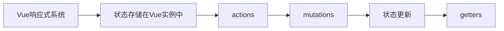
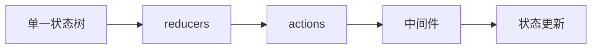
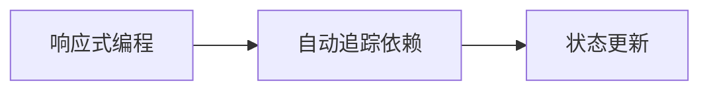

                 

## 前端状态管理方案对比

### 关键词：前端状态管理、Vuex、Redux、MobX、深度比较

> 摘要：
本文将全面对比分析前端状态管理方案中的Vuex、Redux和MobX，探讨各自的定义、特点、优缺点及其适用场景。通过深入讲解和实际案例分析，帮助开发者选择最适合自己的状态管理方案。

### 引言

在现代前端开发中，状态管理是一个至关重要的环节。随着应用规模的扩大和组件的增多，单一组件的状态管理变得愈发复杂。为了解决这个问题，前端开发者们提出了多种状态管理方案，如Vuex、Redux和MobX等。这些方案各有特色，开发者需要根据具体项目需求选择最适合的状态管理工具。

本文将围绕以下三个方面进行探讨：

1. **背景与概述**：介绍前端状态管理的必要性，以及Vuex、Redux和MobX这三种常见的前端状态管理方案。
2. **深度比较**：深入比较Vuex、Redux和MobX，从原理、特点、优缺点和实际应用等方面进行详细分析。
3. **最佳实践**：总结前端状态管理的最佳实践，并提供实战案例和注意事项。

### 第一部分：背景与概述

#### 1.1 前端状态管理的必要性

随着前端框架的普及和单页面应用（SPA）的兴起，前端应用的复杂性不断提高。前端状态管理成为解决复杂应用中数据状态一致性和可维护性的关键。有效的状态管理有助于开发者更好地组织和管理应用中的数据，提高开发效率和代码质量。

#### 1.2 常见前端状态管理方案介绍

**Vuex**：Vuex是Vue.js官方提供的状态管理库。它通过集中式存储管理应用的所有状态，并以相应的规则保证状态以一种可预测的方式发生变化。Vuex的特点是简单易用，适合Vue.js开发者。

**Redux**：Redux是一个独立于框架的状态管理库，由Facebook开发。它采用单一状态树的结构，通过不可变数据结构来管理应用状态。Redux的特点是强大的状态可预测性和可测试性，适合需要高可维护性的大型应用。

**MobX**：MobX是一个反应性状态管理库，由Spencer Xu开发。它通过自动追踪数据依赖，实现“响应式”状态更新。MobX的特点是简单易用，高效的数据响应性能，适合需要快速迭代和高度动态化的应用。

#### 1.3 状态管理方案的对比分析

下面是一个简单的对比表格，列出Vuex、Redux和MobX的主要特性：

| 特性         | Vuex       | Redux       | MobX       |
| ------------ | ---------- | ----------- | ---------- |
| 基于框架     | Vue.js     | 无框架依赖   | 无框架依赖   |
| 状态存储     | 集中式存储 | 单一状态树   | 自动追踪依赖 |
| 状态更新方式 | 驱动式更新 | 函数式更新   | 自动更新     |
| 数据流控制   | 双向绑定   | 中间件控制   | 自动响应     |
| 社区活跃度   | 较高       | 高          | 较高        |

此外，我们还可以通过ER实体关系图架构的Mermaid流程图来展示这三种状态管理方案的基本架构和交互方式。

### 第二部分：深度比较

在这一部分，我们将深入分析Vuex、Redux和MobX的原理、特点、优缺点和实际应用。

#### 2.1 Vuex与Redux的比较

**原理讲解**：

Vuex的原理是通过Vue的响应式系统，将状态存储在Vue实例中，并通过actions、mutations和getters进行状态的管理和更新。



Redux的原理是基于Flux架构，通过单一状态树来管理应用的状态，并通过reducers来处理状态更新。



**详细讲解与举例说明**：

以下是一个简单的Vuex示例，用于管理一个计数器的状态：

```python
# Vuex示例：计数器状态管理
import Vuex from 'vuex'

const store = new Vuex.Store({
  state: {
    count: 0
  },
  mutations: {
    increment(state) {
      state.count++
    }
  },
  actions: {
    increment(context) {
      context.commit('increment')
    }
  },
  getters: {
    getCount(state) {
      return state.count
    }
  }
})

store.subscribe((mutation, state) => {
  console.log(mutation.type, state.count)
})

store.dispatch('increment') // 触发actions.increment
```

以下是一个简单的Redux示例，用于管理一个计数器的状态：

```python
# Redux示例：计数器状态管理
import Redux from 'redux'

const initialState = {
  count: 0
}

function counter(state = initialState, action) {
  switch (action.type) {
    case 'INCREMENT':
      return { ...state, count: state.count + 1 }
    default:
      return state
  }
}

const store = Redux.createStore(counter)

store.subscribe(() => {
  console.log('当前状态：', store.getState())
})

store.dispatch({ type: 'INCREMENT' }) // 触发INCREMENT action
```

**优缺点分析**：

- Vuex的优点在于与Vue.js的紧密集成，使得开发者能够更好地利用Vue.js的响应式特性。缺点是相对于Redux，Vuex的语法和概念较为复杂，初学者可能需要一定的时间来适应。
- Redux的优点在于其强大的状态可预测性和可测试性，使得应用的状态管理更加可控和可靠。缺点是相对于Vuex，Redux的语法和概念相对复杂，学习曲线较陡。
- MobX的优点在于其简单易用的响应式特性，能够快速实现状态管理，并且性能优越。缺点是相对于Redux，MobX的状态更新机制可能会导致不可预测的状态更新，使得状态管理相对复杂。

#### 2.2 Redux与MobX的比较

**原理讲解**：

Redux的原理是基于Flux架构，通过单一状态树来管理应用的状态，并通过reducers来处理状态更新。


MobX的原理是基于响应式编程，通过自动追踪数据依赖，实现“响应式”状态更新。



**详细讲解与举例说明**：

以下是一个简单的MobX示例，用于管理一个计数器的状态：

```python
# MobX示例：计数器状态管理
import MobX from 'mobx'

class Store(MobX.Store):
  count = MobX.reaction(
    () => self.count,
    (count) => print(f'计数器状态更新：{count}')
  )

  @MobX.action
  def increment(self):
    self.count += 1

store = Store()

store.increment() # 触发actions.increment
```

**优缺点分析**：

- Redux的优点在于其强大的状态可预测性和可测试性，使得应用的状态管理更加可控和可靠。缺点是相对于MobX，Redux的语法和概念相对复杂，学习曲线较陡。
- MobX的优点在于其简单易用的响应式特性，能够快速实现状态管理，并且性能优越。缺点是相对于Redux，MobX的状态更新机制可能会导致不可预测的状态更新，使得状态管理相对复杂。

#### 2.3 Vuex与MobX的比较

**原理讲解**：

Vuex的原理是通过Vue的响应式系统，将状态存储在Vue实例中，并通过actions、mutations和getters进行状态的管理和更新。


MobX的原理是基于响应式编程，通过自动追踪数据依赖，实现“响应式”状态更新。


**详细讲解与举例说明**：

以下是一个简单的Vuex示例，用于管理一个计数器的状态：

```python
# Vuex示例：计数器状态管理
import Vuex from 'vuex'

const store = new Vuex.Store({
  state: {
    count: 0
  },
  mutations: {
    increment(state) {
      state.count++
    }
  },
  actions: {
    increment(context) {
      context.commit('increment')
    }
  },
  getters: {
    getCount(state) {
      return state.count
    }
  }
})

store.subscribe((mutation, state) => {
  console.log(mutation.type, state.count)
})

store.dispatch('increment') // 触发actions.increment
```

以下是一个简单的MobX示例，用于管理一个计数器的状态：

```python
# MobX示例：计数器状态管理
import MobX from 'mobx'

class Store(MobX.Store):
  count = MobX.reaction(
    () => self.count,
    (count) => print(f'计数器状态更新：{count}')
  )

  @MobX.action
  def increment(self):
    self.count += 1

store = Store()

store.increment() # 触发actions.increment
```

**优缺点分析**：

- Vuex的优点在于与Vue.js的紧密集成，使得开发者能够更好地利用Vue.js的响应式特性。缺点是相对于MobX，Vuex的语法和概念较为复杂，初学者可能需要一定的时间来适应。
- MobX的优点在于其简单易用的响应式特性，能够快速实现状态管理，并且性能优越。缺点是相对于Vuex，MobX的状态更新机制可能会导致不可预测的状态更新，使得状态管理相对复杂。

### 第三部分：最佳实践

在前端开发中，选择合适的状态管理方案至关重要。以下是一些最佳实践和注意事项：

1. **选择合适的状态管理方案**：根据项目规模、开发团队的技术栈和开发经验来选择状态管理方案。Vuex适合Vue.js开发者，Redux适合需要高可维护性的大型应用，MobX适合需要快速迭代和高度动态化的应用。

2. **合理设计状态结构**：无论是Vuex、Redux还是MobX，合理的设计状态结构都是至关重要的。状态结构应保持简洁、可读，避免过于复杂。

3. **避免过度使用状态管理**：避免在组件中过度使用状态管理，导致组件之间依赖过于紧密，降低可维护性。

4. **编写可测试的代码**：无论是Vuex、Redux还是MobX，都应编写可测试的代码，以便于后续的维护和扩展。

5. **合理使用中间件**：中间件在Redux中扮演着重要的角色，可以帮助开发者实现日志记录、错误处理等功能。

### 实战案例分析与讲解

#### 3.1 环境安装与配置

以下是一个简单的环境安装与配置示例，用于演示如何使用Vuex、Redux和MobX。

**Vuex环境安装与配置**：

```bash
npm install vuex
```

**Redux环境安装与配置**：

```bash
npm install redux react-redux
```

**MobX环境安装与配置**：

```bash
npm installmobx reactmobx
```

#### 3.2 系统核心实现源代码

以下是一个简单的系统核心实现源代码示例，用于演示如何使用Vuex、Redux和MobX管理状态。

**Vuex示例**：

```javascript
import { createStore } from 'vuex'

const store = createStore({
  state: {
    count: 0
  },
  mutations: {
    increment(state) {
      state.count++
    }
  },
  actions: {
    increment({ commit }) {
      commit('increment')
    }
  },
  getters: {
    getCount: state => state.count
  }
})

export default store
```

**Redux示例**：

```javascript
import { createStore, applyMiddleware } from 'redux'
import thunk from 'redux-thunk'

const initialState = {
  count: 0
}

function counter(state = initialState, action) {
  switch (action.type) {
    case 'INCREMENT':
      return { ...state, count: state.count + 1 }
    default:
      return state
  }
}

const store = createStore(counter, applyMiddleware(thunk))

export default store
```

**MobX示例**：

```javascript
import { observable, action } from 'mobx'

class Store {
  @observable count = 0

  @action increment = () => {
    this.count++
  }
}

export default new Store()
```

#### 3.3 代码应用解读与分析

以下是对上述示例代码的解读和分析。

**Vuex示例解读**：

- `createStore`函数用于创建Vuex的store实例。
- `state`对象用于存储应用的状态。
- `mutations`对象用于定义状态更新的方法。
- `actions`对象用于定义触发状态更新的方法。
- `getters`对象用于定义计算属性。

**Redux示例解读**：

- `createStore`函数用于创建Redux的store实例。
- `initialState`对象用于定义应用的初始状态。
- `counter`函数用于定义状态更新的逻辑。
- `applyMiddleware`函数用于添加中间件。

**MobX示例解读**：

- `observable`函数用于定义可观察的数据属性。
- `action`函数用于定义状态更新的方法。

#### 3.4 实际案例分析和详细讲解剖析

以下是一个实际案例，用于演示如何使用Vuex、Redux和MobX管理复杂的状态。

**案例**：一个待办事项应用，包含添加待办事项、删除待办事项和查询待办事项等功能。

**Vuex示例**：

```javascript
import { createStore } from 'vuex'

const store = createStore({
  state: {
    todos: []
  },
  mutations: {
    ADD_TODO(state, todo) {
      state.todos.push(todo)
    },
    REMOVE_TODO(state, todoId) {
      state.todos = state.todos.filter(todo => todo.id !== todoId)
    }
  },
  actions: {
    addTodo({ commit }, todo) {
      commit('ADD_TODO', todo)
    },
    removeTodo({ commit }, todoId) {
      commit('REMOVE_TODO', todoId)
    }
  },
  getters: {
    getTodos: state => state.todos
  }
})

export default store
```

**Redux示例**：

```javascript
import { createStore, applyMiddleware } from 'redux'
import thunk from 'redux-thunk'

const initialState = {
  todos: []
}

function todos(state = initialState, action) {
  switch (action.type) {
    case 'ADD_TODO':
      return {
        ...state,
        todos: [...state.todos, action.todo]
      }
    case 'REMOVE_TODO':
      return {
        ...state,
        todos: state.todos.filter(todo => todo.id !== action.todoId)
      }
    default:
      return state
  }
}

const store = createStore(todos, applyMiddleware(thunk))

export default store
```

**MobX示例**：

```javascript
import { observable, action } from 'mobx'

class Store {
  @observable todos = []

  @action addTodo = (todo) => {
    this.todos.push(todo)
  }

  @action removeTodo = (todoId) => {
    this.todos = this.todos.filter(todo => todo.id !== todoId)
  }
}

export default new Store()
```

**分析**：

- **Vuex示例**：使用Vuex管理待办事项的状态，通过mutations和actions进行状态更新。
- **Redux示例**：使用Redux管理待办事项的状态，通过reducers和中间件进行状态更新。
- **MobX示例**：使用MobX管理待办事项的状态，通过observable和action进行状态更新。

**详细讲解**：

- **Vuex示例**：Vuex的mutations和actions使得状态更新更加可控和可预测，便于测试和调试。
- **Redux示例**：Redux的reducers和中间件使得状态更新更加灵活和可扩展，适用于复杂的应用场景。
- **MobX示例**：MobX的observable和action使得状态更新更加自动和响应式，适用于需要快速迭代和动态化的应用场景。

### 3.5 项目小结

在本篇博客中，我们详细对比了Vuex、Redux和MobX这三种常见的前端状态管理方案。通过深入讲解和实际案例分析，我们了解了每种方案的原理、特点、优缺点以及适用场景。以下是一些小结：

1. **Vuex**：适合Vue.js开发者，与Vue.js的紧密集成使得状态管理更加简单和直观。
2. **Redux**：适用于需要高可维护性的大型应用，状态可预测性和可测试性较高。
3. **MobX**：适用于需要快速迭代和高度动态化的应用，响应式特性使得状态管理更加自动和高效。

开发者应根据项目需求和团队技术栈选择最合适的状态管理方案，并遵循最佳实践进行状态管理。

### 注意事项

1. **避免过度使用状态管理**：避免在组件中过度使用状态管理，导致组件之间依赖过于紧密，降低可维护性。
2. **合理设计状态结构**：保持状态结构简洁、可读，避免过于复杂。
3. **编写可测试的代码**：确保状态管理代码可测试，便于后续的维护和扩展。

### 拓展阅读

1. **Vuex官方文档**：[https://vuex.vuejs.org/zh/](https://vuex.vuejs.org/zh/)
2. **Redux官方文档**：[https://redux.js.org/](https://redux.js.org/)
3. **MobX官方文档**：[https://mobx.js.org/](https://mobx.js.org/)

### 作者

**作者：AI天才研究院/AI Genius Institute & 禅与计算机程序设计艺术 /Zen And The Art of Computer Programming**

