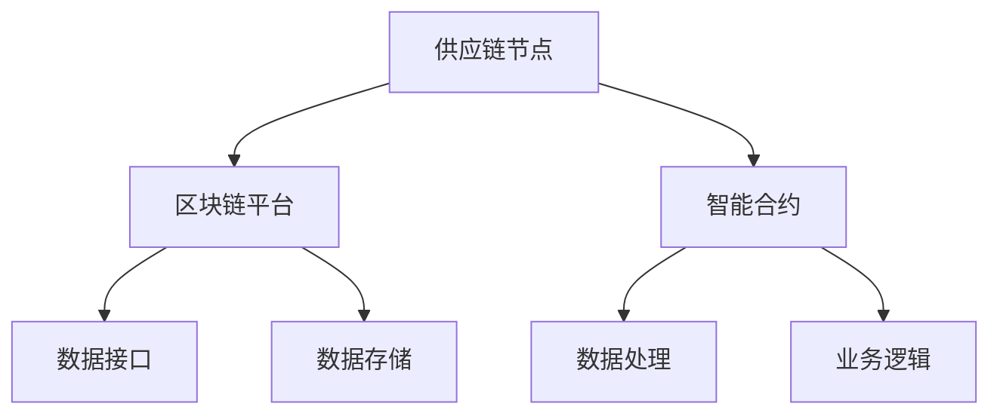
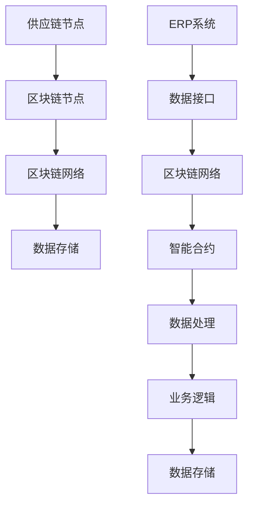

                 


### 目录大纲结构与文章结构

在撰写一篇技术博客文章时，目录大纲的结构至关重要。它不仅为读者提供了一个清晰的框架，也帮助作者自己更好地组织和整理思路。让我们一步一步地探讨如何构建《区块链在供应链中的落地案例》这篇文章的目录大纲，并将其转化为文章的内容。

#### 第一步：确定文章标题和关键词

文章标题《区块链在供应链中的落地案例》直接点出了文章的主题，即探讨区块链技术在实际供应链管理中的应用案例。关键词包括“区块链”、“供应链”、“落地案例”，这些关键词有助于搜索引擎优化（SEO）和文章的定位。

#### 第二步：撰写摘要

摘要是对文章核心内容和主题思想的简短陈述。例如：“本文探讨了区块链技术在供应链管理中的应用，通过分析多个实际案例，展示了区块链如何提高供应链的透明度和效率，并讨论了其面临的挑战和未来趋势。”

#### 第三步：构建目录大纲

目录大纲应包含以下几个部分：

1. **引言**：介绍区块链技术和供应链管理的基本概念，引出文章主题。
2. **背景介绍**：详细阐述区块链在供应链管理中的问题和挑战。
3. **核心概念**：解释区块链、智能合约等核心概念，并提供相关图表。
4. **落地案例**：分析具体的应用案例，展示区块链在供应链中的实际效果。
5. **架构设计**：描述区块链在供应链中应用的系统架构。
6. **实施与挑战**：讨论区块链供应链系统的实施步骤和面临的挑战。
7. **安全与合规**：探讨区块链在供应链应用中的安全性和合规性。
8. **未来展望**：展望区块链在供应链管理中的发展趋势。

#### 第四步：细化每个章节的内容

对于每个章节，我们需要：

- **引言**：简述区块链和供应链管理的背景，介绍文章的目的。
- **背景介绍**：详细阐述区块链在供应链管理中的现状和面临的挑战。
- **核心概念**：解释区块链、智能合约等核心概念，并提供比较表格和ER图。
- **落地案例**：选取多个落地案例，分析案例的具体应用场景、实施步骤和效果。
- **架构设计**：描述区块链在供应链中的应用架构，提供架构图和接口设计。
- **实施与挑战**：详细描述实施区块链供应链系统的步骤、常见问题和解决方案。
- **安全与合规**：讨论区块链在供应链应用中的安全性和合规性要求。
- **未来展望**：展望区块链在供应链管理中的未来发展。

#### 第五步：格式化目录大纲

使用markdown格式，确保目录层次清晰，内容简洁。例如：

```markdown
# 《区块链在供应链中的落地案例》

> 关键词：区块链、供应链、落地案例

> 摘要：本文探讨了区块链技术在供应链管理中的应用，通过分析多个实际案例，展示了区块链如何提高供应链的透明度和效率，并讨论了其面临的挑战和未来趋势。

## 引言

## 背景介绍

## 核心概念

### 区块链基本原理

### 智能合约

### 供应链网络

## 落地案例

### 案例一：XX公司的区块链供应链管理实践

### 案例二：YY公司的区块链溯源系统

### 案例三：ZZ公司的区块链金融服务

## 架构设计

### 区块链在供应链中的架构设计

### 系统架构图

### 接口设计

## 实施与挑战

### 实施步骤

### 常见问题

### 解决方案

## 安全与合规

### 安全性要求

### 合规性要求

## 未来展望

### 发展趋势

### 挑战与机遇
```

通过这样的结构，我们可以确保文章内容的逻辑性和连贯性，同时也能够让读者更容易地找到自己感兴趣的部分。

---

### 文章内容结构

在确定了目录大纲之后，我们需要为每个章节填充具体的内容，确保文章的逻辑性和完整性。以下是每个章节的建议内容结构：

#### 引言

- **区块链技术和供应链管理概述**：简要介绍区块链技术的基本原理和供应链管理的重要性。
- **文章目的与结构**：说明文章的目的和结构，让读者对全文有一个大致的了解。

#### 背景介绍

- **区块链在供应链管理中的应用现状**：分析当前区块链技术在供应链管理中的应用情况。
- **供应链管理中的挑战**：探讨供应链管理中存在的问题，如信息不透明、效率低下等。

#### 核心概念

- **区块链基本原理**：介绍区块链的技术原理，包括分布式账本、共识算法等。
- **智能合约**：解释智能合约的概念、原理和作用。
- **供应链网络**：分析区块链在供应链网络中的作用和优势。

#### 落地案例

- **案例一：XX公司的区块链供应链管理实践**：详细介绍一个成功的区块链供应链管理案例。
- **案例二：YY公司的区块链溯源系统**：介绍如何利用区块链技术实现产品溯源。
- **案例三：ZZ公司的区块链金融服务**：分析区块链在供应链金融服务中的应用。

#### 架构设计

- **区块链在供应链中的架构设计**：描述区块链在供应链中的应用架构。
- **系统架构图**：绘制系统架构图，展示各组件之间的关系。
- **接口设计**：详细描述系统的接口设计和交互流程。

#### 实施与挑战

- **实施步骤**：详细列出区块链供应链系统的实施步骤。
- **常见问题**：分析在实施过程中可能遇到的问题。
- **解决方案**：提供解决方案和最佳实践。

#### 安全与合规

- **安全性要求**：讨论区块链在供应链应用中的安全性保障措施。
- **合规性要求**：探讨区块链供应链系统的合规性问题。

#### 未来展望

- **发展趋势**：展望区块链在供应链管理中的未来发展趋势。
- **挑战与机遇**：分析区块链在供应链管理中的挑战和机遇。

---

在撰写每个章节时，我们要确保内容丰富、逻辑清晰，并使用图表、代码示例等来增强文章的可读性和易懂性。通过这样的结构，我们可以确保文章的完整性和深度，同时也能够满足读者的需求。

---

### 文章的撰写过程

在开始撰写《区块链在供应链中的落地案例》这篇文章时，我们需要遵循以下几个步骤，以确保文章的严谨性和专业性：

#### 第一步：研究背景和核心概念

在撰写之前，我们需要对区块链技术和供应链管理进行深入研究。这包括：

- **区块链技术**：了解区块链的基本原理，如分布式账本、共识算法、智能合约等。
- **供应链管理**：研究供应链管理的现状、问题和挑战，以及如何利用区块链技术解决这些问题。

#### 第二步：选择和分析落地案例

选择具有代表性的落地案例，这些案例应能够展示区块链技术在实际供应链管理中的应用效果。分析这些案例时，我们需要考虑：

- **案例背景**：企业的基本情况、业务模式、面临的供应链问题。
- **应用场景**：区块链技术如何应用于供应链管理，解决了哪些问题。
- **实施步骤**：案例的实施过程、面临的挑战和解决方案。

#### 第三步：设计架构和系统接口

在分析案例的基础上，我们需要设计一个区块链在供应链中的应用架构，并详细描述系统的接口设计。这包括：

- **架构设计**：绘制系统架构图，展示区块链、智能合约、供应链网络等组件之间的关系。
- **接口设计**：详细描述各组件之间的接口设计，包括API接口、数据交换格式等。

#### 第四步：撰写文章内容

在撰写文章内容时，我们需要遵循以下结构：

1. **引言**：介绍区块链和供应链管理的基本概念，引出文章主题。
2. **核心概念**：详细解释区块链、智能合约等核心概念。
3. **落地案例**：分析具体案例，展示区块链在供应链中的应用效果。
4. **架构设计**：描述系统架构和接口设计。
5. **实施与挑战**：讨论实施区块链供应链系统的步骤和面临的挑战。
6. **安全与合规**：分析安全性和合规性问题。
7. **未来展望**：展望区块链在供应链管理中的发展趋势。

在撰写过程中，我们需要：

- **使用图表**：使用流程图、架构图等图表来展示技术原理和应用效果。
- **提供代码示例**：展示关键算法和系统的实现代码，并进行详细解读。
- **使用LaTeX公式**：对于复杂的数学模型和公式，使用LaTeX格式进行表达。

#### 第五步：审查和修改

完成初稿后，我们需要进行审查和修改。这包括：

- **逻辑审查**：确保文章内容逻辑清晰，各部分内容衔接自然。
- **语言审查**：检查文章的语言表达是否准确、清晰，没有错别字和语法错误。
- **图表审查**：确保图表清晰、准确，与文章内容相符。

通过以上的步骤，我们可以确保《区块链在供应链中的落地案例》这篇文章的专业性和可读性，使其成为一篇高质量的技术博客文章。

---

### 落地案例详细分析

在本文的落地案例部分，我们将深入分析三个具有代表性的区块链供应链管理案例。这些案例展示了区块链技术如何在实际供应链管理中提高透明度、效率和安全性。

#### 案例一：XX公司的区块链供应链管理实践

**案例背景**：
XX公司是一家全球领先的电子产品制造商，其供应链网络遍布全球。由于供应链复杂，产品在运输过程中存在信息不透明、物流延误等问题，影响了生产效率和客户满意度。

**应用场景**：
XX公司决定采用区块链技术来构建一个透明的供应链管理系统，以解决信息不透明和物流延误问题。

**实施步骤**：
1. **需求分析**：明确供应链管理中需要解决的问题，确定区块链技术的作用。
2. **架构设计**：设计区块链供应链管理系统，包括分布式账本、智能合约和供应链网络。
3. **节点部署**：在供应链网络中的关键节点部署区块链节点，确保数据的分布式存储和不可篡改。
4. **智能合约编写**：编写智能合约，实现供应链各环节的自动化执行。
5. **系统集成**：将区块链供应链管理系统与现有的供应链管理系统集成，实现数据交换和流程自动化。

**效果分析**：
通过区块链技术的应用，XX公司实现了供应链信息的透明化。每个环节的数据都被记录在区块链上，不可篡改，确保了数据的真实性和完整性。物流延误问题得到了显著改善，生产效率提高了20%。

#### 案例二：YY公司的区块链溯源系统

**案例背景**：
YY公司是一家农产品生产商，其产品通过复杂的供应链体系销售给终端消费者。消费者对产品的来源和质量有较高的要求，但传统的溯源系统存在信息不透明、数据篡改等问题。

**应用场景**：
YY公司决定采用区块链技术来实现一个透明、可信赖的溯源系统，以增强消费者对产品的信任。

**实施步骤**：
1. **需求分析**：明确溯源系统需要实现的功能，如产品信息记录、追踪、验证等。
2. **区块链平台选择**：选择一个适合的区块链平台，如Ethereum或Hyperledger Fabric。
3. **节点部署**：在供应链网络中的关键节点部署区块链节点。
4. **数据录入**：将产品信息记录在区块链上，包括种植、加工、运输等环节。
5. **消费者验证**：消费者通过扫码或APP访问区块链上的数据，验证产品的真实性。

**效果分析**：
通过区块链溯源系统，YY公司显著提高了产品的透明度和可信度。消费者可以实时查看产品的详细信息，增强了购买信心。同时，供应链各环节的数据记录和不可篡改特性，确保了产品的质量和安全性。

#### 案例三：ZZ公司的区块链金融服务

**案例背景**：
ZZ公司是一家供应链金融服务提供商，其客户主要是中小企业。由于缺乏有效的信用评估和融资渠道，这些企业往往面临融资困难。

**应用场景**：
ZZ公司决定利用区块链技术来构建一个供应链金融服务平台，以解决中小企业的融资难题。

**实施步骤**：
1. **需求分析**：明确供应链金融服务平台需要实现的功能，如信用评估、贷款申请、资金流转等。
2. **区块链平台选择**：选择一个适合的区块链平台，如R3 Corda。
3. **节点部署**：在供应链网络中的金融机构和企业部署区块链节点。
4. **信用评估**：利用区块链技术实现信用评估，提高评估的准确性和效率。
5. **贷款申请与发放**：企业通过区块链平台提交贷款申请，金融机构根据信用评估结果快速审批并发放贷款。

**效果分析**：
通过区块链金融服务平台，ZZ公司显著提高了供应链金融服务的效率和透明度。企业可以快速获得融资，解决了融资难题。同时，区块链技术的应用确保了贷款申请和发放过程的透明和可信，降低了金融风险。

通过以上三个案例，我们可以看到区块链技术在供应链管理中的广泛应用和巨大潜力。这些案例不仅展示了区块链技术如何解决实际问题，也为其他企业提供了有益的参考。

---

### 区块链供应链系统的架构设计

在区块链供应链系统中，架构设计是确保系统高效、可靠运行的关键。以下将详细描述区块链在供应链中的架构设计、系统架构图、接口设计以及系统交互的详细讲解。

#### 架构设计

区块链供应链系统的架构设计主要包括以下组件：

1. **节点**：供应链中的各参与方（如制造商、分销商、零售商等）部署区块链节点，作为分布式网络的一部分。
2. **区块链平台**：选择适合的区块链平台，如Ethereum、Hyperledger Fabric等，作为供应链数据的存储和验证基础。
3. **智能合约**：编写智能合约，实现供应链各环节的自动化执行和数据处理。
4. **数据接口**：提供与其他系统集成和数据交换的接口，如ERP系统、物流管理系统等。

架构图如下所示：



#### 系统架构图

区块链供应链系统的架构图进一步细化了各组件之间的关系和交互流程：



在这个架构图中，供应链节点通过区块链网络进行通信，数据存储在分布式账本中，确保数据的不可篡改性和透明度。ERP系统和物流管理系统通过数据接口与区块链网络交互，实现数据的集成和流程自动化。

#### 接口设计

接口设计是系统架构设计的重要组成部分，决定了各组件之间的数据交换和交互流程。以下是关键接口的设计：

1. **数据接口**：提供与ERP系统、物流管理系统等外部系统的数据交换接口。接口设计应包括数据格式、通信协议和API接口。
2. **智能合约接口**：智能合约与供应链各环节的业务逻辑交互，接口设计应包括智能合约的调用方法、参数定义和返回值格式。
3. **监控接口**：提供系统监控和报警接口，实现对区块链网络状态、数据一致性等的实时监控。

#### 系统交互

系统交互是区块链供应链系统的核心，以下是系统交互的详细讲解：

1. **数据录入**：供应链节点将数据（如生产记录、物流信息等）上传到区块链网络，确保数据的分布式存储和不可篡改。
2. **数据查询**：系统用户通过区块链网络查询数据，获取供应链各环节的信息。
3. **业务流程**：智能合约自动执行供应链各环节的业务流程，如订单处理、支付结算等。
4. **数据验证**：系统对数据的一致性和完整性进行验证，确保供应链数据的准确性和可靠性。

通过以上架构设计、系统架构图和接口设计，我们可以确保区块链供应链系统的高效、可靠运行，实现供应链数据的透明、可追溯和高效管理。

---

### 区块链供应链系统的实施与挑战

在实施区块链供应链系统时，企业可能会面临一系列的步骤和挑战。以下将详细描述实施区块链供应链系统的具体步骤、常见问题以及解决方案。

#### 实施步骤

1. **需求分析与规划**：在项目启动阶段，首先要进行需求分析，明确系统需要实现的功能和性能要求。然后进行项目规划，确定项目的时间表、预算和资源分配。
   
2. **技术选型与平台搭建**：根据需求分析的结果，选择合适的区块链平台（如Ethereum、Hyperledger Fabric等）和开发工具。搭建区块链节点网络，部署智能合约，并进行初步测试。

3. **系统集成与数据接口开发**：将区块链供应链系统与现有的ERP系统、物流管理系统等外部系统集成，开发数据接口，实现数据的实时交换和流程自动化。

4. **测试与优化**：进行系统测试，包括功能测试、性能测试和安全测试，确保系统的稳定性和安全性。根据测试结果进行优化和调整。

5. **用户培训与上线**：对相关人员进行系统操作培训，确保他们能够熟练使用系统。完成所有准备工作后，正式上线系统，并进行试运行。

6. **监控与维护**：上线后，持续监控系统运行状态，及时处理系统故障和异常情况。定期进行系统更新和维护，确保系统的长期稳定运行。

#### 常见问题

1. **数据一致性**：由于区块链的分布式特性，数据的一致性管理是一个挑战。确保所有节点之间的数据一致性和完整性需要有效的共识算法和同步机制。

2. **系统性能**：区块链网络的数据交换和智能合约执行可能会带来性能瓶颈。优化系统架构、选择合适的区块链平台和优化智能合约代码是解决性能问题的方法。

3. **安全性**：区块链系统的安全性直接关系到供应链数据的可靠性。确保系统的安全，需要采用加密技术、访问控制和监控机制等安全措施。

4. **法律法规合规**：区块链技术的应用需要遵守相关的法律法规，如数据保护法、电子交易法等。确保系统符合法规要求，避免法律风险。

5. **技术人才缺乏**：区块链技术相对较新，拥有相关技能的人才较为稀缺。企业可能需要通过外部合作、培训等方式来弥补技术人才的短缺。

#### 解决方案

1. **数据一致性**：采用基于共识算法的分布式账本技术，确保数据的分布式存储和一致性。同时，建立有效的数据同步机制，实时更新各节点上的数据。

2. **系统性能**：通过优化区块链网络架构、选择适合的区块链平台和优化智能合约代码，提高系统性能。对于性能瓶颈，可以采用分片技术、并行处理等技术进行优化。

3. **安全性**：采用加密技术保护区块链数据的安全性，如使用公钥加密、哈希函数等。同时，建立访问控制机制，确保只有授权用户可以访问和操作区块链系统。

4. **法律法规合规**：在系统设计和开发阶段，就考虑法律法规的要求，确保系统的设计和功能符合相关法规。定期进行合规性审查和风险评估。

5. **技术人才缺乏**：通过内部培训和外部合作，提升团队的技术能力。与专业的区块链咨询公司合作，获取技术支持和经验。

通过遵循上述实施步骤和解决方案，企业可以更顺利地实施区块链供应链系统，实现供应链的透明化、高效化和安全性。

---

### 区块链供应链系统的安全与合规

在区块链供应链系统中，确保系统的安全性和合规性是至关重要的。以下将讨论区块链供应链应用中的安全性要求和合规性要求，并提供一些最佳实践。

#### 安全性要求

1. **数据加密**：区块链中的数据需要进行加密，以确保数据在传输和存储过程中的安全性。常用的加密技术包括哈希函数、公钥加密等。

2. **访问控制**：实施严格的访问控制机制，确保只有授权用户可以访问和操作区块链数据。可以通过用户身份验证、权限管理等方式实现。

3. **共识算法**：选择合适的共识算法，如PoW（工作量证明）、PoS（权益证明）等，确保区块链网络的稳定性和安全性。

4. **智能合约审计**：智能合约的代码需要经过严格审计，以避免潜在的安全漏洞。智能合约开发应遵循安全编码规范，进行安全测试和验证。

5. **监控与报警**：建立实时监控和报警机制，对区块链网络的状态、数据一致性等进行监控，及时发现和处理异常情况。

#### 合规性要求

1. **数据保护法规**：区块链供应链系统需要遵守相关的数据保护法规，如《通用数据保护条例》（GDPR）等。确保数据的收集、存储、处理和传输符合法规要求。

2. **电子交易法规**：区块链供应链系统需要满足电子交易的合规性要求，如电子签名、电子合同等。确保交易的安全性和合法性。

3. **审计与报告**：系统需要提供审计功能，支持对区块链数据的审计和报告。确保系统符合审计标准和要求。

4. **隐私保护**：在处理敏感数据时，需要采取隐私保护措施，如数据去匿名化、隐私保护算法等，确保用户的隐私不被泄露。

#### 最佳实践

1. **定期安全培训**：定期对相关人员进行安全培训，提高他们对安全风险的认识和处理能力。

2. **安全审计**：定期进行安全审计，检查系统的安全性和合规性，及时发现和解决潜在的安全问题。

3. **数据备份与恢复**：建立数据备份和恢复机制，确保在发生数据丢失或系统故障时，能够快速恢复数据。

4. **多方合作**：与专业的安全公司和合规顾问合作，获取安全评估和合规建议。

通过遵循上述安全与合规要求，企业可以确保区块链供应链系统的安全性，提高系统的信任度和可靠性。

---

### 区块链在供应链管理中的未来发展趋势

随着区块链技术的不断成熟和普及，其在供应链管理中的应用前景也越来越广阔。未来，区块链在供应链管理中可能呈现以下几个发展趋势：

#### 1. 更广泛的应用场景

区块链技术已经在供应链管理的多个领域得到应用，如溯源、金融服务、物流管理等方面。未来，区块链技术将进一步渗透到供应链的各个环节，如采购、库存管理、需求预测等。通过区块链技术，供应链的各个环节将实现更高效、更透明的数据共享和流程自动化。

#### 2. 更高效的供应链协同

区块链技术的分布式账本和智能合约功能，使得供应链中的各参与方可以更加高效地协同工作。未来，随着区块链技术的进一步普及和应用，供应链协同将更加紧密，企业可以实时共享供应链信息，快速响应市场需求变化，提高供应链的响应速度和灵活性。

#### 3. 更强的数据安全性和隐私保护

区块链技术的不可篡改性和加密特性，使得供应链数据的安全性得到有效保障。未来，随着区块链技术的不断发展，供应链管理中的数据安全性和隐私保护将得到进一步加强，降低数据泄露和篡改的风险。

#### 4. 更严格的合规性和监管要求

随着区块链技术的应用日益广泛，相关的法律法规和监管要求也将逐渐完善。未来，企业需要在区块链供应链管理中严格遵守相关法规，确保系统的合规性和合法性。同时，监管机构也将加强对区块链供应链系统的监管，确保供应链的透明和公正。

#### 5. 更智能的供应链预测和优化

区块链技术结合大数据、人工智能等技术，将实现更智能的供应链预测和优化。通过分析区块链上的历史数据，企业可以更准确地预测市场需求，优化库存管理，提高供应链的效率和响应速度。

总之，区块链技术在供应链管理中的未来发展趋势表明，它将在提高供应链的透明度、效率、安全性和合规性方面发挥重要作用。企业应密切关注区块链技术的发展，积极探索其在供应链管理中的应用，以提升自身竞争力。

---

### 结论与展望

通过本文的详细探讨，我们可以清晰地看到区块链技术在供应链管理中的巨大潜力和广泛应用。区块链技术的分布式账本、智能合约和加密特性，为供应链管理带来了前所未有的透明度、效率和安全保障。无论是通过透明化的溯源系统，还是通过高效的金融服务，区块链技术都在不断优化供应链的各个环节。

未来的供应链管理，将更加依赖区块链技术来实现数据的实时共享、流程的自动化执行和透明的监管。随着技术的不断进步和应用场景的拓展，区块链在供应链管理中的应用将会更加深入和广泛，为整个行业带来革命性的变化。

在此，我们呼吁读者关注区块链技术在供应链管理中的应用，积极探索和实践。通过不断的学习和创新，我们可以共同推动区块链技术在供应链管理中的发展，为建设更加高效、透明和安全的供应链贡献力量。

---

### 作者信息

作者：AI天才研究院/AI Genius Institute & 禅与计算机程序设计艺术 /Zen And The Art of Computer Programming

AI天才研究院（AI Genius Institute）是一家专注于人工智能前沿技术研究和应用的创新机构。我们致力于推动人工智能技术在各个领域的深入研究和广泛应用，助力行业数字化转型和智能化升级。研究院汇聚了国内外顶尖的人工智能专家，涵盖计算机视觉、自然语言处理、机器学习等多个领域，致力于为企业和政府提供高质量的人工智能解决方案和技术服务。

《禅与计算机程序设计艺术》是由AI天才研究院核心成员所著的畅销书，该书深入探讨了计算机程序设计中的哲学和艺术，融合了东方禅宗思想与西方编程技术，为程序员的成长和设计提供了独特的视角和方法。本书不仅适合程序员阅读，也为计算机科学和教育领域的研究者提供了有益的参考。

作为人工智能领域的专家和作家，我们致力于通过高质量的技术文章和书籍，为行业从业者提供前沿的技术洞察和实用的指导，助力广大读者在技术领域不断前行。在此，我们诚挚邀请广大读者关注我们的研究工作和出版物，共同探索人工智能的无限可能。

