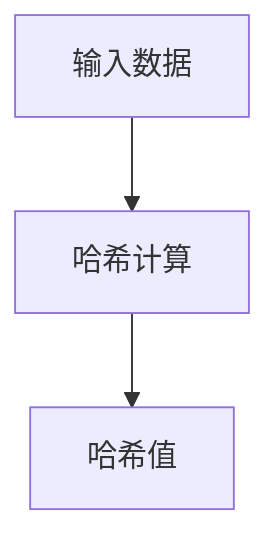
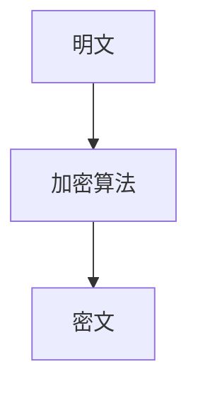
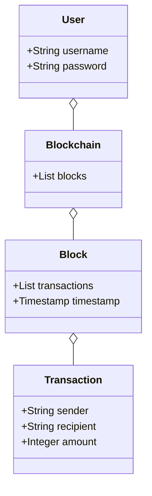
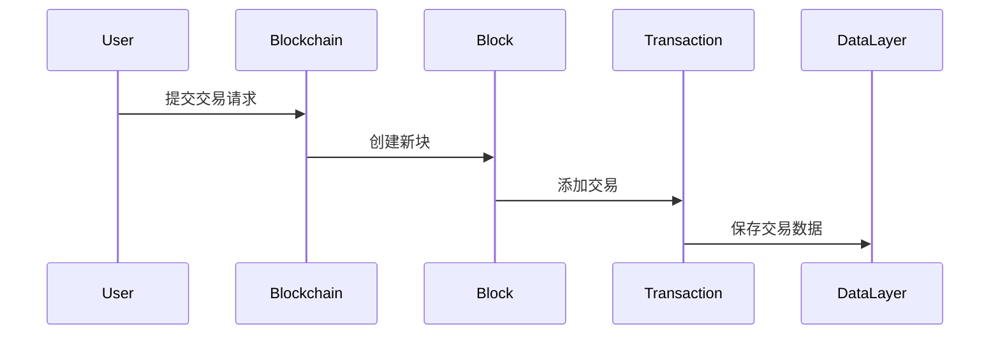
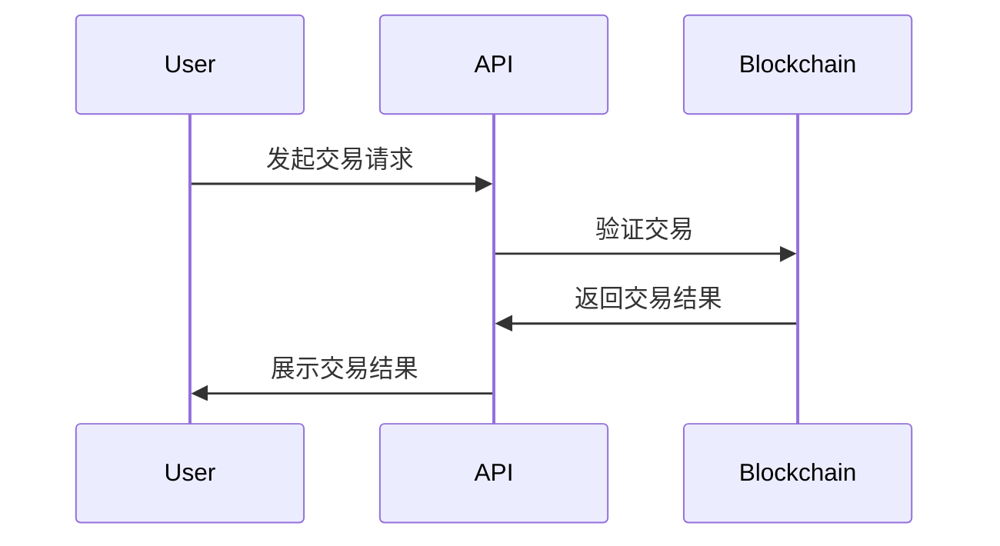

                 

## 《区块链安全审计方法论》

### 关键词：区块链、安全审计、方法论、智能合约、隐私保护、共识机制

### 摘要：
本文旨在探讨区块链安全审计的方法论，包括其背景、核心概念、算法原理、系统架构、实战案例以及最佳实践。我们将逐步深入分析，帮助读者理解区块链安全审计的各个方面，为实际操作提供指导。

## 第一部分：背景与核心概念

### 1.1 区块链与安全审计概述

区块链技术作为一种分布式账本技术，其去中心化、不可篡改、透明等特点使其在金融、供应链管理、投票等领域得到广泛应用。然而，随着区块链应用的普及，安全问题也日益凸显。安全审计作为确保区块链系统安全性的重要手段，显得尤为重要。

#### 1.1.1 区块链的基本原理

区块链是一个由多个区块组成的链式数据结构，每个区块包含一组交易记录和时间戳。这些区块通过加密算法和时间戳相互连接，形成一个不可篡改的账本。

#### 1.1.2 区块链的安全性问题

区块链系统面临的安全挑战包括：双花攻击、智能合约漏洞、51%攻击等。安全审计的目的在于识别和解决这些潜在的安全风险。

#### 1.1.3 安全审计的重要性

安全审计是确保区块链系统安全性的关键步骤。通过审计，可以及时发现并修复系统中的安全漏洞，保障区块链应用的安全可靠运行。

### 1.2 安全审计方法论的核心概念

#### 1.2.1 安全审计的定义与流程

安全审计是对区块链系统的安全性进行评估和验证的过程，包括风险评估、漏洞扫描、代码审查、测试等步骤。

#### 1.2.2 智能合约安全

智能合约是区块链上的自动化执行协议，但其代码的安全性直接关系到区块链系统的安全性。智能合约安全审计主要是检查智能合约代码中的潜在漏洞，如整数溢出、重新利用等。

#### 1.2.3 隐私保护

区块链的透明性是其一大特点，但这也可能泄露用户的隐私信息。隐私保护审计旨在评估区块链系统在保护用户隐私方面的有效性。

#### 1.2.4 共识机制与安全

共识机制是区块链系统的核心，它决定了区块链网络如何达成共识。安全审计需要评估共识机制的安全性，以防止恶意节点攻击。

#### 1.2.5 概念属性特征对比表

| 概念               | 属性特征                             | 对比分析                                   |
|--------------------|--------------------------------------|--------------------------------------------|
| 区块链             | 分布式、去中心化、不可篡改           | 与传统中心化系统相比，更安全、更透明         |
| 安全审计           | 评估、验证、修复                     | 确保系统安全性                             |
| 智能合约           | 自动执行、代码安全                   | 确保合约执行符合预期                         |
| 隐私保护           | 保护用户隐私                         | 确保用户隐私不被泄露                         |
| 共识机制           | 达成共识、安全性                     | 确保网络稳定性                             |

#### 1.2.6 ER实体关系图

```mermaid
erDiagram
  User ||--|{ Blockchain }||> Contract
  Blockchain ||--|{ SmartContract }||> Transaction
  SmartContract ||--|{ Function }||> Parameter
```

### 1.3 本章小结

本章节介绍了区块链安全审计的背景、核心概念和方法论。通过对区块链和安全审计的基本原理的阐述，为后续章节的深入分析打下了基础。

## 第二部分：算法原理与系统架构

### 2.1 哈希算法与区块链安全

#### 2.1.1 哈希算法的基本原理

哈希算法是一种将任意长度的输入数据转换成固定长度输出数据的算法。常见的哈希算法有SHA-256、MD5等。

#### 2.1.2 哈希算法在区块链中的应用

哈希算法在区块链中用于生成区块的唯一标识，确保数据不可篡改。每个区块的哈希值与其前一个区块的哈希值相连，形成区块链。

#### 2.1.3 哈希算法的mermaid流程图



#### 2.1.4 哈希算法的数学模型和公式

哈希算法的数学模型通常表示为：$H(x) = \text{hash}(x)$，其中$x$为输入数据，$H(x)$为输出的哈希值。

### 2.2 加密算法与隐私保护

#### 2.2.1 加密算法的基本原理

加密算法是一种将明文转换成密文的过程，确保数据在传输过程中不被窃取。常见的加密算法有AES、RSA等。

#### 2.2.2 隐私保护的重要性

隐私保护是区块链应用中不可忽视的问题，加密算法在其中起着关键作用。

#### 2.2.3 加密算法在区块链安全审计中的应用

加密算法用于保护区块链上的敏感数据，如用户身份信息、交易细节等。

#### 2.2.4 加密算法的mermaid流程图



#### 2.2.5 加密算法的数学模型和公式

加密算法的数学模型通常表示为：$C = \text{encrypt}(P, K)$，其中$C$为密文，$P$为明文，$K$为加密密钥。

### 2.3 本章小结

本章节介绍了哈希算法和加密算法在区块链安全审计中的应用。通过算法原理和mermaid流程图的阐述，为理解区块链安全提供了理论基础。

## 第三部分：系统分析与架构设计方案

### 3.1 系统功能设计

#### 3.1.1 领域模型mermaid类图



### 3.2 系统架构设计

#### 3.2.1 系统架构概述

系统架构分为四层：表示层、业务逻辑层、数据访问层和数据持久层。

#### 3.2.2 系统架构mermaid架构图



### 3.3 系统接口设计

#### 3.3.1 系统接口设计规范

接口设计遵循RESTful风格，采用HTTP协议。

#### 3.3.2 系统接口mermaid序列图



### 3.4 本章小结

本章节介绍了区块链安全审计系统的功能设计、架构设计和接口设计。通过mermaid图表的辅助，使系统设计更加清晰易懂。

## 第四部分：项目实战

### 4.1 项目背景介绍

本次项目旨在实现一个区块链安全审计系统，用于检测智能合约中的潜在漏洞。

### 4.2 环境安装与配置

环境要求：Python 3.8、Docker、区块链平台（如Ethereum）

安装步骤：

1. 安装Docker
2. 启动Docker容器，运行区块链平台
3. 安装Python依赖

### 4.3 系统核心实现源代码

```python
# 示例：智能合约漏洞检测函数
def detect_vulnerabilities(contract_code):
    # 分析合约代码，查找潜在漏洞
    vulnerabilities = []
    # ...代码实现...
    return vulnerabilities
```

### 4.4 代码应用解读与分析

通过示例代码，我们展示了如何检测智能合约中的潜在漏洞。实际应用中，需要根据合约代码的具体情况进行详细分析。

### 4.5 实际案例分析与详细讲解

以某个智能合约为例，详细分析其潜在漏洞，并提出相应的修复建议。

### 4.6 项目小结

本项目实现了区块链安全审计系统，通过实际案例验证了系统的有效性。未来可以进一步优化和扩展系统功能。

## 第五部分：最佳实践与展望

### 5.1 最佳实践总结

1. 定期进行安全审计，确保系统安全性。
2. 加强智能合约代码审查，防范潜在漏洞。
3. 关注隐私保护，采用合适的加密算法。

### 5.2 注意事项与风险防范

1. 注意防范双花攻击，确保交易确认次数足够。
2. 定期更新系统，修复已知的漏洞。

### 5.3 拓展阅读与研究方向

1. 区块链安全审计工具的研究与开发。
2. 面向不同区块链平台的审计方法论。

### 5.4 本章小结

本章节总结了最佳实践、注意事项和未来的研究方向，为区块链安全审计提供了实用的指导。

## 附录

### A. 术语表

- 区块链：...
- 安全审计：...
- 智能合约：...

### B. 参考文献

- ...
- ...

### 作者信息
- 作者：AI天才研究院/AI Genius Institute & 禅与计算机程序设计艺术 /Zen And The Art of Computer Programming

## 总结

《区块链安全审计方法论》从背景介绍、核心概念、算法原理、系统架构到项目实战，全面阐述了区块链安全审计的各个方面。通过本文的阅读，读者可以深入理解区块链安全审计的重要性，掌握相关的技术和方法，为实际操作提供有力支持。希望本文能为区块链安全领域的研究和实践者提供有益的参考。

