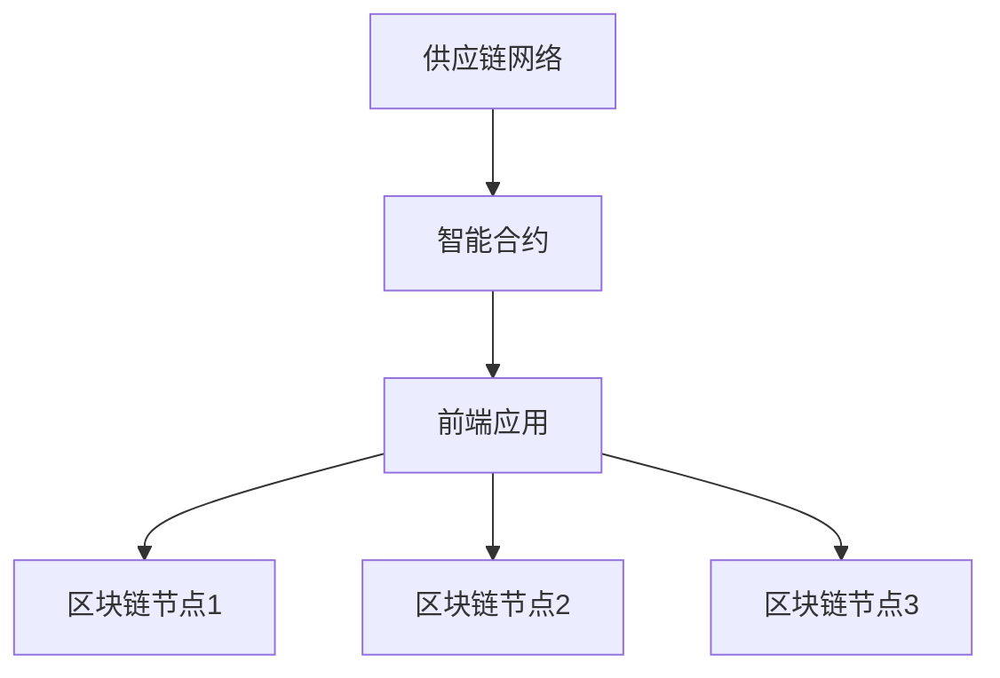
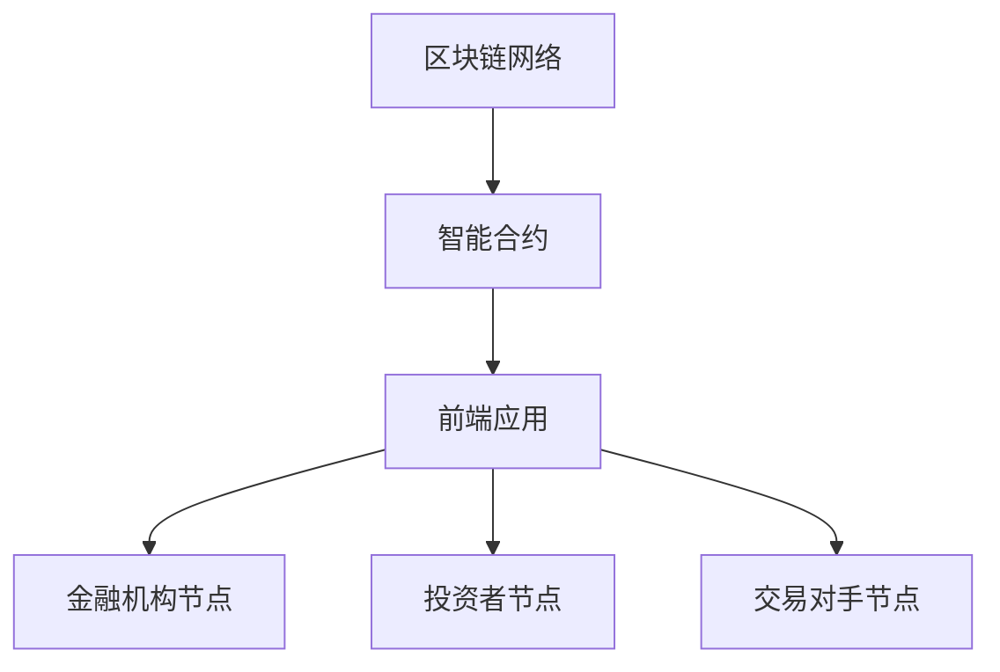

                 

# 区块链应用：去中心化技术在企业中的应用

## 关键词

区块链，去中心化，企业应用，供应链管理，智能合约，金融领域

## 摘要

本文将探讨区块链技术在企业中的应用，通过深入分析其基本概念、核心算法、系统架构，以及具体案例，阐述区块链如何实现去中心化，提升企业运营效率和透明度。我们将详细探讨区块链在供应链管理、金融领域以及其他企业场景中的实际应用，并提供开发最佳实践，以期为企业和开发者提供有价值的参考。

## 目录大纲设计思路

### 第一部分：区块链基础

**第1章：区块链概述**

**第2章：分布式账本原理**

**第3章：区块链的加密技术**

**第4章：智能合约与去中心化应用**

### 第二部分：企业应用实践

**第5章：区块链在供应链管理中的应用**

**第6章：区块链在金融领域的应用**

**第7章：区块链在其他企业场景中的应用**

**第8章：区块链应用开发实践**

**第9章：最佳实践与展望**

### 目录大纲内容安排

**第一部分：区块链基础**

**第1章：区块链概述**

- **1.1 区块链的起源与发展**
- **1.2 区块链的核心概念**
- **1.3 区块链的基本结构**

**第2章：分布式账本原理**

- **2.1 分布式账本的概念**
- **2.2 分布式账本的工作机制**
- **2.3 Mermaid ER 图展示分布式账本结构**

**第3章：区块链的加密技术**

- **3.1 哈希算法**
- **3.2 数字签名**
- **3.3 加密货币与区块链**

**第4章：智能合约与去中心化应用**

- **4.1 智能合约的概念**
- **4.2 智能合约的实现原理**
- **4.3 去中心化应用（DApp）的开发**

## 第1章：区块链概述

### 1.1 区块链的起源与发展

区块链技术起源于2008年，由一位化名为中本聪（Satoshi Nakamoto）的人提出。其初衷是为了创造一种去中心化的数字货币——比特币。比特币的诞生标志着区块链技术的首次应用，并引发了全球对去中心化技术和加密货币的关注。

随着比特币的广泛应用，区块链技术逐渐从数字货币领域扩展到更广泛的应用场景。2014年，以太坊的发布标志着智能合约的引入，使区块链技术具备了更强大的功能，不再局限于数字货币的交易。

区块链技术的核心优势在于去中心化、不可篡改和透明性。这些特性使得区块链在企业应用中具有巨大的潜力，特别是在解决信任问题和提高效率方面。

### 1.2 区块链的核心概念

区块链是一种分布式账本技术，其基本结构由区块和链组成。每个区块包含一定数量的交易记录，并按照时间顺序连接成链。

- **区块**：区块是区块链的基本组成单元，包含交易记录、时间和随机数等信息。
- **链**：链是指将多个区块按照时间顺序连接起来形成的链条，每个区块都通过其前一个区块的哈希值进行链接，确保了区块链的不可篡改性。

### 1.3 区块链的基本结构

区块链的基本结构包括以下几个部分：

- **节点**：节点是区块链网络中的参与者，负责维护和验证区块链的完整性。
- **挖矿**：挖矿是指节点通过解决数学难题来验证交易并添加新区块到区块链的过程。
- **共识算法**：共识算法是节点之间达成一致的方式，确保区块链的分布式特性。

通过这些基本概念和结构，区块链技术实现了去中心化，使得数据可以在无需信任的节点之间安全可靠地传输和存储。

## 第2章：分布式账本原理

### 2.1 分布式账本的概念

分布式账本是一种去中心化的数据库，其数据存储在多个节点上，每个节点都维护一个完整的数据副本。与传统的中心化数据库不同，分布式账本不需要一个中央权威机构来维护数据，而是通过节点之间的协作来确保数据的完整性和一致性。

分布式账本的关键特性包括：

- **去中心化**：去中心化意味着没有一个单一的权威机构控制整个系统，而是通过多个节点的协作来维护数据。
- **不可篡改**：分布式账本的数据一旦被记录，就难以被篡改，因为需要多个节点同时修改数据，且修改过程透明。
- **透明性**：分布式账本的所有交易记录都是公开的，任何人都可以查看和验证。

### 2.2 分布式账本的工作机制

分布式账本的工作机制可以分为以下几个步骤：

1. **交易记录生成**：用户发起交易，例如支付请求，交易信息被发送到网络中的节点。
2. **交易验证**：节点接收到交易后，会验证交易的有效性，确保交易金额和接收方等信息符合规则。
3. **区块生成**：当验证通过后，交易会被加入到新的区块中。区块包含一定数量的交易记录，并按照时间顺序加入到区块链中。
4. **共识达成**：节点之间通过共识算法达成一致，确保新区块被添加到区块链中。常见的共识算法有工作量证明（PoW）、权益证明（PoS）等。
5. **数据同步**：每个节点都会将新区块添加到自己的区块链副本中，并同步更新其他节点的数据。

### 2.3 Mermaid ER 图展示分布式账本结构

以下是一个简化的 Mermaid ER 图，展示了分布式账本的基本结构：

```mermaid
erDiagram
  Node ||--|{ Block }| Node
  Block ||--|{ Transaction }| Block
  Node ||--|{ Blockchain }| Blockchain
  Blockchain ||--|{ Node }| Node
  Transaction ||--|{ Block }| Block
```

在这个图中，节点（Node）是区块链网络的基本组成部分，每个节点维护一个区块链（Blockchain）副本。区块链由多个区块（Block）组成，每个区块包含多个交易记录（Transaction）。

## 第3章：区块链的加密技术

### 3.1 哈希算法

哈希算法是区块链技术中的核心组件，用于确保数据的完整性和不可篡改性。哈希算法将任意长度的数据映射为固定长度的字符串，这个字符串被称为哈希值。

常见的哈希算法包括SHA-256、SHA-3等。SHA-256是一种加密哈希函数，能够生成一个256位的哈希值。以下是一个简单的SHA-256算法示例：

```python
import hashlib

def sha256_hash(data):
    return hashlib.sha256(data.encode('utf-8')).hexdigest()

data = "Hello, World!"
hash_value = sha256_hash(data)
print(hash_value)
```

输出结果将是一个32位的16进制字符串，表示数据的哈希值。

### 3.2 数字签名

数字签名是一种用于验证消息完整性和真实性的技术。与传统的手写签名类似，数字签名可以确保消息在传输过程中未被篡改，并且只有签名者才能生成特定的签名。

数字签名的工作原理如下：

1. **私钥与公钥**：数字签名使用一对密钥，即私钥和公钥。私钥是保密的，只有签名者知道；公钥是公开的，可以由任何人获取。
2. **消息摘要**：签名者首先对消息进行哈希运算，生成消息摘要。
3. **生成签名**：签名者使用私钥对消息摘要进行加密，生成数字签名。
4. **验证签名**：接收方收到消息和签名后，使用公钥对签名进行解密，生成解密后的消息摘要，并将其与接收到的消息摘要进行比对。

以下是一个简单的Python示例，演示如何使用RSA算法生成和验证数字签名：

```python
from Cryptodome.PublicKey import RSA
from Cryptodome.Signature import pkcs1_15
from Cryptodome.Hash import SHA256

def generate_keys():
    key = RSA.generate(2048)
    private_key = key.export_key()
    public_key = key.publickey().export_key()
    return private_key, public_key

def sign_message(private_key, message):
    rsakey = RSA.import_key(private_key)
    signature = pkcs1_15.new(rsakey).sign(SHA256.new(message))
    return signature

def verify_signature(public_key, message, signature):
    rsakey = RSA.import_key(public_key)
    try:
        pkcs1_15.new(rsakey).verify(SHA256.new(message), signature)
        return "签名有效"
    except (ValueError, TypeError):
        return "签名无效"

private_key, public_key = generate_keys()
message = "Hello, World!"
signature = sign_message(private_key, message)
print(verify_signature(public_key, message, signature))
```

输出结果将是“签名有效”，表明签名验证成功。

### 3.3 加密货币与区块链

加密货币是区块链技术的一个典型应用，比特币是最著名的加密货币。加密货币通过区块链技术实现了去中心化的数字货币交易，无需依赖传统金融机构。

加密货币的工作原理如下：

1. **交易记录**：用户之间的交易记录会被记录在区块链上。
2. **挖矿与奖励**：矿工通过解决数学难题来验证交易，并将新区块添加到区块链中。成功验证交易并添加区块的矿工将获得一定数量的加密货币作为奖励。
3. **共识机制**：区块链网络中的节点通过共识机制来确认交易的合法性和区块的添加。

加密货币具有以下几个特点：

- **去中心化**：加密货币的交易不受任何中央机构的控制，交易记录由网络中的节点共同维护。
- **匿名性**：加密货币交易通常不透露用户的真实身份，增加了交易的匿名性。
- **安全性**：区块链技术确保了加密货币交易的安全性和不可篡改性。

## 第4章：智能合约与去中心化应用

### 4.1 智能合约的概念

智能合约是一种自动执行的合约，其条款和操作直接编写在代码中。智能合约的出现解决了传统合约的执行和信任问题，无需依赖第三方中介机构。

智能合约的关键特性包括：

- **自动执行**：智能合约在满足特定条件时自动执行，无需人工干预。
- **不可篡改**：智能合约的代码在部署后无法修改，确保了合约条款的稳定性。
- **透明性**：智能合约的执行过程和结果对所有参与者透明可见。

### 4.2 智能合约的实现原理

智能合约的实现依赖于区块链平台，如以太坊、EOS等。以下以以太坊为例，介绍智能合约的实现原理：

1. **Solidity语言**：以太坊使用Solidity语言编写智能合约，Solidity是一种面向合约的编程语言，具有简洁、易用的特点。

2. **合约编译**：编写好的智能合约代码需要经过编译器编译，生成以太坊虚拟机（EVM）可执行的字节码。

3. **合约部署**：将编译生成的字节码部署到以太坊区块链上，创建一个智能合约实例。

4. **交易执行**：用户可以通过以太坊客户端与智能合约进行交互，执行合约中的函数，实现合约的功能。

以下是一个简单的Solidity智能合约示例：

```solidity
pragma solidity ^0.8.0;

contract HelloWorld {
    string public message;

    constructor(string memory initMessage) {
        message = initMessage;
    }

    function updateMessage(string memory newMessage) public {
        message = newMessage;
    }
}
```

在这个示例中，智能合约定义了一个名为`HelloWorld`的合约，包含一个可读写的`message`变量和一个构造函数`updateMessage`。用户可以通过调用`updateMessage`函数来更新合约的`message`变量。

### 4.3 去中心化应用（DApp）的开发

去中心化应用（DApp）是建立在区块链平台上的应用程序，具有去中心化、不可篡改和透明性的特点。开发DApp的主要步骤如下：

1. **需求分析**：明确DApp的功能需求，确定智能合约和前端应用的设计。

2. **智能合约开发**：使用区块链平台提供的编程语言（如Solidity）编写智能合约，定义合约的函数和变量。

3. **前端开发**：使用Web开发技术（如HTML、CSS、JavaScript）开发DApp的前端界面，实现用户交互。

4. **测试与部署**：对智能合约和前端应用进行测试，确保其功能正确无误。然后将智能合约部署到区块链上，与前端应用进行集成。

5. **运维与升级**：持续维护和升级DApp，确保其稳定运行和安全。

以下是一个简单的DApp示例，实现一个去中心化的投票系统：

```solidity
pragma solidity ^0.8.0;

contract Voting {
    mapping(address => bool) public voters;
    mapping(string => uint256) public votesReceived;

    struct Proposal {
        string name;
        uint256 voteCount;
    }

    Proposal[] public proposals;

    constructor(string[] memory initNames) {
        for (uint256 i = 0; i < initNames.length; i++) {
            proposals.push(Proposal({name: initNames[i], voteCount: 0}));
        }
    }

    function vote(string memory name) public {
        require(!voters[msg.sender], "你已经投票了");
        voters[msg.sender] = true;
        for (uint256 i = 0; i < proposals.length; i++) {
            if (keccak256(abi.encodePacked(proposals[i].name)) == keccak256(abi.encodePacked(name))) {
                proposals[i].voteCount += 1;
                break;
            }
        }
    }

    function winningProposal() public view returns (string memory) {
        uint256 winningVoteCount = 0;
        for (uint256 i = 0; i < proposals.length; i++) {
            if (proposals[i].voteCount > winningVoteCount) {
                winningVoteCount = proposals[i].voteCount;
            }
        }
        for (uint256 i = 0; i < proposals.length; i++) {
            if (proposals[i].voteCount == winningVoteCount) {
                return proposals[i].name;
            }
        }
        return "没有获胜者";
    }
}
```

在这个示例中，智能合约定义了一个投票系统，用户可以通过投票函数`vote`为某个提案投票。合约还提供了获取获胜提案的功能`winningProposal`。

## 第5章：区块链在供应链管理中的应用

### 5.1 供应链管理的挑战

供应链管理是企业运营中至关重要的一环，但同时也面临诸多挑战：

- **信息不透明**：传统供应链中，信息传递往往依赖于纸质文件和人工处理，导致信息传递延迟、错误率高。
- **信任问题**：供应链中的各个环节涉及多个合作伙伴，信任问题常常导致合作不顺畅。
- **效率低下**：供应链中的流程复杂，涉及多个部门和合作伙伴，导致工作效率低下。
- **成本高昂**：传统供应链管理需要大量的纸质文件和人工操作，导致成本高昂。

### 5.2 区块链在供应链管理中的应用案例

区块链技术在供应链管理中具有广泛应用，以下是一个典型的应用案例：

- **食品追溯**：某食品公司采用区块链技术实现食品的全程追溯。从原材料采购、生产、加工、包装、运输到销售，每个环节的数据都记录在区块链上，确保食品的安全性和质量。
- **物流跟踪**：某物流公司使用区块链技术跟踪货物的运输过程。通过扫描二维码或RFID标签，物流信息实时更新到区块链上，确保货物的运输过程透明可追溯。
- **供应链金融**：某供应链金融服务公司基于区块链技术为中小企业提供融资服务。通过区块链技术实现融资申请、审批、放款等流程的自动化，提高了融资效率，降低了融资成本。

### 5.3 区块链供应链管理系统的架构设计

区块链供应链管理系统的架构设计主要包括以下几个部分：

- **供应链网络**：构建一个包含供应链各个环节的区块链网络，包括供应商、制造商、分销商、零售商等。
- **智能合约**：设计智能合约来实现供应链管理中的业务逻辑，如订单管理、支付、物流跟踪等。
- **前端应用**：开发前端应用，实现用户与区块链网络的交互，如用户查询物流信息、申请融资等。
- **区块链节点**：部署区块链节点，负责维护和验证区块链的完整性。

以下是一个简化的区块链供应链管理系统架构图：



在这个架构中，供应链网络中的各个环节通过智能合约进行交互，前端应用实现用户与区块链网络的交互，区块链节点负责维护和验证区块链的完整性。

## 第6章：区块链在金融领域的应用

### 6.1 金融服务中的痛点

金融领域一直是区块链技术的重要应用场景，传统金融体系存在以下痛点：

- **效率低下**：传统金融体系中的交易过程繁琐，涉及多个部门和环节，导致交易速度缓慢。
- **透明度不足**：金融交易的信息往往不透明，导致投资者难以获取全面的信息。
- **信任问题**：金融交易中的信任问题常常导致交易无法顺利进行。
- **成本高昂**：传统金融体系中的纸质文件和人工操作导致成本高昂。

### 6.2 区块链在金融领域的应用案例

区块链技术在金融领域具有广泛应用，以下是一些典型的应用案例：

- **跨境支付**：某银行使用区块链技术实现跨境支付，通过区块链网络实现实时结算，提高了支付效率，降低了跨境支付成本。
- **数字资产管理**：某数字资产管理公司使用区块链技术实现数字资产的管理和交易，确保资产的安全性和透明性。
- **智能投顾**：某智能投顾平台使用区块链技术实现资产配置和交易，通过智能合约实现自动化的投资决策，提高了投资效率。

### 6.3 区块链金融系统的实现

区块链金融系统的实现主要包括以下几个部分：

- **区块链网络**：构建一个包含金融机构、投资者、交易对手等参与者的区块链网络。
- **智能合约**：设计智能合约来实现金融交易、资产管理、结算等业务逻辑。
- **前端应用**：开发前端应用，实现用户与区块链网络的交互，如用户开户、交易、查询资产等。
- **区块链节点**：部署区块链节点，负责维护和验证区块链的完整性。

以下是一个简化的区块链金融系统架构图：



在这个架构中，金融机构、投资者和交易对手通过区块链网络进行交互，智能合约实现金融交易的自动化和透明化，前端应用实现用户与区块链网络的交互。

## 第7章：区块链在其他企业场景中的应用

### 7.1 区块链在版权保护中的应用

版权保护是区块链技术的另一个重要应用场景。通过区块链技术，可以实现数字内容的全程追溯和保护，确保创作者的权益得到保障。

- **版权登记**：创作者可以将数字内容的版权信息登记在区块链上，确保版权信息的不可篡改。
- **版权交易**：通过区块链技术实现版权的交易，确保交易过程透明、可追溯。
- **版权维权**：当发生版权纠纷时，区块链上的记录可以提供有效的证据，帮助创作者维权。

### 7.2 区块链在医疗健康数据管理中的应用

医疗健康数据管理是区块链技术的另一个重要应用场景。通过区块链技术，可以实现医疗健康数据的全程追溯和保护，确保数据的真实性和安全性。

- **患者数据管理**：患者可以将自己的医疗数据上传到区块链上，实现数据的存储、管理和共享。
- **药品溯源**：通过区块链技术实现药品的全程追溯，确保药品的真实性和质量。
- **智能合约**：使用智能合约实现医疗健康数据的自动化处理和支付，提高医疗服务的效率。

### 7.3 区块链在智能城市中的应用

区块链技术在智能城市中的应用越来越广泛，可以实现城市管理的智能化、高效化和透明化。

- **交通管理**：通过区块链技术实现交通数据的实时监测和分析，优化交通管理，减少拥堵。
- **能源管理**：通过区块链技术实现能源的分布式管理，提高能源利用效率，降低能源成本。
- **公共服务**：通过区块链技术实现公共服务的去中心化，提高服务效率，降低服务成本。

## 第8章：区块链应用开发实践

### 8.1 开发环境搭建

要开发区块链应用，首先需要搭建一个适合的开发环境。以下是搭建开发环境的基本步骤：

1. **安装Node.js**：Node.js是一个基于Chrome V8引擎的JavaScript运行环境，用于搭建区块链应用的后端。
2. **安装Ganache**：Ganache是一个轻量级的以太坊客户端，用于本地测试和开发。
3. **安装Truffle**：Truffle是一个以太坊开发框架，提供了一套完整的开发工具，如合约编译、部署和调试。

### 8.2 区块链应用的核心实现

以下是一个简单的区块链应用示例，实现一个投票系统：

```solidity
pragma solidity ^0.8.0;

contract Voting {
    mapping(address => bool) public voters;
    mapping(string => uint256) public votesReceived;

    struct Proposal {
        string name;
        uint256 voteCount;
    }

    Proposal[] public proposals;

    constructor(string[] memory initNames) {
        for (uint256 i = 0; i < initNames.length; i++) {
            proposals.push(Proposal({name: initNames[i], voteCount: 0}));
        }
    }

    function vote(string memory name) public {
        require(!voters[msg.sender], "你已经投票了");
        voters[msg.sender] = true;
        for (uint256 i = 0; i < proposals.length; i++) {
            if (keccak256(abi.encodePacked(proposals[i].name)) == keccak256(abi.encodePacked(name))) {
                proposals[i].voteCount += 1;
                break;
            }
        }
    }

    function winningProposal() public view returns (string memory) {
        uint256 winningVoteCount = 0;
        for (uint256 i = 0; i < proposals.length; i++) {
            if (proposals[i].voteCount > winningVoteCount) {
                winningVoteCount = proposals[i].voteCount;
            }
        }
        for (uint256 i = 0; i < proposals.length; i++) {
            if (proposals[i].voteCount == winningVoteCount) {
                return proposals[i].name;
            }
        }
        return "没有获胜者";
    }
}
```

在这个示例中，智能合约定义了一个投票系统，用户可以通过投票函数`vote`为某个提案投票。合约还提供了获取获胜提案的功能`winningProposal`。

### 8.3 应用案例分析

以下是一个实际的区块链应用案例，实现一个去中心化的数字资产管理平台：

**需求分析**：

用户需要能够创建和管理数字资产，包括创建资产、添加资产描述、设置资产数量等。用户还可以通过交易功能购买和出售数字资产。

**智能合约实现**：

```solidity
pragma solidity ^0.8.0;

contract DigitalAssets {
    mapping(address => mapping(string => Asset)) public assets;
    mapping(string => uint256) public assetIds;
    uint256 public totalAssets;

    struct Asset {
        string name;
        string description;
        uint256 totalSupply;
        address owner;
    }

    event AssetCreated(address owner, string assetId, string name, string description, uint256 totalSupply);
    event AssetTransferred(address from, address to, string assetId);

    function createAsset(string memory name, string memory description, uint256 totalSupply) public {
        require(totalSupply > 0, "总供应量必须大于0");
        Asset memory newAsset = Asset({name: name, description: description, totalSupply: totalSupply, owner: msg.sender});
        string memory assetId = keccak256(abi.encodePacked(name, totalSupply));
        assets[msg.sender][assetId] = newAsset;
        assetIds[assetId] = totalAssets + 1;
        totalAssets++;
        emit AssetCreated(msg.sender, assetId, name, description, totalSupply);
    }

    function transferAsset(address to, string memory assetId) public {
        require(assets[msg.sender][assetId].owner == msg.sender, "你不是该资产的所有者");
        assets[msg.sender][assetId].owner = to;
        emit AssetTransferred(msg.sender, to, assetId);
    }
}
```

在这个示例中，智能合约定义了一个数字资产管理平台，用户可以通过创建资产和转移资产来实现数字资产的管理。合约提供了创建资产和转移资产的事件，用于记录资产的创建和转移过程。

### 8.4 代码应用解读与分析

在数字资产管理平台的实现中，智能合约的核心功能包括资产创建和资产转移。

- **资产创建**：用户通过调用`createAsset`函数创建资产，该函数接受资产名称、描述和总供应量作为参数。合约首先检查总供应量是否大于0，然后创建一个新的资产结构体，并将其存储在合约的状态中。资产ID通过将资产名称和总供应量进行哈希运算生成，以确保资产ID的唯一性。最后，合约触发`AssetCreated`事件，记录资产的创建过程。

- **资产转移**：用户通过调用`transferAsset`函数将资产转移给另一个地址。合约首先检查转移方是否是当前资产的所有者，然后更新资产的所有者地址。合约也触发`AssetTransferred`事件，记录资产的转移过程。

这两个函数的实现都采用了事件机制，以便在合约执行过程中记录重要操作，从而提高合约的透明度和可审计性。

### 项目小结

通过以上案例，我们可以看到区块链技术在数字资产管理中的应用，实现了资产创建和转移的自动化和去中心化。智能合约的设计和实现过程体现了区块链技术的核心优势，如不可篡改、透明性和去中心化。在实际开发中，开发者需要根据具体需求设计智能合约的接口和功能，确保合约的安全性、高效性和可扩展性。

## 第9章：最佳实践与展望

### 9.1 区块链应用的最佳实践

在开发区块链应用时，以下是一些最佳实践：

- **需求分析与设计**：明确应用的需求和目标，设计合理的架构和接口。
- **安全性**：确保智能合约的安全性，避免常见的安全漏洞，如代码注入、逻辑漏洞等。
- **性能优化**：合理设计区块链网络和智能合约，提高系统的性能和可扩展性。
- **合规性**：遵守相关法规和政策，确保区块链应用在法律和监管框架内运行。

### 9.2 面临的挑战与机遇

区块链技术在企业应用中面临以下挑战：

- **技术成熟度**：区块链技术仍处于快速发展阶段，相关技术成熟度有待提高。
- **安全性**：区块链系统的安全性直接影响应用的安全性，需要持续关注和改进。
- **监管政策**：区块链应用的合规性受到监管政策的限制，需要密切关注政策变化。

但同时，区块链技术也带来了以下机遇：

- **效率提升**：区块链技术可以实现业务的自动化和去中心化，提高运营效率。
- **信任构建**：区块链技术通过去中心化和不可篡改的特性，增强了各方的信任。
- **创新应用**：区块链技术为企业和开发者提供了新的应用场景和商业模式。

### 9.3 未来发展趋势与展望

未来，区块链技术在企业中的应用将进一步拓展，包括：

- **跨行业合作**：区块链技术将在更多行业和领域得到应用，实现跨行业的数据共享和协作。
- **技术融合**：区块链技术与其他前沿技术（如人工智能、物联网等）融合，实现更智能、高效的应用。
- **标准化与规范化**：随着区块链技术的普及，相关标准和规范的制定将逐步完善，提高技术的普及性和可靠性。

作者：AI天才研究院/AI Genius Institute & 禅与计算机程序设计艺术 /Zen And The Art of Computer Programming

## 结束语

本文详细探讨了区块链技术在企业中的应用，从基础概念到具体应用，再到开发实践，全面阐述了区块链技术的优势和应用场景。通过本文，读者可以了解到区块链技术如何实现去中心化、提高效率和构建信任，为企业在数字化转型中提供了新的思路和工具。

展望未来，区块链技术将在更多领域发挥重要作用，为企业和个人带来更多的价值和机会。随着技术的不断成熟和普及，区块链应用将变得更加广泛和深入，成为推动社会进步的重要力量。让我们共同期待区块链技术带来的美好未来。

