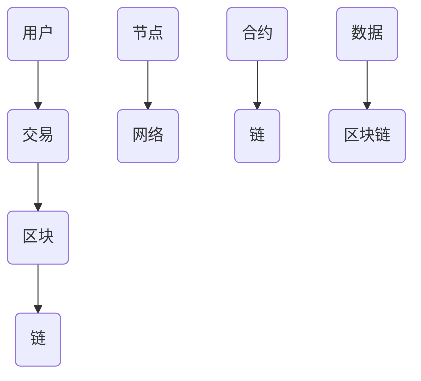
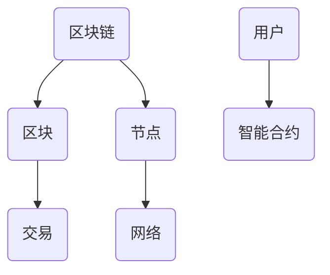

                 

# 《区块链系统安全设计考量》

## 关键词
区块链、安全设计、网络安全性、智能合约、隐私保护、合规性、教育培训、未来发展趋势

## 摘要
本文将深入探讨区块链系统安全设计的各个方面，包括其核心概念、设计原则、网络安全性、智能合约安全性、隐私保护、合规性以及教育与培训。通过系统化的分析和详细的讲解，本文旨在为区块链开发者、架构师和研究人员提供一个全面的安全设计指南，同时展望未来区块链安全技术的发展趋势。

## 《区块链系统安全设计考量》目录大纲

### 第一部分：背景介绍与核心概念

### 第1章：区块链技术概述

#### 1.1 区块链技术的发展历程
##### 1.1.1 区块链的起源与发展
区块链技术起源于2008年比特币的白皮书，由中本聪（Satoshi Nakamoto）提出。这一创新的技术解决了网络去中心化信任问题，通过哈希函数、密码学和共识算法实现了无需信任的分布式账本技术。随着比特币的成功，区块链技术逐渐应用于各个领域，如金融、供应链、医疗等，成为新一轮技术革新的重要力量。

##### 1.1.2 区块链的基本原理与核心技术
区块链技术的基本原理包括去中心化、不可篡改性、透明性和分布式存储。其核心技术包括哈希函数、Merkle树、链式数据结构、智能合约和共识算法。

- **哈希函数与 Merkle 树**：哈希函数将任意长度的数据映射为固定长度的字符串，而Merkle树则用于快速验证数据块的真实性。
- **链式数据结构**：区块链通过链式数据结构将多个区块连接起来，每个区块包含一个或多个交易记录，并通过哈希值与前一个区块链接，形成一个不可篡改的链条。
- **智能合约**：智能合约是运行在区块链上的程序，其执行是自动化的，满足预定的条件即执行。
- **共识算法**：共识算法用于确保区块链网络中的所有节点对账本状态的一致性。

##### 1.1.3 区块链系统的优势与挑战
区块链系统的优势包括去中心化、不可篡改、安全性和透明性。然而，其面临的挑战主要包括可扩展性、隐私保护和安全性设计等。

- **去中心化**：去中心化使得区块链系统能够避免单点故障和中心化控制的风险。
- **不可篡改**：区块链的不可篡改性确保了数据的真实性和完整性。
- **安全性**：区块链通过加密和共识算法保证了交易的安全。
- **透明性**：区块链的数据是公开透明的，所有参与者都可以查看和验证。

##### 1.1.4 区块链应用领域案例
区块链技术已经广泛应用于多个领域，如金融、供应链、医疗、游戏等。以下是一些典型的应用案例：

- **金融领域**：比特币和以太坊是最著名的区块链金融应用，实现了去中心化的支付和资产管理。
- **供应链管理**：通过区块链技术，可以实现对供应链的全程追踪和透明管理。
- **医疗健康**：区块链技术可用于医疗记录的存储和管理，确保数据的安全性和隐私性。
- **游戏与娱乐**：区块链技术可用于去中心化的游戏平台，实现公平和透明的游戏体验。

#### 1.2 区块链安全核心概念与联系
##### 2.1 安全性、隐私性、可扩展性
区块链系统的安全性、隐私性和可扩展性是三个关键属性，它们之间既有联系又有冲突。

- **安全性**：指的是区块链系统抵御外部攻击和内部威胁的能力。
- **隐私性**：指的是区块链系统保护用户数据隐私的能力。
- **可扩展性**：指的是区块链系统处理大量交易的能力。

##### 2.2 核心概念原理
- **恶意节点攻击**：恶意节点通过控制网络中的大部分节点来篡改区块链数据。
- **拒绝服务攻击（DDoS）**：攻击者通过大量无效请求使区块链网络瘫痪。
- **双花攻击**：攻击者在同一时间内对同一笔资金进行两次交易。
- **智能合约漏洞**：智能合约代码中存在的漏洞可能导致资金损失。

##### 2.3 概念属性特征对比表格

| 概念        | 特征                        |
|-------------|-----------------------------|
| 安全性      | 防御攻击、保护数据完整性     |
| 隐私性      | 保护用户数据不被泄露         |
| 可扩展性    | 处理大量交易而不影响性能     |

##### 2.4 ER实体关系图架构

#### 1.3 本章小结
本章介绍了区块链技术的发展历程、基本原理、优势和挑战，以及应用领域的案例。同时，探讨了区块链系统的安全性、隐私性和可扩展性的核心概念与联系。这些知识为后续章节的深入讨论提供了基础。

### 第二部分：区块链系统安全设计原则

### 第2章：区块链安全核心概念与联系

#### 2.1 安全性、隐私性、可扩展性
区块链系统的安全性、隐私性和可扩展性是设计时需要权衡的重要因素。以下是对这些概念的详细解释和它们之间的关系。

##### 2.1.1 安全性
区块链系统的安全性主要指的是其抵御外部攻击和内部威胁的能力。这包括保护区块链网络不受恶意节点的攻击，确保交易数据的完整性和真实性，以及防止数据泄露。安全性设计的关键在于使用强加密算法、共识算法和节点验证机制来确保网络的安全性和可靠性。

##### 2.1.2 隐私性
隐私性是区块链系统保护用户数据不被未授权访问的能力。由于区块链的透明性和不可篡改性，隐私保护成为了一个挑战。为了实现隐私保护，可以采用零知识证明、同态加密和隐私币等技术手段。这些技术能够在不泄露用户身份和交易内容的情况下，确保交易的可验证性和隐私性。

##### 2.1.3 可扩展性
可扩展性指的是区块链系统能够处理大量交易而不影响性能的能力。区块链网络的可扩展性受到区块大小、区块生成时间和节点数量等因素的限制。为了提高可扩展性，可以采用分片技术、侧链和状态通道等方案来优化网络性能。

##### 2.1.4 三者之间的关系
安全性、隐私性和可扩展性在区块链系统设计中是相互关联的。提高安全性可能会降低隐私性，例如，增加节点验证机制可能会增加网络的延迟和带宽消耗。同样，提高隐私性可能会降低安全性，例如，使用零知识证明可能会增加计算复杂度和网络拥堵。可扩展性的提升也可能需要牺牲安全性和隐私性，例如，增加区块大小可能会降低区块链的不可篡改性。

因此，在区块链系统设计时，需要根据具体的应用需求和场景，权衡这三者之间的关系，找到合适的平衡点。

#### 2.2 核心概念原理

##### 2.2.1 恶意节点攻击
恶意节点攻击是指攻击者通过控制网络中的大部分节点来篡改区块链数据。攻击者可以通过伪造区块、双花攻击或拒绝服务攻击（DDoS）等方式破坏区块链系统的安全性。为了抵御恶意节点攻击，区块链系统需要设计有效的节点验证机制、网络冗余和共识算法，确保节点间的协作和一致性。

##### 2.2.2 拒绝服务攻击（DDoS）
拒绝服务攻击（DDoS）是一种攻击者通过大量无效请求使区块链网络瘫痪的攻击方式。DDoS攻击可以导致区块链网络无法处理合法交易请求，从而影响系统的可用性和用户体验。为了应对DDoS攻击，区块链系统可以采用流量监控、反攻击策略和网络冗余等措施。

##### 2.2.3 双花攻击
双花攻击是指攻击者在同一时间内对同一笔资金进行两次交易。攻击者可以先伪造一个交易并将资金转移到自己的账户，然后再次交易将资金转移到另一个账户，从而使第一个交易失效。为了防止双花攻击，区块链系统可以采用预支付机制、双花检测算法和延迟确认等策略。

##### 2.2.4 智能合约漏洞
智能合约漏洞是指智能合约代码中存在的漏洞，可能导致资金损失或数据泄露。常见的智能合约漏洞包括Reentrancy攻击、整数溢出攻击和存储槽攻击等。为了防止智能合约漏洞，区块链系统需要采用严格的代码审计、安全编码规范和智能合约测试框架。

#### 2.3 概念属性特征对比表格

| 概念        | 特征                        |
|-------------|-----------------------------|
| 恶意节点攻击 | 控制网络中的大部分节点来篡改数据 |
| DDoS攻击    | 通过大量无效请求瘫痪网络       |
| 双花攻击    | 对同一笔资金进行两次交易       |
| 智能合约漏洞 | 智能合约代码中的漏洞           |

#### 2.4 ER实体关系图架构

#### 2.5 本章小结
本章详细介绍了区块链系统的安全性、隐私性和可扩展性的核心概念，以及恶意节点攻击、DDoS攻击、双花攻击和智能合约漏洞等常见威胁。通过对比表格和ER实体关系图，读者可以更直观地理解这些概念之间的关系。这些知识为后续章节的深入探讨提供了基础。

### 第二部分：区块链系统安全设计原则

### 第3章：区块链安全设计原则与流程

#### 3.1 安全设计原则
区块链系统的安全设计需要遵循一系列基本原则，以确保系统的可靠性和安全性。以下是一些关键的安全设计原则：

##### 3.1.1 最小权限原则
最小权限原则是指系统中的每个组件或用户都应只拥有完成其任务所需的最少权限。这有助于减少潜在的安全漏洞，防止恶意行为或错误操作对系统造成严重影响。

##### 3.1.2 隔离原则
隔离原则要求将系统中的不同部分相互隔离，以防止故障或攻击在一个部分中蔓延到整个系统。通过实现网络隔离、硬件隔离和逻辑隔离等措施，可以有效地降低系统风险。

##### 3.1.3 审计性原则
审计性原则强调系统应具备完整的审计日志功能，记录所有关键操作和事件。这些日志可以帮助追踪和分析安全事件，提供有效的证据和支持法律合规要求。

#### 3.2 安全设计流程
区块链系统的安全设计流程包括以下几个关键步骤：

##### 3.2.1 安全需求分析
安全需求分析是安全设计的起点，旨在明确系统的安全目标、威胁和风险。通过评估系统的功能需求和使用场景，可以确定需要保护的关键数据和功能。

##### 3.2.2 安全架构设计
安全架构设计是将安全需求转化为具体的系统架构和组件设计。这包括设计安全机制、加密方案、访问控制策略和监控系统等。

##### 3.2.3 安全实施与测试
安全实施是将安全架构转化为实际的系统组件和代码。在实施过程中，需要进行严格的代码审计、渗透测试和安全漏洞修复。

##### 3.2.4 安全运维与监控
安全运维与监控是确保系统在运行过程中持续安全的关键环节。通过实时监控、日志分析和异常检测，可以及时发现和应对潜在的安全威胁。

#### 3.3 安全设计原则与实践案例
以下是一个区块链安全设计原则与实践案例：

- **最小权限原则**：在一个去中心化金融平台上，只有交易验证节点才具有验证交易的权利，普通用户只能提交交易请求，而无法访问交易验证节点。

- **隔离原则**：在区块链节点部署中，采用了物理隔离和逻辑隔离相结合的方式。通过将节点部署在不同的物理服务器上，并使用虚拟化技术实现逻辑隔离，确保一个节点的故障不会影响整个网络。

- **审计性原则**：在智能合约开发过程中，采用了完善的审计流程，包括代码审计、外部审计和社区审核。所有智能合约在部署前都必须通过严格的审计，确保代码的安全性和可靠性。

#### 3.4 本章小结
本章介绍了区块链系统安全设计的基本原则和设计流程。通过最小权限原则、隔离原则和审计性原则，可以有效地提高区块链系统的安全性。同时，通过安全需求分析、安全架构设计、安全实施与测试和安全运维与监控等步骤，可以确保区块链系统的安全设计得到有效实施和持续改进。

### 第4章：区块链网络安全性设计

#### 4.1 网络安全性设计目标
区块链网络安全性设计的目标是确保区块链网络在面临各种攻击时能够保持稳定运行，并防止数据泄露和系统瘫痪。具体目标包括：

- **节点安全性**：确保每个节点的安全，防止恶意节点入侵和篡改数据。
- **网络安全**：保护区块链网络免受拒绝服务攻击（DDoS）和其他网络攻击。
- **数据完整性**：确保区块链数据在传输和存储过程中不被篡改。
- **访问控制**：确保只有授权用户和节点可以访问区块链数据和功能。

#### 4.2 对等网络安全机制
对等网络（P2P）是区块链网络的基础架构，因此网络安全性设计至关重要。以下是对等网络安全机制的关键要素：

##### 4.2.1 节点身份验证
节点身份验证是确保网络中只有合法节点参与共识和交易的关键措施。常见的身份验证方法包括公钥加密、数字签名和身份证书等。

- **公钥加密**：节点使用公钥加密其通信，确保数据传输的安全性和完整性。
- **数字签名**：节点使用数字签名验证其身份，确保通信双方的可靠性和真实性。
- **身份证书**：通过第三方机构颁发身份证书，确保节点身份的可信性。

##### 4.2.2 网络加密与通信安全
网络加密与通信安全是保护区块链网络数据传输安全的关键措施。常见的加密技术包括对称加密、非对称加密和哈希函数。

- **对称加密**：使用相同的密钥对数据进行加密和解密，适用于加密大量数据。
- **非对称加密**：使用一对密钥（公钥和私钥）进行加密和解密，适用于安全传输密钥和数据。
- **哈希函数**：用于生成数据摘要，确保数据在传输过程中未被篡改。

##### 4.2.3 节点监控与防御
节点监控与防御是确保区块链网络在面临攻击时能够及时发现和响应的关键措施。以下是一些常用的监控与防御策略：

- **网络流量监控**：实时监控网络流量，识别异常流量模式和潜在攻击。
- **入侵检测系统（IDS）**：部署入侵检测系统，检测和阻止恶意行为和攻击。
- **防火墙和访问控制**：设置防火墙和访问控制规则，限制非法访问和流量。

#### 4.3 实际网络攻击案例分析
以下是一个区块链网络攻击案例分析：

- **案例1：DDoS攻击**
  攻击者通过大量无效请求攻击区块链网络，导致网络瘫痪。防御措施包括增加带宽、部署DDoS防护设备和流量清洗等。

- **案例2：恶意节点攻击**
  攻击者控制多个节点，篡改区块链数据。防御措施包括加强节点身份验证、提高共识算法的鲁棒性和部署入侵检测系统。

- **案例3：双花攻击**
  攻击者在同一时间内对同一笔资金进行两次交易。防御措施包括采用预支付机制、延迟确认和双花检测算法等。

#### 4.4 本章小结
本章介绍了区块链网络安全性设计的目标和关键机制，包括节点身份验证、网络加密与通信安全以及节点监控与防御。同时，通过实际网络攻击案例分析，展示了区块链网络面临的安全威胁和防御策略。这些知识有助于提高区块链网络的鲁棒性和安全性。

### 第5章：智能合约安全性设计

#### 5.1 智能合约安全性设计原则
智能合约是区块链系统中的关键组成部分，其安全性直接影响到整个区块链网络的安全。因此，智能合约安全性设计应遵循以下原则：

##### 5.1.1 明确性原则
智能合约的代码应清晰明确，避免模糊不清或歧义性表达。这有助于减少理解上的错误和潜在的安全漏洞。

##### 5.1.2 最小权限原则
智能合约应遵循最小权限原则，即只拥有执行任务所需的最少权限。这有助于降低潜在的安全风险。

##### 5.1.3 审计性原则
智能合约的代码应具备完善的审计日志功能，记录所有关键操作和事件。这有助于追踪和分析潜在的安全事件。

##### 5.1.4 分段审查原则
智能合约的代码应分段审查，确保每个部分都是安全可靠的。这样可以更有效地发现和修复安全漏洞。

#### 5.2 常见智能合约漏洞类型
智能合约漏洞是导致区块链安全事件的主要原因之一。以下是一些常见的智能合约漏洞类型：

##### 5.2.1 Reentrancy攻击
Reentrancy攻击是指攻击者通过在智能合约执行过程中反复调用自身函数，使得合约在完成前多次执行其他操作，从而窃取资金。防范措施包括使用`reentrancy guard`模式，确保合约在执行过程中不会被重新调用。

##### 5.2.2 拒绝重入（Reentrancy）攻击的防护措施
为了防止Reentrancy攻击，智能合约可以采用以下防护措施：

- **使用`reentrancy guard`模式**：在合约内部使用一个`locked`标志，确保合约在执行过程中不会被重复调用。
- **校验交易状态**：在合约执行前，检查交易状态，确保不会被重复执行。

##### 5.2.3 存储槽溢出攻击
存储槽溢出攻击是指攻击者通过写入过长的数据，使得存储槽溢出，从而破坏合约的数据结构或执行恶意操作。防范措施包括限制存储槽的使用量，确保写入的数据不超过存储槽的容量。

##### 5.2.4 代码执行时间限制
智能合约的执行时间应有限制，防止恶意合约占用过多资源。可以通过设定执行时间上限，确保合约在合理时间内完成。

#### 5.3 智能合约安全性最佳实践
为了提高智能合约的安全性，可以遵循以下最佳实践：

- **代码审计**：在合约部署前，进行严格的代码审计，确保代码中没有安全漏洞。
- **使用标准库**：使用经过验证的智能合约标准库，避免自行编写可能存在安全漏洞的代码。
- **测试和验证**：对智能合约进行充分的测试和验证，确保其功能的正确性和安全性。
- **开源审查**：将智能合约开源，接受社区审查和反馈，及时发现和修复安全漏洞。

#### 5.4 本章小结
本章介绍了智能合约安全性设计的原则和常见漏洞类型，以及如何防范这些漏洞。通过遵循最佳实践和严格的代码审计，可以显著提高智能合约的安全性，降低区块链网络的风险。智能合约安全性设计是区块链系统安全性的关键环节，必须引起足够的重视。

### 第6章：区块链隐私保护设计

#### 6.1 区块链隐私保护的需求
随着区块链技术的广泛应用，隐私保护成为了一个重要的需求。区块链的透明性和不可篡改性虽然为数据安全和可信性提供了保障，但也使得用户隐私数据容易被泄露和滥用。因此，区块链隐私保护设计显得尤为重要。

##### 6.1.1 透明性与隐私性的冲突
区块链的透明性是其核心优势之一，但这也带来了隐私性的挑战。区块链上的所有交易都是公开透明的，任何用户都可以查看和验证。这种透明性虽然有助于确保数据的真实性和完整性，但同时也暴露了用户的隐私信息，例如交易金额、交易地址等。

##### 6.1.2 隐私保护的重要性
隐私保护对于用户而言至关重要。未经授权的隐私泄露可能导致用户财产损失、信用受损，甚至身份被盗用。因此，在设计区块链系统时，必须考虑隐私保护的需求，确保用户的隐私数据不被未经授权的第三方访问。

#### 6.2 隐私保护技术手段
为了实现区块链隐私保护，可以采用多种技术手段，以下是一些常用的隐私保护技术：

##### 6.2.1 零知识证明
零知识证明（Zero-Knowledge Proof，简称ZKP）是一种密码学技术，允许证明者证明某个陈述是真实的，而不需要透露任何相关信息。零知识证明在区块链隐私保护中具有广泛应用，可以确保用户隐私数据不被泄露，同时保证交易的可验证性。

##### 6.2.2 隐私币
隐私币（Privacy Coin）是一种专门设计用于保护用户隐私的加密货币。与普通加密货币相比，隐私币在交易过程中采用加密技术和隐私保护算法，使得交易信息更加难以追踪和分析。常见的隐私币包括Monero、Zcash和Dash等。

##### 6.2.3 隐私智能合约
隐私智能合约是运行在区块链上的智能合约，其设计考虑了隐私保护的需求。通过加密和零知识证明等技术手段，隐私智能合约可以确保交易数据的隐私性，同时保持区块链的透明性和不可篡改性。

#### 6.3 隐私保护协议设计
隐私保护协议是区块链系统实现隐私保护的关键。以下是一些常见的隐私保护协议：

##### 6.3.1 零知识证明协议
零知识证明协议包括零知识证明系统和零知识证明电路。零知识证明系统用于生成零知识证明，而零知识证明电路则用于验证零知识证明。常见的零知识证明协议包括Snark、STARK和Zcash的Sapling协议等。

##### 6.3.2 隐私交易协议
隐私交易协议设计用于保护区块链上的交易隐私。常见的隐私交易协议包括比特币的隐私交易协议、Zcash的隐写术协议和Monero的CryptoNight协议等。这些协议通过加密和混淆技术，使得交易数据更加难以追踪。

##### 6.3.3 数据隐私保护协议
数据隐私保护协议设计用于保护区块链上的数据隐私。常见的协议包括同态加密、安全多方计算和联邦学习等。这些协议可以在不泄露用户隐私信息的情况下，实现数据的安全共享和分析。

#### 6.4 本章小结
本章介绍了区块链隐私保护的需求、技术手段和协议设计。通过采用零知识证明、隐私币和隐私智能合约等技术，可以实现区块链的隐私保护。同时，通过设计隐私保护协议，可以进一步确保区块链系统的数据隐私性。这些措施有助于提高区块链系统的安全性和用户信任度，推动区块链技术的广泛应用。

### 第7章：区块链安全性与合规性

#### 7.1 安全性与合规性的关系
区块链安全性和合规性是确保区块链系统在法律、道德和技术层面上的可靠性的关键。安全性关注的是系统抵御外部威胁和内部故障的能力，而合规性则涉及系统是否遵循了相关法律法规、标准规范和行业准则。

##### 7.1.1 安全性对合规性的影响
一个高度安全的区块链系统有助于满足合规性要求。例如，如果系统无法抵御恶意攻击，那么即使遵循了所有法律法规，也难以保护用户的隐私和数据完整性。因此，安全性是实现合规性的基础。

##### 7.1.2 合规性对安全性的保障
合规性要求为区块链系统提供了安全框架和指导原则。例如，金融领域的区块链应用需要遵循反洗钱（AML）和了解你的客户（KYC）等法规，这些要求有助于提高系统的整体安全性。

#### 7.2 区块链合规性要求
区块链系统的合规性要求因国家和地区而异，但通常包括以下几个方面：

##### 7.2.1 法律法规合规
区块链系统必须遵守所在地区的法律法规。例如，在金融领域，系统需要遵循反洗钱（AML）和支付服务法规。在中国，区块链系统需要遵循《网络安全法》和《数据安全法》等法律法规。

##### 7.2.2 标准化合规
区块链系统应遵循相关标准化组织制定的行业标准。例如，国际电信联盟（ITU）和国际标准化组织（ISO）都发布了与区块链相关的标准。这些标准有助于提高系统的互操作性和安全性。

##### 7.2.3 道德与伦理合规
区块链系统在设计时还应考虑道德和伦理要求。例如，系统应确保用户隐私保护，不得滥用用户数据。此外，系统应遵循公正、公平和透明的原则，避免歧视和不公平待遇。

#### 7.3 区块链安全合规实践
以下是一些常见的区块链安全合规实践：

##### 7.3.1 风险评估
在进行区块链项目开发前，应进行全面的风险评估，识别潜在的安全和合规风险。这有助于制定有效的风险管理策略。

##### 7.3.2 合规性审计
区块链系统应定期进行合规性审计，确保符合相关法律法规和行业标准。审计过程可以包括内部审计和外部审计。

##### 7.3.3 隐私保护
区块链系统应采用隐私保护技术，如零知识证明和同态加密，确保用户数据的隐私性。

##### 7.3.4 安全监控
区块链系统应具备实时安全监控功能，及时发现和应对潜在的安全威胁。

##### 7.3.5 持续改进
区块链系统的安全性应持续改进，根据新的威胁和法规要求进行调整。

#### 7.4 本章小结
本章探讨了区块链安全性与合规性的关系，以及区块链合规性要求的各个方面。通过遵循法律法规、标准化和道德伦理要求，可以确保区块链系统的安全性和合规性。这些措施有助于提高区块链系统的可靠性和用户信任度，推动区块链技术的健康发展。

### 第8章：区块链安全教育与培训

#### 8.1 区块链安全教育与培训的重要性
随着区块链技术的迅速发展和广泛应用，区块链安全教育与培训变得尤为重要。正确的教育和培训可以帮助区块链开发者和用户了解潜在的安全风险和防护措施，从而提高整个区块链生态系统的安全性。

##### 8.1.1 提高安全意识和技能
区块链安全教育与培训可以提高开发者和用户的安全意识，使其了解区块链技术的优势和潜在风险。通过培训，用户可以掌握安全编程技巧、风险管理策略和应急响应措施，从而降低安全漏洞和攻击的风险。

##### 8.1.2 减少误操作和恶意行为
通过安全教育和培训，可以减少因误操作导致的区块链安全问题。开发者可以学习如何设计和实现安全的智能合约、如何保护用户隐私数据等。用户可以了解如何安全地使用区块链应用，避免因无知或疏忽而遭受损失。

##### 8.1.3 促进安全文化
区块链安全教育与培训有助于营造一个重视安全的区块链生态系统。通过教育和培训，可以培养开发者和用户的安全意识和责任感，促进安全文化的形成和传播。

#### 8.2 安全教育与培训内容
区块链安全教育与培训的内容应涵盖多个方面，确保全面覆盖区块链安全的关键领域。

##### 8.2.1 基础知识普及
基础知识普及是培训的起点，包括区块链的基本概念、工作原理、主要技术和应用场景等。通过学习这些基础知识，用户可以更好地理解区块链技术，为其安全应用打下坚实的基础。

##### 8.2.2 安全意识培养
安全意识培养是提高用户安全意识的重要环节。培训内容应包括常见的安全威胁、攻击手段和防护措施。此外，还应教育用户如何识别和防范钓鱼攻击、恶意软件和社交工程等攻击方式。

##### 8.2.3 技术技能培训
技术技能培训是针对区块链开发者的培训，内容应包括安全编程技巧、智能合约安全、安全测试和审计等。开发者需要掌握如何设计安全的智能合约、如何进行安全测试和如何修复安全漏洞。

#### 8.3 安全教育与培训实践
以下是一些常见的区块链安全教育与培训实践方法：

##### 8.3.1 线上培训课程
线上培训课程是一种灵活的培训方式，可以满足不同用户的需求。课程内容应涵盖从基础知识到高级技术的各个方面。在线平台如Coursera、edX和Udemy等提供了丰富的区块链安全培训课程。

##### 8.3.2 实战演练
实战演练是提高开发者技能的有效方法。通过参与实际项目的开发、测试和审计，开发者可以积累经验，提高应对实际安全问题的能力。许多区块链公司和社区都组织了编程比赛和黑客马拉松活动，为开发者提供实战演练的机会。

##### 8.3.3 安全会议和研讨会
安全会议和研讨会是分享区块链安全知识和经验的良好平台。开发者、研究人员和行业专家可以在这些活动中交流最新的研究成果、最佳实践和安全威胁。知名的区块链会议如Devcon、Blockchain Week NYC和Token Summit等，都涵盖了区块链安全议题。

##### 8.3.4 持续学习与更新
区块链安全是一个快速发展的领域，新的威胁和防护措施不断出现。为了保持安全知识和技能的更新，开发者应定期参加培训课程、阅读最新的研究论文和关注行业动态。

#### 8.4 本章小结
区块链安全教育与培训对于提高区块链生态系统的整体安全性至关重要。通过普及基础知识、培养安全意识和提供技术培训，可以显著降低安全风险和损失。线上培训课程、实战演练、安全会议和研讨会等实践方法，为区块链用户和开发者提供了丰富的学习资源和机会。持续学习和更新是保持安全知识和技能的重要途径。

### 第9章：未来发展趋势与展望

#### 9.1 区块链安全技术的发展趋势
随着区块链技术的不断成熟和广泛应用，区块链安全技术的发展也在不断演进。以下是一些主要的发展趋势：

##### 9.1.1 零知识证明的广泛应用
零知识证明作为一种强大的隐私保护技术，已经在区块链领域得到了广泛应用。未来，随着零知识证明算法的进一步优化和效率提升，零知识证明有望成为区块链隐私保护的核心技术。

##### 9.1.2 加密货币的安全与合规
加密货币作为区块链技术的重要应用之一，其安全性备受关注。未来，加密货币的安全性和合规性将得到进一步提升，以应对日益复杂的网络安全环境和法律法规要求。

##### 9.1.3 区块链与物联网（IoT）的结合
区块链与物联网的结合将推动区块链安全技术的发展。区块链可以提供物联网设备的安全认证、数据保护和隐私保护等功能，从而提升物联网系统的整体安全性。

##### 9.1.4 区块链治理与监管
随着区块链技术的普及，区块链治理和监管将变得越来越重要。未来，区块链系统将需要更加完善的治理机制和监管框架，以确保区块链网络的稳定性和合规性。

#### 9.2 面临的挑战与解决方案
尽管区块链安全技术取得了显著进展，但仍然面临一些挑战：

##### 9.2.1 安全漏洞和攻击手段的升级
随着区块链技术的不断发展，安全漏洞和攻击手段也在不断升级。针对这些挑战，区块链社区需要持续更新安全防护措施，加强对恶意攻击的检测和防御能力。

##### 9.2.2 可扩展性和性能优化
区块链系统在处理大量交易时面临可扩展性和性能优化挑战。为了提高区块链的性能和可扩展性，需要不断探索和优化共识算法、网络架构和数据结构。

##### 9.2.3 法律法规的不确定性和合规性
法律法规的不确定性和合规性是区块链安全面临的重大挑战。为了应对这一挑战，区块链社区需要与监管机构密切合作，推动区块链法律法规的完善和合规标准的制定。

##### 9.2.4 用户隐私保护与数据安全
用户隐私保护和数据安全是区块链安全的关键挑战。为了保护用户隐私和数据安全，需要采用更加先进和高效的隐私保护技术，同时加强数据安全和隐私保护的政策和法规。

#### 9.3 未来展望
未来，区块链安全技术将继续快速发展，为区块链生态系统提供更加可靠和安全的环境。以下是几个可能的未来展望：

- **区块链安全标准化**：随着区块链技术的普及，安全标准化将变得至关重要。未来，区块链安全标准将得到进一步完善和推广，为区块链系统的安全性提供基础保障。
- **跨链互操作性和安全性**：随着区块链网络的日益复杂，跨链互操作性和安全性将成为研究热点。未来的区块链安全技术将致力于实现跨链数据的安全传输和互操作性。
- **区块链安全治理**：区块链安全治理将成为未来区块链生态系统的关键组成部分。通过建立有效的区块链安全治理机制，可以提升区块链网络的整体安全性。

#### 9.4 本章小结
本章讨论了区块链安全技术的发展趋势、面临的挑战和未来展望。随着区块链技术的不断成熟和应用，区块链安全技术将继续发展，为区块链生态系统提供更加可靠和安全的环境。通过标准化、跨链互操作性、安全治理等方面的努力，区块链安全将得到进一步提升。

### 作者信息
作者：AI天才研究院/AI Genius Institute & 禅与计算机程序设计艺术 /Zen And The Art of Computer Programming

### 全文总结
本文从背景介绍、核心概念、安全设计原则、网络安全性、智能合约安全性、隐私保护、合规性、教育与培训以及未来发展趋势等方面，全面探讨了区块链系统安全设计。通过详细的讲解和分析，本文为区块链开发者、架构师和研究人员提供了一个全面的安全设计指南。未来，随着区块链技术的不断发展和应用，区块链安全设计将继续成为研究和实践的重要方向。

