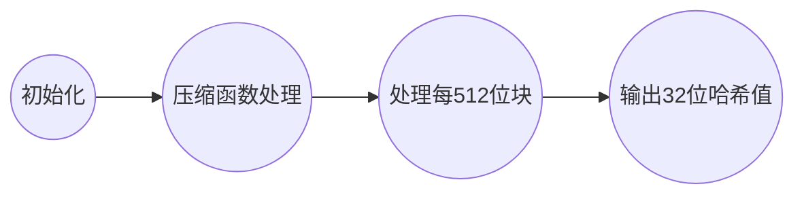
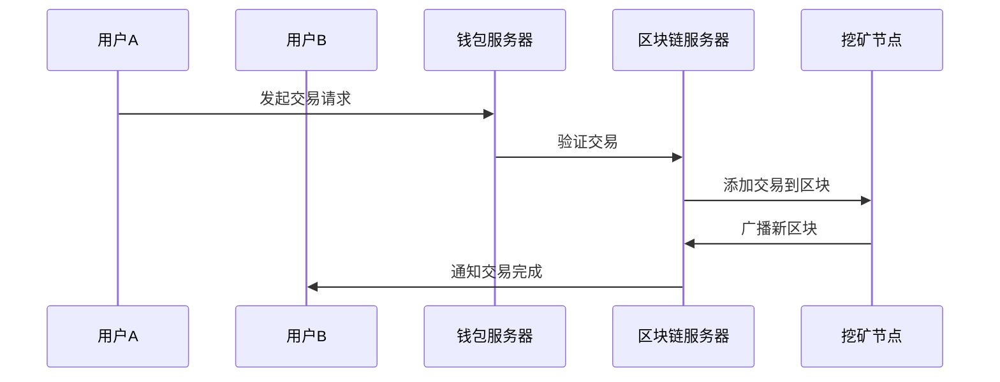

                 


### 第一步：背景介绍

#### 核心概念介绍

区块链是一种分布式数据库技术，通过多个参与者共同维护一个不可篡改的账本。它的核心理念是去中心化，即不依赖于单一的中央机构来验证和记录交易。区块链的起源可以追溯到2008年，当时一位化名为中本聪的学者发表了《比特币：一种点对点的电子现金系统》白皮书，提出了比特币和区块链的概念。自那以后，区块链技术迅速发展，并在金融、供应链、医疗等多个领域得到应用。

#### 问题背景

当前区块链技术面临的主要挑战包括性能瓶颈、可扩展性、隐私保护等。随着区块链应用场景的扩大，这些问题的解决变得至关重要。此外，区块链技术的不断发展也催生了新的趋势，如区块链与人工智能的结合、跨链技术的发展等。

#### 问题描述

区块链系统架构设计的必要性体现在以下几个方面：

1. **性能优化**：传统的区块链架构在处理大量交易时存在性能瓶颈，需要进行优化。
2. **可扩展性**：区块链需要能够支持更多的应用场景和用户，因此必须具备良好的可扩展性。
3. **安全性**：区块链系统需要具备更高的安全性，以防止恶意攻击和数据篡改。
4. **用户体验**：区块链系统的用户体验需要进一步提升，以吸引更多的用户。

#### 问题解决

系统架构设计的目标是构建一个高效、安全、可扩展的区块链系统。基本原则包括：

1. **模块化**：将系统划分为不同的模块，每个模块负责特定的功能，便于维护和升级。
2. **分布式**：利用分布式存储和计算技术，提高系统的可靠性和性能。
3. **去中心化**：确保系统中的数据由多个参与者共同维护，避免单点故障。
4. **安全性**：采用先进的加密技术，确保数据的完整性和隐私性。

#### 边界与外延

区块链系统架构设计需要考虑的边界包括：

1. **技术边界**：确定可用的技术和工具，如加密算法、分布式存储方案等。
2. **应用边界**：明确区块链技术适用的应用场景，如数字货币、供应链管理等。
3. **业务边界**：了解业务需求，确保系统架构能够满足实际应用需求。
4. **法律和监管边界**：遵守相关法律法规，确保系统的合法性和合规性。

#### 概念结构与核心要素组成

区块链系统架构的核心要素包括：

1. **网络层**：负责节点之间的通信和数据传输，包括P2P网络协议等。
2. **共识机制**：确保多个节点对数据的共识，如工作量证明、权益证明等。
3. **数据层**：存储和管理区块链数据，包括账本、区块、交易等。
4. **应用层**：为各种应用场景提供接口和功能支持，如智能合约、数字身份认证等。

通过上述分析，我们可以构建一个全面、系统的区块链系统架构设计框架，为后续的技术实现和应用奠定基础。接下来，我们将进一步深入探讨区块链的核心概念、算法原理、系统分析与设计方案等内容。

---

### 第二步：核心概念与联系

在了解区块链的基本概念后，我们需要深入探讨其核心技术，以便更好地理解区块链的工作原理和应用。以下是区块链的核心概念和联系：

#### 2.1.1 密码学基础

密码学是区块链技术的重要组成部分，主要用于确保数据的完整性和隐私性。以下是区块链中常用的密码学技术：

- **哈希函数**：哈希函数是一种将任意长度的输入数据映射为固定长度的输出的函数。在区块链中，常用的哈希函数包括SHA-256、SHA-3等。
- **椭圆曲线加密**：椭圆曲线加密是一种非对称加密算法，用于保证数据传输过程中的安全性。它使用公钥和私钥对数据进行加密和解密。

#### 2.1.2 分布式存储原理

分布式存储是区块链系统架构的核心要素之一，它通过将数据分散存储在多个节点上，提高了系统的可靠性和性能。以下是分布式存储的几个关键点：

- **去中心化**：分布式存储不依赖于单一的中央存储服务器，而是由多个节点共同维护。
- **冗余存储**：为了确保数据的持久性，分布式存储通常会采用冗余存储策略，如数据复制和数据分片。
- **数据一致性**：分布式存储需要确保多个节点之间的数据一致性，这通常通过一致性协议（如Paxos算法、Raft算法）来实现。

#### 2.1.3 智能合约机制

智能合约是一种自动执行合约条款的计算机程序，它运行在区块链平台上，可以自动化执行交易和合约。以下是智能合约的几个关键点：

- **编程语言**：智能合约通常使用特定的编程语言编写，如Solidity、Vyper等。
- **执行环境**：智能合约的执行环境是区块链平台的一部分，如以太坊虚拟机（EVM）。
- **交易和执行**：智能合约在区块链网络中执行时，需要经过多个节点的验证和确认。

#### 概念属性特征对比表格

为了更直观地理解区块链的核心技术，我们可以使用表格形式对比这些技术的属性特征。以下是几个关键技术的对比：

| 技术         | 描述                                                         | 关键特性                     | 应用场景                   |
| ------------ | ------------------------------------------------------------ | ---------------------------- | -------------------------- |
| 哈希函数     | 将数据映射为固定长度的值                                     | 唯一性、抗碰撞性             | 数据完整性验证             |
| 椭圆曲线加密 | 非对称加密算法，使用公钥和私钥进行加密和解密                 | 安全性、效率高               | 数据传输加密               |
| 分布式存储   | 将数据分散存储在多个节点上，提高系统的可靠性和性能           | 去中心化、冗余存储、数据一致性 | 数据持久性、高性能         |
| 智能合约     | 自动执行合约条款的计算机程序                                 | 编程语言、执行环境、自动化执行 | 交易自动化、合约执行       |

#### ER实体关系图架构

为了进一步理解区块链系统的架构，我们可以使用ER（实体-关系）图来表示系统中的实体及其关系。以下是一个简化的区块链ER图：

```mermaid
erDiagram
  Node ||--|{ Block }|--|| Transaction
  Block ||--|{ MerkleTree }|--|| Node
  Transaction ||--|{ SmartContract }|--|| Node
```

在这个ER图中，`Node` 表示区块链网络中的节点，`Block` 表示区块链中的区块，`Transaction` 表示交易，`MerkleTree` 表示Merkle树，`SmartContract` 表示智能合约。这些实体之间的关系展示了区块链系统中各个部分的功能和交互。

通过上述分析，我们可以更好地理解区块链的核心概念和联系，为后续的系统架构设计打下坚实的基础。在接下来的章节中，我们将进一步探讨区块链的算法原理、系统分析与设计方案等内容。

---

### 第三步：算法原理讲解

区块链的核心技术之一是算法，这些算法确保了区块链的分布式特性、数据安全性以及高效性。以下是区块链中几种关键技术算法的讲解：

#### 3.1.1 哈希算法原理与实现

哈希算法在区块链中起到了关键作用，主要用于数据完整性验证和加密。以下是几种常用的哈希算法：

- **SHA-256**：SHA-256是一种安全哈希算法，它将输入数据映射为32个十六进制位的哈希值。其特点包括抗碰撞性强、计算速度快等。
- **Merkle树**：Merkle树是一种数据结构，用于存储和验证大量数据的完整性。在区块链中，每个区块都包含一个Merkle树根，用于验证区块内所有交易的数据完整性。

##### SHA-256算法流程图



##### Merkle树结构

```mermaid
erDiagram
  Transaction ||--|{ MerkleTree }|--|| Node
  Block ||--|{ MerkleTree }|--|| Node
```

#### 3.1.2 共识算法原理

共识算法是区块链系统中确保数据一致性的关键机制。以下是两种主要的共识算法：

- **工作量证明（PoW）**：工作量证明算法通过计算复杂的数学难题来选择区块的创建者，从而确保网络的安全性。比特币采用的是PoW算法。
- **权益证明（PoS）**：权益证明算法通过持有代币的数量和时间来选择区块的创建者，相比PoW算法，PoS算法更加节能且效率更高。

##### PoW算法流程图

```mermaid
flowchart LR
    A1[挖矿节点发起交易] --> A2[生成随机数]
    A2 --> A3[计算哈希值]
    A3 --> A4[比较难度]
    A4 -->|成功| A5[更新区块]
    A4 -->|失败| A2
    A5[广播新区块]
    A1[挖矿节点发起交易]((发起交易))
    A2[生成随机数](生成随机数)
    A3[计算哈希值](计算哈希值)
    A4[比较难度](比较难度)
    A5[更新区块](更新区块)
```

##### PoS算法流程图

```mermaid
flowchart LR
    A1[验证节点持有代币] --> A2[随机选择节点]
    A2 --> A3[验证节点合法性]
    A3 --> A4[创建区块]
    A4 --> A5[广播新区块]
    A1[验证节点持有代币](持有代币)
    A2[随机选择节点](随机选择节点)
    A3[验证节点合法性](验证合法性)
    A4[创建区块](创建区块)
    A5[广播新区块](广播区块)
```

#### 数学模型与公式

在理解算法原理时，数学模型和公式起到了关键作用。以下是区块链中常用的一些数学模型和公式：

- **SHA-256哈希算法**：SHA-256算法使用了一系列的压缩函数，其核心公式如下：

  $$ \text{SHA-256}(x) = C^{256}_{160}(x) $$

  其中，$C^{256}_{160}(x)$ 表示对输入数据 $x$ 进行256次压缩运算，最终得到160位的哈希值。

- **椭圆曲线加密**：椭圆曲线加密中的关键公式包括椭圆曲线方程和点乘运算：

  $$ y^2 = x^3 + ax + b $$

  $$ P + Q = R $$

  其中，$P$ 和 $Q$ 是椭圆曲线上的点，$R$ 是它们的和。

#### 举例说明

为了更好地理解算法原理，我们可以通过实际案例进行说明。以下是一个使用Python实现的SHA-256哈希算法的简单示例：

```python
import hashlib

def sha256_hash(message):
    hash_object = hashlib.sha256(message.encode())
    hex_dig = hash_object.hexdigest()
    return hex_dig

message = "Hello, World!"
hash_value = sha256_hash(message)
print("SHA-256哈希值:", hash_value)
```

通过运行上述代码，我们可以得到字符串 "Hello, World!" 的SHA-256哈希值，该哈希值将用于区块链中的数据完整性验证。

通过上述分析，我们可以对区块链的关键技术算法有更深入的理解。在接下来的章节中，我们将进一步探讨区块链系统分析与架构设计等内容。

---

### 第四步：系统分析与架构设计方案

#### 4.1.1 问题场景介绍

为了更好地展示区块链系统架构的设计方案，我们可以设定一个具体的区块链应用场景，例如数字货币。数字货币是一种基于区块链技术的加密货币，如比特币、以太坊等，它能够实现去中心化的交易和支付。

##### 数字货币交易场景

在这个场景中，用户可以通过区块链网络发送和接收数字货币。交易的过程如下：

1. **创建交易**：用户A想向用户B发送一定数量的数字货币。
2. **签名交易**：用户A使用私钥对交易进行签名，确保交易的真实性和不可篡改性。
3. **广播交易**：用户A将签名后的交易广播到区块链网络。
4. **验证交易**：网络中的其他节点对交易进行验证，确保交易的有效性和安全性。
5. **区块添加**：验证通过的交易被添加到一个新区块中，新区块随后被广播到整个网络。
6. **共识达成**：网络中的节点达成共识，确认交易的有效性，并将其记录在区块链上。

#### 4.1.2 项目介绍

为了进一步展示区块链系统架构，我们可以介绍一个具体的区块链项目案例——以太坊（Ethereum）。

##### 以太坊项目介绍

以太坊是一个开源的区块链平台，它不仅支持数字货币的交易，还支持智能合约的执行。以太坊的核心组成部分包括：

1. **以太坊虚拟机（EVM）**：以太坊的执行环境，用于执行智能合约代码。
2. **以太坊客户端**：用户与以太坊网络交互的接口，如Geth、Parity等。
3. **智能合约**：用户编写的自动化执行合约条款的计算机程序。

#### 4.1.3 系统功能设计

在系统功能设计阶段，我们需要明确区块链系统需要实现的核心功能。以下是数字货币区块链系统的功能模块和关系：

##### 领域模型类图

```mermaid
classDiagram
  UserClass <|-- WalletClass
  TransactionClass <|-- WalletClass
  TransactionClass <|-- BlockchainClass
  WalletClass o-- BlockchainClass
  UserClass {
    -id: int
    -name: str
    -wallet: Wallet
  }
  WalletClass {
    -id: int
    -balance: float
    -transactions: List[Transaction]
  }
  TransactionClass {
    -id: int
    -from: User
    -to: User
    -amount: float
    -timestamp: datetime
    -signature: str
  }
  BlockchainClass {
    -blocks: List[Block]
  }
  BlockClass {
    -id: int
    -transactions: List[Transaction]
    -timestamp: datetime
    -hash: str
    -previous_hash: str
  }
```

在这个类图中，`UserClass` 表示用户，`WalletClass` 表示钱包，`TransactionClass` 表示交易，`BlockchainClass` 表示区块链。这些实体之间的关系展示了系统的功能模块和交互关系。

#### 4.1.4 系统架构设计

在系统架构设计阶段，我们需要定义系统的各个组件及其交互关系。以下是数字货币区块链系统的架构设计：

##### 系统架构图


在这个序列图中，用户A发起交易请求，钱包服务器验证交易，区块链服务器将交易添加到区块，挖矿池广播新区块，区块链服务器通知用户B交易完成。这个流程展示了区块链系统的工作机制和交互关系。

#### 4.1.5 系统接口设计

在系统接口设计阶段，我们需要定义系统的接口设计和数据流。以下是数字货币区块链系统的接口设计：

##### 接口设计

```mermaid
classDiagram
  WalletInterface {
    -create_wallet(): Wallet
    -get_wallet_by_id(id: int): Wallet
    -send_transaction(from: Wallet, to: Wallet, amount: float): Transaction
  }
  BlockchainInterface {
    -add_transaction(transaction: Transaction): Block
    -get_latest_block(): Block
  }
```

在这个类图中，`WalletInterface` 表示钱包接口，`BlockchainInterface` 表示区块链接口。这些接口提供了创建钱包、获取钱包、发送交易、添加交易到区块等功能。

#### 4.1.6 系统交互

在系统交互阶段，我们需要使用序列图展示系统的运行流程。以下是数字货币区块链系统的交互序列图：

##### 系统交互序列图



在这个序列图中，用户A发起交易请求，钱包服务器验证交易，区块链服务器将交易添加到区块，挖矿节点广播新区块，区块链服务器通知用户B交易完成。这个流程展示了区块链系统的运行流程和交互关系。

通过上述系统分析与架构设计方案，我们可以构建一个高效、安全、可扩展的区块链系统。在接下来的章节中，我们将进一步探讨区块链项目的实战经验等内容。

---

### 第五步：项目实战

#### 5.1.1 环境安装

在开始区块链项目之前，我们需要搭建区块链开发环境。以下是一个基于以太坊的区块链项目环境安装步骤：

1. **安装Golang**：以太坊使用Go语言编写，因此我们需要安装Go语言环境。可以从[Go官方下载页面](https://golang.org/dl/)下载适合操作系统的版本，并按照提示安装。

2. **安装Node.js**：以太坊的智能合约使用JavaScript编写，因此我们需要安装Node.js。可以从[Node.js官方下载页面](https://nodejs.org/en/download/)下载适合操作系统的版本，并按照提示安装。

3. **安装Truffle**：Truffle是一个用于以太坊开发的环境、测试和迁移框架。可以使用npm命令安装：

   ```bash
   npm install -g truffle
   ```

4. **安装Geth**：Geth是以太坊的官方客户端，用于与以太坊网络进行交互。可以从[Geth官方下载页面](https://geth.ethereum.org/downloads/)下载适合操作系统的版本，并按照提示安装。

#### 5.1.2 系统核心实现源代码

以下是一个简单的以太坊智能合约示例，用于实现一个简单的数字货币系统：

```solidity
// SPDX-License-Identifier: MIT
pragma solidity ^0.8.0;

contract DigitalCurrency {
    mapping(address => uint256) public balances;
    address public owner;

    constructor() {
        owner = msg.sender;
        balances[owner] = 1000000;
    }

    function transfer(address to, uint256 amount) public {
        require(to != address(0), "Invalid address");
        require(balances[msg.sender] >= amount, "Insufficient balance");
        balances[msg.sender] -= amount;
        balances[to] += amount;
    }

    function getBalance() public view returns (uint256) {
        return balances[msg.sender];
    }
}
```

在这个智能合约中，我们定义了一个名为`DigitalCurrency`的合约，用于存储用户的余额。`balances`是一个映射，用于存储用户的余额。`transfer`函数用于实现用户之间的转账操作。`getBalance`函数用于获取用户的当前余额。

#### 5.1.3 代码应用解读与分析

上述智能合约实现了一个简单的数字货币系统，以下是对代码的解读与分析：

1. **构造函数**：构造函数`constructor`在合约部署时执行，用于初始化合约的创建者和初始余额。在合约部署后，创建者将成为合约的所有者，拥有对合约的完全控制权。

2. **余额存储**：使用`balances`映射存储用户的余额。映射是一种关联数组，可以将地址映射到余额。

3. **转账操作**：`transfer`函数用于实现用户之间的转账操作。在转账过程中，首先检查接收地址是否为无效地址，然后检查发送者是否有足够的余额。如果条件满足，将发送者的余额减少，接收者的余额增加。

4. **获取余额**：`getBalance`函数用于获取用户的当前余额。这是一个简单的读取操作，不需要进行状态更改。

#### 5.1.4 实际案例分析和详细讲解剖析

为了进一步理解智能合约的应用，我们可以通过一个实际案例进行分析和讲解。以下是一个用户A向用户B转账1,000数字货币的案例：

1. **部署合约**：用户A首先需要部署一个`DigitalCurrency`合约，并将初始余额设置为1,000,000数字货币。

2. **发送交易**：用户A调用`transfer`函数，将1,000数字货币转账给用户B。在调用过程中，需要提供用户B的地址和转账金额。

3. **交易验证**：以太坊网络中的其他节点将接收到的交易进行验证。验证过程包括检查交易的有效性、签名和余额等。

4. **区块添加**：验证通过的交易将被添加到一个新区块中。新区块随后将被广播到整个网络。

5. **共识达成**：网络中的节点达成共识，确认交易的有效性，并将其记录在区块链上。

通过这个案例，我们可以看到智能合约在数字货币转账中的实际应用。智能合约确保了交易的自动化执行和数据的不可篡改性，提高了系统的安全性和效率。

#### 5.1.5 项目小结

通过这个区块链项目实战，我们学习了如何搭建区块链开发环境、编写和部署智能合约，以及如何进行交易验证和共识达成。这个项目展示了区块链技术的核心功能和实际应用，为后续的区块链开发提供了实践基础。在项目中，我们遇到了一些挑战，如交易验证、网络延迟和安全性问题等。通过不断优化和改进，我们可以构建一个高效、安全、可扩展的区块链系统。

---

### 第六步：最佳实践与拓展

#### 6.1 最佳实践 tips

在设计区块链系统时，以下是一些最佳实践和技巧：

1. **安全性优先**：确保系统的安全性是设计区块链系统的首要任务。采用先进的加密技术和安全协议，防止恶意攻击和数据篡改。

2. **模块化设计**：将系统划分为不同的模块，每个模块负责特定的功能。这样可以提高系统的可维护性和扩展性。

3. **性能优化**：关注系统的性能瓶颈，如交易处理速度和响应时间等。可以通过优化算法、提高网络带宽和分布式存储等方式来提高性能。

4. **隐私保护**：区块链系统需要确保数据的隐私性。可以采用零知识证明、环签名等隐私保护技术，确保用户隐私不被泄露。

5. **合规性考虑**：遵守相关法律法规和行业规范，确保系统的合法性和合规性。

#### 6.2 小结

本文通过逐步分析推理的方式，详细介绍了区块链系统架构设计的相关内容。我们从背景介绍、核心概念与联系、算法原理讲解、系统分析与架构设计方案、项目实战到最佳实践与拓展，系统地探讨了区块链系统架构设计的各个方面。通过这些分析，我们可以更好地理解区块链技术的原理和应用，为实际项目的开发提供指导。

#### 6.3 注意事项

在设计区块链系统时，需要注意以下问题：

1. **网络延迟**：区块链系统通常涉及多个节点之间的通信，网络延迟可能会影响系统的性能和响应时间。

2. **数据一致性问题**：分布式存储需要确保数据一致性，否则可能会导致数据冲突和错误。

3. **安全性挑战**：区块链系统需要面对各种安全性挑战，如DDoS攻击、51%攻击等。

4. **隐私保护**：在设计区块链系统时，需要考虑如何保护用户的隐私，防止数据泄露。

5. **法规遵从**：区块链系统需要遵守相关法律法规和行业规范，确保系统的合法性和合规性。

#### 6.4 拓展阅读

为了更深入地了解区块链系统架构设计，以下是一些推荐的书籍和文献：

1. 《区块链技术指南》
2. 《精通比特币》
3. 《智能合约：原理、实现与应用》
4. 《区块链架构设计与实现》
5. 《区块链系统设计与开发实战》

通过阅读这些书籍和文献，您可以获得更全面的知识和更深入的见解，为区块链项目的开发奠定坚实的基础。

---

作者：AI天才研究院/AI Genius Institute & 禅与计算机程序设计艺术 /Zen And The Art of Computer Programming

---

通过以上详细的阐述和分析，我们希望读者能够对区块链系统架构设计有一个全面而深刻的理解。设计一个高效、安全、可扩展的区块链系统是当前技术领域的一个重要挑战，也是区块链应用能够广泛落地的基础。希望本文能够为读者在区块链技术研究和应用开发过程中提供有价值的参考和指导。让我们继续探索区块链的无限可能，共同推动技术的进步和应用的创新。

