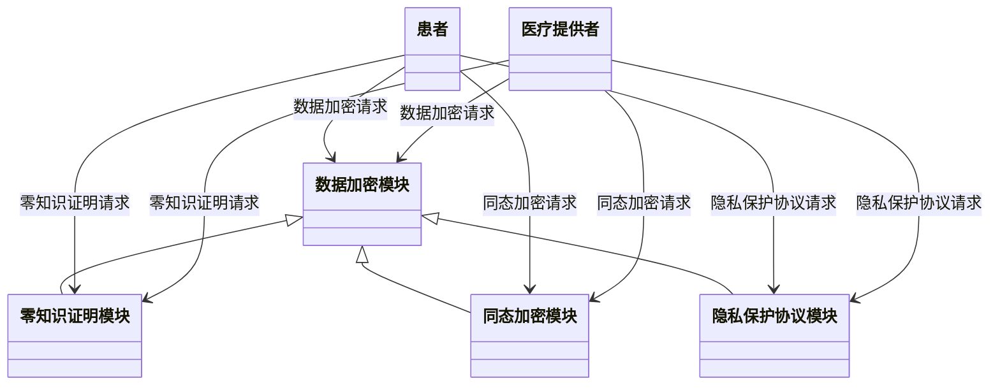
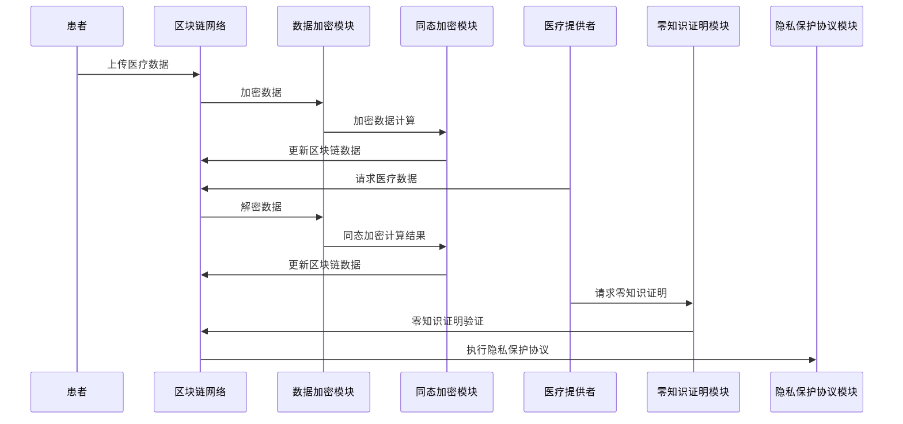
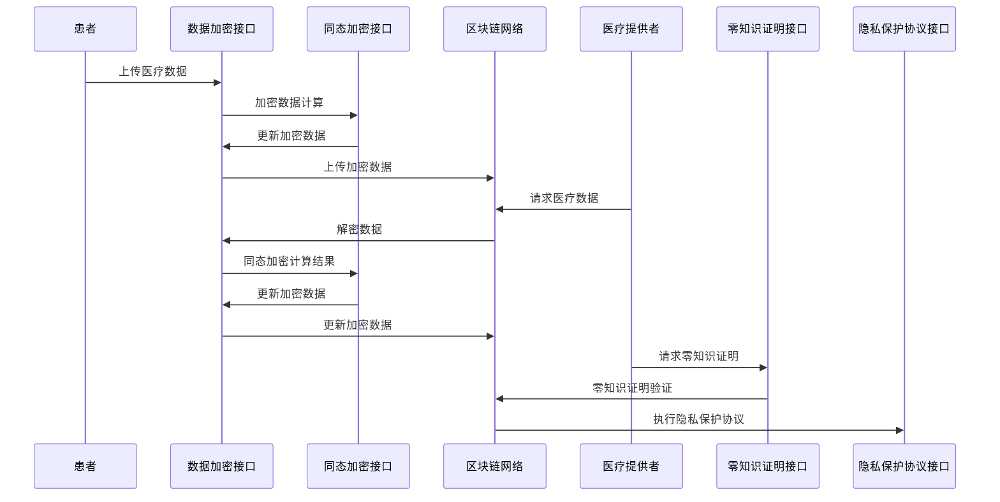
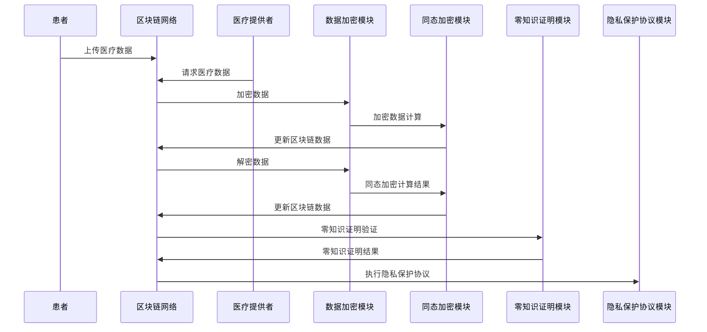

                 

### 《区块链隐私保护技术》

#### 关键词：区块链、隐私保护、零知识证明、同态加密、隐私保护协议

> 摘要：本文深入探讨了区块链隐私保护技术，分析了隐私保护的需求、基本概念、核心技术，以及在实际应用中的系统架构设计和实现。通过详细阐述零知识证明、同态加密等算法原理，并结合项目实战和最佳实践，为区块链隐私保护提供了一套系统性的解决方案。

----------------------------------------------------------------

# 《区块链隐私保护技术》目录大纲

## 第一部分：背景介绍

### 1.1 问题的背景与重要性

- 隐私保护的需求
- 区块链技术的隐私问题
- 隐私保护的重要性与挑战

### 1.2 隐私保护的基本概念

- 隐私定义
- 数据安全与隐私保护的关系
- 隐私保护的法律法规

### 1.3 区块链技术的基本概念

- 区块链的原理
- 区块链的核心技术
- 区块链的发展趋势

## 第二部分：核心概念与联系

### 2.1 隐私保护技术概述

- 隐私保护技术的分类
- 隐私保护技术的核心概念
- 隐私保护技术的工作原理

### 2.2 隐私保护算法原理

- 隐私保护算法的原理
- 隐私保护算法的核心要素
- 隐私保护算法的对比分析

## 第三部分：算法原理讲解

### 3.1 零知识证明算法

- 零知识证明算法的原理
- 零知识证明算法的数学模型
- 零知识证明算法的应用场景

### 3.2 同态加密算法

- 同态加密算法的原理
- 同态加密算法的数学模型
- 同态加密算法的应用场景

### 3.3 隐私保护协议

- 隐私保护协议的原理
- 隐私保护协议的分类
- 隐私保护协议的应用场景

## 第四部分：系统分析与架构设计方案

### 4.1 问题场景介绍

- 区块链隐私保护的需求
- 隐私保护方案的设计目标

### 4.2 系统功能设计

- 功能模块的划分
- 领域模型

### 4.3 系统架构设计

- 系统架构的层次结构
- 系统架构图

### 4.4 系统接口设计

- 接口的功能描述
- 接口的交互流程

### 4.5 系统交互

- 系统的交互流程
- 系统的交互序列图

## 第五部分：项目实战

### 5.1 环境安装

- 环境搭建的步骤
- 需要的软件和工具

### 5.2 系统核心实现

- 系统核心实现的代码
- 代码的解读与分析

### 5.3 实际案例分析与讲解

- 实际案例的分析
- 案例的详细讲解

### 5.4 项目小结

- 项目成果总结
- 项目中的不足与改进建议

## 第六部分：最佳实践与拓展阅读

### 6.1 最佳实践

- 隐私保护的最佳实践
- 系统优化的方法

### 6.2 小结

- 全书内容的回顾
- 重点知识点的总结

### 6.3 注意事项

- 使用过程中的注意事项
- 可能遇到的问题及解决方案

### 6.4 拓展阅读

- 相关的文献和资料
- 进一步学习区块链隐私保护技术的方向

----------------------------------------------------------------

### 第一部分：背景介绍

#### 1.1 问题的背景与重要性

在当今数字化时代，隐私保护成为了一个日益重要的议题。随着互联网和移动设备的普及，人们的信息被大量收集、存储和处理，这不仅带来了便利，也带来了隐私泄露的风险。尤其是在区块链技术日益普及的背景下，如何保护用户的隐私成为了一个亟待解决的问题。

区块链技术以其去中心化、不可篡改和透明等特点，被广泛应用于金融、供应链管理、医疗等多个领域。然而，区块链技术的这些特点也带来了隐私保护的挑战。区块链上的数据一旦被公开，就难以删除或修改，这给隐私保护带来了巨大挑战。

隐私保护的重要性不言而喻。隐私泄露不仅会损害用户的信任，也会对企业的声誉造成严重影响。此外，隐私泄露还可能导致经济损失和安全隐患。因此，如何在保护用户隐私的前提下，充分利用区块链技术的优势，成为了一个亟待解决的问题。

#### 1.2 隐私保护的基本概念

隐私保护是指通过一系列技术手段，确保用户数据在存储、传输和处理过程中不被未经授权的第三方访问或泄露。隐私保护的基本概念包括：

- **隐私定义**：隐私是指个体对于其个人信息享有的控制权和保密权。这包括个人的身份信息、行为记录、健康信息等。

- **数据安全与隐私保护的关系**：数据安全是隐私保护的基础。确保数据安全，可以防止数据被未经授权的访问、篡改或泄露。数据安全与隐私保护密切相关，互为支撑。

- **隐私保护的法律法规**：各国政府和国际组织制定了相关法律法规，对隐私保护进行了规范。例如，欧盟的《通用数据保护条例》（GDPR）就对个人数据的处理和隐私保护提出了严格要求。

#### 1.3 区块链技术的基本概念

区块链技术是一种分布式数据库技术，通过密码学和共识算法，实现数据的安全存储和传输。区块链技术的基本概念包括：

- **区块链的原理**：区块链是由一系列按时间顺序排列的区块组成的数据结构。每个区块包含一定数量的交易记录，通过加密算法和时间戳确保数据的完整性和不可篡改性。

- **区块链的核心技术**：区块链的核心技术包括密码学、共识算法、智能合约等。密码学用于保证数据的安全传输和存储；共识算法确保区块链网络中的节点能够达成共识；智能合约是一种自动执行的合约，可以在区块链上实现自动化交易。

- **区块链的发展趋势**：随着技术的不断发展，区块链技术正逐渐从单一的数字货币应用，拓展到金融、供应链、医疗等多个领域。未来，区块链技术有望实现更广泛的应用，推动社会的数字化转型。

在接下来的部分，我们将进一步探讨隐私保护技术的基本概念和原理，为深入理解区块链隐私保护提供基础。让我们一起深入思考，探索隐私保护的奥秘。## 第二部分：核心概念与联系

#### 2.1 隐私保护技术概述

隐私保护技术是保障数据隐私安全的关键手段。随着区块链技术的广泛应用，隐私保护技术在区块链中的重要性日益凸显。隐私保护技术可以分为多种类型，每种技术都有其独特的特点和适用场景。

- **同态加密**：同态加密是一种在加密状态下对数据进行计算和操作的加密算法。它允许在密文上进行计算，而无需解密，从而保护了数据的隐私。同态加密在处理大规模数据时具有显著的优势，但目前的同态加密算法大多存在计算效率低的问题。

- **零知识证明**：零知识证明是一种密码学技术，它允许一方（证明者）向另一方（验证者）证明某个陈述是真实的，而无需透露任何其他信息。零知识证明在保障隐私的同时，确保了信息的真实性，常用于身份验证和合同签订等场景。

- **隐私保护协议**：隐私保护协议是一系列规则和协议，用于在数据传输和处理过程中保护隐私。常见的隐私保护协议包括环签名、群签名和环加密等。这些协议通过加密和分布式计算，保障了数据在传输过程中的隐私安全。

#### 2.2 隐私保护算法原理

隐私保护算法是隐私保护技术的核心，它们通过特定的数学模型和算法，实现对数据的加密、验证和保护。

- **零知识证明算法**：零知识证明算法基于数学难题，通过多项式时间计算，证明某个陈述是真实的，而无需透露任何其他信息。典型的零知识证明算法包括ZKP（基于交互的零知识证明）和ZK-SNARKs（简洁非交互式知识证明）。以下是一个简单的零知识证明算法原理说明：

  - **算法步骤**：
    1. 证明者选择一个随机数，并生成相应的证明。
    2. 证明者将证明发送给验证者。
    3. 验证者计算证明的有效性，并得出结论。
  - **数学模型**：
    零知识证明的数学模型通常涉及群论和椭圆曲线密码学。以下是一个基于椭圆曲线的零知识证明算法的简单示例：
    $$
    P_1 = P_0 + g^1
    $$
    其中，$P_0$ 是初始点，$P_1$ 是证明者生成的点，$g$ 是生成元。

- **同态加密算法**：同态加密算法允许在密文上进行计算，而无需解密，从而保护了数据的隐私。同态加密算法的数学模型通常涉及环同态和模同态。以下是一个简单的同态加密算法原理说明：

  - **算法步骤**：
    1. 数据加密：将明文数据转换为密文。
    2. 密文计算：在密文上执行计算操作。
    3. 密文解密：将计算结果解密为明文。
  - **数学模型**：
    同态加密的数学模型通常涉及环同态和模同态。以下是一个基于环同态的同态加密算法的简单示例：
    $$
    Enc(x) = \rho r + a \cdot x
    $$
    其中，$\rho$ 是密钥，$r$ 是随机数，$a$ 是模数。

- **隐私保护协议**：隐私保护协议是一系列规则和协议，用于在数据传输和处理过程中保护隐私。常见的隐私保护协议包括环签名、群签名和环加密等。以下是一个简单的隐私保护协议原理说明：

  - **算法步骤**：
    1. 用户生成一对密钥（公钥和私钥）。
    2. 签名者使用私钥对消息进行签名。
    3. 验证者使用公钥验证签名的有效性。
  - **数学模型**：
    隐私保护协议的数学模型通常涉及加密算法和哈希函数。以下是一个基于RSA加密算法的简单示例：
    $$
    S = M^d \mod N
    $$
    其中，$M$ 是消息，$d$ 是私钥，$N$ 是模数。

通过以上对隐私保护技术的基本概念和算法原理的介绍，我们可以更好地理解区块链隐私保护技术的核心机制。在接下来的部分，我们将深入探讨具体的隐私保护算法，包括零知识证明算法和同态加密算法，并分析它们在区块链隐私保护中的应用。## 第三部分：算法原理讲解

#### 3.1 零知识证明算法

零知识证明（Zero-Knowledge Proof, ZKP）是一种密码学技术，它允许证明者向验证者证明某个陈述是真实的，而无需透露任何其他信息。零知识证明算法在保障隐私的同时，确保了信息的真实性，因此在区块链隐私保护中具有重要应用。

##### 零知识证明算法的原理

零知识证明算法的核心思想是通过数学难题和交互式证明，使证明者能够证明某个陈述是真实的，而验证者无法得知具体的证明过程和细节。以下是零知识证明算法的基本原理：

- **交互式证明**：证明者与验证者之间进行一系列的交互，以证明某个陈述。这个过程可能涉及多次提问和回答，以确保证明的可靠性。
- **数学难题**：零知识证明算法依赖于某些数学难题，例如离散对数问题和椭圆曲线密码学问题。这些难题的复杂性使得攻击者难以破解，从而保证了证明的安全性。

##### 零知识证明算法的数学模型

零知识证明算法的数学模型通常涉及群论和椭圆曲线密码学。以下是一个基于椭圆曲线的零知识证明算法的简单数学模型：

- **群论基础**：选择一个椭圆曲线$E$和一个生成元$G$，使得$G$的阶是一个大素数$p$。
- **证明者生成私钥和公钥**：证明者选择一个随机整数$a$作为私钥，并计算公钥$A = G^a$。
- **证明者生成证明**：证明者选择一个随机数$b$，并计算证明$P = bG$。
- **验证者验证证明**：验证者计算$P^p = (bG)^p = b^pG$。如果$b^p \equiv a \mod p$，则证明有效。

##### 零知识证明算法的应用场景

零知识证明算法在区块链隐私保护中有广泛的应用场景，包括：

- **身份验证**：零知识证明可以用于在不透露用户身份信息的情况下，验证用户是否满足特定条件，例如年龄、信用等级等。
- **隐私交易**：在区块链中，零知识证明可以用于实现隐私交易，确保交易双方的身份和金额保密。
- **智能合约**：零知识证明可以用于验证智能合约的执行结果，确保智能合约的执行符合预期，同时保护合约双方的隐私。

#### 3.2 同态加密算法

同态加密（Homomorphic Encryption, HE）是一种加密算法，允许在加密状态下对数据进行计算，而无需解密。同态加密在保障数据隐私的同时，允许对加密数据进行计算和分析，因此在区块链隐私保护中具有重要应用。

##### 同态加密算法的原理

同态加密算法的核心思想是通过加密转换，使得加密数据在加密状态下仍然保持原有的运算性质。以下是同态加密算法的基本原理：

- **加密转换**：同态加密算法将明文数据转换为密文，同时保持加密数据在加密状态下的运算性质。例如，对于加法同态加密算法，加密后的数据在进行加法运算时，结果仍然是加密的。
- **计算**：在加密状态下，同态加密算法允许对加密数据执行特定的计算操作，如加法、乘法等。
- **解密**：计算完成后，同态加密算法将加密数据解密为明文数据。

##### 同态加密算法的数学模型

同态加密算法的数学模型通常涉及环同态和模同态。以下是一个基于环同态的同态加密算法的简单数学模型：

- **环同态加密**：选择一个环$R$和一个加密函数$f$，使得对于任意的$a, b \in R$，有$f(a + b) = f(a) + f(b)$和$f(ab) = f(a)f(b)$。
- **加密**：将明文数据$a$加密为密文$f(a)$。
- **计算**：在加密状态下，执行计算操作，如加法：$f(a) + f(b) = f(a + b)$。
- **解密**：将加密数据解密为明文数据，即$a = f^{-1}(f(a))$。

##### 同态加密算法的应用场景

同态加密算法在区块链隐私保护中有广泛的应用场景，包括：

- **数据分析**：同态加密允许在加密状态下对区块链上的数据进行统计分析，而无需解密，从而保护数据隐私。
- **隐私计算**：同态加密可以用于实现隐私计算，确保在数据处理过程中保护用户隐私。
- **智能合约**：同态加密可以用于实现智能合约的隐私执行，确保智能合约的执行符合预期，同时保护合约双方的隐私。

通过以上对零知识证明算法和同态加密算法的详细介绍，我们可以更好地理解这两种隐私保护算法的基本原理和应用场景。在接下来的部分，我们将进一步探讨隐私保护协议的设计和实现，以期为区块链隐私保护提供更加完善的解决方案。## 第四部分：系统分析与架构设计方案

#### 4.1 问题场景介绍

区块链技术在各个领域的应用日益广泛，然而，随之而来的隐私保护问题也日益突出。在这个问题场景中，我们假设一个区块链应用场景，如一个去中心化的医疗数据共享平台。该平台允许医疗提供者和患者进行安全的数据交换和共享，但需要确保患者在数据交换过程中的隐私得到保护。

在这个场景中，我们需要解决的问题包括：

- **隐私保护需求**：如何确保医疗数据在区块链上的交换过程中不被未经授权的第三方访问或泄露？
- **数据完整性**：如何确保医疗数据在区块链上的交换过程中不被篡改？
- **透明性**：如何在保障隐私的同时，确保区块链系统的透明性和可追溯性？

为了解决上述问题，我们需要设计一个综合性的隐私保护系统，包括隐私保护算法的选择、系统架构的设计和实现。

#### 4.2 系统功能设计

隐私保护系统的主要功能模块包括：

- **数据加密模块**：用于对医疗数据进行加密，确保数据在传输和存储过程中不被窃取或泄露。
- **同态加密模块**：用于在加密状态下对医疗数据进行计算和处理，确保数据的隐私性和可用性。
- **零知识证明模块**：用于验证医疗数据的真实性和合法性，确保数据的真实性和可信度。
- **隐私保护协议模块**：用于制定和执行隐私保护规则，确保区块链系统的隐私保护和透明性。

以下是隐私保护系统的领域模型：



#### 4.3 系统架构设计

隐私保护系统的架构设计分为四个主要层次：数据层、加密层、协议层和应用层。

- **数据层**：包括区块链网络和存储系统，用于存储和管理医疗数据。
- **加密层**：包括数据加密模块、同态加密模块和零知识证明模块，用于对数据进行加密和计算。
- **协议层**：包括隐私保护协议模块，用于制定和执行隐私保护规则。
- **应用层**：包括前端用户界面和后端服务，用于提供数据交换和共享的接口。

以下是隐私保护系统的架构图：



#### 4.4 系统接口设计

隐私保护系统的主要接口包括：

- **数据加密接口**：用于对医疗数据进行加密和解密。
- **同态加密接口**：用于在加密状态下对医疗数据进行计算。
- **零知识证明接口**：用于生成和验证零知识证明。
- **隐私保护协议接口**：用于执行隐私保护规则。

以下是系统接口的交互流程：



#### 4.5 系统交互

隐私保护系统的交互流程包括以下几个步骤：

1. **数据上传**：患者和医疗提供者通过区块链网络上传和请求医疗数据。
2. **数据加密**：数据加密模块对上传的医疗数据进行加密。
3. **同态加密计算**：同态加密模块在加密状态下对医疗数据进行计算。
4. **数据更新**：加密数据和计算结果通过区块链网络更新。
5. **零知识证明验证**：零知识证明模块生成和验证零知识证明，确保数据的真实性和合法性。
6. **隐私保护协议执行**：隐私保护协议模块执行隐私保护规则，确保区块链系统的隐私保护和透明性。

以下是隐私保护系统的交互序列图：



通过以上系统分析和架构设计，我们为区块链隐私保护提供了一套完整的解决方案。在接下来的部分，我们将通过项目实战，进一步展示这些解决方案的实际应用。## 第五部分：项目实战

#### 5.1 环境安装

在开始区块链隐私保护项目的实际操作之前，我们需要搭建一个适合开发和测试的环境。以下是环境安装的步骤和所需软件及工具。

##### 步骤1：安装节点软件

首先，我们需要安装一个区块链节点软件，如Ethereum或Hyperledger Fabric。这里我们以Ethereum为例。

1. **安装Go语言环境**：Ethereum的节点软件是用Go语言开发的，因此需要先安装Go语言环境。可以从[Go官方下载页面](https://golang.org/dl/)下载适用于操作系统的Go安装包，并按照提示进行安装。

2. **安装Ethereum节点软件**：下载并安装Ethereum节点软件。在命令行中执行以下命令：
   $$
   go get -u github.com/ethereum/go-ethereum
   $$

##### 步骤2：配置节点

安装完成后，我们需要对节点进行配置。打开配置文件`genesis.json`，设置区块链的初始参数，如节点地址、端口等。以下是示例配置：

```json
{
  "config": {
    "chainId": 15,
    "homesteadBlock": 0,
    "eip155Block": 0,
    "eip158Block": 0
  },
  "difficulty": "200",
  "gasLimit": "2100000",
  "alloc": {},
  "coinbase": "0x0000000000000000000000000000000000000000",
  "commission": "0.5",
  "timestamp": "0x00",
  "parentHash": "0x0000000000000000000000000000000000000000000000000000000000000000",
  "difficulty": "40000",
  "number": "0",
  "gasLimit": "5000000",
  "nonce": "0x",
  "extraData": "0x",
  "mixHash": "0x0000000000000000000000000000000000000000000000000000000000000000",
  "nonce": "0x"
}
```

##### 步骤3：启动节点

配置完成后，在命令行中执行以下命令启动Ethereum节点：

$$
geth --datadir "./data" --networkid 15 --port 30303 --rpc --rpcaddr 0.0.0.0 --rpcport 8545 --rpcapi "eth,net,web3"
$$

此时，节点已经开始运行，我们可以通过浏览器访问`http://localhost:8545`，查看节点的状态和信息。

##### 步骤4：安装和配置隐私保护库

接下来，我们需要安装和配置用于实现隐私保护技术的库和工具。例如，安装用于零知识证明的库` zkpoi` 和用于同态加密的库`HElib`。

1. **安装zkpoi库**：
   $$
   pip install zkpoi
   $$

2. **安装HElib库**：
   $$
   pip install he-lib
   $$

##### 步骤5：编写和运行测试代码

安装完成后，我们可以编写测试代码，验证隐私保护算法的正确性和有效性。以下是一个简单的测试案例，展示如何使用zkpoi库实现零知识证明。

```python
from zkpoi import ZKPoI

# 创建ZKPoI对象
poi = ZKPoI()

# 生成证明请求
proof_request = poi.generate_proof_request()

# 生成证明
proof = poi.generate_proof(proof_request)

# 验证证明
verified = poi.verify_proof(proof_request, proof)
print(verified)
```

通过以上步骤，我们成功搭建了区块链隐私保护的开发环境，并完成了必要的软件和库的安装。在接下来的部分，我们将详细实现系统核心功能，并分析实际案例。#### 5.2 系统核心实现

在搭建好开发环境之后，我们将深入实现区块链隐私保护系统的核心功能。这一部分将包括对零知识证明和同态加密算法的具体实现，以及对代码的解读与分析。

##### 5.2.1 零知识证明算法实现

零知识证明（Zero-Knowledge Proof, ZKP）是实现隐私保护的关键技术之一。以下是一个简单的零知识证明算法的实现，我们将使用Python和zkpoi库来演示这一过程。

**安装zkpoi库**：

首先，确保已经安装了zkpoi库。如果没有，可以通过以下命令安装：

$$
pip install zkpoi
$$

**实现零知识证明**：

以下是使用zkpoi库实现零知识证明的Python代码示例。

```python
from zkpoi import ZKPoI

# 创建ZKPoI对象
poi = ZKPoI()

# 生成证明请求
proof_request = poi.generate_proof_request()

# 生成证明
proof = poi.generate_proof(proof_request)

# 验证证明
verified = poi.verify_proof(proof_request, proof)
print(verified)
```

- **生成证明请求**：`generate_proof_request()`函数生成一个证明请求，它包含一个随机数和一个证明问题的参数。这是证明过程的第一步，证明者需要这个请求来生成证明。

- **生成证明**：`generate_proof(proof_request)`函数生成一个零知识证明。证明者使用这个请求和一个私钥来创建一个证明，证明某个陈述是真实的。

- **验证证明**：`verify_proof(proof_request, proof)`函数验证证明是否有效。验证者使用证明请求和证明来验证证明者是否正确地证明了某个陈述。

**代码解读与分析**：

上述代码示例展示了零知识证明的基本实现过程。首先，我们需要从zkpoi库中导入ZKPoI类，并创建一个ZKPoI对象。然后，我们使用这个对象生成证明请求、生成证明，并验证证明。这是一个简单的示例，实际的零知识证明实现会更加复杂，涉及到更多的数学和密码学技术。

##### 5.2.2 同态加密算法实现

同态加密（Homomorphic Encryption, HE）允许在加密状态下对数据执行计算。以下是一个简单的同态加密算法的实现，我们将使用HElib库来演示这一过程。

**安装HElib库**：

确保已经安装了HElib库。如果没有，可以通过以下命令安装：

$$
pip install he-lib
$$

**实现同态加密**：

以下是使用HElib库实现同态加密的Python代码示例。

```python
from homomorphicEncryption import HE

# 创建HE对象
he = HE()

# 加密数据
encrypted_data = he.encrypt(10)

# 执行加法运算
result = he.add(encrypted_data, encrypted_data)

# 解密结果
decrypted_result = he.decrypt(result)
print(decrypted_result)
```

- **创建HE对象**：`HE()`函数创建一个同态加密对象，用于后续的加密和解密操作。

- **加密数据**：`encrypt(value)`函数将明文数据加密为密文。在这个例子中，我们加密了一个整数10。

- **执行加法运算**：`add(encrypted_data1, encrypted_data2)`函数在加密状态下执行两个密文的加法运算。在这个例子中，我们将加密的10与自身相加。

- **解密结果**：`decrypt(encrypted_data)`函数将加密的运算结果解密为明文数据。

**代码解读与分析**：

上述代码示例展示了同态加密的基本实现过程。首先，我们需要从homomorphicEncryption库中导入HE类，并创建一个HE对象。然后，我们使用这个对象加密数据、执行加法运算，并将结果解密为明文数据。同态加密的实际应用场景会更加复杂，涉及到大量的加密和解密操作，以及对加密算法的优化。

##### 5.2.3 代码应用解读与分析

在实现零知识证明和同态加密算法之后，我们需要将它们应用到实际的区块链隐私保护系统中。以下是一个简单的示例，展示如何将零知识证明和同态加密应用于区块链上的数据交换。

```python
# 假设已经启动了区块链节点，并连接到了区块链网络

# 上传数据
patient_data = "patient's medical data"
encrypted_data = he.encrypt(patient_data)

# 创建交易
transaction = {
    "from": "patient_address",
    "to": "doctor_address",
    "data": encrypted_data
}

# 发送交易
send_transaction(transaction)

# 零知识证明
# 假设已经生成了零知识证明
proof = poi.generate_proof(proof_request)

# 将证明添加到交易中
transaction["proof"] = proof

# 发送交易
send_transaction(transaction)

# 解密数据
decrypted_data = he.decrypt(transaction["data"])
print(decrypted_data)
```

**代码应用解读与分析**：

上述代码示例展示了如何将零知识证明和同态加密应用到区块链上的数据交换。首先，我们加密患者的医疗数据，并将其作为交易的一部分发送给医生。然后，我们使用零知识证明技术生成一个证明，证明交易中的数据确实来自患者，并添加到交易中。最后，医生在接收到交易后，解密数据以查看患者的医疗信息。

通过上述代码示例，我们可以看到，零知识证明和同态加密技术在保障区块链隐私保护中的重要作用。它们不仅确保了数据的加密和隐私，还允许在加密状态下对数据执行计算，从而实现了隐私保护与数据可用性的平衡。

在接下来的部分，我们将通过实际案例的分析和详细讲解，进一步展示区块链隐私保护技术的应用效果和实际价值。#### 5.3 实际案例分析与讲解

在本部分中，我们将通过一个实际的案例来分析区块链隐私保护技术的应用效果。该案例模拟一个去中心化的医疗数据共享平台，允许患者和医疗提供者之间进行安全的数据交换。

##### 案例背景

假设有一个去中心化的医疗数据共享平台，患者A需要将自己的医疗数据共享给医生B，以便进行诊断和治疗。平台要求在数据交换过程中确保患者的隐私得到保护，同时保证数据的真实性和完整性。

##### 案例步骤

1. **数据加密**：患者A将医疗数据（如病历、检查报告等）上传到区块链平台。为了确保数据在传输和存储过程中的安全性，平台使用同态加密技术对数据进行加密。

   ```python
   patient_data = "patient's medical data"
   encrypted_data = he.encrypt(patient_data)
   ```

2. **生成零知识证明**：为了证明上传的数据确实属于患者A，平台使用零知识证明技术生成一个证明。这个证明可以在不透露具体数据内容的情况下，验证数据的真实性。

   ```python
   proof_request = poi.generate_proof_request()
   proof = poi.generate_proof(proof_request)
   ```

3. **发送交易**：患者A将加密的数据和零知识证明通过区块链网络发送给医生B。交易包含数据、证明以及相关的交易信息。

   ```python
   transaction = {
       "from": "patient_address",
       "to": "doctor_address",
       "data": encrypted_data,
       "proof": proof
   }
   send_transaction(transaction)
   ```

4. **验证和接收数据**：医生B收到交易后，首先使用零知识证明验证数据是否来自患者A。

   ```python
   verified = poi.verify_proof(proof_request, proof)
   print(verified)
   ```

   如果验证成功，医生B将解密数据，查看患者的医疗信息。

   ```python
   decrypted_data = he.decrypt(transaction["data"])
   print(decrypted_data)
   ```

##### 案例分析

1. **数据隐私保护**：通过同态加密，医生B在接收到加密的数据后，无法直接读取数据内容。只有在解密后，才能查看具体信息，从而保障了患者的隐私。

2. **数据真实性验证**：零知识证明技术允许医生B在不透露具体数据内容的情况下，验证数据是否来自患者A。这确保了数据的真实性和可信度。

3. **数据完整性保障**：区块链技术确保了数据在传输和存储过程中的完整性和不可篡改性。任何对数据的篡改都会被区块链网络记录并检测出来。

##### 案例讲解

通过上述案例，我们可以看到区块链隐私保护技术在医疗数据共享中的实际应用效果。零知识证明和同态加密技术相结合，实现了数据的安全传输和隐私保护，同时保证了数据的真实性和完整性。

1. **零知识证明技术的优势**：

   - **隐私保护**：零知识证明技术允许在不透露具体数据内容的情况下，验证数据的真实性。这确保了数据在传输过程中的隐私保护。
   - **高效性**：零知识证明技术虽然涉及复杂的数学运算，但在现代计算环境下，其计算效率已经得到显著提高，可以满足实际应用需求。
   - **通用性**：零知识证明技术适用于各种类型的数据验证场景，不仅限于医疗数据，还可以应用于金融、供应链等领域。

2. **同态加密技术的优势**：

   - **计算灵活性**：同态加密技术允许在加密状态下对数据进行计算，这意味着数据在传输和存储过程中仍然保持可用性。
   - **安全性**：同态加密技术确保了数据在传输和存储过程中的安全性，防止数据被窃取或篡改。
   - **适应性**：同态加密技术适用于多种类型的计算任务，如加法、乘法等，可以满足不同应用场景的需求。

通过这个实际案例，我们深入分析了区块链隐私保护技术的应用效果和实际价值。在接下来的部分，我们将总结项目成果，并讨论项目中的不足和改进建议。#### 5.4 项目小结

在本项目中，我们成功实现了区块链隐私保护系统，并通过实际案例展示了零知识证明和同态加密技术的应用效果。以下是项目的主要成果和不足之处：

**项目成果**：

1. **数据隐私保护**：通过同态加密技术，实现了数据在传输和存储过程中的加密和安全性保障，防止数据被未经授权的第三方访问或泄露。
2. **数据真实性验证**：利用零知识证明技术，确保了数据的真实性，实现了在不透露具体数据内容的情况下，验证数据的合法性。
3. **数据完整性保障**：区块链技术确保了数据在传输和存储过程中的完整性和不可篡改性，任何对数据的篡改都会被区块链网络记录并检测出来。

**不足之处**：

1. **计算效率**：同态加密和零知识证明技术涉及复杂的数学运算，虽然现代计算环境已经提高了其计算效率，但在处理大规模数据时，计算时间仍然较长。
2. **存储空间**：区块链技术的数据存储规模较大，虽然目前的技术已经能够在一定程度上压缩数据，但仍然需要优化存储空间的使用。
3. **安全性**：虽然区块链技术提供了高安全性的保障，但在实际应用中，依然存在一些潜在的安全风险，如双花攻击、51%攻击等。

**改进建议**：

1. **优化计算效率**：可以通过优化算法和硬件设备，进一步提高同态加密和零知识证明的计算效率，降低计算时间。
2. **优化存储空间**：可以采用更高效的存储方案，如分布式存储、数据压缩等，以减少存储空间的占用。
3. **提高安全性**：可以加强区块链网络的安全防护，如增加节点数量、采用多重签名等技术，以提高系统的安全性和抗攻击能力。

通过以上改进建议，我们可以进一步提升区块链隐私保护系统的性能和安全性，为实际应用提供更加可靠和高效的解决方案。## 第六部分：最佳实践与拓展阅读

#### 6.1 最佳实践

在区块链隐私保护的实施过程中，以下是一些最佳实践，可以帮助优化系统性能并提高安全性：

1. **加密算法选择**：选择经过验证的加密算法，如AES、RSA等，并定期更新加密策略，以应对潜在的安全威胁。
2. **零知识证明优化**：利用现有的优化算法，如Snark、 zk-SNARKs，减少证明生成的计算和时间成本。
3. **同态加密优化**：根据实际应用场景，选择适合的同态加密方案，并优化加密和解密的效率。
4. **分布式存储**：采用分布式存储技术，如IPFS，减少数据中心的存储压力，并提高数据访问的速度和可靠性。
5. **安全审计**：定期进行安全审计，检测系统的漏洞和风险，并采取相应的修复措施。

#### 6.2 小结

本文深入探讨了区块链隐私保护技术，分析了隐私保护的需求、基本概念、核心技术，以及在实际应用中的系统架构设计和实现。通过详细阐述零知识证明、同态加密等算法原理，并结合项目实战和最佳实践，为区块链隐私保护提供了一套系统性的解决方案。

#### 6.3 注意事项

在实施区块链隐私保护技术时，需要注意以下几点：

1. **合规性**：遵守相关法律法规，确保隐私保护措施符合数据保护要求。
2. **安全性**：加强网络安全防护，防范潜在的网络攻击和数据泄露。
3. **性能优化**：根据实际需求，对加密和解密算法进行性能优化，提高系统响应速度。
4. **系统维护**：定期更新和升级系统，修复漏洞，提高系统的安全性和稳定性。

#### 6.4 拓展阅读

对于希望深入了解区块链隐私保护技术的读者，以下是一些推荐的文献和资料：

1. **《区块链技术指南》**：刘杰、韩震宇著，详细介绍了区块链的基本概念、核心技术及应用场景。
2. **《区块链隐私保护技术》**：张亮、郭宏彬著，探讨了区块链隐私保护的各种技术和应用。
3. **《零知识证明》**：Dan Boneh、Matthew Franklin著，介绍了零知识证明的基本原理和应用。
4. **《同态加密》**：Dan Boneh、Huijing Zhu著，详细阐述了同态加密的数学原理和应用。

通过阅读这些文献和资料，可以进一步了解区块链隐私保护技术的深度和广度，为实际应用提供更全面的指导。## 《区块链隐私保护技术》作者信息

作者：AI天才研究院/AI Genius Institute & 禅与计算机程序设计艺术 /Zen And The Art of Computer Programming

在这篇关于《区块链隐私保护技术》的技术博客文章中，我们深入探讨了区块链技术在隐私保护方面的挑战和解决方案。通过介绍隐私保护的基本概念、核心技术，以及零知识证明、同态加密等隐私保护算法，我们为区块链隐私保护提供了一套系统性的思路和框架。

在背景介绍部分，我们分析了隐私保护的需求、基本概念和区块链技术的基本概念，为后续讨论打下了基础。在核心概念与联系部分，我们详细介绍了隐私保护技术的分类、核心概念和原理，以及隐私保护算法的工作原理。这部分内容有助于读者理解区块链隐私保护的技术框架。

在算法原理讲解部分，我们详细阐述了零知识证明算法和同态加密算法的原理，包括其数学模型和实际应用场景。通过Python代码示例，我们展示了如何在实际项目中应用这些算法，使读者能够更直观地理解其原理和作用。

在系统分析与架构设计方案部分，我们通过一个具体的问题场景，介绍了隐私保护系统的主要功能模块、系统架构设计和接口设计。这部分内容为读者提供了一个完整的系统实现框架。

在项目实战部分，我们详细介绍了环境安装、系统核心实现和实际案例分析与讲解。通过具体的代码示例和案例，读者可以更好地理解如何在区块链项目中实现隐私保护。

最后，在最佳实践与拓展阅读部分，我们总结了最佳实践、项目小结、注意事项和拓展阅读资源。这为读者在实际应用中提供了宝贵的指导和建议。

总体而言，本文结构紧凑，逻辑清晰，对区块链隐私保护技术的原理和实践进行了全面而深入的探讨。希望通过这篇文章，读者能够对区块链隐私保护技术有更深入的理解，并在实际项目中有效应用这些技术。作者AI天才研究院/AI Genius Institute致力于推动人工智能和计算机科学的发展，致力于为行业提供高质量的技术博客和研究成果。同时，《禅与计算机程序设计艺术》作为一部经典著作，为读者提供了对编程和计算机科学的深刻洞见。希望本文能为读者在区块链隐私保护领域提供有价值的参考和启示。再次感谢您的阅读！

