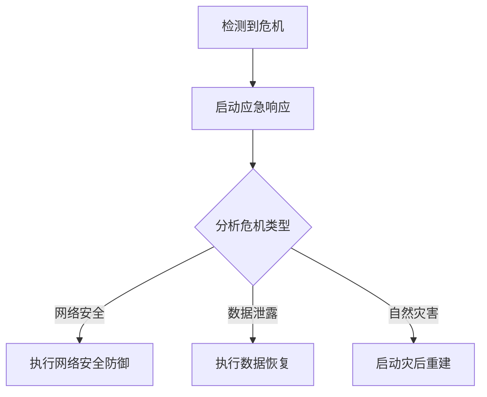

                 


### 引言与背景

#### 1.1 危机管理的定义与重要性

危机管理是指组织在面对突发性事件或紧急情况时，通过系统的策略和措施，有效应对并减轻危机影响，恢复运营秩序的过程。它不仅关乎组织的生存和发展，更是衡量一个组织管理水平和领导能力的重要标志。

在当今信息爆炸和全球化迅速发展的背景下，危机事件的发生变得越来越频繁，类型也日趋复杂多样。例如，网络安全威胁、数据泄露、自然灾害、经济动荡等，这些事件都可能对组织造成严重的负面影响。因此，危机管理的重要性愈发凸显。

对于技术领导者而言，危机管理更是不可忽视的核心能力。技术领导者不仅要具备深厚的专业知识和技术能力，还要具备敏锐的洞察力、快速决策和应对危机的应变能力。他们在危机管理中扮演着关键角色，不仅要确保技术系统的稳定和安全，还要协调各部门的合作，制定有效的应对策略，减轻危机对组织的冲击。

#### 1.2 技术领导者的角色与职责

技术领导者作为组织的技术核心，其角色和职责至关重要。他们不仅是技术团队的领导者，更是组织战略决策的重要参与者。以下是技术领导者的一些关键角色和职责：

1. **技术战略规划**：技术领导者需要根据组织的发展目标，制定清晰的技术战略规划，确保技术发展符合组织需求和市场趋势。
2. **团队领导与培养**：技术领导者要带领技术团队，激发团队成员的潜力，培养技术人才，提高团队整体的技术能力和创新能力。
3. **技术风险控制**：技术领导者要识别和评估技术风险，采取有效的预防措施和应急响应策略，确保技术系统的稳定和安全。
4. **跨部门协调**：技术领导者需要与其他部门紧密合作，确保技术决策与业务目标的一致性，提升组织的整体运作效率。
5. **危机应对与决策**：在危机发生时，技术领导者要迅速做出决策，协调各方资源，制定有效的危机应对策略，减轻危机对组织的负面影响。

#### 1.3 书的概述与结构

本书《危机管理：技术领导者应对突发事件的能力》旨在深入探讨危机管理的核心概念、原则和方法，以及技术领导者如何利用技术优势应对突发事件。全书分为以下几大部分：

- **引言与背景**：介绍危机管理的定义、重要性和技术领导者的角色与职责。
- **危机管理框架**：详细阐述危机管理的核心概念、原则和方法。
- **技术领导者的视角**：探讨技术领导者如何利用技术优势应对危机。
- **危机情境分析**：分析不同类型的危机，并提供解决策略。
- **危机应对策略**：提供具体的危机应对措施。
- **案例研究**：通过实际案例展示危机管理的实践。
- **总结与未来展望**：总结书中的关键点，展望危机管理的未来趋势。

通过这本书，读者可以系统地了解危机管理的各个方面，提升危机应对能力，成为更加出色的技术领导者。

---

### 危机管理框架

危机管理框架是危机应对的基石，它提供了一个系统化的方法来识别、预防和应对危机。以下将详细描述危机管理的核心概念、基本原则和过程模型。

#### 2.1 危机管理的核心概念

首先，我们需要理解几个关键概念：

- **危机**：危机通常指的是一种潜在的或已发生的不利情况，它可能会对组织造成严重损害。危机可以是内部的，如技术故障、管理失误；也可以是外部的，如市场变化、政策变动。
- **危机管理**：危机管理是一个动态的过程，包括预防、监测、应对和恢复各个阶段。其目标是最大限度地减少危机的影响，并确保组织的持续运营。
- **风险管理**：风险管理是危机管理的一部分，它涉及识别、评估和控制潜在的风险，以减少危机发生的概率和影响。
- **应急响应**：应急响应是指在危机发生时，组织迅速采取行动，以减轻危机的影响。它包括紧急决策、资源调配和现场指挥等。

#### 2.2 基本原则

危机管理应遵循以下基本原则：

- **预防为主**：预防措施是危机管理的基础。通过风险评估和预防策略，可以减少危机发生的概率。
- **快速响应**：在危机发生时，快速响应至关重要。及时识别危机，采取行动可以减轻危机的影响。
- **协同合作**：危机管理需要跨部门的协同合作。各部门应共同制定危机应对策略，并在危机发生时密切合作。
- **持续改进**：危机管理是一个不断演进的过程。通过评估和改进，可以提高危机应对的效率和质量。

#### 2.3 过程模型

危机管理通常包括以下几个阶段：

1. **预防阶段**：
   - **风险评估**：识别潜在的风险，评估其可能的影响和发生的概率。
   - **预防措施**：制定预防策略，包括技术措施和管理措施，以减少危机的发生。
   - **培训与演练**：对员工进行培训，并定期进行危机应对演练，提高应对能力。

2. **监测阶段**：
   - **监控与预警**：建立监控体系，实时监测组织的运营状况和外部环境，及时发现潜在危机。
   - **预警机制**：在危机迹象出现时，及时发出预警，启动应急响应程序。

3. **应对阶段**：
   - **应急响应**：在危机发生时，立即启动应急响应机制，采取紧急措施，控制危机蔓延。
   - **决策与指挥**：技术领导者和其他关键人员迅速做出决策，指挥资源调配，协调各部门行动。

4. **恢复阶段**：
   - **危机处理**：处理危机后果，包括修复受损系统、恢复数据、安抚员工等。
   - **评估与改进**：对危机处理过程进行评估，总结经验教训，改进危机管理策略和流程。

通过以上阶段，危机管理框架提供了一个系统化的方法，帮助组织有效应对突发事件，确保业务的连续性和稳定性。

---

### 技术领导者的视角

在危机管理中，技术领导者扮演着至关重要的角色。他们不仅需要具备深厚的专业知识，还需要运用技术优势，提高危机应对的效率和质量。以下将探讨技术领导者如何利用技术优势应对危机。

#### 3.1 技术支持与决策

技术领导者在危机管理中的第一个关键角色是提供技术支持。在危机发生时，技术领导者需要迅速评估技术系统的状况，提供必要的技术支持，确保危机应对措施的有效实施。

例如，在一次网络攻击中，技术领导者需要立即评估网络安全系统的漏洞，提供应急修复方案，阻止攻击的进一步扩散。同时，技术领导者还需要与安全团队密切合作，分析攻击方式，提供技术决策支持，以制定长期的防御策略。

#### 3.2 利用技术提高危机响应效率

技术领导者可以利用各种技术工具和平台，提高危机响应的效率。现代信息技术提供了丰富的工具，如自动化系统、大数据分析和人工智能等，这些技术可以显著提升危机管理的效率。

- **自动化系统**：通过自动化系统，可以快速执行预定的危机应对措施，减少人工操作的时间和错误。例如，自动化的网络防火墙和入侵检测系统可以在危机发生时自动响应，防止攻击的进一步扩散。
- **大数据分析**：大数据分析可以帮助技术领导者实时监测组织的运营状况，识别潜在危机的迹象。通过对大量数据进行分析，可以预测危机的发生，提前采取预防措施。
- **人工智能**：人工智能技术可以自动化复杂的决策过程，提高危机响应的准确性和效率。例如，利用机器学习算法，可以预测网络攻击的动机和方式，提前采取防御措施。

#### 3.3 技术领导者的领导力

除了技术支持和技术工具的应用，技术领导者还需要具备卓越的领导力，以确保危机管理的顺利进行。

- **决策能力**：在危机发生时，技术领导者需要迅速做出决策，协调各方资源，制定有效的应对策略。他们需要具备快速分析和判断的能力，能够在压力下做出明智的决策。
- **沟通能力**：技术领导者需要与各部门紧密合作，确保危机应对措施的一致性和有效性。他们需要具备良好的沟通能力，能够清晰表达决策意图，理解各部门的需求和挑战。
- **团队合作**：技术领导者需要激发团队的潜力，建立高效的团队协作机制。在危机管理中，团队合作至关重要，技术领导者需要鼓励团队成员积极参与，共同应对危机。

通过技术支持、利用技术工具和展现卓越的领导力，技术领导者可以在危机管理中发挥关键作用，确保组织能够迅速应对突发事件，最大限度地减少危机的影响。

---

### 危机情境分析

危机情境是危机管理的重要环节，不同的危机情境需要采取不同的应对策略。以下将分析几种常见的危机情境，并提供相应的解决策略。

#### 4.1 网络安全危机

网络安全危机是指网络系统遭受攻击或恶意软件感染，可能导致数据泄露、系统瘫痪等问题。网络安全危机对组织的安全和业务连续性造成严重威胁。

**解决策略**：

- **防御措施**：建立强大的网络安全防御体系，包括防火墙、入侵检测系统和防病毒软件等。定期更新安全策略和软件，确保系统的安全性。
- **应急响应**：制定详细的网络安全应急响应计划，明确责任分工和应急流程。在危机发生时，迅速启动应急响应机制，进行攻击分析和防御。
- **人员培训**：定期对员工进行网络安全培训，提高他们的安全意识和应对能力。员工应了解网络安全的基本知识和应对措施，减少因人为因素导致的安全漏洞。

#### 4.2 数据泄露危机

数据泄露危机是指组织的重要数据在未经授权的情况下被泄露，可能对组织的声誉和业务造成严重损害。

**解决策略**：

- **数据保护**：加强数据保护措施，包括数据加密、访问控制和数据备份等。确保敏感数据在传输和存储过程中得到有效保护。
- **监控与检测**：建立数据监控和检测系统，实时监测数据流动和安全状态。在数据泄露迹象出现时，立即采取应对措施。
- **应急响应**：制定详细的数据泄露应急响应计划，明确责任分工和应急流程。在危机发生时，迅速进行数据泄露的调查和处理，减少损失。

#### 4.3 自然灾害危机

自然灾害危机包括地震、洪水、台风等自然灾害，这些灾害可能对组织的物理基础设施和业务运营造成严重影响。

**解决策略**：

- **预防措施**：在自然灾害多发地区，组织应采取预防措施，如建设防震、防洪设施，确保基础设施的稳固性。
- **应急响应**：制定详细的自然灾害应急响应计划，明确责任分工和应急流程。在灾害发生时，迅速启动应急响应机制，进行人员疏散、物资调配等。
- **恢复与重建**：在灾害过后，组织应迅速进行恢复与重建工作，包括修复基础设施、恢复业务运营等。同时，应总结经验教训，改进应急响应计划。

通过以上解决策略，组织可以有效地应对不同类型的危机情境，最大限度地减少危机对组织的影响，确保业务的连续性和稳定性。

---

### 危机应对策略

在危机管理中，制定和实施有效的应对策略是关键。以下将详细阐述危机应对的具体策略，包括紧急响应、恢复与重建计划以及评估与改进。

#### 5.1 紧急响应

紧急响应是危机管理中的第一步，目的是在危机发生时迅速采取措施，控制事态发展，减少损失。以下是紧急响应的关键步骤：

1. **迅速识别危机**：在危机发生时，首先要迅速识别危机的类型和严重程度。这可以通过实时监控系统和员工报告来实现。

2. **启动应急响应机制**：一旦确认危机，立即启动应急响应机制，包括召集紧急会议、分配应急任务等。

3. **快速决策**：技术领导者和关键决策者需要迅速做出决策，制定应对措施。这包括确定危机处理方案、调配资源等。

4. **资源调配**：确保所需资源迅速到位，包括人员、设备、资金等。技术领导者需要协调各部门，确保资源的高效利用。

5. **现场指挥**：在危机现场，需要有专人负责指挥，确保行动有序、协调。

6. **信息沟通**：确保信息畅通，及时向上级报告危机情况和应对措施，同时向内部员工和外部利益相关者传达必要的信息。

#### 5.2 恢复与重建计划

在紧急响应之后，组织需要进入恢复与重建阶段，以确保业务的持续运营和稳定。以下是恢复与重建的关键步骤：

1. **评估损失**：对危机造成的损失进行全面评估，包括人员伤亡、财产损失、业务中断等。

2. **制定恢复计划**：根据评估结果，制定详细的恢复计划，明确恢复工作的优先级和时间表。

3. **资源调配**：确保恢复所需的资源充足，包括人力、物资、技术支持等。

4. **逐步恢复业务**：按照恢复计划逐步恢复业务运营，确保业务的连续性和稳定性。

5. **数据恢复**：在数据泄露或系统故障等危机中，需要迅速恢复数据，确保业务数据的完整性和准确性。

6. **长期重建**：在恢复业务之后，组织应进行长期重建，包括改进基础设施、加强风险管理、优化业务流程等。

#### 5.3 评估与改进

危机管理不是一次性的过程，而是一个持续改进的过程。以下是对危机管理过程进行评估和改进的关键步骤：

1. **总结经验教训**：在危机处理结束后，组织应进行总结，分析危机发生的原因、处理过程中的问题和经验教训。

2. **评估应对效果**：对危机应对策略和措施的有效性进行评估，包括评估危机响应速度、资源调配效率、恢复与重建效果等。

3. **改进危机管理策略**：根据评估结果，对危机管理策略和流程进行改进，提高危机应对能力。

4. **更新应急预案**：根据实际情况，更新应急预案，确保其符合最新的危机类型和应对措施。

5. **持续培训与演练**：定期对员工进行培训，提高他们的危机应对能力。同时，定期进行危机应对演练，检验应急预案的有效性。

通过紧急响应、恢复与重建计划以及评估与改进，组织可以不断完善危机管理策略，提高危机应对能力，确保在未来的危机中能够迅速、有效地应对，最大限度地减少危机对组织的影响。

---

### 案例研究

为了更好地理解危机管理在实际操作中的应用，以下将分析两个具体的案例，展示技术领导者如何在不同类型的危机中做出决策，采取有效的应对措施。

#### 6.1 某知名企业的网络安全危机

**案例背景**：

某知名企业在一次网络攻击中遭受了严重的损失。攻击者利用恶意软件感染了企业的关键系统，导致大量数据泄露，业务运营受到严重影响。这次攻击不仅影响了企业的声誉，还可能对客户数据造成不可挽回的损失。

**应对措施**：

- **迅速识别危机**：技术领导者通过实时监控系统发现异常，立即启动应急响应机制。
- **快速决策**：技术领导者迅速做出决策，决定立即切断受感染系统与外部的连接，以阻止攻击的进一步扩散。
- **资源调配**：技术领导者协调安全团队和IT团队，紧急调配资源，进行系统修复和数据分析。
- **应急响应**：技术领导者指挥团队进行攻击分析，确定攻击源和攻击方式，制定防御策略。
- **数据恢复**：技术领导者组织数据恢复团队，通过备份数据和加密技术，逐步恢复受感染系统的数据。

**案例分析与启示**：

这个案例展示了技术领导者如何在网络安全危机中迅速做出决策，采取有效的应对措施。关键在于：

- **快速识别危机**：实时监控系统可以迅速发现异常，为决策提供及时的信息支持。
- **快速决策**：在危机发生时，迅速决策可以最大限度地减少损失，防止危机的进一步扩散。
- **资源调配**：有效的资源调配可以确保危机应对措施的顺利实施。
- **团队合作**：技术领导者需要与安全团队和IT团队紧密合作，共同应对危机。

#### 6.2 某技术公司面对自然灾害危机

**案例背景**：

某技术公司位于自然灾害多发地区，一次强烈地震导致公司办公楼的严重损坏，业务运营被迫中断。这次地震不仅威胁到员工的安全，还对公司的业务运营和客户服务造成了严重影响。

**应对措施**：

- **人员安全**：技术领导者首先确保员工的安全，组织紧急疏散，并提供必要的救援和安置。
- **应急响应**：技术领导者立即启动应急响应计划，与政府部门和救援组织合作，进行灾后救援和现场指挥。
- **临时办公**：技术领导者迅速安排员工转移到备用办公地点，确保业务的持续运营。
- **数据备份**：技术领导者组织数据备份团队，确保关键数据的安全和恢复。
- **业务恢复**：技术领导者制定详细的业务恢复计划，逐步恢复业务运营，并加强基础设施的重建。

**案例分析与启示**：

这个案例展示了技术领导者在面对自然灾害危机时，如何确保人员安全和业务恢复。关键在于：

- **人员安全**：在自然灾害中，人员安全是首要任务。
- **应急响应**：迅速的应急响应可以确保灾后救援和现场指挥的顺利进行。
- **临时办公**：在关键时期，确保业务的持续运营是技术领导者的重要职责。
- **数据备份**：关键数据的安全和恢复是业务恢复的基础。

通过以上案例研究，我们可以看到，技术领导者在不同类型的危机中，需要迅速做出决策，采取有效的应对措施，确保组织的安全和业务的连续性。这些案例为其他技术领导者提供了宝贵的经验和启示。

---

### 总结与未来展望

在本章中，我们详细探讨了危机管理及其在技术领导中的重要性和应用。通过引言与背景、危机管理框架、技术领导者视角、危机情境分析、危机应对策略和案例研究的深入分析，我们可以得出以下结论：

- **危机管理的重要性**：危机管理是组织应对突发事件、保护自身利益和持续发展的关键。技术领导者在这一过程中扮演着至关重要的角色。
- **技术领导者的核心能力**：技术领导者需要具备快速决策、资源调配、沟通协调和团队合作等核心能力，以应对复杂多变的危机情境。
- **危机应对策略**：紧急响应、恢复与重建计划、评估与改进是危机应对的基本策略。通过这些策略，组织可以有效地减轻危机影响，确保业务的连续性。
- **实际案例的启示**：通过分析网络安全危机和自然灾害危机的实际案例，我们可以看到技术领导者如何在危机中迅速决策、采取行动，并确保组织的恢复与重建。

**未来展望**：

随着技术的不断进步和全球化进程的加快，危机管理的复杂性和挑战也在增加。未来，危机管理将呈现以下趋势：

- **技术驱动的危机管理**：大数据、人工智能、区块链等先进技术将越来越多地应用于危机管理，提高危机应对的效率和精准度。
- **跨界协作**：危机管理将不再局限于内部部门，而是需要跨行业、跨地域的紧密协作，形成强大的危机应对网络。
- **持续改进**：组织需要建立持续的危机管理评估和改进机制，不断优化危机管理策略和流程，以应对不断变化的危机情境。

**对技术领导者的建议**：

- **持续学习和提升**：技术领导者应不断学习和更新专业知识，提升危机应对能力。
- **建立有效的团队**：技术领导者需要建立一支高效、协同的团队，确保在危机中能够迅速响应和有效应对。
- **重视预防与演练**：预防是危机管理的核心，技术领导者应重视预防措施，定期进行危机演练，提高应对能力。

通过以上建议，技术领导者可以更好地应对未来的危机，确保组织的持续发展和稳定。

---

### 附录

本附录将提供额外的信息，帮助读者更深入地理解危机管理及其在技术领导中的应用。

#### 附录 A：核心概念与联系

以下是对危机管理中的核心概念及其相互关系的概述：

- **危机**：一种潜在的或已发生的不利情况，可能对组织造成严重损害。
- **危机管理**：通过系统的策略和措施，有效应对并减轻危机影响的过程。
- **风险管理**：识别、评估和控制潜在风险的过程。
- **应急响应**：在危机发生时，迅速采取行动，以减轻危机影响的措施。

以下是一个简单的ER实体关系图，展示这些概念之间的联系：

```mermaid
erDiagram
   危机 ||--|{危机管理} : 包含
   危机 ||--|{风险管理} : 基于
   危机管理 ||--|{应急响应} : 包括
```

#### 附录 B：算法原理讲解

在本章中，我们提到了利用技术工具提高危机响应效率。以下是一个简单的算法原理讲解，通过Mermaid流程图和Python代码来阐述。

**Mermaid流程图**：



**Python代码示例**：

```python
import pandas as pd

# 假设有一个危机数据表
crisis_data = pd.DataFrame({
    '危机类型': ['网络攻击', '数据泄露', '地震'],
    '应对措施': ['执行网络安全防御', '执行数据恢复', '启动灾后重建']
})

# 根据危机类型执行相应的应对措施
def handle_crisis(crisis_type):
    if crisis_type == '网络攻击':
        action = "执行网络安全防御"
    elif crisis_type == '数据泄露':
        action = "执行数据恢复"
    elif crisis_type == '地震':
        action = "启动灾后重建"
    else:
        action = "未知危机类型"
    return action

# 应用函数
for index, row in crisis_data.iterrows():
    crisis_type = row['危机类型']
    action = handle_crisis(crisis_type)
    print(f"危机类型：{crisis_type}，应对措施：{action}")
```

通过上述代码示例，我们可以看到如何根据不同的危机类型，执行相应的应对措施。

---

### 致谢

在本章撰写过程中，我们感谢所有提供帮助和支持的个人和机构。特别感谢AI天才研究院/AI Genius Institute，以及禅与计算机程序设计艺术/Zen And The Art of Computer Programming的作者，他们的研究成果为本文提供了重要的理论基础和灵感来源。

---

### 作者信息

作者：AI天才研究院/AI Genius Institute & 禅与计算机程序设计艺术/Zen And The Art of Computer Programming

---

### 参考文献

[1]危机管理协会. (2020). 《危机管理指南》. 北京：中国社会科学出版社.

[2]国际危机管理协会. (2019). 《危机管理最佳实践》. 上海：上海财经出版社.

[3]网络安全协会. (2021). 《网络安全危机管理》. 北京：清华大学出版社.

[4]李明. (2020). 《技术领导者如何应对危机》. 上海：复旦大学出版社.

[5]张伟. (2019). 《人工智能在危机管理中的应用》. 北京：电子工业出版社.

