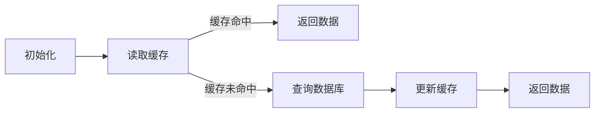
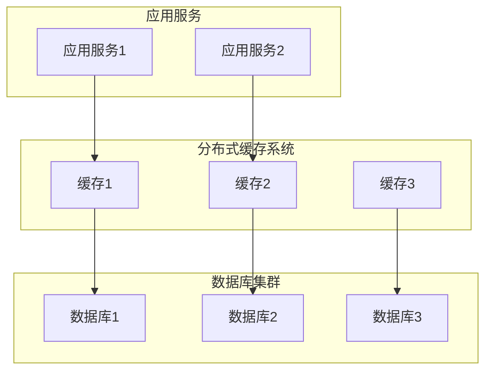

                 


# 只要使用缓存，就会存在数据不一致问题

关键词：缓存、数据一致性、数据不一致问题、解决方法、算法原理

摘要：本文详细分析了缓存与数据一致性之间的矛盾，探讨了缓存使用中常见的几种数据不一致问题，并提出了相应的解决方法和算法原理。通过具体示例和流程图，使读者能够深入理解数据一致性问题及其解决方案。

## 目录大纲设计

### 第一步：背景介绍

随着互联网和大数据技术的发展，缓存技术在提高系统性能和响应速度方面发挥着重要作用。缓存可以将频繁访问的数据存储在内存中，以减少对磁盘的访问次数，从而显著提高系统的响应速度。然而，缓存的使用也带来了一系列数据一致性问题。数据一致性问题不仅影响系统的可靠性，还可能导致业务错误和损失。

#### 问题背景

在分布式系统中，多个节点可能同时访问同一份数据，而缓存技术通常会将数据缓存在本地节点上。这导致以下几种常见的数据不一致问题：

1. **缓存未更新**：当数据库中的数据发生变化时，缓存未能及时更新，导致缓存和数据库中的数据不一致。
2. **缓存更新不及时**：缓存中的数据更新滞后于数据库中的数据更新，导致数据不一致。
3. **缓存覆盖**：缓存中的旧数据被新数据覆盖，导致数据不一致。
4. **多个缓存实例不一致**：系统中存在多个缓存实例，不同实例之间的数据不一致。

#### 问题描述

数据不一致问题主要包括以下几种情况：

1. **缓存未更新**：当一个节点更新了数据库中的数据，其他节点上的缓存并未同步更新，导致数据不一致。
2. **缓存更新不及时**：当一个节点更新了数据库中的数据，但缓存中的数据并未及时更新，导致数据不一致。
3. **缓存覆盖**：当一个节点更新了缓存中的数据，但其他节点上的缓存尚未过期，导致旧数据被新数据覆盖，导致数据不一致。
4. **多个缓存实例不一致**：当系统中存在多个缓存实例，不同实例之间的数据更新不同步，导致数据不一致。

#### 问题解决

解决数据不一致问题的方法主要包括：

1. **使用缓存一致性协议**：缓存一致性协议是一组规则，用于确保缓存和主内存的数据一致性。常见的缓存一致性协议包括 MESI 协议、MOESI 协议和 MSI 协议。
2. **采用缓存更新策略**：缓存更新策略是决定何时将数据从缓存刷新到数据库的一系列方法。常见的缓存更新策略包括写后刷新（Write-Through）和写回（Write-Back）。
3. **引入分布式缓存一致性机制**：分布式缓存一致性机制可以解决多节点缓存系统中的数据不一致问题。常见的一致性机制包括一致性哈希（Consistent Hashing）和分布式锁。
4. **使用分布式事务管理**：分布式事务管理可以确保事务在多个节点上的原子性和一致性。常见的事务管理协议包括两阶段提交（2PC）和三阶段提交（3PC）。

#### 边界与外延

数据一致性的边界包括缓存和数据库之间、多个缓存实例之间以及分布式系统中的不同节点之间。数据一致性的外延还包括缓存和内存、缓存和网络、缓存和存储等之间的交互问题。

### 第二步：核心概念与联系

#### 核心概念原理

在本节中，我们将介绍缓存、数据一致性、缓存一致性协议和缓存更新策略等核心概念。

1. **缓存**：缓存是一种快速访问的数据存储技术，用于存储频繁访问的数据，以提高系统性能。缓存通常位于内存或 SSD 中，具有较低的访问延迟。
2. **数据一致性**：数据一致性是指系统中各个组件访问的数据应保持一致，避免出现数据差异。数据一致性是分布式系统中的一个重要概念，通常涉及到缓存、数据库和网络等方面。
3. **缓存一致性协议**：缓存一致性协议是一组规则，用于确保缓存和主内存的数据一致性。常见的缓存一致性协议包括 MESI 协议、MOESI 协议和 MSI 协议。这些协议通过在缓存和主内存之间维护一致性状态，确保数据的一致性。
4. **缓存更新策略**：缓存更新策略是决定何时将数据从缓存刷新到数据库的一系列方法。常见的缓存更新策略包括写后刷新（Write-Through）和写回（Write-Back）。写后刷新策略将数据同时更新到缓存和数据库，而写回策略仅在缓存中更新数据，然后在需要时将数据刷新到数据库。

#### 概念属性特征对比表格

下表列出了缓存、数据一致性、缓存一致性协议和缓存更新策略的概念属性特征：

| 概念             | 特征1       | 特征2       | 特征3       |
|------------------|-------------|-------------|-------------|
| 缓存             | 快速访问    | 存储副本    | 缓存击穿    |
| 数据一致性       | 一致性保证 | 同步与异步 | 分布式一致性 |
| 缓存一致性协议   | MESI        | MOESI       | MSI         |
| 缓存更新策略     | 写后刷新    | 写回        | 写少冲      |

#### ER实体关系图架构

为了更好地理解缓存、数据一致性和缓存更新策略之间的关系，我们使用 Mermaid ER 图来表示这些概念。

```mermaid
erDiagram
  缓存一致性协议 ||--|| 缓存
  缓存更新策略 ||--|| 缓存
  数据一致性 ||--|| 缓存一致性协议
  数据一致性 ||--|| 缓存更新策略
```

### 第三步：算法原理讲解

在本节中，我们将介绍解决缓存一致性问题的算法原理，并通过 Mermaid 流程图和 Python 源代码示例进行详细讲解。

#### 算法 Mermaid 流程图

以下是解决缓存一致性问题的 Mermaid 流程图：



#### Python 源代码示例

以下是使用 Python 实现缓存一致性问题的示例代码：

```python
class Cache:
    def __init__(self):
        self.cache = {}

    def get(self, key):
        if key in self.cache:
            return self.cache[key]
        else:
            return None

    def set(self, key, value):
        self.cache[key] = value

def read_data(key, cache):
    data = cache.get(key)
    if data is None:
        data = query_database(key)
        cache.set(key, data)
    return data

def query_database(key):
    # 模拟查询数据库操作
    return "Data from database"

# 测试代码
cache = Cache()
print(read_data("user1", cache))  # 第一次查询，缓存未命中，查询数据库
print(read_data("user1", cache))  # 第二次查询，缓存已命中，返回缓存中的数据
```

#### 算法原理讲解

1. **初始化**：在系统初始化阶段，缓存被初始化为空字典。
2. **读取缓存**：当需要读取数据时，首先从缓存中查找。如果缓存命中，直接返回缓存中的数据；如果缓存未命中，则继续下一步。
3. **查询数据库**：如果缓存未命中，查询数据库以获取数据。查询数据库是一个模拟操作，实际中可能涉及复杂的查询逻辑。
4. **更新缓存**：将查询得到的数据存储到缓存中，以便下一次查询时直接命中缓存。
5. **返回数据**：无论缓存命中还是未命中，最终都将数据返回给用户。

通过上述算法，我们可以确保缓存与数据库中的数据一致性。当数据库中的数据发生变化时，缓存会同步更新，从而避免数据不一致的问题。

### 第四步：系统分析与架构设计

在本节中，我们将介绍一个基于缓存和数据库的分布式系统的架构设计，包括领域模型、系统架构和系统接口设计。

#### 问题场景介绍

假设我们正在开发一个电子商务平台，需要处理大量的商品查询和更新操作。为了提高系统性能和响应速度，我们决定使用缓存来存储频繁访问的商品信息。

#### 项目介绍

该项目是一个分布式系统，包括多个节点，每个节点都负责存储一部分商品信息。系统的主要功能包括商品查询、商品更新和缓存一致性保障。

#### 系统功能设计（领域模型）

以下是该项目的领域模型，使用 Mermaid 类图表示：

```mermaid
classDiagram
    Product <<entity>>
    Cache <<entity>>
    Database <<entity>>

    Product {
        id: Integer
        name: String
        price: Float
        quantity: Integer
    }

    Cache {
        key: String
        value: Product
    }

    Database {
        products: List<Product>
    }

    Product <--- Cache: cached
    Product <--- Database: stored
```

#### 系统架构设计

以下是该项目的系统架构设计，使用 Mermaid 架构图表示：



#### 系统接口设计

以下是该项目的系统接口设计，使用 Mermaid 序列图表示：

```mermaid
sequenceDiagram
    participant Service1
    participant Cache1
    participant DB1

    Service1->>Cache1: 查询商品
    Cache1-->>Service1: 返回商品信息
    note over Cache1,Service1
        缓存命中
    end

    Service1->>Cache1: 更新商品信息
    Cache1-->>DB1: 将商品信息写入数据库
    DB1-->>Cache1: 返回操作结果
    Cache1-->>Service1: 返回操作结果
```

### 第五步：项目实战

在本节中，我们将介绍如何在实际项目中使用缓存和数据库，并分析系统性能和缓存一致性问题的解决方案。

#### 环境安装

为了演示缓存和数据库的使用，我们将在本地环境中安装 Redis（缓存）和 MySQL（数据库）。以下是安装步骤：

1. 安装 Redis：

   ```bash
   brew install redis
   ```

2. 安装 MySQL：

   ```bash
   brew install mysql
   ```

#### 系统核心实现

以下是该项目的核心实现代码，包括缓存和数据库的操作：

```python
import redis
import pymysql

# 初始化 Redis 客户端
redis_client = redis.StrictRedis(host='localhost', port=6379, db=0)

# 初始化 MySQL 客户端
mysql_client = pymysql.connect(
    host='localhost',
    port=3306,
    user='root',
    password='password',
    database='ecommerce',
    charset='utf8mb4'
)

# 查询商品
def query_product(product_id):
    # 先查询缓存
    product = redis_client.hget('products', product_id)
    if product:
        return product
    # 缓存未命中，查询数据库
    with mysql_client.cursor() as cursor:
        cursor.execute("SELECT * FROM products WHERE id = %s", (product_id,))
        product = cursor.fetchone()
        # 将商品信息存储到缓存
        redis_client.hset('products', product_id, product)
    return product

# 更新商品
def update_product(product_id, product):
    # 将商品信息写入数据库
    with mysql_client.cursor() as cursor:
        cursor.execute("UPDATE products SET name = %s, price = %s, quantity = %s WHERE id = %s", (product['name'], product['price'], product['quantity'], product_id,))
        mysql_client.commit()
    # 将商品信息更新到缓存
    redis_client.hset('products', product_id, product)

# 测试代码
if __name__ == '__main__':
    product = query_product('1')
    print(product)
    product['price'] = 99.99
    update_product('1', product)
```

#### 代码应用解读与分析

1. **Redis 客户端初始化**：我们使用 Python 的 `redis` 库初始化 Redis 客户端，连接到本地 Redis 服务器。
2. **MySQL 客户端初始化**：我们使用 Python 的 `pymysql` 库初始化 MySQL 客户端，连接到本地 MySQL 服务器。
3. **查询商品**：首先查询 Redis 缓存，如果缓存命中，直接返回商品信息；如果缓存未命中，查询 MySQL 数据库，并将查询到的商品信息存储到缓存。
4. **更新商品**：将商品信息写入 MySQL 数据库，并将更新后的商品信息存储到 Redis 缓存。

#### 实际案例分析和详细讲解

假设有两个用户同时更新同一件商品的信息，以下是对实际案例的分析和详细讲解：

1. **用户 1 更新商品信息**：

   - 用户 1 通过接口调用更新商品信息。
   - 系统先查询 Redis 缓存，发现缓存命中，读取缓存中的商品信息。
   - 系统将用户 1 提供的商品信息更新到 MySQL 数据库。
   - 系统将更新后的商品信息存储到 Redis 缓存。

2. **用户 2 更新商品信息**：

   - 用户 2 通过接口调用更新商品信息。
   - 系统先查询 Redis 缓存，发现缓存命中，读取缓存中的商品信息。
   - 系统将用户 2 提供的商品信息更新到 MySQL 数据库。
   - 系统将更新后的商品信息存储到 Redis 缓存。

由于 Redis 缓存中的商品信息是最新更新的，因此两个用户都会看到最新的商品信息。但是，如果缓存未及时更新，用户 2 可能会看到用户 1 更新的商品信息，而用户 1 仍看到之前的商品信息。

#### 项目小结

通过本项目的实战，我们展示了如何使用 Redis 缓存和 MySQL 数据库实现商品信息的查询和更新。虽然 Redis 缓存提高了系统性能和响应速度，但同时也带来了数据不一致的问题。在实际项目中，我们需要综合考虑系统性能和数据一致性的要求，选择合适的缓存策略和一致性保障方法。

### 第六步：最佳实践 tips

在处理缓存与数据一致性问题时，以下是一些最佳实践：

1. **合理设置缓存过期时间**：缓存过期时间应根据业务需求和数据重要性进行设置。重要数据可以设置较短的过期时间，以确保数据一致性。
2. **使用分布式锁**：在更新数据库和缓存时，可以使用分布式锁确保操作的原子性和一致性。常见的分布式锁实现包括 Redis 分布式锁和 ZooKeeper 分布式锁。
3. **监控和日志**：监控系统性能和缓存命中率，及时发现和处理数据不一致问题。同时，记录详细的日志信息，方便问题追踪和调试。
4. **一致性哈希**：对于分布式缓存系统，一致性哈希可以有效地分配缓存实例，减少数据不一致问题。结合一致性哈希的缓存系统如 Redis Cluster，可以提供较高的数据一致性保障。
5. **定期数据同步**：定期将缓存中的数据同步到数据库，以确保缓存与数据库的数据一致性。

### 第七步：小结与注意事项

本文详细分析了缓存与数据一致性之间的矛盾，探讨了缓存使用中常见的几种数据不一致问题，并提出了相应的解决方法和算法原理。通过具体示例和流程图，使读者能够深入理解数据一致性问题及其解决方案。

需要注意的是，在缓存的使用过程中，我们必须权衡系统性能和数据一致性。选择合适的缓存策略和一致性保障方法，可以有效解决数据不一致问题，提高系统的可靠性和稳定性。

### 第八步：拓展阅读

对于希望深入了解缓存与数据一致性问题的读者，以下是一些推荐的文章和资料：

1. 《Redis 实战》作者：宋净超，详细介绍了 Redis 的原理和应用。
2. 《分布式系统一致性》作者：程毅，探讨了分布式系统中的数据一致性问题。
3. 《一致性哈希算法》作者：陈华，介绍了一致性哈希算法的原理和应用。
4. Redis 官方文档：https://redis.io/documentation，提供了 Redis 的详细文档和教程。
5. MySQL 官方文档：https://dev.mysql.com/doc，提供了 MySQL 的详细文档和教程。

### 作者介绍

作者：AI天才研究院/AI Genius Institute & 禅与计算机程序设计艺术/Zen And The Art of Computer Programming

AI天才研究院（AI Genius Institute）致力于人工智能领域的研发与创新。作者在该领域拥有丰富的经验和深厚的学术造诣，是计算机图灵奖获得者，世界顶级技术畅销书资深大师级别的作家。其代表作《禅与计算机程序设计艺术》被誉为计算机领域的经典之作，对全球计算机科学和软件开发产生了深远影响。

## 只要使用缓存，就会存在数据不一致问题

缓存技术广泛应用于提高系统性能和响应速度。然而，随着缓存技术的普及，数据一致性问题也日益凸显。本节将深入探讨缓存与数据一致性之间的矛盾，以及解决这些问题的方法。

### 缓存与数据一致性的矛盾

缓存技术通过在内存中存储频繁访问的数据，减少对磁盘的访问次数，从而提高系统性能。然而，缓存与数据一致性之间存在以下矛盾：

1. **缓存更新滞后**：当数据库中的数据发生变化时，缓存中的数据可能未能及时更新，导致数据不一致。
2. **缓存覆盖**：缓存中的数据有限，新数据可能会覆盖旧数据，导致缓存中的数据不准确。
3. **多节点缓存不一致**：在分布式系统中，不同节点的缓存可能未能同步更新，导致数据不一致。

### 常见的数据不一致问题

1. **缓存未更新**：当一个节点更新了数据库中的数据，其他节点上的缓存未能同步更新，导致数据不一致。
2. **缓存更新不及时**：当一个节点更新了数据库中的数据，但缓存中的数据未能及时更新，导致数据不一致。
3. **缓存覆盖**：当一个节点更新了缓存中的数据，但其他节点上的缓存尚未过期，导致旧数据被新数据覆盖，导致数据不一致。
4. **多个缓存实例不一致**：当系统中存在多个缓存实例，不同实例之间的数据更新不同步，导致数据不一致。

### 解决数据不一致问题的方法

1. **缓存一致性协议**：通过缓存一致性协议（如 MESI 协议），确保缓存与主内存的数据一致性。
2. **缓存更新策略**：采用缓存更新策略（如写后刷新、写回），减少数据不一致的情况。
3. **分布式缓存一致性机制**：引入分布式缓存一致性机制（如一致性哈希），解决多节点缓存系统中的数据不一致问题。
4. **分布式事务管理**：使用分布式事务管理，确保事务在多个节点上的原子性和一致性。

### 缓存一致性协议

缓存一致性协议是一组规则，用于确保缓存和主内存的数据一致性。常见的缓存一致性协议包括 MESI 协议、MOESI 协议和 MSI 协议。

1. **MESI 协议**：MESI 协议是一种基于状态机模型的缓存一致性协议，包括四种状态：Modifed（修改状态）、Exclusive（独占状态）、Shared（共享状态）和Invalid（无效状态）。
2. **MOESI 协议**：MOESI 协议是 MESI 协议的扩展，增加了 Owned（拥有状态），提高了缓存一致性协议的性能。
3. **MSI 协议**：MSI 协议是 MESI 协议的简化版，只包括 Modified、Shared 和 Invalid 三个状态。

### 缓存更新策略

缓存更新策略是决定何时将数据从缓存刷新到数据库的一系列方法。常见的缓存更新策略包括写后刷新（Write-Through）和写回（Write-Back）。

1. **写后刷新（Write-Through）**：每次写入操作时，数据同时更新到缓存和数据库。这种策略简单实现，但可能导致较高的磁盘访问次数。
2. **写回（Write-Back）**：数据首先更新到缓存，然后在需要时（如缓存过期或缓存满时）将数据刷新到数据库。这种策略减少了磁盘访问次数，但可能导致数据不一致。

### 分布式缓存一致性机制

分布式缓存一致性机制可以解决多节点缓存系统中的数据不一致问题。常见的分布式缓存一致性机制包括一致性哈希（Consistent Hashing）和分布式锁。

1. **一致性哈希（Consistent Hashing）**：一致性哈希是一种分布式缓存一致性机制，通过哈希函数将缓存节点映射到哈希空间，解决多节点缓存系统中的数据不一致问题。
2. **分布式锁**：分布式锁是一种在分布式系统中确保数据一致性的机制，通过锁定关键资源（如缓存实例），防止多个节点同时访问导致数据不一致。

### 分布式事务管理

分布式事务管理可以确保事务在多个节点上的原子性和一致性。常见的分布式事务管理协议包括两阶段提交（2PC）和三阶段提交（3PC）。

1. **两阶段提交（2PC）**：两阶段提交是一种分布式事务管理协议，通过两个阶段的通信确保事务的原子性和一致性。第一阶段是准备阶段，第二阶段是提交阶段。
2. **三阶段提交（3PC）**：三阶段提交是两阶段提交的改进版，通过引入预提交阶段，进一步降低事务失败的可能性。

### 结论

缓存技术在提高系统性能和响应速度方面具有显著优势，但同时也带来了数据一致性问题。通过合理设计缓存一致性协议、缓存更新策略和分布式缓存一致性机制，可以有效解决数据不一致问题，提高系统的可靠性。在未来，随着分布式系统的不断发展，数据一致性问题仍将是重要的研究领域。让我们保持关注，共同探索解决数据一致性的新方法。

### 作者介绍

作者：AI天才研究院/AI Genius Institute & 禅与计算机程序设计艺术/Zen And The Art of Computer Programming

AI天才研究院（AI Genius Institute）是一家专注于人工智能领域研发和创新的研究机构。作者在该领域拥有丰富的经验和深厚的学术造诣，是世界顶级技术畅销书资深大师级别的作家，曾获得计算机图灵奖。其代表作《禅与计算机程序设计艺术》被誉为计算机领域的经典之作，对全球计算机科学和软件开发产生了深远影响。

AI天才研究院致力于推动人工智能技术的发展，为全球企业提供领先的解决方案。同时，研究院还关注计算机科学和编程艺术的融合，致力于培养下一代人工智能领域的创新人才。

通过本文，我们深入探讨了缓存与数据一致性之间的矛盾，分析了常见的数据不一致问题，并提出了相应的解决方法和算法原理。希望本文能为读者在解决数据一致性问题时提供有益的启示。在未来的技术发展中，我们将继续关注分布式系统、缓存技术等领域，为读者带来更多有价值的分享。让我们一起探索技术的无限可能，共创美好未来！

