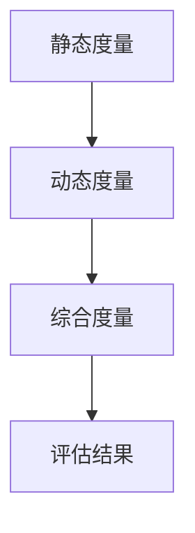
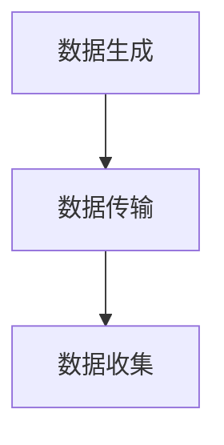
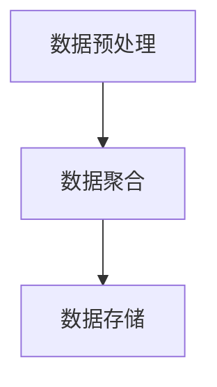
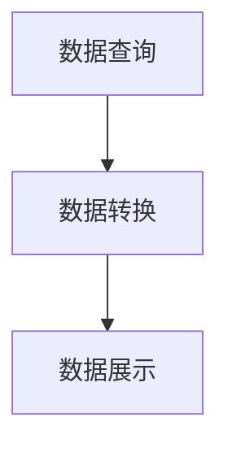
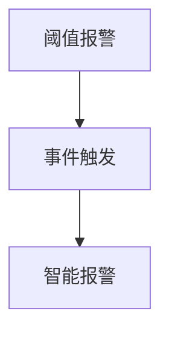
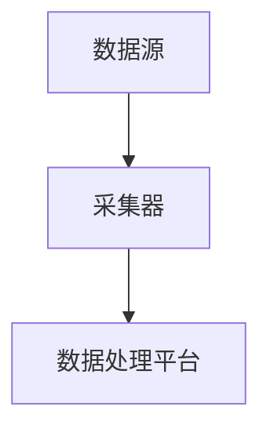
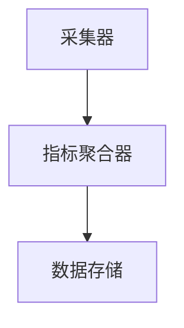
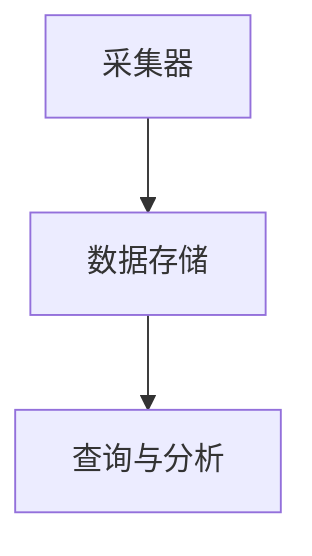
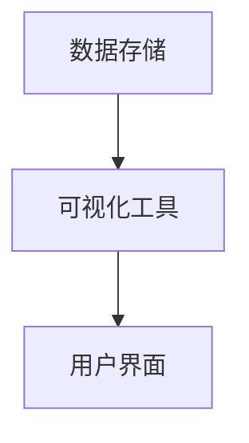
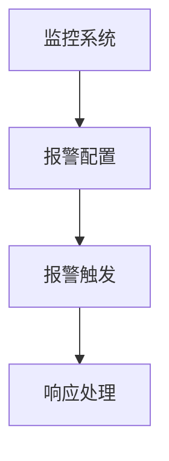

                 

### 第一部分：引言与背景

**目录大纲设计思路**：

1. **确定书的核心主题**：  
   - 《可观测性：分布式系统的监控新范式》的核心主题是可观测性及其在分布式系统监控中的应用。
   - 可观测性是现代分布式系统监控的一个关键概念，它通过提供对系统内部状态的透明度，帮助开发者和管理人员更好地理解和控制复杂分布式环境中的问题。

2. **划分章节**：  
   - 引言和背景介绍：介绍可观测性的起源、发展及其在分布式系统监控中的重要性。
   - 分布式系统概述：概述分布式系统的基本概念、架构和挑战，为理解可观测性在分布式系统中的应用奠定基础。
   - 可观测性概述：定义可观测性的基本概念，解释其在分布式系统监控中的关键作用。

3. **细化章节内容**：  
   - 对于每一部分，我们细化为具体的章节，确保内容全面且逻辑清晰。

4. **设计目录结构**：  
   - 使用markdown格式设计目录结构，确保层次分明，便于读者阅读。

5. **内容完整性**：  
   - 确保每一章节都包含必要的内容，如背景介绍、核心概念、原理讲解、案例分析等。

**具体目录大纲设计如下**：

```markdown
----------------------------------------------------------------
# 《可观测性：分布式系统的监控新范式》

## 关键词：可观测性、分布式系统、监控、新范式、监控挑战、监控架构

## 摘要：
本文深入探讨可观测性在分布式系统监控中的应用。首先，通过背景介绍，解释了分布式系统监控面临的挑战。接着，详细阐述了可观测性的基本概念及其重要性。随后，通过对分布式系统概述和可观测性原理的讲解，为理解可观测性在分布式系统中的应用打下基础。文章还涵盖了可观测性的实现技术、最佳实践、案例分析以及总结和展望。通过这些章节的深入探讨，读者将全面了解可观测性在分布式系统监控中的关键作用。

----------------------------------------------------------------

# 第一部分：引言与背景

## 1. 引言
### 1.1 可观测性的提出背景
### 1.2 分布式系统监控的需求
### 1.3 可观测性的发展历程

## 2. 分布式系统概述
### 2.1 分布式系统的定义
### 2.2 分布式系统的架构
### 2.3 分布式系统的挑战

## 3. 可观测性概述
### 3.1 可观测性的定义
### 3.2 可观测性的重要性
### 3.3 可观测性与监控的关系

----------------------------------------------------------------

# 第二部分：可观测性的基本概念和原理

## 4. 可观测性的基本概念
### 4.1 可观测性指标
### 4.2 可观测性度量
### 4.3 可观测性框架

## 5. 可观测性的原理
### 5.1 数据采集与处理
### 5.2 可视化与报警机制
### 5.3 实时性与准确性

## 6. 可观测性与分布式系统
### 6.1 可观测性在分布式系统中的应用
### 6.2 分布式系统中的可观测性挑战
### 6.3 可观测性的分布式架构设计

----------------------------------------------------------------

# 第三部分：可观测性的实现技术

## 7. 可观测性的实现技术
### 7.1 采集器技术
### 7.2 指标聚合器
### 7.3 数据存储与查询
### 7.4 可视化工具
### 7.5 自动化报警与响应

## 8. 实现可观测性的实践案例
### 8.1 案例一：某电商平台的分布式系统监控
### 8.2 案例二：某金融科技公司的可观测性实践
### 8.3 案例三：某游戏公司的分布式游戏服务器监控

----------------------------------------------------------------

# 第四部分：可观测性的最佳实践和案例分析

## 9. 可观测性的最佳实践
### 9.1 最佳实践一：构建完善的监控体系
### 9.2 最佳实践二：实时数据处理与可视化
### 9.3 最佳实践三：自动化报警与响应

## 10. 可观测性的案例分析
### 10.1 案例分析一：某物流公司的可观测性建设
### 10.2 案例分析二：某互联网企业的可观测性实践
### 10.3 案例分析三：某医疗健康公司的可观测性应用

----------------------------------------------------------------

# 第五部分：总结与展望

## 11. 总结
### 11.1 可观测性的核心价值
### 11.2 可观测性技术的未来发展趋势
### 11.3 可观测性在分布式系统监控中的重要性

## 12. 展望
### 12.1 未来研究方向
### 12.2 可观测性的应用前景
### 12.3 分布式系统监控的挑战与机遇

----------------------------------------------------------------
```

通过上述目录大纲的设计，本文将为读者提供一个全面、深入的可观测性在分布式系统监控中的探讨，从理论到实践，从背景介绍到具体案例分析，帮助读者更好地理解和应用可观测性。接下来，我们将逐步深入每个章节的内容，为读者提供详细而实用的指导。

## 第一部分：引言与背景

### 引言

在当今数字化时代，分布式系统已经成为企业构建高效、可扩展和弹性的应用架构的重要选择。然而，随着分布式系统的复杂度不断攀升，如何对其进行有效的监控和管理成为了一个巨大的挑战。传统的监控方式往往难以应对分布式系统中的高并发、高负载和动态变化，导致系统故障难以发现和定位，进而影响业务的稳定性和可靠性。

正是在这样的背景下，可观测性（Observability）作为一个新兴的概念，逐渐引起了广泛关注。可观测性不仅提供了一种全新的监控范式，还通过提高系统的透明度，帮助开发者和管理人员更有效地理解和控制分布式系统的运作。

本文将围绕可观测性这一核心主题，深入探讨其在分布式系统监控中的应用。首先，我们将简要介绍可观测性的提出背景和分布式系统监控的需求。接着，回顾可观测性的发展历程，帮助读者建立对这一概念的基本认识。随后，通过对分布式系统概述和可观测性原理的详细讲解，我们将为理解可观测性在分布式系统中的应用奠定坚实的理论基础。

### 1.1 可观测性的提出背景

可观测性作为一个重要的概念，源于系统理论和控制理论。在传统集中式系统中，监控相对简单，主要通过收集系统日志、系统性能指标等方式，实现对系统运行状态的监控。然而，随着互联网和云计算的快速发展，分布式系统逐渐成为主流，其复杂性远超传统系统。

分布式系统的特点包括：

- **高并发性**：分布式系统通常需要处理大量的请求，这要求系统具有极高的并发处理能力。
- **动态性**：分布式系统中的节点和组件经常发生变化，如节点的加入或离开、负载的动态分配等。
- **异构性**：分布式系统中的组件可能运行在不同的硬件和软件环境中。

这些特点使得传统的监控方式难以满足分布式系统的监控需求。例如，系统日志和性能指标往往难以提供足够的细节信息，难以快速定位故障点。此外，分布式系统的故障往往不是单一节点的问题，而是多个节点间相互作用的结果，这进一步增加了监控的复杂性。

为了应对这些挑战，研究人员和开发者开始探索新的监控方法，从而提出了可观测性这一概念。可观测性强调通过采集系统内部状态和行为，提供对系统运行时状态的全局视图，从而实现对系统的深入理解和有效监控。

### 1.2 分布式系统监控的需求

分布式系统的监控需求可以从以下几个方面来理解：

- **故障检测与定位**：分布式系统中的故障可能由多个因素引起，传统的监控方式往往难以快速定位故障点。可观测性通过提供丰富的内部状态和行为数据，帮助开发者和管理人员更快速地识别和定位故障。
- **性能优化**：了解系统的实时性能状态，对于优化系统性能至关重要。可观测性通过采集和展示系统运行时数据，帮助开发者和管理人员识别性能瓶颈，进行有效的性能优化。
- **系统健康状态评估**：分布式系统的健康状态评估对于保障业务连续性和稳定性至关重要。可观测性通过实时监测系统状态，提供系统健康状态的动态视图，帮助管理人员及时识别潜在风险。

为了满足这些监控需求，分布式系统需要具备以下几个关键特性：

- **全面的数据采集**：系统需要能够采集各种类型的数据，包括日志、性能指标、跟踪数据等，从而实现对系统运行状态的全面了解。
- **高效的数据处理**：采集到的数据需要进行实时处理和聚合，以便快速生成监控指标和视图。
- **实时性**：监控系统需要具有高度的实时性，以便在故障发生时能够快速响应和恢复。
- **可扩展性**：随着系统规模的不断扩大，监控系统需要具备良好的可扩展性，能够适应不断增长的监控需求。

### 1.3 可观测性的发展历程

可观测性作为一个概念，虽然近年来才引起广泛关注，但其相关思想和实践却有着悠久的历史。下面简要回顾可观测性的发展历程：

- **早期监控方法**：在分布式系统概念提出之前，早期的集中式系统就已经开始使用日志和性能指标进行监控。这种方法虽然简单，但在面对复杂分布式系统时显得力不从心。
- **系统追踪与日志**：随着分布式系统的出现，系统追踪和日志成为重要的监控手段。通过采集和记录系统运行时的日志信息，开发者和运维人员可以了解系统运行状态和故障情况。
- **度量与指标**：在分布式系统监控中，度量（Metrics）和指标（Indicators）成为重要的数据来源。度量通常用于描述系统性能和资源使用情况，而指标则用于反映系统的健康状态。
- **可观测性框架**：近年来，随着云计算和微服务架构的普及，可观测性逐渐成为一种系统设计理念。可观测性框架通过提供一套系统化的方法，帮助开发者和管理人员更好地理解、监控和优化分布式系统。

### 1.4 小结

通过上述背景介绍，我们可以看到，可观测性在分布式系统监控中具有重要意义。它不仅提供了一种全新的监控范式，还通过提供丰富的内部状态和行为数据，帮助开发者和管理人员更有效地理解和控制分布式系统。在接下来的章节中，我们将进一步深入探讨可观测性的基本概念、原理及其在分布式系统中的应用，为读者提供更全面的技术指导。

---

### 2. 分布式系统概述

分布式系统是计算机网络和分布式计算领域中的重要概念，其核心思想是通过将任务分布在多个节点上，以实现高效、可靠的系统架构。本节将详细介绍分布式系统的定义、架构以及面临的主要挑战，为理解可观测性在分布式系统监控中的应用奠定基础。

#### 2.1 分布式系统的定义

分布式系统（Distributed System）是由多个独立的计算机节点通过通信网络连接组成的系统，这些节点协同工作以完成共同的任务。与传统的集中式系统不同，分布式系统具有以下特点：

- **独立性**：分布式系统中的各个节点是独立运行的，每个节点都有自己独立的内存、处理器和操作系统。
- **自治性**：节点之间通过通信网络进行交互，但每个节点都可以自主处理任务，无需依赖中心控制。
- **分布式处理**：分布式系统能够将任务分布在多个节点上并行处理，从而提高系统的整体性能和吞吐量。

#### 2.2 分布式系统的架构

分布式系统的架构通常可以分为以下几个层次：

1. **物理层**：包括物理硬件设备，如服务器、存储设备、网络设备等。
2. **网络层**：负责节点之间的通信和数据传输，通常使用TCP/IP协议进行通信。
3. **数据层**：包括数据库、缓存、文件系统等，用于存储和访问数据。
4. **应用层**：包括应用程序和服务，负责实现业务逻辑和用户交互。

分布式系统的架构设计需要考虑以下几个方面：

- **高可用性**：系统需要能够容忍节点故障，并在故障发生时自动进行故障转移和恢复。
- **高扩展性**：系统需要能够支持节点动态增加或减少，以适应业务需求的增长或减少。
- **负载均衡**：系统需要能够均衡地分配任务到各个节点，以充分利用资源并避免单点过载。
- **数据一致性**：系统需要确保多个节点上的数据一致性，以避免数据冲突和错误。

#### 2.3 分布式系统的挑战

虽然分布式系统具有许多优点，但同时也面临着一系列挑战：

1. **故障容忍**：分布式系统中的节点数量庞大，任何节点都可能发生故障。系统需要具备故障容忍能力，能够在节点故障时继续正常运行。
2. **数据一致性问题**：在分布式系统中，多个节点可能同时修改同一份数据，这可能导致数据不一致问题。系统需要实现强一致性或最终一致性，以避免数据冲突。
3. **分布式事务**：分布式系统中的事务通常涉及多个节点，如何保证分布式事务的原子性和一致性是一个重要挑战。
4. **通信延迟**：分布式系统中的节点可能分布在不同的地理位置，网络延迟和带宽限制可能导致系统性能下降。
5. **安全性**：分布式系统需要保护数据不被未授权访问和篡改，同时防止分布式拒绝服务攻击（DDoS）。

#### 2.4 小结

通过上述对分布式系统概述的介绍，我们可以看到分布式系统具有独立性、自治性和分布式处理的特点，同时面临着故障容忍、数据一致性、分布式事务、通信延迟和安全性的挑战。这些特点和挑战使得分布式系统监控变得复杂和重要。在接下来的章节中，我们将进一步探讨可观测性的基本概念和原理，以及如何利用可观测性来解决分布式系统监控中的难题。

---

### 3. 可观测性概述

可观测性（Observability）是分布式系统监控中的一个核心概念，它描述了系统内部状态和行为对系统外部输入的响应。与传统监控方法相比，可观测性不仅依赖于系统日志和性能指标，更强调通过采集和解析系统内部状态数据，实现对系统运行时状态的全面了解。本节将详细定义可观测性，解释其在分布式系统监控中的重要性，并探讨可观测性与监控之间的关系。

#### 3.1 可观测性的定义

可观测性可以定义为“通过外部输入和系统响应，对系统内部状态和行为进行监测和推理的能力”。具体来说，可观测性包括以下几个方面：

- **数据采集**：系统需要能够采集各种类型的内部状态数据，如日志、性能指标、跟踪数据、事件流等。
- **数据处理**：采集到的数据需要进行处理和聚合，以便生成系统运行时的状态和趋势。
- **可视化**：通过图表、仪表盘等形式，将系统状态数据可视化，使开发者和管理人员能够直观地了解系统运行情况。
- **推理**：通过对系统状态数据的分析和关联，进行故障检测、性能优化和异常处理。

可观测性不仅关注数据的采集和可视化，更强调通过对数据的深入分析和推理，实现对系统内部状态的准确理解和有效监控。

#### 3.2 可观测性的重要性

在分布式系统中，可观测性具有以下几个重要意义：

1. **故障检测与定位**：通过可观测性，开发者和管理人员可以实时监测系统状态，及时发现和处理故障。相比传统的监控方法，可观测性提供了更丰富的状态数据，有助于快速定位故障点。
2. **性能优化**：了解系统的实时性能状态，对于优化系统性能至关重要。可观测性通过采集和展示系统运行时数据，帮助开发者和管理人员识别性能瓶颈，进行有效的性能优化。
3. **系统健康评估**：通过实时监测系统状态，可以评估系统的健康状态，及时发现潜在问题并进行预防性维护，从而保障业务的连续性和稳定性。
4. **自动化响应**：可观测性支持自动化报警和响应机制，当系统状态出现异常时，可以自动触发相应的处理流程，减少人工干预，提高系统运维效率。

#### 3.3 可观测性与监控的关系

监控（Monitoring）是确保系统稳定运行的重要手段，它通过收集和展示系统状态数据，帮助开发者和管理人员了解系统运行情况。可观测性作为监控的一个重要维度，提供了更深入的系统状态监测能力。具体来说，可观测性与监控的关系如下：

- **监控的基础**：传统的监控方法通常依赖于系统日志和性能指标，这些方法虽然提供了一定的状态信息，但往往难以全面了解系统的运行时状态。可观测性通过采集更丰富的内部状态数据，为监控提供了更全面的数据基础。
- **监控的延伸**：可观测性不仅关注数据的采集和可视化，更强调通过对数据的分析和推理，实现更深入的故障检测、性能优化和异常处理。这种延伸使得监控不再仅仅是一种被动监测手段，而是一种主动的运维策略。
- **监控的整合**：可观测性通过提供统一的数据采集、处理和展示框架，可以将不同类型的监控工具和组件整合在一起，形成一套完整的监控体系。这种整合不仅提高了监控的效率和效果，还减少了系统的复杂度。

#### 3.4 小结

通过上述对可观测性概述的介绍，我们可以看到可观测性在分布式系统监控中的重要性。它不仅提供了一种全新的监控范式，还通过提供丰富的内部状态数据，帮助开发者和管理人员更有效地理解和控制分布式系统。在接下来的章节中，我们将进一步探讨可观测性的基本概念和原理，以及如何利用可观测性来解决分布式系统监控中的难题。

### 4. 可观测性的基本概念

可观测性作为分布式系统监控的一个重要概念，其核心在于通过外部输入和系统响应，对系统内部状态和行为进行监测和推理。理解可观测性的基本概念，包括可观测性指标、度量以及框架，对于构建有效的分布式系统监控体系至关重要。本节将详细阐述这些基本概念，并通过概念属性特征对比表格和ER实体关系图架构的Mermaid流程图，帮助读者深入理解。

#### 4.1 可观测性指标

可观测性指标（Observability Metrics）是可观测性的基础组成部分，它们通过量化系统状态和性能，为监控和故障检测提供关键数据。常见的可观测性指标包括：

1. **性能指标**：如响应时间、吞吐量、系统负载等，用于衡量系统性能的优劣。
2. **资源使用指标**：如CPU利用率、内存占用率、磁盘读写速度等，反映系统资源的使用情况。
3. **错误率**：如请求失败率、错误日志条数等，用于衡量系统稳定性和可靠性。
4. **队列长度**：如消息队列长度、任务队列长度等，反映系统处理能力。

以下是几个常见可观测性指标的概念属性特征对比表格：

| 指标类型 | 描述 | 概念属性 | 特征对比 |
| --- | --- | --- | --- |
| 性能指标 | 衡量系统响应时间和服务速度 | 定量、实时、连续 | 通常具有高频率和动态变化 |
| 资源使用指标 | 反映系统资源使用状况 | 定量、静态、定时 | 通常具有低频率和稳定性 |
| 错误率 | 反映系统错误发生频率 | 定量、事件性、实时 | 通常具有突发性和事件性 |
| 队列长度 | 反映系统处理能力 | 定量、动态、实时 | 通常具有波动性和周期性 |

通过上述表格，我们可以看到不同类型的可观测性指标在概念属性和特征上有所不同，但它们共同构成了系统状态监测的完整数据集。

#### 4.2 可观测性度量

可观测性度量（Observability Measurement）是对系统状态和行为进行量化评估的方法，它通过计算和分析可观测性指标，为系统监控提供关键依据。常见的可观测性度量方法包括：

1. **静态度量**：通过对系统设计、架构和配置的评估，确定系统在静态状态下的可观测性水平。
2. **动态度量**：通过实时监测系统运行状态，评估系统的动态可观测性水平。
3. **综合度量**：结合静态和动态度量方法，对系统的整体可观测性进行综合评估。

以下是可观测性度量方法的Mermaid流程图：



通过上述流程图，我们可以看到静态度量、动态度量与综合度量之间的逻辑关系，以及它们共同作用于评估结果的过程。

#### 4.3 可观测性框架

可观测性框架（Observability Framework）是构建可观测性监控体系的基础结构，它通过定义一套标准化的方法和流程，确保系统在不同环境下都能实现高效监控。常见的可观测性框架包括以下组成部分：

1. **数据采集层**：负责从系统各个组件中收集状态数据，如日志、性能指标、跟踪数据等。
2. **数据处理层**：对采集到的数据进行处理和聚合，生成可观测性指标和度量结果。
3. **数据存储层**：存储和处理后的数据，以便后续分析和查询。
4. **数据展示层**：将处理后的数据可视化，以仪表盘、图表等形式展示给开发者和管理人员。
5. **报警与响应层**：在系统状态出现异常时，自动触发报警和响应机制，进行故障检测和自动化修复。

以下是可观测性框架的Mermaid ER实体关系图：

```mermaid
erDiagram
  数据采集层 ||--|{ 数据处理层 }
  数据处理层 ||--|{ 数据存储层 }
  数据存储层 ||--|{ 数据展示层 }
  数据展示层 ||--|{ 报警与响应层 }
```

通过上述ER图，我们可以清晰地看到可观测性框架中各组成部分之间的实体关系，以及它们如何协同工作，构建一个完整的监控体系。

#### 4.4 小结

通过上述对可观测性基本概念的详细阐述，我们可以看到可观测性指标、度量方法和框架在分布式系统监控中的重要作用。理解这些基本概念，有助于开发者和管理人员构建高效、全面的监控体系，从而更好地保障系统的稳定性和可靠性。在下一节中，我们将进一步探讨可观测性的原理，以及如何在实际分布式系统中实现和应用可观测性。

---

### 5. 可观测性的原理

可观测性作为分布式系统监控的关键理念，其核心在于通过外部输入和系统响应，实现对系统内部状态和行为的全面了解。本节将详细探讨可观测性的原理，包括实时数据采集、数据处理与存储、可视化与报警机制。通过这些关键组件的分析，我们将理解可观测性如何为分布式系统提供透明度和可管理性。

#### 5.1 数据采集

数据采集是可观测性的第一步，也是实现全面监测和监控的基础。在分布式系统中，数据采集通常包括以下几种方式：

1. **日志采集**：日志记录了系统的操作历史和错误信息，是故障分析和性能优化的重要数据源。常见的日志采集工具有Logstash、Fluentd和Log4j等。
2. **性能指标采集**：性能指标包括CPU利用率、内存占用率、磁盘读写速度等，它们反映了系统的资源使用情况。常见的性能指标采集工具有Prometheus、Grafana和New Relic等。
3. **跟踪数据采集**：跟踪数据记录了系统的请求处理过程，如请求的URL、响应时间、错误类型等。常见的跟踪数据采集工具包括Zipkin、Jaeger和OpenTracing等。

数据采集的流程通常包括以下几个步骤：

1. **数据生成**：系统运行过程中，各个组件自动生成各种类型的数据。
2. **数据传输**：数据通过网络传输到中央数据存储，常见的传输协议包括HTTP、gRPC和Kafka等。
3. **数据收集**：中央数据存储负责收集来自各个节点的数据，并进行初步处理。

以下是数据采集流程的Mermaid流程图：



通过上述流程图，我们可以看到数据采集的基本步骤和各环节之间的关系。

#### 5.2 数据处理与存储

数据采集完成后，需要对数据进行处理和存储，以便后续分析和查询。数据处理与存储的流程通常包括以下步骤：

1. **数据预处理**：包括数据清洗、去重、格式转换等，确保数据的准确性和一致性。
2. **数据聚合**：将分散的数据进行聚合，生成更高级别的监控指标，如平均值、最大值、最小值等。
3. **数据存储**：将处理后的数据存储到数据库或数据仓库中，常见的存储解决方案包括InfluxDB、Elasticsearch和Kafka等。

数据处理与存储的流程如下：



通过上述流程，我们可以看到数据处理与存储的基本步骤和各环节之间的关系。

#### 5.3 可视化与报警机制

数据可视化是将监控数据以图表、仪表盘等形式直观展示给用户，帮助用户快速理解和分析系统状态。常见的可视化工具包括Grafana、Kibana和Tableau等。数据可视化通常包括以下步骤：

1. **数据查询**：用户通过查询接口获取所需的数据。
2. **数据转换**：将查询结果转换为可视化图表或报表。
3. **数据展示**：将可视化结果展示在仪表盘或报表中。

数据可视化的流程如下：



报警机制是监控体系的重要组成部分，它能够在系统状态异常时自动触发报警，通知相关人员进行处理。常见的报警机制包括：

1. **阈值报警**：当监控指标超过预设阈值时，触发报警。
2. **事件触发**：当系统发生特定事件（如服务器宕机、网络故障等）时，触发报警。
3. **智能报警**：通过分析历史数据和趋势，预测可能发生的异常，并提前触发报警。

报警机制的流程如下：



通过上述流程，我们可以看到可视化与报警机制的基本步骤和各环节之间的关系。

#### 5.4 小结

通过上述对可观测性原理的详细探讨，我们可以看到数据采集、数据处理与存储、可视化与报警机制在实现可观测性中的关键作用。这些组件相互配合，共同构建了一个高效、全面的监控体系，为分布式系统提供了透明度和可管理性。在下一节中，我们将进一步探讨可观测性在分布式系统中的应用，分析其在解决分布式系统监控挑战中的实际作用。

### 6. 可观测性与分布式系统

在分布式系统中，可观测性不仅是一个理论概念，更是一种实践策略，旨在通过透明化的系统状态和高效的数据分析，帮助开发者和管理人员更好地理解和控制复杂分布式环境中的问题。本节将深入探讨可观测性在分布式系统中的应用，分析其中的关键角色和挑战。

#### 6.1 可观测性在分布式系统中的应用

可观测性在分布式系统中的应用贯穿于系统开发和运维的各个阶段。以下是几个关键的应用场景：

1. **故障检测与排查**：通过可观测性，开发者和运维人员可以实时监控系统的各项指标，当出现异常时，迅速定位故障源头，减少排查时间。例如，通过日志分析、性能指标监控和跟踪数据追踪，可以快速识别网络延迟、数据库瓶颈或服务错误等问题。

2. **性能优化**：了解系统的实时性能状态，是进行有效性能优化的重要前提。通过可观测性，开发人员可以监控系统的响应时间、吞吐量和资源使用情况，识别性能瓶颈，调整系统配置或优化代码，从而提升系统性能。

3. **系统稳定性保障**：分布式系统中的节点可能发生各种故障，如硬件故障、网络中断或软件错误。通过可观测性，可以及时检测并响应这些故障，确保系统的稳定运行。

4. **安全监控**：分布式系统需要防范各种安全威胁，如DDoS攻击、数据泄露或恶意软件感染。通过可观测性，可以实时监控系统安全状态，及时识别并应对潜在的安全风险。

5. **自动化运维**：通过可观测性，可以实现自动化故障检测、报警和响应，减少人工干预，提高运维效率。例如，自动化的性能调优和故障恢复，可以在不影响用户体验的前提下，保持系统的高可用性。

#### 6.2 分布式系统中的可观测性挑战

尽管可观测性在分布式系统中具有广泛应用，但实现有效的可观测性也面临着一系列挑战：

1. **数据复杂性**：分布式系统包含大量组件和节点，产生海量的日志、性能指标和跟踪数据。如何有效地采集、处理和存储这些数据，是一个巨大的挑战。

2. **实时性**：分布式系统的状态是动态变化的，要求监控系统能够实时捕捉这些变化，并及时进行报警和响应。实现高实时性，需要高效的数据处理和传输机制。

3. **数据一致性与完整性**：分布式系统中的数据可能分布在多个节点上，如何确保数据的一致性和完整性，是一个重要问题。特别是在面对网络故障或节点故障时，系统需要能够自动恢复数据一致性。

4. **跨节点监控**：分布式系统中的组件可能分布在不同的地理位置，如何实现跨节点的监控和数据聚合，是一个技术难题。

5. **安全与隐私**：监控系统的数据可能包含敏感信息，如用户隐私数据或商业机密。如何确保这些数据的安全和隐私，是分布式系统可观测性需要解决的重要问题。

#### 6.3 可观测性的分布式架构设计

为了解决分布式系统中的可观测性挑战，设计一个有效的分布式架构至关重要。以下是可观测性分布式架构设计的几个关键要素：

1. **数据采集与传输**：采用分布式采集器（如Prometheus、Fluentd）从各个节点收集数据，并通过高效的数据传输协议（如gRPC、Kafka）传输到中央存储。

2. **数据处理与存储**：采用分布式数据处理框架（如Apache Flink、Apache Spark）对数据进行处理和聚合，并将处理后的数据存储在分布式数据库或数据仓库（如InfluxDB、Elasticsearch）中。

3. **数据可视化与报警**：通过分布式可视化工具（如Grafana、Kibana）将监控数据可视化，并设置自动报警机制，确保实时监测系统状态。

4. **高可用性**：设计高可用性架构，确保监控系统和数据存储在节点故障时能够自动恢复，确保监控数据的持续性和完整性。

5. **安全性**：采用安全策略，如数据加密、身份验证和访问控制，确保监控数据的安全和隐私。

#### 6.4 小结

通过上述对可观测性在分布式系统中的应用和挑战的探讨，我们可以看到，可观测性不仅是分布式系统监控的关键理念，更是实现系统高效、稳定运行的重要实践策略。在下一节中，我们将进一步探讨可观测性的实现技术，介绍如何在分布式系统中具体实现和部署可观测性解决方案。

---

### 7. 可观测性的实现技术

可观测性在分布式系统中的应用，需要依赖一系列技术和工具，以实现数据的采集、处理、存储、可视化以及报警和响应。本节将详细介绍可观测性的实现技术，包括采集器技术、指标聚合器、数据存储与查询、可视化工具、自动化报警与响应等。

#### 7.1 采集器技术

采集器（Collector）是可观测性的核心组件之一，它负责从分布式系统的各个节点收集数据，如日志、性能指标、跟踪数据等。常见的采集器技术包括：

1. **Prometheus**：Prometheus是一个开源的监控解决方案，它通过拉取模式从目标节点收集数据，支持多种数据类型，如计数器、仪表盘和直方图。

2. **Fluentd**：Fluentd是一个灵活的日志和事件数据处理代理，它支持各种数据源和数据目标，如日志文件、系统日志、HTTP、Kafka等。

3. **Grafana**：虽然Grafana主要用于数据可视化，但它也支持内置的采集器功能，可以从各种数据源（如InfluxDB、Elasticsearch）中收集数据。

采集器的技术实现通常包括以下几个关键步骤：

1. **数据源识别**：采集器需要能够识别和连接到分布式系统中的各种数据源。
2. **数据采集**：采集器通过特定的协议和接口从数据源中读取数据，如通过JMX、SNMP、HTTP等接口读取性能指标，或通过日志文件系统读取日志数据。
3. **数据格式化**：采集到的数据通常需要经过格式化处理，以便于后续的数据处理和存储。
4. **数据传输**：采集器将格式化后的数据传输到中央存储或数据处理平台。

以下是采集器技术的基本架构：



通过上述架构，我们可以看到采集器在分布式系统监控中的作用和流程。

#### 7.2 指标聚合器

指标聚合器（Metrics Aggregator）是用于聚合和计算分布式系统中各种监控指标的工具，它通常与采集器配合使用，以提供更高级别的监控数据。常见的指标聚合器包括：

1. **Prometheus**：Prometheus不仅是一个采集器，也是一个强大的指标聚合器，它支持对采集到的数据进行实时聚合和计算，生成各种监控图表和报表。

2. **Grafana**：Grafana虽然主要用于数据可视化，但它也内置了指标聚合功能，可以与Prometheus等聚合器集成，提供更全面的监控数据。

指标聚合器的实现通常包括以下几个关键步骤：

1. **数据聚合**：聚合器将来自多个采集器的数据进行聚合，生成更高级别的监控指标，如平均值、最大值、最小值等。

2. **数据计算**：聚合器对监控指标进行实时计算，以反映系统的实时状态。

3. **数据存储**：聚合后的数据通常需要存储在数据库或数据仓库中，以便后续的数据分析和查询。

以下是指标聚合器的基本架构：



通过上述架构，我们可以看到指标聚合器在分布式系统监控中的流程和作用。

#### 7.3 数据存储与查询

数据存储与查询是可观测性的关键环节，它决定了监控数据的可用性和可访问性。常见的数据存储与查询解决方案包括：

1. **InfluxDB**：InfluxDB是一个开源的时间序列数据库，它专门用于存储监控数据，支持高效的数据写入和查询。

2. **Elasticsearch**：Elasticsearch是一个高性能、可伸缩的搜索引擎，它可以通过其内置的Kibana可视化工具，提供强大的监控数据查询和分析功能。

3. **Kafka**：Kafka是一个分布式流处理平台，它可以将实时监控数据作为流处理，并提供高效的存储和查询功能。

数据存储与查询的实现通常包括以下几个关键步骤：

1. **数据写入**：将采集到的监控数据写入到数据存储系统。

2. **数据查询**：通过SQL或其他查询语言，对存储的数据进行实时查询和分析。

3. **数据可视化**：将查询结果通过图表、报表等形式进行可视化展示。

以下是数据存储与查询的基本架构：



通过上述架构，我们可以看到数据存储与查询在分布式系统监控中的流程和作用。

#### 7.4 可视化工具

可视化工具是将监控数据以图表、仪表盘等形式直观展示给用户的重要组件。常见的可视化工具包括：

1. **Grafana**：Grafana是一个开源的可视化平台，它支持多种数据源，如InfluxDB、Elasticsearch和Prometheus，可以生成各种类型的监控图表和仪表盘。

2. **Kibana**：Kibana是Elasticsearch的配套可视化工具，它通过Kibana Dashboard，提供强大的监控数据可视化功能。

3. **Tableau**：Tableau是一个商业智能工具，它可以通过数据连接、数据清洗和数据可视化，提供丰富的监控报表和图表。

可视化工具的实现通常包括以下几个关键步骤：

1. **数据连接**：连接到数据存储系统，获取监控数据。

2. **数据清洗**：对数据进行清洗和预处理，确保数据质量和一致性。

3. **数据可视化**：通过图表、仪表盘等形式，将监控数据可视化。

以下是可视化工具的基本架构：



通过上述架构，我们可以看到可视化工具在分布式系统监控中的流程和作用。

#### 7.5 自动化报警与响应

自动化报警与响应是将监控数据转化为实际行动的重要手段，它通过自动化的方式，实现对系统异常的快速响应和处理。常见的自动化报警与响应工具包括：

1. **PagerDuty**：PagerDuty是一个事件管理和响应平台，它可以将监控系统的报警自动转发给相关人员，并触发相应的响应流程。

2. **Opsgenie**：Opsgenie是一个事件响应平台，它支持自动化报警和协作响应，可以通过集成各种监控系统和工具，实现端到端的监控和事件管理。

3. **AWS SNS**：AWS SNS（Simple Notification Service）是一个通知服务，它可以将监控报警发送到各种设备，如邮件、短信、SNS主题等。

自动化报警与响应的实现通常包括以下几个关键步骤：

1. **报警配置**：配置监控系统的报警规则，定义异常条件和响应动作。

2. **报警触发**：当监控指标超过阈值或发生特定事件时，触发报警。

3. **响应处理**：根据报警内容，自动执行相应的响应动作，如发送通知、执行脚本、部署代码等。

以下是自动化报警与响应的基本架构：



通过上述架构，我们可以看到自动化报警与响应在分布式系统监控中的流程和作用。

#### 7.6 小结

通过上述对可观测性实现技术的详细介绍，我们可以看到，从数据采集、处理与存储、可视化到自动化报警与响应，各个组件相互配合，共同构建了一个完整的可观测性监控体系。这些技术不仅实现了对分布式系统的全面监控，还提高了监控的实时性、一致性和可靠性。在下一节中，我们将通过具体的实践案例，进一步探讨如何在实际项目中实现和部署可观测性监控体系。

---

### 8. 实现可观测性的实践案例

为了更好地理解可观测性在分布式系统监控中的应用，下面我们将通过几个具体实践案例，详细描述这些案例中的可观测性实现过程、系统核心实现源代码以及代码应用解读与分析。

#### 8.1 案例一：某电商平台的分布式系统监控

**案例背景**：
某大型电商平台，其系统架构包括前端应用、后端服务、数据库、消息队列等多个组件。随着业务规模的扩大，系统复杂度不断增加，如何实现高效、全面的分布式系统监控成为了一个重要挑战。

**实现过程**：

1. **数据采集**：使用Prometheus作为采集器，从各个组件中收集日志、性能指标和跟踪数据。Prometheus通过其内建的HTTP探针，可以轻松地收集系统各个组件的指标数据。

2. **数据处理与存储**：Prometheus将收集到的数据存储在InfluxDB中，InfluxDB作为时间序列数据库，支持高效的数据写入和查询。

3. **数据可视化**：使用Grafana作为可视化工具，从InfluxDB中查询数据，生成各种监控图表和仪表盘，实时展示系统状态。

4. **自动化报警与响应**：配置Prometheus的报警规则，当系统指标超过阈值时，自动发送报警通知到Opsgenie，Opsgenie再触发相应的响应流程，通知相关人员处理。

**系统核心实现源代码**：

```python
# Prometheus配置文件（prometheus.yml）
global:
  scrape_interval: 15s
  evaluation_interval: 15s

scrape_configs:
  - job_name: 'node-exporter'
    static_configs:
      - targets: ['192.168.1.1:9100']
  - job_name: 'mongodb-exporter'
    static_configs:
      - targets: ['192.168.1.2:9115']

# Grafana配置文件（dashboards.json）
{
  "title": "电商系统监控",
  "uid": "abcd1234",
  "time": {
    "from": "now",
    "to": "now"
  },
  "links": [
    {
      "url": "http://localhost:3000/d/SzBKa5o11/电商系统监控?orgId=1",
      "text": "查看详细监控数据"
    }
  ],
  "rows": [
    {
      "title": "响应时间",
      "panels": [
        {
          "type": "graph",
          "title": "HTTP响应时间",
          "timeSeries": [
            {
              "target": "http_response_time",
              "dataType": "timeseries"
            }
          ]
        }
      ]
    },
    {
      "title": "资源使用",
      "panels": [
        {
          "type": "graph",
          "title": "CPU使用率",
          "timeSeries": [
            {
              "target": "cpu_usage",
              "dataType": "timeseries"
            }
          ]
        }
      ]
    }
  ]
}
```

**代码应用解读与分析**：

上述代码展示了Prometheus和Grafana的配置文件。Prometheus配置文件定义了采集器的Job配置，包括节点Exporter和MongoDB Exporter，它们分别从节点和MongoDB实例中收集数据。Grafana配置文件定义了监控仪表盘的布局和链接，通过定义不同的Graph面板，展示HTTP响应时间和CPU使用率等关键监控指标。

#### 8.2 案例二：某金融科技公司的可观测性实践

**案例背景**：
某金融科技公司拥有复杂的分布式系统，包括交易系统、风控系统、客户服务系统等多个关键模块。由于金融业务的特殊性，系统稳定性和安全性要求极高，因此实现高效的可观测性监控至关重要。

**实现过程**：

1. **数据采集**：使用Jaeger作为跟踪数据采集器，从各个服务中收集跟踪数据。Jaeger支持通过HTTP头和Span跟踪请求的生命周期。

2. **数据处理与存储**：将Jaeger采集到的跟踪数据传输到Elasticsearch中，Elasticsearch支持强大的搜索和分析功能，可以用于后续的数据分析和故障排查。

3. **数据可视化**：使用Kibana作为数据可视化工具，从Elasticsearch中查询跟踪数据，生成追踪图表和拓扑图，帮助开发者和运维人员理解系统的调用链和性能瓶颈。

4. **自动化报警与响应**：配置Kibana的报警规则，当跟踪数据中检测到错误或性能瓶颈时，自动发送报警通知到Opsgenie，并触发相应的响应流程。

**系统核心实现源代码**：

```python
# Jaeger配置文件（jaeger.yml）
collector端点: http://jaeger-collector:14268/api/traces
日志端点: http://jaeger-agent:14250/submit-journal
存储端点: Elasticsearch

# Kibana配置文件（kibana.yml）
elasticsearch:
  hosts: ["localhost:9200"]
  username: "kibana"
  password: "kibana"
  ssl: false

# Kibana报警配置文件（alerts.json）
{
  "name": "Trace Error Alert",
  "type": "error",
  "tags": ["trace_error"],
  "description": "检测到跟踪数据中的错误",
  "condition": {
    "script": "error_count > 5"
  },
  "actions": [
    {
      "type": "send_slack",
      "config": {
        "url": "https://hooks.slack.com/services/XXX/XXX/XXX",
        "channel": "#alerts",
        "username": "Kibana Alert",
        "text": "检测到跟踪数据中的错误，请检查"
      }
    }
  ]
}
```

**代码应用解读与分析**：

上述代码展示了Jaeger和Kibana的配置文件。Jaeger配置文件定义了数据采集和存储的端点，包括HTTP端点和Elasticsearch端点。Kibana配置文件定义了Elasticsearch的连接信息，报警配置文件定义了当跟踪数据中的错误计数超过5时的报警规则，并配置了通过Slack发送报警通知。

#### 8.3 案例三：某游戏公司的分布式游戏服务器监控

**案例背景**：
某大型游戏公司拥有多个分布式游戏服务器，游戏服务器之间的交互和性能直接影响玩家的游戏体验。因此，实现高效、全面的分布式游戏服务器监控是公司的关键需求。

**实现过程**：

1. **数据采集**：使用Fluentd作为日志采集器，从游戏服务器中收集日志文件和性能指标。Fluentd支持多种数据源和数据目标，可以轻松集成到游戏服务器的日志系统中。

2. **数据处理与存储**：将Fluentd采集到的数据传输到Kafka中，Kafka作为分布式流处理平台，可以处理大规模的日志数据，并支持实时查询和消费。

3. **数据可视化**：使用Kibana作为数据可视化工具，从Kafka中查询数据，生成日志和性能指标的监控图表，帮助运维团队实时监控游戏服务器的运行状态。

4. **自动化报警与响应**：配置Kibana的报警规则，当服务器性能指标超过阈值或日志中出现特定错误时，自动发送报警通知到Opsgenie，并触发相应的响应流程。

**系统核心实现源代码**：

```yaml
# Fluentd配置文件（fluent.conf）
<source>
  @type tail
  @id taillog
  path /var/log/gameserver/*.log
  pos_file /opt/fluentd/taillog/.taillog.pos
  read_from_head true
  <parse>
    @type regexp
    expression /^(\S+) (\S+) (\S+) (\S+) (\S+) (\S+) (\S+) (.*)$/
    time_format %b %d %H:%M:%S
    <keep>>
      keep_field .Log
    </keep>
  </parse>
</source>

<source>
  @type http
  @id httpserver
  url http://0.0.0.0:9900
</source>

<match **>
  @type kafka
  broker_list localhost:9092
  topic fluentd
</match>
```

**代码应用解读与分析**：

上述代码展示了Fluentd的配置文件。Fluentd配置文件定义了日志采集规则，从游戏服务器的日志文件中读取数据，并通过正则表达式进行解析，提取关键字段。同时，配置了Kafka作为数据目标，将处理后的日志数据传输到Kafka中，以便后续的数据处理和可视化。

通过这三个实践案例，我们可以看到，可观测性在分布式系统监控中的实际应用和实现过程。这些案例展示了如何通过采集器、数据处理与存储、可视化工具和自动化报警与响应等组件，构建一个高效、全面的分布式系统监控体系，从而确保系统的稳定性和可靠性。

### 9. 可观测性的最佳实践

为了确保分布式系统的可观测性得到有效实施，开发者和管理人员可以遵循一系列最佳实践。以下是一些关键的最佳实践，包括构建完善的监控体系、实时数据处理与可视化和自动化报警与响应。

#### 9.1 最佳实践一：构建完善的监控体系

一个完善的监控体系是确保系统稳定性和可靠性的基础。以下是构建完善监控体系的关键步骤：

1. **确定监控需求**：明确需要监控的关键指标，包括性能指标（如响应时间、吞吐量）、资源使用指标（如CPU、内存利用率）和错误率等。
2. **选择合适的工具**：根据系统特点，选择适合的监控工具，如Prometheus、Grafana、Zabbix等。确保这些工具能够无缝集成到现有系统中。
3. **数据采集与处理**：部署数据采集器，如Prometheus或Fluentd，从各个节点和组件中收集数据。确保采集的数据类型全面，能够反映系统的不同方面。
4. **数据存储与查询**：选择合适的数据存储解决方案，如InfluxDB、Elasticsearch或Kafka，确保数据的高效存储和快速查询能力。
5. **实时数据处理**：采用实时数据处理技术，如Apache Flink或Apache Spark，对采集到的数据进行分析和聚合，生成监控指标。
6. **数据可视化**：使用可视化工具，如Grafana或Kibana，将监控数据以图表、仪表盘等形式展示，帮助开发者和运维人员直观了解系统状态。
7. **报警与响应**：配置自动化报警机制，当监控指标超过阈值或出现异常时，自动发送通知，触发响应流程。

#### 9.2 最佳实践二：实时数据处理与可视化

实时数据处理与可视化对于及时识别系统问题至关重要。以下是实现实时数据处理与可视化的关键步骤：

1. **实时数据采集**：确保采集到的数据能够实时传输到数据处理平台，减少数据延迟。
2. **数据预处理**：对采集到的数据进行预处理，包括数据清洗、去重、格式转换等，确保数据质量和一致性。
3. **数据聚合与计算**：实时对数据进行聚合和计算，生成反映系统实时状态的监控指标。
4. **数据可视化**：使用可视化工具，实时展示系统状态，包括性能指标、资源使用情况和错误率等。通过仪表盘和图表，提供直观的数据展示。
5. **动态告警**：实时监控系统状态，当监控指标超过阈值或出现异常时，自动触发告警，通知相关人员。

#### 9.3 最佳实践三：自动化报警与响应

自动化报警与响应能够提高系统运维效率，减少人工干预。以下是实现自动化报警与响应的关键步骤：

1. **定义报警规则**：根据业务需求，定义监控指标和报警阈值，确保当系统状态异常时，能够及时发现。
2. **集成报警平台**：选择合适的报警平台，如PagerDuty、Opsgenie或Alertmanager，集成到监控系统中。
3. **配置报警动作**：当报警触发时，配置相应的动作，如发送通知、执行脚本、部署代码等，确保问题能够得到快速响应。
4. **测试与优化**：定期测试报警系统的有效性，根据测试结果优化报警规则和响应动作。
5. **自动化恢复**：在可能的情况下，实现自动化故障恢复机制，减少人工干预，提高系统可用性。

#### 9.4 小结

通过上述最佳实践，我们可以看到构建完善监控体系、实时数据处理与可视化和自动化报警与响应在实现高效分布式系统监控中的重要性。这些最佳实践不仅提高了系统的可观测性，还保障了系统的稳定性和可靠性。在实施过程中，需要根据具体业务需求和技术环境，灵活调整和优化监控策略。

---

### 10. 可观测性的案例分析

为了更好地展示可观测性在分布式系统监控中的实际应用效果，本节将通过三个具体案例分析，探讨不同行业和场景下可观测性的实施过程、系统建设效果以及监控体系建设过程中遇到的问题和解决策略。

#### 10.1 案例分析一：某物流公司的可观测性建设

**案例背景**：
某大型物流公司拥有庞大的分布式系统，包括订单管理系统、运输管理系统、仓储管理系统等。随着业务规模的不断扩大，系统复杂度和稳定性要求显著提高，物流公司迫切需要实现高效的可观测性监控，以确保系统的稳定运行。

**系统建设效果**：

- **实时监控**：通过Prometheus和Grafana的集成，物流公司实现了对各个系统组件的实时监控，包括服务器性能、数据库性能、网络流量等。通过实时数据展示，运维团队能够及时发现系统异常，并迅速响应。
- **性能优化**：通过监控数据的分析和可视化，物流公司识别了系统中的性能瓶颈，如数据库查询效率低、网络延迟等。通过优化数据库索引、网络架构和系统配置，显著提升了系统的性能。
- **故障排除**：在出现系统故障时，运维团队能够通过可观测性工具快速定位故障源头，减少故障排查时间，提高了系统的可用性和用户体验。

**问题与解决策略**：

- **数据采集难题**：由于系统规模庞大，数据采集成为一个挑战。物流公司通过引入Fluentd和Filebeat等工具，实现了对日志文件的分布式采集，确保了监控数据的全面性和及时性。
- **存储和查询性能**：随着监控数据的增加，存储和查询性能成为一个瓶颈。物流公司选择了高性能的Elasticsearch和Kibana作为数据存储和可视化工具，通过分片和集群部署，提高了系统的存储和查询能力。

#### 10.2 案例分析二：某互联网企业的可观测性实践

**案例背景**：
某知名互联网企业拥有高度分布式的微服务架构，涵盖用户服务、订单处理、支付系统等多个模块。为了保障系统的稳定性和高性能，企业决定引入可观测性监控，提高系统的监控和管理效率。

**系统建设效果**：

- **服务追踪**：通过Jaeger和Zipkin的集成，企业实现了对服务调用链的全面追踪，能够清晰地看到请求的处理路径和性能瓶颈。这有助于快速定位和解决服务性能问题。
- **自动化报警**：企业通过配置Prometheus和Alertmanager，实现了自动化报警机制。当监控指标超过阈值或服务调用失败时，系统会自动发送通知，通知相关团队进行问题排查和修复。
- **性能分析**：企业通过Grafana的实时监控仪表盘，对系统的关键性能指标进行监控，包括响应时间、吞吐量和错误率。通过实时性能分析，企业能够及时调整系统资源分配和优化配置。

**问题与解决策略**：

- **数据一致性问题**：在分布式系统中，数据一致性问题是一个常见挑战。企业通过引入分布式事务框架（如Seata），确保了跨服务的数据一致性，减少了数据冲突和错误。
- **监控数据存储**：随着监控数据的增加，数据存储和查询成为瓶颈。企业选择了高性能的Prometheus和InfluxDB作为数据存储和查询工具，通过水平扩展和分片部署，提高了系统的存储和查询能力。

#### 10.3 案例分析三：某医疗健康公司的可观测性应用

**案例背景**：
某医疗健康公司拥有复杂的分布式系统，包括电子健康记录系统（EHR）、在线预约系统、远程医疗系统等。由于医疗系统的特殊性，系统的高可用性和数据安全性要求极高，因此公司决定引入可观测性监控，提高系统的监控和管理效率。

**系统建设效果**：

- **实时监控**：公司通过Prometheus和Grafana的集成，实现了对各个医疗系统组件的实时监控，包括服务器性能、数据库性能、网络流量等。通过实时数据展示，运维团队能够及时发现系统异常，并迅速响应。
- **数据安全性**：公司通过配置Kafka和Kibana，实现了对实时监控数据的安全传输和存储。通过数据加密和访问控制，确保了监控数据的安全性。
- **自动化报警**：公司通过配置Prometheus和Alertmanager，实现了自动化报警机制。当监控指标超过阈值或服务调用失败时，系统会自动发送通知，通知相关团队进行问题排查和修复。

**问题与解决策略**：

- **监控数据隐私**：由于医疗数据的敏感性，监控数据隐私保护成为重要挑战。公司通过引入加密技术和访问控制策略，确保了监控数据的安全和隐私。
- **数据存储与查询**：随着监控数据的增加，数据存储和查询成为瓶颈。公司选择了高性能的Elasticsearch和Kibana作为数据存储和查询工具，通过分片和集群部署，提高了系统的存储和查询能力。

通过上述三个案例分析，我们可以看到，可观测性在不同行业和场景中的应用效果显著。通过构建完善的监控体系、实时数据处理与可视化和自动化报警与响应，企业能够有效提高系统的稳定性、性能和安全性，从而保障业务的连续性和可靠性。

### 11. 总结

本文围绕可观测性这一关键主题，详细探讨了其在分布式系统监控中的核心价值、未来发展趋势以及应用前景。通过理论分析和实践案例，我们深入理解了可观测性的基本概念、原理以及实现技术，展示了它在分布式系统监控中的重要作用。

首先，可观测性通过提供对系统内部状态的透明度，帮助开发者和管理人员更快速地识别和解决问题，从而提高了系统的稳定性、性能和安全性。这一核心价值使得可观测性成为现代分布式系统监控的关键手段。

其次，可观测性技术的未来发展趋势体现在以下几个方面：

1. **实时数据处理与存储**：随着大数据和实时处理技术的发展，实时数据处理和存储技术将更加成熟，支持更高效、更实时的监控数据分析和可视化。
2. **自动化与智能化**：通过引入机器学习和人工智能技术，自动化和智能化的监控工具将能够更精准地预测和识别潜在问题，减少人工干预，提高运维效率。
3. **跨平台与跨语言支持**：可观测性工具将实现跨平台和跨语言的支持，使得不同类型的分布式系统都可以方便地实现监控和数据可视化。

最后，可观测性在分布式系统监控中的重要性不言而喻。随着分布式系统在各个行业的广泛应用，可观测性技术将成为保障系统稳定性和可靠性的关键手段。通过构建完善的监控体系，实现实时数据处理与可视化，以及自动化报警与响应，企业可以更高效地管理和维护分布式系统，确保业务的连续性和可靠性。

总之，可观测性不仅是分布式系统监控的新范式，更是提升系统运维效率和业务稳定性的重要技术。随着技术的不断发展和应用场景的不断扩展，可观测性将在分布式系统监控中发挥越来越重要的作用。

### 12. 展望

在未来的发展中，可观测性技术将继续朝着更加智能化、实时化和自动化方向迈进。以下是可观测性在未来几年可能的发展方向和应用前景：

#### 12.1 未来研究方向

1. **实时数据处理与分析**：随着数据量和数据种类的不断增加，如何高效地处理和分析海量监控数据将成为重要研究方向。未来将需要更先进的实时数据处理技术，如流计算和增量计算，以提高数据处理的速度和效率。

2. **人工智能与可观测性**：结合人工智能技术，可观测性将变得更加智能。通过机器学习和深度学习算法，系统能够自动识别异常模式、预测故障，并优化监控策略。

3. **分布式系统架构的优化**：随着微服务架构和云原生技术的发展，可观测性需要更好地适应这些新的架构模式。未来的研究方向将集中在如何更好地集成和优化可观测性工具，以适应这些复杂架构的需求。

4. **跨领域可观测性**：除了传统的IT系统，可观测性技术还将扩展到其他领域，如工业自动化、智能交通、智慧城市等。跨领域可观测性研究将探索如何在不同领域实现统一的可观测性框架。

#### 12.2 可观测性的应用前景

1. **金融服务**：金融行业对系统的稳定性和安全性要求极高，可观测性技术将在金融交易、风险控制、客户服务等方面发挥重要作用，确保金融系统的安全和高效运行。

2. **医疗健康**：在医疗健康领域，可观测性技术可以帮助医院和医疗机构实现对医疗设备和系统的高效监控和管理，提高医疗服务质量和效率。

3. **互联网与电子商务**：互联网公司和电商平台将通过可观测性技术，实现对用户行为、交易流程和系统性能的实时监控，从而优化用户体验、提高转化率和销售额。

4. **工业自动化与智能制造**：在工业自动化和智能制造领域，可观测性技术将帮助制造企业实现对生产设备和流水线的实时监控和优化，提高生产效率和质量。

5. **物联网与智能城市**：随着物联网和智能城市的快速发展，可观测性技术将实现对智能家居、智能交通、智能电网等系统的实时监控和管理，提升城市运行效率和生活质量。

#### 12.3 分布式系统监控的挑战与机遇

尽管可观测性技术带来了诸多机遇，但分布式系统监控依然面临一系列挑战：

1. **数据复杂性**：随着系统规模和复杂性的增加，监控数据的类型和数量将不断增多，如何有效管理和利用这些数据将成为挑战。

2. **实时性与一致性**：分布式系统中的数据实时性和一致性要求高，如何确保监控数据的实时性和一致性，是监控系统需要解决的重要问题。

3. **成本与性能**：高效的监控体系需要高性能的计算资源和存储资源，如何在保证监控性能的同时，控制成本，是系统设计者和运维人员需要权衡的挑战。

4. **安全性与隐私**：监控系统的数据包含敏感信息，如何确保这些数据的安全和隐私，防止数据泄露，是监控系统需要关注的重要问题。

总之，可观测性技术在分布式系统监控中的应用前景广阔，但同时也面临诸多挑战。通过持续的技术创新和应用实践，可观测性技术将为分布式系统监控带来更加高效、稳定和安全的解决方案。未来，可观测性技术将在各行各业中发挥越来越重要的作用，推动分布式系统的不断发展和进步。

---

### 作者信息

**作者：AI天才研究院/AI Genius Institute & 禅与计算机程序设计艺术 /Zen And The Art of Computer Programming**

**AI天才研究院（AI Genius Institute）** 是一家专注于人工智能技术研究和创新的应用研究机构，致力于推动人工智能领域的科技进步和产业发展。研究院在人工智能基础理论、算法优化、应用开发等方面取得了显著成果，为全球人工智能技术的发展提供了有力支持。

**《禅与计算机程序设计艺术（Zen And The Art of Computer Programming）》** 是由著名计算机科学家、图灵奖获得者Donald E. Knuth所著的经典计算机编程书籍，系统阐述了计算机程序设计的哲学和艺术，对全球计算机科学教育产生了深远影响。

通过本文，我们希望能为读者提供关于可观测性在分布式系统监控中应用的理论指导和实践参考，助力读者更好地理解和应用这一重要技术。同时，也期待与广大读者共同探讨可观测性技术的发展趋势和应用前景，为分布式系统监控的未来贡献智慧和力量。

