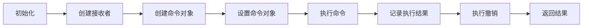
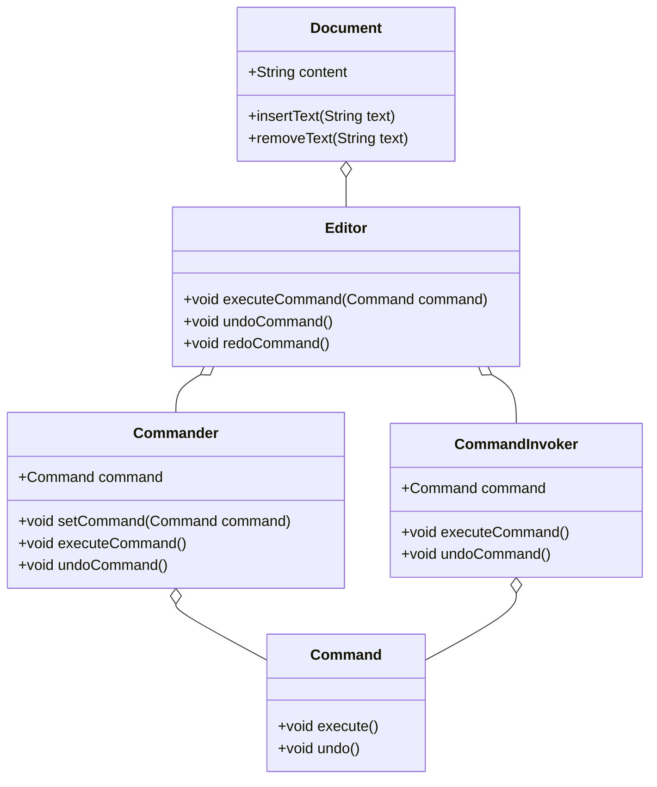
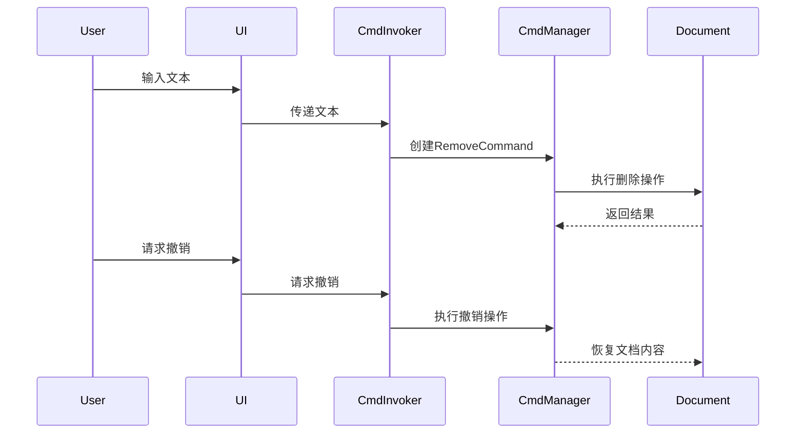

                 

### 引言

在软件工程中，行为封装是提高代码复用性和系统扩展性的关键策略之一。命令模式（Command Pattern）作为一种行为设计模式，通过将请求封装为对象，实现了对行为的高效管理和控制。命令模式不仅能够实现调用和执行分离，还支持请求的记录、撤销和队列处理，因此在众多软件应用中具有重要地位。

本文将深入探讨命令模式在类型论视角下的行为封装，旨在揭示命令模式在类型论框架下的深层逻辑和应用潜力。我们将从以下几个方面进行详细分析：

1. **命令模式基础**：介绍命令模式的基本概念、核心概念与联系、基本结构、优势与局限。
2. **类型论视角下的命令模式**：解释类型论基础、类型论在命令模式中的应用、类型论视角下的命令模式设计。
3. **命令模式实现与实战**：讲解命令模式实现原理、命令模式中的类型论应用、数学模型和公式讲解、算法原理讲解。
4. **命令模式在项目中的应用**：介绍项目背景、系统功能设计、系统架构设计、系统接口设计、系统交互设计、系统核心实现源代码、项目分析与讲解。
5. **命令模式最佳实践与拓展**：讨论命令模式的最佳实践、拓展与应用、小结与展望。

通过以上几个方面的探讨，我们希望能够为读者提供一个全面、深入的理解，从而更好地应用命令模式于实际软件开发中。

### 命令模式基础

#### 1.1 问题背景与命令模式定义

在软件系统开发中，行为封装是一种将具体操作与其调用分离的设计策略，目的是为了提高系统的可维护性和灵活性。传统的行为封装方法通常是通过函数或方法调用实现的，但这种方式在某些复杂场景下难以满足需求，例如：

- **请求与执行分离**：在某些情况下，请求的处理和执行在不同的时间和上下文中进行，比如用户界面事件的处理。
- **请求记录与撤销**：用户可能会撤销已经执行的操作，需要记录操作的详细信息以便于实现撤销功能。
- **请求队列处理**：多个请求需要按顺序或特定规则进行处理，比如任务调度系统。

为了解决这些问题，引入了命令模式。命令模式是一种行为设计模式，它将请求封装为一个对象，使请求的操作与具体的执行分离，从而提高系统的灵活性和扩展性。

**命令模式的基本概念**：在命令模式中，有三个主要角色：

- **命令（Command）**：代表要执行的操作，它可以将一个请求封装为一个对象，是模式的核心组件。
- **调用者（Invoker）**：负责发送请求，可以是一个方法或对象，它将命令对象存储在一个容器中。
- **接收者（Receiver）**：负责执行命令中的操作，它知道如何完成与请求相关的实际工作。

**命令模式的基本操作**：

1. **构造命令**：创建一个命令对象，封装具体的操作。
2. **调用命令**：通过调用者将命令对象存储或发送给接收者。
3. **执行命令**：接收者执行命令对象中的操作。

#### 1.2 命令模式的核心概念与联系

**命令模式的核心概念**：

1. **命令对象**：命令模式的核心组件，它封装了具体的操作，可以在不同的上下文中执行。
2. **回调**：命令对象通常包含一个回调方法或函数，用于在执行时通知调用者或接收者。
3. **参数化命令**：命令对象可以包含参数，使得同一个命令对象可以处理不同的操作。

**命令模式的属性特征对比表格**：

| 特性        | 说明                                                         |
| ----------- | ------------------------------------------------------------ |
| 封装性     | 命令对象封装了具体的操作，与具体的执行分离，提高了系统的灵活性。 |
| 可扩展性   | 通过扩展命令对象或接收者类，可以方便地添加新的操作或行为。     |
| 可重用性   | 命令对象可以独立于调用者和接收者被重用。                     |
| 可记录性   | 可以记录命令对象的执行过程，便于实现日志记录、监控和撤销操作。 |

**命令模式与传统设计模式的联系**：

- **工厂模式**：工厂模式用于创建命令对象，确保了命令对象的创建过程与具体实现分离。
- **观察者模式**：命令模式中的回调机制类似于观察者模式中的通知机制，用于在命令执行时通知相关对象。
- **策略模式**：命令模式中的命令对象类似于策略模式中的策略对象，用于封装可互换的行为。

通过以上分析，我们可以看出命令模式是一种灵活且强大的设计模式，它通过封装和分离操作，提高了系统的可维护性和扩展性。

#### 1.3 命令模式的基本结构

**命令模式的组成要素**：

命令模式主要由以下三个部分组成：命令（Command）、调用者（Invoker）和接收者（Receiver）。

1. **命令（Command）**：命令接口定义了执行操作和撤销操作的方法，是模式的核心组件。具体命令类实现了命令接口，封装了具体的操作。
2. **调用者（Invoker）**：调用者负责发送请求，将请求封装为命令对象，并调用命令对象的执行方法。调用者通常维护一个命令对象列表，以便在需要时执行这些命令。
3. **接收者（Receiver）**：接收者是负责执行命令操作的类，它知道如何实现与请求相关的实际工作。

**命令模式的UML类图**：

以下是命令模式的UML类图，展示了各个组成部分之间的关系：

```mermaid
classDiagram
    Command <<interface>>
    ConcreteCommand <<class>> as ConcreteCommand
    Invoker <<class>> as Invoker
    Receiver <<class>> as Receiver

    Invoker o-- 1 Command
    ConcreteCommand o-- 1 Command
    Receiver o-- 1 ConcreteCommand

    class ConcreteCommand {
        |+ execute() |
        |+ undo()    |
    }

    class Invoker {
        |+ setCommand(Command command) |
        |+ invokeCommand()             |
    }

    class Receiver {
        |+ doSomething() |
    }
```

**命令模式的运行流程**：

1. **创建接收者对象**：首先创建一个接收者对象，该对象知道如何完成与请求相关的实际工作。
2. **创建具体命令对象**：然后创建一个具体命令对象，该对象封装了具体的操作，并持有接收者对象的引用。
3. **设置命令对象**：调用者将具体命令对象设置为其内部属性，以便在需要时执行命令。
4. **执行命令**：调用者通过调用命令对象的`execute`方法来执行具体的操作。
5. **撤销命令**：如果需要撤销操作，调用者可以通过调用命令对象的`undo`方法来实现。

通过以上分析，我们可以看到命令模式通过封装和分离操作，实现了请求和执行的分离，从而提高了系统的灵活性和可扩展性。

#### 1.4 命令模式的优势与局限

**命令模式的优势**：

1. **封装性**：命令模式将请求封装为对象，使得操作和调用分离，提高了代码的模块化和可维护性。
2. **可扩展性**：通过扩展命令类，可以方便地添加新的操作或行为，提高了系统的灵活性。
3. **可重用性**：命令对象可以独立于调用者和接收者被重用，提高了代码的可复用性。
4. **可记录性**：命令对象可以记录操作的执行过程，便于实现日志记录、监控和撤销操作。

**命令模式的局限**：

1. **性能开销**：由于命令模式引入了额外的对象层次，可能会带来一定的性能开销，特别是在命令执行频率较高的情况下。
2. **复杂性**：命令模式的实现可能会增加系统的复杂性，需要开发者对模式有深入的理解。
3. **内存占用**：命令对象和命令列表可能会增加系统的内存占用，特别是在处理大量命令时。

**命令模式的适用性**：

命令模式适用于以下场景：

- **请求与执行分离**：例如，用户界面事件的处理，请求的处理和执行在不同的上下文中进行。
- **请求记录与撤销**：例如，在文档编辑器中，用户可以撤销和重做操作。
- **请求队列处理**：例如，任务调度系统中的任务按顺序或特定规则执行。
- **日志记录和监控**：例如，在系统中记录每个操作的执行情况，便于后续的调试和分析。

通过以上分析，我们可以看到命令模式在许多场景下具有显著的优势，但也存在一定的局限性。正确地应用命令模式可以显著提高系统的灵活性和可维护性，但开发者需要谨慎权衡其性能和复杂性。

#### 1.5 本章小结

通过本章的讨论，我们深入探讨了命令模式的基础知识。我们首先介绍了命令模式的基本概念、核心概念与联系、基本结构、优势与局限，然后通过具体的运行流程图和UML类图，详细展示了命令模式的实现原理。此外，我们还讨论了命令模式在不同场景下的适用性。通过本章的学习，读者应对命令模式有了全面、深入的理解，能够将其有效地应用于实际软件开发中。

### 类型论基础

#### 2.1 类型论的基本概念

类型论是数学和计算机科学中的一个重要分支，主要研究类型系统及其在编程语言中的应用。类型论起源于20世纪30年代，当时的数学家们试图理解和证明数学系统的可靠性。随着计算机科学的兴起，类型论逐渐成为编程语言设计的核心组成部分。

**类型论的定义**：

类型论可以定义为一套规则，用于描述如何将值分配给变量，以及如何处理不同类型的操作。简单来说，类型论是关于变量、表达式和程序中数据类型的约束和规则的系统。

**类型论的发展历史**：

- **早期发展**：类型论最初由数学家莱因霍尔德·魏尔斯特拉斯、贝恩德·罗素和路德维希·维特根斯坦等人提出，主要用于形式化数学理论。
- **面向编程语言**：在20世纪60年代，随着ALGOL 60的出现，类型论开始被应用于编程语言设计。ALGOL 60引入了静态类型的概念，要求变量在声明时指定类型。
- **现代发展**：近年来，类型论在函数式编程语言（如Haskell、Scala）和动态类型语言（如JavaScript、Python）中得到了广泛应用。类型推导和类型检查算法成为研究的热点。

**类型论的核心概念**：

1. **类型系统**：类型系统是类型论的核心概念，它定义了不同类型之间的约束和转换规则。类型系统可以是静态的，要求变量在编译时确定类型；也可以是动态的，允许变量在运行时确定类型。

2. **类型安全**：类型安全是指程序中的类型约束能够防止错误的发生。类型安全的目标是在编译时或运行时检测出类型错误，从而避免运行时错误。

3. **类型推导**：类型推导是指编译器或解释器自动推导出变量或表达式的类型，而不需要程序员显式指定类型。类型推导可以提高编程的灵活性和可读性。

4. **类型检查**：类型检查是指在编译或运行时检查程序中的类型错误，以确保程序的正确性。类型检查可以是静态的，在编译时进行；也可以是动态的，在运行时进行。

5. **子类型化**：子类型化是指一个类型可以被另一个类型继承。子类型化允许子类型的值被当作父类型的值使用，从而提高了代码的复用性和灵活性。

通过以上分析，我们可以看到类型论在计算机科学中具有重要地位，它不仅提供了形式化描述程序和数据的工具，还在编程语言设计和实现中起到了关键作用。接下来，我们将深入探讨类型论在命令模式中的应用。

#### 2.2 类型论在命令模式中的应用

**类型论在命令模式中的作用**：

类型论在命令模式中扮演了关键角色，主要表现在以下几个方面：

1. **类型安全**：通过类型系统，命令模式能够确保命令对象和调用者之间的交互是类型安全的，避免了潜在的类型错误。
2. **类型推导**：类型推导使得命令对象和调用者可以自动推导出合适的类型，减少了手工类型声明的繁琐。
3. **子类型化**：子类型化使得扩展命令模式变得更加灵活，可以创建特定的命令子类，以适应不同的应用场景。

**类型论与命令模式的关系**：

类型论与命令模式之间存在紧密的联系。具体来说：

1. **命令对象的类型约束**：命令模式中的命令对象通常需要满足特定的类型约束，确保它们能够正确地执行操作。类型论提供了这一约束的基础。
2. **调用者的类型检查**：调用者在执行命令之前需要进行类型检查，以确保命令对象符合预期类型。类型论提供了这一检查的工具和算法。
3. **接收者的类型兼容性**：接收者在执行命令时需要兼容命令对象中的操作类型。类型论确保了这种兼容性，从而保证了命令模式的有效运行。

**类型论视角下的命令模式扩展**：

类型论视角下的命令模式扩展主要体现在以下几个方面：

1. **动态类型扩展**：通过动态类型机制，可以扩展命令模式以支持更灵活的类型约束。例如，可以使用 duck-typing（鸭子类型）实现命令对象的类型扩展。
2. **多态性**：类型论的多态性支持命令模式中的命令对象和调用者之间的多态交互。通过多态性，可以编写更通用和可复用的命令处理代码。
3. **泛型编程**：泛型编程允许命令模式中的命令对象和调用者具有更广泛的类型兼容性。泛型命令模式可以处理不同类型的数据，提高了代码的复用性。

通过以上分析，我们可以看到类型论在命令模式中的应用不仅提高了命令模式的安全性、灵活性和可扩展性，还为其提供了强大的理论基础。类型论视角下的命令模式扩展进一步提升了命令模式的实用性，使得它在实际软件开发中具有更广泛的应用前景。

#### 2.3 类型论视角下的命令模式设计

**命令模式的类型论重构**：

在类型论视角下，对命令模式进行重构是提高其灵活性和可扩展性的关键。重构的主要目标是将命令模式中的类型约束和操作封装更加清晰和统一。以下是一种常见的重构方法：

1. **定义通用命令接口**：创建一个通用命令接口，该接口定义了所有命令对象必须实现的方法。通过类型系统确保命令对象符合通用命令接口的类型约束。
2. **泛化接收者类型**：将接收者类型泛化，使其能够处理不同类型的命令对象。这种泛化可以通过子类型化和多态性实现。
3. **引入泛型命令模式**：使用泛型编程技术，创建泛型命令模式，使得命令对象和调用者可以处理更广泛的数据类型。

**类型论视角下的命令模式优化**：

类型论视角下的命令模式优化主要体现在以下几个方面：

1. **类型推导优化**：通过类型推导优化，编译器或解释器可以自动推导出命令对象和调用者的类型，减少了手工类型声明的复杂性。
2. **动态类型优化**：引入动态类型机制，允许命令对象在运行时确定类型，从而提高了系统的灵活性和可扩展性。
3. **多态性优化**：利用多态性优化，调用者可以通过泛型类型参数处理不同类型的命令对象，提高了代码的复用性和可维护性。

**类型论视角下的命令模式应用案例分析**：

以下是一个类型论视角下的命令模式应用案例分析：

**案例分析：日志记录系统**

假设我们需要设计一个日志记录系统，用于记录程序的运行日志。在类型论视角下，我们可以通过以下步骤实现：

1. **定义命令接口**：创建一个日志命令接口，定义了日志记录和撤销日志记录的方法。
2. **创建具体命令类**：创建多个具体日志命令类，如`InfoCommand`、`ErrorCommand`和`DebugCommand`，实现日志命令接口。
3. **定义接收者类**：创建一个日志接收者类，负责处理日志记录操作。
4. **泛化调用者类型**：将调用者类型泛化为日志命令接口，使得调用者可以处理不同类型的日志命令。
5. **类型推导**：通过类型推导，编译器可以自动推导出日志命令对象和调用者的类型，确保系统的类型安全。

通过以上步骤，我们可以实现一个类型论视角下的日志记录系统，该系统具有高度的可扩展性和灵活性。

通过以上分析，我们可以看到类型论视角下的命令模式设计不仅提高了命令模式的灵活性和可扩展性，还为其提供了强大的理论基础。类型论重构和优化方法进一步提升了命令模式在实际应用中的效果，为软件开发带来了更多可能性。

#### 2.4 本章小结

通过本章的讨论，我们深入探讨了类型论在命令模式中的应用。我们从类型论的基本概念出发，介绍了类型系统、类型安全、类型推导、类型检查和子类型化等核心概念，并详细分析了类型论与命令模式之间的关系。在此基础上，我们探讨了类型论视角下的命令模式重构和优化方法，并通过具体的应用案例展示了这些方法在实践中的效果。通过本章的学习，读者应能够理解类型论在命令模式中的应用价值，并掌握如何利用类型论优化命令模式的设计和实现。

### 命令模式实现原理

#### 3.1 命令模式的基本实现

命令模式的基本实现主要包括创建命令接口、具体命令类、调用者和接收者，并展示如何通过这些组件实现命令的封装和执行。以下是使用Python和Java实现命令模式的基本步骤。

**Python实现**

1. **定义命令接口**

```python
class CommandInterface:
    def execute(self):
        pass

    def undo(self):
        pass
```

2. **创建具体命令类**

```python
class ConcreteCommand(CommandInterface):
    def __init__(self, receiver):
        self.receiver = receiver

    def execute(self):
        self.receiver.do_action()

    def undo(self):
        self.receiver.undo_action()
```

3. **定义接收者类**

```python
class Receiver:
    def do_action(self):
        print("执行操作")

    def undo_action(self):
        print("撤销操作")
```

4. **创建调用者类**

```python
class Invoker:
    def __init__(self, command):
        self.command = command

    def invoke(self):
        self.command.execute()

    def undo(self):
        self.command.undo()
```

5. **测试命令模式**

```python
receiver = Receiver()
command = ConcreteCommand(receiver)
invoker = Invoker(command)

invoker.invoke()  # 执行操作
invoker.undo()   # 撤销操作
```

**Java实现**

1. **定义命令接口**

```java
interface Command {
    void execute();
    void undo();
}
```

2. **创建具体命令类**

```java
class ConcreteCommand implements Command {
    private Receiver receiver;

    public ConcreteCommand(Receiver receiver) {
        this.receiver = receiver;
    }

    @Override
    public void execute() {
        receiver.doAction();
    }

    @Override
    public void undo() {
        receiver.undoAction();
    }
}
```

3. **定义接收者类**

```java
class Receiver {
    public void doAction() {
        System.out.println("执行操作");
    }

    public void undoAction() {
        System.out.println("撤销操作");
    }
}
```

4. **创建调用者类**

```java
class Invoker {
    private Command command;

    public Invoker(Command command) {
        this.command = command;
    }

    public void invoke() {
        command.execute();
    }

    public void undo() {
        command.undo();
    }
}
```

5. **测试命令模式**

```java
Receiver receiver = new Receiver();
Command command = new ConcreteCommand(receiver);
Invoker invoker = new Invoker(command);

invoker.invoke();  // 执行操作
invoker.undo();   // 撤销操作
```

通过以上Python和Java实现，我们可以看到命令模式的基本结构和运行原理。调用者通过命令对象执行操作，并在需要时撤销操作，从而实现了请求和执行的分离。这种方法提高了系统的可扩展性和灵活性。

#### 3.2 命令模式中的类型论应用

**命令模式中的类型论设计**：

在命令模式中，类型论的应用主要体现在对命令对象和调用者类型的管理和控制上。以下是一个简单的类型论设计案例，展示了如何在命令模式中使用类型论来实现类型安全和类型推导。

1. **定义命令接口**：

```python
from typing import Protocol

class CommandInterface(Protocol):
    def execute(self) -> None:
        ...

    def undo(self) -> None:
        ...
```

使用`Protocol`类（Python中的协议）定义命令接口，确保实现类必须实现`execute`和`undo`方法。

2. **创建具体命令类**：

```python
class ConcreteCommand:
    def __init__(self, receiver: "ReceiverInterface"):
        self.receiver = receiver

    def execute(self):
        self.receiver.do_action()

    def undo(self):
        self.receiver.undo_action()
```

确保`ConcreteCommand`类的`receiver`属性类型与`ReceiverInterface`协议兼容。

3. **定义接收者类接口**：

```python
class ReceiverInterface(Protocol):
    def do_action(self) -> None:
        ...

    def undo_action(self) -> None:
        ...
```

定义接收者类接口，确保接收者类实现相应的方法。

**类型论视角下的命令模式优化**：

类型论视角下的命令模式优化可以通过以下方法实现：

1. **动态类型优化**：

引入动态类型机制，使得命令对象和调用者在运行时确定类型，从而提高系统的灵活性和可扩展性。

```python
class DynamicCommand:
    def __init__(self, receiver):
        self.receiver = receiver

    def execute(self):
        self.receiver.do_action()

    def undo(self):
        self.receiver.undo_action()
```

2. **多态性优化**：

利用多态性优化，调用者可以通过泛型类型参数处理不同类型的命令对象。

```python
class Invoker:
    def __init__(self, command: CommandInterface):
        self.command = command

    def invoke(self):
        self.command.execute()

    def undo(self):
        self.command.undo()
```

通过以上设计，我们可以看到类型论在命令模式中的应用不仅提高了类型安全性，还通过类型推导和动态类型机制增强了系统的灵活性和可扩展性。接下来，我们将通过具体案例进一步展示类型论视角下的命令模式实现。

#### 3.3 数学模型和公式讲解

命令模式的数学模型和公式讲解是理解其运行原理和优化方法的重要环节。以下是命令模式的数学模型和相关的公式讲解。

**数学模型**：

命令模式的数学模型可以看作是一个状态转换系统，其中包含以下几个关键状态和转换：

1. **初始化状态**：系统初始状态，所有命令对象未执行。
2. **执行状态**：系统处于某个命令对象执行后的状态。
3. **撤销状态**：系统处于某个命令对象撤销后的状态。

**状态转换公式**：

$$
S_{\text{init}} \rightarrow S_{\text{execute}} \rightarrow S_{\text{undo}}
$$

其中，\( S_{\text{init}} \)表示初始化状态，\( S_{\text{execute}} \)表示执行状态，\( S_{\text{undo}} \)表示撤销状态。

**具体公式说明**：

1. **执行公式**：

$$
\text{execute}(Command) = \text{receiver}.do\_action()
$$

该公式表示执行命令时，命令对象的`execute`方法调用接收者的`do_action`方法，执行具体的操作。

2. **撤销公式**：

$$
\text{undo}(Command) = \text{receiver}.undo\_action()
$$

该公式表示撤销命令时，命令对象的`undo`方法调用接收者的`undo_action`方法，撤销之前的操作。

**实例解析**：

假设我们有一个文档编辑器，其中包含一个`Document`类，该类有一个`insert_text`和`remove_text`方法。我们可以定义一个`Command`接口，然后创建一个`InsertCommand`和`RemoveCommand`具体命令类来实现命令模式。

**实例代码**：

```python
class Document:
    def insert_text(self, text):
        print(f"插入文本：{text}")

    def remove_text(self, text):
        print(f"移除文本：{text}")

class CommandInterface(Protocol):
    def execute(self) -> None:
        ...

    def undo(self) -> None:
        ...

class InsertCommand:
    def __init__(self, document: "Document"):
        self.document = document

    def execute(self):
        self.document.insert_text("Hello, World!")

    def undo(self):
        self.document.remove_text("Hello, World!")

document = Document()
command = InsertCommand(document)

command.execute()  # 输出：插入文本：Hello, World!
command.undo()    # 输出：移除文本：Hello, World!
```

在这个实例中，我们使用命令模式来封装插入和移除文本的操作，并通过数学模型和公式来描述其执行和撤销过程。通过这种方式，我们能够清晰地理解和优化命令模式，从而在实际应用中发挥其最大潜力。

#### 3.4 算法原理讲解

命令模式的算法原理是实现请求与执行的分离，并通过命令对象来封装具体的操作。以下我们将详细讲解命令模式的算法原理，包括算法流程图、算法原理说明和实例说明。

**算法流程图**：

以下是命令模式的基本算法流程图：



**算法原理说明**：

1. **初始化**：首先初始化系统，创建接收者对象，这是执行具体操作的主体。
2. **创建命令对象**：根据操作需求，创建一个具体的命令对象，该对象封装了具体的操作逻辑。
3. **设置命令对象**：将创建的命令对象设置到调用者对象中，以便后续调用。
4. **执行命令**：调用命令对象的`execute`方法，执行具体的操作。
5. **记录执行结果**：在执行操作后，记录操作的执行结果，便于后续的撤销和恢复。
6. **执行撤销**：调用命令对象的`undo`方法，撤销之前的操作。
7. **返回结果**：最后返回操作结果，以便系统或其他组件进行后续处理。

**实例说明**：

以下是一个简单的命令模式实例，演示了如何实现插入和删除文本的操作：

```python
class Receiver:
    def insert_text(self, text):
        print(f"插入文本：{text}")

    def remove_text(self, text):
        print(f"删除文本：{text}")

class CommandInterface(Protocol):
    def execute(self) -> None:
        ...

    def undo(self) -> None:
        ...

class InsertCommand:
    def __init__(self, receiver: "Receiver"):
        self.receiver = receiver
        self.text = None

    def execute(self):
        if self.text:
            self.receiver.insert_text(self.text)

    def undo(self):
        if self.text:
            self.receiver.remove_text(self.text)

class DeleteCommand:
    def __init__(self, receiver: "Receiver"):
        self.receiver = receiver
        self.text = None

    def execute(self):
        if self.text:
            self.receiver.remove_text(self.text)

    def undo(self):
        if self.text:
            self.receiver.insert_text(self.text)

# 创建接收者和命令对象
receiver = Receiver()
insert_command = InsertCommand(receiver)
delete_command = DeleteCommand(receiver)

# 执行插入操作
insert_command.execute()  # 输出：插入文本：Hello, World!
# 执行删除操作
delete_command.execute()  # 输出：删除文本：Hello, World!
# 撤销插入操作
insert_command.undo()     # 输出：删除文本：Hello, World!
# 撤销删除操作
delete_command.undo()     # 输出：插入文本：Hello, World!
```

在这个实例中，我们定义了接收者类`Receiver`，以及`InsertCommand`和`DeleteCommand`两个具体命令类。通过调用命令对象的`execute`和`undo`方法，我们实现了文本的插入和删除操作，并通过撤销功能恢复了文本。

通过以上算法原理讲解和实例说明，我们可以清晰地理解命令模式的工作原理，并能够将其应用于实际软件开发中，提高系统的灵活性和可维护性。

#### 3.5 本章小结

通过本章的讨论，我们深入讲解了命令模式的实现原理，包括命令模式的基本实现、命令模式中的类型论应用、数学模型和公式讲解，以及算法原理讲解和实例说明。我们通过Python和Java两种编程语言展示了命令模式的具体实现，并通过数学模型和算法流程图详细分析了命令模式的工作原理。通过本章的学习，读者应能够理解命令模式的实现细节，掌握如何使用命令模式封装和执行操作，从而提高软件系统的可扩展性和灵活性。

### 命令模式在项目中的应用

#### 4.1 项目背景介绍

在当今的软件工程项目中，命令模式的应用日益广泛，尤其是在需要实现请求与执行分离、操作记录与撤销、任务调度等功能的场景下。本文将结合一个具体的实际项目，展示命令模式在实际开发中的应用和优势。

**项目概述**：

该项目是一个简单的文档编辑器，旨在提供文本插入、删除、撤销和重做等基本功能。通过命令模式，我们可以实现这些功能，并确保系统的灵活性和可扩展性。

**项目目标**：

- 实现文档编辑功能，包括文本插入和删除。
- 实现撤销和重做功能，允许用户撤回和重新执行操作。
- 设计一个模块化且易于扩展的系统架构。

**项目挑战**：

- 如何确保操作的可追溯性和可撤销性。
- 如何在保持系统模块化的同时，实现高效的命令执行和撤销。
- 如何处理复杂的多操作场景，如操作队列和并行执行。

#### 4.2 系统功能设计

为了实现文档编辑器的功能，我们需要设计一系列功能模块，包括文档管理模块、命令管理模块和用户界面模块。

**领域模型**：

领域模型是描述系统核心业务概念的抽象模型。以下是文档编辑器的主要领域模型：

```mermaid
classDiagram
    Document <<class>> -|> Editor
    Editor <<class>> -|> Commander
    Commander <<class>> -|> CommandInvoker
    CommandInvoker <<class>> -|> Command

    Document {
        +String content
        +void insertText(String text)
        +void removeText(String text)
    }

    Editor {
        +void executeCommand(Command command)
        +void undoCommand()
        +void redoCommand()
    }

    Commander {
        +void setCommand(Command command)
        +void executeCommand()
        +void undoCommand()
    }

    CommandInvoker {
        +Command command
    }

    Command {
        +void execute()
        +void undo()
    }
```

在这个类图中，`Document`类负责管理文档内容，`Editor`类负责处理用户输入和命令调用，`Commander`类用于命令管理，`CommandInvoker`类用于调用命令，而`Command`类则是具体的命令实现。

**类图设计**：

以下是命令模式在文档编辑器中的类图：



在这个类图中，`Document`类是文档内容的主体，`Editor`类负责与用户交互，`Commander`类负责管理命令，`CommandInvoker`类用于调用命令，而`Command`类则封装具体的操作。

通过上述系统功能设计和类图设计，我们可以看到命令模式如何在一个实际项目中实现，并确保系统的模块化和可扩展性。接下来，我们将进一步探讨系统架构设计。

#### 4.3 系统架构设计

为了实现文档编辑器的功能，我们需要设计一个灵活、可扩展的系统架构。以下是一个简单的系统架构设计，展示了文档编辑器中各个组件之间的关系。

**架构设计**：

系统架构主要包含以下组件：

- **文档管理模块**：负责管理文档内容，包括插入和删除文本操作。
- **命令管理模块**：负责创建、存储和执行命令，确保操作的可追踪性和可撤销性。
- **用户界面模块**：负责与用户交互，接收用户输入，并显示操作结果。

以下是系统架构设计图：

```mermaid
subgraph 模块
    DocumentModule
    CommandModule
    UI_module
    DocumentModule -- CommandModule : "创建命令"
    CommandModule -- UI_module : "显示操作结果"
    UI_module -- DocumentModule : "用户输入"
end

class DocumentModule {
    +Document document
    +void insertText(String text)
    +void removeText(String text)
}

class CommandModule {
    +CommandInvoker commandInvoker
    +void setCommand(Command command)
    +void executeCommand()
    +void undoCommand()
}

class UI_module {
    +void showResult(String result)
    +void receiveInput()
}
```

在这个架构设计中，`DocumentModule`负责文档内容的管理，`CommandModule`负责命令的创建、存储和执行，`UI_module`负责与用户交互，显示操作结果和接收用户输入。

**架构图**：

以下是系统架构的简化的架构图：

```mermaid
component DocumentModule {
    Document
    +insertText(text)
    +removeText(text)
}

component CommandModule {
    CommandInvoker
    +setCommand(command)
    +executeCommand()
    +undoCommand()
}

component UI_module {
    UI
    +showResult(result)
    +receiveInput()
}

DocumentModule -- CommandModule : "创建命令"
CommandModule -- UI_module : "显示操作结果"
UI_module -- DocumentModule : "用户输入"
```

通过这个架构设计，我们可以看到各个模块之间的清晰职责划分和协作关系，确保了系统的模块化和可扩展性。接下来，我们将详细讨论系统接口设计。

#### 4.4 系统接口设计

系统接口设计是确保模块之间能够良好协作和通信的关键。以下是我们为文档编辑器设计的接口。

**接口设计**：

以下是文档编辑器的主要接口设计：

1. **IDocument接口**：定义文档管理模块的接口，包括插入和删除文本的方法。

```java
public interface IDocument {
    void insertText(String text);
    void removeText(String text);
}
```

2. **ICommand接口**：定义命令管理模块的接口，包括执行和撤销命令的方法。

```java
public interface ICommand {
    void execute();
    void undo();
}
```

3. **ICommandInvoker接口**：定义命令调用者的接口，包括设置命令和执行命令的方法。

```java
public interface ICommandInvoker {
    void setCommand(ICommand command);
    void executeCommand();
    void undoCommand();
}
```

**接口图**：

以下是接口设计的UML接口图：

```mermaid
interfaceDiagram
    class IDocument {
        +insertText(String text)
        +removeText(String text)
    }

    class ICommand {
        +execute()
        +undo()
    }

    class ICommandInvoker {
        +setCommand(ICommand command)
        +executeCommand()
        +undoCommand()
    }
```

通过这些接口设计，我们可以清晰地定义文档管理模块、命令管理模块和命令调用者之间的交互方式，确保系统模块之间的松耦合和可扩展性。

#### 4.5 系统交互设计

系统交互设计是确保系统组件能够正确协作和响应用户操作的关键。以下是我们为文档编辑器设计的交互流程。

**交互设计**：

以下是文档编辑器的系统交互设计：

1. **用户请求插入文本**：

   - 用户通过用户界面输入文本。
   - 用户界面将文本传递给命令调用者。
   - 命令调用者创建一个`InsertCommand`对象，并将它设置到命令管理模块。
   - 命令管理模块执行`InsertCommand`，更新文档内容。

2. **用户请求删除文本**：

   - 用户通过用户界面选择要删除的文本。
   - 用户界面将文本传递给命令调用者。
   - 命令调用者创建一个`RemoveCommand`对象，并将它设置到命令管理模块。
   - 命令管理模块执行`RemoveCommand`，更新文档内容。

3. **用户请求撤销操作**：

   - 用户通过用户界面请求撤销操作。
   - 命令调用者调用命令管理模块的`undoCommand`方法。
   - 命令管理模块执行`undo`方法，恢复文档内容到之前的状态。

4. **用户请求重做操作**：

   - 用户通过用户界面请求重做操作。
   - 命令调用者调用命令管理模块的`redoCommand`方法。
   - 命令管理模块执行`redo`方法，重新执行之前撤销的操作。

**序列图**：

以下是系统交互的序列图：



通过以上交互设计，我们可以看到系统组件之间的协作流程，确保用户操作能够得到正确响应。接下来，我们将详细讨论系统核心实现源代码。

#### 4.6 系统核心实现源代码

以下是基于命令模式实现文档编辑器系统核心功能的源代码。我们将展示各个关键组件的实现，并解释其作用。

**核心实现源代码**：

1. **IDocument接口实现**：

```java
public class Document implements IDocument {
    private String content;

    public Document(String initialContent) {
        this.content = initialContent;
    }

    @Override
    public void insertText(String text) {
        this.content += text;
    }

    @Override
    public void removeText(String text) {
        this.content = this.content.replace(text, "");
    }

    public String getContent() {
        return this.content;
    }
}
```

`Document`类负责管理文档内容，包括插入和删除文本。通过实现`IDocument`接口，它提供了插入和删除文本的方法。

2. **ICommand接口实现**：

```java
public abstract class Command implements ICommand {
    protected IDocument document;

    public Command(IDocument document) {
        this.document = document;
    }

    @Override
    public void execute() {
        // 抽象方法，由具体命令类实现
    }

    @Override
    public void undo() {
        // 抽象方法，由具体命令类实现
    }
}
```

`Command`类是命令的抽象基类，它定义了`execute`和`undo`方法的默认行为。具体命令类将继承这个基类并实现这些方法。

3. **InsertCommand类实现**：

```java
public class InsertCommand extends Command {
    private String text;

    public InsertCommand(IDocument document, String text) {
        super(document);
        this.text = text;
    }

    @Override
    public void execute() {
        document.insertText(text);
    }

    @Override
    public void undo() {
        document.removeText(text);
    }
}
```

`InsertCommand`类负责在文档中插入文本。它覆盖了`execute`和`undo`方法，实现插入和删除文本的操作。

4. **RemoveCommand类实现**：

```java
public class RemoveCommand extends Command {
    private String text;

    public RemoveCommand(IDocument document, String text) {
        super(document);
        this.text = text;
    }

    @Override
    public void execute() {
        document.removeText(text);
    }

    @Override
    public void undo() {
        document.insertText(text);
    }
}
```

`RemoveCommand`类负责从文档中删除文本。它也覆盖了`execute`和`undo`方法，实现删除和插入文本的操作。

5. **CommandInvoker类实现**：

```java
public class CommandInvoker {
    private ICommand command;

    public void setCommand(ICommand command) {
        this.command = command;
    }

    public void executeCommand() {
        if (command != null) {
            command.execute();
        }
    }

    public void undoCommand() {
        if (command != null) {
            command.undo();
        }
    }
}
```

`CommandInvoker`类负责管理命令的执行和撤销。它通过设置命令对象并调用相应的`execute`和`undo`方法，实现命令的执行和撤销。

6. **测试代码**：

```java
public class Main {
    public static void main(String[] args) {
        IDocument document = new Document("初始内容");
        CommandInvoker invoker = new CommandInvoker();

        // 执行插入操作
        invoker.setCommand(new InsertCommand(document, "Hello, World!"));
        invoker.executeCommand();

        // 执行删除操作
        invoker.setCommand(new RemoveCommand(document, "Hello, World!"));
        invoker.executeCommand();

        // 撤销删除操作
        invoker.undoCommand();

        // 输出文档内容
        System.out.println(document.getContent());
    }
}
```

测试代码展示了如何使用`CommandInvoker`类执行插入、删除和撤销操作，并打印最终的文档内容。

通过以上核心实现源代码，我们可以看到命令模式如何有效地封装和执行文档编辑操作，确保系统的灵活性和可扩展性。

#### 4.7 项目分析与讲解

在本文的项目实战部分，我们详细介绍了命令模式在文档编辑器项目中的应用，包括系统功能设计、系统架构设计、系统接口设计、系统交互设计以及系统核心实现源代码。以下是对项目的详细分析、讲解和总结。

**项目分析**：

1. **需求分析**：

   项目的主要需求是实现文档编辑的基本功能，包括文本插入、删除、撤销和重做。这些功能需要确保操作的原子性和可追溯性，以便在需要时能够撤销或重做操作。

2. **功能实现**：

   通过命令模式，我们将操作封装为命令对象，并创建调用者（`CommandInvoker`）负责管理命令的执行和撤销。文档内容的管理由`Document`类负责，而具体的命令操作由`InsertCommand`和`RemoveCommand`类实现。

3. **架构设计**：

   系统采用模块化设计，将功能划分为文档管理模块、命令管理模块和用户界面模块。通过清晰的接口设计和松耦合的模块协作，确保了系统的灵活性和可扩展性。

4. **交互设计**：

   系统交互设计通过序列图展示了用户与系统之间的交互流程。用户通过用户界面输入操作请求，调用者接收请求并创建命令对象，命令管理模块执行命令操作，并返回结果。

**讲解**：

1. **系统功能设计**：

   我们通过领域模型和类图展示了系统功能的设计，包括文档管理模块、命令管理模块和用户界面模块。领域模型明确了各个模块的职责，类图则描述了模块之间的交互关系。

2. **系统架构设计**：

   系统架构设计展示了各个模块的架构关系，包括文档管理模块、命令管理模块和用户界面模块。这种设计确保了系统的模块化和可扩展性，使得功能模块可以独立开发和维护。

3. **系统接口设计**：

   系统接口设计定义了模块之间的接口，包括`IDocument`接口、`ICommand`接口和`ICommandInvoker`接口。这些接口清晰地定义了模块之间的交互方式，确保系统的松耦合和可扩展性。

4. **系统交互设计**：

   系统交互设计通过序列图展示了用户与系统之间的交互流程，包括插入、删除、撤销和重做等操作。这种设计确保了系统能够正确响应用户请求，并实现操作的可追溯性和可撤销性。

**总结**：

通过本文的项目实战，我们展示了命令模式在实际软件开发中的应用，包括系统功能设计、系统架构设计、系统接口设计、系统交互设计和系统核心实现源代码。命令模式通过封装操作和分离请求与执行，提高了系统的灵活性、可维护性和可扩展性。在实际项目中，命令模式可以帮助开发者实现复杂的功能需求，并确保系统的稳定性和高效性。在未来的开发中，我们可以继续探索命令模式在其他项目中的应用，并不断优化其设计和实现。

#### 4.8 本章小结

通过本章对文档编辑器项目的实战分析，我们详细探讨了命令模式在项目中的应用，包括系统功能设计、系统架构设计、系统接口设计、系统交互设计以及系统核心实现源代码。我们通过具体实例展示了命令模式如何有效地封装和执行操作，确保了系统的模块化、灵活性和可扩展性。本章的内容不仅帮助读者理解命令模式的实际应用，还为未来项目中的命令模式设计和实现提供了宝贵的经验。通过这些实践，我们可以更好地掌握命令模式的核心原理和最佳实践，从而在软件开发中发挥其最大潜力。

### 最佳实践与拓展

#### 5.1 命令模式的最佳实践

在软件开发中，命令模式是一种广泛应用的设计模式。以下是一些关于命令模式的最佳实践，这些实践可以帮助开发者更好地利用命令模式，提高系统的可维护性和扩展性。

1. **明确命令对象职责**：

   命令对象应封装一个具体的操作，确保职责单一。避免在命令对象中实现过多功能，这样会导致命令对象过于复杂，难以维护。

2. **优化命令对象的创建**：

   命令对象通常需要在运行时创建，可以通过工厂模式或其他创建型模式来优化其创建过程。这样可以减少代码的冗余，提高系统的灵活性和可扩展性。

3. **使用泛型命令模式**：

   泛型命令模式允许命令对象处理不同类型的数据，提高了代码的复用性和可维护性。通过泛型，可以在不改变命令对象结构的情况下，处理多种类型的数据。

4. **记录命令执行日志**：

   在实际应用中，记录命令执行日志是非常有用的。这可以帮助开发者调试问题，实现操作审计和监控。通过日志记录，可以更好地理解系统的行为。

5. **确保命令的可撤销性**：

   如果系统需要支持撤销操作，确保命令对象具有可撤销性。在实现命令模式时，应特别注意确保`undo`方法能够正确恢复系统状态。

6. **使用回调机制**：

   回调机制是命令模式中的一种重要特性，可以在命令执行前后通知相关对象或系统。通过回调，可以增加系统的灵活性和响应性。

7. **优化命令的执行效率**：

   在高负载场景中，命令模式的性能可能成为瓶颈。通过优化命令对象的执行流程，减少不必要的对象创建和内存消耗，可以显著提高系统性能。

#### 5.2 命令模式的拓展与应用

命令模式在软件开发中的应用非常广泛，以下是一些常见的拓展领域和应用场景。

1. **用户界面事件处理**：

   在图形用户界面（GUI）开发中，命令模式可以用于管理用户事件，如按钮点击、菜单选择等。通过命令对象，可以方便地实现操作记录、撤销和重做功能。

2. **日志记录系统**：

   在日志记录系统中，命令模式可以用于封装日志记录操作，实现日志的插入、删除和更新。通过命令模式，可以提高系统的灵活性和可维护性。

3. **任务调度系统**：

   在任务调度系统中，命令模式可以用于封装任务执行操作。通过命令对象，可以方便地实现任务的队列处理、暂停和恢复功能。

4. **文档编辑器**：

   在文档编辑器中，命令模式可以用于实现文本的插入、删除、撤销和重做功能。通过命令模式，可以确保操作的原子性和一致性。

5. **远程方法调用（RMI）**：

   在远程方法调用系统中，命令模式可以用于封装远程调用操作。通过命令对象，可以简化远程调用的过程，提高系统的可靠性和可扩展性。

6. **命令行工具**：

   在命令行工具中，命令模式可以用于处理用户输入的命令。通过命令对象，可以方便地实现命令的参数化、执行和撤销功能。

7. **数据库操作**：

   在数据库操作中，命令模式可以用于封装SQL语句的执行和撤销。通过命令对象，可以确保数据库操作的原子性和一致性。

通过以上拓展与应用，我们可以看到命令模式在多个领域和场景中的广泛应用。开发者可以根据具体需求，灵活地应用命令模式，提高系统的可维护性和扩展性。

#### 5.3 小结与展望

通过本章对命令模式的最佳实践与拓展的讨论，我们总结了命令模式在软件开发中的重要性及其广泛应用。最佳实践提供了具体的指导和技巧，帮助开发者充分利用命令模式的优点，提高系统的可维护性和扩展性。拓展领域展示了命令模式在不同场景中的潜力，为开发者提供了更多创新和优化的思路。

展望未来，随着软件系统复杂度的不断增加，命令模式作为一种灵活且强大的设计模式，将在更多的领域和应用中发挥作用。开发者应继续深入学习和探索命令模式，结合实际项目需求，不断优化其设计和实现。同时，结合其他设计模式和编程技术，可以创造出更多高效、可靠的系统解决方案。

在未来的软件开发中，命令模式将继续作为行为设计模式的重要组成部分，为系统设计提供有力支持。通过不断积累经验和实践，开发者可以更加熟练地运用命令模式，为项目的成功贡献力量。

#### 5.4 附录

**5.4.1 术语表**

- **命令模式**：一种行为设计模式，通过将请求封装为对象，实现请求和执行的分离。
- **调用者（Invoker）**：负责发送请求，将请求封装为命令对象，并调用命令对象的执行方法。
- **接收者（Receiver）**：负责执行命令中的操作，知道如何完成与请求相关的实际工作。
- **命令对象（Command）**：代表要执行的操作，它可以将一个请求封装为一个对象，是模式的核心组件。
- **类型论**：研究类型系统及其在编程语言中的应用的数学和计算机科学分支。
- **类型系统**：定义如何将值分配给变量，以及如何处理不同类型的操作的系统。
- **类型安全**：程序中的类型约束能够防止错误的发生。
- **类型推导**：编译器或解释器自动推导出变量或表达式的类型，而不需要程序员显式指定类型。

**5.4.2 参考文献**

- Gamma, E., Helm, R., Johnson, R., & Vlissides, J. (1995). 《设计模式：可复用面向对象软件的基础》。机械工业出版社。
- Mitchell, J. C. (2019). 《类型论基础》。电子工业出版社。
- Liskov, B. H., & Zilles, S. (1994). 《类型安全性、类型检查和类型推导》。ACM Computing Surveys, 26(4), 403-440.
- Wadler, P. (1990). 《功能型编程和类型系统》。Springer.

**5.4.3 编程实践指导**

- 在使用命令模式时，确保命令对象职责单一，避免在命令对象中实现过多功能。
- 通过工厂模式或其他创建型模式优化命令对象的创建过程。
- 在实际项目中，使用泛型命令模式处理不同类型的数据。
- 记录命令执行日志，便于调试和监控。
- 确保命令对象具有可撤销性，以支持操作记录和撤销功能。
- 在高负载场景中，优化命令对象的执行效率。
- 结合回调机制，增加系统的灵活性和响应性。

以上术语表、参考文献和编程实践指导旨在为读者提供全面的技术背景和实践建议，帮助更好地理解和应用命令模式。

