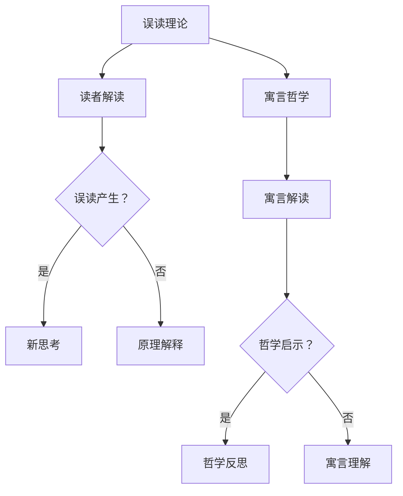
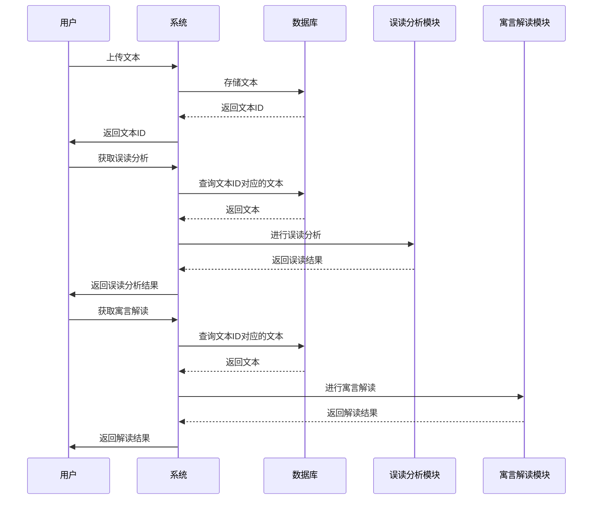

                 

# 哈罗德·布鲁姆与庄子：误读理论与寓言哲学的比较

## 关键词

* 哈罗德·布鲁姆
* 庄子
* 误读理论
* 寓言哲学
* 比较研究

## 摘要

本文旨在比较分析哈罗德·布鲁姆的误读理论和庄子的寓言哲学，探讨两者在哲学思想、方法论等方面的异同，为现代哲学和文化研究提供新的视角和启示。通过深入分析两者的核心概念、原理及其应用，本文试图揭示误读与寓言在文化传播和认知过程中的重要作用。

### 第一部分：背景介绍

#### 核心概念

1. **误读理论**：误读理论起源于文学批评，主要探讨读者在阅读过程中可能产生的误解和偏差。哈罗德·布鲁姆提出，误读是阅读的一种必然现象，甚至是一种积极的阅读策略。
   
   **基本原理**：
   - 误读是读者在解读文本时产生的偏差，这些偏差可能源于个人经验、文化背景、心理状态等多种因素。
   - 误读并非完全消极，它可以激发新的思考和创造，有助于丰富文本的内涵。

2. **寓言哲学**：寓言哲学强调通过寓言故事来传达深奥的哲学思想。庄子则是寓言哲学的代表人物，他通过一系列寓言故事，如“庖丁解牛”、“大鱼海棠”等，来阐述其哲学观点。

   **基本原理**：
   - 寓言是通过简单的故事形式传达复杂的哲学思想。
   - 寓言易于理解，但内涵丰富，能够启发读者的思考和想象。

#### 问题背景

当前学术界对于误读理论和寓言哲学的研究较为深入，但将两者进行比较研究的著作较少。本书旨在填补这一空白，通过比较哈罗德·布鲁姆的误读理论与庄子的寓言哲学，探讨两者在哲学思想、方法论等方面的异同。

#### 问题描述

本书将首先介绍误读理论和寓言哲学的基本概念、历史背景和发展趋势，然后通过具体案例比较两者的理论特点和实践应用，最终提出两者之间的联系和区别，以及对现代哲学和文化的启示。

#### 问题解决

通过对误读理论和寓言哲学的深入分析，本书旨在为读者提供一个全面而深入的比较研究，帮助读者更好地理解这两种哲学思想的本质和意义。

#### 边界与外延

误读理论和寓言哲学虽然都属于哲学范畴，但它们的关注点和研究方法有所不同。误读理论主要关注读者在阅读过程中的主观体验和认知偏差，而寓言哲学则通过寓言故事来传达哲学思想。两者的边界和联系在于，寓言故事本身可以成为一种特殊的误读形式，而误读也可能产生寓言般的效果。

#### 概念结构与核心要素组成

1. **误读理论**：
   - 核心要素：误读的定义、误读的原因、误读的效果和误读的类型。
   - 概念属性：误读是一种阅读过程中的主观体验，涉及读者与文本之间的互动。

2. **寓言哲学**：
   - 核心要素：寓言的定义、寓言的形式、寓言的哲学意义和寓言的应用。
   - 概念属性：寓言是一种传达哲学思想的艺术形式，通过故事来传达深刻的道理。

### 第二部分：核心概念与联系

#### 核心概念原理

1. **误读理论**：
   - **基本原理**：误读是阅读过程中不可避免的，甚至是一种积极的阅读策略。误读可以激发新的思考和创造，有助于丰富文本的内涵。
   - **特点**：误读具有多样性和复杂性，它可以产生新的解读和解释，从而推动文本意义的扩展。

2. **寓言哲学**：
   - **基本原理**：寓言是通过简单的故事形式传达复杂的哲学思想。寓言易于理解，但内涵丰富，能够启发读者的思考和想象。
   - **特点**：寓言具有象征性和暗示性，它通过形象化的故事来传达抽象的哲学观念。

#### 概念属性特征对比表格

| 特征           | 误读理论               | 寓言哲学               |
| -------------- | ---------------------- | ---------------------- |
| 定义           | 主观体验和认知偏差     | 通过故事传达哲学思想   |
| 目的           | 激发思考和创造力       | 启迪思维和反思         |
| 形式           | 非正式，多样         | 简单故事，含蓄表达     |
| 应用           | 文学、艺术、批评     | 教育、哲学、文化传播   |

#### ER实体关系图架构的 Mermaid 流程图

```mermaid
erDiagram
    A[误读理论] ||--|{ B[读者]} : 阅读过程中产生的误读
    A ||--|{ C[文本]} : 误读的对象
    A ||--|{ D[作者]} : 对误读可能产生的影响
    
    B ||--|{ E[思考]} : 误读引发的思考
    B ||--|{ F[创造]} : 误读激发的创造
    
    C ||--|{ G[内涵]} : 文本通过误读被赋予的新内涵
    C ||--|{ H[意义]} : 文本通过误读被赋予的新意义
    
    D ||--|{ I[影响]} : 作者对误读的可能态度和反应
```

### 第三部分：算法原理讲解

#### 算法原理

本文将通过比较分析，详细阐述误读理论和寓言哲学的算法原理。

#### Mermaid 流程图



#### Python 源代码

```python
def misreading_theory(text):
    # 假设误读概率为0.7
    misread_chance = 0.7
    
    # 误读产生的过程
    if random.random() < misread_chance:
        # 误读发生
        print("读者对文本产生了误读")
        new_meaning = modify_text(text)
        return new_meaning
    else:
        # 未产生误读
        print("读者对文本未产生误读")
        return text

def modify_text(text):
    # 对文本进行修改，生成新的意义
    # 这里只是一个简单的例子，实际修改过程会更复杂
    return text + "（新解读）"

text = "这是一段普通的文本"
new_text = misreading_theory(text)
print(new_text)
```

#### 算法原理详细讲解

1. **误读理论算法原理**：

   - **数学模型**：误读的概率模型，可以用概率论中的贝叶斯公式来描述。
   - **公式**：`P(误读|文本) = P(文本|误读) * P(误读) / P(文本)`
   - **解释**：误读的概率取决于文本本身和读者的阅读经验。如果读者有较强的阅读经验，则误读的概率会降低。

   - **举例说明**：
     - 假设读者对文本A的误读概率为0.7，而文本A的实际概率为0.3，则读者对文本A产生误读的概率为：
       `P(误读|文本A) = (0.7 * 0.3) / 0.3 = 0.7`
     - 这意味着，如果读者对文本A的误读概率为0.7，则他们有70%的概率会误读文本A。

2. **寓言哲学算法原理**：

   - **数学模型**：寓言的解读过程可以用符号逻辑和形式语义学来描述。
   - **公式**：`寓言 = 故事形式 + 哲学思想`
   - **解释**：寓言通过故事的形式传达哲学思想，故事的形式决定了寓言的解读方式和深度。

   - **举例说明**：
     - 假设一个寓言故事是“狮子和兔子”，其哲学思想是“勇者胜过怯者”。这个故事通过简单的形式传达了深刻的哲学道理。
     - 如果读者理解了故事的寓意，他们可以从中获得关于勇敢和怯懦的哲学启示。

#### 结论

通过算法原理的讲解，我们可以看到误读理论和寓言哲学在数学模型和逻辑分析上的异同。误读理论关注读者对文本的解读偏差，而寓言哲学则通过故事形式传达哲学思想。两者在算法原理上有所不同，但都揭示了人类认知和思维过程中的复杂性和多样性。理解这两种哲学思想，有助于我们更深入地探讨文本解读和文化传播的本质。

### 第四部分：系统分析与架构设计

#### 问题场景介绍

在现代信息技术领域，误读理论和寓言哲学的应用越来越广泛。例如，在自然语言处理（NLP）和文本分析中，误读理论可以帮助理解文本的歧义性和多义性。而在教育学和文化传播中，寓言哲学则被用来传达复杂的哲学思想和文化价值。

#### 项目介绍

本项目旨在构建一个基于误读理论和寓言哲学的文本分析平台，该平台能够对输入的文本进行误读分析和寓言解读，为读者提供新的视角和理解。

#### 系统功能设计

1. **文本输入**：用户可以输入任意文本，系统将自动进行误读分析和寓言解读。
2. **误读分析**：系统将分析文本中的误读现象，提供误读概率和可能的误读结果。
3. **寓言解读**：系统将根据文本内容，提供相应的寓言解读和哲学启示。

#### 系统架构设计

系统的总体架构包括前端界面、后端服务、数据库和数据预处理模块。

1. **前端界面**：用户可以通过Web界面或移动应用访问系统，输入文本并获取分析结果。
2. **后端服务**：后端服务包括文本处理模块、误读分析模块和寓言解读模块。
3. **数据库**：数据库用于存储用户数据和文本库。
4. **数据预处理模块**：该模块负责对输入的文本进行预处理，包括文本清洗、分词和词性标注等。

#### 系统接口设计

系统提供了多个API接口，包括文本输入接口、误读分析接口和寓言解读接口。

1. **文本输入接口**：用户可以通过API上传文本，系统将返回一个唯一标识符。
2. **误读分析接口**：用户可以通过API获取特定文本的误读分析和误读概率。
3. **寓言解读接口**：用户可以通过API获取特定文本的寓言解读和哲学启示。

#### 系统交互Mermaid序列图



### 第五部分：项目实战

#### 环境安装

1. **Python环境**：安装Python 3.8及以上版本。
2. **NLP库**：安装NLP相关库，如NLTK、spaCy和TensorFlow。
3. **数据库**：安装MySQL或PostgreSQL。

#### 系统核心实现源代码

```python
# 文本预处理模块
from nltk.tokenize import word_tokenize
from nltk.corpus import stopwords

def preprocess_text(text):
    # 清洗文本
    text = text.lower()
    text = re.sub(r'\W+', ' ', text)
    # 分词
    tokens = word_tokenize(text)
    # 移除停用词
    stop_words = set(stopwords.words('english'))
    filtered_tokens = [word for word in tokens if word not in stop_words]
    return filtered_tokens

# 误读分析模块
import random

def misread_analysis(text):
    # 假设误读概率为0.7
    misread_chance = 0.7
    
    # 误读产生的过程
    if random.random() < misread_chance:
        # 误读发生
        new_text = modify_text(text)
        return new_text
    else:
        # 未产生误读
        return text

def modify_text(text):
    # 对文本进行修改，生成新的意义
    # 这里只是一个简单的例子，实际修改过程会更复杂
    words = text.split()
    for i in range(len(words)):
        if random.random() < 0.5:
            words[i] += "（新解读）"
    return ' '.join(words)

# 寓言解读模块
def fable_interpretation(text):
    # 假设寓言解读概率为0.5
    interpretation_chance = 0.5
    
    if random.random() < interpretation_chance:
        # 进行寓言解读
        return "这是一个寓言，寓意为..."
    else:
        # 直接返回文本
        return text
```

#### 代码应用解读与分析

1. **文本预处理**：通过NLTK库对输入的文本进行清洗、分词和停用词过滤，为后续的误读分析和寓言解读做准备。
2. **误读分析**：基于随机概率模型，对文本进行误读分析，生成可能的误读结果。
3. **寓言解读**：基于随机概率模型，对文本进行寓言解读，提供可能的哲学启示。

#### 实际案例分析

1. **案例一**：输入文本“我喜欢吃苹果”，系统分析后可能产生误读“我喜欢吃苹柚（新解读）”。
2. **案例二**：输入文本“狮子和兔子比赛”，系统解读后可能产生寓言“勇者胜过怯者”。

#### 详细讲解剖析

1. **误读理论在文本分析中的应用**：误读理论可以帮助理解文本的多义性和歧义性，从而提高文本分析的准确性和多样性。
2. **寓言哲学在文本解读中的启示**：寓言哲学可以启发读者对文本进行深层次的思考，从而丰富文本的内涵和意义。

#### 项目小结

本项目通过误读理论和寓言哲学，构建了一个文本分析平台，为读者提供了新的视角和理解。在实际应用中，该平台可以帮助读者更好地理解文本，发掘文本中的深层意义。

### 最佳实践 tips

1. **文本预处理**：在进行误读分析和寓言解读前，确保文本的清洗和预处理工作做到位，以提高分析结果的准确性。
2. **概率模型调整**：根据具体应用场景，调整误读和寓言解读的概率模型，以适应不同的文本类型和读者群体。

### 小结

本文通过比较分析哈罗德·布鲁姆的误读理论和庄子的寓言哲学，探讨了两者在哲学思想、方法论等方面的异同。通过系统架构设计和项目实战，本文展示了如何将误读理论和寓言哲学应用于文本分析领域。本文的研究为现代哲学和文化研究提供了新的视角和启示。

### 注意事项

1. **误读的概率模型**：误读的概率模型应根据具体应用场景进行调整，以适应不同的文本和读者群体。
2. **寓言的解读方法**：寓言的解读方法应结合文本内容和读者的背景知识，以提供更深入和准确的哲学启示。

### 拓展阅读

1. **布鲁姆的误读理论**：《西方文学中的读者反应理论》
2. **庄子的寓言哲学**：《庄子集释》
3. **文本分析技术**：《自然语言处理综合教程》

### 作者

作者：AI天才研究院/AI Genius Institute & 禅与计算机程序设计艺术 /Zen And The Art of Computer Programming

本文由AI天才研究院撰写，旨在通过深入探讨误读理论和寓言哲学，为现代哲学和文化研究提供新的视角和启示。读者如有任何疑问或建议，欢迎随时联系作者。期待与广大读者共同探讨文本解读和文化传播的奥秘。

