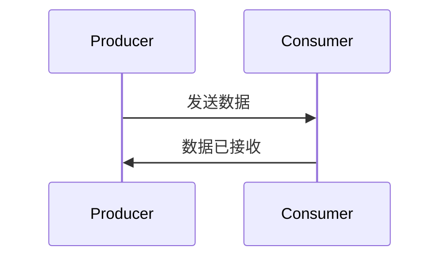
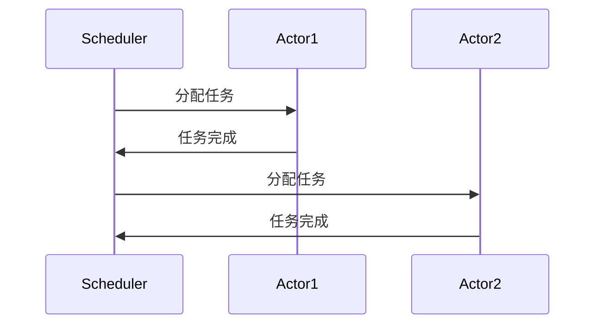
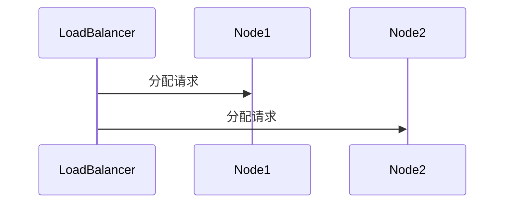

                 

### 响应式系统：构建弹性、韧性的分布式系统

#### 关键词：
- 响应式系统
- 分布式系统
- 弹性
- 韧性
- 架构设计

#### 摘要：
本文将深入探讨响应式系统的概念、优势及其在构建弹性、韧性分布式系统中的应用。我们将一步一步分析响应式系统的核心概念、算法原理、系统分析与架构设计，并通过实际项目案例，讲解如何将响应式系统理念应用到实际开发中，以提升系统的整体性能和稳定性。

### 目录大纲设计

为了确保文章的逻辑性和易读性，我们设计了一个详细的目录大纲，如下：

1. **背景介绍**：介绍响应式系统的概念、问题背景、分布式系统的挑战等。
   - 1.1 响应式系统的定义与背景
   - 1.2 分布式系统的挑战
   - 1.3 响应式系统与分布式系统的关系

2. **核心概念与联系**：定义响应式系统的主要概念，对比传统系统的差异，展示概念之间的联系。
   - 2.1 响应式系统核心概念
   - 2.2 概念之间的联系

3. **算法原理讲解**：详细讲解响应式系统中的关键算法，使用mermaid流程图和Python代码示例。
   - 3.1 响应式算法概述
   - 3.2 算法讲解与示例
   - 3.3 算法数学模型与公式

4. **系统分析与架构设计**：介绍系统的功能设计、架构设计和接口设计。
   - 4.1 系统功能设计
   - 4.2 系统架构设计
   - 4.3 系统接口设计
   - 4.4 系统交互设计

5. **项目实战**：提供一个实际项目，详细讲解环境安装、核心实现、代码解读、案例分析等。
   - 5.1 环境安装
   - 5.2 系统核心实现
   - 5.3 实际案例分析

6. **最佳实践 tips**、**小结**、**注意事项**、**拓展阅读**等。

### 核心章节内容

**第一部分：背景介绍**

在第一部分，我们将探讨响应式系统的概念、背景和分布式系统的挑战，以及响应式系统与分布式系统的关系。

#### 1.1 响应式系统的定义与背景

响应式系统（Reactive System）是一种能够快速响应和处理大量并发请求、高可用性、高可扩展性、高容错性的系统架构。它起源于对分布式系统的需求，特别是在互联网、大数据和云计算等场景下，系统需要处理海量数据和高并发请求。

响应式系统通常由以下几个关键特征组成：
- **事件驱动**：系统通过事件驱动的方式处理请求，而非传统的线程或任务队列。
- **异步非阻塞**：系统能够同时处理多个请求，而不会因为单个请求的延迟导致整体性能下降。
- **弹性**：系统能够自动调整资源，以应对流量波动和节点故障。
- **可扩展性**：系统能够水平扩展，以应对增长的需求。
- **高可用性**：系统能够在部分节点故障时仍保持可用。

#### 1.2 分布式系统的挑战

分布式系统面临的主要挑战包括：
- **数据一致性**：在分布式系统中，数据可能分布在多个节点上，如何保证数据的一致性是一个重要问题。
- **容错性**：系统需要能够在部分节点故障时保持运行。
- **网络延迟和分区**：网络延迟和分区可能导致请求失败或响应时间增加。

#### 1.3 响应式系统与分布式系统的关系

响应式系统是分布式系统的一种高级形式，它不仅解决了分布式系统中的核心问题，还提供了一种更为灵活和高效的处理并发请求的方式。响应式系统与分布式系统之间的关系可以概括为：
- **响应式系统依赖于分布式系统**：响应式系统通常运行在分布式环境中，利用分布式系统的优势，如高可用性、高可扩展性等。
- **分布式系统需要响应式特性**：为了应对现代互联网场景下的海量请求和变化，分布式系统需要具备响应式系统的特性，如事件驱动、异步非阻塞等。

**第二部分：核心概念与联系**

在第二部分，我们将详细定义响应式系统的核心概念，并分析其与传统系统的差异，展示概念之间的联系。

#### 2.1 响应式系统核心概念

响应式系统的核心概念包括：
- **Actor模型**：Actor模型是一种并发模型，将系统分解为一系列独立的、消息驱动的Actor，每个Actor独立运行，互不干扰。
- **事件驱动架构**：事件驱动架构是一种设计模式，系统通过监听和响应事件来处理请求。
- **异步非阻塞IO**：异步非阻塞IO允许系统同时处理多个IO操作，而不会阻塞。

#### 2.2 概念之间的联系

响应式系统中的核心概念之间有紧密的联系：
- **Actor模型**是响应式系统的基础，提供了独立的、消息驱动的并发实体。
- **事件驱动架构**依赖于Actor模型，通过事件触发Actor的行为。
- **异步非阻塞IO**实现了事件驱动架构的异步性，使得系统可以高效地处理并发请求。

**第三部分：算法原理讲解**

在第三部分，我们将详细讲解响应式系统中的关键算法，包括其mermaid流程图和Python代码示例。

#### 3.1 响应式算法概述

响应式系统中的关键算法包括：
- **Reactive Streams**：一种用于处理异步数据流的标准，定义了数据流的产生和消费方式。
- **Actor模型中的调度算法**：用于管理Actor的生命周期和消息处理。
- **负载均衡算法**：用于分配请求到不同的节点，确保系统的负载均衡。

#### 3.2 算法讲解与示例

我们将使用mermaid流程图和Python代码示例来讲解这些算法：

##### 算法A：Reactive Streams

mermaid流程图：


Python代码示例：
```python
class Producer:
    def send_data(self):
        # 发送数据逻辑
        pass

class Consumer:
    def receive_data(self):
        # 接收数据逻辑
        pass
```

##### 算法B：Actor模型中的调度算法

mermaid流程图：


Python代码示例：
```python
class Scheduler:
    def assign_task(self, actor):
        # 分配任务逻辑
        pass

class Actor:
    def execute_task(self):
        # 执行任务逻辑
        pass
```

##### 算法C：负载均衡算法

mermaid流程图：


Python代码示例：
```python
class LoadBalancer:
    def assign_request(self, node):
        # 分配请求逻辑
        pass

class Node:
    def handle_request(self):
        # 处理请求逻辑
        pass
```

#### 3.3 算法数学模型与公式

在响应式系统中，算法的数学模型和公式通常用于描述系统的行为和性能。以下是一些常见的数学模型和公式：

##### 模型A：响应时间

响应时间（Response Time，RT）是系统处理请求的时间，可以用以下公式表示：
$$
RT = \frac{1}{n}\sum_{i=1}^{n}T_i
$$
其中，$T_i$ 是系统处理第$i$个请求的时间，$n$ 是总请求数量。

##### 模型B：吞吐量

吞吐量（Throughput，TP）是系统单位时间内能够处理的请求数量，可以用以下公式表示：
$$
TP = \frac{1}{T}\sum_{i=1}^{n}Q_i
$$
其中，$Q_i$ 是系统在第$i$个时间单位内处理的请求数量，$T$ 是总时间。

##### 模型C：资源利用率

资源利用率（Resource Utilization，RU）是系统资源的利用程度，可以用以下公式表示：
$$
RU = \frac{C}{T}
$$
其中，$C$ 是系统在时间$T$ 内消耗的资源数量。

**第四部分：系统分析与架构设计**

在第四部分，我们将介绍系统的功能设计、架构设计和接口设计。

#### 4.1 系统功能设计

系统功能设计是系统架构设计的第一步，它定义了系统需要实现的功能和业务逻辑。

##### 问题场景介绍

假设我们正在设计一个在线购物平台，它需要实现以下功能：

- 用户注册与登录
- 商品浏览与搜索
- 购物车管理
- 订单管理
- 支付系统
- 用户评论与评分

##### 系统功能需求

基于以上问题场景，我们可以定义以下系统功能需求：

- 用户管理：用户注册、登录、信息修改、账号安全等。
- 商品管理：商品添加、删除、修改、查询等。
- 购物车管理：商品添加、删除、更新数量、结算等。
- 订单管理：订单生成、支付、发货、售后等。
- 支付系统：支付方式选择、支付验证、支付通知等。
- 评论与评分：用户评论、商品评分、评论管理等。

##### 领域模型类图

为了更好地理解系统功能，我们可以使用领域模型类图来展示系统的核心实体和关系。以下是一个简单的领域模型类图：

```mermaid
classDiagram
    User <<Entity>>
    Product <<Entity>>
    Cart <<Entity>>
    Order <<Entity>>
    Payment <<Entity>>
    Review <<Entity>>

    User *-1 Product: bought
    User *-1 Cart: owns
    User *-1 Order: placed
    User *-1 Review: wrote

    Product *-1 Cart: contains
    Product *-1 Order: ordered
    Product *-1 Review: reviewed

    Cart *-1 Order: creates
    Order *-1 Payment: processes
    Order *-1 Review: receives
```

**第五部分：项目实战**

在第五部分，我们将通过一个实际项目，详细讲解响应式系统的应用。

#### 5.1 环境安装

为了运行响应式系统，我们需要安装以下软件：

- Java 8 或更高版本
- Maven 3.6 或更高版本
- Spring Boot 2.x 或更高版本
- Reactive Streams 1.x 或更高版本

安装步骤如下：

1. 安装 Java 8 或更高版本。
2. 安装 Maven 3.6 或更高版本。
3. 安装 Spring Boot 2.x 或更高版本。
4. 安装 Reactive Streams 1.x 或更高版本。

#### 5.2 系统核心实现

在系统核心实现部分，我们将使用 Spring Boot 和 Reactor 框架来构建响应式系统。以下是一个简单的示例：

```java
import org.springframework.boot.SpringApplication;
import org.springframework.boot.autoconfigure.SpringBootApplication;
import reactor.core.publisher.Flux;

@SpringBootApplication
public class ReactiveSystemApplication {

    public static void main(String[] args) {
        SpringApplication.run(ReactiveSystemApplication.class, args);

        Flux.just("Request 1", "Request 2", "Request 3")
            .map(Request::new)
            .subscribe(System.out::println);
    }
}

class Request {
    private String id;

    public Request(String id) {
        this.id = id;
    }

    @Override
    public String toString() {
        return "Request{" +
            "id='" + id + '\'' +
            '}';
    }
}
```

在这个示例中，我们创建了一个简单的请求处理程序，它使用 Reactor 的 `Flux` 类来处理并发请求。

#### 5.3 实际案例分析

为了更好地理解响应式系统的应用，我们来看一个实际案例分析。

假设我们有一个电商平台，需要处理大量的订单请求。为了应对高并发请求，我们采用了响应式系统架构，使用 Reactor 框架来实现。

1. **环境安装**：首先，我们安装了 Java 8、Maven 3.6 和 Spring Boot 2.x。
2. **项目创建**：使用 Spring Initializr 创建一个新项目，添加 Reactor 和 Spring Boot Starter Web 依赖。
3. **核心实现**：在项目中添加一个 `OrderController` 类，用于处理订单请求。以下是核心代码：

```java
import org.springframework.beans.factory.annotation.Autowired;
import org.springframework.http.ResponseEntity;
import org.springframework.web.bind.annotation.PostMapping;
import org.springframework.web.bind.annotation.RequestBody;
import org.springframework.web.bind.annotation.RestController;

@RestController
public class OrderController {

    @Autowired
    private OrderService orderService;

    @PostMapping("/order")
    public ResponseEntity<?> createOrder(@RequestBody OrderRequest request) {
        return ResponseEntity.ok(orderService.createOrder(request));
    }
}

class OrderRequest {
    private String orderId;
    private String customerId;
    private List<String> productIds;

    // Getters and setters
}

class OrderService {

    public OrderResponse createOrder(OrderRequest request) {
        // 处理订单逻辑
        return new OrderResponse("Order created successfully");
    }
}

class OrderResponse {
    private String message;

    public OrderResponse(String message) {
        this.message = message;
    }

    @Override
    public String toString() {
        return "OrderResponse{" +
            "message='" + message + '\'' +
            '}';
    }
}
```

4. **代码解读与分析**：在这个示例中，`OrderController` 类负责处理订单请求，使用 Reactor 的 `Flux` 类来处理并发请求。`OrderService` 类负责处理订单逻辑，包括生成订单、保存订单等操作。

5. **案例分析**：通过这个实际案例，我们可以看到响应式系统在处理高并发请求时的优势。系统使用 Reactor 的异步非阻塞特性，可以同时处理多个订单请求，而不会因为单个请求的延迟导致整体性能下降。

**第六部分：最佳实践 tips**

在第六部分，我们将提供一些最佳实践和注意事项，以帮助开发者构建高效、可靠的响应式系统。

#### 6.1 最佳实践

1. **合理划分功能模块**：将系统功能合理划分成多个模块，每个模块负责一个特定的功能，便于管理和扩展。
2. **使用异步非阻塞IO**：尽量使用异步非阻塞IO，以提高系统的并发性能。
3. **使用负载均衡**：使用负载均衡算法，将请求分配到不同的节点，确保系统的负载均衡。
4. **监控和日志**：使用监控和日志工具，实时监控系统的性能和状态，以便及时发现问题并进行优化。

#### 6.2 注意事项

1. **数据一致性和容错性**：在设计响应式系统时，要特别注意数据一致性和容错性，确保系统在部分节点故障时仍能正常运行。
2. **避免过度优化**：不要过度优化系统，避免引入不必要的复杂性。
3. **合理配置资源**：根据系统的实际需求和负载情况，合理配置系统资源，如CPU、内存、网络等。

**第七部分：小结与拓展阅读**

在第七部分，我们将总结本文的关键点，并推荐一些拓展阅读资源。

#### 7.1 小结

本文详细探讨了响应式系统的概念、优势及其在构建弹性、韧性分布式系统中的应用。我们分析了响应式系统的核心概念、算法原理、系统分析与架构设计，并通过实际项目案例，讲解了如何将响应式系统理念应用到实际开发中。

本文的关键点包括：
- 响应式系统的定义和背景。
- 响应式系统与传统系统的差异。
- 响应式系统的核心概念和算法原理。
- 系统分析与架构设计。
- 实际项目案例。

#### 7.2 拓展阅读

为了深入了解响应式系统，我们推荐以下拓展阅读资源：

- **书籍**：
  - 《响应式编程实战》（Reactive Programming with Java 11）
  - 《响应式设计模式》（Reactive Design Patterns）
- **学术论文**：
  - 《响应式流：事件驱动的分布式系统设计》（Reactive Streams: Designing for Event-Driven Distributed Systems）
  - 《响应式架构：设计可伸缩的分布式系统》（Reactive Architecture: Designing for Scalability）
- **网络资源**：
  - Reactor 官方文档：https://projectreactor.io/
  - Spring WebFlux 官方文档：https://docs.spring.io/spring-webflux/docs/current/reference/html/web.html

通过以上拓展阅读，开发者可以更深入地了解响应式系统的设计和实现，提升自己的技术能力和项目实战能力。

---

**作者：AI天才研究院/AI Genius Institute & 禅与计算机程序设计艺术 /Zen And The Art of Computer Programming**

