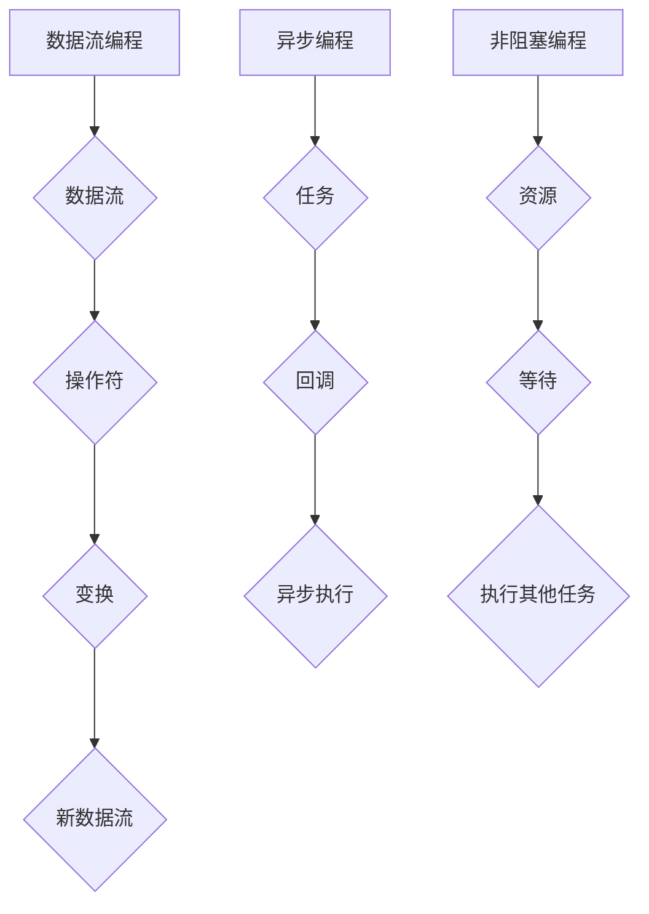
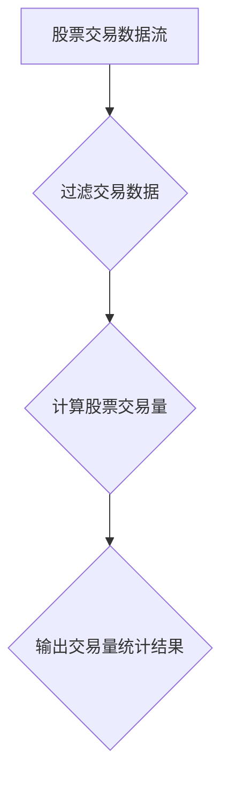
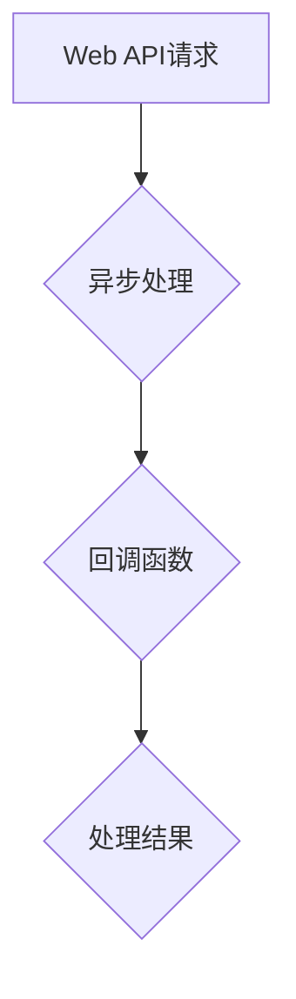
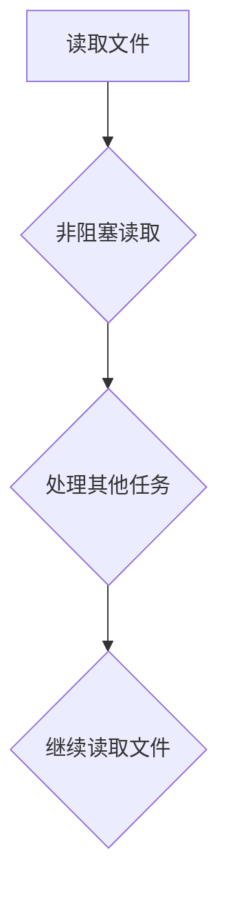

                 


### 响应式编程：构建高性能异步系统

关键词：响应式编程、异步系统、高性能、数据流编程、事件驱动

摘要：本文将深入探讨响应式编程的概念、原理和实践，帮助开发者理解并掌握构建高性能异步系统的关键技术和最佳实践。

---

## 目录大纲：《响应式编程：构建高性能异步系统》

### 第一部分：响应式编程基础

### 第1章：响应式编程概述

#### 1.1 问题背景
- **传统编程模型的局限性**
- **响应式编程的概念与优势**
- **响应式编程的边界与外延**

#### 1.2 响应式编程的核心概念
- **响应式系统的特点**
- **概念属性特征对比表格**
- **响应式编程与传统编程的区别**

#### 1.3 主流响应式编程框架简介
- **RxJava**
- **Reactor**
- **Akka**

#### 1.4 响应式编程的应用场景
- **实时数据处理**
- **高并发系统**
- **网络编程**

#### 1.5 本章小结

### 第二部分：响应式编程核心原理

### 第2章：响应式编程原理详解

#### 2.1 响应式编程原理概述
- **响应式编程的架构设计**
- **响应式编程的工作流程**
- **响应式编程的核心概念**

#### 2.2 响应式编程的核心概念解析
- **数据流与事件驱动**
- **状态管理与副作用**
- **异步与非阻塞**

#### 2.3 响应式编程原理应用
- **数据流编程模型**
- **异步编程模型**
- **非阻塞编程模型**

#### 2.4 响应式编程的数学模型与公式
$$
\text{响应式编程效率} = \frac{\text{处理效率}}{\text{响应延迟}}
$$
- **响应式编程效率公式解析**
- **影响响应式编程效率的因素**

#### 2.5 响应式编程原理举例说明
- **数据流编程模型举例**
- **异步编程模型举例**
- **非阻塞编程模型举例**

#### 2.6 本章小结

### 第三部分：响应式编程框架实践

### 第3章：RxJava实践

#### 3.1 RxJava介绍
- **RxJava的基本概念**
- **RxJava的架构设计**
- **RxJava的优势**

#### 3.2 RxJava核心API实践
- **创建操作符**
- **转换操作符**
- **组合操作符**

#### 3.3 RxJava项目实战
- **项目环境安装**
- **系统核心实现源代码**
- **代码应用解读与分析**
- **实际案例分析与详细讲解剖析**
- **项目小结**

#### 3.4 本章小结

### 第4章：Reactor实践

#### 4.1 Reactor介绍
- **Reactor的基本概念**
- **Reactor的架构设计**
- **Reactor的优势**

#### 4.2 Reactor核心API实践
- **Reactor创建操作符**
- **Reactor转换操作符**
- **Reactor组合操作符**

#### 4.3 Reactor项目实战
- **项目环境安装**
- **系统核心实现源代码**
- **代码应用解读与分析**
- **实际案例分析与详细讲解剖析**
- **项目小结**

#### 4.4 本章小结

### 第5章：Akka实践

#### 5.1 Akka介绍
- **Akka的基本概念**
- **Akka的架构设计**
- **Akka的优势**

#### 5.2 Akka核心API实践
- **Akka创建操作符**
- **Akka转换操作符**
- **Akka组合操作符**

#### 5.3 Akka项目实战
- **项目环境安装**
- **系统核心实现源代码**
- **代码应用解读与分析**
- **实际案例分析与详细讲解剖析**
- **项目小结**

#### 5.4 本章小结

### 第四部分：响应式编程最佳实践

### 第6章：响应式编程最佳实践

#### 6.1 响应式编程设计原则
- **单一职责原则**
- **开放封闭原则**
- **里氏替换原则**
- **依赖倒置原则**

#### 6.2 编码规范与最佳实践
- **函数式编程风格**
- **错误处理与异常管理**
- **性能优化策略**

#### 6.3 小结
- **注意事项**
- **拓展阅读**

---

### 引言

在当今快速发展的技术领域，响应式编程作为一种重要的编程范式，正在逐渐成为构建高性能异步系统的关键手段。传统的编程模型在面对高并发、实时数据处理等复杂场景时，往往显得力不从心。而响应式编程通过数据流和事件驱动的思想，提供了更为灵活和高效的解决方案。

本文将带领读者一步步深入理解响应式编程的概念、原理和实践，帮助开发者掌握构建高性能异步系统的核心技术和最佳实践。通过本文的学习，读者将能够：

1. 理解响应式编程的基本概念和优势。
2. 掌握响应式编程的核心原理和应用。
3. 熟悉主流的响应式编程框架，如RxJava、Reactor和Akka。
4. 学会如何在实际项目中应用响应式编程，提升系统性能。
5. 了解响应式编程的最佳实践，确保代码的可维护性和性能优化。

### 第一部分：响应式编程基础

#### 第1章：响应式编程概述

##### 1.1 问题背景

在传统的编程模型中，我们通常使用同步编程方式来处理程序中的任务。然而，当面对高并发、实时数据处理等复杂场景时，传统的同步编程模型往往存在以下局限性：

1. **阻塞问题**：在同步编程中，如果一个任务需要等待另一个任务的完成，那么当前线程将被阻塞，直到等待的任务完成。这会导致系统资源的浪费和响应时间的增加。
2. **可扩展性问题**：在传统的同步编程模型中，系统往往难以扩展。增加新的任务或者处理更多的并发请求时，系统性能可能会急剧下降。
3. **复杂性**：同步编程模型中的线程同步和锁机制使得代码复杂度增加，增加了开发难度和维护成本。

为了解决上述问题，响应式编程应运而生。响应式编程通过数据流和事件驱动的思想，提供了一种更加灵活和高效的编程范式，能够更好地应对高并发、实时数据处理等复杂场景。

##### 1.1.1 传统编程模型的局限性

在传统的编程模型中，程序通常采用同步的方式执行。这意味着每个任务都需要等待其他任务完成，才能继续执行。这种模型在简单的情况下可能表现良好，但在面对复杂、高并发场景时，会暴露出一些问题：

1. **阻塞**：同步编程中的任务执行是线性的，如果一个任务需要等待另一个任务的完成，那么当前线程将被阻塞，直到等待的任务完成。例如，在一个多线程的程序中，一个线程可能会因为等待数据库的响应而被阻塞，导致整个程序的性能下降。

2. **性能问题**：由于线程的阻塞，系统中的资源（如CPU和内存）可能会被浪费。特别是在高并发场景下，多个线程同时阻塞等待，会导致CPU利用率降低，程序响应时间延长。

3. **可维护性**：同步编程模型中，线程同步和锁机制的引入使得代码变得复杂。在多线程环境中，如何合理地使用锁，以及如何避免死锁等问题，都对开发者提出了更高的要求。这增加了代码的维护成本，也降低了代码的可读性。

##### 1.1.2 响应式编程的概念与优势

响应式编程（Reactive Programming）是一种编程范式，旨在通过数据流和事件驱动的方式，实现更高效、更可扩展的编程模型。其核心思想是将程序视为一系列的数据流，每个数据流都是由一系列事件触发的操作序列。

1. **数据流驱动**：在响应式编程中，程序的核心是数据流。数据流可以被看作是一系列值的传递，这些值在程序中不断流动。每个操作都可以对数据流进行处理，从而生成新的数据流。

2. **事件驱动**：响应式编程中的另一个关键概念是事件。事件是由外部环境（如用户交互、网络请求、传感器数据等）触发的。程序通过监听事件并作出响应，来实现对环境的适应。

3. **异步与非阻塞**：响应式编程的核心优势在于其异步和非阻塞的特性。在响应式编程中，任务通常以异步方式执行，这意味着它们可以在不需要等待其他任务完成的情况下独立执行。这种模式可以显著提高程序的并发性和性能。

4. **可扩展性**：响应式编程模型非常适合处理高并发场景。通过数据流和事件驱动的架构，程序可以轻松地处理大量的并发请求，而不会显著降低性能。

5. **易于测试和调试**：响应式编程中的数据流和事件驱动模型使得程序的测试和调试变得更加容易。由于每个操作都是独立执行的，并且可以独立地测试和验证，因此可以更有效地发现和修复问题。

##### 1.1.3 响应式编程的边界与外延

响应式编程不仅仅是一种编程范式，它还涉及到一系列的技术和概念。以下是一些与响应式编程相关的核心概念和边界：

1. **响应式系统**：响应式系统是一种具有响应性的软件系统，它可以快速、可靠地响应用户请求和环境变化。响应式系统通常具有以下特点：
   - **弹性**：系统能够自动应对资源限制和故障，确保持续运行。
   - **弹性**：系统可以处理不可预见的负载波动，确保稳定运行。
   - **最终一致性**：系统可以保证数据在所有节点上最终达到一致性。

2. **反应性**：反应性是一种软件特性，表明系统能够快速响应用户操作和事件。反应性通常通过以下几个方面来衡量：
   - **响应时间**：系统从接收到请求到完成响应的时间。
   - **资源消耗**：系统在处理请求时所需的资源，如CPU、内存和I/O。

3. **数据流编程**：数据流编程是一种编程范式，强调数据的流动和处理。在数据流编程中，数据被视为一系列的事件流，程序通过处理这些事件流来生成新的数据流。

4. **事件驱动**：事件驱动是一种编程模型，程序的行为是由一系列事件触发的。事件可以来自用户交互、系统内部状态变化、网络请求等。程序通过监听事件并作出相应来处理这些事件。

5. **异步编程**：异步编程是一种编程模式，允许程序在执行任务时不必等待任务完成。通过异步编程，程序可以更高效地利用系统资源，提高并发性和响应性。

6. **非阻塞编程**：非阻塞编程是一种编程模式，任务在执行时不会阻塞线程。非阻塞编程使得程序可以在等待某些任务完成的同时，继续执行其他任务，从而提高程序的效率和性能。

##### 1.2 响应式编程的核心概念

响应式编程的核心概念包括响应式系统、反应性、数据流编程、事件驱动、异步编程和非阻塞编程。下面我们将对这些概念进行详细解释。

1. **响应式系统**：响应式系统是一种能够快速、可靠地响应外部事件和内部状态变化的系统。响应式系统的关键特性包括：
   - **弹性**：系统能够自动应对资源限制和故障，确保持续运行。
   - **弹性**：系统能够处理不可预见的负载波动，确保稳定运行。
   - **最终一致性**：系统能够保证数据在所有节点上最终达到一致性。

   响应式系统通常具有以下优点：
   - **高可用性**：由于能够自动应对故障，响应式系统具有很高的可用性。
   - **可扩展性**：响应式系统可以通过添加更多节点来水平扩展，从而处理更多的请求。
   - **最终一致性**：响应式系统通过异步消息传递和数据复制来保证最终一致性，避免了传统同步系统中的数据一致性问题。

2. **反应性**：反应性是软件的一个关键特性，它表明系统能够快速响应用户操作和事件。反应性通常通过以下指标来衡量：
   - **响应时间**：系统从接收到请求到完成响应的时间。一个反应性强的系统应该能够尽快响应用户的请求。
   - **资源消耗**：系统在处理请求时所需的资源，如CPU、内存和I/O。一个反应性强的系统应该能够高效地利用系统资源。

   提高反应性的方法包括：
   - **异步编程**：通过异步编程，系统可以在处理请求时不必等待某些任务完成，从而提高响应速度。
   - **非阻塞编程**：通过非阻塞编程，系统可以在等待某些资源（如I/O）时继续执行其他任务，从而提高资源利用率。

3. **数据流编程**：数据流编程是一种编程范式，强调数据的流动和处理。在数据流编程中，数据被视为一系列的事件流，程序通过处理这些事件流来生成新的数据流。

   数据流编程的主要特点包括：
   - **可组合性**：数据流可以轻松地组合和分解，从而实现复杂的处理逻辑。
   - **动态性**：数据流可以动态地创建和销毁，从而适应不同的处理需求。

   数据流编程的优势包括：
   - **模块化**：通过将数据处理分解为独立的数据流，可以更容易地理解和维护代码。
   - **可重用性**：独立的数据流可以方便地重用，从而减少重复代码。

4. **事件驱动**：事件驱动是一种编程模型，程序的行为是由一系列事件触发的。事件可以来自用户交互、系统内部状态变化、网络请求等。程序通过监听事件并作出相应来处理这些事件。

   事件驱动编程的主要特点包括：
   - **响应性**：程序能够快速响应用户和系统的变化。
   - **并发性**：程序可以同时处理多个事件，从而提高并发性。

   事件驱动编程的优势包括：
   - **灵活性**：程序可以灵活地响应用户和系统的变化。
   - **可扩展性**：通过事件驱动的方式，程序可以轻松地扩展和修改功能。

5. **异步编程**：异步编程是一种编程模式，允许程序在执行任务时不必等待任务完成。通过异步编程，程序可以更高效地利用系统资源，提高并发性和响应性。

   异步编程的主要特点包括：
   - **非阻塞**：任务在执行时不会阻塞线程，线程可以继续执行其他任务。
   - **并发**：多个任务可以同时执行，从而提高并发性和性能。

   异步编程的优势包括：
   - **提高响应性**：通过异步编程，程序可以更快地响应用户的请求。
   - **提高资源利用率**：通过异步编程，线程可以更高效地利用系统资源。

6. **非阻塞编程**：非阻塞编程是一种编程模式，任务在执行时不会阻塞线程。通过非阻塞编程，程序可以在等待某些资源（如I/O）时继续执行其他任务，从而提高程序的效率和性能。

   非阻塞编程的主要特点包括：
   - **高并发**：程序可以同时处理多个任务，从而提高并发性。
   - **低资源消耗**：通过非阻塞编程，线程可以在等待资源时释放CPU资源，从而降低系统资源的消耗。

   非阻塞编程的优势包括：
   - **提高性能**：通过非阻塞编程，程序可以在等待资源时继续执行其他任务，从而提高整体性能。
   - **提高响应性**：通过非阻塞编程，程序可以更快地响应用户的请求。

##### 1.2.2 概念属性特征对比表格

为了更好地理解响应式编程的核心概念，我们可以将它们进行属性特征对比，如下表所示：

| 概念 | 特性 |
| --- | --- |
| 响应式系统 | 弹性、最终一致性、高可用性 |
| 反应性 | 快速响应、高效资源利用 |
| 数据流编程 | 可组合性、动态性、模块化 |
| 事件驱动 | 响应性、并发性 |
| 异步编程 | 非阻塞、并发 |
| 非阻塞编程 | 高并发、低资源消耗 |

通过对比表格，我们可以更清晰地看到每个概念的核心特性和区别。

##### 1.2.3 响应式编程与传统编程的区别

响应式编程与传统编程在多个方面存在显著的区别：

1. **编程范式**：传统编程通常采用命令式编程范式，强调对程序流程的控制。而响应式编程则采用声明式编程范式，更关注数据流和事件的处理。

2. **数据流与控制流**：在传统编程中，控制流是由代码的逻辑顺序决定的。而在响应式编程中，数据流和事件驱动成为核心，程序的行为是由数据流和事件触发的。

3. **并发处理**：传统编程通常通过线程同步和锁机制来处理并发任务，容易引发死锁和性能问题。而响应式编程通过异步和非阻塞编程模式，可以更高效地处理并发任务，提高系统的响应性和性能。

4. **错误处理**：传统编程中的错误处理通常依赖于异常捕获和错误重试机制。而响应式编程中的错误处理则更加灵活，可以通过数据流的过滤和处理来实现。

5. **代码可维护性**：响应式编程中的数据流和事件驱动模型使得代码更加模块化和可重用，降低了代码的复杂度和维护成本。

##### 1.3 主流响应式编程框架简介

在响应式编程领域，存在多个主流的编程框架，其中最著名的是RxJava、Reactor和Akka。以下是这些框架的基本概念、架构设计和主要优势的简介：

1. **RxJava**：
   - **基本概念**：RxJava 是一个基于Java的响应式扩展库，它允许开发者以异步的方式处理数据流。
   - **架构设计**：RxJava 通过可观察的（observable）对象来表示数据流，提供了一系列操作符来处理这些数据流。
   - **主要优势**：RxJava 的异步处理能力和操作符组合功能，使其在处理复杂的数据流和事件时表现出色。

2. **Reactor**：
   - **基本概念**：Reactor 是一个用于构建响应式系统的框架，支持非阻塞、异步和非阻塞编程模型。
   - **架构设计**：Reactor 提供了两个核心API：Mono和Flux，分别表示单个值和值序列，支持异步编程模型。
   - **主要优势**：Reactor 的非阻塞设计和灵活的API，使其在构建高性能、可扩展的响应式系统时非常有用。

3. **Akka**：
   - **基本概念**：Akka 是一个基于actor模型的响应式编程框架，提供了高并发和分布式计算的支持。
   - **架构设计**：Akka 通过actor模型来表示并发实体，每个actor都可以独立运行并与其他actor进行通信。
   - **主要优势**：Akka 的 actor 模型和容错机制，使其在构建高可用、高并发的分布式系统时表现出色。

##### 1.4 响应式编程的应用场景

响应式编程因其高效性和灵活性，广泛应用于多个领域。以下是响应式编程的一些典型应用场景：

1. **实时数据处理**：在实时数据处理场景中，响应式编程可以通过处理数据流来实时分析数据，并做出快速响应。例如，股票市场的数据分析和实时监控。

2. **高并发系统**：在高并发系统中，响应式编程可以有效地处理大量的并发请求，提高系统的吞吐量和性能。例如，电商平台、社交媒体和在线游戏。

3. **网络编程**：在分布式网络应用中，响应式编程可以通过处理网络事件流来优化网络通信，减少延迟和资源消耗。例如，Web服务器、微服务和物联网应用。

##### 1.5 本章小结

本章介绍了响应式编程的基本概念、核心概念以及主流的响应式编程框架。通过理解响应式编程的背景和优势，读者可以认识到它在解决传统编程模型局限性方面的价值。在接下来的章节中，我们将进一步深入探讨响应式编程的原理和应用，帮助读者掌握构建高性能异步系统的关键技术和最佳实践。

---

### 第一部分：响应式编程基础

#### 第1章：响应式编程概述

##### 1.1 问题背景

在传统的编程模型中，我们通常使用同步编程方式来处理程序中的任务。然而，当面对高并发、实时数据处理等复杂场景时，传统的同步编程模型往往显得力不从心。这种编程模型存在以下问题：

1. **阻塞问题**：在同步编程中，如果一个任务需要等待另一个任务的完成，那么当前线程将被阻塞，直到等待的任务完成。这会导致系统资源的浪费和响应时间的增加。
2. **可扩展性问题**：在传统的同步编程模型中，系统往往难以扩展。增加新的任务或者处理更多的并发请求时，系统性能可能会急剧下降。
3. **复杂性**：同步编程模型中的线程同步和锁机制的引入使得代码复杂度增加，增加了开发难度和维护成本。

为了解决上述问题，响应式编程应运而生。响应式编程通过数据流和事件驱动的思想，提供了一种更加灵活和高效的编程范式，能够更好地应对高并发、实时数据处理等复杂场景。

##### 1.1.1 传统编程模型的局限性

在传统的编程模型中，程序通常采用同步的方式执行。这意味着每个任务都需要等待其他任务完成，才能继续执行。这种模型在简单的情况下可能表现良好，但在面对复杂、高并发场景时，会暴露出一些问题：

1. **阻塞**：同步编程中的任务执行是线性的，如果一个任务需要等待另一个任务的完成，那么当前线程将被阻塞，直到等待的任务完成。例如，在一个多线程的程序中，一个线程可能会因为等待数据库的响应而被阻塞，导致整个程序的性能下降。

2. **性能问题**：由于线程的阻塞，系统中的资源（如CPU和内存）可能会被浪费。特别是在高并发场景下，多个线程同时阻塞等待，会导致CPU利用率降低，程序响应时间延长。

3. **可维护性**：同步编程模型中，线程同步和锁机制的引入使得代码变得复杂。在多线程环境中，如何合理地使用锁，以及如何避免死锁等问题，都对开发者提出了更高的要求。这增加了代码的维护成本，也降低了代码的可读性。

##### 1.1.2 响应式编程的概念与优势

响应式编程（Reactive Programming）是一种编程范式，旨在通过数据流和事件驱动的思想，实现更高效、更可扩展的编程模型。其核心思想是将程序视为一系列的数据流，每个数据流都是由一系列事件触发的操作序列。

1. **数据流驱动**：在响应式编程中，程序的核心是数据流。数据流可以被看作是一系列值的传递，这些值在程序中不断流动。每个操作都可以对数据流进行处理，从而生成新的数据流。

2. **事件驱动**：响应式编程中的另一个关键概念是事件。事件是由外部环境（如用户交互、网络请求、传感器数据等）触发的。程序通过监听事件并作出响应，来实现对环境的适应。

3. **异步与非阻塞**：响应式编程的核心优势在于其异步和非阻塞的特性。在响应式编程中，任务通常以异步方式执行，这意味着它们可以在不需要等待其他任务完成的情况下独立执行。这种模式可以显著提高程序的并发性和性能。

4. **可扩展性**：响应式编程模型非常适合处理高并发场景。通过数据流和事件驱动的架构，程序可以轻松地处理大量的并发请求，而不会显著降低性能。

5. **易于测试和调试**：响应式编程中的数据流和事件驱动模型使得程序的测试和调试变得更加容易。由于每个操作都是独立执行的，并且可以独立地测试和验证，因此可以更有效地发现和修复问题。

##### 1.1.3 响应式编程的边界与外延

响应式编程不仅仅是一种编程范式，它还涉及到一系列的技术和概念。以下是一些与响应式编程相关的核心概念和边界：

1. **响应式系统**：响应式系统是一种具有响应性的软件系统，它可以快速、可靠地响应外部事件和内部状态变化。响应式系统通常具有以下特点：
   - **弹性**：系统能够自动应对资源限制和故障，确保持续运行。
   - **弹性**：系统能够处理不可预见的负载波动，确保稳定运行。
   - **最终一致性**：系统能够保证数据在所有节点上最终达到一致性。

2. **反应性**：反应性是一种软件特性，表明系统能够快速响应用户操作和事件。反应性通常通过以下指标来衡量：
   - **响应时间**：系统从接收到请求到完成响应的时间。
   - **资源消耗**：系统在处理请求时所需的资源，如CPU、内存和I/O。

3. **数据流编程**：数据流编程是一种编程范式，强调数据的流动和处理。在数据流编程中，数据被视为一系列的事件流，程序通过处理这些事件流来生成新的数据流。

4. **事件驱动**：事件驱动是一种编程模型，程序的行为是由一系列事件触发的。事件可以来自用户交互、系统内部状态变化、网络请求等。程序通过监听事件并作出相应来处理这些事件。

5. **异步编程**：异步编程是一种编程模式，允许程序在执行任务时不必等待任务完成。通过异步编程，程序可以更高效地利用系统资源，提高并发性和响应性。

6. **非阻塞编程**：非阻塞编程是一种编程模式，任务在执行时不会阻塞线程。非阻塞编程使得程序可以在等待某些任务完成的同时，继续执行其他任务，从而提高程序的效率和性能。

##### 1.2 响应式编程的核心概念

响应式编程的核心概念包括响应式系统、反应性、数据流编程、事件驱动、异步编程和非阻塞编程。下面我们将对这些概念进行详细解释。

1. **响应式系统**：响应式系统是一种能够快速、可靠地响应外部事件和内部状态变化的系统。响应式系统的关键特性包括：
   - **弹性**：系统能够自动应对资源限制和故障，确保持续运行。
   - **弹性**：系统能够处理不可预见的负载波动，确保稳定运行。
   - **最终一致性**：系统能够保证数据在所有节点上最终达到一致性。

   响应式系统通常具有以下优点：
   - **高可用性**：由于能够自动应对故障，响应式系统具有很高的可用性。
   - **可扩展性**：响应式系统可以通过添加更多节点来水平扩展，从而处理更多的请求。
   - **最终一致性**：响应式系统通过异步消息传递和数据复制来保证最终一致性，避免了传统同步系统中的数据一致性问题。

2. **反应性**：反应性是软件的一个关键特性，它表明系统能够快速响应用户操作和事件。反应性通常通过以下指标来衡量：
   - **响应时间**：系统从接收到请求到完成响应的时间。一个反应性强的系统应该能够尽快响应用户的请求。
   - **资源消耗**：系统在处理请求时所需的资源，如CPU、内存和I/O。一个反应性强的系统应该能够高效地利用系统资源。

   提高反应性的方法包括：
   - **异步编程**：通过异步编程，系统可以在处理请求时不必等待其他任务完成，从而提高响应速度。
   - **非阻塞编程**：通过非阻塞编程，系统可以在等待某些资源（如I/O）时继续执行其他任务，从而提高资源利用率。

3. **数据流编程**：数据流编程是一种编程范式，强调数据的流动和处理。在数据流编程中，数据被视为一系列的事件流，程序通过处理这些事件流来生成新的数据流。

   数据流编程的主要特点包括：
   - **可组合性**：数据流可以轻松地组合和分解，从而实现复杂的处理逻辑。
   - **动态性**：数据流可以动态地创建和销毁，从而适应不同的处理需求。

   数据流编程的优势包括：
   - **模块化**：通过将数据处理分解为独立的数据流，可以更容易地理解和维护代码。
   - **可重用性**：独立的数据流可以方便地重用，从而减少重复代码。

4. **事件驱动**：事件驱动是一种编程模型，程序的行为是由一系列事件触发的。事件可以来自用户交互、系统内部状态变化、网络请求等。程序通过监听事件并作出相应来处理这些事件。

   事件驱动编程的主要特点包括：
   - **响应性**：程序能够快速响应用户和系统的变化。
   - **并发性**：程序可以同时处理多个事件，从而提高并发性。

   事件驱动编程的优势包括：
   - **灵活性**：程序可以灵活地响应用户和系统的变化。
   - **可扩展性**：通过事件驱动的方式，程序可以轻松地扩展和修改功能。

5. **异步编程**：异步编程是一种编程模式，允许程序在执行任务时不必等待任务完成。通过异步编程，程序可以更高效地利用系统资源，提高并发性和响应性。

   异步编程的主要特点包括：
   - **非阻塞**：任务在执行时不会阻塞线程，线程可以继续执行其他任务。
   - **并发**：多个任务可以同时执行，从而提高并发性和性能。

   异步编程的优势包括：
   - **提高响应性**：通过异步编程，程序可以更快地响应用户的请求。
   - **提高资源利用率**：通过异步编程，线程可以更高效地利用系统资源。

6. **非阻塞编程**：非阻塞编程是一种编程模式，任务在执行时不会阻塞线程。通过非阻塞编程，程序可以在等待某些资源（如I/O）时继续执行其他任务，从而提高程序的效率和性能。

   非阻塞编程的主要特点包括：
   - **高并发**：程序可以同时处理多个任务，从而提高并发性。
   - **低资源消耗**：通过非阻塞编程，线程可以在等待资源时释放CPU资源，从而降低系统资源的消耗。

   非阻塞编程的优势包括：
   - **提高性能**：通过非阻塞编程，程序可以在等待资源时继续执行其他任务，从而提高整体性能。
   - **提高响应性**：通过非阻塞编程，程序可以更快地响应用户的请求。

##### 1.2.2 概念属性特征对比表格

为了更好地理解响应式编程的核心概念，我们可以将它们进行属性特征对比，如下表所示：

| 概念 | 特性 |
| --- | --- |
| 响应式系统 | 弹性、最终一致性、高可用性 |
| 反应性 | 快速响应、高效资源利用 |
| 数据流编程 | 可组合性、动态性、模块化 |
| 事件驱动 | 响应性、并发性 |
| 异步编程 | 非阻塞、并发 |
| 非阻塞编程 | 高并发、低资源消耗 |

通过对比表格，我们可以更清晰地看到每个概念的核心特性和区别。

##### 1.2.3 响应式编程与传统编程的区别

响应式编程与传统编程在多个方面存在显著的区别：

1. **编程范式**：传统编程通常采用命令式编程范式，强调对程序流程的控制。而响应式编程则采用声明式编程范式，更关注数据流和事件的处理。

2. **数据流与控制流**：在传统编程中，控制流是由代码的逻辑顺序决定的。而在响应式编程中，数据流和事件驱动成为核心，程序的行为是由数据流和事件触发的。

3. **并发处理**：传统编程通常通过线程同步和锁机制来处理并发任务，容易引发死锁和性能问题。而响应式编程通过异步和非阻塞编程模式，可以更高效地处理并发任务，提高系统的响应性和性能。

4. **错误处理**：传统编程中的错误处理通常依赖于异常捕获和错误重试机制。而响应式编程中的错误处理则更加灵活，可以通过数据流的过滤和处理来实现。

5. **代码可维护性**：响应式编程中的数据流和事件驱动模型使得代码更加模块化和可重用，降低了代码的复杂度和维护成本。

##### 1.3 主流响应式编程框架简介

在响应式编程领域，存在多个主流的编程框架，其中最著名的是RxJava、Reactor和Akka。以下是这些框架的基本概念、架构设计和主要优势的简介：

1. **RxJava**：
   - **基本概念**：RxJava 是一个基于Java的响应式扩展库，它允许开发者以异步的方式处理数据流。
   - **架构设计**：RxJava 通过可观察的（observable）对象来表示数据流，提供了一系列操作符来处理这些数据流。
   - **主要优势**：RxJava 的异步处理能力和操作符组合功能，使其在处理复杂的数据流和事件时表现出色。

2. **Reactor**：
   - **基本概念**：Reactor 是一个用于构建响应式系统的框架，支持非阻塞、异步和非阻塞编程模型。
   - **架构设计**：Reactor 提供了两个核心API：Mono和Flux，分别表示单个值和值序列，支持异步编程模型。
   - **主要优势**：Reactor 的非阻塞设计和灵活的API，使其在构建高性能、可扩展的响应式系统时非常有用。

3. **Akka**：
   - **基本概念**：Akka 是一个基于actor模型的响应式编程框架，提供了高并发和分布式计算的支持。
   - **架构设计**：Akka 通过actor模型来表示并发实体，每个actor都可以独立运行并与其他actor进行通信。
   - **主要优势**：Akka 的 actor 模型和容错机制，使其在构建高可用、高并发的分布式系统时表现出色。

##### 1.4 响应式编程的应用场景

响应式编程因其高效性和灵活性，广泛应用于多个领域。以下是响应式编程的一些典型应用场景：

1. **实时数据处理**：在实时数据处理场景中，响应式编程可以通过处理数据流来实时分析数据，并做出快速响应。例如，股票市场的数据分析和实时监控。

2. **高并发系统**：在高并发系统中，响应式编程可以有效地处理大量的并发请求，提高系统的吞吐量和性能。例如，电商平台、社交媒体和在线游戏。

3. **网络编程**：在分布式网络应用中，响应式编程可以通过处理网络事件流来优化网络通信，减少延迟和资源消耗。例如，Web服务器、微服务和物联网应用。

##### 1.5 本章小结

本章介绍了响应式编程的基本概念、核心概念以及主流的响应式编程框架。通过理解响应式编程的背景和优势，读者可以认识到它在解决传统编程模型局限性方面的价值。在接下来的章节中，我们将进一步深入探讨响应式编程的原理和应用，帮助读者掌握构建高性能异步系统的关键技术和最佳实践。

---

### 第二部分：响应式编程核心原理

#### 第2章：响应式编程原理详解

##### 2.1 响应式编程原理概述

响应式编程的原理可以通过以下几个方面进行概述：

1. **架构设计**：响应式编程采用了一种事件驱动和数据流的架构设计。在这个架构中，系统通过监听事件来触发相应的处理逻辑，数据流在这些处理逻辑中不断流动和变换。

2. **工作流程**：响应式编程的工作流程通常包括以下几个步骤：事件监听、事件处理、数据流的生成和传播。事件监听是指系统接收外部事件，事件处理是指对事件进行相应的操作，数据流的生成和传播是指将处理后的数据传递给下一个处理环节。

3. **核心概念**：响应式编程的核心概念包括数据流、事件、异步编程和非阻塞编程。数据流是响应式编程的核心，它代表了一组值的传递和变换。事件是由外部环境或系统内部状态变化触发的。异步编程和非阻塞编程使得程序能够高效地处理并发任务，提高系统的响应性和性能。

##### 2.2 响应式编程的核心概念解析

在响应式编程中，有几个核心概念是非常重要的，这些概念定义了响应式编程的基本原则和方法。以下是这些核心概念的详细解析：

1. **数据流与事件驱动**：数据流是响应式编程的基础，它代表了一组值的传递和变换。事件驱动则是响应式编程的核心机制，系统通过监听事件并触发相应的处理逻辑来响应外部变化。

2. **状态管理与副作用**：状态管理是响应式编程中的重要一环。在响应式系统中，状态通常以数据流的形式传播和更新。副作用则是指那些改变系统状态但不在数据流中传播的操作。正确处理副作用是保证系统稳定性和一致性的关键。

3. **异步与非阻塞**：异步编程允许程序在执行任务时不必等待任务完成，从而提高并发性和性能。非阻塞编程则使程序在等待某些资源时能够继续执行其他任务，进一步优化系统的资源利用率。

下面我们通过一个对比表格来详细解析这些概念：

| 概念 | 说明 |
| --- | --- |
| 数据流 | 一组值的传递和变换，是响应式编程的基础 |
| 事件驱动 | 系统通过监听事件并触发处理逻辑来响应外部变化 |
| 状态管理 | 数据流中状态的传播和更新 |
| 副作用 | 改变系统状态但不在数据流中传播的操作 |
| 异步编程 | 任务可以在不等待其他任务完成的情况下独立执行 |
| 非阻塞编程 | 程序在等待资源时能够继续执行其他任务 |

通过上述表格，我们可以更清晰地看到各个概念之间的关系和特点。

##### 2.3 响应式编程原理应用

响应式编程的原理可以应用于多种编程场景，以下是一些常见的应用场景和相应的原理：

1. **数据流编程模型**：在数据流编程模型中，数据流被看作是一个连续的、可操作的序列。每个数据流都可以通过一系列操作符进行变换和过滤，从而生成新的数据流。这种模型非常适合处理实时数据处理和复杂的数据分析任务。

2. **异步编程模型**：异步编程模型允许程序在执行任务时不必等待任务完成，从而提高并发性和性能。例如，在处理网络请求时，可以通过异步编程模型来避免线程阻塞，提高系统的响应性。

3. **非阻塞编程模型**：非阻塞编程模型使程序在等待资源时能够继续执行其他任务，从而优化系统的资源利用率。例如，在读取文件或等待数据库响应时，可以使用非阻塞编程模型来提高程序的执行效率。

下面我们通过Mermaid流程图来展示这些编程模型的应用：



通过上述流程图，我们可以直观地看到数据流编程模型、异步编程模型和非阻塞编程模型的应用场景和流程。

##### 2.4 响应式编程的数学模型与公式

响应式编程的效率可以通过一个数学模型来衡量，该模型综合考虑了处理效率和响应延迟。以下是一个响应式编程效率的公式：

$$
\text{响应式编程效率} = \frac{\text{处理效率}}{\text{响应延迟}}
$$

其中，处理效率指的是系统在单位时间内处理的数据量，响应延迟指的是系统从接收到请求到完成响应的时间。

这个公式说明了响应式编程效率与处理效率和响应延迟之间的权衡关系。为了提高响应式编程效率，我们需要在处理效率和响应延迟之间找到最佳平衡点。

影响响应式编程效率的因素包括：

1. **处理效率**：提高处理效率可以通过优化算法、增加计算资源或使用高效的编程语言来实现。
2. **响应延迟**：减少响应延迟可以通过优化网络通信、减少中间环节的处理时间或使用异步编程来实现。

通过这个数学模型，我们可以更深入地理解响应式编程的效率问题，并采取相应的措施来优化系统的性能。

##### 2.5 响应式编程原理举例说明

为了更好地理解响应式编程的原理，我们可以通过具体的例子来展示数据流编程模型、异步编程模型和非阻塞编程模型的应用。

**数据流编程模型举例**：

假设我们有一个实时数据处理系统，需要处理一系列的股票交易数据。我们可以使用数据流编程模型来处理这些数据：



在这个例子中，股票交易数据流经过过滤交易数据的操作符后，生成了新的数据流，然后计算股票交易量，最后输出交易量统计结果。

**异步编程模型举例**：

假设我们需要处理一个Web API请求，这个请求需要一段时间才能返回结果。我们可以使用异步编程模型来处理这个请求，避免线程阻塞：



在这个例子中，Web API请求通过异步处理，避免了线程阻塞，回调函数在请求完成后执行，处理结果随后被传递给下一个处理环节。

**非阻塞编程模型举例**：

假设我们需要读取一个文件，然后在读取过程中执行其他任务。我们可以使用非阻塞编程模型来优化程序的执行效率：



在这个例子中，读取文件的操作是非阻塞的，程序可以在读取文件的同时执行其他任务，从而提高整体执行效率。

通过这些例子，我们可以看到响应式编程原理在实际应用中的具体实现，这些原理不仅提高了系统的响应性和性能，还简化了编程模型，使开发者能够更轻松地处理复杂的任务。

##### 2.6 本章小结

本章详细介绍了响应式编程的核心原理，包括架构设计、工作流程、核心概念以及应用场景。通过解析数据流、事件驱动、异步编程和非阻塞编程等概念，我们深入理解了响应式编程的基本原则和方法。此外，通过数学模型和具体例子，我们展示了响应式编程在实际应用中的高效性和灵活性。在下一章中，我们将进一步探讨主流响应式编程框架的实践应用。

---

### 第三部分：响应式编程框架实践

#### 第3章：RxJava实践

##### 3.1 RxJava介绍

**3.1.1 RxJava的基本概念**

RxJava 是由 Netflix 开发的一个基于 Java 的响应式扩展库，它允许开发者以异步的方式处理数据流。RxJava 的核心思想是使用可观察对象（Observable）和观察者（Observer）来表示数据流，并通过一系列操作符对数据流进行变换和处理。在 RxJava 中，开发者可以轻松地实现异步编程、数据流编程和事件驱动编程。

**3.1.2 RxJava的架构设计**

RxJava 的架构设计主要基于以下几个核心组件：

- **Observer**：观察者，用于接收和处理数据流的元素。
- **Observable**：可观察对象，用于表示数据流，它可以通过 subscribe 方法订阅观察者。
- **操作符**：一系列用于处理数据流的函数，如创建操作符、转换操作符、组合操作符等。
- **Scheduler**：调度器，用于控制数据流的执行时机和线程。

**3.1.3 RxJava的优势**

RxJava 提供了以下优势：

- **异步编程**：通过异步操作，程序可以避免线程阻塞，提高系统的响应性和性能。
- **数据流编程**：数据流可以轻松地进行组合、变换和过滤，实现复杂的处理逻辑。
- **事件驱动**：程序的行为可以通过监听事件来控制，实现响应式的交互。
- **易于测试**：由于 RxJava 中的操作符和调度器是独立的，使得单元测试变得更加简单和可靠。

##### 3.2 RxJava核心API实践

**3.2.1 创建操作符**

创建操作符用于创建数据流，以下是几个常用的创建操作符：

- **just**：创建一个包含固定数量的元素的数据流。
- **fromArray/fromIterable/fromFuture**：从数组、集合或 Future 对象中创建数据流。
- **interval/intervalRange**：创建一个定期发送固定间隔时间的数据流。

示例代码：

```java
Observable.just(1, 2, 3)
    .subscribe(System.out::println);

Observable.fromArray(1, 2, 3)
    .subscribe(System.out::println);

Observable.interval(1, TimeUnit.SECONDS)
    .subscribe(System.out::println);
```

**3.2.2 转换操作符**

转换操作符用于对数据流进行变换，以下是几个常用的转换操作符：

- **map**：对数据流中的每个元素应用一个函数，返回一个新的数据流。
- **flatMap**：对数据流中的每个元素应用一个函数，返回一个新的数据流，并将这些数据流合并为一个数据流。
- **buffer**：将数据流分成固定大小的缓冲区。

示例代码：

```java
Observable.just(1, 2, 3, 4, 5)
    .map(i -> i * 2)
    .subscribe(System.out::println);

Observable.just(1, 2, 3)
    .flatMap(i -> Observable.just(i, i * 10))
    .subscribe(System.out::println);

Observable.just(1, 2, 3, 4, 5, 6)
    .buffer(2)
    .subscribe(System.out::println);
```

**3.2.3 组合操作符**

组合操作符用于组合多个数据流，以下是几个常用的组合操作符：

- **merge**：将多个数据流合并为一个数据流。
- **zip**：将多个数据流合并为一个数据流，元素来自每个数据流的相同索引位置。
- **startWith**：在数据流开始前插入一个数据流或一系列元素。

示例代码：

```java
Observable.merge(Observable.just(1, 2), Observable.just(3, 4))
    .subscribe(System.out::println);

Observable.zip(Observable.just(1, 2), Observable.just(3, 4), (a, b) -> a + b)
    .subscribe(System.out::println);

Observable.just(1, 2)
    .startWith(0)
    .subscribe(System.out::println);
```

##### 3.3 RxJava项目实战

**3.3.1 项目环境安装**

为了实践 RxJava，我们需要首先安装相关的开发环境和工具。以下是安装步骤：

1. 安装 JDK 1.8 或更高版本。
2. 安装 Maven 或 Gradle 构建工具。
3. 创建一个新的 Maven 或 Gradle 项目，并添加以下依赖：

```xml
<!-- Maven 项目 -->
<dependency>
    <groupId>io.reactivex.rxjava2</groupId>
    <artifactId>rxjava</artifactId>
    <version>2.2.19</version>
</dependency>

<!-- Gradle 项目 -->
implementation 'io.reactivex.rxjava2:rxjava:2.2.19'
```

**3.3.2 系统核心实现源代码**

以下是一个简单的示例，演示了如何使用 RxJava 实现一个简单的日志记录系统：

```java
import io.reactivex.rxjava2.subjects.PublishSubject;
import java.util.concurrent.TimeUnit;

public class LogSystem {
    private final PublishSubject<String> logSubject = PublishSubject.create();

    public void log(String message) {
        logSubject.onNext(message);
    }

    public void subscribeLogs() {
        logSubject.subscribe(System.out::println);
    }

    public static void main(String[] args) {
        LogSystem logSystem = new LogSystem();
        logSystem.log("INFO: Starting application");
        logSystem.subscribeLogs();

        // 模拟日志生成
        for (int i = 0; i < 5; i++) {
            logSystem.log("INFO: Processing task " + i);
            try {
                Thread.sleep(1000);
            } catch (InterruptedException e) {
                e.printStackTrace();
            }
        }
    }
}
```

在这个示例中，我们创建了一个 `LogSystem` 类，它使用 `PublishSubject` 来表示日志数据流。`log` 方法用于生成日志，`subscribeLogs` 方法用于订阅日志流并打印输出。

**3.3.3 代码应用解读与分析**

在上面的示例中，我们使用了 RxJava 的几个核心组件：

- **PublishSubject**：这是一个可观察对象，用于表示日志数据流。它可以在任何时候添加观察者，并在数据流中有新数据时通知观察者。
- **log** 方法：这是一个操作日志的方法，它使用 `onNext` 方法将日志数据添加到数据流中。
- **subscribeLogs** 方法：这是一个订阅日志数据流的方法，它使用 `subscribe` 方法将标准输出（System.out）作为观察者添加到数据流中。

通过这个简单的示例，我们可以看到如何使用 RxJava 实现一个简单的日志记录系统，并理解其基本的工作流程和组件。

**3.3.4 实际案例分析与详细讲解剖析**

为了更深入地了解 RxJava 的应用，我们可以考虑一个实际案例：一个电商平台的订单处理系统。在这个系统中，订单数据需要实时处理，并且需要支持异步处理和错误处理。

以下是一个简单的订单处理系统示例：

```java
import io.reactivex.rxjava2.subjects.PublishSubject;
import java.util.concurrent.TimeUnit;

public class OrderSystem {
    private final PublishSubject<Order> orderSubject = PublishSubject.create();

    public void processOrder(Order order) {
        orderSubject.onNext(order);
    }

    public void subscribeOrders() {
        orderSubject.subscribe(this::handleOrder, this::handleError);
    }

    private void handleOrder(Order order) {
        System.out.println("Processing order: " + order.getId());
        // 处理订单逻辑
    }

    private void handleError(Throwable error) {
        System.err.println("Error processing order: " + error.getMessage());
        // 错误处理逻辑
    }

    public static void main(String[] args) {
        OrderSystem orderSystem = new OrderSystem();
        orderSystem.subscribeOrders();

        // 模拟订单生成
        for (int i = 0; i < 5; i++) {
            orderSystem.processOrder(new Order(i));
            try {
                Thread.sleep(1000);
            } catch (InterruptedException e) {
                e.printStackTrace();
            }
        }
    }
}

class Order {
    private final int id;

    public Order(int id) {
        this.id = id;
    }

    public int getId() {
        return id;
    }
}
```

在这个示例中，`OrderSystem` 类使用 `PublishSubject` 来表示订单数据流。`processOrder` 方法用于生成订单数据，`subscribeOrders` 方法用于订阅订单数据流并处理订单和错误。

**处理订单**：

- **handleOrder** 方法：这是处理订单的核心逻辑。在接收到新订单时，它会打印订单 ID 并执行相应的订单处理逻辑。
- **handleError** 方法：这是处理订单处理过程中出现的错误。在接收到错误时，它会打印错误消息并执行相应的错误处理逻辑。

通过这个示例，我们可以看到如何使用 RxJava 实现一个简单的订单处理系统，并理解其基本的工作流程和组件。在实际应用中，我们可以根据具体需求扩展和优化这个系统。

**3.3.5 项目小结**

通过本章节的实践，我们了解了 RxJava 的基本概念、核心 API 和实际应用。通过简单的示例，我们看到了如何使用 RxJava 实现日志记录系统和订单处理系统，并理解了其异步处理和事件驱动的特点。在实际项目中，我们可以根据具体需求进一步扩展和优化这些系统，以实现更复杂的功能和更好的性能。

在下一章中，我们将继续探讨另一个主流响应式编程框架 Reactor 的实践应用。

---

### 第4章：Reactor实践

#### 4.1 Reactor介绍

**4.1.1 Reactor的基本概念**

Reactor 是一个用于构建响应式系统的框架，它由 Pivotal 公司开发。Reactor 提供了非阻塞、异步和非阻塞编程模型，旨在提高系统的响应性和性能。Reactor 的核心组件包括：

- **Mono 和 Flux**：用于表示单个值和值序列的数据流。
- **Reactors 的核心 API**：提供了一系列操作符和方法来处理数据流。
- **Scheduler**：用于控制数据流的执行时机和线程。

**4.1.2 Reactor的架构设计**

Reactor 的架构设计基于以下核心概念：

- **非阻塞**：Reactor 使用非阻塞 I/O，允许在等待资源（如网络请求或文件读取）时继续执行其他任务，从而提高系统的并发性和性能。
- **异步**：Reactor 的核心组件 Mono 和 Flux 支持异步处理，允许任务在不需要等待其他任务完成的情况下独立执行。
- **事件驱动**：Reactor 是一个事件驱动的系统，通过监听和响应事件来处理数据流和任务。

**4.1.3 Reactor的优势**

Reactor 提供了以下优势：

- **高性能**：通过非阻塞 I/O 和异步处理，Reactor 能够显著提高系统的响应性和吞吐量。
- **易用性**：Reactor 提供了简单且强大的 API，使得响应式编程变得直观和易用。
- **可扩展性**：Reactor 的设计使得系统可以轻松地扩展，以处理更多的并发请求和复杂任务。
- **模块化**：Reactor 的组件和 API 是模块化的，可以灵活地组合和扩展，以适应不同的应用场景。

##### 4.2 Reactor核心API实践

**4.2.1 Reactor创建操作符**

创建操作符用于创建数据流，以下是几个常用的创建操作符：

- **just**：创建一个包含固定数量的元素的数据流。
- **fromArray/fromIterable/fromFuture**：从数组、集合或 Future 对象中创建数据流。
- **interval/intervalRange**：创建一个定期发送固定间隔时间的数据流。

示例代码：

```java
Flux.just(1, 2, 3)
    .subscribe(System.out::println);

Flux.fromArray(1, 2, 3)
    .subscribe(System.out::println);

Flux.interval(1, TimeUnit.SECONDS)
    .subscribe(System.out::println);
```

**4.2.2 Reactor转换操作符**

转换操作符用于对数据流进行变换，以下是几个常用的转换操作符：

- **map**：对数据流中的每个元素应用一个函数，返回一个新的数据流。
- **flatMap**：对数据流中的每个元素应用一个函数，返回一个新的数据流，并将这些数据流合并为一个数据流。
- **buffer**：将数据流分成固定大小的缓冲区。

示例代码：

```java
Flux.just(1, 2, 3, 4, 5)
    .map(i -> i * 2)
    .subscribe(System.out::println);

Flux.just(1, 2, 3)
    .flatMap(i -> Flux.just(i, i * 10))
    .subscribe(System.out::println);

Flux.just(1, 2, 3, 4, 5, 6)
    .buffer(2)
    .subscribe(System.out::println);
```

**4.2.3 Reactor组合操作符**

组合操作符用于组合多个数据流，以下是几个常用的组合操作符：

- **merge**：将多个数据流合并为一个数据流。
- **zip**：将多个数据流合并为一个数据流，元素来自每个数据流的相同索引位置。
- **startWith**：在数据流开始前插入一个数据流或一系列元素。

示例代码：

```java
Flux.merge(Flux.just(1, 2), Flux.just(3, 4))
    .subscribe(System.out::println);

Flux.zip(Flux.just(1, 2), Flux.just(3, 4), (a, b) -> a + b)
    .subscribe(System.out::println);

Flux.just(1, 2)
    .startWith(0)
    .subscribe(System.out::println);
```

##### 4.3 Reactor项目实战

**4.3.1 项目环境安装**

为了实践 Reactor，我们需要首先安装相关的开发环境和工具。以下是安装步骤：

1. 安装 JDK 1.8 或更高版本。
2. 安装 Maven 或 Gradle 构建工具。
3. 创建一个新的 Maven 或 Gradle 项目，并添加以下依赖：

```xml
<!-- Maven 项目 -->
<dependency>
    <groupId>io.reactivex.rxjava2</groupId>
    <artifactId>rxjava</artifactId>
    <version>2.2.19</version>
</dependency>

<!-- Gradle 项目 -->
implementation 'io.reactivex.rxjava2:rxjava:2.2.19'
```

**4.3.2 系统核心实现源代码**

以下是一个简单的示例，演示了如何使用 Reactor 实现一个简单的日志记录系统：

```java
import reactor.core.publisher.Flux;
import reactor.core.publisher.Mono;
import reactor.core.scheduler.Schedulers;

public class LogSystem {
    private final Flux<String> logSubject = Flux.create(sink -> {
        // 模拟日志生成
        for (int i = 0; i < 5; i++) {
            sink.next("INFO: Processing task " + i);
            try {
                Thread.sleep(1000);
            } catch (InterruptedException e) {
                e.printStackTrace();
            }
        }
        sink.complete();
    });

    public void subscribeLogs() {
        logSubject.subscribe(System.out::println);
    }

    public static void main(String[] args) {
        LogSystem logSystem = new LogSystem();
        logSystem.subscribeLogs();
    }
}
```

在这个示例中，我们使用 Reactor 的 `Flux` 类来表示日志数据流。`logSubject` 是一个创建操作符，它通过 `create` 方法生成一个数据流，并在每次生成日志时调用 `next` 方法。`subscribeLogs` 方法用于订阅日志流并打印输出。

**4.3.3 代码应用解读与分析**

在上面的示例中，我们使用了 Reactor 的几个核心组件：

- **Flux**：这是一个可观察对象，用于表示日志数据流。它可以在任何时候添加观察者，并在数据流中有新数据时通知观察者。
- **create** 方法：这是一个创建操作符，它用于创建一个自定义的数据流。
- **subscribe** 方法：这是一个订阅操作符，它用于订阅数据流并处理数据。

通过这个简单的示例，我们可以看到如何使用 Reactor 实现一个简单的日志记录系统，并理解其基本的工作流程和组件。

**4.3.4 实际案例分析与详细讲解剖析**

为了更深入地了解 Reactor 的应用，我们可以考虑一个实际案例：一个电商平台的订单处理系统。在这个系统中，订单数据需要实时处理，并且需要支持异步处理和错误处理。

以下是一个简单的订单处理系统示例：

```java
import reactor.core.publisher.Flux;
import reactor.core.publisher.Mono;
import reactor.core.scheduler.Schedulers;

public class OrderSystem {
    private final Flux<Order> orderSubject = Flux.create(sink -> {
        // 模拟订单生成
        for (int i = 0; i < 5; i++) {
            sink.next(new Order(i));
            try {
                Thread.sleep(1000);
            } catch (InterruptedException e) {
                e.printStackTrace();
            }
        }
        sink.complete();
    });

    public void subscribeOrders() {
        orderSubject.subscribe(this::handleOrder, this::handleError);
    }

    private void handleOrder(Order order) {
        System.out.println("Processing order: " + order.getId());
        // 处理订单逻辑
    }

    private void handleError(Throwable error) {
        System.err.println("Error processing order: " + error.getMessage());
        // 错误处理逻辑
    }

    public static void main(String[] args) {
        OrderSystem orderSystem = new OrderSystem();
        orderSystem.subscribeOrders();
    }
}

class Order {
    private final int id;

    public Order(int id) {
        this.id = id;
    }

    public int getId() {
        return id;
    }
}
```

在这个示例中，`OrderSystem` 类使用 Reactor 的 `Flux` 类来表示订单数据流。`orderSubject` 是一个创建操作符，它通过 `create` 方法生成一个数据流，并在每次生成订单时调用 `next` 方法。`subscribeOrders` 方法用于订阅订单数据流并处理订单和错误。

**处理订单**：

- **handleOrder** 方法：这是处理订单的核心逻辑。在接收到新订单时，它会打印订单 ID 并执行相应的订单处理逻辑。
- **handleError** 方法：这是处理订单处理过程中出现的错误。在接收到错误时，它会打印错误消息并执行相应的错误处理逻辑。

通过这个示例，我们可以看到如何使用 Reactor 实现一个简单的订单处理系统，并理解其基本的工作流程和组件。在实际应用中，我们可以根据具体需求扩展和优化这个系统，以实现更复杂的功能和更好的性能。

**4.3.5 项目小结**

通过本章节的实践，我们了解了 Reactor 的基本概念、核心 API 和实际应用。通过简单的示例，我们看到了如何使用 Reactor 实现日志记录系统和订单处理系统，并理解了其异步处理和事件驱动的特点。在实际项目中，我们可以根据具体需求进一步扩展和优化这些系统，以实现更复杂的功能和更好的性能。

在下一章中，我们将继续探讨另一个主流响应式编程框架 Akka 的实践应用。

---

### 第5章：Akka实践

##### 5.1 Akka介绍

**5.1.1 Akka的基本概念**

Akka 是一个开源的分布式计算框架，由 Typesafe 公司（现在是 Lightbend）开发。Akka 设计用于构建高并发、分布式和容错的系统。它基于 actor 模型，actor 是一个独立、自主运行的实体，具有自己的状态和行为。

- **Actor**：Akka 的基本构建块，每个 actor 都是一个线程，但 actor 之间的通信是异步的，这使得 actor 可以独立执行，不会因为阻塞而影响其他 actor。
- **Actor System**：一个 actor 的容器，它管理 actor 的创建、销毁和通信。
- **Dispatcher**：用于处理 actor 的消息，确保消息在适当的线程上执行。

**5.1.2 Akka的架构设计**

Akka 的架构设计包括以下几个关键部分：

- **Actor Model**：actor 模型是一个基于消息传递的并发模型，actor 通过发送消息来通信，并且每个 actor 都是异步的，不会阻塞其他 actor。
- **Cluster**：Akka 支持集群模式，可以在多个节点上运行 actor，实现分布式计算。
- **Serialization**：Akka 使用自定义的序列化机制，确保 actor 之间的通信高效且可靠。
- **Remoting**：Akka 提供了远程通信机制，使得 actor 可以在分布式系统中相互通信。

**5.1.3 Akka的优势**

Akka 提供了以下优势：

- **高并发性**：通过 actor 模型，Akka 能够高效地处理大量并发任务，不会因为线程阻塞而降低性能。
- **分布式计算**：Akka 支持集群和分布式计算，使得系统能够扩展到多个节点，提高可用性和性能。
- **容错性**：Akka 提供了内置的容错机制，包括 actor 的自动恢复和集群节点的故障转移，确保系统的高可用性。
- **可测试性**：Akka 的 actor 模型和事件驱动特性使得系统易于测试和调试。

##### 5.2 Akka核心API实践

**5.2.1 Akka创建操作符**

Akka 提供了多种创建 actor 的方式，以下是几个常用的创建操作符：

- **actorOf**：创建一个新的 actor 实例。
- **props**：设置 actor 的属性和创建参数。
- **system**：获取当前的 actor system。

示例代码：

```scala
import akka.actor.Actor
import akka.actor.ActorSystem
import akka.actor.Props

class GreetingActor extends Actor {
  override def receive: Receive = {
    case "Hello" => sender() ! "Hello, World!"
  }
}

val system = ActorSystem("GreetingSystem")
val greetingActor = system.actorOf(Props[GreetingActor], "greetingActor")
greetingActor ! "Hello"
```

**5.2.2 Akka转换操作符**

Akka 提供了多种转换操作符来处理 actor 的消息，以下是几个常用的转换操作符：

- **map**：对 actor 的消息进行转换。
- **flatMap**：将 actor 的消息转换成另一个 actor 的消息。
- **filter**：过滤不符合条件的消息。

示例代码：

```scala
import akka.actor.Actor
import akka.actor.ActorSystem
import akka.actor.Props
import scala.concurrent.Future

class GreetingActor extends Actor {
  override def receive: Receive = {
    case "Hello" => sender() ! "Hello, World!"
    case "Bye" => sender() ! "Goodbye!"
  }
}

class TransformActor extends Actor {
  override def receive: Receive = {
    case message: String => context.actorOf(Props[GreetingActor]) ! message
  }
}

val system = ActorSystem("TransformSystem")
val transformActor = system.actorOf(Props[TransformActor], "transformActor")
transformActor ! "Hello"
```

**5.2.3 Akka组合操作符**

Akka 提供了多种组合操作符来组合多个 actor 的消息，以下是几个常用的组合操作符：

- **merge**：合并多个 actor 的消息。
- **zip**：将多个 actor 的消息合并为一个消息。
- **zip3**：将三个 actor 的消息合并为一个消息。

示例代码：

```scala
import akka.actor.Actor
import akka.actor.ActorSystem
import akka.actor.Props
import scala.concurrent.Future

class GreetingActor extends Actor {
  override def receive: Receive = {
    case "Hello" => sender() ! "Hello, World!"
  }
}

class MergeActor extends Actor {
  override def receive: Receive = {
    case message1: String => context.actorOf(Props[GreetingActor]) ! message1
    case message2: String => context.actorOf(Props[GreetingActor]) ! message2
  }
}

val system = ActorSystem("MergeSystem")
val mergeActor = system.actorOf(Props[MergeActor], "mergeActor")
mergeActor ! "Hello"
mergeActor ! "Hello"
```

##### 5.3 Akka项目实战

**5.3.1 项目环境安装**

为了实践 Akka，我们需要首先安装相关的开发环境和工具。以下是安装步骤：

1. 安装 JDK 1.8 或更高版本。
2. 安装 sbt 构建工具（Akka 使用 Scala 语言编写）。
3. 创建一个新的 sbt 项目，并添加以下依赖：

```scala
name := "AkkaProject"

version := "1.0"

scalaVersion := "2.13.3"

libraryDependencies ++= Seq(
  "com.typesafe.akka" %% "akka-actor" % "2.6.14",
  "com.typesafe.akka" %% "akka-stream" % "2.6.14",
  "com.typesafe.akka" %% "akka-testkit" % "2.6.14" % Test
)
```

**5.3.2 系统核心实现源代码**

以下是一个简单的示例，演示了如何使用 Akka 实现一个简单的日志记录系统：

```scala
import akka.actor.Actor
import akka.actor.ActorSystem
import akka.actor.Props
import akka.actor.typed.ActorRef
import akka.actor.typed.Behavior
import akka.actor.typed.scaladsl.ActorContext
import akka.actor.typed.scaladsl-adapters.ClassicActorContext
import akka.stream.scaladsl.Flow
import akka.stream.ActorMaterializer
import scala.concurrent.duration._

object LogSystem extends App {
  implicit val system: ActorSystem = ActorSystem("LogSystem")
  implicit val materializer: ActorMaterializer = ActorMaterializer()
  
  val logActor: ActorRef[LogMessage] = system.actorOf(Props[LogActor], "logActor")
  logActor ! LogMessage("INFO", "Starting application")
  
  Thread.sleep(5000)
  system.terminate()
}

case class LogMessage(level: String, message: String)

class LogActor extends Actor {
  override def receive: Receive = {
    case LogMessage(level, message) => println(s"[$level] $message")
  }
}
```

在这个示例中，我们创建了一个 `LogActor` 类，它使用 Akka 的 `ActorRef` 类来表示日志数据流。`LogSystem` 类是应用程序的入口点，它创建了 `LogActor` 并发送日志消息。

**5.3.3 代码应用解读与分析**

在上面的示例中，我们使用了 Akka 的几个核心组件：

- **ActorSystem**：这是 Akka 的核心组件，用于创建和管理 actor。
- **ActorRef**：这是 actor 的引用，用于发送和接收消息。
- **LogActor**：这是一个简单的 actor 类，它接收 `LogMessage` 对象并打印日志信息。

通过这个简单的示例，我们可以看到如何使用 Akka 实现一个简单的日志记录系统，并理解其基本的工作流程和组件。

**5.3.4 实际案例分析与详细讲解剖析**

为了更深入地了解 Akka 的应用，我们可以考虑一个实际案例：一个电商平台的订单处理系统。在这个系统中，订单数据需要实时处理，并且需要支持异步处理和错误处理。

以下是一个简单的订单处理系统示例：

```scala
import akka.actor.Actor
import akka.actor.ActorSystem
import akka.actor.Props
import akka.actor.typed.ActorRef
import akka.actor.typed.Behavior
import akka.actor.typed.scaladsl.ActorContext
import akka.actor.typed.scaladsl-adapters.ClassicActorContext
import akka.stream.scaladsl.Flow
import akka.stream.ActorMaterializer
import scala.concurrent.duration._

object OrderSystem extends App {
  implicit val system: ActorSystem = ActorSystem("OrderSystem")
  implicit val materializer: ActorMaterializer = ActorMaterializer()
  
  val orderActor: ActorRef[OrderMessage] = system.actorOf(Props[OrderActor], "orderActor")
  orderActor ! OrderMessage("CREATE", "Order 123", 100.0)
  
  Thread.sleep(5000)
  system.terminate()
}

case class OrderMessage(action: String, id: String, amount: Double)

class OrderActor extends Actor {
  override def receive: Receive = {
    case OrderMessage("CREATE", id, amount) => println(s"Creating order $id with amount $amount")
    case OrderMessage("CANCEL", id) => println(s"Canceling order $id")
    case _ => println("Unknown order action")
  }
}
```

在这个示例中，`OrderActor` 类使用 Akka 的 `ActorRef` 类来表示订单数据流。`OrderSystem` 类是应用程序的入口点，它创建了 `OrderActor` 并发送订单消息。

**处理订单**：

- **OrderMessage**：这是一个消息类，它包含订单的操作类型、订单 ID 和订单金额。
- **handleOrder** 方法：这是处理订单的核心逻辑。在接收到新订单时，它会打印订单信息并执行相应的订单处理逻辑。

通过这个示例，我们可以看到如何使用 Akka 实现一个简单的订单处理系统，并理解其基本的工作流程和组件。在实际应用中，我们可以根据具体需求扩展和优化这个系统，以实现更复杂的功能和更好的性能。

**5.3.5 项目小结**

通过本章节的实践，我们了解了 Akka 的基本概念、核心 API 和实际应用。通过简单的示例，我们看到了如何使用 Akka 实现日志记录系统和订单处理系统，并理解了其异步处理和事件驱动的特点。在实际项目中，我们可以根据具体需求进一步扩展和优化这些系统，以实现更复杂的功能和更好的性能。

在下一章中，我们将探讨响应式编程的最佳实践，帮助开发者进一步提升系统的质量和性能。

---

### 第四部分：响应式编程最佳实践

#### 第6章：响应式编程最佳实践

##### 6.1 响应式编程设计原则

在构建响应式系统时，遵循一些设计原则可以确保系统的可维护性、可扩展性和高性能。以下是一些关键设计原则：

1. **单一职责原则**：每个组件应该只负责一项功能，保持职责的单一性。这有助于减少组件之间的依赖，提高系统的可维护性。
2. **开放封闭原则**：系统应该对扩展开放，对修改封闭。通过定义明确的接口和抽象类，可以方便地添加新的功能，同时避免对现有代码的修改。
3. **里氏替换原则**：子类可以替换基类而不改变系统的行为。这有助于确保代码的灵活性和可重用性。
4. **依赖倒置原则**：高层模块不应依赖于低层模块，二者都应该依赖于抽象。通过依赖注入，可以方便地替换低层模块，从而提高系统的可扩展性。

##### 6.2 编码规范与最佳实践

在编写响应式程序时，遵循一些编码规范和最佳实践可以提高代码的质量和可读性。以下是一些关键规范：

1. **函数式编程风格**：使用函数式编程风格，如使用不可变数据结构和函数组合，可以减少副作用，提高代码的可维护性。
2. **错误处理与异常管理**：使用异步和非阻塞编程模式，可以避免线程阻塞，提高系统的性能。在处理错误时，应使用响应式编程中的错误处理机制，如 `onError` 操作符，避免使用 try-catch 块。
3. **性能优化策略**：为了提高响应式系统的性能，可以采取以下策略：
   - **减少数据流中的中间操作**：过多的中间操作会导致数据流的复杂度增加，影响系统的性能。
   - **使用批处理**：通过批处理可以减少网络和磁盘 I/O 的次数，提高数据处理的效率。
   - **使用并行流**：在处理大量数据时，可以采用并行流来提高处理速度。

##### 6.3 小结

本章介绍了响应式编程的一些最佳实践，包括设计原则、编码规范和性能优化策略。通过遵循这些最佳实践，开发者可以构建出高效、可维护和高性能的响应式系统。在实际开发过程中，应根据具体需求和场景灵活运用这些实践，不断提升系统的质量和性能。

---

### 作者信息

作者：AI天才研究院/AI Genius Institute & 禅与计算机程序设计艺术 /Zen And The Art of Computer Programming

