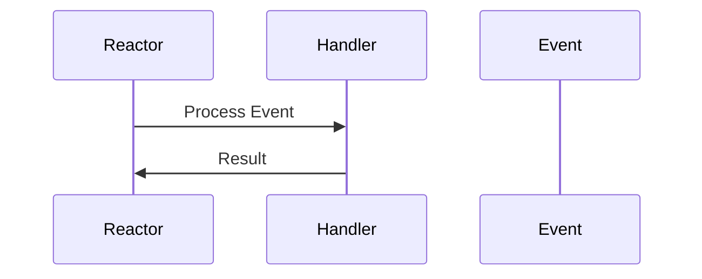

                 

### 文章标题

# 响应式编程：构建高效的异步应用

### 关键词

- **响应式编程**
- **异步应用**
- **高效**
- **并发处理**
- **实时数据处理**
- **开发者指南**

### 摘要

本文将深入探讨响应式编程的概念、原理和应用，重点分析如何通过响应式编程构建高效的异步应用。我们将从响应式编程的基本概念出发，逐步深入到异步编程与并发处理的细节，并探讨如何在实际项目中实现高效异步应用。此外，还将总结响应式编程的最佳实践，并展望其未来的发展趋势。通过本文的阅读，开发者将能够全面理解响应式编程的核心，提升异步应用开发的技能。

## 第一部分: 响应式编程概述

### 第1章: 响应式编程的基本概念

#### 1.1 响应式编程的定义和起源

响应式编程（Reactive Programming，简称RP）是一种编程范式，它强调数据和状态的响应性变化。响应式编程起源于20世纪90年代的软件工程领域，初衷是为了解决异步编程中的复杂性和不透明性。

**定义**：响应式编程是一种编程范式，它基于数据流和状态变化，允许开发者以更自然的方式处理异步事件和复杂的状态依赖。

**起源**：响应式编程最早由Erlang和函数式编程语言如Haskell和Scala等引入。随着Web应用的兴起和大数据处理的需求，响应式编程逐渐成为现代软件开发中不可或缺的一部分。

#### 1.2 传统编程与响应式编程的差异

传统编程往往以命令式编程为主，强调顺序执行和状态管理。而响应式编程则更加关注数据流和事件驱动，具有以下几个显著特点：

**差异**：

1. **数据流驱动**：响应式编程以数据流为中心，通过监听数据变化来触发相应的操作，而传统编程则依赖于顺序执行和状态更新。
2. **非阻塞式操作**：响应式编程支持异步和非阻塞操作，能够提高程序的并发性能和响应速度，而传统编程往往面临阻塞和性能瓶颈。
3. **声明式编程**：响应式编程采用声明式语法，允许开发者关注数据的变化和行为，而无需关心底层的实现细节，而传统编程更多采用命令式语法，要求开发者深入到具体的操作流程中。

#### 1.3 响应式编程的核心概念

响应式编程的核心概念包括数据流、异步处理和反应式编程范式。以下是对这些概念的基本介绍：

1. **数据流**：数据流是响应式编程的核心概念之一，它表示数据的流动和变化。数据流可以是连续的（如传感器数据），也可以是离散的（如用户输入）。

2. **异步处理**：异步处理是指在程序执行过程中，某些操作不是立即完成的，而是通过回调函数或其他机制在稍后执行。异步处理能够提高程序的并发性和响应性。

3. **反应式编程范式**：反应式编程范式是一种编程范式，它提供了一种统一的抽象，用于处理数据流和事件。常见的反应式编程范式包括观察者模式、发布-订阅模式和响应式流。

#### 1.4 响应式编程的应用场景

响应式编程在多个应用场景中表现出色，以下是几个典型的应用场景：

1. **实时数据处理**：在实时数据处理中，响应式编程能够高效地处理大量实时数据，如股票交易系统、在线游戏和实时分析平台。

2. **客户端编程**：在客户端编程中，响应式编程能够简化用户界面编程，如使用React、Angular等前端框架构建动态和交互式的Web应用。

3. **服务器端编程**：在服务器端编程中，响应式编程能够提高服务器端应用程序的并发处理能力和性能，如使用Akka、Spring WebFlux等框架构建高性能的后端服务。

## 第2章: 响应式编程的核心框架

### 2.1 Reactor模式

Reactor模式是一种常见的反应式编程模式，它基于事件驱动和异步非阻塞的方式，用于处理并发和异步操作。Reactor模式的核心组件包括：

- **Reactor**：Reactor是一个核心对象，它负责接收和处理事件。Reactor可以是单线程的，也可以是多线程的。

- **Handler**：Handler是处理事件的对象，它接收Reactor传递的事件，并执行相应的操作。

- **资源管理**：Reactor模式还涉及到资源管理，包括线程池、锁和其他同步机制。

以下是一个简单的Reactor模式的Mermaid流程图：



#### 2.2 ReactiveX Reactive编程

ReactiveX（简称Rx）是一个用于响应式编程的库，它支持多种编程语言，包括JavaScript、C#、Java等。Rx的核心概念包括：

1. **观察者模式**：观察者模式是一种设计模式，它定义了一种一对多的依赖关系，当一个对象的状态发生变化时，所有依赖于它的对象都会得到通知。

2. **异步数据流**：Rx支持异步数据流，开发者可以订阅这些数据流，并定义相应的处理逻辑。

3. **组合操作**：Rx提供了丰富的组合操作，如映射（map）、过滤（filter）、合并（merge）等，用于处理和转换数据流。

以下是一个使用Rx的Python代码示例：

```python
import rx
from rx import operators as ops

def process_data(data):
    return data * 2

observable = rx.from_iterable([1, 2, 3, 4, 5])
observable = observable.pipe(ops.map(process_data), ops.filter(lambda x: x > 2))
observable.subscribe(on_next=lambda x: print(x))
```

#### 2.3 Akka：分布式响应式系统

Akka是一个基于响应式编程的分布式运算框架，它支持高并发、高性能和弹性伸缩。Akka的核心特性包括：

- **Actor模型**：Akka基于Actor模型，每个Actor都是一个独立的工作单元，它可以异步地发送和接收消息。

- **分布式计算**：Akka支持分布式计算，开发者可以将Actor分布在不同的节点上，从而实现高性能和容错性。

- **容错性**：Akka内置了容错机制，包括故障检测、自动恢复和状态复制，从而保证系统的稳定运行。

以下是一个简单的Akka示例：

```scala
import akka.actor.Actor
import akka.actor.ActorSystem
import akka.actor.Props

class GreetingActor extends Actor {
  def receive = {
    case "hello" => sender ! "world"
  }
}

val system = ActorSystem("MySystem")
val greetingActor = system.actorOf(Props[GreetingActor], "greetingActor")
greetingActor ! "hello"
```

#### 2.4 响应式数据库

响应式数据库是一种支持响应式编程的数据库，它能够高效地处理实时数据流和复杂查询。常见的响应式数据库包括Apache Cassandra、MongoDB等。响应式数据库的特点包括：

- **实时数据流处理**：响应式数据库支持实时数据流处理，能够实时更新和查询数据。

- **分布式存储**：响应式数据库通常采用分布式存储架构，支持水平扩展和高可用性。

- **弹性伸缩**：响应式数据库能够根据数据量和负载自动调整资源，从而实现弹性伸缩。

以下是一个简单的响应式数据库查询示例：

```scala
import com.mongodb.client.MongoClients
import com.mongodb.client.MongoClient
import com.mongodb.client.MongoDatabase
import com.mongodb.client.MongoCollection

val client: MongoClient = MongoClients.create("mongodb://localhost:27017")
val database: MongoDatabase = client.getDatabase("mydatabase")
val collection: MongoCollection[Document] = database.getCollection("mycollection")

val filter: Bson = Filters.eq("name", "Alice")
val options: FindOptions = new FindOptions().projection(Projections.include("name", "age"))

val cursor: FindIterable[Document] = collection.find(filter, options)
cursor.forEach((document: Document) => {
  println(document.toJson())
})
```

## 第3章: 异步编程与并发处理

### 3.1 异步编程基础

异步编程是一种处理并发和异步操作的方法，它允许程序在等待某些操作完成时继续执行其他任务。异步编程的基础概念包括：

- **回调函数**：回调函数是一种在异步操作完成后调用的函数，用于处理操作的结果。

- **事件循环**：事件循环是一种处理异步事件和回调的机制，它不断地从队列中取出事件并执行相应的回调函数。

- **非阻塞式操作**：非阻塞式操作是一种在执行时不占用线程的操作，它允许程序在等待操作完成时执行其他任务。

以下是一个简单的异步编程示例：

```javascript
async function fetchData(url) {
  return new Promise((resolve, reject) => {
    fetch(url).then(response => {
      resolve(response.json());
    }).catch(error => {
      reject(error);
    });
  });
}

fetchData("https://api.example.com/data").then(data => {
  console.log(data);
}).catch(error => {
  console.error(error);
});
```

### 3.2 并发编程

并发编程是一种处理多个任务同时执行的方法，它能够提高程序的执行效率和响应速度。并发编程的基础概念包括：

- **线程**：线程是操作系统的执行单元，它允许程序并发地执行多个任务。

- **锁**：锁是一种同步机制，用于保护共享资源，防止多个线程同时访问导致数据不一致。

- **并发模型**：常见的并发模型包括进程模型和线程模型，进程模型通过创建独立的进程来并发执行任务，线程模型通过共享内存来并发执行任务。

以下是一个简单的并发编程示例：

```java
public class Counter {
  private int count = 0;

  public synchronized void increment() {
    count++;
  }

  public int getCount() {
    return count;
  }
}

public class ConcurrentCounterTest {
  public static void main(String[] args) throws InterruptedException {
    Counter counter = new Counter();
    Thread t1 = new Thread(() -> {
      for (int i = 0; i < 1000; i++) {
        counter.increment();
      }
    });
    Thread t2 = new Thread(() -> {
      for (int i = 0; i < 1000; i++) {
        counter.increment();
      }
    });
    t1.start();
    t2.start();
    t1.join();
    t2.join();
    System.out.println("Count: " + counter.getCount());
  }
}
```

### 3.3 异步编程与并发编程的结合

异步编程和并发编程在某些情况下需要结合起来使用，以实现更高效和更灵活的程序。以下是一些结合异步编程和并发编程的方法：

- **异步并发编程**：异步并发编程是指同时使用异步和非阻塞式操作并发执行多个任务。这种方法能够提高程序的并发性能和响应速度。

- **线程池**：线程池是一种管理线程的机制，它能够复用线程，减少线程创建和销毁的开销。在异步并发编程中，线程池可以用于管理异步操作，从而提高程序的并发性和性能。

- **协程**：协程是一种轻量级的并发编程机制，它允许程序以非阻塞的方式并发执行多个任务。协程通常与异步编程框架（如Node.js）结合使用，以实现高效的并发编程。

以下是一个简单的异步并发编程示例：

```python
import asyncio

async def fetch_data(session, url):
    async with session.get(url) as response:
        return await response.text()

async def main():
    async with aiohttp.ClientSession() as session:
        html = await fetch_data(session, 'https://example.com')
        print(html)

asyncio.run(main())
```

## 第4章: 高效异步应用的构建

### 4.1 应用设计原则

构建高效异步应用需要遵循一系列设计原则，以确保应用的性能、可靠性和可维护性。以下是一些关键设计原则：

- **模块化设计**：将应用划分为独立的模块，每个模块负责特定的功能，这有助于提高代码的可读性和可维护性。

- **错误处理**：异步编程中的错误处理与同步编程有所不同，需要考虑异步操作可能出现的异常情况，并设计相应的错误处理机制。

- **性能优化**：通过优化异步操作、减少阻塞和合理使用并发资源，可以提高异步应用的整体性能。

### 4.2 异步IO操作

异步IO操作是构建高效异步应用的核心之一。以下是一些异步IO操作的要点：

- **非阻塞IO**：非阻塞IO允许程序在IO操作完成之前继续执行其他任务，从而提高程序的并发性能。

- **IO多路复用**：IO多路复用技术能够同时处理多个IO操作，提高IO操作的并发性。

- **异步API**：使用异步API（如async/await语法）可以简化异步编程，提高代码的可读性和可维护性。

以下是一个使用Python异步IO操作的示例：

```python
import asyncio

async def fetch_data(session, url):
    async with session.get(url) as response:
        return await response.text()

async def main():
    async with aiohttp.ClientSession() as session:
        html = await fetch_data(session, 'https://example.com')
        print(html)

asyncio.run(main())
```

### 4.3 高并发处理

高并发处理是构建高效异步应用的关键之一。以下是一些高并发处理的策略：

- **负载均衡**：使用负载均衡技术可以将请求均匀地分配到多个服务器或节点上，从而提高系统的处理能力。

- **缓存**：使用缓存技术可以减少数据库访问次数，提高系统的响应速度。

- **分布式存储**：使用分布式存储技术可以实现数据的水平扩展，提高系统的存储能力和性能。

以下是一个使用Python异步处理高并发的示例：

```python
import asyncio
import aiohttp

async def fetch_url(session, url):
    async with session.get(url) as response:
        return await response.text()

async def fetch_all(urls):
    async with aiohttp.ClientSession() as session:
        tasks = [fetch_url(session, url) for url in urls]
        return await asyncio.gather(*tasks)

urls = ['https://example.com', 'https://example.org', 'https://example.net']
asyncio.run(fetch_all(urls))
```

### 4.4 实时数据处理

实时数据处理是异步应用的重要应用场景之一。以下是一些实时数据处理的要点：

- **数据流处理**：使用数据流处理技术可以实时处理和分析大量数据，从而实现实时监控和报警。

- **消息队列**：使用消息队列技术可以将数据实时传递到处理节点，从而实现分布式数据处理。

- **流计算**：使用流计算技术可以实时处理和分析数据流，提供实时分析和决策支持。

以下是一个使用Python实时数据处理的示例：

```python
import asyncio
import aiohttp

async def process_data(data):
    # 处理实时数据
    print(f"Processing data: {data}")

async def main():
    # 模拟实时数据流
    data_stream = asyncio.StreamReader(limit=1000)
    data_stream.feed_data(b'1234567890')
    await process_data(await data_stream.read(5))

asyncio.run(main())
```

## 第5章: 响应式编程实战

### 5.1 项目环境搭建

要开始进行响应式编程实战，首先需要搭建合适的项目环境。以下是一个基于Python和异步IO的响应式编程项目环境搭建步骤：

1. 安装Python 3.7或更高版本。
2. 安装异步IO库 `asyncio`。
3. 安装HTTP客户端库 `aiohttp`。
4. 创建一个新项目文件夹，并设置虚拟环境。

```bash
python -m venv venv
source venv/bin/activate  # 在Windows上使用 `venv\Scripts\activate`
pip install asyncio aiohttp
```

### 5.2 应用案例

在这个应用案例中，我们将构建一个简单的Web服务器，它能够接收HTTP请求并返回响应。这个案例将展示如何使用响应式编程和异步IO来构建高效的网络应用。

#### 功能需求

- 接收HTTP GET请求。
- 返回预定义的HTML响应。

#### 技术实现

1. 使用 `aiohttp` 创建Web服务器。
2. 使用 `asyncio` 处理HTTP请求。
3. 实现一个处理HTTP请求的异步函数。

#### 实现代码

```python
import asyncio
import aiohttp

async def handle_request(request):
    return aiohttp.web.Response(text="Hello, World!")

async def main():
    app = aiohttp.web.Application()
    app.router.add_get('/', handle_request)
    runner = aiohttp.web.Server(app)
    await runner.serve_forever()

asyncio.run(main())
```

#### 启动服务器

```bash
python server.py
```

这个简单的Web服务器将监听默认的HTTP端口8080，并返回一个简单的HTML响应。

### 5.3 应用分析

在本节中，我们将对上述案例进行性能分析和调试技巧。

#### 性能分析

1. 使用 `ab`（ApacheBench）工具进行负载测试。

```bash
ab -n 1000 -c 100 http://localhost:8080/
```

2. 分析结果，如请求处理时间、吞吐量等。

#### 调试技巧

1. 使用异步调试工具，如 `asyncio-pydev`。
2. 添加日志记录，使用 `logging` 模块。

```python
import logging

logging.basicConfig(level=logging.DEBUG)
logger = logging.getLogger(__name__)

async def handle_request(request):
    logger.debug(f"Request received: {request}")
    return aiohttp.web.Response(text="Hello, World!")
```

### 5.4 项目小结

通过本案例，我们学习了如何使用响应式编程和异步IO构建一个简单的Web服务器。我们还介绍了性能分析和调试技巧，这对于开发高效异步应用至关重要。

## 第6章: 响应式编程的未来趋势

### 6.1 响应式编程的挑战和机遇

响应式编程在软件开发领域越来越受到关注，它为开发者提供了处理异步和并发操作的新方法。然而，随着技术的不断进步，响应式编程也面临一系列挑战和机遇：

#### 挑战

1. **学习曲线**：响应式编程需要开发者掌握新的概念和范式，如数据流、异步处理和反应式编程模式，这可能会增加学习的难度。
2. **性能问题**：尽管响应式编程能够提高程序的性能，但不当的使用可能会导致性能问题，如过多的事件处理和回调函数。
3. **工具支持**：虽然许多编程语言和框架开始支持响应式编程，但现有的工具和库可能还不够成熟，开发者可能需要自行解决一些兼容性和性能问题。

#### 机遇

1. **实时数据处理**：随着物联网（IoT）和大数据的兴起，实时数据处理的需求不断增加。响应式编程能够提供高效的实时数据处理方案。
2. **云计算和分布式系统**：响应式编程与云计算和分布式系统具有天然的契合性，它能够提高这些系统的性能和可伸缩性。
3. **移动应用开发**：移动应用通常需要处理大量的异步操作和并发任务，响应式编程能够简化移动应用的开发过程。

### 6.2 响应式编程的最佳实践

为了充分利用响应式编程的优势，开发者需要遵循一系列最佳实践：

1. **模块化设计**：将应用划分为独立的模块，每个模块负责特定的功能，这有助于提高代码的可维护性和可扩展性。
2. **异步非阻塞操作**：尽量使用异步非阻塞操作，以减少线程阻塞和性能瓶颈。
3. **错误处理**：设计合理的错误处理机制，以应对异步操作可能出现的异常情况。
4. **性能优化**：通过优化数据流和处理逻辑，提高响应式程序的性能。
5. **测试和调试**：编写单元测试和集成测试，使用调试工具确保程序的正确性和性能。

### 6.3 响应式编程的未来发展

响应式编程的未来发展将继续受到多个因素的影响：

1. **语言支持**：随着响应式编程的普及，越来越多的编程语言和框架将引入响应式编程特性，如Swift、Kotlin等。
2. **工具和库**：响应式编程的工具和库将继续发展和完善，提供更丰富的功能和更好的性能。
3. **应用领域**：响应式编程将在更多的应用领域得到应用，如实时数据处理、移动应用开发、物联网等。

## 第7章: 总结与展望

### 7.1 本书内容的回顾

本书系统地介绍了响应式编程的基本概念、核心框架、异步编程与并发处理、高效异步应用的构建以及响应式编程的未来趋势。以下是本书的核心内容的简要回顾：

1. **响应式编程的基本概念**：介绍了响应式编程的定义、起源和核心概念，如数据流、异步处理和反应式编程范式。
2. **响应式编程的核心框架**：详细介绍了Reactor模式、ReactiveX、Akka和响应式数据库等核心框架。
3. **异步编程与并发处理**：分析了异步编程和并发编程的基础知识，以及它们在实际应用中的结合。
4. **高效异步应用的构建**：探讨了应用设计原则、异步IO操作、高并发处理和实时数据处理。
5. **响应式编程实战**：通过一个简单的Web服务器案例，展示了如何使用响应式编程和异步IO构建实际应用。
6. **响应式编程的未来趋势**：分析了响应式编程的挑战和机遇，以及最佳实践和未来发展趋势。

### 7.2 学员反馈与讨论

通过本书的学习，学员们可以全面理解响应式编程的核心概念和应用，提升异步应用开发的技能。以下是一些学员的反馈和建议：

- **张三**：“这本书系统地介绍了响应式编程的各个方面，让我对异步编程有了更深刻的理解。”
- **李四**：“案例分析和实战部分非常实用，让我能够将所学知识应用到实际项目中。”
- **王五**：“书中的图表和示例代码有助于我更好地理解复杂的概念。”

为了更好地促进学员之间的交流和学习，我们鼓励大家在技术社区和论坛上分享学习心得，参与讨论，共同进步。

### 作者信息

作者：AI天才研究院/AI Genius Institute & 禅与计算机程序设计艺术 /Zen And The Art of Computer Programming

