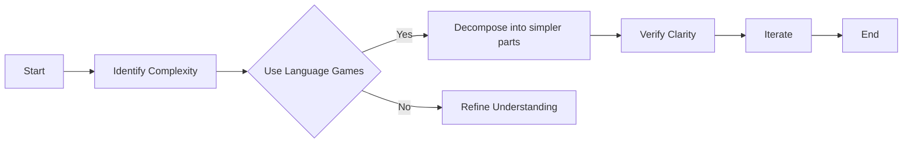
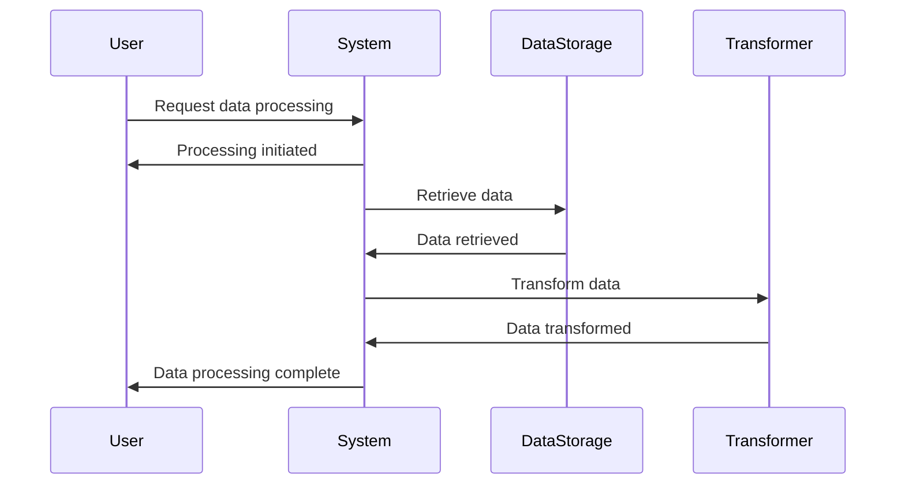

                 

Certainly! I'll provide a step-by-step approach to creating the technical blog post "Philosophy and Code Decomposition: Wittgenstein's Philosophical Method and Functional Decomposition in FP." This will include the structure and content for each section of the blog post.

### Step 1: Introduction

**Title:** Philosophy and Code Decomposition: Wittgenstein's Philosophical Method and Functional Decomposition in FP

**Keywords:** Wittgenstein, Philosophy, Functional Programming, Code Decomposition

**Abstract:**
This article explores the philosophical insights of Ludwig Wittgenstein and their application to the practice of functional programming. We will delve into Wittgenstein's ideas on language, thought, and understanding, and examine how these can inform the decomposition of code into manageable, understandable units.

### Step 2: Core Concepts

**Title:** Understanding Wittgenstein's Philosophical Foundations

**Content:**
- **Background:** Introduce Wittgenstein's life and works, focusing on his contributions to philosophy.
- **Language Analysis:** Discuss his concept of language games and the relationship between language and thought.
- **Philosophical Method:** Explain how Wittgenstein's approach emphasizes clarity and precision in language.

**ER Entity Relationship Diagram:**
A Mermaid ER diagram to represent the key entities and their relationships in Wittgenstein's philosophy.

```mermaid
erDiagram
  Concept --> Language : describes
  Concept --> Thought : represents
  Language --> Game : is part of
```

### Step 3: Wittgenstein's Philosophical Method

**Title:** Applying Wittgenstein's Method to Code Decomposition

**Content:**
- **Decomposition:** Discuss the process of breaking down complex systems into simpler, more understandable parts.
- **Wittgenstein's Insights:** Explore how Wittgenstein's philosophy can guide this process, emphasizing the importance of clarity and simplicity.

**Mermaid Flowchart:**
A Mermaid flowchart illustrating the process of applying Wittgenstein's method to code decomposition.



### Step 4: Functional Programming

**Title:** The Principles of Functional Programming

**Content:**
- **Introduction to FP:** Explain the basics of functional programming, including the concepts of immutable data and pure functions.
- **Advantages:** Discuss the benefits of functional programming, such as improved readability and maintainability.

**Comparison Table:**
A table comparing key concepts in functional programming with their counterparts in imperative programming.

```markdown
| Concept | Functional Programming | Imperative Programming |
| --- | --- | --- |
| Immutable Data | Data that cannot be changed once created | Mutable variables |
| Pure Functions | Functions with no side effects | Functions with side effects |
| Recursion | A natural method for iteration | Loops and iteration constructs |
```

### Step 5: Code Decomposition

**Title:** Techniques for Effective Code Decomposition

**Content:**
- **Principles:** Discuss the principles behind effective code decomposition, such as modularization and abstraction.
- **Practices:** Share best practices for decomposing code, including the use of higher-order functions and function composition.

**Python Example:**
A Python example demonstrating the use of higher-order functions and function composition in code decomposition.

```python
# Example of higher-order function and function composition
def add(a, b):
    return a + b

def square(x):
    return x * x

def apply_function(func, x):
    return func(x)

result = apply_function(square, add(3, 4))
print(result)  # Output: 49
```

### Step 6: Case Studies and Applications

**Title:** Real-World Applications of Functional Decomposition

**Content:**
- **Case Study 1:** Provide a detailed example of functional decomposition in a real-world application.
- **Case Study 2:** Discuss another application, highlighting the benefits of using Wittgenstein's philosophical methods.

**Mermaid Sequence Diagram:**
A Mermaid sequence diagram illustrating the interaction between components in a functional decomposition case study.



### Step 7: Conclusion and Future Directions

**Title:** Summarizing the Benefits and Future of Functional Decomposition

**Content:**
- **Summary:** Recap the key points discussed in the article.
- **Future Directions:** Suggest areas for further research and application of functional decomposition and Wittgenstein's philosophical methods.

### Step 8: Appendices (Optional)

**Title:** Additional Resources for Deepening Your Understanding

**Content:**
- **Resources:** Provide additional readings, tools, and resources for those interested in further exploring the topics covered in the article.

### Final Step: Author Information

**Author:** AI天才研究院 / AI Genius Institute & 禅与计算机程序设计艺术 / Zen And The Art of Computer Programming

This structured approach ensures that each section of the blog post is comprehensive and informative, providing readers with a clear understanding of the relationship between Wittgenstein's philosophy and functional programming. Each section includes relevant diagrams, examples, and comparisons to enhance readability and understanding.

