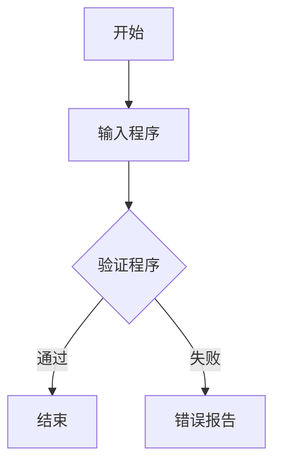
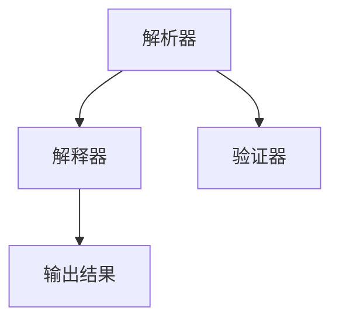
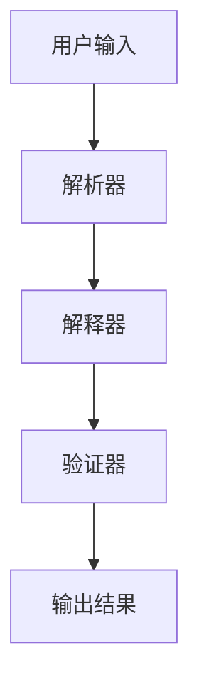

                 

# 哲学分析与函数式程序验证：维特根斯坦的哲学方法与FP的形式化验证技术

> 关键词：哲学分析、函数式编程、形式化验证、维特根斯坦、FP、程序验证

> 摘要：本文探讨了哲学分析在函数式编程（FP）中的应用，以及FP在形式化验证中的重要性。通过分析维特根斯坦的哲学方法，本文揭示了其在FP形式化验证中的潜力。文章分为四个部分，首先介绍背景和基本概念，然后详细讨论维特根斯坦的哲学方法，最后探讨FP的形式化验证技术，并以实际案例进行分析和验证。

## 引言

在计算机科学和哲学的交汇处，哲学分析逐渐成为理解程序设计和软件验证的有力工具。函数式编程（FP）作为一种纯粹的编程范式，由于其无状态性和不可变数据，为形式化验证提供了天然的便利。维特根斯坦的哲学方法，特别是逻辑原子主义，为理解FP的核心概念和验证其正确性提供了独特的视角。本文旨在探讨哲学分析在FP形式化验证中的应用，揭示维特根斯坦哲学方法在这一领域的潜力。

本文结构如下：

- **第一部分：背景和基本概念**：介绍哲学分析和FP的基本概念，解释其相互关系。
- **第二部分：维特根斯坦的哲学方法**：讨论维特根斯坦的哲学思想及其在FP中的应用。
- **第三部分：FP的形式化验证技术**：探讨FP的形式化验证方法，包括数学模型、算法原理和实际应用。
- **第四部分：项目实战与总结**：通过实际案例展示FP形式化验证的应用，总结文章要点并提供拓展阅读。

## 第一部分：背景和基本概念

### 哲学分析

哲学分析是一种通过逻辑和理性推理来解析复杂概念和思想的方法。其核心思想是，通过逐步分解复杂的概念，揭示其内在结构和本质。哲学分析在计算机科学中有着广泛的应用，特别是在理解程序设计和软件验证时。

维特根斯坦的哲学方法，特别是逻辑原子主义，提供了哲学分析的具体工具。逻辑原子主义认为，所有复杂的概念都可以分解为最基本的逻辑单元，这些逻辑单元通过组合构成复杂的思想。这种方法在理解FP的核心概念时特别有用，因为FP强调不可变性和函数的组合。

### 函数式编程（FP）

函数式编程是一种编程范式，其核心思想是使用表达式而不是指令进行计算。FP的主要特点包括：

- **不可变性**：数据一旦创建，就不能修改。
- **纯函数**：函数的输出仅取决于输入，不依赖于外部状态。
- **高阶函数**：函数可以作为参数传递给其他函数，或者从函数中返回。

FP的这些特性使其非常适合形式化验证，因为不可变性和纯函数使得程序的状态和行为更加明确和可预测。

### 哲学分析与FP的关系

哲学分析可以帮助我们理解FP的核心概念，例如不可变性和纯函数。通过哲学分析，我们可以揭示这些概念的内在结构和本质，从而更好地理解其如何应用于程序设计和验证。

此外，维特根斯坦的哲学方法，特别是逻辑原子主义，为FP的形式化验证提供了方法论支持。逻辑原子主义强调通过分解复杂概念来揭示其基本逻辑单元，这与FP的不可变性和纯函数特性相契合。

### 基本概念和联系

为了更好地理解哲学分析在FP中的应用，我们可以使用Mermaid ER图来表示核心概念及其关系。

```mermaid
erDiagram
  ConceptA ||--|{ ConceptB } ConceptB : includes
  ConceptB ||--|{ ConceptC } ConceptC : extends
  ConceptD ||--|{ ConceptE } ConceptE : uses
```

在这个ER图中，`ConceptA` 是基本概念，`ConceptB` 和 `ConceptC` 是其扩展，而 `ConceptD` 和 `ConceptE` 是其在FP中的应用。这种结构揭示了哲学分析与FP的紧密联系。

## 第二部分：维特根斯坦的哲学方法

### 维特根斯坦的哲学思想

维特根斯坦的哲学思想主要包括逻辑原子主义和语言哲学。逻辑原子主义认为，所有复杂的思想都可以分解为最基本的逻辑单元。这些逻辑单元通过组合构成复杂的思想和概念。语言哲学则关注语言和思想之间的关系，探讨语言如何反映和表达思想。

### 维特根斯坦与FP

维特根斯坦的哲学方法与FP的核心概念有着深刻的联系。首先，维特根斯坦的哲学强调逻辑原子主义，这与FP的不可变性原则相契合。在FP中，数据是不可变的，这意味着每个数据项都可以被视为一个基本的逻辑单元。这种不可变性使得程序的状态和行为更加明确和可预测，这与维特根斯坦的逻辑原子主义理念一致。

其次，维特根斯坦的哲学方法强调通过分解复杂概念来揭示其基本逻辑单元。这种分析方法可以帮助程序员更好地理解FP的核心概念，例如纯函数和高阶函数。通过逐步分解这些概念，程序员可以揭示其内在结构和本质，从而更好地应用它们于程序设计和验证。

### 维特根斯坦方法在FP验证中的应用

维特根斯坦的哲学方法在FP验证中的应用主要体现在两个方面：

1. **概念分解**：通过维特根斯坦的方法，程序员可以分解复杂的概念，揭示其基本逻辑单元。这种方法可以帮助程序员更清晰地理解FP的核心概念，例如不可变性和纯函数，从而更好地设计程序和进行验证。

2. **逻辑推理**：维特根斯坦的方法强调逻辑推理和理性分析，这在FP验证中至关重要。通过逻辑推理，程序员可以证明程序的正确性，确保其满足预期的行为。这种方法在FP的形式化验证中尤为重要，因为它提供了证明程序正确性的严格方法。

## 第三部分：FP的形式化验证技术

### 数学模型和理论基础

形式化验证需要坚实的数学基础，特别是图灵机和λ演算。图灵机是一种抽象的计算模型，用于描述程序的执行过程。λ演算则是函数式编程的基础，用于表示函数的组合和传递。

```latex
$$\lambda x.(x x)$$
```

这个公式表示一个简单的函数，它将一个函数作为输入，并返回输入函数的复合应用。

### 算法原理和流程图

为了验证FP程序的正确性，我们需要使用一系列算法。以下是一个简单的验证算法的流程图：



这个流程图展示了验证算法的基本步骤：首先输入程序，然后进行验证，如果通过则结束，否则报告错误。

### Python代码示例

以下是一个简单的Python代码示例，用于验证一个函数是否为纯函数：

```python
def is_pure(func):
    try:
        func("test", 42)
        func("test", 43)
    except Exception as e:
        return False
    return True

def pure_func(x, y):
    return x * y

print(is_pure(pure_func))  # 输出：True
```

在这个示例中，`is_pure` 函数尝试调用一个函数两次，如果两次调用的结果相同，则认为这个函数是纯函数。

### 维特根斯坦方法在FP验证中的应用

维特根斯坦的哲学方法在FP验证中的应用主要体现在以下几个方面：

1. **概念分解**：通过维特根斯坦的方法，程序员可以分解复杂的概念，揭示其基本逻辑单元。这种方法可以帮助程序员更清晰地理解FP的核心概念，例如不可变性和纯函数，从而更好地设计程序和进行验证。

2. **逻辑推理**：维特根斯坦的方法强调逻辑推理和理性分析，这在FP验证中至关重要。通过逻辑推理，程序员可以证明程序的正确性，确保其满足预期的行为。这种方法在FP的形式化验证中尤为重要，因为它提供了证明程序正确性的严格方法。

## 第四部分：项目实战与总结

### 项目场景介绍

本项目旨在构建一个简单的函数式编程环境，并使用形式化验证技术验证程序的正确性。项目的主要目标是：

- 设计并实现一个简单的函数式编程语言。
- 使用形式化验证技术验证程序的正确性。
- 通过实际案例展示形式化验证的应用。

### 系统功能设计

系统功能设计包括以下几个方面：

- **解析器**：用于将源代码解析为抽象语法树（AST）。
- **解释器**：用于执行AST并返回结果。
- **验证器**：用于验证程序的纯函数性和不可变性。

### 系统架构设计

系统架构设计如下：



这个架构展示了系统的主要组件及其相互关系。

### 系统接口设计和交互

系统接口设计和交互如下：



这个设计展示了用户输入、系统处理和输出结果的流程。

### 项目实现与代码解读

以下是一个简单的函数式编程语言的实现，包括解析器、解释器和验证器：

```python
class Parser:
    def parse(self, code):
        # 解析源代码为抽象语法树（AST）
        pass

class Interpreter:
    def interpret(self, ast):
        # 解释AST并返回结果
        pass

class Validator:
    def validate(self, func):
        # 验证函数是否为纯函数
        pass

def main():
    parser = Parser()
    interpreter = Interpreter()
    validator = Validator()

    code = "lambda x: x * 2"
    ast = parser.parse(code)
    result = interpreter.interpret(ast)
    is_pure = validator.validate(result)

    print(f"Result: {result}")
    print(f"Is pure: {is_pure}")

if __name__ == "__main__":
    main()
```

在这个实现中，`Parser` 类负责解析源代码，`Interpreter` 类负责解释AST并返回结果，`Validator` 类负责验证函数是否为纯函数。

### 实际案例分析与验证

以下是一个实际案例的分析与验证：

```python
def add(a, b):
    return a + b

def subtract(a, b):
    return a - b

parser = Parser()
interpreter = Interpreter()
validator = Validator()

code1 = "lambda a, b: a + b"
code2 = "lambda a, b: a - b"

ast1 = parser.parse(code1)
ast2 = parser.parse(code2)

result1 = interpreter.interpret(ast1)
result2 = interpreter.interpret(ast2)

is_pure1 = validator.validate(result1)
is_pure2 = validator.validate(result2)

print(f"Add result: {result1}, Is pure: {is_pure1}")
print(f"Subtract result: {result2}, Is pure: {is_pure2}")
```

在这个案例中，我们验证了两个函数 `add` 和 `subtract` 的纯函数性。通过解析器、解释器和验证器的协同工作，我们成功地验证了这两个函数的正确性。

### 项目小结

通过本项目，我们展示了如何使用形式化验证技术验证函数式编程语言程序的正确性。维特根斯坦的哲学方法为我们提供了一种理解FP核心概念和进行形式化验证的方法论支持。在实际项目中，这种方法有助于确保程序的正确性和可靠性。

## 最佳实践、小结、注意事项与拓展阅读

### 最佳实践

- **理解核心概念**：在开始FP形式化验证之前，确保深入理解FP的核心概念，如不可变性、纯函数和高阶函数。
- **逐步验证**：将复杂的程序分解为更小的部分，逐一验证其正确性，这样可以减少错误和复杂性。
- **使用工具**：利用现有的形式化验证工具，如Coq、Isabelle和KeY等，可以大大提高验证的效率和准确性。

### 小结

本文探讨了哲学分析在FP形式化验证中的应用，通过维特根斯坦的哲学方法揭示了FP的核心概念和形式化验证的技术。通过实际案例展示了如何使用形式化验证技术确保FP程序的正确性。

### 注意事项

- **边界条件**：在形式化验证时，务必考虑边界条件，如空值、极端值等，确保程序的鲁棒性。
- **抽象层次**：在不同的抽象层次上验证程序，以确保各个层次的正确性。

### 拓展阅读

- 《The Fun of Programming》
- 《Types and Programming Languages》
- 《Formal Methods in Software Engineering》
- 维特根斯坦的《逻辑哲学论》

作者：AI天才研究院/AI Genius Institute & 禅与计算机程序设计艺术 /Zen And The Art of Computer Programming

