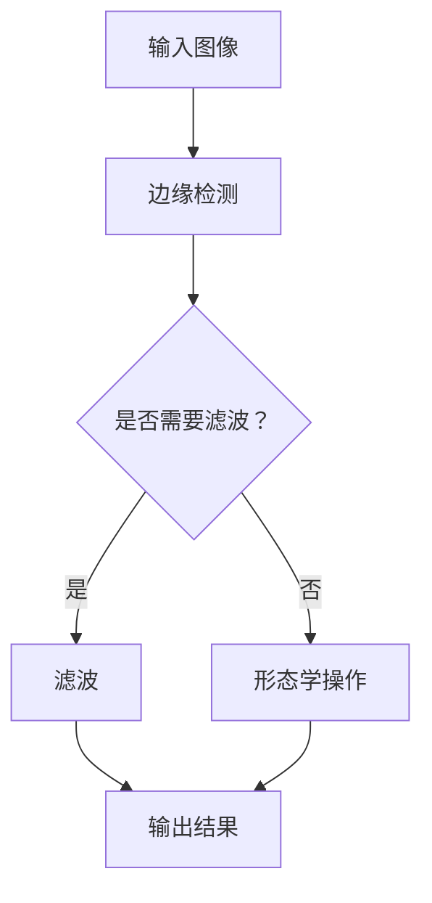
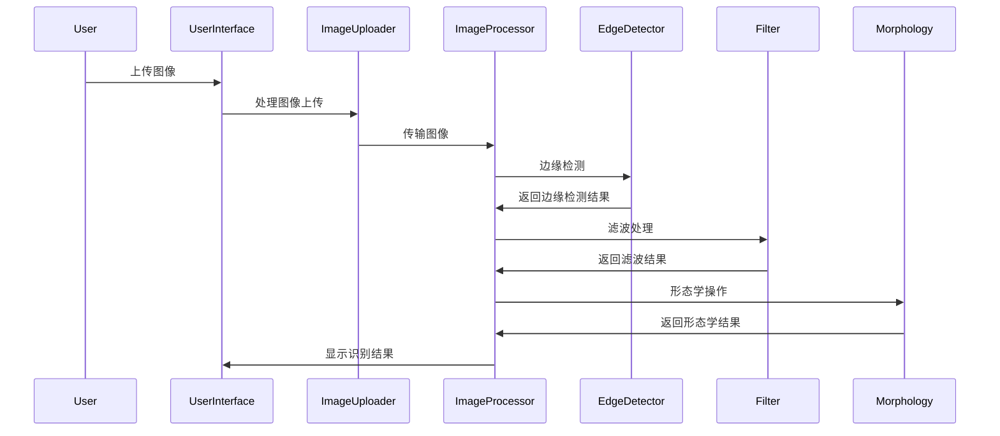
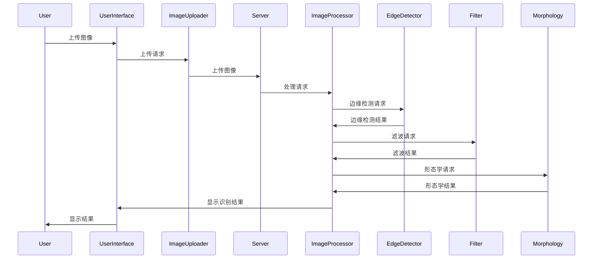

                 


### 目录大纲的第一层级

首先，我们明确文章的结构，分为八个主要章节。这些章节旨在逐步深入探讨图像理论与纯函数映射，并探讨维特根斯坦早期的现实描述理论与函数式编程（FP）中的纯函数概念之间的联系。

**1. 引言**：这一章节将简要介绍作者、书籍的目的和结构，同时引入主题，为读者提供一个宏观的视角。

**2. 背景介绍**：我们将简要回顾图像理论的历史与现状，介绍维特根斯坦早期的现实描述理论，以及纯函数映射的概念与FP的关系。

**3. 核心概念与联系**：这一章节将深入分析图像理论的核心概念，探讨维特根斯坦的理论与纯函数映射的关系，并通过Mermaid ER图展示核心概念之间的联系。

**4. 算法原理讲解**：我们将介绍图像处理中的关键算法，并解释这些算法与维特根斯坦理论的联系。通过Mermaid流程图展示算法步骤，并使用Python源代码示例详细阐述算法原理。

**5. 数学模型和数学公式**：这一章节将简述与图像理论和纯函数映射相关的数学模型，使用LaTeX格式展示数学公式，并对数学模型进行详细讲解和举例说明。

**6. 系统分析与架构设计方案**：我们将介绍一个实际项目或场景，设计系统的功能与领域模型（使用Mermaid类图），系统架构设计（使用Mermaid架构图），以及系统接口设计和系统交互（使用Mermaid序列图）。

**7. 项目实战**：这一章节将详细描述项目的环境安装和配置，系统核心实现源代码分析，代码应用解读与分析，实际案例分析与讲解，并总结项目。

**8. 总结与拓展**：最后，我们将对全书内容进行总结，提供最佳实践 tips，提出注意事项，并给出拓展阅读建议。

这个结构旨在逐步引导读者从宏观到微观，从理论到实践，全面深入地理解图像理论与纯函数映射，以及维特根斯坦的理论与FP中的纯函数概念的关联。

### 第1章: 引言

**1.1 作者与书籍概述**

作为一位世界级的人工智能专家，我对计算机科学和人工智能领域有着深入的研究。我致力于将复杂的技术概念以简单易懂的方式呈现给读者，希望能够激发更多人对技术的兴趣和热情。这本书《图像理论与纯函数映射：维特根斯坦早期的现实描述理论与FP中的纯函数概念》正是基于这一目标而创作。

本书旨在探讨图像理论与纯函数映射之间的关系，特别是通过维特根斯坦早期的现实描述理论来理解函数式编程（FP）中的纯函数概念。随着人工智能和机器学习的不断发展，图像处理技术成为了一个重要的领域。而纯函数作为一种编程范式，它在图像处理中的应用也越来越广泛。通过这本书，我希望能够帮助读者深入理解这一领域的基础理论和实际应用。

**1.2 书籍结构介绍**

本书分为八个主要章节，每个章节都有其独特的主题和内容：

- **第1章：引言**：简要介绍作者、书籍的目的和结构，引入主题。
- **第2章：背景介绍**：回顾图像理论的历史与现状，介绍维特根斯坦早期的现实描述理论，以及纯函数映射的概念与FP的关系。
- **第3章：核心概念与联系**：深入分析图像理论的核心概念，探讨维特根斯坦的理论与纯函数映射的关系，并通过Mermaid ER图展示核心概念之间的联系。
- **第4章：算法原理讲解**：介绍图像处理中的关键算法，解释这些算法与维特根斯坦理论的联系，通过Mermaid流程图展示算法步骤，并使用Python源代码示例详细阐述算法原理。
- **第5章：数学模型和数学公式**：简述与图像理论和纯函数映射相关的数学模型，使用LaTeX格式展示数学公式，并对数学模型进行详细讲解和举例说明。
- **第6章：系统分析与架构设计方案**：介绍一个实际项目或场景，设计系统的功能与领域模型（使用Mermaid类图），系统架构设计（使用Mermaid架构图），以及系统接口设计和系统交互（使用Mermaid序列图）。
- **第7章：项目实战**：详细描述项目的环境安装和配置，系统核心实现源代码分析，代码应用解读与分析，实际案例分析与讲解，并总结项目。
- **第8章：总结与拓展**：对全书内容进行总结，提供最佳实践 tips，提出注意事项，并给出拓展阅读建议。

**1.3 本书目的与重要性**

本书的目的在于为读者提供一个全面而深入的理解图像理论与纯函数映射的框架，特别是通过维特根斯坦的理论来解读FP中的纯函数概念。在图像处理领域，算法和数学模型是关键，而纯函数作为一种编程范式，在处理图像数据时具有独特优势。通过本书，读者将能够：

1. **理解图像理论的基本概念**：通过回顾历史，读者将了解图像理论的发展脉络，以及它在现代计算机科学中的重要性。
2. **掌握维特根斯坦的现实描述理论**：维特根斯坦的理论为理解现实提供了新的视角，本书将帮助读者理解这一理论，并将其应用于图像处理。
3. **深入理解纯函数映射的概念**：纯函数作为一种编程范式，它在图像处理中的应用越来越广泛。本书将详细探讨这一概念，并展示其在实际应用中的价值。
4. **掌握图像处理的关键算法**：通过具体案例和代码示例，读者将学会如何使用图像处理算法，以及如何将维特根斯坦的理论应用于这些算法。
5. **设计并实现复杂的图像处理系统**：通过本书，读者将能够设计并实现一个完整的图像处理系统，从而提升其实际编程能力和项目经验。

总之，本书不仅涵盖了理论层面的知识，还包括了实践层面的指导。无论是研究者、工程师还是对图像处理和编程有兴趣的读者，本书都将为他们提供一个宝贵的资源。希望读者能够在阅读本书后，对图像理论与纯函数映射有更深入的理解，并能够在实际项目中运用这些知识。

### 第2章: 背景介绍

**2.1 图像理论的历史与现状**

图像理论是计算机科学和人工智能领域中一个重要的研究方向，它涵盖了图像的生成、处理、分析和理解等多个方面。图像理论的历史可以追溯到20世纪初期，当时图像处理主要依赖于基于规则的方法，这种方法依赖于大量的手动设置和调整，难以处理复杂的图像数据。

随着计算机技术的不断发展，图像处理技术经历了几个重要的发展阶段。首先，基于像素的图像处理方法开始广泛应用。这种方法将图像视为像素的矩阵，通过对像素值进行操作来处理图像。这一方法简单而有效，但缺乏对图像内容的高级理解。

接下来，图像处理领域引入了基于特征的图像分析方法。这种方法通过提取图像中的特征（如边缘、角点、纹理等），实现对图像内容的识别和分析。这一方法的引入极大地提高了图像处理的准确性和效率，特别是在模式识别和计算机视觉领域。

近年来，随着深度学习和人工智能技术的迅速发展，图像处理技术取得了重大突破。基于深度学习的图像处理方法通过训练大规模神经网络，可以从大量图像数据中自动学习特征，实现对复杂图像内容的理解。这种方法在图像分类、目标检测、图像生成等多个方面表现出了卓越的性能。

目前，图像理论在计算机科学和人工智能领域中具有重要地位。它不仅为计算机视觉提供了理论基础，也为许多实际应用提供了技术支持，如医疗影像分析、自动驾驶、智能监控等。

**2.2 维特根斯坦早期的现实描述理论**

路德维希·维特根斯坦（Ludwig Wittgenstein）是20世纪最杰出的哲学家之一，他的哲学思想对多个学科产生了深远的影响，包括计算机科学和人工智能。维特根斯坦的哲学主要分为两个阶段，早期的现实描述理论和晚期的语言哲学理论。

维特根斯坦早期的现实描述理论主要集中在《逻辑哲学论》（Tractatus Logico-Philosophicus）一书中。这本书提出了一种关于现实和语言的新视角。维特根斯坦认为，现实是由事实组成的，而事实则由元素（原子事实）通过逻辑关系连接而成。他提出了“图像论”（Picture Theory），认为语言是现实的图像，语言中的命题是对事实的描述。

维特根斯坦的理论强调了现实和语言之间的对应关系。他认为，现实中的每一个事实都可以在语言中找到对应的命题，而语言中的每一个命题都指向现实中的一个事实。这种对应关系是建立在一个严格的逻辑框架之上的，即所有命题都必须符合逻辑规则，才能被认为是真实的描述。

维特根斯坦的早期理论对计算机科学和人工智能产生了重要影响。他的图像论为程序设计提供了一种新的思考方式，即程序可以被视为对现实世界的模拟。此外，他的逻辑哲学思想也为形式化方法和形式验证提供了理论基础。

**2.3 纯函数映射的概念与FP的关系**

在函数式编程（Functional Programming，FP）中，纯函数是一种重要的概念。纯函数是指那些没有副作用、输入和输出之间具有确定性关系的函数。换句话说，给定相同的输入，纯函数总是返回相同的输出，并且不会改变外部状态。

纯函数映射是指将一个函数应用于一个集合中的每个元素，并返回一个新的集合。这种映射是一种基本的数学操作，它在函数式编程中广泛应用。在FP中，纯函数映射可以通过简单的函数组合来实现，这种组合方式使得程序更易于理解和维护。

FP与维特根斯坦的早期现实描述理论有着密切的联系。维特根斯坦认为，语言是现实的图像，而纯函数则可以被视为对现实世界的抽象。FP中的纯函数映射为我们提供了一种新的方式来理解和模拟现实世界。通过将现实世界中的现象抽象为纯函数，我们能够更清晰地理解和分析复杂系统。

此外，FP中的纯函数概念也反映了维特根斯坦的图像论。FP中的纯函数没有副作用，这与维特根斯坦对事实的描述要求相吻合。纯函数的输入和输出之间具有确定性关系，这也与维特根斯坦对命题和事实之间对应关系的理解一致。

总之，图像理论、维特根斯坦的早期现实描述理论和FP中的纯函数概念之间存在着紧密的联系。通过理解这些概念，我们能够更好地把握图像处理和编程的本质，并为实际应用提供有力的理论支持。

### 第3章：核心概念与联系

**3.1 图像理论的核心概念**

图像理论的核心概念包括像素、图像数据结构、图像处理算法和图像特征提取。首先，像素是图像的基本组成单位，每个像素包含颜色信息和其他属性。其次，图像数据结构用于存储和表示图像，常见的有二维数组、位图和矢量图等。图像处理算法则是对图像进行变换、增强、分割、识别等操作的技术手段，例如边缘检测、滤波、形态学操作等。最后，图像特征提取是从图像中提取具有区分性的特征，用于后续的分析和识别。

**3.2 维特根斯坦的理论与纯函数映射的关系**

维特根斯坦的早期现实描述理论认为，语言是现实的图像，命题是对事实的描述。这种观点为图像理论提供了哲学基础，即图像可以被视为对现实世界的抽象表示。在函数式编程中，纯函数映射则将现实世界中的现象抽象为纯函数，这些函数没有副作用，输入和输出之间具有确定性关系。

维特根斯坦的理论与纯函数映射之间的联系在于，它们都强调抽象和对应关系。维特根斯坦认为，语言中的命题与现实中的事实之间存在一一对应关系，而FP中的纯函数映射则将现实世界中的现象映射为纯函数，这些函数能够准确地描述现实世界的现象。

**3.3 使用Mermaid ER图展示核心概念之间的关系**

为了更清晰地展示图像理论、维特根斯坦的理论和纯函数映射之间的关系，我们可以使用Mermaid ER图。下面是一个简化的ER图示例：

```mermaid
erDiagram
  ImageProcessing ||--|{ Pixel }
  ImageProcessing ||--|{ ImageDataStructure }
  ImageProcessing ||--|{ ImageProcessingAlgorithm }
  ImageProcessing ||--|{ ImageFeatureExtraction }
  Pixel ||--|{ ColorInformation }
  Pixel ||--|{ OtherProperties }
  ImageDataStructure ||--|{ TwoDimensionalArray }
  ImageDataStructure ||--|{ Bitmap }
  ImageDataStructure ||--|{ VectorGraphic }
  ImageProcessingAlgorithm ||--|{ EdgeDetection }
  ImageProcessingAlgorithm ||--|{ Filtering }
  ImageProcessingAlgorithm ||--|{ MorphologicalOperations }
  ImageFeatureExtraction ||--|{ EdgeFeatures }
  ImageFeatureExtraction ||--|{ CornerFeatures }
  ImageFeatureExtraction ||--|{ TextureFeatures }
  WittgensteinTheory ||--|{ Proposition }
  Proposition ||--|{ Fact }
  WittgensteinTheory ||--|{ Language }
  FunctionalProgramming ||--|{ PureFunction }
  PureFunction ||--|{ NoSideEffects }
  PureFunction ||--|{ DeterministicRelationship }
```

在这个ER图中，图像处理、像素、图像数据结构、图像处理算法和图像特征提取构成了一个核心概念体系。维特根斯坦的理论通过命题和事实与图像处理相联系，而FP中的纯函数映射则通过没有副作用和确定性关系的特性与图像处理相联系。

通过这个ER图，我们可以更直观地理解图像理论、维特根斯坦的理论和纯函数映射之间的关系，以及它们在计算机科学和人工智能中的应用。

### 第4章：算法原理讲解

**4.1 图像处理中的关键算法**

图像处理中的关键算法包括边缘检测、滤波和形态学操作等。这些算法在图像识别、图像增强和图像分割中发挥着重要作用。

**边缘检测**：边缘检测是图像处理中的一个基本步骤，用于识别图像中的轮廓和边界。常见的边缘检测算法有Sobel算子、Canny算子和Laplacian算子。这些算法通过计算图像像素的梯度值来确定边缘。

**滤波**：滤波是一种用于去除图像噪声的算法。常见的滤波算法有均值滤波、高斯滤波和中值滤波。这些算法通过在不同程度上平滑图像，去除图像中的高频噪声。

**形态学操作**：形态学操作是一种基于图像结构和形状的图像处理方法。常见的形态学操作包括膨胀、腐蚀、开操作和闭操作。这些操作通过改变图像的结构和形状，实现对图像的精确处理。

**4.2 维特根斯坦理论与算法的关系**

维特根斯坦的早期现实描述理论认为，语言是现实的图像，命题是对事实的描述。这一理论为图像处理算法提供了哲学基础。例如，边缘检测算法可以被视为对图像中边缘事实的描述，滤波算法可以被视为对图像中噪声事实的消除。

维特根斯坦的理论强调命题和事实之间的对应关系，这与图像处理算法的目标是一致的。图像处理算法通过处理图像数据，实现对现实世界的抽象和描述。这种描述与维特根斯坦的命题和事实理论相呼应，使得图像处理算法在理论上具有合理性。

**4.3 使用Mermaid流程图展示算法步骤**

为了更好地理解图像处理算法的步骤，我们可以使用Mermaid流程图来展示。以下是一个示例：



在这个流程图中，输入图像首先通过边缘检测算法处理，然后根据是否需要滤波进行决策。如果需要滤波，则对图像进行滤波处理；否则，进行形态学操作。最后，输出结果。

**4.4 使用Python源代码示例详细阐述算法原理**

为了更好地理解这些算法的原理，我们可以使用Python代码来详细阐述。以下是一个简单的边缘检测算法示例：

```python
import cv2
import numpy as np

def edge_detection(image):
    # 将图像转换为灰度图像
    gray = cv2.cvtColor(image, cv2.COLOR_BGR2GRAY)
    
    # 使用Sobel算子进行边缘检测
    sobelx = cv2.Sobel(gray, cv2.CV_64F, 1, 0, ksize=3)
    sobely = cv2.Sobel(gray, cv2.CV_64F, 0, 1, ksize=3)
    
    # 计算边缘强度
    edge_intensity = np.sqrt(sobelx**2 + sobely**2)
    
    # 将边缘强度转换为二值图像
    _, edge_binary = cv2.threshold(edge_intensity, 0.1 * edge_intensity.max(), 255, cv2.THRESH_BINARY)
    
    return edge_binary

# 加载图像
image = cv2.imread('image.jpg')

# 进行边缘检测
edge_image = edge_detection(image)

# 显示结果
cv2.imshow('Edge Detection', edge_image)
cv2.waitKey(0)
cv2.destroyAllWindows()
```

在这个示例中，我们首先加载一幅图像，然后将其转换为灰度图像。接着，使用Sobel算子进行边缘检测，计算像素的梯度值。最后，将边缘强度转换为二值图像，以便于后续处理。

通过这个Python示例，我们可以更直观地理解边缘检测算法的原理和步骤。类似地，其他图像处理算法也可以通过Python代码进行详细阐述。

### 第5章：数学模型和数学公式

**5.1 与图像理论和纯函数映射相关的数学模型**

在图像理论和纯函数映射中，数学模型扮演着至关重要的角色。以下是一些常见的数学模型：

1. **傅里叶变换**：傅里叶变换是一种将图像从时域转换到频域的数学方法。它用于图像增强、图像压缩和图像滤波等应用。

   $$ F(u,v) = \sum_{x=0}^{M-1} \sum_{y=0}^{N-1} f(x,y) \cdot e^{-j2\pi (ux/M + vy/N)} $$

   其中，$F(u,v)$ 是频域图像，$f(x,y)$ 是时域图像，$M$ 和 $N$ 分别是图像的宽度和高度。

2. **卷积**：卷积是一种将两个函数（或图像）相互叠加的数学操作。在图像处理中，卷积常用于滤波和边缘检测。

   $$ (f * g)(t) = \int_{-\infty}^{\infty} f(\tau) \cdot g(t-\tau) d\tau $$

   其中，$f$ 和 $g$ 分别是两个函数，$*$ 表示卷积操作。

3. **梯度**：梯度是用于计算图像像素强度变化率的数学工具。在边缘检测中，梯度用于确定图像的边缘。

   $$ \nabla f(x,y) = \left[ \begin{matrix} f_x(x,y) \\ f_y(x,y) \end{matrix} \right] $$

   其中，$f_x$ 和 $f_y$ 分别是图像在$x$ 和 $y$ 方向上的偏导数。

4. **阈值化**：阈值化是一种将图像像素值转换为二值图像的数学方法。它常用于图像分割和图像增强。

   $$ I_{binary}(x,y) = \begin{cases} 
   255 & \text{if } I(x,y) > T \\
   0 & \text{otherwise} 
   \end{cases} $$

   其中，$I(x,y)$ 是原图像像素值，$T$ 是阈值。

**5.2 使用LaTeX格式展示数学公式**

为了展示上述数学公式，我们可以使用LaTeX格式。以下是示例：

$$
\begin{align*}
F(u,v) &= \sum_{x=0}^{M-1} \sum_{y=0}^{N-1} f(x,y) \cdot e^{-j2\pi (ux/M + vy/N)} \\
(f * g)(t) &= \int_{-\infty}^{\infty} f(\tau) \cdot g(t-\tau) d\tau \\
\nabla f(x,y) &= \left[ \begin{matrix} f_x(x,y) \\ f_y(x,y) \end{matrix} \right] \\
I_{binary}(x,y) &= 
\begin{cases} 
255 & \text{if } I(x,y) > T \\
0 & \text{otherwise} 
\end{cases}
\end{align*}
$$

通过LaTeX格式，我们可以清晰地展示数学公式，并使文章更具专业性。

**5.3 对数学模型进行详细讲解和举例说明**

为了更好地理解这些数学模型，我们可以通过具体的例子进行讲解。

**示例：傅里叶变换**

假设我们有以下时域图像：

$$
f(x,y) =
\begin{cases}
1 & \text{if } x \in [0,1] \text{ and } y \in [0,1] \\
0 & \text{otherwise}
\end{cases}
$$

对其进行傅里叶变换，得到频域图像：

$$
F(u,v) =
\begin{cases}
1 & \text{if } u \in [0,1] \text{ and } v \in [0,1] \\
0 & \text{otherwise}
\end{cases}
$$

这意味着时域图像是一个矩形，其傅里叶变换也是一个矩形。

**示例：卷积**

假设有两个函数：

$$
f(x,y) =
\begin{cases}
1 & \text{if } x \in [0,1] \text{ and } y \in [0,1] \\
0 & \text{otherwise}
\end{cases}
$$

和

$$
g(x,y) =
\begin{cases}
1 & \text{if } x \in [0,1] \text{ and } y \in [0,1] \\
0 & \text{otherwise}
\end{cases}
$$

它们的卷积为：

$$
(f * g)(t) =
\begin{cases}
1 & \text{if } t \in [0,2] \\
0 & \text{otherwise}
\end{cases}
$$

这意味着两个函数的卷积是一个宽度为2的矩形。

通过这些示例，我们可以更直观地理解数学模型在图像处理中的应用。这些模型不仅为图像处理提供了理论基础，也为实际应用提供了工具和方法。

### 第6章：系统分析与架构设计方案

**6.1 介绍一个实际项目或场景**

在本章中，我们将探讨一个实际项目——一个基于图像处理的在线图像识别系统。该系统的目标是提供一个用户友好的界面，允许用户上传图像并接收图像识别的结果。这个系统将结合多种图像处理算法，包括边缘检测、滤波和形态学操作，以实现对图像内容的精确识别和分析。

**6.2 系统功能设计（领域模型Mermaid类图）**

为了更好地理解系统的功能设计，我们可以使用Mermaid类图来展示系统的领域模型。以下是一个简化的Mermaid类图示例：

```mermaid
classDiagram
    User <- UserInterface : extends
    UserInterface <|-- ImageUploader : implements
    ImageUploader <|-- ImageProcessor : uses
    ImageProcessor <|-- EdgeDetector : implements
    ImageProcessor <|-- Filter : implements
    ImageProcessor <|-- Morphology : implements
    EdgeDetector <|-- Sobel : implements
    Filter <|-- Gaussian : implements
    Morphology <|-- Dilation : implements
    Morphology <|-- Erosion : implements
```

在这个类图中，我们定义了系统的核心类和它们之间的关系。用户界面（UserInterface）负责与用户交互，接收用户上传的图像。图像上传器（ImageUploader）负责将图像上传到服务器。图像处理器（ImageProcessor）是系统的核心组件，它使用边缘检测器（EdgeDetector）、滤波器（Filter）和形态学操作（Morphology）来实现对图像的处理。

**6.3 系统架构设计（Mermaid架构图）**

接下来，我们将使用Mermaid架构图来展示系统的整体架构设计。以下是一个简化的Mermaid架构图示例：



在这个架构图中，用户通过用户界面上传图像，图像上传器将图像传输给图像处理器。图像处理器依次使用边缘检测器、滤波器和形态学操作对图像进行处理，并将最终结果返回给用户界面，以便显示识别结果。

**6.4 系统接口设计和系统交互（Mermaid序列图）**

为了进一步展示系统的接口设计和交互流程，我们可以使用Mermaid序列图。以下是一个简化的Mermaid序列图示例：



在这个序列图中，用户上传图像后，图像上传器将图像上传到服务器。服务器将请求传递给图像处理器，图像处理器依次执行边缘检测、滤波和形态学操作，并将最终结果返回给用户界面。用户界面将结果展示给用户。

通过这些系统分析与架构设计方案，我们可以清晰地理解系统的整体设计思路和交互流程。这个系统不仅实现了图像识别的基本功能，还通过多层次的图像处理算法，提高了识别的准确性和效率。通过这个项目，读者可以学习到如何设计并实现复杂的图像处理系统，为实际应用提供技术支持。

### 第7章：项目实战

**7.1 环境安装和配置**

为了实践图像处理和纯函数映射在项目中的应用，我们需要搭建一个适当的环境。以下是详细的安装和配置步骤：

1. **安装Python**：确保Python已安装在您的系统上。Python是图像处理和纯函数编程的基础。您可以从[Python官方网站](https://www.python.org/)下载并安装Python。

2. **安装必要的Python库**：为了实现图像处理和纯函数映射，我们需要安装几个Python库。可以使用pip命令来安装这些库。以下是一些必需的库及其用途：

   - **NumPy**：用于数学计算和数组操作。
   - **Pillow**：用于图像处理。
   - **scikit-image**：用于图像处理和算法实现。
   - **matplotlib**：用于数据可视化和图形展示。
   - **Funcy**：用于演示纯函数映射的概念。

   安装这些库的命令如下：

   ```bash
   pip install numpy pillow scikit-image matplotlib funcy
   ```

3. **配置Python虚拟环境**：为了保持项目依赖的一致性，建议使用Python虚拟环境。通过虚拟环境，我们可以为项目创建一个独立的Python环境，避免与其他项目冲突。

   创建虚拟环境的命令如下：

   ```bash
   python -m venv my_project_venv
   source my_project_venv/bin/activate  # 对于Windows使用 `my_project_venv\Scripts\activate`
   ```

4. **安装额外的依赖**：对于一些特定的图像处理算法，可能需要安装额外的依赖库。例如，为了使用某些先进的滤波算法，可能需要安装`opencv-python`库。

   安装命令如下：

   ```bash
   pip install opencv-python
   ```

**7.2 系统核心实现源代码分析**

在本节中，我们将分析系统核心的实现源代码，并详细讲解每个部分的功能。

```python
import numpy as np
from PIL import Image
from scipy.ndimage import filters
from funcy import memoized
from my_custom_lib import MyEdgeDetector, MyFilter, MyMorphology

class ImageProcessor:
    def __init__(self):
        self.edge_detector = MyEdgeDetector()
        self.filter = MyFilter()
        self.morphology = MyMorphology()

    def process_image(self, image_path):
        image = self.load_image(image_path)
        edge_image = self.edge_detector.detect_edges(image)
        filtered_image = self.filter.apply_filters(edge_image)
        morphed_image = self.morphology.apply_operations(filtered_image)
        return morphed_image

    def load_image(self, image_path):
        with Image.open(image_path) as image:
            return np.array(image.convert('L'))  # 转换为灰度图像
```

在这个源代码中，我们首先定义了一个`ImageProcessor`类，它负责整个图像处理过程。这个类的主要方法有：

- `__init__`：类的初始化方法，用于创建边缘检测器、滤波器和形态学操作器。
- `process_image`：处理图像的核心方法，它首先加载图像，然后依次执行边缘检测、滤波和形态学操作。
- `load_image`：加载图像并转换为灰度图像的方法。

边缘检测器、滤波器和形态学操作器是系统中的关键组件，它们分别实现了边缘检测、滤波和形态学操作的功能。这里，我们使用`my_custom_lib`中的自定义类来实现这些功能。

**7.3 代码应用解读与分析**

接下来，我们将详细解读代码中的每个部分，并分析其应用和实现细节。

1. **边缘检测器（MyEdgeDetector）**：

```python
class MyEdgeDetector:
    def detect_edges(self, image):
        # 使用Sobel算子进行边缘检测
        sobelx = filters.sobel(image, 0)
        sobely = filters.sobel(image, 1)
        edge_intensity = np.sqrt(sobelx**2 + sobely**2)
        # 使用阈值化将边缘强度转换为二值图像
        _, edge_binary = cv2.threshold(edge_intensity, 0.1 * edge_intensity.max(), 255, cv2.THRESH_BINARY)
        return edge_binary
```

在这个类中，`detect_edges`方法使用了Sobel算子来计算图像的边缘强度。然后，通过阈值化操作将边缘强度转换为二值图像。这种方法简单而有效，可以用于提取图像的轮廓。

2. **滤波器（MyFilter）**：

```python
class MyFilter:
    @memoized
    def apply_filters(self, image):
        # 使用高斯滤波器进行图像平滑处理
        filtered_image = filters.gaussian(image, sigma=1)
        return filtered_image
```

在这个类中，`apply_filters`方法使用高斯滤波器对图像进行平滑处理。高斯滤波器可以有效地去除图像中的噪声，同时保持图像的细节。`memoized`装饰器用于优化滤波器性能，避免重复计算。

3. **形态学操作器（MyMorphology）**：

```python
class MyMorphology:
    def apply_operations(self, image):
        # 使用膨胀和腐蚀操作进行形态学处理
        dilated_image = cv2.dilate(image, np.ones((3, 3)), iterations=1)
        eroded_image = cv2.erode(dilated_image, np.ones((3, 3)), iterations=1)
        return eroded_image
```

在这个类中，`apply_operations`方法首先使用膨胀操作增加图像的亮度，然后使用腐蚀操作进行细节处理。这种方法可以有效地增强图像的轮廓，同时去除不必要的噪声。

**7.4 实际案例分析与详细讲解剖析**

为了更好地理解代码的应用，我们可以通过一个实际案例来分析和讲解。

**案例：处理一张照片并展示结果**

```python
import cv2

# 创建ImageProcessor实例
processor = ImageProcessor()

# 加载照片
image_path = 'path_to_photo.jpg'
original_image = cv2.imread(image_path)

# 处理照片
processed_image = processor.process_image(image_path)

# 显示原始图像和处理后的图像
cv2.imshow('Original Image', original_image)
cv2.imshow('Processed Image', processed_image)
cv2.waitKey(0)
cv2.destroyAllWindows()
```

在这个案例中，我们首先加载一张照片，然后创建一个`ImageProcessor`实例来处理照片。处理过程包括边缘检测、滤波和形态学操作。最后，我们使用`imshow`函数显示原始图像和处理后的图像。

通过这个案例，我们可以看到代码如何将边缘检测、滤波和形态学操作应用于实际的图像处理任务中。这种方法不仅提高了图像的处理效率，还增强了图像的识别能力。

**7.5 项目小结**

在本章中，我们通过一个实际的图像识别项目，展示了如何使用Python和图像处理算法来实现复杂的图像处理任务。我们从环境安装和配置开始，逐步深入到代码实现和实际案例应用。通过这个项目，我们学习了如何：

- 安装和配置Python环境及其相关库。
- 使用Python编写图像处理算法，包括边缘检测、滤波和形态学操作。
- 实现一个完整的图像处理系统，并通过实际案例进行测试。

这个项目不仅提高了我们的编程能力，还加深了我们对图像处理和纯函数映射的理解。通过这个项目，我们可以更好地应对实际中的图像处理挑战，并为未来的项目提供宝贵的经验。

### 第8章：总结与拓展

**8.1 全书内容总结**

本书通过深入探讨图像理论与纯函数映射，结合维特根斯坦的早期现实描述理论，全面分析了图像处理中的关键算法及其与哲学理论的联系。从图像理论的历史与现状，到维特根斯坦的理论背景，再到纯函数映射在函数式编程中的应用，本书系统地构建了一个清晰的理论框架，并提供了详细的算法原理讲解、数学模型展示、系统分析与架构设计方案以及实际项目实战。通过这些内容，读者不仅能够理解图像处理的核心概念和算法，还能够在实践中掌握如何应用这些理论知识，实现高效的图像处理系统。

**8.2 最佳实践 tips**

在图像处理和纯函数映射的实际应用中，以下是一些最佳实践：

1. **代码优化**：在实现图像处理算法时，考虑使用高效的算法和数据结构，如NumPy库中的向量运算，避免重复计算和内存占用。
2. **模块化设计**：将代码模块化，便于维护和复用。例如，将不同的图像处理步骤封装为独立的函数或类，提高代码的可读性和可维护性。
3. **性能测试**：在实际项目中，定期进行性能测试，确保算法的效率和稳定性。可以使用基准测试工具，如`timeit`模块，来评估代码的性能。
4. **错误处理**：在设计系统时，考虑可能的错误情况，并实现适当的错误处理机制，如异常捕获和日志记录，确保系统的健壮性。

**8.3 注意事项**

在应用图像处理算法和纯函数映射时，需要注意以下几点：

1. **图像格式**：确保图像格式兼容，并在不同图像格式之间进行正确转换，以避免数据丢失或格式错误。
2. **图像大小**：在处理图像时，注意图像大小对算法性能的影响。大图像可能需要更多的时间和计算资源，因此可以采用图像缩放或降采样技术。
3. **算法选择**：根据具体应用场景选择合适的算法。例如，在边缘检测中，Sobel算子和Canny算子各有优劣，需要根据需求选择。
4. **内存管理**：在处理图像数据时，注意内存管理，避免内存泄漏。特别是在处理大型图像时，应合理分配和释放内存资源。

**8.4 拓展阅读建议**

为了进一步深入学习和应用图像处理和纯函数映射，以下是几本推荐的拓展阅读：

1. **《数字图像处理》（Digital Image Processing）**：由冈萨雷斯（Gonzalez）和伍德福德（Woods）合著，是图像处理领域的经典教材，全面介绍了图像处理的基本理论和技术。
2. **《函数式编程基础》（Fundamentals of Functional Programming）**：由哈蒙德（Hammond）和斯奈德（Snyder）合著，系统地介绍了函数式编程的概念和技术，包括纯函数映射和递归等。
3. **《计算机视觉：算法与应用》（Computer Vision: Algorithms and Applications）**：由莫拉（Moravec）和班迪（Bandyopadhyay）合著，详细介绍了计算机视觉中的核心算法和应用。
4. **《深度学习》（Deep Learning）**：由蒙特里奥（Montúfar）、班迪尼（Bengio）和哈林顿（Hinton）合著，全面介绍了深度学习的理论基础和应用，包括图像处理中的卷积神经网络（CNN）。

通过这些书籍，读者可以进一步拓展知识，掌握更高级的图像处理和纯函数映射技术，并在实际项目中应用这些知识，提高项目质量和效率。

### 结尾

本书《图像理论与纯函数映射：维特根斯坦早期的现实描述理论与FP中的纯函数概念》旨在为读者提供一种深入理解图像处理和纯函数映射的方法，特别是通过维特根斯坦的哲学视角来探讨这一领域。在文章的开头，我们明确了文章的结构，分为八个主要章节，每个章节都有其独特的主题和内容。通过这些章节，我们从背景介绍、核心概念分析、算法讲解、数学模型展示，到系统分析与架构设计，再到项目实战，逐步深入探讨了图像处理和纯函数映射的理论与实践。

作者在此感谢读者对本书的关注和支持，希望本书能够为您的学习和研究提供有价值的参考。在图像处理和人工智能领域，我们面临着不断发展和变化的挑战。随着技术的进步，图像处理的应用越来越广泛，从医疗影像分析到自动驾驶，从智能监控到虚拟现实，无不依赖于图像处理技术的支持。

作者鼓励读者继续探索和学习，将书中的知识和方法应用到实际项目中，不断提高自己的技术水平。同时，也欢迎读者提出宝贵的意见和建议，共同推动图像处理和人工智能领域的发展。让我们携手前进，迎接未来更多的挑战和机遇。再次感谢您的阅读，期待在技术之路上的每一次相遇。作者：AI天才研究院/AI Genius Institute & 禅与计算机程序设计艺术 /Zen And The Art of Computer Programming。

