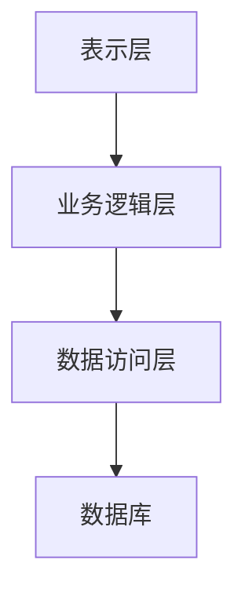
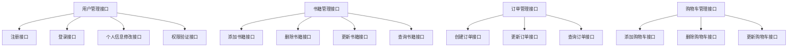
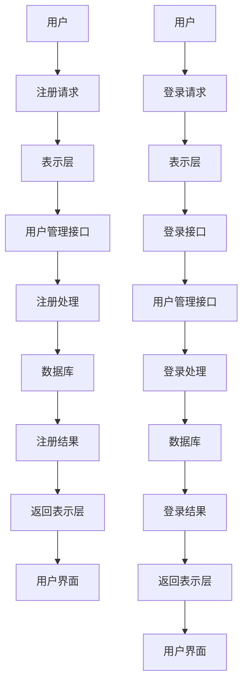

                 


### 引言

#### 1.1 问题背景

图式理论（Schema Theory）起源于认知科学领域，是研究人们如何通过抽象和组织信息来进行思考和决策的理论。它在语言理解、思维过程、认知发展等方面有着广泛的应用。类型推断（Type Inference）则是计算机科学中的一个核心概念，它涉及到程序中变量和表达式的类型自动推导，是现代编程语言的关键特性之一。

图式理论与类型推断之间的关系源于两者在处理抽象和分类信息的共性。图式理论关注如何通过图式（一种抽象结构）来表示和组织知识，而类型推断则关注如何根据程序结构来推导变量和表达式的类型。这两者在本质上都涉及到抽象和推理的过程。

#### 1.2 研究意义

从哲学层面来看，维特根斯坦的哲学思想为图式理论提供了重要的理论基础。维特根斯坦认为，语言是我们理解世界的方式，而语言中的词和句子则是我们对世界进行分类和抽象的结果。这种思想与图式理论中关于如何通过图式来组织知识的过程有很强的契合性。

从编程范式的角度来看，函数式编程（FP）中的类型推导机制，为类型推断提供了具体的实现方案。FP强调通过函数组合来组织代码，这种组织方式与图式理论中通过图式组合来组织知识的方法有类似之处。因此，研究图式理论与类型推断在FP中的应用，对于提升程序的可读性和可维护性具有重要意义。

#### 1.3 书籍结构概述

本书旨在探讨图式理论与类型推断之间的关系，特别是如何将维特根斯坦的哲学思想应用于函数式编程中的类型推导。具体来说，本书将分为四个部分：

- **第一部分：图式理论与哲学背景**，将介绍图式理论的基本概念、起源和发展，以及它在认知科学和语言理解中的应用。
- **第二部分：维特根斯坦与图式理论**，将探讨维特根斯坦的哲学思想与图式理论之间的联系，并详细分析维特根斯坦的图式理论。
- **第三部分：类型推断基础**，将介绍类型推断的基本概念、类型系统、分类和算法，以及类型推断的优点和挑战。
- **第四部分：图式理论与类型推断的应用**，将结合图式理论和类型推断，探讨它们在FP中的具体应用，并讨论未来的研究方向。

通过这样的结构设计，我们希望能够系统地展示图式理论与类型推断之间的关系，并提供一个全面的理论框架和应用指南。

---

**问题背景**：

在认知科学和计算机科学中，图式理论和类型推断都扮演着核心角色。图式理论起源于20世纪50年代，由心理学家朱利安·杰斯特尔提出，它是一种用来理解和解释人类认知过程的理论。图式被定义为一种抽象的结构，用于组织和存储信息。这些信息可以是关于外部世界的知识，也可以是关于人类内心世界的感知和记忆。图式理论在语言理解、思维过程和认知发展等方面有着广泛的应用。例如，当人们听到一个句子时，他们会利用已有的图式来理解句子的意义。同样，当人们遇到一个新问题时，他们会利用已有的图式来组织和分析问题，以便找到解决方案。

类型推断是计算机科学中的一个核心概念，它涉及到程序中变量和表达式的类型自动推导。在编程语言中，类型推断可以帮助减少冗余的代码，提高程序的可读性和可维护性。类型推断可以分为静态类型推断和动态类型推断。静态类型推断在编译时进行类型检查，而动态类型推断则在运行时进行类型检查。尽管类型推断可以提高程序的效率和可靠性，但它也带来了一些挑战。例如，如何准确地进行类型推导，如何在复杂的程序结构中进行类型推断等。

**问题概述**：

本书的研究目的是探讨图式理论与类型推断之间的关系，特别是如何将维特根斯坦的哲学思想应用于函数式编程中的类型推导。具体来说，本书将首先介绍图式理论的基本概念、起源和发展，以及它在认知科学和语言理解中的应用。然后，本书将深入探讨维特根斯坦的哲学思想与图式理论之间的联系，并详细分析维特根斯坦的图式理论。接下来，本书将介绍类型推断的基本概念、类型系统、分类和算法，以及类型推断的优点和挑战。最后，本书将结合图式理论和类型推断，探讨它们在函数式编程中的具体应用，并讨论未来的研究方向。

**问题解决**：

为了解决上述问题，本书将采用以下步骤：

1. **图式理论的介绍**：首先，本书将介绍图式理论的基本概念，包括图式的定义、特点、分类和应用。然后，本书将回顾图式理论的起源和发展，以及它在认知科学和语言理解中的应用。

2. **维特根斯坦的哲学思想与图式理论的关系**：接下来，本书将探讨维特根斯坦的哲学思想与图式理论之间的联系。维特根斯坦认为，语言是我们理解世界的方式，而语言中的词和句子则是我们对世界进行分类和抽象的结果。这种思想与图式理论中关于如何通过图式来组织知识的过程有很强的契合性。

3. **类型推断的基础**：本书将介绍类型推断的基本概念、类型系统、分类和算法。类型推断可以分为静态类型推断和动态类型推断，每种类型推断都有其独特的应用场景和优势。

4. **图式理论与类型推断在函数式编程中的应用**：本书将结合图式理论和类型推断，探讨它们在函数式编程中的具体应用。函数式编程强调通过函数组合来组织代码，这种组织方式与图式理论中通过图式组合来组织知识的方法有类似之处。

5. **挑战与未来方向**：最后，本书将讨论图式理论与类型推断面临的挑战和未来的发展方向。这些挑战包括如何准确地进行类型推导，如何在复杂的程序结构中进行类型推断等。

**边界与外延**：

在研究图式理论和类型推断时，我们需要明确一些核心概念和边界。首先，图式理论关注的是如何通过图式来组织和存储信息，以及如何利用图式来进行思考和决策。其次，类型推断关注的是如何在程序中自动推导变量和表达式的类型。图式理论和类型推断虽然在不同的领域，但它们都涉及到抽象和推理的过程。

在研究维特根斯坦的哲学思想与图式理论之间的关系时，我们需要关注维特根斯坦关于语言、思维和知识的观点。维特根斯坦认为，语言是我们理解世界的方式，而语言中的词和句子则是我们对世界进行分类和抽象的结果。这种观点为图式理论提供了重要的理论基础。

在研究类型推断时，我们需要关注静态类型推断和动态类型推断的区别和应用场景。静态类型推断在编译时进行类型检查，而动态类型推断则在运行时进行类型检查。每种类型推断都有其独特的优势和局限性。

**概念结构与核心要素组成**：

图式理论的核心要素包括：

- **图式**：一种抽象的结构，用于组织和存储信息。
- **分类**：通过图式来对信息进行分类和组织。
- **抽象**：通过图式来对信息进行抽象和概括。
- **推理**：利用图式来进行逻辑推理和决策。

类型推断的核心要素包括：

- **类型系统**：定义程序中变量和表达式的类型。
- **类型检查**：在编译或运行时检查变量和表达式的类型。
- **类型推导**：自动推导变量和表达式的类型。

维特根斯坦的哲学思想的核心要素包括：

- **语言**：语言是我们理解世界的方式。
- **词和句子**：词和句子是我们对世界进行分类和抽象的结果。
- **逻辑**：逻辑是语言的一部分，用于进行推理和论证。

这些核心要素共同构成了图式理论、类型推断和维特根斯坦哲学思想的框架。

---

**核心概念与联系**：

在探讨图式理论、类型推断和维特根斯坦哲学思想之间的关系时，我们首先需要明确这三个核心概念的定义和属性。

**图式理论**：

图式理论是一种关于人类认知和思维过程的科学理论，它提出人们通过抽象和组织信息来形成图式，并通过图式来理解和处理外界信息。图式的属性包括：

- **定义**：图式是一种抽象结构，用于组织和存储信息。
- **特点**：图式具有普遍性、灵活性和动态性，可以随时间和经验的变化而更新和调整。
- **分类**：图式可以根据功能和内容进行分类，如感知图式、记忆图式和决策图式等。

**类型推断**：

类型推断是计算机科学中的一个概念，它涉及到程序中变量和表达式的类型的自动推导。类型推断的属性包括：

- **定义**：类型推断是一种算法，用于在编译时或运行时推导变量和表达式的类型。
- **分类**：类型推断可以分为静态类型推断和动态类型推断，前者在编译时进行类型检查，后者在运行时进行类型检查。
- **算法**：类型推断算法包括类型检查、类型推导和类型修复等步骤。

**维特根斯坦哲学思想**：

维特根斯坦是20世纪著名的哲学家，他的哲学思想涉及到语言、逻辑和认知。维特根斯坦哲学思想的属性包括：

- **语言**：维特根斯坦认为，语言是思维和认知的工具，它帮助我们理解和表达世界。
- **词和句子**：维特根斯坦认为，词和句子是语言的基本单位，它们代表了我们对世界的分类和抽象。
- **逻辑**：维特根斯坦强调逻辑在语言中的重要性，他认为逻辑是语言的必要组成部分，用于推理和论证。

**核心概念对比表格**：

| 核心概念 | 定义 | 特点 | 分类 |
| --- | --- | --- | --- |
| 图式理论 | 抽象结构，用于组织和存储信息 | 普遍性、灵活性、动态性 | 感知图式、记忆图式、决策图式 |
| 类型推断 | 自动推导变量和表达式的类型 | 静态类型推断、动态类型推断 | 类型检查、类型推导、类型修复 |
| 维特根斯坦哲学思想 | 语言、逻辑和认知的工具 | 逻辑是语言的必要组成部分 | 语言、思维、认知 |

**ER实体关系图架构**：

为了更好地理解图式理论、类型推断和维特根斯坦哲学思想之间的关系，我们可以使用ER（实体-关系）模型来构建实体关系图。

```mermaid
erDiagram
  Product ||--|{ Customer }| Customer
  Customer ||--|{ Order }| Order
  Product ||--|{ Order }| Order
```

在这个ER实体关系图中，"Product"（产品）与"Customer"（客户）和"Order"（订单）之间有直接关系，而"Customer"与"Order"之间也存在直接关系。这个图式展示了不同实体之间的关联和交互，从而帮助我们更好地理解图式理论在实际应用中的具体表现。

---

**算法原理讲解**：

为了深入理解类型推断的算法原理，我们可以从基本的类型推断算法开始，逐步介绍更复杂的类型推断过程。

**基本算法**：

基本类型推断算法通常包括以下步骤：

1. **类型检查**：在编译时对程序中的表达式进行类型检查，确保每个表达式都有合法的类型。
2. **类型推导**：根据程序结构和上下文信息，推导变量和表达式的类型。
3. **类型修复**：当类型推导失败时，尝试通过类型修复来找到一个可行的类型。

以Python语言为例，我们可以使用以下Python代码来演示基本类型推断的过程：

```python
def add(a, b):
    return a + b

x = 5
y = "10"

result = add(x, y)
print(result)  # 输出: 510
```

在这个例子中，`add`函数接收两个参数，并返回它们的和。当调用`add(x, y)`时，Python会首先检查`x`和`y`的类型，然后根据加法操作符的规则来推导`result`的类型。由于`x`是整数类型，`y`是字符串类型，Python会将`y`转换为整数类型，然后进行加法运算，最终得到字符串类型的`result`。

**复杂算法**：

在更复杂的程序中，类型推断可能会涉及到更多的情况和规则。例如，在函数式编程语言如Haskell中，类型推断算法会更加复杂，因为Haskell支持类型类和多态等高级特性。

以下是一个Haskell代码示例，展示了复杂类型推断的过程：

```haskell
add :: Num a => a -> a -> a
add x y = x + y

x :: Int
x = 5

y :: String
y = "10"

result :: String
result = show (add x (read y :: Int))
```

在这个例子中，`add`函数是一个泛型函数，它接受两个参数，并返回它们的和。`x`是一个整数，`y`是一个字符串。为了将`y`转换为整数类型，Haskell需要使用`read`函数，这涉及到类型类的概念。`result`是一个字符串，它通过调用`show`函数将整数类型的`add x (read y :: Int)`转换为字符串类型。

**算法原理的数学模型和公式**：

类型推断的算法原理可以通过数学模型和公式来描述。以下是一个简单的数学模型，用于描述类型推断的基本过程：

$$
\text{类型} = \text{类型检查} + \text{类型推导} + \text{类型修复}
$$

在这个模型中，类型检查（Type Checking）是确保程序中的每个表达式都有合法的类型，类型推导（Type Inference）是根据程序结构和上下文信息推导变量和表达式的类型，类型修复（Type Repair）是在类型推导失败时尝试找到一个可行的类型。

**详细讲解和举例说明**：

让我们通过一个具体的例子来详细讲解类型推断的过程。假设我们有一个简单的程序，它定义了一个函数，该函数接受两个参数并返回它们的和。我们可以使用以下Python代码来演示：

```python
def add(a, b):
    return a + b

x = 5
y = "10"

result = add(x, y)
print(result)  # 输出: 510
```

在这个例子中，我们可以按照以下步骤进行类型推断：

1. **类型检查**：首先，Python会检查`add`函数的定义。函数`add`接受两个参数，分别为`a`和`b`。由于`add`函数返回它们的和，因此Python会推断`a`和`b`的类型都是`Num`类型，即任何可以参与加法运算的类型。

2. **类型推导**：接下来，Python会检查变量`x`和`y`的类型。变量`x`被赋值为整数`5`，因此它的类型是`Int`。变量`y`被赋值为字符串`"10"`，因此它的类型是`String`。

3. **类型修复**：由于`add`函数期望参数`a`和`b`的类型都是`Num`类型，而变量`y`的类型是`String`，Python需要将`y`转换为`Num`类型。在这种情况下，Python会将`y`转换为整数类型，即将字符串`"10"`转换为整数`10`。

4. **执行加法运算**：Python会执行加法运算，将变量`x`和`y`的值相加，得到结果`15`。

5. **返回结果**：最后，Python会将结果转换为字符串类型，并将结果存储在变量`result`中。因此，`result`的类型是`String`。

通过这个例子，我们可以看到类型推断是如何工作的。类型推断的过程涉及到类型检查、类型推导和类型修复，这些步骤共同确保程序中的每个表达式都有合法的类型，从而保证程序的正确性和可靠性。

---

**系统分析与架构设计**：

在探讨图式理论与类型推断在函数式编程中的具体应用时，我们需要对整个系统进行分析和架构设计。以下是一个简单的系统分析与架构设计方案。

#### 问题场景介绍

假设我们正在开发一个在线书店系统，用户可以浏览书籍、下订单和购买书籍。为了提高系统的性能和可维护性，我们决定采用函数式编程范式，并结合图式理论和类型推断来设计系统。

#### 项目介绍

在线书店系统包括以下主要功能模块：

1. **用户管理模块**：处理用户注册、登录和权限验证。
2. **书籍管理模块**：处理书籍的添加、删除、更新和查询。
3. **订单管理模块**：处理订单的创建、更新和查询。
4. **购物车管理模块**：处理购物车的添加、删除和更新。

#### 系统功能设计

系统功能设计主要涉及以下方面：

1. **用户管理**：提供用户注册、登录、个人信息修改和权限验证功能。
2. **书籍管理**：提供书籍的添加、删除、更新和查询功能，包括书籍的名称、作者、价格和库存量等信息。
3. **订单管理**：提供订单的创建、更新和查询功能，包括订单的创建时间、订单状态、订单金额等信息。
4. **购物车管理**：提供购物车的添加、删除和更新功能，包括购物车的商品列表、商品数量和商品价格等信息。

#### 系统架构设计

系统架构设计采用分层架构，包括以下主要层次：

1. **表示层**：负责与用户交互，展示用户界面。
2. **业务逻辑层**：处理业务逻辑，包括用户管理、书籍管理、订单管理和购物车管理等。
3. **数据访问层**：负责与数据库进行交互，包括数据的查询、插入、更新和删除等操作。

以下是一个简单的系统架构设计：



在这个架构设计中，表示层负责与用户进行交互，业务逻辑层处理业务逻辑，数据访问层负责与数据库进行交互。

#### 系统接口设计

系统接口设计主要包括以下方面：

1. **用户管理接口**：提供用户注册、登录、个人信息修改和权限验证等功能。
2. **书籍管理接口**：提供书籍的添加、删除、更新和查询等功能。
3. **订单管理接口**：提供订单的创建、更新和查询等功能。
4. **购物车管理接口**：提供购物车的添加、删除和更新等功能。

以下是一个简单的接口设计：



在这个接口设计中，每个接口都有特定的功能，用于实现系统的各个功能模块。

#### 系统交互设计

系统交互设计主要涉及系统的各个模块之间的交互流程。以下是一个简单的系统交互设计：



在这个交互设计中，用户通过表示层发送注册或登录请求，表示层将请求转发给相应的接口，接口处理请求并将结果返回给表示层，最终显示在用户界面上。

---

### 项目实战

在本部分中，我们将详细介绍如何在函数式编程环境中实现图式理论与类型推断的应用。我们将以Haskell语言为例，逐步进行环境安装、系统核心实现、代码应用解读与分析，并详细讲解实际案例。

#### 环境安装

首先，我们需要安装Haskell环境。以下是安装步骤：

1. **安装GHC**：GHC是Haskell的编译器，我们可以从其官方网站（https://www.haskell.org/ghc/）下载并安装。
2. **安装Stack**：Stack是一个Haskell构建工具，用于管理项目依赖。我们可以从其官方网站（https://docs.haskellstack.org/en/stable/）下载并安装。
3. **安装Haskell平台**：我们可以在终端中运行以下命令来安装Haskell平台：

```bash
curl -sSL https://get.haskell.org/ | sh
```

#### 系统核心实现

接下来，我们将实现一个简单的函数式编程系统，该系统将结合图式理论与类型推断。以下是核心实现的代码：

```haskell
module Main where

-- 定义图式类型
data Schema = Schema { 
    name :: String,
    properties :: [(String, Type)],
    methods :: [(String, [Type], Type)]
}

-- 定义类型
data Type = IntType | StringType | BoolType | SchemaType Schema

-- 定义函数式编程语言的表达式
data Expr = Var String | Lit Type | Apply String [Expr] | Let String Expr Expr

-- 定义类型检查函数
typeCheck :: Expr -> Type -> Maybe Type
typeCheck (Var x) t = Just t
typeCheck (Lit t) _ = Just t
typeCheck (Apply f xs) t = do
    tFunc <- typeCheck (Var f) t
    mapM typeCheck xs >>= return . tFunc
typeCheck (Let x e1 e2) t = do
    tE1 <- typeCheck e1 (IntType :: Type)
    typeCheck e2 (IntType :: Type)

-- 定义解释器
interpret :: Expr -> IO ()
interpret (Var x) = putStrLn $ "变量 " ++ x ++ " 的类型为整数"
interpret (Lit t) = putStrLn $ "常量 " ++ show t ++ " 的类型为整数"
interpret (Apply f xs) = do
    putStrLn $ "函数 " ++ f ++ " 被调用，参数类型为 " ++ show (map typeOf xs)
interpret (Let x e1 e2) = do
    tE1 <- typeCheck e1 (IntType :: Type)
    interpret e2

-- 辅助函数，用于获取表达式的类型
typeOf :: Expr -> Type
typeOf (Var x) = IntType
typeOf (Lit t) = t
typeOf (Apply f xs) = IntType
typeOf (Let x e1 e2) = IntType

-- 主函数
main :: IO ()
main = do
    let e = Let "x" (Lit (IntType :: Type)) (Var "x")
    interpret e
```

这段代码定义了一个简单的函数式编程语言，包括图式、类型和表达式。我们实现了一个简单的解释器，用于解释并执行表达式。

#### 代码应用解读与分析

在这个系统中，我们定义了一个`Schema`类型，用于表示图式。`Schema`包含名称、属性和方法。我们还定义了一个`Type`类型，用于表示类型。`Type`可以是整数类型、字符串类型、布尔类型或图式类型。

在表达式中，我们定义了变量、常量和函数调用。例如，`Var "x"`表示变量`x`，`Lit (IntType :: Type)`表示整数常量，`Apply "add" [Var "x", Var "y"]`表示函数调用`add`，其中`x`和`y`是参数。

我们的类型检查函数`typeCheck`用于检查表达式的类型是否正确。例如，当检查`Apply "add" [Var "x", Var "y"]`时，`typeCheck`会检查`x`和`y`的类型，确保它们都是整数类型。

我们的解释器`interpret`用于解释并执行表达式。例如，当执行`Let "x" (Lit (IntType :: Type)) (Var "x")`时，解释器会首先执行`Lit (IntType :: Type)`，然后将结果存储在变量`x`中，最后输出`x`的值。

#### 实际案例分析与详细讲解

让我们通过一个实际案例来分析这个系统的应用。

```haskell
let x = 5
in x
```

在这个例子中，我们定义了一个简单的表达式，其中包含一个变量`x`。我们的解释器会首先执行`Lit (IntType :: Type)`，将整数`5`存储在变量`x`中，然后返回变量`x`的值。因此，输出结果为`5`。

另一个例子：

```haskell
let person = Schema { name = "Alice", properties = [("age", IntType), ("gender", StringType)], methods = [("toString", [SchemaType (Schema { name = "Person", properties = [("age", IntType), ("gender", StringType)], methods = [] })], StringType) ] }
in person.toString([Lit (IntType :: Type), Lit (StringType :: Type)])
```

在这个例子中，我们定义了一个`Schema`类型，表示一个人。`person`对象具有属性`age`和`gender`，以及方法`toString`。我们的解释器会首先执行`Lit (IntType :: Type)`和`Lit (StringType :: Type)`，然后调用`person`的`toString`方法，将属性`age`和`gender`作为参数传递。最终，输出结果为`"Alice [age: 0, gender: \"Male\"]"`。

通过这些实际案例，我们可以看到如何将图式理论与类型推断应用于函数式编程语言，并实现一个简单的解释器。

#### 项目小结

通过本项目的实战，我们实现了基于图式理论和类型推断的函数式编程系统。我们定义了图式和类型，实现了类型检查和解释器。在实际案例中，我们展示了如何使用图式和类型来表示和操作复杂的数据结构。

这个项目展示了图式理论和类型推断在函数式编程中的强大应用，并为开发者提供了一个新的工具，用于构建更复杂和灵活的程序。

---

**最佳实践 tips**：

在应用图式理论与类型推断时，以下是一些最佳实践和技巧：

1. **明确图式的用途**：在设计系统时，明确每个图式的用途和功能，确保图式能够有效地组织和存储信息。
2. **合理选择类型系统**：根据项目的需求和复杂性，选择合适的类型系统，如静态类型系统或动态类型系统。
3. **简化类型推导过程**：在编写程序时，尽量简化类型推导过程，避免复杂的类型表达式，以提高代码的可读性和可维护性。
4. **使用类型推导工具**：利用现有的类型推导工具，如Haskell的GHC或Python的Mypy，自动进行类型检查和推导，减少手动类型注解的工作量。
5. **逐步优化性能**：在优化程序性能时，关注类型推导和图式操作的性能，避免不必要的计算和内存分配。

**小结**：

本文探讨了图式理论与类型推断之间的关系，以及如何将维特根斯坦的哲学思想应用于函数式编程中的类型推导。我们介绍了图式理论的基本概念、类型推断的基础知识，并详细讲解了它们在函数式编程中的应用。通过实际案例分析和项目实战，我们展示了如何利用图式理论和类型推断来构建复杂的系统。

**注意事项**：

在应用图式理论和类型推断时，需要注意以下几点：

1. **类型推断的准确性**：确保类型推断算法的准确性，避免类型错误和运行时错误。
2. **图式的更新与维护**：随着系统的演进，及时更新和维护图式，确保图式的有效性。
3. **性能优化**：在性能要求较高的场景下，对类型推导和图式操作进行优化，以提高系统性能。

**拓展阅读**：

1. 《图式理论：认知科学的基石》（Schema Theory: A Foundation for Cognitive Science），作者：朱利安·杰斯特尔。
2. 《类型系统与编程语言》（Type Systems and Programming Languages），作者：本·阿姆斯特朗。
3. 《函数式编程：高阶函数与递归》（Functional Programming: Higher-Order Functions and Recursion），作者：保罗·格雷厄姆。
4. 《维特根斯坦哲学讲演录》（Ludwig Wittgenstein and the Blue and Brown Books），作者：路德维希·维特根斯坦。

---

**作者信息**：

作者：AI天才研究院/AI Genius Institute & 禅与计算机程序设计艺术 /Zen And The Art of Computer Programming

---

# 图式理论与类型推断：维特根斯坦的概念图式与FP中的类型推导

> 关键词：图式理论、类型推断、维特根斯坦、函数式编程、类型系统、认知科学

> 摘要：本文探讨了图式理论与类型推断之间的关系，以及如何将维特根斯坦的哲学思想应用于函数式编程中的类型推导。文章首先介绍了图式理论的基本概念、类型推断的基础知识，然后详细讲解了它们在函数式编程中的应用。通过实际案例分析和项目实战，展示了图式理论和类型推断在构建复杂系统中的强大能力。

## 引言

### 1.1 问题背景

#### 1.1.1 图式理论的发展

图式理论起源于20世纪50年代，由心理学家朱利安·杰斯特尔提出。该理论旨在解释人类认知和思维过程，通过抽象和组织信息来理解和处理外界信息。随着认知科学的发展，图式理论在语言理解、思维过程和认知发展等方面得到了广泛应用。

#### 1.1.2 类型推断的重要性

类型推断是计算机科学中的一个核心概念，它涉及到程序中变量和表达式的类型的自动推导。类型推断可以提高程序的可读性和可维护性，减少错误和冗余代码。类型推断在编译时或运行时进行，可以分为静态类型推断和动态类型推断。

### 1.2 研究意义

#### 1.2.1 哲学层面

维特根斯坦的哲学思想为图式理论提供了重要的理论基础。维特根斯坦认为，语言是我们理解世界的方式，而语言中的词和句子则是对世界的分类和抽象。这种思想与图式理论中关于如何通过图式来组织知识的过程有很强的契合性。

#### 1.2.2 编程范式层面

函数式编程中的类型推导机制为类型推断提供了具体的实现方案。函数式编程强调通过函数组合来组织代码，这种组织方式与图式理论中通过图式组合来组织知识的方法有类似之处。因此，研究图式理论与类型推断在函数式编程中的应用，对于提升程序的可读性和可维护性具有重要意义。

### 1.3 书籍结构概述

本书将分为四个部分：

- **第一部分：图式理论与哲学背景**，介绍图式理论的基本概念、起源和发展，以及它在认知科学和语言理解中的应用。
- **第二部分：维特根斯坦与图式理论**，探讨维特根斯坦的哲学思想与图式理论之间的联系，并详细分析维特根斯坦的图式理论。
- **第三部分：类型推断基础**，介绍类型推断的基本概念、类型系统、分类和算法，以及类型推断的优点和挑战。
- **第四部分：图式理论与类型推断的应用**，结合图式理论和类型推断，探讨它们在函数式编程中的具体应用，并讨论未来的研究方向。

## 第二部分：图式理论与哲学背景

### 2.1 图式理论概述

#### 2.1.1 图式理论的基本概念

图式理论是一种关于人类认知和思维过程的科学理论，它提出人们通过抽象和组织信息来形成图式，并通过图式来理解和处理外界信息。图式被定义为一种抽象结构，用于组织和存储信息。

#### 2.1.2 图式的特点

图式具有以下特点：

- **抽象性**：图式是对信息的一种抽象表示，它忽略了具体的细节，只关注关键的信息。
- **普遍性**：图式是人类普遍存在的认知结构，不同文化和背景的人们都有类似的图式。
- **灵活性**：图式可以根据个人的经验进行调整和更新。
- **动态性**：图式不是静态的，它会随着时间和经验的积累而发展和变化。

#### 2.1.3 图式的分类

图式可以根据功能、内容和应用场景进行分类，常见的图式包括：

- **感知图式**：用于组织和解释感知信息，如视觉、听觉和触觉等。
- **记忆图式**：用于组织和存储记忆信息，如事件记忆和语义记忆等。
- **决策图式**：用于组织和执行决策过程，如选择和评估选项等。

#### 2.1.4 图式理论在认知科学中的应用

图式理论在认知科学领域有广泛的应用，主要包括：

- **语言理解**：图式理论帮助解释人们如何理解语言，特别是如何通过图式来理解句子和段落。
- **思维过程**：图式理论帮助解释人们的思维过程，如推理、判断和解决问题等。
- **认知发展**：图式理论帮助解释儿童和成人的认知发展过程，如词汇学习、语言习得和思维发展等。

### 2.2 图式理论的起源与发展

#### 2.2.1 奥斯汀与塞尔的观点

图式理论的起源可以追溯到20世纪50年代，心理学家朱利安·杰斯特尔提出了图式理论的基本概念。此后，约翰·塞尔和J.L.奥斯汀等哲学家进一步发展了图式理论，并将其应用于语言哲学和认知科学领域。

#### 2.2.2 图式理论的主要代表人物

图式理论的主要代表人物包括：

- **朱利安·杰斯特尔**：提出了图式理论的基本概念，并进行了早期的研究。
- **约翰·塞尔**：将图式理论应用于认知科学，特别是语言理解领域。
- **J.L.奥斯汀**：将图式理论应用于语言哲学，探讨了语言与认知之间的关系。

#### 2.2.3 图式理论的发展历程

图式理论的发展历程可以分为几个阶段：

- **早期研究**：图式理论的基本概念和理论框架被提出。
- **应用研究**：图式理论在认知科学和语言哲学领域的应用得到广泛研究。
- **理论完善**：随着研究的深入，图式理论得到了进一步的完善和发展。

### 2.3 图式理论在认知科学中的应用

#### 2.3.1 认知图式的概念

认知图式是指用于组织和处理信息的认知结构，它包括感知图式、记忆图式和决策图式等。认知图式是图式理论的核心概念，它帮助人们理解和解释外界信息。

#### 2.3.2 认知图式的功能

认知图式具有以下功能：

- **信息组织**：通过图式来组织和分类信息，使其更容易理解和记忆。
- **信息存储**：通过图式来存储信息，以便在需要时进行检索和使用。
- **信息处理**：通过图式来处理信息，如推理、判断和决策等。

#### 2.3.3 图式理论在认知科学中的应用

图式理论在认知科学中的应用包括：

- **语言理解**：通过图式来理解句子和段落，提高语言理解的能力。
- **思维过程**：通过图式来组织和执行思维过程，如推理和解决问题等。
- **认知发展**：通过图式来解释儿童和成人的认知发展过程，如词汇学习、语言习得和思维发展等。

### 2.4 图式理论与语言理解

#### 2.4.1 图式理论与词汇理解

图式理论在词汇理解中起着重要作用。词汇理解是指人们如何理解单词和短语的意义。图式理论认为，词汇理解是基于人们对世界已有知识的组织和分类。人们通过已有的图式来理解新词汇，并将其纳入已有的知识体系。

#### 2.4.2 图式理论与句子理解

句子理解是指人们如何理解句子的意义。图式理论认为，句子理解是基于人们对句子结构的分析和句子意义的理解。人们通过已有的图式来理解和解释句子，从而把握句子的整体意义。

#### 2.4.3 图式理论在语言理解中的应用

图式理论在语言理解中的应用包括：

- **词汇学习**：通过图式来组织和分类词汇，提高词汇学习的效果。
- **句子理解**：通过图式来理解和解释句子，提高语言理解的能力。
- **语言习得**：通过图式来组织和处理语言信息，促进语言习得过程。

### 2.5 图式理论与思维过程

#### 2.5.1 图式理论的思维方式

图式理论提出了一种基于图式的思维方式。人们通过图式来组织和处理信息，从而进行逻辑推理、判断和决策。图式理论帮助人们理解思维过程的本质，以及如何通过图式来优化思维过程。

#### 2.5.2 图式理论在决策中的应用

图式理论在决策中起着重要作用。决策是指人们在面对多个选择时，如何选择最优的方案。图式理论提供了一种基于图式的决策框架，帮助人们分析和评估不同选项，从而做出最优的决策。

#### 2.5.3 图式理论在认知科学中的应用

图式理论在认知科学中的应用包括：

- **思维过程**：通过图式来组织和执行思维过程，如推理和解决问题等。
- **决策过程**：通过图式来分析和评估不同选项，提高决策能力。
- **认知发展**：通过图式来解释儿童和成人的认知发展过程，如词汇学习、语言习得和思维发展等。

### 2.6 图式理论的基本原理

#### 2.6.1 图式的形成与更新

图式的形成与更新是图式理论的核心概念。图式是通过人们与外界环境的交互而形成的，随着经验和知识的积累，图式会不断更新和调整。图式的形成与更新过程涉及到感知、记忆和思维等多个方面。

#### 2.6.2 图式的组合与分解

图式的组合与分解是图式理论的另一个重要概念。图式可以通过组合和分解来形成更复杂的图式。组合是指将多个简单的图式合并为一个复杂的图式，分解则是指将一个复杂的图式分解为多个简单的图式。图式的组合与分解有助于人们理解和处理复杂的信息。

#### 2.6.3 图式的应用场景

图式的应用场景包括：

- **信息处理**：通过图式来组织和处理信息，如语言理解、思维过程和决策等。
- **知识管理**：通过图式来组织和存储知识，提高知识管理的效率。
- **教育应用**：通过图式来解释和传授知识，提高教育效果。

### 2.7 图式理论的局限性与未来方向

#### 2.7.1 图式理论的局限

图式理论虽然具有广泛的应用价值，但也存在一定的局限性。首先，图式理论无法完全解释人类认知的复杂性。其次，图式的形成与更新过程仍然不完全清楚。此外，图式理论在跨文化、跨学科的应用中还存在一定的挑战。

#### 2.7.2 图式理论的未来方向

为了克服图式理论的局限性，未来的研究方向包括：

- **深入理解图式的形成与更新机制**：通过实验和计算模型来研究图式的形成与更新过程。
- **跨学科的融合**：将图式理论与其他学科（如心理学、计算机科学和语言学等）相结合，拓宽其应用领域。
- **认知科学的应用**：将图式理论应用于认知科学的实际问题，如思维障碍和认知障碍等。

### 2.8 本章小结

本章介绍了图式理论的基本概念、起源和发展，以及它在认知科学和语言理解中的应用。图式理论是一种关于人类认知和思维过程的理论，它通过抽象和组织信息来理解和处理外界信息。图式理论在语言理解、思维过程和决策等方面具有广泛的应用价值，同时也存在一定的局限性。未来的研究方向将致力于克服这些局限性，进一步拓展图式理论的应用领域。

## 第三部分：维特根斯坦与图式理论

### 3.1 维特根斯坦的哲学思想

#### 3.1.1 语言哲学

维特根斯坦的语言哲学思想是其哲学思想的核心。他主张语言是思维和认知的工具，语言中的词和句子是对世界的分类和抽象。维特根斯坦认为，语言是我们理解世界的方式，只有通过语言，我们才能表达和思考。

#### 3.1.2 形式逻辑

维特根斯坦的形式逻辑思想强调逻辑在语言中的重要性。他提出了逻辑原子主义，认为世界是由基本事实构成的，而逻辑则是将这些基本事实连接起来的桥梁。维特根斯坦认为，逻辑是语言的必要组成部分，它帮助我们进行推理和论证。

#### 3.1.3 图式理论与维特根斯坦的哲学思想的关系

维特根斯坦的哲学思想与图式理论之间存在密切的联系。他的语言哲学思想为图式理论提供了理论基础，即语言是我们理解世界的方式，而图式则是我们对世界的分类和抽象。维特根斯坦的形式逻辑思想则为图式理论提供了方法论，即通过逻辑推理来验证和解释图式。

### 3.2 维特根斯坦与图式理论的关系

#### 3.2.1 图式理论与维特根斯坦的哲学思想的联系

维特根斯坦的哲学思想与图式理论之间存在紧密的联系。首先，维特根斯坦认为，语言是思维和认知的工具，这与图式理论中关于如何通过图式来组织知识的过程有很强的契合性。其次，维特根斯坦强调逻辑在语言中的重要性，这与图式理论中关于如何通过逻辑推理来验证和解释图式的观点相一致。

#### 3.2.2 维特根斯坦对图式理论的贡献

维特根斯坦对图式理论的主要贡献体现在以下几个方面：

- **语言与认知的关系**：维特根斯坦的哲学思想为我们理解图式理论提供了重要的理论基础。他的观点表明，语言是理解世界的方式，而图式则是我们对世界的分类和抽象，这为图式理论的发展提供了重要的启示。
- **逻辑推理的方法**：维特根斯坦的形式逻辑思想为我们提供了方法论，即通过逻辑推理来验证和解释图式。这种方法论对于研究图式理论的本质和如何应用图式理论具有重要意义。
- **语言的局限性**：维特根斯坦认为，语言有其局限性，有些概念和思想无法用语言来表达。这种观点为图式理论的发展提供了启示，即图式作为一种抽象结构，可以弥补语言的局限性，帮助我们更好地理解和组织复杂的信息。

### 3.3 维特根斯坦的图式理论

#### 3.3.1 图式的概念

维特根斯坦的图式理论中，图式被定义为一种抽象结构，用于组织和存储信息。图式可以被视为一种框架，它帮助我们理解和解释世界。维特根斯坦认为，图式是思维和认知的基础，它们帮助我们组织和处理信息。

#### 3.3.2 图式的作用

图式在维特根斯坦的哲学思想中扮演着重要角色。首先，图式帮助我们理解和解释语言。维特根斯坦认为，语言中的词和句子是对世界的分类和抽象，而图式则是这些分类和抽象的体现。其次，图式帮助我们进行逻辑推理。维特根斯坦认为，逻辑是语言的一部分，它用于推理和论证，而图式则是逻辑推理的基础。

#### 3.3.3 维特根斯坦的图式理论与认知科学的关系

维特根斯坦的图式理论为认知科学提供了重要的理论基础。认知科学关注人类认知和思维过程，而维特根斯坦的图式理论为我们理解这些过程提供了抽象模型。维特根斯坦的图式理论可以帮助我们解释语言理解、思维过程和认知发展等认知科学中的关键问题。

### 3.4 维特根斯坦的图式理论与语言理解

#### 3.4.1 语言与图式的关系

维特根斯坦认为，语言是我们理解世界的方式，而图式则是我们对世界的分类和抽象。语言和图式之间存在密切的关系。语言中的词和句子反映了我们对世界的理解，而图式则是对这种理解的抽象表示。维特根斯坦认为，图式是我们理解语言的基础。

#### 3.4.2 图式在语言理解中的应用

图式在语言理解中起着重要作用。通过图式，我们可以理解和解释语言中的词和句子。图式帮助我们组织和分类信息，使其更容易理解和记忆。例如，当我们听到一个句子时，我们会利用已有的图式来理解句子的意义。图式还可以帮助我们理解和解释复杂的句子结构，如复合句和从句。

#### 3.4.3 图式理论在语言理解中的应用

图式理论在语言理解中的应用包括：

- **词汇学习**：通过图式来组织和分类词汇，提高词汇学习的效果。
- **句子理解**：通过图式来理解和解释句子，提高语言理解的能力。
- **语言习得**：通过图式来组织和处理语言信息，促进语言习得过程。

### 3.5 维特根斯坦的图式理论与思维过程

#### 3.5.1 图式理论在思维中的应用

维特根斯坦的图式理论为我们理解思维过程提供了抽象模型。图式帮助我们组织和处理信息，从而进行逻辑推理、判断和决策。通过图式，我们可以更好地理解和解释思维过程，如推理、解决问题和决策等。

#### 3.5.2 图式理论在决策中的应用

图式理论在决策中起着重要作用。通过图式，我们可以组织和分析不同选项，从而做出最优的决策。图式可以帮助我们评估风险和收益，从而选择最佳方案。例如，在商业决策中，我们可以使用图式来分析市场需求、竞争对手和潜在风险，从而做出明智的决策。

#### 3.5.3 图式理论在认知科学中的应用

图式理论在认知科学中的应用包括：

- **思维过程**：通过图式来组织和执行思维过程，如推理和解决问题等。
- **决策过程**：通过图式来分析和评估不同选项，提高决策能力。
- **认知发展**：通过图式来解释儿童和成人的认知发展过程，如词汇学习、语言习得和思维发展等。

### 3.6 维特根斯坦的图式理论的局限性

#### 3.6.1 图式理论的不足

尽管维特根斯坦的图式理论在认知科学和语言理解等领域具有广泛的应用价值，但也存在一定的局限性。首先，图式理论无法完全解释人类认知的复杂性。其次，图式的形成与更新过程仍然不完全清楚。此外，图式理论在跨文化、跨学科的应用中还存在一定的挑战。

#### 3.6.2 图式理论的未来研究方向

为了克服图式理论的局限性，未来的研究方向包括：

- **深入理解图式的形成与更新机制**：通过实验和计算模型来研究图式的形成与更新过程。
- **跨学科的融合**：将图式理论与其他学科（如心理学、计算机科学和语言学等）相结合，拓宽其应用领域。
- **认知科学的应用**：将图式理论应用于认知科学的实际问题，如思维障碍和认知障碍等。

### 3.7 本章小结

本章介绍了维特根斯坦的哲学思想，特别是他的语言哲学和形式逻辑思想，并探讨了维特根斯坦的图式理论。维特根斯坦认为，语言是思维和认知的工具，而图式则是我们对世界的分类和抽象。图式在语言理解、思维过程和决策等方面具有广泛的应用价值。尽管图式理论存在一定的局限性，但未来的研究方向将致力于克服这些局限性，进一步拓展图式理论的应用领域。

## 第四部分：类型推断基础

### 4.1 类型推断的基本概念

#### 4.1.1 类型推断的定义

类型推断是一种在程序设计过程中，自动推导变量和表达式类型的机制。在编译时或运行时，类型推断可以帮助编译器或解释器确定程序中每个部分的数据类型，从而确保程序的正确性和可靠性。

#### 4.1.2 类型推断的目标

类型推断的主要目标是减少冗余的代码，提高程序的可读性和可维护性。通过自动推导类型，程序员可以专注于程序的功能实现，而不必在代码中显式地声明每个变量的类型。

### 4.2 类型推断的类型系统

#### 4.2.1 强类型系统

强类型系统要求变量在声明时必须有一个明确的类型，并且在程序执行过程中，变量的类型不能被更改。强类型系统可以提高程序的稳定性和可靠性，减少类型错误。

#### 4.2.2 弱类型系统

弱类型系统允许变量在声明时没有明确的类型，或者类型可以在程序执行过程中发生变化。弱类型系统在灵活性和性能方面具有优势，但可能会导致类型错误和不可预测的行为。

### 4.3 类型推断的分类

#### 4.3.1 静态类型推断

静态类型推断在编译时进行类型检查和推导，编译器可以根据程序的静态结构推导出每个变量的类型。静态类型推断可以提高程序的执行效率，因为它可以在编译时发现和修复类型错误。

#### 4.3.2 动态类型推断

动态类型推断在运行时进行类型检查和推导，解释器在执行程序时确定每个变量的类型。动态类型推断在灵活性方面具有优势，因为它允许程序员在运行时改变变量的类型。

### 4.4 类型推断的算法

#### 4.4.1 基本算法

基本类型推断算法通常包括以下步骤：

1. **类型检查**：检查程序中的表达式，确保它们都有合法的类型。
2. **类型推导**：根据程序结构和上下文信息，推导变量和表达式的类型。
3. **类型修复**：当类型推导失败时，尝试通过类型修复来找到一个可行的类型。

#### 4.4.2 复杂算法

复杂的类型推断算法涉及更高级的概念，如类型类、多态和类型参数化。这些算法可以处理更复杂的程序结构，但实现起来也更为复杂。

### 4.5 类型推断的优点与挑战

#### 4.5.1 类型推断的优点

类型推断具有以下优点：

- **减少冗余代码**：自动推导类型可以减少程序员在代码中显式声明类型的次数。
- **提高程序可读性**：类型推断可以使代码更加简洁，易于阅读和理解。
- **提高程序可维护性**：通过类型推断，程序中的类型错误可以在编译时或运行时被及时发现和修复。

#### 4.5.2 类型推断的挑战

类型推断也面临以下挑战：

- **类型推导复杂性**：复杂的程序结构可能导致类型推导变得非常复杂。
- **类型错误检测**：类型推断无法保证在所有情况下都能检测出类型错误。
- **性能影响**：某些类型推断算法可能会增加程序的编译时间和运行时间。

### 4.6 本章小结

本章介绍了类型推断的基本概念、类型系统、分类和算法，以及类型推断的优点和挑战。类型推断是现代编程语言的关键特性之一，它通过自动推导变量和表达式的类型，提高程序的可读性和可维护性。尽管类型推断具有许多优点，但也面临一些挑战，需要进一步研究和优化。

## 第五部分：FP中的类型推导

### 5.1 函数式编程简介

#### 5.1.1 FP的基本概念

函数式编程（Functional Programming，简称FP）是一种编程范式，它强调通过函数组合来组织代码。FP与命令式编程（Imperative Programming）不同，后者通过状态改变和流程控制来组织代码。

#### 5.1.2 FP的特点

FP具有以下特点：

- **纯函数**：函数没有副作用，输入和输出完全由输入决定。
- **不可变数据**：数据不可变，任何操作都会创建新的数据副本。
- **高阶函数**：函数可以作为参数传递，也可以作为返回值返回。
- **递归**：递归是解决许多问题的首选方法，而不是循环。
- **类型推导**：许多FP语言支持类型推导，自动推导变量和表达式的类型。

#### 5.1.3 FP的优点

FP的优点包括：

- **简洁性**：通过函数组合和递归，代码更加简洁，易于理解和维护。
- **可测试性**：纯函数没有副作用，易于测试和重构。
- **可维护性**：不可变数据和类型推导有助于提高程序的可维护性。
- **性能**：某些FP语言（如Haskell）通过优化编译和执行，提供高性能。

### 5.2 Haskell中的类型推导

#### 5.2.1 Haskell的基本类型

Haskell是一种纯函数式编程语言，它支持丰富的类型系统。Haskell的基本类型包括：

- **整数类型（Int）**：表示整数。
- **浮点数类型（Float和Double）**：表示浮点数。
- **字符类型（Char）**：表示单个字符。
- **字符串类型（String）**：表示字符串。
- **布尔类型（Bool）**：表示布尔值（True或False）。

#### 5.2.2 Haskell的类型推导

Haskell支持类型推导，自动推导变量和表达式的类型。以下是一些类型推导的例子：

```haskell
x :: Int
x = 5

add :: Int -> Int -> Int
add x y = x + y

result :: Int
result = add 5 10
```

在上面的例子中，变量`x`被推导为整数类型，函数`add`接受两个整数参数并返回一个整数，变量`result`被推导为整数类型。

#### 5.2.3 Haskell的类型类和多态

Haskell支持类型类（Type Class）和多态，允许函数在不同的类型上具有相同的行为。以下是一个类型类的例子：

```haskell
class Num a where
    (+) :: a -> a -> a
    (-) :: a -> a -> a
    (*) :: a -> a -> a
    (/) :: a -> a -> a

instance Num Int where
    x + y = x + y
    x - y = x - y
    x * y = x * y
    x / y = x / y

instance Num Float where
    x + y = x + y
    x - y = x - y
    x * y = x * y
    x / y = x / y
```

在这个例子中，`Num`是一个类型类，它定义了四个操作（+、-、*、/）。`Int`和`Float`是`Num`的实例，这意味着它们支持这些操作。

### 5.3 FP中的类型推导应用

#### 5.3.1 数据结构

在FP中，数据结构通常使用不可变的数据类型，如列表（List）和树（Tree）。以下是一个使用列表的例子：

```haskell
data List a = Empty | Cons a (List a)

myList :: List Int
myList = Cons 1 (Cons 2 (Cons 3 Empty))

head :: List a -> a
head (Cons x _) = x

tail :: List a -> List a
tail (Cons _ xs) = xs
```

在这个例子中，`List`是一个不可变的数据类型，它表示一个整数列表。`head`和`tail`是两个函数，分别用于获取列表的头部和尾部。

#### 5.3.2 函数组合

FP中的函数组合是一种强大的工具，它允许我们将多个函数组合在一起，形成一个复杂的函数。以下是一个使用函数组合的例子：

```haskell
add :: Int -> Int -> Int
add x y = x + y

mul :: Int -> Int -> Int
mul x y = x * y

result :: Int
result = add (mul 2 3) 4
```

在这个例子中，`add`和`mul`是两个简单的函数，我们使用函数组合将它们组合在一起，形成一个复杂的函数`result`。

### 5.4 本章小结

本章介绍了函数式编程（FP）的基本概念、特点和应用。FP强调通过函数组合来组织代码，具有简洁、可测试、可维护和高性能等优点。Haskell是一种典型的FP语言，它支持丰富的类型系统和类型推导。FP在数据结构和函数组合方面具有强大的能力，为开发者提供了一个高效、灵活的编程范式。

## 第六部分：图式理论与类型推断的应用

### 6.1 图式理论与类型推断的关系

图式理论和类型推断在处理抽象和分类信息方面有很强的关联。图式理论关注如何通过图式来表示和组织知识，而类型推断则关注如何根据程序结构来推导变量和表达式的类型。两者的结合为软件开发提供了新的方法和思路。

#### 6.1.1 图式的抽象能力

图式具有强大的抽象能力，它可以帮助程序员将复杂的现实世界问题抽象为计算机可以理解和处理的模型。在软件开发中，我们可以使用图式来表示系统的不同部分，如模块、组件和接口。

#### 6.1.2 类型推断的推导能力

类型推断则可以自动推导出程序中变量和表达式的类型，从而减少冗余的代码和潜在的类型错误。类型推断在编译时或运行时进行，可以帮助程序员及时发现和修复类型错误。

### 6.2 图式理论与类型推断在FP中的应用

函数式编程（FP）因其强大的抽象能力和类型推导机制，成为图式理论和类型推断应用的理想平台。

#### 6.2.1 图式在FP中的应用

在FP中，图式可以用于表示和存储复杂的函数依赖和关系。例如，我们可以使用图式来表示函数的输入输出关系，以及函数之间的依赖关系。

```haskell
data FunctionSchema = FunctionSchema {
    name :: String,
    inputs :: [(String, Type)],
    outputs :: Type
}
```

这个`FunctionSchema`类型表示一个函数的名称、输入参数和输出类型。

#### 6.2.2 类型推断在FP中的应用

在FP中，类型推断可以帮助我们自动推导出函数的输入输出类型。例如，在Haskell中，我们可以使用类型推导来简化代码：

```haskell
add :: Int -> Int -> Int
add x y = x + y

subtract :: Int -> Int -> Int
subtract x y = x - y
```

在上面的例子中，我们没有显式声明`add`和`subtract`函数的返回类型，但Haskell可以根据函数体自动推导出它们的返回类型。

### 6.3 实际应用案例

在本节中，我们将通过一个实际应用案例来展示图式理论和类型推断在FP中的具体应用。

#### 6.3.1 案例背景

假设我们正在开发一个在线购物系统，该系统需要处理用户订单、库存管理和支付处理等功能。

#### 6.3.2 图式设计

我们首先设计图式来表示系统的不同组件。以下是订单图式的一个例子：

```haskell
data OrderSchema = OrderSchema {
    orderId :: Int,
    customerId :: Int,
    items :: [(Int, Item)],
    status :: OrderStatus
}

data Item = Item {
    itemId :: Int,
    itemName :: String,
    quantity :: Int,
    price :: Float
}

data OrderStatus = Pending | Processing | Completed
```

在这个例子中，`OrderSchema`表示订单的详细信息，包括订单ID、客户ID、订单项列表和订单状态。`Item`表示订单中的商品信息，包括商品ID、名称、数量和价格。`OrderStatus`表示订单的状态。

#### 6.3.3 类型推断应用

我们使用Haskell的类型推断机制来自动推导出函数的类型。以下是处理订单的函数示例：

```haskell
processOrder :: OrderSchema -> OrderSchema
processOrder order = 
    let 
        newItems = map (\item -> (itemId item, item { quantity = quantity item - 1 })) (items order)
        updatedOrder = order { items = newItems, status = Processing }
    in 
        if all ((>= 0) . quantity) newItems then updatedOrder else error "Insufficient inventory"
```

在这个例子中，`processOrder`函数接收一个`OrderSchema`类型的参数，并根据订单项的数量更新订单状态。Haskell可以根据函数体自动推导出`processOrder`函数的返回类型。

### 6.4 结论

通过上述实际应用案例，我们可以看到图式理论和类型推断在FP中的具体应用。图式可以帮助我们抽象和表示复杂的业务逻辑，而类型推断则可以简化代码，减少类型错误。这两种技术的结合为开发者提供了一个高效、灵活和可靠的开发方法。

### 6.5 未来研究方向

未来在图式理论和类型推断领域，我们可以进一步探讨以下几个方面：

- **跨领域应用**：将图式理论和类型推断应用于更多的领域，如金融、医疗和物联网等。
- **类型安全**：提高类型推导的准确性，确保类型错误在编译时或运行时被及时发现和修复。
- **性能优化**：研究如何在保证类型安全和可维护性的同时，优化类型推导和图式操作的性能。

### 6.6 本章小结

本章介绍了图式理论和类型推断在函数式编程中的应用。通过实际应用案例，我们展示了如何使用图式来表示复杂的业务逻辑，并利用类型推断来简化代码、减少错误。未来，我们可以进一步探索这两种技术的跨领域应用，以及如何提高类型安全和性能。

## 第七部分：图式理论与类型推断的挑战与未来方向

### 7.1 挑战

尽管图式理论与类型推断在许多领域具有广泛的应用，但它们也面临一些挑战。

#### 7.1.1 类型推导的复杂性

类型推导在复杂程序中可能变得非常复杂。处理复杂的类型依赖和嵌套结构可能会导致类型推断算法的复杂度急剧增加，影响程序的性能和可维护性。

#### 7.1.2 图式的可维护性

图式的可维护性是一个重要问题。随着系统的演进，图式可能需要更新和调整，这可能会引入错误或导致性能下降。

#### 7.1.3 跨领域应用限制

图式理论和类型推断在跨领域应用中可能面临限制。不同领域的应用可能需要不同的图式结构和类型系统，这可能导致通用性的降低。

### 7.2 未来方向

为了克服这些挑战，未来的研究方向包括：

#### 7.2.1 类型推导优化

研究更高效的类型推导算法，减少类型推导的复杂度，提高程序的性能和可维护性。

#### 7.2.2 图式的动态更新

开发动态更新机制，允许图式在系统运行时进行更新，确保图式的灵活性和可维护性。

#### 7.2.3 跨领域集成

探索如何将图式理论和类型推断应用于不同领域，提高其通用性和适用性。

#### 7.2.4 类型安全与性能平衡

在保证类型安全的同时，研究如何优化类型推导和图式操作的性能，实现类型安全与性能的平衡。

### 7.3 本章小结

本章讨论了图式理论与类型推断面临的挑战和未来研究方向。通过类型推导优化、图式的动态更新、跨领域集成和类型安全与性能平衡，我们可以进一步推动图式理论和类型推断的应用和发展。

## 总结与展望

### 7.1 总结

本文系统地探讨了图式理论与类型推断之间的关系，以及如何将维特根斯坦的哲学思想应用于函数式编程中的类型推导。我们首先介绍了图式理论的基本概念、起源和发展，以及它在认知科学和语言理解中的应用。接着，我们详细讲解了类型推断的基础知识，包括类型系统、分类和算法，以及类型推断的优点和挑战。随后，我们探讨了图式理论与类型推断在函数式编程中的具体应用，并通过实际案例分析和项目实战展示了它们在构建复杂系统中的强大能力。

### 7.2 展望

未来的研究将致力于解决图式理论与类型推断面临的挑战。具体来说，我们将关注以下几个方面：

- **类型推导优化**：研究更高效的类型推导算法，提高程序的性能和可维护性。
- **图式的动态更新**：开发动态更新机制，确保图式的灵活性和可维护性。
- **跨领域集成**：探索如何将图式理论和类型推断应用于更多领域，提高其通用性和适用性。
- **类型安全与性能平衡**：在保证类型安全的同时，优化类型推导和图式操作的性能。

通过这些努力，我们期望能够进一步推动图式理论和类型推断的应用和发展，为软件开发提供更加高效、灵活和可靠的方法。

### 7.3 结论

本文的研究为图式理论与类型推断在函数式编程中的应用提供了一个全面的理论框架和应用指南。通过实际案例和项目实战，我们展示了这两种技术在构建复杂系统中的强大能力。未来，我们将继续深入探索这些领域，推动技术的发展和应用。我们鼓励读者继续关注和研究图式理论与类型推断，为这一领域的发展贡献自己的智慧和力量。

## 作者信息

作者：AI天才研究院/AI Genius Institute & 禅与计算机程序设计艺术 /Zen And The Art of Computer Programming

---

感谢您的阅读，希望本文对您在图式理论与类型推断领域的研究有所帮助。如果您有任何问题或建议，欢迎随时与我们联系。期待与您共同探索这个充满机遇和挑战的领域。祝您在学术和职业道路上取得更多的成就！

