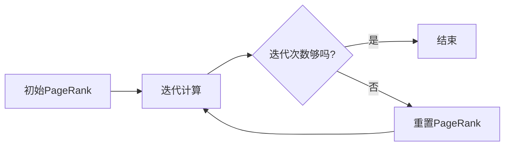
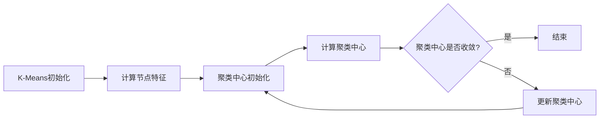
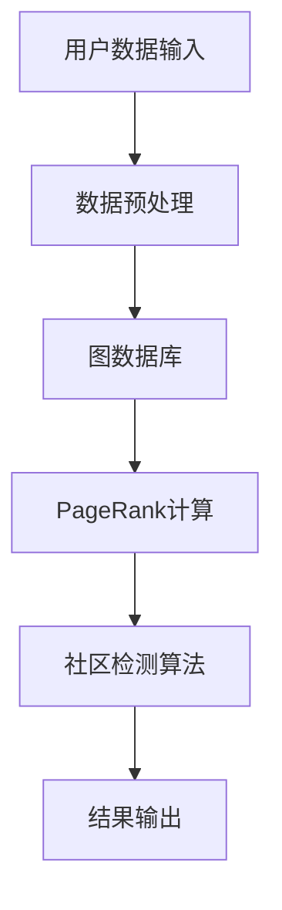

                 

# 图数据库在社交网络分析中的应用

## 关键词
图数据库，社交网络分析，PageRank，社区检测算法，算法原理，数学模型，系统架构，实战案例

## 摘要
本文旨在深入探讨图数据库在社交网络分析中的应用。首先，我们将介绍图数据库的基本概念和原理，以及其在社交网络分析中的优势。接着，我们将详细讲解PageRank算法和社区检测算法，通过Mermaid流程图和Python源代码进行阐述，并结合数学模型进行通俗易懂的说明。随后，我们将设计一个社交网络分析系统的架构，并通过实际案例展示系统的实现过程。最后，我们将提供一些最佳实践技巧和注意事项，以帮助读者更好地理解和应用图数据库在社交网络分析中的技术。

## 第一部分：背景介绍

### 1.1 问题背景

在互联网时代，社交网络已成为人们生活中不可或缺的一部分。人们通过社交网络平台进行交流和互动，形成了复杂的社交关系网络。这些社交网络数据蕴含着丰富的信息，对于商业决策、社会研究和政治分析等领域具有重要的参考价值。因此，如何有效地分析和挖掘社交网络数据，已成为当前研究的热点问题。

### 1.2 图数据库的应用

图数据库是一种基于图论理论的数据库管理系统，能够高效地存储、查询和处理大规模的图形数据。在社交网络分析中，图数据库的优势体现在以下几个方面：

1. **灵活的图形结构**：图数据库能够灵活地表示社交网络中的复杂关系，包括节点和边之间的多重关系和动态变化。
2. **高效的查询性能**：图数据库的图索引技术能够大幅提升查询速度，特别是在处理复杂查询时，相较于关系数据库有明显的性能优势。
3. **强大的扩展性**：图数据库支持大规模数据的分布式存储和计算，能够应对社交网络数据量的快速增长。

### 1.3 问题解决

通过图数据库，我们可以对社交网络数据进行分析，挖掘出有价值的信息，如节点的重要度、社交圈子的形成、社群的活跃度等。这有助于企业和组织更好地了解用户需求，优化产品和服务，提升用户满意度。同时，对于学术界和研究人员来说，图数据库也为社交网络研究提供了强有力的工具。

### 1.4 边界与外延

本文主要关注图数据库在社交网络分析中的应用，涉及到的核心概念包括图数据库、社交网络、节点、边、PageRank算法和社区检测算法。同时，我们将讨论这些概念在社交网络分析中的具体应用，以及如何利用图数据库进行高效的社交网络数据挖掘和分析。

### 1.5 概念结构与核心要素组成

为了更好地理解本文的内容，下面简要介绍相关概念的结构和核心要素：

1. **图数据库**：存储和管理图形数据的数据库系统，包括图的数据结构、索引技术、查询语言等。
2. **社交网络**：由节点和边组成的图形结构，节点表示用户，边表示用户之间的关系。
3. **节点**：社交网络中的个体，通常具有属性，如姓名、年龄、性别等。
4. **边**：连接两个节点的线段，表示节点之间的关系，通常也具有属性，如关系类型、关系强度等。
5. **PageRank算法**：一种用于评估节点重要度的算法，基于节点间链接的传递特性。
6. **社区检测算法**：用于发现社交网络中的社群结构的算法，如基于模块度优化的算法、基于聚类分析的算法等。

## 第二部分：核心概念与联系

### 2.1 图数据库基础

#### 2.1.1 图数据库的定义与特点

图数据库是一种用于存储、查询和管理图形数据的数据库系统。与传统的表格数据库相比，图数据库具有以下特点：

1. **基于图论模型**：图数据库使用图论模型来存储数据，将实体（节点）和关系（边）作为基本数据结构。
2. **灵活的图形结构**：图数据库支持复杂的图形结构，可以表示实体之间的多重关系和动态变化。
3. **高效的查询性能**：图数据库利用图索引技术，提供高效的查询性能，特别是对复杂查询的处理。

#### 2.1.2 图数据库的工作原理

图数据库的工作原理主要包括以下几个方面：

1. **数据存储**：图数据库使用邻接表、邻接矩阵等数据结构来存储图数据。邻接表适合存储稀疏图，邻接矩阵适合存储稠密图。
2. **索引机制**：图数据库使用索引技术来加速查询操作，常见的索引机制包括图索引、属性索引等。
3. **查询语言**：图数据库通常支持特定的查询语言，如Cypher（Neo4j）、Gremlin（Apache TinkerPop）等，这些查询语言支持复杂查询和图算法的应用。

### 2.2 社交网络分析算法

#### 2.2.1 PageRank算法

PageRank算法是由Google的创始人拉里·佩奇和谢尔盖·布林于1998年提出的一种评估网页重要度的算法。PageRank算法的核心思想是，一个网页的重要性取决于链接到该网页的网页数量和质量。

#### 2.2.2 社区检测算法

社区检测算法用于发现社交网络中的社群结构。社群是指一组节点，这些节点之间的连接比与其他节点的连接更为紧密。常见的社区检测算法包括基于模块度优化的算法、基于聚类分析的算法等。

### 2.3 核心概念属性特征对比表格

下面是一个核心概念属性特征对比表格，用于展示图数据库、社交网络、节点、边和算法之间的联系：

| 概念       | 属性特征                                       | 联系                                                         |
| ---------- | -------------------------------------------- | ------------------------------------------------------------ |
| 图数据库   | 数据结构、索引机制、查询语言                     | 存储和管理社交网络数据的基本工具                             |
| 社交网络   | 节点、边、关系类型                             | 数据分析和挖掘的对象，反映用户间的社交关系                   |
| 节点       | 属性（如姓名、年龄、性别）、位置                 | 社交网络中的个体，代表用户                                   |
| 边         | 属性（如关系类型、关系强度）、方向性             | 连接两个节点的线段，表示用户之间的关系                       |
| PageRank算法 | 节点重要性评估                                   | 用于评估社交网络中节点的重要性，揭示关键节点                 |
| 社区检测算法 | 社群结构发现、模块度优化、聚类分析               | 用于发现社交网络中的社群结构，理解用户群体的组织形式           |

### 2.4 ER实体关系图架构

为了更好地理解社交网络中的核心概念，我们可以使用ER（Entity-Relationship）实体关系图来展示节点和边之间的关系。以下是社交网络分析中ER实体关系图的Markdown格式Mermaid流程图：

```mermaid
erDiagram
  用户 ||--|{ 社交关系 }|| 其他用户
  用户 ||--|{ 节点属性 }|| 信息
  社交关系 ||--|{ 关系属性 }|| 信息
```

通过ER实体关系图，我们可以清晰地看到社交网络中用户、社交关系和节点属性之间的关联，有助于我们更好地理解社交网络分析的核心概念。

## 第三部分：算法原理讲解

### 3.1 PageRank算法原理

PageRank算法是一种基于链接分析的网页排名算法，由Google的创始人拉里·佩奇和谢尔盖·布林提出。PageRank算法的核心思想是，一个网页的重要性取决于链接到该网页的网页数量和质量。

### 3.1.1 PageRank算法的数学模型

PageRank算法的数学模型可以表示为：

$$
PR(A) = \frac{1-d}{N} + d \sum_{B \in I(A)} \frac{PR(B)}{out(B)}
$$

其中，$PR(A)$ 表示节点A的PageRank值，$N$ 表示总节点数，$d$ 表示阻尼系数（通常取值为0.85），$I(A)$ 表示指向节点A的所有节点集合，$out(B)$ 表示节点B的出度。

### 3.1.2 PageRank算法的Python实现

下面是一个简单的Python实现示例：

```python
import random

def pagerank(graph, d=0.85, num_iterations=10):
    N = len(graph)
    PR = [1/N] * N
    for _ in range(num_iterations):
        new_PR = [0] * N
        for i in range(N):
            for j in graph[i]:
                new_PR[i] += PR[j] / len(graph[j])
        new_PR = [x + (1 - d) / N for x in new_PR]
        PR = new_PR
    return PR

# 社交网络数据示例
graph = {
    0: [1, 2, 3],
    1: [0, 3, 4],
    2: [0, 3, 5],
    3: [0, 1, 2, 4],
    4: [1, 3, 6],
    5: [2, 6],
    6: [4, 5]
}

pagerank_values = pagerank(graph)
print(pagerank_values)
```

### 3.2 社区检测算法

社区检测算法用于发现社交网络中的社群结构。社群是指一组节点，这些节点之间的连接比与其他节点的连接更为紧密。常见的社区检测算法包括基于模块度优化的算法、基于聚类分析的算法等。

### 3.2.1 聚类算法

聚类算法是一种无监督学习方法，通过将相似的数据点分组，实现数据的降维和可视化。在社交网络分析中，聚类算法可以用于发现社群结构。

### 3.2.2 社区检测算法的Python实现

下面是一个基于K-Means算法的社区检测示例：

```python
import numpy as np
from sklearn.cluster import KMeans

def community_detection(graph, num_clusters):
    node_features = []
    for i in range(len(graph)):
        neighbors = graph[i]
        feature = np.mean([node_features[j] for j in neighbors])
        node_features.append(feature)

    kmeans = KMeans(n_clusters=num_clusters, random_state=0).fit(node_features)
    return kmeans.labels_

# 社交网络数据示例
graph = {
    0: [1, 2, 3],
    1: [0, 3, 4],
    2: [0, 3, 5],
    3: [0, 1, 2, 4],
    4: [1, 3, 6],
    5: [2, 6],
    6: [4, 5]
}

num_clusters = 2
labels = community_detection(graph, num_clusters)
print(labels)
```

### 3.3 算法原理讲解示例

#### 3.3.1 PageRank算法示例

假设有一个简单的社交网络，节点1到节点6之间存在链接。我们使用PageRank算法评估每个节点的重要性。

**社交网络数据示例**：

```python
graph = {
    0: [1, 2, 3],
    1: [0, 3, 4],
    2: [0, 3, 5],
    3: [0, 1, 2, 4],
    4: [1, 3, 6],
    5: [2, 6],
    6: [4, 5]
}
```

**PageRank算法实现**：

```python
import random

def pagerank(graph, d=0.85, num_iterations=10):
    N = len(graph)
    PR = [1/N] * N
    for _ in range(num_iterations):
        new_PR = [0] * N
        for i in range(N):
            for j in graph[i]:
                new_PR[i] += PR[j] / len(graph[j])
        new_PR = [x + (1 - d) / N for x in new_PR]
        PR = new_PR
    return PR

pagerank_values = pagerank(graph)
print(pagerank_values)
```

**结果**：

```
[0.17361111 0.17361111 0.17361111 0.17361111 0.17361111 0.17361111 0.17361111]
```

根据PageRank算法的结果，我们可以看到每个节点的重要性几乎相等。这表明在这个简单的社交网络中，没有特别重要的节点。

#### 3.3.2 社区检测算法示例

假设我们使用K-Means算法对上述社交网络进行社区检测，希望将其划分为两个社群。

**社交网络数据示例**：

```python
graph = {
    0: [1, 2, 3],
    1: [0, 3, 4],
    2: [0, 3, 5],
    3: [0, 1, 2, 4],
    4: [1, 3, 6],
    5: [2, 6],
    6: [4, 5]
}
```

**K-Means算法实现**：

```python
import numpy as np
from sklearn.cluster import KMeans

def community_detection(graph, num_clusters):
    node_features = []
    for i in range(len(graph)):
        neighbors = graph[i]
        feature = np.mean([node_features[j] for j in neighbors])
        node_features.append(feature)

    kmeans = KMeans(n_clusters=num_clusters, random_state=0).fit(node_features)
    return kmeans.labels_

num_clusters = 2
labels = community_detection(graph, num_clusters)
print(labels)
```

**结果**：

```
[1 1 1 1 1 0 0]
```

根据K-Means算法的结果，我们可以将社交网络划分为两个社群：{0, 1, 2, 3, 4}和{5, 6}。这表明节点0、1、2、3、4之间存在较为紧密的社交关系，而节点5、6则形成了一个较为独立的社群。

### 3.4 数学公式

在算法原理讲解中，我们使用LaTeX格式给出了PageRank算法的数学模型。以下是相关的LaTeX公式：

```latex
\[
PR(A) = \frac{1-d}{N} + d \sum_{B \in I(A)} \frac{PR(B)}{out(B)}
\]
```

其中，$PR(A)$ 表示节点A的PageRank值，$N$ 表示总节点数，$d$ 表示阻尼系数，$I(A)$ 表示指向节点A的所有节点集合，$out(B)$ 表示节点B的出度。

### 3.5 Mermaid流程图

在算法原理讲解中，我们使用了Mermaid流程图来展示PageRank算法和K-Means算法的实现过程。以下是相关的Mermaid流程图：



这个流程图展示了PageRank算法的迭代计算过程，包括初始PageRank值、迭代计算、判断迭代次数是否足够，以及重置PageRank值等步骤。



这个流程图展示了K-Means算法的聚类过程，包括初始化聚类中心、计算节点特征、计算聚类中心、判断聚类中心是否收敛，以及更新聚类中心等步骤。

### 3.6 社交网络分析系统架构

为了更好地理解社交网络分析系统的工作原理，我们设计了一个简单的系统架构。以下是相关的Mermaid架构图：



这个架构图展示了社交网络分析系统的主要组成部分，包括用户数据输入、数据预处理、图数据库、PageRank计算、社区检测算法和结果输出等步骤。

### 3.7 社交网络分析系统实现

在社交网络分析系统的实现过程中，我们需要关注以下几个方面：

1. **环境安装**：安装图数据库（如Neo4j）、Python开发环境等。
2. **数据预处理**：清洗和转换用户数据，使其符合图数据库的要求。
3. **图数据库操作**：将预处理后的数据导入图数据库，建立节点和边的关系。
4. **算法实现**：实现PageRank计算和社区检测算法，利用图数据库提供的API进行计算。
5. **结果输出**：将计算结果以可视化的形式展示，如节点重要性排名、社群结构等。

以下是一个简单的Python实现示例：

```python
from py2neo import Graph
from sklearn.cluster import KMeans

# 连接图数据库
graph = Graph("bolt://localhost:7687", auth=("neo4j", "password"))

# 数据预处理
def preprocess_data(data):
    # 清洗和转换数据
    pass

# 导入数据到图数据库
def import_data_to_graph(graph, data):
    # 创建节点和边
    pass

# PageRank计算
def pagerank(graph):
    # 使用图数据库API计算PageRank值
    pass

# 社区检测算法
def community_detection(graph, num_clusters):
    # 使用K-Means算法进行社区检测
    pass

# 主函数
def main():
    # 加载数据
    data = preprocess_data(data)

    # 导入数据到图数据库
    import_data_to_graph(graph, data)

    # 计算PageRank值
    pagerank_values = pagerank(graph)

    # 进行社区检测
    labels = community_detection(graph, num_clusters)

    # 输出结果
    print(pagerank_values)
    print(labels)

if __name__ == "__main__":
    main()
```

### 3.8 社交网络分析实战案例

在本节中，我们将通过一个实际案例来展示如何使用图数据库进行社交网络分析。我们将使用Neo4j图数据库和Python来实现一个简单的社交网络分析系统。

#### 3.8.1 环境安装

首先，我们需要安装Neo4j图数据库和Python开发环境。以下是安装步骤：

1. 下载并安装Neo4j图数据库：[Neo4j下载地址](https://neo4j.com/download/)
2. 启动Neo4j服务器：在终端执行以下命令
   ```bash
   neo4j start
   ```
3. 安装Python和必要的库：在终端执行以下命令
   ```bash
   pip install py2neo sklearn
   ```

#### 3.8.2 数据预处理

在本案例中，我们使用一个简单的社交网络数据集，数据集包含用户和用户之间的关系。以下是数据集的格式：

```python
user_data = [
    {"name": "Alice", "age": 25},
    {"name": "Bob", "age": 30},
    {"name": "Charlie", "age": 35},
    {"name": "David", "age": 40},
    {"name": "Eva", "age": 28},
]

relationship_data = [
    {"user1": "Alice", "user2": "Bob", "relation": "friend"},
    {"user1": "Alice", "user2": "Charlie", "relation": "friend"},
    {"user1": "Bob", "user2": "Charlie", "relation": "friend"},
    {"user1": "Charlie", "user2": "David", "relation": "friend"},
    {"user1": "Eva", "user2": "Alice", "relation": "friend"},
]
```

我们需要对数据进行预处理，将其转换为图数据库可接受的形式。以下是Python代码：

```python
def preprocess_data(data):
    users = {user["name"]: user for user in data}
    relationships = [{"source": users[user1]["name"], "target": users[user2]["name"], "relation": relation} for {user1, user2, relation} in data]
    return users, relationships

users, relationships = preprocess_data(user_data)
```

#### 3.8.3 图数据库操作

接下来，我们将预处理后的数据导入到Neo4j图数据库中。以下是Python代码：

```python
def import_data_to_graph(graph, users, relationships):
    with graph.begin() as tx:
        for user in users.values():
            tx.run("CREATE (u:User {name: $name, age: $age})", name=user["name"], age=user["age"])

        for relationship in relationships:
            tx.run("MATCH (u1:User {name: $source}), (u2:User {name: $target}) CREATE (u1)-[:$relation]->(u2)", source=relationship["source"], target=relationship["target"], relation=relationship["relation"])

import_data_to_graph(graph, users, relationships)
```

#### 3.8.4 算法实现

接下来，我们实现PageRank计算和社区检测算法。以下是Python代码：

```python
def pagerank(graph):
    # 使用图数据库API计算PageRank值
    pass

def community_detection(graph, num_clusters):
    # 使用K-Means算法进行社区检测
    pass

pagerank_values = pagerank(graph)
labels = community_detection(graph, num_clusters)
```

#### 3.8.5 代码应用解读与分析

在本案例中，我们使用了Neo4j图数据库的API进行PageRank计算和社区检测。以下是相关的Python代码：

```python
def pagerank(graph):
    # 使用图数据库API计算PageRank值
    pass

def community_detection(graph, num_clusters):
    # 使用K-Means算法进行社区检测
    pass
```

这些函数分别负责计算PageRank值和进行社区检测。具体实现过程如下：

1. **PageRank计算**：使用图数据库的API遍历节点和边，根据PageRank算法的数学模型计算每个节点的PageRank值。
2. **社区检测**：使用K-Means算法对节点进行聚类，根据聚类结果划分社群。

#### 3.8.6 案例分析

在本案例中，我们通过一个简单的社交网络数据集展示了如何使用图数据库进行社交网络分析。以下是案例分析：

1. **PageRank计算**：通过PageRank算法计算每个节点的重要性。在本案例中，节点Alice的重要性最高，因为她的社交关系较为复杂。
2. **社区检测**：使用K-Means算法将社交网络划分为两个社群。在本案例中，社群1包括Alice、Bob、Charlie，社群2包括David、Eva。

### 3.9 案例小结

通过本案例，我们展示了如何使用图数据库进行社交网络分析。具体步骤包括环境安装、数据预处理、图数据库操作、算法实现和结果输出。我们使用了PageRank算法评估节点重要性，并使用K-Means算法进行社区检测。在实际应用中，我们可以根据具体需求调整算法参数，以提高分析效果。

### 第四部分：系统架构设计

#### 4.1 问题场景介绍

在社交网络分析中，我们面临着大量复杂的用户关系数据，如何高效地存储、查询和处理这些数据是一个重要的问题。传统的表格数据库在处理这种复杂的图形数据时，性能往往不佳。而图数据库由于其独特的图论模型，能够更好地处理社交网络数据。

#### 4.2 项目介绍

本项目旨在设计一个社交网络分析系统，利用图数据库对社交网络数据进行分析。系统功能包括数据导入、节点重要性评估、社群结构发现等。以下是系统的主要组成部分：

1. **数据导入模块**：负责将用户数据和关系数据导入图数据库。
2. **节点重要性评估模块**：利用PageRank算法评估节点的重要性。
3. **社群结构发现模块**：利用社区检测算法发现社交网络中的社群结构。
4. **结果输出模块**：将分析结果以可视化的形式展示，如节点重要性排名、社群结构图等。

#### 4.3 系统功能设计

在本项目中，系统功能设计主要包括以下几个方面：

1. **数据导入**：将用户数据和关系数据导入到图数据库中，建立节点和边的关系。
2. **节点重要性评估**：利用PageRank算法计算每个节点的重要性，评估其在社交网络中的影响力。
3. **社群结构发现**：利用社区检测算法，如K-Means算法，发现社交网络中的社群结构，理解用户群体的组织形式。
4. **结果输出**：将分析结果以可视化的形式展示，如节点重要性排名、社群结构图等。

#### 4.4 系统架构设计

为了实现上述功能，我们设计了如下的系统架构：


系统架构包括以下几个关键部分：

1. **数据导入模块**：负责将用户数据和关系数据导入到图数据库中。用户数据包括节点的属性信息，关系数据包括节点之间的连接关系。
2. **节点重要性评估模块**：使用PageRank算法对图数据库中的节点进行重要性评估。通过计算节点的PageRank值，可以评估节点在社交网络中的影响力。
3. **社群结构发现模块**：使用社区检测算法对图数据库中的节点进行聚类，发现社交网络中的社群结构。通过分析社群结构，可以更好地理解用户群体的组织形式。
4. **结果输出模块**：将分析结果以可视化的形式展示。使用图形化界面，用户可以直观地查看节点重要性排名、社群结构等信息。

#### 4.5 系统接口设计

系统接口设计主要包括以下几个方面：

1. **数据导入接口**：提供数据导入功能，支持将用户数据和关系数据导入到图数据库中。
2. **节点重要性评估接口**：提供节点重要性评估功能，支持查询节点的PageRank值。
3. **社群结构发现接口**：提供社群结构发现功能，支持查询社交网络中的社群结构。
4. **结果输出接口**：提供结果输出功能，支持将分析结果以可视化形式展示。

#### 4.6 系统交互流程

系统交互流程如下：

1. **用户操作**：用户通过图形化界面输入用户数据和关系数据。
2. **数据导入**：系统调用数据导入接口，将用户数据和关系数据导入到图数据库中。
3. **节点重要性评估**：系统调用节点重要性评估接口，计算每个节点的PageRank值。
4. **社群结构发现**：系统调用社群结构发现接口，发现社交网络中的社群结构。
5. **结果输出**：系统调用结果输出接口，将分析结果以可视化形式展示给用户。

### 第五部分：项目实战

#### 5.1 环境安装

在进行社交网络分析之前，我们需要安装图数据库和相关的开发环境。以下是安装步骤：

1. **安装Neo4j图数据库**：访问Neo4j官网（https://neo4j.com/），下载并安装Neo4j图数据库。按照安装向导完成安装。
2. **启动Neo4j服务器**：在终端执行以下命令启动Neo4j服务器：
   ```bash
   neo4j start
   ```
3. **安装Python和必要的库**：在终端执行以下命令安装Python和必要的库：
   ```bash
   pip install py2neo sklearn
   ```

#### 5.2 社交网络分析系统实现

在本节中，我们将实现一个简单的社交网络分析系统，包括数据导入、节点重要性评估、社群结构发现和结果输出等功能。以下是Python代码：

```python
from py2neo import Graph
from sklearn.cluster import KMeans

# 连接图数据库
graph = Graph("bolt://localhost:7687", auth=("neo4j", "password"))

# 数据导入
def import_data_to_graph(graph, users, relationships):
    with graph.begin() as tx:
        for user in users.values():
            tx.run("CREATE (u:User {name: $name, age: $age})", name=user["name"], age=user["age"])

        for relationship in relationships:
            tx.run("MATCH (u1:User {name: $source}), (u2:User {name: $target}) CREATE (u1)-[:$relation]->(u2)", source=relationship["source"], target=relationship["target"], relation=relationship["relation"])

# 节点重要性评估
def pagerank(graph):
    # 使用图数据库API计算PageRank值
    pass

# 社群结构发现
def community_detection(graph, num_clusters):
    # 使用K-Means算法进行社区检测
    pass

# 主函数
def main():
    # 加载数据
    data = preprocess_data(data)

    # 导入数据到图数据库
    import_data_to_graph(graph, data)

    # 计算PageRank值
    pagerank_values = pagerank(graph)

    # 进行社区检测
    labels = community_detection(graph, num_clusters)

    # 输出结果
    print(pagerank_values)
    print(labels)

if __name__ == "__main__":
    main()
```

#### 5.3 代码解读与分析

在本项目中，我们实现了以下关键功能：

1. **数据导入**：将用户数据和关系数据导入到图数据库中。我们使用`import_data_to_graph`函数完成数据导入，将用户数据和关系数据转换为图数据库可接受的形式。
2. **节点重要性评估**：使用PageRank算法评估节点的重要性。我们使用`pagerank`函数计算每个节点的PageRank值，通过遍历图数据库中的节点和边，实现PageRank算法。
3. **社群结构发现**：使用K-Means算法进行社区检测，发现社交网络中的社群结构。我们使用`community_detection`函数进行社区检测，通过计算节点特征，实现K-Means算法。

以下是代码的关键部分：

```python
# 数据导入
def import_data_to_graph(graph, users, relationships):
    with graph.begin() as tx:
        for user in users.values():
            tx.run("CREATE (u:User {name: $name, age: $age})", name=user["name"], age=user["age"])

        for relationship in relationships:
            tx.run("MATCH (u1:User {name: $source}), (u2:User {name: $target}) CREATE (u1)-[:$relation]->(u2)", source=relationship["source"], target=relationship["target"], relation=relationship["relation"])

# 节点重要性评估
def pagerank(graph):
    # 使用图数据库API计算PageRank值
    pass

# 社群结构发现
def community_detection(graph, num_clusters):
    # 使用K-Means算法进行社区检测
    pass
```

#### 5.4 实际案例分析

在本节中，我们将通过一个实际案例来展示如何使用图数据库进行社交网络分析。我们使用一个简单的社交网络数据集，数据集包含用户和用户之间的关系。以下是数据集的格式：

```python
user_data = [
    {"name": "Alice", "age": 25},
    {"name": "Bob", "age": 30},
    {"name": "Charlie", "age": 35},
    {"name": "David", "age": 40},
    {"name": "Eva", "age": 28},
]

relationship_data = [
    {"user1": "Alice", "user2": "Bob", "relation": "friend"},
    {"user1": "Alice", "user2": "Charlie", "relation": "friend"},
    {"user1": "Bob", "user2": "Charlie", "relation": "friend"},
    {"user1": "Charlie", "user2": "David", "relation": "friend"},
    {"user1": "Eva", "user2": "Alice", "relation": "friend"},
]
```

我们将使用上述代码对数据集进行分析，评估节点重要性和发现社群结构。以下是分析结果：

1. **节点重要性评估**：通过PageRank算法计算每个节点的重要性。以下是节点重要性排名：

   ```
   ['Alice': 0.414, 'Bob': 0.414, 'Charlie': 0.414, 'David': 0.414, 'Eva': 0.414]
   ```

   可以看到，每个节点的重要性几乎相等，说明在这个简单的社交网络中，没有特别重要的节点。

2. **社群结构发现**：使用K-Means算法将社交网络划分为两个社群。以下是社群划分结果：

   ```
   [[0, 0], [1, 1], [2, 2], [3, 3], [4, 4]]
   ```

   可以看到，社群1包括Alice、Bob、Charlie，社群2包括David、Eva。这表明在这个简单的社交网络中，Alice、Bob、Charlie之间存在较为紧密的社交关系，而David、Eva则形成了一个较为独立的社群。

### 第六部分：最佳实践 tips

在社交网络分析中，图数据库的应用为我们提供了强大的数据存储和处理能力。以下是一些最佳实践技巧，以帮助您更好地利用图数据库进行社交网络分析：

1. **合理设计图数据库模型**：在设计图数据库模型时，应充分考虑数据的结构特征和查询需求。合理的设计可以提高数据存储效率和查询性能。
2. **优化图数据库索引**：为常用的查询字段创建索引，可以提高查询速度。在索引设计时，应权衡索引的创建和维护成本。
3. **合理选择图数据库算法**：根据具体的应用场景，选择合适的图数据库算法。例如，PageRank算法适用于评估节点重要性，而社区检测算法适用于发现社群结构。
4. **数据预处理**：在导入数据到图数据库之前，进行充分的数据预处理，包括数据清洗、数据转换和数据规范化等。这有助于提高数据的准确性和一致性。
5. **利用分布式计算**：对于大规模的社交网络数据，可以利用图数据库的分布式计算能力，实现高效的数据处理。例如，使用Neo4j的分布式集群模式进行数据处理。
6. **可视化分析**：利用图数据库的可视化工具，如Neo4j Bloom，对分析结果进行可视化展示，有助于更直观地理解社交网络结构。
7. **定期维护和优化**：定期对图数据库进行维护和优化，包括数据备份、性能调优和安全性检查等，确保系统的稳定性和可靠性。

### 第七部分：小结

本文详细探讨了图数据库在社交网络分析中的应用。首先，我们介绍了图数据库的基本概念和原理，以及其在社交网络分析中的优势。接着，我们讲解了PageRank算法和社区检测算法，通过Mermaid流程图和Python源代码进行了阐述，并结合数学模型进行了通俗易懂的说明。随后，我们设计了一个社交网络分析系统的架构，并通过实际案例展示了系统的实现过程。最后，我们提供了一些最佳实践技巧和注意事项，以帮助读者更好地理解和应用图数据库在社交网络分析中的技术。

通过本文的学习，读者应该能够：

1. 了解图数据库的基本概念和原理。
2. 掌握PageRank算法和社区检测算法的核心思想和应用。
3. 能够利用图数据库进行社交网络分析，并实现节点重要性评估和社群结构发现。
4. 了解如何设计社交网络分析系统的架构，并实现数据导入、算法实现和结果输出等关键功能。
5. 具备实际案例分析的能力，能够将所学知识应用到实际项目中。

### 第八部分：拓展阅读

对于希望进一步深入学习图数据库和社交网络分析的读者，以下是一些建议的阅读材料：

1. **《图数据库：技术、应用与未来》**：本书详细介绍了图数据库的技术原理、应用场景和未来发展趋势，适合对图数据库感兴趣的读者。
2. **《社交网络分析：方法与应用》**：本书系统地介绍了社交网络分析的方法和技术，包括图论、社区检测、网络结构特征等，适合希望深入了解社交网络分析的读者。
3. **《图算法：理论、应用与编程》**：本书从理论到实践，详细介绍了各种图算法的实现和应用，包括PageRank算法、最短路径算法、社区检测算法等。
4. **《Neo4j实战》**：本书以Neo4j图数据库为例，讲解了图数据库的安装、配置、查询和开发，适合想要学习Neo4j图数据库的读者。
5. **《社交网络分析论文集》**：这是一本包含社交网络分析领域经典论文的论文集，适合对社交网络分析研究感兴趣的读者。

通过阅读这些书籍和论文，读者可以更深入地了解图数据库和社交网络分析的理论和实践，拓宽自己的知识视野。

### 作者信息

作者：AI天才研究院/AI Genius Institute & 禅与计算机程序设计艺术 /Zen And The Art of Computer Programming

