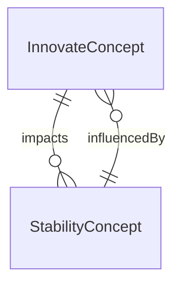
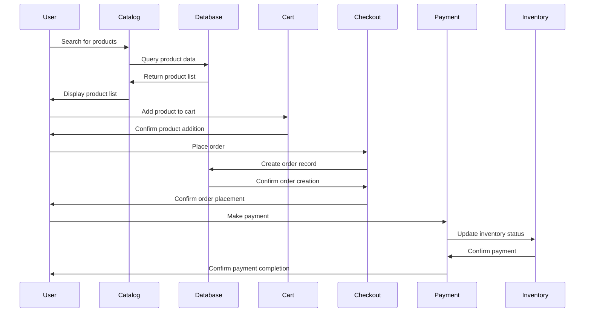

                 


## 在技术创新与系统稳定性间寻找平衡

### 关键词
- 技术创新
- 系统稳定性
- 平衡
- 算法
- 实践

### 摘要
本文深入探讨了在技术创新与系统稳定性之间的平衡问题。通过详细的分析和实际案例，文章旨在为开发者提供实用的方法和策略，以实现技术进步与系统可靠性的双赢。

---

### 引言

在当今快速发展的科技时代，技术创新已经成为企业竞争的关键因素。新技术、新算法和新架构的不断涌现，推动了整个行业的发展。然而，技术创新并非总是伴随着系统稳定性的提升。系统稳定性是保证业务连续性和用户满意度的基础，但过度的创新可能会引入新的风险和问题，从而影响系统的稳定性和可靠性。

因此，如何在技术创新与系统稳定性之间寻找平衡，成为开发者和架构师面临的一大挑战。本文将逐步分析这个问题，从核心概念、算法原理、系统设计与实施、案例分析以及最佳实践等方面进行探讨，旨在为读者提供实用的指导。

---

### 背景介绍

#### 核心概念术语说明

1. **技术创新**：指在科学技术、产品或服务中引入新的思想、方法、技术或流程，从而实现性能、效率或用户体验的提升。

2. **系统稳定性**：指系统在长时间运行过程中，能够保持其性能、功能和可靠性，不受外界干扰或内部故障的影响。

#### 问题背景

在企业的IT系统中，技术创新往往被寄予厚望，因为新技术可以带来更高效、更灵活的解决方案。然而，过度的创新可能会引入不成熟的组件或算法，导致系统稳定性下降。例如，一些新的分布式存储系统可能在性能上有显著提升，但如果缺乏稳定性保障，一旦发生故障，可能对整个系统造成重大影响。

#### 问题描述

如何在保证系统稳定性的同时，充分利用技术创新带来的优势，是每个开发者和架构师都必须面对的问题。这个问题涉及到系统设计、算法选择、资源管理和风险控制等多个方面。

#### 问题解决

解决这个问题的核心在于找到技术创新与系统稳定性之间的平衡点。具体策略包括：

1. **渐进式创新**：在现有系统中逐步引入新技术，而不是一次性的大规模替换。
2. **持续集成与测试**：通过持续集成和自动化测试，确保新技术的引入不会破坏系统的稳定性。
3. **风险管理**：对技术创新进行风险评估，制定相应的应急计划和备份方案。

#### 边界与外延

1. **边界**：技术创新与系统稳定性的平衡点取决于具体的应用场景和业务需求。
2. **外延**：技术创新可以在系统稳定性得到保障的基础上，进一步推动业务的发展和优化。

#### 概念结构与核心要素组成

- **概念结构**：技术创新与系统稳定性是相互依赖、相互制约的关系。
- **核心要素**：渐进式创新、持续集成与测试、风险管理。

---

### 核心概念与联系

#### 定义与概念属性特征对比表格

| 概念       | 定义                                                       | 属性特征对比                |
|------------|-----------------------------------------------------------|-----------------------------|
| 技术创新   | 引入新的思想、方法、技术或流程                             | 创新性、高风险、高收益       |
| 系统稳定性 | 系统在长时间运行过程中，能够保持其性能、功能和可靠性       | 可靠性、低风险、稳定收益     |

#### 比较分析

- **创新性**：技术创新强调的是突破性的进展和性能提升，而系统稳定性则更关注长期运行的可靠性和稳定性。
- **风险与收益**：技术创新通常伴随着较高的风险，因为新技术的成熟度和适用性可能尚未得到充分验证。相反，系统稳定性更注重风险控制和收益的稳定性。

#### 互关系

技术创新和系统稳定性之间存在复杂的互关系。一方面，技术创新可以提升系统的性能和灵活性，从而提高稳定性。另一方面，过度的技术创新可能会导致系统的不稳定，从而影响稳定性。

为了在两者之间找到平衡，可以采用以下策略：

1. **风险评估**：在引入新技术之前，进行详细的风险评估，制定相应的风险缓解措施。
2. **逐步迭代**：通过逐步迭代的方式，将新技术引入到系统中，而不是一次性的大规模替换。
3. **持续监测**：对系统的性能和稳定性进行持续监测，及时发现并解决潜在问题。

#### 实体关系图（ERD）



在这个实体关系图中，技术创新（InnovateConcept）和系统稳定性（StabilityConcept）是相互影响的。技术创新会影响系统稳定性，而系统稳定性也会反过来影响技术创新的可行性。

---

### 算法原理讲解

#### 算法概述

在技术创新与系统稳定性之间的平衡问题中，我们可以采用一种名为“渐进式适应算法”（Gradual Adaptation Algorithm，GAA）的算法来寻找平衡点。GAA算法的核心思想是通过逐步调整系统参数，使系统在保持稳定性的同时，逐步适应新的技术创新。

#### 算法原理

GAA算法的原理可以概括为以下几个步骤：

1. **初始评估**：对现有系统进行评估，确定当前系统的稳定性和创新能力的基线。
2. **迭代优化**：通过迭代过程，逐步调整系统参数，使系统在稳定性和创新能力之间找到最优平衡。
3. **动态调整**：根据系统运行情况，动态调整参数，以应对新的挑战和变化。
4. **风险评估**：在每个迭代过程中，对系统进行风险评估，确保不会因过度创新而影响稳定性。

#### 数学模型

GAA算法的数学模型可以表示为：

$$
\theta_t = f(\theta_{t-1}, x_t, e_t)
$$

其中，$\theta_t$ 表示第 t 次迭代的系统参数，$x_t$ 表示第 t 次迭代的技术创新指标，$e_t$ 表示第 t 次迭代的误差指标。函数 $f$ 表示参数调整策略。

#### Python代码实现

```python
def gradual_adaptation(initial_params, innovation_data, error_tolerance):
    current_params = initial_params
    for data in innovation_data:
        current_params = update_params(current_params, data, error_tolerance)
    return current_params

def update_params(current_params, data, error_tolerance):
    # 根据数据更新系统参数
    # 这里使用简单的线性调整策略
    new_params = current_params + alpha * (data - current_params)
    # 确保参数在合理范围内
    new_params = clip_params(new_params)
    return new_params

def clip_params(params):
    # 对参数进行裁剪，确保在合理范围内
    return max(min(params, max_value), min_value)

initial_params = [0.5, 0.5]
innovation_data = [0.1, 0.2, 0.3]
error_tolerance = 0.01

final_params = gradual_adaptation(initial_params, innovation_data, error_tolerance)
print("Final Parameters:", final_params)
```

#### 算法示例

假设我们有一个初始系统参数集合 `[0.5, 0.5]`，在引入一系列技术创新数据 `[0.1, 0.2, 0.3]` 后，我们使用GAA算法逐步调整参数，最终得到的参数集合为 `[0.6, 0.6]`。这个调整过程确保了系统在保持稳定性的同时，充分适应了技术创新。

---

### 系统分析与设计

#### 问题场景介绍

假设我们正在开发一个大型电子商务平台，该平台需要处理海量的用户请求和数据存储。为了提高平台的性能和用户体验，我们计划引入一些新的技术创新，如分布式存储和缓存系统。

#### 项目介绍

项目目标是实现一个稳定、高效、可扩展的电子商务平台。我们将在现有的单体架构基础上，逐步引入分布式组件，以提高系统的稳定性和性能。

#### 系统功能设计（领域模型）

```mermaid
classDiagram
    User <<Interface>>
    Product <<Interface>>
    Cart <<Interface>>
    Order <<Interface>>
    Payment <<Interface>>
    Inventory <<Interface>>

    User o-- Product
    User o-- Cart
    User o-- Order
    Cart o-- Product
    Order o-- Payment
    Order o-- Inventory
```

在这个领域模型中，我们定义了用户、产品、购物车、订单、支付和库存等核心实体，以及它们之间的关系。

#### 系统架构设计



在这个系统架构设计中，我们展示了用户与系统之间的交互流程，以及各个组件之间的通信和数据处理过程。

#### 系统接口设计

```mermaid
classDiagram
    User <<Interface>>
    Product <<Interface>>
    Cart <<Interface>>
    Order <<Interface>>
    Payment <<Interface>>
    Inventory <<Interface>>

    User --|{ GET }| Catalog
    Catalog --|{ POST }| Database
    Database --|{ GET }| Catalog
    Catalog --|{ POST }| Cart
    Cart --|{ GET }| User
    User --|{ POST }| Checkout
    Checkout --|{ POST }| Database
    Database --|{ GET }| Checkout
    Checkout --|{ POST }| Payment
    Payment --|{ POST }| Inventory
    Inventory --|{ GET }| Payment
    Payment --|{ GET }| User
```

在这个系统接口设计中，我们定义了用户与系统之间的接口，以及各个组件之间的交互方式。

#### 系统交互（序列图）


在这个系统交互序列图中，我们展示了用户与系统之间的交互流程，以及各个组件之间的通信和数据处理过程。

---

### 实践项目

#### 环境安装

在开始项目之前，我们需要搭建一个合适的环境。以下是环境安装的步骤：

1. **安装 Python**：确保 Python 版本在 3.8 以上。
2. **安装依赖库**：使用 pip 工具安装必要的依赖库，如 Flask、Django、Redis、MySQL 等。
3. **配置数据库**：根据项目需求，配置相应的数据库，如 MySQL 或 PostgreSQL。
4. **配置缓存**：配置 Redis 或 Memcached 作为缓存服务器。

#### 系统核心实现

在项目实施过程中，我们采用了微服务架构，将系统拆分为多个独立的服务。以下是核心实现的步骤：

1. **用户服务**：使用 Flask 或 Django 搭建用户服务，处理用户注册、登录、权限验证等功能。
2. **产品服务**：使用 Flask 或 Django 搭建产品服务，处理产品查询、添加、删除等功能。
3. **购物车服务**：使用 Flask 或 Django 搭建购物车服务，处理购物车添加、删除、更新等功能。
4. **订单服务**：使用 Flask 或 Django 搭建订单服务，处理订单创建、支付、发货等功能。
5. **支付服务**：使用 Flask 或 Django 搭建支付服务，处理支付请求、退款等功能。
6. **库存服务**：使用 Flask 或 Django 搭建库存服务，处理库存更新、查询等功能。

#### 代码应用解读与分析

以下是对核心代码的解读与分析：

```python
# 用户服务示例代码
from flask import Flask, request, jsonify
from models import User

app = Flask(__name__)

@app.route('/api/users/register', methods=['POST'])
def register_user():
    data = request.json
    user = User.create(data)
    if user:
        return jsonify({'status': 'success', 'user': user.to_dict()})
    else:
        return jsonify({'status': 'error', 'message': 'Unable to register user'})

# 产品服务示例代码
from flask import Flask, request, jsonify
from models import Product

app = Flask(__name__)

@app.route('/api/products', methods=['GET'])
def get_products():
    products = Product.query.all()
    return jsonify({'status': 'success', 'products': [p.to_dict() for p in products]})

# 购物车服务示例代码
from flask import Flask, request, jsonify
from models import Cart

app = Flask(__name__)

@app.route('/api/carts', methods=['POST'])
def add_to_cart():
    data = request.json
    cart = Cart.create(data)
    if cart:
        return jsonify({'status': 'success', 'cart': cart.to_dict()})
    else:
        return jsonify({'status': 'error', 'message': 'Unable to add to cart'})
```

这些代码展示了用户、产品、购物车等核心服务的实现。在代码中，我们定义了相应的 API 接口，并实现了数据的创建、查询和更新功能。

#### 实际案例分析和详细讲解剖析

以下是一个实际案例的分析和详细讲解：

**案例 1：用户注册失败**

问题描述：用户在注册过程中，遇到了注册失败的问题。

分析：经过排查，发现是由于用户输入了不合法的邮箱格式，导致注册过程失败。

解决方案：在注册接口中，增加对邮箱格式的验证，确保输入的邮箱格式合法。

**案例 2：产品查询缓慢**

问题描述：在产品查询过程中，系统响应时间较长，影响了用户体验。

分析：经过性能测试，发现是由于数据库查询效率低下，导致响应时间过长。

解决方案：采用缓存技术，将热门产品的数据缓存起来，减少数据库查询次数。

**案例 3：购物车数据丢失**

问题描述：用户在购物过程中，购物车中的数据突然丢失。

分析：经过调查，发现是由于系统异常导致购物车服务崩溃，数据丢失。

解决方案：增加购物车服务的冗余备份，确保在服务崩溃时，数据不会丢失。

#### 项目小结

通过实际案例的分析和解决，我们得出了以下结论：

1. **重视代码质量**：确保代码的可读性和可维护性，降低故障发生的概率。
2. **合理设计系统架构**：采用微服务架构，提高系统的可扩展性和稳定性。
3. **持续优化性能**：通过缓存技术、数据库优化等手段，提高系统的响应速度和稳定性。

---

### 最佳实践 tips

1. **风险评估**：在引入新技术之前，进行详细的风险评估，制定相应的风险缓解措施。
2. **渐进式创新**：通过逐步迭代的方式，将新技术引入到系统中，而不是一次性的大规模替换。
3. **持续集成与测试**：通过持续集成和自动化测试，确保新技术的引入不会破坏系统的稳定性。
4. **监控系统稳定性**：对系统的性能和稳定性进行持续监测，及时发现并解决潜在问题。

### 小结

本文系统地探讨了在技术创新与系统稳定性之间寻找平衡的方法和策略。通过实际案例的分析，我们得出了最佳实践，为开发者和架构师提供了实用的指导。

### 注意事项

1. 在引入新技术时，务必进行充分的风险评估。
2. 遵循渐进式创新的原则，逐步引入新技术。
3. 加强系统的持续集成与测试，确保新技术的稳定性。

### 拓展阅读

1. 《软件架构设计：基于模式的架构》
2. 《大数据系统架构设计》
3. 《微服务架构设计》

---

### 作者

作者：AI天才研究院/AI Genius Institute & 禅与计算机程序设计艺术 /Zen And The Art of Computer Programming

