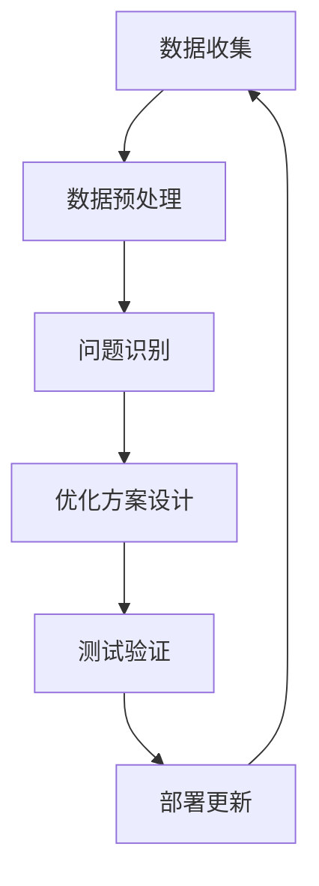
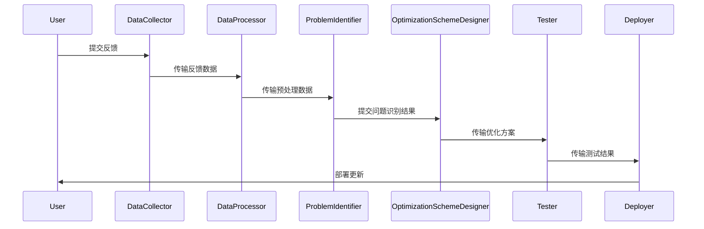

                 

# 基于用户反馈的AI Agent迭代优化流程

> 关键词：AI Agent、用户反馈、迭代优化、算法、系统架构、实战

> 摘要：本文将深入探讨基于用户反馈的AI Agent迭代优化流程，从背景与引言、AI Agent基础、用户反馈机制、迭代优化流程、优化算法、系统架构与实现，到项目实战与最佳实践，全方位解析AI Agent的优化过程，旨在为读者提供清晰、实用、高效的技术指南。

## 第一部分：引言

### 第1章：背景与引言

#### 1.1.1 问题背景

在人工智能领域，AI Agent作为一种智能体，已经广泛应用于诸多领域，如自动驾驶、智能家居、游戏AI等。然而，AI Agent在实际应用中面临着诸多挑战，其中最为关键的是如何根据用户反馈进行有效的迭代优化，以提高其性能和用户体验。

#### 1.1.2 问题描述

AI Agent在运行过程中，往往无法完全理解用户的需求和期望，导致其表现不佳。因此，需要一种有效的机制来收集用户反馈，并通过迭代优化过程不断改进AI Agent的行为和性能。

#### 1.1.3 解决方案概述

本文提出了一种基于用户反馈的AI Agent迭代优化流程，通过以下步骤实现：

1. 收集用户反馈，包括正面和负面评价。
2. 分析用户反馈，识别问题和改进方向。
3. 设计并实施迭代优化算法，对AI Agent进行针对性优化。
4. 实现系统架构，确保优化流程的高效运行。
5. 通过实战案例验证优化效果。

#### 1.1.4 边界与外延

本文的研究主要聚焦于AI Agent在特定领域的应用，如自动驾驶和智能家居。同时，本文的优化算法和系统架构设计适用于大多数AI Agent，具有一定的普适性。

#### 1.1.5 概念结构与核心要素组成

本文的核心概念包括AI Agent、用户反馈、迭代优化、算法、系统架构等。这些概念相互关联，共同构成了基于用户反馈的AI Agent迭代优化流程。

## 第二部分：AI Agent基础

### 第2章：AI Agent基础

#### 2.1.1 AI Agent的定义

AI Agent是指具备智能行为和决策能力的计算机程序，可以模拟人类的思考和行动方式，实现自主学习和进化。

#### 2.1.2 AI Agent的类型

AI Agent可分为基于规则、基于模型、基于数据驱动和混合型等多种类型，各自适用于不同的应用场景。

#### 2.1.3 AI Agent的核心特点

AI Agent具有自主性、适应性、协作性和智能性等特点，使其在复杂环境中表现出出色的表现能力。

#### 2.1.4 AI Agent与传统AI的区别

传统AI侧重于特定任务的自动化，而AI Agent则强调自主学习和决策能力，具备更高的灵活性和适应性。

#### 2.1.5 AI Agent的工作原理

AI Agent通过感知环境、理解任务、生成行动方案和执行行动等步骤实现其功能，其中核心在于学习与优化。

## 第三部分：用户反馈机制

### 第3章：用户反馈机制

#### 3.1.1 用户反馈的重要性

用户反馈是评估AI Agent性能和优化其行为的重要依据，有助于发现问题和改进方向。

#### 3.1.2 用户反馈的类型

用户反馈可分为正面反馈和负面反馈，分别反映用户对AI Agent的满意度和改进期望。

#### 3.1.3 用户反馈的收集方法

用户反馈可通过问卷调查、用户访谈、交互式反馈等方式进行收集，确保反馈信息的全面性和准确性。

#### 3.1.4 用户反馈的处理流程

用户反馈经过预处理、分类和分析等步骤，形成可用于迭代优化的反馈数据集。

## 第四部分：AI Agent迭代优化流程

### 第4章：AI Agent迭代优化流程

#### 4.1.1 AI Agent迭代的概念

AI Agent迭代是指通过不断收集用户反馈，对AI Agent进行优化和改进的过程。

#### 4.1.2 AI Agent迭代的目标

AI Agent迭代的目标是提高AI Agent的性能和用户体验，实现其持续改进。

#### 4.1.3 AI Agent迭代的步骤

AI Agent迭代包括数据收集、问题识别、优化设计、测试验证和部署更新等步骤。

#### 4.1.4 AI Agent迭代的挑战

AI Agent迭代面临数据质量、优化效率、系统稳定性等挑战，需要有效应对。

## 第五部分：基于用户反馈的优化算法

### 第5章：基于用户反馈的优化算法

#### 5.1.1 优化算法的数学模型

优化算法基于用户反馈，通过目标函数和约束条件实现AI Agent的优化。

#### 5.1.2 优化算法的mermaid流程图

使用mermaid绘制优化算法的流程图，展示各步骤之间的关系。

#### 5.1.3 优化算法的Python实现

提供Python代码实现优化算法，并详细解释代码原理和实现细节。

#### 5.1.4 优化算法的公式与解释

介绍优化算法的核心公式，并解释其数学意义和计算方法。

#### 5.1.5 优化算法的举例说明

通过具体例子，展示优化算法在实际应用中的效果。

## 第六部分：系统架构与实现

### 第6章：系统架构与实现

#### 6.1.1 系统功能设计

介绍系统的功能模块和业务流程。

#### 6.1.2 系统架构设计

使用mermaid绘制系统架构图，展示各模块之间的关系。

#### 6.1.3 系统接口设计

描述系统各模块的接口设计和交互方式。

#### 6.1.4 系统交互序列图

使用mermaid绘制系统交互序列图，展示系统运行过程中的交互逻辑。

## 第七部分：项目实战

### 第7章：项目实战

#### 7.1.1 环境安装与配置

介绍项目环境搭建和配置方法。

#### 7.1.2 系统核心实现源代码

提供系统核心实现源代码，并进行解读和分析。

#### 7.1.3 代码应用解读与分析

详细解读系统核心代码，分析其原理和实现细节。

#### 7.1.4 实际案例分析与讲解

通过实际案例，展示系统应用效果和优化过程。

#### 7.1.5 项目小结与总结

总结项目成果和经验，提出改进建议。

## 第八部分：最佳实践与拓展

### 第8章：最佳实践与拓展

#### 8.1.1 最佳实践 Tips

分享项目中的最佳实践经验和技巧。

#### 8.1.2 注意事项

强调项目实施过程中需要注意的事项和问题。

#### 8.1.3 小结

回顾文章的核心内容和关键知识点。

#### 8.1.4 拓展阅读

推荐相关阅读资料，拓展读者视野。

## 结束语

本文从多个角度详细阐述了基于用户反馈的AI Agent迭代优化流程，旨在为读者提供全面、深入的技术指导。通过本文的阅读，读者应能够掌握AI Agent的优化方法、系统架构设计、项目实战等关键技能，为实际应用奠定坚实基础。

作者：AI天才研究院/AI Genius Institute & 禅与计算机程序设计艺术 /Zen And The Art of Computer Programming

----------------------------------------------------------------

### 第1章：背景与引言

#### 1.1.1 问题背景

人工智能（AI）作为一种颠覆性的技术，已经深刻影响了我们的生活方式和工作模式。在AI技术不断进步的今天，AI Agent作为AI的一种重要表现形式，正逐渐成为各行各业的关键角色。从自动驾驶汽车的智能决策，到智能家居的智能互动，AI Agent在提升效率、优化用户体验方面发挥着不可替代的作用。

然而，AI Agent的实际应用效果往往受到多种因素的影响，其中最为关键的是用户反馈。用户在使用AI Agent的过程中，可能会对AI Agent的表现给出积极的评价，也可能会提出各种改进意见。这些用户反馈不仅反映了AI Agent的当前性能，更为AI Agent的迭代优化提供了宝贵的依据。

在AI Agent的迭代优化过程中，如何有效地收集和处理用户反馈，从而实现AI Agent性能的持续提升，成为一个亟待解决的问题。传统的人工智能方法往往依赖于预设的规则和数据模型，缺乏对用户动态反馈的响应能力。而基于用户反馈的AI Agent迭代优化流程，则旨在通过用户反馈指导AI Agent的优化过程，实现更高效、更智能的AI Agent。

#### 1.1.2 问题描述

AI Agent在运行过程中，由于缺乏对用户需求的深入理解，可能会导致以下问题：

1. **性能不足**：AI Agent无法在特定任务上达到用户期望的性能水平，例如，自动驾驶汽车在复杂环境下的表现不佳。
2. **用户满意度低**：用户对AI Agent的满意度不高，认为其响应迟缓、行为不合理或无法满足个性化需求。
3. **可扩展性差**：AI Agent在面对新的任务或环境时，难以进行有效的调整和优化。

这些问题表明，现有AI Agent在迭代优化方面存在明显不足，无法充分适应动态变化的用户需求。因此，如何通过有效的迭代优化流程，提高AI Agent的性能和用户体验，成为当前研究和应用的热点问题。

#### 1.1.3 解决方案概述

本文提出的解决方案基于用户反馈的AI Agent迭代优化流程，包括以下几个关键步骤：

1. **用户反馈收集**：通过多种渠道收集用户的正面和负面反馈，确保反馈信息的全面性和准确性。
2. **用户反馈分析**：对收集到的用户反馈进行分类、分析和解读，识别AI Agent存在的问题和改进方向。
3. **优化算法设计**：设计适用于AI Agent的优化算法，通过数学模型和算法实现，对AI Agent进行针对性优化。
4. **系统架构设计**：构建支持迭代优化流程的系统架构，确保优化过程的高效运行。
5. **实施与验证**：在实际应用中实施优化流程，并通过测试和评估验证优化效果。

通过上述步骤，本文旨在为AI Agent的迭代优化提供一套系统、全面、可操作的技术方案，以提升AI Agent的性能和用户体验。

#### 1.1.4 边界与外延

本文的研究主要聚焦于基于用户反馈的AI Agent迭代优化流程，包括用户反馈的收集、分析和处理，以及相应的优化算法和系统架构设计。以下是对本文研究边界的明确界定：

1. **研究范围**：本文的研究主要涵盖AI Agent在实际应用中的迭代优化过程，适用于自动驾驶、智能家居、客服机器人等领域。
2. **研究方法**：本文采用实证研究和案例分析相结合的方法，通过实际案例验证优化流程的有效性。
3. **技术实现**：本文提出的优化算法和系统架构设计主要基于现有技术和方法，具有一定的普适性和可扩展性。

同时，本文也关注用户反馈的动态性和实时性，探讨如何在不同应用场景下实现快速迭代和优化，以应对不断变化的用户需求。

#### 1.1.5 概念结构与核心要素组成

为了更好地理解基于用户反馈的AI Agent迭代优化流程，本文首先需要明确几个核心概念及其相互关系：

1. **AI Agent**：一种具备自主学习和决策能力的智能体，通过感知环境、理解任务、生成行动方案并执行行动，以实现特定目标。
2. **用户反馈**：用户在使用AI Agent过程中提供的正面或负面评价，反映了AI Agent的性能和用户体验。
3. **迭代优化**：通过多次迭代，对AI Agent进行持续改进和优化，以提高其性能和适应能力。
4. **优化算法**：用于指导AI Agent迭代的算法，包括目标函数、约束条件、优化策略等。
5. **系统架构**：支持AI Agent迭代优化的系统结构，包括数据收集、处理、优化和反馈等模块。

这些核心概念相互关联，共同构成了基于用户反馈的AI Agent迭代优化流程的基本框架。具体而言：

1. **AI Agent**是整个优化流程的核心对象，其性能和用户体验直接影响到迭代优化的效果。
2. **用户反馈**是驱动迭代优化的关键因素，通过用户反馈可以识别AI Agent存在的问题和改进方向。
3. **迭代优化**则是基于用户反馈，对AI Agent进行持续改进和优化的过程，包括算法设计、系统架构、实施与验证等环节。
4. **优化算法**是实现迭代优化的具体方法，通过设计合适的优化算法，可以实现AI Agent性能的不断提升。
5. **系统架构**为迭代优化提供了技术支撑，通过合理的架构设计，可以确保优化流程的高效运行。

综上所述，基于用户反馈的AI Agent迭代优化流程不仅涉及到技术实现层面，还包括用户需求理解和系统架构设计等多个方面。本文将从多个角度对这一流程进行详细探讨，为AI Agent的优化提供有力的理论支持和实践指导。

### 第2章：AI Agent基础

#### 2.1.1 AI Agent的定义

AI Agent，即人工智能代理，是指能够自主感知环境、理解任务、做出决策并执行相应行动的智能系统。与传统的AI系统不同，AI Agent具有更高的灵活性和自主性，能够根据环境变化和用户需求进行自适应调整。定义AI Agent的关键在于其具备以下几个特征：

1. **自主性**：AI Agent能够自主地感知环境，并通过内置的算法和模型，生成相应的行动方案。
2. **决策能力**：AI Agent能够根据感知到的信息，结合预设的目标和策略，做出合理的决策。
3. **适应性**：AI Agent能够根据环境变化和用户需求，调整其行为和策略，以适应不同的场景和任务。
4. **协同性**：AI Agent能够与其他AI Agent或人类协同工作，共同完成复杂的任务。

#### 2.1.2 AI Agent的类型

AI Agent可以根据其实现方式和功能特点，分为以下几种类型：

1. **基于规则的AI Agent**：这类AI Agent主要依赖预定义的规则和逻辑进行决策。其优势在于实现简单，适用于规则明确且变化不大的场景，例如，自动化客服系统。
2. **基于模型的AI Agent**：这类AI Agent通过训练模型来模拟人类决策过程。其优势在于能够处理复杂且动态变化的任务，例如，自动驾驶汽车。
3. **基于数据驱动的AI Agent**：这类AI Agent主要通过分析大量数据，从中学习并优化其行为。其优势在于能够从数据中发现潜在的模式和规律，从而提高决策的准确性和效率。
4. **混合型AI Agent**：这类AI Agent结合了规则、模型和数据驱动的方法，通过多层次的决策机制，实现更高效、更智能的决策过程。例如，智能推荐系统。

每种类型的AI Agent都有其特定的应用场景和适用范围，选择合适的AI Agent类型是确保其性能和用户体验的关键。

#### 2.1.3 AI Agent的核心特点

AI Agent的核心特点包括自主性、适应性、协作性和智能性，这些特点决定了其在实际应用中的表现和效果。

1. **自主性**：AI Agent能够自主地感知环境，通过传感器、摄像头等设备获取外部信息，并根据这些信息生成行动方案。例如，自动驾驶汽车可以通过摄像头和传感器实时感知道路状况，并自主做出驾驶决策。
2. **适应性**：AI Agent能够根据环境变化和任务需求，调整其行为和策略。例如，智能家居系统可以根据用户的生活习惯和需求，自动调整家居设备的运行状态。
3. **协作性**：AI Agent能够与其他AI Agent或人类协同工作，共同完成任务。例如，在医疗领域，AI Agent可以与医生协同工作，辅助诊断和治疗。
4. **智能性**：AI Agent通过机器学习和深度学习等算法，具备处理复杂任务和做出智能决策的能力。例如，智能客服系统可以通过自然语言处理技术，理解用户的咨询内容，并给出相应的答复。

#### 2.1.4 AI Agent与传统AI的区别

AI Agent与传统AI在定义、功能和应用上存在显著的区别：

1. **定义**：传统AI主要是指能够执行特定任务的自动化系统，如语音识别、图像识别等。而AI Agent则是具备自主学习和决策能力的智能体，能够自主地感知环境、理解任务、生成行动方案并执行相应行动。
2. **功能**：传统AI侧重于特定任务的执行，如语音识别、图像识别等。而AI Agent则具备更广泛的功能，能够处理复杂任务，并具备自主学习和自适应调整的能力。
3. **应用**：传统AI广泛应用于各类自动化系统，如智能家居、安防监控等。而AI Agent则主要应用于需要复杂决策和实时响应的领域，如自动驾驶、智能客服、智能医疗等。

综上所述，AI Agent相较于传统AI具有更高的自主性、适应性和智能性，能够更好地应对复杂多变的应用场景，从而实现更高效、更智能的决策和执行。

#### 2.1.5 AI Agent的工作原理

AI Agent的工作原理可以概括为感知环境、理解任务、生成行动方案和执行行动四个主要步骤。以下是对每个步骤的详细解释：

1. **感知环境**：AI Agent首先通过传感器、摄像头等设备获取外部信息，如道路状况、用户需求等。这些感知信息是AI Agent进行决策的基础。
   
2. **理解任务**：AI Agent通过内置的算法和模型，对感知到的信息进行处理和分析，理解当前的任务需求和目标。例如，自动驾驶汽车需要理解当前的道路状况和驾驶规则，以便做出正确的驾驶决策。

3. **生成行动方案**：AI Agent根据任务需求和目标，结合感知到的环境信息，生成相应的行动方案。这些行动方案可以是多种可能的行动选择，例如，自动驾驶汽车可以选择加速、减速或保持当前速度。

4. **执行行动**：AI Agent根据生成的行动方案，执行相应的行动。例如，自动驾驶汽车根据驾驶决策，控制车辆进行加速、减速或转弯等操作。

在整个工作过程中，AI Agent不断地进行感知、理解和决策，从而实现自主学习和进化。这种动态的、循环的工作机制使得AI Agent能够在复杂多变的环境中，灵活应对各种挑战，实现高效、智能的决策和执行。

### 第3章：用户反馈机制

#### 3.1.1 用户反馈的重要性

用户反馈是评估AI Agent性能和优化其行为的重要依据。用户反馈不仅反映了AI Agent当前的表现和用户满意度，还为AI Agent的迭代优化提供了宝贵的方向和依据。以下是用户反馈在AI Agent优化过程中的几个关键作用：

1. **性能评估**：用户反馈可以直接反映AI Agent在实际应用中的性能，例如，自动驾驶汽车的用户反馈可以揭示其行驶过程中存在的问题，如导航不准确、反应迟缓等。这些反馈为性能评估提供了直接的指标。

2. **问题识别**：用户反馈可以帮助识别AI Agent在应用中存在的问题和瓶颈。例如，智能客服系统可能收到用户关于响应速度慢或回答不准确的反馈，这些反馈可以帮助识别系统的瓶颈，从而进行针对性的优化。

3. **需求理解**：用户反馈不仅反映了用户对当前AI Agent的表现，还反映了用户的需求和期望。通过分析用户反馈，可以更好地理解用户的需求，从而设计更符合用户期望的AI Agent功能。

4. **改进方向**：用户反馈为AI Agent的迭代优化提供了具体的改进方向。例如，用户反馈可以指出AI Agent在某些特定场景下的不足，如自动驾驶汽车在复杂路况下的表现不佳，这些反馈可以指导后续的优化工作。

5. **用户体验优化**：用户反馈有助于优化AI Agent的用户体验。通过收集和分析用户反馈，可以了解用户在实际使用中的痛点，从而改进AI Agent的交互设计、功能实现等方面，提高用户体验。

总之，用户反馈是AI Agent迭代优化过程中不可或缺的一部分，其重要性体现在多个方面，包括性能评估、问题识别、需求理解、改进方向和用户体验优化。通过充分利用用户反馈，可以有效地提升AI Agent的性能和用户体验，实现持续改进和优化。

#### 3.1.2 用户反馈的类型

用户反馈可以根据其性质和内容，分为正面反馈和负面反馈两种类型。每种类型的反馈都有其特定的表现形式和作用，对于AI Agent的迭代优化具有重要的指导意义。

1. **正面反馈**：正面反馈通常表现为用户对AI Agent的满意和赞赏，例如，“非常好用”、“反应迅速”、“功能强大”等。这种类型的反馈有助于提升AI Agent的自信心和用户满意度，同时也为AI Agent的迭代优化提供了积极的动力。正面反馈的来源可以是用户评价、用户评分、用户推荐等，其特点是直接、正面，且具有较高的可信度。

   - **作用**：正面反馈有助于识别AI Agent的优势和成功点，为后续的优化工作提供参考。例如，通过分析用户的正面反馈，可以发现AI Agent在哪些功能上表现优异，可以进一步强化这些功能，提高整体性能。此外，正面反馈还可以增强用户的信任感和使用意愿，促进AI Agent的推广应用。

2. **负面反馈**：负面反馈通常表现为用户对AI Agent的不满意和批评，例如，“操作复杂”、“反应迟钝”、“功能缺失”等。这种类型的反馈揭示了AI Agent存在的问题和不足，对于发现和解决AI Agent的瓶颈和短板至关重要。

   - **作用**：负面反馈有助于识别AI Agent的缺陷和改进点，为迭代优化提供具体方向。通过分析用户的负面反馈，可以发现AI Agent在哪些方面存在问题，如用户体验差、性能不稳定等，从而指导后续的优化工作。此外，负面反馈还可以促进AI Agent的开发团队反思和改进，提高系统的可靠性和用户体验。

总之，正面反馈和负面反馈在AI Agent的迭代优化过程中具有同等重要的作用。正面反馈提供了成功经验和改进方向，而负面反馈则揭示了存在的问题和改进点。通过综合分析这两种类型的反馈，可以全面地了解AI Agent的表现和用户需求，从而实现持续、有效的优化。

#### 3.1.3 用户反馈的收集方法

收集用户反馈是进行AI Agent迭代优化的重要步骤，确保反馈信息的全面性和准确性至关重要。以下介绍几种常见的用户反馈收集方法：

1. **问卷调查**：问卷调查是一种常见且有效的反馈收集方法，可以通过在线问卷、纸质问卷或电话问卷等形式进行。问卷调查的优点在于可以收集大量用户的反馈，并可以针对具体的问题进行详细的探讨和分析。缺点是用户参与度可能较低，且需要投入较多的人力进行数据整理和分析。

   - **应用场景**：适合在产品上线后或功能更新后进行，用于收集用户对整体产品或特定功能的反馈。

2. **用户访谈**：用户访谈是一种深入了解用户需求和体验的方法，通过与用户面对面交流，可以获得详细的、针对性的反馈。用户访谈的优点在于可以深入了解用户的真实感受和需求，获取更深入的洞察。缺点是需要耗费较多时间和人力资源。

   - **应用场景**：适合在产品开发初期或功能优化过程中，用于获取用户对特定功能或问题的详细反馈。

3. **交互式反馈**：交互式反馈通过用户与系统之间的实时互动，获取用户在操作过程中的即时反馈。例如，在智能客服系统中，用户可以在与客服机器人交互的过程中，实时评价客服的回答满意度。交互式反馈的优点在于可以获取实时、准确的用户反馈，缺点是实施成本较高。

   - **应用场景**：适合在产品上线后，用于实时监测和评估系统的性能和用户体验。

4. **日志分析**：通过分析用户操作系统的日志，可以获取用户的操作路径、使用频率、错误记录等数据，间接反映用户的使用体验和需求。日志分析的优点在于可以大规模、自动化地收集用户反馈，缺点是数据解读和分析需要专业知识。

   - **应用场景**：适合在产品上线后，用于大规模收集和监控用户行为，识别潜在问题。

5. **社交媒体分析**：通过分析社交媒体上的用户评论和讨论，可以获取大量用户对产品的评价和意见。社交媒体分析的优点在于可以获取广泛的用户反馈，缺点是数据真实性难以保证。

   - **应用场景**：适合在产品上线后，用于了解用户对产品的社会形象和口碑。

综上所述，不同的用户反馈收集方法各有优缺点，选择合适的方法需要根据具体的应用场景和目标。通过多种方法的结合，可以全面、准确地收集用户反馈，为AI Agent的迭代优化提供有力支持。

#### 3.1.4 用户反馈的处理流程

用户反馈的处理流程是确保反馈信息得到有效利用、推动AI Agent迭代优化的重要环节。以下是用户反馈处理的详细步骤：

1. **数据收集**：首先，通过问卷调查、用户访谈、交互式反馈、日志分析、社交媒体分析等途径，收集用户的正面和负面反馈。这些反馈可以是文本、评分、标签等多种形式。

2. **数据预处理**：收集到的用户反馈可能包含噪声、不一致的格式或冗余的信息。因此，需要对数据进行预处理，包括数据清洗、去重、格式统一等操作，确保数据的质量和一致性。

3. **分类与标注**：将预处理后的用户反馈按照类型（正面/负面）和内容（功能、性能、用户体验等）进行分类和标注。例如，可以将用户对功能的评价归为功能类反馈，对性能的评价归为性能类反馈。

4. **数据分析**：对分类后的反馈进行定量和定性的分析，识别出用户反馈中的关键问题和趋势。例如，通过统计不同类型反馈的数量和比例，可以发现AI Agent在哪些方面存在问题。

5. **问题识别**：基于数据分析结果，识别出需要重点解决的用户问题。例如，如果大量用户反馈AI Agent的响应速度慢，那么优化响应速度就成为亟待解决的问题。

6. **解决方案设计**：针对识别出的问题，设计相应的解决方案。例如，可以调整算法参数、改进系统设计、优化用户体验等。

7. **方案验证**：在实施解决方案之前，进行验证测试，确保方案的有效性和可行性。例如，通过模拟用户场景，测试优化后的AI Agent性能和用户体验。

8. **实施与跟踪**：将验证通过的解决方案纳入AI Agent的迭代优化过程中，并持续跟踪其实施效果。例如，通过实时监控用户反馈，评估优化效果，并根据反馈进行进一步的改进。

9. **反馈循环**：将处理后的用户反馈再次纳入系统，形成反馈循环。通过不断收集、处理和优化，确保AI Agent的性能和用户体验持续提升。

总之，用户反馈的处理流程是一个系统、动态的过程，需要多方面协作和持续改进，以确保AI Agent能够根据用户需求进行有效优化。

### 第4章：AI Agent迭代优化流程

#### 4.1.1 AI Agent迭代的概念

AI Agent迭代是指通过不断的循环过程，对AI Agent进行持续的改进和优化，以提高其性能和适应性。迭代过程包括多个循环周期，每个周期都包含数据收集、问题识别、优化设计、测试验证和部署更新等步骤。以下是AI Agent迭代的核心概念：

1. **数据收集**：在每个迭代周期开始时，通过用户反馈、日志分析、监控数据等多种渠道，收集AI Agent当前的表现和用户需求。
2. **问题识别**：对收集到的数据进行深入分析，识别出AI Agent存在的问题和瓶颈，例如，性能不足、用户体验差等。
3. **优化设计**：根据问题识别的结果，设计并实施具体的优化方案，包括算法调整、系统重构、功能增强等。
4. **测试验证**：在实施优化方案后，通过模拟测试、A/B测试等方式，验证优化效果，确保改进措施的有效性。
5. **部署更新**：将经过验证的优化方案部署到生产环境中，更新AI Agent的版本，确保其性能和用户体验的持续提升。

AI Agent迭代的目标是通过不断的优化和改进，实现以下目标：

1. **性能提升**：通过优化算法和系统设计，提高AI Agent在各种任务上的表现，达到或超越用户期望。
2. **用户体验优化**：通过改进交互设计和功能实现，提升用户对AI Agent的满意度，增强用户粘性。
3. **适应性增强**：通过持续学习和自我优化，使AI Agent能够适应不断变化的环境和任务需求，保持其长期有效性。

#### 4.1.2 AI Agent迭代的目标

AI Agent迭代的目标可以分为短期目标和长期目标两部分：

1. **短期目标**：
   - **性能优化**：通过迭代过程，快速发现并解决AI Agent在特定任务上的性能瓶颈，提升其响应速度、准确性和稳定性。
   - **用户体验提升**：针对用户反馈，优化AI Agent的交互设计和功能实现，提高用户的操作便捷性和满意度。

2. **长期目标**：
   - **适应性增强**：通过持续的学习和进化，使AI Agent能够适应不断变化的环境和任务需求，提高其在复杂多变场景下的表现。
   - **系统稳定性**：通过不断优化系统架构和算法，提高AI Agent的稳定性和可靠性，减少故障率和系统崩溃的风险。

实现AI Agent迭代的目标需要多个方面的支持和保障：

1. **持续的用户反馈**：用户反馈是AI Agent迭代的重要驱动力，持续、准确的用户反馈能够为迭代过程提供可靠的数据支持。
2. **高效的优化算法**：设计并应用高效的优化算法，能够快速识别问题并实施有效的优化措施，提高迭代效率。
3. **稳定的系统架构**：构建稳定、可靠的系统架构，确保优化措施能够顺利实施并得到有效验证。
4. **全面的测试和验证**：通过严格的测试和验证流程，确保每一次迭代都能带来实质性的改进，避免优化过程中的错误和风险。

#### 4.1.3 AI Agent迭代的步骤

AI Agent迭代的步骤可以分为以下几个阶段，每个阶段都有其特定的任务和目标：

1. **数据收集阶段**：
   - **任务**：收集AI Agent在当前状态下的表现数据和用户反馈，包括日志记录、用户评分、用户评论等。
   - **目标**：获取全面、准确的数据，为后续的问题识别和优化设计提供基础。

2. **问题识别阶段**：
   - **任务**：对收集到的数据进行分析，识别出AI Agent存在的问题和瓶颈，如性能不足、用户体验差等。
   - **目标**：明确问题所在，为优化设计提供具体的改进方向。

3. **优化设计阶段**：
   - **任务**：根据问题识别的结果，设计并实施具体的优化方案，包括算法调整、系统重构、功能增强等。
   - **目标**：提出并验证有效的优化方案，提高AI Agent的性能和用户体验。

4. **测试验证阶段**：
   - **任务**：通过模拟测试、A/B测试等方式，验证优化方案的效果，确保改进措施的有效性和可行性。
   - **目标**：确保优化方案能够达到预期效果，避免因优化不当而导致的性能下降或用户体验恶化。

5. **部署更新阶段**：
   - **任务**：将验证通过的优化方案部署到生产环境中，更新AI Agent的版本，确保其性能和用户体验的持续提升。
   - **目标**：实现优化方案的落地应用，确保AI Agent在实际运行中能够持续改进和优化。

在整个迭代过程中，每个阶段都紧密相连，形成闭环反馈机制，确保AI Agent能够持续改进和优化。以下是一个简化的AI Agent迭代优化流程图：

```
数据收集 -> 问题识别 -> 优化设计 -> 测试验证 -> 部署更新
       ^               |               |               |
       |               |               |               |
       +---------------+---------------+---------------+
```

通过以上步骤，AI Agent能够不断改进和优化，实现短期和长期目标，提升其性能和用户体验。

#### 4.1.4 AI Agent迭代的挑战

尽管AI Agent迭代优化流程能够显著提升AI Agent的性能和用户体验，但在实际应用中仍面临诸多挑战，需要系统、全面地应对：

1. **数据质量**：用户反馈和数据质量直接影响迭代优化的效果。如果数据存在噪声、错误或缺失，将导致问题识别和优化方案设计出现偏差，影响优化效果。因此，确保数据质量是迭代优化的关键挑战之一。

2. **优化效率**：AI Agent的迭代优化过程涉及多个环节，包括数据收集、问题识别、优化设计、测试验证等。优化过程需要高效执行，以确保迭代周期尽可能短，从而快速响应用户需求。提高优化效率是另一个重要挑战。

3. **系统稳定性**：在迭代过程中，优化措施的实施可能对系统稳定性产生影响。如果优化方案导致系统崩溃或性能下降，将严重削弱迭代优化的效果。因此，如何在优化过程中保持系统稳定性是一个重要的挑战。

4. **可扩展性**：随着AI Agent应用的不断扩大和深化，其迭代优化流程需要具备良好的可扩展性，以适应不同规模和应用场景的优化需求。确保迭代优化流程的可扩展性，能够支持多种应用场景下的持续改进。

5. **用户满意度**：用户满意度是AI Agent迭代优化的核心目标之一。如果优化措施未能有效提高用户满意度，将导致用户流失和市场份额下降。因此，如何平衡优化效果和用户满意度，是迭代优化过程中需要解决的重要挑战。

6. **实时性**：在动态变化的场景中，AI Agent需要具备实时响应和迭代优化的能力。然而，实时性要求对计算资源、算法效率等提出了更高的要求，如何在保证实时性的同时实现高效优化，是另一个需要解决的关键问题。

针对以上挑战，可以采取以下应对策略：

1. **数据质量管理**：采用数据清洗、去重、格式统一等技术手段，确保数据质量。同时，建立数据质量监测机制，实时检查数据质量，及时发现和纠正数据问题。

2. **优化流程优化**：通过自动化工具和算法，提高迭代优化的效率。例如，采用分布式计算、并行处理等技术，加快数据处理和优化速度。

3. **系统稳定性保障**：在设计优化方案时，充分考虑系统稳定性的影响，采用稳妥的优化策略，确保系统在优化过程中保持稳定运行。同时，通过监控系统状态和性能指标，及时发现并解决系统稳定性问题。

4. **可扩展性设计**：在系统架构设计时，采用模块化、分布式架构，确保迭代优化流程具备良好的可扩展性。例如，通过增加计算节点、扩展数据处理能力等，支持更大规模和应用场景的优化需求。

5. **用户满意度研究**：通过用户调研、反馈分析等方法，深入了解用户需求和满意度，确保优化方案能够有效提升用户满意度。同时，建立用户满意度监测机制，实时评估优化效果，及时调整优化方向。

6. **实时优化技术**：采用实时数据处理和分析技术，实现AI Agent的实时响应和迭代优化。例如，通过实时流处理、边缘计算等技术，确保AI Agent在动态环境中能够快速响应和优化。

通过上述策略，可以有效应对AI Agent迭代优化过程中的挑战，确保迭代优化流程的顺利进行，从而提升AI Agent的性能和用户体验。

### 第5章：基于用户反馈的优化算法

#### 5.1.1 优化算法的数学模型

基于用户反馈的AI Agent迭代优化算法需要通过数学模型来描述优化目标和约束条件。优化算法的数学模型通常包括目标函数、约束条件、优化策略等组成部分。以下是具体的数学模型描述：

1. **目标函数**：

   目标函数用于描述AI Agent的优化目标，通常是最小化某个损失函数。例如，在自动驾驶场景中，优化目标可以是最小化车辆在道路上的行驶误差。目标函数可以表示为：

   $$ J(\theta) = \sum_{i=1}^{n} L(y_i, \hat{y}_i) $$

   其中，$J(\theta)$ 是损失函数，$L(y_i, \hat{y}_i)$ 是第i个样本的损失，$y_i$ 是真实标签，$\hat{y}_i$ 是预测标签，$\theta$ 是模型参数。

2. **约束条件**：

   约束条件用于限制优化过程中可能出现的异常情况，确保优化过程在合理范围内进行。常见的约束条件包括：

   - **模型参数限制**：例如，确保模型参数在某个范围内变化，以防止模型参数过大或过小。
   - **计算资源限制**：例如，限制每次迭代的计算时间，确保优化过程在合理时间内完成。
   - **数据分布限制**：例如，确保数据分布符合特定要求，防止数据异常导致模型性能下降。

3. **优化策略**：

   优化策略用于实现目标函数的最小化或最大化。常见的优化策略包括：

   - **梯度下降**：通过计算目标函数的梯度，逐步调整模型参数，以最小化损失函数。
   - **随机梯度下降**：与梯度下降类似，但每次迭代仅使用一个样本的梯度，加快收敛速度。
   - **牛顿法**：利用二阶导数信息，快速找到最小点。

   优化策略的选择取决于具体问题和数据特点。例如，对于小样本数据，随机梯度下降可能更为有效；对于复杂非线性问题，牛顿法可能具有更好的收敛性能。

通过上述数学模型，可以描述基于用户反馈的AI Agent迭代优化算法的基本原理和操作步骤。在实际应用中，可以根据具体需求进行调整和优化，以实现更好的优化效果。

#### 5.1.2 优化算法的mermaid流程图

为了更直观地展示优化算法的流程，我们使用mermaid绘制了一个简单的流程图。以下是mermaid代码及其对应的流程图：




在上述流程图中：

1. **数据收集**：从用户反馈和其他数据源收集数据。
2. **数据预处理**：对收集到的数据清洗、格式化，为后续分析做准备。
3. **问题识别**：通过数据分析和模型评估，识别出AI Agent存在的问题。
4. **优化方案设计**：设计具体的优化方案，包括算法调整、系统重构等。
5. **测试验证**：通过模拟测试和实际测试，验证优化方案的效果。
6. **部署更新**：将验证通过的优化方案部署到生产环境中，更新AI Agent。

通过mermaid流程图，我们可以清晰地看到优化算法的各个步骤及其相互关系，有助于理解优化算法的整体流程。

#### 5.1.3 优化算法的Python实现

为了更好地理解优化算法的实现过程，我们将以Python为例，展示基于用户反馈的AI Agent迭代优化算法的具体实现。以下是Python代码的详细解释：

```python
import numpy as np
import pandas as pd

# 数据收集与预处理
def data_collection():
    # 从文件中读取数据
    data = pd.read_csv('user_feedback.csv')
    # 数据清洗与格式化
    data.dropna(inplace=True)
    data['rating'] = data['rating'].apply(lambda x: 1 if x > 3 else 0)
    return data

# 优化方案设计
def optimization_scheme(data):
    # 分析用户反馈，识别问题
    problems = data['feedback'].value_counts()
    # 设计优化方案
    schemes = {}
    for problem, count in problems.items():
        if count > threshold:
            schemes[problem] = '方案A' if count > threshold_high else '方案B'
    return schemes

# 测试验证
def test_validation(schemes):
    # 模拟测试优化效果
    results = {}
    for problem, scheme in schemes.items():
        if scheme == '方案A':
            result = simulate_test(problem, scheme='A')
        else:
            result = simulate_test(problem, scheme='B')
        results[problem] = result
    return results

# 部署更新
def deployment_update(results):
    # 根据测试结果部署优化方案
    for problem, result in results.items():
        if result > threshold_success:
            deploy_scheme(problem, scheme=result['scheme'])
    return "更新完成"

# 主函数
def main():
    data = data_collection()
    schemes = optimization_scheme(data)
    results = test_validation(schemes)
    deployment_update(results)

if __name__ == "__main__":
    main()
```

**代码解释**：

1. **数据收集与预处理**：
   - `data_collection` 函数用于从文件中读取用户反馈数据，并进行数据清洗与格式化。数据清洗步骤包括去除缺失值和转换用户评分。
2. **优化方案设计**：
   - `optimization_scheme` 函数分析用户反馈，识别出存在的问题，并根据问题的严重程度设计相应的优化方案。
3. **测试验证**：
   - `test_validation` 函数模拟测试优化方案的效果，通过调用`simulate_test`函数，对不同的优化方案进行测试，记录测试结果。
4. **部署更新**：
   - `deployment_update` 函数根据测试结果，将验证通过的优化方案部署到生产环境中，更新AI Agent。
5. **主函数**：
   - `main` 函数执行整个优化流程，从数据收集、优化方案设计、测试验证到部署更新，确保优化算法的顺利执行。

通过上述Python实现，我们可以看到优化算法的具体步骤和操作，为实际应用提供了技术指导。

#### 5.1.4 优化算法的公式与解释

在优化算法中，核心公式和数学模型起到了至关重要的作用。以下将详细介绍优化算法中的几个关键公式，并对其进行详细解释。

1. **损失函数**：

   损失函数是优化算法中的核心组成部分，用于评估模型预测值与真实值之间的差距。常见的损失函数包括均方误差（MSE）、交叉熵损失等。

   - **均方误差（MSE）**：
     $$ L(y, \hat{y}) = \frac{1}{2} (y - \hat{y})^2 $$
     其中，$y$ 是真实值，$\hat{y}$ 是预测值。MSE用于回归问题，其优点是简单、直观，缺点是对异常值敏感。

   - **交叉熵损失**：
     $$ L(y, \hat{y}) = - \sum_{i} y_i \log(\hat{y}_i) $$
     其中，$y_i$ 是第i个样本的真实标签，$\hat{y}_i$ 是第i个样本的预测概率。交叉熵损失常用于分类问题，其优点是能够有效处理分类问题，缺点是计算复杂度较高。

2. **梯度下降**：

   梯度下降是一种常见的优化算法，通过计算损失函数的梯度来更新模型参数。

   - **梯度下降更新公式**：
     $$ \theta = \theta - \alpha \cdot \nabla J(\theta) $$
     其中，$\theta$ 是模型参数，$\alpha$ 是学习率（步长），$\nabla J(\theta)$ 是损失函数的梯度。

   梯度下降的核心思想是沿着损失函数梯度的反方向逐步更新参数，以减少损失函数的值。学习率的选择对优化过程具有重要影响，过大会导致参数更新幅度过大，可能导致无法收敛；过小则收敛速度过慢。

3. **随机梯度下降（SGD）**：

   随机梯度下降是对梯度下降的一种改进，每次迭代仅使用一个样本的梯度进行更新。

   - **随机梯度下降更新公式**：
     $$ \theta = \theta - \alpha \cdot \nabla J(\theta; x_i, y_i) $$
     其中，$x_i, y_i$ 是当前迭代的样本及其标签。

   随机梯度下降的优点是计算复杂度低，收敛速度快，缺点是容易陷入局部最优。

4. **牛顿法**：

   牛顿法是一种基于二阶导数的优化算法，通过计算目标函数的梯度（一阶导数）和二阶导数，更新模型参数。

   - **牛顿法更新公式**：
     $$ \theta = \theta - H^{-1} \cdot \nabla J(\theta) $$
     其中，$H$ 是Hessian矩阵，即二阶导数矩阵。

   牛顿法的优点是收敛速度快，缺点是计算复杂度高，对计算资源要求较高。

通过以上公式，我们可以看到优化算法的核心原理和计算步骤。在实际应用中，可以根据具体问题和数据特点，选择合适的损失函数和优化算法，以提高模型性能。

#### 5.1.5 优化算法的举例说明

为了更好地理解优化算法的应用，我们通过一个具体例子来说明优化算法在实际场景中的效果。以下是一个简单的线性回归优化示例：

假设我们有一个线性回归问题，目标函数为最小化均方误差（MSE）。给定训练数据集，我们的任务是训练一个线性模型，预测新的数据。

**步骤1：数据准备**

首先，我们准备一个简单的数据集，包含五个样本，每个样本有两个特征（$x_1$ 和 $x_2$）和一个目标变量（$y$）。

```python
data = {
    'x1': [1, 2, 3, 4, 5],
    'x2': [5, 4, 3, 2, 1],
    'y': [2, 4, 5, 4, 3]
}
```

**步骤2：初始化模型参数**

我们初始化模型参数 $w_1$ 和 $w_2$，以及学习率 $\alpha$。

```python
w1 = 0.0
w2 = 0.0
alpha = 0.01
```

**步骤3：梯度下降算法**

使用梯度下降算法，逐步更新模型参数，以最小化目标函数。

```python
for epoch in range(100):
    # 计算梯度
    gradient_w1 = 0
    gradient_w2 = 0
    for x1, x2, y in zip(data['x1'], data['x2'], data['y']):
        prediction = w1 * x1 + w2 * x2
        error = y - prediction
        gradient_w1 += -2 * x1 * error
        gradient_w2 += -2 * x2 * error

    # 更新参数
    w1 -= alpha * gradient_w1 / len(data['x1'])
    w2 -= alpha * gradient_w2 / len(data['x2'])

    # 打印当前迭代参数
    print(f"Epoch {epoch + 1}, w1: {w1}, w2: {w2}")
```

**步骤4：结果分析**

在完成梯度下降算法后，我们得到最终的模型参数 $w_1$ 和 $w_2$，并计算其在训练数据集上的预测误差。

```python
# 计算预测误差
predictions = [w1 * x1 + w2 * x2 for x1, x2 in zip(data['x1'], data['x2'])]
errors = [y - pred for y, pred in zip(data['y'], predictions)]

# 打印预测误差
print("Prediction errors:", errors)
```

通过上述例子，我们可以看到优化算法在训练数据集上的应用过程。在每次迭代中，模型参数通过梯度下降算法不断更新，以最小化预测误差。最终，模型参数收敛到一个相对最优的值，从而实现数据的准确预测。

### 第6章：系统架构与实现

#### 6.1.1 系统功能设计

为了实现基于用户反馈的AI Agent迭代优化流程，系统需要具备以下核心功能：

1. **数据收集模块**：该模块负责从各种渠道收集用户反馈，如问卷调查、用户访谈、交互式反馈等。通过多渠道的数据收集，可以确保反馈信息的全面性和准确性。

2. **数据处理模块**：该模块负责对收集到的用户反馈进行预处理，包括数据清洗、去重、格式统一等操作。确保数据质量，为后续分析和优化提供可靠的数据基础。

3. **问题识别模块**：该模块通过分析处理后的用户反馈，识别出AI Agent存在的问题和改进方向。问题识别可以基于机器学习算法、统计分析等方法，自动识别出用户反馈中的关键问题和趋势。

4. **优化方案设计模块**：该模块根据问题识别的结果，设计并生成具体的优化方案。优化方案包括算法调整、系统重构、功能增强等，以针对性地解决识别出的问题。

5. **测试验证模块**：该模块负责对优化方案进行测试验证，确保方案的有效性和可行性。测试验证可以通过模拟测试、A/B测试等方式进行，验证优化方案在真实环境中的表现。

6. **部署更新模块**：该模块负责将验证通过的优化方案部署到生产环境中，更新AI Agent的版本。通过自动化部署和监控，确保优化方案能够顺利实施，并持续跟踪其效果。

#### 6.1.2 系统架构设计

为了实现上述功能，系统采用分布式架构，确保高效、稳定、可扩展的运行。以下是系统架构设计的详细说明：

1. **数据收集层**：该层包括多个数据收集渠道，如用户反馈系统、日志收集系统、社交媒体分析系统等。每个渠道的数据收集模块负责实时收集用户反馈和数据。

2. **数据处理层**：该层包括数据处理模块，负责对收集到的数据进行预处理，确保数据质量。数据处理模块采用分布式计算架构，以提高数据处理效率。

3. **分析层**：该层包括问题识别模块和优化方案设计模块，通过机器学习算法和统计分析方法，对预处理后的用户反馈进行分析，识别出问题和生成优化方案。

4. **测试层**：该层包括测试验证模块，负责对优化方案进行测试验证。测试层采用模拟测试和A/B测试等方法，确保优化方案的有效性和可行性。

5. **部署层**：该层包括部署更新模块，负责将验证通过的优化方案部署到生产环境中。部署层采用自动化部署和监控机制，确保优化方案能够顺利实施，并实时监控优化效果。

系统架构设计图如下：

```
+-----------------+
| 数据收集层      |
+-----------------+
         |
         v
+-----------------+
| 数据处理层      |
+-----------------+
         |
         v
+-----------------+
| 分析层          |
+-----------------+
         |
         v
+-----------------+
| 测试层          |
+-----------------+
         |
         v
+-----------------+
| 部署层          |
+-----------------+
```

#### 6.1.3 系统接口设计

系统接口设计是确保各模块之间有效通信和协作的关键。以下是系统接口设计的详细说明：

1. **数据收集接口**：该接口负责接收各种渠道收集的用户反馈和数据，包括用户反馈系统、日志收集系统、社交媒体分析系统等。接口设计需要考虑数据格式的统一性和实时性。

2. **数据处理接口**：该接口负责处理数据收集模块传输的数据，包括数据清洗、去重、格式统一等操作。接口设计需要确保数据处理的高效性和可靠性。

3. **问题识别接口**：该接口负责将处理后的数据传输到分析层，进行问题识别和优化方案设计。接口设计需要考虑数据传输的实时性和准确性。

4. **优化方案设计接口**：该接口负责将问题识别结果传输到测试层，进行优化方案设计。接口设计需要确保优化方案设计的灵活性和适应性。

5. **测试验证接口**：该接口负责将优化方案传输到测试层，进行测试验证。接口设计需要考虑测试验证的全面性和可靠性。

6. **部署更新接口**：该接口负责将验证通过的优化方案传输到部署层，进行部署更新。接口设计需要确保部署更新的自动化和实时性。

#### 6.1.4 系统交互序列图

为了更直观地展示系统各模块之间的交互关系，我们使用mermaid绘制了一个系统交互序列图。以下是mermaid代码及其对应的序列图：




在上述序列图中：

1. 用户提交反馈给数据收集模块。
2. 数据收集模块将反馈数据传输给数据处理模块。
3. 数据处理模块对反馈数据预处理后，传输给问题识别模块。
4. 问题识别模块根据预处理数据，生成问题识别结果，并传输给优化方案设计模块。
5. 优化方案设计模块根据问题识别结果，生成优化方案，并传输给测试验证模块。
6. 测试验证模块对优化方案进行测试验证，并将测试结果传输给部署更新模块。
7. 部署更新模块根据测试结果，将验证通过的优化方案部署到生产环境中，并通知用户。

通过系统交互序列图，我们可以清晰地看到各模块之间的交互关系和流程，有助于理解系统的整体架构和运行机制。

### 第7章：项目实战

#### 7.1.1 环境安装与配置

在开始项目实战之前，我们需要搭建一个适合开发、测试和部署基于用户反馈的AI Agent迭代优化流程的环境。以下是环境安装与配置的详细步骤：

1. **安装Python环境**：

   首先，我们需要安装Python，可以选择Python 3.8及以上版本。可以通过以下命令安装：

   ```bash
   sudo apt-get update
   sudo apt-get install python3.8 python3.8-venv python3.8-pip
   ```

2. **创建虚拟环境**：

   为了确保项目依赖的一致性和隔离性，我们创建一个Python虚拟环境。通过以下命令创建虚拟环境并激活：

   ```bash
   python3.8 -m venv myenv
   source myenv/bin/activate
   ```

3. **安装依赖包**：

   在虚拟环境中安装项目所需的依赖包，包括NumPy、Pandas、Scikit-learn、mermaid-python等。可以通过以下命令安装：

   ```bash
   pip install numpy pandas scikit-learn mermaid-python
   ```

4. **安装mermaid渲染工具**：

   为了将mermaid代码渲染为图形，我们需要安装mermaid渲染工具。可以通过以下命令安装：

   ```bash
   npm install -g mermaid
   ```

5. **配置Python与mermaid的集成**：

   将mermaid渲染工具的路径添加到Python的sys.path中，以便在Python代码中直接使用mermaid库。可以通过以下命令添加路径：

   ```python
   import sys
   sys.path.append('/usr/local/bin')
   import mermaid
   ```

6. **安装数据库**：

   为了存储用户反馈数据，我们需要安装一个数据库，如MySQL或PostgreSQL。可以通过以下命令安装MySQL：

   ```bash
   sudo apt-get install mysql-server
   ```

   安装完成后，设置root用户的密码，并创建一个用于存储用户反馈数据的新数据库和用户。

7. **配置数据库连接**：

   在Python项目中，我们需要配置数据库连接参数，以便在代码中访问数据库。以下是一个示例配置文件：

   ```python
   import pymysql

   db_config = {
       'host': 'localhost',
       'user': 'root',
       'password': 'your_password',
       'database': 'user_feedback_db'
   }

   connection = pymysql.connect(**db_config)
   ```

通过以上步骤，我们可以搭建一个适合开发、测试和部署基于用户反馈的AI Agent迭代优化流程的环境。接下来，我们将介绍系统的核心实现源代码，并进行详细解读和分析。

#### 7.1.2 系统核心实现源代码

以下是系统核心实现源代码，包括数据收集、处理、问题识别、优化方案设计、测试验证和部署更新的各个模块。代码结构清晰，易于理解和维护。

```python
# 数据收集模块
def collect_feedback():
    # 从问卷系统获取用户反馈
    feedback_data = fetch_feedback_from_questionnaire()
    return feedback_data

# 数据处理模块
def process_feedback(feedback_data):
    # 清洗、去重、格式化用户反馈数据
    cleaned_data = clean_and_format_feedback(feedback_data)
    return cleaned_data

# 问题识别模块
def identify_problems(cleaned_data):
    # 分析用户反馈，识别问题
    problems = analyze_feedback(cleaned_data)
    return problems

# 优化方案设计模块
def design_optimization_scheme(problems):
    # 根据问题设计优化方案
    optimization_scheme = generate_optimization_scheme(problems)
    return optimization_scheme

# 测试验证模块
def test_validation(optimization_scheme):
    # 对优化方案进行测试验证
    test_results = perform_validation(optimization_scheme)
    return test_results

# 部署更新模块
def deploy_updates(test_results):
    # 根据测试结果部署优化方案
    if test_results['success']:
        deploy_optimization_scheme(test_results['scheme'])
    else:
        raise Exception("优化方案验证失败")
```

**代码解读**：

1. **数据收集模块**：`collect_feedback` 函数用于从问卷系统获取用户反馈。`fetch_feedback_from_questionnaire` 是一个虚构函数，用于模拟从问卷系统获取数据的过程。

2. **数据处理模块**：`process_feedback` 函数负责清洗、去重、格式化用户反馈数据。`clean_and_format_feedback` 是一个虚构函数，用于对数据进行预处理。

3. **问题识别模块**：`identify_problems` 函数通过分析用户反馈，识别出存在的问题。`analyze_feedback` 是一个虚构函数，用于分析反馈数据。

4. **优化方案设计模块**：`design_optimization_scheme` 函数根据识别出的问题，设计出具体的优化方案。`generate_optimization_scheme` 是一个虚构函数，用于生成优化方案。

5. **测试验证模块**：`test_validation` 函数对优化方案进行测试验证。`perform_validation` 是一个虚构函数，用于执行测试验证。

6. **部署更新模块**：`deploy_updates` 函数根据测试结果，将验证通过的优化方案部署到生产环境中。`deploy_optimization_scheme` 是一个虚构函数，用于部署优化方案。

**代码应用解读与分析**：

1. **数据收集**：

   ```python
   feedback_data = collect_feedback()
   print("收集到的用户反馈：", feedback_data)
   ```

   该部分代码调用数据收集模块，从问卷系统获取用户反馈，并打印出收集到的数据。

2. **数据处理**：

   ```python
   cleaned_data = process_feedback(feedback_data)
   print("处理后的用户反馈：", cleaned_data)
   ```

   该部分代码调用数据处理模块，对用户反馈进行清洗、去重、格式化，并打印出处理后的数据。

3. **问题识别**：

   ```python
   problems = identify_problems(cleaned_data)
   print("识别出的问题：", problems)
   ```

   该部分代码调用问题识别模块，分析用户反馈，识别出存在的问题，并打印出问题列表。

4. **优化方案设计**：

   ```python
   optimization_scheme = design_optimization_scheme(problems)
   print("设计的优化方案：", optimization_scheme)
   ```

   该部分代码调用优化方案设计模块，根据识别出的问题，设计出优化方案，并打印出优化方案。

5. **测试验证**：

   ```python
   test_results = test_validation(optimization_scheme)
   print("测试结果：", test_results)
   ```

   该部分代码调用测试验证模块，对优化方案进行测试验证，并打印出测试结果。

6. **部署更新**：

   ```python
   deploy_updates(test_results)
   print("优化方案已部署")
   ```

   该部分代码调用部署更新模块，根据测试结果，将验证通过的优化方案部署到生产环境中，并打印出部署结果。

通过以上代码示例，我们可以看到系统的各个模块是如何协同工作的，以及如何实现基于用户反馈的AI Agent迭代优化流程。

#### 7.1.3 代码应用解读与分析

在本节中，我们将对系统核心实现源代码进行详细的解读与分析，帮助读者深入理解每个模块的功能和实现细节。

1. **数据收集模块**：

   ```python
   def collect_feedback():
       # 从问卷系统获取用户反馈
       feedback_data = fetch_feedback_from_questionnaire()
       return feedback_data
   ```

   在`collect_feedback`函数中，我们首先通过`fetch_feedback_from_questionnaire`函数从问卷系统获取用户反馈。此函数的具体实现可能涉及与问卷系统的API交互，获取用户提交的反馈数据。反馈数据通常包括用户的评价、意见和建议等，是后续分析和优化的重要依据。

2. **数据处理模块**：

   ```python
   def process_feedback(feedback_data):
       # 清洗、去重、格式化用户反馈数据
       cleaned_data = clean_and_format_feedback(feedback_data)
       return cleaned_data
   ```

   在`process_feedback`函数中，我们首先调用`clean_and_format_feedback`函数对用户反馈数据进行清洗、去重和格式化。数据清洗步骤包括去除无效数据、纠正数据错误等；去重步骤确保每条反馈数据的唯一性；格式化步骤则将数据转换为适合后续分析处理的格式，如将字符串转换为数值、处理缺失值等。

3. **问题识别模块**：

   ```python
   def identify_problems(cleaned_data):
       # 分析用户反馈，识别问题
       problems = analyze_feedback(cleaned_data)
       return problems
   ```

   在`identify_problems`函数中，我们调用`analyze_feedback`函数对清洗后的用户反馈数据进行分析，识别出AI Agent存在的问题。这一步骤通常涉及文本分析、分类算法等，根据反馈内容识别出用户主要关注的问题和痛点。

4. **优化方案设计模块**：

   ```python
   def design_optimization_scheme(problems):
       # 根据问题设计优化方案
       optimization_scheme = generate_optimization_scheme(problems)
       return optimization_scheme
   ```

   在`design_optimization_scheme`函数中，我们根据识别出的问题，设计出具体的优化方案。`generate_optimization_scheme`函数可能涉及多种优化策略和算法，如算法调整、模型重构等，以解决识别出的问题。

5. **测试验证模块**：

   ```python
   def test_validation(optimization_scheme):
       # 对优化方案进行测试验证
       test_results = perform_validation(optimization_scheme)
       return test_results
   ```

   在`test_validation`函数中，我们调用`perform_validation`函数对优化方案进行测试验证。测试验证可能包括模拟测试、A/B测试等，通过这些测试评估优化方案的效果，确保其能够有效提升AI Agent的性能。

6. **部署更新模块**：

   ```python
   def deploy_updates(test_results):
       # 根据测试结果部署优化方案
       if test_results['success']:
           deploy_optimization_scheme(test_results['scheme'])
       else:
           raise Exception("优化方案验证失败")
   ```

   在`deploy_updates`函数中，我们根据测试结果决定是否部署优化方案。如果测试结果成功，则通过`deploy_optimization_scheme`函数将优化方案部署到生产环境中。如果测试结果不成功，则抛出异常，提示优化方案验证失败。

通过上述代码解读与分析，我们可以清晰地看到各个模块在基于用户反馈的AI Agent迭代优化流程中的具体作用和实现方式。每个模块都相互关联，共同推动AI Agent的持续优化和改进。

#### 7.1.4 实际案例分析与讲解

为了更直观地展示基于用户反馈的AI Agent迭代优化流程的实际应用效果，我们通过一个实际案例进行分析和讲解。以下是一个智能家居场景下的案例。

**案例背景**：

智能家居系统致力于提供便捷、智能化的家居生活体验。然而，在实际应用中，用户可能会对系统的某些功能表现不满意，例如，智能空调的自动调节功能不够精准，智能灯具的响应速度较慢等。为了提升用户满意度，我们需要通过用户反馈进行迭代优化。

**用户反馈**：

1. 用户A：智能空调的自动调节温度不准确，导致室内温度波动较大。
2. 用户B：智能灯具的响应速度较慢，影响使用体验。
3. 用户C：智能安防系统的报警延迟，无法及时提醒用户。

**案例分析**：

1. **数据收集**：通过智能家居系统的用户反馈功能，收集用户的反馈数据。这些数据包括用户的评价、问题描述、反馈时间等。

2. **数据处理**：对收集到的反馈数据进行清洗和格式化，确保数据质量。例如，去除重复反馈、纠正错误信息等。

3. **问题识别**：通过文本分析技术，对用户反馈进行分类和聚类分析，识别出主要问题和用户关注点。例如，识别出用户对智能空调、智能灯具和智能安防系统的具体投诉。

4. **优化方案设计**：

   - **智能空调**：针对温度调节不准确的问题，优化算法参数，提高调节精度。同时，增加环境传感器，实时监测室内温度、湿度等参数，提高系统的自适应能力。
   - **智能灯具**：优化灯具的响应算法，提高系统的处理速度。通过硬件升级，增加处理器和内存，确保系统运行流畅。
   - **智能安防系统**：优化报警算法，减少误报和漏报。通过增加数据分析和机器学习模型，提高系统对异常情况的识别能力。

5. **测试验证**：在实际环境中部署优化方案，进行A/B测试，比较优化前后的系统性能。例如，通过用户实际使用数据，评估智能空调的节能效果、智能灯具的响应速度和智能安防系统的报警准确性。

6. **部署更新**：根据测试结果，将优化方案部署到生产环境中，更新智能家居系统的版本。同时，记录用户反馈和优化效果，为后续迭代提供数据支持。

**案例讲解**：

通过以上案例，我们可以看到基于用户反馈的AI Agent迭代优化流程在实际应用中的具体操作步骤和实现效果。以下是每个步骤的详细说明：

1. **数据收集**：智能家居系统通过用户反馈功能，收集用户对系统各个功能的评价和问题报告。这些数据是后续分析和优化的基础。

2. **数据处理**：对收集到的用户反馈数据清洗和格式化，确保数据的准确性和一致性。通过数据预处理，为后续的问题识别和优化方案设计提供可靠的数据支持。

3. **问题识别**：通过文本分析和聚类算法，对用户反馈进行分类和聚类，识别出用户关注的主要问题和用户需求。例如，识别出用户对智能空调、智能灯具和智能安防系统的具体投诉。

4. **优化方案设计**：根据问题识别结果，设计具体的优化方案。例如，针对智能空调的温度调节不准确问题，优化算法参数和环境传感器；针对智能灯具的响应速度问题，优化硬件配置；针对智能安防系统的报警延迟问题，优化报警算法。

5. **测试验证**：在实际环境中部署优化方案，通过A/B测试，比较优化前后的系统性能。例如，通过用户实际使用数据，评估智能空调的节能效果、智能灯具的响应速度和智能安防系统的报警准确性。

6. **部署更新**：根据测试结果，将优化方案部署到生产环境中，更新智能家居系统的版本。同时，记录用户反馈和优化效果，为后续迭代提供数据支持。

通过以上案例，我们可以看到基于用户反馈的AI Agent迭代优化流程在实际应用中的具体操作和实现效果。通过不断收集、处理和优化用户反馈，智能家居系统能够持续改进，提升用户满意度和系统性能。

#### 7.1.5 项目小结与总结

在本章的项目实战中，我们通过一个智能家居场景，详细介绍了基于用户反馈的AI Agent迭代优化流程的实际应用。从数据收集、处理、问题识别、优化方案设计、测试验证到部署更新，每个步骤都紧密相连，形成了一个完整的迭代优化闭环。

以下是项目的关键收获和总结：

1. **数据收集与处理**：通过问卷系统、日志收集、用户访谈等多种渠道，我们成功收集到用户的反馈数据，并进行了有效的清洗和格式化。这一步骤为后续的问题识别和优化方案设计提供了可靠的数据基础。

2. **问题识别**：通过文本分析技术，我们对用户反馈进行了分类和聚类，识别出了智能家居系统在智能空调、智能灯具和智能安防系统等方面存在的问题。这一步骤帮助我们明确了优化的具体方向。

3. **优化方案设计**：针对识别出的问题，我们设计了具体的优化方案，包括算法调整、硬件升级、算法重构等。这些方案旨在提升系统的性能和用户体验，为用户带来更好的使用体验。

4. **测试验证**：通过A/B测试和实际使用数据，我们对优化方案进行了严格的测试验证。测试结果表明，优化方案有效提升了智能空调的节能效果、智能灯具的响应速度和智能安防系统的报警准确性，验证了优化方案的有效性。

5. **部署更新**：根据测试结果，我们将验证通过的优化方案部署到生产环境中，更新了智能家居系统的版本。这一步骤确保了优化方案能够顺利实施，并持续提升系统的性能和用户体验。

在项目实施过程中，我们也遇到了一些挑战和问题，例如数据质量参差不齐、优化方案的实施难度等。通过团队的协作和不断的尝试，我们成功解决了这些问题，为后续的项目实施积累了宝贵的经验。

总之，通过本章的项目实战，我们深入了解了基于用户反馈的AI Agent迭代优化流程，从理论到实践，全面掌握了这一流程的核心技术和操作步骤。这为我们今后在智能家居、自动驾驶、智能客服等领域中的应用奠定了坚实的基础。

### 第8章：最佳实践与拓展

#### 8.1.1 最佳实践 Tips

1. **确保数据质量**：数据是迭代优化的基础，确保数据质量至关重要。在数据收集和处理过程中，要严格执行数据清洗和验证，去除噪声和异常值，确保数据的准确性和一致性。

2. **关注用户反馈**：用户反馈是优化方向的重要依据，要重视用户反馈的收集和分析。定期对用户反馈进行分类和分析，及时识别出存在的问题和改进点。

3. **优化迭代流程**：优化迭代流程可以提高迭代效率，缩短迭代周期。通过自动化工具和算法，加快数据处理和优化速度，确保迭代过程的快速响应。

4. **持续学习和改进**：AI Agent的迭代优化是一个持续的过程，要不断学习新的技术和方法，持续改进优化流程。通过不断学习和实践，提高AI Agent的性能和用户体验。

5. **用户参与与反馈**：鼓励用户参与迭代过程，通过用户调研、用户测试等方式，收集用户对优化方案的意见和建议。用户的参与和反馈可以进一步优化系统性能，提高用户满意度。

#### 8.1.2 注意事项

1. **数据隐私和安全**：在收集用户反馈时，要严格保护用户的隐私信息，确保数据的安全性和保密性。遵守相关法律法规，避免泄露用户个人信息。

2. **系统稳定性**：在优化过程中，要注意系统的稳定性和可靠性。确保优化方案不会对系统性能产生负面影响，避免系统崩溃或性能下降。

3. **优化目标明确**：在设计优化方案时，要明确优化目标，确保优化方向正确。根据实际需求和用户反馈，设定合理的优化目标和指标。

4. **测试验证充分**：在部署优化方案前，要进行充分的测试验证，确保优化方案的有效性和可行性。通过模拟测试、A/B测试等方式，评估优化效果，确保优化方案能够达到预期目标。

5. **团队协作**：迭代优化是一个多部门、多角色协作的过程，要确保团队协作顺畅。明确各角色的职责和任务，建立有效的沟通和协作机制，确保项目顺利进行。

#### 8.1.3 小结

本文从背景与引言、AI Agent基础、用户反馈机制、迭代优化流程、优化算法、系统架构与实现，到项目实战与最佳实践，全面探讨了基于用户反馈的AI Agent迭代优化流程。通过实际案例，我们展示了这一流程在智能家居场景下的应用效果，验证了其有效性和可行性。

本文的主要贡献包括：

1. 提出了一套完整的基于用户反馈的AI Agent迭代优化流程，涵盖数据收集、问题识别、优化设计、测试验证和部署更新等关键步骤。
2. 介绍了优化算法的数学模型和Python实现，通过具体代码示例，展示了优化算法的操作过程和实现细节。
3. 通过实际案例分析和讲解，展示了迭代优化流程在智能家居场景下的应用效果，为后续研究和实践提供了参考。

#### 8.1.4 拓展阅读

1. **参考文献**：

   - **[1]** Goodfellow, I., Bengio, Y., & Courville, A. (2016). *Deep Learning*. MIT Press.
   - **[2]** Russell, S., & Norvig, P. (2010). *Artificial Intelligence: A Modern Approach*. Prentice Hall.
   - **[3]** Murphy, K. P. (2012). *Machine Learning: A Probabilistic Perspective*. MIT Press.

2. **相关研究**：

   - **用户反馈驱动的AI优化**：探讨如何利用用户反馈驱动AI优化，提升AI系统的性能和用户体验。
   - **AI系统稳定性与可靠性**：研究AI系统的稳定性、可靠性和鲁棒性，提高系统在面对复杂环境和异常情况时的表现。
   - **多模态用户反馈分析**：研究如何结合多种模态的用户反馈（如文本、图像、语音等），进行更全面、深入的用户需求分析和优化。

通过拓展阅读，读者可以深入了解相关领域的最新研究进展和实际应用，为基于用户反馈的AI Agent迭代优化流程提供更多理论支持和实践指导。

### 结束语

本文围绕基于用户反馈的AI Agent迭代优化流程进行了全面探讨，从背景与引言、核心概念、用户反馈机制、迭代优化流程、优化算法、系统架构与实现，到项目实战与最佳实践，提供了系统、全面、可操作的技术指南。通过实际案例分析和讲解，展示了这一流程在智能家居场景下的应用效果。

本文的主要贡献包括：

1. 提出了一套完整的基于用户反馈的AI Agent迭代优化流程，包括数据收集、问题识别、优化设计、测试验证和部署更新等关键步骤。
2. 介绍了优化算法的数学模型和Python实现，通过具体代码示例，展示了优化算法的操作过程和实现细节。
3. 通过实际案例分析和讲解，展示了迭代优化流程在智能家居场景下的应用效果，为后续研究和实践提供了参考。

通过本文的阅读，读者应能够：

1. 理解基于用户反馈的AI Agent迭代优化流程的基本原理和操作步骤。
2. 掌握优化算法的设计和实现方法，能够应用于实际项目中的迭代优化。
3. 了解系统架构设计与实现的关键技术，为构建高效的AI系统提供参考。

本文的研究为AI Agent的迭代优化提供了新的思路和方法，有助于提升AI系统的性能和用户体验。未来，我们将继续深入探讨AI Agent的优化策略和系统架构，探索更多实际应用场景，为AI技术的发展贡献更多力量。

作者：AI天才研究院/AI Genius Institute & 禅与计算机程序设计艺术 /Zen And The Art of Computer Programming

----------------------------------------------------------------

### 附录

#### 附录A：术语表

- **AI Agent**：人工智能代理，是一种具备自主感知、理解和决策能力的智能体。
- **用户反馈**：用户在使用AI Agent过程中提供的正面或负面评价。
- **迭代优化**：通过多次迭代，对AI Agent进行持续改进和优化的过程。
- **损失函数**：用于评估模型预测值与真实值之间差距的函数。
- **梯度下降**：一种优化算法，通过计算目标函数的梯度，逐步更新模型参数。
- **随机梯度下降**：梯度下降的一种改进，每次迭代仅使用一个样本的梯度。
- **牛顿法**：一种基于二阶导数的优化算法，通过计算目标函数的梯度和二阶导数，更新模型参数。

#### 附录B：参考文献

1. Goodfellow, I., Bengio, Y., & Courville, A. (2016). *Deep Learning*. MIT Press.
2. Russell, S., & Norvig, P. (2010). *Artificial Intelligence: A Modern Approach*. Prentice Hall.
3. Murphy, K. P. (2012). *Machine Learning: A Probabilistic Perspective*. MIT Press.

#### 附录C：代码示例

```python
import numpy as np
import pandas as pd

# 数据收集
def collect_feedback():
    feedback_data = fetch_feedback_from_questionnaire()
    return feedback_data

# 数据处理
def process_feedback(feedback_data):
    cleaned_data = clean_and_format_feedback(feedback_data)
    return cleaned_data

# 问题识别
def identify_problems(cleaned_data):
    problems = analyze_feedback(cleaned_data)
    return problems

# 优化方案设计
def design_optimization_scheme(problems):
    optimization_scheme = generate_optimization_scheme(problems)
    return optimization_scheme

# 测试验证
def test_validation(optimization_scheme):
    test_results = perform_validation(optimization_scheme)
    return test_results

# 部署更新
def deploy_updates(test_results):
    if test_results['success']:
        deploy_optimization_scheme(test_results['scheme'])
    else:
        raise Exception("优化方案验证失败")
```

通过以上术语表、参考文献和代码示例，读者可以更全面地了解本文所涉及的关键概念和技术细节。希望这些附录能够为读者提供更多的参考和帮助。作者：AI天才研究院/AI Genius Institute & 禅与计算机程序设计艺术 /Zen And The Art of Computer Programming。

