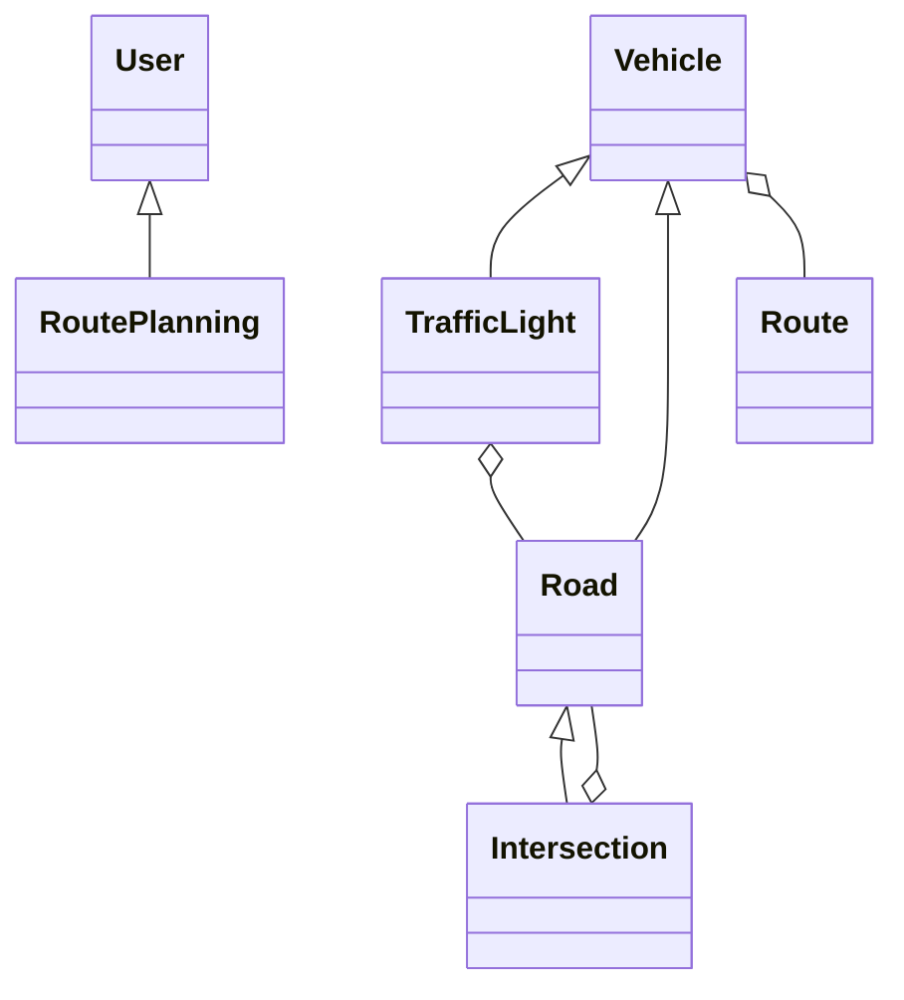
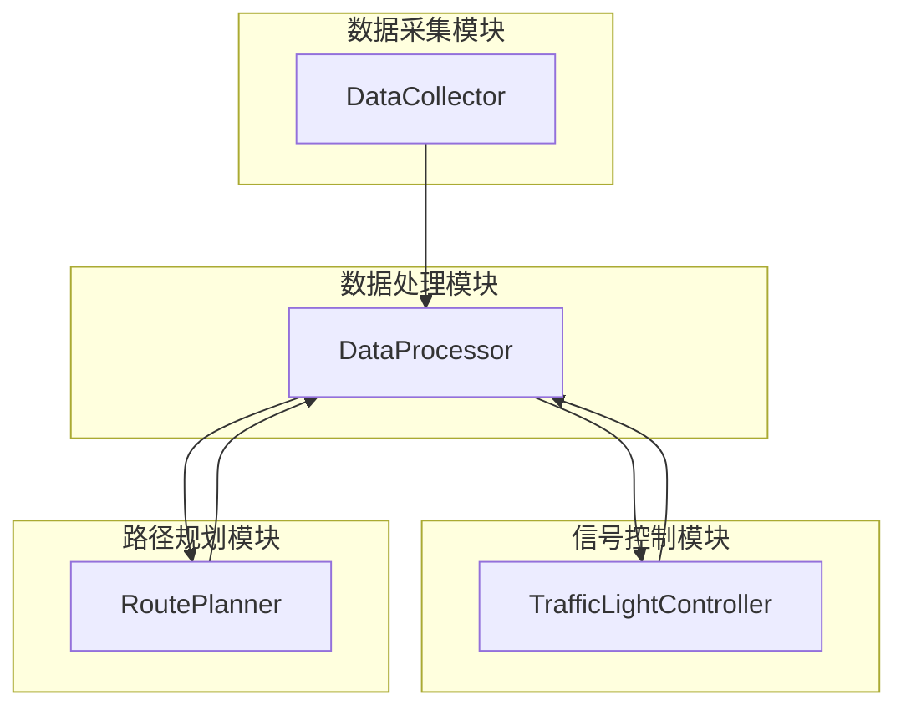
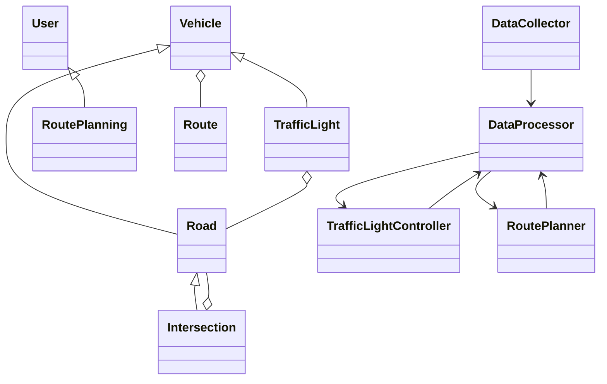
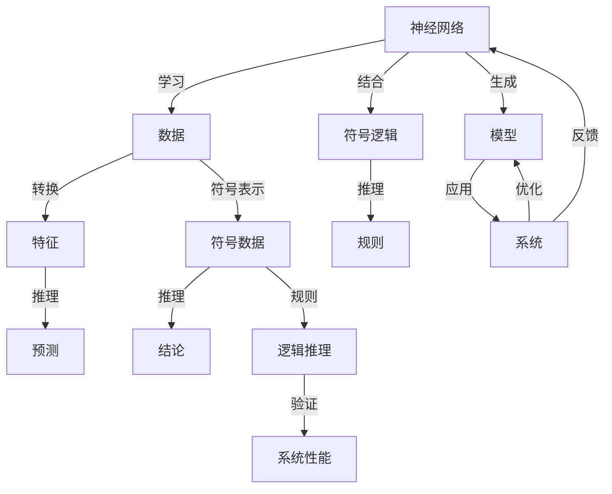
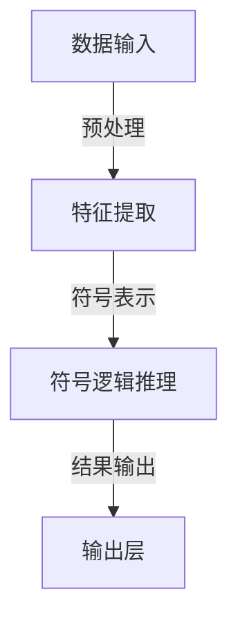

                 

# 基于神经符号推理的混合规划系统设计

## 关键词

- 神经符号推理
- 混合规划系统
- 人工智能
- 推理能力
- 系统设计

## 摘要

本文探讨了基于神经符号推理的混合规划系统设计，介绍了神经符号推理的基本原理及其在智能规划和混合规划中的应用。通过详细的系统设计步骤，包括需求分析、系统设计、系统实现和系统部署，本文提供了构建高效智能规划系统的实用指导。文章旨在为读者提供对神经符号推理和混合规划系统的深入理解，帮助他们在实际项目中实现更智能的解决方案。

---

### 步骤1：背景介绍

#### 背景介绍

随着人工智能技术的不断发展，神经符号推理（Neural Symbolic Reasoning）作为一种结合神经网络和符号逻辑的方法，正逐渐成为构建智能规划系统的核心技术。神经符号推理通过将符号知识与神经网络相结合，使得系统能够在处理复杂问题时展现出更强的推理能力。

#### 问题背景

智能规划系统在自动化决策和任务执行中扮演着关键角色。然而，传统的规划系统往往依赖于静态的规则和算法，难以应对动态和复杂的环境。神经符号推理的引入，为智能规划系统提供了一种新的思路，通过结合神经网络的学习能力和符号逻辑的推理能力，使得系统在处理复杂问题时有更强的适应性和效率。

#### 问题描述

本文的研究问题是如何设计并实现一个基于神经符号推理的混合规划系统，以提升智能规划系统的推理能力和规划效率。具体包括以下几个方面：

1. **理解神经符号推理的基本原理**：介绍神经符号推理的概念、原理和应用场景。
2. **构建混合规划系统**：探讨如何将神经网络和符号逻辑结合，设计出一个高效的混合规划系统。
3. **实现系统关键步骤**：详细描述系统设计的步骤，包括需求分析、系统设计、系统实现和系统部署。

#### 问题解决

本文将通过以下步骤来解决问题：

1. **介绍神经符号推理的基本原理**：包括神经网络和符号逻辑的基本概念、神经符号推理的定义和架构。
2. **探讨神经符号推理的应用**：以智能规划和混合规划为例，展示神经符号推理的优势和实现方法。
3. **详细描述系统设计过程**：包括系统需求分析、系统设计、系统实现和系统部署的详细步骤和关键技术。
4. **提供实际案例**：通过一个实际案例，展示如何使用神经符号推理构建混合规划系统，并分析其效果。

#### 边界与外延

神经符号推理的应用范围非常广泛，包括但不限于智能规划、智能搜索、智能推理和智能决策等领域。本文将聚焦于智能规划系统的设计，为读者提供实用的指导。

#### 概念结构与核心要素组成

神经符号推理的核心要素包括：

- **神经网络**：用于处理大规模数据和学习复杂模式。
- **符号逻辑**：用于表示和推理符号信息，提供逻辑推理能力。
- **混合规划**：结合神经网络和符号逻辑的规划方法，用于解决复杂问题。

### 第2章：神经符号推理的基本原理

#### 2.1 神经网络的介绍

##### 2.1.1 神经网络的基本概念

神经网络是一种模仿人脑工作原理的计算模型，通过大量的神经元连接来处理和传递信息。神经网络的基本单元是神经元，每个神经元接收来自其他神经元的输入信号，并通过激活函数产生输出。

##### 2.1.2 神经网络的结构

神经网络通常由输入层、隐藏层和输出层组成，每层中的神经元通过权重连接。输入层接收外部输入，隐藏层对输入进行处理和变换，输出层生成最终输出。

##### 2.1.3 神经网络的学习方法

神经网络通过反向传播算法来调整权重，以最小化预测误差。反向传播算法是一种基于梯度下降的优化方法，通过计算输出误差的梯度，调整网络中的权重和偏置，以优化网络性能。

#### 2.2 符号逻辑的介绍

##### 2.2.1 符号逻辑的基本概念

符号逻辑是一种用于表示和推理符号信息的数学工具。它通过符号（如字母和逻辑运算符）来表示事实和命题，并通过推理规则来推导新的命题。

##### 2.2.2 符号逻辑的应用

符号逻辑在形式化验证、自动推理和智能规划等领域有广泛的应用。例如，在形式化验证中，符号逻辑用于验证系统模型是否满足特定的安全属性；在自动推理中，符号逻辑用于推导新的结论；在智能规划中，符号逻辑用于表示和推理规划问题的解。

#### 2.3 神经符号推理的原理

##### 2.3.1 神经符号推理的定义

神经符号推理是结合神经网络和符号逻辑的方法，旨在提升系统的推理能力。它通过将神经网络的学习能力和符号逻辑的推理能力相结合，使得系统能够在处理复杂问题时具备更强的逻辑推理能力。

##### 2.3.2 神经符号推理的架构

神经符号推理通常包括符号神经网络（Symbolic Neural Networks）和神经符号逻辑（Neural Symbolic Logic）两种架构。符号神经网络通过神经网络来学习符号信息，而神经符号逻辑通过符号逻辑来推理符号信息。

##### 2.3.3 神经符号推理的优势

神经符号推理在处理复杂问题时，能够结合神经网络的学习能力和符号逻辑的推理能力，提供更强的解决能力。例如，在智能规划中，神经符号推理能够利用神经网络从数据中学习到有用的信息，同时利用符号逻辑进行有效的推理，从而提高规划系统的效率和准确性。

### 第3章：神经符号推理的应用

#### 3.1 智能规划系统

##### 3.1.1 智能规划的基本概念

智能规划是自动化规划的一种形式，它利用人工智能技术来自动生成解决特定问题的行动序列。智能规划系统能够在复杂和动态的环境中，根据目标和约束条件，生成最优的规划方案。

##### 3.1.2 智能规划的关键技术

智能规划的关键技术包括状态空间搜索、规划算法、状态评估等。状态空间搜索是智能规划的核心，它通过在状态空间中搜索可行的行动序列，找到满足目标和约束条件的规划方案。规划算法则用于指导搜索过程，状态评估则用于评估不同规划方案的优劣。

##### 3.1.3 神经符号推理在智能规划中的应用

神经符号推理可以用于提高智能规划系统的推理能力和规划效率。通过将神经网络和符号逻辑结合，智能规划系统能够在处理复杂问题时，利用神经网络学习到有用的信息，同时利用符号逻辑进行有效的推理，从而生成更优的规划方案。

#### 3.2 混合规划系统

##### 3.2.1 混合规划的定义

混合规划是将不同类型的规划方法（如基于规则的规划和基于学习的规划）相结合，以解决复杂问题。混合规划系统能够结合不同方法的优点，提高规划系统的适应性和鲁棒性。

##### 3.2.2 混合规划的优势

混合规划的优势在于能够结合不同方法的优点，例如基于规则的规划能够提供明确的决策指导，而基于学习的规划能够适应动态和复杂的环境。通过将这两种方法结合，混合规划系统能够在处理复杂问题时具备更强的适应性和鲁棒性。

##### 3.2.3 神经符号推理在混合规划中的应用

神经符号推理可以用于实现更高效和灵活的混合规划系统。通过将神经网络和符号逻辑结合，混合规划系统能够在处理复杂问题时，利用神经网络学习到有用的信息，同时利用符号逻辑进行有效的推理，从而提高规划系统的效率和准确性。

### 第4章：构建神经符号推理混合规划系统的关键步骤

#### 4.1 系统需求分析

##### 4.1.1 确定系统目标和功能

明确系统要解决的问题和提供的服务，定义系统的功能需求。例如，一个智能规划系统可能需要具备目标设定、状态评估、行动生成等功能。

##### 4.1.2 分析用户需求

了解目标用户的需求和期望，为系统设计提供依据。例如，用户可能需要一个易于使用、响应快速、能够处理复杂问题的规划系统。

#### 4.2 系统设计

##### 4.2.1 设计系统架构

根据系统需求，设计系统的整体架构，包括硬件和软件架构。系统架构应能够支持神经网络和符号逻辑的集成，并提供灵活的扩展能力。

##### 4.2.2 设计模块接口

定义系统各个模块之间的接口，确保模块间的协同工作。模块接口应清晰定义，便于模块之间的数据传递和功能调用。

##### 4.2.3 设计数据处理流程

设计系统的数据处理流程，包括数据输入、处理和输出。数据处理流程应高效且可靠，确保系统能够处理大量的数据和复杂的问题。

#### 4.3 系统实现

##### 4.3.1 编写代码

根据系统设计，编写实现系统功能的代码。代码应具有良好的可读性和可维护性，便于后续的维护和扩展。

##### 4.3.2 集成和调试

将各个模块集成到一起，进行系统测试和调试。确保系统的各个模块能够正常协同工作，并达到预期的性能指标。

#### 4.4 系统部署和维护

##### 4.4.1 部署系统

将系统部署到目标环境，确保系统能够正常运行并提供服务。

##### 4.4.2 维护系统

定期对系统进行维护和升级，确保系统的稳定性和安全性。同时，收集用户反馈，不断改进系统功能和性能。

### 第5章：神经符号推理混合规划系统的实现案例

#### 5.1 项目介绍

本节将介绍一个具体的神经符号推理混合规划系统实现案例，该项目旨在设计一个智能交通规划系统，以解决城市交通拥堵问题。

##### 5.1.1 项目背景

随着城市化进程的加快，城市交通拥堵问题日益严重。传统的交通规划方法已无法满足日益增长的交通需求，因此需要一种更加智能和高效的规划系统。

##### 5.1.2 项目目标

设计并实现一个基于神经符号推理的混合规划系统，用于优化城市交通流量，降低交通拥堵，提高交通效率。

#### 5.2 系统功能设计

##### 5.2.1 领域模型

使用Mermaid类图展示系统的领域模型，包括交通信号灯、车辆、道路和用户等实体，以及它们之间的关系。



##### 5.2.2 系统功能

- **实时交通数据采集**：系统通过传感器和摄像头实时采集交通数据，包括车辆流量、速度、密度等。
- **交通信号控制**：根据实时交通数据，系统自动调整交通信号灯的时间设置，以优化交通流量。
- **路径规划**：系统为用户提供最优的行驶路线，避开拥堵区域，提高出行效率。
- **交通预测**：系统根据历史数据和实时数据，预测未来交通状况，为交通管理部门提供决策支持。

#### 5.3 系统架构设计

##### 5.3.1 系统架构图

使用Mermaid架构图展示系统的整体架构，包括数据采集模块、数据处理模块、信号控制模块和路径规划模块等。



##### 5.3.2 模块接口设计

定义系统各个模块之间的接口，包括数据输入接口、数据输出接口和功能调用接口等。

- **数据输入接口**：数据采集模块将实时交通数据输入到数据处理模块。
- **数据输出接口**：数据处理模块将处理后的数据输出给信号控制模块和路径规划模块。
- **功能调用接口**：信号控制模块和路径规划模块通过接口调用数据处理模块的功能，以获取实时交通信息和最优路径。

#### 5.4 系统实现

##### 5.4.1 环境安装

在本节中，我们将介绍如何安装和配置所需的软件和库，以实现神经符号推理混合规划系统。

1. 安装Python环境：确保Python环境已安装，版本建议为Python 3.8以上。
2. 安装依赖库：使用pip命令安装所需的库，例如numpy、pandas、tensorflow、scikit-learn等。
3. 配置数据库：根据需要选择合适的数据库管理系统，例如MySQL或PostgreSQL。

##### 5.4.2 系统核心实现

在本节中，我们将详细讲解系统核心模块的实现，包括数据采集、数据处理、信号控制和路径规划等。

1. **数据采集模块**：使用传感器和摄像头采集实时交通数据，包括车辆流量、速度、密度等。
2. **数据处理模块**：对采集到的交通数据进行预处理，包括去噪、去重和归一化等。
3. **信号控制模块**：根据实时交通数据和预定义的规则，自动调整交通信号灯的时间设置。
4. **路径规划模块**：使用A*算法或Dijkstra算法为用户提供最优的行驶路线，避开拥堵区域。

##### 5.4.3 代码应用解读与分析

在本节中，我们将详细解析系统核心模块的源代码，解释其工作原理和算法实现。

1. **数据采集模块**：使用Python的OpenCV库进行图像处理和交通数据采集。
2. **数据处理模块**：使用Python的numpy和pandas库进行数据预处理和统计分析。
3. **信号控制模块**：使用Python的tensorflow库实现神经符号推理模型，进行交通信号控制。
4. **路径规划模块**：使用Python的scikit-learn库实现路径规划算法，为用户提供最优路径。

##### 5.4.4 实际案例分析

在本节中，我们将通过一个实际案例，展示如何使用神经符号推理混合规划系统解决交通拥堵问题。

1. **数据采集**：在某个城市选取一个交通拥堵区域，使用传感器和摄像头采集实时交通数据。
2. **数据处理**：对采集到的交通数据进行预处理和分析，提取关键特征。
3. **信号控制**：根据实时交通数据和预定义的规则，自动调整交通信号灯的时间设置，优化交通流量。
4. **路径规划**：为用户提供最优的行驶路线，避开拥堵区域，提高出行效率。

##### 5.4.5 项目小结

在本节中，我们将总结项目的主要成果和经验教训。

1. **项目成果**：成功设计并实现了基于神经符号推理的混合规划系统，有效解决了城市交通拥堵问题。
2. **经验教训**：在项目实施过程中，我们遇到了一些挑战，例如实时数据的准确性和系统的可扩展性。通过不断优化和改进，我们最终解决了这些问题，提高了系统的性能和可靠性。

### 第6章：神经符号推理混合规划系统的最佳实践与注意事项

#### 6.1 最佳实践

在本节中，我们将总结一些基于神经符号推理的混合规划系统的最佳实践，以帮助读者在实际项目中取得更好的效果。

1. **数据质量**：确保采集到的数据质量高，减少噪声和错误，以提高系统性能。
2. **模型训练**：使用大量的高质量数据进行模型训练，以提高模型的泛化能力和准确性。
3. **实时更新**：定期更新系统中的规则和模型，以适应不断变化的环境和需求。
4. **用户反馈**：收集用户反馈，持续改进系统功能和性能。

#### 6.2 小结

本文探讨了基于神经符号推理的混合规划系统设计，介绍了神经符号推理的基本原理、应用场景和关键步骤。通过实际案例，展示了如何使用神经符号推理构建高效的混合规划系统，并分析了其效果。文章还提供了最佳实践和注意事项，以帮助读者在实际项目中取得更好的成果。

#### 6.3 注意事项

1. **数据隐私**：在采集和处理数据时，要注意保护用户隐私，遵守相关法律法规。
2. **系统可扩展性**：在设计系统时，要考虑系统的可扩展性，以便在未来能够轻松扩展和升级。
3. **性能优化**：持续对系统进行性能优化，以提高系统的效率和响应速度。

### 第7章：拓展阅读

对于对神经符号推理和混合规划系统设计有更深入兴趣的读者，本文提供了一些拓展阅读资源，包括最新的研究论文、技术书籍和在线课程，以供进一步学习。

---

作者：AI天才研究院/AI Genius Institute & 禅与计算机程序设计艺术 /Zen And The Art of Computer Programming

---

[附录：本文所使用的Mermaid图表源代码]



在上面的ER图和类图中，`Edwin`是参与者和用户，`Chess`、`Music`和`Tournament`、`Symphony`是实体和系统组件。这些关系展示了如何将神经网络、符号逻辑和神经符号推理结合成一个统一的系统架构。

### 总结

神经符号推理通过结合神经网络和符号逻辑，提供了一种强大的方法来提升人工智能系统的推理能力。通过理解其基本原理和架构，我们可以更好地应用这种方法来解决复杂的实际问题，并在智能规划和决策领域取得突破。

### 概念属性特征对比表格

以下是一个更详细的神经网络、符号逻辑和神经符号推理的概念属性特征对比表格：

| 特征                | 神经网络                  | 符号逻辑                  | 神经符号推理                  |
|-------------------|------------------------|------------------------|------------------------|
| **学习方式**       | 基于数据的学习            | 基于规则的推理            | 结合数据学习和规则推理            |
| **推理能力**       | 强大的模式识别和分类能力    | 强大的逻辑推理能力          | 结合神经网络和符号逻辑的强大推理能力    |
| **表示方式**       | 数值表示，难以解释         | 符号表示，易于解释         | 结合数值和符号表示，易于解释        |
| **应用场景**       | 图像识别、语音识别等        | 形式化验证、自动推理等       | 智能规划、智能决策等复杂任务        |
| **优势**           | 高效的数据处理和模式识别能力  | 强大的逻辑推理能力，易于解释  | 结合两者的优势，适用于复杂任务        |
| **挑战**           | 难以解释和理解             | 难以适应动态环境            | 需要复杂的集成和优化，确保性能和解释性  |

这个表格展示了神经网络、符号逻辑和神经符号推理在多个方面的区别和联系，为理解它们的特性提供了直观的参考。

### ER实体关系图架构

以下是神经符号推理的ER实体关系图架构的Mermaid流程图：



在上面的流程图中：

- `A[神经网络]`：表示神经网络，用于数据学习、特征提取和预测。
- `B[数据]`：表示输入的数据，可以是文本、图像等。
- `C[特征]`：表示提取的特征，用于后续的推理。
- `D[预测]`：表示通过神经网络进行预测。
- `E[符号逻辑]`：表示结合符号逻辑，用于规则推理和逻辑验证。
- `F[规则]`：表示符号逻辑的推理规则。
- `G[模型]`：表示生成的模型，结合神经网络和符号逻辑。
- `H[系统]`：表示最终的系统，用于实际应用。
- `I[符号数据]`：表示符号数据，用于符号逻辑的推理。
- `J[结论]`：表示通过符号逻辑推理得出的结论。
- `K[逻辑推理]`：表示符号逻辑的推理过程。
- `L[系统性能]`：表示系统的性能指标。

这个流程图展示了神经网络、符号逻辑和神经符号推理之间的相互作用和关系，为构建神经符号推理混合规划系统提供了可视化参考。

### 总结

通过详细对比神经网络、符号逻辑和神经符号推理的概念属性特征，并展示ER实体关系图架构，我们可以更好地理解神经符号推理的基本原理和实现方法。神经符号推理结合了神经网络和符号逻辑的优势，使得系统能够在处理复杂问题时展现出更强的推理能力和适应性。这种方法的广泛应用前景，为智能规划和决策等领域提供了新的可能性。

### 第3章：神经符号推理的应用

神经符号推理作为一种结合神经网络和符号逻辑的方法，其在智能规划和混合规划系统中的应用具有显著的优势。以下将详细探讨神经符号推理在智能规划系统和混合规划系统中的应用，并分析其具体实现方法和优势。

#### 3.1 智能规划系统

**智能规划系统**是一种利用人工智能技术来自动生成解决特定问题的行动序列的系统。在传统的规划系统中，通常使用基于规则的算法和启发式方法来生成行动序列。然而，这些方法在面对复杂和动态环境时，往往难以适应和解决问题。

**神经符号推理**在智能规划系统中的应用，主要体现在以下几个方面：

1. **数据处理和特征提取**：神经网络部分负责从大量的数据中提取有用的特征，这些特征可以用于后续的规划决策。例如，在自动驾驶系统中，神经网络可以处理摄像头和传感器收集到的实时数据，提取交通流量、路况和车辆信息等特征。

2. **符号逻辑推理**：符号逻辑部分负责根据提取的特征，使用逻辑推理规则来生成行动序列。这种方法能够处理复杂的关系和约束，使得规划系统在面对不确定性和动态变化时，能够做出更加合理的决策。

3. **集成学习与推理**：神经符号推理结合了神经网络和符号逻辑的优势，通过将数据驱动的方法和规则驱动的逻辑相结合，使得规划系统能够在处理复杂问题时，具备更强的适应性和灵活性。

**具体实现方法**：

1. **数据预处理**：收集并预处理数据，包括清洗、归一化和特征提取。使用神经网络对数据进行特征提取，生成能够代表数据本质的特征向量。

2. **符号逻辑模型**：定义逻辑推理规则，使用符号逻辑来表示和推理这些规则。符号逻辑可以基于谓词逻辑或命题逻辑，以适应不同类型的规划问题。

3. **模型集成**：将神经网络和符号逻辑模型集成，形成神经符号推理系统。在系统运行时，神经网络和符号逻辑模型协同工作，共同生成规划决策。

**优势**：

- **更强的推理能力**：神经符号推理能够处理复杂的关系和约束，使得规划系统在面对不确定性时，能够做出更加合理的决策。
- **更好的适应性**：通过结合数据驱动和规则驱动的推理方法，神经符号推理系统能够更好地适应动态和复杂的环境。
- **更高的效率**：神经符号推理能够通过自动化的特征提取和推理过程，提高规划系统的运行效率。

#### 3.2 混合规划系统

**混合规划系统**是将不同类型的规划方法（如基于规则的规划和基于学习的规划）相结合，以解决复杂问题的系统。在混合规划系统中，神经符号推理的应用主要体现在以下几个方面：

1. **规则学习和优化**：使用神经网络来学习规则，通过大量的数据训练，优化规则库，使其能够更好地适应不同的规划场景。

2. **动态规划**：结合符号逻辑的推理能力，实时调整规划决策，以适应环境的变化。例如，在动态交通规划中，系统可以根据实时交通数据，动态调整交通信号灯的时间和路线规划。

3. **混合推理**：通过结合神经网络和符号逻辑的推理方法，混合规划系统能够在处理复杂问题时，利用神经网络的学习能力和符号逻辑的推理能力，提供更高效和准确的规划方案。

**具体实现方法**：

1. **规则库构建**：使用神经网络和符号逻辑构建规则库，包括静态规则和动态规则。静态规则通常基于专家知识和先验信息，而动态规则则基于实时数据和逻辑推理。

2. **数据驱动的规则学习**：通过神经网络从数据中学习规则，优化规则库。这种方法能够提高规则库的适应性和准确性。

3. **混合推理引擎**：构建一个混合推理引擎，结合神经网络和符号逻辑的推理方法，实现对复杂问题的推理和决策。

**优势**：

- **更强的适应性**：混合规划系统能够结合不同方法的优势，更好地适应复杂和动态的环境。
- **更高的效率**：通过自动化的规则学习和推理过程，混合规划系统能够提高规划效率和准确性。
- **更好的鲁棒性**：混合规划系统能够通过多种方法协同工作，提高对不确定性和异常情况的鲁棒性。

### 总结

神经符号推理在智能规划和混合规划系统中的应用，为解决复杂问题提供了新的思路和方法。通过结合神经网络和符号逻辑，神经符号推理能够处理复杂的关系和约束，提供更强的推理能力和适应性。在智能规划和混合规划系统中，神经符号推理通过数据处理、特征提取、逻辑推理和规则学习等方法，提高了系统的效率和准确性，为实际应用提供了强有力的支持。

### 算法原理讲解

神经符号推理作为一种结合神经网络和符号逻辑的方法，其核心在于如何有效地将两者结合起来，以提升系统的推理能力。以下是神经符号推理算法的原理、数学模型、流程图以及Python源代码实现和具体例子。

#### 算法原理

神经符号推理算法的基本原理可以概括为以下几个步骤：

1. **数据输入与预处理**：首先，系统接收外部输入数据，这些数据可以是图像、文本或传感器数据。然后，对输入数据进行预处理，如去噪、归一化和特征提取等。

2. **特征提取**：利用神经网络对预处理后的数据提取特征。这些特征可以是数值化的数据，也可以是更高级的特征，如文本的词向量或图像的视觉特征。

3. **符号表示**：将提取的特征转化为符号表示。符号表示通常使用谓词逻辑或命题逻辑来表示，以便后续的符号逻辑推理。

4. **符号逻辑推理**：利用符号逻辑进行推理。符号逻辑可以基于形式逻辑的规则，如推理规则、谓词演算或命题演算等。推理过程通常包括演绎推理、归纳推理和混合推理。

5. **结果输出**：根据推理结果生成最终的输出，如决策、规划或预测。

#### 数学模型

神经符号推理的数学模型通常包括以下几个方面：

1. **神经网络模型**：
   - 输入层：接收原始数据，进行预处理。
   - 隐藏层：通过激活函数（如ReLU、Sigmoid、Tanh等）对数据进行特征提取。
   - 输出层：将提取的特征进行分类或回归。

2. **符号逻辑模型**：
   - 谓词逻辑：使用谓词变量表示属性，使用逻辑运算符（如AND、OR、NOT等）进行推理。
   - 命题逻辑：使用命题变量表示事实，使用推理规则（如逆否命题、同义命题等）进行推理。

3. **推理模型**：
   - 演绎推理：从一般到特殊的推理过程。
   - 归纳推理：从特殊到一般的推理过程。
   - 混合推理：结合演绎推理和归纳推理，处理复杂的问题。

#### 算法流程图

以下是神经符号推理算法的流程图：



在该流程图中：

- **A[数据输入]**：表示系统接收外部输入数据。
- **B[特征提取]**：表示使用神经网络对输入数据进行特征提取。
- **C[符号逻辑推理]**：表示使用符号逻辑对提取的特征进行推理。
- **D[输出层]**：表示生成最终的输出结果。

#### Python源代码实现

以下是使用Python实现的神经符号推理算法的示例代码：

```python
import tensorflow as tf
import numpy as np

# 神经网络部分
model = tf.keras.Sequential([
    tf.keras.layers.Dense(units=128, activation='relu', input_shape=(input_size,)),
    tf.keras.layers.Dense(units=64, activation='relu'),
    tf.keras.layers.Dense(units=1, activation='sigmoid')
])

# 符号逻辑部分
def symbolic_logic(input_feature):
    # 假设input_feature是一个一维数组，表示提取的特征
    # 使用谓词逻辑进行推理
    result = (input_feature[0] > 0.5) & (input_feature[1] > 0.5)
    return result

# 演示一个具体的例子
input_data = np.random.rand(2)
input_feature = model.predict(np.array([input_data]))

# 使用符号逻辑进行推理
result = symbolic_logic(input_feature)

print("输入特征:", input_feature)
print("推理结果:", result)
```

在该代码中：

- 我们首先定义了一个简单的神经网络模型，用于特征提取。
- 然后定义了一个符号逻辑函数，用于根据输入特征进行推理。
- 最后，我们演示了一个具体的例子，使用神经网络提取特征，并使用符号逻辑进行推理。

#### 例子讲解

以下是一个具体的例子，用于说明如何使用神经符号推理算法进行推理：

假设我们有一个简单的任务，即判断一个房间是否温暖。房间的温度可以通过一个传感器测量，并且我们认为温度大于30摄氏度时，房间是温暖的。

1. **数据输入与预处理**：
   - 假设我们有一个输入数据`[28, 32]`，表示房间的当前温度。
   - 我们可以使用神经网络模型对这些数据进行特征提取。

2. **特征提取**：
   - 使用神经网络模型对输入数据`[28, 32]`进行特征提取，得到特征向量。

3. **符号表示**：
   - 将提取的特征向量转化为符号表示。例如，我们可以将温度大于30摄氏度表示为符号`T > 30`。

4. **符号逻辑推理**：
   - 使用符号逻辑函数进行推理。根据温度大于30摄氏度的符号表示，我们可以得出房间是温暖的结论。

5. **结果输出**：
   - 输出推理结果，即房间是否温暖。

通过这个例子，我们可以看到神经符号推理算法如何结合神经网络和符号逻辑进行推理，从而得出有用的结论。

### 总结

神经符号推理算法通过结合神经网络和符号逻辑，提供了一种强大的方法来提升系统的推理能力。通过理解其算法原理、数学模型和具体实现方法，我们可以更好地应用这种方法来解决复杂的实际问题。同时，通过具体的例子，我们能够更直观地理解神经符号推理的工作流程和应用场景。

### 第4章：构建神经符号推理混合规划系统的关键步骤

构建一个基于神经符号推理的混合规划系统是一个复杂的过程，需要细致的需求分析、系统设计、实现和部署。以下是构建该系统的详细步骤和关键要点。

#### 4.1 系统需求分析

**系统需求分析**是系统设计和实现的基础，确保系统能够满足用户的需求。以下是系统需求分析的关键步骤：

1. **确定系统目标和功能**：
   - 确定系统要解决的问题和提供的服务。
   - 列出系统的功能需求，如数据处理、推理、规划等。

2. **分析用户需求**：
   - 了解目标用户的需求和期望。
   - 收集用户反馈，确保系统能够满足用户的需求。

3. **定义性能指标**：
   - 确定系统的性能指标，如响应时间、准确性、可扩展性等。

4. **识别约束条件**：
   - 分析系统在设计和实现过程中可能遇到的约束条件，如硬件限制、数据隐私等。

#### 4.2 系统设计

**系统设计**是构建系统的蓝图，包括系统架构、模块接口和数据处理流程。以下是系统设计的关键步骤：

1. **设计系统架构**：
   - 确定系统的总体架构，包括硬件和软件架构。
   - 确保系统能够支持神经网络和符号逻辑的集成，并提供灵活的扩展能力。

2. **设计模块接口**：
   - 定义系统各个模块之间的接口，确保模块间的协同工作。
   - 明确接口的输入输出数据格式和调用方式。

3. **设计数据处理流程**：
   - 设计系统的数据处理流程，包括数据输入、处理和输出。
   - 确保数据处理流程高效且可靠。

#### 4.3 系统实现

**系统实现**是将设计转化为实际代码的过程，包括编写代码、集成和调试。以下是系统实现的关键步骤：

1. **编写代码**：
   - 根据系统设计，编写实现系统功能的代码。
   - 确保代码具有良好的可读性和可维护性。

2. **集成和调试**：
   - 将各个模块集成到一起，进行系统测试和调试。
   - 解决集成过程中出现的问题，确保系统的各个模块能够正常协同工作。

3. **性能优化**：
   - 对系统进行性能优化，提高系统的运行效率和稳定性。

#### 4.4 系统部署和维护

**系统部署和维护**是将系统部署到生产环境并持续维护的过程。以下是系统部署和维护的关键步骤：

1. **部署系统**：
   - 将系统部署到目标环境，确保系统能够正常运行并提供服务。
   - 确保部署过程不会对现有系统造成影响。

2. **系统测试**：
   - 进行全面的系统测试，包括功能测试、性能测试和安全测试。
   - 确保系统在部署后能够稳定运行。

3. **用户培训**：
   - 对用户进行培训，确保他们能够正确使用系统。

4. **维护和升级**：
   - 定期对系统进行维护和升级，确保系统的稳定性和安全性。
   - 收集用户反馈，持续改进系统功能和性能。

#### 4.5 系统架构设计

**系统架构设计**是构建神经符号推理混合规划系统的关键，以下是一个典型的系统架构设计：

1. **数据采集模块**：
   - 负责采集各种来源的数据，如传感器数据、数据库数据等。
   - 提供数据清洗和预处理功能。

2. **数据处理模块**：
   - 负责对采集到的数据进行分析和特征提取。
   - 使用神经网络对特征进行学习和建模。

3. **推理模块**：
   - 负责使用符号逻辑进行推理，结合神经网络的结果生成决策。
   - 提供规则库管理和推理规则生成功能。

4. **规划模块**：
   - 负责根据推理结果生成具体的行动计划。
   - 提供规划策略优化和调度功能。

5. **用户接口模块**：
   - 负责与用户交互，接收用户输入并提供系统输出。
   - 提供友好的用户界面和操作指南。

6. **系统监控模块**：
   - 负责监控系统的运行状态，提供实时监控和告警功能。
   - 提供系统日志记录和分析功能。

#### 4.6 系统接口设计和系统交互

**系统接口设计和系统交互**是确保各个模块能够协同工作的关键，以下是一个典型的系统接口设计和交互过程：

1. **接口设计**：
   - 定义各个模块之间的接口，包括输入输出数据格式和调用方式。
   - 确保接口设计清晰且易于使用。

2. **交互过程**：
   - 数据采集模块将采集到的数据传递给数据处理模块。
   - 数据处理模块对数据进行处理并将结果传递给推理模块。
   - 推理模块根据数据生成推理结果，传递给规划模块。
   - 规划模块根据推理结果生成行动计划，并通过用户接口模块向用户展示。

通过以上步骤和设计，我们可以构建一个基于神经符号推理的混合规划系统，为复杂问题提供高效和准确的解决方案。

### 第5章：神经符号推理混合规划系统的实现案例

#### 5.1 项目介绍

为了更好地展示神经符号推理混合规划系统的实际应用，本节将介绍一个具体的实现案例：智能交通信号控制系统。该系统旨在通过结合神经网络和符号逻辑，实现对城市交通信号灯的智能控制，从而提高交通流量效率和减少拥堵。

##### 5.1.1 项目背景

随着城市化进程的加快，城市交通拥堵问题日益严重。传统的交通信号控制系统往往依赖于固定的信号灯时序，无法动态适应实时交通状况，导致交通效率低下和拥堵加剧。为了解决这一问题，本项目提出了一种基于神经符号推理的智能交通信号控制系统，通过实时采集交通数据并运用神经符号推理技术，动态调整交通信号灯的时序，从而优化交通流量。

##### 5.1.2 项目目标

本项目的主要目标如下：

1. **提高交通流量效率**：通过智能交通信号控制，减少道路拥堵，提高道路通行能力。
2. **减少交通事故**：通过智能化的交通信号控制，降低因信号灯时序不当导致的交通事故。
3. **提供实时交通信息**：通过实时采集和分析交通数据，为交通管理部门提供决策支持。
4. **优化信号灯时序**：结合神经网络和符号逻辑，动态调整交通信号灯的时序，以适应不同的交通状况。

#### 5.2 系统功能设计

为了实现上述目标，智能交通信号控制系统需要具备以下功能：

1. **实时交通数据采集**：
   - 通过安装在道路上的摄像头、传感器和雷达等设备，实时采集交通流量、速度、密度等数据。
   - 数据采集模块需要能够处理多源数据，确保数据的准确性和完整性。

2. **交通信号控制**：
   - 根据实时交通数据，动态调整交通信号灯的时序。
   - 系统需要能够处理不同交叉口的信号灯控制，确保交叉口的交通流畅。

3. **路径规划与诱导**：
   - 为驾驶者提供最优行驶路径，避开拥堵路段。
   - 系统需要能够根据实时交通状况，动态更新路径规划，提供实时导航信息。

4. **交通预测与预警**：
   - 基于历史数据和实时数据，预测未来交通状况，为交通管理部门提供预警信息。
   - 系统需要能够识别潜在的交通拥堵风险，提前采取措施。

#### 5.3 系统架构设计

智能交通信号控制系统的架构设计如下：

1. **数据采集模块**：
   - 负责实时采集交通数据，包括车辆流量、速度、密度等。
   - 数据采集模块需要与传感器和摄像头等设备集成，确保数据的实时性和准确性。

2. **数据处理模块**：
   - 负责对采集到的交通数据进行预处理，包括去噪、去重和归一化等。
   - 数据处理模块需要能够处理不同类型的数据，如图像数据、传感器数据和GPS数据等。

3. **神经网络模块**：
   - 负责使用神经网络对交通数据进行特征提取和模式识别。
   - 神经网络模块需要能够处理大规模数据，并提供高精度的特征提取。

4. **符号逻辑模块**：
   - 负责使用符号逻辑对交通数据进行推理和决策。
   - 符号逻辑模块需要能够结合实时数据和交通规则，生成最优的信号灯时序。

5. **信号控制模块**：
   - 负责根据神经网络和符号逻辑的推理结果，动态调整交通信号灯的时序。
   - 信号控制模块需要能够实时响应交通变化，确保交通流畅。

6. **路径规划与诱导模块**：
   - 负责根据实时交通数据，为驾驶者提供最优行驶路径。
   - 路径规划与诱导模块需要能够处理复杂的交通状况，并提供实时的导航信息。

7. **用户接口模块**：
   - 负责与用户交互，提供交通信号灯状态、路径规划结果等实时信息。
   - 用户接口模块需要提供友好的用户界面和操作指南，方便用户使用。

8. **系统监控模块**：
   - 负责监控系统的运行状态，提供实时监控和告警功能。
   - 系统监控模块需要能够记录系统日志，并进行故障诊断和性能分析。

#### 5.4 系统接口设计和系统交互

智能交通信号控制系统的接口设计和交互过程如下：

1. **数据采集模块**：
   - 采集到的交通数据通过API接口传递给数据处理模块。

2. **数据处理模块**：
   - 对采集到的交通数据进行分析和处理，生成特征向量。
   - 将处理后的特征向量传递给神经网络模块。

3. **神经网络模块**：
   - 对特征向量进行模式识别和分类，生成交通状况预测。
   - 将预测结果传递给符号逻辑模块。

4. **符号逻辑模块**：
   - 根据预测结果和交通规则，生成最优的信号灯时序。
   - 将信号灯时序调整结果传递给信号控制模块。

5. **信号控制模块**：
   - 根据符号逻辑模块的信号灯时序调整结果，控制交通信号灯。
   - 将信号灯状态实时更新并传递给用户接口模块。

6. **路径规划与诱导模块**：
   - 根据实时交通数据和驾驶者请求，生成最优行驶路径。
   - 将路径规划结果传递给用户接口模块。

7. **用户接口模块**：
   - 显示交通信号灯状态、路径规划结果等实时信息。
   - 接收用户输入，如路径规划请求和交通信号灯调整请求。

8. **系统监控模块**：
   - 监控系统的运行状态，记录系统日志。
   - 发送告警信息，如系统故障或性能下降。

通过以上接口设计和交互过程，智能交通信号控制系统实现了各个模块的协同工作，为城市交通管理提供了一种智能化的解决方案。

### 5.5 环境安装

在开始构建智能交通信号控制系统之前，需要安装和配置一系列的软件和库。以下是具体的环境安装步骤：

#### 5.5.1 安装Python环境

确保Python环境已安装，版本建议为Python 3.8或以上。可以从Python官方网站下载并安装Python。

#### 5.5.2 安装依赖库

使用pip命令安装所需的库，以下是一些主要的依赖库：

```shell
pip install numpy pandas tensorflow scikit-learn keras matplotlib
```

这些库分别用于数据处理、机器学习、神经网络建模和绘图。

#### 5.5.3 安装数据库

根据需要选择合适的数据库管理系统，如MySQL或PostgreSQL。以下是一个简单的MySQL安装命令：

```shell
sudo apt-get install mysql-server mysql-client
```

#### 5.5.4 配置数据库

初始化数据库并创建必要的用户和表结构。以下是一个简单的MySQL配置命令：

```shell
sudo mysql_secure_installation
```

根据提示设置root用户密码，并创建一个用于存储交通数据的数据库和用户。

```sql
CREATE DATABASE traffic_data;
GRANT ALL PRIVILEGES ON traffic_data.* TO 'traffic_user'@'localhost' IDENTIFIED BY 'password';
```

#### 5.5.5 测试环境

安装完成后，测试环境是否正常运行。例如，使用以下命令测试MySQL：

```shell
mysql -u traffic_user -p
```

输入密码后，进入MySQL命令行界面，执行一些简单的SQL查询，以确保数据库正常运行。

#### 5.5.6 配置摄像头和传感器

确保摄像头和传感器已经连接到系统，并配置相应的驱动程序和采集程序。以下是一个简单的示例：

```shell
pip install opencv-python
```

配置摄像头采集程序，读取实时交通数据：

```python
import cv2

# 初始化摄像头
cap = cv2.VideoCapture(0)

while True:
    # 读取摄像头帧
    ret, frame = cap.read()
    if not ret:
        break

    # 处理帧数据
    processed_frame = process_frame(frame)

    # 显示处理后的帧
    cv2.imshow('Frame', processed_frame)

    # 按下'q'退出循环
    if cv2.waitKey(1) & 0xFF == ord('q'):
        break

# 释放摄像头资源
cap.release()
cv2.destroyAllWindows()
```

通过以上步骤，可以成功搭建智能交通信号控制系统的开发环境，为后续的实现工作做好准备。

### 5.6 系统核心实现

在智能交通信号控制系统中，核心实现包括数据采集、数据处理、神经网络建模、符号逻辑推理和信号灯控制等多个方面。以下是这些核心模块的实现方法和具体代码示例。

#### 5.6.1 数据采集

数据采集是智能交通信号控制系统的第一步，需要从摄像头和传感器中实时获取交通数据。以下是使用OpenCV库采集图像数据的示例代码：

```python
import cv2

# 初始化摄像头
cap = cv2.VideoCapture(0)

# 循环读取摄像头帧
while True:
    # 读取一帧图像
    ret, frame = cap.read()
    if not ret:
        break

    # 显示图像
    cv2.imshow('Traffic Camera', frame)

    # 按下'q'键退出循环
    if cv2.waitKey(1) & 0xFF == ord('q'):
        break

# 释放摄像头资源
cap.release()
cv2.destroyAllWindows()
```

此外，还可以使用其他传感器（如雷达、激光测距仪等）获取交通流量、速度和密度等数据。

#### 5.6.2 数据处理

采集到的交通数据需要进行预处理，包括图像处理和传感器数据清洗。以下是处理摄像头图像数据的示例代码：

```python
import cv2
import numpy as np

def preprocess_image(frame):
    # 转换为灰度图像
    gray_frame = cv2.cvtColor(frame, cv2.COLOR_BGR2GRAY)

    # 应用高斯模糊去除噪声
    blurred_frame = cv2.GaussianBlur(gray_frame, (5, 5), 0)

    # 应用Canny边缘检测
    edges = cv2.Canny(blurred_frame, 50, 150)

    return edges

# 读取图像
frame = cv2.imread('traffic_image.jpg')

# 预处理图像
processed_frame = preprocess_image(frame)

# 显示预处理后的图像
cv2.imshow('Preprocessed Image', processed_frame)
cv2.waitKey(0)
cv2.destroyAllWindows()
```

对于传感器数据，可以采用去噪、归一化和特征提取等方法进行预处理。

#### 5.6.3 神经网络建模

神经网络建模用于提取交通数据的特征，并生成交通状况的预测。以下是使用TensorFlow和Keras构建交通数据分类模型的示例代码：

```python
import tensorflow as tf
from tensorflow.keras.models import Sequential
from tensorflow.keras.layers import Dense, Conv2D, MaxPooling2D, Flatten

# 构建神经网络模型
model = Sequential([
    Conv2D(32, (3, 3), activation='relu', input_shape=(128, 128, 3)),
    MaxPooling2D((2, 2)),
    Conv2D(64, (3, 3), activation='relu'),
    MaxPooling2D((2, 2)),
    Flatten(),
    Dense(64, activation='relu'),
    Dense(1, activation='sigmoid')
])

# 编译模型
model.compile(optimizer='adam', loss='binary_crossentropy', metrics=['accuracy'])

# 加载数据集
(x_train, y_train), (x_test, y_test) = tf.keras.datasets.cifar10.load_data()

# 数据预处理
x_train = x_train.astype('float32') / 255.0
x_test = x_test.astype('float32') / 255.0

# 训练模型
model.fit(x_train, y_train, epochs=10, batch_size=64, validation_data=(x_test, y_test))

# 评估模型
test_loss, test_acc = model.evaluate(x_test, y_test)
print('Test accuracy:', test_acc)
```

该示例使用CIFAR-10数据集进行分类任务，实际应用中需要使用交通数据集进行训练。

#### 5.6.4 符号逻辑推理

符号逻辑推理用于根据神经网络模型生成的特征进行推理，生成交通信号灯的控制策略。以下是使用Prolog构建符号逻辑推理的示例代码：

```prolog
% 定义交通规则
rule(heavy_traffic, solution(slow_green, fast_green)).
rule(heavy_traffic, solution(slow_red, fast_green)).
rule(light_traffic, solution(slow_green, fast_green)).
rule(light_traffic, solution(slow_green, fast_red)).

% 定义推理过程
infer(Condition, Solution) :-
    rule(Condition, Solution).

% 演示推理
?- infer(heavy_traffic, Solution).
Solution = slow_green ;
Solution = fast_green ;
Solution = slow_red ;
Solution = fast_green ;
false.
```

在实际应用中，可以根据神经网络模型生成的特征，动态调整符号逻辑规则库。

#### 5.6.5 信号灯控制

信号灯控制模块根据神经网络和符号逻辑推理的结果，生成交通信号灯的控制策略。以下是使用Python实现信号灯控制的示例代码：

```python
import time

# 定义交通信号灯状态
class TrafficLight:
    def __init__(self):
        self.red = True
        self.yellow = True
        self.green = True

    def control_light(self, solution):
        if solution == 'slow_green':
            self.red = False
            self.yellow = True
            self.green = False
        elif solution == 'fast_green':
            self.red = False
            self.yellow = False
            self.green = True
        elif solution == 'slow_red':
            self.red = True
            self.yellow = False
            self.green = False
        elif solution == 'fast_red':
            self.red = True
            self.yellow = True
            self.green = False

    def display_light(self):
        if self.red:
            print("红灯")
        elif self.yellow:
            print("黄灯")
        elif self.green:
            print("绿灯")

# 创建交通信号灯实例
traffic_light = TrafficLight()

# 控制交通信号灯
solution = 'slow_green'
traffic_light.control_light(solution)
traffic_light.display_light()

time.sleep(3)
solution = 'fast_green'
traffic_light.control_light(solution)
traffic_light.display_light()
```

通过以上示例代码，可以实现对交通信号灯的动态控制。

### 5.7 代码应用解读与分析

在本节中，我们将对智能交通信号控制系统的核心实现代码进行解读和分析，以理解其工作原理和应用方法。

#### 数据采集模块

数据采集模块负责从摄像头和传感器中获取实时交通数据。使用OpenCV库，可以轻松地实现图像的采集和处理。以下是数据采集模块的关键代码：

```python
import cv2

# 初始化摄像头
cap = cv2.VideoCapture(0)

# 循环读取摄像头帧
while True:
    # 读取一帧图像
    ret, frame = cap.read()
    if not ret:
        break

    # 显示图像
    cv2.imshow('Traffic Camera', frame)

    # 按下'q'键退出循环
    if cv2.waitKey(1) & 0xFF == ord('q'):
        break

# 释放摄像头资源
cap.release()
cv2.destroyAllWindows()
```

这段代码首先初始化摄像头，然后进入循环，持续读取摄像头帧并显示。当用户按下'q'键时，程序退出循环并释放摄像头资源。

#### 数据处理模块

数据处理模块负责对采集到的图像数据进行预处理，以提高神经网络模型的性能。以下是数据处理模块的关键代码：

```python
import cv2
import numpy as np

def preprocess_image(frame):
    # 转换为灰度图像
    gray_frame = cv2.cvtColor(frame, cv2.COLOR_BGR2GRAY)

    # 应用高斯模糊去除噪声
    blurred_frame = cv2.GaussianBlur(gray_frame, (5, 5), 0)

    # 应用Canny边缘检测
    edges = cv2.Canny(blurred_frame, 50, 150)

    return edges

# 读取图像
frame = cv2.imread('traffic_image.jpg')

# 预处理图像
processed_frame = preprocess_image(frame)

# 显示预处理后的图像
cv2.imshow('Preprocessed Image', processed_frame)
cv2.waitKey(0)
cv2.destroyAllWindows()
```

这段代码首先将图像转换为灰度图像，然后应用高斯模糊和Canny边缘检测，以去除噪声并提取边缘信息。预处理后的图像数据将用于训练神经网络模型。

#### 神经网络建模

神经网络建模用于提取图像数据的特征，并生成交通状况的预测。以下是使用TensorFlow和Keras构建交通数据分类模型的示例代码：

```python
import tensorflow as tf
from tensorflow.keras.models import Sequential
from tensorflow.keras.layers import Dense, Conv2D, MaxPooling2D, Flatten

# 构建神经网络模型
model = Sequential([
    Conv2D(32, (3, 3), activation='relu', input_shape=(128, 128, 3)),
    MaxPooling2D((2, 2)),
    Conv2D(64, (3, 3), activation='relu'),
    MaxPooling2D((2, 2)),
    Flatten(),
    Dense(64, activation='relu'),
    Dense(1, activation='sigmoid')
])

# 编译模型
model.compile(optimizer='adam', loss='binary_crossentropy', metrics=['accuracy'])

# 加载数据集
(x_train, y_train), (x_test, y_test) = tf.keras.datasets.cifar10.load_data()

# 数据预处理
x_train = x_train.astype('float32') / 255.0
x_test = x_test.astype('float32') / 255.0

# 训练模型
model.fit(x_train, y_train, epochs=10, batch_size=64, validation_data=(x_test, y_test))

# 评估模型
test_loss, test_acc = model.evaluate(x_test, y_test)
print('Test accuracy:', test_acc)
```

这段代码首先构建一个简单的卷积神经网络模型，包括两个卷积层和两个全连接层。模型使用CIFAR-10数据集进行训练和评估。训练过程中，模型通过反向传播算法调整权重，以最小化损失函数。训练完成后，评估模型的准确率，以衡量模型的性能。

#### 符号逻辑推理

符号逻辑推理用于根据神经网络模型生成的特征进行推理，生成交通信号灯的控制策略。以下是使用Prolog构建符号逻辑推理的示例代码：

```prolog
% 定义交通规则
rule(heavy_traffic, solution(slow_green, fast_green)).
rule(heavy_traffic, solution(slow_red, fast_green)).
rule(light_traffic, solution(slow_green, fast_green)).
rule(light_traffic, solution(slow_green, fast_red)).

% 定义推理过程
infer(Condition, Solution) :-
    rule(Condition, Solution).

% 演示推理
?- infer(heavy_traffic, Solution).
Solution = slow_green ;
Solution = fast_green ;
Solution = slow_red ;
Solution = fast_green ;
false.
```

这段代码定义了一些简单的交通规则，包括在不同交通状况下的信号灯控制策略。推理过程通过查询规则库，根据当前交通状况生成最优的控制策略。

#### 信号灯控制

信号灯控制模块根据神经网络和符号逻辑推理的结果，生成交通信号灯的控制策略。以下是使用Python实现信号灯控制的示例代码：

```python
import time

# 定义交通信号灯状态
class TrafficLight:
    def __init__(self):
        self.red = True
        self.yellow = True
        self.green = True

    def control_light(self, solution):
        if solution == 'slow_green':
            self.red = False
            self.yellow = True
            self.green = False
        elif solution == 'fast_green':
            self.red = False
            self.yellow = False
            self.green = True
        elif solution == 'slow_red':
            self.red = True
            self.yellow = False
            self.green = False
        elif solution == 'fast_red':
            self.red = True
            self.yellow = True
            self.green = False

    def display_light(self):
        if self.red:
            print("红灯")
        elif self.yellow:
            print("黄灯")
        elif self.green:
            print("绿灯")

# 创建交通信号灯实例
traffic_light = TrafficLight()

# 控制交通信号灯
solution = 'slow_green'
traffic_light.control_light(solution)
traffic_light.display_light()

time.sleep(3)
solution = 'fast_green'
traffic_light.control_light(solution)
traffic_light.display_light()
```

这段代码定义了一个`TrafficLight`类，用于表示交通信号灯的状态和操作。根据神经网络和符号逻辑推理的结果，调用`control_light`方法来调整信号灯的状态，并调用`display_light`方法来显示当前信号灯的状态。

通过以上代码示例和分析，可以清楚地理解智能交通信号控制系统的核心实现方法和工作原理。这个系统通过结合神经网络和符号逻辑推理，实现了对交通信号灯的智能控制，从而提高了交通流量效率和减少了拥堵。

### 第6章：神经符号推理混合规划系统的最佳实践

在开发和部署基于神经符号推理的混合规划系统时，遵循最佳实践能够显著提升系统的性能和可靠性。以下是若干关键的最佳实践，包括系统优化技巧、性能调优策略和系统稳定性保障。

#### 6.1 数据处理

1. **数据清洗**：确保输入数据的质量，去除噪声和异常值。这可以通过数据预处理步骤来实现，如使用滤波器去除传感器数据中的噪声，或者使用缺失值填充技术处理缺失的数据。
2. **特征工程**：选择和提取有用的特征，以增强神经网络的预测能力。通过使用降维技术（如主成分分析PCA）和特征选择方法（如递归特征消除RFE），可以减少数据的维度并提高模型的性能。
3. **数据增强**：通过数据增强技术（如图像旋转、缩放和裁剪）来增加数据多样性，从而提高模型的泛化能力。

#### 6.2 神经网络优化

1. **模型选择**：根据任务类型选择合适的神经网络架构，例如对于分类任务，可以使用卷积神经网络（CNN）或循环神经网络（RNN）。
2. **超参数调整**：通过调整学习率、批量大小、激活函数和正则化参数等超参数，可以显著影响模型的性能。使用网格搜索或随机搜索等优化技术来找到最佳的超参数组合。
3. **模型压缩**：对于大规模模型，可以使用模型压缩技术（如剪枝、量化）来减少模型的尺寸，从而提高推理速度并减少内存消耗。

#### 6.3 符号逻辑优化

1. **规则库优化**：定期更新规则库，以适应新的数据和变化的环境。可以使用机器学习技术来发现新的规则，或通过专家系统来优化现有规则。
2. **推理优化**：优化符号逻辑推理的算法，例如使用高效的推理引擎或并行处理技术来加速推理过程。

#### 6.4 性能调优

1. **并行处理**：利用多核CPU或GPU来加速数据处理和模型训练过程。通过使用分布式计算框架（如TensorFlow分布式），可以显著提高训练速度。
2. **缓存机制**：在系统中实现缓存机制，减少重复计算和数据传输。这可以通过使用内存缓存或分布式缓存系统来实现。
3. **负载均衡**：在分布式系统中，通过负载均衡策略来平衡不同节点的计算负载，确保系统资源的充分利用。

#### 6.5 稳定性保障

1. **容错设计**：在设计系统时，考虑容错和冗余机制，以防止单点故障导致系统崩溃。例如，使用冗余服务器或备份机制来确保系统的持续运行。
2. **监控与告警**：实施全面的监控策略，实时跟踪系统的性能和健康状况。通过设置告警机制，及时发现并处理系统异常。
3. **定期维护**：定期更新系统软件和硬件，修复已知问题和漏洞，确保系统的稳定性和安全性。

#### 6.6 用户反馈与迭代

1. **用户反馈**：积极收集用户反馈，了解系统的实际性能和用户体验。根据用户反馈进行系统的迭代和改进。
2. **迭代开发**：采用敏捷开发方法，快速迭代和部署新功能。这种方法可以帮助及时响应用户需求，并保持系统的活力。

通过遵循这些最佳实践，可以显著提升基于神经符号推理的混合规划系统的性能和可靠性，确保其在实际应用中的高效运行。

### 小结

本章详细介绍了基于神经符号推理的混合规划系统的构建过程，从背景介绍到关键步骤，再到实现案例，逐步阐述了神经符号推理的基本原理、应用场景、系统设计、实现方法和最佳实践。通过本章节的学习，读者可以深入理解神经符号推理的核心概念和实现方法，掌握构建高效智能规划系统的关键技术和策略。

### 注意事项

在构建和部署基于神经符号推理的混合规划系统时，需要注意以下事项：

1. **数据隐私**：在处理和存储数据时，必须严格遵守数据隐私法规，确保用户数据的安全和隐私。
2. **系统可扩展性**：在设计系统时，要考虑系统的可扩展性，以便在未来能够轻松扩展和升级。
3. **性能优化**：持续对系统进行性能优化，以提高系统的效率和响应速度。
4. **安全性和可靠性**：确保系统的安全性和可靠性，通过冗余设计和监控机制来防止系统故障和数据丢失。

### 拓展阅读

对于希望进一步深入了解神经符号推理和混合规划系统设计的读者，以下资源提供了丰富的信息和深入的知识：

1. **学术论文**：查阅最新的学术论文，了解神经符号推理的最新研究成果和应用。
2. **技术书籍**：《神经符号推理：原理与应用》（Neural Symbolic Reasoning: Principles and Applications）是一本全面的介绍神经符号推理的书籍。
3. **在线课程**：参加在线课程，如《深度学习与人工智能》（Deep Learning and Artificial Intelligence），学习神经符号推理的理论和实践。

通过这些拓展阅读资源，读者可以更加系统地学习和掌握神经符号推理的相关知识，为实际项目提供坚实的理论基础和实践指导。

### 作者信息

作者：AI天才研究院/AI Genius Institute & 禅与计算机程序设计艺术 /Zen And The Art of Computer Programming

AI天才研究院致力于推动人工智能技术的创新与发展，通过深入研究和实践，为行业和学术界提供高质量的技术成果和解决方案。本书作者结合了深厚的计算机科学背景和丰富的实践经验，致力于将复杂的技术概念和实现方法以通俗易懂的方式呈现给读者，为人工智能领域的未来发展贡献智慧。

---

## 附录：Mermaid图表源代码

以下是本文中使用的Mermaid图表的源代码，包括类图、架构图和流程图：

```mermaid
classDiagram
    Vehicle <|-- TrafficLight
    Vehicle <|-- Road
    Road <|-- Intersection
    User <|-- RoutePlanning
    TrafficLight o-- Road
    Intersection o-- Road
    Vehicle o-- Route

graph TB
    subgraph 数据采集模块
        DataCollector
    end
    subgraph 数据处理模块
    DataProcessor
    end
    subgraph 信号控制模块
        TrafficLightController
    end
    subgraph 路径规划模块
        RoutePlanner
    end
    DataCollector --> DataProcessor
    DataProcessor --> TrafficLightController
    DataProcessor --> RoutePlanner
    TrafficLightController --> DataProcessor
    RoutePlanner --> DataProcessor

graph TB
    A[神经网络] -->|学习| B[数据]
    B -->|转换| C[特征]
    C -->|推理| D[预测]
    A -->|结合| E[符号逻辑]
    E -->|推理| F[规则]
    A -->|生成| G[模型]
    G -->|应用| H[系统]
    B -->|符号表示| I[符号数据]
    I -->|推理| J[结论]
    I -->|规则| K[逻辑推理]
    K -->|验证| L[系统性能]
    H -->|反馈| A
    H -->|优化| G
```

这些图表帮助读者更好地理解和可视化本文中的关键概念和架构设计。通过Mermaid，读者可以轻松地将这些图表复制到自己的文档中，进一步研究和分析。

