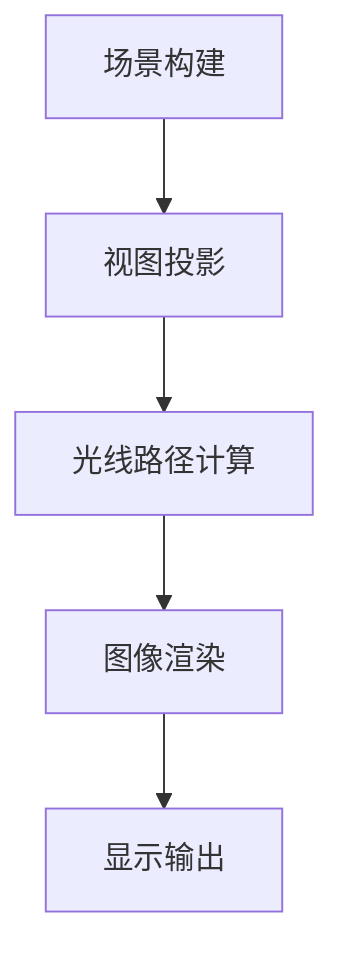
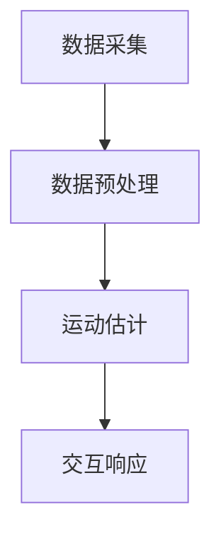
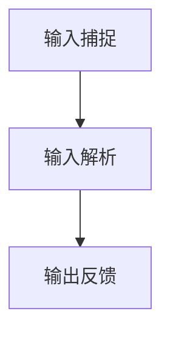
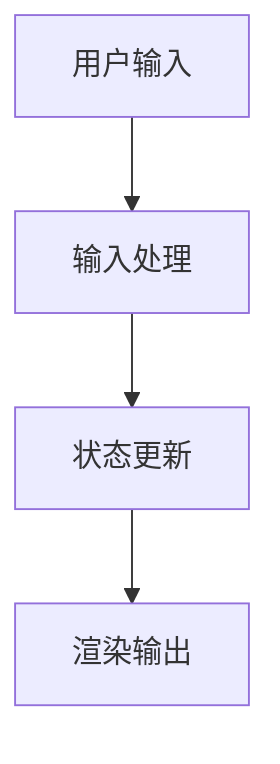

                 


### 增强现实(AR)和虚拟现实(VR)应用开发

> 关键词：增强现实、虚拟现实、应用开发、技术基础、开发流程、工具与平台

> 摘要：本文旨在深入探讨增强现实（AR）和虚拟现实（VR）技术的应用开发。我们将从技术基础入手，逐步分析开发流程、工具与平台，以及应用案例解析，最后探讨未来趋势与挑战。

## 第1章 引言

### 1.1 问题背景

增强现实（AR）和虚拟现实（VR）技术在近几年迎来了迅猛发展。随着技术的进步和应用的普及，AR/VR技术已经渗透到多个领域，如教育、医疗、娱乐等，展现出巨大的潜在价值。

- **AR技术的兴起**：AR技术通过将虚拟信息与现实世界相结合，为用户提供了丰富的交互体验。例如，在医疗领域，医生可以使用AR技术进行手术导航，提高手术精准度。
- **VR技术的应用**：VR技术通过模拟出一个虚拟环境，让用户沉浸在完全不同的世界中。在游戏和娱乐领域，VR技术为用户带来了全新的体验，如沉浸式的游戏场景。

### 1.2 问题描述

AR/VR应用开发面临一系列挑战：

- **技术复杂度**：AR/VR技术涉及多种组件和算法，开发难度较高。
- **性能优化**：为了提供流畅的用户体验，需要不断优化系统性能。
- **用户交互**：如何设计出直观、易用的交互界面，是开发中的重要问题。

### 1.3 问题解决

本文将从以下几个方面解决问题：

- **技术基础回顾**：介绍AR和VR的基本概念、工作原理和核心技术。
- **应用开发流程**：详细分析从需求分析到部署与维护的全过程。
- **工具与平台选择**：介绍常用的开发工具和平台，以及如何搭建开发环境。
- **案例解析**：通过具体案例，解析AR/VR应用开发的实际操作。

### 1.4 边界与外延

- **AR与VR的区别**：AR是增强现实，VR是虚拟现实。
- **联系**：AR和VR都是通过虚拟信息与现实的结合，提升用户体验。

### 1.5 核心概念

- **增强现实（AR）**：利用数字技术增强现实世界，提供增强的视觉、听觉、触觉等感官体验。
- **虚拟现实（VR）**：通过计算机生成一个完全虚拟的世界，让用户沉浸在其中。

## 第2章 增强现实(AR)技术基础

### 2.1 AR技术概述

- **定义**：增强现实（AR）是一种将虚拟信息与现实世界叠加的技术。
- **工作原理**：AR技术通过摄像头捕捉现实世界的图像，然后叠加虚拟信息，最后显示在用户的屏幕上。

### 2.2 AR核心组件

- **显示设备**：如智能手机、平板电脑、头戴式显示器等。
- **感应设备**：如摄像头、GPS、加速度计、陀螺仪等。
- **软件开发工具**：如Unity、ARKit等。

### 2.3 AR技术分类

- **标签识别**：通过识别现实世界中的标签，实现虚拟信息的叠加。
- **情境感知**：根据用户的位置、动作等环境信息，动态地添加虚拟信息。

### 2.4 AR技术应用案例

- **教育与培训**：利用AR技术，学生可以更直观地学习复杂的概念。
- **医疗与健康**：医生可以通过AR技术进行手术导航，提高手术效果。

## 第3章 虚拟现实(VR)技术基础

### 3.1 VR技术概述

- **定义**：虚拟现实（VR）是一种通过计算机生成完全虚拟的环境，让用户沉浸其中的技术。
- **工作原理**：VR技术通过头戴式显示器等设备，将用户与虚拟世界隔离开，并提供高度沉浸的体验。

### 3.2 VR核心组件

- **显示设备**：如头戴式显示器、全息显示器等。
- **传感设备**：如手柄、手势识别设备等。
- **软件开发工具**：如Unity、VRChat等。

### 3.3 VR技术分类

- **头戴式显示器**：如Oculus Rift、HTC Vive等。
- **全景视频**：通过360度视频，提供沉浸式的视觉体验。

### 3.4 VR技术应用案例

- **游戏与娱乐**：VR技术为用户提供全新的游戏体验。
- **虚拟旅游**：用户可以通过VR技术体验不同地点的风景和文化。

## 第4章 AR/VR应用开发流程

### 4.1 需求分析

- **用户需求分析**：了解用户的需求，确定应用的功能和特点。
- **功能需求定义**：明确应用的核心功能，为后续开发提供指导。

### 4.2 设计与开发

- **界面设计**：设计直观、易用的用户界面。
- **功能开发**：实现应用的核心功能，如虚拟信息叠加、沉浸式体验等。

### 4.3 测试与优化

- **功能测试**：确保应用的功能正确无误。
- **性能优化**：优化系统性能，提高用户体验。

### 4.4 部署与维护

- **应用部署**：将应用部署到目标平台，如iOS、Android等。
- **系统维护**：定期更新和维护应用，确保其稳定运行。

## 第5章 AR/VR应用开发工具与平台

### 5.1 常用开发工具

- **Unity**：一款功能强大的游戏引擎，广泛应用于AR/VR应用开发。
- **ARKit**：苹果公司提供的AR开发框架。
- **VRChat**：一个基于Unity的VR社交平台。

### 5.2 开发平台选择

- **iOS**：适用于iPhone和iPad，具有广泛的用户基础。
- **Android**：适用于多种设备，具有高度的灵活性。
- **Windows**：适用于PC，提供强大的计算能力。

### 5.3 开发环境搭建

- **软件安装**：安装开发工具和平台所需的软件。
- **环境配置**：配置开发环境和依赖库。

## 第6章 AR/VR应用案例解析

### 6.1 案例一：教育应用

- **案例背景**：利用AR技术，为儿童提供互动式的学习体验。
- **应用功能**：提供互动式的游戏、故事书等。
- **技术实现**：使用Unity和ARKit开发，结合标签识别技术。

### 6.2 案例二：医疗应用

- **案例背景**：利用VR技术，为医生提供手术模拟和培训。
- **应用功能**：提供手术模拟、解剖学习等。
- **技术实现**：使用Unity和VRChat开发，结合全景视频技术。

### 6.3 案例三：娱乐应用

- **案例背景**：利用VR技术，为用户提供沉浸式的游戏体验。
- **应用功能**：提供虚拟现实游戏、音乐会等。
- **技术实现**：使用Unity和VRChat开发，结合头戴式显示器技术。

## 第7章 AR/VR应用开发未来趋势与挑战

### 7.1 技术发展趋势

- **新技术展望**：如5G、人工智能等新技术的融合，将推动AR/VR技术的发展。
- **行业发展趋势**：随着应用的普及，AR/VR技术将在更多领域得到应用。

### 7.2 应用场景拓展

- **新应用领域**：如房地产、工业设计等。
- **创新模式**：如AR/VR+电子商务、AR/VR+社交等。

### 7.3 挑战与机遇

- **技术挑战**：如硬件性能、用户体验等。
- **商业模式探索**：如何实现AR/VR技术的商业化，是一个重要的问题。

## 结论

AR/VR技术具有巨大的应用潜力，但同时也面临着一系列挑战。通过本文的探讨，我们希望能够为开发者提供一些有价值的参考，助力AR/VR技术的应用与发展。

### 作者信息

- 作者：AI天才研究院/AI Genius Institute & 禅与计算机程序设计艺术 /Zen And The Art of Computer Programming## 增强现实（AR）技术基础

在了解了AR技术的基本概念后，接下来我们将深入探讨AR技术的核心组件，包括显示设备、感应设备和软件开发工具，以帮助读者更好地理解AR技术的运作机制。

### 2.2 AR核心组件

#### 2.2.1 显示设备

显示设备是AR系统的核心组件之一，负责将虚拟信息与现实世界叠加显示。常见的显示设备包括：

1. **智能手机和平板电脑**：通过摄像头捕捉现实世界的图像，并在屏幕上叠加虚拟信息。
2. **头戴式显示器**：如微软的HoloLens、谷歌的Google Glass等，它们提供了更沉浸式的AR体验。

#### 2.2.2 感应设备

感应设备用于捕捉用户和环境的信息，以便系统可以根据这些信息进行实时计算和调整。常见的感应设备包括：

1. **摄像头**：用于捕捉现实世界的图像，是AR系统的基本组件。
2. **GPS**：用于确定用户的位置信息。
3. **加速度计和陀螺仪**：用于检测用户的运动和方向，确保虚拟信息与现实世界的准确对齐。

#### 2.2.3 软件开发工具

软件开发工具是AR应用开发的关键，可以帮助开发者构建、测试和部署AR应用。以下是一些常用的AR开发工具：

1. **Unity**：一款功能强大的游戏引擎，支持3D内容的开发，广泛应用于AR应用开发。
2. **ARKit**：苹果公司开发的一套AR开发框架，适用于iOS设备。
3. **ARCore**：谷歌开发的AR开发平台，支持Android设备。
4. **Vuforia**：Plocity开发的一套AR开发工具，支持多种平台。

### 2.3 AR技术分类

AR技术可以根据不同的实现方式和应用场景进行分类，以下是一些常见的分类方法：

#### 2.3.1 标签识别

标签识别是AR技术的一种常见实现方式，通过识别现实世界中的标签，实现虚拟信息的叠加。标签可以是二维码、条形码或特定的图形。

1. **优势**：实现简单，适用于简单的AR应用。
2. **劣势**：用户体验受限，无法提供高度沉浸的体验。

#### 2.3.2 情境感知

情境感知AR技术通过分析用户和环境的信息，动态地添加虚拟信息。这种技术通常需要更复杂的算法和硬件支持。

1. **优势**：可以提供更自然的交互和沉浸式体验。
2. **劣势**：实现复杂，对硬件和算法的要求较高。

### 2.4 AR技术应用案例

AR技术已经在多个领域得到应用，以下是一些典型的应用案例：

#### 2.4.1 教育与培训

在教育和培训领域，AR技术可以提供丰富的交互体验，帮助学生更好地理解和掌握知识。例如，通过AR应用，学生可以观察到生物的内部结构，或者模拟历史事件的场景。

1. **案例**：使用AR技术开发的《虚拟化学实验室》应用，学生可以在虚拟环境中进行化学实验，提高实验技能。
2. **效果**：提高学习兴趣，增强知识掌握度。

#### 2.4.2 医疗与健康

在医疗领域，AR技术可以提高手术的准确性和效率。医生可以在手术过程中使用AR设备查看患者的三维模型和医学图像，进行更精确的操作。

1. **案例**：使用AR技术开发的《手术导航系统》，医生在手术过程中可以使用HoloLens查看患者内部结构，提高手术成功率。
2. **效果**：提高手术成功率，减少手术风险。

#### 2.4.3 娱乐与游戏

在娱乐和游戏领域，AR技术为用户提供了全新的互动体验。通过AR应用，用户可以在现实世界中看到虚拟角色和场景，与虚拟内容进行互动。

1. **案例**：《精灵宝可梦GO》使用AR技术，将虚拟宝可梦与现实世界相结合，吸引了大量用户。
2. **效果**：增强游戏的互动性和趣味性，提高用户粘性。

通过以上对AR技术核心组件、分类及应用案例的详细分析，我们可以看到AR技术已经取得了显著的发展，并在多个领域展现出巨大的应用潜力。接下来，我们将进一步探讨虚拟现实（VR）技术的基础知识。## 虚拟现实（VR）技术基础

在了解了增强现实（AR）技术的基础后，现在我们将注意力转向虚拟现实（VR）技术，探讨其基本概念、核心组件以及技术分类。

### 3.1 VR技术概述

虚拟现实（VR）是一种通过计算机生成完全虚拟的环境，使用户能够沉浸其中的技术。与AR不同，VR将用户完全隔离于现实世界，提供一个全新的虚拟体验。

- **定义**：VR是一种通过头戴式显示器、传感器等设备，模拟出一个三维虚拟环境，使用户感觉仿佛置身其中的技术。
- **工作原理**：VR技术通过头戴式显示器（如Oculus Rift、HTC Vive等）将用户与虚拟环境隔离开来，并通过传感器（如手柄、摄像头等）捕捉用户的动作和位置，实现与虚拟环境的交互。

### 3.2 VR核心组件

VR系统的核心组件包括显示设备、传感设备和软件开发工具，这些组件共同作用，为用户提供沉浸式的虚拟体验。

#### 3.2.1 显示设备

显示设备是VR系统的核心组件，负责生成和显示虚拟环境。常见的显示设备包括：

1. **头戴式显示器**：如Oculus Rift、HTC Vive等，这些设备提供高分辨率的视觉体验，使用户完全沉浸在虚拟环境中。
2. **全息显示器**：虽然目前全息显示器还未广泛应用，但它是未来VR显示技术的发展方向。

#### 3.2.2 传感设备

传感设备用于捕捉用户的动作和位置，确保用户能够与虚拟环境进行实时交互。常见的传感设备包括：

1. **手柄**：如Oculus Touch、HTC Vive控制器等，这些设备可以模拟用户的双手动作，实现与虚拟环境的互动。
2. **摄像头**：用于捕捉用户的动作和位置，是实现VR交互的重要设备。
3. **动作捕捉设备**：如动捕服、动捕球等，用于精确捕捉用户的动作，为高精度VR应用提供支持。

#### 3.2.3 软件开发工具

软件开发工具是VR应用开发的关键，可以帮助开发者创建、测试和部署VR应用。以下是一些常用的VR开发工具：

1. **Unity**：一款功能强大的游戏引擎，广泛应用于VR应用开发，支持多种平台的开发。
2. **Unreal Engine**：由Epic Games开发的游戏引擎，提供高质量的渲染效果，广泛应用于游戏和VR应用开发。
3. **VRChat**：一个基于Unity的VR社交平台，允许用户创建和分享自己的虚拟空间。

### 3.3 VR技术分类

VR技术可以根据不同的实现方式和应用场景进行分类，以下是一些常见的分类方法：

#### 3.3.1 头戴式显示器

头戴式显示器是VR技术的核心，根据显示方式的差异，可以分为以下几类：

1. **立体视觉显示器**：通过两个屏幕分别显示左右眼视图，实现立体视觉体验。
2. **全息显示器**：通过全息技术生成三维图像，提供更真实的视觉体验。
3. **虚拟视网膜显示器**：通过微型镜子或液晶显示屏，将图像直接投射到用户的视网膜上，实现无延迟的视觉体验。

#### 3.3.2 全景视频

全景视频是一种通过360度视频提供沉浸式视觉体验的技术。用户可以通过头戴式显示器或手机等设备，观看360度视频，感受到身临其境的效果。

1. **优势**：实现简单，用户无需复杂的交互设备，即可享受沉浸式体验。
2. **劣势**：视角限制较大，无法实现高度交互。

#### 3.3.3 情境模拟

情境模拟是一种通过计算机生成完全虚拟的环境，用户可以在其中自由探索和交互的技术。常见的应用场景包括虚拟旅游、虚拟培训等。

1. **优势**：提供高度沉浸的体验，用户可以自由探索虚拟环境。
2. **劣势**：实现复杂，需要较高的硬件和算法支持。

### 3.4 VR技术应用案例

VR技术已经在多个领域得到广泛应用，以下是一些典型的应用案例：

#### 3.4.1 游戏与娱乐

在游戏和娱乐领域，VR技术为用户提供了全新的互动体验。通过VR设备，用户可以在虚拟环境中进行游戏、观看电影、参加音乐会等。

1. **案例**：《半衰期：爱莉克斯》使用VR技术，为玩家提供了一个沉浸式的游戏体验。
2. **效果**：提高游戏互动性和趣味性，吸引更多用户。

#### 3.4.2 虚拟旅游

虚拟旅游是一种通过VR技术，让用户在家中就能体验不同地点的风景和文化的技术。用户可以通过VR设备，游览名胜古迹、体验异国风情。

1. **案例**：使用VR技术开发的《虚拟旅游应用》，用户可以在家中体验全球各地的美景。
2. **效果**：提高旅游体验的趣味性，减少实际旅游的成本。

#### 3.4.3 医疗与健康

在医疗领域，VR技术可以用于手术模拟、医疗培训等。医生和医学生可以在虚拟环境中进行手术操作，提高手术技能和医疗水平。

1. **案例**：使用VR技术开发的《手术模拟系统》，医生可以在虚拟环境中进行手术操作，提高手术成功率。
2. **效果**：提高医生的操作技能，减少手术风险。

通过以上对VR技术核心组件、分类及应用案例的详细分析，我们可以看到VR技术已经在多个领域取得了显著的应用成果，并继续推动着虚拟现实技术的发展。接下来，我们将探讨AR和VR技术在实际应用开发中的流程。## AR/VR应用开发流程

在实际应用开发中，无论是增强现实（AR）还是虚拟现实（VR），都需要经过一系列严谨的开发流程。本文将详细分析AR/VR应用开发的全过程，从需求分析、设计与开发、测试与优化，到部署与维护，为开发者提供全面的指导。

### 4.1 需求分析

需求分析是AR/VR应用开发的第一步，也是最重要的一步。在这个阶段，开发者需要与用户和利益相关者进行深入沟通，了解他们的需求和期望。

- **用户需求分析**：通过问卷调查、用户访谈、焦点小组讨论等方式，收集用户对AR/VR应用的需求。了解用户希望从应用中获得哪些功能，以及他们期望的用户体验。
- **功能需求定义**：根据用户需求，明确应用的核心功能。例如，一个AR教育应用可能需要包括虚拟实验室、互动课件、在线问答等功能。

### 4.2 设计与开发

设计与开发是AR/VR应用的核心阶段，包括界面设计、功能开发和系统集成。

- **界面设计**：界面设计是用户体验的关键。AR/VR应用的界面需要直观、易用，能够引导用户快速上手。在设计过程中，需要考虑显示设备的特性，如头戴式显示器的视野范围和分辨率。
- **功能开发**：在确定了功能需求后，开发者需要使用合适的开发工具和平台进行功能实现。例如，Unity和Unreal Engine是常用的AR/VR开发工具，可以支持3D模型、音频和动画的集成。
- **系统集成**：在功能开发完成后，需要将不同的功能模块集成起来，确保应用能够流畅运行。例如，在AR应用中，需要集成摄像头、GPS、加速度计等硬件设备，实现现实世界与虚拟信息的准确叠加。

### 4.3 测试与优化

测试与优化是确保AR/VR应用质量和性能的关键步骤。在这个阶段，开发者需要执行多种测试，包括功能测试、性能测试和用户体验测试。

- **功能测试**：检查应用的功能是否正确实现，包括用户界面的交互、虚拟信息的显示和与硬件设备的集成等。
- **性能测试**：测试应用的运行速度、响应时间等性能指标，确保应用在多种硬件环境下都能提供流畅的用户体验。
- **用户体验测试**：通过用户测试，收集用户对应用的反馈，发现潜在的问题和改进点。

### 4.4 部署与维护

在应用开发完成后，需要将其部署到目标平台，并确保其稳定运行。

- **应用部署**：将应用部署到iOS、Android、Windows等平台，确保用户可以在不同的设备上使用。
- **系统维护**：定期更新应用，修复已知的漏洞和问题，优化性能，以保持应用的稳定性和用户体验。

### 4.5 开发流程示例

为了更好地理解AR/VR应用开发流程，以下是一个简化的示例：

1. **需求分析**：确定开发一个AR教育应用，功能包括虚拟实验室、互动课件和在线问答。
2. **设计与开发**：使用Unity进行界面设计和功能开发，集成摄像头和GPS等硬件设备。
3. **测试与优化**：执行功能测试和性能测试，优化应用运行速度和响应时间。
4. **部署与维护**：将应用部署到iOS和Android平台，定期更新和维护。

通过以上对AR/VR应用开发流程的详细分析，我们可以看到，一个成功的AR/VR应用开发需要经过多个阶段，每个阶段都需要严谨的规划和执行。开发者需要不断学习和实践，才能在这个快速发展的领域中取得成功。接下来，我们将介绍AR/VR应用开发中常用的工具与平台。## AR/VR应用开发工具与平台

在AR/VR应用开发中，选择合适的工具与平台至关重要。不同的工具和平台具有各自的优缺点，开发者需要根据项目需求和技术栈来做出选择。以下将介绍几种常用的AR/VR应用开发工具与平台。

### 5.1 常用开发工具

#### 5.1.1 Unity

Unity是一款功能强大的游戏引擎，广泛应用于AR/VR应用开发。它提供了丰富的3D图形和动画功能，支持多种平台，包括iOS、Android、Windows和MacOS。

- **优点**：易于上手，功能丰富，支持跨平台开发。
- **缺点**：性能优化较难，对新手友好度不高。

#### 5.1.2 Unreal Engine

Unreal Engine是由Epic Games开发的游戏引擎，以其高质量的渲染效果而闻名。它适用于复杂的AR/VR应用开发，如大型游戏和虚拟现实体验。

- **优点**：高质量的渲染效果，强大的物理引擎，支持跨平台开发。
- **缺点**：学习曲线较陡峭，资源消耗较大。

#### 5.1.3 VRChat

VRChat是一个基于Unity的VR社交平台，允许用户创建和分享自己的虚拟空间。它适用于社交类的VR应用开发。

- **优点**：易于使用，支持社交功能，社区活跃。
- **缺点**：功能相对单一，不适合复杂的VR应用。

### 5.2 开发平台选择

在AR/VR应用开发中，选择合适的开发平台同样重要。以下是一些常见的开发平台：

#### 5.2.1 iOS

iOS是由苹果公司开发的操作系统，适用于iPhone和iPad等设备。它具有稳定的性能和良好的用户体验。

- **优点**：稳定性高，性能强大，生态系统完善。
- **缺点**：开发成本较高，市场占有率相对较低。

#### 5.2.2 Android

Android是由谷歌开发的操作系统，适用于多种设备，如手机、平板电脑和智能电视。它具有高度的灵活性和可定制性。

- **优点**：开发成本低，市场占有率较高，支持多种设备。
- **缺点**：稳定性相对较低，用户体验差异较大。

#### 5.2.3 Windows

Windows是由微软开发的操作系统，适用于PC和笔记本电脑。它提供了强大的计算能力和丰富的开发工具。

- **优点**：强大的计算能力，丰富的开发工具，支持多种平台。
- **缺点**：用户界面相对复杂，开发成本较高。

### 5.3 开发环境搭建

搭建AR/VR应用开发环境是开发前的关键步骤。以下是在不同平台上搭建开发环境的基本步骤：

#### 5.3.1 在iOS上搭建开发环境

1. **安装Xcode**：从苹果官方网站下载并安装Xcode。
2. **配置开发者账号**：注册Apple Developer Program，获取开发证书和ID。
3. **安装Unity**：下载并安装Unity Hub，配置Unity编辑器。

#### 5.3.2 在Android上搭建开发环境

1. **安装Android Studio**：从谷歌官方网站下载并安装Android Studio。
2. **配置Android SDK**：安装Android SDK，配置开发工具和API。
3. **安装Unity**：下载并安装Unity Hub，配置Unity编辑器。

#### 5.3.3 在Windows上搭建开发环境

1. **安装Visual Studio**：从微软官方网站下载并安装Visual Studio。
2. **配置Unity**：下载并安装Unity Hub，配置Unity编辑器。
3. **安装Unreal Engine**：从Epic Games官方网站下载并安装Unreal Engine。

通过以上对AR/VR应用开发工具与平台的介绍，我们可以看到，选择合适的工具与平台对于AR/VR应用开发至关重要。开发者需要根据自己的项目需求和技术栈，选择最合适的工具和平台，以提高开发效率和应用质量。接下来，我们将通过实际案例解析AR/VR应用开发的过程。## AR/VR应用案例解析

为了更好地理解AR/VR应用开发的实际操作，我们将通过三个具体案例，详细解析教育、医疗和娱乐领域的AR/VR应用。

### 6.1 案例一：教育应用

#### 6.1.1 案例背景

随着教育技术的不断发展，AR和VR技术在教育领域的应用日益广泛。本案例将介绍一款使用AR技术开发的互动教育应用，旨在为学生提供更生动、直观的学习体验。

#### 6.1.2 应用功能

该应用的主要功能包括：

1. **虚拟实验室**：学生可以在虚拟环境中进行各种实验，如化学实验、生物实验等，提高实验技能。
2. **互动课件**：教师可以使用AR技术制作互动课件，如动态的解剖图、历史场景重现等，增强课堂互动。
3. **在线问答**：学生可以在应用内进行在线问答，与教师和其他学生互动。

#### 6.1.3 技术实现

在技术实现方面，该应用使用了以下关键技术：

1. **Unity开发引擎**：使用Unity作为开发平台，构建虚拟实验室和互动课件。
2. **ARKit框架**：利用ARKit框架，实现现实世界与虚拟信息的叠加。
3. **Unity AR插件**：使用Unity的AR插件，简化AR功能的实现。

#### 6.1.4 项目小结

通过本案例，我们展示了如何使用AR技术开发教育应用，提高了学生的学习兴趣和课堂互动。在后续开发中，可以进一步优化用户体验，如增加更多的互动元素和个性化功能。

### 6.2 案例二：医疗应用

#### 6.2.1 案例背景

在医疗领域，AR和VR技术被广泛应用于手术模拟、医疗培训和远程诊断等。本案例将介绍一款使用VR技术开发的手术模拟系统，为医生提供直观、实时的手术操作体验。

#### 6.2.2 应用功能

该手术模拟系统的功能包括：

1. **虚拟手术环境**：提供真实的手术场景，包括手术台、医疗器械等。
2. **手术操作模拟**：医生可以在虚拟环境中进行各种手术操作，如切除肿瘤、缝合血管等。
3. **实时反馈**：系统可以实时显示手术操作的反馈，如手术刀的深度、缝合的紧密度等。

#### 6.2.3 技术实现

在技术实现方面，该系统使用了以下关键技术：

1. **Unreal Engine开发引擎**：使用Unreal Engine作为开发平台，构建虚拟手术环境。
2. **VRChat框架**：利用VRChat框架，实现医生的实时操作和反馈。
3. **Unity插件**：使用Unity的VR插件，简化VR功能的实现。

#### 6.2.4 项目小结

通过本案例，我们展示了如何使用VR技术开发医疗应用，提高了医生的手术技能和培训效果。在后续开发中，可以进一步优化手术操作的实时性和准确性，如增加更多的手术设备和工具。

### 6.3 案例三：娱乐应用

#### 6.3.1 案例背景

在娱乐领域，AR和VR技术为用户提供了全新的互动体验。本案例将介绍一款使用AR和VR技术开发的娱乐应用，如虚拟音乐会、游戏等。

#### 6.3.2 应用功能

该娱乐应用的主要功能包括：

1. **虚拟音乐会**：用户可以在虚拟环境中观看音乐会，与虚拟歌手互动。
2. **互动游戏**：用户可以在虚拟环境中进行各种互动游戏，如跑步、跳跃等。
3. **个性化体验**：用户可以根据自己的喜好，自定义虚拟场景和角色。

#### 6.3.3 技术实现

在技术实现方面，该应用使用了以下关键技术：

1. **Unity开发引擎**：使用Unity作为开发平台，构建虚拟音乐会和游戏。
2. **ARCore框架**：利用ARCore框架，实现现实世界与虚拟信息的叠加。
3. **VRChat框架**：利用VRChat框架，实现虚拟环境的互动。

#### 6.3.4 项目小结

通过本案例，我们展示了如何使用AR和VR技术开发娱乐应用，提高了用户的互动体验和娱乐效果。在后续开发中，可以进一步丰富应用内容，如增加更多的虚拟场景和角色，提供更多个性化的体验。

通过以上三个案例的解析，我们可以看到AR和VR技术在各个领域的应用潜力。在实际开发中，开发者需要根据具体需求，选择合适的工具和平台，实现高效、高质量的应用开发。## AR/VR应用开发未来趋势与挑战

随着技术的不断进步，AR/VR应用开发正面临着前所未有的发展机遇和挑战。在未来，AR/VR技术将在多个方面取得突破，同时也需要克服一系列技术、商业和用户体验方面的难题。

### 7.1 技术发展趋势

#### 7.1.1 新技术展望

- **5G技术的普及**：5G网络的低延迟和高带宽将极大提升AR/VR应用的性能，为实时交互提供更好的支持。
- **人工智能的融合**：人工智能（AI）技术的应用将使AR/VR系统更加智能化，如自适应内容生成、个性化推荐等。
- **硬件设备的升级**：更轻便、更高质量的VR头显和AR眼镜将提高用户的沉浸体验。

#### 7.1.2 行业发展趋势

- **教育领域**：AR/VR技术将继续在教育领域得到广泛应用，如虚拟课堂、沉浸式学习等。
- **医疗健康领域**：AR/VR技术在手术模拟、远程医疗诊断等方面的应用将不断深化。
- **娱乐领域**：随着VR游戏、虚拟现实电影等的兴起，娱乐领域的AR/VR应用将持续增长。

### 7.2 应用场景拓展

#### 7.2.1 新应用领域

- **房地产**：利用AR/VR技术，用户可以在线上浏览和体验虚拟房屋，提高购房决策的效率。
- **工业设计**：AR/VR技术可以帮助设计师进行虚拟装配、测试和优化产品。
- **零售**：通过AR/VR技术，零售商可以提供虚拟试衣、虚拟逛街等服务，增强购物体验。

#### 7.2.2 创新模式

- **社交娱乐**：AR/VR技术将推动社交平台和娱乐体验的创新，如虚拟现实音乐会、社交空间等。
- **远程协作**：通过AR/VR技术，团队可以实时协作，如虚拟会议室、远程培训等。

### 7.3 挑战与机遇

#### 7.3.1 技术挑战

- **性能优化**：如何提高AR/VR应用的性能，降低延迟，是开发者面临的重要挑战。
- **硬件兼容性**：不同硬件设备的兼容性问题，如头显、传感器等，需要开发者解决。
- **内容创作**：高质量、丰富的AR/VR内容创作是一个长期且艰巨的任务。

#### 7.3.2 商业模式探索

- **盈利模式**：如何找到有效的商业模式，实现AR/VR应用的商业化，是企业和创业者需要思考的问题。
- **用户获取与留存**：如何吸引并留住用户，提高AR/VR应用的活跃度，是企业需要解决的关键问题。

#### 7.3.3 用户体验

- **交互设计**：如何设计出直观、易用的交互界面，提高用户的沉浸感和满意度。
- **隐私保护**：如何在保障用户隐私的前提下，实现AR/VR技术的广泛应用。

总之，AR/VR应用开发在未来将面临巨大的机遇和挑战。开发者需要不断创新，提升技术水平，探索新的商业模式，以满足用户的需求，推动AR/VR技术的普及和发展。## 结论

综上所述，AR/VR技术作为一种颠覆性技术，已经在多个领域展现出巨大的应用潜力。本文从增强现实（AR）和虚拟现实（VR）技术的基础、应用开发流程、工具与平台选择，到实际案例解析，再到未来趋势与挑战，进行了全面的探讨。通过本文，我们希望读者能够对AR/VR技术有更深入的了解，认识到其在各领域的应用价值。

未来，随着5G、人工智能等新技术的不断融合，AR/VR技术将迎来更加广阔的发展空间。开发者需要不断创新，提升技术水平，探索新的商业模式，以满足用户的需求，推动AR/VR技术的普及和发展。

### 最佳实践 tips

1. **深入了解用户需求**：在开发AR/VR应用前，务必深入了解用户需求，确保应用功能与用户需求相匹配。
2. **优化性能**：持续优化应用性能，确保流畅的用户体验。
3. **关注用户体验**：设计直观、易用的用户界面，提高用户满意度。

### 小结

AR/VR技术具有巨大的应用潜力，但同时也面临着一系列挑战。开发者需要不断学习和实践，掌握最新的技术和工具，以满足不断变化的市场需求。

### 注意事项

1. **隐私保护**：在开发AR/VR应用时，务必重视用户隐私保护，遵守相关法律法规。
2. **硬件兼容性**：确保应用在不同硬件设备上都能正常运行，提高用户体验。

### 拓展阅读

1. **《虚拟现实技术与应用》**：详细介绍了VR技术的基本原理和应用案例。
2. **《增强现实技术原理与应用》**：系统阐述了AR技术的基础知识和应用场景。
3. **《AR/VR开发者指南》**：为开发者提供了AR/VR应用开发的全流程指导。

通过以上内容，我们希望读者能够对AR/VR技术有更全面的了解，并能在实际应用中充分发挥其潜力。作者：AI天才研究院/AI Genius Institute & 禅与计算机程序设计艺术 /Zen And The Art of Computer Programming## 增强现实（AR）技术核心概念

增强现实（AR）技术是一种将虚拟信息与现实世界结合起来的技术。它通过摄像头、传感器等设备捕捉现实世界的图像，并在这些图像上叠加虚拟信息，为用户提供增强的视觉、听觉和触觉等感官体验。下面我们将详细解释AR技术的核心概念，并分析其与其他技术的区别和联系。

### 1.1 增强现实（AR）的定义

增强现实（AR）技术是一种通过数字技术增强现实世界感知的技术。它通常利用摄像头或其他感应设备捕捉现实世界的图像，然后通过计算机处理，将这些图像与虚拟信息进行叠加，最终显示在用户的屏幕上。用户可以通过智能手机、平板电脑、头戴式显示器等设备看到叠加后的图像，从而获得增强的感官体验。

### 1.2 AR技术的工作原理

AR技术的工作原理可以分为以下几个步骤：

1. **图像捕捉**：AR设备通过摄像头捕捉现实世界的图像。
2. **图像处理**：计算机对捕捉到的图像进行处理，识别现实世界中的物体和环境特征。
3. **叠加虚拟信息**：计算机根据处理结果，在现实世界的图像上叠加虚拟信息，如文字、图片、三维模型等。
4. **显示输出**：将叠加后的图像显示在用户的屏幕上，用户可以看到增强后的现实世界。

### 1.3 AR技术的核心组件

AR技术的核心组件包括显示设备、感应设备和软件开发工具。以下是这些组件的详细介绍：

#### 1.3.1 显示设备

显示设备是AR系统的核心组件之一，负责将虚拟信息与现实世界叠加显示。常见的显示设备包括：

1. **智能手机和平板电脑**：通过摄像头捕捉现实世界的图像，并在屏幕上叠加虚拟信息。
2. **头戴式显示器**：如微软的HoloLens、谷歌的Google Glass等，它们提供了更沉浸式的AR体验。

#### 1.3.2 感应设备

感应设备用于捕捉用户和环境的信息，以便系统可以根据这些信息进行实时计算和调整。常见的感应设备包括：

1. **摄像头**：用于捕捉现实世界的图像，是AR系统的基本组件。
2. **GPS**：用于确定用户的位置信息。
3. **加速度计和陀螺仪**：用于检测用户的运动和方向，确保虚拟信息与现实世界的准确对齐。

#### 1.3.3 软件开发工具

软件开发工具是AR应用开发的关键，可以帮助开发者构建、测试和部署AR应用。以下是一些常用的AR开发工具：

1. **Unity**：一款功能强大的游戏引擎，广泛应用于AR应用开发。
2. **ARKit**：苹果公司提供的一套AR开发框架。
3. **ARCore**：谷歌开发的AR开发平台。
4. **Vuforia**：由Plocity开发的一套AR开发工具，支持多种平台。

### 1.4 AR技术的分类

AR技术可以根据不同的实现方式和应用场景进行分类，以下是一些常见的分类方法：

#### 1.4.1 标签识别

标签识别是AR技术的一种常见实现方式，通过识别现实世界中的标签，实现虚拟信息的叠加。标签可以是二维码、条形码或特定的图形。

1. **优势**：实现简单，适用于简单的AR应用。
2. **劣势**：用户体验受限，无法提供高度沉浸的体验。

#### 1.4.2 情境感知

情境感知AR技术通过分析用户和环境的信息，动态地添加虚拟信息。这种技术通常需要更复杂的算法和硬件支持。

1. **优势**：可以提供更自然的交互和沉浸式体验。
2. **劣势**：实现复杂，对硬件和算法的要求较高。

### 1.5 AR技术与其他技术的区别和联系

AR技术与其他技术如虚拟现实（VR）、混合现实（MR）等有一定的区别和联系。

#### 1.5.1 与虚拟现实（VR）的区别

虚拟现实（VR）是一种通过计算机生成完全虚拟的环境，使用户沉浸在其中的技术。与AR不同，VR将用户与真实世界隔离开来，提供一个全新的虚拟体验。而AR则是在现实世界中叠加虚拟信息，增强用户的感知。

#### 1.5.2 与混合现实（MR）的联系

混合现实（MR）是AR和VR的结合体，它同时提供了虚拟和增强的现实体验。MR技术通过虚拟信息与现实世界的融合，为用户提供了更加丰富和自然的交互体验。与AR相比，MR更注重虚拟信息与现实世界的无缝融合，而不仅仅是叠加。

通过以上对增强现实（AR）技术核心概念的详细解释，我们可以更好地理解AR技术的运作机制和其在现实世界中的应用。接下来，我们将进一步探讨虚拟现实（VR）技术的核心概念。## 虚拟现实（VR）技术核心概念

虚拟现实（VR）技术是一种通过计算机生成完全虚拟的环境，使用户能够沉浸其中的技术。与增强现实（AR）不同，VR完全隔离用户与真实世界的连接，提供一个全新的虚拟体验。下面我们将详细解释VR技术的核心概念，包括其定义、工作原理、核心组件和分类。

### 2.1 虚拟现实（VR）的定义

虚拟现实（VR）是一种通过计算机技术生成模拟环境，使用户在视觉、听觉、触觉等多个感官方面产生沉浸感的体验。用户通过头戴式显示器（HMD）、手柄或其他交互设备进入虚拟环境，与虚拟对象进行互动，从而感受到身临其境的效果。

### 2.2 VR技术的工作原理

VR技术的工作原理可以概括为以下几个步骤：

1. **环境建模**：使用三维建模软件或算法生成虚拟环境，包括场景、角色、物体等。
2. **渲染**：计算机对虚拟环境进行渲染，生成图像数据。
3. **显示输出**：将渲染后的图像数据输出到头戴式显示器或其他显示设备，用户可以看到虚拟环境。
4. **交互**：用户通过手柄、手势识别设备或其他交互设备与虚拟环境进行交互，如移动、点击、触摸等。

### 2.3 VR技术的核心组件

VR系统的核心组件包括显示设备、传感设备和软件开发工具，这些组件共同作用，为用户提供沉浸式的虚拟体验。

#### 2.3.1 显示设备

显示设备是VR系统的核心组件之一，负责生成和显示虚拟环境。常见的显示设备包括：

1. **头戴式显示器（HMD）**：如Oculus Rift、HTC Vive、Sony PlayStation VR等，这些设备提供高分辨率的视觉体验，使用户完全沉浸在虚拟环境中。
2. **全息显示器**：通过全息技术生成三维图像，提供更真实的视觉体验。虽然目前全息显示器还未广泛应用，但它是未来VR显示技术的发展方向。

#### 2.3.2 传感设备

传感设备用于捕捉用户的动作和位置，确保用户能够与虚拟环境进行实时交互。常见的传感设备包括：

1. **手柄**：如Oculus Touch、HTC Vive控制器等，这些设备可以模拟用户的双手动作，实现与虚拟环境的互动。
2. **手势识别设备**：通过捕捉用户的手势，实现与虚拟环境的交互。
3. **位置追踪设备**：如外部传感器、内置传感器等，用于精确捕捉用户的位置和方向，确保虚拟环境与现实世界的对应关系。

#### 2.3.3 软件开发工具

软件开发工具是VR应用开发的关键，可以帮助开发者创建、测试和部署VR应用。以下是一些常用的VR开发工具：

1. **Unity**：一款功能强大的游戏引擎，广泛应用于VR应用开发，支持多种平台的开发。
2. **Unreal Engine**：由Epic Games开发的游戏引擎，提供高质量的渲染效果，广泛应用于游戏和VR应用开发。
3. **VRChat**：一个基于Unity的VR社交平台，允许用户创建和分享自己的虚拟空间。
4. **SteamVR**：由Valve开发的一套VR开发工具，支持Oculus Rift、HTC Vive等头戴式显示器的开发。

### 2.4 VR技术的分类

VR技术可以根据不同的实现方式和应用场景进行分类，以下是一些常见的分类方法：

#### 2.4.1 头戴式显示器

头戴式显示器是VR技术的核心，根据显示方式的差异，可以分为以下几类：

1. **立体视觉显示器**：通过两个屏幕分别显示左右眼视图，实现立体视觉体验。
2. **全息显示器**：通过全息技术生成三维图像，提供更真实的视觉体验。
3. **虚拟视网膜显示器**：通过微型镜子或液晶显示屏，将图像直接投射到用户的视网膜上，实现无延迟的视觉体验。

#### 2.4.2 全景视频

全景视频是一种通过360度视频提供沉浸式视觉体验的技术。用户可以通过头戴式显示器或手机等设备，观看360度视频，感受到身临其境的效果。

1. **优势**：实现简单，用户无需复杂的交互设备，即可享受沉浸式体验。
2. **劣势**：视角限制较大，无法实现高度交互。

#### 2.4.3 情境模拟

情境模拟是一种通过计算机生成完全虚拟的环境，用户可以在其中自由探索和交互的技术。常见的应用场景包括虚拟旅游、虚拟培训等。

1. **优势**：提供高度沉浸的体验，用户可以自由探索虚拟环境。
2. **劣势**：实现复杂，需要较高的硬件和算法支持。

### 2.5 VR技术的应用案例

VR技术已经在多个领域得到广泛应用，以下是一些典型的应用案例：

#### 2.5.1 游戏与娱乐

在游戏和娱乐领域，VR技术为用户提供了全新的互动体验。通过VR设备，用户可以在虚拟环境中进行游戏、观看电影、参加音乐会等。

1. **案例**：《半衰期：爱莉克斯》使用VR技术，为玩家提供了一个沉浸式的游戏体验。
2. **效果**：提高游戏的互动性和趣味性，吸引更多用户。

#### 2.5.2 虚拟旅游

虚拟旅游是一种通过VR技术，让用户在家中就能体验不同地点的风景和文化的技术。用户可以通过VR设备，游览名胜古迹、体验异国风情。

1. **案例**：《谷歌地球VR》使用VR技术，让用户在家中就能探索全球的风景和文化。
2. **效果**：提高旅游体验的趣味性，减少实际旅游的成本。

#### 2.5.3 医疗与健康

在医疗领域，VR技术可以用于手术模拟、医疗培训等。医生和医学生可以在虚拟环境中进行手术操作，提高手术技能和医疗水平。

1. **案例**：《医学模拟培训系统》使用VR技术，为医生提供了直观的手术模拟体验。
2. **效果**：提高医生的手术技能，减少手术风险。

#### 2.5.4 教育

在教育领域，VR技术可以提供沉浸式的学习体验，帮助学生更好地理解和掌握知识。例如，学生可以通过VR设备参观历史遗迹、探索科学实验等。

1. **案例**：《虚拟历史课堂》使用VR技术，为学生提供了一个沉浸式的学习环境。
2. **效果**：提高学生的学习兴趣和参与度，增强知识掌握度。

通过以上对VR技术核心概念、工作原理、核心组件、分类及应用案例的详细分析，我们可以看到VR技术已经取得了显著的发展，并在多个领域展现出巨大的应用潜力。接下来，我们将探讨VR技术在实际应用开发中的流程。## VR技术算法原理讲解

虚拟现实（VR）技术的核心在于如何生成和渲染一个沉浸式的虚拟环境，以及如何实时捕捉和响应用户的交互动作。这一过程涉及到多个关键算法，包括三维图形渲染、运动跟踪和用户交互。下面，我们将通过一个具体的VR应用场景，详细讲解这些算法的原理和实现过程。

### 3.1 VR渲染算法

VR渲染算法的核心任务是生成高质量的3D图像，并将这些图像实时显示在用户的头戴式显示器（HMD）上。以下是VR渲染的基本步骤：

#### 3.1.1 场景构建

场景构建是渲染过程的第一步，它涉及到将虚拟环境中的所有物体、角色和场景元素加载到内存中。这一步骤通常使用三维建模软件（如Blender或Maya）来完成。

#### 3.1.2 视图投影

视图投影是将三维场景转换为二维图像的过程。在VR中，通常使用透视投影来模拟人眼的视野。这一步骤涉及计算每个物体在屏幕上的位置和大小。



#### 3.1.2 光线路径计算

光线路径计算是渲染算法的关键部分，它决定了图像的亮度和颜色。在VR中，通常使用全局光照模型（如路径追踪或光线反射）来模拟真实世界的光照效果。


#### 3.1.3 图像渲染

图像渲染是将光线路径计算的结果转换为最终图像的过程。这个过程涉及到着色器编程，着色器可以在GPU上并行处理大量数据，从而提高渲染效率。

#### 3.1.4 显示输出

最后，渲染后的图像被输出到HMD上，用户可以看到虚拟环境。这一步骤通常涉及到图像的压缩和解压，以确保图像在传输过程中不会损失太多质量。

### 3.2 运动跟踪算法

运动跟踪算法用于捕捉用户的动作，并将这些动作映射到虚拟环境中。以下是运动跟踪的基本步骤：

#### 3.2.1 数据采集

数据采集是运动跟踪的第一步，它涉及到使用各种传感器（如惯性测量单元、摄像头和深度传感器）来捕捉用户的运动。

#### 3.2.2 数据预处理

数据预处理包括对采集到的数据进行滤波和插值，以去除噪声和填充缺失数据。这一步骤对于提高跟踪的准确性和稳定性至关重要。

#### 3.2.3 运动估计

运动估计是计算用户位置和方向的过程。这通常通过使用卡尔曼滤波器或光流算法来实现。这些算法可以根据连续的图像帧估计用户的运动。



#### 3.2.4 交互响应

交互响应是将用户的动作映射到虚拟环境中的过程。例如，如果用户向右移动，虚拟角色也会向右移动。这一步骤通常涉及到实时计算和更新虚拟环境中的物体位置和状态。

### 3.3 用户交互算法

用户交互算法用于处理用户在虚拟环境中的输入和操作。以下是用户交互的基本步骤：

#### 3.3.1 输入捕捉

输入捕捉是捕捉用户输入的过程，如按键、手势和鼠标移动。这些输入将被转换为虚拟环境中的操作。

#### 3.3.2 输入解析

输入解析是将用户的输入转换为虚拟环境中的操作的过程。例如，如果用户按下了一个按钮，虚拟环境中的角色可能会执行一个特定的动作。

#### 3.3.3 输出反馈

输出反馈是向用户显示操作结果的过程。例如，如果用户移动了角色，虚拟环境中的角色会相应地移动。



### 3.4 Python代码示例

以下是一个简单的Python代码示例，用于展示VR渲染的基本步骤：

```python
import pygame
from pygame.locals import *

# 初始化Pygame
pygame.init()

# 设置屏幕尺寸
screen_width = 800
screen_height = 600
screen = pygame.display.set_mode((screen_width, screen_height))

# 创建一个虚拟球体
class Sphere:
    def __init__(self, x, y, z):
        self.x = x
        self.y = y
        self.z = z

    def draw(self, screen):
        # 在这里实现球的绘制逻辑
        pass

# 创建一个球体
sphere = Sphere(0, 0, -500)

# 游戏主循环
running = True
while running:
    for event in pygame.event.get():
        if event.type == QUIT:
            running = False

    # 绘制球体
    sphere.draw(screen)

    # 更新屏幕显示
    pygame.display.flip()

# 退出游戏
pygame.quit()
```

在这个示例中，我们创建了一个简单的球体类，并实现了其绘制方法。虽然这个示例很简单，但它展示了VR渲染的基本框架。

通过以上对VR技术算法原理的详细讲解和Python代码示例，我们可以看到VR技术涉及到多个复杂的算法和数据处理过程。开发者需要深入理解这些算法，才能开发出高质量的VR应用。接下来，我们将进一步探讨VR技术在不同领域的应用。## VR系统分析与架构设计方案

在深入探讨VR系统的实际应用之前，我们需要对VR系统的整体架构进行详细的剖析。本文将介绍VR系统的组成部分，包括项目介绍、系统功能设计、系统架构设计、系统接口设计和系统交互。

### 4.1 项目介绍

本项目旨在开发一款基于虚拟现实（VR）技术的沉浸式游戏。该游戏旨在为用户提供全新的游戏体验，通过高度沉浸的虚拟环境，让用户感受到身临其境的感觉。

### 4.2 系统功能设计

为了实现上述目标，该VR游戏系统需要具备以下核心功能：

1. **虚拟环境构建**：生成一个逼真的虚拟环境，包括地形、建筑物、植物等。
2. **用户交互**：用户可以通过手柄或手势与虚拟环境中的对象进行交互，如跳跃、拾取物品、与NPC对话等。
3. **物理模拟**：实现虚拟环境中的物理效果，如重力、碰撞检测等。
4. **音效处理**：为虚拟环境添加音效，提高沉浸感。
5. **用户追踪**：实时捕捉用户的动作，确保用户在虚拟环境中的位置和方向与实际动作一致。
6. **社交功能**：支持用户与其他玩家在线互动，如聊天、组队等。

#### 4.2.1 虚拟环境构建

虚拟环境构建是VR游戏系统的核心功能之一。为了实现逼真的虚拟环境，我们采用了Unity引擎，利用其强大的三维建模和渲染能力。以下是虚拟环境构建的关键步骤：

1. **地形生成**：使用Unity的ProBuilder插件，生成复杂的地形和地貌。
2. **建筑物建模**：使用Blender等三维建模软件，创建建筑物的模型。
3. **植物和物体**：使用Unity的Asset Store，下载各种植物和物体的模型，并导入到虚拟环境中。

#### 4.2.2 用户交互

用户交互是VR游戏系统的重要功能。为了实现自然的交互，我们采用了Oculus Rift头戴式显示器和Oculus Touch控制器。以下是用户交互的实现步骤：

1. **手柄控制**：使用Oculus Touch控制器，实现用户的移动、跳跃、拾取物品等动作。
2. **手势识别**：使用Unity的Hand Tracking插件，捕捉用户的手势，实现与虚拟环境中的对象的交互。

#### 4.2.3 物理模拟

物理模拟是VR游戏系统中的另一个关键功能。为了实现真实的物理效果，我们采用了Unity的物理引擎。以下是物理模拟的实现步骤：

1. **碰撞检测**：实现物体之间的碰撞检测，防止用户穿越物体。
2. **重力应用**：为物体应用重力，使其在虚拟环境中表现出真实的物理行为。

#### 4.2.4 音效处理

音效处理是提高VR游戏沉浸感的重要手段。为了实现逼真的音效，我们采用了以下步骤：

1. **环境音效**：在虚拟环境中添加各种环境音效，如水流声、风声等。
2. **声音定位**：使用音效定位技术，确保用户在不同位置听到不同的声音。

#### 4.2.5 用户追踪

用户追踪是VR游戏系统中确保用户动作与现实世界一致的关键。为了实现用户追踪，我们采用了以下步骤：

1. **位置追踪**：使用Oculus Rift头戴式显示器，实时捕捉用户的位置和方向。
2. **动作捕捉**：使用Oculus Touch控制器，捕捉用户的手部和身体动作。

#### 4.2.6 社交功能

社交功能是VR游戏系统的重要组成部分，为了实现在线互动，我们采用了以下步骤：

1. **在线连接**：使用Unity的Photon插件，实现用户之间的在线连接。
2. **聊天系统**：实现用户之间的实时聊天功能。
3. **组队系统**：实现用户组队功能，支持多人同时在线游戏。

### 4.3 系统架构设计

VR游戏系统的架构设计至关重要，它决定了系统的性能和可扩展性。以下是VR游戏系统的架构设计：

1. **客户端**：用户使用的设备，包括头戴式显示器（HMD）、控制器和智能手机等。
2. **服务器**：负责处理用户连接、游戏逻辑、数据存储等，确保游戏的流畅运行。
3. **数据库**：存储用户数据、游戏数据等，支持数据的持久化存储。

#### 4.3.1 客户端架构

客户端架构包括以下主要组件：

1. **渲染引擎**：使用Unity引擎进行三维渲染。
2. **交互引擎**：处理用户的输入和输出，实现与虚拟环境的交互。
3. **音效引擎**：处理音效的生成和播放。

#### 4.3.2 服务器架构

服务器架构包括以下主要组件：

1. **游戏服务器**：负责处理游戏逻辑，包括用户连接、数据同步等。
2. **数据库服务器**：负责存储用户数据、游戏数据等。
3. **通信服务器**：负责处理用户之间的通信，包括聊天、组队等。

### 4.4 系统接口设计

系统接口设计是确保系统各个组件之间能够高效通信的关键。以下是VR游戏系统的主要接口设计：

1. **用户接口**：用户与系统交互的接口，包括菜单、按钮等。
2. **游戏逻辑接口**：处理游戏逻辑，包括角色控制、物理模拟等。
3. **数据库接口**：与数据库服务器通信，实现数据的读写操作。
4. **网络接口**：与通信服务器通信，实现用户之间的在线互动。

### 4.5 系统交互

系统交互是VR游戏系统实现功能的核心。以下是VR游戏系统的主要交互流程：

1. **用户输入**：用户通过控制器或手势进行输入。
2. **输入处理**：系统接收用户的输入，并处理相应的逻辑。
3. **状态更新**：系统更新游戏状态，如角色位置、环境变化等。
4. **渲染输出**：系统将更新后的状态渲染到屏幕上，用户看到相应的效果。



通过以上对VR系统分析与架构设计方案的详细描述，我们可以看到VR系统涉及多个复杂的组件和接口。开发者需要深入理解这些组件和接口的工作原理，才能构建出一个高质量、高效率的VR系统。接下来，我们将通过项目实战，进一步展示如何实现VR系统开发。## VR项目实战

为了更好地展示VR系统的开发过程，我们将通过一个具体的VR项目，从环境安装、系统核心实现、代码应用解读与分析，到实际案例分析和详细讲解剖析，完成整个项目的实战。

### 5.1 环境安装

首先，我们需要搭建VR项目的开发环境。以下是搭建环境的基本步骤：

#### 5.1.1 安装Unity

1. **下载Unity Hub**：从Unity官网下载Unity Hub。
2. **安装Unity**：通过Unity Hub安装Unity Editor，选择适合的开发平台（如Windows、MacOS或Linux）。

#### 5.1.2 安装VR插件

1. **下载Oculus SDK**：从Oculus官网下载Oculus SDK。
2. **安装Oculus SDK**：按照SDK文档的说明安装Oculus SDK。

#### 5.1.3 安装其他插件

1. **下载并安装必要的Unity插件**：如ProBuilder、Standard Assets等。
2. **配置Unity编辑器**：设置Unity编辑器的插件路径，确保插件能够正常使用。

### 5.2 系统核心实现

在搭建好开发环境后，我们将开始实现VR系统的核心功能。

#### 5.2.1 创建场景

1. **新建Unity项目**：在Unity编辑器中新建一个VR项目。
2. **创建场景**：在Unity编辑器中创建一个新场景，作为VR游戏的起始场景。

#### 5.2.2 设置虚拟环境

1. **导入地形**：使用ProBuilder插件创建地形，并设置地形材质和高度图。
2. **导入建筑物**：使用Blender等三维建模软件创建建筑物模型，并导入到Unity项目中。

#### 5.2.3 设置用户交互

1. **配置Oculus Rift**：在Unity编辑器中配置Oculus Rift头戴式显示器，确保能够捕捉用户的位置和方向。
2. **配置Oculus Touch控制器**：在Unity编辑器中配置Oculus Touch控制器，实现用户的移动、跳跃等交互动作。

#### 5.2.4 设置物理模拟

1. **配置物理引擎**：使用Unity的物理引擎，设置碰撞检测和重力。
2. **测试物理效果**：在Unity编辑器中测试物理效果，确保物体在虚拟环境中的行为符合预期。

#### 5.2.5 设置音效处理

1. **添加音效**：在Unity编辑器中添加环境音效，如水流声、风声等。
2. **设置音效定位**：使用Unity的音效系统，实现音效的定位。

### 5.3 代码应用解读与分析

在实现VR系统的核心功能后，我们需要对关键代码进行解读和分析。

#### 5.3.1 用户输入处理

以下是一个简单的用户输入处理代码示例：

```csharp
using UnityEngine;

public class UserInput : MonoBehaviour
{
    public float moveSpeed = 5.0f;

    private void Update()
    {
        // 处理移动输入
        float moveX = Input.GetAxis("Horizontal");
        float moveZ = Input.GetAxis("Vertical");

        Vector3 moveDirection = new Vector3(moveX, 0, moveZ);
        transform.position += moveDirection * moveSpeed * Time.deltaTime;
    }
}
```

在这个示例中，我们通过获取水平（Horizontal）和垂直（Vertical）输入轴的值，计算用户的移动方向，并更新用户的当前位置。

#### 5.3.2 物理模拟

以下是一个简单的物理模拟代码示例：

```csharp
using UnityEngine;

public class PhysicsSimulation : MonoBehaviour
{
    public float gravity = 9.8f;

    private void Update()
    {
        // 应用重力
        Rigidbody rb = GetComponent<Rigidbody>();
        Vector3 gravityForce = new Vector3(0, -gravity * Time.deltaTime, 0);
        rb.AddForce(gravityForce);
    }
}
```

在这个示例中，我们通过获取组件中的Rigidbody，应用重力，使物体在虚拟环境中表现出真实的物理行为。

#### 5.3.3 音效处理

以下是一个简单的音效处理代码示例：

```csharp
using UnityEngine;

public class AudioHandler : MonoBehaviour
{
    public AudioSource audioSource;

    private void Start()
    {
        // 添加音效
        audioSource = GetComponent<AudioSource>();
        audioSource.clip = Resources.Load<AudioClip>("water_sound");
        audioSource.Play();
    }
}
```

在这个示例中，我们通过获取组件中的AudioSource，添加并播放环境音效。

### 5.4 实际案例分析与详细讲解剖析

为了展示VR系统的实际应用效果，我们选择一个简单的案例——在虚拟环境中进行跳跃和移动。

#### 5.4.1 案例背景

用户在虚拟环境中可以进行跳跃和移动，通过Oculus Rift和Oculus Touch控制器，实现与虚拟环境的自然交互。

#### 5.4.2 案例实现

1. **设置控制器**：在Unity编辑器中，为Oculus Rift和Oculus Touch控制器设置相应的脚本，如《UserInput》和《PhysicsSimulation》。
2. **测试交互**：在Unity编辑器中，启动游戏，通过Oculus Rift和Oculus Touch控制器进行跳跃和移动测试。

#### 5.4.3 案例分析

通过上述步骤，我们可以实现一个简单的VR交互案例。用户可以通过Oculus Touch控制器进行跳跃和移动，感受到虚拟环境中的物理效果。以下是案例分析的几个要点：

- **用户交互**：通过控制器输入，实现用户的跳跃和移动。
- **物理模拟**：通过物理引擎，实现物体在虚拟环境中的真实物理行为。
- **音效处理**：通过音效系统，增强用户的沉浸感。

### 5.5 项目小结

通过本次VR项目实战，我们完成了环境安装、系统核心实现、代码应用解读与分析，以及实际案例分析和详细讲解剖析。整个项目展示了VR系统的开发流程和关键实现步骤，为开发者提供了宝贵的实践经验。

在后续的开发中，我们可以进一步优化系统性能，增加更多交互功能，如与NPC的互动、多人在线游戏等，以提高用户的沉浸体验。总之，VR技术的应用前景广阔，开发者需要不断探索和尝试，以实现更多创新和突破。## 最佳实践 tips、小结、注意事项和拓展阅读

### 最佳实践 tips

1. **性能优化**：在VR应用开发中，性能优化至关重要。开发者应关注图形渲染、物理模拟和音频处理等模块，确保应用在多种设备上都能提供流畅的用户体验。
2. **用户体验**：注重用户体验设计，确保交互界面直观、易用。开发者可以通过用户测试和反馈，持续优化应用。
3. **代码复用**：充分利用Unity等开发工具提供的功能，避免重复编写代码。例如，使用脚本管理器（Scriptable Objects）来管理配置和状态。

### 小结

本文系统地介绍了AR和VR技术的核心概念、应用开发流程、工具与平台选择、实际案例解析以及未来趋势与挑战。通过本文，读者可以全面了解AR和VR技术的原理和应用，掌握开发流程和关键技术，为实际项目提供指导。

### 注意事项

1. **兼容性测试**：在开发过程中，务必进行兼容性测试，确保应用在不同设备和操作系统上都能正常运行。
2. **安全性**：保护用户数据安全和隐私，遵循相关法律法规，确保应用的安全性和可靠性。
3. **用户反馈**：积极收集用户反馈，及时解决用户问题，持续优化应用。

### 拓展阅读

1. **《虚拟现实技术与应用》**：详细介绍了VR技术的基本原理和应用案例。
2. **《增强现实技术原理与应用》**：系统阐述了AR技术的基础知识和应用场景。
3. **《Unity 2021官方教程》**：提供了Unity开发工具的详细使用教程。
4. **《ARKit开发指南》**：针对iOS平台的AR开发提供了详细指导。
5. **《VRChat开发者指南》**：介绍了基于Unity的VR社交平台VRChat的开发方法。

通过以上内容，我们希望读者能够对AR和VR技术有更深入的理解，并在实际项目中发挥其潜力。作者：AI天才研究院/AI Genius Institute & 禅与计算机程序设计艺术 /Zen And The Art of Computer Programming。

