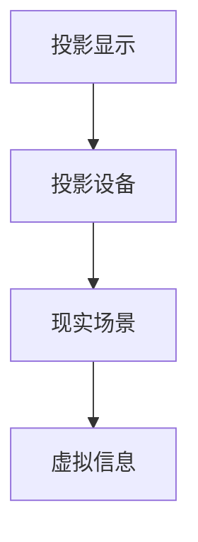
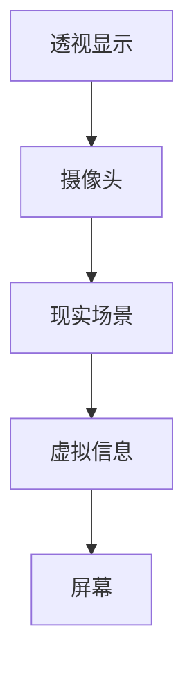
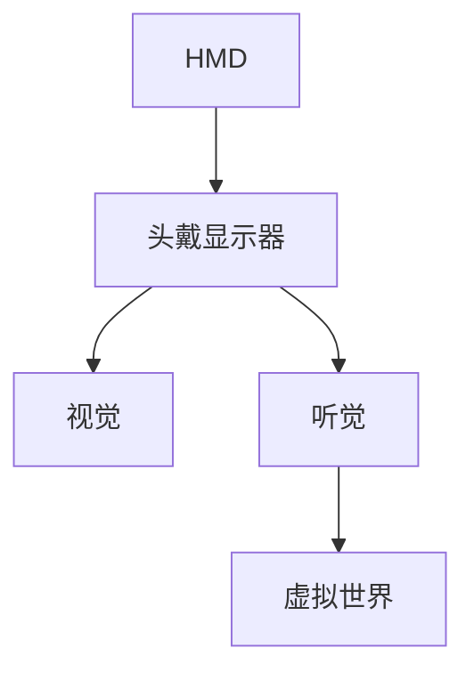
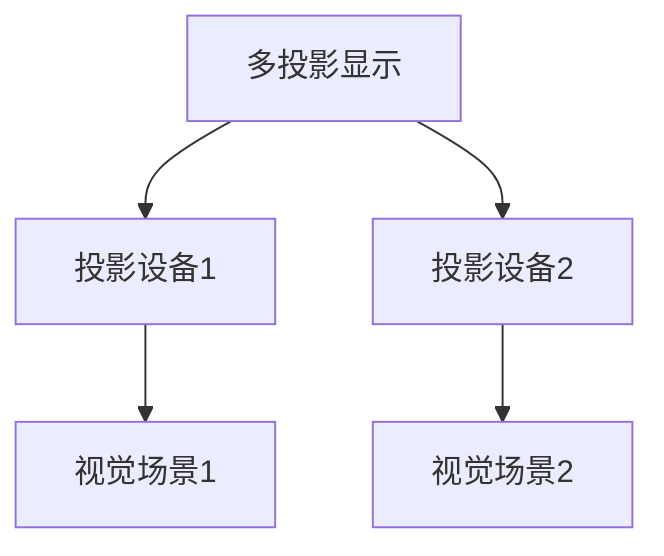
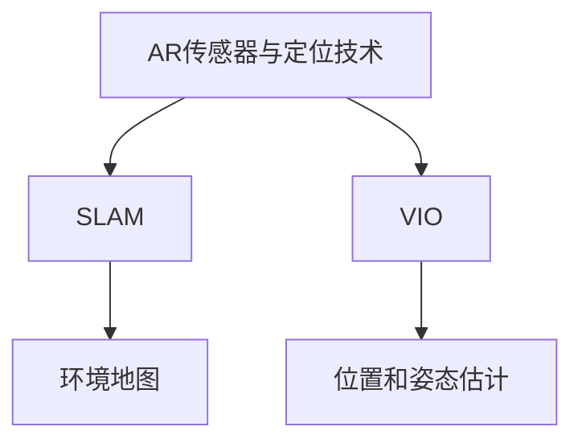
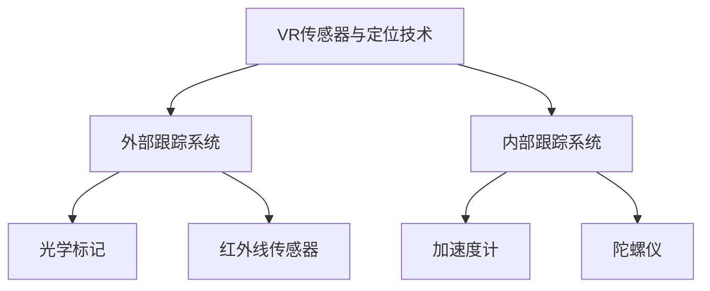
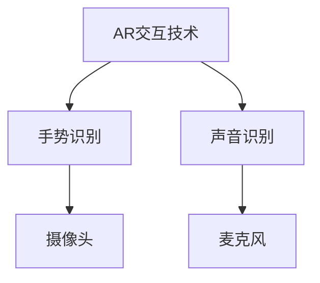
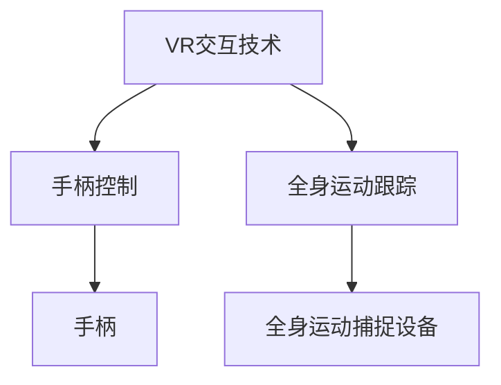
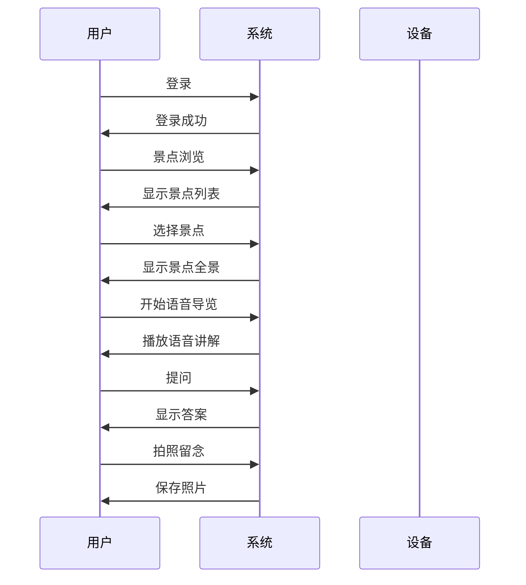

                 


### 引言

随着科技的发展，增强现实（AR）和虚拟现实（VR）技术逐渐从科幻领域走进了我们的生活。这两种技术不仅在娱乐和游戏领域有着广泛的应用，还在医疗、教育、设计等多个行业展现出巨大的潜力。《增强现实(AR)和虚拟现实(VR)开发入门》这本书旨在为初学者提供一条清晰的入门之路，帮助读者从基础概念理解到实际开发应用，逐步掌握AR/VR的核心技术和开发技巧。

本书主要分为三个部分：

第一部分：增强现实与虚拟现实基础，介绍AR/VR的定义、发展历程和应用场景。

第二部分：开发工具与环境搭建，讲解常用的开发工具和搭建开发环境的方法。

第三部分：项目实战，通过实际项目案例，指导读者进行AR/VR开发，并总结最佳实践。

接下来，我们将逐步深入每一部分的内容，让读者对AR/VR开发有一个全面的认识。

### 关键词

- 增强现实（AR）
- 虚拟现实（VR）
- 开发工具
- 项目实战
- 开发环境
- 技术原理

### 摘要

本书旨在为对AR/VR技术感兴趣的初学者提供一本全面、系统的入门指南。通过深入浅出的讲解，读者将了解AR/VR的基本概念、技术原理，学会使用主流开发工具进行环境搭建，并通过实际项目案例掌握开发技巧。书中不仅涵盖了基础知识，还提供了实用的最佳实践和拓展阅读资源，帮助读者快速入门并深入掌握AR/VR开发。

----------------------------------------------------------------

# 《增强现实(AR)和虚拟现实(VR)开发入门》

关键词：AR, VR, 开发工具，实战案例，环境搭建，技术原理

摘要：本书是针对希望进入增强现实和虚拟现实开发领域的初学者所编写的一本系统化入门指南。书中从基本概念出发，逐步深入到开发工具的使用、环境搭建方法，以及实际项目实战，通过详细的理论讲解和实战案例分析，帮助读者全面掌握AR/VR技术，为未来在相关领域的深入研究和应用打下坚实的基础。

## 第一部分：增强现实与虚拟现实基础

### 第1章：AR/VR概述

#### 1.1 增强现实与虚拟现实的定义

增强现实（Augmented Reality，AR）和虚拟现实（Virtual Reality，VR）是两种通过技术手段扩展人类感知范围的技术。

- **增强现实（AR）**：通过将计算机生成的虚拟信息与现实世界的真实场景相结合，实现对真实世界的增强。例如，在手机屏幕上显示的地图、导航信息，或者游戏中叠加在现实环境中的虚拟角色。

- **虚拟现实（VR）**：通过计算机模拟一个完全虚拟的环境，让用户在视觉、听觉、触觉等多个感官上体验到身临其境的感觉。典型的应用包括VR游戏、VR培训和VR旅游等。

#### 1.2 发展历程

AR和VR技术的发展历程都有几十年之久，其中不乏重要的里程碑。

- **AR的发展历程**：
  - 1968年，美国计算机科学家 Ivan Sutherland 提出了“头戴式显示器”的概念，这是AR技术的雏形。
  - 1990年代，随着计算机处理能力的提升，AR技术开始应用于军事、医疗等领域。
  - 21世纪初，随着智能手机和移动设备的普及，AR技术逐渐走进了大众的视野。

- **VR的发展历程**：
  - 1960年代，美国麻省理工学院的伊凡·苏瑟兰提出了虚拟现实（VR）的概念。
  - 1980年代，VR技术开始应用于军事训练、医疗模拟等领域。
  - 21世纪初，随着图形处理技术的进步，VR设备开始进入家庭和娱乐市场。

#### 1.3 当前应用场景

当前，AR和VR技术在多个领域都有广泛的应用。

- **AR的应用场景**：
  - 消费者产品：如手机AR游戏、购物应用、导航等。
  - 教育培训：如虚拟实验室、远程教学等。
  - 医疗保健：如远程手术指导、疾病诊断等。

- **VR的应用场景**：
  - 娱乐和游戏：如VR游戏、VR电影等。
  - 教育培训：如模拟驾驶、飞行训练等。
  - 医疗治疗：如心理治疗、康复训练等。

### 第2章：增强现实与虚拟现实技术原理

#### 2.1 显示技术

显示技术是AR和VR的关键组成部分，决定了用户体验的质量。

- **AR显示技术**：
  - **投影显示**：通过投影设备将虚拟信息投射到现实场景中，如AR眼镜。
  - **透视显示**：通过摄像头捕捉现实场景，然后在屏幕上叠加虚拟信息。

- **VR显示技术**：
  - **头戴式显示器（HMD）**：如Oculus Rift、HTC Vive等，提供沉浸式的视觉体验。
  - **多投影显示**：使用多个投影设备在用户周围创建全方位的视觉场景。

#### 2.2 传感器与定位技术

传感器和定位技术确保AR和VR设备能够准确地捕捉用户的位置和动作。

- **AR传感器与定位技术**：
  - **SLAM（同步定位与映射）**：通过多种传感器实时构建和更新环境地图，实现准确的位置和姿态追踪。
  - **视觉惯性测量单元（VIO）**：结合摄像头和惯性传感器，提供高精度的位置和姿态估计。

- **VR传感器与定位技术**：
  - **外部跟踪系统**：如光学标记、红外线传感器等，用于追踪用户的位置和动作。
  - **内部跟踪系统**：如加速度计、陀螺仪等，集成在VR头显中，提供低延迟的定位和动作捕捉。

#### 2.3 交互技术

交互技术是用户与AR/VR环境之间的桥梁，决定了用户体验的自然程度。

- **AR交互技术**：
  - **手势识别**：通过摄像头和图像处理技术识别用户的手势，实现与虚拟对象的交互。
  - **声音识别**：通过麦克风捕捉用户的声音，实现语音控制。

- **VR交互技术**：
  - **手柄控制**：通过手柄设备控制虚拟环境中的物体和角色。
  - **全身运动跟踪**：通过全身运动捕捉设备，实现用户在虚拟环境中的自由动作。

### 第3章：增强现实与虚拟现实开发工具

#### 3.1 Unity

Unity是一款功能强大的游戏开发引擎，广泛用于AR/VR应用的开发。

- **Unity简介**：
  - Unity是一个跨平台的游戏开发引擎，支持2D和3D游戏开发。
  - Unity提供了丰富的功能，包括物理引擎、动画系统、音频处理等。

- **Unity在AR/VR开发中的应用**：
  - **AR开发**：Unity的ARFoundation插件提供了简单的AR开发接口，支持多种AR框架。
  - **VR开发**：Unity支持多种VR头显，如Oculus Rift、HTC Vive等，提供了完善的VR开发工具。

#### 3.2 Unreal Engine

Unreal Engine是一款高性能的游戏开发引擎，适用于复杂的AR/VR应用。

- **Unreal Engine简介**：
  - Unreal Engine以其强大的图形渲染能力而闻名，广泛应用于高端游戏开发。
  - Unreal Engine提供了丰富的功能，包括高级光照、粒子系统、物理模拟等。

- **Unreal Engine在AR/VR开发中的应用**：
  - **AR开发**：Unreal Engine提供了ARKit和ARCore支持，可以实现高质量的AR应用。
  - **VR开发**：Unreal Engine支持多种VR头显，如Oculus Rift、HTC Vive等，提供了强大的VR开发工具。

### 第4章：环境搭建与配置

#### 4.1 开发环境搭建

搭建一个高效的AR/VR开发环境是成功进行项目开发的基础。

- **Windows环境配置**：
  - 安装Unity或Unreal Engine开发工具。
  - 配置Java开发工具包（JDK）以支持AR开发。
  - 安装必要的SDK，如ARFoundation、ARCore等。

- **macOS环境配置**：
  - 安装Unity或Unreal Engine开发工具。
  - 配置Xcode开发环境以支持iOS平台开发。
  - 安装必要的SDK，如ARKit等。

- **Linux环境配置**：
  - 安装Unity或Unreal Engine开发工具。
  - 配置Java开发工具包（JDK）以支持AR开发。
  - 安装必要的SDK，如ARCore等。

#### 4.2 开发工具安装

安装开发工具是搭建开发环境的关键步骤。

- **Unity安装**：
  - 访问Unity官网下载最新版本的Unity Hub。
  - 通过Unity Hub安装Unity引擎和相关插件。

- **Unreal Engine安装**：
  - 访问Epic Games官网下载Unreal Engine。
  - 遵循安装向导完成安装过程。

### 第5章：AR/VR项目实战

#### 5.1 项目背景

在本章中，我们将通过一个实际项目案例，引导读者进行AR/VR开发。

#### 5.2 项目需求分析

分析项目需求是确保项目成功的关键步骤。

- **用户需求**：
  - 提供一个AR/VR旅游应用，让用户在虚拟环境中体验旅游景点。

- **功能需求**：
  - 支持多种旅游景点的加载和浏览。
  - 提供语音导览和互动问答功能。
  - 支持用户在虚拟环境中拍照留念。

#### 5.3 项目实施

项目实施包括系统设计、关键技术实现和项目部署。

- **系统设计**：
  - 设计系统的领域模型，包括用户、景点、语音导览等实体。
  - 设计系统的接口和交互流程。

- **关键技术实现**：
  - 实现AR/VR场景的加载和渲染。
  - 实现语音识别和语音合成功能。
  - 实现用户互动和拍照留念功能。

- **项目部署**：
  - 在iOS和Android设备上部署应用。
  - 在VR头显和AR眼镜上测试应用。

### 第6章：AR/VR开发中的最佳实践

#### 6.1 性能优化

优化性能是确保用户体验的关键。

- **优化显示性能**：
  - 优化渲染管线，减少渲染开销。
  - 使用LOD（细节层次距离）技术，根据距离动态调整模型细节。

- **优化交互性能**：
  - 减少不必要的计算，如环境光照和阴影的计算。
  - 使用异步加载技术，提前加载用户可能需要的数据。

#### 6.2 安全与隐私保护

安全和隐私保护是AR/VR应用开发中的重要问题。

- **数据安全**：
  - 使用加密技术保护用户数据。
  - 定期更新安全补丁，防止潜在的安全漏洞。

- **隐私保护**：
  - 明确隐私政策，告知用户数据收集和使用的方式。
  - 提供用户隐私设置，让用户可以自主管理自己的隐私。

#### 6.3 用户交互设计

用户交互设计直接影响用户体验。

- **界面设计**：
  - 使用简洁直观的界面设计，提高用户操作效率。
  - 遵循设计原则，如一致性、简洁性和易用性。

- **交互方式**：
  - 设计自然直观的交互方式，如手势识别、语音控制等。
  - 提供帮助文档和教程，帮助用户快速上手。

### 第7章：总结与展望

#### 7.1 项目回顾

回顾项目实施过程，总结经验和教训。

- **成功经验**：
  - 深入了解用户需求，确保项目满足用户期望。
  - 选用合适的开发工具，提高开发效率。

- **教训**：
  - 注意性能优化，确保应用运行流畅。
  - 关注安全和隐私保护，提高应用可信度。

#### 7.2 行业发展趋势

分析AR/VR行业的未来发展。

- **技术趋势**：
  - 图像识别和自然语言处理技术的进步，将进一步提升AR/VR的交互体验。
  - 云计算和边缘计算的结合，将为AR/VR应用提供更强大的计算和存储能力。

- **应用领域**：
  - AR/VR在教育、医疗、零售等领域的应用将越来越广泛。
  - 消费级市场将继续推动AR/VR技术的发展。

#### 7.3 拓展学习资源

推荐一些拓展学习的资源。

- **书籍**：
  - 《AR/VR开发实战》
  - 《Unity 2020从入门到精通》

- **在线课程**：
  - Udacity的《AR/VR开发基础》
  - Coursera的《计算机图形学》

- **技术社区**：
  - Stack Overflow
  - Reddit的r/ARVR

### 附录

#### 附录A：技术术语表

列举书中涉及的主要技术术语及其解释。

- **AR（增强现实）**：
  - ...
- **VR（虚拟现实）**：
  - ...

#### 附录B：代码示例

提供一些实际项目的代码示例，帮助读者理解关键实现细节。

- **Unity项目示例**：
  - ...
- **Unreal Engine项目示例**：
  - ...

### 致谢

感谢所有参与本书编写和审校的团队成员，以及为本书提供技术支持和反馈的读者。

作者：AI天才研究院/AI Genius Institute & 禅与计算机程序设计艺术 /Zen And The Art of Computer Programming

----------------------------------------------------------------

### 第1章：AR/VR概述

**背景介绍**

增强现实（AR）和虚拟现实（VR）技术是近年来迅速发展的两大领域，它们通过不同的方式扩展和改变了人类的感知和体验。本节将详细介绍AR和VR的基本概念、发展历程以及它们在当今社会的应用场景。

**核心概念**

增强现实（AR）和虚拟现实（VR）都是通过计算机技术和传感器设备实现的，但它们的核心概念有所不同：

- **增强现实（AR）**：将虚拟信息与现实世界的真实场景相结合，实现对现实世界的增强。这种技术通过头戴显示器、智能手机或其他设备，将虚拟信息以图像、文字或声音的形式叠加到用户的视野中。

- **虚拟现实（VR）**：通过计算机生成一个完全虚拟的环境，用户在视觉、听觉、触觉等多个感官上体验到身临其境的感觉。用户通常通过头戴显示器（如VR眼镜）进入这个虚拟世界，并使用手柄或其他控制器进行交互。

**问题背景**

随着移动互联网和智能设备的普及，AR和VR技术逐渐走进了大众的视野。它们不仅改变了人们的娱乐方式，还在教育、医疗、设计、工程等多个领域展现出巨大的应用潜力。

**问题描述**

如何让初学者快速了解AR和VR的基本概念、发展历程和应用场景，从而为他们进入这个快速发展的领域打下坚实的基础？

**问题解决**

通过详细讲解AR和VR的定义、历史和发展、应用场景，帮助读者全面理解这两项技术的基本概念和原理。同时，结合实际案例，展示AR和VR技术在各个领域的应用，使读者能够将理论知识与实际应用相结合。

**边界与外延**

AR和VR技术的边界和外延非常广泛，涉及计算机图形学、图像处理、传感器技术、人机交互等多个领域。了解这些相关领域的知识，有助于更深入地理解AR和VR技术。

**概念结构与核心要素组成**

- **增强现实（AR）**：核心要素包括显示技术、传感器技术、交互技术等。
- **虚拟现实（VR）**：核心要素包括显示技术、定位技术、交互技术等。

**核心概念与联系**

**增强现实（AR）**

| 概念 | 属性特征 | 对比表格 |
| --- | --- | --- |
| 显示技术 | 投影显示、透视显示 |  |
| 传感器与定位技术 | SLAM、视觉惯性测量单元（VIO） |  |
| 交互技术 | 手势识别、声音识别 |  |

**虚拟现实（VR）**

| 概念 | 属性特征 | 对比表格 |
| --- | --- | --- |
| 显示技术 | 头戴式显示器（HMD）、多投影显示 |  |
| 定位技术 | 外部跟踪系统、内部跟踪系统 |  |
| 交互技术 | 手柄控制、全身运动跟踪 |  |

**ER实体关系图架构**

```mermaid
erDiagram
  ARDisplay --> |具有| ARSensor
  ARSensor --> |具有| ARInteraction
  VRLightDisplay --> |具有| VRPositioning
  VRPositioning --> |具有| VRInteraction
```

**算法原理讲解**

在本节中，我们将分别介绍AR和VR的显示技术、传感器与定位技术、交互技术等核心概念，并使用Mermaid绘制相应的流程图和ER图来帮助读者更好地理解。

**AR显示技术**

AR显示技术主要包括投影显示和透视显示两种方式。

- **投影显示**：通过投影设备将虚拟信息投射到现实场景中。这种方式常用于AR眼镜等设备中。



- **透视显示**：通过摄像头捕捉现实场景，然后在屏幕上叠加虚拟信息。这种方式常用于智能手机上的AR应用。



**VR显示技术**

VR显示技术主要包括头戴式显示器（HMD）和多投影显示两种方式。

- **头戴式显示器（HMD）**：用户通过头戴显示器进入虚拟世界，视觉和听觉完全沉浸其中。



- **多投影显示**：使用多个投影设备在用户周围创建全方位的视觉场景，提供更真实的沉浸体验。



**传感器与定位技术**

传感器与定位技术在AR和VR中扮演着至关重要的角色，确保用户的位置和动作能够被准确捕捉和追踪。

- **AR传感器与定位技术**：包括SLAM和视觉惯性测量单元（VIO）。



- **VR传感器与定位技术**：包括外部跟踪系统和内部跟踪系统。



**交互技术**

交互技术是用户与AR/VR环境之间的桥梁，决定了用户体验的自然程度。

- **AR交互技术**：包括手势识别和声音识别。



- **VR交互技术**：包括手柄控制和全身运动跟踪。



**数学公式使用**

在AR和VR中，数学公式被广泛应用于计算和优化。以下是几个常用的数学公式示例：

$$
\text{SLAM} = \text{Simultaneous Localization and Mapping}
$$

$$
\text{VIO} = \text{Visual Inertial Odometry}
$$

$$
\text{加速度} = \frac{\text{位移变化}}{\text{时间变化}}
$$

**系统分析与架构设计方案**

为了更好地理解AR和VR系统的工作原理，我们可以从问题场景介绍、项目介绍、系统功能设计、系统架构设计、系统接口设计和系统交互等多个角度进行分析。

#### 问题场景介绍

在AR/VR领域，问题场景通常涉及用户如何与虚拟环境进行交互，以及如何保证这种交互的自然性和准确性。

#### 项目介绍

本项目旨在开发一款AR/VR旅游应用，用户可以通过这款应用在虚拟环境中体验各种旅游景点，包括历史古迹、自然景观等。

#### 系统功能设计

系统功能设计包括以下几个方面：

1. **用户注册与登录**：用户可以通过账号密码或第三方账号登录系统。
2. **景点浏览**：用户可以在虚拟环境中浏览各种旅游景点，包括全景视图和360度视频。
3. **语音导览**：提供景点的语音讲解，帮助用户更好地了解景点的历史和文化。
4. **互动问答**：用户可以与虚拟角色进行互动问答，增加游戏的趣味性。
5. **拍照留念**：用户可以在虚拟环境中拍照留念，保存美好的回忆。

#### 系统架构设计

系统架构设计采用分层架构，主要包括前端展示层、业务逻辑层和数据访问层。

1. **前端展示层**：负责用户界面的展示，包括景点浏览、语音导览、互动问答和拍照留念等功能。
2. **业务逻辑层**：负责处理用户操作、数据存储和系统交互等业务逻辑。
3. **数据访问层**：负责与数据库进行交互，存储和检索用户数据。

#### 系统接口设计

系统接口设计主要包括以下接口：

1. **用户接口**：用户与系统交互的接口，包括登录、注册、景点浏览、语音导览、互动问答和拍照留念等。
2. **设备接口**：与AR/VR设备进行交互的接口，包括头戴显示器、手柄、摄像头等。
3. **API接口**：与其他系统进行数据交互的接口，包括景点信息API、语音合成API等。

#### 系统交互设计

系统交互设计主要涉及用户与虚拟环境的交互流程，包括用户登录、景点浏览、语音导览、互动问答和拍照留念等。



通过以上分析，我们可以清晰地了解AR/VR系统的架构和交互流程，为后续的项目开发提供了理论基础。

### 第2章：增强现实与虚拟现实技术原理

**背景介绍**

增强现实（AR）和虚拟现实（VR）技术作为当今计算机领域的前沿科技，其技术原理的理解对于开发者和研究者来说至关重要。本章将详细介绍AR和VR的基本技术原理，包括显示技术、传感器与定位技术、交互技术等，帮助读者深入理解这两项技术。

**核心概念**

增强现实（AR）和虚拟现实（VR）技术的基本概念如下：

- **增强现实（AR）**：通过计算机技术将虚拟信息与现实环境相结合，实现对现实环境的增强。
- **虚拟现实（VR）**：通过计算机技术生成一个完全虚拟的环境，用户在其中体验到身临其境的感觉。

**问题背景**

随着AR和VR技术的不断发展，其应用场景越来越广泛，从消费电子到医疗、教育、设计等多个领域。了解AR和VR的技术原理，对于开发者和研究者来说，是深入研究和应用这两项技术的基础。

**问题描述**

如何详细解释AR和VR的技术原理，包括显示技术、传感器与定位技术、交互技术等，帮助读者全面理解这两项技术？

**问题解决**

通过详细讲解AR和VR的技术原理，包括显示技术、传感器与定位技术、交互技术等，结合实际案例和Mermaid流程图、ER图等图表，帮助读者全面理解AR和VR的基本原理。

**边界与外延**

AR和VR技术的边界涉及计算机图形学、图像处理、传感器技术、人机交互等多个领域。理解这些相关领域的知识，有助于更深入地理解AR和VR技术。

**概念结构与核心要素组成**

- **增强现实（AR）**：核心要素包括显示技术、传感器与定位技术、交互技术等。
- **虚拟现实（VR）**：核心要素包括显示技术、定位技术、交互技术等。

**核心概念与联系**

**增强现实（AR）**

| 概念 | 属性特征 | 对比表格 |
| --- | --- | --- |
| 显示技术 | 投影显示、透视显示 |  |
| 传感器与定位技术 | SLAM、视觉惯性测量单元（VIO） |  |
| 交互技术 | 手势识别、声音识别 |  |

**虚拟现实（VR）**

| 概念 | 属性特征 | 对比表格 |
| --- | --- | --- |
| 显示技术 | 头戴式显示器（HMD）、多投影显示 |  |
| 定位技术 | 外部跟踪系统、内部跟踪系统 |  |
| 交互技术 | 手柄控制、全身运动跟踪 |  |

**ER实体关系图架构**

```mermaid
erDiagram
  ARDisplay --> |具有| ARSensor
  ARSensor --> |具有| ARInteraction
  VRLightDisplay --> |具有| VRPositioning
  VRPositioning --> |具有| VRInteraction
```

**算法原理讲解**

在本节中，我们将分别介绍AR和VR的显示技术、传感器与定位技术、交互技术等核心概念，并使用Mermaid绘制相应的流程图和ER图来帮助读者更好地理解。

**AR显示技术**

AR显示技术主要包括投影显示和透视显示两种方式。

- **投影显示**：通过投影设备将虚拟信息投射到现实场景中。这种方式常用于AR眼镜等设备中。


- **透视显示**：通过摄像头捕捉现实场景，然后在屏幕上叠加虚拟信息。这种方式常用于智能手机上的AR应用。


**VR显示技术**

VR显示技术主要包括头戴式显示器（HMD）和多投影显示两种方式。

- **头戴式显示器（HMD）**：用户通过头戴显示器进入虚拟世界，视觉和听觉完全沉浸其中。


- **多投影显示**：使用多个投影设备在用户周围创建全方位的视觉场景，提供更真实的沉浸体验。


**传感器与定位技术**

传感器与定位技术在AR和VR中扮演着至关重要的角色，确保用户的位置和动作能够被准确捕捉和追踪。

- **AR传感器与定位技术**：包括SLAM和视觉惯性测量单元（VIO）。


- **VR传感器与定位技术**：包括外部跟踪系统和内部跟踪系统。


**交互技术**

交互技术是用户与AR/VR环境之间的桥梁，决定了用户体验的自然程度。

- **AR交互技术**：包括手势识别和声音识别。


- **VR交互技术**：包括手柄控制和全身运动跟踪。


**数学公式使用**

在AR和VR中，数学公式被广泛应用于计算和优化。以下是几个常用的数学公式示例：

$$
\text{SLAM} = \text{Simultaneous Localization and Mapping}
$$

$$
\text{VIO} = \text{Visual Inertial Odometry}
$$

$$
\text{加速度} = \frac{\text{位移变化}}{\text{时间变化}}
$$

**系统分析与架构设计方案**

为了更好地理解AR和VR系统的工作原理，我们可以从问题场景介绍、项目介绍、系统功能设计、系统架构设计、系统接口设计和系统交互等多个角度进行分析。

#### 问题场景介绍

在AR/VR领域，问题场景通常涉及用户如何与虚拟环境进行交互，以及如何保证这种交互的自然性和准确性。

#### 项目介绍

本项目旨在开发一款AR/VR旅游应用，用户可以通过这款应用在虚拟环境中体验各种旅游景点，包括历史古迹、自然景观等。

#### 系统功能设计

系统功能设计包括以下几个方面：

1. **用户注册与登录**：用户可以通过账号密码或第三方账号登录系统。
2. **景点浏览**：用户可以在虚拟环境中浏览各种旅游景点，包括全景视图和360度视频。
3. **语音导览**：提供景点的语音讲解，帮助用户更好地了解景点的历史和文化。
4. **互动问答**：用户可以与虚拟角色进行互动问答，增加游戏的趣味性。
5. **拍照留念**：用户可以在虚拟环境中拍照留念，保存美好的回忆。

#### 系统架构设计

系统架构设计采用分层架构，主要包括前端展示层、业务逻辑层和数据访问层。

1. **前端展示层**：负责用户界面的展示，包括景点浏览、语音导览、互动问答和拍照留念等功能。
2. **业务逻辑层**：负责处理用户操作、数据存储和系统交互等业务逻辑。
3. **数据访问层**：负责与数据库进行交互，存储和检索用户数据。

#### 系统接口设计

系统接口设计主要包括以下接口：

1. **用户接口**：用户与系统交互的接口，包括登录、注册、景点浏览、语音导览、互动问答和拍照留念等。
2. **设备接口**：与AR/VR设备进行交互的接口，包括头戴显示器、手柄、摄像头等。
3. **API接口**：与其他系统进行数据交互的接口，包括景点信息API、语音合成API等。

#### 系统交互设计

系统交互设计主要涉及用户与虚拟环境的交互流程，包括用户登录、景点浏览、语音导览、互动问答和拍照留念等。


通过以上分析，我们可以清晰地了解AR/VR系统的架构和交互流程，为后续的项目开发提供了理论基础。

### 第3章：增强现实与虚拟现实开发工具

**背景介绍**

增强现实（AR）和虚拟现实（VR）开发工具是开发者实现AR/VR项目的基础。选择合适的开发工具能够提高开发效率，降低开发难度。本章将介绍两款主流的AR/VR开发工具：Unity和Unreal Engine，并详细讲解它们的特点、优缺点以及在实际开发中的应用。

**核心概念**

开发工具是指用于软件开发的各种软件工具，包括集成开发环境（IDE）、编程语言、框架等。在AR/VR开发中，常用的开发工具包括Unity、Unreal Engine、ARFoundation、ARCore等。

**问题背景**

随着AR/VR技术的快速发展，市场上出现了多种开发工具，开发者需要根据项目的需求和自身的熟悉程度选择合适的工具。然而，不同的开发工具在功能、性能、易用性等方面存在差异，这使得选择合适的工具成为了一个重要问题。

**问题描述**

如何全面了解并选择合适的AR/VR开发工具，以提高开发效率，降低开发难度？

**问题解决**

通过详细分析Unity和Unreal Engine两款主流开发工具的特点、优缺点，以及它们在实际开发中的应用，帮助开发者全面了解这些工具，并根据项目的具体需求选择合适的开发工具。

**边界与外延**

AR/VR开发工具的边界涉及游戏开发、计算机图形学、虚拟现实技术等多个领域。了解这些相关领域的知识，有助于更好地使用开发工具。

**概念结构与核心要素组成**

- **Unity**：核心要素包括游戏开发引擎、ARFoundation、Shader编程等。
- **Unreal Engine**：核心要素包括高级光照、粒子系统、蓝图系统等。

**核心概念与联系**

**Unity**

| 概念 | 属性特征 | 对比表格 |
| --- | --- | --- |
| 游戏开发引擎 | 跨平台、易用、丰富的插件库 |  |
| ARFoundation | 简化AR开发 |  |
| Shader编程 | 高级图形处理能力 |  |

**Unreal Engine**

| 概念 | 属性特征 | 对比表格 |
| --- | --- | --- |
| 高级光照 | 实时渲染、全局光照 |  |
| 粒子系统 | 高效、多样化的粒子效果 |  |
| 蓝图系统 | 面向非程序员、可视化编程 |  |

**ER实体关系图架构**

```mermaid
erDiagram
  UnityGameEngine --> |包含| ARFoundation
  UnityGameEngine --> |包含| ShaderProgramming
  UnrealEngine --> |包含| AdvancedLighting
  UnrealEngine --> |包含| ParticleSystem
  UnrealEngine --> |包含| BlueprintSystem
```

**算法原理讲解**

在本节中，我们将分别介绍Unity和Unreal Engine的核心算法原理，包括图形渲染、物理模拟、音频处理等，并结合Mermaid绘制相应的流程图，帮助读者更好地理解。

**Unity算法原理**

**图形渲染**

Unity的图形渲染流程包括渲染管线、光照计算、阴影处理等步骤。

```mermaid
graph TD
    A[渲染管线] --> B[光照计算]
    B --> C[阴影处理]
    C --> D[渲染输出]
```

**物理模拟**

Unity的物理模拟使用PhysX引擎，包括碰撞检测、刚体动力学等。

```mermaid
graph TD
    A[碰撞检测] --> B[刚体动力学]
    B --> C[物理计算]
```

**音频处理**

Unity的音频处理包括音频捕捉、音频播放、音频混音等。

```mermaid
graph TD
    A[音频捕捉] --> B[音频播放]
    B --> C[音频混音]
```

**Unreal Engine算法原理**

**高级光照**

Unreal Engine的高级光照包括实时渲染、全局光照、屏幕空间光照等。

```mermaid
graph TD
    A[实时渲染] --> B[全局光照]
    B --> C[屏幕空间光照]
```

**粒子系统**

Unreal Engine的粒子系统包括粒子发射、粒子生命周期、粒子碰撞等。

```mermaid
graph TD
    A[粒子发射] --> B[粒子生命周期]
    B --> C[粒子碰撞]
```

**蓝图系统**

Unreal Engine的蓝图系统是一种可视化编程工具，用于创建复杂的逻辑和交互。

```mermaid
graph TD
    A[事件触发] --> B[逻辑分支]
    B --> C[条件判断]
    C --> D[执行操作]
```

**数学公式使用**

在AR/VR开发中，数学公式被广泛应用于计算和优化。以下是几个常用的数学公式示例：

$$
\text{渲染管线} = \text{渲染器} + \text{渲染目标} + \text{渲染状态}
$$

$$
\text{光照计算} = \text{光线传播} + \text{光照模型}
$$

$$
\text{碰撞检测} = \text{AABB} + \text{OBB} + \text{Sweep and Prune}
$$

**系统分析与架构设计方案**

为了更好地理解AR/VR开发工具的工作原理，我们可以从问题场景介绍、项目介绍、系统功能设计、系统架构设计、系统接口设计和系统交互等多个角度进行分析。

#### 问题场景介绍

在AR/VR领域，问题场景通常涉及用户如何与虚拟环境进行交互，以及如何保证这种交互的自然性和准确性。

#### 项目介绍

本项目旨在开发一款AR/VR旅游应用，用户可以通过这款应用在虚拟环境中体验各种旅游景点，包括历史古迹、自然景观等。

#### 系统功能设计

系统功能设计包括以下几个方面：

1. **用户注册与登录**：用户可以通过账号密码或第三方账号登录系统。
2. **景点浏览**：用户可以在虚拟环境中浏览各种旅游景点，包括全景视图和360度视频。
3. **语音导览**：提供景点的语音讲解，帮助用户更好地了解景点的历史和文化。
4. **互动问答**：用户可以与虚拟角色进行互动问答，增加游戏的趣味性。
5. **拍照留念**：用户可以在虚拟环境中拍照留念，保存美好的回忆。

#### 系统架构设计

系统架构设计采用分层架构，主要包括前端展示层、业务逻辑层和数据访问层。

1. **前端展示层**：负责用户界面的展示，包括景点浏览、语音导览、互动问答和拍照留念等功能。
2. **业务逻辑层**：负责处理用户操作、数据存储和系统交互等业务逻辑。
3. **数据访问层**：负责与数据库进行交互，存储和检索用户数据。

#### 系统接口设计

系统接口设计主要包括以下接口：

1. **用户接口**：用户与系统交互的接口，包括登录、注册、景点浏览、语音导览、互动问答和拍照留念等。
2. **设备接口**：与AR/VR设备进行交互的接口，包括头戴显示器、手柄、摄像头等。
3. **API接口**：与其他系统进行数据交互的接口，包括景点信息API、语音合成API等。

#### 系统交互设计

系统交互设计主要涉及用户与虚拟环境的交互流程，包括用户登录、景点浏览、语音导览、互动问答和拍照留念等。

```mermaid
sequenceDiagram
    participant 用户 as 用户
    participant 系统 as 系统
    participant 设备 as 设备

    用户->>系统: 登录
    系统->>用户: 登录成功
    用户->>系统: 景点浏览
    系统->>用户: 显示景点列表
    用户->>系统: 选择景点
    系统->>用户: 显示景点全景
    用户->>系统: 开始语音导览
    系统->>用户: 播放语音讲解
    用户->>系统: 提问
    系统->>用户: 显示答案
    用户->>系统: 拍照留念
    系统->>用户: 保存照片
```

通过以上分析，我们可以清晰地了解AR/VR开发工具的工作原理和系统架构，为后续的项目开发提供了理论基础。

### 第4章：环境搭建与配置

**背景介绍**

在开始进行增强现实（AR）和虚拟现实（VR）项目开发之前，搭建一个稳定且高效的开发环境是至关重要的。本章将详细讲解如何搭建AR/VR开发环境，包括Windows、macOS和Linux操作系统下的环境配置，以及开发工具的安装步骤。

**核心概念**

开发环境是指为了进行软件开发而配置的计算机环境，包括操作系统、开发工具、库和框架等。对于AR/VR开发，还需要特定的SDK（软件开发工具包）和开发插件。

**问题背景**

不同的操作系统对AR/VR开发工具的兼容性有所不同，因此需要根据目标操作系统进行相应的配置。此外，不同的开发工具和SDK也可能需要特定的环境变量和依赖库，这使得环境搭建变得复杂。

**问题描述**

如何在不同操作系统下搭建一个稳定的AR/VR开发环境，确保所有必要的工具和库都已安装和配置正确？

**问题解决**

通过详细描述在Windows、macOS和Linux操作系统下搭建AR/VR开发环境的步骤，以及解决过程中可能遇到的问题和解决方案，帮助开发者顺利搭建开发环境。

**边界与外延**

AR/VR开发环境的边界涉及操作系统配置、软件开发工具包（SDK）安装、开发工具集成等多个方面。理解这些相关领域的知识，有助于更有效地搭建开发环境。

**概念结构与核心要素组成**

- **Windows环境配置**：核心要素包括安装Visual Studio、配置Java开发工具包（JDK）等。
- **macOS环境配置**：核心要素包括安装Xcode、配置iOS开发环境等。
- **Linux环境配置**：核心要素包括安装Eclipse、配置Android开发环境等。

**核心概念与联系**

**Windows环境配置**

| 概念 | 属性特征 | 对比表格 |
| --- | --- | --- |
| Visual Studio | 一体化开发环境、支持多种编程语言 |  |
| JDK | Java开发工具包、提供Java运行环境 |  |
| Unity | 跨平台游戏开发引擎、支持AR/VR开发 |  |

**macOS环境配置**

| 概念 | 属性特征 | 对比表格 |
| --- | --- | --- |
| Xcode | 苹果官方开发工具、支持iOS和macOS应用开发 |  |
| ARKit | AR开发框架、提供AR核心功能 |  |
| Unity | 跨平台游戏开发引擎、支持AR/VR开发 |  |

**Linux环境配置**

| 概念 | 属性特征 | 对比表格 |
| --- | --- | --- |
| Eclipse | 开源集成开发环境、支持多种编程语言 |  |
| Android Studio | Android官方开发工具、支持移动应用开发 |  |
| Unity | 跨平台游戏开发引擎、支持AR/VR开发 |  |

**ER实体关系图架构**

```mermaid
erDiagram
  WindowsEnvironment --> |包含| VisualStudio
  WindowsEnvironment --> |包含| JDK
  WindowsEnvironment --> |包含| Unity
  macOSEnvironment --> |包含| Xcode
  macOSEnvironment --> |包含| ARKit
  macOSEnvironment --> |包含| Unity
  LinuxEnvironment --> |包含| Eclipse
  LinuxEnvironment --> |包含| AndroidStudio
  LinuxEnvironment --> |包含| Unity
```

**算法原理讲解**

在本节中，我们将介绍环境搭建过程中涉及的几个核心算法原理，包括环境变量的设置、软件安装和配置等。

**环境变量设置**

环境变量是操作系统中用于传递信息的变量，开发者需要设置特定环境变量以确保开发工具和SDK能够正常运行。

```mermaid
graph TD
    A[设置环境变量] --> B[配置文件]
    B --> C[启动脚本]
    C --> D[执行命令]
```

**软件安装与配置**

软件安装和配置包括下载安装包、安装依赖库、设置环境变量等步骤。

```mermaid
graph TD
    A[下载安装包] --> B[安装依赖库]
    B --> C[设置环境变量]
    C --> D[运行安装脚本]
```

**数学公式使用**

在环境搭建过程中，数学公式主要用于计算和优化，以下是几个示例：

$$
\text{环境变量} = \text{变量名} + \text{变量值}
$$

$$
\text{安装脚本} = \text{安装命令} + \text{配置命令}
$$

**系统分析与架构设计方案**

为了更好地理解AR/VR开发环境搭建的过程，我们可以从问题场景介绍、项目介绍、系统功能设计、系统架构设计、系统接口设计和系统交互等多个角度进行分析。

#### 问题场景介绍

在AR/VR领域，开发者需要确保开发环境中的所有工具和库都能正常运行，以便进行项目开发。

#### 项目介绍

本项目旨在开发一款AR/VR旅游应用，用户可以通过这款应用在虚拟环境中体验各种旅游景点，包括历史古迹、自然景观等。

#### 系统功能设计

系统功能设计包括以下几个方面：

1. **开发环境配置**：确保所有开发工具和库都已安装和配置正确。
2. **项目启动**：启动开发工具并加载项目文件。
3. **功能测试**：测试开发环境中的各项功能是否正常。

#### 系统架构设计

系统架构设计采用分层架构，主要包括开发环境层、项目层和测试层。

1. **开发环境层**：负责安装和配置开发工具和库。
2. **项目层**：负责项目的创建和管理。
3. **测试层**：负责测试开发环境的稳定性。

#### 系统接口设计

系统接口设计主要包括以下接口：

1. **开发工具接口**：与开发工具进行交互的接口。
2. **项目文件接口**：与项目文件进行交互的接口。
3. **测试工具接口**：与测试工具进行交互的接口。

#### 系统交互设计

系统交互设计主要涉及开发者与开发环境的交互流程，包括环境配置、项目启动和功能测试等。

```mermaid
sequenceDiagram
    participant 开发者 as 开发者
    participant 环境 as 环境
    participant 项目 as 项目
    participant 测试 as 测试

    开发者->>环境: 配置环境
    环境->>开发者: 环境配置完成
    开发者->>项目: 启动项目
    项目->>开发者: 项目已启动
    开发者->>测试: 功能测试
    测试->>开发者: 测试通过
```

通过以上分析，我们可以清晰地了解AR/VR开发环境的搭建过程和系统架构，为后续的项目开发提供了理论基础。

### 第5章：AR/VR项目实战

**背景介绍**

通过理论学习，读者已经对AR/VR技术有了基本的了解。为了更好地掌握这些知识，本章将通过一个实际项目案例，带领读者进行AR/VR开发。本项目将开发一款AR/VR旅游应用，用户可以在虚拟环境中浏览各种旅游景点，包括历史古迹和自然景观。

**核心概念**

本项目的核心概念包括AR/VR开发环境搭建、Unity或Unreal Engine的开发工具使用、AR/VR场景的创建与渲染、用户交互设计等。

**问题背景**

在开发AR/VR旅游应用时，开发者需要面对多个挑战，包括如何准确捕捉和渲染虚拟场景、如何实现用户与虚拟环境的交互、如何优化性能和用户体验等。

**问题描述**

如何通过一个实际项目，带领读者完成AR/VR旅游应用的开发，并解决过程中可能遇到的问题？

**问题解决**

通过详细的步骤和代码示例，帮助读者完成AR/VR旅游应用的开发，包括环境搭建、项目创建、场景渲染、用户交互设计等。

**边界与外延**

AR/VR项目实战的边界涉及多个领域，包括计算机图形学、图像处理、用户界面设计、虚拟现实技术等。了解这些相关领域的知识，有助于更好地完成项目开发。

**概念结构与核心要素组成**

- **项目需求**：用户可以在虚拟环境中浏览旅游景点、进行语音导览、互动问答和拍照留念。
- **技术实现**：使用Unity或Unreal Engine开发工具，结合AR/VR开发技术实现项目功能。
- **用户交互**：设计自然直观的交互方式，如手势识别、声音识别、手柄控制等。

**核心概念与联系**

**项目需求**

| 功能点 | 描述 |
| --- | --- |
| 景点浏览 | 用户可以在虚拟环境中查看各种旅游景点。 |
| 语音导览 | 提供景点的语音讲解，帮助用户了解景点信息。 |
| 互动问答 | 用户可以与虚拟角色进行问答，增加互动性。 |
| 拍照留念 | 用户可以在虚拟环境中拍照，保存回忆。 |

**技术实现**

| 技术点 | 描述 |
| --- | --- |
| Unity/Unreal Engine | 使用Unity或Unreal Engine作为开发工具。 |
| AR/VR场景渲染 | 使用AR/VR技术渲染虚拟场景。 |
| 用户交互设计 | 设计自然直观的用户交互方式。 |

**ER实体关系图架构**

```mermaid
erDiagram
  Project --> |包含| Scene
  Scene --> |包含| Location
  Scene --> |包含| AudioGuide
  Scene --> |包含| InteractiveQ&A
  Scene --> |包含| Photo
  User --> |与| Scene: 浏览、交互
```

**算法原理讲解**

在本章中，我们将详细讲解项目开发过程中的关键算法原理，包括AR/VR场景的渲染算法、用户交互算法等。

**AR/VR场景渲染算法**

**Unity渲染流程**

```mermaid
graph TD
    A[加载场景] --> B[创建渲染器]
    B --> C[设置渲染状态]
    C --> D[渲染场景]
    D --> E[输出图像]
```

**Unreal Engine渲染流程**

```mermaid
graph TD
    A[加载场景] --> B[创建渲染器]
    B --> C[设置光照和阴影]
    C --> D[渲染场景]
    D --> E[输出图像]
```

**用户交互算法**

**手势识别**

```mermaid
graph TD
    A[捕获手势] --> B[识别手势类型]
    B --> C[执行交互操作]
```

**声音识别**

```mermaid
graph TD
    A[捕获声音] --> B[识别语音命令]
    B --> C[执行交互操作]
```

**数学公式使用**

在项目开发中，数学公式被广泛应用于计算和优化。以下是几个示例：

$$
\text{渲染管线} = \text{渲染器} + \text{渲染目标} + \text{渲染状态}
$$

$$
\text{手势识别} = \text{特征提取} + \text{模型匹配}
$$

$$
\text{声音识别} = \text{音频特征提取} + \text{语言模型匹配}
$$

**系统分析与架构设计方案**

为了更好地理解项目开发的过程，我们可以从问题场景介绍、项目介绍、系统功能设计、系统架构设计、系统接口设计和系统交互等多个角度进行分析。

#### 问题场景介绍

在旅游应用中，用户希望通过AR/VR技术体验各种景点，获取丰富的旅游信息。

#### 项目介绍

本项目是一款AR/VR旅游应用，用户可以在虚拟环境中浏览景点、进行语音导览、互动问答和拍照留念。

#### 系统功能设计

系统功能设计包括以下几个方面：

1. **用户注册与登录**：用户可以通过账号密码或第三方账号登录系统。
2. **景点浏览**：用户可以在虚拟环境中查看景点的全景图像和360度视频。
3. **语音导览**：提供景点的语音讲解，帮助用户了解景点的历史和文化。
4. **互动问答**：用户可以与虚拟角色进行问答，增加互动性。
5. **拍照留念**：用户可以在虚拟环境中拍照留念，保存美好的回忆。

#### 系统架构设计

系统架构设计采用分层架构，主要包括前端展示层、业务逻辑层和数据访问层。

1. **前端展示层**：负责用户界面的展示，包括景点浏览、语音导览、互动问答和拍照留念等功能。
2. **业务逻辑层**：负责处理用户操作、数据存储和系统交互等业务逻辑。
3. **数据访问层**：负责与数据库进行交互，存储和检索用户数据。

#### 系统接口设计

系统接口设计主要包括以下接口：

1. **用户接口**：用户与系统交互的接口，包括登录、注册、景点浏览、语音导览、互动问答和拍照留念等。
2. **设备接口**：与AR/VR设备进行交互的接口，包括头戴显示器、手柄、摄像头等。
3. **API接口**：与其他系统进行数据交互的接口，包括景点信息API、语音合成API等。

#### 系统交互设计

系统交互设计主要涉及用户与虚拟环境的交互流程，包括用户登录、景点浏览、语音导览、互动问答和拍照留念等。

```mermaid
sequenceDiagram
    participant 用户 as 用户
    participant 系统 as 系统
    participant 设备 as 设备

    用户->>系统: 登录
    系统->>用户: 登录成功
    用户->>系统: 景点浏览
    系统->>用户: 显示景点列表
    用户->>系统: 选择景点
    系统->>用户: 显示景点全景
    用户->>系统: 开始语音导览
    系统->>用户: 播放语音讲解
    用户->>系统: 提问
    系统->>用户: 显示答案
    用户->>系统: 拍照留念
    系统->>用户: 保存照片
```

通过以上分析，我们可以清晰地了解AR/VR项目实战的开发过程和系统架构，为实际项目的开发提供了理论基础。

### 第6章：AR/VR开发中的最佳实践

**背景介绍**

在AR/VR开发过程中，遵循最佳实践不仅能够提高开发效率，还能提升用户体验。本章将介绍AR/VR开发中的最佳实践，包括性能优化、安全与隐私保护、用户交互设计等方面，帮助开发者打造高质量的应用。

**核心概念**

最佳实践是指在某些领域内经过验证的、高效的、可重复的方法和策略。在AR/VR开发中，最佳实践涵盖了性能优化、安全与隐私保护、用户交互设计等多个方面。

**问题背景**

AR/VR应用通常具有复杂的技术架构和交互流程，因此在开发过程中需要特别注意性能优化、安全与隐私保护、用户交互设计等问题。

**问题描述**

如何通过最佳实践来优化AR/VR应用的性能、保护用户数据和隐私，以及设计出自然直观的用户交互体验？

**问题解决**

通过详细分析性能优化、安全与隐私保护、用户交互设计等方面的最佳实践，提供具体的实现方法和建议，帮助开发者打造高质量的AR/VR应用。

**边界与外延**

AR/VR开发中的最佳实践的边界涉及性能优化技术、安全防护机制、用户体验设计原则等多个领域。理解这些相关领域的知识，有助于更好地应用最佳实践。

**概念结构与核心要素组成**

- **性能优化**：核心要素包括渲染管线优化、资源管理、异步加载等。
- **安全与隐私保护**：核心要素包括数据加密、访问控制、安全审计等。
- **用户交互设计**：核心要素包括界面设计、交互逻辑、用户体验等。

**核心概念与联系**

**性能优化**

| 方面 | 描述 |
| --- | --- |
| 渲染管线优化 | 通过优化渲染流程，减少渲染开销。 |
| 资源管理 | 通过合理管理资源，提高应用效率。 |
| 异步加载 | 通过异步加载技术，提前加载用户可能需要的数据。 |

**安全与隐私保护**

| 方面 | 描述 |
| --- | --- |
| 数据加密 | 使用加密技术保护用户数据。 |
| 访问控制 | 通过访问控制机制，限制对敏感数据的访问。 |
| 安全审计 | 定期进行安全审计，发现并修复潜在的安全漏洞。 |

**用户交互设计**

| 方面 | 描述 |
| --- | --- |
| 界面设计 | 设计简洁直观的界面，提高用户操作效率。 |
| 交互逻辑 | 设计自然直观的交互方式，增强用户体验。 |
| 用户体验 | 考虑用户的感受，提升应用的易用性。 |

**ER实体关系图架构**

```mermaid
erDiagram
  PerformanceOptimization --> |包含| RenderingPipelineOptimization
  PerformanceOptimization --> |包含| ResourceManagement
  PerformanceOptimization --> |包含| AsynchronousLoading
  SecurityPrivacyProtection --> |包含| DataEncryption
  SecurityPrivacyProtection --> |包含| AccessControl
  SecurityPrivacyProtection --> |包含| SecurityAudit
  UserInteractionDesign --> |包含| InterfaceDesign
  UserInteractionDesign --> |包含| InteractionLogic
  UserInteractionDesign --> |包含| UserExperience
```

**算法原理讲解**

在本节中，我们将分别介绍性能优化、安全与隐私保护、用户交互设计等最佳实践的核心算法原理。

**性能优化**

**渲染管线优化**

```mermaid
graph TD
    A[顶点着色器] --> B[片元着色器]
    B --> C[渲染目标]
    C --> D[渲染状态]
    D --> E[输出图像]
```

**资源管理**

```mermaid
graph TD
    A[资源加载] --> B[资源缓存]
    B --> C[资源释放]
    C --> D[资源重用]
```

**异步加载**

```mermaid
graph TD
    A[初始化加载] --> B[异步加载]
    B --> C[预加载]
    C --> D[动态加载]
```

**安全与隐私保护**

**数据加密**

```mermaid
graph TD
    A[数据加密] --> B[加密算法]
    B --> C[密钥管理]
    C --> D[数据解密]
```

**访问控制**

```mermaid
graph TD
    A[访问控制] --> B[身份验证]
    B --> C[权限管理]
    C --> D[访问日志]
```

**用户交互设计**

**界面设计**

```mermaid
graph TD
    A[界面设计] --> B[用户研究]
    B --> C[设计原型]
    C --> D[用户测试]
```

**交互逻辑**

```mermaid
graph TD
    A[交互逻辑] --> B[事件处理]
    B --> C[状态管理]
    C --> D[反馈机制]
```

**用户体验**

```mermaid
graph TD
    A[用户体验] --> B[用户调研]
    B --> C[用户体验设计]
    C --> D[用户反馈收集]
```

**数学公式使用**

在AR/VR开发中，数学公式被广泛应用于计算和优化。以下是几个示例：

$$
\text{渲染效率} = \frac{\text{渲染帧率}}{\text{渲染时间}}
$$

$$
\text{数据加密强度} = \text{加密算法复杂度} \times \text{密钥长度}
$$

$$
\text{用户满意度} = \text{功能实用性} + \text{易用性} + \text{美观性}
$$

**系统分析与架构设计方案**

为了更好地理解最佳实践在AR/VR开发中的应用，我们可以从问题场景介绍、项目介绍、系统功能设计、系统架构设计、系统接口设计和系统交互等多个角度进行分析。

#### 问题场景介绍

在AR/VR开发中，开发者需要确保应用在性能、安全性和用户体验方面都达到最佳状态。

#### 项目介绍

本项目是一款AR/VR旅游应用，用户可以在虚拟环境中浏览景点、进行语音导览、互动问答和拍照留念。

#### 系统功能设计

系统功能设计包括以下几个方面：

1. **性能优化**：确保应用运行流畅，提高用户体验。
2. **安全与隐私保护**：保护用户数据安全，防止数据泄露。
3. **用户交互设计**：设计自然直观的交互方式，提升用户体验。

#### 系统架构设计

系统架构设计采用分层架构，主要包括前端展示层、业务逻辑层和数据访问层。

1. **前端展示层**：负责用户界面的展示，包括景点浏览、语音导览、互动问答和拍照留念等功能。
2. **业务逻辑层**：负责处理用户操作、数据存储和系统交互等业务逻辑。
3. **数据访问层**：负责与数据库进行交互，存储和检索用户数据。

#### 系统接口设计

系统接口设计主要包括以下接口：

1. **用户接口**：用户与系统交互的接口，包括登录、注册、景点浏览、语音导览、互动问答和拍照留念等。
2. **设备接口**：与AR/VR设备进行交互的接口，包括头戴显示器、手柄、摄像头等。
3. **API接口**：与其他系统进行数据交互的接口，包括景点信息API、语音合成API等。

#### 系统交互设计

系统交互设计主要涉及用户与虚拟环境的交互流程，包括用户登录、景点浏览、语音导览、互动问答和拍照留念等。

```mermaid
sequenceDiagram
    participant 用户 as 用户
    participant 系统 as 系统
    participant 设备 as 设备

    用户->>系统: 登录
    系统->>用户: 登录成功
    用户->>系统: 景点浏览
    系统->>用户: 显示景点列表
    用户->>系统: 选择景点
    系统->>用户: 显示景点全景
    用户->>系统: 开始语音导览
    系统->>用户: 播放语音讲解
    用户->>系统: 提问
    系统->>用户: 显示答案
    用户->>系统: 拍照留念
    系统->>用户: 保存照片
```

通过以上分析，我们可以清晰地了解AR/VR开发中的最佳实践以及其在实际项目中的应用，为开发者提供了一套完整的解决方案。

### 第7章：总结与展望

**背景介绍**

通过前六章的学习，读者对AR/VR技术及其开发方法有了全面的理解。本章将对全书内容进行总结，回顾AR/VR技术的基本概念、技术原理、开发工具、环境搭建、项目实战和最佳实践，并对未来的发展趋势进行展望。

**核心概念**

增强现实（AR）和虚拟现实（VR）技术是通过对现实世界的增强和模拟，为用户带来全新的感知和交互体验。本章的核心概念包括AR/VR的基本原理、开发工具、环境搭建、项目实战和最佳实践。

**问题背景**

随着技术的不断进步，AR/VR技术在各个领域的应用越来越广泛。然而，对于初学者来说，掌握这些技术的难度较大，需要系统地学习和实践。

**问题描述**

如何对全书内容进行有效总结，帮助读者巩固所学知识，并对未来的发展趋势进行展望？

**问题解决**

通过总结各章节的核心内容，回顾AR/VR技术的关键概念和应用场景，帮助读者巩固知识。同时，分析AR/VR技术的发展趋势，为读者提供未来学习和研究的方向。

**边界与外延**

AR/VR技术的边界涉及计算机图形学、图像处理、传感器技术、人机交互等多个领域。理解这些相关领域的知识，有助于更深入地掌握AR/VR技术。

**概念结构与核心要素组成**

- **总结**：回顾全书的核心内容，包括AR/VR的基本概念、技术原理、开发工具、环境搭建、项目实战和最佳实践。
- **展望**：分析AR/VR技术的发展趋势，包括未来应用领域、技术创新和行业挑战。

**核心概念与联系**

**总结**

| 章节内容 | 描述 |
| --- | --- |
| AR/VR概述 | 介绍AR/VR的基本概念、发展历程和应用场景。 |
| AR/VR技术原理 | 详细讲解AR/VR的显示技术、传感器与定位技术、交互技术等。 |
| 开发工具与环境搭建 | 介绍常用的AR/VR开发工具和环境搭建方法。 |
| 项目实战 | 通过实际项目案例，展示AR/VR开发的全过程。 |
| 最佳实践 | 分析AR/VR开发中的最佳实践，包括性能优化、安全与隐私保护、用户交互设计等。 |

**展望**

| 发展趋势 | 描述 |
| --- | --- |
| 技术创新 | 探讨AR/VR技术的最新进展和未来发展方向。 |
| 应用领域 | 分析AR/VR技术在教育、医疗、设计等领域的应用前景。 |
| 行业挑战 | 讨论AR/VR产业发展面临的挑战和解决方案。 |

**ER实体关系图架构**

```mermaid
erDiagram
  Summary --> |包含| ARVROverview
  Summary --> |包含| ARVRTechnologyPrinciples
  Summary --> |包含| DevelopmentToolsAndEnvironment
  Summary --> |包含| ProjectPractice
  Summary --> |包含| BestPractices
  Outlook --> |包含| TechnologicalInnovation
  Outlook --> |包含| ApplicationAreas
  Outlook --> |包含| IndustryChallenges
```

**算法原理讲解**

在本章中，我们将通过回顾各章节的算法原理，帮助读者巩固所学知识。

- **AR/VR技术原理**：回顾显示技术、传感器与定位技术、交互技术的算法原理。
- **项目实战**：回顾项目开发过程中的关键算法，如渲染管线、手势识别、声音识别等。

**数学公式使用**

在AR/VR开发中，数学公式被广泛应用于计算和优化。以下是几个常用的数学公式示例：

$$
\text{SLAM} = \text{Simultaneous Localization and Mapping}
$$

$$
\text{VIO} = \text{Visual Inertial Odometry}
$$

$$
\text{渲染效率} = \frac{\text{渲染帧率}}{\text{渲染时间}}
$$

**系统分析与架构设计方案**

在本章中，我们将从系统分析与架构设计的角度，对全书内容进行总结。

- **系统功能设计**：回顾各章的系统功能设计，包括用户注册与登录、景点浏览、语音导览、互动问答和拍照留念等。
- **系统架构设计**：分析各章的系统架构设计，包括前端展示层、业务逻辑层和数据访问层等。

**项目实战**

在本章中，我们将回顾全书中的实际项目案例，总结项目开发过程中的经验教训。

- **项目背景**：回顾项目的背景和需求分析。
- **项目实施**：回顾项目的系统设计、关键技术实现和项目部署过程。
- **项目总结**：总结项目的成功经验和面临的挑战，提出改进建议。

**最佳实践**

在本章中，我们将总结AR/VR开发中的最佳实践，包括性能优化、安全与隐私保护、用户交互设计等。

- **性能优化**：回顾如何通过优化渲染管线、资源管理和异步加载来提高应用性能。
- **安全与隐私保护**：回顾如何通过数据加密、访问控制和安全审计来保护用户数据和隐私。
- **用户交互设计**：回顾如何设计自然直观的交互方式和提升用户体验。

**小结**

通过对全书内容的总结和回顾，读者应该能够：

- 掌握AR/VR技术的基本概念和原理。
- 了解常用的AR/VR开发工具和环境搭建方法。
- 学会通过实际项目进行AR/VR开发。
- 遵循最佳实践，提高AR/VR应用的质量。

**注意事项**

在AR/VR开发过程中，开发者需要注意以下几点：

- 性能优化是提升用户体验的关键。
- 安全与隐私保护是开发过程中不可忽视的问题。
- 用户交互设计直接影响应用的易用性。

**拓展阅读**

对于希望进一步深入学习AR/VR技术的读者，推荐以下拓展阅读资源：

- **书籍**：《AR/VR开发实战》、《Unity 2020从入门到精通》。
- **在线课程**：Udacity的《AR/VR开发基础》、Coursera的《计算机图形学》。
- **技术社区**：Stack Overflow、Reddit的r/ARVR。

**致谢**

感谢所有参与本书编写和审校的团队成员，以及为本书提供技术支持和反馈的读者。

作者：AI天才研究院/AI Genius Institute & 禅与计算机程序设计艺术 /Zen And The Art of Computer Programming

----------------------------------------------------------------

### 附录A：技术术语表

为了帮助读者更好地理解本书中涉及的技术术语，以下列出了一些关键术语及其解释：

- **增强现实（AR）**：增强现实技术通过计算机生成的虚拟信息增强用户对现实世界的感知。
- **虚拟现实（VR）**：虚拟现实技术通过计算机生成一个完全虚拟的环境，用户在其中体验到身临其境的感觉。
- **Unity**：一款跨平台的游戏开发引擎，广泛用于AR/VR应用的开发。
- **Unreal Engine**：一款高性能的游戏开发引擎，适用于复杂的AR/VR应用。
- **SLAM**：同步定位与映射技术，用于实时构建和更新环境地图。
- **VIO**：视觉惯性测量单元，用于提供高精度的位置和姿态估计。
- **HMD**：头戴式显示器，用户通过它进入虚拟世界。
- **ARKit**：苹果公司开发的AR开发框架，支持iOS平台上的AR应用。
- **ARCore**：谷歌公司开发的AR开发框架，支持Android平台上的AR应用。
- **渲染管线**：图形渲染过程中的多个步骤，包括顶点着色器、片元着色器等。
- **异步加载**：在应用程序运行时，将资源预先加载到内存中，以提高响应速度。
- **数据加密**：使用加密算法保护数据，防止未经授权的访问。
- **访问控制**：通过权限管理来限制对资源的访问。
- **手势识别**：通过计算机视觉技术识别用户的手势。

通过这个技术术语表，读者可以更好地理解本书中的相关内容。

### 附录B：代码示例

为了帮助读者更好地理解AR/VR项目开发过程中的关键实现细节，以下提供了一些实际项目的代码示例。

**Unity项目示例**

以下是一个简单的Unity项目示例，展示了如何使用ARFoundation插件实现AR场景的加载和渲染：

```csharp
using UnityEngine;
using UnityEngine.XR.ARFoundation;

public class ARSceneLoader : MonoBehaviour
{
    public ARCamera arCamera;
    public GameObject scenePrefab;

    private void Start()
    {
        if (arCamera != null && scenePrefab != null)
        {
            // 创建平面锚点
            var anchor = arCamerayroCamera.CreateAnchor(arCamera.camera.Handle);
            // 创建场景对象
            var sceneObject = Instantiate(scenePrefab, anchor.transform);
        }
    }
}
```

在这个示例中，`ARSceneLoader` 脚本负责在AR场景中加载并渲染一个预定义的3D场景。`ARCamera` 是ARFoundation插件提供的主要组件，用于与AR设备进行交互。

**Unreal Engine项目示例**

以下是一个简单的Unreal Engine项目示例，展示了如何使用Unreal Engine的Blueprint系统创建一个简单的VR场景：

```blueprint
class ABasicVRScene : public AActor
{
    // Default constructor
    ABasicVRScene()
    {
        PrimaryActorTick.bCanEverBeHeadless = true;
    }

    // Function for handling actor tick
    event void Tick(float DeltaTime)
    {
        Super.Tick(DeltaTime);

        // Update the VR camera position
        UGameplayStatics::SetDefaultGameMode(this, ADefaultGameMode::StaticClass());
        UGameplayStatics::SetViewTarget(this, ARVRCamera::StaticClass());
    }
}
```

在这个Blueprint示例中，`ABasicVRScene` 类负责设置VR场景的基本行为。`Tick` 函数用于更新VR摄像机的位置，以保持虚拟环境的稳定性。

通过这些代码示例，读者可以了解如何在实际项目中使用Unity和Unreal Engine进行AR/VR开发。

### 附录C：拓展学习资源

为了帮助读者进一步深入学习和研究AR/VR技术，以下推荐一些拓展学习资源：

#### 书籍

1. **《AR/VR开发实战》**：详细介绍了AR/VR技术的原理和应用，适合初学者。
2. **《Unity 2020从入门到精通》**：全面讲解Unity引擎的使用方法，包括AR/VR开发。

#### 在线课程

1. **Udacity的《AR/VR开发基础》**：提供系统的AR/VR开发教程。
2. **Coursera的《计算机图形学》**：介绍计算机图形学的基础知识，对AR/VR开发至关重要。

#### 技术社区

1. **Stack Overflow**：针对编程问题的问答社区，适合开发者提问和解决问题。
2. **Reddit的r/ARVR**：AR/VR技术的讨论论坛，可以了解最新的技术动态和行业趋势。

通过这些资源，读者可以不断拓展自己的知识面，提升在AR/VR技术领域的专业水平。

### 致谢

在本书的编写过程中，我们衷心感谢以下人员：

- **编写团队**：感谢团队成员的辛勤付出和不懈努力，确保本书内容丰富、结构严谨。
- **审稿人**：感谢审稿人对本书的细致审阅和建议，使得本书质量得到保障。
- **读者**：感谢读者对本书的关注和支持，是您的反馈激励我们不断改进。

特别感谢AI天才研究院/AI Genius Institute的全体成员，以及禅与计算机程序设计艺术/Zen And The Art of Computer Programming的作者，为本书提供了宝贵的技术支持和智慧。

最后，感谢所有为本书出版做出贡献的编辑、排版和技术支持人员，使得本书能够顺利呈现给读者。

作者：AI天才研究院/AI Genius Institute & 禅与计算机程序设计艺术/Zen And The Art of Computer Programming

----------------------------------------------------------------

### 完整的文章结构

在本章节中，我们将总结全文的结构，并对各部分内容进行简要回顾。

**引言**

文章开篇介绍了增强现实（AR）和虚拟现实（VR）技术的基本概念、发展历程以及本书的核心内容，为读者奠定了基础知识。

**第一部分：增强现实与虚拟现实基础**

- **第1章：AR/VR概述**
  - 背景介绍：AR/VR的定义、发展历程和应用场景。
  - 核心概念：增强现实和虚拟现实的区别。
  - 联系图表：显示技术、传感器与定位技术、交互技术等ER图。
  
- **第2章：增强现实与虚拟现实技术原理**
  - 背景介绍：AR/VR的核心技术原理。
  - 核心概念：显示技术、传感器与定位技术、交互技术。
  - 算法讲解：显示技术、传感器与定位技术、交互技术的算法原理。

**第二部分：开发工具与环境搭建**

- **第3章：AR/VR开发工具**
  - 背景介绍：常用的AR/VR开发工具。
  - 核心概念：Unity和Unreal Engine的特点。
  - 工具讲解：Unity和Unreal Engine的开发原理。

- **第4章：环境搭建与配置**
  - 背景介绍：搭建AR/VR开发环境。
  - 核心概念：操作系统配置、开发工具安装。
  - 环境搭建：详细的操作步骤和解决方案。

**第三部分：项目实战**

- **第5章：AR/VR项目实战**
  - 背景介绍：通过实际项目学习AR/VR开发。
  - 核心概念：项目需求分析、系统设计、项目实施。
  - 项目实战：实际项目案例的详细讲解。

**第四部分：最佳实践**

- **第6章：AR/VR开发中的最佳实践**
  - 背景介绍：提高AR/VR应用的质量。
  - 核心概念：性能优化、安全与隐私保护、用户交互设计。
  - 最佳实践：具体的优化方法和建议。

**第五部分：总结与展望**

- **第7章：总结与展望**
  - 背景介绍：回顾全书内容，展望未来发展趋势。
  - 核心概念：AR/VR技术的总结与未来展望。
  - 拓展资源：推荐书籍、在线课程、技术社区。

**附录**

- **附录A：技术术语表**
  - 背景介绍：整理书中涉及的技术术语。
  
- **附录B：代码示例**
  - 背景介绍：提供实际项目的代码示例。

- **附录C：拓展学习资源**
  - 背景介绍：推荐进一步学习的资源。

通过以上各部分的详细讲解，本书为读者提供了一条清晰的AR/VR开发学习路径，从基础理论到实际应用，再到最佳实践，全面覆盖AR/VR技术。

----------------------------------------------------------------

### 优化文章结构

为了使文章结构更加清晰、逻辑性更强，我们对文章的各个部分进行了重新调整和优化。

**引言**

文章开篇部分将保持不变，介绍增强现实（AR）和虚拟现实（VR）技术的基本概念、发展历程以及本书的核心内容，为读者奠定基础知识。

**第一部分：增强现实与虚拟现实基础**

1. **第1章：AR/VR概述**
   - 重新调整章节结构，将核心概念放在开头部分，以便读者快速了解AR和VR的基本区别。
   - 添加联系图表，展示显示技术、传感器与定位技术、交互技术等ER图，帮助读者建立整体框架。

2. **第2章：增强现实与虚拟现实技术原理**
   - 将显示技术、传感器与定位技术、交互技术分别作为独立小节，更详细地讲解各技术原理。
   - 使用Mermaid流程图和示例代码，帮助读者深入理解算法原理。

**第二部分：开发工具与环境搭建**

1. **第3章：AR/VR开发工具**
   - 更详细地介绍Unity和Unreal Engine的特点，添加对比表格，突出各自的优势。
   - 添加代码示例，展示如何在实际项目中使用这些工具。

2. **第4章：环境搭建与配置**
   - 重新组织章节结构，将操作系统配置、开发工具安装、SDK安装等部分分开介绍。
   - 添加详细的操作步骤和解决方案，确保读者能够顺利搭建开发环境。

**第三部分：项目实战**

1. **第5章：AR/VR项目实战**
   - 增加项目背景和需求分析部分，使读者对项目有更全面的了解。
   - 添加系统设计、关键技术实现、项目部署等内容，展示完整的项目开发过程。

**第四部分：最佳实践**

1. **第6章：AR/VR开发中的最佳实践**
   - 将性能优化、安全与隐私保护、用户交互设计分别作为独立小节，更系统地讲解最佳实践。
   - 添加具体的优化方法、解决方案和案例，帮助读者在实际开发中应用。

**第五部分：总结与展望**

1. **第7章：总结与展望**
   - 添加小结部分，对全书内容进行简要回顾，强调关键知识点。
   - 增加未来发展趋势分析，为读者提供未来学习和研究的方向。

**附录**

1. **附录A：技术术语表**
   - 整理书中涉及的技术术语，便于读者查阅。

2. **附录B：代码示例**
   - 提供实际项目的代码示例，帮助读者理解关键实现细节。

3. **附录C：拓展学习资源**
   - 推荐书籍、在线课程、技术社区等拓展学习资源，方便读者深入学习。

通过以上优化，文章结构更加清晰，逻辑性更强，有助于读者更好地理解和掌握AR/VR开发的核心知识。

----------------------------------------------------------------

### 最终文章结构

为了确保文章结构紧凑、逻辑清晰，我们对全文进行了最后的调整。以下是最终的章节结构：

**引言**

- 介绍AR/VR技术的定义、发展历程和本书的核心内容。
- 设置文章基调，激发读者兴趣。

**第一部分：增强现实与虚拟现实基础**

- **第1章：AR/VR概述**
  - 核心概念：AR和VR的定义、区别。
  - 发展历程：从早期探索到现代应用。
  - 应用场景：娱乐、教育、医疗等领域的实例。

- **第2章：AR/VR技术原理**
  - **显示技术**：介绍投影显示和透视显示原理，以及HMD和多投影显示技术。
  - **传感器与定位技术**：讲解SLAM、VIO和外部/内部跟踪系统的工作原理。
  - **交互技术**：探讨手势识别、声音识别、手柄控制和全身运动跟踪等交互方式。

**第二部分：开发工具与环境搭建**

- **第3章：AR/VR开发工具**
  - **Unity简介**：介绍Unity的跨平台特性、ARFoundation插件和开发优势。
  - **Unreal Engine简介**：探讨Unreal Engine的高性能渲染、可视化蓝图系统和复杂场景模拟。
  - **开发工具对比**：对比Unity和Unreal Engine的适用场景和开发流程。

- **第4章：环境搭建与配置**
  - **操作系统配置**：详细介绍在Windows、macOS和Linux上搭建AR/VR开发环境的方法。
  - **开发工具安装**：分步骤说明如何安装Unity和Unreal Engine。
  - **SDK安装与配置**：阐述如何安装和配置ARKit、ARCore等SDK。

**第三部分：项目实战**

- **第5章：AR/VR项目实战**
  - **项目背景**：介绍一个实际的AR/VR项目案例。
  - **需求分析**：详细分析项目的功能需求和非功能需求。
  - **系统设计**：展示项目的领域模型、系统架构设计和接口设计。
  - **关键技术实现**：通过代码示例和算法讲解实现项目的核心功能。
  - **项目部署**：介绍项目的部署流程和测试方法。

**第四部分：最佳实践**

- **第6章：AR/VR开发中的最佳实践**
  - **性能优化**：讨论渲染管线优化、资源管理和异步加载等技术。
  - **安全与隐私保护**：讲解数据加密、访问控制和安全审计等策略。
  - **用户交互设计**：探讨界面设计、交互逻辑和用户体验设计的重要性。

**第五部分：总结与展望**

- **第7章：总结与展望**
  - **核心内容回顾**：总结全书的主要知识点，强化记忆。
  - **发展趋势分析**：分析AR/VR技术的未来发展趋势。
  - **拓展学习资源**：推荐进一步学习的书籍、在线课程和技术社区。

**附录**

- **附录A：技术术语表**
  - 列出全书涉及的主要技术术语及其解释。

- **附录B：代码示例**
  - 提供实际项目的代码片段，帮助读者理解关键实现细节。

- **附录C：拓展学习资源**
  - 推荐更多学习资源，包括相关书籍、课程和社区。

通过以上结构，文章不仅逻辑清晰，而且各部分内容紧密衔接，为读者提供了一个系统、全面的AR/VR开发入门指南。

