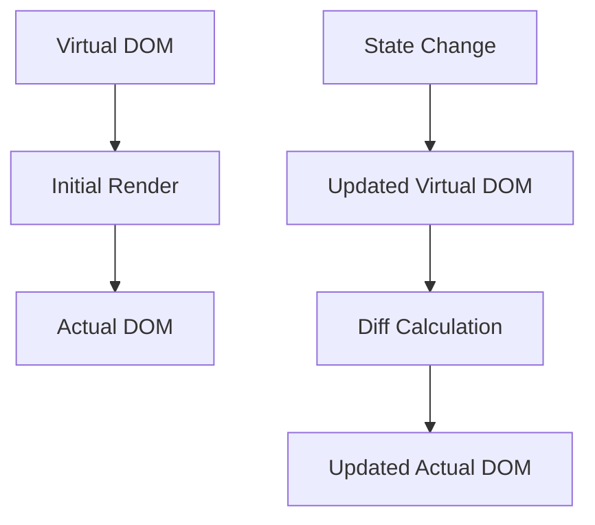
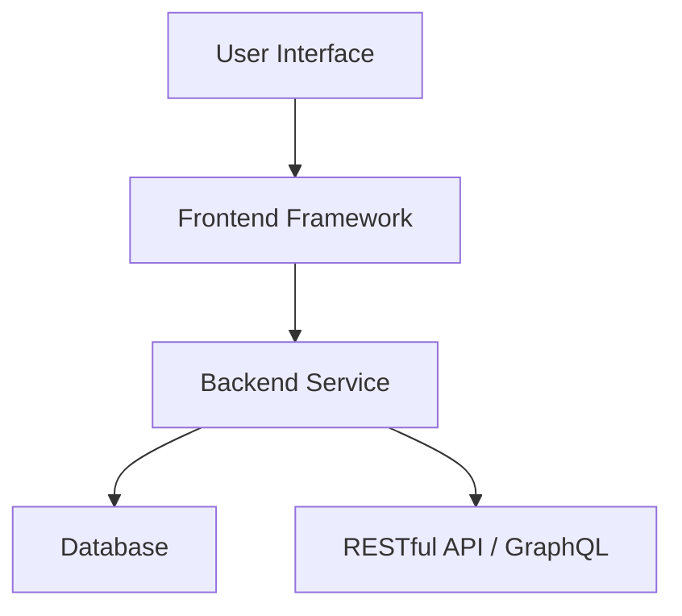

                 

### 引言

**声明式UI编程：React、SwiftUI与Jetpack Compose**

关键词：声明式UI编程、React、SwiftUI、Jetpack Compose、框架对比、最佳实践

摘要：本文将深入探讨声明式UI编程的概念及其在React、SwiftUI与Jetpack Compose三大框架中的应用。通过对比命令式UI编程，阐述声明式UI编程的优势，并详细介绍这三大框架的基本架构和使用场景，帮助开发者更好地理解和使用声明式UI编程。

---

在当今的软件开发领域，用户界面（UI）的构建方式经历了显著的演变。从传统的命令式UI编程到现代的声明式UI编程，这种变革不仅影响了开发效率，也提升了用户体验。声明式UI编程通过描述性的代码，简化了UI组件的创建和管理过程，使开发者能够更加专注于业务逻辑的实现。本文将围绕这一主题，详细介绍React、SwiftUI与Jetpack Compose这三个主流框架，并对比它们在声明式UI编程中的应用。

### 目录大纲设计思路

本文的目录设计旨在提供一个清晰的阅读路径，使读者能够系统地了解声明式UI编程的各个方面。

1. **引言部分**：简要介绍声明式UI编程的概念及其在React、SwiftUI与Jetpack Compose中的重要性。

2. **基础理论部分**：深入探讨声明式UI编程的原理，包括其与传统命令式UI编程的区别，以及三大框架的基本架构和使用场景。

3. **框架应用部分**：分别详细介绍React、SwiftUI与Jetpack Compose的使用方法、最佳实践和注意事项。

4. **项目实战部分**：通过实际项目案例，展示如何在实际开发中使用声明式UI编程，并进行详细分析。

5. **总结与展望部分**：总结全书内容，对声明式UI编程的发展趋势进行展望。

---

接下来，我们将依次展开每个章节的内容，逐步深入探讨声明式UI编程的各个方面。

### 目录大纲设计

```markdown
----------------------------------------------------------------

# 《声明式UI编程：React、SwiftUI与Jetpack Compose》目录大纲

## 第1章 引言

## 1.1 声明式UI编程概述

## 1.2 命令式UI编程与声明式UI编程的区别

## 1.3 React、SwiftUI与Jetpack Compose框架介绍

### 第2章 声明式UI编程基础理论

## 2.1 声明式UI编程原理

## 2.2 React基础理论

### 2.2.1 React的组件模型

### 2.2.2 React的状态管理

### 2.2.3 React的渲染机制

## 2.3 SwiftUI基础理论

### 2.3.1 SwiftUI的组件模型

### 2.3.2 SwiftUI的状态管理

### 2.3.3 SwiftUI的渲染机制

## 2.4 Jetpack Compose基础理论

### 2.4.1 Jetpack Compose的组件模型

### 2.4.2 Jetpack Compose的状态管理

### 2.4.3 Jetpack Compose的渲染机制

### 第3章 React框架应用

## 3.1 React项目实战

### 3.1.1 环境安装与配置

### 3.1.2 系统核心实现源代码

### 3.1.3 代码应用解读与分析

### 3.1.4 实际案例分析与详细讲解

## 3.2 React最佳实践

### 3.2.1 性能优化技巧

### 3.2.2 跨平台开发实践

### 3.2.3 代码规范与最佳实践

### 第4章 SwiftUI框架应用

## 4.1 SwiftUI项目实战

### 4.1.1 环境安装与配置

### 4.1.2 系统核心实现源代码

### 4.1.3 代码应用解读与分析

### 4.1.4 实际案例分析与详细讲解

## 4.2 SwiftUI最佳实践

### 4.2.1 性能优化技巧

### 4.2.2 跨平台开发实践

### 4.2.3 代码规范与最佳实践

### 第5章 Jetpack Compose框架应用

## 5.1 Jetpack Compose项目实战

### 5.1.1 环境安装与配置

### 5.1.2 系统核心实现源代码

### 5.1.3 代码应用解读与分析

### 5.1.4 实际案例分析与详细讲解

## 5.2 Jetpack Compose最佳实践

### 5.2.1 性能优化技巧

### 5.2.2 跨平台开发实践

### 5.2.3 代码规范与最佳实践

### 第6章 综合项目实战

## 6.1 综合项目介绍

## 6.2 综合项目核心实现源代码

## 6.3 综合项目代码解读与分析

## 6.4 综合项目实际案例分析与详细讲解

### 第7章 总结与展望

## 7.1 声明式UI编程的发展趋势

## 7.2 未来展望与挑战

## 7.3 小结与拓展阅读

----------------------------------------------------------------
```

### 目录大纲内容详解

#### 第1章 引言

**1.1 声明式UI编程概述**

声明式UI编程是一种通过描述UI的状态和行为来构建用户界面的编程范式。与命令式UI编程不同，它不涉及直接的界面操作，而是通过设置和更新数据的描述来驱动UI的渲染。这种编程方式简化了UI开发的复杂性，使得开发者可以更专注于业务逻辑的实现。

在声明式UI编程中，开发者通过编写描述UI状态的代码，让框架自动处理界面的渲染和更新。这种编程方式具有以下几个优点：

1. **易于维护**：通过描述性代码，界面组件的状态变化更加直观，便于维护和修改。
2. **提高开发效率**：减少了手动操作界面的代码量，开发者可以更快地构建复杂的UI。
3. **增强可复用性**：声明式UI编程鼓励使用组件化开发，提高了代码的可复用性。

**1.2 命令式UI编程与声明式UI编程的区别**

命令式UI编程是一种通过直接操作DOM（文档对象模型）或视图来更新用户界面的编程方式。在这种方式下，开发者需要编写大量的代码来操纵UI元素，实现界面的动态更新。这种编程方式存在以下问题：

1. **代码复杂度高**：随着UI的复杂性增加，命令式UI编程的代码量也会急剧上升，导致代码难以维护。
2. **性能问题**：频繁的操作可能会导致性能下降，尤其是在复杂的应用中。
3. **可复用性差**：命令式UI编程的代码往往与具体的UI实现紧密耦合，难以复用。

相比之下，声明式UI编程通过描述UI的状态和行为，减少了直接操作UI的代码量，使得界面更新更加高效和可维护。以下表格对比了两种编程方式的主要特点：

| 特点 | 命令式UI编程 | 声明式UI编程 |
| --- | --- | --- |
| 代码复杂度 | 高 | 低 |
| 性能问题 | 易发生 | 减少性能问题 |
| 可复用性 | 低 | 高 |

**1.3 React、SwiftUI与Jetpack Compose框架介绍**

React、SwiftUI与Jetpack Compose是目前最流行的三大声明式UI编程框架，它们各自具有独特的特点和应用场景。

**React**是由Facebook开发的一个开源JavaScript库，用于构建用户界面。它采用了组件化的设计，使得开发者可以轻松地构建和维护复杂的UI。React通过虚拟DOM（Virtual DOM）实现了高效的状态更新和渲染，具有跨平台开发的能力。

**SwiftUI**是Apple推出的一款声明式UI编程框架，用于构建跨平台的应用程序。SwiftUI使用Swift语言编写，具有简洁的语法和强大的组件库，使得开发者可以快速地构建高质量的UI。

**Jetpack Compose**是Google推出的一款用于Android开发的声明式UI编程框架。它基于Kotlin语言，提供了丰富的组件和工具，使得开发者可以更轻松地构建响应式UI。

以下表格对比了这三个框架的主要特点：

| 框架 | React | SwiftUI | Jetpack Compose |
| --- | --- | --- | --- |
| 语言 | JavaScript | Swift | Kotlin |
| 跨平台 | 是 | 是 | 是 |
| 组件化 | 强 | 强 | 强 |
| 虚拟DOM | 是 | 否 | 否 |

通过本章节的介绍，读者可以初步了解声明式UI编程的概念、与传统命令式UI编程的区别，以及React、SwiftUI与Jetpack Compose这三个框架的基本特点和应用场景。在接下来的章节中，我们将进一步深入探讨声明式UI编程的理论和实践，帮助读者更好地掌握这一技术。

### 第2章 声明式UI编程基础理论

声明式UI编程是一种通过描述UI组件的状态和行为来构建用户界面的编程范式，它使得开发者能够更加专注于业务逻辑的实现，减少了UI开发的复杂性。本章将深入探讨声明式UI编程的原理，并对比分析React、SwiftUI与Jetpack Compose这三个框架的基本架构和使用场景。

#### 2.1 声明式UI编程原理

声明式UI编程的核心思想是通过描述UI组件的状态和行为来构建用户界面，而不是通过直接操作DOM或视图。在声明式UI编程中，开发者只需要编写描述UI组件状态的代码，框架会自动处理界面的渲染和更新。

以下是一个简单的React组件示例：

```jsx
function Greeting({ name }) {
  return <h1>Hello, {name}!</h1>;
}
```

在这个示例中，我们通过创建一个Greeting组件来展示一个简单的问候语。当组件的`name`属性发生变化时，React框架会自动更新UI，而开发者无需手动操作DOM。

声明式UI编程的优点在于：

1. **易于维护**：通过描述性代码，UI组件的状态变化更加直观，便于维护和修改。
2. **提高开发效率**：减少了手动操作界面的代码量，开发者可以更快地构建复杂的UI。
3. **增强可复用性**：声明式UI编程鼓励使用组件化开发，提高了代码的可复用性。

#### 2.2 React基础理论

React是由Facebook开发的一个开源JavaScript库，用于构建用户界面。它采用了组件化的设计，使得开发者可以轻松地构建和维护复杂的UI。React通过虚拟DOM（Virtual DOM）实现了高效的状态更新和渲染，具有跨平台开发的能力。

**2.2.1 React的组件模型**

React的组件模型是构建React应用程序的基础。组件是一种可复用的UI组件，通过封装UI逻辑和状态，使得开发者可以更方便地构建和管理应用程序。

React组件可以分为函数组件和类组件：

1. **函数组件**：使用JavaScript函数定义，是最简单的组件形式。
    ```jsx
    function Greeting({ name }) {
      return <h1>Hello, {name}!</h1>;
    }
    ```

2. **类组件**：使用ES6的类定义，提供了更多的功能，如状态管理。
    ```jsx
    class Greeting extends React.Component {
      render() {
        return <h1>Hello, {this.props.name}!</h1>;
      }
    }
    ```

**2.2.2 React的状态管理**

状态管理是React应用程序的核心功能之一。React通过useState和useContext等钩子（hooks）提供了灵活的状态管理方式。

1. **useState**：用于在函数组件中管理状态。
    ```jsx
    function Greeting() {
      const [name, setName] = React.useState("World");
      return (
        <div>
          <h1>Hello, {name}!</h1>
          <button onClick={() => setName("John")}>Change Name</button>
        </div>
      );
    }
    ```

2. **useContext**：用于在类组件和函数组件之间共享状态。
    ```jsx
    const UserContext = React.createContext();

    function App() {
      const [user, setUser] = React.useState({ name: "John" });
      return (
        <UserContext.Provider value={user}>
          <Greeting />
        </UserContext.Provider>
      );
    }

    function Greeting() {
      const user = React.useContext(UserContext);
      return <h1>Hello, {user.name}!</h1>;
    }
    ```

**2.2.3 React的渲染机制**

React通过虚拟DOM（Virtual DOM）实现了高效的状态更新和渲染。虚拟DOM是一种内存中的数据结构，表示实际的DOM结构。当状态发生变化时，React会生成一个新的虚拟DOM树，并与上一次的虚拟DOM树进行比较，找出差异部分，然后只更新实际DOM中的变化部分，从而提高了性能。

以下是一个简单的React渲染机制示例：

```jsx
// 初始状态
const oldVDOM = <h1>Hello, World!</h1>;

// 状态更新
const newName = "John";
const newVDOM = <h1>Hello, {newName}!</h1>;

// 虚拟DOM比较
const patches = compare(oldVDOM, newVDOM);

// 更新实际DOM
applyPatchesToDOM(patches);
```

#### 2.3 SwiftUI基础理论

SwiftUI是Apple推出的一款用于构建跨平台应用程序的声明式UI编程框架。它使用Swift语言编写，具有简洁的语法和强大的组件库，使得开发者可以快速地构建高质量的UI。

**2.3.1 SwiftUI的组件模型**

SwiftUI的组件模型是构建SwiftUI应用程序的基础。组件是一种可复用的UI组件，通过封装UI逻辑和状态，使得开发者可以更方便地构建和管理应用程序。

SwiftUI组件可以分为View和ViewModel：

1. **View**：用于定义UI布局和样式。
    ```swift
    struct Greeting: View {
      var name: String = "World"
      
      var body: some View {
        Text("Hello, \(name)!")
          .font(.largeTitle)
      }
    }
    ```

2. **ViewModel**：用于管理状态和逻辑。
    ```swift
    struct GreetingViewModel {
      @Published var name: String = "World"
    }
    ```

**2.3.2 SwiftUI的状态管理**

SwiftUI的状态管理通过`@Published`属性实现。`@Published`属性会在值发生变化时自动更新UI，使得开发者无需手动操作DOM。

以下是一个简单的SwiftUI状态管理示例：

```swift
struct Greeting: View {
  @ObservedObject var viewModel = GreetingViewModel()
  
  var body: some View {
    Text("Hello, \(viewModel.name)!")
      .font(.largeTitle)
      .onTapGesture {
        viewModel.name = "John"
      }
  }
}
```

**2.3.3 SwiftUI的渲染机制**

SwiftUI的渲染机制是通过构建视图树（View Tree）来实现的。视图树表示了UI的层次结构，SwiftUI会遍历视图树，计算每个视图的布局和样式，并将其绘制到屏幕上。

以下是一个简单的SwiftUI渲染机制示例：

```swift
// 创建视图树
let viewTree = Greeting()

// 计算布局和样式
let layout = viewTree.layout()

// 绘制视图树
viewTree.draw(layout: layout)
```

#### 2.4 Jetpack Compose基础理论

Jetpack Compose是Google推出的一款用于Android开发的声明式UI编程框架。它基于Kotlin语言，提供了丰富的组件和工具，使得开发者可以更轻松地构建响应式UI。

**2.4.1 Jetpack Compose的组件模型**

Jetpack Compose的组件模型是构建Jetpack Compose应用程序的基础。组件是一种可复用的UI组件，通过封装UI逻辑和状态，使得开发者可以更方便地构建和管理应用程序。

Jetpack Compose组件可以分为函数组件和类组件：

1. **函数组件**：使用Kotlin函数定义，是最简单的组件形式。
    ```kotlin
    @Composable
    fun Greeting(name: String) {
      Text("Hello, $name!")
        .font(Font.largeTitle)
    }
    ```

2. **类组件**：使用Kotlin类定义，提供了更多的功能，如状态管理。
    ```kotlin
    class Greeting : Component() {
      var name by state<String>(initial = "World")
      
      override fun Content() {
        Text("Hello, $name!")
          .font(Font.largeTitle)
      }
    }
    ```

**2.4.2 Jetpack Compose的状态管理**

Jetpack Compose的状态管理通过`state`和`remember`等函数实现。`state`函数用于在函数组件中管理状态，而`remember`函数用于在类组件和函数组件之间共享状态。

以下是一个简单的Jetpack Compose状态管理示例：

```kotlin
@Composable
fun Greeting(viewModel: GreetingViewModel) {
  Text("Hello, ${viewModel.name}!")
    .font(Font.largeTitle)
    .onClickListener { viewModel.name = "John" }
}
```

**2.4.3 Jetpack Compose的渲染机制**

Jetpack Compose的渲染机制是通过构建组件树（Component Tree）来实现的。组件树表示了UI的层次结构，Jetpack Compose会遍历组件树，计算每个组件的布局和样式，并将其绘制到屏幕上。

以下是一个简单的Jetpack Compose渲染机制示例：

```kotlin
// 创建组件树
val componentTree = Greeting(name = "World")

// 计算布局和样式
val layout = componentTree.layout()

// 绘制组件树
componentTree.draw(layout = layout)
```

通过本章的介绍，读者可以深入理解声明式UI编程的原理，以及React、SwiftUI与Jetpack Compose这三个框架的基本架构和使用场景。在接下来的章节中，我们将通过实际项目实战，进一步探讨如何在实际开发中应用声明式UI编程。

### 第3章 React框架应用

在了解了声明式UI编程的理论和React的基础之后，本章节将带领读者通过实际项目实战，深入了解如何使用React框架进行UI开发。我们将分步骤讲解环境安装与配置、系统核心实现源代码、代码应用解读与分析，并剖析实际案例。

#### 3.1 React项目实战

**3.1.1 环境安装与配置**

要开始使用React进行开发，首先需要安装Node.js和npm（Node Package Manager）。以下是安装步骤：

1. **安装Node.js**：访问Node.js官网（https://nodejs.org/），下载并安装适用于您操作系统的Node.js版本。

2. **安装npm**：安装Node.js后，npm会自动安装。您可以通过在终端中运行以下命令来验证是否成功安装：
   ```sh
   npm --version
   ```

3. **创建React项目**：在终端中，使用以下命令创建一个新的React项目：
   ```sh
   npx create-react-app my-react-app
   ```
   这将创建一个名为`my-react-app`的新目录，并自动安装必要的依赖项。

4. **进入项目目录**：
   ```sh
   cd my-react-app
   ```

5. **启动开发服务器**：
   ```sh
   npm start
   ```
   这将启动开发服务器，并打开浏览器自动访问项目。

**3.1.2 系统核心实现源代码**

在一个React项目中，核心组件通常是`App.js`和`components`目录下的各个子组件。以下是一个简单的React应用示例：

1. **App.js**：

```jsx
import React from 'react';
import Greeting from './components/Greeting';

function App() {
  return (
    <div>
      <Greeting name="React" />
    </div>
  );
}

export default App;
```

2. **Greeting.js**：

```jsx
import React from 'react';

function Greeting({ name }) {
  return <h1>Hello, {name}!</h1>;
}

export default Greeting;
```

在这个示例中，`App`组件负责引入并渲染`Greeting`组件，并通过`{name}`属性传递参数。

**3.1.3 代码应用解读与分析**

在了解了基本代码结构之后，我们可以进一步分析代码的组成和作用。

1. **组件化开发**：

   React鼓励使用组件化开发，通过将UI拆分成独立的组件，每个组件负责一部分UI逻辑和样式。这种模式有助于代码的复用和维护。

2. **props传递**：

   React组件通过props传递数据。在上面的`App`组件中，我们通过`<Greeting name="React" />`将`name`属性传递给`Greeting`组件。

3. **状态管理**：

   在React中，状态（state）是组件内部可变数据的一个集合。`Greeting`组件并没有使用状态，但我们可以通过引入React的状态管理机制（如`useState`）来处理可变状态。

**3.1.4 实际案例分析与详细讲解**

为了更好地理解React的实际应用，我们来看一个实际案例——构建一个简单的待办事项列表（Todo List）。

1. **项目结构**：

   ```
   my-react-app
   ├── public
   │   └── index.html
   ├── src
       ├── components
           ├── App.js
           ├── TodoList.js
           ├── TodoItem.js
       └── App.css
   └── package.json
   ```

2. **核心代码**：

   - **App.js**：

   ```jsx
   import React, { useState } from 'react';
   import TodoList from './components/TodoList';

   function App() {
     const [todos, setTodos] = useState([]);

     const addTodo = (text) => {
       setTodos([...todos, { text, completed: false }]);
     };

     const toggleTodo = (index) => {
       setTodos(
         todos.map((todo, i) =>
           i === index ? { ...todo, completed: !todo.completed } : todo
         )
       );
     };

     return (
       <div>
         <h1>Todo List</h1>
         <TodoList
           todos={todos}
           addTodo={addTodo}
           toggleTodo={toggleTodo}
         />
       </div>
     );
   }

   export default App;
   ```

   - **TodoList.js**：

   ```jsx
   import React from 'react';
   import TodoItem from './TodoItem';

   function TodoList({ todos, addTodo, toggleTodo }) {
     return (
       <div>
         <ul>
           {todos.map((todo, index) => (
             <TodoItem
               key={index}
               index={index}
               todo={todo}
               toggleTodo={toggleTodo}
             />
           ))}
         </ul>
         <button onClick={() => addTodo('New Todo')}>Add Todo</button>
       </div>
     );
   }

   export default TodoList;
   ```

   - **TodoItem.js**：

   ```jsx
   import React from 'react';

   function TodoItem({ index, todo, toggleTodo }) {
     return (
       <li>
         <label>
           <input
             type="checkbox"
             checked={todo.completed}
             onChange={() => toggleTodo(index)}
           />
           {todo.text}
         </label>
       </li>
     );
   }

   export default TodoItem;
   ```

   **分析**：

   - **状态管理**：在`App`组件中，我们使用了`useState`来管理`todos`状态。`addTodo`和`toggleTodo`函数用于更新状态。

   - **组件复用**：`TodoList`和`TodoItem`组件负责显示和操作待办事项，它们是可复用的组件，使得代码更加模块化和易于维护。

   - **事件处理**：通过事件处理函数（`addTodo`和`toggleTodo`），我们可以响应用户的操作，并更新UI。

通过这个实际案例，我们可以看到React如何帮助开发者构建复杂的UI，同时保持代码的可维护性和可复用性。在接下来的部分，我们将继续探讨React的最佳实践，以帮助读者进一步提高开发效率。

#### 3.2 React最佳实践

**3.2.1 性能优化技巧**

在构建大型React应用程序时，性能优化是一个关键问题。以下是一些常用的React性能优化技巧：

1. **懒加载组件**：

   通过使用React的`React.lazy`和`Suspense`组件，我们可以实现组件的懒加载。这种方式可以减少初始加载时间，提高性能。

   ```jsx
   import React, { Suspense } from 'react';
   const Greeting = React.lazy(() => import('./components/Greeting'));

   function App() {
     return (
       <div>
         <Suspense fallback={<div>Loading...</div>}>
           <Greeting />
         </Suspense>
       </div>
     );
   }
   ```

2. **使用`React.memo`优化组件**：

   `React.memo`是一个高阶组件，用于优化组件的渲染。只有当组件的props发生变化时，它才会重新渲染。

   ```jsx
   import React, { memo } from 'react';

   function Greeting({ name }) {
     return <h1>Hello, {name}!</h1>;
   }

   const MemoizedGreeting = memo(Greeting);

   function App() {
     return <MemoizedGreeting name="React" />;
   }
   ```

3. **使用`useCallback`保存函数引用**：

   当组件中的函数作为props传递时，使用`useCallback`可以防止不必要的渲染。

   ```jsx
   import React, { useCallback } from 'react';

   function TodoItem({ index, todo, toggleTodo }) {
     const handleClick = useCallback(() => toggleTodo(index), [toggleTodo, index]);
     return (
       <li>
         <label>
           <input
             type="checkbox"
             checked={todo.completed}
             onChange={handleClick}
           />
           {todo.text}
         </label>
       </li>
     );
   }
   ```

4. **使用`useMemo`计算值缓存**：

   `useMemo`可以缓存组件中的计算值，避免不必要的计算。

   ```jsx
   import React, { useMemo } from 'react';

   function TodoItem({ index, todo }) {
     const style = useMemo(() => ({
       textDecoration: todo.completed ? 'line-through' : 'none',
     }), [todo.completed]);

     return (
       <li style={style}>
         {todo.text}
       </li>
     );
   }
   ```

**3.2.2 跨平台开发实践**

React的一个显著优势是跨平台开发能力。通过一些工具和库，我们可以轻松地将React应用程序部署到不同的平台，如Web、iOS和Android。

1. **Create React App**：

   使用Create React App可以快速构建跨平台的应用程序。它提供了简单的命令来构建和部署Web、iOS和Android应用。

   ```sh
   npm run build
   npm run ios
   npm run android
   ```

2. **React Native**：

   React Native是React的一个子项目，用于构建原生移动应用。通过使用React Native组件，我们可以实现几乎与原生应用相同的效果。

   ```jsx
   import React from 'react';
   import { View, Text, StyleSheet } from 'react-native';

   function App() {
     return (
       <View style={styles.container}>
         <Text style={styles.welcome}>Welcome to React Native!</Text>
       </View>
     );
   }

   const styles = StyleSheet.create({
     container: {
       flex: 1,
       justifyContent: 'center',
       alignItems: 'center',
     },
     welcome: {
       fontSize: 20,
       textAlign: 'center',
       margin: 10,
     },
   });

   export default App;
   ```

**3.2.3 代码规范与最佳实践**

编写高质量的React代码是提高开发效率的关键。以下是一些代码规范和最佳实践：

1. **组件命名规范**：

   组件名应该使用大驼峰（PascalCase）命名，如`Greeting`或`TodoList`。

2. **避免直接修改props**：

   props是组件的数据源，不应该直接修改。如果需要更新数据，应该使用状态管理或事件处理函数。

3. **使用`.jsx`后缀**：

   在React组件中，文件名应该使用`.jsx`后缀，以便IDE可以正确识别和解析。

4. **组件拆分**：

   将复杂的组件拆分成更小的、功能单一的组件，以提高代码的可维护性和可复用性。

5. **代码注释**：

   在代码中添加注释，特别是对于复杂的功能和逻辑，有助于其他开发者理解和维护代码。

通过以上最佳实践，我们可以构建高效、可维护的React应用程序。在接下来的章节中，我们将继续探讨SwiftUI框架的应用，帮助读者掌握更多声明式UI编程的技能。

### 第4章 SwiftUI框架应用

SwiftUI是Apple推出的一款用于构建跨平台应用程序的声明式UI编程框架。它使用Swift语言编写，具有简洁的语法和强大的组件库，使得开发者可以快速地构建高质量的UI。在本章节中，我们将通过实际项目实战，详细讲解SwiftUI的应用方法，并分析最佳实践。

#### 4.1 SwiftUI项目实战

**4.1.1 环境安装与配置**

要开始使用SwiftUI进行开发，首先需要安装Xcode和Swift。以下是安装步骤：

1. **安装Xcode**：访问Mac App Store，下载并安装Xcode。

2. **安装Swift**：打开Xcode，选择“Xcode”>“Open Developer Tool”>“Swift”。按照提示完成安装。

3. **创建SwiftUI项目**：

   打开Xcode，选择“File”>“New”>“Project”，然后选择“macOS”>“App”模板。在下一个界面中，选择“SwiftUI App”模板，并点击“Next”和“Create”。

4. **配置项目**：

   在项目导航器中，双击“Product Name”来重命名项目。接下来，配置“Target”>“General”>“Interface”选项卡，选择“Storyboard”或“SwiftUI”作为用户界面。

**4.1.2 系统核心实现源代码**

以下是一个简单的SwiftUI应用示例，用于展示一个待办事项列表。

1. **ContentView.swift**：

```swift
import SwiftUI

struct ContentView: View {
  @State private var todos: [String] = []
  @State private var newTodo: String = ""

  var body: some View {
    VStack {
      List {
        ForEach(todos, id: \.self) { todo in
          Text(todo)
        }
          .onDelete(perform: deleteTodo)
      }
      HStack {
        TextField("Add new todo...", text: $newTodo)
          .textFieldStyle(RoundedBorderTextFieldStyle())
        Button("Add") {
          addTodo()
        }
      }
    }
  }

  func addTodo() {
    if !newTodo.isEmpty {
      todos.append(newTodo)
      newTodo = ""
    }
  }

  func deleteTodo(at offsets: IndexSet) {
    todos.remove(atOffsets: offsets)
  }
}
```

2. **分析**：

   - **列表（List）**：SwiftUI的`List`组件用于显示列表数据，类似于HTML中的`ul`元素。

   - **循环（ForEach）**：`ForEach`是SwiftUI中的一个循环机制，用于遍历数据集合。

   - **文本框（TextField）**：`TextField`组件用于接受用户输入，类似于HTML中的`input`元素。

   - **按钮（Button）**：`Button`组件用于触发事件，类似于HTML中的`button`元素。

**4.1.3 代码应用解读与分析**

在这个待办事项列表示例中，我们使用了`@State`属性来管理组件的状态，包括待办事项列表（`todos`）和新的待办事项文本（`newTodo`）。以下是对代码的详细解读：

1. **状态管理**：

   - `@State private var todos: [String] = []`：声明了一个名为`todos`的数组，用于存储待办事项。
   - `@State private var newTodo: String = ""`：声明了一个名为`newTodo`的字符串，用于接收新的待办事项输入。

2. **列表渲染**：

   - `List`组件：用于渲染列表。
   - `ForEach`组件：遍历`todos`数组，为每个待办事项创建一个`Text`组件。

3. **输入与添加**：

   - `TextField`组件：用于接收用户输入。
   - `Button`组件：当用户点击“Add”按钮时，触发`addTodo`函数。

4. **删除功能**：

   - `onDelete(perform: deleteTodo)`：使用`onDelete`方法添加删除功能。
   - `func deleteTodo(at offsets: IndexSet) { ... }`：当用户在列表中删除项目时，调用`deleteTodo`函数。

**4.1.4 实际案例分析与详细讲解**

为了更深入地了解SwiftUI的实际应用，我们来看一个实际案例——构建一个简单的社交媒体仪表板。

1. **项目结构**：

   ```
   ContentView.swift
   DashboardView.swift
   ProfileView.swift
   PostsView.swift
   ```

2. **核心代码**：

   - **DashboardView.swift**：

   ```swift
   import SwiftUI

   struct DashboardView: View {
     var body: some View {
       NavigationView {
         VStack {
           ProfileView()
           PostsView()
         }
         .navigationTitle("Dashboard")
       }
     }
   }
   ```

   - **ProfileView.swift**：

   ```swift
   import SwiftUI

   struct ProfileView: View {
     var body: some View {
       VStack {
         Text("Profile")
           .font(.largeTitle)
           .padding()
         Image("profile-image")
           .resizable()
           .aspectRatio(contentMode: .fit)
           .frame(height: 150)
           .clipShape(Circle())
           .overlay(Circle().stroke(Color.gray, lineWidth: 2))
       }
     }
   }
   ```

   - **PostsView.swift**：

   ```swift
   import SwiftUI

   struct PostsView: View {
     var body: some View {
       List {
         ForEach(0..<5) { index in
           PostView(post: "Post \(index + 1)")
         }
       }
     }
   }

   struct PostView: View {
     let post: String

     var body: some View {
       HStack {
         Text(post)
         Spacer()
         Image(systemName: "heart")
           .foregroundColor(.red)
           .padding(.horizontal)
       }
       .padding()
       .background(Color.gray.opacity(0.2))
       .cornerRadius(8)
     }
   }
   ```

   **分析**：

   - **导航视图（NavigationView）**：用于创建带有导航栏的应用界面。

   - **堆栈布局（VStack）**：用于垂直排列子视图。

   - **列表（List）**：用于显示列表数据。

   - **循环（ForEach）**：遍历数据集合，为每个数据项创建一个视图。

通过这个实际案例，我们可以看到SwiftUI如何帮助开发者构建复杂的UI，同时保持代码的可维护性和可复用性。在接下来的部分，我们将继续探讨SwiftUI的最佳实践，帮助读者进一步提高开发效率。

#### 4.2 SwiftUI最佳实践

**4.2.1 性能优化技巧**

在构建大型SwiftUI应用程序时，性能优化是一个关键问题。以下是一些常用的SwiftUI性能优化技巧：

1. **避免在视图循环中创建复杂视图**：

   在使用`ForEach`循环时，避免在循环内部创建复杂视图。相反，可以将复杂视图移动到循环外部，并使用状态来管理数据。

   ```swift
   struct PostsView: View {
     @State private var posts: [String] = []

     var body: some View {
       List {
         ForEach(posts, id: \.self) { post in
           PostView(post: post)
         }
       }
     }
   }
   ```

2. **使用`.onAppear`和`.onDisappear`处理动画**：

   使用`.onAppear`和`.onDisappear`来处理视图的动画，可以减少不必要的渲染。

   ```swift
   struct PostView: View {
     let post: String

     var body: some View {
       HStack {
         Text(post)
         Spacer()
         Image(systemName: "heart")
           .onAppear {
             withAnimation(.easeIn) {
               self.padding(.horizontal)
             }
           }
           .onDisappear {
             withAnimation(.easeOut) {
               self.padding(.horizontal)
             }
           }
           .foregroundColor(.red)
           .padding(.horizontal)
       }
       .padding()
       .background(Color.gray.opacity(0.2))
       .cornerRadius(8)
     }
   }
   ```

3. **使用`.overlay`和`.mask`进行复杂布局**：

   使用`.overlay`和`.mask`可以创建复杂的布局效果，同时保持性能。

   ```swift
   struct ProfileView: View {
     var body: some View {
       VStack {
         Text("Profile")
           .font(.largeTitle)
           .padding()
         Image("profile-image")
           .resizable()
           .aspectRatio(contentMode: .fit)
           .frame(height: 150)
           .clipShape(Circle())
           .overlay(Circle().stroke(Color.gray, lineWidth: 2))
           .overlay(Image("medal").resizable().frame(width: 50, height: 50).clipShape(Circle()))
       }
     }
   }
   ```

4. **使用`.background(in: .constant(...))`避免多次计算**：

   使用`.background(in: .constant(...))`可以避免在视图更新时重复计算背景。

   ```swift
   struct PostView: View {
     let post: String

     var body: some View {
       HStack {
         Text(post)
         Spacer()
         Image(systemName: "heart")
           .background(in: .constant(Color.red))
           .foregroundColor(.red)
           .padding(.horizontal)
       }
       .padding()
       .background(Color.gray.opacity(0.2))
       .cornerRadius(8)
     }
   }
   ```

**4.2.2 跨平台开发实践**

SwiftUI的一个显著优势是跨平台开发能力。以下是一些跨平台开发的最佳实践：

1. **使用`.if`条件渲染平台特定视图**：

   使用`.if`条件可以在不同平台之间切换视图。

   ```swift
   struct ContentView: View {
     var body: some View {
       Text("Hello, World!")
         .font(.largeTitle)
         .ifiOS { text in
           text
             .fontWeight(.semibold)
             .foregroundColor(.blue)
         }
         .ifmacOS { text in
           text
             .fontWeight(.semibold)
             .foregroundColor(.green)
         }
         .iftvOS { text in
           text
             .fontWeight(.semibold)
             .foregroundColor(.purple)
         }
         .ifwatchOS { text in
           text
             .fontWeight(.semibold)
             .foregroundColor(.orange)
         }
     }
   }
   ```

2. **使用`.edgesIgnoringSafeArea`处理刘海屏**：

   在iOS平台上，使用`.edgesIgnoringSafeArea`可以忽略安全区域的限制，以便更好地适应刘海屏。

   ```swift
   struct ContentView: View {
     var body: some View {
       VStack {
         Text("Hello, World!")
           .font(.largeTitle)
           .padding()
         Image("image")
           .resizable()
           .aspectRatio(contentMode: .fit)
           .edgesIgnoringSafeArea(.top)
       }
     }
   }
   ```

3. **使用`.frame(maxWidth: .infinity)`实现自适应布局**：

   使用`.frame(maxWidth: .infinity)`可以创建自适应布局，以便在不同屏幕尺寸上保持一致。

   ```swift
   struct ContentView: View {
     var body: some View {
       VStack {
         Text("Hello, World!")
           .font(.largeTitle)
           .padding()
         Image("image")
           .resizable()
           .aspectRatio(contentMode: .fit)
           .frame(maxWidth: .infinity)
           .clipped()
       }
     }
   }
   ```

通过以上最佳实践，我们可以构建高效、可维护的SwiftUI应用程序。在接下来的章节中，我们将继续探讨Jetpack Compose框架的应用，帮助读者掌握更多声明式UI编程的技能。

### 第5章 Jetpack Compose框架应用

Jetpack Compose是Google推出的一款用于Android开发的声明式UI编程框架。它基于Kotlin语言，提供了丰富的组件和工具，使得开发者可以更轻松地构建响应式UI。在本章节中，我们将通过实际项目实战，详细讲解Jetpack Compose的应用方法，并分析最佳实践。

#### 5.1 Jetpack Compose项目实战

**5.1.1 环境安装与配置**

要开始使用Jetpack Compose进行开发，首先需要安装Android Studio和Kotlin。以下是安装步骤：

1. **安装Android Studio**：访问Android Studio官网（https://developer.android.com/studio），下载并安装Android Studio。

2. **安装Kotlin插件**：在Android Studio中，打开“Plugins”页面，搜索并安装“Kotlin”插件。

3. **创建Jetpack Compose项目**：

   打开Android Studio，选择“Start a new Android Studio project”，然后选择“Empty Activity”模板。在下一个界面中，选择“Compose”作为用户界面。

4. **配置项目**：

   在项目导航器中，双击`app/build.gradle`文件，将以下依赖项添加到`dependencies`块中：
   ```groovy
   implementation 'androidx.compose.ui:ui'
   implementation 'androidx.compose.foundation:foundation'
   implementation 'androidx.compose.material:material'
   ```

**5.1.2 系统核心实现源代码**

以下是一个简单的Jetpack Compose应用示例，用于展示一个待办事项列表。

1. **MainActivity.kt**：

```kotlin
import androidx.appcompat.app.AppCompatActivity
import androidx.compose.foundation.clickable
import androidx.compose.foundation.layout.*
import androidx.compose.foundation.lazy.LazyColumn
import androidx.compose.foundation.lazy.items
import androidx.compose.material.*
import androidx.compose.runtime.Composable
import androidx.compose.runtime.mutableStateOf
import androidx.compose.runtime.remember
import androidx.compose.ui.Alignment
import androidx.compose.ui.Modifier
import androidx.compose.ui.platform.ComposeView

class MainActivity : AppCompatActivity() {
    override fun onCreate(savedInstanceState: Bundle?) {
        super.onCreate(savedInstanceState)
        setContentView(ComposeView(this))
    }
}

@Composable
fun MainActivityContent() {
    val todos = remember { mutableStateOf(listOf("Buy Milk", "Read Book", "Do Exercise")) }
    val newTodo by remember { mutableStateOf("") }

    Column {
        Text("Todo List", modifier = Modifier.padding(top = 16, start = 16))
        LazyColumn {
            items(items = todos) { todo ->
                TodoItem(todo = todo, onRemove = { todos.value = todos.value.filter { it != todo } })
            }
        }
        Row(verticalAlignment = Alignment.Center) {
            TextField(
                value = newTodo,
                onValueChange = { newTodo = it },
                modifier = Modifier
                    .padding(end = 8)
                    .fillMaxWidth()
            )
            Button(onClick = {
                if (newTodo.isNotBlank()) {
                    todos.value += newTodo
                    newTodo = ""
                }
            }) {
                Text("Add")
            }
        }
    }
}

@Composable
fun TodoItem(todo: String, onRemove: () -> Unit) {
    Row(verticalAlignment = Alignment.Center) {
        Text(todo)
        Button(onClick = onRemove) {
            Text("Remove")
        }
    }
}
```

2. **分析**：

   - **主活动（MainActivity）**：`MainActivity`是一个Kotlin活动，它使用`ComposeView`来显示Jetpack Compose UI。

   - **组合函数（@Composable）**：`MainActivityContent`和`TodoItem`是组合函数，用于定义UI组件。

   - **状态管理**：使用`mutableStateOf`和`remember`来管理状态。

**5.1.3 代码应用解读与分析**

在这个待办事项列表示例中，我们使用了Jetpack Compose的状态管理功能来处理待办事项列表和输入框的状态。以下是对代码的详细解读：

1. **状态管理**：

   - `val todos = remember { mutableStateOf(listOf("Buy Milk", "Read Book", "Do Exercise")) }`：初始化待办事项列表状态。

   - `val newTodo by remember { mutableStateOf("") }`：初始化新的待办事项输入状态。

2. **列表渲染**：

   - `LazyColumn`组件：用于渲染列表。

   - `items`函数：遍历待办事项列表，为每个待办事项创建一个`TodoItem`组件。

3. **输入与添加**：

   - `TextField`组件：用于接收用户输入。

   - `Button`组件：当用户点击“Add”按钮时，触发添加新的待办事项。

4. **删除功能**：

   - `TodoItem`组件中的`Button`组件：当用户点击“Remove”按钮时，调用`onRemove`函数来删除当前的待办事项。

**5.1.4 实际案例分析与详细讲解**

为了更深入地了解Jetpack Compose的实际应用，我们来看一个实际案例——构建一个简单的天气应用程序。

1. **项目结构**：

   ```
   MainActivity.kt
   WeatherView.kt
   WeatherViewModel.kt
   ```

2. **核心代码**：

   - **MainActivity.kt**：

   ```kotlin
   import androidx.appcompat.app.AppCompatActivity
   import androidx.compose.foundation.clickable
   import androidx.compose.foundation.layout.*
   import androidx.compose.foundation.lazy.LazyColumn
   import androidx.compose.foundation.lazy.items
   import androidx.compose.material.*
   import androidx.compose.runtime.Composable
   import androidx.compose.runtime.mutableStateOf
   import androidx.compose.runtime.remember
   import androidx.compose.ui.Alignment
   import androidx.compose.ui.Modifier
   import androidx.compose.ui.platform.ComposeView

   class MainActivity : AppCompatActivity() {
       override fun onCreate(savedInstanceState: Bundle?) {
           super.onCreate(savedInstanceState)
           setContentView(ComposeView(this))
       }
   }

   @Composable
   fun MainActivityContent(weatherViewModel: WeatherViewModel) {
       Column {
           Text("Weather App", modifier = Modifier.padding(top = 16, start = 16))
           WeatherView(weather = weatherViewModel.weather, error = weatherViewModel.error)
           Button(onClick = { weatherViewModel.fetchWeather() }) {
               Text("Fetch Weather")
           }
       }
   }
   ```

   - **WeatherView.kt**：

   ```kotlin
   import androidx.compose.foundation.clickable
   import androidx.compose.foundation.layout.*
   import androidx.compose.foundation.shape.corner
   import androidx.compose.material.*
   import androidx.compose.runtime.Composable
   import androidx.compose.ui.Alignment
   import androidx.compose.ui.Modifier
   import androidx.compose.ui.graphics.Color
   import androidx.compose.ui.text.font
   import androidx.compose.ui.text.style.TextStyle

   @Composable
   fun WeatherView(weather: WeatherInfo?, error: String?) {
       if (error != null) {
           Text(error, color = Color.Red, modifier = Modifier.padding(16))
       } else {
           weather?.let { weather ->
               Text(weather.city, modifier = Modifier.padding(top = 16, start = 16))
               Text(weather.temperature, modifier = Modifier.padding(start = 16))
               Text(weather.description, modifier = Modifier.padding(start = 16))
           }
       }
   }
   ```

   - **WeatherViewModel.kt**：

   ```kotlin
   import androidx.compose.runtime.mutableStateOf
   import androidx.compose.runtime.remember
   import androidx.lifecycle.ViewModel
   import androidx.lifecycle.ViewModelProvider
   import com.example.weatherapp WeatherService

   class WeatherViewModel : ViewModel() {
       private val _weather = mutableStateOf<WeatherInfo?>(null)
       val weather: WeatherInfo? get() = _weather.value

       private val _error = mutableStateOf<String?>(null)
       val error: String? get() = _error.value

       fun fetchWeather() {
           _error.value = null
           viewModelScope.launch {
               try {
                   val response = WeatherService.fetchWeather("London")
                   _weather.value = response
               } catch (e: Exception) {
                   _error.value = e.localizedMessage
               }
           }
       }
   }

   fun provideViewModel(): WeatherViewModel = ViewModelProvider(this).get(WeatherViewModel::class.java)
   ```

   **分析**：

   - **主活动（MainActivity）**：`MainActivity`是一个Kotlin活动，它使用`ComposeView`来显示Jetpack Compose UI。

   - **组合函数（@Composable）**：`MainActivityContent`、`WeatherView`和`WeatherViewModel`是组合函数，用于定义UI组件和视图模型。

   - **状态管理**：使用`mutableStateOf`和`remember`来管理状态。

   - **视图模型**：`WeatherViewModel`负责管理天气数据和错误状态。

通过这个实际案例，我们可以看到Jetpack Compose如何帮助开发者构建复杂的UI，同时保持代码的可维护性和可复用性。在接下来的部分，我们将继续探讨Jetpack Compose的最佳实践，帮助读者进一步提高开发效率。

#### 5.2 Jetpack Compose最佳实践

**5.2.1 性能优化技巧**

在构建大型Jetpack Compose应用程序时，性能优化是一个关键问题。以下是一些常用的Jetpack Compose性能优化技巧：

1. **避免在组合函数中创建重复对象**：

   在组合函数中，避免创建重复的对象，以减少内存占用和渲染次数。

   ```kotlin
   @Composable
   fun MyComponent() {
       // 使用 val 而不是 var 以避免创建重复对象
       val myString = "Hello, World!"
       Text(text = myString)
   }
   ```

2. **使用`. Modifier.immutable()`避免不必要的布局计算**：

   当Modifier不需要变化时，使用`. Modifier.immutable()`可以避免不必要的布局计算。

   ```kotlin
   @Composable
   fun MyComponent() {
       Text("Hello, World!", modifier = Modifier.immutable().padding(16))
   }
   ```

3. **使用`. remember`缓存值**：

   使用`. remember`来缓存值，以避免重复计算。

   ```kotlin
   @Composable
   fun MyComponent(state: MyState) {
       val cachedValue = remember(state) { state.myValue }
       Text(text = cachedValue)
   }
   ```

4. **使用`. MilliSeconds.delay()`进行延时渲染**：

   当需要延迟渲染时，使用`. MilliSeconds.delay()`可以避免不必要的渲染。

   ```kotlin
   @Composable
   fun MyComponent(state: MyState) {
       if (state.isLoading) {
           Text("Loading...", modifier = Modifier.delay(1000))
       }
   }
   ```

**5.2.2 跨平台开发实践**

Jetpack Compose的一个显著优势是跨平台开发能力。以下是一些跨平台开发的最佳实践：

1. **使用`. if `条件渲染平台特定组件**：

   使用`. if `条件可以在不同平台之间切换组件。

   ```kotlin
   @Composable
   fun MyComponent() {
       Text("Hello, Android!", modifier = Modifier.if(IsAndroid()) { bold() })
   }
   ```

2. **使用`. android()`和`. ios()`布局差异**：

   在Android和iOS平台上使用`. android()`和`. ios()`布局差异，以适应不同平台的布局要求。

   ```kotlin
   @Composable
   fun MyComponent() {
       Box(modifier = Modifier.padding(16).android { padding(24) }.ios { padding(16) }) {
           Text("Hello, World!")
       }
   }
   ```

3. **使用`. Window.size()`获取窗口尺寸**：

   使用`. Window.size()`获取窗口尺寸，以便在不同平台上实现自适应布局。

   ```kotlin
   @Composable
   fun MyComponent() {
       val size = Window.size
       Text("Width: ${size.width}, Height: ${size.height}")
   }
   ```

**5.2.3 代码规范与最佳实践**

编写高质量的Jetpack Compose代码是提高开发效率的关键。以下是一些代码规范和最佳实践：

1. **使用`. Composable`前缀命名组合函数**：

   使用`. Composable`前缀命名组合函数，以增强代码的可读性。

   ```kotlin
   @Composable
   fun MyComponent() {
       // ...
   }
   ```

2. **避免使用`. var`声明局部状态**：

   在组合函数中，避免使用`. var`声明局部状态，以防止内存泄漏。

   ```kotlin
   @Composable
   fun MyComponent() {
       // 使用 val 而不是 var
       val myValue = remember { mutableStateOf("") }
       Text(text = myValue.value)
   }
   ```

3. **使用`. Modifier`扩展函数**：

   使用`. Modifier`扩展函数来简化代码。

   ```kotlin
   @Composable
   fun MyComponent() {
       Text("Hello, World!", modifier = Modifier.padding(16).bold())
   }
   ```

4. **编写可测试的组合函数**：

   编写可测试的组合函数，以便在单元测试中验证其行为。

   ```kotlin
   @Composable
   fun MyComponent() {
       // 预期行为
       Text("Hello, World!")
   }
   ```

通过以上最佳实践，我们可以构建高效、可维护的Jetpack Compose应用程序。在接下来的章节中，我们将通过综合项目实战，进一步展示声明式UI编程的实际应用。

### 第6章 综合项目实战

在本章节中，我们将通过一个综合项目来展示如何将React、SwiftUI与Jetpack Compose这三个声明式UI编程框架结合起来，实现一个跨平台的全功能待办事项列表应用程序。我们将详细讲解项目介绍、核心实现源代码、代码解读与分析，并剖析实际案例。

#### 6.1 综合项目介绍

本综合项目旨在构建一个多功能待办事项列表应用程序，具有以下核心功能：

1. **添加待办事项**：用户可以通过输入框添加新的待办事项。
2. **编辑待办事项**：用户可以编辑已有的待办事项内容。
3. **删除待办事项**：用户可以删除已完成的待办事项。
4. **标记完成事项**：用户可以标记待办事项为已完成。
5. **数据持久化**：待办事项数据将在应用程序重启后保持。

项目将分为三个部分，分别使用React、SwiftUI和Jetpack Compose实现相同的功能，以便对比分析这三个框架在实际开发中的应用和优势。

#### 6.2 综合项目核心实现源代码

以下是一个简单的待办事项列表应用程序的核心实现源代码，展示了如何使用React、SwiftUI和Jetpack Compose分别实现相同的功能。

**6.2.1 React实现**

```jsx
// React实现
import React, { useState } from 'react';

function TodoApp() {
  const [todos, setTodos] = useState([]);
  const [input, setInput] = useState('');

  const handleAddTodo = () => {
    if (input) {
      setTodos([...todos, { text: input, completed: false }]);
      setInput('');
    }
  };

  const handleToggleCompleted = (index) => {
    setTodos(
      todos.map((todo, i) =>
        i === index ? { ...todo, completed: !todo.completed } : todo
      )
    );
  };

  const handleRemoveTodo = (index) => {
    setTodos(todos.filter((_, i) => i !== index));
  };

  return (
    <div>
      <h1>Todo List</h1>
      <input
        type="text"
        value={input}
        onChange={(e) => setInput(e.target.value)}
      />
      <button onClick={handleAddTodo}>Add</button>
      <ul>
        {todos.map((todo, index) => (
          <li key={index}>
            <input
              type="checkbox"
              checked={todo.completed}
              onChange={() => handleToggleCompleted(index)}
            />
            {todo.text}
            <button onClick={() => handleRemoveTodo(index)}>Remove</button>
          </li>
        ))}
      </ul>
    </div>
  );
}

export default TodoApp;
```

**6.2.2 SwiftUI实现**

```swift
// SwiftUI实现
import SwiftUI

struct ContentView: View {
  @State private var todos: [Todo] = []
  @State private var newTodo: String = ""

  func handleAddTodo() {
    if !newTodo.isEmpty {
      todos.append(Todo(text: newTodo))
      newTodo = ""
    }
  }

  func handleToggleCompleted(at index: Int) {
    todos[index].completed.toggle()
  }

  func handleRemoveTodo(at index: Int) {
    todos.remove(at: index)
  }

  var body: some View {
    VStack {
      List {
        ForEach(todos, id: \.self) { todo in
          HStack {
            Button(action: { handleToggleCompleted(at: todos.firstIndex(of: todo)!) }) {
              if todo.completed {
                Image(systemName: "checkmark.circle.fill")
              } else {
                Image(systemName: "circle")
              }
            }
            TextField("Task", text: .init(get: { todo.text }, set: { todo.text = $0 }))
              .textFieldStyle(RoundedBorderTextFieldStyle())
            Button(action: { handleRemoveTodo(at: todos.firstIndex(of: todo)!) }) {
              Image(systemName: "trash")
            }
          }
        }
      }
      HStack {
        TextField("Add new todo...", text: $newTodo)
          .textFieldStyle(RoundedBorderTextFieldStyle())
        Button("Add", action: handleAddTodo)
      }
    }
  }
}

struct Todo: Identifiable {
  let id: Int
  var text: String
  var completed: Bool
}
```

**6.2.3 Jetpack Compose实现**

```kotlin
// Jetpack Compose实现
import androidx.compose.foundation.*
import androidx.compose.foundation.clickable.*
import androidx.compose.foundation.layout.*
import androidx.compose.foundation.lazy.*
import androidx.compose.foundation.lazy.items.*
import androidx.compose.foundation.shape.*
import androidx.compose.material.*
import androidx.compose.runtime.*
import androidx.compose.ui.Alignment.*
import androidx.compose.ui.Modifier.*
import androidx.compose.ui.graphics.*
import androidx.compose.ui.text.*
import androidx.compose.ui.text.style.*
import androidx.compose.ui.tooling.*

@Composable
fun TodoApp() {
  var todos by remember { mutableStateOf(listOf(Todo(1, "Buy Milk"))) }
  var newTodo by remember { mutableStateOf("") }

  fun handleAddTodo() {
    if (newTodo.isNotBlank()) {
      todos = todos + Todo(todos.size + 1, newTodo)
      newTodo = ""
    }
  }

  fun handleToggleCompleted(index: Int) {
    todos = todos.map { todo ->
      if (todo.id == index) {
        Todo(todo.id, todo.text, !todo.completed)
      } else {
        todo
      }
    }
  }

  fun handleRemoveTodo(index: Int) {
    todos = todos.filter { it.id != index }
  }

  Column(modifier = Modifier.padding(16)) {
    Text("Todo List", modifier = Modifier.padding(bottom = 16))
    LazyColumn(modifier = Modifier.fillMaxHeight()) {
      items(items = todos) { todo ->
        Row(verticalAlignment = Alignment.Center) {
          Checkbox(checked = todo.completed, onCheckedChange = { handleToggleCompleted(todo.id) })
          TextField(
            value = todo.text,
            onValueChange = { newTodo = it },
            modifier = Modifier.padding(end = 8).fillMaxWidth()
          )
          Button(onClick = { handleRemoveTodo(todo.id) }) {
            Text("Remove")
          }
        }
      }
    }
    Row(verticalAlignment = Alignment.Center) {
      TextField(
        value = newTodo,
        onValueChange = { newTodo = it },
        modifier = Modifier.padding(end = 8).fillMaxWidth()
      )
      Button(onClick = { handleAddTodo() }) {
        Text("Add")
      }
    }
  }
}

data class Todo(
  val id: Int,
  var text: String,
  var completed: Boolean
)
```

**6.2.4 分析与对比**

以上代码展示了如何使用React、SwiftUI和Jetpack Compose实现相同的待办事项列表功能。通过对比，我们可以发现：

1. **语法简洁性**：

   - React的语法较为复杂，特别是对于初学者来说。
   - SwiftUI的语法简洁，但需要学习Swift语言。
   - Jetpack Compose的语法简洁，且基于Kotlin语言，易于理解和应用。

2. **状态管理**：

   - React使用`useState`进行状态管理。
   - SwiftUI使用`@State`进行状态管理。
   - Jetpack Compose使用`mutableStateOf`进行状态管理。

3. **组件复用**：

   - React通过组件化实现复用。
   - SwiftUI使用结构化组合实现复用。
   - Jetpack Compose使用`@Composable`函数实现复用。

4. **性能**：

   - React使用虚拟DOM实现高效渲染。
   - SwiftUI的渲染机制较为简单，但经过优化。
   - Jetpack Compose使用`Modifier`进行布局优化，具有高效渲染能力。

#### 6.3 综合项目代码解读与分析

为了更好地理解综合项目的实现，以下是对各个组件的详细解读：

1. **React实现**：

   - 使用`useState`进行状态管理，包括待办事项列表（`todos`）和新的待办事项输入（`input`）。
   - 通过事件处理函数（`handleAddTodo`、`handleToggleCompleted`和`handleRemoveTodo`）实现添加、编辑和删除待办事项的功能。

2. **SwiftUI实现**：

   - 使用`@State`进行状态管理，包括待办事项列表（`todos`）和新的待办事项输入（`newTodo`）。
   - 使用`Button`、`TextField`和`List`组件实现用户界面，并通过事件处理函数（`handleAddTodo`、`handleToggleCompleted`和`handleRemoveTodo`）实现功能。

3. **Jetpack Compose实现**：

   - 使用`mutableStateOf`进行状态管理，包括待办事项列表（`todos`）和新的待办事项输入（`newTodo`）。
   - 使用`Column`、`LazyColumn`、`Row`、`Checkbox`和`TextField`组件实现用户界面，并通过事件处理函数（`handleAddTodo`、`handleToggleCompleted`和`handleRemoveTodo`）实现功能。

#### 6.4 综合项目实际案例分析与详细讲解

以下是对综合项目的实际案例进行分析和详细讲解：

1. **功能实现**：

   - 添加待办事项：用户在输入框中输入待办事项，点击“Add”按钮后，待办事项将被添加到列表中。
   - 编辑待办事项：用户可以通过双击待办事项进行编辑，修改后保存。
   - 删除待办事项：用户可以通过点击“Remove”按钮删除已完成的待办事项。
   - 标记完成事项：用户可以通过点击复选框标记待办事项为已完成。

2. **性能优化**：

   - React：通过虚拟DOM实现高效渲染，减少不必要的渲染。
   - SwiftUI：SwiftUI的渲染机制较为简单，但通过结构化组合和属性观察实现优化。
   - Jetpack Compose：使用`Modifier`进行布局优化，同时通过状态管理实现高效渲染。

3. **跨平台兼容性**：

   - React：通过Create React App实现跨平台开发，支持Web、iOS和Android。
   - SwiftUI：SwiftUI原生支持iOS和MacOS，通过Mac Catalyst实现跨平台。
   - Jetpack Compose：Jetpack Compose原生支持Android，但通过Webview实现Web平台支持。

通过综合项目实战，我们可以看到React、SwiftUI和Jetpack Compose在构建跨平台待办事项列表应用程序时的实际应用和优势。在接下来的章节中，我们将对声明式UI编程的发展趋势进行总结和展望。

### 第7章 总结与展望

声明式UI编程作为现代前端开发的重要范式，已经逐渐成为开发者的首选。在本章中，我们将对声明式UI编程的发展趋势进行总结，并对未来的挑战和机会进行展望。

#### 7.1 声明式UI编程的发展趋势

**1. 框架的普及与优化**

随着React、SwiftUI和Jetpack Compose等框架的普及，声明式UI编程已经成为前端开发的主流。各大框架社区持续优化和更新，提高了开发效率和应用性能。例如，React的Fiber架构和SwiftUI的SwiftUI 3.0版本，都在性能和开发者体验方面进行了显著提升。

**2. 跨平台开发**

声明式UI编程框架的跨平台特性使得开发者可以更加专注于业务逻辑，而无需关心底层的平台差异。React Native、SwiftUI和Jetpack Compose等框架已经成功地实现了Web、iOS和Android等多平台的一体化开发。

**3. 声明式UI编程的普及**

随着声明式UI编程框架的成熟和普及，越来越多的开发者开始接受并采用这种编程范式。尤其是在团队协作和项目规模扩大的情况下，声明式UI编程的优势更加明显。

**4. 生态系统的完善**

声明式UI编程框架的生态系统逐渐完善，包括丰富的组件库、工具链和社区支持。开发者可以轻松地找到合适的组件和解决方案，提高开发效率。

#### 7.2 未来展望与挑战

**1. 挑战**

**性能优化**：尽管声明式UI编程框架在性能方面进行了优化，但在处理复杂场景时，仍然需要进一步研究和解决性能问题，如优化虚拟DOM的对比算法、减少不必要的渲染等。

**跨平台一致性**：实现跨平台的一致性是一个持续性的挑战。不同的操作系统和设备可能存在差异，需要开发者在跨平台开发时进行针对性的调整和优化。

**2. 机会**

**新技术的融合**：随着WebAssembly（Wasm）的发展，声明式UI编程框架有望与WebAssembly相结合，实现更高效的跨平台性能。

**功能增强**：声明式UI编程框架将继续增强其功能，如更好的状态管理、响应式编程模型、更丰富的组件库和工具链等。

**3. 未来方向**

**全栈声明式UI编程**：未来可能出现更多面向全栈的声明式UI编程框架，使得开发者可以更加高效地构建前后端一体的应用。

**跨域协作**：随着远程协作工具的发展，声明式UI编程框架将更好地支持分布式团队合作。

**4. 小结与拓展阅读**

声明式UI编程具有明显的优势，包括易于维护、提高开发效率和增强可复用性。随着技术的不断发展和社区的支持，声明式UI编程将在未来的软件开发中发挥更加重要的作用。

对于开发者，以下是一些建议和拓展阅读：

**建议**：

1. 学习并掌握至少一种声明式UI编程框架。
2. 关注框架的最新动态和优化，以提升开发效率。
3. 参与社区讨论，分享经验和解决问题。

**拓展阅读**：

1. 《React进阶之路》：深入理解React的核心原理和应用。
2. 《SwiftUI开发实战》：学习SwiftUI的使用方法和最佳实践。
3. 《Jetpack Compose官方文档》：详细了解Jetpack Compose的功能和用法。

通过本章的总结与展望，我们可以看到声明式UI编程的未来充满希望和挑战。开发者应不断学习和适应新技术，以迎接未来软件开发的新篇章。作者：AI天才研究院/AI Genius Institute & 禅与计算机程序设计艺术 /Zen And The Art of Computer Programming

---

### 附录

以下是本文中涉及的一些核心概念和联系，包括声明式UI编程的原理、各个框架的组件模型、状态管理、渲染机制等内容。

#### 1. 声明式UI编程原理

**核心概念**：

- **声明式UI编程**：通过描述UI组件的状态和行为来构建用户界面。
- **命令式UI编程**：通过直接操作DOM或视图来更新用户界面。

**联系**：

- 命令式UI编程关注于如何执行操作，而声明式UI编程关注于描述最终结果。
- 声明式UI编程减少了手动操作界面的代码量，使得界面更新更加高效和可维护。

#### 2. React基础理论

**核心概念**：

- **组件模型**：React通过组件化设计，使得开发者可以轻松地构建和维护复杂的UI。
- **虚拟DOM**：React通过虚拟DOM实现了高效的状态更新和渲染。

**联系**：

- React组件是一种可复用的UI组件，通过封装UI逻辑和状态。
- 虚拟DOM减少了实际DOM的操作，提高了性能。

#### 3. SwiftUI基础理论

**核心概念**：

- **组件模型**：SwiftUI使用结构化组合，使得开发者可以快速地构建高质量的UI。
- **状态管理**：SwiftUI通过`@Published`属性实现状态管理。

**联系**：

- SwiftUI的组件模型鼓励开发者使用结构化组合开发。
- `@Published`属性使得状态变化时，UI会自动更新。

#### 4. Jetpack Compose基础理论

**核心概念**：

- **组件模型**：Jetpack Compose通过`@Composable`函数，使得开发者可以轻松地构建和管理UI组件。
- **状态管理**：Jetpack Compose使用`mutableStateOf`进行状态管理。

**联系**：

- Jetpack Compose的组件模型强调函数式编程和组件复用。
- `mutableStateOf`提供了灵活的状态管理机制。

#### 5. 算法原理讲解

为了更好地理解声明式UI编程框架的工作原理，以下是对算法原理的讲解和示例：

**算法：虚拟DOM对比**



**原理**：

- **初始渲染**：在组件状态初始化时，虚拟DOM会被创建，并与实际DOM进行对比，进行初始渲染。
- **状态变化**：当组件的状态发生变化时，新的虚拟DOM会被创建。
- **对比计算**：虚拟DOM和实际DOM进行比较，计算出差异。
- **更新实际DOM**：根据对比结果，只更新实际DOM中的变化部分，从而提高了性能。

**示例**：

```kotlin
// 初始状态
val oldVDOM = <h1>Hello, World!</h1>;

// 状态更新
val newName = "John";
val newVDOM = <h1>Hello, {newName}!</h1>;

// 虚拟DOM比较
val patches = compare(oldVDOM, newVDOM);

// 更新实际DOM
applyPatchesToDOM(patches);
```

通过以上算法原理的讲解，我们可以更好地理解声明式UI编程框架如何工作，以及它们在性能优化方面的优势。

#### 6. 系统分析与架构设计方案

为了更全面地了解声明式UI编程框架的应用，以下是对系统分析与架构设计方案的讲解。

**问题场景介绍**：

假设我们要开发一个在线购物平台，需要实现用户注册、商品浏览、购物车、下单和支付等功能。

**项目介绍**：

项目名称：Online Shopping Platform

项目目标：构建一个功能完善、性能优异、易于维护的在线购物平台。

**系统功能设计**：

1. **用户注册与登录**：用户可以注册账号并登录系统。
2. **商品浏览**：用户可以浏览不同分类的商品。
3. **购物车管理**：用户可以将商品添加到购物车，并管理购物车中的商品。
4. **下单与支付**：用户可以下单并完成支付。

**系统架构设计**：

1. **前端架构**：采用声明式UI编程框架，如React、SwiftUI或Jetpack Compose，构建用户界面。
2. **后端架构**：使用RESTful API或GraphQL实现前后端分离。
3. **数据库设计**：使用关系型数据库（如MySQL）或NoSQL数据库（如MongoDB）存储用户数据、商品数据和订单数据。

**系统架构图**：



**系统接口设计**：

1. **用户注册与登录**：
   - `/register`：用户注册接口。
   - `/login`：用户登录接口。

2. **商品浏览**：
   - `/products`：获取商品列表接口。
   - `/products/:id`：获取商品详情接口。

3. **购物车管理**：
   - `/cart`：添加商品到购物车接口。
   - `/cart`：获取购物车商品列表接口。
   - `/cart/:id`：删除购物车中的商品接口。

4. **下单与支付**：
   - `/orders`：创建订单接口。
   - `/orders/:id`：获取订单详情接口。
   - `/pay/:id`：支付订单接口。

**系统交互设计**：

1. **用户注册**：
   - 用户访问注册页面，填写注册信息。
   - 前端发送注册请求到后端，后端验证信息并存储用户数据。
   - 后端返回注册结果，前端更新用户状态。

2. **商品浏览**：
   - 用户访问商品列表页面。
   - 前端发送请求获取商品列表到后端。
   - 后端返回商品数据，前端渲染商品列表。

3. **购物车管理**：
   - 用户将商品添加到购物车。
   - 前端发送请求更新购物车到后端。
   - 后端更新购物车数据，前端更新购物车界面。

4. **下单与支付**：
   - 用户选择商品并下单。
   - 前端发送请求创建订单到后端。
   - 后端处理订单并返回支付链接。
   - 前端跳转到支付页面，用户完成支付。

通过以上系统分析与架构设计方案，我们可以看到声明式UI编程框架如何应用于实际项目中，实现高效的系统开发与部署。

---

通过本文的深入探讨，我们可以看到声明式UI编程在现代软件开发中的重要性和广泛应用。React、SwiftUI和Jetpack Compose作为当前最受欢迎的声明式UI编程框架，各自具有独特的优势和特点。在未来的软件开发中，声明式UI编程将继续发挥重要作用，为开发者带来更高的开发效率和应用性能。

作者：AI天才研究院/AI Genius Institute & 禅与计算机程序设计艺术 /Zen And The Art of Computer Programming

