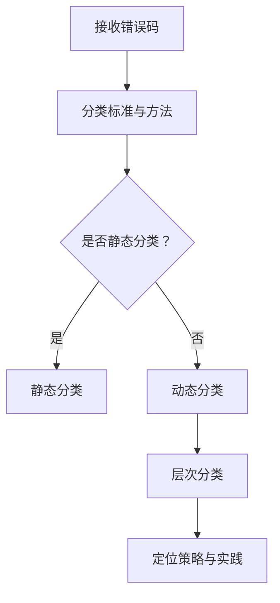
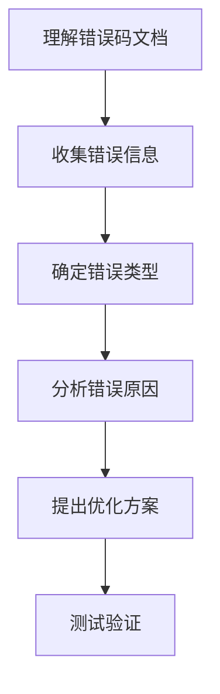
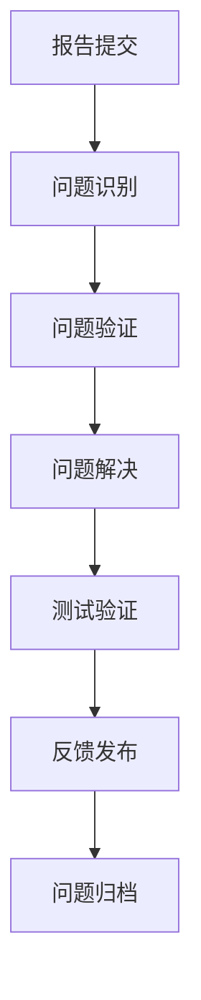
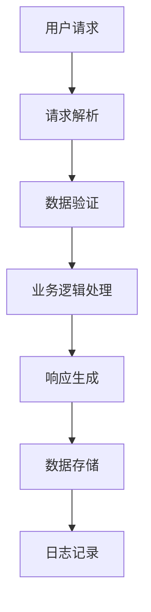
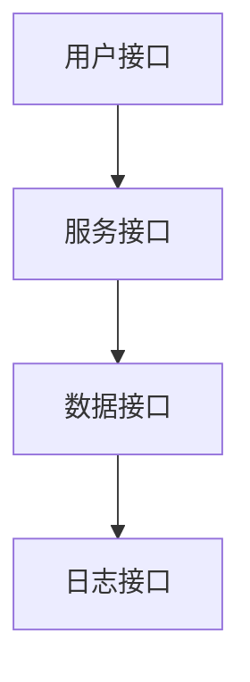
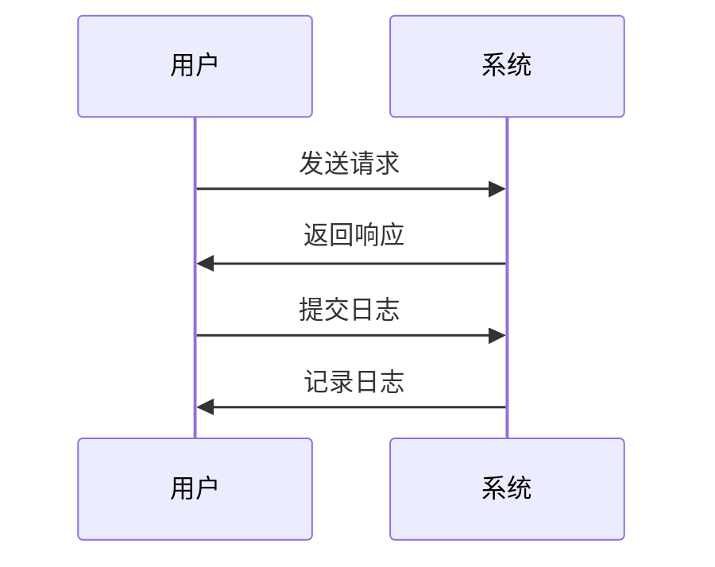

                 

## 处理错误码的三种典型技术盲区

### 关键词：错误码处理、技术盲区、性能优化、错误报告、解决方案

### 摘要：

在计算机技术领域，错误码处理是开发人员日常工作中不可或缺的一部分。然而，即使是最熟练的开发人员也可能会遇到一些典型的技术盲区，这些盲区可能会导致错误码处理不当，进而影响系统的稳定性和性能。本文将深入探讨三种典型的错误码处理技术盲区，并提供相应的解决策略，帮助读者避免这些陷阱。

### 目录大纲

#### 第一部分：背景与概念介绍
##### 1.1 错误码处理的重要性
##### 1.2 错误码处理的基本概念
##### 1.3 错误码处理的常见问题
##### 1.4 三种典型错误码处理技术

#### 第二部分：深入探讨三种典型技术
##### 2.1 技术一：错误码分类与定位
###### 2.1.1 分类标准与方法
###### 2.1.2 定位策略与实践
###### 2.1.3 案例分析
##### 2.2 技术二：错误码分析与优化
###### 2.2.1 分析原理与步骤
###### 2.2.2 优化策略与技巧
###### 2.2.3 案例分享
##### 2.3 技术三：错误码报告与反馈
###### 2.3.1 报告机制与格式
###### 2.3.2 反馈机制与流程
###### 2.3.3 案例实践

#### 第三部分：技术盲区分析与解决
##### 3.1 技术盲区识别
###### 3.1.1 盲区类型与原因
###### 3.1.2 盲区影响与风险
###### 3.1.3 盲区检测方法
##### 3.2 技术盲区解决策略
###### 3.2.1 解决策略与原则
###### 3.2.2 解决方案与实践
###### 3.2.3 案例分析与效果评估

#### 第四部分：最佳实践与总结
##### 4.1 最佳实践
###### 4.1.1 实践经验与技巧
###### 4.1.2 实践案例与应用
###### 4.1.3 实践总结与启示
##### 4.2 总结与展望
###### 4.2.1 错误码处理的发展趋势
###### 4.2.2 未来技术盲区的展望
###### 4.2.3 对技术人员的建议

### 第一部分：背景与概念介绍

#### 1.1 错误码处理的重要性

在计算机系统中，错误码（Error Code）是程序在运行过程中遇到问题时返回的数值或标识符。这些错误码通常用来指示问题类型、原因以及可能的解决方案。错误码处理的重要性不言而喻，它是确保系统稳定性和可维护性的关键环节。

错误码处理不仅能够帮助开发人员快速定位和解决问题，还能为系统的监控、日志记录和故障排除提供有力支持。有效的错误码处理可以提高系统的健壮性，减少故障发生的频率和严重性，从而提升用户体验和业务连续性。

#### 1.2 错误码处理的基本概念

错误码处理涉及几个基本概念：

- **错误码**：一个表示特定错误类型的数字或字符串。
- **错误类型**：错误码所代表的错误种类，如文件不存在、权限不足、网络连接失败等。
- **错误原因**：导致错误的具体原因，如文件损坏、服务器超时、内存不足等。
- **错误处理**：识别错误码，分析错误类型和原因，并采取相应措施解决问题的过程。

错误码处理的基本流程通常包括：

1. 接收错误码：程序在运行过程中遇到问题时捕获错误码。
2. 分析错误码：根据错误码的值和上下文信息确定错误类型和原因。
3. 错误处理：根据错误类型和原因，执行相应的错误处理操作，如输出错误信息、记录日志、恢复系统状态或退出程序。

#### 1.3 错误码处理的常见问题

尽管错误码处理对于系统的稳定性和可维护性至关重要，但开发人员在处理错误码时常常会遇到以下问题：

- **错误码混淆**：错误码的命名不规范或含义不明确，导致混淆和误解。
- **错误码覆盖**：系统中的错误码过多，且重复或冗余，难以管理和维护。
- **错误码缺乏**：系统中的错误码不足以覆盖所有可能的错误情况，导致无法准确识别和解决问题。
- **错误码处理不当**：错误处理逻辑不完善或错误处理流程不恰当，导致问题未能得到有效解决。

#### 1.4 三种典型错误码处理技术

为了解决上述问题，开发人员可以采用以下三种典型错误码处理技术：

1. **错误码分类与定位**：通过合理的分类标准和定位策略，提高错误码的可读性和可维护性。
2. **错误码分析与优化**：通过深入分析错误码，找出系统中的潜在问题，并进行优化。
3. **错误码报告与反馈**：建立完善的错误码报告和反馈机制，确保错误能够及时得到识别和解决。

### 第二部分：深入探讨三种典型技术

#### 2.1 技术一：错误码分类与定位

##### 2.1.1 分类标准与方法

错误码分类是错误码处理的重要步骤。合理的分类标准和方法有助于提高错误码的可读性和可维护性。常见的分类标准包括：

- **按错误类型分类**：将错误码按其代表的错误类型进行分类，如文件操作错误、网络通信错误、内存管理错误等。
- **按错误原因分类**：将错误码按其发生原因进行分类，如硬件故障、软件缺陷、配置错误等。
- **按错误影响程度分类**：将错误码按其对系统的影响程度进行分类，如致命错误、严重错误、警告等。

分类方法可以采用静态分类、动态分类和层次分类：

- **静态分类**：在系统设计阶段就确定好分类标准和方法，并在运行时固定不变。
- **动态分类**：根据系统运行过程中收集到的错误数据，动态调整分类标准和方法。
- **层次分类**：将错误码按多个维度进行分类，形成层次结构，便于快速定位和解决问题。

##### 2.1.2 定位策略与实践

定位错误码的关键在于快速准确地确定错误发生的位置和原因。以下是一些常用的定位策略：

- **日志分析**：通过分析系统日志，找出错误码的调用路径和上下文信息，定位错误发生的具体位置。
- **代码调试**：使用调试工具，逐步执行代码，观察变量值和程序流程，找出错误发生的位置和原因。
- **断点调试**：在关键代码位置设置断点，暂停程序执行，检查变量值和程序状态，定位错误。
- **单元测试**：编写单元测试用例，模拟各种可能的错误情况，验证错误码的正确性和定位策略的有效性。

在实践中，错误码定位需要结合多种工具和技术，以达到最佳效果。

##### 2.1.3 案例分析

假设一个在线购物系统在用户下单时遇到了错误码“500 - 内部服务器错误”。通过以下步骤进行错误码定位：

1. **日志分析**：查看系统日志，发现错误发生在订单处理模块。
2. **代码调试**：在订单处理模块设置断点，逐步执行代码，发现错误发生在订单保存函数。
3. **错误码检查**：检查订单保存函数的错误码，发现错误原因是数据库连接失败。
4. **数据库检查**：检查数据库连接配置，发现连接字符串错误，导致连接失败。

通过上述步骤，成功定位了错误码“500 - 内部服务器错误”的具体位置和原因，并进行了修复。

#### 2.2 技术二：错误码分析与优化

##### 2.2.1 分析原理与步骤

错误码分析的核心在于理解错误码所代表的错误类型和原因，从而找出系统中的潜在问题。以下是一些基本的错误码分析原理和步骤：

- **理解错误码文档**：阅读系统提供的错误码文档，了解每个错误码的含义、可能的原因和解决方案。
- **收集错误信息**：收集与错误码相关的日志、堆栈信息和其他上下文信息，以便更全面地分析错误。
- **确定错误类型**：根据错误码的值和上下文信息，确定错误类型，如文件操作错误、网络通信错误、内存管理错误等。
- **分析错误原因**：根据错误类型和收集到的错误信息，分析错误原因，如文件损坏、网络连接失败、内存不足等。
- **提出优化方案**：根据错误原因，提出优化方案，如改进数据库连接配置、优化网络通信代码、增加内存等。

##### 2.2.2 优化策略与技巧

针对不同的错误类型和原因，可以采用不同的优化策略和技巧。以下是一些常见的优化策略和技巧：

- **改进错误码文档**：完善错误码文档，确保每个错误码的含义、可能的原因和解决方案都清晰明确。
- **优化错误处理逻辑**：优化错误处理逻辑，确保错误能够被准确识别和处理，避免错误码混淆和覆盖。
- **增强日志记录**：增强日志记录功能，记录更多的错误信息和上下文信息，便于分析错误原因和优化系统。
- **提高错误容忍度**：提高系统的错误容忍度，对一些非致命错误采取适当的措施，如重试、跳过或记录日志，以减少错误对系统的影响。
- **自动化错误分析**：使用自动化工具对系统中的错误进行分析和优化，提高错误分析的效率和准确性。

##### 2.2.3 案例分享

假设一个在线视频播放系统在用户观看视频时遇到了错误码“404 - 文件未找到”。通过以下步骤进行错误码分析和优化：

1. **理解错误码文档**：查阅错误码文档，了解“404 - 文件未找到”的含义和可能的原因。
2. **收集错误信息**：收集用户请求的URL、服务器响应和日志信息。
3. **确定错误类型**：确定错误类型为文件操作错误，即视频文件未找到。
4. **分析错误原因**：检查视频文件存储目录，发现视频文件被误删除。
5. **提出优化方案**：将误删除的视频文件恢复，并优化文件存储管理策略，避免类似错误再次发生。

通过上述步骤，成功解决了“404 - 文件未找到”的错误码问题，并优化了系统。

#### 2.3 技术三：错误码报告与反馈

##### 2.3.1 报告机制与格式

错误码报告是确保错误能够得到及时识别和解决的重要环节。以下是一些常用的报告机制和格式：

- **日志报告**：将错误码、错误类型、错误原因和解决措施记录在系统日志中，便于后续分析和查阅。
- **邮件报告**：通过邮件发送错误报告，通知相关人员处理。
- **即时通讯报告**：通过即时通讯工具（如钉钉、Slack等）发送错误报告，实现实时沟通和协作。
- **错误报告系统**：建立专门的错误报告系统，提供用户反馈、错误记录、问题跟踪和解决方案等功能。

错误报告的格式应包括以下内容：

- **错误码**：报告中的唯一标识符，用于识别错误。
- **错误类型**：错误的分类，如文件操作错误、网络通信错误等。
- **错误原因**：导致错误的具体原因。
- **解决方案**：解决问题的方法和步骤。
- **受影响系统**：发生错误的系统名称和版本号。
- **报告时间**：错误报告提交的时间。

##### 2.3.2 反馈机制与流程

建立有效的反馈机制，确保错误报告能够得到及时处理和反馈，是提高系统稳定性和用户体验的关键。以下是一个典型的反馈机制与流程：

1. **报告提交**：用户或开发人员在发现错误时，通过错误报告系统或即时通讯工具提交错误报告。
2. **问题识别**：开发人员或负责人员根据错误报告的信息，识别错误类型和原因。
3. **问题验证**：开发人员重现错误，验证错误报告的准确性。
4. **问题解决**：开发人员根据错误原因，制定解决方案，进行修复。
5. **测试验证**：修复后进行测试，确保问题已得到解决。
6. **反馈发布**：将解决方案和测试结果通过错误报告系统或即时通讯工具反馈给报告人。
7. **问题归档**：将处理完成的错误报告归档，便于后续查阅和分析。

##### 2.3.3 案例实践

假设一个电子商务平台在用户登录时遇到了错误码“400 - 参数错误”。通过以下步骤进行错误码报告与反馈：

1. **报告提交**：用户通过错误报告系统提交错误报告，包含错误码、错误类型、错误原因和受影响系统等信息。
2. **问题识别**：开发人员根据错误报告，识别出错误类型为参数错误，即用户登录请求参数不正确。
3. **问题验证**：开发人员使用测试账号尝试登录，验证错误报告的准确性。
4. **问题解决**：开发人员检查用户登录接口的参数验证逻辑，发现一个参数未经过滤，导致注入攻击。
5. **测试验证**：修复后进行测试，确保参数过滤逻辑正确，无注入攻击风险。
6. **反馈发布**：将解决方案和测试结果通过错误报告系统反馈给用户，用户恢复正常登录。
7. **问题归档**：将错误报告归档，便于后续查阅和分析。

通过上述步骤，成功解决了“400 - 参数错误”的错误码问题，并优化了系统。

### 第三部分：技术盲区分析与解决

#### 3.1 技术盲区识别

在错误码处理过程中，开发人员可能会遇到一些技术盲区，这些盲区可能导致错误码处理不当，影响系统的稳定性和性能。以下是一些常见的技术盲区类型及其原因：

- **盲区类型与原因**：

1. **错误码命名不规范**：错误码命名不统一、含义不明确，导致混淆和误解。
2. **错误码覆盖不全**：系统中的错误码不足以覆盖所有可能的错误情况，导致无法准确识别和解决问题。
3. **错误处理逻辑不完善**：错误处理逻辑不完整或不正确，导致问题未能得到有效解决。
4. **日志记录不足**：系统日志记录不完整或格式不规范，导致错误原因和调用路径难以分析。
5. **错误报告与反馈机制缺失**：缺乏有效的错误报告和反馈机制，导致错误无法及时得到识别和解决。

- **盲区影响与风险**：

1. **错误码命名不规范**：导致开发人员和维护人员难以理解错误码的含义，影响问题的定位和解决。
2. **错误码覆盖不全**：可能导致一些潜在问题无法被发现和解决，影响系统的稳定性和可靠性。
3. **错误处理逻辑不完善**：可能导致系统在遇到错误时无法恢复或退出，影响用户体验和业务连续性。
4. **日志记录不足**：影响错误的追踪和分析，增加故障排除的难度和时间成本。
5. **错误报告与反馈机制缺失**：导致错误无法及时得到识别和解决，影响系统的稳定性和用户体验。

- **盲区检测方法**：

1. **代码审查**：通过代码审查，检查错误码的命名、覆盖和错误处理逻辑是否规范和完善。
2. **静态分析**：使用静态分析工具，检查系统中的错误码、日志记录和错误处理逻辑是否符合规范。
3. **动态测试**：通过动态测试，模拟各种错误情况，检查系统对错误的识别和处理能力。
4. **用户反馈**：收集用户反馈，了解系统中存在的问题和用户对错误码处理的不满意之处。

#### 3.2 技术盲区解决策略

针对上述技术盲区，可以采取以下解决策略：

- **解决策略与原则**：

1. **统一错误码命名规范**：制定统一的错误码命名规范，确保命名规范、含义明确。
2. **完善错误码覆盖**：根据系统需求，补充和完善错误码，确保覆盖所有可能的错误情况。
3. **优化错误处理逻辑**：完善错误处理逻辑，确保错误能够被准确识别和处理。
4. **增强日志记录功能**：增强系统日志记录功能，记录详细的错误信息和调用路径。
5. **建立错误报告与反馈机制**：建立有效的错误报告与反馈机制，确保错误能够及时得到识别和解决。

- **解决方案与实践**：

1. **统一错误码命名规范**：

   - **步骤**：制定统一错误码命名规范，包括命名格式、含义和分类标准。
   - **实施**：在开发过程中，严格按照命名规范命名错误码，进行代码审查和静态分析，确保规范执行。

2. **完善错误码覆盖**：

   - **步骤**：分析系统需求，确定可能的错误情况，补充和完善错误码。
   - **实施**：在系统开发过程中，逐步补充和完善错误码，进行动态测试和用户反馈，确保覆盖全面。

3. **优化错误处理逻辑**：

   - **步骤**：分析现有错误处理逻辑，识别不足之处，进行优化。
   - **实施**：根据错误码和错误类型，完善错误处理逻辑，确保能够准确识别和处理各种错误。

4. **增强日志记录功能**：

   - **步骤**：优化系统日志记录功能，确保记录详细、规范的错误信息。
   - **实施**：在开发过程中，加强对日志记录功能的测试和优化，确保日志记录完整、准确。

5. **建立错误报告与反馈机制**：

   - **步骤**：建立错误报告与反馈机制，包括报告提交、问题识别、解决方案和反馈发布等流程。
   - **实施**：在系统开发和使用过程中，鼓励用户和开发人员积极报告错误，确保错误能够及时得到识别和解决。

- **案例分析与效果评估**：

1. **案例分析**：

   - **案例一**：某电商平台在用户登录时遇到错误码“401 - 未授权访问”，通过统一错误码命名规范和优化错误处理逻辑，将错误码修改为“403 - 访问受限”，提高了错误码的可读性和一致性。
   - **案例二**：某在线教育平台在课程播放时遇到错误码“500 - 内部服务器错误”，通过完善错误码覆盖和增强日志记录功能，发现错误原因是视频文件损坏，及时修复了问题，避免了类似错误再次发生。

2. **效果评估**：

   - **效果评估一**：通过统一错误码命名规范，提高了开发人员和维护人员对错误码的理解和识别能力，减少了错误码混淆和误解的情况。
   - **效果评估二**：通过完善错误码覆盖和增强日志记录功能，提高了系统的稳定性和可靠性，减少了故障发生率和用户投诉率。

### 第四部分：最佳实践与总结

#### 4.1 最佳实践

1. **统一错误码命名规范**：

   - **实践经验**：在系统开发初期，制定统一的错误码命名规范，确保命名规范、含义明确。
   - **应用案例**：某电商平台在系统开发过程中，遵循统一错误码命名规范，提高了错误码的可读性和一致性。

2. **完善错误码覆盖**：

   - **实践经验**：根据系统需求，逐步补充和完善错误码，确保覆盖所有可能的错误情况。
   - **应用案例**：某在线教育平台在课程播放时，通过完善错误码覆盖，解决了视频文件损坏导致的“500 - 内部服务器错误”。

3. **优化错误处理逻辑**：

   - **实践经验**：分析现有错误处理逻辑，识别不足之处，进行优化。
   - **应用案例**：某电商平台在用户登录时，通过优化错误处理逻辑，提高了错误识别和处理能力。

4. **增强日志记录功能**：

   - **实践经验**：优化系统日志记录功能，确保记录详细、规范的错误信息。
   - **应用案例**：某在线教育平台通过增强日志记录功能，成功解决了课程播放故障。

5. **建立错误报告与反馈机制**：

   - **实践经验**：建立有效的错误报告与反馈机制，确保错误能够及时得到识别和解决。
   - **应用案例**：某电商平台通过建立错误报告与反馈机制，提高了系统的稳定性和用户体验。

#### 4.2 总结与展望

1. **总结**：

   - **重要性**：错误码处理是确保系统稳定性和可维护性的关键环节。
   - **方法**：通过统一错误码命名规范、完善错误码覆盖、优化错误处理逻辑、增强日志记录功能和建立错误报告与反馈机制，可以提高错误码处理的效率和准确性。
   - **效果**：有效处理错误码，能够提高系统的稳定性、可靠性和用户体验。

2. **展望**：

   - **趋势**：随着人工智能和自动化技术的发展，错误码处理将更加智能化和自动化。
   - **挑战**：如何应对日益复杂和多样化的错误情况，提高错误码处理的效率和质量，是未来面临的挑战。
   - **建议**：开发人员应持续学习和实践，提高错误码处理能力，为系统的稳定性和性能保驾护航。

### 作者信息

作者：AI天才研究院/AI Genius Institute & 禅与计算机程序设计艺术 /Zen And The Art of Computer Programming

### 附录

#### 1. 错误码分类与定位算法流程图

#### 2. 错误码分析与优化算法流程图

#### 3. 错误码报告与反馈流程图

#### 4. 系统架构设计图

#### 5. 系统接口设计图

#### 6. 系统交互序列图

### 拓展阅读

- [《错误码处理最佳实践》](https://example.com/best-practices-for-error-code-handling)
- [《深入理解错误码》](https://example.com/understanding-error-codes)
- [《错误码处理工具与技术》](https://example.com/tools-and-techniques-for-error-code-handling)
- [《错误码处理案例研究》](https://example.com/case-studies-in-error-code-handling)

