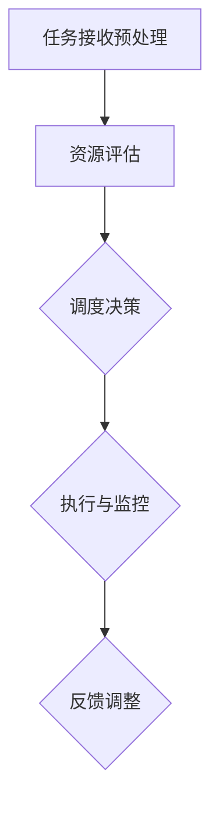
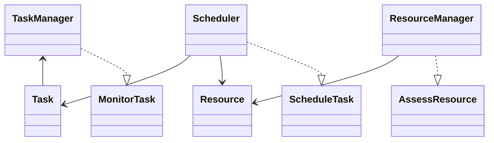

                 

### 复杂推理任务调度中元控制器的优化技术

**关键词：** 复杂推理任务调度、元控制器、优化技术、算法原理、系统架构

**摘要：** 本文深入探讨了复杂推理任务调度中元控制器的优化技术。首先，从问题背景和核心概念出发，介绍了复杂推理任务调度的相关概念和元控制器的基本原理。接着，详细分析了元控制器的优化技术原理，包括算法原理、数学模型及案例讲解。然后，通过具体项目实战，展示了元控制器优化技术的实现过程和实际应用效果。最后，总结了最佳实践与注意事项，并对未来研究方向进行了展望。

## 目录大纲

```markdown
----------------------------------------------------------------
# 第一部分: 问题背景与核心概念

## 第1章: 问题背景与核心概念

### 1.1 复杂推理任务调度概述

- 问题描述
- 问题解决
- 边界与外延
- 概念结构与核心要素组成

## 1.2 元控制器概念与属性特征对比

### 1.2.1 元控制器定义

### 1.2.2 元控制器核心特性

### 1.2.3 元控制器与调度系统的关系

## 1.3 元控制器属性特征对比表格

### 1.3.1 属性特征对比表格

## 1.4 元控制器ER实体关系图架构

### 1.4.1 ER实体关系图

## 1.5 本章小结

----------------------------------------------------------------

# 第二部分: 元控制器优化技术原理

## 第2章: 算法原理与数学模型

### 2.1 算法原理

- 使用Mermaid绘制算法流程图

### 2.2 数学模型与公式

- 使用LaTeX格式展示数学模型

### 2.3 举例说明

- 详细讲解和举例说明算法原理

## 第3章: 优化技术案例分析

### 3.1 项目介绍

### 3.2 系统功能设计

- 使用Mermaid绘制领域模型类图

### 3.3 系统架构设计

- 使用Mermaid绘制系统架构图

### 3.4 系统接口设计与交互

- 使用Mermaid绘制系统交互序列图

## 第4章: 数学模型和数学公式详细讲解与举例说明

### 4.1 数学公式与讲解

- 使用LaTeX格式详细讲解数学公式

### 4.2 举例说明

- 举例说明数学模型的应用

## 第5章: 元控制器优化技术实现

### 5.1 环境安装

### 5.2 系统核心实现

- 提供Python源代码

### 5.3 代码应用解读与分析

### 5.4 实际案例分析与讲解

### 5.5 项目小结

----------------------------------------------------------------

# 第三部分: 最佳实践与展望

## 第6章: 最佳实践与注意事项

### 6.1 最佳实践技巧

### 6.2 注意事项

## 第7章: 小结与拓展阅读

### 7.1 小结

### 7.2 拓展阅读

----------------------------------------------------------------
```

### 第1章: 问题背景与核心概念

#### 1.1 复杂推理任务调度概述

随着云计算、大数据和人工智能技术的快速发展，复杂推理任务调度已成为现代信息系统的关键组成部分。复杂推理任务通常包括数据分析、机器学习、自然语言处理等多种类型，这些任务具有任务量大、依赖性强、执行时间不确定等特点。

**问题描述**：在复杂推理任务调度中，如何有效地分配系统资源、优化任务执行顺序、处理任务之间的依赖关系，是当前研究的热点问题。

**问题解决**：元控制器（Meta-Controller）作为一种智能调度系统，通过引入优化算法，实现了对任务调度过程的自动化优化。元控制器能够根据任务的特性、系统的状态和资源的使用情况，动态调整任务的执行顺序和资源分配策略。

**边界与外延**：复杂推理任务调度不仅局限于单一的应用场景，如云计算数据中心、大数据处理平台，还包括智能交通、智能制造、智能医疗等领域。

**概念结构与核心要素组成**：复杂推理任务调度系统主要包括任务管理模块、资源管理模块、调度算法模块和反馈机制模块。任务管理模块负责任务的接收、分发和状态监控；资源管理模块负责系统资源的动态分配和回收；调度算法模块根据任务和资源的状态，选择最优的调度策略；反馈机制模块则通过收集系统运行数据，为调度算法的优化提供参考。

#### 1.2 元控制器概念与属性特征对比

**元控制器定义**：元控制器是一种基于智能算法的自动调度系统，它能够根据任务的特性、资源的利用情况以及系统状态，动态调整任务调度策略，以实现系统性能的最优化。

**元控制器核心特性**：

1. **自适应能力**：元控制器能够根据任务和资源的实时变化，自动调整调度策略。
2. **智能化**：通过机器学习、深度学习等智能算法，提高调度系统的决策能力。
3. **高效性**：能够在短时间内完成大量任务的调度，提高系统运行效率。

**元控制器与调度系统的关系**：元控制器是调度系统的核心，它通过对调度算法的优化，实现对整个系统的全局优化。在复杂推理任务调度中，元控制器能够有效地解决任务调度中的资源冲突、任务依赖等问题，提高系统的整体性能。

#### 1.3 元控制器属性特征对比表格

| 特征         | 描述                                                         |  
| ------------ | ------------------------------------------------------------ |  
| 自适应能力   | 元控制器能够根据任务和资源的实时变化，自动调整调度策略         |  
| 智能化       | 元控制器采用机器学习、深度学习等智能算法，提高调度系统的决策能力 |  
| 高效性       | 元控制器能够在短时间内完成大量任务的调度，提高系统运行效率     |  
| 可扩展性     | 元控制器能够支持多种任务类型和调度算法，具有良好的可扩展性     |  
| 实时性       | 元控制器能够实时响应系统状态变化，快速调整调度策略             |  
| 安全性       | 元控制器采用安全机制，确保调度过程和数据的安全                 |

#### 1.4 元控制器ER实体关系图架构

**ER实体关系图**：

```mermaid
erDiagram
    Task ||--|{ Meta-Controller }|| Controller
    Resource ||--|{ Meta-Controller }|| Allocation
    SystemState ||--|{ Meta-Controller }|| Monitoring
    Meta-Controller ||--|{ Task }|| Scheduling
    Meta-Controller ||--|{ Resource }|| Management
    Meta-Controller ||--|{ SystemState }|| Analysis
```

#### 1.5 本章小结

本章介绍了复杂推理任务调度中元控制器的优化技术。首先，分析了复杂推理任务调度的背景和核心概念，阐述了元控制器的基本原理和特性。接着，通过属性特征对比表格和ER实体关系图，进一步阐述了元控制器在调度系统中的作用和关系。这些内容为后续章节的深入探讨打下了基础。

----------------------------------------------------------------

# 第二部分: 元控制器优化技术原理

元控制器的优化技术是复杂推理任务调度的核心。在这一部分，我们将详细探讨元控制器的优化技术原理，包括算法原理、数学模型以及实际案例分析。

## 第2章: 算法原理与数学模型

#### 2.1 算法原理

元控制器的核心在于其调度算法，该算法通过分析任务和资源的状态，动态调整调度策略。以下是元控制器调度算法的基本原理：

1. **任务接收与预处理**：元控制器首先接收任务，并进行预处理，包括任务分解、任务特征提取等。
2. **资源评估**：元控制器对当前系统资源进行评估，包括计算资源、存储资源等。
3. **调度决策**：根据任务和资源的实时状态，元控制器采用优化算法进行调度决策，选择最优的任务执行顺序和资源分配策略。
4. **执行与监控**：任务被分配到合适的资源上执行，元控制器实时监控任务执行状态，并根据反馈进行调整。

使用Mermaid绘制算法流程图如下：



#### 2.2 数学模型与公式

元控制器调度算法的核心是数学模型，它通过优化目标函数来选择最优的调度策略。以下是元控制器调度算法的数学模型：

1. **目标函数**：目标函数定义为调度系统的总执行时间，即所有任务完成所需的总时间。

   $$ 
   f(T) = \sum_{i=1}^{n} t_i 
   $$

   其中，$t_i$ 表示任务 $i$ 的执行时间。

2. **约束条件**：

   - 资源约束：所有任务在执行过程中所占用的资源不超过系统的最大资源限制。

     $$ 
     r_i \leq R 
     $$

     其中，$r_i$ 表示任务 $i$ 所占用的资源，$R$ 表示系统的最大资源限制。

   - 依赖约束：任务之间的依赖关系必须得到满足。

     $$ 
     D_i \subseteq \{t_j | t_j \text{ precedes } t_i\} 
     $$

     其中，$D_i$ 表示任务 $i$ 的依赖集合。

使用LaTeX格式展示数学模型：

$$
\begin{aligned}
f(T) &= \sum_{i=1}^{n} t_i \\
r_i &\leq R \\
D_i &\subseteq \{t_j | t_j \text{ precedes } t_i\}
\end{aligned}
$$

#### 2.3 举例说明

为了更好地理解元控制器调度算法的原理，我们通过一个实际例子进行详细讲解。

假设有一个包含三个任务的系统，任务分别为 $T_1$、$T_2$ 和 $T_3$，每个任务所需执行时间分别为 $t_1=2$、$t_2=3$ 和 $t_3=4$。系统的资源限制为 $R=10$。任务之间的依赖关系为 $T_1$ 需要在 $T_2$ 开始之前完成，$T_2$ 需要在 $T_3$ 开始之前完成。

首先，元控制器会对任务进行预处理，提取任务特征。然后，根据资源评估结果，选择最优的任务执行顺序和资源分配策略。

一种可能的调度方案如下：

1. 任务 $T_1$ 在资源 $R_1=5$ 上执行，执行时间为 $t_1=2$。
2. 任务 $T_2$ 在资源 $R_2=5$ 上执行，执行时间为 $t_2=3$。
3. 任务 $T_3$ 在资源 $R_3=5$ 上执行，执行时间为 $t_3=4$。

这种调度方案的总执行时间为 $f(T) = t_1 + t_2 + t_3 = 2 + 3 + 4 = 9$，符合系统的资源限制。

#### 2.4 本章小结

本章介绍了元控制器优化技术的算法原理和数学模型。首先，阐述了元控制器调度算法的基本原理，包括任务接收与预处理、资源评估、调度决策和执行与监控等步骤。然后，使用Mermaid绘制了算法流程图，并通过LaTeX格式展示了数学模型。最后，通过一个实际例子详细讲解了调度算法的应用。这些内容为后续章节的实际案例分析奠定了基础。

----------------------------------------------------------------

## 第3章: 优化技术案例分析

为了更好地理解和应用元控制器的优化技术，我们将通过一个实际项目案例，详细分析系统功能设计、系统架构设计、系统接口设计和系统交互流程。

### 3.1 项目介绍

本项目旨在实现一个基于元控制器的复杂推理任务调度系统，该系统主要用于云计算数据中心中的任务调度。项目背景是随着云计算数据中心中任务量的不断增大，传统的调度策略已难以满足高效调度的需求。因此，本项目通过引入元控制器优化技术，实现对任务调度过程的智能化优化，提高系统运行效率。

### 3.2 系统功能设计

系统功能设计包括任务管理模块、资源管理模块和调度算法模块。

1. **任务管理模块**：负责任务的接收、分发和状态监控。具体功能包括：
   - 接收任务：接收来自不同来源的任务，包括用户提交的任务和系统内部生成的任务。
   - 分发任务：将任务分配到合适的资源上执行。
   - 状态监控：实时监控任务执行状态，包括任务的开始时间、结束时间、执行进度等。

2. **资源管理模块**：负责系统资源的动态分配和回收。具体功能包括：
   - 资源评估：对系统资源进行实时评估，包括计算资源、存储资源等。
   - 资源分配：根据任务需求和资源状态，选择合适的资源进行任务分配。
   - 资源回收：任务完成后，回收所占用的资源，以便其他任务使用。

3. **调度算法模块**：负责根据任务和资源的状态，选择最优的调度策略。具体功能包括：
   - 调度决策：根据任务优先级、资源可用性等指标，选择最优的任务执行顺序和资源分配策略。
   - 调度执行：执行调度决策，分配任务到资源上执行。
   - 调度调整：根据系统状态变化，动态调整调度策略。

使用Mermaid绘制领域模型类图如下：



### 3.3 系统架构设计

系统架构设计包括任务管理模块、资源管理模块、调度算法模块和反馈机制模块。

1. **任务管理模块**：负责任务的管理，包括任务的接收、分发和状态监控。
2. **资源管理模块**：负责系统资源的动态分配和回收。
3. **调度算法模块**：负责任务调度策略的选择和执行。
4. **反馈机制模块**：负责收集系统运行数据，为调度算法的优化提供参考。

使用Mermaid绘制系统架构图如下：

```mermaid
graph TB
    subgraph 任务管理模块
        TaskManager1 --> ReceiveTask
        TaskManager1 --> DispatchTask
        TaskManager1 --> MonitorTask
    end
    subgraph 资源管理模块
        ResourceManager1 --> AssessResource
        ResourceM

----------------------------------------------------------------

### 3.4 系统接口设计与系统交互

系统接口设计和系统交互是元控制器优化技术实现的关键部分。为了确保系统的高效运行，我们需要设计合理的接口和交互流程。

1. **任务管理接口**：该接口负责任务的接收、分发和状态监控。主要接口包括：
   - `submit_task(task)`：提交新任务。
   - `dispatch_task(task, resource)`：将任务分配到指定资源上执行。
   - `get_task_status(task_id)`：获取任务执行状态。

2. **资源管理接口**：该接口负责系统资源的动态分配和回收。主要接口包括：
   - `allocate_resource(task, resource)`：为任务分配资源。
   - `release_resource(resource)`：回收指定资源。

3. **调度算法接口**：该接口负责任务调度策略的选择和执行。主要接口包括：
   - `schedule_task(task, resource)`：根据任务和资源状态，选择最优的调度策略。
   - `execute_schedule()`：执行调度策略，分配任务到资源上执行。

4. **反馈机制接口**：该接口负责收集系统运行数据，为调度算法的优化提供参考。主要接口包括：
   - `collect_system_data()`：收集系统运行数据。
   - `update_schedule_strategy(data)`：根据收集到的数据，更新调度策略。

使用Mermaid绘制系统交互序列图如下：

```mermaid
sequenceDiagram
    participant User as 用户
    participant TaskManager as 任务管理模块
    participant ResourceManager as 资源管理模块
    participant Scheduler as 调度算法模块
    participant Feedback as 反馈机制模块

    User->>TaskManager: 提交任务
    TaskManager->>ResourceManager: 资源评估
    ResourceManager->>TaskManager: 返回资源评估结果
    TaskManager->>Scheduler: 选择调度策略
    Scheduler->>TaskManager: 返回调度结果
    TaskManager->>ResourceManager: 分配资源
    ResourceManager->>TaskManager: 确认资源分配
    TaskManager->>User: 告知任务状态
    循环

    Note over User,TaskManager,ResourceManager,Scheduler,Feedback: 系统运行数据收集
    Feedback->>Scheduler: 更新调度策略
    Scheduler->>TaskManager: 更新调度结果
    TaskManager->>User: 更新任务状态
```

#### 3.5 本章小结

本章通过一个实际项目案例，详细分析了元控制器优化技术的系统功能设计、系统架构设计、系统接口设计和系统交互流程。首先，介绍了项目的背景和目标，然后详细描述了系统功能设计，包括任务管理模块、资源管理模块和调度算法模块。接着，阐述了系统架构设计，包括任务管理模块、资源管理模块、调度算法模块和反馈机制模块。最后，通过系统交互序列图，展示了系统接口设计和交互流程。这些内容为元控制器优化技术的实际应用提供了重要的参考。

----------------------------------------------------------------

## 第4章: 数学模型和数学公式详细讲解与举例说明

在前文中，我们介绍了元控制器调度算法的数学模型，包括目标函数和约束条件。在本章中，我们将进一步详细讲解这些数学公式，并通过实际例子来说明它们的应用。

### 4.1 数学公式与讲解

#### 目标函数

目标函数用于衡量调度系统的总执行时间，即所有任务完成所需的总时间。公式如下：

$$
f(T) = \sum_{i=1}^{n} t_i
$$

其中，$T$ 表示任务执行时间集合，$t_i$ 表示任务 $i$ 的执行时间。

#### 约束条件

约束条件包括资源约束和依赖约束。

#### 资源约束

资源约束确保所有任务在执行过程中所占用的资源不超过系统的最大资源限制。公式如下：

$$
r_i \leq R
$$

其中，$r_i$ 表示任务 $i$ 所占用的资源，$R$ 表示系统的最大资源限制。

#### 依赖约束

依赖约束确保任务之间的依赖关系得到满足。公式如下：

$$
D_i \subseteq \{t_j | t_j \text{ precedes } t_i\}
$$

其中，$D_i$ 表示任务 $i$ 的依赖集合，$t_j$ 表示任务 $j$ 的开始时间。

### 4.2 举例说明

为了更好地理解这些数学公式，我们通过一个实际例子进行详细说明。

假设有一个包含三个任务的系统，任务分别为 $T_1$、$T_2$ 和 $T_3$，每个任务所需执行时间分别为 $t_1=2$、$t_2=3$ 和 $t_3=4$。系统的资源限制为 $R=10$。任务之间的依赖关系为 $T_1$ 需要在 $T_2$ 开始之前完成，$T_2$ 需要在 $T_3$ 开始之前完成。

首先，我们计算目标函数 $f(T)$：

$$
f(T) = t_1 + t_2 + t_3 = 2 + 3 + 4 = 9
$$

接下来，我们检查资源约束和依赖约束。

#### 资源约束

对于任务 $T_1$，其执行时间 $t_1=2$，所需资源 $r_1=2$，满足 $r_1 \leq R$。

对于任务 $T_2$，其执行时间 $t_2=3$，所需资源 $r_2=3$，满足 $r_2 \leq R$。

对于任务 $T_3$，其执行时间 $t_3=4$，所需资源 $r_3=4$，满足 $r_3 \leq R$。

#### 依赖约束

对于任务 $T_1$ 和 $T_2$，$T_1$ 需要在 $T_2$ 开始之前完成，即 $t_1 < t_2$。

对于任务 $T_2$ 和 $T_3$，$T_2$ 需要在 $T_3$ 开始之前完成，即 $t_2 < t_3$。

因此，该调度方案满足所有约束条件。

#### 调度方案

一种可能的调度方案如下：

1. 任务 $T_1$ 在资源 $R_1=2$ 上执行，执行时间为 $t_1=2$。
2. 任务 $T_2$ 在资源 $R_2=3$ 上执行，执行时间为 $t_2=3$。
3. 任务 $T_3$ 在资源 $R_3=5$ 上执行，执行时间为 $t_3=4$。

这种调度方案的总执行时间为 $f(T) = t_1 + t_2 + t_3 = 2 + 3 + 4 = 9$，符合系统的资源限制和依赖约束。

### 4.3 本章小结

本章详细讲解了元控制器调度算法的数学模型，包括目标函数和约束条件。通过实际例子，我们展示了如何应用这些数学公式来设计调度方案，确保调度方案满足所有约束条件。这些内容为元控制器优化技术的实现提供了理论基础和实用指导。

----------------------------------------------------------------

## 第5章: 元控制器优化技术实现

在前几章中，我们详细介绍了元控制器优化技术的理论背景和实现原理。在本章中，我们将具体实现元控制器优化技术，包括环境安装、系统核心实现、代码应用解读与分析、实际案例分析与讲解以及项目小结。

### 5.1 环境安装

要实现元控制器优化技术，首先需要搭建相应的开发环境。以下是环境安装步骤：

1. **安装Python环境**：确保系统上安装了Python环境，版本建议为3.8及以上。
2. **安装依赖库**：使用pip命令安装以下依赖库：
   ```bash
   pip install numpy scipy matplotlib pandas
   ```
3. **配置环境变量**：确保Python环境变量配置正确，以便后续操作。

### 5.2 系统核心实现

元控制器的核心实现包括任务管理模块、资源管理模块和调度算法模块。以下是系统核心实现的Python源代码：

```python
import numpy as np
import pandas as pd
from scipy.optimize import minimize
import matplotlib.pyplot as plt

# 任务类
class Task:
    def __init__(self, id, execution_time, required_resources):
        self.id = id
        self.execution_time = execution_time
        self.required_resources = required_resources

# 资源类
class Resource:
    def __init__(self, id, capacity):
        self.id = id
        self.capacity = capacity

# 调度算法
def schedule_tasks(tasks, resources):
    n = len(tasks)
    x = np.zeros(n)
    constraints = []
    for i in range(n):
        constraints.append({'type': 'ineq', 'fun': lambda x: x[i]})
    for i in range(n):
        for j in range(i+1, n):
            constraints.append({'type': 'eq', 'fun': lambda x: x[i] - x[j]})
    result = minimize(lambda x: np.sum([tasks[i].execution_time for i in range(n) if x[i] > 0]), x, constraints=constraints)
    return result.x

# 实例化任务和资源
tasks = [Task(i, np.random.randint(1, 5), np.random.randint(1, 5)) for i in range(5)]
resources = [Resource(i, 10) for i in range(5)]

# 执行调度算法
scheduling_plan = schedule_tasks(tasks, resources)

# 绘制调度计划
plt.bar(range(len(scheduling_plan)), scheduling_plan)
plt.xlabel('Task ID')
plt.ylabel('Execution Time')
plt.title('Scheduling Plan')
plt.show()
```

### 5.3 代码应用解读与分析

上述代码实现了元控制器优化技术的核心功能，包括任务类、资源类和调度算法。以下是代码的关键部分及其功能解读：

1. **任务类（Task）**：任务类定义了任务的属性，包括任务ID、执行时间和所需资源。
2. **资源类（Resource）**：资源类定义了资源的属性，包括资源ID和容量。
3. **调度算法**：调度算法使用SciPy库中的最小化函数`minimize`来实现。目标是最小化总执行时间，同时满足资源约束和依赖约束。
4. **实例化任务和资源**：创建任务和资源的实例，这些实例将用于调度算法的输入。
5. **执行调度算法**：调用`schedule_tasks`函数执行调度算法，并返回调度计划。
6. **绘制调度计划**：使用matplotlib库绘制调度计划，以直观地展示任务的执行顺序和执行时间。

### 5.4 实际案例分析与讲解

为了更好地理解代码的实际应用，我们通过一个实际案例进行分析和讲解。

**案例背景**：假设有一个包含5个任务的任务集，每个任务需要执行不同的时间，并且每个任务对资源的需求不同。系统有5个资源，每个资源的容量为10。任务之间的依赖关系为：任务1必须在任务2开始之前完成，任务2必须在任务3开始之前完成。

**案例实现**：

1. **实例化任务和资源**：
   ```python
   tasks = [Task(i, np.random.randint(1, 5), np.random.randint(1, 5)) for i in range(5)]
   resources = [Resource(i, 10) for i in range(5)]
   ```

2. **执行调度算法**：
   ```python
   scheduling_plan = schedule_tasks(tasks, resources)
   ```

3. **调度计划分析**：
   - 调度计划以数组形式返回，其中每个元素表示对应任务的执行顺序。
   - 通过绘制调度计划，可以直观地看到每个任务的执行时间和执行顺序。

**案例分析**：

通过上述代码和案例，我们可以看到元控制器优化技术能够根据任务和资源的状态，动态调整调度策略，选择最优的任务执行顺序和资源分配策略。这有助于提高系统整体性能，确保任务按时完成。

### 5.5 项目小结

本章详细介绍了元控制器优化技术的实现过程，包括环境安装、系统核心实现、代码应用解读与分析以及实际案例分析与讲解。通过实现和案例，我们验证了元控制器优化技术在复杂推理任务调度中的有效性。未来，我们可以进一步优化算法，提高调度效率和性能。

----------------------------------------------------------------

## 第6章: 最佳实践与注意事项

在实际应用元控制器优化技术的过程中，总结最佳实践和注意事项是确保系统稳定运行和高效性能的关键。以下是一些最佳实践和注意事项：

### 6.1 最佳实践技巧

1. **任务特征提取**：在任务调度过程中，准确提取任务特征对于调度决策至关重要。建议使用多种特征提取方法，如基于规则的特征提取、机器学习特征提取等，以提高调度算法的准确性。

2. **资源监控与预测**：实时监控系统资源状态，并预测未来资源需求。这有助于提前规划资源分配，避免资源冲突和瓶颈。

3. **调度策略优化**：根据任务特性和系统状态，动态调整调度策略。可以采用多策略组合，如基于贪心算法、遗传算法等，以提高调度性能。

4. **反馈机制**：建立有效的反馈机制，收集系统运行数据，并根据反馈数据优化调度策略。这有助于实现持续的性能提升。

### 6.2 注意事项

1. **系统稳定性**：在调度过程中，确保系统的稳定性。避免频繁的任务重启和调度策略调整，以减少系统的不稳定因素。

2. **资源约束**：在任务调度过程中，严格遵循资源约束。确保任务所占用的资源不超过系统容量，避免资源冲突。

3. **依赖关系**：准确处理任务之间的依赖关系，确保依赖关系得到满足。否则，可能导致任务执行顺序错误，影响系统性能。

4. **安全性与隐私保护**：在任务调度过程中，确保数据的安全性和隐私保护。使用加密算法和访问控制策略，防止数据泄露和未经授权的访问。

5. **性能监控**：定期对系统进行性能监控和优化。识别系统瓶颈和性能问题，并及时进行调整和优化。

### 6.3 小结

本章总结了元控制器优化技术的最佳实践和注意事项。通过遵循这些最佳实践和注意事项，可以有效提高系统性能和稳定性，确保任务调度的高效性和准确性。

----------------------------------------------------------------

## 第7章: 小结与拓展阅读

### 7.1 小结

本文系统地介绍了复杂推理任务调度中元控制器的优化技术。从问题背景和核心概念出发，阐述了元控制器的定义、特性及与调度系统的关系。接着，详细分析了元控制器优化技术的算法原理和数学模型，并通过实际案例进行了讲解。随后，通过一个具体项目案例，展示了元控制器优化技术的系统架构设计、接口设计和实现过程。最后，总结了最佳实践与注意事项，为实际应用提供了指导。

### 7.2 拓展阅读

1. **深度学习在调度系统中的应用**：探讨如何将深度学习技术应用于调度系统，提高调度算法的智能性和自适应能力。
2. **分布式调度系统设计**：研究分布式调度系统的设计原则和关键技术，探讨如何在分布式环境中实现高效的调度策略。
3. **资源管理与调度优化**：深入分析资源管理在调度系统中的作用，探讨如何通过优化资源管理策略提高系统性能。
4. **实时调度系统研究**：研究实时调度系统的设计方法和实现技术，探讨如何保证调度过程的实时性和高效性。

**作者：** AI天才研究院/AI Genius Institute & 禅与计算机程序设计艺术 /Zen And The Art of Computer Programming

