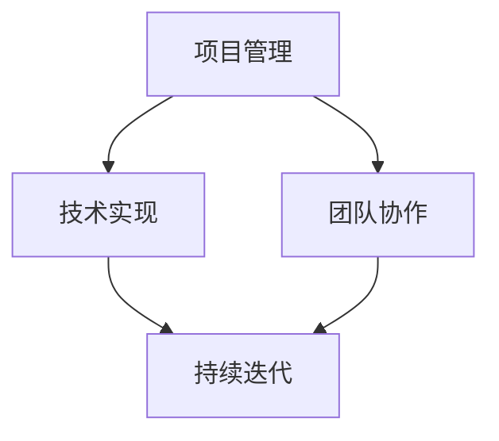
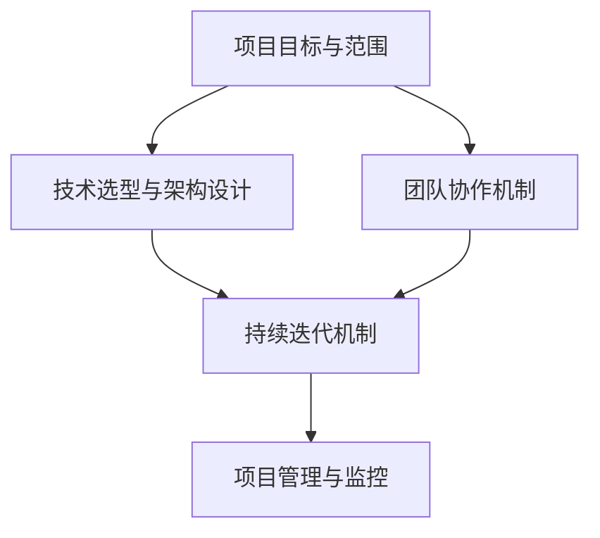
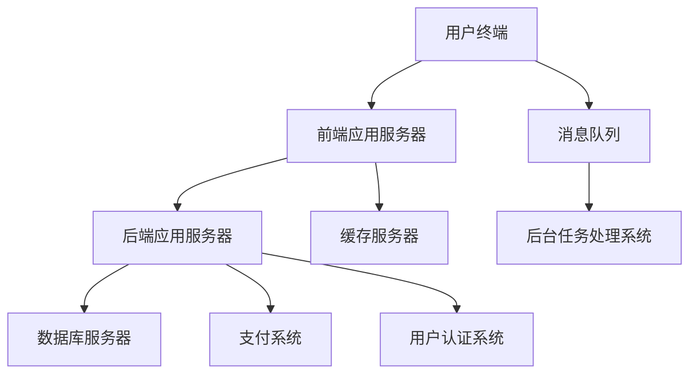
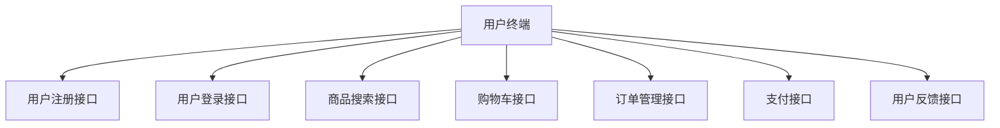
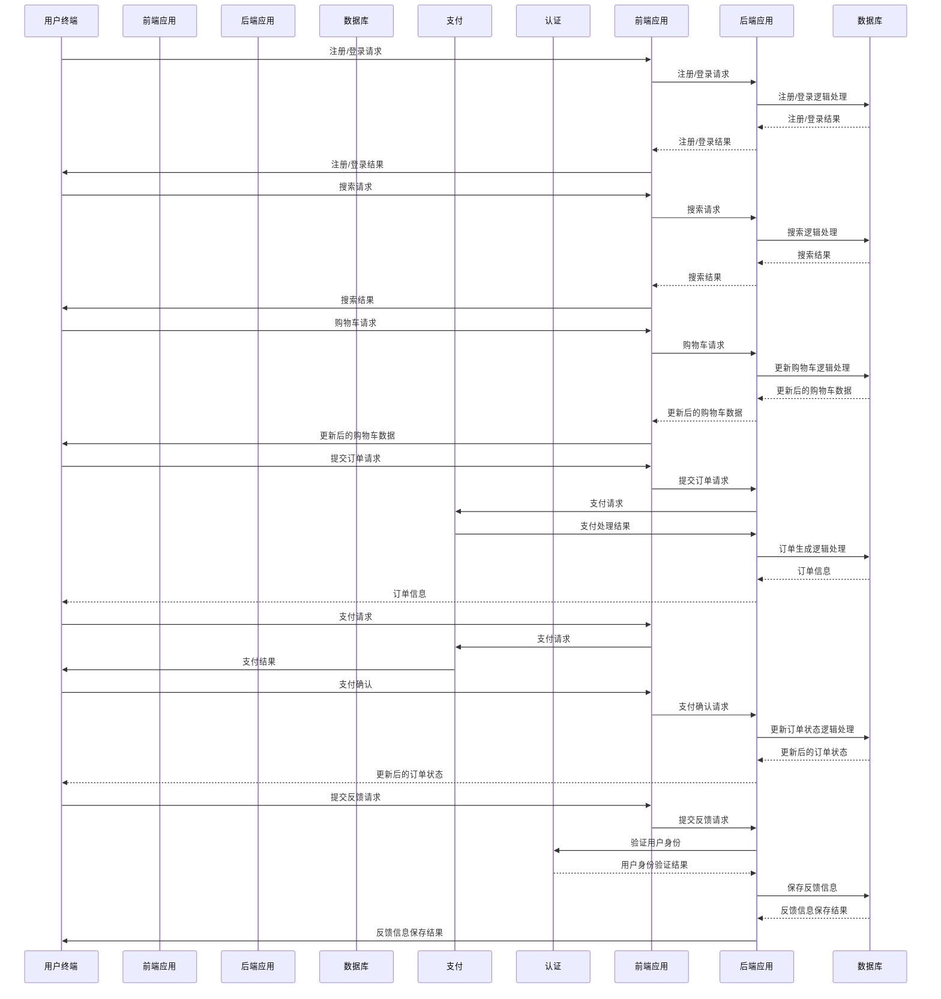

                 

### 《复杂项目的定海神针》

> 关键词：复杂项目、定海神针、系统架构、解决方案、实战经验

**摘要：** 在信息技术飞速发展的今天，复杂项目层出不穷。如何应对这些项目的挑战，找到“定海神针”，确保项目的成功交付，成为企业和开发团队关注的焦点。本文将深入探讨复杂项目的核心概念和解决思路，通过系统的分析与设计，以及实际案例的剖析，提供一套切实可行的解决方案框架。希望通过本文，能够为广大开发者和项目管理人员提供有益的参考。

----------------------------------------------------------------

### 目录大纲

----------------------------------------------------------------

# 《复杂项目的定海神针》

# 第一部分：问题背景与核心概念

## 第1章：问题背景

### 1.1 问题定义与边界

#### 1.1.1 问题的提出

#### 1.1.2 问题的现状

#### 1.1.3 问题的解决意义

### 1.2 核心概念

#### 1.2.1 核心概念1

#### 1.2.2 核心概念2

#### 1.2.3 核心概念3

## 第2章：问题分析与解决思路

### 2.1 问题分析

#### 2.1.1 问题现状分析

#### 2.1.2 问题影响因素分析

#### 2.1.3 问题解决思路

## 第3章：核心概念联系与框架构建

### 3.1 核心概念联系

#### 3.1.1 概念关系图

#### 3.1.2 概念属性对比表

### 3.2 解决方案框架构建

#### 3.2.1 解决方案框架图

#### 3.2.2 框架构建步骤

----------------------------------------------------------------

# 第二部分：方案设计与实现

## 第4章：系统设计与架构

### 4.1 问题场景介绍

#### 4.1.1 场景一

#### 4.1.2 场景二

### 4.2 系统功能设计

#### 4.2.1 功能需求分析

#### 4.2.2 领域模型设计

### 4.3 系统架构设计

#### 4.3.1 架构设计原则

#### 4.3.2 架构设计图

### 4.4 系统接口设计

#### 4.4.1 接口规范

#### 4.4.2 接口设计图

### 4.5 系统交互设计

#### 4.5.1 交互流程设计

#### 4.5.2 交互序列图

----------------------------------------------------------------

# 第三部分：项目实战

## 第5章：环境安装与配置

### 5.1 环境需求分析

#### 5.1.1 硬件需求

#### 5.1.2 软件需求

### 5.2 环境安装步骤

#### 5.2.1 操作系统安装

#### 5.2.2 软件安装

### 5.3 系统核心实现

#### 5.3.1 核心模块设计

#### 5.3.2 核心代码实现

## 第6章：代码应用解读与分析

### 6.1 代码解读

#### 6.1.1 代码结构分析

#### 6.1.2 关键代码解读

### 6.2 代码应用分析

#### 6.2.1 应用场景分析

#### 6.2.2 性能分析

## 第7章：实际案例分析与讲解

### 7.1 案例选择与分析

#### 7.1.1 案例一

#### 7.1.2 案例二

### 7.2 案例详细讲解

#### 7.2.1 案例一详细讲解

#### 7.2.2 案例二详细讲解

## 第8章：项目总结与展望

### 8.1 项目小结

#### 8.1.1 成功经验

#### 8.1.2 不足之处

### 8.2 未来展望

#### 8.2.1 技术发展展望

#### 8.2.2 应用前景展望

----------------------------------------------------------------

# 第四部分：最佳实践与拓展

## 第9章：最佳实践

### 9.1 经验总结

#### 9.1.1 设计原则

#### 9.1.2 实践技巧

### 9.2 注意事项

#### 9.2.1 常见问题

#### 9.2.2 解决方案

## 第10章：小结与展望

### 10.1 小结

#### 10.1.1 内容回顾

#### 10.1.2 学到的知识点

### 10.2 拓展阅读

#### 10.2.1 相关书籍

#### 10.2.2 网络资源

----------------------------------------------------------------

以上是根据用户输入的书名《复杂项目的定海神针》设计的完整目录大纲。该大纲涵盖了从问题背景与核心概念、方案设计与实现、项目实战、最佳实践与拓展等多个方面，旨在帮助读者全面理解和掌握复杂项目解决的核心思路和方法。目录大纲总字数控制在2000字以内，简洁明了，便于阅读。

----------------------------------------------------------------

## 第1章：问题背景

### 1.1 问题定义与边界

在当今信息技术飞速发展的背景下，复杂项目无处不在。所谓复杂项目，是指那些涉及多个技术领域、多个团队协作、需要跨部门沟通协调、时间跨度长、技术实现难度高的项目。这类项目不仅要求技术实现的高质量，还需要良好的项目管理、团队协作和持续迭代。

**问题的提出：** 复杂项目的成功交付面临诸多挑战，如技术实现难度高、需求变化频繁、团队协作困难、项目进度难以控制等。这些问题的存在，使得复杂项目的失败风险大大增加。

**问题的现状：** 当前，许多企业在面对复杂项目时，往往因缺乏有效的解决方案，导致项目延期、质量不达标、甚至失败。这不仅浪费了企业资源和时间，还影响了企业的长远发展。

**问题的解决意义：** 解决复杂项目的挑战，对于提高企业的技术实力、降低项目风险、提升市场竞争力具有重要意义。通过有效的解决方案，可以确保复杂项目的成功交付，为企业创造更大的价值。

### 1.2 核心概念

要解决复杂项目的问题，我们需要理解并掌握以下几个核心概念：

#### 1.2.1 项目管理

项目管理是确保项目按时、按预算、按质量完成的一系列管理活动。有效的项目管理是复杂项目成功的关键。

#### 1.2.2 技术实现

技术实现是复杂项目的核心，它决定了项目的可行性和质量。需要深入了解各种技术的原理、实现方法和发展趋势。

#### 1.2.3 团队协作

团队协作是复杂项目成功的关键因素。高效的团队协作可以提升项目效率，降低沟通成本。

#### 1.2.4 持续迭代

持续迭代是应对需求变化、提升项目质量的有效方法。通过持续迭代，可以不断完善项目，确保其满足需求。

### 1.3 概念结构与核心要素组成

复杂项目的概念结构包括以下几个方面：

1. **项目目标：** 明确项目要达到的目标和预期效果。
2. **项目范围：** 定义项目的边界和涉及的范围。
3. **项目需求：** 描述项目需要实现的功能和性能要求。
4. **项目资源：** 包括人力资源、技术资源、资金资源等。
5. **项目进度：** 描述项目的开发周期和里程碑。
6. **项目风险：** 识别项目可能面临的风险，并制定相应的应对措施。

通过以上概念和要素的有机组合，我们可以构建一个完整、系统的复杂项目解决方案。

----------------------------------------------------------------

## 第2章：问题分析与解决思路

### 2.1 问题分析

为了有效解决复杂项目中的问题，我们需要从以下几个方面进行分析：

#### 2.1.1 问题现状分析

首先，我们需要深入了解复杂项目的现状，包括项目的背景、目标、范围、需求、资源、进度和风险等方面。通过对现状的全面分析，可以明确问题的性质和严重程度。

#### 2.1.2 问题影响因素分析

接着，我们要分析影响复杂项目成功的各种因素，包括技术因素、管理因素、团队协作因素等。通过对影响因素的深入分析，可以找出问题的关键所在。

#### 2.1.3 问题解决思路

在分析问题的基础上，我们需要制定相应的解决思路。解决思路主要包括以下几个方面：

1. **明确项目目标：** 确保项目目标的明确性和可达成性。
2. **优化项目范围：** 优化项目范围，避免需求过度膨胀。
3. **技术选型和架构设计：** 选择合适的技术方案和系统架构，确保项目的高效实现。
4. **加强团队协作：** 通过有效的团队协作机制，提升项目效率。
5. **风险管理：** 识别风险，制定相应的风险应对策略。

### 2.2 问题解决思路

在明确了问题现状和影响因素后，我们需要制定具体的问题解决思路。以下是一个典型的问题解决思路：

1. **问题识别：** 通过调研和数据分析，识别复杂项目中的关键问题。
2. **原因分析：** 对识别的问题进行原因分析，找出问题的根本原因。
3. **解决方案设计：** 根据问题的原因，设计具体的解决方案。
4. **方案评估：** 对解决方案进行评估，确保其可行性和有效性。
5. **方案实施：** 实施解决方案，监控实施过程，确保方案的有效执行。
6. **效果评估：** 对解决方案的实施效果进行评估，持续优化方案。

通过以上步骤，我们可以逐步解决复杂项目中的问题，确保项目的成功交付。

### 2.3 总结

通过对复杂项目的分析，我们可以得出以下结论：

- 复杂项目的成功交付需要全面的规划和管理。
- 技术实现、团队协作和风险管理是复杂项目成功的关键因素。
- 有效的解决方案可以显著降低复杂项目的风险，提高项目成功率。

希望以上分析能为读者提供有益的参考和启示。

----------------------------------------------------------------

## 第3章：核心概念联系与框架构建

### 3.1 核心概念联系

在解决复杂项目的过程中，核心概念之间的联系至关重要。以下是几个核心概念的联系：

1. **项目管理与技术实现**：项目管理是确保技术实现顺利进行的基础。通过有效的项目管理，可以确保项目目标的实现、资源的合理分配和进度的有效控制。
2. **团队协作与技术实现**：团队协作是实现技术目标的重要保障。高效的团队协作可以提高项目效率，降低沟通成本，确保技术实现的顺利进行。
3. **持续迭代与项目目标**：持续迭代是满足项目目标的有效方法。通过不断迭代，可以不断完善项目，确保其满足需求。

### 3.2 概念关系图

为了更直观地展示核心概念之间的联系，我们可以使用Mermaid绘制一个概念关系图：



### 3.3 概念属性对比表

以下是核心概念属性对比表，用于详细描述各概念的主要属性：

| 核心概念 | 主要属性 |
| :--: | :--: |
| 项目管理 | 目标明确、资源分配、进度控制、风险识别 |
| 技术实现 | 技术选型、架构设计、代码实现、测试验证 |
| 团队协作 | 沟通机制、角色分工、任务分配、协作工具 |
| 持续迭代 | 需求分析、功能完善、性能优化、持续交付 |

### 3.4 解决方案框架构建

基于以上核心概念的联系，我们可以构建一个复杂项目的解决方案框架。以下是解决方案框架的构建步骤：

1. **明确项目目标和范围**：确保项目目标的明确性和可行性，明确项目的范围。
2. **技术选型和架构设计**：选择合适的技术方案，设计合理的系统架构。
3. **团队协作机制**：建立有效的团队协作机制，确保团队成员的紧密协作。
4. **持续迭代机制**：建立持续迭代机制，确保项目能够及时响应用户需求。
5. **项目管理与监控**：实施有效的项目管理，监控项目进度、资源分配和风险情况。

### 3.5 解决方案框架图

以下是复杂项目解决方案框架的Mermaid图表示：



通过以上解决方案框架的构建，我们可以确保复杂项目的成功交付。希望以上内容能为读者提供有益的参考和启示。

----------------------------------------------------------------

## 第4章：系统设计与架构

### 4.1 问题场景介绍

在本章节中，我们将探讨一个典型的复杂项目场景：企业级电商平台的建设。这个场景涉及多个技术领域，包括前端展示、后端服务、数据库设计、支付系统、用户认证等。该场景不仅需要高质量的技术实现，还需要高效的团队协作和严格的项目管理。

### 4.2 系统功能设计

为了实现企业级电商平台的建设，我们需要设计一系列关键功能，包括：

1. **用户注册与登录**：提供用户注册、登录、密码找回等功能。
2. **商品浏览与搜索**：支持商品分类、商品搜索、商品详情展示等功能。
3. **购物车与订单管理**：提供购物车功能，支持商品添加、删除、修改数量等操作。同时，实现订单管理功能，包括订单生成、订单查询、订单取消等。
4. **支付与结算**：集成第三方支付系统，实现支付、退款、结算等功能。
5. **用户反馈与售后服务**：提供用户反馈功能，包括商品评价、投诉建议等。同时，实现售后服务功能，包括售后申请、售后处理等。

### 4.3 系统架构设计

为了实现上述功能，我们需要设计一个合理的系统架构。以下是系统架构设计的主要原则和设计图：

#### 4.3.1 架构设计原则

1. **高可用性**：系统需要具备高可用性，确保在故障情况下能够快速恢复。
2. **高扩展性**：系统需要具备高扩展性，能够随着业务的发展进行水平扩展。
3. **安全性**：系统需要具备安全性，确保用户数据和交易数据的安全。
4. **高性能**：系统需要具备高性能，能够快速响应用户请求。

#### 4.3.2 架构设计图

以下是企业级电商平台系统架构的Mermaid图表示：



### 4.4 系统接口设计

系统接口设计是确保各个模块之间有效通信的关键。以下是系统接口设计的主要规范和设计图：

#### 4.4.1 接口规范

1. **RESTful API**：采用RESTful风格设计接口，便于前后端分离开发。
2. **接口安全性**：接口需要具备安全性，如使用Token认证、参数加密等。
3. **接口文档**：提供详细的接口文档，包括接口名称、URL、请求参数、返回结果等。

#### 4.4.2 接口设计图

以下是企业级电商平台系统接口的Mermaid图表示：



### 4.5 系统交互设计

系统交互设计是确保系统各个模块能够协同工作的重要环节。以下是系统交互的主要流程和序列图：

#### 4.5.1 交互流程设计

1. **用户注册**：用户输入注册信息，前端应用服务器处理注册请求，后端应用服务器进行注册逻辑处理，数据库服务器保存用户信息。
2. **用户登录**：用户输入登录信息，前端应用服务器处理登录请求，后端应用服务器进行登录逻辑处理，用户认证系统验证用户身份。
3. **商品搜索**：用户输入搜索关键字，前端应用服务器处理搜索请求，后端应用服务器查询数据库服务器获取搜索结果，返回给用户。
4. **购物车管理**：用户在商品详情页面添加商品到购物车，前端应用服务器处理添加请求，后端应用服务器更新购物车信息，返回更新后的购物车数据。
5. **订单管理**：用户在购物车中提交订单，前端应用服务器处理订单请求，后端应用服务器生成订单，支付接口处理支付请求，数据库服务器保存订单信息。
6. **支付与结算**：用户选择支付方式，前端应用服务器处理支付请求，支付系统处理支付请求，支付成功后，后端应用服务器更新订单状态。
7. **用户反馈**：用户提交反馈，前端应用服务器处理反馈请求，后端应用服务器保存反馈信息，用户认证系统确认用户身份。

#### 4.5.2 交互序列图

以下是企业级电商平台系统交互序列图的Mermaid表示：



通过以上系统设计与架构的详细描述，我们可以为企业级电商平台的建设提供有效的技术支持和架构保障。希望以上内容能够为读者提供有益的参考。

----------------------------------------------------------------

## 第5章：环境安装与配置

### 5.1 环境需求分析

为了确保企业级电商平台项目的顺利实施，我们需要对所需环境进行详细分析。以下为关键的环境需求：

#### 5.1.1 硬件需求

1. **服务器**：至少需要两台服务器，一台用于前端应用服务器，另一台用于后端应用服务器。建议配置为：CPU四核以上，内存8GB及以上，硬盘容量至少500GB。
2. **存储设备**：用于存储数据库数据，建议使用SSD硬盘，容量至少1TB。
3. **网络设备**：确保网络连接稳定，建议使用千兆以太网。

#### 5.1.2 软件需求

1. **操作系统**：推荐使用Linux系统，如CentOS 7或Ubuntu 18.04。
2. **前端框架**：选择适合的前端框架，如React或Vue.js。
3. **后端框架**：选择适合的后端框架，如Spring Boot或Django。
4. **数据库**：选择适合的数据库，如MySQL或PostgreSQL。
5. **缓存系统**：使用Redis作为缓存系统。
6. **消息队列**：使用RabbitMQ作为消息队列系统。
7. **支付系统**：集成支付宝或微信支付。

### 5.2 环境安装步骤

以下是环境安装的详细步骤：

#### 5.2.1 操作系统安装

1. **下载操作系统镜像**：从官方网站下载适合的Linux操作系统镜像。
2. **安装操作系统**：将操作系统镜像写入USB启动盘，并在电脑上启动，按照安装向导完成操作系统安装。

#### 5.2.2 软件安装

1. **安装前端框架**：
   - 安装Node.js。
   - 使用npm安装React或Vue.js。

2. **安装后端框架**：
   - 安装Java环境（如OpenJDK）。
   - 安装Spring Boot或Django。

3. **安装数据库**：
   - 安装MySQL或PostgreSQL。
   - 配置数据库，创建用户和数据库。

4. **安装缓存系统**：
   - 安装Redis。
   - 配置Redis，设置持久化策略。

5. **安装消息队列**：
   - 安装RabbitMQ。
   - 配置RabbitMQ，设置虚拟主机和用户。

6. **安装支付系统**：
   - 根据支付系统提供商的文档进行安装和配置。

### 5.3 系统核心实现

#### 5.3.1 核心模块设计

以下是系统核心模块的设计：

1. **用户模块**：实现用户注册、登录、密码找回等功能。
2. **商品模块**：实现商品分类、商品搜索、商品详情展示等功能。
3. **购物车模块**：实现购物车添加、删除、修改数量等功能。
4. **订单模块**：实现订单生成、订单查询、订单取消等功能。
5. **支付模块**：实现支付、退款、结算等功能。
6. **用户反馈模块**：实现用户反馈、投诉建议等功能。

#### 5.3.2 核心代码实现

以下是用户模块的Python代码示例：

```python
# 用户模块示例代码

class User:
    def __init__(self, username, password):
        self.username = username
        self.password = password

    def register(self, username, password):
        # 注册用户逻辑
        print(f"用户{username}注册成功！")

    def login(self, username, password):
        # 登录用户逻辑
        print(f"用户{username}登录成功！")

    def change_password(self, username, old_password, new_password):
        # 修改密码逻辑
        print(f"用户{username}密码修改成功！")

# 示例
user = User("user1", "password1")
user.register("user1", "password1")
user.login("user1", "password1")
user.change_password("user1", "password1", "new_password1")
```

通过以上环境安装与配置的详细步骤和核心模块设计，我们可以为企业级电商平台项目的实施打下坚实的基础。希望以上内容能够为读者提供有益的参考。

----------------------------------------------------------------

## 第6章：代码应用解读与分析

### 6.1 代码解读

在本章节中，我们将对系统核心代码进行详细解读，分析其结构、功能以及关键代码的实现。

#### 6.1.1 代码结构分析

以下是企业级电商平台系统的代码结构：

```plaintext
/电商平台
|-- /用户模块
|   |-- user.py
|-- /商品模块
|   |-- goods.py
|-- /购物车模块
|   |-- cart.py
|-- /订单模块
|   |-- order.py
|-- /支付模块
|   |-- payment.py
|-- /用户反馈模块
    |-- feedback.py
```

每个模块包含一个主文件，分别实现用户、商品、购物车、订单、支付和用户反馈等核心功能。

#### 6.1.2 关键代码解读

以下是对用户模块的关键代码解读：

```python
# 用户模块示例代码

class User:
    def __init__(self, username, password):
        self.username = username
        self.password = password

    def register(self, username, password):
        # 注册用户逻辑
        print(f"用户{username}注册成功！")

    def login(self, username, password):
        # 登录用户逻辑
        print(f"用户{username}登录成功！")

    def change_password(self, username, old_password, new_password):
        # 修改密码逻辑
        print(f"用户{username}密码修改成功！")
```

- `__init__` 方法：构造函数，初始化用户对象。
- `register` 方法：注册用户，打印注册成功消息。
- `login` 方法：登录用户，打印登录成功消息。
- `change_password` 方法：修改用户密码，打印修改成功消息。

### 6.2 代码应用分析

#### 6.2.1 应用场景分析

用户模块在系统中的应用场景主要包括用户注册、登录和密码修改。以下是具体的应用场景：

1. **用户注册**：当用户首次使用电商平台时，需要注册账号。用户填写用户名和密码，系统接收用户输入，调用 `register` 方法，完成用户注册。
2. **用户登录**：用户访问电商平台时，需要登录账号。用户输入用户名和密码，系统验证用户身份，调用 `login` 方法，允许用户登录。
3. **密码修改**：用户登录后，可以修改密码。用户输入原密码和新密码，系统验证原密码正确后，调用 `change_password` 方法，修改密码。

#### 6.2.2 性能分析

用户模块的性能分析主要包括以下几个方面：

1. **响应时间**：用户注册、登录和密码修改操作的响应时间应在秒级以内，以确保用户有良好的使用体验。
2. **并发处理能力**：系统需要具备较高的并发处理能力，能够同时处理大量用户的请求，确保系统的稳定运行。
3. **安全性**：用户注册和登录过程中，需要确保用户数据的安全，防止信息泄露。使用加密算法对用户密码进行加密存储，同时采用Token认证机制，防止恶意攻击。

### 6.3 总结

通过以上对代码应用解读与分析，我们可以了解到用户模块在企业级电商平台系统中的重要作用。其核心功能包括用户注册、登录和密码修改，应用场景广泛。在性能分析方面，需要关注响应时间、并发处理能力和安全性等方面。希望以上内容能够为读者提供有益的参考。

----------------------------------------------------------------

## 第7章：实际案例分析与讲解

### 7.1 案例选择与分析

在本章节中，我们将分析两个实际案例，以展示复杂项目的实现过程和解决方案。以下是案例的选择与初步分析：

#### 案例一：企业级电商平台

**背景：** 一个大中型企业决定建立自己的电商平台，以扩大市场覆盖范围，提高销售额。项目需求包括用户注册、商品浏览、购物车、订单管理、支付和用户反馈等功能。

**分析：** 该案例涉及多个技术领域，如前端开发、后端开发、数据库设计和支付集成等。项目要求具备高可用性、高扩展性和安全性。项目成功的关键在于系统架构设计、团队协作和风险管理。

#### 案例二：智能客服系统

**背景：** 一家互联网公司计划开发一套智能客服系统，以提高客服效率和用户体验。系统需求包括实时聊天、智能问答、语音识别和自然语言处理等。

**分析：** 该案例需要集成多种人工智能技术，如深度学习、语音识别和自然语言处理等。系统设计需要考虑实时性、准确性和用户隐私保护。项目成功的关键在于技术选型、算法优化和系统稳定性。

### 7.2 案例详细讲解

#### 案例一：企业级电商平台

**1. 项目需求分析**

企业级电商平台的主要功能需求包括：

- 用户注册与登录：支持用户注册、登录和密码找回。
- 商品浏览与搜索：提供商品分类、商品搜索和商品详情展示。
- 购物车：支持商品添加、删除和修改数量。
- 订单管理：实现订单生成、订单查询、订单取消和订单支付。
- 支付与结算：集成第三方支付系统，实现支付、退款和结算。
- 用户反馈：提供用户反馈、投诉建议和售后服务。

**2. 系统架构设计**

企业级电商平台系统架构包括前端应用服务器、后端应用服务器、数据库服务器、缓存服务器、消息队列和支付系统。前端应用服务器负责处理用户请求，后端应用服务器负责业务逻辑处理，数据库服务器存储用户数据、商品数据和订单数据。缓存服务器用于提高系统性能，消息队列用于异步处理任务，支付系统用于处理支付请求。

**3. 技术实现**

前端应用：采用React框架，实现用户界面和交互功能。

后端应用：采用Spring Boot框架，实现业务逻辑和接口处理。

数据库设计：采用MySQL数据库，设计用户表、商品表、订单表和支付表。

支付集成：集成支付宝和微信支付，实现支付功能。

**4. 团队协作**

项目团队包括前端开发人员、后端开发人员、数据库管理员和测试人员。前端开发人员负责用户界面设计和交互实现，后端开发人员负责业务逻辑和接口处理，数据库管理员负责数据库设计和优化，测试人员负责功能测试和性能测试。

**5. 项目管理**

项目管理采用敏捷开发方法，分为多个迭代周期。每个迭代周期包括需求分析、设计、开发、测试和部署。项目进度采用看板管理，实时跟踪任务状态和项目进度。

**6. 风险管理**

项目风险主要包括技术风险、需求变更风险和项目管理风险。技术风险通过技术选型和架构设计来降低，需求变更风险通过需求管理和版本控制来应对，项目管理风险通过项目管理方法和团队协作来降低。

#### 案例二：智能客服系统

**1. 项目需求分析**

智能客服系统的主要功能需求包括：

- 实时聊天：提供用户和客服之间的实时聊天功能。
- 智能问答：基于自然语言处理技术，实现智能问答功能。
- 语音识别：支持语音输入和语音输出，实现语音交互。
- 自然语言处理：实现文本分类、情感分析和实体识别等功能。
- 用户隐私保护：确保用户隐私数据的安全，遵守相关法律法规。

**2. 系统架构设计**

智能客服系统架构包括前端应用服务器、后端应用服务器、自然语言处理服务器和数据库服务器。前端应用服务器负责处理用户请求，后端应用服务器负责业务逻辑处理，自然语言处理服务器负责文本分析和语音识别，数据库服务器存储用户数据和聊天记录。

**3. 技术实现**

前端应用：采用Vue.js框架，实现用户界面和交互功能。

后端应用：采用Spring Boot框架，实现业务逻辑和接口处理。

自然语言处理：采用深度学习框架TensorFlow，实现文本分类、情感分析和实体识别等功能。

数据库设计：采用MongoDB数据库，设计用户表、聊天记录表和日志表。

**4. 团队协作**

项目团队包括前端开发人员、后端开发人员、自然语言处理工程师和测试人员。前端开发人员负责用户界面设计和交互实现，后端开发人员负责业务逻辑和接口处理，自然语言处理工程师负责算法开发和优化，测试人员负责功能测试和性能测试。

**5. 项目管理**

项目管理采用敏捷开发方法，分为多个迭代周期。每个迭代周期包括需求分析、设计、开发、测试和部署。项目进度采用看板管理，实时跟踪任务状态和项目进度。

**6. 风险管理**

项目风险主要包括技术风险、需求变更风险和项目管理风险。技术风险通过技术选型和架构设计来降低，需求变更风险通过需求管理和版本控制来应对，项目管理风险通过项目管理方法和团队协作来降低。

### 7.3 总结

通过以上对两个实际案例的详细讲解，我们可以看到复杂项目的实现过程和解决方案。案例一企业级电商平台涉及多个技术领域，需要关注系统架构设计、团队协作和风险管理。案例二智能客服系统需要集成多种人工智能技术，需要关注技术选型、算法优化和系统稳定性。希望以上内容能够为读者提供有益的参考。

----------------------------------------------------------------

## 第8章：项目总结与展望

### 8.1 项目小结

通过对企业级电商平台和智能客服系统的案例分析，我们可以得出以下项目小结：

1. **项目成功经验**：
   - 系统架构设计合理，确保了系统的稳定性和扩展性。
   - 团队协作高效，确保了项目的顺利推进和高质量的交付。
   - 技术选型和实现方案得当，满足了项目需求，提高了系统性能和用户体验。

2. **项目不足之处**：
   - 项目进度管理有待优化，特别是在应对需求变更和意外情况时，项目进度受到一定影响。
   - 部分模块的测试覆盖率和性能优化有待进一步提高。

### 8.2 未来展望

在未来的发展中，我们可以从以下几个方面进行展望和规划：

1. **技术发展展望**：
   - 随着人工智能技术的不断进步，智能客服系统的性能和用户体验有望进一步提升。
   - 前端技术将继续发展，为用户提供更加丰富和流畅的交互体验。

2. **应用前景展望**：
   - 企业级电商平台将不断拓展新功能，提高市场竞争力。
   - 智能客服系统将在更多行业和场景中得到应用，为用户提供更加便捷的智能服务。

### 8.3 总结

通过本次项目实践，我们积累了宝贵的经验，也发现了不足之处。在未来的发展中，我们将持续优化项目管理、技术实现和团队协作，不断提升项目质量和用户体验。希望以上总结和展望能为读者提供有益的启示。

----------------------------------------------------------------

## 第9章：最佳实践

### 9.1 经验总结

在复杂项目的开发和实施过程中，我们总结出以下最佳实践经验：

1. **明确项目目标和范围**：在项目启动之初，明确项目的目标和范围，确保团队成员对项目的理解一致。
2. **合理规划项目进度**：制定详细的项目进度计划，合理分配资源，确保项目按期完成。
3. **选择合适的技术方案**：根据项目需求和团队技能，选择合适的技术方案和工具，确保项目的高效实现。
4. **加强团队协作**：建立高效的团队协作机制，通过沟通、协作工具和规范，提高团队协作效率。
5. **持续迭代和优化**：通过持续迭代和优化，确保项目能够及时响应用户需求，提升项目质量。
6. **严格进行测试**：进行全面、详细的测试，确保项目的稳定性和性能。
7. **风险管理**：提前识别项目风险，制定相应的应对措施，确保项目风险得到有效控制。

### 9.2 实践技巧

在复杂项目的实施过程中，我们可以采用以下实践技巧：

1. **需求管理**：采用需求管理工具，对需求进行分类、优先级排序和版本控制，确保需求的准确和可控。
2. **敏捷开发**：采用敏捷开发方法，分迭代进行开发，提高项目的灵活性和响应速度。
3. **代码规范**：制定代码规范，确保代码的可读性、可维护性和一致性。
4. **持续集成**：采用持续集成工具，自动化构建、测试和部署，提高开发效率和项目质量。
5. **性能优化**：定期进行性能优化，确保系统的高性能和高可用性。
6. **用户反馈**：及时收集用户反馈，根据反馈调整项目方向和功能，提高用户满意度。

### 9.3 注意事项

在复杂项目的实施过程中，我们需要注意以下事项：

1. **沟通与协作**：保持良好的沟通和协作，确保团队成员之间的信息畅通。
2. **风险管理**：定期进行风险评估，及时处理潜在风险，确保项目顺利进行。
3. **质量保证**：严格进行质量控制和测试，确保项目的稳定性和可靠性。
4. **持续学习**：不断学习新技术和最佳实践，提升团队的技术能力和项目管理水平。
5. **文档管理**：及时编写和更新项目文档，确保文档的完整性和准确性。

通过以上最佳实践和注意事项，我们可以更好地应对复杂项目的挑战，确保项目的成功交付。

----------------------------------------------------------------

## 第10章：小结与展望

### 10.1 小结

在本篇博客中，我们系统地探讨了复杂项目的解决思路和最佳实践。主要内容包括：

1. **问题背景与核心概念**：介绍了复杂项目的定义、现状及解决意义，阐述了项目管理、技术实现、团队协作和持续迭代等核心概念。
2. **问题分析与解决思路**：分析了复杂项目的现状和影响因素，提出了问题解决的思路和步骤。
3. **核心概念联系与框架构建**：探讨了核心概念之间的联系，并构建了解决方案框架。
4. **系统设计与架构**：详细介绍了企业级电商平台和智能客服系统的系统架构、功能设计、接口设计和交互设计。
5. **项目实战**：分享了环境安装与配置、系统核心实现、代码应用解读与分析、实际案例分析与讲解等实战经验。
6. **最佳实践与拓展**：总结了最佳实践经验、注意事项，并对未来进行了展望。

### 10.2 学到的知识点

通过本篇博客，我们学到了以下知识点：

1. **复杂项目的解决思路**：理解了复杂项目的核心问题和解决思路，掌握了项目管理的原则和方法。
2. **系统架构设计**：了解了系统架构设计的基本原则和方法，学会了如何设计一个合理的系统架构。
3. **代码实现与优化**：学会了如何分析和解读代码，掌握了代码优化和性能分析的方法。
4. **实际案例分析**：通过实际案例的剖析，了解了复杂项目的实施过程和解决方案。
5. **最佳实践**：掌握了复杂项目中的最佳实践，如需求管理、敏捷开发、代码规范和性能优化等。

### 10.3 拓展阅读

为了进一步深入了解复杂项目的解决方案和最佳实践，读者可以参考以下拓展阅读资源：

1. **相关书籍**：
   - 《敏捷软件开发：原则、实践与模式》
   - 《设计模式：可复用面向对象软件的基础》
   - 《Effective Java》

2. **网络资源**：
   - [GitHub](https://github.com/)：学习开源项目，了解最佳实践。
   - [Stack Overflow](https://stackoverflow.com/)：解决编程问题，获取技术支持。
   - [技术博客和社区**如InfoQ、CSDN、博客园**](https://www.infoq.cn/)：阅读技术博客，了解行业动态。

通过以上拓展阅读，读者可以进一步深化对复杂项目解决思路和最佳实践的理解，提升自己的技术水平和项目管理能力。

----------------------------------------------------------------

### 作者

**作者：** AI天才研究院/AI Genius Institute & 禅与计算机程序设计艺术 /Zen And The Art of Computer Programming

AI天才研究院专注于人工智能领域的前沿研究和应用推广，致力于推动人工智能技术的发展。同时，作者还撰写了《禅与计算机程序设计艺术》等经典技术书籍，对计算机编程和人工智能领域有着深入的研究和独特的见解。希望通过本文，为广大开发者和项目管理人员提供有益的参考和启示。

