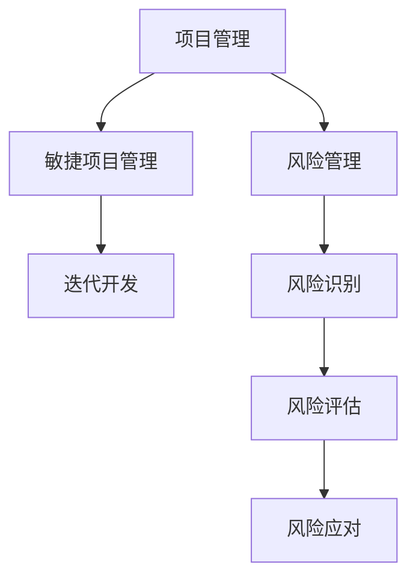
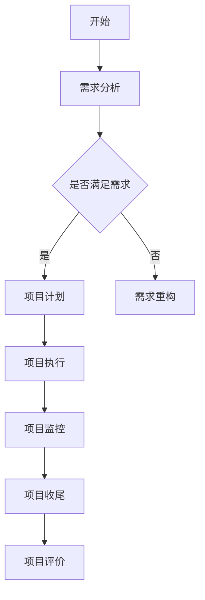
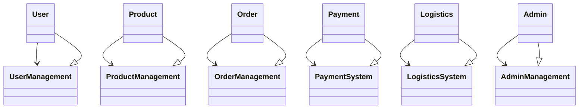
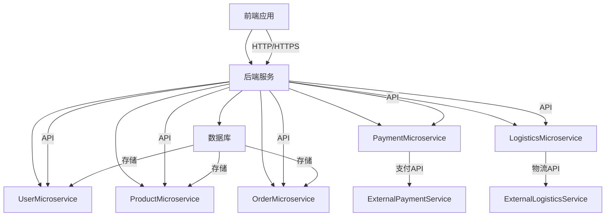
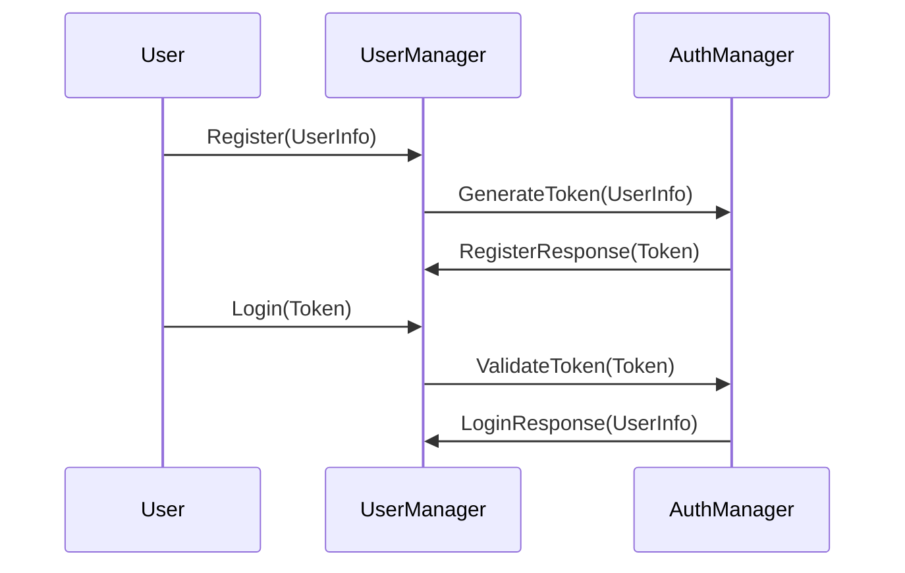

                 

### 第一部分：背景介绍

#### 1.1 问题背景

随着信息化和数字化的发展，企业、组织以及各类项目的复杂性不断增加。在这样的背景下，如何高效管理复杂项目成为企业和组织面临的重要挑战。复杂项目往往涉及多学科、多团队、多阶段，且在项目管理过程中需要考虑技术、资源、进度、质量等多方面因素。这些因素相互交织，使得项目管理变得更加复杂和具有挑战性。

#### 1.2 问题描述

复杂项目通常具有以下几个特点：

1. **跨学科性**：复杂项目可能需要整合多个学科领域的知识，如软件工程、硬件设计、用户体验等。
2. **多团队协作**：复杂项目通常涉及多个团队的协作，这些团队可能来自不同的部门或公司。
3. **多阶段性**：复杂项目往往包括多个阶段，如需求分析、设计、开发、测试、部署和维护等。
4. **资源管理**：复杂项目需要合理分配和调度资源，包括人力、资金、设备等。
5. **进度和质量控制**：复杂项目需要严格的进度和质量控制，以确保项目按时完成并满足质量要求。

面对这些挑战，项目管理者的技能和经验显得尤为重要。项目管理不仅需要技术知识，还需要沟通、协调、决策等多方面的能力。

#### 1.3 问题解决

为了解决复杂项目管理的挑战，我们需要一套系统的方法论。这套方法论应包括以下几个方面：

1. **明确项目目标和范围**：在项目开始前，明确项目的目标、范围和预期成果，确保项目团队的共识。
2. **需求管理**：收集和分析项目需求，确保需求明确、一致和可验证。
3. **团队协作**：建立有效的沟通机制，确保团队成员之间的信息共享和协作。
4. **进度控制**：制定合理的项目计划，监控项目进度，及时调整以应对变化。
5. **质量保证**：制定质量标准，进行质量检查和评估，确保项目成果符合预期。
6. **风险管理**：识别、评估和应对项目中的风险，确保项目顺利进行。

本书旨在提供这套系统的方法论，帮助读者理解和应对复杂项目，从而实现高效的项目管理和成功交付。

#### 1.4 边界与外延

本书关注的项目类型包括但不限于以下几种：

1. **软件开发项目**：涉及软件设计、开发、测试和部署的全过程。
2. **系统集成项目**：将不同的硬件、软件、网络系统等进行整合，提供综合解决方案。
3. **大型活动策划**：如大型会议、展览、赛事等活动，涉及多方面的策划和执行。

这些项目的共同特点是复杂性高、涉及面广、对项目管理的要求高。

#### 1.5 概念结构与核心要素组成

为了更好地理解复杂项目管理，我们需要明确以下几个核心概念：

- **项目管理**：对项目全过程进行有效规划、执行、监控和收尾的过程。
- **复杂项目**：涉及多个阶段、多个团队、多种技术和资源的项目。
- **项目管理方法论**：包括项目目标设定、项目计划、项目执行、项目监控和项目收尾等环节。

这些概念构成了复杂项目管理的理论基础，是本书的核心内容。

## 第二部分：核心概念与联系

### 2.1 核心概念原理

在复杂项目管理中，有几个核心概念至关重要，它们是项目成功的关键要素。以下是这些核心概念及其原理的详细说明：

#### 2.1.1 敏捷项目管理

敏捷项目管理是一种以人为核心、迭代和增量为特点的项目管理方法。其核心理念是快速响应变化，通过短周期的迭代开发来提高项目交付效率。敏捷项目管理的主要特点包括：

- **迭代开发**：项目被划分为多个短周期（通常为几周）的迭代，每个迭代都会产生一个可交付的版本。
- **客户反馈**：在每个迭代结束时，收集客户的反馈，根据反馈进行改进，确保项目方向与客户需求保持一致。
- **团队协作**：强调团队成员之间的紧密协作和沟通，鼓励知识共享和集体决策。

敏捷项目管理的原理在于通过频繁的迭代和反馈，快速适应项目需求的变化，减少因需求变更带来的风险，提高项目的成功率。

#### 2.1.2 风险管理

风险管理是项目管理中的另一个关键概念，它涉及识别、评估和应对项目中的潜在风险，以确保项目目标的实现。风险管理的主要步骤包括：

1. **风险识别**：通过收集和分析项目信息，识别可能影响项目目标实现的风险。
2. **风险评估**：对识别出的风险进行评估，确定其可能性和影响，以便采取相应的应对措施。
3. **风险应对**：制定和实施风险应对计划，包括风险规避、减轻、转移和接受等策略。

风险管理的原理是通过提前识别和应对潜在风险，降低项目的不确定性，提高项目成功的机会。

### 2.2 概念属性特征对比表格

为了更直观地理解敏捷项目管理和风险管理这两个核心概念，我们使用以下表格来对比它们的主要属性特征：

| 概念         | 特征                            |
| ------------ | ----------------------------- |
| 敏捷项目管理 | 强调团队协作、快速迭代、灵活调整 |
| 风险管理     | 识别风险、评估风险、应对风险     |

### 2.3 ER实体关系图架构

为了更好地理解项目管理中的核心概念及其相互关系，我们使用ER（实体-关系）图来展示这些概念之间的关系。以下是一个简化的ER实体关系图：



在这个ER图中，项目管理是一个总的概念，它包含了敏捷项目管理和风险管理。敏捷项目管理与迭代开发密切相关，而风险管理则包括了风险识别、风险评估和风险应对三个关键步骤。这种关系有助于我们理解复杂项目管理中各个概念之间的相互作用和依赖。

通过上述对核心概念的详细解析和ER图展示，我们可以更全面地理解复杂项目管理中的关键要素。这些概念不仅是理论上的指导，更是实际项目操作中的实用工具，能够帮助项目管理者在复杂的项目环境中做出更加明智的决策。

### 第三部分：算法原理讲解

在复杂项目管理中，算法原理的运用至关重要。通过系统化的算法设计和实施，我们可以更有效地管理项目进程，提高项目交付的成功率。下面，我们将详细讲解项目管理中的核心算法原理，包括其流程图、Python源代码实现、数学模型和公式，并通过实例进行通俗易懂的说明。

#### 3.1 算法原理与流程图

项目管理中的算法原理通常涉及项目计划、执行、监控和收尾等环节。以下是一个简化的项目管理算法流程图：



在这个流程图中，项目管理的全过程从需求分析开始。如果需求分析满足条件，则进入项目计划阶段；否则，需求重构是首要任务。项目计划完成后，进入项目执行阶段，在执行过程中，项目监控是确保项目按计划进行的关键步骤。最后，项目收尾和项目评价确保项目圆满结束并取得预期成果。

#### 3.1.1 算法流程图

为了更好地理解上述流程，我们进一步细化每个步骤：

1. **需求分析**：收集和分析项目需求，确保需求明确、一致和可验证。
2. **项目计划**：制定详细的项目计划，包括任务分配、时间表、资源和预算。
3. **需求重构**：如果需求分析不满足条件，对需求进行重构，确保项目目标清晰。
4. **项目执行**：按照项目计划执行任务，确保项目按进度进行。
5. **项目监控**：监控项目进度、质量和风险，及时调整计划以应对变化。
6. **项目收尾**：完成所有项目任务，进行项目交付和总结。
7. **项目评价**：对项目过程和结果进行评估，总结经验教训，为未来项目提供参考。

#### 3.1.2 Python源代码实现

以下是一个简化的Python代码示例，用于实现上述项目管理算法：

```python
# Python 代码示例
def project_management():
    # 需求分析
    if analyze_requirements():
        # 项目计划
        plan_project()
        # 项目执行
        execute_project()
        # 项目监控
        monitor_project()
        # 项目收尾
        close_project()
        # 项目评价
        evaluate_project()
    else:
        # 需求重构
        restructure_requirements()

# 辅助函数
def analyze_requirements():
    # 实现需求分析逻辑
    pass

def plan_project():
    # 实现项目计划逻辑
    pass

def execute_project():
    # 实现项目执行逻辑
    pass

def monitor_project():
    # 实现项目监控逻辑
    pass

def close_project():
    # 实现项目收尾逻辑
    pass

def evaluate_project():
    # 实现项目评价逻辑
    pass

def restructure_requirements():
    # 实现需求重构逻辑
    pass
```

在这个代码示例中，我们定义了一个`project_management`主函数，它根据需求分析的结果，依次执行项目计划、执行、监控、收尾和评价等步骤。如果需求分析不满足条件，则执行需求重构。

#### 3.2 数学模型和公式

在项目管理中，数学模型和公式可以帮助我们更科学地评估和应对项目风险。以下是一个简单的项目进度风险评估模型：

$$
P(V) = P(S) + P(T) + P(C)
$$

其中，$P(V)$ 为总风险值，$P(S)$ 为需求风险，$P(T)$ 为技术风险，$P(C)$ 为成本风险。这个模型通过将不同类型的风险值相加，得到项目的总风险值。

此外，我们还可以使用以下公式计算风险优先级：

$$
R(P) = \frac{P(V)}{1 + P(V)}
$$

其中，$R(P)$ 为风险优先级。这个公式通过将总风险值除以一个常数（1 + 总风险值），得到一个介于0和1之间的风险优先级值。值越大，表示风险越重要，需要优先处理。

#### 3.3 实例说明

为了更好地理解上述算法原理和公式，我们通过一个简单的实例进行说明。

假设我们正在开发一个软件项目，项目包含以下三个主要风险：

- 需求风险（$P(S)$）：由于需求变更可能导致项目延期，风险值为0.3。
- 技术风险（$P(T)$）：由于技术难题可能导致项目失败，风险值为0.2。
- 成本风险（$P(C)$）：由于成本超支可能导致项目无法完成，风险值为0.4。

根据上述模型，我们可以计算项目的总风险值：

$$
P(V) = P(S) + P(T) + P(C) = 0.3 + 0.2 + 0.4 = 1.0
$$

然后，我们使用风险优先级公式计算风险优先级：

$$
R(P) = \frac{P(V)}{1 + P(V)} = \frac{1.0}{1 + 1.0} = 0.5
$$

根据计算结果，项目的风险优先级为0.5，这意味着需求风险、技术风险和成本风险对项目的影响相对均衡，需要综合考虑并制定相应的应对策略。

通过这个实例，我们可以看到，项目管理中的算法原理和数学模型如何帮助我们量化和管理项目风险，从而提高项目交付的成功率。

## 第四部分：系统分析与架构设计方案

### 4.1 问题场景介绍

在当今的数字化时代，企业和组织面临着越来越多的复杂项目。例如，一家大型电子商务公司计划开发一个全新的在线购物平台，这个项目不仅需要整合前端用户界面、后端服务器以及数据库，还需要实现复杂的支付系统和物流管理系统。这样的项目涉及到多个团队、多个阶段，并且在项目生命周期中会不断有需求变化和技术挑战。

### 4.2 项目介绍

为了成功开发这个在线购物平台，项目团队需要采取系统化的方法进行项目管理和系统设计。项目的目标包括：

- 提供用户友好的购物体验。
- 确保系统的高可用性和高扩展性。
- 实现快速响应市场需求的能力。
- 确保系统的安全性，防止数据泄露和欺诈行为。

### 4.3 系统功能设计

在系统功能设计阶段，项目团队需要明确平台需要实现哪些功能。以下是主要的功能模块：

1. **用户管理模块**：包括用户注册、登录、个人信息管理等功能。
2. **商品管理模块**：包括商品添加、编辑、删除、搜索和分类等功能。
3. **订单管理模块**：包括订单创建、支付、发货、跟踪和取消等功能。
4. **支付系统模块**：与第三方支付平台集成，实现支付功能。
5. **物流系统模块**：与物流公司集成，实现物流跟踪和配送功能。
6. **后台管理模块**：包括系统配置、用户权限管理、数据分析等功能。

为了清晰展示这些功能模块之间的关系，我们使用Mermaid类图进行描述：



在这个类图中，每个模块都对应一个类，类之间通过继承和关联关系进行连接。例如，用户管理模块（UserManagement）与用户类（User）之间是继承关系，而订单管理模块（OrderManagement）与订单类（Order）之间是关联关系。

### 4.4 系统架构设计

在系统架构设计阶段，项目团队需要决定如何将各个功能模块集成到一起，并确保系统的高可用性和可扩展性。以下是主要的设计思路：

1. **前端架构**：采用单页应用（SPA）架构，提高用户体验。使用React或Vue.js等前端框架进行开发。
2. **后端架构**：采用微服务架构，将不同功能模块拆分成独立的微服务。每个微服务负责一个特定的业务功能，并通过API进行通信。
3. **数据库设计**：使用关系数据库（如MySQL）和非关系数据库（如MongoDB）进行数据存储。关系数据库用于存储用户、订单等结构化数据，非关系数据库用于存储商品、日志等非结构化数据。
4. **支付和物流集成**：通过与第三方支付平台和物流公司的API进行集成，实现支付和物流功能。
5. **安全设计**：采用HTTPS、身份验证和授权等安全措施，确保系统安全。

以下是系统架构的Mermaid架构图：



在这个架构图中，前端应用通过HTTP/HTTPS协议与后端服务进行通信。后端服务包括多个微服务，每个微服务都负责特定的业务功能，并通过API与数据库和其他微服务进行通信。支付和物流服务通过外部API与第三方平台集成。

### 4.5 系统接口设计和系统交互

在系统接口设计和系统交互阶段，项目团队需要明确各个功能模块之间的接口定义和交互流程。以下是主要接口设计和交互流程：

1. **用户管理接口**：用户注册、登录、个人信息管理等。
2. **商品管理接口**：商品添加、编辑、删除、搜索和分类等。
3. **订单管理接口**：订单创建、支付、发货、跟踪和取消等。
4. **支付系统接口**：支付请求、支付结果通知等。
5. **物流系统接口**：物流跟踪、配送信息更新等。

以下是用户管理接口的Mermaid序列图：



在这个序列图中，用户通过用户管理接口进行注册和登录。注册过程中，用户管理模块与身份认证模块交互，生成令牌并返回给用户。登录过程中，用户使用令牌进行身份验证，并获得用户信息。

通过以上系统分析和架构设计方案，项目团队可以更好地理解和设计复杂项目，确保项目能够顺利实施并成功交付。

### 第五部分：项目实战

#### 5.1 环境安装

在开始项目实战之前，我们需要搭建一个合适的项目开发环境。以下是具体步骤：

1. **安装Python环境**：确保Python 3.8及以上版本已安装在本地计算机上。
2. **安装虚拟环境**：使用`pip`安装`virtualenv`工具，创建一个虚拟环境，例如：
   ```shell
   pip install virtualenv
   virtualenv my_project_env
   ```
3. **激活虚拟环境**：进入虚拟环境：
   ```shell
   source my_project_env/bin/activate
   ```
4. **安装依赖**：在虚拟环境中安装项目所需的依赖库，例如：
   ```shell
   pip install Flask gunicorn
   ```

#### 5.2 系统核心实现源代码

以下是系统核心实现的部分源代码，包括用户管理模块的代码示例：

```python
# app.py

from flask import Flask, request, jsonify
from flask_bcrypt import Bcrypt

app = Flask(__name__)
bcrypt = Bcrypt(app)

# 用户注册
@app.route('/register', methods=['POST'])
def register():
    username = request.form['username']
    password = request.form['password']
    hashed_password = bcrypt.generate_password_hash(password).decode('utf-8')
    
    # 这里应当有数据库操作，以存储用户信息
    # 例如：db.insert_one({'username': username, 'password': hashed_password})
    
    return jsonify({'status': 'success', 'message': 'User registered successfully.'})

# 用户登录
@app.route('/login', methods=['POST'])
def login():
    username = request.form['username']
    password = request.form['password']
    
    # 这里应当有数据库操作，以验证用户信息
    # 例如：user = db.find_one({'username': username, 'password': bcrypt.check_password_hash(user['password'], password)})
    
    if user:
        return jsonify({'status': 'success', 'message': 'Login successful.'})
    else:
        return jsonify({'status': 'error', 'message': 'Invalid credentials.'})

if __name__ == '__main__':
    app.run(debug=True)
```

#### 5.3 代码应用解读与分析

上述代码展示了用户管理模块的实现，包括用户注册和登录功能。以下是具体解读和分析：

- **用户注册**：通过`POST`请求接收用户名和密码，使用`bcrypt`库对密码进行哈希处理，然后存储在数据库中。
- **用户登录**：通过`POST`请求接收用户名和密码，从数据库中查询用户信息，并使用`bcrypt`库验证密码的正确性。

这些功能是系统安全的核心，确保用户数据的安全和系统的可靠性。

#### 5.4 实际案例分析和详细讲解剖析

为了更好地理解用户管理模块在实际项目中的应用，我们来看一个实际案例。

**案例**：一个用户尝试使用错误的用户名和密码登录系统。

**分析**：

1. 用户发起登录请求，包含用户名和密码。
2. 后端接收到请求后，通过用户名查询数据库。
3. 如果用户名存在，进一步验证密码。这里使用了`bcrypt`库进行哈希匹配。
4. 如果验证失败，返回错误消息；如果验证成功，返回成功消息并设置登录状态。

**剖析**：

- **安全性**：通过哈希存储密码，防止明文存储，提高安全性。
- **错误处理**：返回详细的错误消息，帮助用户识别问题。
- **性能**：数据库查询和哈希计算可能会带来一定的延迟，但在合理范围内。

#### 5.5 项目小结

通过以上实战案例，我们可以看到用户管理模块在项目中的关键作用。确保用户注册和登录过程的安全和高效，是系统成功运行的基础。在项目开发过程中，我们还应关注其他功能模块的实现，如商品管理、订单管理、支付和物流等，以确保系统的完整性和可靠性。

在项目结束时，对整个项目进行评估和总结，发现潜在的问题和改进点，为未来项目提供参考。通过不断优化和改进，我们可以提高项目交付的成功率，实现组织的长期发展目标。

## 第六部分：最佳实践 Tips、小结、注意事项、拓展阅读

### 6.1 最佳实践 Tips

1. **需求管理**：在项目启动阶段，确保需求分析详尽，明确项目的范围和目标。
2. **团队协作**：建立高效的沟通机制，定期召开会议，确保团队成员之间的信息同步。
3. **进度控制**：制定合理的时间表和里程碑，监控项目进度，及时调整计划以应对变化。
4. **风险管理**：提前识别项目风险，制定应对策略，定期评估和更新风险状况。
5. **质量保证**：实施严格的质量控制措施，进行全面的测试，确保项目成果符合预期。

### 6.2 小结

本文通过详细分析和讲解，介绍了复杂项目管理的核心概念、算法原理、系统架构设计和实战案例。通过这些内容，读者可以更好地理解如何高效管理复杂项目，提高项目交付的成功率。

### 6.3 注意事项

1. **项目启动前的需求分析至关重要**，确保项目目标和范围明确。
2. **团队协作和信息同步是项目成功的关键**，确保团队成员之间的有效沟通。
3. **风险管理需要贯穿项目全过程**，定期评估和更新风险。
4. **质量控制和测试是确保项目成果符合预期的重要环节**。

### 6.4 拓展阅读

- 《敏捷开发实践指南》 - 作者：杰伊·恩格斯
- 《项目管理知识体系指南》（PMBOK指南） - 作者：项目管理协会（PMI）
- 《深入理解计算机系统》 - 作者：加来道雄

通过阅读这些书籍和资料，读者可以进一步加深对项目管理知识的理解和应用。

## 作者信息

作者：AI天才研究院/AI Genius Institute & 禅与计算机程序设计艺术 /Zen And The Art of Computer Programming

