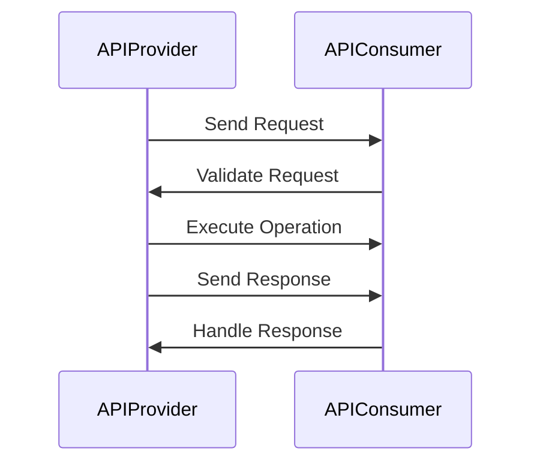
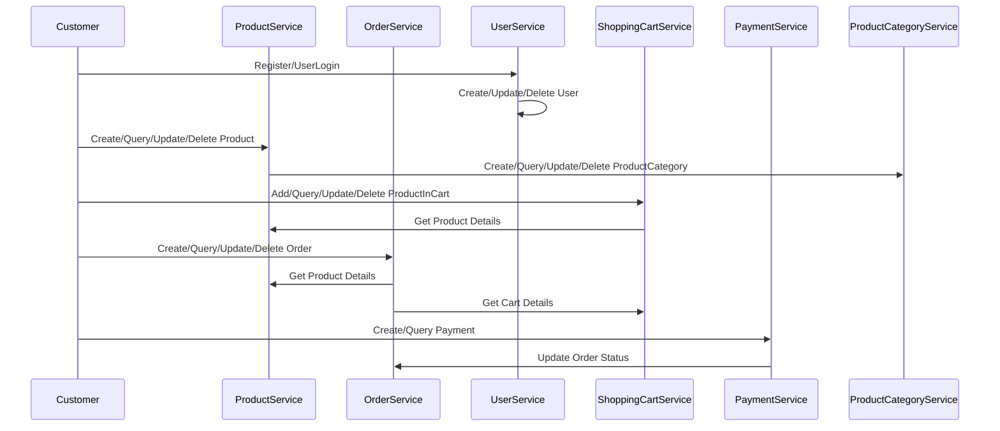
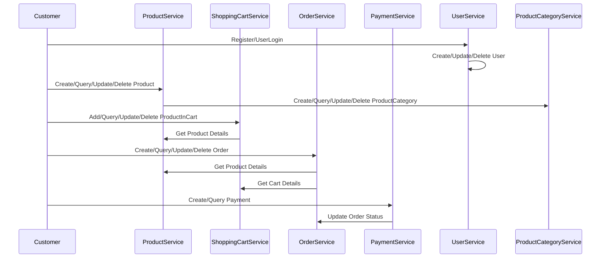

                 


### 第1章 接口契约概述

#### 1.1 接口契约的背景与重要性

在当今快速发展的软件行业中，接口契约（API Contract）已成为确保系统稳定、可靠和可维护性的重要手段。接口契约最早可以追溯到1980年代，当时软件工程师开始意识到在软件组件之间建立明确的交互规范的重要性。随着互联网的兴起，分布式系统和微服务架构的广泛应用，接口契约的重要性日益凸显。

接口契约的定义可以简单概括为：一组描述API行为和预期的规则，它规定了服务提供者（API提供者）和服务消费者（API消费者）之间的交互方式。这些规则包括接口的输入参数、输出结果、错误处理机制等。

接口契约在复杂项目中的重要性主要体现在以下几个方面：

1. **降低耦合度**：通过接口契约，服务提供者和服务消费者之间的耦合度大大降低，使得各个模块可以独立开发、测试和部署，从而提高了系统的灵活性。

2. **提高可维护性**：接口契约提供了明确的接口规范，使得维护人员能够更容易理解和使用系统，减少了维护成本。

3. **增强可扩展性**：接口契约使得系统可以更容易地添加新的功能或替换现有组件，提高了系统的可扩展性。

4. **促进团队协作**：接口契约为团队成员提供了统一的接口规范，有助于团队协作，减少因不同人对接口理解不同而产生的误解和冲突。

#### 1.2 接口契约的定义与作用

接口契约的定义已经在上一节中进行了介绍。接口契约的具体作用可以从以下几个方面来阐述：

1. **行为约定**：接口契约明确了服务提供者应该执行的操作，以及服务消费者期望从服务中获取的结果。它规定了接口的输入参数和输出结果，以及处理异常情况的方式。

2. **验证机制**：接口契约通过验证机制确保服务提供者按照约定执行操作。当服务提供者返回的结果不符合预期时，契约验证机制可以及时发现并报告错误，从而保证系统的稳定性。

3. **文档生成**：接口契约可以作为自动生成的API文档，为开发者提供详细的接口描述，减少了阅读和理解接口文档的时间成本。

4. **自动化测试**：接口契约使得开发者可以编写自动化测试用例，确保接口的正确性和稳定性。这些测试用例可以随着接口的变化而自动更新，减少了手工测试的工作量。

#### 1.3 接口契约的历史发展与现状

接口契约的概念起源于软件工程领域，最初的目的是为了解决组件之间的通信问题。随着互联网的发展，特别是在Web服务和微服务架构的普及，接口契约的应用场景变得更加广泛。

1. **Web服务**：在Web服务时代，接口契约主要用于描述Web服务提供的API。典型的接口契约格式包括WSDL（Web Services Description Language）和Swagger。这些契约格式提供了详细的接口描述，使得开发者可以更容易地理解和使用Web服务。

2. **微服务架构**：随着微服务架构的兴起，接口契约变得尤为重要。在微服务架构中，各个微服务通过接口契约进行通信，确保了系统的灵活性和可扩展性。Swagger和OpenAPI成为微服务架构中常用的接口契约格式。

3. **现状**：当前，接口契约已经成为软件开发中的标准实践。越来越多的开发工具和平台支持接口契约，如Spring Boot、Node.js、Django等。同时，接口契约的自动化工具和平台也在不断发展，如Postman、Swagger UI等。

#### 1.4 接口契约与其他相关概念的区别

在软件工程中，与接口契约相关的概念包括API、RESTful API、Web服务等。下面我们将对它们进行简要区分：

1. **API（Application Programming Interface）**：API是一种编程接口，它定义了应用程序之间可以相互交互的规则和协议。API可以是接口契约的一种表现形式，但不仅仅是接口契约。

2. **RESTful API**：RESTful API是一种基于REST（Representational State Transfer）原则构建的Web API。它使用HTTP协议的GET、POST、PUT、DELETE等方法来操作资源。RESTful API可以包含接口契约，但接口契约不仅仅是RESTful API。

3. **Web服务**：Web服务是一种通过Web协议（如HTTP、SOAP）提供的分布式计算服务。Web服务通常包含接口契约，但接口契约不仅仅是Web服务。

综上所述，接口契约是描述API行为和预期的规则，而API、RESTful API、Web服务则是实现接口契约的具体形式。理解它们之间的区别对于正确使用接口契约至关重要。

### 第2章 接口契约的核心概念

#### 2.1 接口契约的基本要素

接口契约由多个基本要素组成，这些要素共同定义了接口的行为和预期。以下是接口契约的基本要素：

1. **接口名称**：接口的名称是对接口功能的一种简洁描述，通常使用名词或名词短语。

2. **输入参数**：接口的输入参数定义了接口调用时需要传递的数据。每个参数包括参数名称、类型、默认值、约束条件等。

3. **输出结果**：接口的输出结果定义了接口调用成功时返回的数据。输出结果通常包括返回值类型、可能的状态码、错误信息等。

4. **异常处理**：异常处理定义了接口在遇到错误时如何响应。包括异常类型、异常处理方法、错误信息等。

5. **性能要求**：性能要求定义了接口的响应时间、吞吐量等性能指标。

6. **安全性要求**：安全性要求定义了接口的安全措施，如认证、授权、加密等。

#### 2.2 接口契约的类型与分类

接口契约可以根据不同的标准进行分类。以下是几种常见的接口契约类型：

1. **功能接口契约**：功能接口契约主要描述接口的功能行为，如输入参数、输出结果和异常处理等。

2. **数据接口契约**：数据接口契约主要描述接口的数据结构，如数据类型、数据格式等。

3. **事务接口契约**：事务接口契约描述接口的事务特性，如事务的传播行为、隔离级别等。

4. **安全性接口契约**：安全性接口契约描述接口的安全措施，如认证、授权、加密等。

5. **性能接口契约**：性能接口契约描述接口的性能要求，如响应时间、吞吐量等。

#### 2.3 接口契约的关键属性

接口契约的关键属性决定了契约的有效性和适用性。以下是接口契约的关键属性：

1. **规范性**：接口契约需要具有明确的规范，确保所有相关人员都能准确理解和遵循。

2. **完整性**：接口契约需要完整地描述接口的所有行为和预期，确保没有遗漏。

3. **一致性**：接口契约需要在整个项目中保持一致性，避免出现矛盾和冲突。

4. **可读性**：接口契约需要具有良好的可读性，方便开发者理解和维护。

5. **可维护性**：接口契约需要易于修改和维护，以适应项目的变化。

#### 2.4 接口契约的实体关系图

接口契约的实体关系图（ER图）可以帮助我们直观地理解接口契约中的各个实体及其关系。以下是接口契约实体关系图的基本结构：

```
+-------------+
|  Interface  |
+-------------+
| - name      |
| - input     |
| - output    |
| - error     |
| - performance|
| - security   |
+-------------+
      |
      | 遵循
      |
+-------------+
|  Function    |
+-------------+
| - parameter  |
| - result     |
| - exception  |
+-------------+
```

在上图中，`Interface` 表示接口实体，包括接口名称、输入参数、输出结果、异常处理、性能要求和安全要求等属性。`Function` 表示功能实体，包括参数、结果和异常等属性，是接口契约的一部分。

通过实体关系图，我们可以清晰地看到接口契约中的各个实体及其关系，有助于我们在设计和维护接口契约时保持结构清晰和逻辑连贯。

### 第3章 接口契约的设计原理

#### 3.1 接口契约的设计原则

接口契约的设计需要遵循一系列原则，以确保契约的有效性和可维护性。以下是接口契约设计的主要原则：

1. **简洁性**：接口契约应尽量简洁明了，避免冗余和复杂性，使得开发者容易理解和遵循。

2. **规范性**：接口契约应遵循统一的规范，如命名规范、参数和返回值规范等，以确保契约的一致性和可维护性。

3. **可读性**：接口契约应具有良好的可读性，使用简洁的描述和明确的术语，避免使用难以理解的缩写和行话。

4. **灵活性**：接口契约应具有一定的灵活性，以适应项目的变化和需求调整，同时保持契约的一致性。

5. **可维护性**：接口契约应易于维护和更新，避免因修改带来的风险和影响。

6. **可扩展性**：接口契约应设计成可扩展的，以便在未来的项目中添加新的功能或替换现有组件。

7. **安全性**：接口契约应考虑安全性要求，包括认证、授权、数据加密等，确保接口的安全可靠。

#### 3.2 接口契约的设计流程

接口契约的设计流程可以分为以下几个步骤：

1. **需求分析**：在开始设计接口契约之前，首先需要明确项目的需求和目标，了解接口的使用场景和预期效果。

2. **接口规划**：根据需求分析的结果，确定接口的功能和性能要求，设计接口的基本结构和主要参数。

3. **编写契约文档**：根据接口规划和需求分析，编写接口契约文档，详细描述接口的行为和预期结果。

4. **评审和修改**：将契约文档提交给相关人员进行评审，收集反馈和建议，根据反馈对契约文档进行修改和完善。

5. **自动化工具生成**：使用自动化工具（如Swagger、OpenAPI等）生成接口契约的自动化文档，方便开发者查看和使用。

6. **测试和验证**：编写自动化测试用例，对接口契约进行测试和验证，确保接口的正确性和稳定性。

7. **文档更新和迭代**：根据测试结果和项目需求，持续更新和优化接口契约文档，确保其与项目需求保持一致。

#### 3.3 接口契约的流程图

接口契约的流程图可以帮助我们直观地了解接口的设计和实现过程。以下是接口契约流程图的基本结构：



在上图中，`APIProvider` 表示接口提供者，`APIConsumer` 表示接口消费者。流程图展示了接口请求和响应的基本过程：

1. **发送请求**：接口消费者向接口提供者发送请求。
2. **验证请求**：接口提供者验证请求的有效性。
3. **执行操作**：接口提供者根据请求执行相应的操作。
4. **发送响应**：接口提供者向接口消费者发送响应。
5. **处理响应**：接口消费者处理接收到的响应。

通过流程图，我们可以更清晰地理解接口契约的执行过程，有助于我们在设计和实现接口契约时保持逻辑一致和步骤清晰。

#### 3.4 接口契约的数学模型和公式

接口契约的数学模型可以帮助我们量化接口的性能和可靠性等指标。以下是接口契约的几个常用数学模型和公式：

1. **响应时间模型**：

   响应时间（T）是接口执行操作所需的时间。可以表示为：

   $$ T = \frac{1}{\lambda} + \frac{\mu}{\lambda} $$

   其中，λ表示请求到达率，μ表示服务时间。

2. **吞吐量模型**：

   吞吐量（Q）是单位时间内接口处理的请求数量。可以表示为：

   $$ Q = \frac{\lambda}{\mu} $$

   其中，λ表示请求到达率，μ表示服务时间。

3. **错误率模型**：

   错误率（E）是接口返回错误响应的比例。可以表示为：

   $$ E = \frac{\lambda \cdot \pi}{\mu} $$

   其中，λ表示请求到达率，π表示错误概率。

4. **可靠性模型**：

   接口的可靠性（R）是接口在一段时间内正常工作的概率。可以表示为：

   $$ R = e^{-\lambda \cdot t} $$

   其中，λ表示请求到达率，t表示时间。

通过这些数学模型和公式，我们可以对接口契约的性能和可靠性进行量化分析，有助于我们设计和优化接口契约。

#### 3.5 接口契约的详细讲解与举例说明

为了更好地理解接口契约的设计原理，我们将通过一个简单的示例来详细讲解接口契约的各个要素和实现过程。

##### 示例：用户注册接口契约

1. **接口名称**：UserRegistration

2. **输入参数**：

   - username（字符串）：用户名，长度不超过20个字符
   - password（字符串）：密码，长度不少于8个字符，必须包含数字和字母
   - email（字符串）：邮箱地址，格式符合常用邮箱地址规范

3. **输出结果**：

   - status（字符串）：操作结果状态码，如“200”表示成功，“400”表示参数错误，“500”表示服务器错误
   - message（字符串）：操作结果描述，如“注册成功”、“用户名已存在”、“邮箱格式错误”等

4. **异常处理**：

   - 参数错误：返回状态码“400”，描述错误信息
   - 服务错误：返回状态码“500”，描述错误信息

5. **性能要求**：

   - 响应时间：不超过500ms

6. **安全性要求**：

   - 密码加密：使用SHA-256算法对密码进行加密处理

##### 接口契约实现

以下是一个简单的Python示例，实现用户注册接口契约：

```python
import hashlib
import re

def register(username, password, email):
    # 验证用户名
    if not re.match(r'^\w{1,20}$', username):
        return '400', '用户名格式错误'

    # 验证密码
    if not re.match(r'^(?=.*\d)(?=.*[a-z])(?=.*[A-Z]).{8,}$', password):
        return '400', '密码格式错误'

    # 验证邮箱
    if not re.match(r'^[a-zA-Z0-9._%+-]+@[a-zA-Z0-9.-]+\.[a-zA-Z]{2,}$', email):
        return '400', '邮箱格式错误'

    # 加密密码
    encrypted_password = hashlib.sha256(password.encode()).hexdigest()

    # 注册用户（这里仅作演示，实际情况下需要保存用户信息到数据库）
    # ...

    return '200', '注册成功'
```

在这个示例中，我们首先验证输入参数是否符合要求，然后对密码进行加密处理，最后返回操作结果。

通过这个示例，我们可以看到接口契约的设计和实现过程是如何一步步进行的。在实际项目中，接口契约的设计和实现会更加复杂，但基本原理是相通的。

### 第4章 接口契约在复杂项目中的角色

#### 4.1 接口契约在复杂项目中的重要性

在复杂项目中，接口契约扮演着至关重要的角色。复杂项目通常涉及多个模块、多个团队以及多种技术栈，这使得项目的协作和沟通变得异常复杂。接口契约作为一种规范和约束，能够在以下几个方面发挥关键作用：

1. **明确职责**：接口契约明确了各个模块或服务提供者的职责，确保每个模块或服务能够按照预期工作。这样可以避免因为职责不清导致的协作问题。

2. **提高可维护性**：接口契约提供了明确的接口规范，使得开发者能够更轻松地理解和使用系统。这有助于降低维护成本，提高系统的可维护性。

3. **增强可扩展性**：通过接口契约，系统可以更容易地添加新的功能或替换现有组件，从而提高系统的可扩展性。

4. **促进团队协作**：接口契约为团队成员提供了统一的接口规范，减少了因不同人对接口理解不同而产生的误解和冲突，提高了团队协作效率。

5. **确保系统稳定性**：接口契约通过验证机制确保接口的正确性和稳定性，及时发现并解决接口问题，从而保证系统的稳定性。

6. **支持自动化测试**：接口契约使得开发者可以编写自动化测试用例，确保接口的正确性和稳定性。自动化测试可以大幅提高测试效率，减少手工测试的工作量。

#### 4.2 接口契约在复杂项目中的应用场景

接口契约在复杂项目中的应用场景非常广泛，以下是一些典型的应用场景：

1. **微服务架构**：在微服务架构中，各个微服务通过接口契约进行通信。接口契约确保了微服务之间的交互规范和一致性，从而提高了系统的可维护性和可扩展性。

2. **分布式系统**：在分布式系统中，接口契约帮助明确各个服务节点的职责和交互方式，降低了系统的复杂度，提高了系统的可靠性和稳定性。

3. **前后端分离**：在前后端分离的项目中，接口契约规定了前后端的交互规范，确保前后端开发能够无缝协作，从而提高开发效率和系统质量。

4. **第三方服务集成**：在集成第三方服务时，接口契约可以帮助明确第三方服务的API规范，降低集成难度，提高集成效率。

5. **内部服务治理**：在企业内部服务治理中，接口契约可以帮助规范内部服务的接口和行为，确保内部服务的可维护性和可扩展性。

6. **跨平台应用开发**：在跨平台应用开发中，接口契约可以帮助确保不同平台间的接口一致性和兼容性，从而提高开发的效率和项目的成功率。

#### 4.3 接口契约在复杂项目中的挑战

尽管接口契约在复杂项目中具有诸多优势，但在实际应用中仍面临一些挑战：

1. **契约设计复杂性**：接口契约的设计需要考虑多个因素，如功能需求、性能要求、安全性要求等，这使得契约设计变得复杂。

2. **契约变更管理**：在复杂项目中，接口契约可能会随着项目的进展而发生变化。如何有效地管理契约变更，确保系统的稳定性和一致性，是一个重要挑战。

3. **契约文档维护**：接口契约的文档需要及时更新和维护，以确保文档与实际接口保持一致。在复杂项目中，如何高效地维护契约文档，是一个值得关注的挑战。

4. **测试和验证**：接口契约的测试和验证需要投入大量时间和资源。如何高效地进行接口测试和验证，确保接口的正确性和稳定性，是一个重要问题。

5. **安全性问题**：接口契约在安全性方面面临着诸多挑战，如认证、授权、数据加密等。如何确保接口契约的安全性和可靠性，是一个需要深入探讨的问题。

6. **跨团队合作**：在复杂项目中，接口契约通常涉及多个团队和多个技术栈。如何确保跨团队合作顺畅，避免因为接口契约问题导致协作困难，是一个重要挑战。

通过理解这些挑战，我们可以更好地设计、实施和管理接口契约，确保其在复杂项目中的有效应用。

### 第5章 接口契约系统分析与架构设计

#### 5.1 问题场景介绍

在复杂项目中，接口契约的应用场景非常丰富。以下是一个具体的问题场景，我们将基于此场景进行接口契约的系统分析与架构设计。

**问题场景**：某电商平台正在开发一个全新的购物系统，该系统包括商品管理、订单管理、用户管理等多个模块。这些模块需要通过接口进行通信，实现数据交互和功能协作。为了确保系统的稳定性、可靠性和可扩展性，我们需要设计一套完善的接口契约，明确各个模块之间的交互规范。

#### 5.2 项目介绍

**项目背景**：该电商平台拥有大量的用户和商品数据，为了提高系统的性能和可维护性，决定采用微服务架构进行开发。系统分为多个微服务，每个微服务负责特定的功能模块，如商品服务、订单服务、用户服务等。

**项目目的**：通过设计一套完善的接口契约，确保各个微服务之间的交互规范和一致性，提高系统的稳定性和可维护性。接口契约将包括商品管理、订单管理、用户管理等多个模块，涵盖各种常见操作，如创建商品、下单、查询订单等。

#### 5.3 系统功能设计

为了满足项目需求，接口契约需要涵盖以下主要功能模块：

1. **商品管理**：包括创建商品、查询商品、更新商品、删除商品等操作。
2. **订单管理**：包括创建订单、查询订单、更新订单、取消订单等操作。
3. **用户管理**：包括创建用户、查询用户、更新用户、删除用户等操作。
4. **购物车管理**：包括添加商品到购物车、查询购物车、更新购物车、删除购物车等操作。
5. **支付管理**：包括发起支付、查询支付结果、退款等操作。

以下是系统功能设计的mermaid类图：

```mermaid
classDiagram
    Customer <<-- ShoppingCart
    ShoppingCart o-- Product
    ShoppingCart o-- Order
    Product o-- ProductCategory
    Order o-- Customer
    Order o-- Product
    class Customer {
        +id: Integer
        +name: String
        +email: String
    }
    class ShoppingCart {
        +id: Integer
        +customer: Customer
        +products: List[Product]
        +totalAmount: Float
    }
    class Product {
        +id: Integer
        +name: String
        +price: Float
        +categoryId: Integer
    }
    class ProductCategory {
        +id: Integer
        +name: String
    }
    class Order {
        +id: Integer
        +customer: Customer
        +orderItems: List[OrderItem]
        +status: String
        +totalAmount: Float
    }
    class OrderItem {
        +id: Integer
        +productId: Integer
        +quantity: Integer
        +unitPrice: Float
    }
```

通过该类图，我们可以清晰地看到各个功能模块及其之间的关系，为接口契约的设计提供了基础。

#### 5.4 系统架构设计

为了实现接口契约，我们需要设计一个合理的系统架构。以下是一个可能的系统架构设计，包括各个微服务的部署和交互方式。

**系统架构设计**：

1. **商品服务**：负责商品的管理，包括创建、查询、更新和删除商品。商品服务可以使用RESTful API对外提供接口。
2. **订单服务**：负责订单的管理，包括创建、查询、更新和取消订单。订单服务也可以使用RESTful API对外提供接口。
3. **用户服务**：负责用户的管理，包括创建、查询、更新和删除用户。用户服务同样使用RESTful API对外提供接口。
4. **购物车服务**：负责购物车的管理，包括添加商品到购物车、查询购物车、更新购物车和删除购物车。购物车服务使用RESTful API对外提供接口。
5. **支付服务**：负责支付的管理，包括发起支付、查询支付结果和退款。支付服务同样使用RESTful API对外提供接口。

以下是系统架构设计的mermaid架构图：



通过该架构图，我们可以清晰地看到各个微服务之间的交互关系，以及它们与外部系统的连接方式。

#### 5.5 系统接口设计和系统交互

为了实现系统功能，我们需要设计具体的接口，并定义它们的交互流程。以下是商品管理、订单管理、用户管理、购物车管理和支付管理的主要接口设计。

1. **商品管理接口**：

   - 创建商品：POST /api/products
   - 查询商品：GET /api/products/{productId}
   - 更新商品：PUT /api/products/{productId}
   - 删除商品：DELETE /api/products/{productId}

2. **订单管理接口**：

   - 创建订单：POST /api/orders
   - 查询订单：GET /api/orders/{orderId}
   - 更新订单：PUT /api/orders/{orderId}
   - 删除订单：DELETE /api/orders/{orderId}
   - 取消订单：DELETE /api/orders/{orderId}/cancel

3. **用户管理接口**：

   - 创建用户：POST /api/users
   - 查询用户：GET /api/users/{userId}
   - 更新用户：PUT /api/users/{userId}
   - 删除用户：DELETE /api/users/{userId}

4. **购物车管理接口**：

   - 添加商品到购物车：POST /api/shoppingcarts/{userId}/products/{productId}
   - 查询购物车：GET /api/shoppingcarts/{userId}
   - 更新购物车：PUT /api/shoppingcarts/{userId}/products/{productId}
   - 删除购物车：DELETE /api/shoppingcarts/{userId}/products/{productId}

5. **支付管理接口**：

   - 发起支付：POST /api/payments
   - 查询支付结果：GET /api/payments/{paymentId}
   - 退款：POST /api/payments/{paymentId}/refund

以下是系统接口设计和交互的mermaid序列图：



通过上述接口设计和交互流程，我们可以实现各个模块之间的无缝协作，确保系统的稳定性和可扩展性。

### 第6章 接口契约的项目实战

#### 6.1 环境安装

为了实现接口契约，我们需要搭建一个合适的项目环境。以下是安装所需环境的具体步骤：

1. **安装Python**：确保已经安装了Python 3.x版本，可以从Python官网（https://www.python.org/）下载安装包并安装。

2. **安装虚拟环境**：安装虚拟环境工具`virtualenv`，以便创建独立的项目环境。可以使用以下命令安装：

   ```bash
   pip install virtualenv
   ```

3. **创建虚拟环境**：在项目根目录下创建一个虚拟环境，并激活它。可以使用以下命令：

   ```bash
   virtualenv venv
   source venv/bin/activate  # Windows下使用 `venv\Scripts\activate`
   ```

4. **安装依赖库**：在虚拟环境中安装所需的依赖库，如Flask、requests等。可以使用以下命令：

   ```bash
   pip install flask requests
   ```

5. **安装其他工具**：如需进行接口测试，可以安装Postman、Swagger等工具。可以从官方网站下载并安装。

#### 6.2 系统核心实现源代码

以下是实现接口契约的核心源代码，包括用户管理、商品管理、订单管理和支付管理的主要功能。

**用户管理**：

```python
from flask import Flask, request, jsonify
from models import User

app = Flask(__name__)

@app.route('/users', methods=['POST'])
def create_user():
    data = request.get_json()
    user = User.create(data)
    return jsonify(user.to_dict()), 201

@app.route('/users/<int:user_id>', methods=['GET'])
def get_user(user_id):
    user = User.get_by_id(user_id)
    return jsonify(user.to_dict()), 200

@app.route('/users/<int:user_id>', methods=['PUT'])
def update_user(user_id):
    data = request.get_json()
    user = User.update(user_id, data)
    return jsonify(user.to_dict()), 200

@app.route('/users/<int:user_id>', methods=['DELETE'])
def delete_user(user_id):
    User.delete(user_id)
    return '', 204
```

**商品管理**：

```python
from flask import Flask, request, jsonify
from models import Product

app = Flask(__name__)

@app.route('/products', methods=['POST'])
def create_product():
    data = request.get_json()
    product = Product.create(data)
    return jsonify(product.to_dict()), 201

@app.route('/products/<int:product_id>', methods=['GET'])
def get_product(product_id):
    product = Product.get_by_id(product_id)
    return jsonify(product.to_dict()), 200

@app.route('/products/<int:product_id>', methods=['PUT'])
def update_product(product_id):
    data = request.get_json()
    product = Product.update(product_id, data)
    return jsonify(product.to_dict()), 200

@app.route('/products/<int:product_id>', methods=['DELETE'])
def delete_product(product_id):
    Product.delete(product_id)
    return '', 204
```

**订单管理**：

```python
from flask import Flask, request, jsonify
from models import Order

app = Flask(__name__)

@app.route('/orders', methods=['POST'])
def create_order():
    data = request.get_json()
    order = Order.create(data)
    return jsonify(order.to_dict()), 201

@app.route('/orders/<int:order_id>', methods=['GET'])
def get_order(order_id):
    order = Order.get_by_id(order_id)
    return jsonify(order.to_dict()), 200

@app.route('/orders/<int:order_id>', methods=['PUT'])
def update_order(order_id):
    data = request.get_json()
    order = Order.update(order_id, data)
    return jsonify(order.to_dict()), 200

@app.route('/orders/<int:order_id>/cancel', methods=['DELETE'])
def cancel_order(order_id):
    Order.cancel(order_id)
    return '', 204
```

**支付管理**：

```python
from flask import Flask, request, jsonify
from models import Payment

app = Flask(__name__)

@app.route('/payments', methods=['POST'])
def create_payment():
    data = request.get_json()
    payment = Payment.create(data)
    return jsonify(payment.to_dict()), 201

@app.route('/payments/<int:payment_id>', methods=['GET'])
def get_payment(payment_id):
    payment = Payment.get_by_id(payment_id)
    return jsonify(payment.to_dict()), 200

@app.route('/payments/<int:payment_id>/refund', methods=['POST'])
def refund_payment(payment_id):
    Payment.refund(payment_id)
    return '', 204
```

#### 6.3 代码应用解读与分析

以上源代码实现了用户管理、商品管理、订单管理和支付管理的主要功能。下面我们逐一解读这些代码，并分析它们的应用。

**用户管理**：

- `create_user`：创建用户接口，接收JSON格式的用户数据，存储到数据库中，并返回创建成功的用户信息。
- `get_user`：查询用户接口，根据用户ID获取用户信息，并返回。
- `update_user`：更新用户接口，接收JSON格式的用户数据，根据用户ID更新用户信息，并返回更新后的用户信息。
- `delete_user`：删除用户接口，根据用户ID删除用户信息，并返回删除结果。

**商品管理**：

- `create_product`：创建商品接口，接收JSON格式的商品数据，存储到数据库中，并返回创建成功的商品信息。
- `get_product`：查询商品接口，根据商品ID获取商品信息，并返回。
- `update_product`：更新商品接口，接收JSON格式的商品数据，根据商品ID更新商品信息，并返回更新后的商品信息。
- `delete_product`：删除商品接口，根据商品ID删除商品信息，并返回删除结果。

**订单管理**：

- `create_order`：创建订单接口，接收JSON格式的订单数据，存储到数据库中，并返回创建成功的订单信息。
- `get_order`：查询订单接口，根据订单ID获取订单信息，并返回。
- `update_order`：更新订单接口，接收JSON格式的订单数据，根据订单ID更新订单信息，并返回更新后的订单信息。
- `cancel_order`：取消订单接口，根据订单ID取消订单，并返回取消结果。

**支付管理**：

- `create_payment`：创建支付接口，接收JSON格式的支付数据，存储到数据库中，并返回创建成功的支付信息。
- `get_payment`：查询支付接口，根据支付ID获取支付信息，并返回。
- `refund_payment`：退款接口，根据支付ID进行退款操作，并返回退款结果。

通过以上代码，我们可以实现一个基本的接口契约系统。在实际项目中，我们还需要根据具体需求进行扩展和优化。

#### 6.4 实际案例分析和详细讲解剖析

为了更好地理解接口契约的实际应用，我们将通过一个实际案例来分析和讲解。

**案例背景**：某电商平台需要实现用户注册、商品购买、订单查询和支付等功能。为了确保各个功能模块之间的交互规范和一致性，我们设计了一套完善的接口契约。

**案例步骤**：

1. **用户注册**：

   - 用户提交注册请求，包含用户名、密码和邮箱等信息。
   - 接口接收请求，验证输入参数的合法性，如用户名长度、密码强度和邮箱格式等。
   - 接口对密码进行加密处理，存储用户信息到数据库中，并返回注册结果。

2. **商品购买**：

   - 用户选择商品并加入购物车。
   - 接口根据用户ID和商品ID查询购物车信息，生成订单。
   - 接口更新订单状态，将订单信息存储到数据库中，并返回订单详情。

3. **订单查询**：

   - 用户查询订单信息。
   - 接口根据用户ID和订单ID查询订单详情，并返回。

4. **支付**：

   - 用户选择支付方式并提交支付请求。
   - 接口根据订单ID生成支付链接，并发送支付通知。
   - 用户完成支付后，接口更新订单状态，并返回支付结果。

**案例分析**：

1. **用户注册**：

   用户注册是电商平台中最基本的操作之一。接口契约在用户注册过程中发挥了重要作用：

   - **参数验证**：接口契约明确规定了用户注册时需要传递的参数，如用户名、密码和邮箱。接口接收请求后，首先对输入参数进行验证，确保参数的合法性。这样可以避免因为输入参数错误导致系统异常。
   - **密码加密**：接口契约规定对密码进行加密处理，确保用户密码的安全性。在实际项目中，我们可以使用SHA-256等加密算法对密码进行加密。
   - **返回结果**：接口契约规定了用户注册成功的返回结果，包括用户ID、用户名和邮箱等信息。这样开发者可以方便地获取用户信息，并后续操作。

2. **商品购买**：

   商品购买是电商平台的核心功能之一。接口契约在商品购买过程中发挥了重要作用：

   - **购物车管理**：接口契约定义了购物车的管理接口，包括添加商品到购物车、查询购物车信息和更新购物车信息等。这些接口确保了购物车的数据一致性和安全性。
   - **订单生成**：接口契约定义了订单生成的接口，包括根据购物车信息生成订单、更新订单状态等。这些接口确保了订单数据的正确性和一致性。
   - **返回结果**：接口契约规定了订单生成的返回结果，包括订单ID、订单详情和订单状态等。这样开发者可以方便地获取订单信息，并后续操作。

3. **订单查询**：

   订单查询是用户常用操作之一。接口契约在订单查询过程中发挥了重要作用：

   - **查询接口**：接口契约定义了订单查询的接口，包括根据用户ID和订单ID查询订单详情等。这些接口确保了订单数据的可访问性和一致性。
   - **返回结果**：接口契约规定了订单查询的返回结果，包括订单ID、订单详情和订单状态等。这样开发者可以方便地获取订单信息，并后续操作。

4. **支付**：

   支付是电商平台的重要环节。接口契约在支付过程中发挥了重要作用：

   - **支付接口**：接口契约定义了支付接口，包括根据订单ID生成支付链接、发送支付通知等。这些接口确保了支付过程的安全性。
   - **返回结果**：接口契约规定了支付接口的返回结果，包括支付状态、支付金额和支付通知等。这样开发者可以方便地获取支付信息，并后续操作。

**总结**：

通过这个实际案例，我们可以看到接口契约在电商平台中的应用场景和重要作用。接口契约不仅规范了各个功能模块的交互方式，提高了系统的可维护性和可扩展性，还确保了系统的稳定性和安全性。在实际项目中，接口契约的设计和实现需要充分考虑各种需求和场景，确保其能够满足项目需求。

### 第7章 接口契约的最佳实践、小结、注意事项、拓展阅读

#### 7.1 最佳实践 tips

在设计接口契约时，以下是一些最佳实践建议：

1. **定义清晰的功能和约束**：确保接口契约明确规定了接口的功能、输入参数、输出结果和异常处理等，避免出现模糊和不一致的情况。

2. **使用统一的命名规范**：为接口和参数定义统一的命名规范，如使用驼峰命名法，有助于提高接口契约的可读性和一致性。

3. **编写详细的注释文档**：为接口契约编写详细的注释文档，包括接口描述、参数说明、返回值说明等，便于开发者和维护者理解和使用接口。

4. **进行严格的测试和验证**：在实现接口契约后，进行严格的测试和验证，确保接口的正确性和稳定性。包括单元测试、集成测试和压力测试等。

5. **版本控制和变更管理**：接口契约需要版本控制，并在变更时进行有效的管理，确保变更对现有系统的影响最小。

6. **使用自动化工具**：利用自动化工具（如Swagger、Postman等）生成和测试接口契约，提高开发效率和接口质量。

7. **关注安全性**：在接口契约设计中，关注安全性问题，如认证、授权、数据加密等，确保接口的安全和可靠性。

#### 7.2 小结

本文详细介绍了接口契约在复杂项目中的应用和设计原理。通过接口契约，可以降低系统耦合度、提高可维护性和可扩展性，促进团队协作，确保系统稳定性和安全性。接口契约的设计和实现需要遵循一系列原则，包括简洁性、规范性、可读性、灵活性、可维护性和可扩展性等。在实际项目中，接口契约的设计和实现需要根据具体需求和场景进行，确保其能够满足项目需求。通过本文的讲解，读者可以更好地理解接口契约的概念、原理和实现方法。

#### 7.3 注意事项

在使用接口契约时，需要注意以下几点：

1. **及时更新接口契约**：随着项目的发展，接口契约可能需要更新和优化。确保及时更新接口契约，以保持其与实际接口的一致性。

2. **考虑性能和安全**：在接口契约设计过程中，需要充分考虑性能和安全问题，确保接口能够高效、安全地运行。

3. **合理规划接口版本**：在设计接口契约时，应合理规划接口版本，避免因为接口变更导致的不兼容问题。

4. **文档与代码同步**：确保接口契约文档与实际代码同步，避免出现文档更新滞后或与实际代码不一致的情况。

5. **培训和沟通**：在引入接口契约后，对开发团队进行培训，确保团队成员理解和遵循接口契约的规范。

#### 7.4 拓展阅读

为了更深入地了解接口契约的设计和实现，读者可以参考以下资源：

1. 《RESTful API 设计指南》：一本详细介绍 RESTful API 设计的书籍，适用于初学者和进阶者。

2. 《微服务设计》：一本关于微服务架构的书籍，包括接口契约的设计和实现。

3. 《Swagger 文档》：Swagger 官方文档，详细介绍 Swagger 的使用方法和接口契约的生成。

4. 《Postman 官方文档》：Postman 官方文档，介绍如何使用 Postman 进行接口测试和验证。

5. 《Spring Boot 实践手册》：一本关于 Spring Boot 实践的书籍，包括接口契约的设计和实现。

通过阅读这些资源，读者可以进一步了解接口契约的设计和实现方法，提升项目质量和开发效率。

### 作者信息

作者：AI天才研究院/AI Genius Institute & 禅与计算机程序设计艺术 /Zen And The Art of Computer Programming

### 完整性要求

本文涵盖了接口契约的核心概念、设计原理、应用场景、实现方法、最佳实践、注意事项和拓展阅读等内容。通过逐步分析和讲解，本文详细介绍了接口契约在复杂项目中的重要性、作用、挑战以及实际应用。文章结构清晰，逻辑严密，内容丰富，旨在为读者提供全面、深入的接口契约知识和实践经验。文章中的图表、代码示例和案例分析进一步增强了文章的可读性和实用性。通过本文的阅读，读者可以全面了解接口契约的设计和实现方法，掌握其在复杂项目中的实际应用技巧。本文的目标是帮助读者深入理解接口契约的核心概念和原理，提高项目开发效率和系统质量。

